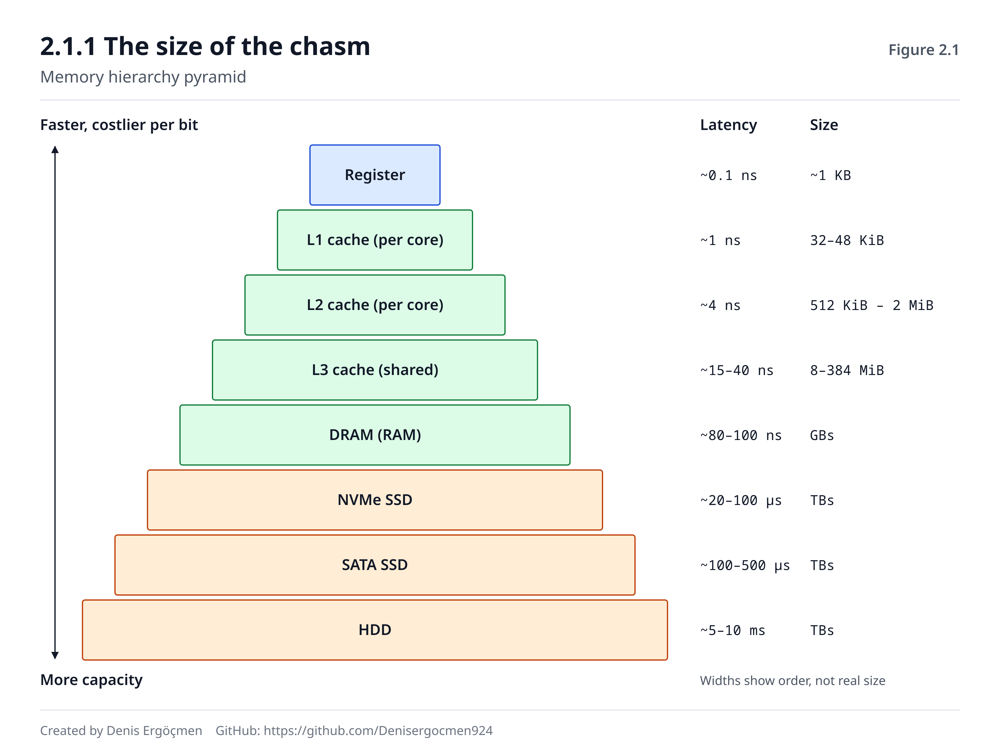
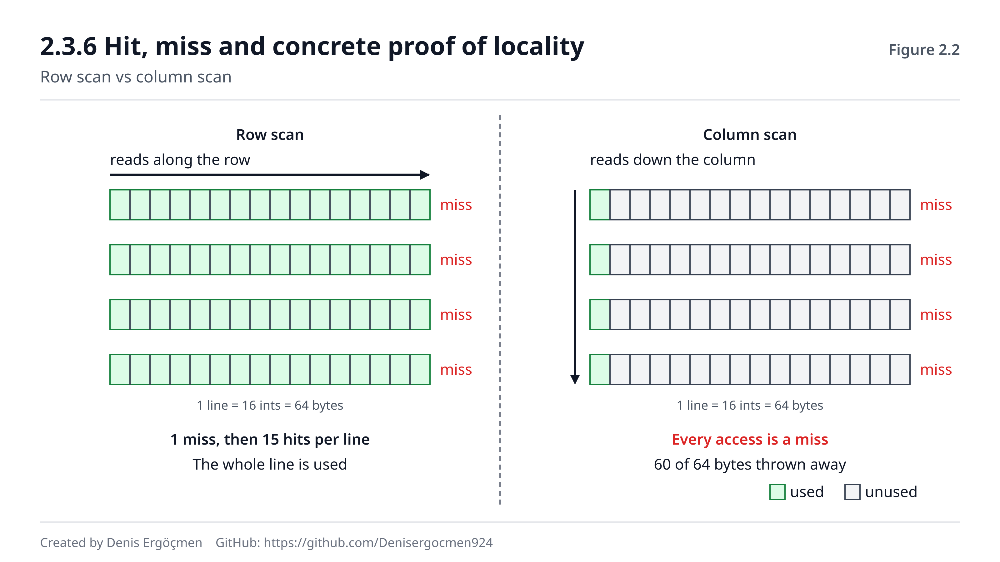

# Phase 2 — Memory Hierarchy

> **Navigation:** [◀ Phase 1 — CPU Architecture](Phase_1_CPU_Architecture.md) · **Phase 2** · [Phase 3 — Storage ▶](Phase_3_Storage.md)

---

> ### ⚠️ This is the most critical phase of the map. Don't rush.
>
> Other phases teach a topic. This phase teaches a **way of thinking**: *the speed–capacity–cost
> triangle*. Almost every architecture decision in the cloud is a reflection of this triangle —
> choosing an instance family, an EBS type, using a CDN, putting Redis in front, designing
> database indexes, even drawing microservice boundaries.
>
> If you pass through this phase superficially, the later phases remain "information". If you
> internalize it, they become **intuition**.

---

## Where we are coming from

Throughout Phase 1 we hit the same wall again and again:

| Where | What we saw |
|---|---|
| 1.2.3 | DRAM access takes ~250 clock cycles |
| 1.3.2 | On memory-heavy workloads IPC drops to 0.2–0.7 |
| 1.4 | The pipeline tries to *hide* the waiting but doesn't solve it |
| 1.5.2 | SMT tries to fill the gap by running another thread while waiting |

All of these were attempts to work around the same problem. **This phase attacks the problem
itself.**

## By the end of this phase

- You will know why the 64-byte cache line is one of the most important numbers in the world
- You will be able to explain why one of two loops that read the same data the same number of
  times can be **10× slower**
- You will be able to explain the **mechanism** of the noisy neighbor (not just its name)
- You will be able to draw, step by step, the path from a virtual address to a physical address
- You will know why swap is dangerous in production and how the OOM Killer decides
- You will see why NUMA silently eats performance on large instances

## Phase map

| Section | Topic | Depth | Why it is here |
|---|---|---|---|
| 2.1 | Why a hierarchy exists | `[mechanism]` | The triangle itself |
| 2.2 | Register | `[concept]` | The top of the hierarchy |
| 2.3 | **Cache (L1/L2/L3)** | `[mechanism]` | **The heart of the phase — the longest section** |
| 2.4 | RAM / DRAM | `[concept]` / `[application]` | Bandwidth and memory-optimized families |
| 2.5 | Virtual memory | `[mechanism]` | Address translation, TLB, huge pages |
| 2.6 | Swap | `[mechanism]` | The most insidious performance killer in production |
| 2.7 | NUMA | `[mechanism]` / `[application]` | The hidden tax of large instances |

---
---

# 2.1 Why a Hierarchy Exists

## 2.1.1 The size of the chasm `[mechanism]`

In Phase 0.4.4 we learned the physical difference between SRAM and DRAM. Now let's look at the
consequence of that difference in numbers.

**The full latency ladder** (assuming a 3 GHz CPU, approximate values — they vary by generation):

| Level | Latency | Clock cycles | Typical size |
|---|---|---|---|
| **Register** | ~0.1 ns | ~0 (same cycle) | ~1 KB |
| **L1 cache** | ~1 ns | 4–5 | 32–48 KiB / core |
| **L2 cache** | ~4 ns | 12–20 | 512 KiB – 2 MiB / core |
| **L3 cache** | ~15–40 ns | 40–120 | 8–384 MiB (shared) |
| **DRAM (RAM)** | ~80–100 ns | 240–300 | GBs |
| **NVMe SSD** | ~20–100 µs | ~60,000–300,000 | TBs |
| **SATA SSD** | ~100–500 µs | ~300,000–1,500,000 | TBs |
| **HDD** | ~5–10 ms | ~15,000,000–30,000,000 | TBs |
| **Same-AZ network round trip** | ~0.25–0.5 ms | ~750,000–1,500,000 | — |
| **Intercontinental network** | ~70–150 ms | ~200,000,000+ | — |

**Let's translate this table to human scale once.** Take register access as **1 second**:

| Level | On a human scale |
|---|---|
| Register | 1 second |
| L1 cache | 10 seconds |
| L2 cache | 40 seconds |
| L3 cache | 3–7 minutes |
| **DRAM** | **~15 minutes** |
| NVMe SSD | **~3–14 hours** |
| HDD | **~2–4 months** |
| Intercontinental network | **~2–5 years** |

> **You don't need to memorize this table — but internalize the sense of scale.** One of the most
> valuable intuitions in a cloud engineer's head is this:
>
> Each of the **cache → RAM → disk → network** transitions is **many times** more expensive than
> the previous one. Going down one layer doesn't mean "a bit slower"; it means "a different
> world".
>
> When working out why a query takes 200 ms, being able to count how many times each layer was
> visited is half the diagnosis.


*Figure 2.1 — The speed, capacity and cost pyramid. Going up, speed and cost per bit increase and
capacity decreases.*

## 2.1.2 The "memory wall" — a growing chasm `[concept]`

The real problem isn't the size of the chasm but its **rate of growth**.

Roughly from 1980 to 2005:
- CPU speed increased ~50% per year
- DRAM latency improved ~7% per year

The result: the gap widened over the years. In 1980 a DRAM access was a few CPU cycles; today it
is **hundreds**.

This phenomenon is called the **"memory wall"**.

**Why didn't DRAM latency improve?** Because DRAM's slowness isn't engineering laziness but a
**physical constraint**: recall from Phase 0.4.4 — reading DRAM means measuring and amplifying the
tiny charge of a capacitor. This is an analog operation and hard to scale.

**What did improve?** **Bandwidth** (throughput). DDR generations barely lowered latency, but they
multiplied the amount of data transferred per second.

> **And this is the third time this distinction has come up in the map:** *latency* and
> *throughput* are different things and usually improve in different directions.
>
> - In Phase 1.4.1: the pipeline increased throughput, not latency
> - Here: DDR generations increased bandwidth, not latency
> - In Phase 3.4: the IOPS vs throughput distinction
> - In Phase 5.3: the bandwidth vs latency distinction
>
> **Make this distinction automatic.** When you hear a performance claim, let your first question
> be: "Is this a latency claim or a throughput claim?"

## 2.1.3 What makes the hierarchy possible: locality `[mechanism]`

Now the critical question: **how does a small fast memory (cache) actually help?**

If a program accessed random places in memory, a 32 KiB L1 cache would be useless in a 16 GiB
memory space — the hit probability would be less than one in a thousand.

**But programs don't access memory randomly.** They exhibit two strong patterns:

### Temporal locality

> *If you access a piece of data now, you are likely to access it again in the near future.*

Examples: a loop counter, the code of a frequently called function, a configuration object, a hot
database page.

### Spatial locality

> *If you accessed an address, you are likely to access neighboring addresses too.*

Examples: walking array elements in order, reading the fields of a struct, code executing
sequentially.

**These two patterns make cache possible.** The entire design of a cache rests on these two
assumptions:

| Pattern | The cache's response |
|---|---|
| Temporal locality | **Keep** data after using it (don't throw it away immediately) |
| Spatial locality | Don't fetch a single byte — **fetch a block together with its neighbors** |

From the second item comes the concept of the **cache line** — and it is the most practical
concept in this phase.

> **⚠️ The most important consequence of this, and one of the key sentences of this map:**
>
> **A cache is not "fast memory". A cache is a bet about the program's behavior.** It bets that the
> program will exhibit locality. If the program honors the bet, the cache works brilliantly; if it
> doesn't, the cache is nearly useless.
>
> That's why **there can be a 10× performance difference between two programs doing the same work
> on the same hardware.** The difference isn't in the hardware but in whether the program respects
> locality. In Phase 2.3.6 we'll see this with concrete code.

> **🤔 Think 2.1**
> Putting a cache layer such as Redis or Memcached in front speeds up database queries. Putting a
> CDN in front speeds up static content. The browser cache speeds up page loads.
>
> What is the **conceptual** difference between these three and the CPU's L1/L2/L3 cache? And which
> two assumptions do all three rely on to work?
> *(Answer: at the end of the phase)*

---

# 2.2 Register — The Top of the Hierarchy `[concept]`

We covered it in detail in Phase 1.1.2; here we only place it within the hierarchy.

| Property | Value |
|---|---|
| Access time | Effectively zero — within the same clock cycle |
| Capacity | 16 × 8 bytes = **128 bytes** on x86-64 (general purpose) |
| Management | Managed by the **compiler**, not the hardware |
| Physical material | An array of flip-flops (Phase 0.4.3) |

**The single property that separates it from every other level of the hierarchy:** registers are
**explicitly addressed by software.** The compiler decides which value will live in which
register. None of the cache levels are like this — they are managed **transparently by the
hardware**; the program runs without even knowing the cache exists.

> **This distinction matters.** There is no such thing as "how do I program the cache?" You can't
> control the cache directly — but you can influence its behavior dramatically **by changing your
> access pattern.** All of Phase 2.3.6 is about this indirect control.

**Register spilling.** When 16 registers aren't enough, the compiler moves some values to memory
(actually to the stack, which in practice means L1 cache). This is called a **spill**. That's why
ARM64's 31 registers are a real advantage: fewer spills, less memory traffic (Phase 1.6.2).

---
---

# 2.3 Cache — L1, L2, L3

**This section is the heart of the phase and the longest section of the map.** Most of the
performance differences you can't explain in the cloud are hidden here.

## 2.3.1 Why levels instead of a single cache? `[mechanism]`

We know from Phase 0.4.4: SRAM is fast but expensive and takes up space. So why don't we build one
medium-sized cache instead of three levels?

Because **SRAM's speed is also inversely proportional to its size.** This comes from three
reasons:

1. **Physical distance.** We calculated it in Phase 1.3.1: at 3 GHz a signal travels ~5–7 cm in
   one cycle. A large cache takes up more space on the chip, so data comes from farther away.
2. **Address decoding.** The larger the cache, the deeper the comparison and multiplexer tree
   needed to find the right line in it (the same argument as the register file in Phase 1.1.2).
3. **Power.** A large SRAM burns energy continuously; more lines are driven on every access.

**So the choice is:** either small and very fast, or large and slower. You can't have both.

**The solution: take both — as separate levels.**

```
           small, very fast, attached to the core
    L1  ←  32-48 KiB,  4-5 cycles
     ↓
    L2  ←  512 KiB - 2 MiB,  12-20 cycles
     ↓
    L3  ←  8-384 MiB,  40-120 cycles,  shared by ALL cores
     ↓
   DRAM ←  GBs,  240-300 cycles
           large, slow, cheap
```

Each level behaves like the **cache** of the level below it. When looking for data, L1 is checked
first; if not there, L2; if not there, L3; if not there, DRAM — and on the way back a copy is left
at each level.

## 2.3.2 L1 Cache `[mechanism]`

| Property | Typical value |
|---|---|
| Size | 32–48 KiB **data** + 32 KiB **instructions** (separate!) |
| Latency | 4–5 cycles (~1 ns) |
| Ownership | **Private to each physical core** |
| SMT | The two threads on the same core **share** it |

**Why are the data and instruction caches separate?** (L1d and L1i)

Because in the pipeline from Phase 1.2.1, the `IF` (instruction fetch) and `MEM` (data access)
stages run **in the same cycle**. With a single cache, there would be a structural hazard
(Phase 1.4.2) every cycle. Separating them removes the conflict.

This design is called the **Harvard architecture** — but only at the cache level. From L2 down it
is unified, because there's no conflict pressure there.

> **Why has L1's size stayed almost the same for 20 years?** It was ~32 KiB in 2005 and is
> ~32–48 KiB today. The reason: L1 must remain accessible within 4 cycles. Make it bigger and you
> lose that guarantee. **L1's size is set not by capacity needs but by the latency budget.** As
> transistor budgets grew, L2 and L3 were enlarged instead of L1.

## 2.3.3 L2 Cache `[mechanism]`

| Property | Typical value |
|---|---|
| Size | 512 KiB – 2 MiB (upper end on server CPUs) |
| Latency | 12–20 cycles (~4 ns) |
| Ownership | Usually **private to each core** (in some older designs two cores shared it) |
| Contents | Instructions + data together (unified) |

L2 is the second line of defense, catching what L1 misses. It is ~4× slower than L1 but ~20–50×
larger.

**On server CPUs, L2 has grown noticeably in recent years** (2 MiB per core on Intel Sapphire
Rapids). The reason: as contention on L3 increased in many-core servers, finishing the work close
to the core became more valuable.

## 2.3.4 L3 Cache — the cloud's center of attention `[mechanism]`

| Property | Typical value |
|---|---|
| Size | 8–32 MiB (desktop) · **32–384 MiB (server)** |
| Latency | 40–120 cycles (~15–40 ns) |
| Ownership | **Shared by ALL cores** |
| Other name | LLC (Last Level Cache) |

**That L3 is shared is the most important fact of this section from a cloud perspective.**

Sharing has two faces:

**The benefit:** data sharing between cores gets faster. One core can read data produced by
another from L3 without going to DRAM. For multi-threaded applications this is a big gain.

**The harm:** **contention.** L3 is a fixed-size resource and the cores share it. If one core walks
through a large data set, it fills L3 with its own data and **evicts the other cores' data.**

> **And this is the mechanism of the noisy neighbor.**
>
> In the cloud, "noisy neighbor" is a term used often but rarely explained. Its mechanism is
> exactly this: **another tenant's instance on the same physical server shares the same L3 cache
> as your instance.** When that tenant runs a memory-heavy job, your data gets evicted from L3.
> Your application, with no code change and no load change, **suddenly slows down.**
>
> And the most insidious part: **you can't see it in your own metrics.** Your CPU usage is normal,
> memory usage is normal, disk is normal, network is normal. Only your latency went up. We'll open
> this topic fully in Phase 7.4.

**Cloud connection `[application]`:** that's why instance families with a large L3 (for example
some members of the `x` and `r` families, and newer generations of the `c` family) perform
disproportionately well on workloads whose working set fits in cache. And that's why **making an
instance bigger sometimes speeds it up more than expected**: you get not only more cores but also a
larger share of L3 per core.

> **🔧 See it on your machine** (optional)
>
> ```bash
> lscpu | grep -i cache
> ```
> **Expected output (example):**
> ```
> L1d cache:    192 KiB (4 instances)   ← 4 cores × 48 KiB
> L1i cache:    128 KiB (4 instances)
> L2 cache:     5 MiB   (4 instances)   ← 1.25 MiB per core
> L3 cache:     12 MiB  (1 instance)    ← SINGLE instance = shared
> ```
> `(1 instance)` is direct proof that L3 is shared.
>
> A more detailed view:
> ```bash
> cat /sys/devices/system/cpu/cpu0/cache/index*/{level,type,size,shared_cpu_list} 2>/dev/null
> ```
> `shared_cpu_list` shows which CPUs share each cache level — usually one or two CPUs (an SMT pair)
> for L1/L2, and all of them for L3.

## 2.3.5 The cache line — 64 bytes `[mechanism]`

**This is the most practical concept in this phase. If a cloud engineer had to know just one cache
detail, it would be this one.**

The CPU **never reads a single byte** from memory. The smallest unit of transfer is a **cache
line**, and on x86-64 and most ARM64 CPUs it is **64 bytes**.

```c
char data[1000];
char x = data[0];     // You asked for a single byte...
                      // ...but the CPU fetched data[0] through data[63].
```

**Why?** Two reasons, both based on spatial locality from Phase 2.1.3:

1. **You're likely to access neighboring data** — take what comes for free
2. **Reading from DRAM is expensive anyway** — making the ~250-cycle trip for 1 byte is wasteful;
   fetching 64 bytes on the same trip costs almost the same (DRAM has plenty of bandwidth, but its
   latency is expensive — we'll see this in 2.4)

### Consequence 1: sequential access is many times faster than random access

```
Sequential walk (array):
  data[0] read  → cache miss → 64 bytes arrive (data[0..63])
  data[1] read  → CACHE HIT  ✓
  data[2] read  → CACHE HIT  ✓
  ...
  data[63] read → CACHE HIT  ✓
  data[64] read → cache miss → new line

  → 1 miss in 64 accesses.  Hit rate: 98.4%

Random walk (linked list, hash table):
  Every access is on a different line → every access misses
  → Hit rate: ~0%
```

**The same amount of data was read. The performance difference is 10–50×.**

### Consequence 2: choosing a data structure is a performance decision

| Structure | Memory layout | Cache behavior |
|---|---|---|
| Array / `vector` / `slice` | Contiguous | **Excellent** — 64 useful bytes per line |
| Array of `struct`s | Contiguous | Good (if you use all the fields) |
| Linked list | Scattered, linked by pointers | **Disastrous** — each node on a separate line |
| Hash table | Random bucket access | Poor (depends on design) |
| Tree (BST) | Scattered | Poor |

> **This is where the assumption "Big-O tells you everything" collapses.** In theory, an O(n) array
> scan and an O(n) linked list scan are the same. In practice the array scan is **10× faster**,
> because it uses the cache line.
>
> On modern hardware **the memory access pattern is as decisive as algorithmic complexity.** That's
> why performance-critical libraries (database engines, game engines, numerical libraries) keep
> data as contiguous as possible.

### Consequence 3: alignment matters

If a data structure **crosses** a cache line boundary, reading it fetches two lines:

```
Line boundary:  |....64 bytes....|....64 bytes....|
Data (8 bytes):               [██|██]              ← spread over two lines!
                                                     2 cache accesses
```

Compilers usually handle this automatically. But when you build a manual memory layout or design
shared data structures, you need to be aware of it — especially for the false sharing problem in
2.3.8.

> **🤔 Think 2.2**
> You define a `struct`:
> ```c
> struct User {
>     char  name[56];   // 56 bytes
>     int   id;         //  4 bytes
>     int   age;        //  4 bytes
> };                    // 64 bytes total
> ```
> You have an array of 1 million of these structs, and your program wants to scan **only the `id`
> fields** (for example, for a lookup).
>
> a) During this scan, how much useful data comes into the cache, and how much is waste?
> b) How would you change the structure to keep the same data cache-friendly?
> *(Answer: at the end of the phase)*

## 2.3.6 Hit, miss and concrete proof of locality `[mechanism]`

**Cache hit:** the requested data was found in the cache.
**Cache miss:** it wasn't found; the lookup went down a level.

### Types of miss (the three Cs)

| Type | Cause | Remedy |
|---|---|---|
| **Compulsory** | The data is accessed for the first time; it couldn't have been in cache | Prefetching (2.3.9) |
| **Capacity** | The working set is larger than the cache | Shrink the working set or get a larger cache |
| **Conflict** | There is room in the cache but that data doesn't fit in its set | Change the access pattern/alignment (2.3.7) |

### The real effect of the hit rate — and the number will surprise you

Let's compute the average access time. Say an L1 hit is 1 ns and a miss goes to DRAM at 100 ns:

```
Hit rate 90%:   0.90 × 1 ns + 0.10 × 100 ns = 10.9 ns
Hit rate 95%:   0.95 × 1 ns + 0.05 × 100 ns =  5.95 ns
Hit rate 99%:   0.99 × 1 ns + 0.01 × 100 ns =  1.99 ns
Hit rate 99.9%: 0.999 × 1 ns + 0.001 × 100 ns = 1.10 ns
```

**Going from 90% to 99% makes the average access 5.5× faster.**

> The same math as the branch prediction calculation in Phase 1.4.2: **reducing the rate of rare
> but expensive events gives a disproportionate gain.** A 9-point improvement brings a 450% speedup.
> It's counter-intuitive but holds everywhere in the cloud: lowering p99 latency is far more
> valuable than lowering the average.

### Concrete proof: two loops doing the same work

Let's sum a two-dimensional matrix. In C, matrices are stored **row-major**: `m[0][0], m[0][1],
m[0][2], ...` are contiguous in memory.

```c
#define N 4096
int m[N][N];   // 64 MiB

// A) Walk row by row — in memory order
long sum = 0;
for (int i = 0; i < N; i++)
    for (int j = 0; j < N; j++)
        sum += m[i][j];

// B) Walk column by column — jumping around in memory
long sum = 0;
for (int j = 0; j < N; j++)
    for (int i = 0; i < N; i++)
        sum += m[i][j];
```

**Both loops read exactly the same 16,777,216 elements. They perform the same number of additions.
The Big-O is the same: O(N²).**

But:

```
A) Row by row:
   m[i][0] read → miss → 64 bytes arrive = 16 ints (m[i][0..15])
   The next 15 accesses HIT
   → 1 miss in 16 accesses

B) Column by column:
   m[0][j] read → miss → 64 bytes arrive (m[0][j..j+15])
   Next access m[1][j] → 16 KB away → DIFFERENT LINE → miss
   → Every access misses
   And 60 of the 64 bytes fetched are thrown away unused
```

**Measured difference: typically 5–15×.** Same hardware, same algorithm, same data.


*Figure 2.2 — On the left, the row scan uses the entire fetched cache line; on the right, the column
scan uses only 4 bytes of each line and discards the rest.*

> **🔧 See it on your machine** (optional — doing this experiment once is strongly recommended)
>
> ```bash
> cat > /tmp/cache_test.c <<'EOF'
> #include <stdio.h>
> #include <stdlib.h>
> #include <time.h>
> #define N 4096
> static int m[N][N];
> int main(void) {
>     struct timespec a, b;
>     long t = 0;
>     clock_gettime(CLOCK_MONOTONIC, &a);
>     for (int i = 0; i < N; i++) for (int j = 0; j < N; j++) t += m[i][j];
>     clock_gettime(CLOCK_MONOTONIC, &b);
>     printf("Row order    : %.3f s (sum=%ld)\n",
>            (b.tv_sec-a.tv_sec)+(b.tv_nsec-a.tv_nsec)/1e9, t);
>     t = 0;
>     clock_gettime(CLOCK_MONOTONIC, &a);
>     for (int j = 0; j < N; j++) for (int i = 0; i < N; i++) t += m[i][j];
>     clock_gettime(CLOCK_MONOTONIC, &b);
>     printf("Column order : %.3f s (sum=%ld)\n",
>            (b.tv_sec-a.tv_sec)+(b.tv_nsec-a.tv_nsec)/1e9, t);
>     return 0;
> }
> EOF
> gcc -O1 -o /tmp/cache_test /tmp/cache_test.c && /tmp/cache_test
> ```
> **Expected output:** the column-order scan is **5–15× slower** than the row-order scan.
>
> *Note: if you compile with `-O2` or `-O3`, the compiler may rearrange the loops and close the gap
> — that's why we use `-O1`. "The compiler already handles it" isn't always true; in complex
> real-world code it usually can't.*
>
> If you want to count cache misses directly (on bare metal or in an environment with PMU access):
> ```bash
> perf stat -e cache-misses,cache-references /tmp/cache_test
> ```

**Cloud connection `[application]`:** this 10× difference is a gain no instance upgrade can give
you. Even going from `c7i.large` to `c7i.16xlarge` won't make a single-threaded job 10× faster.

> **And the architectural lesson from this:** in a performance problem the order should be:
>
> 1. **Access pattern / algorithm** — free, 10–100× gain potential
> 2. **Configuration** (thread count, pool size, cache layer) — cheap, 2–10×
> 3. **Instance upgrade** — expensive, typically 1.5–3×
>
> In the industry this order is often run **in reverse**: the instance gets upgraded first. In
> Phase 7.5 we'll build this reflex systematically.

## 2.3.7 Associativity `[concept]`

This topic is at the `[concept]` level — knowing the mechanism is enough; don't go into the
details.

**Question:** a cache line arriving from memory — **where** in the cache will it be placed?

Three approaches:

| Design | How | Pros / cons |
|---|---|---|
| **Direct-mapped** | Each address has exactly one place | Simple and fast; but many conflicts |
| **Fully associative** | Can be placed anywhere | No conflicts; but lookup is expensive |
| **N-way set associative** | The address determines a "set"; there are N slots in the set | **The practical balance — real CPUs use this** |

Typical on modern CPUs: L1 8-way, L2 8–16-way, L3 12–16-way.

**When does it concern you?** Rarely, but in one case it really does:

**Cache thrashing.** If your access pattern consists of addresses that always fall into the same
set (for example, walking an array with a power-of-two stride), you get constant conflict misses
even though there is plenty of room in the cache.

```c
// N = 4096 (a power of two) → in a column scan, addresses may keep landing in the same set
// Making N = 4097 (padding) spreads the conflicts and can noticeably increase speed
```

This is a known trick in high-performance numerical code (and it's why you see "odd" sizes like
`4104` instead of `4096`). You won't run into it in everyday cloud work; **know it exists, don't go
into the details.**

## 2.3.8 Cache coherence and false sharing `[concept]`

### The problem

Each core has its own L1. The same memory address can be present in the L1 of two different cores
at once. If one modifies it, the other's copy becomes **stale.**

This is unacceptable — from the program's point of view, memory must be single and consistent.

### The solution: the MESI protocol

The hardware gives each cache line a state label:

| State | Meaning |
|---|---|
| **M**odified | This core modified it; the copy in DRAM is stale; only I have it |
| **E**xclusive | Only I have it; I haven't modified it yet |
| **S**hared | Present in more than one core; all identical and clean |
| **I**nvalid | My copy is invalid and can't be used |

Cores listen to each other's cache operations (snooping) or coordinate through a central directory.
When a core wants to write a line, it marks the copies in the others as **Invalid**.

**The cost:** this coordination traffic isn't free. In multi-core systems, heavy writes to the same
data lead to **cache line ping-pong**: the line bounces back and forth between cores and
performance collapses.

### False sharing — the most insidious performance bug

Two threads write to **different variables**. Logically there's no sharing at all. But if those two
variables sit **in the same 64-byte cache line**, the hardware thinks they are shared.

```c
struct Counters {
    long thread_a_counter;   // offset 0
    long thread_b_counter;   // offset 8   ← in the SAME cache line!
};

// Thread A keeps incrementing thread_a_counter
// Thread B keeps incrementing thread_b_counter
// → The line keeps getting invalidated between the two cores
// → Every increment triggers a round of cache coherence
// → Can be SLOWER than the single-threaded version
```

**The solution: separate them with padding.**

```c
struct Counters {
    long thread_a_counter;
    char _pad[56];           // fill the rest of the line (8 + 56 = 64)
    long thread_b_counter;
};
// Now the two variables are on separate cache lines → no conflict
```

> **This is one of the most common and hardest-to-diagnose causes of the complaint "I parallelized
> it but it didn't get faster."** The code is correct, the locks are correct, the algorithm is
> parallel — but at the hardware level the threads are strangling each other.
>
> Annotations like `alignas(64)`, `__attribute__((aligned(64)))` or `@Contended` in Java exist in
> high-performance libraries for exactly this. When you see them, you now know what they're for.

**Cloud connection:** as the core count grows, the cost of false sharing **grows** (more cores =
more invalidation traffic). So moving to a 64-vCPU instance can **slow down** an application that
has false sharing. One of the places where the assumption "a bigger instance is always faster"
collapses.

## 2.3.9 Prefetching `[concept]`

The remedy for compulsory misses (first access) is to fetch data **before it's requested**.

**Hardware prefetcher:** the CPU watches the memory access pattern. If it detects a regular step
(stride), it starts fetching the next lines on its own.

- Sequential scan → the prefetcher works perfectly; misses drop to almost zero
- Fixed-stride scan (`i += 4`) → usually caught
- Random access (linked list, hash) → **can't be caught**

> **This makes the advantage of sequential access even bigger.** The 10× difference in 2.3.6 comes
> not only from cache line usage but **also from the prefetcher working on one pattern and not on
> the other.**
>
> It also explains why pointer-based data structures (linked lists, trees) perform much worse than
> expected on modern hardware: they not only take cache misses, they also get no help at all from
> the prefetcher. The term "pointer chasing" describes this situation.

There is also **software prefetch** (`__builtin_prefetch`), but it's rarely needed and misuse
hurts. Know it at the awareness level.

---

# 2.4 RAM / DRAM — Main Memory

## 2.4.1 How DRAM works `[concept]`

We built it in Phase 0.4.4: a DRAM cell is **1 transistor + 1 capacitor**. If the capacitor holds
charge it's 1; if not, 0.

Capacitors **leak.** The charge is lost within a few milliseconds. That's why DRAM needs constant
**refresh**: every cell is read and written back tens of thousands of times per second.

This has three consequences:

1. **This is where the name comes from** — Dynamic RAM. SRAM is Static: as long as it's powered it
   holds its state by itself, no refresh needed.
2. **That region is inaccessible during refresh.** This contributes to the variability of DRAM
   latency.
3. **Everything is lost when power is cut.** DRAM is **volatile.** This is the reason storage in
   Phase 3 exists.

## 2.4.2 DRAM organization and the source of latency `[mechanism]`

Accessing DRAM isn't a one-step job. There is a layered addressing structure:

```
DIMM (the stick you plug in)
 └─ Rank (a side/group of the stick)
     └─ Bank (a section that can operate in parallel)
         └─ Row (thousands of cells)
             └─ Column (the data you want)
```

A read proceeds like this:

1. **RAS** (Row Address Strobe) — the row is selected and the entire row is opened into a "row
   buffer". This is a **destructive** read: the cells are drained and written back from the buffer.
2. **CAS** (Column Address Strobe) — the requested column is read from the buffer.
3. **Precharge** — to move to another row, the buffer is closed and the lines are prepared.

**Critical observation:** if the next access is **in the same row**, only step 2 is performed — this
is called a **row hit** and it's very fast. If it's in a different row, steps 3+1+2 are all needed —
a **row miss**, many times slower.

> **And this repeats the cache line story at the DRAM level.** Sequential access produces row hits;
> random access produces row misses. So the reward for spatial locality is paid **twice**: once at
> the cache level and once at the DRAM level.

**CAS Latency (CL)** — numbers like `CL16` or `CL40` you see on RAM product pages are the duration of
step 2, in cycles. But careful: **the cycle time varies by generation.**

```
DDR4-3200 CL16  → 16 × (1/1600 MHz) = 10.0 ns
DDR5-6000 CL40  → 40 × (1/3000 MHz) = 13.3 ns   ← higher CL, but...
```

Here is the most important fact about DRAM:

> **DDR generations multiplied bandwidth but barely improved latency at all.**
>
> ```
> DDR3 (2007):  ~13 ns latency,  ~12 GB/s
> DDR4 (2014):  ~13 ns latency,  ~25 GB/s
> DDR5 (2020):  ~13 ns latency,  ~50 GB/s
> ```
>
> This is the numerical proof of the **memory wall** from 2.1.2. Physics limits latency (the
> capacitor's discharge time, signal travel); parallelism, however, allows bandwidth to grow.
> **Bandwidth can be bought; latency can't.**

## 2.4.3 Channels and bandwidth `[application]`

If you can't lower latency, build **parallelism**. In DRAM this is called a **channel.**

Each memory channel is a separate path between the CPU and RAM. 2 channels ≈ 2× bandwidth.

```
Single-channel DDR5-4800:   1 × 38.4 GB/s
Dual channel:               2 × 38.4 = 76.8 GB/s
Server (8-12 channels):     8 × 38.4 = 307 GB/s  ← EPYC/Xeon class
```

**Formula:**
```
Bandwidth = Transfer rate (MT/s) × 8 bytes × Number of channels
Example: 4800 MT/s × 8 × 8 channels = 307 GB/s
```

> **Why do server CPUs have so many channels?** Because 64 cores want memory at the same time. The
> same logic as in Phase 1.5: as the core count grows, **the shared resource becomes the
> bottleneck.** Without more channels, a 64-core CPU couldn't get any work done for waiting on
> memory.
>
> **Bandwidth per core** is a more meaningful measure than total bandwidth when evaluating server
> CPUs.

**Cloud connection `[application]`:** this is why on AWS an instance's **network and EBS bandwidth
grow in proportion to its size** — a larger instance gets a larger slice of the physical server,
and therefore a larger share of the memory channels too. Small instances are constrained in memory
bandwidth as well, not just in vCPUs.

## 2.4.4 ECC memory `[concept]`

DRAM cells can **flip bits on their own** because of cosmic rays, electrical noise or aging (bit
flip). It's rare but real: at large scale, it has been measured several times per server per year.

**ECC (Error Correcting Code)** memory keeps extra bits and:
- **Corrects single-bit errors** (silently, without the application noticing)
- **Detects double-bit errors** (can't correct them, but halts the system — it doesn't allow silent
  corruption)

> **The real value of ECC isn't correcting the error; it's preventing silent data corruption.** If a
> bit flips silently, corrupted data gets written to the database, backed up, replicated — and
> discovered weeks later. On a system without ECC there's no way to notice this error.

**Cloud connection:** **the servers of all serious cloud providers use ECC memory.** This is one of
the answers to "why is a cloud instance more expensive than my own desktop machine?" You don't
choose ECC; you get it anyway.

> **🤔 Think 2.3**
> You're choosing a database server. There are two options:
> - **A:** 32 vCPUs, 64 GiB RAM, dual-channel memory
> - **B:** 16 vCPUs, 64 GiB RAM, eight-channel memory
>
> Your workload: analytical queries that scan large tables (each query reads GBs of data from start
> to finish). Which would you choose, and why?
> *(Answer: at the end of the phase)*

---

# 2.5 Virtual Memory — Every Program's Own Universe

**This section is where the operating system and the hardware shake hands most tightly.** All the
memory management topics in the Linux map build on it.

## 2.5.1 The problem: why does virtual memory exist? `[concept]`

If programs used physical memory addresses directly, three problems would arise:

**1. Security.** Program A could read program B's memory. Two applications running on the same
server would see each other's data (and passwords).

**2. Isolation and crashes.** One program's bad pointer would corrupt another program's data. A
single bug would bring down the whole system.

**3. Placement.** Where a program will be loaded can't be known at compile time. Every program
couldn't say "I start at address 0x400000" — they would collide.

**The solution: give every program its own virtual address space.**

```
What program A sees:            What program B sees:
  0x0000...                       0x0000...
  ...                             ...
  0x7fff...  (its own universe)   0x7fff...  (its own universe)

Both use the address "0x400000" —
but they are translated to different physical addresses.
```

**A program never sees physical memory.** Every address it sees is virtual and is translated by the
hardware.

## 2.5.2 Pages and the page table `[mechanism]`

Translating byte by byte is impossible (the table would be larger than memory itself). Instead,
memory is divided into blocks called **pages**.

**Standard page size: 4 KiB.**

| Term | Meaning |
|---|---|
| **Page** | A 4 KiB block in virtual memory |
| **Page frame** | A 4 KiB block in physical memory |
| **Page table** | The virtual page → physical frame mapping |
| **MMU** | Memory Management Unit — the **hardware** unit that does the translation (inside the CPU) |

Translation works like this:

```
Virtual address (48 bits):
┌──────────────────────────┬────────────────┐
│  Page number (36 bits)   │ Offset (12 bits)│
└──────────────────────────┴────────────────┘
            ↓                        ↓
     look up the frame         copied as-is
     number in the page table  (4 KiB = 2^12)
            ↓                        ↓
┌──────────────────────────┬────────────────┐
│  Frame number            │ Offset         │
└──────────────────────────┴────────────────┘
Physical address
```

**Multi-level page table.** For a 48-bit address space a flat table would take 512 GiB — per
process. That's why the table is built as a **4-level tree** (PML4 → PDPT → PD → PT on x86-64). Only
the branches actually in use are kept in memory.

**But this has a price:** one translation needs **4 memory accesses**. So every memory access would
really be 5 accesses (4 table + 1 data). That's unacceptable.

## 2.5.3 TLB — the cache of translations `[mechanism]`

The **TLB (Translation Lookaside Buffer)** is a small, very fast cache that stores recently
performed virtual→physical translations.

| Property | Typical value |
|---|---|
| Number of entries | 64–1536 (depending on level) |
| TLB hit cost | ~0 cycles (built into the pipeline) |
| TLB miss cost | **10–100+ cycles** (page walk) |

> **The cleanest way to understand the TLB: the TLB is the page table's cache.** If the cache is the
> cache of data, the TLB is the cache of addresses. The same locality principles apply.

**TLB reach — a critical calculation:**

```
1536 entries × 4 KiB pages = 6 MiB
```

**So the TLB can keep only ~6 MiB of memory "cheap" at any one time.**

What if your application walks over 64 GiB of data? Almost every access is a TLB miss. And every TLB
miss means a 4-level page walk — and those table pages may not be in cache either.

**This is the reason for huge pages.**

## 2.5.4 Huge pages `[application]`

By increasing the page size, we widen the TLB's reach:

| Page size | Reach with 1536 entries |
|---|---|
| 4 KiB (standard) | 6 MiB |
| **2 MiB (huge page)** | **3 GiB** — a 512× increase |
| **1 GiB (gigantic page)** | **1.5 TiB** |

**Gains:**
- The TLB miss rate collapses
- The page table shrinks (less memory, better cache usage)
- Fewer page walk levels

**Costs:**
- **Internal fragmentation:** allocate a 2 MiB page and use 100 KiB, and 1.9 MiB is wasted
- Memory is managed at a coarser grain; finding huge pages in fragmented memory can get harder

**Who benefits:**

| Workload | Benefit |
|---|---|
| Databases (PostgreSQL, MySQL, Oracle) | **High** — large shared buffer pool |
| JVM (large heap) | **High** |
| In-memory cache (Redis, Memcached) | Medium–high |
| Scientific computing, ML | High |
| Web servers, small services | Low or negative |

> **🔧 See it on your machine** (optional)
> ```bash
> grep -i huge /proc/meminfo
> cat /sys/kernel/mm/transparent_hugepage/enabled
> ```
> **Expected output:**
> ```
> AnonHugePages:    212992 kB      ← handed out automatically by THP
> HugePages_Total:       0         ← reserved manually (explicit)
> Hugepagesize:       2048 kB      ← 2 MiB
>
> [always] madvise never           ← THP mode (square brackets = active)
> ```

> **THP (Transparent Huge Pages) warning — a trap you need to know about in production.** Linux tries
> to hand out huge pages automatically (THP). It's usually good, **but it's harmful for some
> databases:** THP's background compaction (defrag) causes unpredictable latency spikes. The MongoDB,
> Redis and Oracle documentation explicitly recommend disabling THP (`never` or `madvise`).
>
> This is the classic example of where the assumption "automatic optimization is always good"
> collapses: **a mechanism that improves average performance can ruin tail latency (p99).**

## 2.5.5 Page faults — tell the three types apart `[mechanism]`

A **page fault** is an access to a virtual page that has no counterpart in physical memory. The CPU
raises an interrupt (Phase 4.4) and the operating system takes over.

**There are three types, and mixing them up is a common mistake:**

| Type | What happens | Cost | Healthy? |
|---|---|---|---|
| **Minor fault** | The page is in memory but not mapped into this process (shared library, page cache, newly allocated zero page) | **~1–5 μs** | ✅ Completely normal, happens all the time |
| **Major fault** | The page must be read **from disk** (file mapping or swap) | **~50 μs – 10 ms** | ⚠️ Should be rare; many means a problem |
| **Invalid fault** | Invalid address → **segmentation fault** | — | ❌ Program bug |

> **This distinction is vital when reading metrics in production.** "High page fault count" means
> nothing on its own — a high minor fault count is the normal behavior of a healthy system. **The
> metric to watch is major faults.**

> **🔧 See it on your machine** (optional)
> ```bash
> ps -o min_flt,maj_flt,cmd -p $$
> ```
> **Expected output:**
> ```
>  MINFL  MAJFL CMD
>   4821      0 bash        ← thousands of minor, zero major = healthy
> ```
> System-wide:
> ```bash
> vmstat 1 3
> ```
> If the `si` (swap in) and `so` (swap out) columns stay above zero → the problem in 2.6.

---

# 2.6 Swap — The Most Insidious Performance Killer in Production

## 2.6.1 What swap is and why it exists `[concept]`

**Swap** is the operating system moving some memory pages **to disk** when physical memory runs
out. This lets programs use more memory than there is physical RAM.

Sounds great. But recall the ladder from 2.1.1:

```
DRAM access:          ~80 ns
NVMe SSD access:  ~80,000 ns     ← 1,000× slower
SATA SSD:        ~200,000 ns     ← 2,500×
HDD:           ~8,000,000 ns     ← 100,000×
```

**Accessing a page that has been swapped out is at least 1,000× more expensive than accessing RAM.**

## 2.6.2 Thrashing — the system's death spiral `[mechanism]`

The danger of swap isn't a single slow access. What's dangerous is the **feedback loop:**

```
  Memory fills up
       ↓
  The OS writes pages to swap
       ↓
  The program accesses that page again  ← because it was in active use
       ↓
  Major page fault — must be read from disk
       ↓
  To make room, ANOTHER page is written to swap
       ↓
  That page gets accessed too
       ↓
  ... the loop keeps going, accelerating
```

This is called **thrashing**. The symptoms:

| Symptom | What it looks like |
|---|---|
| CPU usage | **Low** (5–20%) — the CPU is constantly waiting on disk |
| I/O wait (`wa`) | **Very high** (50–90%) |
| Disk activity | Constantly heavy |
| Application response time | Up 10–1000× |
| Connecting over SSH | Can take minutes or time out |

> **The most dangerous part of thrashing: the system doesn't crash.** If it crashed, the health check
> would notice, the load balancer would cut traffic, auto scaling would launch a new instance. But a
> thrashing server **looks "up"** — it answers ping, the port is open, the process is running. It
> just does everything 100× slower.
>
> And in most architectures a slow server is **more harmful** than a dead one: it accepts requests,
> builds up a queue, timeouts spread, and it takes down dependent services too. In distributed
> systems this is known as a **"gray failure"**.

## 2.6.3 OOM Killer `[mechanism]`

If swap also fills up, Linux's **OOM Killer** (Out Of Memory Killer) steps in and **kills** a
process.

The choice is made using the `oom_score` given to each process. The score is high for processes that
use the most memory and have been running the longest.

> **The ironic consequence:** the OOM Killer usually kills **the most important process on the
> server.** Because the database or application server is, by definition, the process using the most
> memory.

**The symptom:** your application restarts "for no reason". There's no error in the application logs
— because the application didn't shut itself down; it was killed with `SIGKILL`, and not even its
shutdown handler ran.

> **🔧 See it on your machine** (optional)
> ```bash
> # Swap status
> free -h
> # OOM Killer history
> dmesg -T | grep -i -E "out of memory|killed process"
> # Which processes are using swap
> for p in /proc/[0-9]*; do
>   s=$(awk '/^VmSwap/{print $2}' $p/status 2>/dev/null)
>   [ -n "$s" ] && [ "$s" -gt 0 ] && echo "$s kB  $(cat $p/comm 2>/dev/null)"
> done | sort -rn | head
> ```
> **Expected output (healthy system):**
> ```
>                total   used   free  shared  buff/cache  available
> Mem:            15Gi  4.2Gi  2.1Gi   412Mi       9.1Gi       10Gi
> Swap:          2.0Gi     0B  2.0Gi      ← used = 0 : healthy
> ```
> If the `dmesg` output is empty, no OOM event has occurred — that's good news.

## 2.6.4 Swappiness `[application]`

`vm.swappiness` (0–200, default 60) tells the kernel: **under memory pressure, which do I prefer —
pushing anonymous pages to swap, or dropping page cache?**

| Value | Behavior | Suitable for |
|---|---|---|
| 0 | Almost never use swap (OOM risk increases) | Aggressive setting, use carefully |
| 1–10 | Only as a last resort | **Database servers** |
| 60 | Default balance | General purpose |
| 100+ | Aggressive swapping | Desktops, many idle applications |

```bash
cat /proc/sys/vm/swappiness        # read
sudo sysctl -w vm.swappiness=10    # set temporarily
```

> **Common misunderstanding:** "If I set swappiness=0, swap will never be used." No — if memory
> really runs out, the kernel will still use swap (or call the OOM Killer). Swappiness is a
> **preference weight**, not a prohibition.

## 2.6.5 Swap in the cloud: deliberately absent `[application]`

**Most cloud instances come without swap by default. This isn't an omission; it's a conscious design
decision.**

The logic is:

| With swap | Without swap |
|---|---|
| When memory runs out the system **slows down** | When memory runs out a process **dies** |
| Gray failure — hard to detect | Clear failure — easy to detect |
| Health check passes, keeps taking traffic | Health check fails, traffic is cut |
| Hours of ambiguous slowness | A new instance within seconds |

> **This philosophy is called "fail fast" and it is one of the fundamental principles of distributed
> systems:** **a fast, clear failure is preferred over a slow, ambiguous one** — because automation
> can react to a clear failure but not to ambiguous slowness.
>
> Kubernetes takes this principle further: for a long time it **required** swap to be disabled
> (`--fail-swap-on`). The reason is the same: for a pod's memory limit to be meaningful, something
> must actually happen when the limit is reached.

**Practical consequence:** in the cloud, the answer to memory management isn't "let me add swap". The
answer is:
- **Measure** and **limit** memory usage
- Choose the right-sized instance (memory-optimized `r`/`x` families)
- Find memory leaks; don't hide them

> **🤔 Think 2.4**
> On an application server, memory usage slowly grows (there is a memory leak) and the instance
> crashes every 6 days. Someone on the team says, "Let's add swap, then it won't crash."
>
> a) What happens if swap is added? Is the problem solved?
> b) What would you recommend, and why?
> *(Answer: at the end of the phase)*

---

# 2.7 NUMA — The Hidden Tax of Large Instances

## 2.7.1 The problem `[concept]`

So far we've talked about "memory" as a single, homogeneous resource. On small systems that's true.
On large servers **it isn't.**

If a server has 2 physical CPU sockets and 512 GiB of RAM, that RAM isn't a single pool: each socket
has **its own memory controller and its own attached RAM modules**.

```
┌─────────────────┐        ┌─────────────────┐
│   SOCKET 0      │◄──────►│   SOCKET 1      │
│   32 cores      │  UPI/  │   32 cores      │
│   L3 cache      │Infinity│   L3 cache      │
└────────┬────────┘  Fabric└────────┬────────┘
         │                          │
    ┌────▼────┐                ┌────▼────┐
    │ 256 GiB │                │ 256 GiB │
    │ (local) │                │ (local) │
    └─────────┘                └─────────┘
```

**NUMA = Non-Uniform Memory Access** — memory access time is **not uniform.**

| Access | Latency | Bandwidth |
|---|---|---|
| **Local** (its own socket's RAM) | ~80 ns | Full |
| **Remote** (the other socket's RAM) | **~140 ns (1.5–2×)** | Lower (the inter-socket link is limited) |

## 2.7.2 Consequences `[mechanism]`

**Why it matters:** if a thread runs on socket 0 but its data is in socket 1's RAM, **every memory
access costs 2×.** And this is completely invisible to the application.

Worse: the Linux scheduler can **move** a thread between sockets. The thread starts on socket 0 and
allocates its memory there, then gets moved to socket 1 — now all of its memory is remote.

**Linux's defense:** the **first-touch** policy. A page is allocated on the socket of the thread that
**first touches** it — not where it was allocated, but where it was first written.

> **This gives rise to a well-known trap:** if a program allocates and zeroes a large buffer with a
> single thread at startup, **all of that memory lands on one socket.** Then 64 threads try to use it
> in parallel, and half of them are constantly doing remote access.
>
> The right way: have the threads that will use the buffer **first-touch it in parallel.**

## 2.7.3 Cloud connection `[application]`

**When does it concern you?**

| Instance size | NUMA situation |
|---|---|
| Small/medium (`.large` – `.4xlarge`) | Single NUMA node — **doesn't concern you** |
| Large (`.12xlarge` and above, `metal`) | **Multiple NUMA nodes — concerns you** |

> **And from this comes the most practical cloud lesson of this phase:**
>
> **A single `.24xlarge` instance may not be faster than two `.12xlarge` instances** — on a
> NUMA-unaware application it may even be **slower.** Because the single large instance carries the
> NUMA boundary inside it and pays the penalty if the application doesn't manage it, while each of
> the two smaller instances stays within a single NUMA node.
>
> This is the hardware-level counterexample to the assumption "scaling up is always simpler and
> faster".

> **🔧 See it on your machine** (optional)
> ```bash
> lscpu | grep -i numa
> numactl --hardware 2>/dev/null || echo "numactl not installed"
> ```
> **Expected output (single-socket machine):**
> ```
> NUMA node(s):        1
> NUMA node0 CPU(s):   0-7        ← single node, no NUMA problem
> ```
> **On a large server:**
> ```
> NUMA node(s):        2
> NUMA node0 CPU(s):   0-31,64-95
> NUMA node1 CPU(s):   32-63,96-127
>
> node distances:
> node   0   1
>   0:  10  21          ← remote access costs ~2.1×
>   1:  21  10
> ```
> The `node distances` matrix is a direct measure of the NUMA penalty: 10 = local reference,
> 21 = remote.

**Tools for the fix (awareness level):**
```bash
numactl --cpunodebind=0 --membind=0 ./app   # pin to a single node
```
Databases and JVMs usually have their own NUMA awareness; turning on their settings is usually
enough.

---

# 2.8 When This Phase Breaks — Failure Signatures

The map's "When it breaks" axis. Each row is a symptom you'll see in production and the mechanism
behind it.

| Symptom | Likely mechanism | Where it was covered | First thing to check |
|---|---|---|---|
| CPU 100% but work doesn't finish, low IPC | Cache misses / memory waiting | 2.1.2, 2.3.6 | Access pattern, working set size |
| Intermittent slowdowns without code changes | Noisy neighbor — L3 contention | 2.3.4 | `steal time`, p99 deviation for the same job |
| Increased thread count, no speedup | False sharing or memory bandwidth saturation | 2.3.8, 2.4.3 | Shared counters/structures, padding |
| Moved to a bigger instance, got slower | NUMA remote access or increased coherence traffic | 2.7, 2.3.8 | `numactl --hardware`, thread pinning |
| CPU 10%, I/O wait 80%, everything frozen | **Thrashing** | 2.6.2 | `vmstat` si/so, `free -h` |
| Application died without writing anything to the logs | **OOM Killer** | 2.6.3 | `dmesg -T \| grep -i "killed process"` |
| Unpredictable latency spikes in the database | THP defrag | 2.5.4 | `transparent_hugepage/enabled` → `madvise` |
| Unexpected slowness on a large data set | TLB miss storm | 2.5.3 | Consider huge pages |
| `free` shows little "free", panic | Page cache — **normal** | 2.5.5 note | Look at the `available` column, not `free` |

> **The last row is especially important.** A low `free` column in `free -h` output isn't a problem:
> Linux uses free memory as page cache, because unused RAM is wasted RAM. The column you should look
> at is **`available`** — it shows the memory that can be given to applications when needed.

---

> **🤔 Think 2.5 — synthesis question**
> In this phase you saw four different "caches": the CPU cache (2.3), the TLB (2.3 / 2.5.3), the DRAM
> row buffer (2.4.2) and the page cache (2.6, 2.8).
>
> All four share a single common principle. What is it? And **when does this principle not work?**
> *(Answer: below)*

> **🤔 Think 2.6 — architecture decision**
> You're going to set up a Redis cache server. The data set is 50 GiB. Two options:
> - **A:** `r7g.2xlarge` (8 vCPUs, 64 GiB) — a single node
> - **B:** 4 × `r7g.large` (2 vCPUs, 16 GiB) — a sharded cluster, 64 GiB total
>
> Using what you learned in this phase, list the pros and cons of each option **from a hardware
> perspective.** (Set operational complexity aside; look only at memory physics.)
> *(Answer: below)*

---

# Phase 2 — Answers to the Think Questions

## Answer 2.1 — Redis/CDN/browser cache vs the CPU cache

**The common principle: all of them are a bet on the locality from 2.1.3.** All of them assume: *data
accessed recently will be accessed again (temporal locality), and neighboring data will be accessed
(spatial locality).*

And all of them have to answer the same three questions:
1. **What do I keep?** (placement policy)
2. **When space runs out, what do I throw away?** (eviction policy — LRU, LFU, random)
3. **What happens if the underlying data changes?** (consistency / invalidation)

**But there are critical differences:**

| Dimension | CPU cache | Redis / CDN |
|---|---|---|
| Who manages it | **The hardware** — invisible to software | **You** — you write explicit code |
| Consistency | Guaranteed by the hardware (MESI, 2.3.8) | **Your problem** — you have to write an invalidation strategy |
| Granularity | 64 bytes, fixed | Key-based, variable |
| Miss cost | ~100 ns | ~1–100 ms (10,000–1,000,000×) |
| Failure mode | Only slowdown | **Serving stale data** |

**The most important difference:** the CPU cache can't give a wrong result — the hardware guarantees
consistency. An application cache **can**, and one of the most famous hard problems in software
engineering (cache invalidation) comes from this.

> **The insight from this:** a cache isn't an architectural pattern; it is **a fundamental response
> that recurs at every layer of computer science** — whenever there are two levels with a speed
> difference, a cache goes in between. CPU↔DRAM, DRAM↔disk, disk↔network, application↔database,
> browser↔server. Same problem, same solution, different scale.

## Answer 2.2 — The 64-byte struct and scanning only `id`

**a) How much waste?**

The struct is exactly 64 bytes, i.e. **exactly one cache line.** You're reading only the `id` field
(4 bytes).

```
For each user:
  Fetched : 64 bytes (one full cache line)
  Used    :  4 bytes (id)
  Wasted  : 60 bytes

Useful utilization: 6.25%
```

For 1 million users:
```
Data moved  : 64 MB
Data needed :  4 MB
16× more memory traffic, 16× more cache lines occupied
```

Also: 1 million × 64 bytes = 64 MB, larger than a typical L3 cache (32 MB). So during the scan **all
of L3 is swept** — the program's other data is evicted too (cache pollution).

**b) How do you fix it? — the SoA transformation**

Organize the data as a **Struct of Arrays (SoA)** instead of an **Array of Structs (AoS)**:

```c
// BEFORE — AoS (Array of Structs)
struct User { char name[56]; int id; int age; };
struct User users[1000000];
// In memory: [name0 id0 age0][name1 id1 age1][name2 id2 age2]...

// AFTER — SoA (Struct of Arrays)
struct Users {
    char name[1000000][56];
    int  id[1000000];        ← all contiguous!
    int  age[1000000];
};
// In memory: [name0 name1 ...][id0 id1 id2 ...][age0 age1 ...]
```

Now the `id` scan:
```
One cache line = 64 bytes = 16 ids
Useful utilization: 100%     ← a 16× improvement
Total data scanned: 4 MB (instead of 64 MB)  ← fits comfortably in L3
```

On top of that, the prefetcher (2.3.9) works perfectly and SIMD instructions become usable too.

> **This transformation is a standard technique in high-performance systems.** It is **the same
> reason** columnar databases (ClickHouse, Parquet, Redshift) beat row-based databases by 10–100× on
> analytical queries: columnar storage is SoA at the disk and memory level.
>
> A nice example of the chain we've been building since Phase 0: a hardware detail like the *cache
> line* reaches all the way to an architecture decision like *which database you should choose*.

## Answer 2.3 — 32 vCPUs/dual channel or 16 vCPUs/eight channels?

**Answer: B (16 vCPUs, eight channels).**

**Rationale:**

The workload description is critical: *"analytical queries that scan large tables from start to
finish."* This is, by definition, a **memory-bandwidth-bound** workload:

- The data set doesn't fit in cache → the cache from 2.3 is nearly useless
- Access is sequential → every cache line is fully used, the prefetcher works
- So every core is **constantly pulling data from DRAM**

Let's compute the bandwidth (assuming DDR5-4800):

```
A: 2 channels × 38.4 GB/s = 76.8 GB/s  ÷ 32 vCPUs = 2.4 GB/s per vCPU
B: 8 channels × 38.4 GB/s = 307 GB/s   ÷ 16 vCPUs = 19.2 GB/s per vCPU
                                                    ↑ 8× more
```

**In option A, 32 cores compete to share a 76.8 GB/s pipe.** Doubling the core count gains nothing
here — the bottleneck isn't the cores, it's the pipe. The memory version of the logic in Phase 1.5.4:
**adding a resource doesn't help if the bottleneck isn't there.**

**When would you reverse this?** If the workload changes:
- The working set fits in L3 → bandwidth becomes unimportant, A is better
- The work is CPU-heavy (compression, encryption, computation) → A is better
- There are many small concurrent queries (OLTP) → A is better

> **The general lesson:** the question "how many vCPUs?" is incomplete on its own. The right
> question: **"Which resource is this workload's bottleneck?"** In the cloud, choosing an instance
> family (`c` = compute, `r` = memory, `m` = balanced, `i` = storage) is exactly the answer to this
> question. We'll systematize this in Phase 7.2.

## Answer 2.4 — Is swap a solution to a memory leak?

**a) What happens if swap is added?**

**The problem isn't solved; it turns into something worse.**

A leak, by definition, **keeps growing.** Swap only delays the crash:

```
Without swap:            With swap:
  6 days normal running    6 days normal running
  → crash (clear)          → swap usage begins
  → restarts               → 1-3 days of THRASHING (2.6.2)
  → back to normal         → application 100× slower but "up"
                           → eventually swap fills too
                           → OOM Killer (2.6.3) or crash
```

**What you're trading:** instead of a *short, clear* outage every 6 days, *days of ambiguous
slowness.* According to the table in 2.6.5, this is a **bad trade**:

- The health check can't catch thrashing → the broken instance keeps receiving traffic
- Timeouts propagate upward → dependent services break too
- Diagnosis gets harder: a crash shows up in `dmesg`; thrashing shows up only as "everything is slow"

**b) What would you recommend?**

A three-layer answer — and the order matters:

**1. Immediately (a band-aid, hours):**
- Put an **alarm** on memory usage (80% threshold) — the crash stops being a surprise
- Make automatic restarts **controlled**: at a low-traffic hour, as a rolling restart, draining
  traffic first. If a crash is going to happen, at least you choose when.
- Put a memory limit on the process (systemd `MemoryMax=`, a container limit) → prevent the OOM
  Killer from picking a random victim; only this process dies

**2. The real work (days):**
- **Find the leak.** Use a memory profiler (JVM: heap dump + MAT; Python: `tracemalloc`; Go: `pprof`;
  C/C++: `valgrind`, ASan)
- Is the leak graph linear or stepped? Is it proportional to load? That's the first clue about which
  code path it's in

**3. What you won't do:**
- Add swap
- Enlarge the instance — this also only delays it (12 days instead of 6); the leak continues

> **The general principle here:** swap **hides the symptom** of a memory leak; **it doesn't treat the
> disease.** And a hidden symptom is more dangerous than a visible one — because neither you nor your
> automation can react to it.
>
> This is a way of thinking that will come back in Phase 7: **no "solution" that reduces
> observability is a real solution.**

## Answer 2.5 — The common principle of the four caches and when it fails

**The common principle: the locality bet.**

| Cache | Cache of what | Its bet |
|---|---|---|
| CPU cache | DRAM data | Recently used data will be used again |
| TLB | Page table entries | A recently translated address will be translated again |
| DRAM row buffer | The active DRAM row | The next access will be in the same row |
| Page cache | Disk blocks | A file block that was read will be read again |

All four share the same structure: **a fast, small layer + a slow, large layer + a prediction based
on locality.**

**When does it fail? — Four scenarios:**

**1. When access is truly random.** Without locality the prediction doesn't hold. Random lookups in a
large hash table, cryptographic key generation, pointer chasing (2.3.9).

**2. When the working set is slightly larger than the cache — and this is the most annoying one.** If
the data set is slightly larger than the cache, a cyclic scan evicts everything on every pass: right
before each access, that data **has just been evicted.** The hit rate approaches 0% — worse than
**having no cache at all**, because you also pay for the eviction traffic.

> This is called **the pathological case of LRU** and it shows up often in real systems: data set
> 40 MB, L3 32 MB → performance no different from when the data set is 200 MB. But if you can bring
> the data set down to 30 MB, it gets **10× faster.** Performance responds to data size not linearly
> but in **steps**; the steps are at the cache boundaries.

**3. With streaming access.** If you read data once and never touch it again (log processing, backup,
ETL), the cache only takes up space and **evicts useful data.** That's why some systems offer "don't
cache this data" hints (`O_DIRECT`, `posix_fadvise`, non-temporal store instructions).

**4. With write-heavy, shared access.** The coherence traffic from 2.3.8 can turn the cache from a
gain into a loss.

> **And this is the most mature sentence you need to know about caches:** a cache isn't a guarantee;
> it's **a bet.** When the bet wins you gain 100×; when it loses you don't merely break even — you
> sometimes pay extra. That's why "let's add a cache" is never a decision to make without thinking;
> first you must ask what the **access pattern** is.

## Answer 2.6 — One big Redis or four small shards?

From the perspective of memory physics only:

**A — A single `r7g.2xlarge` (8 vCPUs, 64 GiB)**

*Pros:*
- **No network.** Zero inter-shard communication cost. On the ladder in 2.1.1, same-AZ network latency
  (~0.5 ms) is **6,000×** more expensive than DRAM (~80 ns) — don't underestimate the size of this
  saving.
- A single NUMA node (table in 2.7.3: `.2xlarge` is in the small class) → no remote-access penalty
- No cross-shard query problem

*Cons:*
- 50 GiB of data is **78%** of 64 GiB of RAM. With the operating system, Redis's own overhead and a
  fragmentation allowance, this is **a thin margin.** And according to 2.6.5 there's no swap in the
  cloud → if memory runs out, the OOM Killer.
- A single set of memory controllers → bandwidth limited to one instance's share
- Redis is largely single-threaded; most of the 8 vCPUs stay idle

**B — 4 × `r7g.large` (2 vCPUs, 16 GiB each)**

*Pros:*
- Each shard holds ~12.5 GiB of data, 78% of 16 GiB — but **the failure domain is split into 4.** If
  one shard bloats, only that one goes down.
- **4× the total memory bandwidth** (4 separate physical servers, 4 separate sets of memory
  controllers — 2.4.3)
- 4× the total network bandwidth (each instance gets its own NIC share — Phase 5)
- Each shard's working set is small → **higher** L3 hit rate (2.3.4). The step effect from Answer 2.5
  works **in your favor** here.
- Horizontally scalable: a 5th shard can be added

*Cons:*
- Each request adds one more network hop (client → the right shard)
- Cross-shard operations (multi-key, transactions) are hard or impossible
- A hot key can choke a single shard — unbalanced load

**The decision from a hardware perspective:**

| Usage pattern | Preference |
|---|---|
| Small, independent key accesses (a typical cache) | **B** — bandwidth and failure isolation win |
| Multi-key operations, Lua scripts, transactions | **A** — avoid the network hop and distributed coordination penalty |
| If the data will grow from 50 to 60 GiB | **B** — A has no margin |
| If p99 latency is critical | **B** — small working set, better cache behavior |

> **The real lesson of this question:** the answer to "a bigger instance or more instances?" isn't a
> matter of taste — **it depends on the workload's memory access pattern.** And understanding that
> pattern requires exactly what you learned in this phase.
>
> In Phase 7.3 and Phase 7.5 we'll fit this decision into a systematic framework.

---

# Phase 2 — Frequently Asked Questions

> **Q1: Does buying more RAM always improve performance?**
>
> No — and this is one of the most important corrections in this phase. The amount of RAM is a
> measure of **capacity**, not of speed. If your application already fits in memory and isn't using
> swap, adding RAM gains **nothing**.
>
> Adding RAM helps in these cases:
> - You're using swap (2.6) → a huge gain
> - The page cache is insufficient, lots of disk reads (Phase 3) → a good gain
> - The application splits its data set into chunks because of a memory limit → a good gain
>
> What determines speed is: the cache hit rate (2.3), memory bandwidth (2.4.3), the access pattern
> (2.3.6) and NUMA placement (2.7). None of these is directly related to the amount of RAM.

> **Q2: `free -h` says "only 2 GB free", but I have 16 GB of RAM. Is there a memory leak?**
>
> No, most likely the system is working **correctly**. Linux uses free memory as page cache — files
> that have been read are kept in memory. If an application requests memory, this cache is released
> instantly.
>
> The column you should look at is **`available`**:
> ```
>               total   used   free  shared  buff/cache  available
> Mem:           15Gi  4.2Gi  2.1Gi   412Mi       9.1Gi       10Gi
>                                                              ↑ look here
> ```
> `free` = 2.1 GiB but `available` = 10 GiB. The system is healthy.
>
> **"Unused RAM is wasted RAM"** is Linux's deliberate design philosophy.

> **Q3: Can I control the cache by hand? Can I pin my data to L1?**
>
> No. The CPU cache is **completely transparent to software** — you can neither see what's in it nor
> choose what goes in (this is its fundamental difference from registers in 2.2).
>
> You influence the cache **indirectly**:
> - By changing the access pattern (2.3.6) — the most powerful lever
> - By compacting the data structure (SoA in Answer 2.2)
> - By bringing the working set below the cache size (the step effect in Answer 2.5)
> - By giving prefetch hints (`__builtin_prefetch`) — rarely necessary
> - By bypassing the cache (non-temporal store) — for streaming workloads
>
> Some server CPUs have **cache partitioning** (Intel CAT), which can reserve a slice of L3 for one
> application. Cloud providers don't expose this to tenants; they use it in their own noisy neighbor
> controls.

> **Q4: Is L3 cache size something I should look at when choosing an instance?**
>
> Yes, but indirectly — because AWS doesn't advertise it. Still, it has two practical consequences:
>
> 1. **A bigger instance in the same family = a bigger share of L3.** `c7i.8xlarge` gives twice the
>    vCPUs of `c7i.4xlarge`, but its L3 share grows too. This is why scaling sometimes turns out
>    **better** than linear.
> 2. **A generation jump enlarges L3.** Moving from c6i to c7i brings a real gain even if clock speed
>    stays the same, because the cache and memory subsystem improved (similar logic to the Graviton
>    table in Phase 1.6.4).
>
> For the exact number you need to find out the CPU model (`lscpu`) and look at the manufacturer's
> page.

> **Q5: Is swap completely bad? Should I never use it?**
>
> It depends on the context:
>
> | Environment | Recommendation |
> |---|---|
> | Cloud server, production | **No swap** — fail fast (2.6.5) |
> | Kubernetes node | **No swap** — so limits are meaningful |
> | Desktop / development machine | **Swap** — idle applications can go to disk, no problem |
> | Memory-heavy batch job, latency unimportant | Swap may be reasonable |
>
> The distinction is: **swap is harmful anywhere latency matters.** A 2× slowdown is acceptable in a
> nightly batch job; it isn't on an API server.

> **Q6: Should I turn on huge pages everywhere? It looks like a free gain.**
>
> No. The gain is specific to **workloads under TLB pressure**: large, heavily accessed memory regions
> (a database buffer pool, a large JVM heap, scientific computing).
>
> The harms:
> - **Internal fragmentation** — memory waste on small allocations
> - **THP defrag latency** — the warning in 2.5.4; unpredictable pauses
> - Finding huge pages in fragmented memory gets harder, which also creates latency
>
> **Practical rule:** leave the default (`madvise`). If the application documentation explicitly asks
> for it (PostgreSQL, Oracle, a large JVM), reserve huge pages manually. For applications that
> explicitly reject THP, like MongoDB/Redis, set it to `never`. **Don't change it without measuring.**

> **Q7: What I learned in this phase looks like a software developer's job. Do I really need it as a
> cloud engineer?**
>
> Yes — but for a different reason. You **won't be doing** these optimizations; you'll **recognize**
> them.
>
> The real questions you'll face as a cloud engineer:
> - "The application is slow, should we upgrade the instance?" → **Where is the bottleneck?**
>   (Answer 2.3)
> - "We increased the thread count and it didn't get faster, why?" → false sharing or bandwidth
> - "The same code sometimes runs slowly" → noisy neighbor (2.3.4)
> - "The server is up but everything is frozen" → thrashing (2.6.2)
> - "The application dies silently" → OOM Killer (2.6.3)
> - "One big or many small?" → Answer 2.6
>
> You don't answer any of these questions by writing code. But **you can't give the right answer
> without knowing the mechanism** — and that is the difference between an engineer who works on the
> "upgrade the instance" reflex and an engineer who finds the bottleneck.

---

# Phase 2 — Test Yourself

Don't go back to the sections before writing your answers. The numbers of the questions you struggle
with point to the sections you need to repeat.

**Part A — Fundamentals (1–8)**

1. Why does the memory hierarchy exist? State the fundamental reason in one sentence.
2. How many bytes is a cache line, and why does this number matter?
3. Name three fundamental differences between L1, L2 and L3 (other than size).
4. Explain the difference between temporal and spatial locality with an example.
5. Why is the L1 cache split into data and instructions?
6. Why must DRAM be constantly refreshed? Why doesn't SRAM need to be?
7. Which three problems does virtual memory solve?
8. What is the difference between a minor page fault and a major page fault? Which one is a sign of a
   problem?

**Part B — Mechanism (9–15)**

9. Why does an array scan perform 10× differently from a linked list scan? Name three separate
   mechanisms.
10. What is false sharing, and why is it called "insidious"?
11. What is the TLB, what is it a cache of, and why do huge pages improve its performance?
12. Explain the thrashing feedback loop step by step.
13. What problem does the MESI protocol solve? What is its cost?
14. What is NUMA, and why doesn't it matter on small instances?
15. Why did latency stay almost constant across DDR generations while bandwidth multiplied?

**Part C — Application and reasoning (16–22)**

16. A server shows CPU at 100%, but work output is a quarter of what was expected. Which three causes
    from this phase would you list?
17. You increased an application from 8 threads to 32 threads, and performance **dropped.** What are
    the likely hardware causes?
18. Which column do you look at in `free -h` output, and why is the `free` column misleading?
19. Why don't cloud instances have swap by default? Name the principle behind this decision.
20. How do you tell that a workload is "memory-bandwidth-bound"? Which instance family would you
    choose?
21. A data set is 40 MB and the L3 cache is 32 MB. What is the performance effect of reducing the
    data set to 30 MB, and why is it not linear?
22. Explain the hardware-level mechanism of the noisy neighbor. Why can't you see it in your own
    metrics?

---

## Answer Key

**1.** Fast memory is expensive and small, cheap memory is slow and large; the hierarchy combines
these two facts **thanks to locality** — the small fast layer holds the frequently used part of the
large slow layer. *(2.1.1, 2.1.3)*

**2.** 64 bytes. It matters because **the CPU never reads a single byte from memory** — this is the
smallest unit of transfer. That's why sequential access brings neighboring data almost for free,
while random access wastes most of what it fetches. *(2.3.5)*

**3.** (a) **Ownership:** L1/L2 are private to the core; L3 is shared by all cores. (b) **Latency:**
~4 / ~14 / ~50+ cycles. (c) **Content split:** L1 is split into data and instructions; L2/L3 are
unified. *(2.3.2–2.3.4)*

**4. Temporal:** you'll soon access again the data you just accessed — e.g. a loop variable.
**Spatial:** you'll access the neighbor of the data you accessed — e.g. an array scan. The cache line
exploits spatial locality; the eviction policy (LRU) exploits temporal locality. *(2.1.3)*

**5.** In the pipeline, the `IF` (instruction fetch) and `MEM` (data access) stages run in the same
cycle (Phase 1.2.1). With a single cache there would be a **structural hazard** every cycle.
*(2.3.2)*

**6.** A DRAM cell is a **capacitor** and its charge leaks within milliseconds; without refresh the
data is lost. SRAM, on the other hand, is **a 6-transistor feedback circuit** (Phase 0.4.4) — it holds
its own state as long as it's powered. *(2.4.1)*

**7.** (a) **Security/isolation** — programs can't see each other's memory; (b) **Protection** — a bad
pointer can't corrupt another program; (c) **Placement** — a program doesn't need to know where it
will be loaded. *(2.5.1)*

**8. Minor:** the page is already in physical memory, just not mapped into this process — ~1–5 μs,
**completely normal.** **Major:** the page must be read **from disk** — ~50 μs–10 ms. **Major faults
are the sign of a problem**; a high minor fault count is normal for a healthy system. *(2.5.5)*

**9.** (a) **Cache line usage:** in an array one miss fetches 16 elements; in a list each node is on a
separate line. (b) **Prefetcher:** it catches the array's regular stride but can't catch a pointer
chain. (c) **DRAM row buffer:** sequential access produces row hits, random access row misses.
Combined, the three give a 10–50× difference. *(2.3.5, 2.3.9, 2.4.2)*

**10.** Two threads write to **different** variables, but those variables are **in the same 64-byte
cache line**; the hardware thinks they're shared and keeps invalidating the line. It's insidious
because **the code is completely correct** — there's no logical sharing, no lock bug, and the profiler
doesn't show a single slow function. It shows up only as "I parallelized it but it didn't get faster."
*(2.3.8)*

**11.** The TLB is **the page table's cache** — it holds virtual→physical translations. Its miss cost
is a 10–100+ cycle page walk. Huge pages raise the amount of memory covered per entry from 4 KiB to
2 MiB: with the same number of entries, TLB reach grows **512×**, from 6 MiB to 3 GiB. *(2.5.3,
2.5.4)*

**12.** Memory fills up → the OS writes pages to swap → the program **accesses those pages again**
(because they were active) → major fault → while the page is read back, **another** page is written
to swap to make room → that one gets accessed too → the loop accelerates. The system locks up at CPU
10%, I/O wait 80%, but **doesn't crash.** *(2.6.2)*

**13.** It solves the **inconsistency** problem that arises because the same memory address can be in
the L1 of more than one core; it gives each line a Modified/Exclusive/Shared/Invalid state. **Its
cost:** coordination traffic. Heavy shared writes cause cache line ping-pong, and this cost **grows**
as the core count increases. *(2.3.8)*

**14.** In multi-socket servers each socket has its own RAM; accessing the remote socket is ~1.5–2×
more expensive. Small instances **fit within a single NUMA node** — they run in a slice of a single
socket of the physical server, so remote access never happens. The problem starts at `.12xlarge` and
above. *(2.7)*

**15.** Latency is limited by **physics**: the capacitor's discharge time, signal travel distance, the
analog nature of opening a row. Bandwidth, however, is increased through **parallelism**: more banks,
more channels, higher transfer rates. Parallelism can be bought; latency can't — this is the
numerical expression of the memory wall (2.1.2). *(2.4.2)*

**16.** (a) **Cache-miss-heavy work** — the CPU looks "busy" but spends most cycles waiting on memory,
low IPC (Phase 1.3.2). (b) **Memory bandwidth saturation** — the cores compete to share the DRAM path
(2.4.3). (c) **Noisy neighbor** — your L3 share is being swept by another tenant (2.3.4). There may
also be contention with the SMT sibling (Phase 1.5.2).

**17.** (a) **False sharing** — invalidation traffic multiplies as the thread count grows (2.3.8).
(b) **Memory bandwidth saturation** — 8 threads had already filled the pipe (2.4.3). (c) **NUMA** — 32
threads have now spilled over onto the second socket, half the data is remote (2.7). (d) **Cache
pressure** — each thread brings its own working set, and the shared L3 isn't enough.

**18.** You look at the **`available`** column. `free` is misleading because Linux uses free memory as
**page cache**; this memory can be reclaimed the moment an application asks for it. A low `free`
column is the normal look of a healthy system. *(2.8, FAQ Q2)*

**19.** Because swap turns memory exhaustion **from a clear failure into ambiguous slowness**; health
checks can't catch it and the broken instance keeps receiving traffic. The principle is called
**"fail fast"**: automation can react to a clear failure but not to a gray failure. *(2.6.5)*

**20.** **Symptoms:** performance doesn't grow linearly (or drops) when you increase the core count;
CPU usage is high but IPC is low; the working set is much larger than L3; access is sequential and
data-heavy (scans, ETL, analytics). **Choice:** families with high memory bandwidth — memory-optimized
(`r`, `x`) or new-generation compute (`c7g`/`c8g`); look at bandwidth per vCPU, not total vCPUs.
*(2.4.3, Answer 2.3)*

**21.** **A large, non-linear jump** — typically several times over. Because a 40 MB data set doesn't
fit in a 32 MB L3: a cyclic scan evicts its own data on every pass and the hit rate drops to ~0%. At
30 MB the data **stays entirely in cache** and the hit rate rises to ~100%. Performance responds to
data size **in steps**, and the steps are at the cache boundaries. *(Answer 2.5)*

**22. Mechanism:** another tenant's instance on the same physical server shares **the same L3 cache**
(and memory channels). When that tenant runs a memory-heavy job, your cache lines are evicted; your
accesses go to DRAM instead of hitting L3. **You can't see it** because all of your CPU, memory, disk
and network metrics are normal — the only thing that changes is latency. Measurable indirect clues:
`steal time`, p99 deviation for the same job, a drop in IPC. *(2.3.4)*

---

## Scoring

| Correct answers | Assessment |
|---|---|
| 20–22 | Move on to Phase 3. You've set this phase firmly in place. |
| 16–19 | You can move on to Phase 3. Re-read the sections of the ones you missed once more. |
| 11–15 | Repeat 2.3 and 2.6 — they are the load-bearing sections of the phase. Then try again. |
| 0–10 | Work through the phase again from the start. Dwell especially on 2.1 (why a hierarchy) and 2.3 (cache); without these two you can't carry the rest. |

**If you struggled with Part C (16–22)** — that's normal. Part C measures the transition from knowing
the mechanism to reasoning, and that is the real goal. If you know A and B, the mechanism is in place;
C settles over time, as you work with real systems.

---

# Phase 2 — Closing and Bridge to Phase 3

## What you carry out of this phase

| Concept | Why you carry it forward |
|---|---|
| **The speed/cost trade-off gives birth to hierarchies** | In Phase 3 the same principle repeats in the disk layers |
| **Latency ≠ throughput** | The exact counterpart of Phase 3's IOPS/throughput distinction |
| **The locality bet** | Disk cache, page cache, CDN — all the same bet |
| **Transfer in blocks** (the cache line) | Comes back one-to-one on disk as the "block size" |
| **Volatility** | DRAM is lost with power → the reason persistent storage exists |
| **Virtual memory and the page cache** | All of Phase 3's file I/O passes through here |
| **The fail fast principle** | Will be part of the architecture decision framework in Phase 7 |
| **The "where is the bottleneck?" reflex** | The backbone of the rest of the map |

## Where Phase 3 connects to this

| What you learned in Phase 2 | How it will show up in Phase 3 |
|---|---|
| 2.1.1 latency ladder | The disk rungs of the ladder open up: NVMe / SATA SSD / HDD |
| 2.4.1 DRAM is volatile | Why persistent storage exists |
| 2.3.5 cache line = 64 bytes | Disk block size = 4 KiB; the same logic, a grain 64× larger |
| 2.5.5 major page fault | The real cost of reading from disk; mmap and the page cache |
| 2.6 swap | Why swap is the worst use of a disk, in numbers |
| 2.1.2 memory wall | The storage wall: even an SSD is still very slow compared to the CPU |
| 2.3.6 sequential vs random | On disk this difference is **even bigger** — 100× on an HDD |

> **The most important continuity you'll see in Phase 3 is this:** every principle you learned in
> this phase — hierarchy, locality, block transfer, the superiority of sequential access, the cache
> as a bet — **repeats exactly on disk, only the scale grows 1000×.** You won't be learning the same
> ideas again; you'll be recognizing them at a new scale.
>
> And this is the design logic of the map: from the transistor in Phase 0 to instance selection in
> Phase 7, **a small number of principles repeat at ever-growing scales.**

---

*Phase 2 complete.* → **[Phase 3 — Storage](Phase_3_Storage.md)**
