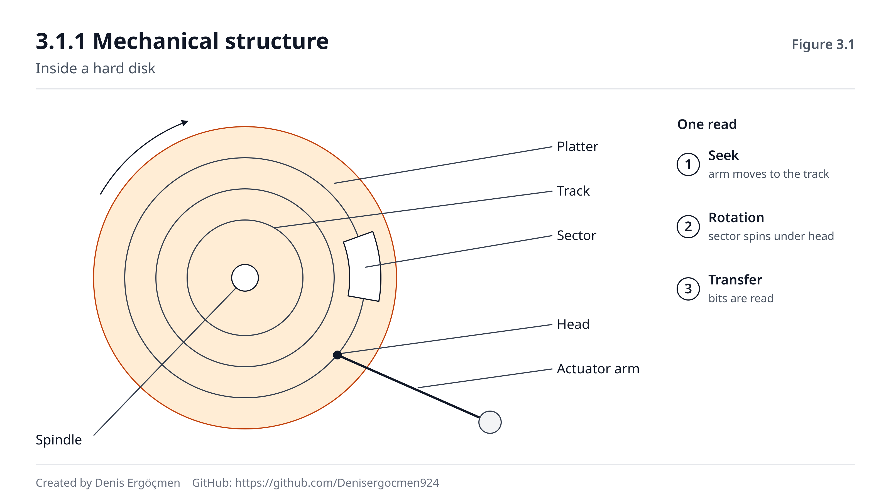
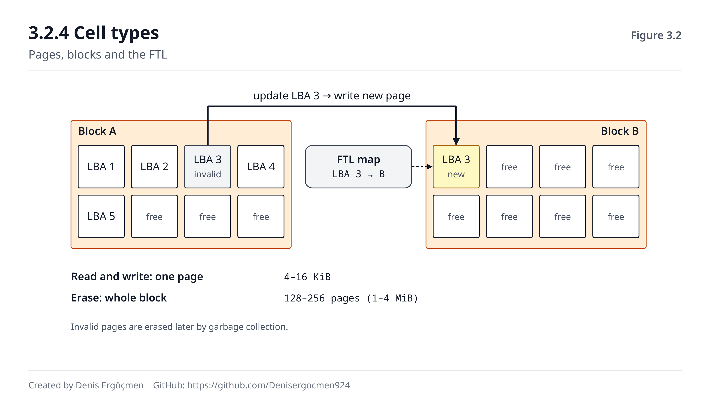
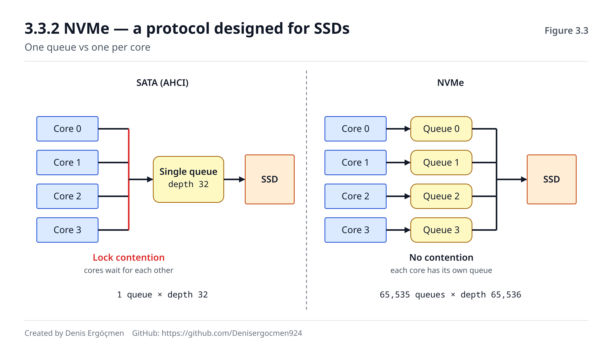
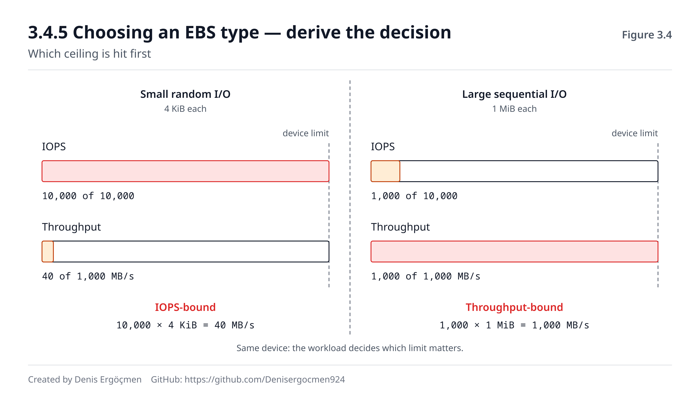
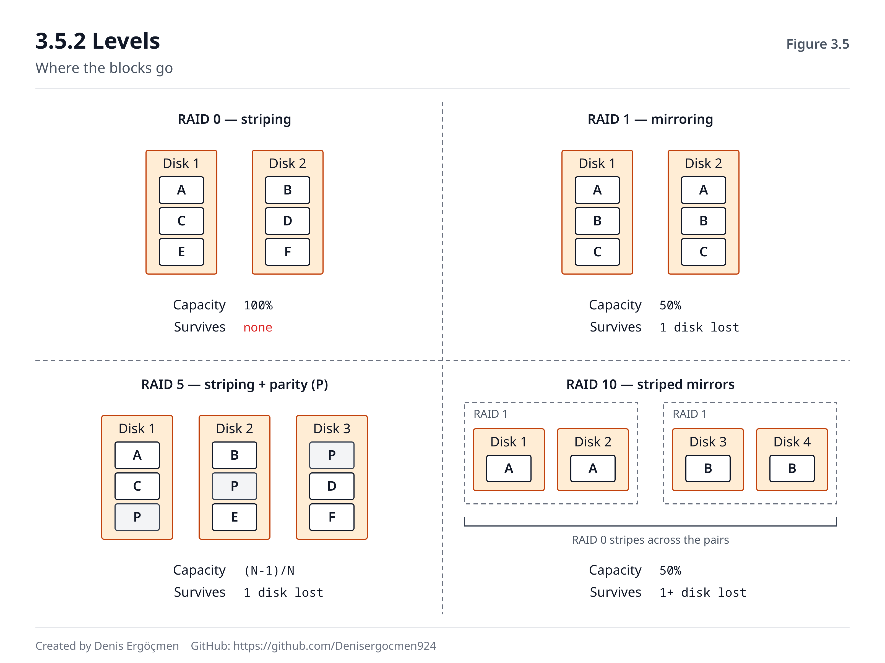

# Phase 3 — Storage (Persistent Memory)

> **Navigation:** [◀ Phase 2 — Memory Hierarchy](Phase_2_Memory_Hierarchy.md) · **Phase 3** · [Phase 4 — System Buses and I/O ▶](Phase_4_Buses_and_IO.md)

---

## Where we are coming from

Phase 2 ended with one sentence: **DRAM is volatile.** When the power goes, everything is lost.

This is the reason storage exists. But the real subject of Phase 3 isn't "where does data get
written" — it's the question **what is the price of making data persistent?**

Every principle you built in Phase 2 will repeat here; only the scale will grow:

| Principle in Phase 2 | Its counterpart in Phase 3 |
|---|---|
| Hierarchy: speed ↔ capacity trade-off | NVMe → SATA SSD → HDD → object storage |
| Transfer in blocks (64-byte cache line) | Transfer in blocks (4 KiB disk block) |
| Sequential access is faster than random (2.3.6) | The same fact, **much sharper** — 100× on an HDD |
| The locality bet (2.1.3) | Page cache, disk cache, CDN |
| Latency ≠ throughput (2.1.2) | **IOPS ≠ throughput** — the central distinction of this phase |

> **The practical value of this phase is high.** Phases 0–2 were the "deep why" line. Phase 3, on
> the other hand, directly touches weekly decisions: which EBS type you choose, why the database is
> slow, why your backup strategy is expensive — it's all here.

---

## By the end of this phase

- You will be able to explain why a disk is slow **by its physical cause**
- You will understand that an SSD is **not** a fast HDD but a completely different behavioral
  model
- You will be able to use IOPS, throughput and latency without mixing them up
- You will be able to look at a workload and answer the question "is this IOPS-bound or
  throughput-bound?"
- You will be able to derive the EBS type choice not from memory but **from the shape of the
  workload**
- You will recognize the signatures of storage-related performance problems

---

## Phase map

| Section | Topic | Depth | Why it matters |
|---|---|---|---|
| 3.1 | HDD | `[concept]` / `[mechanism]` | The intuition of mechanical latency — the foundation of all storage logic |
| 3.2 | SSD | `[concept]` / `[mechanism]` | Today's reality; the cause of its strange behaviors |
| 3.3 | SATA vs NVMe | `[mechanism]` | The interface being as decisive as the disk itself |
| 3.4 | **IOPS / Throughput / Latency** | `[mechanism]` / `[application]` | **The heart of the phase — the entire EBS choice rests on it** |
| 3.5 | RAID | `[concept]` / `[application]` | Designing durability and performance together |

---

# 3.1 HDD — The Spinning Disk

HDDs (Hard Disk Drives) are rapidly disappearing from the cloud. We still learn them, because
**HDD physics is the source of all your intuitions about storage.** You can only understand how
strange an SSD is if you know the HDD.

## 3.1.1 Mechanical structure `[concept]`

```
        ┌──────────────────────────────┐
        │   ╭───────────────────╮      │
        │   │  ◎ ← spindle      │      │   Platter: magnetically coated disk
        │   │    ╱╲             │      │   Spindle: the shaft that spins the platters
        │   │   ╱  ╲ ← track    │      │   Track: concentric circles
        │   ╰──╱────╲───────────╯      │   Sector: part of a track (512 B / 4 KiB)
        │     ╱      ╲                 │   Head: the read-write tip
        │  ═══╪═══════╪═══ ← head arm  │   Actuator: the arm that moves the head
        └──────────────────────────────┘
```


*Figure 3.1 — Platter, track, sector and head arm; the seek + rotation + transfer stages of a
read.*

**Key fact:** This is a **machine.** Inside it there is a motor spinning at 7,200 or 15,000
revolutions per minute and an arm moving back and forth hundreds of times per second.

Everything we talked about in Phases 0–2 happened at the speed of electrons. Here **inertia,
friction and mass** come into play. The difference is that fundamental.

## 3.1.2 The cost of a read — seek time `[mechanism]`

Reading a data block has three stages:

| Stage | What happens | Duration (7200 RPM) |
|---|---|---|
| **1. Seek time** | The head moves to the right track | **~4–9 ms** |
| **2. Rotational latency** | Waiting for the right sector to come under the head | **~4.2 ms** (avg.) |
| **3. Transfer time** | The data is read | ~0.01 ms (for 4 KiB) |
| | **Total** | **~8–13 ms** |

**Compute the rotational latency yourself:**
```
7200 RPM = 7200 / 60 = 120 revolutions/second
One full revolution = 1/120 = 8.33 ms
Average wait = half a revolution = 4.17 ms
```

> **Notice:** **99.9% of the total time is spent not on reading the data but on reaching it.**
> Transfer is 0.01 ms; reaching it is 8+ ms.
>
> **This single observation is the seed of everything you need to know about storage.** If
> reaching data is expensive and reading it is cheap — then **reaching it once and reading a lot**
> is the right strategy. Block sizes, the superiority of sequential access, read-ahead, database
> page design, log-structured storage: all of them are consequences of this single fact.

## 3.1.3 Sequential vs random — in numbers `[mechanism]`

**Scenario A — read 1 GB sequentially:**
```
1 seek (8 ms) + continuous transfer (150 MB/s)
= 8 ms + 6,667 ms ≈ 6.7 seconds
Effective speed: ~150 MB/s
```

**Scenario B — read 1 GB as random 4 KiB blocks:**
```
1 GB / 4 KiB = 262,144 blocks
Each block: 8 ms seek + 4.2 ms rotation ≈ 12 ms
262,144 × 12 ms = 3,145 seconds ≈ 52 MINUTES
Effective speed: ~0.33 MB/s
```

```
Sequential:  6.7 seconds    ████
Random    :  52 minutes     ████████████████████████████... (466×)
```

**Same disk. Same 1 GB. A 466× difference.**

> **Remember the 10× cache difference in Phase 2.3.6.** The same principle — the access pattern —
> shows up here as **466×**. As the scale grows, the importance of the access pattern grows. When
> we get to the network in Phase 5, this ratio will get even bigger.

### The HDD's IOPS ceiling

```
One I/O operation ≈ 12 ms
IOPS = 1000 ms / 12 ms ≈ 80–120 IOPS
```

**This number has barely changed in 30 years.** Capacities went from 100 MB to 20 TB (200,000×),
sequential speed went from 1 MB/s to 250 MB/s (250×), but **random IOPS went from 80 to 120
(1.5×).**

> **The reason:** Capacity and sequential speed depend on *magnetic density* — they can be
> increased through engineering. Random IOPS, on the other hand, depends on *mechanical motion* —
> the arm's travel time and the platter's rotational speed have hit physical limits. Going above
> 15,000 RPM isn't practical because of vibration and heat.
>
> The same pattern as the DDR story in Phase 2.4.2: **one dimension multiplies while the other stays
> constant.** And every time, the dimension that stays constant is *latency*.

## 3.1.4 Where did the HDD end up in the cloud? `[application]`

The HDD didn't die, but **its role narrowed.** Today it is unrivaled in exactly one thing: **cost
per GB.**

| Use | Suitable? | Why |
|---|---|---|
| Database (OLTP) | ❌ Never | Random-I/O heavy; 120 IOPS is insufficient |
| Operating system disk | ❌ No | Boot and runtime do random reads |
| Large file archive, log accumulation | ✅ Good | Sequential access, capacity-focused |
| Backup target | ✅ Good | Sequential writes, rarely read |
| Large data scan (sequential) | ✅ Reasonable | Throughput is sufficient, cost is low |

**AWS counterpart:** `st1` (throughput optimized HDD) and `sc1` (cold HDD). These are **designed
for sequential workloads**, and the AWS documentation says so explicitly: their performance on
small random I/O is disastrous.

> **And there's a trap here:** `st1` looks cheaper than `gp3` on the price list. Moving a database
> to `st1` to save costs makes sense on paper but in practice **renders the system unusable.** In
> Phase 3.4.5 we'll make this choice systematic.

---

# 3.2 SSD — Storage with No Moving Parts

## 3.2.1 How NAND Flash works `[concept]`

Recall the MOSFET from Phase 0.2.1: when voltage was applied to the gate, the channel became
conductive.

A NAND Flash cell adds a **second gate** to this transistor: the **floating gate** — an island
surrounded by insulator and connected to nothing.

```
      Control gate    ═══════════
                      ░░░░░░░░░░  ← insulator
      Floating gate   ▓▓▓▓▓▓▓▓▓▓  ← electrons are trapped HERE
                      ░░░░░░░░░░  ← insulator
      Channel         ──────────
```

If electrons are trapped in the floating gate, the transistor's switching threshold changes.
**Because the electrons are surrounded by insulator, they stay there even when the power is cut.**

**That is persistence.** Not magnetic orientation, but trapped electrons.

> **And every one of the SSD's quirks arises from this.** Pushing an electron through the insulator
> and trapping it is hard work: it needs high voltage, and the insulator wears a little each time.
> Erasing is even harder. Reading, however, is easy.
>
> **This asymmetry — read cheap, write expensive, erase very expensive — explains all of SSD
> behavior.**

## 3.2.2 Page and block — the SSD's strange asymmetry `[mechanism]`

**This section is the most important mechanism you need to know about SSDs.**

In an SSD, three different operations work at three different granularities:

| Operation | Unit | Size | Duration |
|---|---|---|---|
| **Read** | Page | 4–16 KiB | ~50–100 μs |
| **Write (program)** | Page | 4–16 KiB | ~200–800 μs |
| **Erase** | **Block** | **128–256 pages (1–4 MiB)** | **~2,000–5,000 μs** |

**The critical rule:** To write to a page, that page must be **empty.** And erasing **can't be done
per page** — only an **entire block** can be erased.

```
You want to update a single page in a block:

  Block: [P1][P2][P3][P4] ... [P256]
                   ↑ I only want to change P3

  Naive way:
    1. Read the whole block to a temporary place   (256 page reads)
    2. Erase the whole block                       (5 ms!)
    3. Change P3
    4. Write the whole block back                  (256 page writes)

  → To update 4 KiB: read 1 MiB + write 1 MiB + 1 erase
```

This is called **write amplification**. And if the SSD followed this naive way, it would be
unusable.

## 3.2.3 FTL, wear leveling and TRIM `[concept]`

Inside the SSD there is a **controller** and a software layer running on it: the **FTL (Flash
Translation Layer).**

The job the FTL does is **exactly the same** as virtual memory in Phase 2.5:

| Virtual memory (2.5) | FTL |
|---|---|
| Virtual address → physical address | Logical block (LBA) → physical page |
| Page table | Mapping table |
| MMU | SSD controller |

**The FTL's solution: don't update in place.**

```
You want to update P3:
  1. Write the new data to an empty page SOMEWHERE ELSE
  2. Update the mapping table: "LBA 3 is now over there"
  3. Mark the old page "invalid"
  4. Defer the erase work until LATER (in the background, when idle)

→ Cost at write time: 1 page. The erase cost has been amortized.
```

This background cleanup is called **garbage collection**.

**Wear leveling.** Each cell has a limited number of erase cycles (P/E cycles). The FTL
**distributes writes evenly** across the whole chip so that some blocks don't die early. Even if
you overwrite the same file 1,000 times, physically it gets written to a different place each time.

**TRIM.** When the operating system deletes a file, the SSD doesn't know — to it, those pages are
still "full" and get copied needlessly during garbage collection. The `TRIM` command tells the SSD
"these blocks are no longer needed".

> **Without TRIM, an SSD slows down over time** — this was the cause of the old complaint that SSDs
> "get slower as they age". On modern systems it's automatic (`fstrim.timer`), but a virtual machine
> layer or a misconfigured RAID layer can block TRIM.

## 3.2.4 Cell types — the speed/durability/cost triangle `[mechanism]`

How many bits to fit in one cell is a design choice. More bits = distinguishing more voltage
levels.

| Type | Bits/cell | Voltage levels | P/E cycles | Speed | Cost |
|---|---|---|---|---|---|
| **SLC** | 1 | 2 | ~100,000 | Fastest | Most expensive |
| **MLC** | 2 | 4 | ~10,000 | Fast | Expensive |
| **TLC** | 3 | 8 | ~3,000 | Medium | Reasonable |
| **QLC** | 4 | **16** | **~1,000** | Slow | Cheapest |

**Why do more bits = a shorter lifespan and lower speed?**

In QLC you have to distinguish 16 different voltage levels. The spacing between levels narrows,
which means:
- Reading requires more precise measurement → **slow**
- Writing requires more precise charging → **even slower**
- Even slight wear in the insulator mixes up the levels → **less durable**
- Electron leakage causes errors sooner → **data retention time shortens**

> **An exact repeat of the noise margin argument in Phase 0.1.1.** The reason we chose binary was
> that the distance between the two levels was wide. QLC narrows that distance by using 16 levels —
> it gains capacity and loses reliability. **The same physics, 60 years later, the same trade-off.**

**Cloud connection:** Cloud providers don't announce these hardware details, but the guaranteed
performance and durability figures reflect these choices. Your job isn't to choose the cell type —
**it's to understand which performance profile you're buying** (3.4.5).


*Figure 3.2 — Reads and writes happen per page, erases per block; the FTL marks the old page invalid
and writes to a new page.*

## 3.2.5 The SSD's performance quirks `[application]`

If you approach an SSD with your HDD intuition, you'll be wrong. Three important differences:

**1. The gap between sequential and random has shrunk — but it hasn't disappeared.**
```
HDD:  sequential 150 MB/s,  random 0.3 MB/s    → 466×
NVMe: sequential 3500 MB/s, random 400 MB/s    → ~9×
```
The gap is still there (block management, channel parallelism, FTL mapping cost) but it's no longer
decisive. **This changed many assumptions, from database design to file systems.**

**2. Queue depth determines performance.**
Inside an SSD there are dozens of parallel NAND channels. If you send a single request, one of them
works. **To reach the SSD's advertised IOPS, you have to send many requests at the same time.**

```
QD=1   (single thread, synchronous I/O):   ~15,000 IOPS
QD=32  (many threads or async):           ~400,000 IOPS
```

> **This is the cause of a surprise you'll run into very often in production:** "The disk supports
> 500K IOPS but my application gets 15K." The problem isn't the disk — the application **isn't
> generating enough parallel I/O.** The solution isn't a faster disk but more concurrency (async
> I/O, a thread pool, a deeper queue).

**3. Free space affects performance.**
If an SSD is 90% full, finding free blocks for garbage collection gets harder. Write amplification
increases, and write latency rises and **becomes variable.** Keeping SSDs below 80% in production is
a common practice.

> **🤔 Think 3.1**
> You're writing a log collection system. 50,000 small lines (~200 bytes) arrive per second. You're
> considering two designs:
>
> - **A:** Write each line to disk the moment it arrives (`write()` + `fsync()`)
> - **B:** Accumulate lines in a 4 MiB buffer in memory, and write them in one go when it fills
>
> a) What will the performance difference between these two designs be on an SSD? Why?
> b) What is the price of B?
> *(Answer: at the end of the phase)*

---
# 3.3 Interfaces — SATA and NVMe

## 3.3.1 The problem: a fast disk, a slow road `[mechanism]`

When the SSD was invented, the existing interface was used to connect it to the computer: **SATA.**

But SATA **was designed for the HDD.** And the HDD's needs were completely different:

| SATA's assumption | The SSD's reality |
|---|---|
| The device is slow anyway (120 IOPS); protocol cost is negligible | The device is very fast; protocol cost is **dominant** |
| A single queue is enough (there's only one head anyway) | There are dozens of parallel channels |
| A queue depth of 32 is more than enough | 65,000 requests can be processed in parallel |
| 6 Gbps of bandwidth is plenty | 6 Gbps **becomes the ceiling** |

**Result:** A SATA SSD could use perhaps 15% of the SSD's potential. The disk was ready; the road
was narrow.

## 3.3.2 NVMe — a protocol designed for SSDs `[mechanism]`

NVMe (Non-Volatile Memory Express) was designed from scratch around the true nature of the SSD and
runs over **PCIe** (we'll look at PCIe in detail in Phase 4.2).

| Dimension | SATA (AHCI) | NVMe |
|---|---|---|
| Physical path | SATA cable, 6 Gbps | **PCIe lanes** (x4 ≈ 8–16 GB/s) |
| Number of queues | **1** | **65,535** |
| Queue depth | 32 | **65,536** |
| CPU cost per command | High (old, interrupt-heavy) | **Low** (uses the DMA from Phase 4.3 efficiently) |
| Typical latency | ~100 μs | **~20 μs** |
| Typical IOPS | ~90,000 | **~1,000,000+** |

**The most important difference is the queue architecture.** In SATA there is a single queue — all
CPU cores compete for it and lock contention occurs. In NVMe, **each core can be given its own
queue:**

```
SATA:                         NVMe:
  Core 0 ┐                      Core 0 → Queue 0 ┐
  Core 1 ├→ [single queue]      Core 1 → Queue 1 ├→ SSD
  Core 2 ┤    → SSD             Core 2 → Queue 2 ┤
  Core 3 ┘                      Core 3 → Queue 3 ┘
     ↑ lock contention              ↑ no contention
```

> **This is the third repeat of the logic in Phase 1.5 and Phase 2.4.3:** As the core count grows,
> **the single shared resource becomes the bottleneck.** In the CPU the solution was many cores + a
> large L3, in memory it was many channels, in storage it was many queues. **Same problem, same shape
> of solution, three different layers.**


*Figure 3.3 — On the left, cores competing for a single queue; on the right, a separate queue per
core.*

## 3.3.3 Practical numbers `[application]`

| Device | Latency | Random IOPS (4K) | Sequential throughput |
|---|---|---|---|
| HDD 7200 RPM | ~10 ms | ~120 | ~150 MB/s |
| SATA SSD | ~100 μs | ~90,000 | ~550 MB/s |
| NVMe SSD (PCIe 3.0) | ~80 μs | ~500,000 | ~3,500 MB/s |
| NVMe SSD (PCIe 4.0) | ~60 μs | ~1,000,000 | ~7,000 MB/s |
| **DRAM (reference)** | **~80 ns** | — | ~50,000 MB/s |

> **I added the last row because perspective matters.** NVMe is 100× faster than an HDD. But it is
> still **750× slower** than DRAM.
>
> The storage version of the memory wall from Phase 2.1.2: the SSD revolution **didn't close the
> chasm, didn't even narrow it — it just added a rung.** That's why the page cache, Redis,
> application caches and CDNs are still indispensable. The sentence "disks are fast now, there's no
> need for a cache" is wrong.

## 3.3.4 Cloud connection — instance store vs EBS `[application]`

On AWS there are two kinds of block storage, and **the difference between them is the subject of
this section:**

| | **Instance Store** | **EBS** |
|---|---|---|
| Physical location | **Inside the server**, direct NVMe | Storage accessed **over the network** |
| Latency | ~50–100 μs | ~200 μs – 1 ms |
| IOPS | Very high (millions) | 3,000–256,000 depending on type |
| Persistence | ❌ **Data is gone when the instance stops** | ✅ Independent of the instance |
| Snapshot | ❌ | ✅ |
| Resizing | ❌ Fixed | ✅ Can be grown live |
| Changing instances | ❌ Data doesn't move | ✅ Detach/attach |

> **That EBS works over the network is the most important cloud fact of this phase.**
>
> EBS looks like a "disk": the operating system sees it as `/dev/nvme1n1`, you run `mkfs`, you mount
> it. But physically **that disk is on another machine.** Every read is a network round trip.
>
> This has three consequences:
> 1. **The latency floor is high** — you can't go below the network round trip (in Phase 5 we'll see
>    why this is so)
> 2. **The instance's network capacity limits EBS performance** — on small instances the EBS
>    bandwidth is small too (a repeat of the logic in Phase 2.4.3)
> 3. **But you gain persistence and flexibility** — the data lives on even if the instance dies

**When to use which:**

| Need | Choice |
|---|---|
| Primary database data | **EBS** — persistence is indispensable |
| Temporary compute space, scratch | **Instance store** — speed and cost |
| Cache layer (reproducible) | **Instance store** |
| Intermediate outputs of big data processing | **Instance store** |
| Root volume | **EBS** — to be able to stop and start the instance |

> **🤔 Think 3.2**
> A team proposes running the database on instance store and taking a backup to EBS every hour.
> Their rationale: "instance store is much faster, and we're taking backups anyway."
>
> a) What is the risk of this design? Build a concrete scenario.
> b) In which situation would this design be **acceptable**?
> *(Answer: at the end of the phase)*

---

# 3.4 IOPS, Throughput and Latency

**This section is the heart of the phase.** EBS type selection, database performance analysis and
diagnosing storage-related failures all rest on using these three concepts correctly.

## 3.4.1 Three concepts, three different questions `[mechanism]`

| Concept | The question it answers | Unit |
|---|---|---|
| **Latency** | **How long does** a single operation **take?** | ms, μs |
| **IOPS** | **How many operations** can be done per second? | operations/s |
| **Throughput** (bandwidth) | **How many bytes** are carried per second? | MB/s |

The relationship between them is a simple multiplication:

```
Throughput = IOPS × Average I/O size
```

```
Example 1:  10,000 IOPS × 4 KiB  =    40 MB/s
Example 2:   1,000 IOPS × 1 MiB  = 1,000 MB/s
```

> **Look carefully at the two systems.** Example 1's IOPS is 10× higher, but Example 2's throughput
> is 25× higher. **Which one is "faster"?**
>
> Answer: **the question is wrong.** Which one is faster depends on what the workload wants. That's
> why a storage choice can't be reduced to a single "speed" number.

## 3.4.2 Analogy: the highway `[concept]`

| Storage | Highway |
|---|---|
| **Latency** | The time it takes one car to get from A to B |
| **IOPS** | The number of **cars** passing per second |
| **Throughput** | The number of **passengers** carried per second |

- Add lanes (parallelism): IOPS and throughput increase, **latency doesn't change**
- Add passengers per car (larger I/O): throughput increases, IOPS stays the same
- Raise the speed limit: latency drops

> **Critical insight:** **You can't lower latency with parallelism.** Adding 10 lanes doesn't
> shorten the travel time of a single car.
>
> This is the same as the latency/throughput distinction in Phase 1.4.1 — the pipeline increased
> throughput but didn't shorten the time of a single instruction. **The same distinction, for the
> fourth time:** in the pipeline, in memory, in storage, and in Phase 5 in the network.

## 3.4.3 Workload shapes — which is bound by what `[application]`

**This table is the most practical output of this phase.**

| Workload | I/O size | Pattern | Limited by |
|---|---|---|---|
| OLTP database (orders, user transactions) | 4–16 KiB | Random | **IOPS** |
| Database index lookup | 4–8 KiB | Random | **IOPS** |
| Analytical query, full table scan | 128 KiB–1 MiB | Sequential | **Throughput** |
| Video streaming / encoding | 1–10 MiB | Sequential | **Throughput** |
| Backup / restore | Large | Sequential | **Throughput** |
| Log writing (buffered) | 64 KiB–1 MiB | Sequential | **Throughput** |
| Log writing (fsync on every line) | ~1 KiB | Sequential but synchronous | **Latency** |
| Pulling container images, builds | Mixed | Mixed | Usually IOPS |
| Message queue (Kafka) | Medium | Sequential | **Throughput** |

**How to determine it yourself:** Measure the average I/O size.

```bash
iostat -x 1 5
```
**Expected output (relevant columns):**
```
Device  r/s     w/s    rkB/s    wkB/s   r_await  w_await  aqu-sz  %util
nvme0n1 8500.0  120.0  34000.0  4800.0     0.45     0.80   4.20   82.5
        └─IOPS─┘       └─throughput─┘     └─latency─┘
```

From this:
```
Average read size = rkB/s ÷ r/s = 34000 ÷ 8500 = 4 KiB
→ Small and probably random → an IOPS-bound workload
```

| Column | What it tells you | Alarm threshold |
|---|---|---|
| `r/s` + `w/s` | IOPS | Close to the provider limit → IOPS bottleneck |
| `rkB/s` + `wkB/s` | Throughput | Close to the limit → throughput bottleneck |
| `r_await` / `w_await` | Average I/O latency (ms) | >10 ms on an SSD → problem |
| `aqu-sz` | Average queue depth | Consistently >1 means requests are waiting |
| `%util` | Fraction of time the device was busy | **Misleading on NVMe — see below** |

> **The `%util` trap — knowing this saves you from a wrong diagnosis.** `%util` is "the percentage
> of time at least one request was outstanding to the device". It was meaningful on an HDD: there's
> one head, and if it's busy it's full. **On NVMe, because there are parallel channels, 100% `%util`
> doesn't mean saturation** — the device could be using 10% of its capacity at 100% util. The real
> saturation indicators are `aqu-sz` and `await`.

## 3.4.4 The hidden source of latency: the queue `[mechanism]`

The device's raw latency (`svctm`) and the latency the application sees (`await`) are different:

```
await = time waiting in the queue + device service time
```

As the device approaches saturation, the queue grows and **await explodes.** This explosion is not
linear:

```
At 50% of capacity:  await ≈ 1.0 × base latency
At 80% of capacity:  await ≈ 2.5 × base
At 90% of capacity:  await ≈ 5.0 × base
At 95% of capacity:  await ≈ 8.0 × base
At 99% of capacity:  await ≈ 40  × base
```

> **This is the fundamental result of queueing theory, and it isn't specific to storage** — the same
> curve holds in the CPU scheduler, the network interface, the thread pool, the database connection
> pool and the load balancer.
>
> **Its practical consequence is this: trying to use a resource up to 100% is a mistake.** The last
> 10% of utilization charges a disproportionate price in latency. Production systems are usually
> planned with **70–80% target utilization** — the "wasted" 20% is actually the price paid for
> latency predictability.
>
> We'll put this idea at the center of capacity planning in Phase 7.5.

## 3.4.5 Choosing an EBS type — derive the decision `[application]`

Now, instead of memorizing the EBS types, you can **derive** them.

| Type | Technology | Optimized for | Typical use |
|---|---|---|---|
| **gp3** | SSD | Balanced; IOPS and throughput are set **separately** | The default choice — most workloads |
| **io2 / io2 Block Express** | SSD | **High IOPS + low, consistent latency** | Critical databases, high IOPS requirements |
| **st1** | HDD | **High sequential throughput**, low cost | Log processing, large files, data warehouse scans |
| **sc1** | HDD | **Lowest cost**, infrequent access | Archives, rarely read data |

**Decision tree:**

```
Is the data accessed frequently and randomly?
├─ YES → Is the I/O size small (<32 KiB)?
│         ├─ YES → IOPS-bound
│         │         ├─ Latency critical / very high IOPS → io2
│         │         └─ Normal → gp3 (raise IOPS separately)
│         └─ NO  → Throughput-bound → gp3 (raise throughput separately)
└─ NO  → Is access sequential and large?
          ├─ YES → st1
          └─ Rarely accessed → sc1
```

> **An important design feature of gp3:** in gp2, IOPS **was tied to volume size** — to get more
> IOPS you had to buy a bigger disk than you needed. In gp3, **IOPS, throughput and size are
> independent of each other.**
>
> This is an architecturally important correction: gp2 had a kind of waste called "buying extra
> capacity for performance". You'll still see recommendations written with gp2 logic in old docs and
> blog posts — they no longer apply.

**Two limits not to forget:**

1. **The instance's EBS bandwidth is a ceiling independent of the volume's own limit.** You can give
   an `io2` volume 64,000 IOPS, but if the instance has EBS bandwidth for 20,000 IOPS, the ceiling is
   20,000. **You won't get the performance you paid for.** Always check the instance's "EBS
   bandwidth" value.
2. **Multiple EBS volumes share the same instance bandwidth.** Attaching 4 fast volumes doesn't
   change the instance ceiling.

> **🤔 Think 3.3**
> On a PostgreSQL server, the output of `iostat -x 1` looks like this:
> ```
> Device   r/s      w/s    rkB/s    wkB/s   r_await  w_await  aqu-sz  %util
> nvme1n1  2980.0   50.0  11920.0   400.0    22.40    25.10   68.50   99.8
> ```
> Volume: `gp3`, configured with 3,000 IOPS.
>
> a) What is the bottleneck? Which numbers told you?
> b) What does an `aqu-sz` of 68.5 mean?
> c) Propose three different solutions and say which one you'd prefer and why.
> *(Answer: at the end of the phase)*


*Figure 3.4 — Small random I/O hits the device's IOPS ceiling, large sequential I/O hits the
throughput ceiling; the two are different limits.*

---
# 3.5 RAID — Seeing Multiple Disks as One

## 3.5.1 Why it exists `[concept]`

RAID (Redundant Array of Independent Disks) presents multiple physical disks as a single logical
volume. It aims for one or more of three things:

1. **Performance** — read/write from parallel disks at the same time
2. **Durability** — don't lose data if a disk dies
3. **Capacity** — combine small disks

## 3.5.2 Levels `[concept]`

**RAID 0 — Striping**
```
Data:  [A][B][C][D][E][F]
Disk1: [A]   [C]   [E]
Disk2:    [B]   [D]   [F]
```
- **Performance:** N× reads and writes (in parallel)
- **Durability:** ❌ **Negative** — if one disk dies, **all the data is gone**
- The failure probability of 2 disks is **2×** that of a single disk

**RAID 1 — Mirroring**
```
Disk1: [A][B][C]
Disk2: [A][B][C]   ← exact copy
```
- **Performance:** Reads improve (from two sources), writes don't
- **Durability:** ✅ Keeps working if one disk dies
- **Capacity:** 50% — 2 TB disk × 2 = 2 TB usable

**RAID 5 — Striping + distributed parity**
```
Disk1: [A][C][P]    P = parity (A XOR B)
Disk2: [B][P][E]
Disk3: [P][D][F]
```
- **Capacity:** N-1 disks (2 out of 3 disks usable)
- **Durability:** ✅ Tolerates the loss of **one** disk
- **Write penalty:** For each write, the old data + old parity are read, the new parity is computed,
  and both are written → **one logical write = four physical operations**

> **RAID 5's "rebuild window" problem.** When a disk dies, a new one is inserted and the data is
> recomputed from the remaining disks. On modern large disks (16–20 TB) this takes **days**, and
> throughout that time:
> - There is no redundancy protecting the array — **a second failure ends everything**
> - The remaining disks are read heavily and continuously — the failure probability rises exactly at
>   this moment
> - Performance drops noticeably
>
> That's why RAID 5 is no longer recommended with large disks; RAID 6 (two parities) or RAID 10 is
> preferred. **In redundancy design, besides "how many failures does it survive", you must also ask
> "how long does it stay vulnerable after a failure".**

**RAID 10 — Striping of mirror pairs**
```
      ┌─ RAID 1 ─┐   ┌─ RAID 1 ─┐
      Disk1  Disk2   Disk3  Disk4
       [A]    [A]     [B]    [B]
      └───── RAID 0 striping ────┘
```
- **Performance:** High (both reads and writes)
- **Durability:** ✅ High, with no write penalty
- **Capacity:** 50%
- **The classic choice for databases**

| Level | Min. disks | Capacity | Fault tolerance | Write perf. | Typical use |
|---|---|---|---|---|---|
| RAID 0 | 2 | 100% | **None** | Highest | Temporary/scratch data |
| RAID 1 | 2 | 50% | 1 disk | Normal | Small, critical systems |
| RAID 5 | 3 | (N-1)/N | 1 disk | **Low** (4× penalty) | Read-heavy archive |
| RAID 6 | 4 | (N-2)/N | 2 disks | Lower | Archive with large disks |
| RAID 10 | 4 | 50% | 1+ disk | High | **Databases** |


*Figure 3.5 — How blocks are distributed across disks and where the parity sits in four RAID
levels.*

## 3.5.3 The role of RAID in the cloud `[application]`

**RAID's classic purpose is already largely covered in the cloud:**

| RAID's purpose | Its counterpart in the cloud |
|---|---|
| Durability against disk failure | **EBS is already replicated within the AZ** — disk failures don't reach you |
| Combining capacity | An EBS volume can be grown live |
| Performance | On gp3/io2, IOPS and throughput are set directly |

> **That's why building RAID 1 or RAID 5 on top of EBS in the cloud is usually a mistake:** you
> replicate storage that is already replicated — doubling the cost without meaningfully increasing
> durability.

**Two cases where RAID still makes sense in the cloud:**

1. **RAID 0 over instance store disks.** An `i`-family instance comes with multiple NVMe disks;
   combining them with RAID 0 increases total IOPS and capacity. **There's no durability concern,
   because instance store isn't persistent anyway** — you've already accepted the risk of losing it.

2. **RAID 0 over EBS to exceed the single-volume limit.** Very rare; and don't forget the warning in
   3.4.5: the instance's EBS bandwidth ceiling doesn't change, so most of the time it doesn't help.

> **A more general principle:** In the cloud, durability is designed **at the architecture level,
> not at the disk level.** Instead of disk failure, you think about AZ failure, region failure and
> data corruption. The answer isn't RAID; it's snapshots, replication, multi-AZ deployment and a
> backup strategy.
>
> In Phase 7 we'll fit this into the "what is guaranteed at which layer" framework.

> **🤔 Think 3.4**
> Someone at your company proposes building a "both fast and durable" setup for the database by
> putting 4 `gp3` volumes into RAID 10.
>
> a) Evaluate the cost and the real gain of this design.
> b) What better could be done with the same budget?
> *(Answer: below)*

---

# 3.6 When This Phase Breaks — Failure Signatures

| Symptom | Likely mechanism | Where it was covered | First thing to check |
|---|---|---|---|
| Low CPU, high `%wa`, everything slow | I/O bottleneck or thrashing | 3.4.4, 2.6.2 | `iostat -x`, `vmstat` si/so |
| `await` very high but IOPS below the limit | Queue buildup or neighbor load | 3.4.4 | `aqu-sz`, burst credits |
| The application can't get the disk's advertised IOPS | **Low queue depth** — not enough parallel I/O | 3.2.5 | Increase concurrency, async I/O |
| Performance good for the first hours, then drops | **Burst credits exhausted** (gp2/gp3 baseline limit) | 3.4.5 | CloudWatch burst balance |
| Writes slowed down as the disk filled up | SSD garbage collection pressure | 3.2.5 | Bring usage below 80% |
| Database scan queries slow, point queries fast | Throughput limit | 3.4.3 | Is `rkB/s` close to the limit? |
| Point queries slow, scans normal | IOPS limit | 3.4.3 | Is `r/s` close to the limit? |
| The instance restarted and the data is gone | **Instance store** was used | 3.3.4 | Verify the volume type |
| `%util` at 100% but the system runs fine | `%util` is misleading on NVMe | 3.4.3 note | Look at `aqu-sz` and `await` |
| Restoring from backup took much longer than expected | No throughput calculation was done | 3.4.1 | **Measure** the restore time, don't estimate it |

> **The last row is a warning:** A backup strategy is usually designed around the question "how often
> do we take backups". But the real question is **"how long does it take to come back"**, and the
> answer is calculated with this phase's math:
> ```
> 2 TB of data ÷ 250 MB/s = 8,000 seconds ≈ 2 hours 13 minutes
> ```
> If your recovery time objective (RTO) is 30 minutes, this backup design **doesn't work** — and you
> need to learn that now, not during a real incident.

---

# Phase 3 — Answers to the Think questions

## Answer 3.1 — Write every line, or buffer and then write?

**a) Performance difference: 50–500×. And there isn't one reason but four.**

**Design A (a separate `write()` + `fsync()` for every line):**
```
50,000 operations/second × ~200 bytes
Each fsync ≈ 100–500 μs (a round trip to make the data persistent)
→ 50,000 × 200 μs = 10 seconds of work per second
→ The system can't keep up; the queue grows without bound
```

Four separate mechanisms penalize A:

1. **The fsync cost.** Each `fsync()` sends a "persist" command to the device and waits for the
   reply. This is a synchronous round trip — queue depth stays at 1, so the QD problem from 3.2.5
   happens exactly. None of the SSD's parallel channels can be used.
2. **Write amplification.** You're writing 200 bytes, but the SSD's smallest write unit is a page
   (4–16 KiB). **For every 200 bytes ~4 KiB gets written — a 20× amplification** (3.2.2).
3. **File system overhead.** Each write produces a metadata update and a journal entry.
4. **Premature wear.** 20× write amplification consumes the SSD's P/E budget 20× faster (3.2.4).

**Design B (4 MiB buffer):**
```
4 MiB ÷ 200 bytes ≈ 20,000 lines per write
50,000 lines/s ÷ 20,000 = ~2.5 write operations per second
Each write is large and sequential → throughput-bound, easy work for the device
→ 2.5 writes instead of 50,000 fsyncs
```

Write amplification drops to ~1, queue depth is used efficiently, and the file system overhead is
spread across 20,000 lines.

**b) The price of B: a data loss window.**

Data waiting in the buffer **isn't persistent yet.** If the process crashes or the machine loses
power, that 4 MiB (≈20,000 lines, ≈0.4 seconds of data) is lost.

**This isn't a bug but a conscious trade-off**, and real systems make this axis tunable:

| System | Setting | Trade-off |
|---|---|---|
| PostgreSQL | `synchronous_commit` | `off` → very fast; the latest transactions are at risk |
| MySQL | `innodb_flush_log_at_trx_commit` | `2` → leave it to the OS, fast; `1` → fsync on every commit |
| Kafka | `acks`, `flush.ms` | Gradations between durability and latency |
| Linux | `dirty_expire_centisecs` | How long the page cache will wait |

**The right answer depends on the data:**
- **Financial transactions, order records:** side A (every transaction must be persistent) — but
  then you solve write speed with group commit, not by going unbuffered
- **Application logs, metrics, telemetry:** side B — losing 0.4 seconds is acceptable

> **The third way used in real systems: group commit.** Combining transactions that arrive at the
> same time into a single fsync. It preserves both durability and efficiency. PostgreSQL's
> `commit_delay` and Kafka's batching are exactly this.
>
> **General lesson: the "speed or durability" question is usually a spectrum, not a binary choice.**
> And to pick the right point you need to know how valuable the data is — that's a business decision,
> not a technical one.

## Answer 3.2 — Database on instance store, hourly EBS backup

**a) Risk: up to 1 hour of data loss — and that is acceptable for almost no database.**

**Concrete scenario:**
```
14:00  Backup taken
14:47  Peak hour — 4,200 orders processed
14:58  AWS hardware failure → instance stopped/replaced
       → Instance store WIPED (3.3.4)
15:05  Restored from the 14:00 backup

Lost: every transaction from the last 58 minutes.
```

And the loss isn't only technical:
- The customer paid, but there's no order record
- The transaction exists at the payment provider but not in your system → **a reconciliation
  nightmare**
- Stock counts are wrong
- Records already sent to connected systems (shipping, billing) are now "orphans"

**And this scenario happens more often than you think.** Instance store isn't lost only when the
instance crashes; it is also lost when:
- The instance is **stopped and started** (stop/start — not a reboot)
- The underlying hardware fails (AWS moves the instance)
- The instance type is changed
- A spot instance is reclaimed

So **even planned maintenance leads to data loss.** The team thinks "crashes are rare", but the real
probability is much higher.

**b) When is it acceptable?**

This design is **correct** under these conditions:

1. **If the data is reproducible.** If the database holds data *derived from a source* — a search
   index (Elasticsearch), a cache layer, a materialized view, an analytical copy — you can make up for
   the loss by rebuilding.
2. **If the source of the data is elsewhere.** A read model fed from Kafka can be replayed from the
   event stream (event sourcing).
3. **If it is temporary computation.** Spark intermediate outputs, ML training checkpoints, build
   caches.
4. **If the write-ahead log (WAL) is kept separately and persistently.** This is a serious
   architecture: data files on fast instance store, the WAL on persistent EBS or in a synchronous
   replica. Some high-performance setups do this — but it isn't the same thing as "hourly backups".

> **The team's real mistake isn't technical but conceptual:** "We take backups" and "we prevent data
> loss" are not the same thing. A backup means **accepting** data loss up to the **recovery point
> objective (RPO)**. An hourly backup is a statement that "we accept losing 1 hour of data".
>
> The right question is: **"How much data loss can we afford?"** If the answer is "none", a backup
> isn't enough — you need synchronous replication.

## Answer 3.3 — Diagnosing the PostgreSQL `iostat` output

**a) The bottleneck: the IOPS limit. The gp3 volume is configured at 3,000 IOPS and it's sitting
exactly at that limit.**

Evidence:
```
r/s + w/s = 2980 + 50 = 3,030 ≈ 3,000      ← THE CONFIGURED LIMIT. Right at the ceiling.
Average read size = 11920 ÷ 2980 = 4 KiB    ← small, random — the OLTP pattern
Throughput = ~12.3 MB/s                     ← ridiculously low for gp3; throughput is NOT the problem
r_await = 22.4 ms                           ← extraordinarily high for an SSD (normal: 0.2-1 ms)
%util = 99.8                                ← saturated
```

**The diagnosis is clear:** 4 KiB random reads have hit the IOPS ceiling. Throughput utilization is
under 1% — so the problem isn't "the disk is slow", it's **"the allowed number of operations is used
up."** This is a textbook example of the OLTP row of the table in 3.4.3.

**b) What does an `aqu-sz` of 68.5 mean?**

On average, **68.5 requests are constantly waiting in the queue.** The device can only process a few
of them at any moment; the rest wait in line.

Let's verify with Little's law:
```
await ≈ queue length ÷ processing rate
22.4 ms ≈ 68.5 ÷ 3,030 IOPS = 22.6 ms   ✓ consistent
```

**So almost all of the 22.4 ms of latency is time spent waiting in the queue.** The device's own
service time is ~0.3 ms. At 99.8% utilization you are at the far end of the curve in 3.4.4: you're paying
**~75×** the base latency (22.4 ÷ 0.3) — even the 99% row of the table (40×) falls short of it.

How it looks from the application's side: every query waits 22 ms for the disk, the connection pool
fills up, and p99 latency has exploded.

**c) Three solutions:**

**1. Raise the gp3 IOPS setting (the fastest solution — minutes)**
- 3,000 → 12,000 IOPS
- No downtime; applied live
- Cost: an extra monthly fee per IOPS, predictable
- ⚠️ **First check the instance's EBS bandwidth** (3.4.5, limit 1) — otherwise you won't get what you
  pay for
- **This is the right move in an emergency**

**2. Reduce I/O at the application level (the most lasting solution — days)**
- 2,980 reads/second is very high — **`shared_buffers` may be insufficient.** If PostgreSQL can't keep
  the data in memory, every query goes down to the disk.
- Use `pg_stat_statements` to find the queries that read the most blocks
- Missing index → full table scan → unnecessary random reads
- The logic of Answer 2.3: **a working set that fits in memory is faster than the fastest disk**
- A simple index can bring 3,000 IOPS down to 50 IOPS

**3. Move to io2 (the most expensive — and usually a premature move)**
- A higher IOPS ceiling and **more consistent latency** (a p99 guarantee)
- A significant cost increase
- **Only makes sense if it's still insufficient after step 2**

**Preference and order:**

> **1 first, 2 in parallel, 3 if necessary.**
>
> Do 1 immediately — the system is currently unusable and this decision is easy to reverse. But 1
> treats the **symptom**: the application may still be producing 60× more I/O than it needs to.
>
> The real work is 2. 2,980 IOPS of random reads is **abnormally high** for a well-configured OLTP
> database, and it almost always points to one of these: insufficient `shared_buffers`, a missing
> index, or an N+1 query pattern.
>
> **And this is a repeat of the lesson in Phase 2.3.6:** fixing the access pattern gives a gain that
> is both cheaper and bigger than a hardware upgrade. Growing the hardware gains you 4×; adding an
> index, 60×.

## Answer 3.4 — RAID 10 with 4 × gp3

**a) Evaluating the cost and the real gain**

**Cost:**
```
RAID 10 → 50% of capacity is usable
For 1 TB of usable space you buy 2 TB of gp3
→ Storage cost 2×
→ Plus management complexity: mdadm configuration, boot order,
  snapshot consistency (snapshots of the 4 volumes must be taken in sync),
  the grow procedure, failure scenarios
```

**Durability gain: close to zero.**

EBS **is already replicated within the AZ** (3.5.3). A physical disk failure never reaches you. What
RAID 1 protects against — a single disk failure — **is already not your problem on EBS.**

On top of that, RAID **adds a new risk:** any one of the 4 volumes becoming inaccessible (a network
interruption, a volume-level event) affects the whole array. **You increased the number of
dependencies.** And the snapshot is no longer atomic — freezing 4 volumes at one consistent moment
takes extra care.

**Performance gain: partly real, but obtained the unnecessary way.**

Yes, the 4 volumes work in parallel and total IOPS goes up. **But on gp3 you can get the same result
by raising a single volume's IOPS setting** (3.4.5) — without adding any complexity.

And limit 1 from 3.4.5 applies here too: **the instance's EBS bandwidth ceiling hasn't changed.**
Adding 4 volumes doesn't raise that ceiling. So the performance RAID 10 promises most likely hits the
instance limit and **never materializes.**

**b) Something better with the same budget**

```
Current plan:  4 × 1 TB gp3 (RAID 10) = 4 TB purchased, 2 TB usable

Better:        1 × 2 TB gp3, IOPS and throughput raised directly
               + with the budget left over:
                 → Choose an instance with enough EBS bandwidth
                 → A Multi-AZ standby replica (REAL durability)
                 → Automatic snapshots + point-in-time recovery
```

**Why it's better:**

| Dimension | RAID 10 | Multi-AZ replica |
|---|---|---|
| Disk failure | Protects (but EBS was already protecting) | Protects |
| **AZ failure** | ❌ Doesn't protect | ✅ Protects |
| **Instance failure** | ❌ Doesn't protect | ✅ Protects |
| **Data corruption / accidental DELETE** | ❌ Doesn't protect (it's written to the mirror too) | Protects with PITR |
| Management complexity | High | Handled by the managed service |

> **The real lesson here — and this is the most common conceptual mistake when moving to the
> cloud:**
>
> **In the cloud, durability is designed at a different layer than in a traditional data center.** On
> your own server disks died, and RAID was the right answer. In the cloud, disk failure is the
> provider's problem; your problems are **instance failure, AZ failure, region failure and human
> error.**
>
> RAID protects against **none** of these. You're applying a solution carried over out of habit to a
> problem that no longer exists — and paying double the cost, extra complexity and a new point of
> failure in return.
>
> **The question to ask of every protection mechanism:** *"Exactly which failure scenario does this
> prevent, and is that scenario really my responsibility in this environment?"*

---
# Phase 3 — Frequently asked questions

> **Q1: SSDs are very fast now. Do we still need cache layers (Redis, page cache)?**
>
> Yes, and the numbers are clear: NVMe ~60 μs, DRAM ~0.08 μs → **a 750× difference.**
>
> The SSD narrowed the chasm between HDD and DRAM, but it didn't close it. The last row of the table
> in 3.3.3 is there for exactly this. A Redis query takes ~0.2 ms; reading the same data from disk
> takes ~1–5 ms (including the file system and database layers).
>
> **What changed is this:** A cache used to be *mandatory*; now it's an *engineering decision.* In
> the HDD era a system without a cache couldn't run; today it runs, just slowly. This makes it
> possible in some architectures to **remove** the cache layer and get rid of the complexity — which
> is also a valid choice.

> **Q2: Isn't EBS just a "disk"? Why does it matter so much that it works over the network?**
>
> Because it changes three things:
>
> 1. **The latency floor.** Local NVMe is ~60 μs, EBS ~200 μs–1 ms. You can't close this gap with any
>    setting — the network round trip is physical.
> 2. **The instance's network capacity sets a ceiling.** Small instance = small EBS bandwidth. No
>    matter how much IOPS you give the volume, you can't exceed the instance ceiling (3.4.5).
> 3. **But in return you get persistence and portability.** The data lives on if the instance dies,
>    you can take snapshots, and you can attach it to another instance.
>
> **This isn't a flaw but a conscious trade-off**, and one of the cloud's fundamental design
> patterns: *separate compute from storage.* S3, EFS, RDS — all are built on the same separation. The
> price of separating them is latency; the gain is flexibility.

> **Q3: I see `%util` at 100% in `iostat`. Is the disk maxed out, should I upgrade?**
>
> **No, don't rush — `%util` is misleading on NVMe.** `%util` is "the percentage of time at least one
> request was outstanding to the device". On an HDD it was meaningful (there's one head; if it's busy,
> it's full). On NVMe, with dozens of parallel channels, 100% util can show up at 10% of capacity.
>
> **The real saturation indicators:**
> - `aqu-sz` consistently >1 → requests are waiting
> - `await` has risen to multiples of the base latency → the queue has built up (3.4.4)
> - `r/s + w/s` has hit the configured IOPS limit → you're at the ceiling
>
> The example in Answer 3.3 is a case where all three happen together — there, the diagnosis is
> certain.

> **Q4: How many IOPS does my database need?**
>
> Don't estimate, **measure.** And the order of measurement is:
>
> 1. On the current system run `iostat -x 1 60` and take the **p95** value (not the average) of
>    `r/s + w/s` at peak time
> 2. Add a growth margin (50–100%)
> 3. **Account for short bursts** — backups, batch jobs, index rebuilds
>
> **But there's a more important question:** Is the IOPS you measured *necessary*, or is it *waste*?
> If you measured 3,000 IOPS as in Answer 3.3, check this before you ask: is there enough memory, are
> the indexes right, are the queries efficient?
>
> **Buying the IOPS needs of a misconfigured database doesn't solve the problem — it just makes it
> more expensive.**

> **Q5: Should I never use instance store?**
>
> You should use it — but **with the right data.** The criterion is a single question: *"If this data
> is lost, can I reproduce it?"*
>
> | Data | Instance store |
> |---|---|
> | Temporary computation, scratch space | ✅ Ideal |
> | Cache (Redis, Memcached) | ✅ Suitable — the source is elsewhere |
> | Spark/ML intermediate outputs | ✅ Suitable |
> | Search index (rebuildable) | ✅ Suitable |
> | Primary database data | ❌ No (Answer 3.2) |
> | User uploads | ❌ No |
>
> And the cost advantage is real: instance store is included in the price; you don't pay for it
> separately.

> **Q6: gp2 or gp3? Old docs say different things.**
>
> **gp3 in almost every case.** The reason is architectural:
>
> | | gp2 | gp3 |
> |---|---|---|
> | IOPS | **Tied to size** (3 IOPS/GB) | **Set independently** |
> | Throughput | Tied to size | Set independently |
> | Baseline performance | 100 IOPS | **3,000 IOPS included** |
> | Cost | Higher | ~20% lower |
>
> With gp2, to get 6,000 IOPS you had to buy a 2 TB disk — for 500 GB of data. There was a kind of
> waste called **buying capacity for performance**, and gp3 removed it.
>
> The "grow the disk to get IOPS" advice in old blog posts belongs to the gp2 era and no longer
> applies. This is a general warning in the cloud: **check the date of the document.**

> **Q7: Do I really need the hardware details in this phase (NAND cells, FTL, wear leveling)? I'm
> just choosing an EBS type.**
>
> You don't need them to make the right choice; you need them **to defend the right choice and to
> explain unexpected behavior.**
>
> Concrete examples:
> - "The disk is 92% full and writes slowed down" → garbage collection pressure (3.2.5) — if you
>   don't know this, you search at random
> - "The application gets 15K out of a 500K IOPS disk" → queue depth (3.2.5) — upgrading the disk
>   won't help; the fix is in the code
> - "The same query sometimes takes 2 ms, sometimes 40 ms" → the queue curve (3.4.4)
> - "The log disk wore out in 6 months" → write amplification (Answer 3.1)
>
> You can't solve any of these by "memorizing the EBS types". **Knowing the mechanism pays off when
> you face the unexpected** — and in production, the unexpected is the rule.

---

# Phase 3 — Test yourself

**Part A — Fundamentals (1–7)**

1. List the three stages of a read on an HDD and their durations. Which one dominates?
2. Why did the HDD's random IOPS barely increase in 30 years, while its capacity increased 200,000×?
3. How is data physically stored in NAND Flash? Why isn't it lost when the power is cut?
4. In which units are reads, writes and erases performed on an SSD? What does this asymmetry lead
   to?
5. Why is QLC both slower and less durable than TLC?
6. Write down the definitions and units of latency, IOPS and throughput.
7. What is the most fundamental difference between instance store and EBS?

**Part B — Mechanism (8–14)**

8. Using the formula `Throughput = IOPS × I/O size`, calculate the throughput of a workload with
   2,000 IOPS and a 128 KiB I/O size. What might this workload be limited by?
9. What is write amplification? How does the FTL reduce it?
10. Why is it incomplete to explain NVMe's superiority over SATA by bandwidth alone?
11. An SSD supports 500,000 IOPS but your application gets 15,000. Is the hardware faulty? Explain.
12. What is the difference between `await` and the device's service time? How does `aqu-sz` explain
    this difference?
13. Why is RAID 5's write penalty 4 physical operations? Why is the rebuild window risky?
14. Why is running a resource at 95% utilization disproportionately more expensive than running it at
    70%?

**Part C — Application and reasoning (15–21)**

15. How do you tell from `iostat` output whether a workload is IOPS-bound or throughput-bound? Write
    it out step by step.
16. Which EBS type would you choose for an analytical data warehouse, and why?
17. You see `%util` at 100% on an NVMe disk. Which three other metrics would you look at?
18. Why is building RAID 1 on top of EBS in the cloud usually wrong?
19. How long does it take to restore 3 TB of data at 300 MB/s? What would you do if your RTO is 1
    hour?
20. An application writes every log line with `fsync`, and the SSD wore out in 8 months. What
    happened, and how do you fix it?
21. What questions would you ask a teammate who says "My database is slow, let's move to io2"? (At
    least four questions)

---

## Answer key

**1.** (a) **Seek time** ~4–9 ms — the head moving to the right track; (b) **Rotational latency**
~4.2 ms — the sector coming under the head; (c) **Transfer** ~0.01 ms. **Seek + rotation dominate** —
i.e. 99.9% of the time is spent *reaching* the data, not reading it. *(3.1.2)*

**2.** Capacity and sequential speed depend on **magnetic density** — they can be increased through
engineering. Random IOPS depends on **mechanical motion**: the arm's travel time and the platter's
rotational speed. Going above 15,000 RPM isn't practical because of vibration and heat. *(3.1.3)*

**3.** **With electrons trapped in the floating gate.** The floating gate is surrounded by insulator on
all sides; the electrons have no way to escape, so they stay even when the power is cut. *(3.2.1)*

**4.** Reads and writes are per **page** (4–16 KiB), erases per **block** (128–256 pages, 1–4 MiB).
The asymmetry leads to this: updating one page requires erasing the whole block → **write
amplification**. The FTL gets around this with out-of-place writes. *(3.2.2, 3.2.3)*

**5.** QLC distinguishes 4 bits in a cell, i.e. **16 voltage levels** (8 in TLC). The spacing between
levels narrows: reads/writes need more precise measurement (**slow**), and slight wear in the
insulator mixes up the levels (**less durable**). The same as the noise margin argument in Phase
0.1.1. *(3.2.4)*

**6. Latency:** the duration of a single operation (ms, μs). **IOPS:** the number of operations per
second (operations/s). **Throughput:** the amount of data per second (MB/s). Relationship:
`Throughput = IOPS × I/O size`. *(3.4.1)*

**7.** Instance store is **inside the server** (direct NVMe, very fast) but **not persistent** — the
data is gone when the instance stops. EBS is accessed **over the network** (higher latency) but is
**persistent**, can be snapshotted and can be moved to another instance. *(3.3.4)*

**8.** `2,000 × 128 KiB = 256,000 KiB/s = 250 MB/s`. The I/O size is large (128 KiB) → probably a
**sequential, throughput-bound** workload (analytical scan, backup, video). 2,000 IOPS is a low number;
the bottleneck won't be IOPS but the throughput ceiling. *(3.4.1, 3.4.3)*

**9. Write amplification:** **physically writing more** data than was logically written (a 4 KiB page
to write 200 bytes, or a read-erase-write cycle of a whole block for one page). **The FTL's
solution:** it doesn't update in place — it writes the new data to another empty page, updates the
mapping table, marks the old page invalid and defers the erase to the background (garbage
collection). *(3.2.2, 3.2.3)*

**10.** Because the real difference is **the queue architecture.** SATA has a single queue (depth 32)
and all cores compete for it. NVMe has 65,535 queues and **each core can use its own queue** — lock
contention disappears. NVMe's CPU cost per command is also much lower. The bandwidth difference
matters, but on its own it doesn't explain the IOPS difference (90K → 1M). *(3.3.2)*

**11.** **No, the hardware is healthy.** The application is probably running at **queue depth 1** —
synchronous, single-threaded I/O. The SSD's advertised IOPS is achieved by using dozens of NAND
channels **in parallel.** The solution isn't a faster disk but **more concurrent I/O**: async I/O, a
thread pool, a deeper queue. *(3.2.5)*

**12.** `await` = **time waiting in the queue + the device's service time.** As the device approaches
saturation, the queue grows and await explodes. `aqu-sz` (average queue length) measures this
difference directly: `await ≈ aqu-sz ÷ IOPS`. In Answer 3.3, ~22.1 ms of the 22.4 ms await was spent
waiting in the queue. *(3.4.4)*

**13. Write penalty:** To update a block, (a) the old data is read, (b) the old parity is read, (c) the
new parity is computed, (d) the data is written, (e) the parity is written → **4 physical I/Os.**
**Rebuild window:** When a disk is replaced, the data is recomputed from the remaining disks; on large
disks this takes **days**, and throughout that time the array **has no redundancy** — a second failure
ends everything. On top of that, the heavy reads raise the failure probability exactly then.
*(3.5.2)*

**14.** **Queueing theory:** As utilization rises, waiting time grows not linearly but exponentially.
At 70% await ≈ 1.5× base, at 95% ≈ 8×, at 99% ≈ 40×. The latency price paid for the last 10% of
utilization is disproportionate. That's why production systems are planned for 70–80% target
utilization — the "wasted" capacity is **the price of latency predictability.** *(3.4.4)*

**15.** (a) Run `iostat -x 1 5`. (b) **Compute the average I/O size:** `rkB/s ÷ r/s`. (c) If it's small
(<32 KiB) → an IOPS-bound candidate; if it's large (>128 KiB) → a throughput-bound candidate. (d)
**Look at which number has hit the limit:** if `r/s + w/s` is close to the configured IOPS limit, it's
an IOPS bottleneck; if `rkB/s + wkB/s` is close to the throughput limit, it's a throughput
bottleneck. (e) Confirm saturation with `await` and `aqu-sz`. *(3.4.3)*

**16. `st1`** (throughput optimized HDD) — a data warehouse runs full table scans: **large, sequential
reads.** Low IOPS need, high throughput need, high cost sensitivity (large data volume). If the queries
also involve random index access, `gp3` is the safer choice. *(3.1.4, 3.4.5)*

**17.** (a) **`aqu-sz`** — if it's consistently >1, requests are waiting; (b) **`await`** — has it risen
to multiples of the base latency; (c) **`r/s + w/s`** — has it hit the configured IOPS limit. On NVMe,
`%util` isn't a saturation indicator because of the parallel channels. *(3.4.3 note, FAQ Q3)*

**18.** Because **EBS is already replicated within the AZ** — the single-disk failure RAID 1 protects
against isn't your problem. You double the cost, don't meaningfully increase durability, and add
complexity and a new dependency. In the cloud the real risks are instance failure, AZ failure and
human error — **RAID protects against none of them.** *(3.5.3, Answer 3.4)*

**19.** `3,000,000 MB ÷ 300 MB/s = 10,000 seconds ≈ 2 hours 47 minutes.` **If the RTO is 1 hour, this
design doesn't work.** Options: (a) increase restore throughput (parallel recovery, a higher-throughput
volume, more instance bandwidth); (b) keep a warm standby replica — fail over instead of restoring;
(c) split the data into tiers: recover the critical 10% first and open the system with partial
service. **Most importantly: measure this in advance with a drill, not during a real incident.**
*(3.6 note)*

**20. What happened: write amplification.** Each log line is ~200 bytes, but the SSD's smallest write
unit is a page (4–16 KiB) → **~20–80× more physical writes.** On top of that, every `fsync` drops the
queue depth to 1 and kills efficiency. The P/E budget was consumed 20+× faster. **Fix:** Buffer the
writes or use group commit (Answer 3.1); tune `fsync` frequency to how critical the data is; use a
separate, suitable volume for logs. *(3.2.2, 3.2.4, Answer 3.1)*

**21.** At least four questions:
1. **"Have we measured whether the bottleneck is IOPS, throughput or latency?"** — do we have `iostat`
   output, or are we guessing?
2. **"Have we tried raising the IOPS setting of the current gp3 volume?"** — this is often enough
   before moving to io2, and much cheaper
3. **"Is this IOPS really necessary?"** — is `shared_buffers`/memory sufficient, is there a missing
   index, is there an N+1 query pattern? (the real lesson of Answer 3.3)
4. **"Can the instance's EBS bandwidth carry this IOPS?"** — otherwise we won't get what we pay for
   (3.4.5)
5. (Bonus) **"Are we sure the problem is the disk?"** — CPU, memory, lock contention or the network can
   produce the same symptom

---

## Scoring

| Correct answers | Assessment |
|---|---|
| 19–21 | Move on to Phase 4. You can justify storage decisions. |
| 15–18 | You can move on to Phase 4. Read 3.4 once more. |
| 10–14 | Repeat 3.2 and 3.4. In particular, don't memorize the workload table in 3.4.3 — **derive** it. |
| 0–9 | Work through the phase again from the start. Without the observation in 3.1.2 — "reaching data is expensive, reading it is cheap" — you can't carry the rest. |

---

# Phase 3 — Closing and Bridge to Phase 4

## What you carry out of this phase

| Concept | Why you carry it forward |
|---|---|
| **IOPS ≠ throughput ≠ latency** | In Phase 5 you'll meet exactly the same trio in the network (pps, Gbps, RTT) |
| **The queue curve** (await explodes at 95%) | PCIe in Phase 4, the network in Phase 5, capacity planning in Phase 7 |
| **Queue depth = parallelism** | DMA in Phase 4.3, network queues in Phase 5 |
| **The access pattern determines performance** | Came from Phase 2, goes on to Phase 5 |
| **Separating compute and storage** | The foundation of the architecture patterns in Phase 7 |
| **"Which failure scenario am I preventing?"** | The main question of durability design in Phases 6 and 7 |
| **Measure, don't estimate** | How the rest of the map works |

## Where Phase 4 connects to this

Throughout Phase 3 we ignored one thing: **how does data get from the disk to the CPU?**

We said "NVMe runs over PCIe" (3.3.2) but never explained what PCIe is. We said "the CPU cost is low
thanks to DMA" but never defined DMA. Phase 4 fills exactly this gap.

| What we said in Phase 3 | What Phase 4 will open up |
|---|---|
| "NVMe runs over PCIe" | What PCIe is, what lanes and generations mean |
| "NVMe's CPU cost is low" | DMA — moving data without passing it through the CPU |
| "Queue depth means parallelism" | Interrupts and polling |
| "Instance store is inside the server" | The topology of how devices connect to the motherboard |
| The queue curve | The same curve applies on the PCIe and memory paths too |

> **Phase 4 is the shortest phase of the map, and most of it is at the `[concept]` level.** But it's a
> mandatory prerequisite for Phase 6 (virtualization): what SR-IOV, virtio and AWS Nitro do can't be
> understood without knowing PCIe and DMA.

---

> **Navigation:** [◀ Phase 2 — Memory Hierarchy](Phase_2_Memory_Hierarchy.md) · **Phase 3** · [Phase 4 — System Buses and I/O ▶](Phase_4_Buses_and_IO.md)
