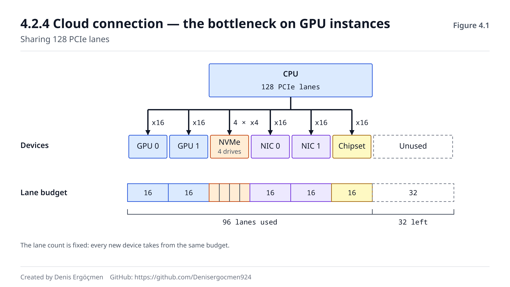
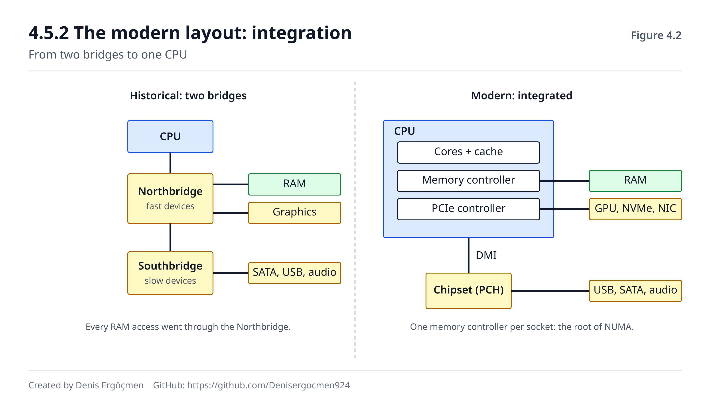

# Phase 4 — System Buses and I/O

> **Navigation:** [◀ Checkpoint Quiz 1](Checkpoint_Quiz_1.md) · **Phase 4** · [Phase 5 — Network Hardware ▶](Phase_5_Network_Hardware.md)

---

> ### This phase is short — but it can't be skipped.
>
> In Phases 0–3 we examined the parts one at a time: CPU, memory, disk. We never looked
> at any of them from the angle of **how they connect to each other**. Phase 4 fills that gap.
>
> Most of it sits at the `[concept]` level and doesn't directly drive day-to-day decisions.
> But **Phase 6 (virtualization) takes this phase as a prerequisite:** what SR-IOV, virtio
> and AWS Nitro actually do can't be understood without PCIe and DMA. The explanation of
> GPU bottlenecks and high-packet-rate network bottlenecks also lives here.

---

## Where we are coming from

In Phase 3 we made a few statements without explaining them:

| What we said in Phase 3 | Where it is answered here |
|---|---|
| "NVMe runs over **PCIe**" (3.3.2) | 4.2 — what PCIe is |
| "NVMe has a **low CPU cost** per command" (3.3.2) | 4.3 — DMA |
| "Queue depth determines parallelism" (3.2.5) | 4.4 — interrupts and polling |
| "Instance store is **inside** the server" (3.3.4) | 4.5 — device topology |

And a fact we carried over from Phase 2 will repeat here: **a shared path turns into a
bottleneck as the core count grows.** In memory it was the channel, in storage the queue,
here it is the lane.

---

## By the end of this phase

- You will be able to explain how the parts of a computer are connected to each other
- You will be able to do the PCIe lane and generation math and find a device's ceiling
- You will be able to explain why data transfer can be the bottleneck on GPU instances
- You will see why a world without DMA couldn't work
- You will understand why interrupt cost becomes a problem on high-packet-rate networks
- You will be ready to read the virtualization hardware in Phase 6

---

## Phase map

| Section | Topic | Depth | Why it matters |
|---|---|---|---|
| 4.1 | The bus concept | `[concept]` | The common language of all communication |
| 4.2 | PCIe | `[mechanism]` | The backbone of the modern system; GPU/NVMe/NIC all live here |
| 4.3 | DMA | `[mechanism]` | The foundation of Nitro and high-performance I/O |
| 4.4 | Interrupts | `[mechanism]` / `[concept]` | The source of the bottleneck at high packet rates |
| 4.5 | Chipset architecture | `[concept]` | Seeing the topology; the link to NUMA |

---

# 4.1 Bus — the data path

## 4.1.1 What a bus is `[concept]`

A **bus** is a communication path shared by multiple components. Instead of wiring every
component to every other component with its own cable, a common line is used.

A classic bus consists of three groups:

| Bus type | What it carries | What its width determines |
|---|---|---|
| **Address bus** | "Which address?" | The amount of addressable memory |
| **Data bus** | "What data?" | The number of bits carried at once |
| **Control bus** | "Read or write, ready?" | Coordination signals |

> In Phase 0.1.5, when we talked about 32-bit/64-bit, we saw that the address width
> determines addressable memory. The address bus is the physical counterpart of exactly
> that width.

## 4.1.2 The problem with a shared bus, and why it was abandoned `[concept]`

Older computers had a genuinely **shared** bus: every device hung off the same line (ISA,
PCI). This had two fundamental problems:

1. **Contention (arbitration).** Only one device can talk at a time. The others wait.
2. **Electrical limits.** As the line gets longer and the device count grows, the signal
   degrades; the frequency can't be raised.

> **This is the third instance of the pattern from Phase 2.4.3 and Phase 3.3.2.** One shared
> resource → contention → bottleneck. In memory the fix was multiple channels, in storage
> it was multiple queues. Here the fix was **point-to-point links**.

**The modern solution: not a bus, but switched point-to-point links.**

Although PCI Express (PCIe) has "bus" in its heritage, it isn't really a bus: every device
has **its own dedicated link** to the CPU (or to a switch).

```
OLD (shared bus):               MODERN (PCIe, switched):

  CPU                             CPU
   │                            ┌──┼──┬──────┐
  ═╪═══╪═══╪═══╪═  ← one line   │  │  │      │
   │   │   │   │               GPU NVMe NIC  ...
  GPU NVMe NIC ...              ↑ each on its own lanes,
   ↑ they take turns talking      all at full speed at once
```

> **The same solution applies to networking, and you'll see it in Phase 5.2:** old Ethernet
> hubs used a shared line, modern switches use point-to-point links. **Same problem, same
> solution, different layer** — the recurring pattern of this map.

---

# 4.2 PCIe — the backbone of the modern system

## 4.2.1 The lane concept `[mechanism]`

The basic unit of PCIe is the **lane**. A lane consists of two differential wire pairs:
one to transmit, one to receive. So **every lane is full duplex.**

Devices can use more than one lane:

| Configuration | Lane count | Typical device |
|---|---|---|
| x1 | 1 | Sound card, simple expansion |
| x4 | 4 | **NVMe SSD** |
| x8 | 8 | High-speed network card (25–100 Gbps) |
| x16 | 16 | **GPU** |

**Lanes run in parallel:** an x4 link gives four times the bandwidth of x1.

## 4.2.2 Generations and bandwidth math `[mechanism]`

Each PCIe generation roughly doubles the per-lane speed:

| Generation | Year | Per lane (one direction) | x4 (NVMe) | x16 (GPU) |
|---|---|---|---|---|
| Gen 3 | 2010 | ~1.0 GB/s | ~4 GB/s | ~16 GB/s |
| Gen 4 | 2017 | ~2.0 GB/s | ~8 GB/s | ~32 GB/s |
| Gen 5 | 2019 | ~4.0 GB/s | ~16 GB/s | ~64 GB/s |
| Gen 6 | 2022 | ~8.0 GB/s | ~32 GB/s | ~128 GB/s |

**Rule of thumb:**
```
Bandwidth ≈ Lane count × Generation speed  (separately for each direction)
Example: Gen4 x4 NVMe = 4 × 2.0 = 8 GB/s
```

**Connecting to Phase 3:** An NVMe SSD's ability to do 7,000 MB/s sequential reads (3.3.3)
is made possible by the 8 GB/s ceiling of a Gen4 x4 link. Plug the same SSD into Gen3 x4
and the ceiling drops to 4 GB/s — **the disk doesn't get slower, the road gets narrower.**

> **In practice this is a common surprise:** "I bought a new SSD but I'm not getting the
> advertised speed." The cause usually isn't the disk itself but the generation or lane
> count of the slot it's plugged into. On motherboards some M.2 slots run at x2, or filling
> one slot makes another slot lose lanes — because **the CPU's total lane count is limited.**

## 4.2.3 The lane budget — a limited resource `[mechanism]`

The total number of PCIe lanes a CPU provides is fixed:

```
Desktop CPU:     ~20–28 lanes
Server CPU:      ~64–128 lanes (per socket)
```

And they are shared:
```
Server example (128 lanes):
  2 × GPU      = 32 lanes
  4 × NVMe     = 16 lanes
  2 × 100G NIC = 32 lanes
  Chipset      = 16 lanes
  ─────────────────────────
  Total          96 lanes  (32 left)
```

> **Lane count is one of the most important features separating server CPUs from desktop
> CPUs** — as important as core count, but talked about far less. A server hosting many
> NVMe drives and network cards may be impossible to configure because of its lane budget,
> even when the core count is sufficient.
>
> It's exactly the same argument as the memory channels in Phase 2.4.3: **what sets
> server-class hardware apart isn't just being "more powerful", it's having more parallel
> paths.**

## 4.2.4 Cloud connection — the bottleneck on GPU instances `[application]`

In a GPU workload, data follows this path:

```
Storage → CPU memory (RAM) → PCIe → GPU memory (VRAM) → compute
                               ↑
                        THIS IS THE BOTTLENECK
```

In numbers:
```
The GPU's own memory bandwidth    : ~2,000–3,000 GB/s  (HBM)
Data transfer over PCIe Gen4 x16  :        ~32 GB/s
                                             ↑ ~70× narrower
```

**Result:** A GPU can spend more time waiting for data than computing.

> **This is the most common cause of the "GPU utilization is 30%" complaint in ML
> training.** The GPU isn't slow — **the feed line (the data pipeline) can't keep up.** Data
> is read from disk, preprocessed on the CPU, pushed across PCIe... and the GPU waits.
>
> The fixes have nothing to do with swapping hardware: more workers in the data loader,
> prefetching, keeping data in GPU memory, a bigger batch, moving preprocessing onto the
> GPU, storing data in a compressed/suitable format.
>
> **The third repetition of the lesson from Phase 2.3.6 and Answer 3.3:** the bottleneck is
> usually not in the most expensive component, but in the path that feeds it.

**NVLink.** NVIDIA offers a dedicated link that bypasses PCIe for GPU-to-GPU communication
(~600–900 GB/s). In multi-GPU training the GPUs constantly exchange gradients with each
other; that wouldn't be feasible over PCIe. AWS families such as `p4d`/`p5` contain
NVLink-connected GPUs — **"an 8-GPU instance" and "an 8-GPU instance with NVLink" are very
different things.**


*Figure 4.1 — How the lanes coming out of the CPU are distributed among the GPU, NVMe, NIC and chipset.*

> **🤔 Think 4.1**
> An ML team says their training jobs are slow. In the `nvidia-smi` output, GPU utilization
> keeps fluctuating between 25–35%, while GPU memory is nearly full.
>
> a) Is the problem the GPU's power? How would you tell?
> b) Would moving to an instance with a more expensive GPU help?
> c) Which three places would you investigate?
> *(Answer: at the end of the phase)*

---

# 4.3 DMA — taking the CPU out of the loop

## 4.3.1 If there were no DMA `[concept]`

Imagine reading 1 MB from a disk. Without DMA, the flow would look like this:

```
CPU: "Disk, give me the first word"
Disk: [data]
CPU: take the data → write it to RAM
CPU: "Give me the next word"
Disk: [data]
CPU: take the data → write it to RAM
... 262,144 times (1 MB ÷ 4 bytes)
```

This is called **programmed I/O (PIO)**, and it has two disasters:

1. **The CPU is completely busy.** It can't do any other work during the transfer.
2. **The CPU runs at the speed of the slowest component.** The pipeline, branch prediction
   and superscalar execution we built in Phase 1 are all reduced to waiting at disk speed.

A single file copy would lock up the server. Modern systems couldn't work this way.

## 4.3.2 How DMA works `[mechanism]`

**DMA (Direct Memory Access)** is a controller that lets devices write directly to RAM
**without going through the CPU**.

```
1. CPU  → instruction to the DMA controller:
          "Read 1 MB from the disk, write it to RAM at address 0x7f3a...,
           notify me when done"

2. CPU  → MOVES ON TO OTHER WORK  ← the critical point

3. DMA  → moves the data between disk and RAM (CPU not involved)

4. DMA  → when finished, sends the CPU an INTERRUPT

5. CPU  → "The data is ready" — carries on processing
```

**The CPU's total involvement: two brief moments.** Kick-off and the completion notice.
During the milliseconds in between, the CPU runs other threads.

> **A modern computer is impossible without DMA** — and that's no exaggeration. Receiving
> 10 Gbps of network traffic via PIO would by itself consume more than one CPU core. There
> would be no cores left for the user.

**DMA and cache consistency.** When a device writes directly to RAM, the copy of that
address in the CPU cache goes stale (the problem from Phase 2.3.8, this time between a
device and the CPU). On modern systems the hardware handles this (**cache-coherent DMA**);
where it doesn't, the operating system has to invalidate the affected cache lines.

## 4.3.3 Cloud connection — AWS Nitro `[application]`

**In traditional virtualization** (we'll go into detail in Phase 6.1), network and storage
I/O went through the hypervisor software:

```
Guest VM → hypervisor (SOFTWARE) → physical device
                   ↑
       consumes CPU cycles, adds latency
```

This could cost **20–30%** of the server's CPU. In other words, a third of the capacity you
could sell went out the door as a virtualization tax.

**What AWS Nitro did:** move this work onto a separate hardware card.

```
Guest VM → Nitro card (SEPARATE HARDWARE) → network / storage
                   ↑
       almost no involvement from the main CPU
```

The Nitro card has its own processor, its own memory and its own DMA engine. The main
server's CPU is almost entirely dedicated to the customer.

| | Traditional hypervisor | Nitro |
|---|---|---|
| I/O processing | Software on the main CPU | Separate hardware card |
| Virtualization tax | 20–30% | **Under 1%** |
| Network latency | High, variable | Low, consistent |
| Security boundary | Software | **Physical separation** |

> **And this is the clearest example of an architectural decision in the cloud turning into
> hardware.** By moving a problem that was solved in software onto hardware, AWS both sold
> more capacity to customers and strengthened the security boundary. The very existence of
> `.metal` instance types relies on this too — network and storage can work without a
> hypervisor, because the hypervisor was never the one doing them.
>
> We'll complete this topic in the virtualization context in Phase 6.4.

---

# 4.4 Interrupts — hardware asks for attention

## 4.4.1 What an interrupt is `[mechanism]`

An **interrupt** is the way a hardware device gets the CPU's attention.

```
The CPU is running a program...
        ↓
Network card: "A packet arrived!" → IRQ signal
        ↓
CPU: saves the current state (registers, PC — Phase 1.1.3)
        ↓
CPU: looks up the handler address in the interrupt vector table
        ↓
CPU: runs the interrupt handler
        ↓
CPU: restores the state, continues where it left off
```

**IRQ (Interrupt Request):** Each device type has an interrupt number; that's how the
operating system knows which handler to call.

**The cost of an interrupt — and that cost rests on Phase 1:**

| Cost item | Why |
|---|---|
| Saving/restoring context | ~1–2 μs |
| **Pipeline flush** | Phase 1.4 — the full pipeline is thrown away |
| **Cache pollution** | Phase 2.3 — the handler's data evicts the program's data |
| User/kernel mode transition | Spectre mitigations after Phase 1.4.4 made this expensive |

> **The real cost of an interrupt isn't the context switch itself, but the indirect damage
> you learned about in Phases 1 and 2:** the pipeline has to refill, the cache has to warm
> up, the branch predictor has to relearn. That's why a microsecond-scale operation keeps
> being felt for many microseconds afterward.

## 4.4.2 Polling and the interrupt storm `[concept]`

**Polling:** the CPU checks the device on its own, at regular intervals.

| | Interrupt | Polling |
|---|---|---|
| If events are **rare** | ✅ Efficient — the CPU doesn't spin | ❌ Pointless checks, wasted cycles |
| If events are **frequent** | ❌ **Interrupt storm** | ✅ Efficient — there's always data anyway |
| Latency | Low | Depends on the polling interval |

**Interrupt storm** — a concrete calculation:

```
10 Gbps link, 1500-byte packets:
  10,000,000,000 bit/s ÷ (1500 × 8 bits) ≈ 833,000 packets/second

If every packet raised its own interrupt:
  833,000 interrupts/s × ~2 μs = 1.67 seconds/second
  → ONE CORE IS NOT ENOUGH. The system can do nothing but process packets.
```

With small packets (64 bytes) it gets much worse: ~14.8 million packets/second.

**The fix: NAPI — a hybrid approach.**

The Linux network stack combines the two:
```
While traffic is low    → interrupt mode (so the CPU can idle, latency stays low)
When packets arrive     → DISABLE interrupts, switch to polling mode
When the queue empties  → re-enable interrupts
```

This way you get the latency advantage of interrupts at low traffic and the throughput
advantage of polling at high traffic.

> **This "batch it when traffic is heavy, react instantly when it's sparse" pattern repeats
> at every layer:** the log buffering in Answer 3.1, group commit in databases, Kafka's
> batching, TCP's Nagle algorithm. **The same trade-off: latency or throughput.**

We'll see NAPI again in the network card context in Phase 5.1.4.

## 4.4.3 Interrupt distribution and CPU affinity `[application]`

On a multi-core system, if interrupts all land on a single core, that core drowns.

Thanks to **MSI-X** (Message Signaled Interrupts eXtended), modern devices offer **multiple
interrupt lines**, and these can be spread across different cores.

```bash
cat /proc/interrupts | head -20
```
**Expected output (network card lines):**
```
            CPU0       CPU1       CPU2       CPU3
 24:     1245678          0          0          0   PCI-MSI  eth0-rx-0
 25:           0    1198234          0          0   PCI-MSI  eth0-rx-1
 26:           0          0    1201456          0   PCI-MSI  eth0-rx-2
 27:           0          0          0    1189012   PCI-MSI  eth0-rx-3
              ↑ balanced distribution = healthy
```

If all the counts pile up in a single column, that core is the bottleneck.

> **Cloud connection:** In high-packet-rate workloads (load balancers, API gateways,
> proxies), interrupt imbalance **is a real bottleneck and doesn't show up in the total CPU
> metric** — `top` shows 30% CPU on average while one core sits at 100%. You have to look
> per core with `mpstat -P ALL 1`.
>
> We'll complete this topic with RSS (Receive Side Scaling) in Phase 5.1.4.

> **🤔 Think 4.2**
> On an API gateway server, `top` shows an average of 35% CPU, yet latency is high and
> there is packet loss.
>
> a) Which three causes from this phase and earlier phases would you investigate?
> b) Which commands would you use to confirm them?
> *(Answer: at the end of the phase)*

---

# 4.5 Chipset and motherboard architecture `[concept]`

## 4.5.1 The historical layout: Northbridge / Southbridge

In the past, the CPU connected to the outside world through two chips:

```
        CPU
         │
    ┌────┴────┐
    │Northbr. │──── RAM        ← FAST devices
    │         │──── AGP/PCIe (graphics)
    └────┬────┘
         │
    ┌────┴────┐
    │Southbr. │──── SATA, USB, audio, network, BIOS   ← SLOW devices
    └─────────┘
```

The **Northbridge** handled the fast ones (memory, graphics), the **Southbridge** the slow ones.

## 4.5.2 The modern layout: integration

Today the Northbridge's function has **moved inside the CPU:**

```
   ┌─────────────────────────────┐
   │  CPU                        │
   │  ├─ Cores + cache           │
   │  ├─ MEMORY CONTROLLER       │──── RAM (directly)
   │  └─ PCIe CONTROLLER         │──── GPU, NVMe, NIC (directly)
   └──────────────┬──────────────┘
                  │ (DMI / Infinity Fabric)
          ┌───────┴────────┐
          │ Chipset (PCH)  │──── USB, SATA, audio, low-speed PCIe
          └────────────────┘
```

**Why was the memory controller moved into the CPU?** The calculation from Phase 1.3.1: at
3 GHz a signal travels ~5–7 cm in one cycle. When the memory controller lived on a separate
chip, every access had to go to that chip and back — **an extra 20–30 cycles.** Moving it
inside delivered a direct latency gain.

> **And this is the reason for NUMA in Phase 2.7.** Because the memory controller moved into
> the CPU, a two-socket system has **two separate memory controllers** — each attached to its
> own RAM. Accessing the remote socket means going through the other CPU's controller.
>
> **NUMA is the inevitable result of integration.** In Phase 2 you learned NUMA as a fact;
> now you know why it exists.

**The inter-socket link:** **UPI** on Intel, **Infinity Fabric** on AMD. These let one CPU
access the other's memory and devices — they are the arrow in the diagram in Phase 2.7.1.

> **How this looks in the cloud:** A device (NVMe, NIC) is physically attached to one socket.
> If the workload using that device runs on the other socket, **every I/O crosses the
> inter-socket link.** This is the basis of "NUMA-aware I/O" and makes a measurable
> difference on `.metal` or very large instances.


*Figure 4.2 — Moving the memory and PCIe controllers into the CPU, and how that relates to NUMA.*

---

# 4.6 When This Phase Breaks — Failure Signatures

| Symptom | Likely mechanism | Where | First look |
|---|---|---|---|
| NVMe delivers half its advertised speed | The slot runs at Gen3 or x2 | 4.2.2 | The `lspci -vv` LnkSta line |
| GPU utilization 30%, VRAM full | PCIe / data pipeline bottleneck | 4.2.4 | Data loader, batch size |
| `top` shows 35% but one core is at 100% | Interrupts piled up on one core | 4.4.3 | `mpstat -P ALL 1`, `/proc/interrupts` |
| CPU runs out at high packet rates | Interrupt storm | 4.4.2 | NAPI/coalescing settings |
| I/O slower than expected on a large instance | Device remote in NUMA terms | 4.5.2 | `lstopo`, device–socket affinity |
| The virtualization layer eats CPU | Software I/O path (pre-Nitro architecture) | 4.3.3 | Move to a Nitro-based generation |

> **🔧 Verify your PCIe link** (optional)
> ```bash
> lspci | grep -i -E "nvme|ethernet|vga"
> sudo lspci -vv -s <address> 2>/dev/null | grep -E "LnkCap|LnkSta"
> ```
> **Expected output:**
> ```
> LnkCap: Speed 16GT/s, Width x4      ← what the device SUPPORTS
> LnkSta: Speed 16GT/s, Width x4      ← what it is currently RUNNING at
> ```
> If the two differ (e.g. `LnkCap: 16GT/s` but `LnkSta: 8GT/s`), the device is running at
> reduced speed — caused by the slot, the cable or power management. On virtual machines
> this information usually isn't visible; it's meaningful on bare metal and `.metal`
> instances.

---
# Phase 4 — Answers to the Think questions

## Answer 4.1 — GPU utilization 25–35%, VRAM full

**a) The problem is not the GPU's power. The evidence is in the question itself.**

GPU utilization **can't reach 100%** and it **fluctuates.** Together, these two observations
say one thing: **the GPU is waiting.** If the GPU lacked power, utilization would stay flat
at 95–100% and the job would simply take longer.

VRAM being full is a misleading comfort — the memory may be *allocated* while the compute
units sit idle. In `nvidia-smi` output, `GPU-Util` and `Memory-Used` are **different
things**; one is compute, the other is allocation.

**How to make sure:**
```bash
nvidia-smi dmon -s pucm        # util/power/clock/memory over time
```
- If power draw is far below the TDP → the GPU isn't straining, it's waiting
- If `sm` (streaming multiprocessor) utilization is low but memory copy (`mem`) is high →
  transfer bottleneck

A profiler (PyTorch Profiler, Nsight Systems) also shows the gaps where the GPU sits idle
directly on its timeline.

**b) A more expensive GPU won't help — it will probably make things worse.**

A faster GPU processes the same data faster and **waits longer.** Utilization drops from
30% to 15%, total time barely shrinks, and the cost doubles.

> **This is the same lesson as Phase 2.3.6, Answer 3.3 and 4.2.4:** strengthening a
> component that isn't the bottleneck spends money without solving the problem. Amdahl's
> law in practice.

**c) Three places to investigate — and in what order:**

**1. The data loading pipeline (the most common cause)**
```python
DataLoader(dataset,
    num_workers=8,        # a single worker bottlenecks on the CPU
    pin_memory=True,      # pinned memory → DMA more efficient (4.3.2)
    prefetch_factor=4,    # prepare the next batch while the GPU works
    persistent_workers=True)
```
With `num_workers=0` (the default), preprocessing happens on the main thread and the GPU
waits between every batch. This single line often buys a 2–4× gain.

**2. The storage pipeline (Phase 3)**
- If the data is on EBS as small files → **IOPS-bound** (3.4.3). Millions of small image
  files are a classic ML bottleneck.
- Fix: store the data in packed formats (TFRecord, WebDataset, Parquet) → **large sequential
  reads** instead of small random reads (the lesson of 3.1.3)
- Or copy the data to instance store (local NVMe) — exactly the "reproducible data" case
  from FAQ Q5 in Phase 3

**3. The PCIe transfer (4.2.4)**
- Increase the batch size → more work per transfer
- Move preprocessing onto the GPU (NVIDIA DALI, augmentation on the GPU)
- `pin_memory=True` → skips the copy step from pageable memory
- If possible, keep the whole dataset in VRAM

> **Order matters:** 1 and 2 are free or cheap and solve most cases. 3 requires code
> changes. An instance upgrade is **not** on the list — because the bottleneck isn't there.

## Answer 4.2 — `top` shows 35%, but latency is high and there is packet loss

**a) Three causes — all from the "average metrics lie" family:**

**1. Interrupt imbalance (4.4.3) — the most likely.**
If network interrupts all land on one core, that core is at 100% while the others idle. On
an 8-core machine, one saturated core shows up in the average as **12.5%**. The 35% that
`top` shows may well contain a 100% inside it.

**2. Interrupt storm and softirq load (4.4.2).**
At high packet rates, much of the CPU time goes into the `si` (softirq) category. That time
shows up in `top`'s overall percentage but **doesn't read as time spent on user work** —
the system is too busy processing packets to run the application.

**3. Queue saturation — unrelated to CPU (the curve from 3.4.4).**
The NIC's ring buffer may be full. Packets are being dropped, but the CPU isn't busy,
because the packets never reach the CPU at all. In the same way, the connection pool, the
thread pool or the `somaxconn` queue may be full.

**A fourth possibility (from Phase 2):** a cache/memory bottleneck — the CPU doesn't look
"busy" but IPC is low. Less likely in this scenario, but keep it on the table.

**b) Confirmation commands — in order:**

```bash
# 1. Per-core distribution — what the average hides
mpstat -P ALL 1 5
```
**Expected (if there is a problem):**
```
CPU   %usr  %sys  %soft  %idle
all   18.2   9.1   7.8    64.9      ← the average looks innocent
  0    5.1   3.2  91.5     0.2      ← CPU0 is DROWNING in softirq
  1   21.0  10.1   0.1    68.8
  2   20.5   9.8   0.0    69.7
```

```bash
# 2. Which core the interrupts land on
cat /proc/interrupts | grep -E "eth|ens|enp"

# 3. Are packets being dropped at the NIC level
ip -s link show eth0
ethtool -S eth0 | grep -i -E "drop|discard|error|miss|overrun"

# 4. Is the ring buffer filling up
ethtool -g eth0

# 5. Socket-level queues
ss -s
netstat -s | grep -i -E "overflow|dropped|pruned"
```

**Typical findings and their fixes:**

| Finding | Fix |
|---|---|
| Softirq 90%+ on a single core | **Spread interrupts with RSS/RPS** (Phase 5.1.4) |
| `rx_dropped` keeps rising | Enlarge the ring buffer (`ethtool -G`) |
| Very high interrupt count | Enable **interrupt coalescing** (`ethtool -C`) — throughput at the cost of latency |
| Everything normal, still losing packets | Look at the application layer: queues, thread pool, GC pauses |

> **The real lesson of this question:** average metrics hide the distribution. `top`'s 35%
> does **not** mean "65% of capacity is idle" — a single saturated core is enough to choke
> the system.
>
> The same mistake is made at every layer: average latency is fine but p99 is terrible;
> average disk utilization is low but one volume is saturated; memory is free on average but
> one NUMA node is full. **Don't look at the average — look at the tail of the distribution.**

---

# Phase 4 — Frequently asked questions

> **Q1: Does the PCIe generation really make a difference? Isn't Gen3 enough?**
>
> It depends on the device:
> - **NVMe SSD (x4):** Gen3 = 4 GB/s. If a high-end SSD can do 7 GB/s, **you lose half of
>   it.** It matters.
> - **GPU (x16):** Gen3 = 16 GB/s. If the model fits in VRAM and transfers are few, the
>   difference is small; if data flows continuously (4.2.4), it matters noticeably.
> - **Network card:** 25 Gbps ≈ 3 GB/s → Gen3 x8 is more than enough. 100 Gbps needs Gen4.
>
> **Rule:** Calculate the device's needs and compare them with the path's capacity. If the
> path is wider than the device, the generation doesn't matter.

> **Q2: Can I see PCIe on a cloud instance?**
>
> Partly. `lspci` lists devices, but the virtualization layer hides the real topology — what
> you see is usually a virtual device (virtio) or a virtual function exposed via SR-IOV
> (Phase 6.5).
>
> **On `.metal` instances** you see the real hardware: `lspci -vv`, `lstopo`, PCIe link
> speeds, NUMA topology. That's one of the reasons `.metal` types are preferred for
> hardware-sensitive workloads.
>
> In practice: you can't tune PCIe on regular instances; **this knowledge is useful for
> explaining behavior, not for intervening.**

> **Q3: Should I enable interrupt coalescing?**
>
> **Coalescing** means the NIC accumulates several packets and raises a single interrupt.
> The classic latency/throughput trade-off:
>
> | | Coalescing off | Coalescing on |
> |---|---|---|
> | Latency | **Low** | Higher (+10–200 μs) |
> | CPU cost | High | **Low** |
> | At high pps | CPU runs out | Holds up |
>
> **Decision:** Throughput-oriented workload (data transfer, backup, batch jobs) → enable it.
> Latency-oriented (trading system, real-time gaming, low-latency API) → disable it or tune
> it aggressively.
>
> In the cloud the provider's default is usually reasonable; **measure** before changing it.

> **Q4: Isn't DMA a security risk? What if a device can write anywhere in RAM?**
>
> Yes, it is a real risk, and it has a name: **DMA attacks** (attacks over Thunderbolt are
> the famous example).
>
> **The fix: the IOMMU** (Intel VT-d, AMD-Vi). It's an MMU for devices — the device version
> of the virtual memory from Phase 2.5. It grants each device access only to the memory
> regions it's allowed to touch.
>
> **And the IOMMU is critical for the cloud:** SR-IOV, which you'll see in Phase 6.6.3,
> makes it possible to hand one physical device directly to multiple VMs. Without an IOMMU,
> one VM's device could DMA into another VM's memory. **The IOMMU is what makes tenant
> isolation at the hardware level possible.**

> **Q5: Is this phase really necessary for a cloud engineer? I'll never tune PCIe.**
>
> True, you won't tune it. But it will be directly useful in three places:
>
> 1. **In GPU/ML workloads** — the question "why is GPU utilization low?" can't be answered
>    without this phase (Answer 4.1), and every cloud engineer who works with ML teams runs
>    into that question
> 2. **On high-packet-rate networks** — interrupt imbalance doesn't show up in average
>    metrics (Answer 4.2)
> 3. **For all of Phase 6** — Nitro, SR-IOV, virtio, IOMMU: all of them are built on top of
>    this phase
>
> There's also a more general payoff: this phase plants the idea that **"the path between
> components is a resource too."** Sizing CPU, memory and disk separately while forgetting
> the path between them is a common architectural mistake.

---

# Phase 4 — Test yourself

**Part A — Fundamentals (1–6)**

1. Write down what the address bus, data bus and control bus each carry.
2. Why isn't PCIe a "bus" in the true sense?
3. What is the theoretical one-direction bandwidth of a PCIe Gen4 x4 NVMe? Calculate it.
4. Without DMA, how would a 1 MB disk read play out from the CPU's point of view?
5. Write the fundamental difference between interrupts and polling, and the situation each
   one suits.
6. Name two consequences of moving the memory controller into the CPU (one positive, one
   negative).

**Part B — Mechanism (7–12)**

7. A GPU's own memory bandwidth is ~2,000 GB/s, while PCIe Gen4 x16 is ~32 GB/s. What
   problem does this gap create?
8. Why is the cost of an interrupt not just the context switch time? Name two reasons from
   Phases 1 and 2.
9. How many packets per second arrive on a 10 Gbps link with 1500-byte packets? Why doesn't
   a separate interrupt per packet work?
10. How does NAPI work, and which two worlds does it take the best of?
11. Which design decision covered in this phase is the reason NUMA exists?
12. What is an IOMMU, and why is it critical in the cloud?

**Part C — Application and reasoning (13–18)**

13. Your new NVMe delivers half its advertised speed. Which command would you use, and what
    would you look at?
14. `top` shows 35% CPU on average, but the system is losing packets. Which command would
    you run, and what would you look for?
15. An ML team says "let's get a more powerful GPU", and GPU utilization is 30%. What would
    you ask?
16. For which workload would you enable interrupt coalescing, and for which would you
    disable it?
17. What problem did AWS Nitro solve, and how?
18. Why is looking only at a device's own speed insufficient when evaluating its
    performance? Give one example from this phase and one from Phase 3.

---

## Answer key

**1. Address bus:** which address to access (its width determines the amount of addressable
memory). **Data bus:** the data itself (its width determines how many bits are carried at
once). **Control bus:** the type of operation and coordination signals (read/write, ready,
interrupt). *(4.1.1)*

**2.** Because it consists of **switched point-to-point links, not a shared line.** Every
device has its own dedicated lanes to the CPU (or to a switch); devices can communicate at
full speed simultaneously. The "bus" name is historical continuity. *(4.1.2)*

**3.** `4 lanes × 2.0 GB/s = 8 GB/s` (separately for each direction — PCIe is full duplex).
*(4.2.2)*

**4.** Via **programmed I/O (PIO)**: the CPU would read every word from the disk one by one
and write it to RAM — ~262,000 loop iterations for 1 MB. During that time the CPU **can't do
any other work** and runs at the speed of the slowest component. The pipeline, branch
prediction and superscalar execution built in Phase 1 all become pointless. *(4.3.1)*

**5. Interrupt:** the device signals the CPU when it's ready; until then the CPU does other
work. **Polling:** the CPU checks the device itself at regular intervals. **When events are
rare, interrupts** are efficient (the CPU doesn't spin needlessly); **when events are
frequent, polling** is efficient (no interrupt cost is paid). *(4.4.2)*

**6. Positive:** memory access latency dropped noticeably — the ~20–30 cycles of the round
trip to a separate chip disappeared. **Negative:** on multi-socket systems each CPU has its
own memory controller, so **NUMA** was born — accessing the remote socket became 1.5–2×
more expensive. *(4.5.2)*

**7.** The GPU ends up **waiting** more than processing. Its compute capacity is ~70× its
feed rate, so in workloads where data flows continuously, GPU utilization stays low. The
classic symptom: 25–35% utilization in `nvidia-smi`. *(4.2.4)*

**8.** (a) **Pipeline flush** — Phase 1.4: the full pipeline is discarded, and refilling it
takes tens of cycles. (b) **Cache pollution** — Phase 2.3: the interrupt handler's data
evicts the running program's cache lines; when the program resumes it has to warm the cache
up again. The branch predictor gets disturbed as well. *(4.4.1)*

**9.** `10,000,000,000 ÷ (1500 × 8) ≈ 833,000 packets/second.` A ~2 μs interrupt per packet
means 1.67 seconds of work per second — **one core isn't enough**, and the system can do
nothing but process packets. With 64-byte packets it's much worse, at ~14.8 million pps.
*(4.4.2)*

**10.** It runs in **interrupt** mode while traffic is low (the CPU can idle, latency is
low); when packets arrive it **disables interrupts and switches to polling** (no interrupt
cost at high traffic); when the queue empties it re-enables interrupts. That way it gets
**the latency advantage of interrupts at low traffic and the throughput advantage of polling
at high traffic.** *(4.4.2)*

**11.** **Integrating the memory controller into the CPU.** When the controller sat on a
separate chip, all CPUs shared the same controller (uniform access). Once it moved inside,
every socket got its own controller and its own RAM → access to the remote socket's RAM
became different → NUMA. *(4.5.2)*

**12. The IOMMU** is an MMU for devices — the device version of the virtual memory in Phase
2.5. It restricts the memory regions each device can access via DMA. **It's critical in the
cloud** because with SR-IOV one physical device is handed directly to multiple VMs; without
an IOMMU, one VM's device could write into another VM's memory. **It's the mechanism that
makes tenant isolation at the hardware level possible.** *(FAQ Q4)*

**13.**
```bash
sudo lspci -vv -s <address> | grep -E "LnkCap|LnkSta"
```
**`LnkCap`** shows what the device supports, **`LnkSta`** what it's currently running at. If
they differ (e.g. Cap 16GT/s x4, Sta 8GT/s x2), there is a downgrade caused by the slot, the
generation or lane sharing. On virtual machines this information usually isn't visible.
*(4.6)*

**14.**
```bash
mpstat -P ALL 1 5
```
**What to look for:** a very high (>80%) `%soft` or `%sys` value on a single core. While the
35% average looks innocent, one core may be saturated. Then check the interrupt distribution
with `/proc/interrupts` and dropped packets with `ethtool -S`. *(4.4.3, Answer 4.2)*

**15.** At least four questions: (a) **"Does GPU utilization reach 100%, or does it
fluctuate?"** — if it fluctuates, the GPU is waiting; power isn't the issue. (b) **"What is
`num_workers`, and is `pin_memory` enabled?"** — if the data loader is single-threaded, the
bottleneck is there. (c) **"Where does the data live, and what are the file sizes?"** —
millions of small files = IOPS bottleneck (3.4.3). (d) **"Have we seen the gaps where the GPU
sits idle with a profiler?"** — no decision should be made without measuring. *(Answer 4.1)*

**16. I'd enable it:** for throughput-oriented, latency-insensitive workloads — data
transfer, backup, batch processing, stream processing. **I'd disable it / tune it
aggressively:** for low-latency workloads — real-time APIs, financial trading, game servers.
It's the classic latency/throughput trade-off. *(FAQ Q3)*

**17. Problem:** in traditional virtualization, network and storage I/O went through the
hypervisor **software**, and that consumed **20–30%** of the server's CPU — a third of the
sellable capacity was lost. **Solution:** move this work onto a separate hardware card with
its own processor, memory and DMA engine. Result: the virtualization tax fell below 1%,
latency became consistent, and the security boundary moved from software to **physical
separation.** *(4.3.3)*

**18.** Because **the path to a device is a resource just like the device, and that path can
be the bottleneck.**
- **From this phase:** an NVMe that supports Gen4 x4, plugged into a Gen3 x2 slot, delivers a
  quarter of its speed (4.2.2). A GPU runs at 30% of its capacity because of PCIe bandwidth
  (4.2.4).
- **From Phase 3:** you give an `io2` volume 64,000 IOPS, but the instance's EBS bandwidth
  caps out at 20,000 — you don't get what you pay for (3.4.5).

---

## Scoring

| Correct answers | Assessment |
|---|---|
| 16–18 | Move on to Phase 5. |
| 12–15 | You can move on to Phase 5. Read 4.3 and 4.4 once more. |
| 8–11 | Repeat 4.2 and 4.4 — Phase 6 depends on them. |
| 0–7 | Go through the phase again from the start. Phase 6 in particular can't be understood without 4.3 (DMA) and 4.4 (interrupts). |

---

# Phase 4 — Closing and Bridge to Phase 5

## What you carry out of this phase

| Concept | Why you carry it forward |
|---|---|
| **The path is a resource too** | The network in Phase 5, instance limits in Phase 7 |
| **Shared line → point-to-point** | The hub → switch transition in Phase 5.2 is exactly the same story |
| **DMA** | How the NIC receives packets in Phase 5.1; Nitro/SR-IOV in Phase 6 |
| **Interrupts vs polling, NAPI** | Continues directly in Phase 5.1.4 |
| **Interrupt distribution (MSI-X)** | Will expand into RSS in Phase 5.1.4 |
| **IOMMU** | The prerequisite for SR-IOV in Phase 6.6.3 |
| **Average metrics hide the distribution** | The core warning of observability in Phase 7 |

## Where Phase 5 connects to this

Phase 5 is this phase's continuation, specific to the network card. It picks up the concepts
of interrupts, DMA and buffers right where you left them:

| What you learned in Phase 4 | How it will show up in Phase 5 |
|---|---|
| 4.3 DMA | How the NIC writes an incoming packet directly to RAM |
| 4.4.2 NAPI | The full interrupt/polling switch in the network stack |
| 4.4.3 MSI-X distribution | RSS — spreading packets across cores |
| 4.1.2 switched links | Hub → switch: the network version of the same evolution |
| 4.2.4 PCIe bottleneck | The PCIe requirements of a 100 Gbps NIC |
| The queue curve (from 3.4.4) | Latency and packet loss in network queues |

> **Phase 5 is where three maps intersect.** Here we cover network *hardware*; network
> *protocols* (IP, TCP, DNS, TLS) belong to the network map. This phase lays the physical
> ground for that map — **to understand why a packet is delayed, you first need to know its
> physical journey.**

---

> **Navigation:** [◀ Checkpoint Quiz 1](Checkpoint_Quiz_1.md) · **Phase 4** · [Phase 5 — Network Hardware ▶](Phase_5_Network_Hardware.md)
