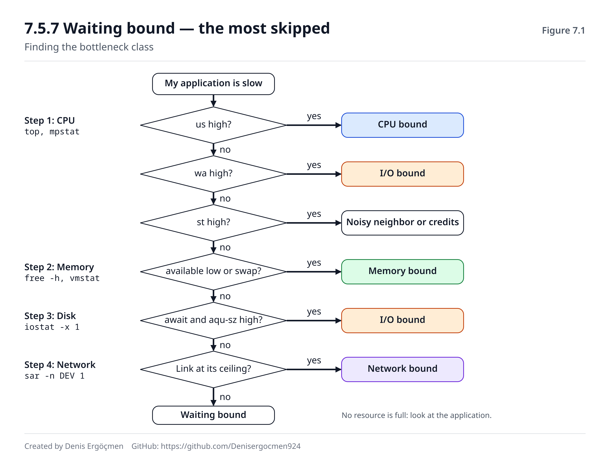

# Phase 7 — Cloud Connection

> **Navigation:** [◀ Phase 6 — Virtualization Hardware](Phase_6_Virtualization_Hardware.md) · **Phase 7** · [Checkpoint Quiz 2 ▶](Checkpoint_Quiz_2.md)

---

> ### This phase teaches no new knowledge.
>
> It turns everything you accumulated from Phase 0 through Phase 6 into **decisions.**
>
> Up to here the questions were of the form "how does this work?". From now on the
> questions are: **"Which instance for this workload? Why? Where do you look when it
> slows down?"**
>
> And you will answer from **physics**, not from a price list. That was the entire
> purpose of this map.

---

## Where we are coming from

This phase uses all seven previous phases at once:

| Phase | What it brings here |
|---|---|
| **0** Numeric foundation | The language of the terms |
| **1** CPU | Clock, IPC, core/thread, what a vCPU actually is |
| **2** Memory | Cache hierarchy, bandwidth, NUMA, **the root of noisy neighbors** |
| **3** Storage | The IOPS/throughput/latency trio, the physics of EBS |
| **4** Bus/IO | PCIe budget, DMA, interrupts, the hardware basis of Nitro |
| **5** Network | Bandwidth ≠ latency, BDP, burst models |
| **6** Virtualization | VM exit, steal time, SR-IOV, the resources that cannot be quota'd |

---

## By the end of this phase

- You will be able to hear a workload description and make a **justified** instance recommendation
- You will read EC2 family letters by their **physical meaning**, not by memorization
- You will tell the three noisy-neighbor mechanisms apart and act on each of them
- You will be able to reduce "my application is slow" to a bottleneck class in 20 minutes
- You will do capacity planning by measurement, not by guesswork
- You will be able to compare the **real** costs of over- and under-provisioning

---

## Phase map

| Section | Topic | Depth | Why it matters |
|---|---|---|---|
| 7.1 | Reading instance families through physics | `[application]` | A decision made every day |
| 7.2 | AWS Nitro | `[application]` | All of modern EC2 stands on it |
| 7.3 | Choosing EBS | `[application]` | The most frequently mis-made choice |
| 7.4 | **Noisy neighbors — full analysis** | `[application]` | **The hardest diagnosis in the cloud** |
| 7.5 | **Bottleneck detection** | `[application]` | **The heart of the phase — a daily work skill** |
| 7.6 | Capacity planning | `[application]` | Where money and reliability intersect |

---

# 7.1 Reading EC2 instance families on a physical basis

## 7.1.0 Decoding the name `[application]`

```
m 7 i . 2xlarge
│ │ │      │
│ │ │      └─ size (xlarge = 4 vCPU; 2xlarge = 8, each step doubles)
│ │ └─────── processor: i=Intel, a=AMD, g=Graviton(ARM)
│ └───────── generation (7 = 7th generation)
└─────────── family (m = general purpose)
```

**Extra letters:**

| Letter | Meaning |
|---|---|
| `d` | Has local NVMe (instance store) |
| `n` | Enhanced network bandwidth |
| `e` | Extended memory |
| `z` | High frequency (high clock) |

`m7gd.4xlarge` = 7th generation, general purpose, Graviton, with local NVMe, 16 vCPU.

> **The generation number is not a detail.** Each generation typically brings 10–20%
> better price/performance — a newer CPU, wider memory bandwidth, better Nitro cards.
> **Staying on an old generation is a silent cost.**

## 7.1.1 General purpose — the `m` family `[application]`

```
vCPU : RAM  =  1 : 4      (m7i.xlarge = 4 vCPU, 16 GB)
```

**Its physical meaning:** No special optimization on either the CPU or the memory side.
Balanced L3, medium clock, standard number of memory channels.

| Suitable | Not suitable |
|---|---|
| Web server, application server | Heavy compute (c is cheaper) |
| Small-to-medium database | In-memory data set (needs r) |
| Microservices | High IOPS (needs i) |
| **The starting point when you don't know** | |

> **Practical rule:** If you don't know what a new workload wants, start with `m`,
> **measure**, then move. Choosing `c` or `r` by guesswork costs more than moving off
> `m` after measuring.

## 7.1.2 Compute optimized — the `c` family `[application]`

```
vCPU : RAM  =  1 : 2      (c7i.xlarge = 4 vCPU, 8 GB)
```

**Its physical meaning — what separates this family from `m` is not that it has less RAM:**

| Property | Why it matters | From which phase |
|---|---|---|
| **High sustained clock** | Single-thread performance | Phase 1.3.1 |
| **More L3 per vCPU** | Better chance of fitting in cache | Phase 2.3.4 |
| Newer CPU generation (usually) | Better IPC | Phase 1.3.2 |

```
Suitable workloads:
  • Video encoding (transcoding)
  • Scientific computing
  • Batch data processing
  • High-traffic web (CPU-bound)
  • Game servers (low latency, single thread)
```

> **The cache point matters a great deal.** In the `c7i` family the L3 per vCPU is
> markedly higher than in `m7i`. The lesson of Phase 2.3: **if the working set fits in
> L3, performance changes by a factor of 5.** If a workload speeds up more than expected
> when moving from `m` to `c`, the cause is usually cache, not clock.

## 7.1.3 Memory optimized — the `r`, `x`, `u` families `[application]`

```
r family : 1 : 8    (r7i.xlarge = 4 vCPU, 32 GB)
x family : 1 : 16   (x2idn.xlarge = 4 vCPU, 64 GB)
u family : 1 : 24+  (u-6tb1.metal = 448 vCPU, 6 TB)
```

**They serve two different needs — don't conflate them:**

| Need | Example |
|---|---|
| **Capacity** — the data must fit in RAM | Redis, Memcached, in-memory database |
| **Bandwidth** — the data must flow fast out of RAM | Analytics, big JOINs, columnar scans |

**Memory bandwidth** *(Phase 2.4.3)*: the r family has more memory channels.

```
The formula from Phase 2.4.3:
  Bandwidth = Number of channels × Speed per channel

8 channels DDR5-4800 ≈ 307 GB/s
4 channels DDR5-4800 ≈ 154 GB/s
```

> **Critical warning (Phase 2.7 — NUMA):** Large `r` and `x` instances span more than one
> NUMA node. Buying a `.24xlarge` is **not always** better than buying two `.12xlarge` —
> remote node access is 1.5–2× slower. If your workload is NUMA-aware, the big instance
> wins; if it isn't, two small instances are more predictable.

## 7.1.4 Storage optimized — the `i`, `d` families `[application]`

```
i family : High-IOPS NVMe instance store
d family : High-capacity HDD/NVMe
```

**Its physical meaning — the difference from EBS:**

| | Instance store (i/d) | EBS |
|---|---|---|
| Connection | **PCIe, direct** *(Phase 4.2)* | **Over the network** *(Phase 5)* |
| Latency | **~50–100 μs** | ~0.5–2 ms |
| IOPS | **Millions** | gp3: 16,000, io2: 256,000 |
| Persistence | ❌ **Lost when the instance stops** | ✅ Persistent |
| Snapshots | ❌ | ✅ |

> **The phrase "over the network" in that table is the single most important thing to
> know about EBS** *(Phase 3.3.4)*. EBS is not a disk; it is a storage service reached
> over the network. The floor of its latency is network latency; its IOPS limit is a
> network quota.

```
Suitable workloads (i family):
  • NoSQL (Cassandra, ScyllaDB, Aerospike)
  • Elasticsearch / OpenSearch data nodes
  • Cache tiers that need high IOPS
  • Data warehouse scratch space (spill, shuffle)
```

**How the persistence problem is solved:** replication at the application layer.
Cassandra and Elasticsearch already do this — when a node is lost, the data is on the
other nodes. **Do not use instance store for single-copy data that has no replication.**

## 7.1.5 Accelerated — the `p`, `g`, `inf`, `trn` families `[application]`

> **Do not confuse the two `g`s:** here `g` is a **family** (the first letter, e.g. `g5` — a GPU instance);
> the `g` in `c7g` (7.1.6) is a **processor suffix** meaning Graviton.

| Family | Processor | Use |
|---|---|---|
| `p` | NVIDIA (A100, H100) | **Training** |
| `g` | NVIDIA (A10G, L4) | **Inference**, graphics |
| `inf` | AWS Inferentia | Inference (cost optimized) |
| `trn` | AWS Trainium | Training (cost optimized) |

**The lesson of Phase 4.2.4 makes the decision here:**

```
GPU HBM bandwidth : ~2000–3000 GB/s
PCIe Gen4 x16     :       ~32 GB/s
Difference        :          ~70×
```

> **On GPU instances the bottleneck is almost never the GPU.** In order, it is:
> 1. **Data feeding** — the flow of data from disk/network to the GPU
> 2. **PCIe** — CPU↔GPU transfer
> 3. **Inter-node network** — in multi-node training *(Phase 5.4.3, EFA)*
> 4. The GPU itself
>
> If `nvidia-smi` shows 40% GPU utilization, **buying a bigger GPU is burning money.**
> Fix the data pipeline first.

## 7.1.6 Graviton — the `g` suffix `[application]`

AWS's own ARM-based processor.

| | x86 (`i`/`a`) | Graviton (`g`) |
|---|---|---|
| ISA | x86-64 *(Phase 1.6)* | ARM64 |
| **1 vCPU** | 1 SMT thread (**half a core**) | **1 physical core** |
| Price/performance | Baseline | **20–40% better** |
| Compatibility | Everything works | **Needs an ARM64 build** |

> **The vCPU row is the most important one** *(Phase 1.5.3)*. The 16 vCPUs of a
> `c7g.4xlarge` are 16 **physical cores**; the 16 vCPUs of a `c7i.4xlarge` are 8 physical
> cores. Same number, different thing.
>
> **Consequence:** Graviton's advantage is **larger** than advertised on workloads that
> benefit little from SMT (heavy computation), and smaller on workloads that benefit a
> lot (many light threads).

**Migration checklist:**
```
□ Does the application language support ARM64? (Go, Java, Python, Node, Rust: ✅)
□ Do the native dependencies have ARM64 builds?
□ Are the Docker images multi-arch?
□ Do third-party agents (APM, log, security) support ARM64?  ← the most common blocker
□ Can CI/CD produce ARM64 builds?
```

> **🤔 Think 7.1**
> A team moved its Redis cache from `r6g.xlarge` (4 vCPU, 32 GB) to `c6g.4xlarge`
> (16 vCPU, 32 GB). The rationale: "CPU utilization was sometimes hitting 80%, let's get
> more cores." The result: **performance was unchanged, cost went up 2.5×.**
>
> a) Why was it unchanged?
> b) What was the 80% CPU actually showing?
> c) What would the right move have been?
> *(Answer: at the end of the phase)*

---

# 7.2 Understanding AWS Nitro

You saw its mechanism in Phase 6.6.4. Here we take the **decision consequences.**

## 7.2.1 What changed `[application]`

| | Before Nitro (Xen) | Nitro |
|---|---|---|
| Virtualization tax | 20–30% | **<1%** |
| Network | ~10 Gbps ceiling | **Up to 100 Gbps** |
| EBS latency | High, variable | **Low, predictable** |
| Bare metal | ❌ | ✅ |
| Security boundary | Software | **Hardware** |

## 7.2.2 Why it reduces noisy neighbors `[application]`

```
TRADITIONAL: Neighbor's network traffic → hypervisor CPU → eats YOUR CPU too
NITRO      : Neighbor's network traffic → Nitro card → never touches your CPU
```

**But it does not solve it completely.** What Nitro solved and what it did not:

| Resource | Did Nitro solve it |
|---|---|
| Hypervisor CPU consumption | ✅ Solved |
| Network processing contention | ✅ Solved (separate silicon) |
| EBS I/O contention | ✅ Largely |
| **L3 cache contention** | ❌ **Not solved** |
| **Memory bandwidth contention** | ❌ **Not solved** |

> **The last two rows are the subject of 7.4** and are the only real remaining source of
> noisy neighbors in the cloud.

## 7.2.3 Why bare metal exists `[application]`

Because the Nitro cards work without a hypervisor too, AWS can hand the customer the
entire physical server and still provide ENA and EBS.

**When you need it:** *(Phase 6, Q2)* Your own hypervisor, licensing tied to physical
cores, hardware performance counters, a compliance requirement, or a single large
instance that cannot scale horizontally.

**When you don't:** Anything that scales horizontally. 2× `c7i.24xlarge` is almost always
a better trade than `c7i.metal` *(Answer 6.C7)*.

---

# 7.3 Choosing EBS on a physical basis

All of Phase 3 was preparation for this section.

## 7.3.1 Types and their physical counterparts `[application]`

| Type | Physical | IOPS | Throughput | Latency | For what |
|---|---|---|---|---|---|
| **gp3** | SSD | 3,000 (base) – 16,000 | 125 – 1,000 MB/s | ~1 ms | **The default choice** |
| **gp2** | SSD | 3 IOPS/GB (max 16,000) | Bound to size | ~1 ms | **Legacy — move to gp3** |
| **io2 / Block Express** | SSD | Up to 256,000 | 4,000 MB/s | **<1 ms** | Critical databases |
| **st1** | **HDD** | ~500 (burst) | 500 MB/s | High | **Sequential** big data |
| **sc1** | **HDD** | ~250 | 250 MB/s | High | Archive, rare access |

## 7.3.2 gp3 vs gp2 — why gp3 `[application]`

```
gp2: IOPS = size × 3          → for 1,000 IOPS you are forced to buy 334 GB
gp3: IOPS INDEPENDENT of size → you can buy 100 GB + 3,000 IOPS
```

**A concrete example:**
```
Need: 100 GB of space, 3,000 IOPS

With gp2: you must buy a 1,000 GB disk (3 IOPS/GB)
          → you are paying for 900 GB of waste
With gp3: 100 GB disk + 3,000 IOPS (base, no extra charge)
          → ~70% cheaper
```

> **Every volume still on gp2 should be moved to gp3.** It needs no downtime, and it is
> either cheaper or equal in every case. This is the easiest win in cloud cost
> optimization.

## 7.3.3 Reading the HDD types (st1/sc1) correctly `[application]`

**st1 and sc1 really are magnetic disks** — all of the physics from Phase 3.1 applies:

```
Sequential access: ✅ Fast (up to 500 MB/s)
Random access    : ❌ DISASTER (head movement, ~500 IOPS ceiling)
```

| ✅ Suitable | ❌ Absolutely not suitable |
|---|---|
| Log collection, large file storage | **Boot volume** |
| Data warehouse sequential scans | **Database** |
| Large ETL input/output | Anything random-access |
| Backup target | |

> **The most common mistake:** "sc1 is really cheap, let's use it for the boot volume."
> The result: the server takes minutes to boot, every package installation freezes.
> **A boot volume is random access** *(Phase 3.4.3)*.

## 7.3.4 Decision tree `[application]`

```
START
  │
  ├─ Is the access pattern SEQUENTIAL? (logs, backups, large files)
  │    └─ YES → st1 (frequent) / sc1 (rare)
  │
  ├─ Do you need IOPS > 16,000?
  │    └─ YES → io2 Block Express
  │
  ├─ Is latency < 1 ms a requirement? (critical database)
  │    └─ YES → io2
  │
  ├─ No persistence needed + very high IOPS?
  │    └─ YES → instance store (i family)
  │
  └─ Every other case → gp3  ← ~80% of cases
```

## 7.3.5 The overlooked ceiling: instance EBS bandwidth `[application]`

**The volume's limit and the instance's limit are separate.** *(Phase 3.4.5)*

```
io2 volume  : can supply 64,000 IOPS
m7i.large   : allows ~10,000 IOPS  ← the INSTANCE ceiling

→ Expensive volume, cheap instance = money wasted
```

```bash
# See the instance's EBS limits
aws ec2 describe-instance-types --instance-types m7i.2xlarge \
  --query 'InstanceTypes[0].EbsInfo'
```

> **Rule:** When buying disk performance, check **both ceilings**. Same as the lesson of
> Phase 4.2.4: **the most expensive component is only as fast as the path that feeds it.**

> **🤔 Think 7.2**
> A PostgreSQL server runs on an `m7i.xlarge` with a 500 GB gp3 volume (3,000 IOPS base).
> `iostat -x` shows: `r/s + w/s ≈ 2980`, `r_await ≈ 24 ms`, `aqu-sz ≈ 71`.
>
> a) Where is the bottleneck?
> b) Propose three different solutions and rank them by cost/impact.
> c) Which solution could work **without spending any money at all**?
> *(Answer: at the end of the phase)*

---

# 7.4 Noisy neighbors — full analysis

**This is the hardest diagnosis in the cloud,** because it shows up in none of the
standard metrics.

## 7.4.1 Three separate mechanisms `[application]`

Noisy neighbors are not one thing. **Three different mechanisms, three different
symptoms, three different solutions:**

| # | Mechanism | Symptom | Measurable? | Did Nitro solve it? |
|---|---|---|---|---|
| **1** | **CPU time contention** | **steal time** | ✅ `top`, `vmstat` | ⚠️ Partly |
| **2** | **L3 cache pollution** | Response time ↑, metrics normal | ❌ **Invisible** | ❌ No |
| **3** | **Memory bandwidth saturation** | Response time ↑, metrics normal | ❌ **Invisible** | ❌ No |

**In addition (pre-Nitro or special cases):**
| 4 | PCIe/network contention | I/O throughput ↓ | ⚠️ Partly | ✅ Solved |

## 7.4.2 Mechanism 1 — CPU time `[application]`

*(Covered in full in Phase 6.5.2)*

```bash
top      # the st field
vmstat 1 # the st column
```

**This is the only measurable one**, which is why it is the most talked about — but it is
often the **least harmful** one.

## 7.4.3 Mechanism 2 — L3 cache pollution `[application]`

*(Phase 2.3.4 for the mechanism, Answer 6.1 for the scenario)*

```
The neighbor is scanning a large data set that does not fit in L3
   ↓
Every access evicts a cache line
   ↓
YOUR hot data gets thrown out of L3
   ↓
Your accesses go to RAM (200 cycles) instead of L3 (40 cycles)
   ↓
Same code, 5× slower memory access
```

**The picture you see:**
| Metric | What it shows |
|---|---|
| CPU utilization | **Same or higher** (same work, more cycles) |
| Steal time | **0% — does not change at all** |
| Memory usage | Unchanged |
| Disk/network | Unchanged |
| **Application p99** | **Rises** |

> **This is the most common cause of the sentence "no metric changed but the application
> is slow".**

## 7.4.4 Mechanism 3 — memory bandwidth `[application]`

*(Phase 2.4.3)*

Memory channels are shared too. If the neighbor saturates the bandwidth, your RAM
accesses **join a queue.**

```
RAM access on an idle system : ~200 cycles
When bandwidth is saturated  : ~400–600 cycles
```

Its symptom is **almost identical** to mechanism 2 — and telling the two apart is
unnecessary in practice, because **the solutions are the same.**

## 7.4.5 Diagnostic procedure `[application]`

You cannot measure it directly. **You proceed by elimination:**

```
1. Check steal time
      > 5%  → Mechanism 1. Restart / move / dedicated.
      ≈ 0   → continue
2. Are the standard metrics normal? (CPU, RAM, disk, network)
      No    → not noisy neighbors, an ordinary bottleneck (go to 7.5)
      Yes   → continue
3. Did the code or the load change? (deploy, traffic increase)
      Yes   → deal with that first
      No    → continue
4. Launch 2–3 new instances from the same AMI, give them the same load
      The new ones are fast → ✅ NOISY NEIGHBORS CONFIRMED
      All of them are slow  → there is a systemic problem, not a neighbor
5. If you have access to perf, confirm:
      perf stat -e cache-misses,instructions,cycles ./application
      cache-miss ↑ and IPC ↓ → mechanism 2/3 established
```

> **Step 4 is the strongest tool** and it costs nothing. **Comparison substitutes for
> measurement where the cloud offers no single way to measure.**

## 7.4.6 Solutions and their costs `[application]`

| Solution | How it works | Cost | When |
|---|---|---|---|
| **Restart** | A chance of landing on another physical host | **Free** | **First attempt** |
| **Larger instance** | A bigger slice of the server = fewer neighbors | Medium | If it recurs |
| **`.metal`** | No neighbors | **High (4×)** | If it can't scale horizontally |
| **Dedicated Instance** | Hardware reserved for you | High | If compliance requires it |
| **Dedicated Host** | A specific physical server + visibility | Highest | BYOL licensing |
| **Cluster placement group** | Placement control | Low | If inter-node latency is critical |
| **Make the code cache-friendly** | Shrink the working set *(Phase 2.3.6)* | **Free** | **Always worth it** |

> **Suggested order: try the free ones first.** A restart resolves a significant share of
> cases; cache-friendly code pays off regardless of any neighbor.
>
> **Jumping straight to `.metal` is spending money instead of diagnosing.**

---

# 7.5 Bottleneck detection — integrated

**This section is the heart of the phase and the practical essence of this map.**

## 7.5.1 Four bottleneck classes `[application]`

Every performance problem falls into one of four classes:

| Class | What limits it | Main phase |
|---|---|---|
| **CPU bound** | Processor capacity | Phases 1, 2 |
| **Memory bound** | RAM capacity or bandwidth | Phase 2 |
| **I/O bound** | Disk | Phase 3 |
| **Network bound** | Network | Phase 5 |

**There is a fifth category, and it is the most often forgotten:**

| **Waiting bound** | No resource is full — **something else is being waited on** | Locks, remote calls, pool exhaustion |

## 7.5.2 The 20-minute diagnostic procedure `[application]`

The order to follow when a team says "my application is slow":

```
STEP 0 — ASK THE RIGHT QUESTION (2 min)
   "Since when?"              → was there a change (deploy, traffic, data growth)
   "Every request or some?"   → did p50 or p99 break
   "How much slower?"         → 2× or 100× (different causes)
   "Always or occasionally?"  → continuous or periodic

STEP 1 — CPU (3 min)
   top / mpstat -P ALL 1
   ├─ us high (>80%)          → CPU BOUND → 7.5.3
   ├─ sy high                 → kernel: system calls, interrupts, context switching
   ├─ wa high                 → I/O BOUND → 7.5.5
   ├─ st high                 → NEIGHBOR / CREDIT → 7.4
   └─ all low but still slow  → WAITING BOUND → 7.5.7

STEP 2 — MEMORY (3 min)
   free -h / vmstat 1
   ├─ available low            → MEMORY BOUND (capacity)
   ├─ si/so greater than zero  → SWAP → disaster, handle it immediately
   └─ full but no swap         → could be bandwidth → 7.5.4

STEP 3 — DISK (3 min)
   iostat -x 1
   ├─ await high + aqu-sz high     → I/O BOUND → 7.5.5
   ├─ r/s+w/s ≈ volume limit       → IOPS CEILING
   └─ rkB/s+wkB/s ≈ throughput lim.→ THROUGHPUT CEILING

STEP 4 — NETWORK (3 min)
   ss -s / ethtool -S / sar -n DEV 1
   ├─ rx_dropped rising        → NIC/CPU → Phase 5.1.3
   ├─ retransmits high         → packet loss
   └─ bandwidth at the ceiling → NETWORK BOUND → 7.5.6

STEP 5 — IF NONE OF THEM (6 min)
   → WAITING BOUND → 7.5.7
```

> **This order is not arbitrary:** it runs from the cheapest and most definite
> measurement to the most expensive. Measuring CPU and memory takes seconds and is
> unambiguous; diagnosing "waiting bound" requires application profiling.

## 7.5.3 CPU bound `[application]`

**Signature:** `us` 80%+, run queue > number of cores, steal ≈ 0

```bash
top -H              # which thread
perf top            # which function (if you have access)
uptime              # load average
```

| Solution | When |
|---|---|
| Optimize the code | **Always evaluate this first** |
| More vCPUs (vertical) | If it can be parallelized |
| Higher clock (`c`, `z`) | **If it is single-thread limited** — adding vCPUs won't help |
| Horizontal scaling | If it is stateless |
| Move to Graviton | 20–40% price/performance |

> **The most common mistake:** adding vCPUs to a single-threaded bottleneck. If `top -H`
> shows **one thread at 100% and the rest idle**, nothing changes even if you buy 64
> vCPUs. *(The lesson of Phase 1.5.1)*

## 7.5.4 Memory bound `[application]`

**Two different problems — tell them apart:**

| | Capacity | Bandwidth |
|---|---|---|
| Signature | `available` low, swap, OOM kill | RAM is free but the application is slow |
| Measurement | `free -h`, `dmesg` | Hard — `perf stat`, a drop in IPC |
| Solution | More RAM (`r` family) | More **channels** (`r` family), NUMA, cache-friendly code |

```bash
free -h
vmstat 1                        # si/so — swap activity
dmesg | grep -i "out of memory" # history of OOM kills
numactl --hardware              # NUMA nodes (Phase 2.7)
```

> **If you see swap being used, that is not a warning, it is an alarm** *(Phase 2.6)*. In
> the cloud swap is usually off, and that is deliberate: **fail fast, don't die slowly.**
> Kubernetes by default refuses to run on a node with swap enabled.

## 7.5.5 I/O bound `[application]`

**Signature:** `wa` high, `await` high, `aqu-sz` high

```bash
iostat -x 1
iotop                 # which process
```

**The reading guide from Phase 3.4.5:**
```
r/s + w/s   ≈ volume IOPS limit?        → IOPS ceiling
rkB/s+wkB/s ≈ throughput limit?         → throughput ceiling
await high, neither one at its limit    → a latency problem (io2 may be needed)
%util                                    → MISLEADING on NVMe, don't use it
```

| Solution | When |
|---|---|
| **Fix the queries / the access pattern** | **Always first** — indexes, N+1, full scans |
| Raise IOPS (a gp3 setting) | If you are at the IOPS ceiling |
| Move to io2 | If latency is critical |
| Instance store | If persistence isn't needed, very high IOPS |
| **Check the instance EBS ceiling** | **Before growing the volume** *(7.3.5)* |
| More RAM (cache) | If read-heavy — **it removes disk access entirely** |

> **The last row is often skipped:** on a read-heavy database, adding RAM can be cheaper
> and more effective than buying disk. The hierarchy lesson of Phase 2.1: **the fastest
> I/O is the I/O you don't do.**

## 7.5.6 Network bound `[application]`

**Signature:** bandwidth at the ceiling, `rx_dropped`/retransmits rising, latency high

```bash
sar -n DEV 1          # interface throughput
ss -s                 # socket summary
ss -i                 # cwnd, rtt (BDP analysis)
ethtool -S eth0       # drop counters
```

**Phase 5's distinction is critical:**

| Problem | Signature | Solution |
|---|---|---|
| **Bandwidth** | The link is at its ceiling | Bigger instance, jumbo frames |
| **Latency (distance)** | `ping` high | Region/AZ placement, CDN — **bandwidth won't help** |
| **Latency (queuing)** | `ping` fluctuating, link 90%+ | Reduce the load, scale out |
| **TCP window (BDP)** | The link is idle but the transfer is slow | Buffers, parallel streams |
| **pps limit** | Many small packets, low bandwidth | RSS, bigger instance |
| **Burst credits** | Fast for the first few minutes | A size with guaranteed network performance |

## 7.5.7 Waiting bound — the most skipped `[application]`

**Signature: no resource is full, yet the application is slow.**

This is the **most common** situation in modern applications, and it does not fit into
the four classes above.

| Cause | How it is diagnosed |
|---|---|
| **Waiting on remote calls** | Is number of calls × RTT ≈ total time *(Phase 5, Answer 5.2)* |
| **Lock/mutex contention** | Thread dump, `perf lock` |
| **Connection pool exhausted** | Pool metrics — the number of waiting requests |
| **Thread pool exhausted** | Active threads = max threads |
| **Garbage collection pauses** | GC logs, pause durations |
| **Slow downstream service** | Distributed tracing |

```bash
# What a running process is waiting on
cat /proc/<PID>/status | grep State
cat /proc/<PID>/wchan
strace -c -p <PID>        # which system call is consuming the time
```

> **Golden rule:** **If no resource is full, buying hardware fixes nothing.** In that case
> the answer is in the application layer — and the most valuable skill this map gives you
> may be **ruling hardware out correctly.**

> **🤔 Think 7.3**
> An API's p99 response time went from 200 ms to 2 seconds. The data you have:
> CPU 25%, memory 40%, `iostat` await 1 ms, network 8% utilization, steal time 0%.
> The code was deployed 3 days ago but the problem started today. Traffic is normal.
>
> a) Which bottleneck class? Why were the others eliminated?
> b) If the deploy was 3 days ago, why might it have started today — produce three hypotheses.
> c) What do you check, and in what order?
> *(Answer: at the end of the phase)*


*Figure 7.1 — The elimination path that leads from "my application is slow" to a bottleneck class.*

---

# 7.6 Capacity planning

## 7.6.1 The instance selection process `[application]`

```
1. CHARACTERIZE THE WORKLOAD
   • Is it CPU, memory, I/O or network heavy?
   • Sustained or intermittent?        → t family or not (Phase 6.5.3)
   • Single-thread or parallel?        → clock or cores (Phase 1.5.1)
   • How big is the working set?       → cache and RAM (Phase 2.3)
   • Stateful or stateless?            → can it scale horizontally

2. DON'T GUESS — MEASURE
   • Start on the m family
   • Run it under realistic load (AT LEAST 30 MINUTES — the credit/burst trap)
   • Find the bottleneck (7.5)

3. MOVE ACCORDING TO THE BOTTLENECK
   CPU bound + single thread → c (high clock)
   CPU bound + parallel      → more vCPUs / Graviton
   Memory bound              → r
   I/O bound                 → i family or EBS tuning
   Network bound             → bigger size / guaranteed network

4. VERIFY AND REPEAT
   • Where is the new bottleneck? (the bottleneck always moves)
   • Is the cost/performance acceptable?
```

> **The "at least 30 minutes" in step 2 is not a detail.** The `t` family's credits and
> the network's burst quota do not run out in a 5-minute test; in production they run out
> at minute 20. *(Phase 5.2.3, 6.5.3)*

## 7.6.2 Right-sizing `[application]`

**Right-sizing = adjusting to actual usage.**

```
Typical finding: 60-70% of instances are over-provisioned
```

```bash
# Basic metrics through CloudWatch
# CPUUtilization, MemoryUtilization (needs the CW agent), NetworkIn/Out
# EBS: VolumeReadOps, VolumeWriteOps, VolumeQueueLength
# t family: CPUCreditBalance  ← THE MOST CRITICAL METRIC
```

**Target ranges:**

| Metric | Target | Why |
|---|---|---|
| CPU average | **40–60%** | Leave headroom for bursts |
| CPU p99 | < 80% | So there is no pile-up at peaks |
| Memory | < 80% | Headroom for OOM and swap |
| Disk queue depth | < 2 | The queue curve *(Phase 3.4.4)* |
| Network | < 70% | Queuing delay *(Phase 5.3.2)* |

> **Why isn't 100% the target?** The queue curve from Phase 3.4.4. **95% utilization
> means 8× the latency of 50% utilization.** The last 20% of a resource is not cheap —
> it is paid for by blowing up your p99.
>
> **This is perhaps the single most practical lesson of this map:** capacity planning is
> managing **tail behavior**, not the average.

## 7.6.3 Over- vs under-provisioning `[application]`

| | Over-provisioning | Under-provisioning |
|---|---|---|
| Direct cost | **Wasted money** | A low bill |
| Performance | ✅ Safe | ❌ Slow, erratic |
| Failure risk | Low | **High** |
| Visibility | **Visible on the bill** | **Invisible — in lost customers** |
| Correction | Easy, scale down | Easy but **you are already late** |

```
Cost of over-provisioning  : MEASURABLE  (the bill)
Cost of under-provisioning : HIDDEN      (lost customers, reputation, incident management)
```

> **Because of this asymmetry, a reasonable amount of over-provisioning is rational.** But
> the word "reasonable" has to be defined by measurement — running at 60% utilization is
> reasonable, running at 8% is not measuring.
>
> **The right approach: auto scaling + a reasonable baseline.** Set the baseline by p50
> and the scaling by p99.

## 7.6.4 Cost models `[application]`

| Model | Discount | Commitment | Risk |
|---|---|---|---|
| On-Demand | — | None | None |
| Savings Plans / Reserved | 30–70% | 1–3 years | You pay even if you don't use it |
| **Spot** | **70–90%** | None | **Interrupted with 2 minutes' notice** |

**Spot's technical requirement:** the workload must be **interruption-tolerant** —
stateless, checkpointed, or queue-based.

```
✅ Spot suitable    : batch processing, CI/CD runners, ML training (with checkpoints),
                      stateless web tier (with a mixed fleet)
❌ Spot not suitable: databases, stateful single instances, production where interruption
                      is unacceptable
```

> **Practical pattern:** cover baseline capacity with a Savings Plan and peak capacity
> with Spot. For most workloads this saves 50%+ without hurting resilience.

> **🤔 Think 7.4**
> A team has a stateless API running on 20 × `m5.2xlarge`. Average CPU utilization is 12%,
> p99 CPU is 35%. All of them are On-Demand. They complain that the monthly cost is high.
>
> a) Find the three separate optimization opportunities here.
> b) State each one's estimated gain and its risk.
> c) In what order would you apply them, and why?
> *(Answer: at the end of the phase)*

---

# 7.7 When this phase breaks — decision failures

Because this phase teaches a **decision process** rather than a mechanism, "breaking" also
takes the form of a decision mistake:

| Decision mistake | Symptom | Where to avoid it |
|---|---|---|
| Putting a production load on the `t` family | Fast for the first minutes, then collapse | 7.1, Phase 6.5.3 |
| Choosing an instance type without measuring | Overpaying in the wrong family | 7.6.1 |
| Staying on gp2 | An unnecessarily large disk, unnecessary cost | 7.3.2 |
| Making the boot volume st1/sc1 | Booting takes minutes | 7.3.3 |
| Raising volume IOPS and forgetting the instance ceiling | Money spent, speed unchanged | 7.3.5 |
| Buying a bigger GPU while GPU utilization is 40% | Cost up, speed unchanged | 7.1.5 |
| Adding vCPUs to a single-thread bottleneck | Nothing changed | 7.5.3 |
| Saying "it's slow" and buying hardware (waiting bound) | Money spent, the problem remains | 7.5.7 |
| Trusting a 5-minute load test | Collapse at minute 20 in production | 7.6.1 |
| Going straight to `.metal` for noisy neighbors | 4× the cost, 12% gain | 7.4.6 |
| Using instance store for single-copy data | **Data loss** | 7.1.4 |
| Running a resource at 95% | p99 explodes | 7.6.2 |

---

# Phase 7 — Answers to the Think questions

## Answer 7.1

**a) Why was it unchanged?**

**Redis is single-threaded.**

```
r6g.xlarge  :  4 vCPU — Redis uses one of them, 3 are idle
c6g.4xlarge : 16 vCPU — Redis still uses one of them, 15 are idle
```

The extra 12 vCPUs are of no use to Redis at all. *(The lesson of Phase 1.5.1: adding
cores to a workload that doesn't parallelize does nothing.)*

**b) What was the 80% CPU showing?**

**Probably 80% of one core — but the metric was presenting it as an average.**

```
On a 4-vCPU machine, if a single thread is running at 100%:
  CloudWatch CPUUtilization shows 25%

If it shows 80%, then either:
  • Redis's own thread + background work (AOF, RDB) were loaded, or
  • The measurement was taken at peak moments
```

**The right measurement:**
```bash
top -H                    # per thread — which thread is saturated?
redis-cli --latency       # Redis's own latency measurement
redis-cli INFO commandstats
```

If a single thread is at 100%, **CPU really is the bottleneck — but it will not be solved
by adding vCPUs.**

**c) What would the right move have been?**

| Priority | Move | Why |
|---|---|---|
| **1** | **Measure: is it really CPU?** | Redis is usually **memory or network** limited, not CPU |
| **2** | A high-clock instance (`c7g`, `z` series) | Single thread → **clock matters, cores don't** *(7.5.3)* |
| **3** | Redis Cluster / sharding | **The only real way past the single-thread limit** |
| **4** | Find the slow commands | `KEYS`, big `HGETALL`, O(n) commands |
| **5** | Look at the network side | Many small requests → pps limit *(Phase 5)* |

> **The real lesson:** moving from `r` to `c`, the team **kept RAM the same and quadrupled
> vCPU.** They thought that was the right axis for Redis — but Redis's scaling axis is not
> vCPU, it is **sharding.**
>
> **The core message of this map is right here:** instance selection requires knowing
> **which resource** the workload is bound by. Every choice made without knowing that is
> gambling.

---

## Answer 7.2

**a) Where is the bottleneck?**

**The gp3 volume's IOPS limit.** *(Phase 3.4.5)*

```
r/s + w/s ≈ 2980 ≈ 3000  ← the gp3 base IOPS limit
aqu-sz = 71               ← a very deep queue
r_await = 24 ms           ← a disaster for an SSD (normal: ~1 ms)

Verification (Little's Law):
  await ≈ queue ÷ IOPS = 71 ÷ 2980 = 23.8 ms  ✓ consistent
```

**The diagnosis is certain:** the disk is delivering 3,000 IOPS, the application is asking
for more, and the difference piles up in the queue. This is a **capacity ceiling**, not a
latency problem.

**b) Three solutions — ranked by cost/impact**

| # | Solution | Cost | Impact | Note |
|---|---|---|---|---|
| **1** | **Raise the gp3 IOPS** (3,000 → 12,000) | **Low** — IOPS is priced separately | ✅ Instant | **Can be done without downtime** |
| **2** | **Fix the queries** (indexes, N+1) | **Free** | ✅ Permanent, the largest | Takes time |
| **3** | **Add RAM** (`r7i.xlarge` → shared_buffers) | Medium | ✅ Removes reads from the disk | Very effective if read-heavy |
| 4 | Move to io2 | High | ✅ Latency drops too | Only if you need IOPS > 16,000 |
| 5 | Move to instance store | High + risk | ✅ Fastest | **No persistence** — dangerous for PostgreSQL |

**But check 7.3.5 first:**
```
What is the EBS IOPS ceiling of an m7i.xlarge?
If you raise the volume to 12,000, does the instance allow it?
→ aws ec2 describe-instance-types ... EbsInfo
```
If the instance ceiling is 10,000, taking the volume to 16,000 is **wasted money.**

**c) The solution that could work without spending any money**

**Fixing the queries (number 2) — and it usually gives the biggest gain.**

```bash
# Concrete steps in PostgreSQL
# 1. Which queries are reading from disk?
SELECT query, calls, shared_blks_read, shared_blks_hit
FROM pg_stat_statements ORDER BY shared_blks_read DESC LIMIT 10;

# 2. Is there a missing index? (tables with a high sequential scan count)
SELECT relname, seq_scan, idx_scan, seq_tup_read
FROM pg_stat_user_tables WHERE seq_scan > idx_scan ORDER BY seq_tup_read DESC;

# 3. Cache hit ratio
SELECT sum(blks_hit)*100/sum(blks_hit+blks_read) AS hit_ratio FROM pg_stat_database;
# below 99% means shared_buffers is insufficient
```

**A single missing index can drop a 3,000-IOPS load to 50 IOPS.**

> **This is the most repeated lesson of this map, and this is the sixth time you have met
> it:**
>
> | Phase | The same lesson |
> |---|---|
> | 2.3.6 | Row/column-ordered access — **the code changed, 10× faster** |
> | 3.4 | Fix the access pattern, don't buy disk |
> | 4.2.4 | The bottleneck isn't in the GPU, it's in the path that feeds it |
> | 5.3.3 | Not bandwidth, the TCP window |
> | 6.5.3 | The wrong instance type, not a bigger one |
> | **7.3** | **The wrong query pattern, the disk isn't slow** |
>
> **Fix the access pattern before buying hardware.**

---

## Answer 7.3

**a) Which bottleneck class?**

**Waiting bound (7.5.7).**

Elimination:
| Class | Why it was eliminated |
|---|---|
| CPU bound | 25% — there is plenty of capacity |
| Memory bound | 40% — plenty of capacity, no swap |
| I/O bound | `await` 1 ms — normal, the disk is comfortable |
| Network bound | 8% utilization — the link is nearly empty |
| Noisy neighbors | steal 0% **and** p99 can break while p50 stays normal — but no resource is full |

**No resource is saturated, yet the application is 10× slower.** That is by definition
waiting bound: the system is **waiting** for something, and **consuming** nothing.

> **An extra clue: it was p99 that broke.** If p50 had broken too it would be a systemic
> slowdown. Only p99 breaking shows that **some portion of the requests is waiting in a
> queue** — the signature of pool exhaustion, lock contention, or a slow downstream
> dependency.

**b) If the deploy was 3 days ago, why did it start today — three hypotheses**

| # | Hypothesis | Mechanism |
|---|---|---|
| **1** | **Resource leak** | A connection/thread/file-descriptor leak; it took 3 days for the pool to fill |
| **2** | **A data growth threshold** | A table grew without an index; after 3 days the query plan changed or it stopped fitting in cache |
| **3** | **A downstream dependency changed** | Another service/database got slower today; your application is just waiting |

**Extra hypotheses:**
- A scheduled job (a weekly batch, a backup) ran today
- Certificate/DNS/TLS renegotiation
- The dependency's rate limit was reached today
- GC behavior: the heap filled over 3 days, and it is now in constant full GC

> **Numbers 1 and 2 directly explain the "3 days" clue** and are therefore the strongest
> hypotheses. **Time itself is evidence:** something is slowly accumulating.

**c) What you check, in order**

```
1. POOL METRICS (most likely, fastest)
   • Connection pool: active / waiting / max
   • Thread pool: active / queue length
   • On the database side: SELECT count(*) FROM pg_stat_activity;
   → If the pool is full, hypothesis 1 is confirmed

2. DISTRIBUTED TRACING
   • Look at the spans of a slow request
   • WHERE is the time going? → confirms or eliminates hypothesis 3
   → This step usually gives the answer on its own

3. RESOURCE COUNTERS (we are looking for a leak)
   ls /proc/<PID>/fd | wc -l        # file descriptor count
   cat /proc/<PID>/status | grep Threads
   ss -s                            # socket count, TIME_WAIT
   → If there is a graph rising over 3 days, hypothesis 1 is established

4. GC / RUNTIME
   • GC pause durations and frequency
   • Heap usage trend (a 3-day graph)

5. DATABASE PLAN CHANGE
   • Slow query log — it wasn't there 3 days ago, is it there today?
   • EXPLAIN ANALYZE — is an index being used, or is it a full scan?
   • pg_stat_user_tables: did seq_scan suddenly rise?
```

> **Step 2 is the most important.** If distributed tracing exists, it answers "where is
> the time going" directly and can make the other steps unnecessary.
>
> **If there is no tracing, the real lesson of this incident is to set tracing up.**
> Waiting-bound problems cannot be diagnosed with infrastructure metrics — because the
> infrastructure metrics say **everything is fine.**

---

## Answer 7.4

**a) The three optimization opportunities**

```
Current state: 20 × m5.2xlarge (8 vCPU) = 160 vCPU
               Average CPU 12%, p99 CPU 35%
               All On-Demand
```

| # | Opportunity | Evidence |
|---|---|---|
| **1** | **Serious over-provisioning** | 12% average, 35% p99 → about 3× more capacity than needed |
| **2** | **Old generation** | `m5` → `m7g` (Graviton), 20–40% price/performance |
| **3** | **Pricing model** | All On-Demand → a Savings Plan + Spot mix |

**b) Gain and risk**

| # | Optimization | Estimated gain | Risk |
|---|---|---|---|
| **1** | 20 → 8 instances (p99 35% × 20/8 = 87%... too aggressive) → **20 → 10** | **~50%** | ⚠️ Less headroom at peak load |
| **2** | `m5.2xlarge` → `m7g.2xlarge` | **~20–30%** | ⚠️ ARM64 compatibility *(the 7.1.6 checklist)* |
| **3a** | A Savings Plan (1 year) on the baseline capacity | **~30%** on the baseline | Commitment — you pay even if you don't use it |
| **3b** | Spot for peak capacity, since it is stateless | **~70%** on that portion | 2-minute notice — acceptable because it is stateless |

**Combined effect (multiplicative):**
```
Baseline      : 1.00
Right-sizing  : × 0.50
Graviton      : × 0.75
Pricing model : × 0.65
──────────────────────
Result        : ≈ 0.24  →  ~76% savings
```

**c) In what order, and why**

```
1. FIRST: set up auto scaling (if it isn't there yet)
   → A fixed 20 instances is the enemy of right-sizing.
   → Reducing without scaling means risking an outage at peak load.

2. RIGHT-SIZING (50% gain, zero risk, immediately)
   → Step down 20 → 14 → 12 → 10, watching p99 at each step
   → Being gradual matters: halving in one step is a blind bet

3. SAVINGS PLAN (AFTER the baseline capacity is clear)
   → Don't break the order: if you commit first and shrink afterwards,
     you pay for a year for capacity you don't use
   → This is the most common ordering mistake

4. SPOT (for peak capacity)
   → Suitable because it is stateless
   → A mixed fleet: baseline On-Demand/SP, peak Spot

5. GRAVITON (last — it requires the most testing)
   → Code and dependency compatibility must be tested
   → Gradual migration with a canary deployment
   → Independent of the others, can run in parallel
```

> **The logic of the order: measurement and flexibility first, commitment last.**
>
> **The most critical point is step 3.** Buying a Savings Plan **before** right-sizing is
> a very common and expensive mistake: if you commit to 20 instances and then drop to 10,
> you pay for 10 unused instances for a year. **Commitment always comes last.**

---

# Phase 7 — Frequently asked questions

> **Q1: "How do I know which instance type to choose — is there a shortcut?"**
>
> **There is no shortcut, but there is a starting point:**
>
> | What you know | Where to start |
> |---|---|
> | Nothing | **The `m` family, a medium size** — measure, then move |
> | CPU heavy | `c` |
> | Memory heavy | `r` |
> | High IOPS, no persistence | `i` |
> | GPU | `g` (inference) / `p` (training) |
>
> **The real answer:** don't guess, **measure.** *(7.6.1)* Run the workload on `m`, find
> the bottleneck, and move according to that bottleneck. This process takes a few hours
> and is cheaper than paying for the wrong instance for months.

> **Q2: "Should I move to Graviton?"**
>
> **Probably yes** — the 20–40% price/performance gain is real.
>
> **Checklist (7.1.6):** language support, native dependencies, multi-arch Docker images,
> third-party agents, CI/CD.
>
> **The most common blocker: third-party agents** (APM, log collector, security agent).
> Your application runs on ARM64 without a problem but your monitoring agent doesn't.
>
> **Approach:** do a canary deployment with a single service, measure, then roll it out.

> **Q3: "Why is there no memory utilization in CloudWatch?"**
>
> Because the hypervisor **cannot see inside the guest's memory.** *(Phase 6.4)* 32 GB has
> been allocated to the instance; how much of it the guest OS is using and how much of it
> is cache is invisible to the hypervisor.
>
> **The solution:** install the CloudWatch Agent — it sends metrics from inside the guest.
>
> For the same reason there is no disk utilization by default either (EBS I/O metrics
> exist, but filesystem fullness does not).

> **Q4: "Should I scale vertically or horizontally?"**
>
> | | Vertical (a bigger instance) | Horizontal (more instances) |
> |---|---|---|
> | Ease | ✅ No code change | ⚠️ Requires statelessness |
> | Ceiling | ❌ **There is one** — the largest size | ✅ In practice none |
> | Resilience | ❌ **A single point of failure** | ✅ Keeps going if a node dies |
> | Cost efficiency | ⚠️ Large sizes are disproportionately expensive | ✅ Better |
> | Downtime | ⚠️ Requires a restart | ✅ No interruption |
>
> **Rule: go horizontal if you can.** Save vertical scaling for stateful components (a
> database primary node) and for things that cannot scale horizontally.
>
> **Note:** the NUMA warning from Phase 2.7 comes into play here — very large instances
> span NUMA nodes and do not give a linear gain.

> **Q5: "Why does the same application run faster on some instances?"**
>
> Three possibilities, **check them in order:**
>
> | Cause | How you confirm it |
> |---|---|
> | **Noisy neighbors** *(7.4)* | Launch a new instance, give it the same load, compare |
> | **A different physical CPU** | `lscpu` — the same instance type can land on different CPU models |
> | **NUMA placement** *(Phase 2.7)* | `numactl --hardware`, are memory and vCPU on the same node |
>
> The second row is little known: AWS can offer the same instance type on physically
> different CPU generations. You can check with `lscpu | grep "Model name"`.

> **Q6: "Is Spot really safe?"**
>
> **It depends on the workload, not on the infrastructure.**
>
> Spot is interrupted with 2 minutes' notice. The question is: **can your workload stop
> safely in 2 minutes?**
>
> | ✅ Yes | ❌ No |
> |---|---|
> | Stateless web (behind a load balancer) | A database primary node |
> | Batch processing (with checkpoints) | A stateful single instance |
> | CI/CD runners | Long-running, unsaved computation |
> | ML training (with checkpoints) | Production where interruption is unacceptable |
>
> **Practical pattern:** a mixed fleet — baseline capacity On-Demand/Savings Plan, peak
> capacity Spot. Even if Spot is interrupted, the baseline stays up.

> **Q7: "I finished this map. What should I learn now?"**
>
> This map is the **foundation layer** — roughly the first third of the journey.
>
> **Parallel complements (the same level):**
> - **The Linux roadmap** — reading a running server, hunting failures
> - **The Network roadmap** — protocols: IP, TCP, DNS, TLS, routing
>
> **The next layer (application):**
> ```
> 4. AWS Core Services (EC2/VPC/S3/IAM/RDS — SAA focused)
> 5. IaC / Terraform
> 6. Docker → Kubernetes / ECS-EKS
> 7. CI/CD + Git + Python (boto3) automation
> 8. Architectural patterns + observability + FinOps
> ```
>
> **What this map gives you is the ability to see the ground that layer stands on.** While
> learning Kubernetes resource limits you will know cgroups *(6.7.2)*, while choosing EBS
> you will know the physics of IOPS *(Phase 3)*, and in pod placement decisions you will
> know NUMA *(Phase 2.7)*.

---

# Phase 7 — Test yourself

## Part A — Fundamentals

**1.** Decode every part of the name `m7gd.2xlarge`.

**2.** What are the two physical properties that separate the `c` family from `m`?

**3.** What are the three fundamental differences between instance store and EBS?

**4.** What is gp3's fundamental advantage over gp2?

**5.** Name the three mechanisms of noisy neighbors.

**6.** Name the five bottleneck classes.

**7.** What is the target range for CPU in right-sizing, and why isn't it 100%?

## Part B — Mechanism

**8.** Why are 1 vCPU on Graviton and 1 vCPU on x86 different things? What follows from it?

**9.** Why does L3 cache pollution show up in no standard metric?

**10.** List the 5-step procedure you follow when you hear "my application is slow".

**11.** What is waiting bound, and how is it distinguished from the other four classes?

**12.** Why does the instance EBS bandwidth ceiling require a separate check?

**13.** Which noisy-neighbor mechanisms did Nitro solve, and which did it not? Why?

**14.** Why are the costs of over- and under-provisioning asymmetric?

## Part C — Application and reasoning

**15.** A team is building a video encoding service. The job: a user uploads a video and it
is converted into 4 different resolutions. Jobs can pile up in a queue, latency is not
critical. 3 busy hours a day, 21 quiet hours.
Write your instance family, size, pricing model and storage recommendation with your
reasoning.

**16.** A PostgreSQL primary node: 500 GB of data, a working set of ~120 GB, 85% reads, a
target p99 query time of 50 ms.
Justify your instance and EBS recommendation. Which metrics do you monitor?

**17.** `iostat -x` output:
```
Device  r/s     w/s    rkB/s    wkB/s  r_await w_await aqu-sz %util
nvme1n1 15980.0 20.0  63920.0   80.0    0.62    0.71   10.20  99.9
```
Volume: gp3, 16,000 IOPS. Instance: `m7i.4xlarge`. Your diagnosis?

**18.** An ML team is using `p4d.24xlarge` (8× A100). `nvidia-smi` shows GPU utilization at
35%. The team wants to move to `p5.48xlarge` (8× H100).
Does this make sense? What should be done first?

**19.** An API's p99 goes up 5× every day at 02:00 and returns to normal at 03:00. Traffic
is at its lowest at that hour. CPU, memory and network are normal. `iostat` await is 15 ms
(normally 1 ms).
Your diagnosis and your solution?

**20.** To reduce cost, a team proposes moving all production instances from `m6i` to `t3`.
Average CPU utilization is 35%.
Evaluate this and propose an alternative.

**21.** An e-commerce site is preparing for Black Friday. Normal traffic is 1,000 requests/s,
the expected peak is 15,000 requests/s. Current: 10 × `m7i.2xlarge`, average CPU 30%.
Write the capacity plan: how many instances, which model, which risks?

---

## Answer key

### Part A

**1.** *(7.1.0)*
```
m   = general purpose family
7   = 7th generation
g   = Graviton (ARM64)
d   = has local NVMe (instance store)
2xlarge = 8 vCPU
```

**2.** *(7.1.2)* **A high sustained clock** (single-thread performance) and **more L3
cache per vCPU**. The low RAM ratio is a consequence, not the cause.

**3.** *(7.1.4)*
| Instance store | EBS |
|---|---|
| Connected directly over PCIe | **Over the network** |
| ~50–100 μs, millions of IOPS | ~1 ms, quota'd IOPS |
| **Lost when the instance stops** | Persistent, can be snapshotted |

**4.** *(7.3.2)* **IOPS is set independently of disk size.** Because gp2's IOPS = size × 3,
wanting high IOPS forces you to buy an unnecessarily large disk.

**5.** *(7.4.1)* CPU time contention (steal time), **L3 cache pollution**, **memory
bandwidth saturation**. The last two cannot be measured and were not solved by Nitro.

**6.** *(7.5.1)* CPU bound, memory bound, I/O bound, network bound, **waiting bound**.

**7.** *(7.6.2)* **40–60% average.** 100% is not the target because the queue curve is
exponential — 95% utilization means about 8× the latency of 50% utilization
*(Phase 3.4.4)*. The last 20% of capacity is paid for by blowing up p99.

### Part B

**8.** *(7.1.6, Phase 1.5.2)* On x86, 1 vCPU = 1 SMT thread = **half a physical core.** On
Graviton, 1 vCPU = **1 full physical core.**

**What follows:** `c7g.4xlarge` (16 physical cores) and `c7i.4xlarge` (8 physical cores)
have the same vCPU count but are different hardware. Graviton's advantage is **larger**
than advertised on workloads that benefit little from SMT, and **smaller** on workloads
that benefit a lot.

**9.** *(7.4.3)* Because the pollution increases **not the number of instructions, but the
time per instruction.**
- CPU utilization looks the same or higher (more cycles spent on the same work)
- Steal time does not change (the vCPU **is getting** the core, it is only waiting on memory)
- Memory/disk/network usage does not change

What drops is **IPC** *(Phase 1.3.2)*, and measuring it requires hardware performance
counters — which are usually restricted on cloud instances.

**10.** *(7.5.2)*
```
0. Ask the right question (since when, p50 or p99, how much, continuous or not)
1. CPU     — top/mpstat: us, sy, wa, st
2. Memory  — free/vmstat: available, si/so
3. Disk    — iostat -x: await, aqu-sz, the limits
4. Network — ss/ethtool/sar: drops, retransmits, throughput
5. If none of them → waiting bound
```

**11.** *(7.5.7)* **It is the application being slow while no resource is saturated.** In
the other four, some resource is pressed against its ceiling; here the system is
**waiting** on something: a lock, a remote call, a connection/thread pool, a GC pause, a
slow downstream service.

**The distinguishing mark:** adding hardware fixes nothing.

**12.** *(7.3.5)* The volume's limits and the instance's limits are applied **separately.**
An io2 volume that can supply 64,000 IOPS, attached to an instance that allows 10,000
IOPS, has an effective limit of 10,000 — the difference is paid for and wasted.

**13.** *(7.2.2)*
| Solved | Not solved |
|---|---|
| Hypervisor CPU consumption | **L3 cache contention** |
| Network processing contention | **Memory bandwidth contention** |
| EBS I/O contention (largely) | |

**Why:** Nitro solved the resources whose work it could move onto separate silicon. But L3
and the memory channels are **inside the CPU package** and are physically shared; they
cannot be moved and they are not quota'd at the hardware level *(Phase 6.1.2)*.

**14.** *(7.6.3)*
```
Over-provisioning : the cost is VISIBLE ON THE BILL, measurable, easy to correct
Under-provisioning: the cost is HIDDEN — lost requests, customers, reputation, incident management
```
This asymmetry makes a reasonable amount of over-provisioning rational. But "reasonable"
has to be defined by measurement.

### Part C

**15.** *(7.1.2, 7.6.4)*

| Decision | Recommendation | Reasoning |
|---|---|---|
| **Family** | **`c` (c7g or c7i)** | Video encoding is pure CPU work; it needs little memory |
| **Processor** | **Graviton (`c7g`)** should be tried | Encoding libraries are good on ARM64; 20–40% gain |
| **Size** | Medium (`.4xlarge`), **scale horizontally** | Queue-based → scales horizontally perfectly |
| **Pricing** | **Spot (predominantly)** | Queue + latency not critical = **the ideal Spot workload** |
| **Scaling** | Automatic, based on queue length | 3 busy hours / 21 quiet hours → fixed capacity is waste |
| **Storage** | **Instance store** for scratch work (`c7gd`), **S3** for output | High I/O during encoding, no persistence needed |

> **This workload is a textbook example for Spot:** stateless, queue-based,
> interruption-tolerant (the job returns to the queue), insensitive to latency. 70–90%
> savings at almost zero risk.

**16.** *(7.1.3, 7.3, 7.5.4)*

| Decision | Recommendation | Reasoning |
|---|---|---|
| **Family** | **`r` (r7i/r7g)** | The working set is 120 GB — **it must fit in RAM** |
| **Size** | `r7i.4xlarge` (16 vCPU, **128 GB**) | 120 GB working set + OS + connections |
| **EBS** | **gp3, 500 GB, 12,000 IOPS, 500 MB/s** | Working set in RAM → moderate disk load |
| **Alternative** | **io2** if p99 isn't holding | If sub-millisecond latency is needed |

**The critical reasoning:** when the working set (120 GB) fits in RAM, **disk access almost
completely disappears** *(the lesson of Phase 2.1: the fastest I/O is the I/O you don't
do)*. The 85% read ratio strengthens this further. That is why **the money should be spent
on RAM, not on disk.**

`shared_buffers` ≈ 25% of RAM (32 GB); the rest works as the OS page cache.

**Metrics to monitor:**
```
□ Cache hit ratio (>99% target)  ← the single most important metric
□ p99 query time
□ EBS: VolumeQueueLength (<2), read/write IOPS
□ Memory: available, swap (must be 0)
□ Connection count / pool saturation
□ Replication lag (if there are replicas)
□ Checkpoint frequency and duration
```

**17.** *(7.3.5, Phase 3.4.5)*

**Reading it:**
```
r/s + w/s = 16,000  ← EXACTLY at the gp3 limit
rkB/s ÷ r/s = 63920 ÷ 15980 = 4 KiB average → OLTP/random pattern
await 0.62 ms  ← low, the disk is responding healthily
aqu-sz 10.2    ← reasonable
%util 99.9     ← MISLEADING on NVMe, ignore it (Phase 3.4.5)
```

**Diagnosis: the IOPS ceiling has been hit, but the system is working healthily.**

The difference from the earlier example (Think 7.2) matters: there `await` was 24 ms and
`aqu-sz` was 71 — **pathological.** Here await is 0.62 ms; the disk is answering requests
quickly, it simply **won't accept any more.**

**What to do:**
1. **Check the instance ceiling first** — does an `m7i.4xlarge` allow 16,000 IOPS? If it
   doesn't, growing the volume won't help.
2. If it does allow it, **raise the gp3 IOPS** (for more than 16,000 you need io2; gp3's
   ceiling is 16,000)
3. **If you need more than 16,000, io2 Block Express**
4. In parallel: **examine the access pattern** — 4 KiB random reads are numerous; an index
   or a cache may be missing

> **Note: gp3's ceiling is 16,000 IOPS.** You are exactly there, which means there is
> nothing more you can do with gp3 — you will either move to io2 or reduce the IOPS
> requirement.

**18.** *(7.1.5, Phase 4.2.4)*

**It doesn't make sense — buying a faster GPU at 35% GPU utilization is growing the
capacity that is sitting idle.**

```
Now: 35% of the A100s is being used → 65% idle
If you move to H100: a larger share of a faster GPU will sit idle
The price will double, and the utilization ratio will DROP
```

**What should be done first:**

```
1. FIND THE BOTTLENECK
   nvidia-smi dmon        # GPU utilization, memory, PCIe
   • GPU 35%, CPU 100%     → data preprocessing bottleneck (the most common)
   • GPU 35%, disk saturated → data loading bottleneck
   • GPU 35%, network saturated → multi-node synchronization (Phase 5.4.3)

2. FIX THE DATA PIPELINE (the most common fix)
   • Increase the number of DataLoader workers
   • Preprocess the data once instead of doing it over and over
   • Put the data on instance store (NVMe), don't read it from EBS
   • Use prefetch and pin_memory

3. INCREASE THE BATCH SIZE
   • A small batch = the GPU constantly waits for data
   • Grow it until the GPU memory is full

4. MIXED PRECISION
   • It both speeds things up and frees memory

5. PCIe CHECK (Phase 4.2.4)
   • Is CPU↔GPU transfer the bottleneck?
   • Remove unnecessary transfers, keep the data on the GPU
```

> **Raising GPU utilization to 80%+ is usually both cheaper and more effective than buying
> a bigger GPU.** The lesson of Phase 4.2.4: **the bottleneck is not in the most expensive
> component, it is in the path that feeds it.**
>
> And if, after getting to 80%, it still isn't enough, **then** the H100 is a sensible
> decision — because now you really are GPU limited.

**19.** *(7.5.5)*

**Diagnosis: a scheduled nightly job is saturating the disk.**

The chain of evidence:
```
Every day at the SAME HOUR     → a scheduled job (cron, backup, batch)
Traffic at its LOWEST level    → not caused by load
await 1 ms → 15 ms             → the disk queue filled up
CPU/memory/network normal      → I/O only
```

**The most likely culprits:**
| Candidate | How you confirm it |
|---|---|
| **EBS snapshot** | A first snapshot or a large change → heavy reading |
| **Database backup** (`pg_dump`, mysqldump) | A full table scan |
| **Log rotation / compression** | Large file reads and writes |
| **VACUUM / ANALYZE** (PostgreSQL) | The automatic maintenance window |
| **Antivirus/compliance scan** | A scan of the whole filesystem |
| **A batch ETL job** | Large data reads |

```bash
# Confirmation
crontab -l; ls /etc/cron.d/
systemctl list-timers
iotop -o          # run it at 02:00 — which process
```

**Solutions (in order of impact):**
1. **Reschedule the job** — to an hour where traffic p99 doesn't matter (free)
2. **Lower its I/O priority** — `ionice -c3 <command>` (free)
3. **Rate-limit it** — backup/dump tools have throttle options
4. **Move the job to a separate replica** — so it never touches the production disk
5. Raise IOPS — **the last resort; it spends money and does not fix the root cause**

> **Numbers 1 and 2 are free and solve most cases.** Saying "p99 went up, let's move to
> io2" here is **spending money without having seen the root cause.**

**20.** *(7.1, Phase 6.5.3)*

**Evaluation: this proposal is wrong and will cause failures in production.**

```
Average CPU utilization: 35%

t3.large  baseline: 30%    → 35% > 30% → credits WILL RUN OUT
t3.xlarge baseline: 40%    → 35% < 40% → borderline, risky
```

**The rule** *(Phase 6.5.3)*: the t family is right when **average utilization is clearly
below the baseline performance.** Moving to t3.large with a 35% average means running out
of credits every day and dropping to 30% performance.

**Also:** a 35% average means the peaks are much higher — and credits run out exactly at
the peaks.

**The right alternatives (in order of impact):**

| # | Alternative | Gain | Risk |
|---|---|---|---|
| **1** | **Right-sizing** — 35% utilization is already over-provisioned, reduce the size | **~30–40%** | Low (do it gradually) |
| **2** | **Graviton** — `m6i` → `m7g` | **~20–30%** | ARM64 testing |
| **3** | **Savings Plan** — on the baseline capacity | **~30%** | 1-year commitment |
| **4** | **Auto scaling** — instead of fixed capacity | Variable | Setup work |
| **5** | Spot (for the stateless tiers) | 70–90% on that portion | Interruption tolerance |

**Combined: 60%+ savings, without the risk of t3.**

> **The real lesson:** the team saw the right problem (cost) but chose the **wrong tool.**
> The t family is not a **discount**, it is a **different performance model.** If the
> workload doesn't fit that model, it isn't cheap — it is simply broken.

**21.** *(7.6)*

**Analysis of the current state:**
```
10 × m7i.2xlarge (8 vCPU) = 80 vCPU
At 1,000 requests/s the CPU is 30%
→ Roughly per request: 80 vCPU × 0.30 / 1000 = 0.024 vCPU-s/request
```

**What the peak requires:**
```
15,000 requests/s × 0.024 = 360 vCPU  (at 100% utilization)

At a 60% target utilization (7.6.2 — the queue curve margin):
  360 / 0.60 = 600 vCPU
  = 75 × m7i.2xlarge     ← 7.5× the current 10

Alternative: 38 × m7i.4xlarge (16 vCPU) — fewer instances, easier to manage
```

**The capacity plan:**

| Tier | Configuration | Reasoning |
|---|---|---|
| **Baseline** | 15 instances, Savings Plan | Normal traffic + a safety margin |
| **Scaling** | Automatic, 15 → 80, On-Demand | Climbing to the peak |
| **Extra margin** | Set the maximum to 100 | In case the forecast is 25% off |
| **Warm-up** | **Pre-scale 1 hour before the event** | **Critical — see below** |

**Risks and countermeasures:**

| Risk | Countermeasure |
|---|---|
| **Auto scaling can't keep up** (a new instance takes 2–5 min) | **Scheduled pre-scaling** — don't wait for the peak |
| **The database becomes the bottleneck** | ⚠️ **The biggest risk** — the application tier scales, the database does not. Read replicas, connection pooling (pgbouncer), caching |
| **The connection pool runs out** | 80 instances × N connections may exceed the database limit. **Do the arithmetic.** |
| **Account/service quotas** | vCPU quota, ELB target count, NAT gateway bandwidth — **raise them in advance** |
| **The load balancer isn't warmed up** | Notify AWS in advance, or ramp traffic up gradually |
| **The forecast is wrong** (if 30,000 requests/s arrive) | Set the maximum capacity generously + graceful degradation |
| **Downstream dependencies** | Can the payment, inventory and shipping services scale too? |

**Verification — the most important step:**
```
□ Run a load test at 20,000 requests/s (133% of the target)
□ Sustain the test for AT LEAST 1 HOUR (the burst/credit trap — 7.6.1)
□ See that scaling actually works, don't assume it
□ Monitor database behavior separately
□ Have a rollback plan ready
```

> **The most critical warning:** **the application tier scales, the database does not.** 80
> instances come up successfully and all of them load the same database. Most Black Friday
> failures happen not in the application tier but in the **database connection pool.**
>
> This is the closing lesson of this map: **the bottleneck always moves.** When you solve
> one you find the next — and preparation means knowing in advance where the next one will
> be.

---

## Scoring

| Correct answers | Assessment |
|---|---|
| 18–21 | **You finished the map.** This knowledge is now work output. |
| 14–17 | Very good. Read 7.5 (bottleneck detection) one more time. |
| 10–13 | Study 7.4 and 7.5 again — these are daily work skills. |
| 0–9 | Solve the C questions again alongside their answers. The answers tell you which phases you need to return to. |

> **Part C is this map's real exam.** A and B measure knowledge; C measures **judgment.**
> If you missed a C question, follow the phase references in its answer — what is missing
> is not knowledge, it is a connection.

---

# Map Closing

## From where to where

| Phase | What you learned | What decision it turned into |
|---|---|---|
| **0** | Transistor, gate, flip-flop, SRAM/DRAM | Why cache is expensive and RAM is cheap |
| **1** | Pipeline, IPC, core/thread, ISA | What a vCPU means, clock or cores |
| **2** | Cache hierarchy, virtual memory, NUMA | **The area that most often affects architectural decisions** |
| **3** | HDD/SSD physics, IOPS/throughput/latency | Every EBS decision |
| **4** | PCIe, DMA, interrupts, chipset | GPU and high-I/O workloads |
| **5** | NIC, switching, bandwidth vs latency | Region/AZ placement, network bottlenecks |
| **6** | Hypervisor, VM exit, steal time, containers | What is underneath EC2 |
| **7** | Instance families, bottleneck detection, capacity | **Turning all of it into decisions** |

## The five ideas this map carries

Across seven phases the same five ideas kept returning in different disguises. These are
the ones that last:

**1. Hierarchy is the product of the trade-off between speed and cost.**
Register → L1 → L2 → L3 → RAM → SSD → HDD → network. Each step is cheaper and slower than
the one before it. The same structure repeats in cache, in storage, in the CDN, in the
database cache.

**2. A single shared resource becomes a bottleneck as scale grows; the answer is switching.**
The memory channel, the storage queue, the PCIe lane, the network switch — all four went
through the same evolution: a shared bus → point-to-point.

**3. Queues behave exponentially.**
50% utilization 1×, 95% utilization 8×, 99% utilization 40× the latency. `await` on disk,
jitter on the network, the run queue on the CPU. **Filling a resource to 100% is not a
saving, it is a failure.**

**4. The bottleneck is not in the most expensive component, it is in the path that feeds it.**
Not the GPU but PCIe, not the disk but the query pattern, not the link but the TCP window,
not the CPU but memory access.

**5. Fix the access pattern before buying hardware.**
Row/column-ordered access (10×), a missing index (60×), an N+1 query (100×), a cache-friendly
data structure (5×). **None of the biggest performance gains in this map required money.**

## What to do now

**Parallel complements (the same foundation layer):**
- **The Linux roadmap** — reading a running server, hunting down a failure
- **The Network roadmap** — protocols: IP, TCP, DNS, TLS, routing, firewalls

**The next layer (application):**
```
4. AWS Core Services (EC2/VPC/S3/IAM/RDS — SAA focused)   ← the most urgent
5. IaC / Terraform
6. Docker → Kubernetes / ECS-EKS
7. CI/CD + Git + Python (boto3) automation
8. Architectural patterns + observability + FinOps        ← the capstone
```

> **What this map gives you is not service knowledge, it is the ground underneath.**
>
> While learning Kubernetes' `resources.limits` you will see cgroups *(6.7.2)*. While
> choosing an RDS instance class, memory bandwidth *(2.4.3)*. While understanding S3
> multipart upload, BDP *(5.3.3)*. While reading about Lambda cold starts, Firecracker
> *(6.7.4)*.
>
> **Services change, layer names change, prices change. Physics does not.**

---

*Phase 7 complete. **The hardware roadmap is finished.***

→ **[Checkpoint Quiz 2 — Phases 4–7](Checkpoint_Quiz_2.md)** · **[Back to the start of the map](README_en.md)** · **[Appendix A — Reference Tables](Appendix_A_Reference_Tables.md)** · **[Appendix B — Glossary](Appendix_B_Glossary.md)**

---

> **Navigation:** [◀ Phase 6 — Virtualization Hardware](Phase_6_Virtualization_Hardware.md) · **Phase 7** · [Checkpoint Quiz 2 ▶](Checkpoint_Quiz_2.md)
