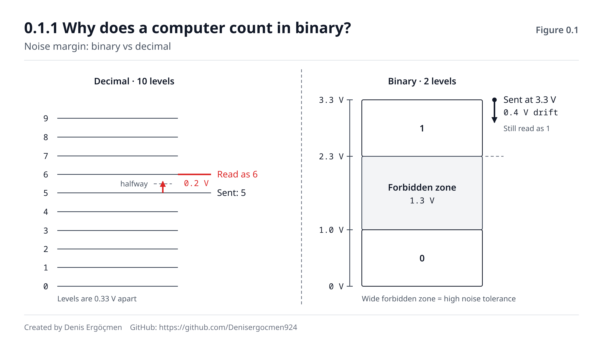
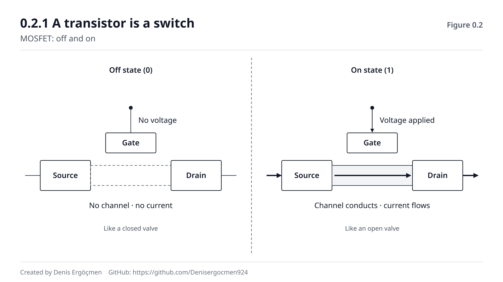
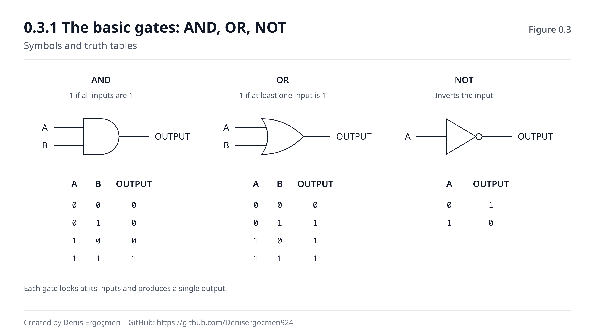
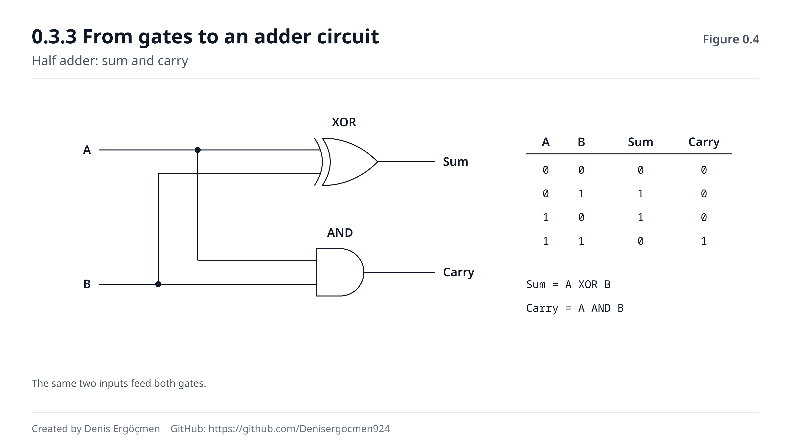
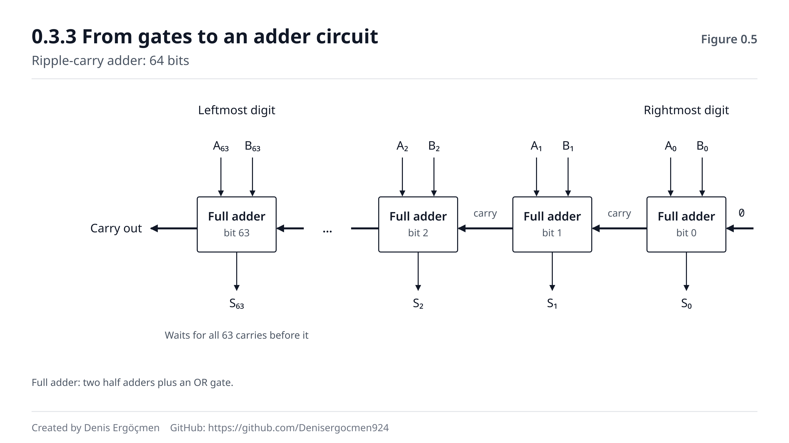
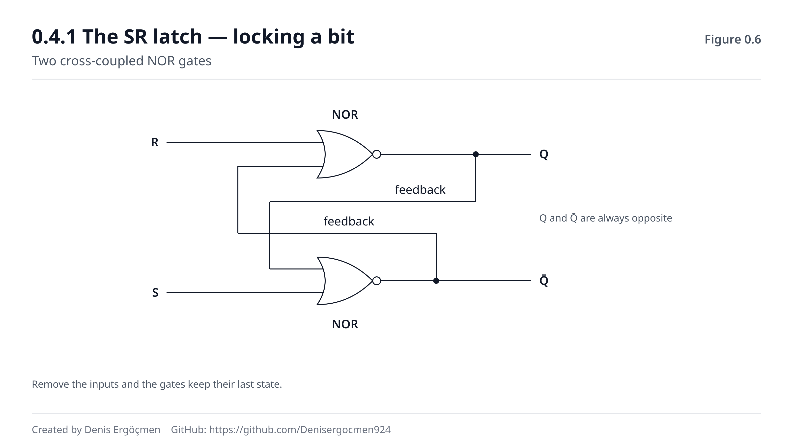
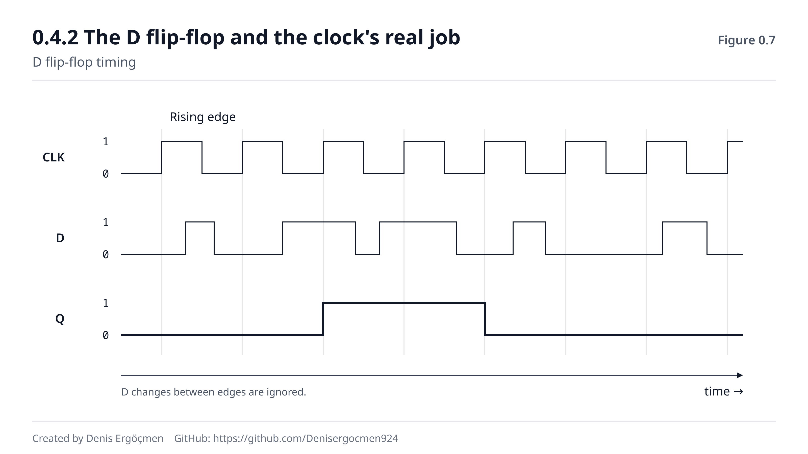
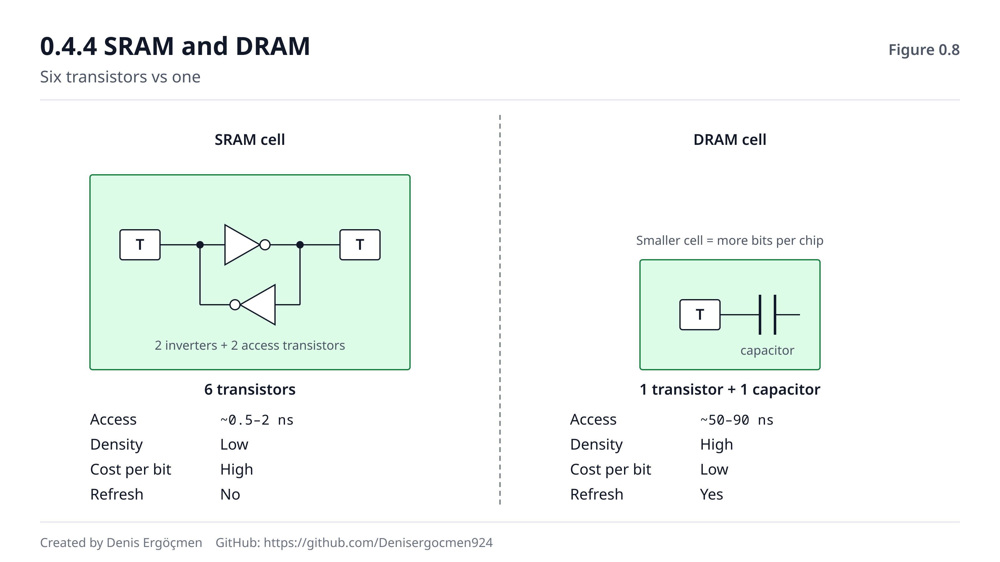

# Faz 0 — Sayısal Temel

> **Navigasyon:** [◀ İçindekiler](README.md) · **Faz 0** · [Faz 1 — CPU Mimarisi ▶](Faz_1_CPU_Mimarisi.md)

---

## Bu faz neden var?

Bir cloud engineer'ın günü şu cümlelerle geçer:

- "`t3.micro` 1 GiB RAM veriyor ama monitoring 976 MB gösteriyor."
- "100 GB'lık EBS volume'u mount ettim, `df` 93 GB diyor. Nerede 7 GB?"
- "Uygulama 3 GB'ta çöküyor, sunucuda 64 GB RAM var."
- "Cache line 64 byte, page 4096 byte, PCIe x16 — neden hep bu sayılar?"
- "Stack trace'te `0x7ffd4a2b1c30` yazıyor, bu ne demek?"

Bu soruların **hepsinin** tek bir ortak kökü var: bilgisayar iki tabanda sayar, insan onda
sayar ve bu iki dünya arasındaki çeviri sürekli sızıntı yapar.

Bu faz o köke iniyor. Ama asıl amacı bundan daha büyük: **bu haritanın geri kalanının
kelime dağarcığını kurmak.**

Faz 2'de "SRAM neden pahalı, DRAM neden ucuz" diye soracağız — cevabı bu fazdaki transistör
sayısında. Faz 1'de "clock hızının fiziksel bir tavanı var" diyeceğiz — cevabı bu fazdaki
toplayıcı devresinin gecikmesinde. Faz 6'da "vCPU gerçekte ne" diye soracağız — cevabın
temeli bu fazdaki register'da.

> **Dürüst uyarı:** Bu faz, haritanın **en soyut** ve cloud'a en uzak görünen fazı. "Ben
> AWS öğrenmek istiyordum, niye mantık kapısı çiziyorum?" hissi normaldir. Şöyle düşün:
> Faz 0 bir yatırım. Getirisini Faz 2 ve Faz 6'da, "aaa, **o yüzden** böyleymiş" dediğin
> anda alacaksın. Bu fazı atlayan biri cloud'u **ezberler**; işleyen biri **türetir**.

---

## Bu fazın sonunda

- Bir sayıyı ikili, onlu ve on altılı taban arasında **elle** çevirebileceksin
- "1 TB disk neden 931 GB görünüyor" sorusunu hesapla cevaplayabileceksin
- 32-bit ve 64-bit farkının **neyi** değiştirdiğini (ve neyi değiştirmediğini) bileceksin
- Transistörden mantık kapısına, kapıdan toplama devresine, devreden hafızaya giden
  zinciri anlatabileceksin
- Clock hızının neden sonsuza kadar artamayacağını **fiziksel** olarak açıklayabileceksin
- SRAM ve DRAM'in maliyet farkının nereden geldiğini bileceksin

---

## Faz haritası

| Bölüm | Konu | Derinlik | Neden burada |
|---|---|---|---|
| 0.1 | Sayı sistemleri | `[mekanizma]` | Her rakamın dili |
| 0.2 | Transistör | `[kavram]` | Neden clock durdu, neden core arttı |
| 0.3 | Mantık kapıları | `[mekanizma]` / `[kavram]` | ALU'nun içi + clock tavanı |
| 0.4 | Flip-flop ve latch | `[kavram]` | Register ve cache'in fiziksel temeli |

---
---

# 0.1 Sayı Sistemleri

## 0.1.1 Bilgisayar neden ikili sayar? `[mekanizma]`

Yaygın cevap şudur: *"Çünkü elektrik ya var ya yok."* Bu cevap **yanlış.**

Elektrik "var/yok" değildir. Bir telde voltaj 0V, 0.3V, 1.1V, 2.7V, 3.3V — arada sonsuz
değer alabilir. Elektrik **analog**tur. Yani aslında bir telde 10 farklı voltaj seviyesi
tanımlayıp onlu tabanda çalışan bir bilgisayar yapabilirdik. Denendi de (1950'lerde Setun
adında üçlü tabanda çalışan bir Sovyet bilgisayarı gerçekten üretildi).

Gerçek cevap: **gürültü payı (noise margin).**

Bir telden sinyal geçerken çevredeki elektromanyetik alanlar, ısı, komşu teller, güç
kaynağındaki dalgalanmalar sinyali bozar. 3.3V yolladığın sinyal karşı tarafa 3.1V veya
3.5V olarak varır.

Şimdi iki senaryoyu karşılaştır:

**İkili sistem (2 seviye):** 0–1.0V arası = "0", 2.3–3.3V arası = "1". Aradaki 1.3 voltluk
boşluk **yasak bölge**. Sinyal 0.4 volt sapsa bile hâlâ doğru okunur. Devasa bir hata payın var.

**Onlu sistem (10 seviye):** 3.3 voltu 10'a bölersen her seviye arası 0.33V. Sinyal 0.2 volt
saparsa 5'i 6 diye okursun. Milyarlarca transistörün saniyede milyarlarca kez anahtarlandığı
bir çipte bu hata oranı sistemi kullanılamaz hâle getirir.

> **Özet:** İkili sistem, elektriğin doğası gereği değil, **güvenilirlik mühendisliği**
> gereği seçildi. İki seviye = maksimum gürültü toleransı = hatasız çalışan milyarlarca
> anahtar.


*Şekil 0.1 — İkili ve onlu kodlamada gürültü payının karşılaştırması. İkili sistemde
"yasak bölge" o kadar geniştir ki sinyal ciddi şekilde bozulsa bile doğru okunur.*

**❓ Akla gelen soru: Peki SSD'ler neden çok seviyeli hücre kullanıyor (TLC, QLC)?**

Çok iyi bir soru ve Faz 3'ün habercisi. Çünkü depolamada öncelik farklı. Bir SSD hücresinde
voltaj seviyesi **saniyede milyarlarca kez değişmiyor** — yazılıyor ve yıllarca duruyor.
Zaman baskısı olmayınca daha fazla seviye sıkıştırıp kapasite kazanabiliyorsun. Bedeli de
tam beklediğin gibi: daha az güvenilirlik, daha az yazma ömrü, daha yavaş okuma. Faz 3.2'de
bunun tam tablosunu göreceğiz. Buradaki ders: **aynı fizik, farklı öncelik, farklı karar.**

---

## 0.1.2 Bit, byte ve 8'in hikâyesi `[kavram]`

**Bit** (binary digit): tek bir ikili basamak. 0 veya 1. Bilgideki en küçük birim.

**Byte:** 8 bit. Peki neden 8? Çünkü:

1. **Tarih:** 1964'te IBM System/360, karakterleri 8 bitlik bloklarla kodladı (EBCDIC).
   Öncesinde 6-bit, 7-bit, 9-bit byte'lar vardı. System/360 o kadar baskın oldu ki 8 bit
   standart hâline geldi.
2. **ASCII uyumu:** ASCII 7 bit (128 karakter). 8'inci bit ya parity (hata kontrolü) ya da
   genişletme için kullanılabiliyordu.
3. **İkinin kuvveti:** 8 = 2³. Bir byte'ı ikiye bölmek (2 × 4 bit) ve 4 bitin tam olarak
   bir hex basamağına denk gelmesi işleri çok kolaylaştırdı.

> **⚠️ Yaygın yanılgı:** "1 byte 8 bittir" bir **doğa yasası değil, kazanmış bir gelenek.**
> Bazı eski sistemlerde 1 byte 6 veya 9 bitti. Bugün evrensel olduğu için standart gibi
> davranırız — ve bu pratikte doğrudur. Ama "neden 8?" sorusunun cevabı fizik değil tarihtir.

**Nibble:** 4 bit, yani yarım byte. Tam olarak bir hex basamağı. `0xA3` = `1010 0011` — sol
nibble `A`, sağ nibble `3`.

---

## 0.1.3 Onlu ↔ İkili ↔ On altılı çevirme `[mekanizma]`

Bu bölüm ezber değil **yöntem** öğretir. Yöntemi bir kez anlarsan ömür boyu kullanırsın.

### Basamak değeri tablosu (ikili)

Her ikili basamak bir 2'nin kuvvetidir. Sağdan sola:

| Basamak | 2⁷ | 2⁶ | 2⁵ | 2⁴ | 2³ | 2² | 2¹ | 2⁰ |
|---|---|---|---|---|---|---|---|---|
| **Değer** | 128 | 64 | 32 | 16 | 8 | 4 | 2 | 1 |

**Bu tabloyu ezberle.** 128-64-32-16-8-4-2-1. Bir cloud engineer bunu subnet maskesi
hesaplarken, cache boyutu okurken, izin bitleri çözerken günde birkaç kez kullanır.

### İkili → Onlu (kolay yön)

`1011 0010` sayısını çevirelim. Altına basamak değerlerini yaz, 1 olanları topla:

```
  1    0    1    1    0    0    1    0
128   64   32   16    8    4    2    1
 ✓         ✓    ✓              ✓

128 + 32 + 16 + 2 = 178
```

### Onlu → İkili (yöntem 1: çıkarma — insan için en hızlısı)

`178`'i çevirelim. Soldan başla, "sığıyor mu?" diye sor:

```
178 ≥ 128?  Evet → bit = 1,  kalan: 178 - 128 = 50
 50 ≥  64?  Hayır → bit = 0
 50 ≥  32?  Evet → bit = 1,  kalan:  50 -  32 = 18
 18 ≥  16?  Evet → bit = 1,  kalan:  18 -  16 =  2
  2 ≥   8?  Hayır → bit = 0
  2 ≥   4?  Hayır → bit = 0
  2 ≥   2?  Evet → bit = 1,  kalan:   2 -   2 =  0
  0 ≥   1?  Hayır → bit = 0

Sonuç: 1011 0010 ✓
```

### Onlu → İkili (yöntem 2: 2'ye bölme — makine gibi ama yavaş)

`178`'i sürekli 2'ye böl, kalanları topla, **sondan başa** oku:

```
178 ÷ 2 = 89  kalan 0   ↑
 89 ÷ 2 = 44  kalan 1   |
 44 ÷ 2 = 22  kalan 0   |
 22 ÷ 2 = 11  kalan 0   |  bu yönde
 11 ÷ 2 =  5  kalan 1   |  oku
  5 ÷ 2 =  2  kalan 1   |
  2 ÷ 2 =  1  kalan 0   |
  1 ÷ 2 =  0  kalan 1   |

Sonuç (aşağıdan yukarı): 1011 0010 ✓
```

İki yöntem de aynı sonucu verir. Birinci yöntem kafadan hesap için, ikincisi kâğıt üstünde
hatasız çalışmak için daha iyi.

### On altılı (hex) — ve neden var

Hex 16 tabanıdır: `0 1 2 3 4 5 6 7 8 9 A B C D E F`. `A`=10, `B`=11, `C`=12, `D`=13,
`E`=14, `F`=15.

Hex'in var olma sebebi tek: **16 = 2⁴, yani bir hex basamağı tam olarak 4 bittir.** Bu,
ikili ile hex arasındaki çevirinin hesap gerektirmemesi demektir — sadece gruplama:

```
İkili:  1011 0010
        ↓    ↓
Hex:     B    2      →  0xB2
```

Ters yönde de aynı:

```
Hex:   0x7F
        7    F
        ↓    ↓
İkili: 0111 1111
```

**Nibble → hex tablosu** (bunu da ezberle, 16 satır):

| İkili | Hex | Onlu | | İkili | Hex | Onlu |
|---|---|---|---|---|---|---|
| 0000 | 0 | 0 | | 1000 | 8 | 8 |
| 0001 | 1 | 1 | | 1001 | 9 | 9 |
| 0010 | 2 | 2 | | 1010 | A | 10 |
| 0011 | 3 | 3 | | 1011 | B | 11 |
| 0100 | 4 | 4 | | 1100 | C | 12 |
| 0101 | 5 | 5 | | 1101 | D | 13 |
| 0110 | 6 | 6 | | 1110 | E | 14 |
| 0111 | 7 | 7 | | 1111 | F | 15 |

**❓ Akla gelen soru: Neden hex kullanıyoruz da doğrudan ikili yazmıyoruz?**

Çünkü ikili **okunamaz**. Bir 64-bit bellek adresi ikili olarak 64 karakterdir:

```
0111111111111101010010100010101100011100001100110000000000000000
```

Aynı adres hex olarak 16 karakter:

```
0x7FFD4A2B1C330000
```

Aynı bilgi, dörtte bir uzunluk, ve **bit yapısı kaybolmadan.** Onlu tabana çevirseydin
(`9223094...`) okunabilir olurdu ama bit desenini göremezdin. Hex, insan okunabilirliği ile
bit şeffaflığı arasındaki tatlı nokta.

> **🔧 Makinende gör** (isteğe bağlı)
>
> ```bash
> printf '%d\n' 0xB2        # hex → onlu
> printf '0x%X\n' 178       # onlu → hex
> echo 'obase=2; 178' | bc  # onlu → ikili
> ```
> **Beklenen çıktı:** `178`, `0xB2`, `10110010`

> **🤔 Düşün 0.1**
> `chmod 755` komutundaki `755` sayısı sekizlik (octal, 8 tabanı) tabandadır. 8 = 2³.
> Bir octal basamağı kaç bit eder? Ve `755`'i ikiliye çevirdiğinde neden tam olarak
> `rwxr-xr-x` izinlerini görürsün?
> *(Cevap: fazın sonundaki "Düşün sorularının cevapları" bölümünde)*

---

## 0.1.4 KB mi KiB mi — "kayıp disk alanı" bilmecesi `[uygulama]`

Bu, bu fazın **en çok para ve en çok tartışma** yaratan konusudur. Ve neredeyse herkes
yanlış bilir.

### İki farklı "kilo"

| Önek | Taban | Değer | Kim kullanır |
|---|---|---|---|
| **KB** (kilobyte) | 10 | 1.000 byte | Disk üreticileri, ağ ekipmanı, AWS ağ metrikleri |
| **KiB** (kibibyte) | 2 | 1.024 byte | İşletim sistemleri, RAM, `/proc`, `free`, `df` |
| **MB** / **MiB** | 10 / 2 | 1.000.000 / 1.048.576 | ↑ aynı |
| **GB** / **GiB** | 10 / 2 | 10⁹ / 2³⁰ (1.073.741.824) | ↑ aynı |
| **TB** / **TiB** | 10 / 2 | 10¹² / 2⁴⁰ | ↑ aynı |

Sapma her basamakta büyür:

| Birim | İkili / Onlu oranı | Fark |
|---|---|---|
| KiB / KB | 1.024 | %2,4 |
| MiB / MB | 1.048.576 | %4,9 |
| GiB / GB | 1.073.741.824 | %7,4 |
| TiB / TB | 1.099.511.627.776 | %10,0 |

### "1 TB disk aldım, 931 GB çıktı"

Hesap:

```
Üretici: 1 TB = 1.000.000.000.000 byte  (onlu, 10¹²)
İşletim sistemi bunu GiB cinsinden gösterir:

1.000.000.000.000 ÷ 1.073.741.824 = 931,32 GiB
```

Kimse seni kandırmadı. Üretici onlu, işletim sistemi ikili konuşuyor. Ama işletim sistemi
çoğu zaman birime **"GB" yazıyor** — aslında GiB gösterdiği hâlde. Kafa karışıklığının asıl
kaynağı bu etiketleme tembelliği.

> **⚠️ Yaygın yanılgı:** "Eksik alan dosya sistemi metadata'sı yüzünden." Kısmen doğru ama
> **çok küçük** bir pay. 1 TB'lık farkın 68 GB'ı yukarıdaki taban farkından gelir. ext4
> metadata + rezerve blok payı ise tipik olarak %1–5 arasıdır (varsayılan %5 root rezervi
> dahil). İkisi ayrı olaydır, karıştırma.

### Cloud'da bu neden önemli?

**1. EBS faturası GiB üzerinden kesilir, ağ Gbps üzerinden ölçülür.**

- "100 GB EBS volume" → AWS aslında **100 GiB** verir ve **100 GiB** fatura eder.
- "10 Gbps ağ" → gerçekten **10 × 10⁹ bit/saniye**, yani onlu.

Aynı dokümanda iki farklı taban. Kapasite planlaması yaparken hangisinin hangisi olduğunu
bilmezsen %7–10 hata yaparsın.

**2. Bit mi byte mı?**

Ağ hep **bit**, depolama hep **byte** konuşur. `b` küçük = bit, `B` büyük = byte.

```
10 Gbps ağ bağlantısı gerçekte kaç MB/s dosya aktarır?

10 Gbps = 10.000.000.000 bit/s
        ÷ 8 = 1.250.000.000 byte/s
        = 1.250 MB/s  (onlu)
        ≈ 1.192 MiB/s (ikili)

Ve bu teorik tavan. Protokol overhead'i (Ethernet + IP + TCP başlıkları) düştükten
sonra pratikte ~1.100–1.180 MB/s civarı görürsün.
```

Bu hesabı yapamayan biri "10 Gbps ağım var, 10 GB'lık dosya 1 saniyede gider" der. Gerçek:
**yaklaşık 8,5 saniye.**

> **🔧 Makinende gör** (isteğe bağlı)
>
> ```bash
> df -h /          # -h insan okunabilir: 'G' gösterir ama GiB'dir
> df -H /          # -H onlu: gerçek GB
> free -h          # RAM her zaman ikili (GiB)
> ```
> **Beklenen çıktı:** `df -h` ve `df -H` aynı disk için **farklı sayılar** gösterir.
> Örneğin `-h` ile `50G`, `-H` ile `54G`. Aradaki %7,4 tam olarak GiB/GB farkıdır.

> **🤔 Düşün 0.2**
> Bir AWS faturasında şunu görüyorsun: "Data Transfer Out: 500 GB". Aynı ay boyunca
> S3'ten indirdiğin dosyaların toplam boyutunu `du -sh` ile ölçtün ve `466G` çıktı.
> Fatura mı yanlış, ölçüm mü? Ne oldu?
> *(Cevap: fazın sonunda)*

---

## 0.1.5 32-bit ve 64-bit gerçekte ne demek `[uygulama]`

Bu, bu bölümün **cloud'a en doğrudan bağlanan** maddesi.

"64-bit sistem" ifadesi aynı anda üç farklı şeyi ima eder ve bunları ayırmak şart:

### 1. Register genişliği

CPU'nun içindeki geçici hafıza hücreleri (register — Faz 1.1'de detaylandıracağız) 64 bit
genişliktedir. Yani CPU tek seferde 64 bitlik bir sayıyla işlem yapabilir.

32-bit bir CPU'da 64-bitlik bir toplama yapmak için **iki ayrı işlem** gerekir (alt 32 bit,
sonra elde ile üst 32 bit). 64-bit CPU'da tek işlem.

### 2. Adres uzayı — asıl önemli olan

Bir CPU'nun bellekte bir yeri işaret etmek için kullandığı adres de bir sayıdır. Adres kaç
bitse, kaç farklı yer gösterebileceğini o belirler:

```
32-bit adres:  2³² = 4.294.967.296 farklı adres
               Her adres 1 byte'ı işaret eder
               → 4.294.967.296 byte = 4 GiB

64-bit adres:  2⁶⁴ = 18.446.744.073.709.551.616 adres
               → 16 EiB (exbibyte) — pratikte sonsuz
```

**İşte bu, 32-bit'in ölüm sebebidir.** Sunucuda 64 GB RAM olsa bile, 32-bit bir işlem
4 GiB'dan fazlasını **adresleyemez.** Adresleyemediğin belleği kullanamazsın.

Pratikte durum daha da kötü: Linux'ta 32-bit bir kullanıcı işlemi genelde 3 GiB kullanabilir
(üstteki 1 GiB kernel'e ayrılmıştır). Windows'ta varsayılan 2 GiB.

> **⚠️ Yaygın yanılgı:** "64-bit sistem 32-bit'in iki katı hızlıdır." **Hayır.** 64-bit
> olmanın hız kazancı sadece 64-bitlik sayılarla çalışan iş yüklerinde (büyük tam sayı
> matematiği, kriptografi) belirgindir. Çoğu uygulama 32-bitlik tam sayılarla çalışır ve
> 64-bit'e geçince **hiç hızlanmaz** — hatta pointer'lar iki katına çıktığı için aynı
> veriyi tutmak daha fazla bellek ve daha fazla cache satırı ister, bu da **yavaşlatabilir**.
> 64-bit'in gerçek kazancı hız değil, **adres uzayıdır.**

**Cloud bağlantısı `[uygulama]`:**

AWS'te 32-bit AMI bulmak artık pratikte imkânsız — hepsi `x86_64` veya `arm64`. Sebebi tam
olarak yukarıdaki: modern bir instance'ın 4 GiB'dan az RAM'i olsa bile (`t3.nano` 0,5 GiB),
32-bit çalıştırmanın hiçbir avantajı yok, dezavantajı çok.

Ama şu senaryo hâlâ gerçek ve sahada görülür: **eski bir uygulamayı lift-and-shift ile
cloud'a taşıdın.** Uygulama 32-bit derlenmiş. `r5.4xlarge` (128 GiB RAM) instance'a koydun.
Uygulama hâlâ 3 GB'ta `OutOfMemoryError` veriyor. Instance'ı büyütmek **hiçbir işe
yaramaz** — sorun instance'ta değil, binary'nin adres uzayında. Çözüm: yeniden derlemek.

Bu tam olarak Faz 0'ın neden var olduğunun örneğidir. Bu bilgi olmadan, bu problemde
saatlerce instance büyütürsün.

> **🤔 Düşün 0.3**
> `c7g.large` bir Graviton (ARM) instance'ı 64-bit. Peki 64-bit adres uzayı 16 EiB ise,
> neden hiçbir sunucu 16 EiB RAM desteklemiyor? Fiziksel olarak mı imkânsız, yoksa başka
> bir sınır mı var?
> *(Cevap: fazın sonunda)*

---
---

# 0.2 Transistör

Bu bölüm haritanın en "fizik" bölümü ve bilinçli olarak **sığ** tutuluyor. Hedef transistörün
nasıl üretildiğini değil, **iki sonucunu** anlamak: neden anahtar gibi davranır, ve
sayısı/boyutu neden bugünkü cloud mimarisini belirledi.

## 0.2.1 Transistör bir anahtardır `[kavram]`

Modern çiplerde kullanılan transistör tipi **MOSFET**'tir (mosfet = metal-oksit yarıiletken
alan etkili transistör). Üç bacağı vardır:

- **Gate** (geyt = kapı) — kontrol bacağı
- **Source** (sors = kaynak) — akımın girdiği yer
- **Drain** (dreyn = savak) — akımın çıktığı yer

Çalışma mantığı tek cümle: **Gate'e voltaj uygularsan source ile drain arasında elektrik
akar; uygulamazsan akmaz.**

Yani küçük bir kontrol sinyali, büyük bir akımı açıp kapatıyor. Bu bir **anahtar** (switch).

**Analoji:** Bahçe hortumunda bir vana düşün. Vananın kolunu çevirmek az kuvvet ister ama
hortumdaki suyun tamamını kesip açar. Gate = kol, su = akım. Fark şu: bu vananın kolunu
saniyede **milyarlarca kez** çevirebiliyorsun ve hiç aşınmıyor (hareketli parça yok).


*Şekil 0.2 — Gate'e voltaj uygulandığında source–drain kanalı iletken hâle gelir. Solda
kapalı (0), sağda açık (1) durum.*

**Neden bu önemli:** Bir anahtardan mantık kapısı, mantık kapısından toplama devresi,
toplama devresinden CPU çıkar. Zincirin ilk halkası bu.

## 0.2.2 Ölçek — milyarlarca anahtar `[kavram]`

Rakamlarla ölçek hissi (kabaca, nesle göre değişir):

| Çip | Yıl | Transistör sayısı |
|---|---|---|
| Intel 4004 | 1971 | 2.300 |
| Intel Pentium | 1993 | ~3,1 milyon |
| Modern masaüstü CPU | ~2023 | ~10–25 milyar |
| Modern sunucu CPU (çok çekirdekli) | ~2023 | ~50–100+ milyar |
| Modern büyük GPU | ~2023 | ~80 milyar+ |

**Bunu kavramak için:** 50 milyar transistör, Türkiye nüfusunun yaklaşık 580 katı kadar
anahtarın, başparmak tırnağı büyüklüğünde bir alanda, birbirine bağlı olarak, saniyede
milyarlarca kez açılıp kapanması demek.

**"nm" ne demek?** "3nm süreç" gibi ifadeler transistörün bir özelliğinin boyutunu anlatır
(**feature size** / süreç düğümü). Bugün bu sayı gerçek fiziksel bir ölçüden çok **pazarlama
adı**dır — farklı üreticilerin "5nm"i aynı şeyi ölçmez. Bilmen gereken tek şey: **sayı
küçüldükçe aynı alana daha çok transistör sığar.**

## 0.2.3 Moore Yasası, duvarı ve cloud'a etkisi `[kavram]`

**Moore Yasası** (1965, Gordon Moore): Bir çipe sığdırılabilen transistör sayısı yaklaşık
iki yılda bir ikiye katlanır.

Bu bir doğa yasası değil, bir **gözlem ve sektör hedefi**ydi. Yaklaşık 50 yıl tuttu.

Ama yanında **Dennard Ölçeklemesi** diye ikinci bir gözlem vardı: transistörler küçüldükçe
birim alan başına güç tüketimi sabit kalır. Bu, "transistörler küçülürken clock hızını da
bedava artırabiliriz" demekti. 1970'lerden 2000'lerin başına kadar clock hızı böyle uçtu:
1 MHz → 3 GHz.

**Sonra Dennard ölçeklemesi ~2005'te çöktü.** Transistörler o kadar küçüldü ki sızıntı akımı
(leakage) ve ısı yoğunluğu baş edilemez hâle geldi. Clock hızını artırmak artık ısıyı
katlanılamaz seviyeye çıkarıyordu.

Sektörün cevabı şuydu: **"Tek çekirdeği hızlandıramıyorsak, çok çekirdek koyalım."**

Ve bu, cloud'un tüm mimari felsefesinin doğduğu andır:

```
Dennard çöküşü (~2005)
        ↓
Clock hızı ~3-5 GHz'de takıldı  (bugün hâlâ orada)
        ↓
Performans artışı = daha fazla core
        ↓
Yazılım paralel olmak ZORUNDA kaldı
        ↓
"Dikey ölçekleme" (daha güçlü makine) tavana vurdu
        ↓
"Yatay ölçekleme" (daha çok makine) tek çıkış yolu oldu
        ↓
CLOUD
```

> **Bu zinciri iyi oku.** "Neden cloud var?" sorusunun en derin teknik cevabı budur.
> Cloud bir iş modeli yeniliği olmadan önce, **fizikten doğan bir zorunluluğun**
> mimari cevabıydı. Auto Scaling Group, load balancer, stateless servis, mikroservis —
> hepsi "tek makineyi daha hızlı yapamıyoruz" gerçeğinin çocukları.

**`[atla]` — neye girmiyoruz:** CMOS üretim süreci, dopant kimyası, litografi, gate
oksit kalınlığı, kuantum tünelleme detayları. Bunlar çip tasarımcısının işi. Bir cloud
engineer'ın bu bilgiyle değiştireceği hiçbir karar yok.

**Ama bir sonucu `[kavram]` olarak taşı:** Transistör anahtarlandığında **ısı üretir.**
Isı, çipin dayanabileceği bir sınırı (TDP — thermal design power) aşamaz. Bu yüzden:

- Bir CPU tüm çekirdekleri tam yükte çalışırken **base clock**'ta çalışır
- Az çekirdek aktifken ısı bütçesi arttığı için **turbo/boost clock**'a çıkar
- Yani "3,5 GHz CPU" aslında **duruma göre 2,4 ile 4,2 GHz arası** çalışan bir CPU'dur

Bu, Faz 1.3'te ve Faz 7'de instance performansını yorumlarken karşımıza çıkacak.

> **🤔 Düşün 0.4**
> `c7i.2xlarge` (8 vCPU) ve `c7i.16xlarge` (64 vCPU) aynı CPU ailesini kullanıyor ve
> AWS ikisi için de aynı "3,2 GHz'e kadar" değerini yazıyor. Tek-thread'li bir benchmark
> çalıştırsan, hangisinde daha yüksek skor beklersin? Neden?
> *(Cevap: fazın sonunda)*

---

# 0.3 Mantık Kapıları

Transistör bir anahtar. Anahtarları belirli desenlerde birleştirince **karar veren** devreler
elde edersin. Bunlara mantık kapısı denir.

## 0.3.1 Temel kapılar: AND, OR, NOT `[mekanizma]`

Her kapı, girdilerine bakıp tek bir çıktı üretir. Davranışı **doğruluk tablosu** ile tam
olarak tanımlanır.

### NOT (değil) — tek girdi

Girdiyi tersine çevirir.

| A | ÇIKTI |
|---|---|
| 0 | 1 |
| 1 | 0 |

### AND (ve) — iki girdi

**Hepsi** 1 ise 1.

| A | B | ÇIKTI |
|---|---|---|
| 0 | 0 | 0 |
| 0 | 1 | 0 |
| 1 | 0 | 0 |
| 1 | 1 | **1** |

### OR (veya) — iki girdi

**En az biri** 1 ise 1.

| A | B | ÇIKTI |
|---|---|---|
| 0 | 0 | 0 |
| 0 | 1 | **1** |
| 1 | 0 | **1** |
| 1 | 1 | **1** |


*Şekil 0.3 — AND, OR, NOT kapılarının standart devre sembolleri ve doğruluk tabloları.*

**Bu tablolar tanıdık gelmeli.** Aynı mantığı her gün kullanıyorsun:

```bash
# Shell'de
[ -f dosya ] && [ -r dosya ]    # AND: ikisi de doğruysa
[ -f a ] || [ -f b ]            # OR: biri doğruysa
! [ -f dosya ]                  # NOT
```

Ve **Security Group kuralları**, **IAM policy değerlendirmesi**, **subnet maskesi
hesaplama** — hepsi bu üç işlemin üstünde çalışır. Faz 0'daki AND kapısı, ağ haritasındaki
`IP AND netmask = network adresi` işleminin ta kendisidir.

## 0.3.2 Türetilmiş kapılar: NAND, NOR, XOR `[kavram]`

### NAND = NOT + AND

AND'in tersi. Hepsi 1 ise 0, diğer her durumda 1.

| A | B | ÇIKTI |
|---|---|---|
| 0 | 0 | 1 |
| 0 | 1 | 1 |
| 1 | 0 | 1 |
| 1 | 1 | **0** |

**NAND'in özel bir gücü var: evrensel kapıdır.** Sadece NAND kapıları kullanarak AND, OR,
NOT ve dolayısıyla **herhangi bir mantık devresini** kurabilirsin.

```
NOT A        = A NAND A
A AND B      = NOT(A NAND B)  = (A NAND B) NAND (A NAND B)
A OR B       = (A NAND A) NAND (B NAND B)
```

**Neden önemli:** Çip üretiminde tek tip kapıyı milyarlarca kez basmak, farklı tipleri
karıştırmaktan çok daha ucuz ve güvenilirdir. Ayrıca CMOS teknolojisinde NAND, AND'den
**daha az transistör** ister (NAND 4 transistör, AND 6 — çünkü AND aslında NAND + NOT'tur).
Bu yüzden gerçek çiplerde NAND ve NOR baskın kapılardır.

> **Bu detayı şimdi unutabilirsin ama bir şeyi tut:** donanımda "daha az transistör" her
> zaman "daha ucuz, daha az ısı, daha hızlı" demektir. Bu ilke Faz 2'de SRAM vs DRAM
> karşılaştırmasında kritik olacak.

### NOR = NOT + OR

OR'un tersi. O da evrensel kapıdır.

| A | B | ÇIKTI |
|---|---|---|
| 0 | 0 | **1** |
| 0 | 1 | 0 |
| 1 | 0 | 0 |
| 1 | 1 | 0 |

### XOR (exclusive or — özel veya) — en ilginç kapı

**Farklılarsa** 1, aynılarsa 0.

| A | B | ÇIKTI |
|---|---|---|
| 0 | 0 | 0 |
| 0 | 1 | **1** |
| 1 | 0 | **1** |
| 1 | 1 | 0 |

XOR'u "A ile B **farklı mı?**" sorusu olarak oku. Bu okuma XOR'un neden her yerde olduğunu
açıklar:

- **Toplama:** 1+1 = 0 (elde 1). XOR tam olarak bunu yapar → bir sonraki bölüm
- **Karşılaştırma:** iki değer eşit mi? Hepsini XOR'la, sonuç sıfırsa eşit
- **Parity / hata kontrolü:** bit'lerin XOR'u, tek sayıda 1 olup olmadığını söyler
- **RAID 5:** Parity diski tam olarak XOR ile hesaplanır → Faz 3.5'te göreceğiz
- **Şifreleme:** `veri XOR anahtar = şifreli`, `şifreli XOR anahtar = veri`. Tersinir.

> **🤔 Düşün 0.5**
> RAID 5'te 3 diskten biri bozulunca veri kurtarılabiliyor. Diskler şu bitleri tutuyor:
> Disk A = `1`, Disk B = `0`, Parity = `A XOR B = 1`.
> Disk A bozuldu. Elinde sadece B (`0`) ve Parity (`1`) var. A'yı nasıl geri hesaplarsın?
> *(Cevap: fazın sonunda)*

## 0.3.3 Kapılardan toplama devresine `[kavram]`

Şimdi zincirin en tatmin edici halkası: **kapılardan aritmetik nasıl çıkıyor?**

### Yarım toplayıcı (half adder)

Tek bitlik iki sayıyı topla. Olası dört durum:

```
0 + 0 = 0    (toplam 0, elde 0)
0 + 1 = 1    (toplam 1, elde 0)
1 + 0 = 1    (toplam 1, elde 0)
1 + 1 = 10   (toplam 0, elde 1)  ← ikilide "iki" = 10
```

Şimdi "toplam" ve "elde" sütunlarına ayrı ayrı bak:

| A | B | Toplam | Elde |
|---|---|---|---|
| 0 | 0 | 0 | 0 |
| 0 | 1 | 1 | 0 |
| 1 | 0 | 1 | 0 |
| 1 | 1 | 0 | 1 |

**Toplam sütunu = XOR tablosu. Elde sütunu = AND tablosu.**

Yani:

```
Toplam = A XOR B
Elde   = A AND B
```

İki kapı. Toplama işlemi bu. Aritmetiğin tamamı buradan başlıyor.


*Şekil 0.4 — Yarım toplayıcı: aynı iki girdi hem XOR hem AND kapısına verilir; XOR toplamı,
AND eldeyi üretir.*

### Tam toplayıcı (full adder) ve 64-bit toplama

Yarım toplayıcının bir eksiği var: **kendisine gelen eldeyi** hesaba katamıyor. Çok basamaklı
toplamada her basamak, bir önceki basamaktan elde alır.

Üç girdiyi (A, B, gelen elde) işleyen devreye **tam toplayıcı** denir. İki yarım toplayıcı
+ bir OR kapısı ile kurulur.

64-bit iki sayıyı toplamak için **64 tam toplayıcıyı zincirleme** bağlarsın: her birinin elde
çıkışı, bir sonrakinin elde girişine gider. Buna **ripple-carry adder** (dalgalanan elde
toplayıcısı) denir.


*Şekil 0.5 — Elde biti en sağdaki basamaktan en soldakine doğru sırayla ilerler. Son bit,
kendinden önceki 63 basamağın hepsi hesaplanmadan doğru değeri alamaz.*

### Ve işte clock hızının fiziksel tavanı

Ripple-carry'nin kritik özelliği: **en soldaki bit, en sağdakinden gelen elde ulaşana kadar
doğru değeri bilemez.** Elde 64 basamak boyunca sırayla ilerlemek zorunda.

Her kapının bir **yayılım gecikmesi** (propagation delay) var — girdisi değiştikten sonra
çıktısının oturması zaman alır. Diyelim bir tam toplayıcı katmanı 30 pikosaniye sürsün:

```
64 basamak × 30 ps = 1.920 ps = 1,92 nanosaniye

CPU bu toplamayı tek clock çevriminde bitirmek istiyorsa,
bir clock çevrimi en az 1,92 ns sürmeli.

Maksimum frekans = 1 / 1,92 ns ≈ 520 MHz
```

**520 MHz.** Ama modern CPU'lar 3-5 GHz'de çalışıyor. Nasıl?

İki yolla:

1. **Daha akıllı devreler.** Gerçek CPU'lar ripple-carry kullanmaz; *carry-lookahead*,
   *carry-select* gibi eldeyi önceden tahmin eden devreler kullanır. Bunlar çok daha fazla
   transistör harcayıp gecikmeyi 64 kattan ~6 kata indirir. (Klasik mühendislik takası:
   **alan/güç harcayıp zaman satın almak.**)
2. **Pipeline.** İşi tek çevrimde bitirmek yerine parçalara bölüp her parçayı ayrı çevrimde
   yapmak. Faz 1.4'ün tamamı bu.

> **Bu, Faz 0'ın en önemli cümlesi:** Clock hızının sınırı keyfi değil. Bir clock çevrimi,
> devredeki **en uzun kombinasyonel yolun** oturmasından kısa olamaz. CPU tasarımının
> tamamı bu yolu kısaltma mücadelesidir. Faz 1'de "neden pipeline var" diye sorduğumuzda
> cevap burada olacak.

> **🤔 Düşün 0.6**
> Yukarıdaki hesaba göre 64-bit ripple-carry toplayıcı ~520 MHz'e izin veriyordu.
> Aynı devre 32-bit olsaydı hangi frekansa izin verirdi? Bu, "32-bit CPU'lar daha yüksek
> clock'a çıkabilir" anlamına mı gelir? Gerçek CPU'larda böyle mi oldu?
> *(Cevap: fazın sonunda)*

---
# 0.4 Flip-Flop ve Latch — Hafızanın Temeli

Şimdiye kadar kurduğumuz her devrenin ortak bir eksiği var: **hafızası yok.**

AND kapısına girdi verirsen çıktı üretir. Girdiyi çekersen çıktı da kaybolur. Kapı "geçen
sefer ne vardı" diye hatırlamaz. Bu tür devrelere **kombinasyonel devre** (combinational
logic) denir: çıktı **yalnızca** o anki girdiye bağlıdır.

Ama bir bilgisayarın hatırlaması gerekir. Bir değişkeni tutması, bir sayacı artırması,
"şu an hangi talimattayım" bilgisini saklaması gerekir.

Hatırlayabilen devrelere **ardışıl devre** (sequential logic) denir: çıktı, o anki girdiye
**ve geçmişe** bağlıdır.

Peki hafızasız kapılardan hafıza nasıl çıkar? Tek bir numara ile: **geri besleme (feedback).**

## 0.4.1 SR latch — bir biti kilitlemek `[kavram]`

İki NOR kapısı al. Her birinin çıkışını diğerinin girişine bağla. Çapraz bağlama.


*Şekil 0.6 — İki NOR kapısının çapraz geri beslemesi. Q ve Q̄ (Q-değil) her zaman
birbirinin tersidir ve girdiler çekildikten sonra bile son durumu korurlar.*

İki girdi var:

- **S** (Set = kur) → çıktıyı 1 yapar
- **R** (Reset = sıfırla) → çıktıyı 0 yapar

Davranış:

| S | R | Q (çıktı) | Ne oldu |
|---|---|---|---|
| 0 | 0 | *değişmez* | **Hatırlama durumu** — son değeri korur |
| 1 | 0 | 1 | Kuruldu |
| 0 | 1 | 0 | Sıfırlandı |
| 1 | 1 | *geçersiz* | İkisi aynı anda olmaz (tanımsız durum) |

**Sihir üçüncü satırda değil, birincide.** S=0, R=0 verdiğinde devre **son değerini
koruyor.** Girdiler nötr ama çıktı duruyor.

Neden duruyor? Çünkü Q'nun çıkışı diğer kapının girişine bağlı, o kapının çıkışı da Q'nun
girişine bağlı. İki kapı birbirini **besliyor.** Q=1 ise, bu 1 devreyi dolaşıp Q'yu 1'de
tutuyor. Kendi kendini doğrulayan bir döngü.

**Bu bir bitlik hafızadır.** İki kapıyla, geri besleme sayesinde.

> **⚠️ Yaygın yanılgı:** "Hafıza bilgiyi bir yere *yazar*." Elektronik seviyede hafıza
> bilgiyi bir yere yazmaz — bilgiyi **elektriksel bir döngüde dolaşımda tutar.** Bu yüzden
> güç kesilince kaybolur. Faz 2'de "volatile bellek" dediğimizde kastettiğimiz tam olarak
> budur: dolaşımı besleyen güç giderse, dolaşım durur, bilgi yok olur.

## 0.4.2 D flip-flop ve clock'un asıl işi `[kavram]`

SR latch'in pratik bir sorunu var: girdiler **her an** çıktıyı değiştirebiliyor. Milyarlarca
devrenin birbirine bağlı olduğu bir çipte bu kaos demektir — bir devrenin çıktısı henüz
oturmamışken diğeri onu okursa yanlış değer alır.

Çözüm: **değişimlere izin verilen anları senkronize etmek.**

**D flip-flop** (D = data) bunu yapar. İki girdisi vardır:

- **D** — saklanacak değer
- **CLK** (clock) — "şimdi kaydet" sinyali

Davranışı tek cümle: **Clock sinyalinin yükselen kenarında (0'dan 1'e geçtiği anda) D'deki
değeri al ve bir sonraki kenara kadar tut.** Clock kenarı gelmediği sürece D ne kadar
değişirse değişsin, çıktı kıpırdamaz.


*Şekil 0.7 — Zaman diyagramı: D sinyali sürekli değişse de Q yalnızca clock'un yükselen
kenarlarında güncellenir.*

> **Clock'un gerçek işi budur.** Yaygın sanıldığı gibi "CPU'yu hızlandıran bir motor"
> değildir. Clock bir **metronomdur**: milyarlarca devrenin durumunu aynı anda, düzenli
> aralıklarla güncelleyerek sistemin tutarlı kalmasını sağlar.
>
> Ve şimdi Faz 0.3'ün sonundaki hesap yerine oturuyor: **iki clock kenarı arasındaki süre,
> aradaki kombinasyonel devrenin oturmasına yetmek zorundadır.** Yetmezse flip-flop henüz
> kararsız olan bir değeri kaydeder — bu donanım seviyesinde bozuk veridir. Overclock
> yapıp sistem çökmesinin fiziksel sebebi tam olarak budur.

**❓ Akla gelen soru: Latch ile flip-flop farkı tam olarak ne?**

- **Latch** *seviye* duyarlıdır: clock 1 olduğu **süre boyunca** girdiyi geçirir (şeffaf).
- **Flip-flop** *kenar* duyarlıdır: clock'un **değiştiği anda** örnekler, gerisinde kapalıdır.

Pratikte modern senkron tasarımların neredeyse tamamı flip-flop kullanır, çünkü "tam olarak
ne zaman güncellendiği" kesindir. Günlük konuşmada ikisi sık sık birbirinin yerine
kullanılır; ayrımı bilmek yeterli, derinleşme.

## 0.4.3 Flip-flop'tan register'a `[kavram]`

Bir D flip-flop = 1 bit.

**64 D flip-flop'u yan yana koy, hepsine aynı clock'u bağla → 64-bit register.** Clock
kenarında 64 bitin hepsi aynı anda güncellenir.

İşte Faz 1'de bahsedeceğimiz register bu. `RAX`, `RBX` gibi CPU register'ları fiziksel
olarak tam olarak bu: 64 tane flip-flop, aynı metronoma bağlı.

Ve şimdi bir şey netleşiyor: **register neden bu kadar hızlı ve bu kadar az?**

- **Hızlı:** çünkü ALU'nun hemen yanında, tel mesafesi mikrometrelerle ölçülüyor. Sinyalin
  gidip gelmesi bir clock çevriminin altında.
- **Az:** çünkü her bit ~20+ transistör istiyor ve devasa yer kaplıyor. x86-64'te sadece
  16 genel amaçlı register var — toplam 128 byte civarı.

## 0.4.4 SRAM ve DRAM — tüm bellek hiyerarşisinin kökü `[kavram]`

Bu, Faz 0'ın **Faz 2'ye açılan kapısı** ve bu fazın en getirisi yüksek maddesi.

Bir biti saklamanın iki yolu var ve aralarındaki fark, bilgisayardaki bütün bellek
hiyerarşisini tek başına açıklar.

### SRAM (Static RAM) — cache'in malzemesi

Yapı: yukarıdaki latch fikrinin transistörle kurulmuş hâli. Tipik olarak **6 transistör**
(6T hücre) bir bit tutar. Çapraz bağlı iki inverter + iki erişim transistörü.

- **Statik:** Güç verildiği sürece hiçbir şey yapmadan durumunu korur. Tazelenmesi gerekmez.
- **Hızlı:** Okumak için sadece geri besleme döngüsünün durumuna bakarsın. ~1 ns altı.
- **Pahalı ve büyük:** 1 bit için 6 transistör. 1 MB SRAM ≈ 50 milyon transistör.
- **Güç yer:** 6 transistör sürekli beslenir, sürekli sızıntı akımı vardır.

### DRAM (Dynamic RAM) — ana belleğin malzemesi

Yapı: **1 transistör + 1 kondansatör** (1T1C). Kondansatörde yük varsa 1, yoksa 0.

- **Yoğun ve ucuz:** 6 yerine 2 eleman. Aynı alana ~6–10 kat fazla bit sığar.
- **Yavaş:** Okumak için kondansatörün yükünü ölçmek gerekir — analog bir işlem, zaman alır.
- **Dinamik (ve sorun burada):** Kondansatör yükü **sızar.** Milisaniyeler içinde kaybolur.
  Bu yüzden DRAM saniyede binlerce kez **tazelenmek** (refresh) zorundadır: her satır okunup
  geri yazılır. Tazeleme sırasında o bellek bölgesine erişilemez.
- **Yıkıcı okuma:** DRAM'i okumak kondansatörü boşaltır; okunan değer hemen geri yazılmalıdır.

### Karşılaştırma — ve doğan sonuç

| Özellik | SRAM | DRAM |
|---|---|---|
| Bit başına eleman | ~6 transistör | 1 transistör + 1 kondansatör |
| Erişim süresi (kabaca) | ~0,5–2 ns | ~50–90 ns |
| Yoğunluk | Düşük | Yüksek (~6–10×) |
| Bit başına maliyet | Yüksek (~10–100×) | Düşük |
| Tazeleme gerekir mi | Hayır | Evet (sürekli) |
| Nerede kullanılır | **L1/L2/L3 cache, register** | **Ana bellek (RAM çubukları)** |

> **Ve işte bellek hiyerarşisinin doğuşu:**
>
> SRAM hızlı ama pahalı ve yer kaplıyor → az miktarda kullanabiliriz → **cache küçüktür.**
> DRAM ucuz ve yoğun ama yavaş → bol miktarda kullanabiliriz → **RAM büyüktür.**
>
> Bu bir mühendislik tercihi değil, **ekonomik bir zorunluluk.** 128 GB'lık bir sunucuyu
> tamamen SRAM ile yapmak teknik olarak mümkündür — fiyatı ve boyutu absürt olurdu, ve
> ısı yüzünden zaten çalışmazdı.
>
> Faz 2'nin tamamı bu tek gerginliğin yönetilmesi üzerine kuruludur: **hızlı olan küçük,
> büyük olan yavaş.** Cloud'daki her instance seçimi bu gerginliğin bir yansımasıdır.


*Şekil 0.8 — Solda SRAM'in çapraz bağlı 6 transistörlü hücresi, sağda DRAM'in tek transistör
ve kondansatörden oluşan hücresi. Alan farkı doğrudan maliyet ve kapasite farkına dönüşür.*

> **🤔 Düşün 0.7**
> DRAM'in tazelenmesi gerektiğini öğrendin. Bir sunucuda 256 GB DRAM var ve her hücre
> 64 ms'de bir tazelenmek zorunda. Tazeleme sırasında o bank'a erişilemiyor.
> Bu, RAM kapasitesi arttıkça performansı nasıl etkiler? Ve "daha çok RAM her zaman
> daha iyidir" cümlesine ne diyorsun?
> *(Cevap: fazın sonunda)*

> **🔧 Makinende gör** (isteğe bağlı)
>
> ```bash
> lscpu | grep -i cache          # CPU'nun cache (SRAM) miktarı
> free -h | head -2              # sistemin RAM (DRAM) miktarı
> ```
> **Beklenen çıktı:** Cache toplamı tipik olarak MB mertebesinde (örn. L3: 32 MiB),
> RAM ise GB mertebesinde (örn. 16 Gi). Aradaki ~500–1000 kat fark, yukarıdaki maliyet
> tablosunun doğrudan sonucudur.

---
---

# Faz 0 — Düşün Sorularının Cevapları

## Cevap 0.1 — `chmod 755` neden `rwxr-xr-x`?

**Soru:** Bir octal basamağı kaç bit eder ve `755` neden tam olarak o izinleri verir?

8 = 2³ olduğu için **bir octal basamağı tam olarak 3 bittir.** (Aynı mantıkla bir hex
basamağı 4 bitti — 16 = 2⁴.)

Unix izinleri tam olarak 3'lü gruplar hâlindedir: `read, write, execute`. Bu tesadüf değil,
tasarım:

```
7    5    5
↓    ↓    ↓
111  101  101

7 = 111 = rwx  → sahip (owner):  oku, yaz, çalıştır
5 = 101 = r-x  → grup (group):   oku, çalıştırma var; yazma yok
5 = 101 = r-x  → diğerleri:      aynı

Sonuç: rwxr-xr-x
```

Her bitin ağırlığı: `r`=4 (2²), `w`=2 (2¹), `x`=1 (2⁰). Yani `6 = 4+2 = rw-`,
`5 = 4+1 = r-x`, `7 = 4+2+1 = rwx`.

**Neden octal, hex değil?** Çünkü izin grubu 3 bit ve octal tam 3 bit tutuyor. Hex olsaydı
4 bit tutardı ve gruplar hizalanmazdı. Doğru taban, problemin yapısına göre seçilir.

**İlgili bölüm:** 0.1.3

---

## Cevap 0.2 — 500 GB fatura, 466G ölçüm

**Soru:** AWS "500 GB" fatura ediyor, `du -sh` `466G` diyor. Hangisi yanlış?

**İkisi de doğru. Farklı taban kullanıyorlar.**

- AWS Data Transfer metriklerini **GB (onlu, 10⁹)** cinsinden raporlar.
- `du -h` çıktısını **GiB (ikili, 2³⁰)** cinsinden gösterir ama etikete `G` yazar.

Hesap:

```
500 GB (onlu) = 500 × 10⁹ = 500.000.000.000 byte
GiB'e çevir:  500.000.000.000 ÷ 1.073.741.824 = 465,66 GiB
                                                 ≈ 466G  ✓
```

Aradaki %7,4 farkın tamamı taban farkı. Ne fatura şişirmesi var ne ölçüm hatası.

**Pratik ders:** Cloud faturasıyla kendi ölçümünü karşılaştırırken **önce birimleri
hizala.** %7'lik bir "anlaşılmaz fark" gördüğünde ilk şüphelenmen gereken şey GiB/GB
karışıklığıdır. `du -h --si` kullanırsan `du` da onlu gösterir ve sayılar tutar.

**İlgili bölüm:** 0.1.4

---

## Cevap 0.3 — 64-bit 16 EiB adresliyorsa neden kimse 16 EiB RAM koymuyor?

**Soru:** Fiziksel olarak mı imkânsız, başka bir sınır mı var?

**Birden fazla sınır var ve hiçbiri "64 bit yetmiyor" değil:**

**1. Sanal adres uzayı zaten 64 bit kullanmıyor.** Modern x86-64 işlemciler adresin
64 bitinin tamamını kullanmaz; tipik olarak **48 bit** (bazı yeni nesillerde 57 bit — 5
seviyeli page table) kullanır.

```
2⁴⁸ = 256 TiB sanal adres uzayı
2⁵⁷ = 128 PiB (yeni nesil, 5-level paging)
```

Sebebi: her ek adres biti, adres çevirisi için gereken page table katmanını büyütür (Faz
2.5'te göreceğiz). Kimsenin ihtiyacı olmayan bit için donanım maliyeti ödenmez.

**2. Fiziksel adres pini daha da az.** CPU'nun bellek denetleyicisi tipik olarak 46–52 bit
fiziksel adres destekler → 64–4096 TiB. Yine 16 EiB'in çok altında.

**3. Asıl sınır fiziksel:** DIMM slot sayısı, kanal sayısı, DIMM başına kapasite, güç ve
ısı. 2024 civarı en büyük sunucular ~24 TiB mertebesinde RAM'e ulaşır — bu bile olağanüstü
pahalıdır.

**4. Ekonomi:** 16 EiB RAM'in maliyeti, dünyanın toplam DRAM üretiminin kat kat üstünde olurdu.

> **Genel ders — ve bu haritada tekrar tekrar karşına çıkacak:** *Mimari sınır* ile
> *pratik sınır* farklı şeylerdir. "Teorik olarak destekliyor" ile "gerçekten yapılabilir"
> arasındaki boşluk, mühendisliğin yaşadığı yerdir.

**İlgili bölüm:** 0.1.5

---

## Cevap 0.4 — Küçük instance mı, büyük instance mı tek-thread'de daha hızlı?

**Soru:** `c7i.2xlarge` (8 vCPU) vs `c7i.16xlarge` (64 vCPU), aynı "3,2 GHz'e kadar". Tek
thread'li benchmark hangisinde daha iyi?

**Genellikle küçük olanda — veya en iyi ihtimalle eşit.** Sezgiye aykırı geliyor; sebebi
0.2.3'teki ısı bütçesi.

Bir CPU'nun **toplam** bir güç/ısı bütçesi vardır (TDP). Turbo/boost frekansı, o anda kaç
çekirdeğin aktif olduğuna ve çipin ne kadar ısındığına bağlıdır:

- Az çekirdek aktifse → ısı bütçesi bol → tek çekirdek yüksek frekansa çıkabilir
- Çok çekirdek aktifse → ısı bütçesi paylaşılır → hepsi daha düşük frekansta çalışır

`c7i.16xlarge` bir fiziksel soketin çok daha büyük bir kısmını (veya tamamını) kaplar.
Komşu vCPU'lar yük altındaysa çipin ısısı yüksektir ve **senin tek thread'in de düşük
frekansta kalır.**

Ama burada üç uyarı:

1. **"Aynı ailede daha küçük her zaman daha hızlıdır" diye bir kural yok.** Çok küçük
   instance'lar (`.large`, `.xlarge`) bir soketi başkalarıyla paylaşır → **noisy neighbor**
   (Faz 7.4). Komşunun yükü senin frekansını düşürür ve L3 cache'ini kirletir.
2. **Bu yüzden orta boy instance'lar** (`.2xlarge`–`.4xlarge`) tek-thread performansında
   genelde en tutarlı olanlardır: paylaşımdan kurtulacak kadar büyük, ısı bütçesini
   tüketecek kadar büyük değil.
3. **Bare metal veya `.metal`** instance'larda komşu yoktur — davranış öngörülebilirdir,
   ama tüm çekirdekleri yüklersen yine base clock'a inersin.

**Cloud kararı `[uygulama]`:** Tek-thread'e duyarlı bir iş yükün varsa (klasik bir
ilişkisel veritabanının tek sorgu yolu, JVM'in tek thread'li bölümleri, bazı ETL
adımları), **instance'ı büyütmek performansı artırmayabilir, hatta düşürebilir.** Doğru
hamle daha yüksek base/turbo frekanslı bir aile seçmektir (örn. `c` veya `z` ailesi),
daha büyük bir instance değil.

**İlgili bölüm:** 0.2.3

---

## Cevap 0.5 — RAID 5'te kayıp diski XOR ile kurtarmak

**Soru:** B = `0`, Parity = `1`. A neydi?

```
Parity tanımı:  P = A XOR B
Elimizde:       P = 1, B = 0

XOR'un tersinir özelliği:  A = P XOR B

A = 1 XOR 0 = 1  ✓
```

Doğrulama: başlangıçta A=1, B=0 verilmişti. `1 XOR 0 = 1 = P`. Tutuyor.

**Neden bu çalışıyor:** XOR kendi tersidir. `X XOR Y XOR Y = X`. Yani parity'yi ve kalan
diskleri XOR'larsan kayıp diski geri elde edersin. Bu özellik tek bir kapıdan geliyor ve
RAID 5'in tamamı buna dayanıyor.

**Ama sınırını da gör:** Bu numara **tek bir eksik** için çalışır. İki disk aynı anda
giderse iki bilinmeyenli tek denklem olur — çözülemez. RAID 5'in "tek disk toleransı"nın
matematiksel sebebi budur. RAID 6'nın iki farklı parity hesaplaması (biri XOR, diğeri
Reed-Solomon tabanlı) kullanmasının sebebi de bu.

**İlgili bölüm:** 0.3.2 · **Devamı:** Faz 3.5

---

## Cevap 0.6 — 32-bit toplayıcı daha yüksek clock'a izin verir mi?

**Soru:** 64 basamak × 30 ps = ~520 MHz idi. 32-bit ne verir? Gerçekte böyle mi oldu?

**Hesap kısmı:**

```
32 basamak × 30 ps = 960 ps = 0,96 ns
Maksimum frekans = 1 / 0,96 ns ≈ 1,04 GHz

Yani teorik olarak yaklaşık iki katı.
```

**Ama gerçekte böyle olmadı** ve sebebi öğretici:

1. **Ripple-carry gerçek CPU'larda kullanılmıyor.** Carry-lookahead gibi devreler eldeyi
   paralel hesaplar; gecikme basamak sayısıyla **doğrusal değil, logaritmik** büyür.
   64-bit ile 32-bit arasındaki fark 2 kat değil, çok daha küçük olur.
2. **Toplayıcı en uzun yol değil.** Modern bir CPU'da kritik yol genellikle çarpma birimi,
   cache erişimi veya bypass/forwarding ağıdır. Toplayıcıyı hızlandırmak bir yerden sonra
   toplam frekansı değiştirmez.
3. **Tarihsel kanıt:** 32-bit Pentium 4, 64-bit çağdaşlarından daha yüksek clock'a çıktı —
   ama bu adres genişliğinden değil, **çok derin pipeline'ından** kaynaklandı (Faz 1.4'te
   göreceğiz; ve o tasarım başka sebeplerle başarısız oldu).

> **Alınacak ders:** Bir sistemi hızlandırmak istiyorsan **en uzun yolu** (kritik yol /
> darboğaz) bulman gerekir. Başka bir yeri iyileştirmek hiçbir şey değiştirmez. Bu ilke
> donanımda kritik yol, iş yükünde darboğaz analizi olarak karşına çıkacak — Faz 7.5'in
> tamamı bu.

**İlgili bölüm:** 0.3.3

---

## Cevap 0.7 — DRAM tazelemesi ve "daha çok RAM her zaman iyi mi?"

**Soru:** Kapasite büyüdükçe tazeleme performansı nasıl etkiler?

**Önce mekanizma:** DRAM tazelemesi **satır** (row) bazında yapılır ve tüm satırlar bir
tazeleme penceresi içinde (tipik olarak 32–64 ms) taranmak zorundadır. Kapasite arttıkça
satır sayısı artar, dolayısıyla aynı pencerede daha çok tazeleme sıkıştırılır. Tazeleme
sırasında o bank meşguldür ve normal okuma/yazma bekler.

Etki tipik sunucu yapılandırmalarında **küçüktür** (bant genişliğinin kabaca %2–5'i
mertebesinde), ama sıfır değildir ve kapasite/yoğunluk arttıkça büyür. Yüksek yoğunluklu
DIMM'lerde bu yüzden "fine-granularity refresh" gibi teknikler kullanılır.

**Asıl cevap "daha çok RAM her zaman iyi mi?" sorusuna ise net: hayır.** Ama tazeleme
bunun en zayıf sebebi. Gerçek sebepler:

1. **Maliyet.** Memory-optimized instance'lar (`r`, `x` ailesi) vCPU başına çok daha
   pahalıdır. Kullanılmayan RAM saf israftır.
2. **NUMA.** Daha çok RAM genelde daha çok soket demektir; bellek erişimi artık eşit
   değildir ve yanlış yerleşen bir iş yükü **yavaşlar** (Faz 2.7).
3. **Sorunu maskeleme.** Bir memory leak'i RAM büyüterek "çözmek", çöküşü haftalar sonraya
   erteler ve teşhisi zorlaştırır (Faz 2.6).
4. **Yanlış darboğaz.** Uygulaman I/O bound ise RAM eklemek hiçbir şey değiştirmez —
   sadece fatura büyür. (Tek istisna: ekstra RAM page cache'e gidip disk okumasını azaltır.
   Bu gerçek bir kazançtır ama sınırlıdır ve iş yüküne bağlıdır.)

**İlgili bölüm:** 0.4.4 · **Devamı:** Faz 2.4, 2.6, 2.7

---
# Faz 0 — Sık Sorulan Sorular

Bu bölüm, fazı işlerken doğal olarak akla gelen ama anlatının akışını bozacağı için oraya
sığmayan soruları toplar.

### S1. Bu kadar düşük seviyeyi gerçekten bilmem gerekiyor mu? Hiç mantık kapısı çizmeyeceğim.

Doğru, çizmeyeceksin. Ama bu fazın getirisi kapı çizmek değil, **dört tane kalıcı sezgi**:

1. Bilgisayardaki her sınır (4 GiB, 64 byte, 4096 byte) bir 2'nin kuvvetidir ve bir sebebi vardır
2. Hız ile kapasite arasındaki takas **fiziksel**dir, tercih değil (SRAM/DRAM)
3. Clock hızının tavanı **fiziksel**dir → cloud'un yatay ölçeklemeye geçme sebebi budur
4. GiB ≠ GB ve bu fark faturana yansır

Bu dördü olmadan Faz 2 ve Faz 7 ezber olur. Bunlarla birlikte türetilebilir hâle gelir.

### S2. Neden bazı yerlerde `2^10 = 1024` yazıyor da `1000` demiyorlar? Kim karar verdi?

Kimse "karar vermedi", doğal olarak oluştu. Bellek adresleme ikili olduğu için bellek
kapasiteleri kaçınılmaz olarak 2'nin kuvvetidir — 1024 bir yuvarlak sayıdır (donanım için).
1000 ise donanım için garip bir sayıdır.

Erken dönemde mühendisler "1024 ≈ 1000, kilo diyelim" dedi. Disk üreticileri ise (kapasiteleri
ikili olmak zorunda olmadığı için) gerçek onlu kilo kullandı. İki gelenek çakıştı.

1998'de IEC `KiB`/`MiB`/`GiB` öneklerini standartlaştırdı. Standart doğru ama **benimsenmesi
kısmi kaldı**: Linux araçları çoğunlukla ikili hesaplayıp onlu etiket yazar (`df -h` → `G`
ama aslında GiB). Bu yüzden karışıklık 25 yıl sonra hâlâ sürüyor.

**Pratik kural:** RAM her zaman ikilidir. Disk kapasitesi genelde onludur. Ağ her zaman
onlu **ve bit**'tir. Şüphedeysen `df -H` / `du --si` ile kontrol et.

### S3. "64-bit" derken hep aynı şeyden mi bahsediliyor?

Hayır, en az dört farklı şey aynı isimle anılır ve bunlar **birbirinden bağımsızdır**:

| Ne | Tipik değer | Ne belirler |
|---|---|---|
| Register genişliği | 64 bit | Tek işlemde işlenebilen sayı boyutu |
| Sanal adres genişliği | 48 (veya 57) bit | Bir işlemin görebileceği adres uzayı |
| Fiziksel adres genişliği | 46–52 bit | Takılabilecek maksimum RAM |
| Veri yolu genişliği | 64 bit/kanal | Bellekten tek seferde çekilen veri |

Bir CPU "64-bit"tir ama sanal adresi 48 bit, fiziksel adresi 46 bit olabilir. Bu çelişki
değil — her biri farklı bir maliyet/fayda dengesine göre seçilmiştir.

### S4. Kuantum bilgisayarlar ikili sistemi bitirecek mi? Bunu öğrenmem boşa mı?

Hayır. Kuantum bilgisayarlar genel amaçlı bilgisayarların yerini almıyor; belirli problem
sınıflarında (faktörizasyon, bazı simülasyonlar, bazı optimizasyonlar) avantaj sağlayan
**özel amaçlı hızlandırıcılar**. Bir web sunucusu, veritabanı veya işletim sistemi kuantum
üzerinde çalışmaz ve çalışması da mantıklı değildir.

Cloud'da gördüğün her instance öngörülebilir gelecekte klasik ve ikilidir. (AWS Braket gibi
servisler kuantum donanımına *erişim* sunar — genel amaçlı compute'u değiştirmez.)

### S5. ARM ve x86 farklı ikili sistem mi kullanıyor?

Hayır, ikisi de aynı ikili sistemi kullanır. Fark **komut seti mimarisi** (ISA) düzeyindedir:
hangi talimatlar var, nasıl kodlanıyor, kaç register var. Faz 1.6'da göreceğiz.

Bit, byte, hex, ikili aritmetik — hepsi ikisinde de aynıdır.

Bir küçük istisna olarak **endianness** (byte sıralaması) farkı vardır: x86 little-endian'dır;
ARM her ikisini de destekler ama pratikte (Linux, Graviton dahil) little-endian çalışır. Bu
yüzden Graviton'a geçerken endianness pratikte sorun çıkarmaz.

### S6. `0x` öneki dışında hex'i nasıl tanırım?

Bağlama göre birkaç gösterim var:

| Gösterim | Nerede |
|---|---|
| `0xFF` | C, Python, Go, JavaScript, çoğu dil ve stack trace |
| `FFh` veya `$FF` | Assembly (lehçeye göre) |
| `\xFF` | String içindeki byte kaçışı |
| `#FF0000` | CSS renk kodu (3 byte: R, G, B) |
| `ff:ff:ff:ff:ff:ff` | MAC adresi (6 byte) |
| `2001:db8::1` | IPv6 adresi (16 byte, hex gruplar) |

Hepsi aynı şey: 4 bitlik gruplar hâlinde okunan ikili veri.

### S7. Bu fazı bitirdim ama mantık kapıları tam oturmadı. Devam edeyim mi?

Evet, devam et — **şu koşulla**: aşağıdaki üç cümleyi kendi kelimelerinle söyleyebiliyorsan
yeterlidir.

1. "Kapılar hafızasızdır; geri besleme eklenince hafıza oluşur."
2. "Bir clock çevrimi, aradaki devrenin oturmasından kısa olamaz."
3. "SRAM 6 transistör ister, DRAM 1 transistör + 1 kondansatör — bu yüzden cache küçük, RAM büyük."

Bu üçü Faz 1, 2 ve 6'ya taşınan tek şeydir. XOR'un doğruluk tablosunu ezberlememen sorun
değil; gerektiğinde bakarsın.

---

# Faz 0 — Kendini Sına

Cevaplar hemen altında. Önce hepsini cevaplamayı dene, sonra bak.

**1.** `1101 0110` ikili sayısının onlu ve hex karşılığı nedir?

**2.** `0x3F` kaç eder (onlu)? Kaç bit tutar?

**3.** Bilgisayarların ikili sayma sebebini bir cümleyle açıkla. ("Elektrik var/yok" cevabı
kabul edilmez.)

**4.** 2 TB'lık bir disk, işletim sisteminde kaç TiB görünür?

**5.** 25 Gbps ağ bağlantısından 1 saniyede teorik olarak kaç MB veri geçer?

**6.** 32-bit bir işlem, 128 GiB RAM'i olan bir sunucuda en fazla ne kadar bellek kullanabilir? Neden?

**7.** "64-bit CPU 32-bit'in iki katı hızlıdır" — doğru mu? Açıkla.

**8.** Dennard ölçeklemesinin çökmesi, cloud mimarisini nasıl şekillendirdi? Zinciri kur.

**9.** AND kapısının doğruluk tablosunu yaz. Bu kapıyı ağ hesaplarında nerede kullanıyorsun?

**10.** NAND'a neden "evrensel kapı" denir?

**11.** Yarım toplayıcıda toplam ve elde bitleri hangi kapılarla üretilir?

**12.** Bir CPU'nun clock frekansının fiziksel üst sınırını ne belirler?

**13.** Kombinasyonel ve ardışıl devre farkı nedir? Hafıza hangisinden çıkar ve nasıl?

**14.** Clock sinyalinin asıl işi nedir? ("CPU'yu hızlandırmak" cevabı kabul edilmez.)

**15.** SRAM ve DRAM'i bit başına eleman sayısı, hız, tazeleme ihtiyacı ve kullanıldıkları
yer açısından karşılaştır.

**16.** "Cache neden bu kadar küçük?" sorusunu tek cümlede, fiziksel sebeple cevapla.

**17.** `chmod 640` hangi izinleri verir? İkiliye çevirerek göster.

**18.** Bir turbo boost frekansı, tüm çekirdekler yüklüyken neden düşer?

---

## Cevap Anahtarı

**1.** `1101 0110` → **214** (128+64+16+4+2), hex: `1101`=D, `0110`=6 → **`0xD6`**
· *bölüm 0.1.3*

**2.** `0x3F` = 3×16 + 15 = **63**. İki hex basamağı = 8 bit = **1 byte**. (`0x3F` =
`0011 1111`) · *bölüm 0.1.3*

**3.** **Gürültü payı.** İki voltaj seviyesi arasındaki geniş "yasak bölge" sayesinde sinyal
ciddi şekilde bozulsa bile doğru okunur; daha fazla seviye kullanmak hata oranını
kabul edilemez hâle getirir. · *bölüm 0.1.1*

**4.** 2 TB = 2×10¹² byte. `2.000.000.000.000 ÷ 1.099.511.627.776` = **~1,82 TiB**
· *bölüm 0.1.4*

**5.** `25.000.000.000 bit/s ÷ 8` = 3.125.000.000 byte/s = **3.125 MB/s** (onlu) ≈ 2.980
MiB/s. Protokol overhead'i sonrası pratikte ~2.900–3.050 MB/s. · *bölüm 0.1.4*

**6.** **~3 GiB** (Linux'ta tipik kullanıcı alanı; teorik tavan 4 GiB, üst 1 GiB kernel'e
ayrılır). Sebep: 32-bit adres yalnızca 2³² = 4 GiB farklı konumu işaret edebilir.
Sunucudaki RAM miktarı bunu değiştirmez. · *bölüm 0.1.5*

**7.** **Yanlış.** 64-bit'in kazancı hız değil **adres uzayıdır**. 64-bitlik sayılarla
çalışan iş yüklerinde (kripto, büyük tam sayı matematiği) kazanç vardır; çoğu uygulamada
fark yoktur. Pointer'lar iki katına çıktığı için cache baskısı artar ve bazı durumlarda
**yavaşlatabilir**. · *bölüm 0.1.5*

**8.** Dennard çöküşü (~2005) → clock hızını artırmak ısı yüzünden imkânsızlaştı → clock
~3–5 GHz'de takıldı → performans artışı ancak **çekirdek sayısı** ile geldi → yazılım
paralelleşmek zorunda kaldı → dikey ölçekleme tavana vurdu → **yatay ölçekleme** tek yol
oldu → cloud'un elastik/dağıtık mimarisi. · *bölüm 0.2.3*

**9.** `0,0→0` · `0,1→0` · `1,0→0` · `1,1→1`. Ağda: **`IP AND subnet maskesi = network
adresi`**. Örneğin `192.168.1.50 AND 255.255.255.0 = 192.168.1.0`. · *bölüm 0.3.1*

**10.** Çünkü **yalnızca NAND kapıları** kullanarak NOT, AND, OR ve dolayısıyla herhangi
bir mantık devresini kurabilirsin. Üretimde tek tip kapı basmak daha ucuz ve güvenilirdir;
ayrıca CMOS'ta NAND, AND'den daha az transistör ister. · *bölüm 0.3.2*

**11.** **Toplam = A XOR B**, **Elde = A AND B**. · *bölüm 0.3.3*

**12.** Devredeki **en uzun kombinasyonel yolun oturma süresi** (kritik yol). Bir clock
çevrimi bundan kısa olursa flip-flop henüz kararsız bir değeri örnekler ve sistem bozulur.
Overclock çökmelerinin fiziksel sebebi budur. · *bölüm 0.3.3, 0.4.2*

**13.** **Kombinasyonel:** çıktı yalnızca o anki girdiye bağlı, hafızası yok (kapılar).
**Ardışıl:** çıktı girdiye **ve geçmişe** bağlı. Hafıza, kapıların çıkışını girişine
**geri beslemekle** (feedback) elde edilir — SR latch bunun en basit hâlidir.
· *bölüm 0.4.1*

**14.** **Senkronizasyon.** Clock, milyarlarca devrenin durumunu aynı anda ve düzenli
aralıklarla güncelleyerek sistemin tutarlı kalmasını sağlayan bir metronomdur. Hız bunun
bir sonucudur, amacı değildir. · *bölüm 0.4.2*

**15.**

| | SRAM | DRAM |
|---|---|---|
| Eleman/bit | ~6 transistör | 1 transistör + 1 kondansatör |
| Hız | ~0,5–2 ns | ~50–90 ns |
| Tazeleme | Gerekmez | Sürekli gerekir |
| Maliyet/bit | Yüksek | Düşük |
| Kullanım | Register, L1/L2/L3 cache | Ana bellek |

· *bölüm 0.4.4*

**16.** Çünkü SRAM bit başına ~6 transistör ister; bu da onu DRAM'den kat kat pahalı ve
hacimli yapar — **büyük yapmak ekonomik olarak imkânsızdır.** · *bölüm 0.4.4*

**17.** `640` → `110 100 000` → **`rw-r-----`**: sahip okur+yazar, grup sadece okur,
diğerleri hiçbir şey yapamaz. · *bölüm 0.1.3 / Cevap 0.1*

**18.** Çipin sabit bir **güç/ısı bütçesi** (TDP) vardır. Tüm çekirdekler aktifken bu
bütçe paylaşılır ve her çekirdek daha düşük frekansta çalışmak zorunda kalır. Az çekirdek
aktifken bütçe bol olduğu için tek çekirdek yüksek turbo frekansına çıkabilir.
· *bölüm 0.2.3 / Cevap 0.4*

---

### Puanlama

| Doğru sayısı | Ne yapmalı |
|---|---|
| 15–18 | Faz 1'e geç. Sağlam temel attın. |
| 11–14 | Faz 1'e geç, ama yanlışların işaret ettiği bölümleri tekrar oku. |
| 7–10 | 0.1.4, 0.1.5 ve 0.4.4'ü mutlaka tekrar et — bunlar Faz 2'nin ön koşulu. |
| 0–6 | Fazı baştan işle. Acele etme; buradaki kayıp Faz 2'de katlanarak büyür. |

**Hangi soruyu kaçırırsan hangi bölüme dön:**

| Soru | Bölüm |
|---|---|
| 1, 2, 17 | 0.1.3 — Taban çevirme |
| 3 | 0.1.1 — Neden ikili |
| 4, 5 | 0.1.4 — KB/KiB ve bit/byte |
| 6, 7 | 0.1.5 — 32/64-bit |
| 8, 18 | 0.2.3 — Moore, Dennard, ısı bütçesi |
| 9, 10, 11 | 0.3 — Mantık kapıları |
| 12 | 0.3.3 + 0.4.2 — Kritik yol ve clock |
| 13, 14 | 0.4.1, 0.4.2 — Latch ve flip-flop |
| 15, 16 | 0.4.4 — SRAM vs DRAM |

---

# Faz 0 — Kapanış ve Faz 1'e Köprü

## Bu fazdan ne taşıyorsun

Bu fazı bitirdiğinde elinde **dört alet** var. Bundan sonraki her faz bunları kullanacak:

**1. "Her sınır bir 2'nin kuvvetidir" refleksi.**
4 GiB, 64 byte cache line, 4096 byte page, PCIe x16, `/24` subnet — bir yerde garip bir
sayı gördüğünde artık ilk sorun "bu hangi 2'nin kuvveti ve neden?" olacak.

**2. "Hızlı olan küçük, büyük olan yavaş" yasası.**
SRAM/DRAM ayrımından öğrendin. Faz 2 bunun cache hiyerarşisi hâli, Faz 3 depolama hâli,
Faz 7 instance seçimi hâli.

**3. "Kritik yol" düşüncesi.**
Bir sistemi hızlandırmak = en uzun yolu bulup kısaltmak. Başka her yeri iyileştirmek boşa
efor. Faz 7.5'teki darboğaz analizinin tamamı bu fikrin uygulamasıdır.

**4. "Fizik, mimariyi belirler" bağlantısı.**
Isı → clock durdu → core arttı → yatay ölçekleme → cloud. Cloud bir moda değil, fiziksel
bir kısıtın mimari cevabı.

## Faz 1 bunun neresine bağlanıyor

Faz 1'de CPU'nun içine giriyoruz. Şu bağlantıları göreceksin:

| Faz 0'da öğrendiğin | Faz 1'de ne oluyor |
|---|---|
| Flip-flop (0.4.2) | 64 tanesi yan yana → **register** (1.1) |
| Toplayıcı devresi (0.3.3) | Diğer işlemlerle birlikte → **ALU** (1.1) |
| Clock = metronom (0.4.2) | Fetch-decode-execute döngüsünü sürüyor (1.2) |
| Kritik yol → clock tavanı (0.3.3) | **Pipeline**'ın var olma sebebi (1.4) |
| Isı bütçesi → çok çekirdek (0.2.3) | **Core, thread, vCPU** kavramları (1.5) |
| Transistör bütçesi takası (0.3.2) | x86 vs ARM tasarım felsefesi farkı (1.6) |

> **Faz 0 çıktısı — devam etmeden önce kendine sor:**
> "Bir transistörden başlayıp bir CPU register'ına kadar olan zinciri, arada hiçbir halka
> atlamadan anlatabiliyor muyum?"
>
> Zincir: **transistör (anahtar) → mantık kapısı (karar) → toplayıcı (aritmetik) +
> geri besleme (hafıza) → flip-flop (senkron hafıza) → register (64 bit) → CPU.**
>
> Bu zinciri kurabiliyorsan Faz 1'e hazırsın.

---

> **Navigasyon:** [◀ İçindekiler](README.md) · **Faz 0** · [Faz 1 — CPU Mimarisi ▶](Faz_1_CPU_Mimarisi.md)
