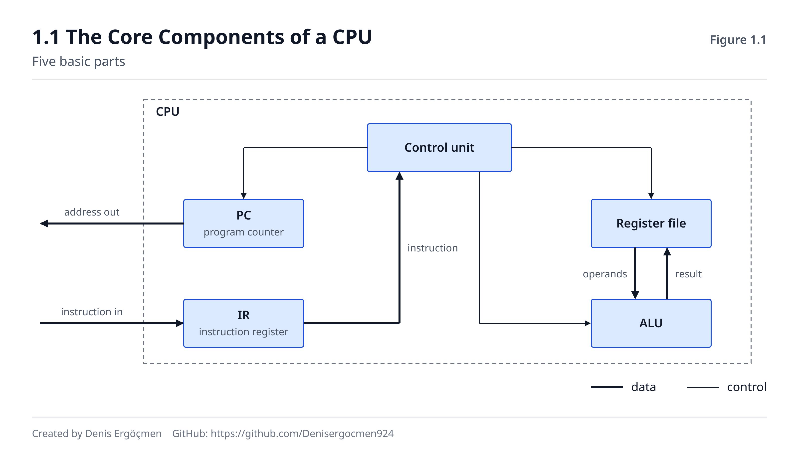
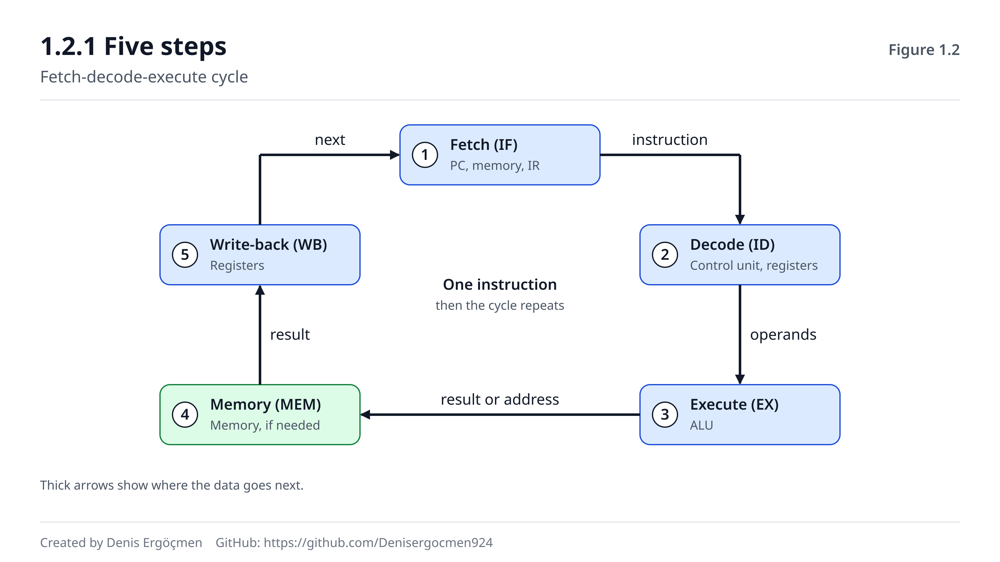
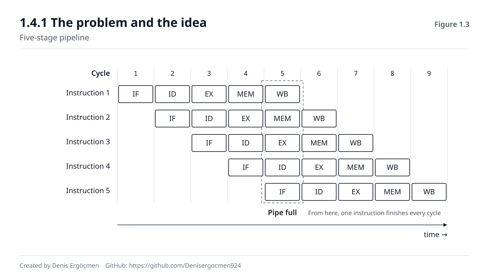
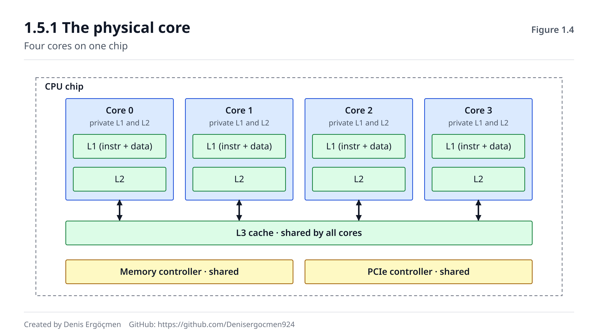

# Faz 1 — CPU Mimarisi

> **Navigasyon:** [◀ Faz 0 — Sayısal Temel](Faz_0_Sayisal_Temel.md) · **Faz 1** · [Faz 2 — Bellek Hiyerarşisi ▶](Faz_2_Bellek_Hiyerarsisi.md)

---

## Nereden geliyoruz

Faz 0'da bir zincir kurduk: **transistör → mantık kapısı → toplayıcı + geri besleme →
flip-flop → register.** Zincirin sonunda elimizde 64 bit tutabilen bir kap ve sayı
toplayabilen bir devre vardı.

Şimdi o parçaları birleştirip **CPU**'yu kuruyoruz. Ve daha önemlisi: bu fazda CPU'yu
kurduktan sonra artık AWS konsolundaki "8 vCPU, 3,2 GHz'e kadar" ifadesini ezberlenmiş bir
etiket olarak değil, **altında ne olduğunu bilerek** okuyabileceksin.

## Bu fazın sorusu

Cloud engineer'ın en sık verdiği ve en sık yanlış verdiği karar şudur:

> *"Uygulamam yavaş. Daha fazla vCPU mu almalıyım, daha hızlı CPU mu, yoksa sorun CPU'da
> değil mi?"*

Bu üç şıkkın hangisinin doğru olduğu, bu fazın altı bölümünün toplamına bağlı. Sonunda bu
soruyu **tahmin ederek değil, akıl yürüterek** cevaplayabileceksin.

## Bu fazın sonunda

- Bir talimatın CPU içindeki tam yolculuğunu adım adım anlatabileceksin
- "3 GHz" ile "hızlı" arasındaki farkı, IPC kavramıyla açıklayabileceksin
- Pipeline'ın neden var olduğunu ve ne zaman tıkandığını bileceksin
- **`c7i.4xlarge` ile `c7g.4xlarge` ikisi de 16 vCPU — ama kaç fiziksel çekirdek?**
  sorusunu cevaplayabileceksin (ve cevabın seni şaşırtması muhtemel)
- Graviton'a geçmenin ne kazandırdığını, neye mal olduğunu ve ne zaman mantıklı
  olmadığını söyleyebileceksin

## Faz haritası

| Bölüm | Konu | Derinlik | Neden burada |
|---|---|---|---|
| 1.1 | CPU'nun bileşenleri | `[kavram]` / `[mekanizma]` | Parçaları tanı |
| 1.2 | Fetch-Decode-Execute | `[mekanizma]` | Parçalar nasıl birlikte çalışır |
| 1.3 | Clock ve IPC | `[mekanizma]` / `[uygulama]` | "Hızlı" ne demek |
| 1.4 | Pipeline | `[kavram]` | Neden GHz tek başına anlamsız |
| 1.5 | Core, thread, vCPU | `[mekanizma]` / `[uygulama]` | **Faturanın karşılığı** |
| 1.6 | ISA ve CPU aileleri | `[kavram]` / `[uygulama]` | Graviton kararı |

---
---

# 1.1 CPU'nun Temel Bileşenleri

Bir CPU'yu beş parçaya ayırarak başlayalım. Bunlar 1970'lerden bugüne değişmedi — modern
CPU'lar bu beşini **çoğaltarak ve derinleştirerek** karmaşıklaştı, ama iskelet aynı.


*Şekil 1.1 — Control Unit, ALU, register dosyası, PC ve IR arasındaki veri ve kontrol
akışı. Kalın oklar veri yolu, ince oklar kontrol sinyalidir.*

## 1.1.1 ALU — Aritmetik ve Mantık Birimi `[kavram]`

**ALU** (ey-el-yu = aritmetik mantık birimi), CPU'nun **hesap yapan** kısmıdır.

Faz 0.3.3'te 64 tam toplayıcıyı zincirleyip bir toplama devresi kurmuştuk. ALU, o devrenin
yanına birkaç kardeş daha koymaktır:

| İşlem sınıfı | Örnekler | Faz 0'daki karşılığı |
|---|---|---|
| Aritmetik | toplama, çıkarma, çarpma, bölme | 0.3.3 toplayıcı |
| Mantık | AND, OR, XOR, NOT | 0.3.1, 0.3.2 kapılar |
| Kaydırma | sola/sağa kaydırma (`<<`, `>>`) | bit'leri kaydırmak = 2 ile çarpma/bölme |
| Karşılaştırma | eşit mi, büyük mü | XOR + sıfır kontrolü |

**Çıkarma nasıl yapılıyor?** Ayrı bir çıkarıcı devresi yok. İkinin tümleyeni (two's
complement) numarasıyla, çıkarma bir toplamaya dönüştürülür:

```
A - B  =  A + (-B)  =  A + (NOT B + 1)
```

Yani B'nin tüm bitlerini ters çevir (NOT kapıları), 1 ekle, sonra normal toplayıcıya ver.
Tek devre, iki işlem. **Donanım tasarımının ruhu budur:** ayrı devre eklemek yerine var
olan devreyi yeniden kullanacak bir temsil seç.

**Flag'ler (bayraklar).** ALU her işlemden sonra sonuç hakkında birkaç bit de üretir ve
bunları özel bir register'da tutar (x86'da `RFLAGS`):

| Flag | Anlamı | Nerede kullanılır |
|---|---|---|
| **ZF** (Zero) | Sonuç sıfır mı | `if (a == b)` — aslında `a-b` yapılıp ZF'ye bakılır |
| **CF** (Carry) | Taşma oldu mu (işaretsiz) | Büyük sayı aritmetiği |
| **SF** (Sign) | Sonuç negatif mi | `if (a < 0)` |
| **OF** (Overflow) | İşaretli taşma | Tam sayı taşması hataları |

Bu, programlamadaki `if` ifadesinin donanımdaki karşılığıdır: **karşılaştırma aslında bir
çıkarmadır, karar ise bir flag bitine bakmaktır.**

## 1.1.2 Register — CPU'nun elleri `[mekanizma]`

Faz 0.4.3'te öğrendik: 64 D flip-flop yan yana = 64-bit register.

**Register'lar CPU'nun elleridir.** ALU **sadece** register'lardaki veriyle çalışabilir.
Bellekteki bir sayıyı toplamak istiyorsan önce onu bir register'a **yüklemen** gerekir.

x86-64'te 16 genel amaçlı register vardır:

```
RAX  RBX  RCX  RDX  RSI  RDI  RBP  RSP  R8  R9  R10  R11  R12  R13  R14  R15
```

ARM64'te (AArch64) 31 tane: `X0`–`X30`.

Artı özel register'lar:

- **RIP** / **PC** (Program Counter) — sıradaki talimatın adresi
- **RSP** (Stack Pointer) — yığının tepesi
- **RFLAGS** — yukarıdaki bayraklar

**❓ Akla gelen soru: 16 register çok az değil mi? Neden 1000 tane yok?**

Üç sebep, üçü de öğretici:

1. **Fiziksel maliyet.** Her register 64 flip-flop, her flip-flop ~20+ transistör. Ama asıl
   sorun sayı değil, **erişim hızı**: register dosyası ne kadar büyükse, içinden bir
   register seçmek için gereken çoklayıcı (multiplexer) ağacı o kadar derinleşir ve
   gecikme artar. Register'ın tüm anlamı "1 çevrimde erişilebilir" olmasıdır — büyütürsen
   bu özelliği kaybedersin.

2. **Talimat kodlaması.** Her talimatın hangi register'ı kullandığını talimatın içinde
   belirtmen gerekir. 16 register = 4 bit. 1024 register = 10 bit. Üç operand'lı bir
   talimatta bu 12 bit yerine 30 bit demek. Talimatlar şişer, bellekten okunması yavaşlar,
   instruction cache'e daha az sığar. **Faz 0'daki takas mantığı yine karşımızda.**

3. **Zaten gizli bir havuz var.** Modern CPU'larda *mimari* register sayısı (16) ile
   *fiziksel* register sayısı farklıdır. Bir modern çekirdekte 180–500+ fiziksel register
   bulunur ve **register renaming** (yeniden adlandırma) ile bunlar 16 mimari isme
   dinamik olarak eşlenir. Amaç: sahte bağımlılıkları kırıp paralel çalıştırmak.
   Yani yazılımın gördüğü 16, donanımın kullandığı yüzlerce.

> **Bu son madde bu fazın tekrar eden temasıdır:** *Yazılıma gösterilen model ile donanımın
> gerçekte yaptığı şey aynı değildir.* ISA bir **sözleşmedir**, bir tarif değil. Donanım
> sözleşmeyi bozmadığı sürece içeride istediğini yapar. Bu ayrımı tutarsan Faz 1.4'teki
> spekülatif çalıştırma ve Faz 6'daki sanallaştırma çok daha kolay oturacak.

## 1.1.3 Program Counter ve Instruction Register `[kavram]`

**PC** (Program Counter, x86'da `RIP`): Çalıştırılacak **bir sonraki** talimatın bellek
adresini tutan register.

Her talimat çalıştırıldıktan sonra PC, talimatın uzunluğu kadar artar. Program böyle ilerler.

```
PC = 0x4005a0   →  talimatı getir  →  PC = 0x4005a4  (4 byte'lık talimatsa)
```

**Dallanma (branch) tam olarak PC'ye müdahale etmektir.** `if`, `for`, fonksiyon çağrısı —
hepsi "PC'yi sıradaki adrese değil, şu adrese ayarla" demektir. Faz 1.4'te bu müdahalenin
pipeline'a neye mal olduğunu göreceğiz.

**IR** (Instruction Register): Bellekten getirilen talimatın **kendisini** tutar. Control
Unit onu buradan okuyup çözer.

> **Bir stack trace okurken gördüğün `0x7ffd4a2b1c30` gibi adresler tam olarak budur:**
> program çöktüğü anda PC'nin (veya çağrı yığınındaki dönüş adreslerinin) değeri. Faz 0'da
> hex öğrenmenin bir getirisi buydu.

## 1.1.4 Control Unit — orkestra şefi `[kavram]`

**Control Unit** (kontrol birimi) talimatı **çözer** (decode) ve diğer tüm parçalara
"şimdi ne yapacaksın" sinyallerini gönderir.

`ADD RAX, RBX` talimatı geldiğinde Control Unit şunları yapar:

1. Bu bir toplama talimatı — ALU'ya "toplama modunda çalış" sinyali gönder
2. Operand'lar RAX ve RBX — register dosyasına "bu ikisini ALU girişine ver" de
3. Sonuç RAX'e yazılacak — "ALU çıkışını RAX'e yaz" sinyalini hazırla
4. Clock kenarında hepsi aynı anda gerçekleşsin

Yani Control Unit **hesap yapmaz**, sadece anahtarları doğru pozisyona getirir.

**Mikrokod (`[atla]` seviyesinde farkındalık).** x86 gibi karmaşık mimarilerde bazı
talimatlar tek bir donanım işlemine karşılık gelmez; CPU içinde daha basit
**mikro-operasyonlara** (µop) çevrilir. Bu çeviri tablosu güncellenebilir — **mikrokod
güncellemesi** budur. Spectre/Meltdown yamalarının bir kısmı mikrokod güncellemesiyle
dağıtıldı. Cloud'da bunu `dmesg`'de veya bulut sağlayıcının bakım bildirimlerinde
görürsün; detayına inme, varlığını bil.

> **🤔 Düşün 1.1**
> ARM64'te 31 genel amaçlı register var, x86-64'te 16. Talimat kodlaması açısından
> ARM64 daha fazla bit harcamak zorunda. Buna rağmen ARM64 talimatları **sabit 4 byte**,
> x86-64 talimatları ise **1 ile 15 byte arasında değişken**. Nasıl oluyor da daha çok
> register'ı olan mimari daha kısa talimat kullanabiliyor?
> *(Cevap: fazın sonunda)*

---

# 1.2 Fetch – Decode – Execute Döngüsü `[mekanizma]`

Bu döngü CPU'nun **tek yaptığı iştir.** Açıldığı andan kapandığı ana kadar, saniyede
milyarlarca kez, sadece bunu tekrarlar.

## 1.2.1 Beş adım

Klasik anlatımda üç adım denir ama bellek erişimi ve geri yazmayı ayırmak, Faz 1.4'teki
pipeline'ı anlamak için şart. Beş adımla çalışacağız (klasik RISC beş aşaması):

| # | Aşama | Kısaltma | Ne olur |
|---|---|---|---|
| 1 | **Fetch** | IF | PC'nin gösterdiği adresten talimatı getir, IR'a koy, PC'yi ilerlet |
| 2 | **Decode** | ID | Talimatı çöz, hangi operandlar gerekiyor belirle, register'ları oku |
| 3 | **Execute** | EX | ALU işlemi yap (veya adres hesapla) |
| 4 | **Memory** | MEM | Gerekiyorsa bellekten oku / belleğe yaz |
| 5 | **Write-back** | WB | Sonucu hedef register'a yaz |


*Şekil 1.2 — Beş aşamanın her birinde hangi birimin aktif olduğu ve verinin hangi yolu
izlediği.*

## 1.2.2 Somut bir izleme

Şu üç satırlık işi CPU'nun gözünden takip edelim. C'de:

```c
long c = a + b;      // 64 bit `long`; aşağıdaki 8 baytlık RAX yüklemeleri değişken boyutuyla uyuşsun
```

Derleyicinin ürettiği (basitleştirilmiş) makine talimatları:

```asm
mov  rax, [rbp-8]     ; a'yı bellekten RAX'e yükle
add  rax, [rbp-16]    ; b'yi bellekten oku ve RAX'e ekle
mov  [rbp-24], rax    ; sonucu belleğe (c'ye) yaz
```

**Talimat 1: `mov rax, [rbp-8]`**

```
IF   : PC = 0x401136 → bellekten 4 byte talimat getir → IR'a koy → PC = 0x40113a
ID   : "Bu bir yükleme talimatı. Kaynak: RBP register'ı - 8. Hedef: RAX."
       Register dosyasından RBP'nin değerini oku (örn. 0x7ffd4a2b1c30)
EX   : ALU adres hesapla: 0x7ffd4a2b1c30 - 8 = 0x7ffd4a2b1c28
MEM  : 0x7ffd4a2b1c28 adresinden 8 byte oku  ← BURASI KRİTİK, aşağıya bak
WB   : Okunan değeri RAX'e yaz
```

**Talimat 2: `add rax, [rbp-16]`**

```
IF   : PC = 0x40113a → talimatı getir → PC = 0x40113e
ID   : "Toplama + bellek okuma. RAX ve [RBP-16]."
EX   : Adres hesapla: RBP - 16
MEM  : O adresten oku
EX'  : ALU: RAX + okunan değer     (x86'da bu talimat birden çok µop'a ayrılır)
WB   : Sonucu RAX'e yaz, flag'leri güncelle
```

**Talimat 3: `mov [rbp-24], rax`**

```
IF   : talimatı getir
ID   : "Depolama talimatı. Kaynak: RAX. Hedef: RBP-24."
EX   : Adres hesapla: RBP - 24
MEM  : RAX'in değerini o adrese YAZ
WB   : (yok — register'a yazılan bir şey yok)
```

## 1.2.3 MEM aşaması neden her şeyi değiştiriyor

Yukarıdaki izlemede dört aşama CPU'nun içinde geçiyor: hepsi **bir clock çevriminde**
tamamlanabilir. Ama `MEM` aşaması CPU'nun **dışına** çıkıyor.

Rakamları koyalım (Faz 2'de detaylandıracağız, şimdilik ölçek hissi yeterli):

| Nereden okunuyor | Süre | 3 GHz'de kaç çevrim |
|---|---|---|
| Register | ~0 (aynı çevrim) | 0 |
| L1 cache | ~1 ns | ~4 çevrim |
| L2 cache | ~4 ns | ~12 çevrim |
| L3 cache | ~15–40 ns | ~40–120 çevrim |
| **Ana bellek (DRAM)** | **~80–100 ns** | **~240–300 çevrim** |

> **Bu tablo bu haritanın en önemli tablolarından biridir.** Şuna dikkat et:
>
> Eğer `MEM` aşaması DRAM'e gitmek zorunda kalırsa, CPU **~250 çevrim boyunca o talimat
> için hiçbir şey yapamaz.** 250 çevrimde ideal koşullarda 500–1000 başka talimat
> çalıştırabilirdi.
>
> Bu yüzden **modern CPU'ların asıl düşmanı hesaplama değil, bekleme**dir. Faz 2'nin
> tamamı bu bekleyişi azaltma mücadelesidir. Faz 1.4'teki pipeline ve out-of-order
> execution da büyük ölçüde bu bekleyişi gizleme çabasıdır.

**Cloud bağlantısı — "neden yüksek clock her zaman iyi değil" `[uygulama]`:**

Clock'u 3 GHz'den 4 GHz'e çıkardığını düşün. CPU içindeki işler %33 hızlandı. Ama DRAM
erişimi **hiç hızlanmadı** — o hâlâ ~80 ns. Sadece artık o 80 ns, 240 çevrim yerine
320 çevrim ediyor.

Yani:

- **Hesaplama yoğun** (compute-bound) iş yükü: veri cache'te, CPU sürekli çalışıyor →
  clock artışı doğrudan performansa yansır
- **Bellek yoğun** (memory-bound) iş yükü: CPU zaten bekliyor → clock artışı **neredeyse
  hiçbir şey değiştirmez**

Büyük bir hash tablosunda rastgele arama yapan, JSON parse eden, pointer'lı veri yapıları
gezen (linked list, ağaç) iş yükleri ikinci gruba girer. Bu tür bir uygulama için yüksek
clock'lu bir `c` ailesi instance almak **parayı boşa harcamaktır**; doğru hamle bellek
bant genişliği ve cache boyutuna bakmaktır (Faz 2, Faz 7).

> **🤔 Düşün 1.2**
> Bir uygulamanın `perf` çıktısında IPC = 0,4 görüyorsun (yani her clock çevriminde
> ortalama 0,4 talimat tamamlanıyor). CPU kullanımı `top`'ta %100 görünüyor.
> Bu uygulama gerçekten CPU'yu mu kullanıyor? Instance'ı daha yüksek clock'lu bir tipe
> taşırsan ne bekliyorsun?
> *(Cevap: fazın sonunda)*

---
---

# 1.3 Clock Speed ve IPC

## 1.3.1 GHz gerçekte ne ölçüyor `[mekanizma]`

**1 Hz** = saniyede 1 çevrim. **1 GHz** = saniyede 1 milyar çevrim.

Bir çevrimin süresi frekansın tersidir:

| Frekans | Çevrim süresi |
|---|---|
| 1 GHz | 1 ns |
| 2,5 GHz | 0,4 ns |
| 3 GHz | 0,333 ns |
| 4 GHz | 0,25 ns |

**Bir çevrim ne kadar kısa, ölçek hissi:** Işık boşlukta 1 nanosaniyede ~30 cm yol alır.
3 GHz'de bir çevrim 0,333 ns, yani ışığın ~10 cm gittiği süre. Bakır tel içinde sinyal
ışık hızının yaklaşık yarısı–üçte ikisi hızında ilerler → **bir çevrimde sinyal ~5–7 cm
yol alabilir.**

Bu, "çip neden küçük olmak zorunda" sorusunun cevabıdır. Çipin bir ucundan diğerine sinyal
göndermek tek çevrime sığmayabilir. Faz 2'de L3 cache'in neden L1'den yavaş olduğunun
sebeplerinden biri de tam olarak budur: **fiziksel mesafe.**

## 1.3.2 IPC — asıl ölçü `[kavram]`

**IPC** (Instructions Per Cycle) = bir clock çevriminde ortalama kaç talimat tamamlanıyor.

Ve şimdi gerçek performans formülü:

```
Performans  ≈  Clock frekansı  ×  IPC  ×  Çekirdek sayısı
               (donanım)          (donanım + YAZILIM)   (donanım)
```

Bu formülün en önemli kısmı şu: **IPC bir donanım özelliği değil, donanım–yazılım
çiftinin özelliğidir.** Aynı CPU'da farklı programlar çok farklı IPC verir.

**IPC 1'den büyük olabilir mi?** Evet, ve modern CPU'larda normali odur. Çünkü çekirdek
**superscalar**'dır: içinde birden fazla ALU, birden fazla yükleme birimi, ayrı çarpma
birimi vardır ve bağımsız talimatları **aynı çevrimde paralel** çalıştırır.

Tipik IPC aralıkları (kabaca, iş yüküne göre):

| İş yükü tipi | Tipik IPC | Neden |
|---|---|---|
| Sıkı sayısal döngü (matris, SIMD) | 3–6 | Veri cache'te, bağımlılık az, dallanma az |
| Tipik uygulama kodu | 1–2 | Karışık |
| Bellek yoğun (hash, pointer chasing) | 0,2–0,7 | Sürekli DRAM bekliyor |
| Dallanma yoğun (interpreter, parser) | 0,5–1,2 | Sürekli branch mispredict |

> **⚠️ Yaygın yanılgı:** "CPU %100 kullanımda, demek ki CPU darboğaz." **Hayır.**
> `top`'taki %100, "çekirdek bir thread'e atanmış durumda" demektir — o thread'in
> gerçekten hesap yapıp yapmadığını değil. IPC 0,3 ise çekirdek zamanının çoğunu
> **bellekten veri bekleyerek** geçiriyordur. `top` bunu "meşgul" sayar.
>
> Bu ayrımı bilmek, bir performans probleminde yanlış yöne saatlerce koşmayı önler.
> Doğru ölçü `perf stat` çıktısındaki `insn per cycle` değeridir.

> **🔧 Makinende gör** (isteğe bağlı, `linux-tools` paketi gerekir)
>
> ```bash
> perf stat -e cycles,instructions sleep 0        # perf çalışıyor mu testi
> perf stat -- openssl speed -elapsed sha256 2>/dev/null | tail -20
> ```
> **Beklenen çıktı:** `insn per cycle` satırında bir sayı. Kriptografi gibi sıkı
> hesaplama iş yüklerinde bu genelde 2,0 üstüdür. Aynı komutu büyük bir dosyada
> `grep` ile karşılaştırırsan (I/O ve bellek yoğun) çok daha düşük bir IPC görürsün.
>
> *Not: sanal makinelerde ve çoğu EC2 instance'ında donanım sayaçları kısıtlıdır;
> `perf` "not supported" diyebilir. Bu normaldir — Faz 6.3'te sebebini göreceğiz.*

## 1.3.3 Neden farklı mimarilerin GHz'i kıyaslanamaz `[uygulama]`

Şu iki instance'ı karşılaştır:

| | `c6i` (Intel Ice Lake) | `c7g` (Graviton3, ARM) |
|---|---|---|
| Taban/turbo frekans | ~3,5 GHz'e kadar | ~2,6 GHz |

Sadece frekansa bakarsan Intel %35 önde görünür. Ama gerçek iş yüklerinde Graviton3 birçok
senaryoda **eşit veya daha iyi** sonuç verir. Nasıl?

Çünkü performans `frekans × IPC`. Graviton'un IPC'si o farkı kapatabilir:

- Daha geniş decode (aynı çevrimde daha çok talimat çözer)
- Sabit uzunluklu talimatlar → decode basit ve paralel (1.6'da göreceğiz)
- Daha fazla mimari register → daha az bellek trafiği
- Farklı cache düzeni

> **Pratik kural `[uygulama]`:** **Farklı mimariler arasında GHz kıyaslaması anlamsızdır.**
> Aynı mimari ailesi içinde (örn. `c6i` vs `c7i`) frekans karşılaştırması bir fikir verir;
> mimari değiştiğinde (Intel ↔ AMD ↔ Graviton) tek geçerli ölçü **kendi iş yükünle yapılmış
> benchmark**'tır. Sağlayıcının pazarlama sayısı da, GHz de yeterli değildir.

> **🤔 Düşün 1.3**
> Bir iş yükünü `c6i.2xlarge` (3,5 GHz, 8 vCPU) üzerinde ölçtün: 100 istek/saniye.
> Aynı iş yükünü `c7g.2xlarge` (2,6 GHz, 8 vCPU) üzerinde ölçtün: 118 istek/saniye.
> Graviton'un bu iş yükündeki IPC'si Intel'inkine göre kabaca ne kadar yüksek olmalı?
> (Basit bir hesap istiyorum, çekirdek sayısını eşit varsay.)
> *(Cevap: fazın sonunda)*

---

# 1.4 Pipeline `[kavram]`

## 1.4.1 Problem ve fikir

Faz 1.2'deki beş aşamayı hatırla: IF → ID → EX → MEM → WB.

**Naif tasarım:** Her talimatı beş aşamadan geçir, bitince sıradakine başla.

```
Talimat 1:  IF  ID  EX  MEM WB
Talimat 2:                      IF  ID  EX  MEM WB
Talimat 3:                                          IF  ID  EX  MEM WB
```

Sorun ortada: **IF birimi çalışırken diğer dört birim boş duruyor.** Donanımın %80'i her
an atıl.

**Pipeline fikri:** Talimat 1 ID aşamasına geçtiği anda, IF birimi boşaldı — hemen talimat
2'yi getirmeye başla.

```
Çevrim:      1    2    3    4    5    6    7    8    9
Talimat 1:  IF   ID   EX  MEM   WB
Talimat 2:       IF   ID   EX  MEM   WB
Talimat 3:            IF   ID   EX  MEM   WB
Talimat 4:                 IF   ID   EX  MEM   WB
Talimat 5:                      IF   ID   EX  MEM   WB
```


*Şekil 1.3 — Beş aşamalı pipeline'da talimatların örtüşmesi. Boru dolduktan sonra her
çevrimde bir talimat tamamlanır.*

**Çamaşır analojisi.** Üç yük çamaşırın var: yıka (30 dk), kurut (30 dk), katla (30 dk).
Sırayla yaparsan 3 × 90 = 270 dakika. Ama birinci yük kurutucudayken ikinciyi çamaşır
makinesine atarsan toplam 150 dakikaya iner. Makineler değişmedi, **atıl kalmaları azaldı.**

**Kritik ayrım — gecikme vs verim:**

- **Latency (gecikme):** Tek bir talimatın baştan sona süresi → **hâlâ 5 çevrim.** Pipeline
  bunu kısaltmaz.
- **Throughput (verim):** Boru dolduktan sonra **her çevrimde 1 talimat tamamlanır** →
  5 kat iyileşme.

> Bu ayrım cloud'da her yerde karşına çıkacak: latency ve throughput ayrı metriklerdir
> ve birini iyileştirmek diğerini iyileştirmez. Faz 3.4'te IOPS/throughput, Faz 5.3'te
> bandwidth/latency olarak aynı ayrımı tekrar göreceksin.

**Modern derinlik:** Gerçek CPU'lar 5 değil, **14–20 aşamalı** pipeline kullanır (bazı
aşamalar alt aşamalara bölünmüştür). Daha derin pipeline = her aşama daha az iş = her
aşama daha kısa sürer = **daha yüksek clock frekansı mümkün.** Faz 0.3.3'teki "kritik yol"
problemine çözüm tam olarak budur.

## 1.4.2 Pipeline hazard'ları — boru neden tıkanır `[kavram]`

Pipeline güzel çalışıyor gibi görünüyor ama üç şey onu bozar. Bunlara **hazard** denir.

### 1. Veri bağımlılığı (data hazard)

```asm
add  rax, rbx     ; RAX = RAX + RBX
mov  rcx, rax     ; RCX = RAX    ← RAX'in yeni değerine ihtiyacı var
```

İkinci talimat, birincinin WB aşamasında yazacağı değeri ID aşamasında okumak istiyor —
ama o değer henüz yazılmamış. Pipeline **durmak (stall)** zorunda.

**Çözüm: forwarding / bypassing.** ALU'nun çıkışını, WB'yi beklemeden doğrudan bir sonraki
talimatın EX girişine bağlayan ek yollar eklenir. Çoğu durumda bu stall'ı tamamen ortadan
kaldırır.

Ama tam çözmez: yükleme talimatından hemen sonra o veriyi kullanmak (**load-use hazard**)
en az bir çevrim stall yaratır, çünkü veri MEM aşamasında geliyor.

### 2. Dallanma (control hazard) — en pahalısı

```asm
cmp  rax, 100
jg   etiket_a        ; RAX > 100 ise etiket_a'ya atla
mov  rbx, 1          ; ← bu çalışacak mı? BİLMİYORUZ
```

`jg` talimatı EX aşamasında çözülene kadar CPU **sıradaki talimatın hangisi olduğunu
bilmiyor.** Ama pipeline'ı beslemesi lazım, yoksa 15+ çevrim boş kalacak.

**Çözüm: dal tahmini (branch prediction).** CPU, geçmiş davranışa bakarak "bu dal muhtemelen
alınacak/alınmayacak" tahmini yapar ve tahmin ettiği yoldan talimat getirmeye devam eder.

Modern dal tahmincileri olağanüstü iyidir: **%95–99 doğruluk**. Sebebi, gerçek kodun büyük
kısmının tahmin edilebilir olması (bir döngü 1000 kez dönüyorsa 999 kez "devam et" doğru
tahmindir).

**Ama tahmin yanlış çıkarsa:** boru hattındaki tüm spekülatif talimatlar iptal edilir
(**pipeline flush**) ve doğru yoldan yeniden doldurulur. Maliyet modern CPU'larda tipik
olarak **~15–20 çevrim.**

**Hesabı yapalım — ve bu sayı şaşırtıcıdır:**

```
Dal tahmini doğruluğu: %95
Yanlış tahmin cezası: 18 çevrim
Kodun %20'si dallanma talimatı

100 talimatta 20 dallanma var
20 × %5 = 1 yanlış tahmin
1 × 18 = 18 çevrim ceza

100 talimat, ideal 100 çevrimde biterdi → 118 çevrim sürdü
IPC = 100/118 = 0,85   (%15 kayıp, sadece %5 yanlış tahminden)
```

Doğruluk %90'a düşerse ceza iki katına çıkar. **Dallanma tahmin edilebilirliği, IPC'yi
doğrudan belirleyen faktörlerden biridir.**

**Cloud/uygulama bağlantısı `[uygulama]`:** Hangi kod tahmin edilemez dallanma üretir?

- **Yorumlayıcılar** (Python, Ruby, PHP) — her bytecode için farklı dal
- **JSON/XML parser'lar** — her karakter farklı dal
- **Dallanma yoğun iş mantığı** — uzun `if/else` zincirleri, `switch`
- **Rastgele veriye bağlı dallar** — `if (veri[rand()] > x)`

Bu yüzden bir Python uygulaması, aynı işi yapan bir C uygulamasından yalnızca "yorumlanmış
olduğu için" değil, **IPC'si düşük olduğu için de** yavaştır. Ve bu yüzden bir Python
servisi için yüksek clock'lu instance almak, C servisi için aldığın kadar kazanç getirmez.

### 3. Yapısal hazard (structural hazard)

İki talimat aynı çevrimde aynı donanım birimini istiyorsa biri beklemek zorunda (örn. tek
bir bellek portu varken hem talimat getirme hem veri okuma). Modern tasarımlarda ayrı
instruction/data cache (Harvard mimarisi) ve çoğaltılmış birimler ile büyük ölçüde
çözülmüştür. Farkındalık düzeyinde bil, derine girme.

## 1.4.3 Derin pipeline'ın bedeli — Pentium 4 dersi `[kavram]`

2000'lerin başında Intel, "clock hızı = performans" pazarlamasının zirvesinde Pentium 4'ü
çıkardı. Mimarinin adı NetBurst'tü ve fikri basitti: **pipeline'ı olabildiğince derinleştir,
böylece çok yüksek clock'a çık.**

Prescott versiyonunda pipeline **31 aşamaya** çıktı. Clock 3,8 GHz'e ulaştı — o dönem için
inanılmaz.

**Sonuç: felaket.**

- Dal yanlış tahmini cezası ~31+ çevrime çıktı. Dallanma yoğun kodda performans çöktü
- Isı ve güç tüketimi kontrolden çıktı
- Aynı dönemin daha düşük clock'lu, daha kısa pipeline'lı Pentium M'i (ve AMD Athlon 64'ü)
  gerçek iş yüklerinde Pentium 4'ü **yendi**

Intel NetBurst'ü terk etti ve Pentium M'in mimarisinden Core serisini türetti. Bugünkü
Intel CPU'ların soy ağacı oraya dayanır.

> **Ders — ve bu ders cloud'da her gün geçerli:** *Tek bir metriği optimize etmek
> (GHz), sistemi bütün olarak yavaşlatabilir.* Bugün bunun cloud versiyonu şudur: "CPU
> kullanımını %90'a çıkardım, verimli çalışıyorum" diye övünen bir sistem, aslında cache
> thrashing veya context switch fırtınası yaşıyor olabilir. **Metriği değil, sonucu
> optimize et.**

## 1.4.4 Spekülatif çalıştırma ve cloud güvenliği `[kavram]`

Dal tahmini "tahmin edip devam etme" demek. Buna **spekülatif çalıştırma** (speculative
execution) denir: CPU henüz kesin olmayan bir yoldaki talimatları **çalıştırır**, yanlış
çıkarsa sonuçları atar.

Mimari olarak güvenli görünüyor — atılan sonuçlar programın gördüğü duruma yansımıyor.

**Ama bir sızıntı var.** Spekülatif çalıştırılan talimatlar atılsa bile **cache'te iz
bırakır.** Ve cache'in durumu, zamanlama ölçülerek dışarıdan okunabilir.

2018'de yayımlanan **Spectre** ve **Meltdown** açıkları tam olarak bunu kullandı: bir
saldırgan, CPU'yu erişemeyeceği belleği spekülatif olarak okumaya zorlayıp, sonucu cache
zamanlaması üzerinden çıkarabiliyordu.

**Cloud'da bu neden özellikle önemli `[uygulama]`:** Çünkü cloud **çok kiracılı**
(multi-tenant). Aynı fiziksel CPU'da senin instance'ınla tanımadığın birinin instance'ı
çalışıyor olabilir. Spekülatif çalıştırma açıkları, teorik olarak kiracı sınırını aşma
imkânı sundu.

Alınan önlemler ve bedelleri:

| Önlem | Bedeli |
|---|---|
| Mikrokod güncellemeleri | Bazı iş yüklerinde %5–30 performans kaybı |
| Kernel page-table isolation (KPTI) | Syscall maliyeti arttı — syscall yoğun iş yükleri etkilendi |
| SMT (Hyper-Threading) devre dışı bırakma | Bazı ortamlarda vCPU sayısının yarıya inmesi |
| Fiziksel izolasyon (Dedicated Host, `.metal`) | Maliyet |

AWS'in Nitro mimarisi bu tehdit modelini donanım seviyesinde daraltır (Faz 6.6, Faz 7.2).

> **Buradan alacağın şey:** Performans için yapılan donanım optimizasyonları (spekülasyon,
> paylaşılan cache, SMT) **çok kiracılı ortamlarda güvenlik yüzeyi yaratır.** Cloud'da
> "hız" ve "izolasyon" sürekli pazarlık hâlindedir. Faz 6 ve 7 bu pazarlığın detayına
> girecek.

> **🤔 Düşün 1.4**
> Bir servisinin dal tahmini doğruluğu %97, yanlış tahmin cezası 18 çevrim ve talimatların
> %25'i dallanma. Kod optimizasyonuyla doğruluğu %99'a çıkarabiliyorsun.
> 1000 talimatlık bir iş için kaç çevrim kazanırsın? Yüzde olarak ne eder?
> *(Cevap: fazın sonunda)*

---
# 1.5 Core, Thread, Hyper-Threading ve vCPU

Bu bölüm, bu fazın **parayla en doğrudan ilişkili** bölümüdür. AWS'te seçtiğin her instance
bir vCPU sayısıyla etiketlenir ve faturan buna göre kesilir. Ama "vCPU" kelimesi, altında
ne olduğunu **gizleyen** bir soyutlamadır.

## 1.5.1 Fiziksel çekirdek (physical core) `[mekanizma]`

Bir **fiziksel çekirdek**, şimdiye kadar anlattığımız her şeyin eksiksiz bir kopyasıdır:

- Kendi register dosyası
- Kendi ALU'ları (birden fazla — superscalar)
- Kendi yükleme/depolama birimleri
- Kendi pipeline'ı
- Kendi dal tahmincisi
- Kendi **L1 cache**'i (talimat + veri, ayrı)
- Genelde kendi **L2 cache**'i

Çekirdekler arasında paylaşılan şeyler: **L3 cache**, bellek denetleyicisi, PCIe
denetleyicisi, ve tabii ki **güç/ısı bütçesi.**


*Şekil 1.4 — Her çekirdeğin özel L1/L2'si, tüm çekirdeklerin paylaştığı L3 cache ve
bellek denetleyicisi.*

Faz 0.2.3'ten hatırla: çekirdek sayısının artmasının sebebi, tek çekirdeği hızlandırmanın
fiziksel olarak durmasıydı. Çok çekirdek bir tercih değil, bir **mecburiyetin sonucu.**

> **Ve kritik sonuç:** Çekirdek eklemek performansı **yalnızca iş paralelleştirilebiliyorsa**
> artırır. Tek thread'li bir uygulama 64 çekirdekli bir makinede 1 çekirdek kullanır;
> kalan 63'ü seyreder. Faturayı 64 çekirdek için ödersin.
>
> Bu, cloud'da en sık yapılan pahalı hatalardan biridir.

## 1.5.2 SMT / Hyper-Threading — bir çekirdeği ikiye bölmek `[mekanizma]`

**Gözlem:** Faz 1.2.3'te gördük ki bir çekirdek zamanının önemli kısmını **bekleyerek**
geçirir — DRAM erişimi, cache miss, dal yanlış tahmini, veri bağımlılığı. Bu anlarda
çekirdeğin pahalı ALU'ları boş durur.

**Fikir:** Çekirdeğe **iki ayrı talimat akışı** (thread) besleyelim. Biri beklerken diğeri
boştaki birimleri kullansın.

Buna **SMT** (Simultaneous Multi-Threading) denir. Intel'in ticari adı **Hyper-Threading**,
AMD'de de SMT olarak geçer.

**Ne çoğaltılır, ne paylaşılır:**

| Çoğaltılır (her thread'in kendi kopyası) | Paylaşılır (thread'ler yarışır) |
|---|---|
| Mimari register'lar | ALU ve diğer çalıştırma birimleri |
| Program counter | L1 cache |
| Talimat kuyruğu durumu | L2 cache |
| Bazı kontrol yapıları | Dal tahmincisi tabloları |
| | Bellek bant genişliği |

**Yani ikinci thread "yarım çekirdek" değildir.** İşletim sistemine **tam bir çekirdek gibi
görünür** — `/proc/cpuinfo` iki ayrı CPU gösterir, scheduler ikisine de iş atar. Ama
altta paylaşılan tek bir çalıştırma motoru vardır.

**Gerçek kazanç ne kadar?**

| İş yükü | SMT kazancı |
|---|---|
| Bellek yoğun, çok bekleyen | **%20–40** (boş birimler gerçekten doluyor) |
| Karışık/tipik sunucu iş yükü | **%10–30** |
| Sıkı hesaplama, birimler zaten dolu (HPC, SIMD) | **%0–5, bazen negatif** |
| Cache'e duyarlı iş yükü | **Negatif olabilir** (iki thread L1/L2'yi birbirine kirletir) |

> **⚠️ Yaygın yanılgı: "Hyper-Threading CPU'yu ikiye katlar."** Kesinlikle hayır. Tipik
> kazanç **%10–30**'dur, hiçbir zaman %100 değil. Mantık basit: ikinci thread yeni bir
> ALU getirmiyor, sadece var olanların **boş anlarını** dolduruyor. Boş an yoksa kazanç
> da yoktur.

**HPC ve bazı veritabanı dünyasında SMT sık sık kapatılır.** Sebepleri:

1. Kazanç yok (birimler zaten dolu), cache kirlenmesi var → net kayıp
2. Performans **öngörülebilirliği** düşüyor (aynı iş her seferinde farklı süre)
3. Yazılım lisansları çekirdek başına ücretlendiriliyorsa, SMT lisans maliyetini şişirir
4. Güvenlik: L1TF/MDS gibi açıklar aynı çekirdekteki thread'ler arasında sızıntıya izin verdi

## 1.5.3 vCPU — AWS'in sana gerçekte ne sattığı `[uygulama]`

**Bu bölümün tek cümlesi, bu fazın en pratik bilgisidir:**

> **AWS'te bir vCPU, çoğu x86 instance'ında bir fiziksel çekirdek değil, bir donanım
> thread'idir (SMT yarısı). Graviton instance'larında ise bir vCPU = bir tam fiziksel
> çekirdektir, çünkü Graviton'da SMT yoktur.**

Sonuçları tabloya dökelim:

| Instance | vCPU | Fiziksel çekirdek | Not |
|---|---|---|---|
| `c7i.4xlarge` (Intel) | 16 | **8** | 2 vCPU = 1 çekirdek (Hyper-Threading) |
| `c7a.4xlarge` (AMD) | 16 | **8** | 2 vCPU = 1 çekirdek (SMT) |
| `c7g.4xlarge` (Graviton3) | 16 | **16** | SMT yok, 1 vCPU = 1 çekirdek |
| `c7i.metal-48xl` | 192 | 96 | Bare metal, yine SMT var |

**Aynı "16 vCPU" etiketi, iki katı fiziksel çekirdek farkı gizliyor.**

> **Bu, Graviton'un fiyat/performans iddiasının en az anlaşılan bileşenidir.** Graviton
> instance'ı hem daha ucuz, hem de aynı vCPU sayısı için daha fazla gerçek çekirdek
> veriyor. Hesaplama yoğun, iyi paralelleşen iş yüklerinde bu fark doğrudan performansa
> yansır.
>
> Ama otomatik bir kazanç değil: tek-thread'li bir iş yükünde Graviton'un daha düşük
> frekansı dezavantaja dönüşebilir. Ve SMT'nin kazanç sağladığı bellek-bekleme yoğun
> iş yüklerinde x86 aradaki farkı kapatabilir. **Ölçmek şart.**

**❓ Akla gelen soru: Bunu bir instance'ın içinden nasıl doğrularım?**

> **🔧 Makinende gör** (EC2'de veya kendi makinende)
>
> ```bash
> lscpu | grep -E 'Model name|^CPU\(s\)|Thread|Core|Socket'
> ```
> **Beklenen çıktı (SMT'li x86, 16 vCPU):**
> ```
> CPU(s):                16
> Thread(s) per core:    2      ← SMT AÇIK
> Core(s) per socket:    8      ← gerçek çekirdek sayısı
> Socket(s):             1
> ```
> **Beklenen çıktı (Graviton, 16 vCPU):**
> ```
> CPU(s):                16
> Thread(s) per core:    1      ← SMT YOK
> Core(s) per socket:    16     ← hepsi gerçek çekirdek
> ```
>
> Hangi vCPU'ların aynı fiziksel çekirdeği paylaştığını da görebilirsin:
> ```bash
> cat /sys/devices/system/cpu/cpu0/topology/thread_siblings_list
> ```
> Çıktı `0,8` gibiyse: CPU 0 ve CPU 8 **aynı fiziksel çekirdeğin iki thread'idir.**
> Performans testlerinde bu ikisine aynı anda ağır iş vermek, iki ayrı çekirdeğe
> vermekle aynı sonucu **vermez**.

**AWS'te SMT'yi kapatabilir misin?** Evet — instance başlatırken `CpuOptions` ile
`ThreadsPerCore=1` verebilirsin. vCPU sayısı yarıya iner ama **fiyat değişmez** (vCPU
değil, instance tipi üzerinden ücretlendirilirsin). Yani:

- Lisans maliyeti çekirdek başınaysa → kazanç sağlar
- Performans öngörülebilirliği kritikse → mantıklı olabilir
- Diğer durumlarda → genelde gereksiz, kapasitenin bir kısmını atarsın

## 1.5.4 CPU-bound mu, I/O-bound mu — çekirdek sayısı ne zaman işe yarar `[uygulama]`

Bu ayrım, "daha fazla vCPU alayım mı?" sorusunun cevabıdır.

| | **CPU-bound** | **I/O-bound** |
|---|---|---|
| Darboğaz | Hesaplama gücü | Disk/ağ/veritabanı bekleme |
| Belirti | CPU %100, IPC yüksek (>1,5) | CPU düşük, çok sayıda bekleyen thread |
| Örnekler | Video encode, şifreleme, ML eğitimi, derleme, sıkıştırma | Web API, proxy, dosya sunucusu, çoğu CRUD uygulaması |
| **Daha fazla vCPU?** | **Evet, doğrudan yardımcı olur** | **Çoğunlukla hayır** |
| Doğru hamle | Çekirdek sayısı ve/veya frekans | Eşzamanlılık modeli, bağlantı havuzu, I/O hızı |

**I/O-bound bir uygulamaya vCPU eklemek neden işe yaramaz?** Çünkü thread'ler hesap
yapmıyor, **bekliyor.** 100 thread'in 90'ı veritabanı cevabını bekliyorsa, 8 vCPU yerine
32 vCPU vermek onları daha hızlı bekletmez.

> **⚠️ Yaygın yanılgı ve pahalı hata:** "Uygulama yavaş → instance'ı büyüt." Bu, darboğazı
> ölçmeden atılan bir adımdır ve I/O-bound bir uygulamada **sadece faturayı büyütür.**
> Faz 7.5'te bu teşhisin sistematik yolunu kuracağız. Şimdilik refleksi kur:
> **"CPU %100" yeterli veri değildir; IPC ve bekleme profili olmadan karar verme.**

**Bir ara durum — ve cloud'da çok yaygın:** `t` ailesi (burstable). Bu instance'lar
fiziksel çekirdeğin **bir kesrini** garanti eder (örn. `t3.micro` → vCPU başına %10 taban)
ve üstünü **CPU kredisi** ile kullandırır. Kredi bitince performans taban seviyeye
düşer — uygulaman aniden 5–10 kat yavaşlar. Faz 6.5 ve Faz 7.1'de bunun mekanizmasına
gireceğiz. Şimdilik tut: **`t` ailesinde "2 vCPU" ifadesi, 2 çekirdeğe sürekli erişim
anlamına gelmez.**

> **🤔 Düşün 1.5**
> Bir video transcode servisi çalıştırıyorsun. İş tamamen CPU-bound, mükemmel
> paralelleşiyor, bellek erişimi az (veri cache'e sığıyor), SIMD talimatları yoğun
> kullanıyor.
>
> İki seçenek var, fiyatları kabaca yakın:
> - `c7i.8xlarge`: 32 vCPU (16 fiziksel çekirdek + SMT), ~3,2 GHz'e kadar
> - `c7g.8xlarge`: 32 vCPU (32 fiziksel çekirdek), ~2,6 GHz
>
> Hangisini seçersin ve neden? SMT'nin bu iş yükünde ne kadar katkı vermesini beklersin?
> *(Cevap: fazın sonunda)*

---

# 1.6 CPU Aileleri ve ISA

## 1.6.1 ISA nedir — donanım ile yazılım arasındaki sözleşme `[kavram]`

**ISA** (Instruction Set Architecture = komut seti mimarisi), bir CPU'nun **yazılıma verdiği
söz**dür:

- Hangi talimatlar var (`ADD`, `MOV`, `JMP`, ...)
- Talimatlar bellekte nasıl kodlanıyor (kaç byte, hangi bit ne anlama geliyor)
- Kaç register var, isimleri ne
- Bellek nasıl adresleniyor
- Kesme (interrupt) ve ayrıcalık seviyeleri nasıl çalışıyor

**ISA bir *arayüz*dür, bir *uygulama* değil.** Intel ve AMD tamamen farklı iç tasarımlara
sahiptir ama **aynı ISA'yı** (x86-64) uygular. Bu yüzden aynı binary ikisinde de çalışır.

> **Bu ayrım cloud'da doğrudan işine yarar:** Bir Docker image'ı `linux/amd64` veya
> `linux/arm64` olarak etiketlenir — bu ISA etiketidir. Intel ve AMD instance'ları arasında
> geçiş yaparken image değiştirmene gerek yoktur (ikisi de amd64). Graviton'a geçerken
> **gerekir** (arm64).

## 1.6.2 x86-64 ve ARM64 — iki tasarım felsefesi `[uygulama]`

### x86-64 (Intel, AMD)

**Soy ağacı:** 1978'de Intel 8086 → 80286 → 80386 (32-bit) → AMD64 (64-bit, 2003).
Kırk yılı aşkın **geriye dönük uyumluluk.** Modern bir Xeon, teorik olarak 1978'in
8086 kodunu çalıştırabilir.

Özellikleri:

- **Değişken uzunluklu talimatlar: 1–15 byte.** Bir talimatın nerede bittiğini anlamak
  için onu çözmen gerekir → **decode aşaması karmaşık ve enerji yoğun**. Paralel decode
  zordur çünkü sonraki talimatın nerede başladığını bilemezsin.
- **16 genel amaçlı register.** Az; derleyici sık sık belleğe taşma (register spill) yapar.
- **Bellek operand'lı talimatlar:** `add rax, [rbp-16]` gibi tek talimatta hem bellek
  okuyup hem hesap yapabilir (CISC izi).
- **Devasa talimat seti:** Binlerce talimat + SSE, AVX, AVX-512 gibi SIMD uzantıları.
- İçeride talimatlar **µop**'lara çevrilip RISC benzeri bir çekirdekte çalıştırılır.

### ARM64 / AArch64 (Graviton, Apple Silicon, Ampere)

**Soy ağacı:** 1985'te ARM1, düşük güç için tasarlandı. AArch64 (2011) temiz bir sayfa —
32-bit ARM ile uyumluluk yükü büyük ölçüde atıldı.

Özellikleri:

- **Sabit uzunluklu talimatlar: her biri tam 4 byte.** Bir sonraki talimatın nerede
  başladığı **her zaman belli** → decode basit ve **kolayca paralelleştirilebilir.**
  Bu, Graviton'un aynı çevrimde daha çok talimat çözebilmesinin sebebidir.
- **31 genel amaçlı register.** Daha az bellek trafiği, daha az spill.
- **Load/store mimarisi:** Bellek erişimi yalnızca özel `LDR`/`STR` talimatlarıyla; aritmetik
  talimatlar sadece register'larla çalışır. Her talimat daha basit, pipeline daha düzenli.
- **Daha küçük ve düzenli talimat seti.** Decode devresi küçük → **daha az transistör, daha
  az enerji.**

### Ve bu 1.1.4'teki Düşün 1.1'in cevabı

ARM64'ün **daha fazla** register'ı olduğu hâlde talimatları **daha kısa ve sabit**. Nasıl?
Çünkü ARM, kodlama bütçesini başka yerden tasarruf ederek kazandı: daha az adresleme modu,
bellek operand'ı yok, daha düzenli format. x86 ise geriye dönük uyumluluk yüzünden kodlama
alanının büyük kısmını eski talimatlara harcamak zorunda.

**Bu, Faz 0'da tekrar tekrar gördüğümüz takasın bir örneği daha:** bedava kazanç yoktur,
sadece hangi maliyeti nereye koyduğun vardır.

## 1.6.3 CISC vs RISC — ve neden bu ayrım artık yanıltıcı `[kavram]`

Klasik anlatım:

- **CISC** (Complex Instruction Set Computer): az sayıda güçlü, karmaşık talimat. x86.
- **RISC** (Reduced Instruction Set Computer): çok sayıda basit, hızlı talimat. ARM.

**Bu ayrım 1980'lerde anlamlıydı, bugün büyük ölçüde erimiştir:**

- x86 CPU'lar içeride talimatları µop'lara çevirip **RISC benzeri** bir çekirdekte çalıştırır
- ARM zaman içinde SIMD (NEON, SVE), kripto, atomik işlemler gibi **karmaşık talimatlar** ekledi
- İkisi de out-of-order, superscalar, spekülatif

**Bugün geçerli olan gerçek fark tek bir yerde toplanıyor: decode maliyeti ve güç verimliliği.**
x86'nın değişken uzunluklu talimatları, her çevrimde çalışan karmaşık bir decode devresi
gerektirir ve bu devre sürekli enerji yakar. ARM'ın sabit formatı bu maliyeti ortadan
kaldırır.

Bu yüzden ARM, **performans/watt** oranında yapısal bir avantaja sahiptir. Ve cloud'da
performans/watt, doğrudan **maliyet** demektir: daha az güç = daha az soğutma = daha çok
sunucu/rack = birim başına daha ucuz.

## 1.6.4 Graviton kararı — pratik `[uygulama]`

**Graviton**, AWS'in kendi tasarladığı ARM64 sunucu işlemcisidir (Graviton1 → 2 → 3 → 4).

**Ne kazandırır:**

| Kazanç | Açıklama |
|---|---|
| Fiyat | Karşılaştırılabilir x86 instance'lardan tipik olarak **%10–20 daha ucuz** liste fiyatı |
| Gerçek çekirdek | SMT yok → aynı vCPU sayısı için **2 kat fiziksel çekirdek** (1.5.3) |
| Enerji | AWS'in belirttiği ölçüde daha düşük tüketim (sürdürülebilirlik hedefleri için de kullanılır) |
| Fiyat/performans | AWS'in iddiası birçok iş yükünde **~%40'a varan** iyileşme — *iş yüküne bağlı* |

> **Bu rakamlara ihtiyatlı yaklaş.** "%40 daha iyi fiyat/performans" bir pazarlama
> özetidir ve belirli benchmark'lardan gelir. Senin iş yükün için gerçek sayı çok daha iyi
> de olabilir, çok daha kötü de. **Ölçmeden taşıma.**

**Neye mal olur — gerçek engeller:**

1. **Yeniden derleme gerekir.** Derlenmiş her şey (C/C++/Go/Rust binary'leri) arm64 için
   yeniden derlenmeli.
2. **Container image'ları.** Multi-arch build kurman gerekir (`docker buildx`,
   `--platform linux/arm64`). Base image'ların arm64 varyantı olmalı.
3. **Bağımlılıklar.** Native uzantılı kütüphaneler (Python `wheel`'leri, Node native
   modülleri, JVM'in JNI kütüphaneleri) arm64 için mevcut olmayabilir. Çoğu popüler paket
   artık destekliyor ama uzun kuyrukta sürprizler çıkar.
4. **Kapalı kaynak / satıcı yazılımı.** Satıcı arm64 sürümü vermiyorsa yol kapalı.
5. **Ajanlar ve araçlar.** Monitoring/APM/güvenlik ajanlarının arm64 sürümü olmalı.

**Karar ağacı:**

```
Yorumlanan/JIT dil mi? (Python, Node.js, Java, Ruby, .NET Core)
├─ Evet → Native bağımlılıkların arm64 destekliyor mu?
│         ├─ Evet → Graviton güçlü aday. Test et, büyük ihtimalle kazanç var.
│         └─ Hayır → Bağımlılığı değiştirebilir misin? Değilse x86'da kal.
└─ Hayır (derlenmiş) → CI/CD'de arm64 build ekleyebilir misin?
          ├─ Evet → Test et. Genelde kazançlı.
          └─ Hayır → x86'da kal.

Kapalı kaynak satıcı yazılımı mı? → Satıcı arm64 desteklemiyorsa konu kapalı.
Tek-thread performansı kritik mi? → Graviton'un düşük frekansı dezavantaj olabilir, ÖLÇ.
```

**En kolay geçiş adayları:** Yönetilen servisler. RDS, ElastiCache, OpenSearch, Lambda,
Fargate — bunlarda Graviton'a geçmek çoğu zaman **tek bir ayar değişikliğidir**, çünkü
derleme ve bağımlılık sorununu AWS çözer. Graviton yolculuğuna buradan başlamak, uygulama
katmanına dokunmadan kazanç almanın en hızlı yoludur.

> **🤔 Düşün 1.6**
> Ekibin bir Python/Django API'sini Graviton'a taşımak istiyor. Uygulama `numpy`,
> `psycopg2` ve `Pillow` kullanıyor — üçü de C uzantılı. Deployment Docker ile,
> base image `python:3.11-slim`.
>
> Taşımadan önce kontrol etmen gereken üç şey nedir ve hangisi seni gerçekten
> durdurabilir?
> *(Cevap: fazın sonunda)*

---
---
---

# Faz 1 — Düşün sorularının cevapları

## Cevap 1.1 — ARM64 daha çok register'a rağmen nasıl daha kısa talimat kullanıyor?

**Soru:** ARM64'te 31 register (5 bit gerekir), x86-64'te 16 (4 bit). Buna rağmen ARM
sabit 4 byte, x86 1–15 byte. Nasıl?

Çünkü talimat kodlamasında register alanı **en büyük maliyet kalemi değil.** ARM,
kodlama bütçesini üç yerden tasarruf ederek kazanıyor:

**1. Adresleme modu sadeliği.** x86'da bir operand şu biçimlerde olabilir:
`[rbx]`, `[rbx+8]`, `[rbx+rcx*4+16]`, mutlak adres, RIP-göreli... Her biri talimatı
uzatan ek byte'lar (ModR/M, SIB, displacement) ister. ARM'da load/store için sınırlı
sayıda düzenli mod vardır.

**2. Bellek operand'ı yok (load/store mimarisi).** ARM'da `ADD` sadece register'larla
çalışır. x86'da `add rax, [rbp-16]` tek talimattır ve içinde bir adres taşır — bu, o
talimatı 3–4 byte uzatır.

**3. Geriye dönük uyumluluk yükü yok.** x86'nın kodlama alanının büyük kısmı 1978'den
kalma talimatlar ve prefix'ler tarafından işgal edilmiştir. Yeni talimatlar (AVX vb.)
uzun prefix zincirleriyle kodlanmak zorunda. ARM64 temiz bir sayfayla başladı.

> **Ders:** Bir sistemde "daha çok kaynak" (register) mutlaka "daha çok maliyet" (talimat
> boyutu) demek değildir — **eğer başka bir yerde sadeleşme yaptıysan.** Tasarım, bütçeyi
> nereye harcadığınla ilgilidir. Bu düşünce biçimi Faz 3'te (SSD hücre tipi seçimi) ve
> Faz 7'de (instance ailesi seçimi) tekrar karşına çıkacak.

**İlgili bölüm:** 1.1.2, 1.6.2

---

## Cevap 1.2 — IPC 0,4 ve `top`'ta %100 CPU

**Soru:** Bu uygulama gerçekten CPU'yu mu kullanıyor? Daha yüksek clock'lu instance ne yapar?

**Hayır, CPU'yu "kullanmıyor" — CPU'yu *bekletiyor.***

IPC 0,4 demek: her 10 clock çevriminde ortalama 4 talimat tamamlanıyor. Modern bir
superscalar çekirdek aynı çevrimde 4–6 talimat tamamlayabilecek kapasitede. Yani çekirdek
kapasitesinin kabaca **%10'unu** kullanıyor.

Geri kalan zamanda ne yapıyor? Büyük olasılıkla **bekliyor**:

- DRAM'den veri bekliyor (cache miss) — en olası sebep
- Dal yanlış tahmini sonrası pipeline yeniden doluyor
- Veri bağımlılığı zincirinde takılmış

**`top` bunu neden %100 gösteriyor?** Çünkü `top`'un ölçtüğü şey "çekirdeğin bir thread'e
atanmış olduğu zaman oranı"dır. Thread bellekten veri beklerken de çekirdek ona atanmış
durumdadır — iş yapmıyor ama başkasına da verilmiyor. İşletim sistemi açısından bu
"meşgul"dür.

**Daha yüksek clock'lu instance'a taşırsan ne olur?**

Çok az şey. Clock artışı CPU içindeki işleri hızlandırır, ama darboğaz **CPU dışında**
(DRAM'de). DRAM erişimi ~80 ns'tir ve clock ne olursa olsun 80 ns'tir. Clock'u %30
artırırsan, o 80 ns daha fazla çevrim eder — hepsi o kadar. Tipik kazanç %5'in altında
kalır.

**Doğru hamleler:**

| Hamle | Neden |
|---|---|
| Veri yapısını cache dostu hâle getirmek | En büyük kazanç. Faz 2.3'te göreceğiz |
| Daha büyük L3 cache'li instance ailesi | Çalışma kümesi cache'e sığarsa dramatik kazanç |
| Bellek bant genişliği yüksek aile (`r`, `x`) | Bant genişliği doygunsa yardımcı olur |
| NUMA yerleşimini düzeltmek | Faz 2.7 |
| Daha fazla vCPU (iş paralelse) | Bekleme gizlenir, toplam verim artar |

> **Refleks olarak tut:** *"CPU %100" bir teşhis değil, bir semptomdur.* Teşhis için
> IPC, cache miss oranı ve bellek bant genişliği gerekir.

**İlgili bölüm:** 1.2.3, 1.3.2 · **Devamı:** Faz 2.3, Faz 7.5

---

## Cevap 1.3 — Graviton'un IPC avantajını hesaplamak

**Soru:** Intel 3,5 GHz'de 100 istek/s; Graviton 2,6 GHz'de 118 istek/s. IPC farkı ne kadar?

Performans ≈ frekans × IPC × çekirdek. Çekirdek sayısını eşit varsaydık (soru öyle
istedi), o hâlde:

```
Intel:     100 = 3,5 × IPC_intel × k
Graviton:  118 = 2,6 × IPC_grav  × k

Böl:  118/100 = (2,6 × IPC_grav) / (3,5 × IPC_intel)
      1,18    = 0,743 × (IPC_grav / IPC_intel)

IPC_grav / IPC_intel = 1,18 / 0,743 = 1,588
```

**Graviton'un IPC'si bu iş yükünde Intel'inkinden yaklaşık %59 yüksek.**

**Ama burada dürüst olmak gerek — bu hesap bir basitleştirmedir:**

Gerçekte "IPC farkı" tek başına açıklamıyor. Faz 1.5.3'ten hatırla: aynı vCPU sayısında
**Graviton'un iki katı fiziksel çekirdeği var.** Yani `k` (çekirdek sayısı) eşit değil.
Ölçtüğün 118 sayısının içinde şunların hepsi karışık:

- Gerçek IPC farkı (mimari)
- Fiziksel çekirdek farkı (SMT yok)
- Cache boyutu ve bellek bant genişliği farkı
- Uygulamanın paralelleşme derecesi

**Alınacak ders — ve bu hesaptan daha önemli:** Cloud'da bir performans farkını tek bir
sebebe bağlamak neredeyse her zaman yanlıştır. Doğru yaklaşım **kendi iş yükünle uçtan uca
ölçmek** ve "neden" sorusunu ancak ölçtükten sonra sormaktır. Bu yüzden "Graviton %X daha
hızlıdır" cümlesi kendi başına anlamsızdır; "**benim** iş yükümde %X daha hızlı" anlamlıdır.

**İlgili bölüm:** 1.3.2, 1.3.3, 1.5.3

---

## Cevap 1.4 — Dal tahmini iyileştirmesinin kazancı

**Soru:** %97 → %99 doğruluk, 18 çevrim ceza, talimatların %25'i dallanma, 1000 talimat.

```
1000 talimat × %25 = 250 dallanma talimatı

%97 doğrulukta:
  yanlış tahmin = 250 × 0,03 = 7,5
  ceza = 7,5 × 18 = 135 çevrim

%99 doğrulukta:
  yanlış tahmin = 250 × 0,01 = 2,5
  ceza = 2,5 × 18 = 45 çevrim

Kazanç = 135 - 45 = 90 çevrim
```

**Yüzde olarak ne eder?** Bu, temel çevrim sayısına bağlı. IPC = 1 varsayarsak 1000 talimat
ideal olarak 1000 çevrim:

```
%97 durumunda toplam: 1000 + 135 = 1135 çevrim
%99 durumunda toplam: 1000 +  45 = 1045 çevrim

İyileşme: (1135 - 1045) / 1135 = %7,9
```

**%8 performans artışı, sadece dal tahmini doğruluğunu %97'den %99'a çıkararak.**

**Bu neden önemli:** %2'lik bir doğruluk artışı kulağa önemsiz gelir ama etkisi %8. Sebep,
**yanlış tahmin sayısının üç kat azalması** (7,5 → 2,5). Küçük oran değişimleri, nadir ama
pahalı olayları kat kat azaltabilir.

Bu düşünce biçimi cache miss oranlarında da geçerlidir ve Faz 2.3'te aynı matematikle
karşılaşacaksın: **%95 hit oranı ile %99 hit oranı arasındaki fark, %4 değil, 5 kat daha az
miss demektir.**

**İlgili bölüm:** 1.4.2 · **Devamı:** Faz 2.3

---

## Cevap 1.5 — Video transcode için Intel mi Graviton mu?

**Soru:** CPU-bound, mükemmel paralel, veri cache'e sığıyor, SIMD yoğun.
`c7i.8xlarge` (16 fiziksel çekirdek + SMT, ~3,2 GHz) vs `c7g.8xlarge` (32 fiziksel
çekirdek, ~2,6 GHz).

**Kaba hesap Graviton'u işaret ediyor:**

```
c7i:  16 fiziksel çekirdek × 3,2 GHz = 51,2 "çekirdek-GHz"
      + SMT katkısı: bu iş yükünde %0–5  (birimler zaten dolu!)
      ≈ 51–54

c7g:  32 fiziksel çekirdek × 2,6 GHz = 83,2 "çekirdek-GHz"
```

**Kâğıt üstünde Graviton belirgin önde** — ve bunun sebebi doğrudan 1.5.2'deki kural:
SIMD yoğun, hesaplama doygun bir iş yükünde **SMT neredeyse hiçbir şey kazandırmaz**,
çünkü çalıştırma birimlerinde doldurulacak boşluk yok. `c7i`'nin "32 vCPU"sunun ikinci
yarısı bu iş yükünde büyük ölçüde hayalidir.

**Ama karar vermeden önce üç şeyi kontrol etmelisin — ve bunlar sonucu tersine çevirebilir:**

1. **SIMD talimat seti uyumu.** Transcode kütüphanen (ör. x264/x265/libaom) AVX2 veya
   AVX-512 için elle optimize edilmiş assembly içeriyorsa, ARM'daki karşılığı (NEON/SVE)
   aynı olgunlukta olmayabilir. Bu tek başına Graviton avantajını silebilir. **Bu en
   kritik maddedir.**
2. **Donanım hızlandırma var mı?** Transcode için asıl doğru cevap belki de ikisi değil:
   AWS'te `vt1` (Xilinx video transcoding) gibi özel instance'lar veya GPU tabanlı
   çözümler, genel amaçlı CPU'dan kat kat verimli olabilir. **Doğru soru "hangi CPU?"
   değil, "CPU mu?" olabilir.**
3. **Ölçüm.** Gerçek medya dosyalarınla, gerçek profilinle benchmark. Kâğıt hesabı yön
   verir, karar vermez.

> **Bu sorunun asıl dersi:** Faz 1'in tüm kavramları (fiziksel çekirdek, SMT'nin sınırı,
> frekans × IPC) seni **doğru hipoteze** götürür. Ama hipotez ölçümün yerini almaz. İyi bir
> cloud engineer, ölçmeden önce ne bekleyeceğini bilir — ve yine de ölçer.

**İlgili bölüm:** 1.5.2, 1.5.3, 1.5.4, 1.6.4

---

## Cevap 1.6 — Django + numpy/psycopg2/Pillow Graviton'a taşınır mı?

**Soru:** Taşımadan önce kontrol edilecek üç şey ve hangisi gerçekten durdurur?

**Kontrol 1: Base image'ın arm64 varyantı var mı?**
`python:3.11-slim` resmi image'dır ve `linux/arm64` varyantı **vardır**. Sorun değil.
Kontrol: `docker manifest inspect python:3.11-slim | grep architecture`

**Kontrol 2: C uzantılı paketlerin arm64 wheel'ı var mı?**
- `numpy` → manylinux aarch64 wheel'ları **var**. Sorun değil.
- `psycopg2-binary` → aarch64 wheel'ı **var**. (`psycopg2` kaynak sürümü de derlenebilir,
  `libpq-dev` gerekir.)
- `Pillow` → aarch64 wheel'ları **var**.

Üçü de büyük, bakımlı projeler. Ama **wheel yoksa** `pip install` kaynaktan derlemeye
düşer: build araçları (`gcc`, başlık dosyaları) gerekir, image şişer, build süresi
dakikalardan on dakikalara çıkar. Durdurucu değil ama pipeline'ını yavaşlatır.

**Kontrol 3: CI/CD arm64 image üretebiliyor mu?**
Bu genelde **en çok iş çıkaran** madde. Gerekenler:
- `docker buildx` ile multi-arch build (`--platform linux/amd64,linux/arm64`)
- QEMU emülasyonuyla build **çok yavaştır** — pratikte native arm64 runner istersin
  (CodeBuild'in arm64 ortamı, GitHub Actions'ın arm64 runner'ı vb.)
- Image registry'de multi-arch manifest yönetimi

**Hangisi seni gerçekten durdurur?**

Yukarıdaki üçü de çözülebilir. **Gerçek durdurucular listede olmayan yerlerden gelir:**

| Gizli risk | Neden durdurur |
|---|---|
| **Monitoring/APM ajanı** (Datadog, New Relic, Dynatrace) | Ajanın arm64 sürümü yoksa gözlemlenebilirliği kaybedersin — bu, performans kazancından daha değerlidir |
| **Güvenlik ajanı** (EDR, uyumluluk taraması) | Kurumsal ortamda ajansız node çalıştırmak politika ihlalidir |
| **Az bilinen bir bağımlılık** | `requirements.txt`'deki 80 paketten biri arm64 wheel'ı olmayan, bakımsız bir paket olabilir |
| **Satıcı kütüphanesi** | Kapalı kaynak bir SDK/driver amd64-only olabilir |

**Doğru yöntem — tahmin etme, tara:**

```bash
# Tüm bağımlılıkları arm64 için çözmeyi dene (indirmeden)
pip download --platform manylinux2014_aarch64 --only-binary=:all: \
             --dest /tmp/arm64check -r requirements.txt
```
Bu komut, wheel'ı olmayan paketleri **tek seferde** listeler. Beş dakikada cevabı alırsın.

**Önerilen taşıma sırası:**
1. Önce yönetilen servisleri Graviton'a al (RDS, ElastiCache) — uygulamaya hiç dokunmadan
2. Sonra uygulamayı staging'de arm64'te çalıştır, ajanları doğrula
3. Sonra prod'a kademeli (ASG'de karma mimari mümkündür — amd64 ve arm64 node'ları bir
   arada tutup trafiği yavaşça kaydırabilirsin)

**İlgili bölüm:** 1.6.2, 1.6.4

---
# Faz 1 — Sık sorulan sorular

### S1. `nproc` bana 8 diyor. Bu 8 çekirdek mi, 8 thread mi?

**8 mantıksal işlemci** (logical CPU) diyor — yani işletim sisteminin gördüğü birim sayısı.
SMT açıksa bu 4 fiziksel çekirdek demektir.

Kesin cevap için:
```bash
lscpu | grep -E 'Thread|Core|Socket'
```
`Thread(s) per core: 2` ise fiziksel çekirdek sayısı `nproc / 2`'dir.

Bu ayrım, thread havuzu boyutlandırırken doğrudan işine yarar: CPU-bound bir havuzu
`nproc` kadar açmak SMT'li bir makinede genelde doğrudur, ama **fiziksel çekirdek kadar**
açmak bazı iş yüklerinde daha iyi ve daha öngörülebilir sonuç verir. Ölçmeden varsayma.

### S2. Turbo boost açıkken instance'ımın gerçek frekansını nasıl görürüm?

```bash
grep MHz /proc/cpuinfo | head -4          # anlık frekans
```

Ama **sanallaştırılmış ortamlarda bu değer çoğu zaman yanıltıcıdır**: hypervisor gerçek
frekansı gizleyebilir veya sabit bir değer raporlayabilir (Faz 6.3). EC2'de `/proc/cpuinfo`
genellikle taban frekansı gösterir, gerçek turbo davranışını değil.

**Pratik yaklaşım:** Frekansı okumaya çalışmak yerine **iş çıktısını ölç.** Sabit bir
mikro-benchmark'ı (ör. `openssl speed`) çalıştırıp saniyedeki işlem sayısını karşılaştırmak,
raporlanan MHz'den çok daha güvenilir bir göstergedir.

### S3. Uygulamam çok thread açıyor ama hızlanmıyor. Neden?

Olası sebepler, sıklık sırasıyla:

1. **I/O-bound** — thread'ler bekliyor, hesap yapmıyor (1.5.4)
2. **Kilit çekişmesi (lock contention)** — thread'ler aynı kilidi bekliyor, seri hâle geliyor
3. **Amdahl Yasası** — işin seri kısmı tavanı belirliyor. İşin %10'u paralelleşemiyorsa,
   sonsuz çekirdekle bile en fazla 10 kat hızlanırsın
4. **Bellek bant genişliği doygun** — çekirdekler var ama hepsi aynı DRAM'i bekliyor (Faz 2.4)
5. **False sharing** — farklı thread'ler aynı cache satırına yazıyor (Faz 2.3'te göreceğiz)
6. **Context switch fırtınası** — çekirdek sayısından çok fazla aktif thread

Teşhis sırası: önce CPU kullanımına ve IPC'ye bak, sonra kilit profiline, sonra bellek
bant genişliğine.

### S4. AWS "3,5 GHz'e kadar" diyor. "Kadar" ne kadar?

Belirsiz, ve bilinçli olarak belirsiz. Gerçek frekans şunlara bağlı:

- Kaç çekirdek aktif (ısı bütçesi — Faz 0.2.3)
- Hangi talimatlar çalışıyor (AVX-512 yoğun kod frekansı **düşürür** — güç yoğunluğu yüksek)
- Fiziksel sunucunun o anki sıcaklığı ve toplam yükü
- Komşu kiracıların ne yaptığı (paylaşımlı instance'larda — Faz 7.4)

Bu yüzden performans testlerini **kısa değil uzun** çalıştır. 30 saniyelik bir test turbo
frekansı ölçer; 10 dakikalık bir test gerçek sürdürülebilir performansı ölçer. Aradaki fark
%20'yi bulabilir.

### S5. Out-of-order execution'ı hiç anlatmadın. Bilmem gerekiyor mu?

`[kavram]` düzeyinde bir cümle yeter: **Modern CPU'lar talimatları yazıldıkları sırada
değil, operand'ları hazır olan sırayla çalıştırır**; sonuçları ise yazılım sırasına
uygun şekilde "emekli eder" (retire). Amaç: bir talimat bellek beklerken arkadaki bağımsız
talimatları çalıştırıp boşluğu doldurmak.

Pratikte senin için sonucu şu: **CPU, bellek beklemesini kendi kendine bir miktar
gizler** — ama sınırlıdır (yeniden sıralama penceresi birkaç yüz talimattır). Cache miss
oranı yüksekse bu pencere dolar ve gizleme çöker. Yani out-of-order, Faz 2'nin önemini
azaltmaz; sadece küçük gecikmeleri saklar.

Derinine girmen gereken bir konu değil.

### S6. `perf` EC2'de çalışmıyor, "not supported" diyor. Sorun ne?

Donanım performans sayaçları (PMU) sanallaştırılmış ortamlarda varsayılan olarak
kısıtlıdır — hypervisor bunları misafire açmayabilir, çünkü sayaçlar yan-kanal saldırıları
için kullanılabilir (Faz 1.4.4'teki tehdit modeli).

Seçenekler:
- **`.metal` instance** kullan — bare metal'de PMU'ya tam erişim vardır
- **Yazılım sayaçlarıyla** yetin: `perf stat -e task-clock,context-switches,page-faults`
  donanım sayacı istemez
- **Uygulama seviyesi profiling** kullan (dil düzeyi profiler'lar, APM)
- Bazı instance tiplerinde sınırlı PMU erişimi vardır; `perf list` ile neyin mevcut
  olduğunu kontrol et

### S7. Bir talimat gerçekten kaç çevrimde bitiyor?

Talimata göre çok değişir ve **latency ile throughput ayrı ayrı ölçülür** (Faz 1.4.1'deki
ayrımın aynısı):

| Talimat | Latency (çevrim) | Throughput (çevrim başına) |
|---|---|---|
| `ADD` (register) | 1 | 3–4 tane/çevrim |
| `MUL` (tam sayı) | 3–5 | 1 tane/çevrim |
| `DIV` (tam sayı) | 20–90 | çok düşük |
| L1'den yükleme | 4–5 | 2 tane/çevrim |
| DRAM'den yükleme | ~200–300 | bellek denetleyicisine bağlı |

Dikkat: **bölme çok pahalıdır.** Bu yüzden derleyiciler sabit bir sayıya bölmeyi
çarpma+kaydırmaya çevirir, ve performans kritik kodda bölmeden kaçınılır. Küçük bir
detay ama bir hot loop'ta ölçülebilir fark yaratır.

---

# Faz 1 — Kendini sına

**1.** CPU'nun beş temel bileşenini say ve her birinin işini bir cümleyle yaz.

**2.** ALU çıkarma işlemini nasıl yapıyor? Neden ayrı bir çıkarıcı devre yok?

**3.** `if (a == b)` ifadesi donanımda nasıl gerçekleşir?

**4.** x86-64'te neden sadece 16 genel amaçlı register var? Üç sebep say.

**5.** Fetch-decode-execute döngüsünün beş aşamasını sırala.

**6.** DRAM'den bir okuma 3 GHz'lik bir CPU'da kaç çevrime denk gelir? Bu neden önemli?

**7.** Performans formülünü yaz. Hangi terimi yazılım etkiler?

**8.** IPC 0,4 olan bir uygulamada `top` %100 CPU gösteriyor. Ne oluyor?

**9.** Pipeline latency'yi mi throughput'u mu iyileştirir? Açıkla.

**10.** Üç pipeline hazard tipini say ve her birine bir çözüm yaz.

**11.** Dal yanlış tahmininin maliyeti neden bu kadar yüksek?

**12.** Pentium 4 / NetBurst neden başarısız oldu? Buradan çıkan genel ders nedir?

**13.** Spectre/Meltdown sınıfı açıklar cloud'da neden özellikle kritik?

**14.** SMT'de ne çoğaltılır, ne paylaşılır? Tipik kazanç yüzdesi nedir?

**15.** `c7i.4xlarge` 16 vCPU. Kaç fiziksel çekirdek? `c7g.4xlarge` 16 vCPU. Kaç fiziksel çekirdek?

**16.** Bir instance'ın içinden SMT açık mı kapalı mı olduğunu nasıl anlarsın?

**17.** I/O-bound bir uygulamaya vCPU eklemek neden yardımcı olmaz?

**18.** ISA nedir? Intel ve AMD aynı binary'i neden çalıştırabiliyor?

**19.** ARM64'ün x86-64'e karşı yapısal enerji avantajı nereden geliyor?

**20.** Graviton'a geçişte karşılaşabileceğin dört engeli say.

---

## Cevap anahtarı

**1.** **ALU** (hesap yapar) · **Register'lar** (ALU'nun çalıştığı geçici veri kapları) ·
**Program Counter** (sıradaki talimatın adresi) · **Instruction Register** (şu anki
talimatı tutar) · **Control Unit** (talimatı çözer ve diğer birimlere kontrol sinyali
gönderir). · *1.1*

**2.** İkinin tümleyeni ile: `A - B = A + (NOT B + 1)`. B'nin bitleri ters çevrilip 1
eklenir ve normal toplayıcı kullanılır. Sebep: **var olan devreyi yeniden kullanmak**, ayrı
devre eklemekten ucuzdur. · *1.1.1*

**3.** CPU `a - b` çıkarmasını yapar, sonucu atar ama **Zero Flag**'i (ZF) günceller.
Sonra koşullu dallanma talimatı ZF'ye bakarak atlayıp atlamayacağına karar verir.
**Karşılaştırma bir çıkarmadır, karar bir flag bitidir.** · *1.1.1*

**4.** (a) **Erişim hızı** — register dosyası büyüdükçe seçim çoklayıcısı derinleşir ve
1-çevrim erişim kaybolur. (b) **Talimat kodlaması** — daha çok register = talimat başına
daha çok bit = şişmiş talimatlar. (c) **Zaten gizli bir havuz var** — register renaming
ile 180–500+ fiziksel register, 16 mimari isme eşlenir. · *1.1.2*

**5.** **IF** (Fetch) → **ID** (Decode) → **EX** (Execute) → **MEM** (Memory) → **WB**
(Write-back). · *1.2.1*

**6.** ~80–100 ns ÷ 0,333 ns = **~240–300 çevrim.** Önemli, çünkü CPU o süre boyunca
o talimat için bekler; aynı sürede yüzlerce başka talimat çalıştırabilirdi. **Modern
CPU'ların asıl darboğazı hesaplama değil bekleme.** · *1.2.3*

**7.** `Performans ≈ Clock × IPC × Çekirdek sayısı`. **IPC'yi yazılım doğrudan etkiler**
(veri yerleşimi, dallanma yapısı, bellek erişim deseni). · *1.3.2*

**8.** Çekirdek kapasitesinin ~%10'u kullanılıyor; geri kalanı **bekleme** (büyük
olasılıkla cache miss → DRAM). `top` "çekirdek bir thread'e atanmış" durumunu %100 sayar,
gerçekten iş yapıldığını değil. Daha yüksek clock çok az şey değiştirir. · *1.2.3, 1.3.2*

**9.** **Throughput'u** iyileştirir. Tek talimatın baştan sona süresi (latency) değişmez
(hatta derin pipeline'da artar); ama boru dolduktan sonra **her çevrimde bir talimat
tamamlanır.** · *1.4.1*

**10.** **Veri hazard'ı** → forwarding/bypassing. **Kontrol hazard'ı (dallanma)** → dal
tahmini + spekülatif çalıştırma. **Yapısal hazard** → birimleri çoğaltmak, ayrı
instruction/data cache. · *1.4.2*

**11.** Çünkü yanlış tahmin edilince boru hattındaki tüm spekülatif talimatlar iptal
edilir (**pipeline flush**) ve boru doğru yoldan yeniden doldurulur. Modern derin
pipeline'larda bu **~15–20 çevrim**. · *1.4.2*

**12.** Pipeline'ı 31 aşamaya çıkarıp yüksek clock hedefledi; dal yanlış tahmini cezası
ve güç tüketimi kontrolden çıktı, gerçek iş yüklerinde daha düşük clock'lu rakiplere
yenildi. **Ders: tek bir metriği (GHz) optimize etmek sistemi bütün olarak yavaşlatabilir.**
· *1.4.3*

**13.** Çünkü cloud **çok kiracılıdır** — aynı fiziksel CPU'da farklı müşterilerin
instance'ları çalışır. Spekülatif çalıştırmanın cache'te bıraktığı izler, kiracı sınırını
aşan bilgi sızıntısına imkân verdi. Önlemlerin (mikrokod, KPTI, SMT kapatma) hepsinin
performans bedeli var. · *1.4.4*

**14.** **Çoğaltılır:** mimari register'lar, program counter, talimat kuyruğu durumu.
**Paylaşılır:** ALU'lar ve tüm çalıştırma birimleri, L1/L2 cache, dal tahmincisi, bellek
bant genişliği. **Tipik kazanç %10–30**, asla %100 değil; hesaplama-doygun iş yüklerinde
~0 veya negatif. · *1.5.2*

**15.** `c7i.4xlarge` (Intel, SMT var) → **8 fiziksel çekirdek.**
`c7g.4xlarge` (Graviton, SMT yok) → **16 fiziksel çekirdek.** Aynı vCPU etiketi, iki kat
fark. · *1.5.3*

**16.** `lscpu | grep 'Thread(s) per core'`. Değer `2` ise SMT açık, `1` ise kapalı/yok.
Ayrıca `/sys/devices/system/cpu/cpu0/topology/thread_siblings_list` hangi mantıksal
CPU'ların aynı fiziksel çekirdeği paylaştığını gösterir. · *1.5.3*

**17.** Çünkü thread'ler hesap yapmıyor, **bekliyor** (disk, ağ, veritabanı). Bekleyen bir
thread'e daha fazla çekirdek vermek onu daha hızlı bekletmez. Doğru hamle: eşzamanlılık
modeli, bağlantı havuzu, I/O tarafının hızı. · *1.5.4*

**18.** **ISA** donanımın yazılıma verdiği sözleşmedir: hangi talimatlar var, nasıl
kodlanıyor, kaç register var, bellek nasıl adresleniyor. Intel ve AMD **iç tasarımları
tamamen farklı** olduğu hâlde **aynı ISA'yı (x86-64)** uyguladıkları için aynı binary
ikisinde de çalışır. · *1.6.1*

**19.** **Decode maliyetinden.** x86'nın değişken uzunluklu (1–15 byte) talimatları,
her çevrimde çalışan karmaşık ve enerji yoğun bir çözme devresi gerektirir ve paralel
decode'u zorlaştırır. ARM64'ün sabit 4 byte talimatları decode'u basit, küçük ve kolayca
paralelleştirilebilir yapar → daha az transistör, daha az enerji. · *1.6.3*

**20.** (a) Derlenmiş kodun arm64 için yeniden derlenmesi · (b) Container image'larının
multi-arch build'i ve arm64 base image gereksinimi · (c) Native uzantılı bağımlılıkların
(Python wheel, Node native modül) arm64 desteği · (d) Kapalı kaynak satıcı yazılımı ve
monitoring/güvenlik **ajanlarının** arm64 sürümü. · *1.6.4*

---

## Puanlama

| Doğru sayısı | Ne yapmalı |
|---|---|
| 17–20 | Faz 2'ye geç. CPU modelin sağlam. |
| 13–16 | Geç, ama 1.5'i (core/thread/vCPU) tekrar oku — Faz 6 ve 7 buna dayanıyor. |
| 8–12 | 1.2.3, 1.3.2 ve 1.5'i mutlaka tekrar et. Bu üçü Faz 2'nin ön koşulu. |
| 0–7 | Fazı baştan işle. |

**Hangi soruyu kaçırırsan hangi bölüme dön:**

| Soru | Bölüm |
|---|---|
| 1, 2, 3, 4 | 1.1 — Bileşenler |
| 5, 6 | 1.2 — Fetch-decode-execute ve bellek duvarı |
| 7, 8 | 1.3 — Clock ve IPC |
| 9, 10, 11, 12, 13 | 1.4 — Pipeline ve spekülasyon |
| 14, 15, 16, 17 | 1.5 — Core, thread, vCPU |
| 18, 19, 20 | 1.6 — ISA ve Graviton |

---

# Faz 1 — Kapanış ve Faz 2'ye Köprü

## Bu fazdan ne taşıyorsun

**1. "vCPU ≠ çekirdek" refleksi.**
Bir instance tablosuna baktığında artık otomatik olarak "bu vCPU'lar SMT thread'i mi,
gerçek çekirdek mi?" diye soracaksın. Bu tek soru, Graviton kararlarının ve kapasite
planlamasının merkezinde.

**2. "Performans = Clock × IPC × Çekirdek" formülü.**
Ve içindeki en önemli bilgi: **IPC'yi yazılım belirler.** Donanım seçimi tek başına
performans satın almaz.

**3. "CPU %100 bir teşhis değildir" refleksi.**
Bekleme de %100 görünür. Bu, Faz 7'deki darboğaz analizinin temel taşı.

**4. En kritik rakam: DRAM erişimi ≈ 250 çevrim.**
Bu sayı, bir sonraki fazın **var olma sebebidir.**

## Faz 2 bunun neresine bağlanıyor

Faz 1'de tekrar tekrar aynı duvara çarptık:

> *CPU hızlı, bellek yavaş. CPU zamanının çoğunu bekleyerek geçiriyor.*

Pipeline bu beklemeyi **gizlemeye** çalıştı. Out-of-order execution gizlemeye çalıştı.
SMT, beklerken başka bir thread çalıştırarak gizlemeye çalıştı.

**Hiçbiri problemi çözmedi — sadece üstünü örttü.** Problemin kendisine saldıran tek şey
**bellek hiyerarşisi**dir, ve Faz 2'nin tamamı odur.

| Faz 1'de öğrendiğin | Faz 2'de ne oluyor |
|---|---|
| DRAM erişimi ~250 çevrim (1.2.3) | **Cache'in var olma sebebi** (2.1) |
| Register = en hızlı ama en az (1.1.2) | Hiyerarşinin tepesi (2.2) |
| SRAM/DRAM farkı (Faz 0.4.4) | **L1/L2/L3 seviyelerinin sebebi** (2.3) |
| SMT thread'leri L1/L2 paylaşır (1.5.2) | Cache kirlenmesi ve false sharing (2.3) |
| Çekirdekler L3 paylaşır (1.5.1) | **Noisy neighbor'ın mekanizması** (2.3, Faz 7.4) |
| IPC'yi bellek erişimi belirliyor (1.3.2) | Cache hit oranı = IPC'nin ana sürücüsü (2.3) |
| Çok soketli sunucular | **NUMA** (2.7) |

> **Faz 1 çıktısı — devam etmeden önce kendine sor:**
> "Bir talimatın CPU içindeki yolculuğunu, `MEM` aşamasında ne olabileceği dahil, adım
> adım anlatabiliyor muyum? Ve 'bu instance 16 vCPU' cümlesini duyduğumda aklıma kaç
> soru geliyor?"
>
> İkinci sorunun cevabı en az üç olmalı: *SMT var mı? Hangi mimari? Paylaşımlı mı,
> dedicated mı?*

---

> **Navigasyon:** [◀ Faz 0 — Sayısal Temel](Faz_0_Sayisal_Temel.md) · **Faz 1** · [Faz 2 — Bellek Hiyerarşisi ▶](Faz_2_Bellek_Hiyerarsisi.md)
