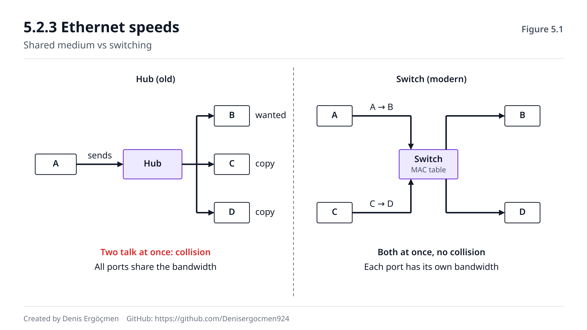
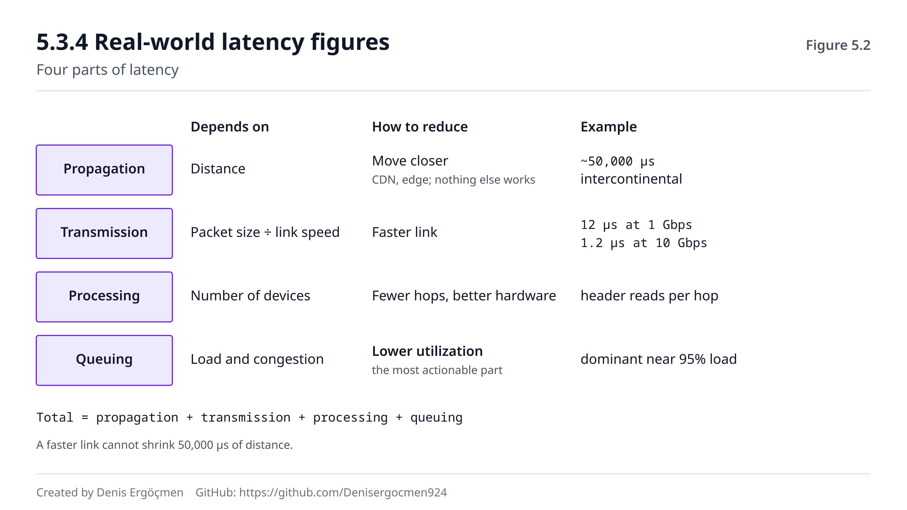

# Faz 5 — Ağ Donanımı

> **Navigasyon:** [◀ Faz 4 — Sistem Bus'ları ve I/O](Faz_4_Bus_ve_IO.md) · **Faz 5** · [Faz 6 — Sanallaştırma Donanımı ▶](Faz_6_Sanallastirma_Donanimi.md)

---

> ### Bu faz, üç haritanın kesiştiği yerdir.
>
> Burada ağın **donanımını** işliyoruz: paket fiziksel olarak nasıl taşınır, NIC CPU ile
> nasıl çalışır, gecikmenin bileşenleri nelerdir.
>
> Ağın **protokollerini** (IP, TCP, DNS, TLS, yönlendirme) network haritası alıyor. Bu
> faz onun fiziksel zeminini kurar: **bir paketin neden geciktiğini anlamak için önce
> onun fiziksel yolculuğunu bilmek gerekir.**

---

## Nereden geliyoruz

Faz 4'ün kavramları burada doğrudan devam ediyor:

| Faz 4'te öğrendiğin | Buradaki karşılığı |
|---|---|
| 4.3 DMA | 5.1.3 — NIC paketi doğrudan RAM'e yazar |
| 4.4.2 kesme/yoklama, NAPI | 5.1.4 — ağ katmanında tam uygulaması |
| 4.4.3 MSI-X dağıtımı | 5.1.4 — RSS ile çekirdeklere dağıtım |
| 4.1.2 paylaşımlı hat → nokta-nokta | 5.2.1 — hub'dan switch'e evrim, **birebir aynı hikâye** |
| 4.2 PCIe şerit bütçesi | 5.2.3 — 100 Gbps NIC'in PCIe ihtiyacı |

Ve Faz 3'ten bir kavram burada üçüncü kez karşımıza çıkacak: **kuyruk eğrisi.** Diskte
`await` patlamasıydı; burada **paket kaybı ve jitter** olarak görünecek.

---

## Bu fazın sonunda

- Bir paketin NIC'e gelmesinden uygulamaya ulaşmasına kadarki yolu anlatabileceksin
- Bant genişliği ve gecikmenin neden bağımsız iki büyüklük olduğunu açıklayabileceksin
- Gecikmenin dört bileşenini ayırt edip hangisine müdahale edilebileceğini bileceksin
- "Hat 10 Gbps ama uygulamam 2 Gbps alıyor" durumunu teşhis edebileceksin
- Yüksek paket hızlı iş yüklerinde darboğazın nerede olduğunu bulabileceksin
- AWS'in ağ performans rakamlarını (ve EFA'yı) gerekçesiyle okuyabileceksin

---

## Faz haritası

| Bölüm | Konu | Derinlik | Neden önemli |
|---|---|---|---|
| 5.1 | NIC | `[mekanizma]` | Paketin sisteme giriş kapısı; darboğazların çoğu burada |
| 5.2 | Switching ve fiziksel ağ | `[mekanizma]` / `[kavram]` | Veri merkezi topolojisinin temeli |
| 5.3 | **Bant genişliği ve gecikme** | `[mekanizma]` | **Fazın kalbi — mimari kararların dayanağı** |
| 5.4 | RDMA ve yüksek performanslı ağ | `[kavram]` | EFA'nın ve ML cluster'larının varlık sebebi |

---

# 5.1 NIC — Ağ Arayüz Kartı

## 5.1.1 NIC'in görevi `[mekanizma]`

NIC (Network Interface Card), bilgisayarın belleğindeki **bit'ler** ile kablodaki
**elektrik/ışık sinyalleri** arasında çeviri yapar.

**Gönderirken:**
```
1. İşletim sistemi paketi RAM'de hazırlar
2. NIC'e "şu adreste paket var" der
3. NIC DMA ile paketi RAM'den okur          (Faz 4.3)
4. Ethernet çerçevesine sarar (başlık + CRC)
5. Bit'leri fiziksel sinyale çevirir (encoding)
6. Kabloya sürer
```

**Alırken:**
```
1. Kablodan sinyal gelir → bit'lere çevrilir
2. CRC kontrol edilir — bozuksa paket atılır
3. MAC adresi kontrol edilir — bana mı?
4. NIC DMA ile paketi RAM'e yazar            (Faz 4.3)
5. CPU'ya kesme gönderir                      (Faz 4.4)
6. Çekirdek paketi işler, uygulamaya iletir
```

> **4. adıma dikkat:** Paket, CPU'ya **uğramadan** RAM'e yazılır. Faz 4.3'te DMA'sız bir
> dünyada 10 Gbps'in çekirdekleri tüketeceğini hesaplamıştık — o hesap tam olarak burayı
> anlatıyordu.

## 5.1.2 Ethernet çerçevesi ve MAC adresi `[mekanizma]`

```
┌──────────┬──────────┬──────────┬──────┬─────────────────┬─────┐
│ Preamble │ Hedef MAC│ Kaynak MAC│ Tip  │   Veri (payload)│ CRC │
│  8 byte  │  6 byte  │  6 byte   │2 byte│  46–1500 byte   │4 by.│
└──────────┴──────────┴──────────┴──────┴─────────────────┴─────┘
```

| Alan | İşlevi |
|---|---|
| **Preamble** | Alıcının saat senkronizasyonu |
| **MAC adresleri** | Yerel ağda kim kime — 48 bit, donanıma gömülü |
| **Tip** | Üstteki protokol (0x0800 = IPv4, 0x86DD = IPv6, 0x0806 = ARP) |
| **Payload** | Taşınan veri — **maksimum 1500 byte: MTU** |
| **CRC** | Hata tespiti — bozuk çerçeve sessizce atılır |

**MTU (Maximum Transmission Unit) = 1500 byte** standarttır ve önemli bir sonucu vardır:

```
Her çerçevenin sabit ek yükü:
  Hat üstünde, MTU'nun DIŞINDA:
    Preamble + SFD          :  8 byte
    Ethernet başlık + CRC   : 18 byte
    Çerçeveler arası boşluk : 12 byte   (IFG)
  MTU'nun İÇİNDE (1500'ün bir kısmı):
    IP başlık               : 20 byte
    TCP başlık              : 20 byte
  ──────────────────────────────────────
  Toplam ek yük             : 78 byte

1500 byte MTU ile:  TCP verisi 1460 byte, hattaki toplam 1538 byte
                    1460 / 1538 = %94,9 verim
```

**Jumbo frame (MTU 9000):**
```
8960 / 9038 = %99,1 verim
Ve daha önemlisi: aynı veri için PAKET SAYISI 6 KAT AZALIR
→ 6 kat az kesme, 6 kat az başlık işleme (Faz 4.4.2'nin hesabı)
```

> **Cloud bağlantısı:** AWS VPC içinde jumbo frame (9001 MTU) desteklenir ve büyük veri
> transferlerinde belirgin fark yaratır. **Ama internete çıkan trafikte kullanılamaz** —
> yol üzerindeki bir cihaz 1500 MTU ile sınırlıysa paket parçalanır (fragmentation) veya
> düşer.
>
> Klasik bir arıza: VPC içinde jumbo frame açıldıktan sonra **bazı** bağlantılar kopar
> (ağ geçidi üzerinden gidenler), diğerleri çalışır. Belirti kafa karıştırıcıdır çünkü
> küçük paketler (SSH el sıkışması) geçer, büyük paketler (dosya transferi) takılır —
> "bağlantı kuruluyor ama veri akmıyor" görüntüsü verir.

## 5.1.3 Halka tamponu (ring buffer) `[mekanizma]`

NIC ile çekirdek arasındaki veri alışverişi **halka tamponu** üzerinden olur: RAM'de
tahsis edilmiş, dairesel bir tanımlayıcı (descriptor) dizisi.

```
        ┌───┬───┬───┬───┬───┬───┬───┬───┐
   RX:  │ ▓ │ ▓ │ ▓ │   │   │   │   │   │
        └───┴───┴───┴───┴───┴───┴───┴───┘
          ↑           ↑
      CPU okur    NIC yazar
      (tüketici)  (üretici)

  ▓ = işlenmeyi bekleyen paket
```

**Kritik nokta:** Bu tampon **sabit boyutludur.** NIC, CPU'nun tüketebildiğinden hızlı
yazarsa tampon dolar ve **yeni gelen paketler düşer.**

Ve bu düşüş sessizdir — hiçbir uygulama hatası üretmez.

```bash
ethtool -g eth0        # halka tamponu boyutu
ethtool -S eth0 | grep -i -E "drop|miss|overrun|no_buf"
```
**Beklenen çıktı:**
```
Ring parameters for eth0:
Pre-set maximums:
RX:  4096          ← donanımın desteklediği en büyük
TX:  4096
Current hardware settings:
RX:  512           ← şu an kullanılan — büyütülebilir
TX:  512
```
```
     rx_dropped: 0          ← 0 olmalı
     rx_missed_errors: 0    ← artıyorsa tampon yetmiyor
```

> **`rx_dropped` artıyorsa iki sebepten biri vardır:** ya tampon küçük (`ethtool -G` ile
> büyüt), ya da CPU yetişemiyor (5.1.4'e bak). **İkisini karıştırmamak önemlidir** —
> tamponu büyütmek CPU yetişemiyorsa sadece gecikmeyi artırır, kaybı önlemez.
>
> Faz 3.4.4'teki kuyruk eğrisiyle aynı mantık: **kuyruğu büyütmek, hizmet hızı yetersizse
> problemi çözmez — sadece daha derin bir kuyrukta bekletir.** Bu, bufferbloat denen
> olgunun da özüdür.

## 5.1.4 Kesme, NAPI ve RSS `[mekanizma]`

Faz 4.4.2'de NAPI'yi tanımıştık. Ağ bağlamında tam işleyişi şudur:

```
Düşük trafik:
  Paket gelir → NIC kesme gönderir → CPU işler → boşta bekler
  ✓ Düşük gecikme, CPU boşta kalabiliyor

Yüksek trafik:
  Paket gelir → NIC kesme gönderir
  → Çekirdek KESMELERİ KAPATIR, yoklama (poll) moduna geçer
  → Bir turda birden çok paket işler (budget: genelde 64–300)
  → Kuyruk boşalınca kesmeleri tekrar açar
  ✓ Kesme fırtınası önlenir
```

**RSS (Receive Side Scaling) — Faz 4.4.3'ün ağ versiyonu.**

Modern NIC'lerde **birden fazla RX kuyruğu** vardır. NIC, paketin başlıklarından
(kaynak/hedef IP ve port) bir hash hesaplar ve paketi o hash'e göre bir kuyruğa koyar.
Her kuyruk farklı bir çekirdeğe bağlanır.

```
Gelen paketler
      ↓
   NIC hash(src_ip, dst_ip, src_port, dst_port)
      ↓
  ┌───┴───┬───────┬───────┐
 RX0     RX1     RX2     RX3
  ↓       ↓       ↓       ↓
CPU0    CPU1    CPU2    CPU3     ← paralel işleme
```

**Neden hash, rastgele değil?** Çünkü **aynı bağlantının tüm paketleri aynı çekirdeğe
gitmelidir.** Aksi hâlde:
- Paketler sırasız işlenir → TCP yeniden sıralama maliyeti
- Bağlantı durumu çekirdekler arası paylaşılır → Faz 2.3.8'deki **false sharing** ve
  cache satırı ping-pong'u

> **Bu, Faz 2'deki cache tutarlılığı dersinin ağ katmanındaki doğrudan sonucudur.**
> Aynı bağlantıyı aynı çekirdekte tutmak sadece sıralama için değil, **cache yerelliği**
> için de gereklidir: o bağlantının soket yapısı, TCP durumu ve tamponları zaten o
> çekirdeğin cache'indedir.

```bash
ls /sys/class/net/eth0/queues/     # kuyruk sayısı
ethtool -l eth0                    # kanal (kuyruk) yapılandırması
cat /proc/interrupts | grep eth0   # dağılım (Faz 4.4.3)
```

**Diğer boşaltma (offload) mekanizmaları:**

| Özellik | Ne yapar | Kazancı |
|---|---|---|
| **Checksum offload** | Sağlama toplamını NIC hesaplar | CPU tasarrufu |
| **TSO/GSO** | Büyük bloğu NIC parçalara böler | Paket başına CPU maliyeti düşer |
| **LRO/GRO** | Gelen küçük paketleri NIC/çekirdek birleştirir | Üst katmana daha az iş |
| **RSS** | Paketleri çekirdeklere dağıtır | Paralel işleme |

```bash
ethtool -k eth0 | head -20
```

> **Ortak fikir: işi CPU'dan donanıma taşımak.** Faz 4.3.3'teki Nitro mantığının küçük
> ölçekli hâli. Ve aynı ilke Faz 6'da sanallaştırma için tekrarlanacak.

> **🤔 Düşün 5.1**
> Bir sunucuda `ethtool -S eth0` çıktısında `rx_dropped` saniyede binlerce artıyor.
> Halka tamponunu 512'den 4096'ya çıkardın. Kayıp azaldı ama **gecikme arttı** ve tamamen
> durmadı.
>
> a) Ne oldu? Neden tamponu büyütmek yeterli olmadı?
> b) Sırayla ne yaparsın?
> *(Cevap: fazın sonunda)*

---

# 5.2 Switching ve fiziksel ağ

## 5.2.1 Hub'dan switch'e — tanıdık bir hikâye `[mekanizma]`

**Hub (eski):** Gelen sinyali **tüm** portlara kopyalar.
```
  A ──┐
  B ──┼── HUB ── A konuşurken B, C, D dinlemek zorunda
  C ──┤          Aynı anda iki cihaz konuşursa ÇARPIŞMA (collision)
  D ──┘          Toplam bant genişliği PAYLAŞILIR
```

**Switch (modern):** MAC adreslerini öğrenir, paketi **sadece hedef porta** gönderir.
```
  A ──┐
  B ──┼── SWITCH ── A→B ve C→D AYNI ANDA tam hızda
  C ──┤             Çarpışma yok
  D ──┘             Her port kendi bant genişliğine sahip
```

> **Faz 4.1.2'deki paylaşımlı bus → PCIe geçişinin birebir aynısı.** Paylaşımlı ortam →
> yarışma → darboğaz; çözüm nokta-nokta anahtarlama.
>
> **Bu, haritanın en çok tekrar eden desenidir** ve dört ayrı katmanda gördün:
> bellekte kanal (2.4.3), depolamada kuyruk (3.3.2), sistemde PCIe şeridi (4.1.2), ağda
> switch portu. Her seferinde: *tek paylaşımlı yol yerine çok sayıda özel yol.*

**Switch'in MAC tablosunu nasıl öğrendiği:**
```
1. Boş tabloyla başlar
2. Bir port'tan çerçeve gelir → KAYNAK MAC'i o porta kaydeder (öğrenme)
3. Hedef MAC tabloda varsa → sadece o porta gönderir
4. Hedef MAC tabloda yoksa → TÜM portlara gönderir (flooding)
5. Cevap gelince o MAC de öğrenilir
```

> Bu "bilmiyorsan herkese sor, cevap verenden öğren" mekanizması ağın birçok yerinde
> tekrar eder (ARP, DNS önbelleği). Network haritası bunu protokol seviyesinde açacak.

## 5.2.2 Full duplex ve half duplex `[kavram]`

| | Half duplex | Full duplex |
|---|---|---|
| İletişim | Sırayla (ya gönder ya al) | **Aynı anda gönder ve al** |
| Çarpışma | Var (CSMA/CD gerekir) | **Yok** |
| Efektif kapasite | 1 Gbps hat = 1 Gbps toplam | 1 Gbps hat = **1 Gbps her yönde** |
| Bugünkü durum | Sadece hub'lı eski ağlar | **Standart** |

Modern switch'li ağlarda her bağlantı full duplex'tir. Bu, PCIe şeridinin (Faz 4.2.1) ve
NVMe kuyruklarının çift yönlülüğüyle aynı tasarım tercihidir.

> **Pratik not:** Bir arayüz beklenmedik şekilde half duplex'e düşmüşse (otomatik
> anlaşma — auto-negotiation hatası), belirti **düşük throughput ve `collisions` sayacının
> artmasıdır.** Fiziksel sunucularda hâlâ görülen bir arızadır; cloud'da göremezsin.

## 5.2.3 Ethernet hızları `[kavram]`

| Standart | Hız | Byte/s | Tipik yeri |
|---|---|---|---|
| 1 GbE | 1 Gbps | 125 MB/s | Eski sunucu, ofis |
| 10 GbE | 10 Gbps | 1,25 GB/s | Standart sunucu |
| 25 GbE | 25 Gbps | 3,1 GB/s | Modern veri merkezi |
| 100 GbE | 100 Gbps | 12,5 GB/s | Omurga, HPC/ML |
| 400 GbE | 400 Gbps | 50 GB/s | Büyük ölçekli omurga |

**Çevirme kuralı:** `Gbps ÷ 8 = GB/s` — ama pratikte protokol ek yükü nedeniyle ~%95'i
kullanılabilir.

> **Faz 4'e bağlanıyor:** 100 Gbps = 12,5 GB/s. Bu, PCIe Gen3 x8'i (8 GB/s) **aşar.**
> Yani 100 Gbps bir NIC, Gen4 x8 veya Gen3 x16 gerektirir. **NIC'in hızı kadar takıldığı
> yuvanın kapasitesi de belirleyicidir** (Faz 4.2.2'nin dersi).

**Cloud bağlantısı:** AWS instance'larının ağ performansı boyutla orantılıdır — ve bu
rastgele bir ticari karar değil, Faz 2.4.3'teki mantığın devamıdır: **büyük instance,
fiziksel sunucunun daha büyük dilimini alır, dolayısıyla NIC kapasitesinin de daha
büyük payını alır.**

| Instance sınıfı | Tipik ağ performansı |
|---|---|
| `.large` | "Up to 10 Gigabit" — **burst, garanti değil** |
| `.4xlarge` | "Up to 25 Gigabit" |
| `.12xlarge` | 25 Gbps (garanti) |
| `.24xlarge` / `.metal` | 50–100 Gbps (garanti) |

> **"Up to" ifadesi bir uyarıdır.** Küçük instance'larda ağ performansı **kredi tabanlı
> burst** modeliyle çalışır (Faz 1.5.4'teki t-ailesi CPU kredileriyle aynı fikir).
> Sürekli yüksek trafik gerektiren bir iş yükünü "up to 10 Gigabit" bir instance'a
> koyarsan, ilk dakikalarda mükemmel, sonra taban seviyede çalışır.
>
> Bu, üretimde çok sık yapılan bir hatadır: yük testi 5 dakika sürer ve harika sonuç
> verir; gerçek yük 3 saat sürer ve 20. dakikada çöker.


*Şekil 5.1 — Solda çarpışma alanını paylaşan cihazlar, sağda eşzamanlı tam hızlı
iletişim.*

---

# 5.3 Bant genişliği ve gecikme

**Bu bölüm fazın kalbidir.** Bant genişliği ve gecikmeyi karıştırmak, cloud mimarisinde
yapılan en pahalı hatalardan biridir.

## 5.3.1 İki bağımsız büyüklük `[mekanizma]`

| | Bant genişliği | Gecikme |
|---|---|---|
| Ne ölçer | Birim zamanda taşınan veri | Tek bir paketin varış süresi |
| Birim | Gbps, MB/s | ms, μs |
| Sınırlayan | Hattın kapasitesi | **Mesafe ve ara cihaz sayısı** |
| Artırmak | Mümkün (daha kalın hat, paralel bağlantı) | **Fiziksel sınır — ışık hızı** |

**Klasik analoji:** Bir kamyon dolusu disk, kıtalar arası internetten daha yüksek **bant
genişliğine** sahiptir (petabyte'lar taşır) ama **gecikmesi** günlerdir.

```
Bant genişliği ARTIRILABİLİR.
Gecikme, ışık hızıyla SINIRLIDIR.
```

**Sayıyla:**
```
Işık hızı (fiber içinde) ≈ 200.000 km/s
İstanbul → Virginia ≈ 8.000 km (fiber yolu daha uzun, ~10.000 km)

Tek yön minimum : 10.000 / 200.000 = 50 ms
Gidiş-dönüş (RTT): ~100 ms   ← FİZİKSEL ALT SINIR
```

> **Hiçbir para, hiçbir teknoloji bunu düşüremez.** Bu yüzden CDN ve edge lokasyonlar
> vardır: veriyi hızlandıramazsın, ama **yaklaştırabilirsin.**
>
> Ve bu yüzden çok bölgeli (multi-region) mimarilerde senkron çağrı zincirleri
> felakettir: her çağrı 100 ms taban ekler. Beş çağrılık bir zincir = 500 ms, hiçbir
> hesaplama yapılmadan.

## 5.3.2 Gecikmenin dört bileşeni `[mekanizma]`

**Bu ayrım, ağ gecikmesini teşhis etmenin anahtarıdır.** Her bileşene farklı müdahale
edilir — ve bazılarına hiç edilemez.

```
Toplam gecikme = Yayılım + İletim + İşleme + Kuyruk
```

| Bileşen | Nedir | Neye bağlı | Müdahale |
|---|---|---|---|
| **Yayılım** (propagation) | Sinyalin mesafeyi kat etmesi | **Mesafe** | ❌ Sadece yaklaş (CDN, edge) |
| **İletim** (transmission) | Paketi hatta sürme süresi | Paket boyutu ÷ hat hızı | ✅ Daha hızlı hat |
| **İşleme** (processing) | Cihazların başlık okuması | Cihaz sayısı ve gücü | ⚠️ Az hop, iyi donanım |
| **Kuyruk** (queuing) | Sırada bekleme | **Yük ve tıkanıklık** | ✅ **En müdahale edilebilir** |

**İletim gecikmesini hesapla:**
```
1500 byte paket, 1 Gbps hat:
  (1500 × 8) bit ÷ 1.000.000.000 bit/s = 12 μs

Aynı paket, 10 Gbps hat:
  1,2 μs
```

> **Dikkat:** Hattı 10 kat hızlandırmak iletim gecikmesini 10 kat düşürdü — ama toplam
> gecikme içinde bu bileşen zaten mikrosaniyeler mertebesindeydi. Kıtalar arası bir
> bağlantıda yayılım 50.000 μs iken, iletimi 12 μs'den 1,2 μs'ye indirmek **hiçbir şey
> değiştirmez.**
>
> **Bu, "bant genişliğini artırdık ama uygulama hızlanmadı" şikâyetinin doğrudan
> cevabıdır.**

**Kuyruk gecikmesi — Faz 3.4.4'ün üçüncü tekrarı:**

Hat doygunluğa yaklaştıkça kuyruk gecikmesi üstel artar:
```
Hat kullanımı %50 →  kuyruk gecikmesi ihmal edilebilir
Hat kullanımı %80 →  belirgin
Hat kullanımı %95 →  baskın bileşen
Hat kullanımı %99 →  paket kaybı ve jitter
```

> **Diskte `await` patlamasıydı (3.4.4), burada jitter ve paket kaybı.** Aynı kuyruk
> teorisi, üçüncü katman. Ve aynı sonuç: **bir hattı %100'e kadar doldurmayı hedefleme.**

## 5.3.3 Bant genişliği–gecikme çarpımı `[uygulama]`

**Bu kavram, "hat hızlı ama transferim yavaş" durumunun en sık sebebidir.**

```
BDP (Bandwidth-Delay Product) = Bant genişliği × RTT
```

BDP, **hatta aynı anda "uçmakta olan" veri miktarıdır.** TCP'nin bu kadar veriyi onay
beklemeden gönderebilmesi gerekir.

**Örnek:**
```
10 Gbps hat, 100 ms RTT (kıtalar arası):
BDP = 1,25 GB/s × 0,1 s = 125 MB

→ TCP pencere boyutu 125 MB olmalı ki hat dolsun
```

**Ama varsayılan TCP pencereleri çok daha küçüktür** (genelde 64 KB – birkaç MB).

```
64 KB pencere, 100 ms RTT ile elde edilebilecek maksimum:
  64 KB ÷ 0,1 s = 640 KB/s = 5,1 Mbps

10 Gbps hattan 5 Mbps alıyorsun — hattın %0,05'i.
```

> **Bu, "10 Gbps hattım var ama dosya transferi 5 MB/s" şikâyetinin cevabıdır.** Sorun
> hat değil, **TCP penceresi.**
>
> **Çözümler:**
> - TCP pencere ölçekleme (window scaling) — modern sistemlerde açıktır
> - `net.ipv4.tcp_rmem` / `tcp_wmem` tamponlarını büyüt
> - **Paralel akış kullan** — 10 paralel TCP bağlantısı 10 kat pencere demektir
>   (bu yüzden `aws s3 cp` ve indirme hızlandırıcıları çoklu bağlantı açar)
> - Uzun mesafede daha iyi tıkanıklık algoritması (BBR)
>
> **Ve bu, uzak mesafe veri transferinin neden özel bir mühendislik alanı olduğunu
> açıklar.** Network haritası TCP tarafını detaylandıracak.

## 5.3.4 Gerçek dünya gecikme rakamları `[uygulama]`

Faz 2.1.1'deki merdivenin ağ basamakları:

| Yol | RTT |
|---|---|
| Aynı sunucu içinde (loopback) | ~0,02 ms |
| Aynı rack, aynı switch | ~0,1 ms |
| Aynı AZ (veri merkezi) | **~0,3–0,5 ms** |
| Aynı bölgede AZ'ler arası | **~1–2 ms** |
| Aynı kıtada bölgeler arası | ~20–40 ms |
| Kıtalar arası | **~100–200 ms** |

**Mimari sonuçları:**

| Karar | Gecikme etkisi |
|---|---|
| Mikroservisleri aynı AZ'de tut | Çağrı başına ~0,4 ms |
| Multi-AZ dağıtım | Çağrı başına ~1,5 ms — **dayanıklılık için ödenen bedel** |
| Senkron çağrı zinciri (5 servis, multi-AZ) | ~7,5 ms sadece ağ |
| Kıtalar arası senkron çağrı | ~100 ms — **neredeyse her zaman yanlış tasarım** |

> **Multi-AZ, bedava değildir.** AZ'ler arası ~1,5 ms, tek bir çağrı için önemsiz görünür.
> Ama 20 çağrılık bir istek işleme zincirinde 30 ms eder — ve çoğu API'nin bütçesi
> 100 ms'dir.
>
> **Bu, "her şeyi multi-AZ yap" kuralının sorgulanması gereken yerdir:** dayanıklılık
> gerçek bir kazançtır, ama gecikme bütçesi de gerçektir. Mimari karar, ikisini bilerek
> tartmaktır — refleksle değil.

> **🤔 Düşün 5.2**
> Bir ekip, Frankfurt'taki uygulama sunucusundan Virginia'daki veritabanına bağlanıyor.
> Sayfa yükleme süresi 4 saniye. Ekip "bant genişliğini artıralım" diyor.
>
> a) Bant genişliği artırmak işe yarar mı? Neden?
> b) 4 saniyenin nereden geldiğini tahmin et (hesap yap).
> c) Üç farklı çözüm öner.
> *(Cevap: fazın sonunda)*


*Şekil 5.2 — Yayılım, iletim, işleme ve kuyruk gecikmelerinin bir paketin yolculuğundaki
payları.*

---

# 5.4 RDMA ve yüksek performanslı ağ `[kavram]`

## 5.4.1 Normal ağ yığınının maliyeti

Bir paketin uygulamaya ulaşması için geçtiği yol:

```
NIC → DMA ile RAM'e yaz        (Faz 4.3)
    → kesme                     (Faz 4.4)
    → çekirdek ağ yığını (IP, TCP işleme)
    → çekirdek tamponundan kullanıcı tamponuna KOPYALA
    → uygulama
```

Her adım gecikme ve CPU maliyeti ekler. Özellikle son iki adım:
- **Çekirdek/kullanıcı geçişi** — bağlam değiştirme (Faz 4.4.1'in maliyetleri)
- **Bellek kopyası** — Faz 2'den biliyoruz: bellek bant genişliği tüketir, cache kirletir

**Toplam ek yük: ~10–50 μs.** Çoğu uygulama için önemsiz. HPC ve ML eğitiminde
**belirleyici.**

## 5.4.2 RDMA — çekirdeği atlamak

**RDMA (Remote Direct Memory Access):** Bir makinenin NIC'i, diğer makinenin **belleğine
doğrudan** yazar. Uzak makinenin CPU'su ve çekirdeği devreye girmez.

```
Normal:  App → çekirdek → NIC → ağ → NIC → çekirdek → App
RDMA:    App → NIC → ağ → NIC → uzak RAM (doğrudan)
              ↑ çekirdek atlandı, kopya yok (zero-copy)
```

| | Normal TCP | RDMA |
|---|---|---|
| Gecikme | ~10–50 μs | **~1–3 μs** |
| CPU maliyeti | Yüksek | **Neredeyse sıfır** |
| Kopya sayısı | 2+ | **0** |

> **DMA'nın (Faz 4.3) ağ üzerinden uzatılmış hâli.** DMA cihazın CPU'yu atlamasıydı;
> RDMA, uzak makinenin CPU'sunu atlamak.

**Uygulamaları:**
- **InfiniBand** — özel ağ donanımı, HPC kümelerinin standardı
- **RoCE** (RDMA over Converged Ethernet) — normal Ethernet üzerinde RDMA

## 5.4.3 Cloud bağlantısı — AWS EFA `[uygulama]`

**EFA (Elastic Fabric Adapter)**, AWS'in RDMA benzeri yeteneği sunan ağ arayüzüdür.

**Neden var?** Dağıtık ML eğitiminde GPU'lar her adımda gradyan senkronizasyonu yapar
(all-reduce). Bu, **çok sayıda küçük ve gecikmeye duyarlı mesaj** demektir.

```
128 GPU'lu eğitim, saniyede binlerce senkronizasyon turu

Normal ağ  : tur başına ~50 μs × binlerce tur → GPU'lar sürekli bekler
EFA ile    : tur başına ~5 μs                 → GPU'lar hesaplar
```

**Ne zaman gerekir:**

| İş yükü | EFA |
|---|---|
| Web uygulaması, API | ❌ Gereksiz — gecikme bütçesi ms mertebesinde |
| Veritabanı | ❌ Gereksiz |
| Tek düğümlü ML eğitimi | ❌ Gereksiz — ağ yok |
| **Çok düğümlü ML eğitimi** | ✅ **Belirleyici** |
| **HPC simülasyonu (MPI)** | ✅ **Belirleyici** |

> **EFA, "ölçekleme verimliliği" (scaling efficiency) sorununun cevabıdır.** 8 GPU'lu
> bir düğümden 64 GPU'lu 8 düğüme geçtiğinde, hız 8 kat artmalıdır. Normal ağla belki
> 4 kat artar — çünkü GPU'lar senkronizasyon bekler. **Kullanmadığın GPU'lara tam ücret
> ödersin.**
>
> Faz 4.2.4'teki dersin ağ üzerinden tekrarı: **darboğaz en pahalı bileşende değil, onu
> besleyen yoldadır.**

---

# 5.5 Bu faz bozulunca — arıza imzaları

| Belirti | Olası mekanizma | Nerede | İlk bakılacak |
|---|---|---|---|
| Hat 10 Gbps ama transfer 5 MB/s | **TCP penceresi / BDP** | 5.3.3 | `ss -i`, tcp_rmem, paralel akış |
| `rx_dropped` artıyor | Halka tamponu veya CPU yetişemiyor | 5.1.3 | `ethtool -S`, `-g`, `mpstat` |
| Yüksek pps'te bir çekirdek %100 | RSS dağılmamış | 5.1.4 | `/proc/interrupts`, `ethtool -l` |
| İlk dakikalar hızlı, sonra yavaş | **Ağ burst kredisi tükendi** | 5.2.3 | Instance ağ sınıfı, "up to" ifadesi |
| Gecikme yüksek, bant genişliği boş | Yayılım gecikmesi (mesafe) | 5.3.2 | Bölge/AZ yerleşimi, CDN |
| Gecikme dalgalı (jitter) | **Kuyruk gecikmesi — hat doygun** | 5.3.2 | Hat kullanım oranı, tıkanıklık |
| Bazı bağlantılar kopuyor, bazıları çalışıyor | **MTU uyuşmazlığı** | 5.1.2 | `ping -M do -s 1472`, path MTU |
| Multi-AZ'ye geçince p99 arttı | AZ'ler arası RTT × çağrı sayısı | 5.3.4 | Çağrı zinciri derinliği |
| Çok düğümlü eğitim ölçeklenmiyor | Senkronizasyon gecikmesi | 5.4.3 | EFA, düğüm yerleşimi (placement group) |
| Throughput düşük, `collisions` artıyor | Half duplex'e düşmüş (fiziksel ağ) | 5.2.2 | `ethtool eth0` duplex satırı |

> **🔧 MTU probleminin teşhisi** (isteğe bağlı)
> ```bash
> # 1472 = 1500 - 28 (IP+ICMP başlıkları). Parçalama yasak (-M do)
> ping -M do -s 1472 <hedef>
> ```
> **Beklenen çıktı (sağlıklı):**
> ```
> 1480 bytes from 10.0.1.5: icmp_seq=1 ttl=64 time=0.412 ms
> ```
> **Problem varsa:**
> ```
> ping: local error: message too long, mtu=1500
> ```
> veya hiç cevap gelmez. Boyutu azaltarak (1400, 1300...) geçen en büyük değeri bul —
> yol MTU'su odur.

---

# Faz 5 — Düşün sorularının cevapları

## Cevap 5.1

**a) Ne oldu?**

`rx_dropped`, halka tamponuna paket geldiğinde **tamponda boş yer olmaması** anlamına
gelir. Bunun iki ayrı sebebi vardır ve tedavileri farklıdır:

| Sebep | Mekanizma | Doğru tedavi |
|---|---|---|
| Tampon küçük | Kısa burst'ler tamponu taşırıyor | `ethtool -G` ile büyüt ✅ |
| CPU yetişemiyor | Tüketim hızı < gelme hızı | **Tampon büyütmek çözmez** ❌ |

Sen tamponu büyüttün ve kayıp **azaldı ama bitmedi.** Bu tam olarak şunu söyler: **iki
sebep de vardı.** Burst'ler artık emiliyor (o kısım düzeldi), ama ortalama gelme hızı
ortalama tüketim hızını hâlâ aşıyor — o kısım duruyor.

**Gecikme neden arttı?** Çünkü kuyruk derinleşti. Bir paket artık işlenmeden önce daha
uzun bir sıra bekliyor.

```
Little Yasası:  Bekleme süresi = Kuyruk uzunluğu ÷ Hizmet hızı

Hizmet hızı sabit, kuyruk 8 kat uzun → bekleme 8 kata kadar çıkar
```

> **Bu, Faz 3.4.4'teki kuyruk dersinin aynısıdır ve ağda "bufferbloat" adını alır:**
> tamponu büyütmek, hizmet hızı yetersizken **problemi çözmez, sadece gizler ve
> gecikmeye çevirir.** Paket düşmek yerine geç varır — bazı iş yükleri için bu daha
> kötüdür (TCP, paket kaybını tıkanıklık sinyali olarak kullanır; kayıp yerine gecikme
> görürse yanlış davranır).

**b) Sırayla ne yaparsın?**

**1. Gerçekten CPU mu darboğaz, doğrula:**
```bash
mpstat -P ALL 1
```
Bir çekirdek `%soft` (softirq) kolonunda %100'e yakınsa ağ işleme o çekirdekte
sıkışmıştır.

**2. RSS dağılmış mı, bak:**
```bash
cat /proc/interrupts | grep eth0
ethtool -l eth0
```
Tek bir kuyruk varsa veya tüm kesmeler tek çekirdeğe gidiyorsa **asıl problem budur.**
Kuyruk sayısını artır, kesmeleri dağıt (Faz 4.4.3).

**3. Boşaltmaları aç:**
```bash
ethtool -k eth0 | grep -E "gro|gso|tso|rx-checksum"
```
GRO kapalıysa, çekirdek her küçük paketi ayrı ayrı işliyor demektir. Açmak paket başına
maliyeti ciddi düşürür.

**4. Kesme birleştirmeyi (coalescing) ayarla:**
```bash
ethtool -c eth0
```
Kesmeleri biraz geciktirip toplu işlemek, yüksek pps'te CPU'yu rahatlatır — gecikme
pahasına. **Bu bir takas, çözüm değil.**

**5. Hiçbiri yetmiyorsa:** iş yükü o instance'ın ağ kapasitesini aşmıştır. Daha büyük
instance veya yatay ölçekleme gerekir.

> **Dersin özü:** `rx_dropped` bir semptomdur. **Tamponu büyütmek refleksi, bottleneck'i
> teşhis etmeden yapılan bir müdahaledir** — ve Faz 2'de "RAM ekleyelim", Faz 3'te "daha
> hızlı disk alalım" refleksleriyle aynı hatadır.

---

## Cevap 5.2

**a) Bant genişliği artırmak işe yarar mı?**

**Hayır** — ve nedeni 5.3.1'dedir.

Frankfurt → Virginia ≈ 6.500 km düz çizgi, fiber yolu ~8.000 km:
```
Tek yön : 8.000 / 200.000 = 40 ms
RTT     : ~80–90 ms (pratikte ~90 ms ölçülür)
```

Bu **yayılım gecikmesidir** ve bant genişliğinden tamamen bağımsızdır. Hattı 1 Gbps'ten
100 Gbps'e çıkarsan da 90 ms aynı kalır. Işık hızını satın alamazsın.

**b) 4 saniye nereden geliyor?**

Tipik bir sayfa yüklemesinin veritabanı ile kaç kez konuştuğunu düşün. Sıralı (senkron)
sorgular varsa:

```
Bağlantı kurma:
  TCP el sıkışması (3-way)    : 1 RTT  =  90 ms
  TLS el sıkışması (TLS 1.2)  : 2 RTT  = 180 ms
  Veritabanı auth             : 1 RTT  =  90 ms
                                        ────────
                                          360 ms

Sonra 40 sıralı sorgu × 90 ms = 3600 ms

TOPLAM ≈ 3,96 s   ← 4 saniye
```

**Sorgu sayısı azdır ama her biri bir RTT bekler.** Bu klasik **N+1 sorgu problemidir** —
tek başına zararsız görünen bir desen, RTT 0,3 ms'den 90 ms'ye çıkınca felakete dönüşür.

> **Anahtar içgörü:** Aynı kod, aynı AZ'de (0,4 ms RTT) çalışsaydı:
> `40 × 0,4 = 16 ms`. Kod değişmedi, **fizik değişti.**
>
> **Bu yüzden yerel geliştirme ortamında hızlı olan bir uygulama üretimde çökebilir** —
> localhost'ta RTT 0,02 ms'dir, 40 sorgu 0,8 ms eder ve kimse fark etmez.

**c) Üç çözüm:**

| # | Çözüm | Ne yapar | Kazanç |
|---|---|---|---|
| **1** | **Veritabanını uygulamayla aynı bölgeye taşı** | RTT 90 ms → 0,4 ms | **~4 s → ~30 ms** — en büyük kazanç |
| **2** | **Sorgu sayısını azalt** (JOIN, batch, N+1'i kaldır) | 40 sorgu → 2 sorgu | 3600 ms → 180 ms |
| **3** | **Okuma replikası koy** (Frankfurt'ta) | Okumalar yerelden | Okumalar hızlanır, yazılar yavaş kalır |

**Ek çözümler:**
- **Bağlantı havuzu (connection pooling)** — 360 ms'lik kurulum maliyetini her istekte
  ödememek
- **Önbellek** (Redis/ElastiCache, uygulamayla aynı bölgede)
- **TLS 1.3** — el sıkışmayı 2 RTT'den 1 RTT'ye indirir; oturum devam ettirme ile 0 RTT

> **Öncelik sırası önemlidir:** 1 numara sorunu kökten çözer. 2 numara koda dokunur ama
> her mesafede kazandırır. **Bant genişliği artırmak listede yok — çünkü problemi
> değil, hiçbir şeyi çözmez.**
>
> **Bu sorunun asıl dersi:** "yavaş" şikâyetini duyunca ilk sorulacak soru **"bant
> genişliği mi, gecikme mi?"** olmalıdır. İkisi farklı hastalıklardır ve ilaçları
> birbirine fayda etmez.

---

# Faz 5 — Sık sorulan sorular

> **S1: "Ağ kartım 10 Gbps ama `iperf3` 9,4 Gbps gösteriyor. Kart bozuk mu?"**
>
> Hayır, **bu beklenen ve doğru sonuçtur.**
>
> 10 Gbps hattın teorik maksimumu 1250 MB/s'dir. Ama her paket protokol ek yükü taşır
> (5.1.2):
> ```
> 1500 byte MTU'da verim: 1460 / 1538 ≈ %94,9
> 10 Gbps × 0,949 ≈ 9,49 Gbps (teorik tavan)
> Pratikte ölçülen: 9,4 Gbps  ← tavanın %99'u, hattın %94'ü — sağlıklı
> ```
> Jumbo frame (MTU 9000) ile 9,8+ Gbps görebilirsin.
>
> **Alarm eşiği:** %85'in altına düşüyorsa bir sorun vardır — CPU, boşaltma ayarları veya
> kuyruk dağılımı. **Ama %94, kartın düzgün çalıştığının kanıtıdır.**

> **S2: "Neden `ping` çok düşük ama uygulamam yavaş?"**
>
> Çünkü `ping` **tek bir küçük paketin** gidiş-dönüşünü ölçer. Uygulamanın yavaşlığı
> genelde şunlardan gelir:
>
> | Olası sebep | Nasıl ayırt edilir |
> |---|---|
> | Çok sayıda sıralı çağrı (N+1) | Çağrı sayısı × RTT ≈ toplam süre mi? |
> | TCP penceresi yetersiz (BDP, 5.3.3) | Büyük transfer yavaş, küçük istek hızlı |
> | Sunucu tarafı işleme süresi | Ağ değil, uygulama profilinde |
> | Kuyruk gecikmesi (hat doygun) | `ping` dalgalanıyor mu? Jitter var mı? |
>
> **`ping` düşükse ağın *yayılım* tarafı sağlıklıdır.** Diğer üç bileşen hâlâ suçlu
> olabilir (5.3.2).

> **S3: "Jumbo frame'i her yerde açsam olmaz mı?"**
>
> **Olmaz, ve açtığın için kötü bir gün geçirebilirsin.**
>
> Jumbo frame'in çalışması için **yol üzerindeki HER cihazın** aynı MTU'yu desteklemesi
> gerekir. Tek bir cihaz 1500 ile sınırlıysa:
> - Paket parçalanır (performans kaybı), veya
> - DF (Don't Fragment) bayrağı varsa **sessizce düşer**
>
> **Güvenli kullanım alanı:** Aynı VPC içinde, aynı bölgede, sadece iç trafik. İnternete
> veya VPN/Direct Connect üzerinden giden trafikte **açma.**
>
> Belirtisi tanı: küçük paketler geçiyor (SSH bağlanıyor), büyük paketler takılıyor
> (dosya transferi donuyor). Bu neredeyse her zaman MTU'dur.

> **S4: "AWS'te 'Up to 10 Gigabit' ne kadar güvenilir?"**
>
> **Sürekli yük için güvenilmez.** Küçük instance'larda ağ performansı kredi tabanlıdır:
> ```
> Boşta   → kredi birikir
> Burst   → 10 Gbps'e kadar çıkabilirsin
> Kredi biter → taban seviyeye düşersin (tipik: 0,5–2 Gbps)
> ```
> Bu, t-ailesinin CPU kredileriyle (Faz 1.5.4) aynı modeldir.
>
> **Nasıl karar verirsin:**
> - Kısa süreli, aralıklı yüksek trafik → "Up to" uygundur
> - **Sürekli yüksek trafik → garanti rakamı olan boyuta çık** (`.12xlarge` ve üstü)
>
> **Tuzak:** 5 dakikalık yük testi krediyi tüketmeden biter ve harika sonuç verir.
> **Yük testini en az 30 dakika çalıştır.**

> **S5: "Placement group ne işe yarıyor, gerçekten fark eder mi?"**
>
> **Cluster placement group**, instance'ları fiziksel olarak birbirine yakın yerleştirir:
> aynı rack veya komşu rack'ler.
>
> | | Normal yerleşim | Cluster placement group |
> |---|---|---|
> | AZ içi RTT | ~0,3–0,5 ms | **~0,05–0,1 ms** |
> | Hop sayısı | Birkaç switch | Genelde tek switch |
>
> **Ne zaman fark eder:**
> - ✅ Çok düğümlü ML eğitimi, HPC/MPI — **belirleyici**
> - ✅ Yüksek frekanslı düğümler arası iletişim
> - ❌ Web uygulaması — 0,3 ms zaten bütçenin içinde
>
> **Bedeli:** Tüm instance'lar aynı fiziksel bölgeye toplandığı için **korelasyonlu arıza
> riski artar.** Dayanıklılık istiyorsan spread placement group (tam tersi) kullanılır.
> Klasik performans–dayanıklılık takası.

> **S6: "RSS ile RPS arasındaki fark ne?"**
>
> | | RSS | RPS |
> |---|---|---|
> | Nerede | **Donanımda** (NIC) | **Yazılımda** (çekirdek) |
> | Gereksinim | Çok kuyruklu NIC | Herhangi bir NIC |
> | Maliyet | Sıfır (NIC yapar) | CPU harcar |
>
> **RSS varsa onu kullan.** RPS, tek kuyruklu eski NIC'ler için bir yamadır: paket zaten
> tek çekirdeğe gelmiştir, çekirdek onu yazılımla başka bir çekirdeğe dağıtır. İşe yarar
> ama RSS kadar verimli değildir.
>
> Modern cloud instance'larının hepsinde (ENA) RSS vardır.

> **S7: "SR-IOV, DPDK, kernel bypass — bunlar aynı şey mi?"**
>
> Hayır, ama **aynı amaca hizmet ederler: araya giren katmanları kaldırmak.**
>
> | Teknoloji | Neyi atlar | Nerede işlenecek |
> |---|---|---|
> | **SR-IOV** | Hypervisor'ün sanal switch'ini | **Faz 6** |
> | **DPDK** | Çekirdek ağ yığınını (kullanıcı alanında sürücü) | Bu fazın 5.4.1'i |
> | **RDMA/EFA** | Hem çekirdeği hem uzak CPU'yu | 5.4.2 |
>
> Ortak fikir Faz 4.3.3'teki Nitro mantığıyla aynıdır: **her ara katman gecikme ve CPU
> maliyeti ekler; performans kritikse katmanları kaldır.** Bedeli her zaman esneklik ve
> soyutlama kaybıdır.

---

# Faz 5 — Kendini sına

## Bölüm A — Temel

**A1.** Ethernet çerçevesinde MTU nedir ve standart değeri kaçtır?

**A2.** Hub ile switch arasındaki temel fark nedir?

**A3.** Bant genişliği ve gecikmeyi bir cümleyle ayırt et.

**A4.** Full duplex ne demektir?

**A5.** DMA, NIC bağlamında ne sağlar?

**A6.** RSS'in görevi nedir?

**A7.** 25 Gbps kaç GB/s eder?

## Bölüm B — Mekanizma

**B1.** Bir paketin kablodan uygulamaya ulaşana kadar geçtiği adımları sırala.

**B2.** Gecikmenin dört bileşenini say ve her birinin neye bağlı olduğunu belirt.

**B3.** NAPI neden var? Hangi problemi çözüyor?

**B4.** RSS neden rastgele dağıtım yerine hash kullanır? İki sebep ver.

**B5.** Halka tamponu dolduğunda ne olur? Bunu büyütmek her zaman çözüm müdür?

**B6.** BDP nedir ve neden TCP pencere boyutuyla ilgilidir?

**B7.** Jumbo frame iki ayrı kazanç sağlar — ikisini de açıkla.

## Bölüm C — Uygulama ve muhakeme

**C1.** 10 Gbps hat, 80 ms RTT. BDP kaçtır? 256 KB pencere ile elde edilebilecek maksimum
throughput nedir?

**C2.** Bir sunucuda `mpstat` çıktısında CPU0 `%soft` kolonunda %98, diğer 15 çekirdek
boşta. Ağ throughput'u 3 Gbps'te takılı, hat 25 Gbps. Teşhisin ve çözümün?

**C3.** Bir ekip mikroservis mimarisine geçti. Her istek 12 servis çağrısı yapıyor,
hepsi senkron. Servisler multi-AZ dağıtılmış. p99 gecikme hedefi 100 ms. Bu hedef
tutturulabilir mi? Hesapla ve yorumla.

**C4.** 100 Gbps NIC alacaksın. Sunucuda boş PCIe Gen3 x8 yuvası var. Ne olur?

**C5.** Bir dosya transferi aynı AZ içinde 900 MB/s, kıtalar arası 4 MB/s. Hat her iki
durumda da 10 Gbps. Sebebi nedir ve nasıl doğrularsın?

**C6.** Bir ekip "ağ yavaş" diyor. Elinde şu veriler var: `ping` 0,4 ms ve stabil, hat
kullanımı %30, `rx_dropped` 0, uygulama yanıt süresi 800 ms. Ağ suçlu mu? Nasıl
ilerlersin?

**C7.** Bir ML ekibi 8 GPU'lu tek düğümden 4 düğüm × 8 GPU = 32 GPU'ya geçti. Beklenen
4 kat hızlanma yerine 2,3 kat aldılar. Olası sebep ve çözüm?

---

## Cevap anahtarı

### Bölüm A

**A1.** MTU (Maximum Transmission Unit), bir çerçevenin taşıyabileceği maksimum payload
boyutudur. Standart Ethernet'te **1500 byte**. *(5.1.2)*

**A2.** Hub gelen sinyali tüm portlara kopyalar — bant genişliği paylaşılır, çarpışma
olur. Switch MAC tablosuyla sadece hedef porta gönderir — her port kendi bant genişliğine
sahiptir, çarpışma yoktur. *(5.2.1)*

**A3.** Bant genişliği birim zamanda taşınan veri miktarıdır (artırılabilir); gecikme tek
bir paketin varış süresidir (ışık hızıyla sınırlıdır). *(5.3.1)*

**A4.** Aynı anda hem gönderme hem alma — her yön kendi tam kapasitesine sahiptir.
*(5.2.2)*

**A5.** NIC, gelen paketi CPU'ya uğratmadan doğrudan RAM'e yazar; giden paketi doğrudan
RAM'den okur. CPU sadece işi başlatır ve bitince bildirim alır. *(5.1.1, Faz 4.3)*

**A6.** Gelen paketleri başlık hash'ine göre farklı RX kuyruklarına, dolayısıyla farklı
çekirdeklere dağıtmak — ağ işlemeyi paralelleştirmek. *(5.1.4)*

**A7.** 25 ÷ 8 = **3,125 GB/s**. *(5.2.3)*

### Bölüm B

**B1.** *(5.1.1)*
```
1. Kablodan sinyal → bit
2. CRC kontrolü (bozuksa at)
3. MAC kontrolü (bana mı?)
4. DMA ile RAM'deki halka tamponuna yaz
5. Kesme (veya NAPI yoklaması)
6. Çekirdek ağ yığını: IP, TCP işleme
7. Çekirdek tamponundan kullanıcı tamponuna kopya
8. Uygulama
```

**B2.** *(5.3.2)*

| Bileşen | Neye bağlı |
|---|---|
| Yayılım | Mesafe (ışık hızı) |
| İletim | Paket boyutu ÷ hat hızı |
| İşleme | Cihaz sayısı ve gücü |
| Kuyruk | Yük ve tıkanıklık |

**B3.** Yüksek paket hızında her paket için ayrı kesme, CPU'yu tüketir (kesme fırtınası).
NAPI, trafik yükselince kesmeleri kapatıp yoklama moduna geçer ve bir turda çok sayıda
paket işler. Düşük trafikte kesmeye geri döner — böylece hem düşük gecikme hem yüksek
verim sağlanır. *(5.1.4, Faz 4.4.2)*

**B4.** *(5.1.4)*
1. **Sıralama:** Aynı bağlantının paketleri aynı çekirdeğe gitmeli; aksi hâlde TCP
   yeniden sıralama maliyeti doğar.
2. **Cache yerelliği:** O bağlantının soket yapısı ve TCP durumu zaten o çekirdeğin
   cache'indedir; farklı çekirdeğe gitmek false sharing ve cache satırı ping-pong'u
   yaratır *(Faz 2.3.8)*.

**B5.** Yeni gelen paketler **sessizce düşer** (`rx_dropped` artar). Büyütmek **her zaman
çözüm değildir**: eğer CPU tüketim hızı gelme hızından düşükse, büyük tampon sadece
kuyruk gecikmesini artırır — kaybı geciktirir, önlemez (bufferbloat). *(5.1.3, Cevap 5.1)*

**B6.** BDP = Bant genişliği × RTT. Hatta aynı anda "uçmakta olan" veri miktarıdır. TCP,
onay beklemeden en fazla pencere boyutu kadar veri gönderebilir; pencere BDP'den küçükse
hat **asla dolmaz** ve throughput pencereyle sınırlanır. *(5.3.3)*

**B7.** *(5.1.2)*
1. **Verim artışı:** Sabit 78 byte ek yük daha büyük payload'a bölünür (%94,9 → %99,1).
2. **Paket sayısı azalması:** Aynı veri 6 kat az pakete sığar → 6 kat az kesme ve başlık
   işleme. **İkincisi genelde daha önemlidir.**

### Bölüm C

**C1.** *(5.3.3)*
```
BDP = 1,25 GB/s × 0,08 s = 100 MB

256 KB pencere ile maksimum:
  262.144 byte ÷ 0,08 s = 3.276.800 B/s ≈ 3,3 MB/s ≈ 26 Mbps

Hattın %0,26'sı.
```
Çözüm: pencere ölçekleme, tampon büyütme, paralel akış veya BBR.

**C2.** *(5.1.4, Cevap 5.1)*

**Teşhis:** Ağ işleme tek çekirdekte sıkışmış — RSS ya yok ya yapılandırılmamış. 3 Gbps,
tek çekirdeğin softirq kapasitesinin tavanıdır; hat boşta ama CPU dolu.

**Doğrulama:**
```bash
ethtool -l eth0                    # kaç kuyruk var?
cat /proc/interrupts | grep eth0   # hepsi CPU0'da mı?
```

**Çözüm:**
1. `ethtool -L eth0 combined 16` ile kuyruk sayısını artır
2. Kesmeleri çekirdeklere dağıt (`irqbalance` veya elle `smp_affinity`)
3. RSS desteklenmiyorsa RPS'i aç
4. GRO/TSO boşaltmalarının açık olduğunu doğrula

**C3.** *(5.3.4)*
```
AZ'ler arası RTT ≈ 1,5 ms
12 senkron çağrı × 1,5 ms = 18 ms   ← sadece ağ, p50'de

p99'da her çağrının kuyruk gecikmesi de artar. Kabaca 3–5 kat:
12 × 1,5 × 4 ≈ 72 ms   ← sadece ağ
```
**Değerlendirme:** 100 ms hedefinin **%72'si ağa gidiyor**, uygulama işleme ve veritabanı
için 28 ms kalıyor. **Teknik olarak mümkün ama son derece kırılgan** — tek bir yavaş
servis hedefi patlatır.

**Yapılması gerekenler:**
- Çağrıları **paralelleştir** (bağımsız olanları eşzamanlı çağır) → 12 × 1,5 yerine
  ~1,5 ms
- Zinciri kısalt (servis birleştirme)
- Kritik yoldaki servisleri **aynı AZ'de** tut (dayanıklılığı diğer katmanda sağla)

> **Not:** Buradaki asıl ders, mikroservis sayısının değil, **senkron zincir derinliğinin**
> problem olduğudur.

**C4.** *(5.2.3, Faz 4.2.2)*
```
100 Gbps = 12,5 GB/s ihtiyaç
PCIe Gen3 x8 =  ~7,9 GB/s kapasite
```
NIC **~63 Gbps'te takılır** — 100 Gbps'in %63'ü. Yuva darboğaz olur.

**Gereken:** PCIe Gen4 x8 (~15,8 GB/s) veya Gen3 x16 (~15,8 GB/s). Satın almadan önce
`lspci -vv` ile yuvanın `LnkCap` değerine bakılmalıydı.

> Faz 4.2.4'ün dersi: **en pahalı bileşen, onu besleyen yol kadar hızlıdır.**

**C5.** *(5.3.3)*

**Sebep:** BDP. Aynı AZ'de RTT ~0,4 ms, kıtalar arası ~150 ms.
```
Aynı AZ    : 256 KB / 0,0004 s = 640 MB/s  → pencere sınırlamıyor
Kıtalar arası: 256 KB / 0,15 s  = 1,7 MB/s  → pencere sınırlıyor
```
Hat her iki durumda da boş; sınırlayan **TCP penceresi.**

**Doğrulama:**
```bash
ss -i                    # cwnd, rtt, send buffer değerleri
iperf3 -c <hedef> -P 10  # 10 paralel akış
```
Paralel akışla toplam hız **~10 kat** artıyorsa teşhis kesinleşir — tek akışın penceresi
darboğazdı, hat değil.

**C6.** *(5.3.2, S2)*

**Ağ suçlu değil.** Kanıtlar:
| Veri | Ne söylüyor |
|---|---|
| `ping` 0,4 ms stabil | Yayılım normal, jitter yok |
| Hat kullanımı %30 | Kuyruk gecikmesi yok |
| `rx_dropped` 0 | Tampon/CPU problemi yok |

**Nasıl ilerlersin:**
1. **Çağrı sayısını say** — 800 ms ÷ 0,4 ms = 2000 çağrı mı? (N+1 problemi)
2. Değilse **uygulama profili çıkar** — süre nerede geçiyor?
3. Veritabanı sorgu süreleri (yavaş sorgu logu)
4. Disk I/O (`iostat -x`, Faz 3.4.3)
5. CPU (`mpstat`, run queue)

> **Ders:** Bir ekip "ağ yavaş" derken çoğu zaman "bilmiyorum" demektedir. **Ağı elemek,
> aramayı doğru yere yönlendirir** — ve bu üç ölçüm (ping, kullanım, drop) elemek için
> yeterlidir.

**C7.** *(5.4.3)*

**Sebep:** Gradyan senkronizasyonu (all-reduce). Tek düğümde GPU'lar NVLink ile
konuşuyordu (yüzlerce GB/s, mikrosaniye altı gecikme). Dört düğümde artık **ağ üzerinden**
konuşuyorlar — hem bant genişliği hem gecikme kat kat kötü.

```
Ölçekleme verimliliği = 2,3 / 4 = %57,5
→ GPU'ların yaklaşık yarısının parası senkronizasyon beklemeye gidiyor
```

**Çözüm:**
1. **EFA kullan** — düğümler arası gecikmeyi ~50 μs'den ~5 μs'ye indirir *(5.4.3)*
2. **Cluster placement group** — düğümleri fiziksel olarak yakınlaştır *(S5)*
3. **Gradient accumulation** — senkronizasyon sıklığını azalt
4. Ağ performansı garanti edilen instance boyutu kullan *(5.2.3)*
5. Karma hassasiyet (mixed precision) — gradyanların boyutunu küçült

> Faz 4.2.4 ile aynı ders, farklı ölçekte: **darboğaz en pahalı bileşende değil, onu
> besleyen yoldadır.** Burada besleyen yol ağdır.

---

## Puanlama

| Doğru sayısı | Değerlendirme |
|---|---|
| 18–21 | Fazı bitirdin. Faz 6'ya geç. |
| 14–17 | İyi. Yanlışların bölümlerini tekrar oku, Faz 6'ya geç. |
| 10–13 | 5.3'ü (bant genişliği/gecikme) baştan oku — fazın kalbi orası. |
| 0–9 | Fazı yeniden çalış. Özellikle 5.1.4, 5.3.2 ve 5.3.3. |

> **C bölümündeki bir soruyu bile kaçırdıysan, o soruyu tekrar çöz.** C soruları gerçek
> arıza senaryolarıdır; Faz 7'de bunların birleşimiyle karşılaşacaksın.

---

# Faz 5 — Kapanış ve Faz 6'ya Köprü

## Bu fazdan ne taşıyorsun

| Kavram | Özü |
|---|---|
| **Bant genişliği ≠ gecikme** | Biri artırılabilir, diğeri fizikle sınırlı |
| **Gecikmenin dört bileşeni** | Hangisine müdahale edilebilir, hangisine edilemez |
| **BDP** | "Hızlı hat, yavaş transfer" gizeminin cevabı |
| **Kuyruk eğrisi (3. kez)** | Depolamada `await`, ağda jitter ve paket kaybı |
| **Paylaşımlıdan anahtarlamalıya (4. kez)** | Hub→switch, aynı evrimin ağ versiyonu |
| **Boşaltma (offload) fikri** | İşi CPU'dan donanıma taşı — Nitro'nun küçük ölçekli hâli |
| **Darboğaz beslenen değil, besleyen yoldadır** | PCIe'de de, ağda da, GPU cluster'ında da |

## Faz 6 bunun neresine bağlanıyor

| Faz 5'te öğrendiğin | Faz 6'da karşına şöyle çıkacak |
|---|---|
| 5.1.1 NIC'in DMA ile RAM'e yazması | Sanal makine hangi RAM'e? — **EPT/NPT** ve adres çevirisi |
| 5.1.4 RSS ve çok kuyruklu NIC | **SR-IOV** — her VM'e kendi sanal NIC kuyruğu |
| 5.4 katmanları kaldırma fikri | Sanallaştırmada aynı fikir: **paravirtualization → SR-IOV** |
| "Up to 10 Gigabit" burst modeli | vCPU zamanlama, **steal time** ve kredi modelleri |
| Gecikme bütçesi | Hypervisor'ün eklediği gecikme ve Nitro'nun bunu neden sıfırladığı |
| 5.2.3 instance boyutu ↔ kapasite payı | Fiziksel sunucunun bölüşülmesi — **komşu gürültüsünün kökü** |

> **Faz 6'da soru şu olacak:** Şimdiye kadar donanımı, sanki tek bir işletim sistemi
> ona tek başına sahipmiş gibi inceledik. **Ama cloud'da öyle değil.** Aynı fiziksel
> CPU, RAM, disk ve NIC onlarca müşteri arasında bölüşülüyor.
>
> Bu bölüşmeyi mümkün kılan donanım nedir, ne kadara mal olur ve nerede sızdırır?

---

> **Navigasyon:** [◀ Faz 4 — Sistem Bus'ları ve I/O](Faz_4_Bus_ve_IO.md) · **Faz 5** · [Faz 6 — Sanallaştırma Donanımı ▶](Faz_6_Sanallastirma_Donanimi.md)
