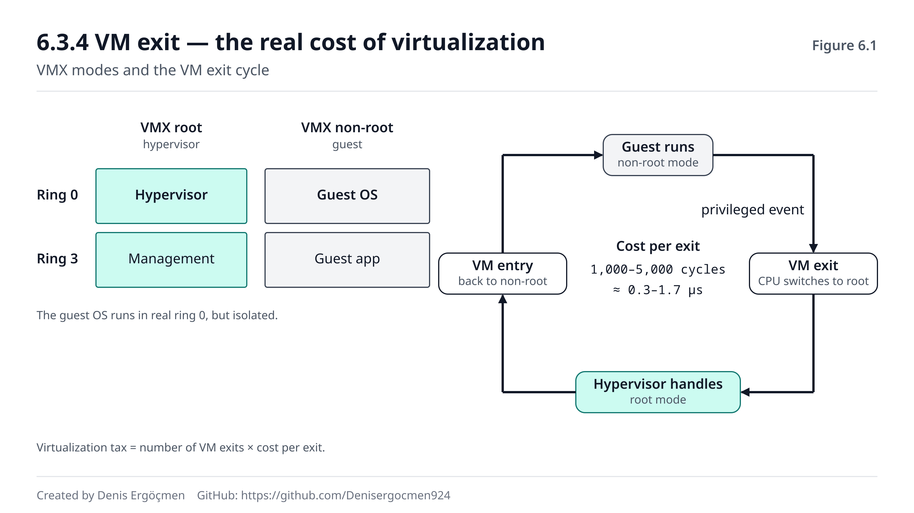
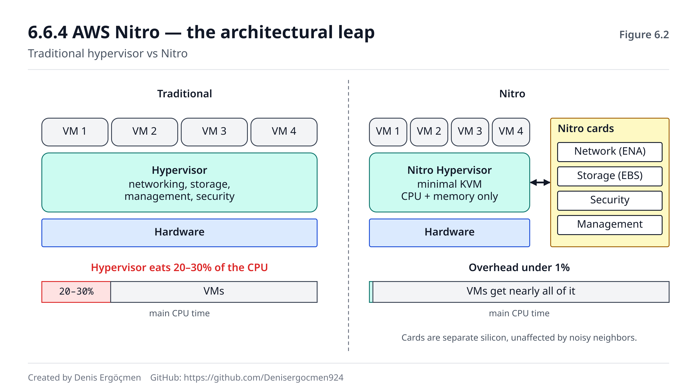

# Faz 6 — Sanallaştırma Donanımı

> **Navigasyon:** [◀ Faz 5 — Ağ Donanımı](Faz_5_Ag_Donanimi.md) · **Faz 6** · [Faz 7 — Cloud Bağlantısı ▶](Faz_7_Cloud_Baglantisi.md)

---

> ### Bu fazda bir varsayım çöküyor.
>
> Faz 0'dan 5'e kadar donanımı **tek bir işletim sistemi ona tek başına sahipmiş gibi**
> inceledik. CPU senindi, RAM senindi, disk ve NIC senindi.
>
> **Cloud'da bu doğru değil.** Kiraladığın `m7i.2xlarge`, 128 vCPU'lu fiziksel bir
> sunucunun 8 vCPU'luk bir dilimidir. Aynı silikonda, aynı L3 cache'i, aynı bellek
> kanallarını, aynı PCIe şeritlerini ve aynı NIC'i tanımadığın onlarca kiracıyla
> paylaşıyorsun.
>
> **Bu faz, o paylaşımı mümkün kılan donanımı anlatır.** Kaynak haritanın "en bağlayıcı
> faz" dediği yer burasıdır: önceki altı fazın parçaları burada birbirine kilitleniyor.

---

## Nereden geliyoruz

Bu faz, önceki her fazdan bir şey alıp sanallaştırma bağlamında yeniden ele alır:

| Önceki faz | Burada ne oluyor |
|---|---|
| 1.5 core / thread / vCPU | 6.5 — vCPU'nun fiziksel çekirdeğe **nasıl** zamanlandığı |
| 2.5 sanal bellek, sayfa tabloları | 6.4 — **iki kat** adres çevirisi (EPT/NPT) |
| 2.3.4 paylaşılan L3 | 6.1.2 — komşu gürültüsünün kökü |
| 3.3 NVMe kuyrukları | 6.6 — kuyrukların VM'lere bölüştürülmesi |
| Faz 4 S4 — IOMMU | 6.6.3 — **SR-IOV'un ön şartı** (Faz 4'te söz vermiştik) |
| 5.1.4 çok kuyruklu NIC | 6.6.3 — her VM'e kendi kuyruğu |
| 4.3.3 Nitro | 6.6.4 — nihayet tam mekanizması |

---

## Bu fazın sonunda

- Bir EC2 instance'ının fiziksel sunucudaki yerini tarif edebileceksin
- Hypervisor'ün maliyetinin **nereden** geldiğini ve Nitro'nun bunu neden kaldırdığını
  açıklayabileceksin
- `steal time` gördüğünde ne olduğunu ve ne yapman gerektiğini bileceksin
- Komşu gürültüsünün üç ayrı mekanizmasını isimlendirip ayırt edebileceksin
- Container ile VM arasında **güvenlik ve performans temelli** bir seçim yapabileceksin
- "t3 mü c7i mi" sorusunu fiyatla değil, **fizikle** cevaplayabileceksin

---

## Faz haritası

| Bölüm | Konu | Derinlik | Neden önemli |
|---|---|---|---|
| 6.1 | Sanallaştırma neden gerekli | `[kavram]` | Cloud'un ekonomik temeli |
| 6.2 | Hypervisor tipleri | `[mekanizma]` | EC2'nin altında ne var |
| 6.3 | **Donanım destekli sanallaştırma** | `[mekanizma]` | **Fazın kalbi — VM exit maliyeti** |
| 6.4 | Bellek sanallaştırma | `[mekanizma]` | RAM'in gerçekte nasıl bölüşüldüğü |
| 6.5 | **CPU sanallaştırma ve steal time** | `[uygulama]` | **Günlük teşhis aracı** |
| 6.6 | I/O sanallaştırma | `[mekanizma]` | Nitro'nun tam açıklaması |
| 6.7 | Container vs VM | `[uygulama]` | Her gün verilen karar |

---

# 6.1 Sanallaştırma neden gerekli

## 6.1.1 Ekonomik zorunluluk `[kavram]`

Fiziksel bir sunucu düşün: 128 çekirdek, 512 GB RAM, 100 Gbps NIC.

**Tek müşteriye versen:**
```
Tipik web uygulaması kullanımı: %5–15 CPU
→ Sunucunun %85'i boşta duruyor
→ Elektrik, soğutma, yer, amortisman: tam ödeniyor
→ Müşteri: "128 çekirdek istemiyorum, 4 tane yeter"
```

**Sanallaştırırsan:**
```
32 müşteri × 4 vCPU = 128 vCPU
→ Her müşteri ihtiyacı kadar ödüyor
→ Sunucu %60–80 doluluğa çıkıyor
→ Donanım maliyeti 32'ye bölünüyor
```

> **Cloud'un tamamı bu tek fikrin üstüne kuruludur.** "Kullandığın kadar öde" modelinin
> teknik karşılığı sanallaştırmadır. AWS'in `t3.micro`'yu saatte birkaç sente verebilmesi,
> o fiziksel sunucuda yüzlerce `t3.micro` barındırabildiği içindir.

**Ama bir bedeli vardır** ve bu fazın geri kalanı o bedeli anlatır:

| Bedel | Nerede işlenecek |
|---|---|
| Sanallaştırma vergisi (CPU/gecikme kaybı) | 6.3.4 |
| Komşu gürültüsü | 6.1.2, 7.4 |
| İzolasyon sınırlarının kırılganlığı | 6.1.2, 6.7.3 |
| Öngörülemezlik (steal time) | 6.5.2 |

## 6.1.2 İzolasyon ve paylaşım gerginliği `[mekanizma]`

Sanallaştırmanın çözmesi gereken iki çelişkili hedef vardır:

```
İZOLASYON: Kiracılar birbirini görmemeli, etkilememeli
PAYLAŞIM : Kaynaklar verimli bölüşülmeli (boşta kaynak = kayıp)
```

Bu ikisi **doğrudan çelişir.** Tam izolasyon için her kiracıya ayrı fiziksel donanım
vermek gerekir — o zaman paylaşım yoktur. Tam paylaşım için her şeyi ortak kullanmak
gerekir — o zaman izolasyon yoktur.

**Hypervisor'ün işi bu iki uç arasında bir yerde durmaktır.** Ve durduğu yer, neyin
izole edilip neyin edilmediğini belirler:

| Kaynak | İzolasyon durumu | Sonuç |
|---|---|---|
| CPU zamanı | ✅ Zamanlayıcı ile bölüştürülür | Görece adil |
| RAM kapasitesi | ✅ Sayfa tabloları ile ayrılır | Katı sınır |
| **L3 cache** | ❌ **Paylaşılır** | **Komşu gürültüsü** |
| **Bellek bant genişliği** | ❌ **Paylaşılır** | **Komşu gürültüsü** |
| **PCIe şeritleri** | ⚠️ Kısmen | Yoğun I/O'da yarışma |
| Disk/ağ bant genişliği | ⚠️ Kotalanabilir | Nitro ile iyileştirildi |

> **İşte komşu gürültüsünün kökü budur.** Hypervisor sana 8 vCPU ve 32 GB RAM'i garanti
> edebilir — bunlar sayılabilir, bölünebilir kaynaklardır. **Ama L3 cache'in ve bellek
> bant genişliğinin payını garanti edemez.**
>
> Faz 2.3.4'te "paylaşılan L3, komşu gürültüsünün mekanizmasıdır" demiştik. Şimdi
> tamamlıyoruz: hypervisor bunu **kotalayamaz** çünkü cache tahsisi donanımın
> içindedir — bir cache satırını kimin doldurduğuna dair bir "kiracı" kavramı yoktur.
>
> (Intel'in CAT — Cache Allocation Technology — gibi teknolojileri bunu kısmen çözer,
> ama yaygın kullanılmaz.)

> **🤔 Düşün 6.1**
> İki `c7i.2xlarge` instance'ı aynı fiziksel sunucuda. Birinci instance sadece CPU
> hesabı yapıyor (küçük veri seti, cache'e sığıyor). İkinci instance 100 GB'lık bir
> veri setini baştan sona tarıyor.
>
> a) Hangisi diğerinden etkilenir ve neden?
> b) Etkilenen instance'ın CPU kullanımı ne gösterir? Steal time artar mı?
> c) Bu durumu izleme (monitoring) ile nasıl fark edersin?
> *(Cevap: fazın sonunda)*

---

# 6.2 Hypervisor tipleri

## 6.2.1 Type 1 — bare metal `[mekanizma]`

```
┌─────────┬─────────┬─────────┐
│   VM1   │   VM2   │   VM3   │   ← misafir (guest) işletim sistemleri
├─────────┴─────────┴─────────┤
│        HYPERVISOR           │   ← doğrudan donanım üzerinde
├─────────────────────────────┤
│         DONANIM             │
└─────────────────────────────┘
```

Hypervisor **doğrudan donanım üzerinde** çalışır. Altında işletim sistemi yoktur —
kendisi minimal bir işletim sistemi gibidir.

| Özellik | Değer |
|---|---|
| Performans | **Yüksek** — araya katman girmez |
| Saldırı yüzeyi | **Küçük** — minimal kod tabanı |
| Kullanım | **Tüm üretim cloud'ları** |
| Örnekler | KVM, Xen, VMware ESXi, Hyper-V |

## 6.2.2 Type 2 — hosted `[mekanizma]`

```
┌─────────┬─────────┐
│   VM1   │   VM2   │
├─────────┴─────────┤
│    HYPERVISOR     │   ← normal bir uygulama gibi çalışır
├───────────────────┤
│     HOST OS       │   ← Windows, macOS, Linux
├───────────────────┤
│     DONANIM       │
└───────────────────┘
```

Hypervisor, host işletim sistemi üzerinde **normal bir uygulama** olarak çalışır.

| Özellik | Değer |
|---|---|
| Performans | **Düşük** — her erişim host OS'ten geçer |
| Kurulum | Kolay |
| Kullanım | Geliştirme, test, masaüstü |
| Örnekler | VirtualBox, VMware Workstation, Parallels |

> **Neden Type 2 yavaş?** Misafir işletim sisteminin her ayrıcalıklı işlemi önce
> hypervisor'e, oradan host OS'e, oradan donanıma gider. **İki katman soyutlama.**
>
> Bu, Faz 5.4'te gördüğün "katmanları kaldır" fikrinin tam tersidir — ve aynı bedeli
> öder.

## 6.2.3 KVM'in özel durumu `[kavram]`

KVM (Kernel-based Virtual Machine) ilginç bir melezdir: **Linux çekirdeğinin kendisini
Type 1 hypervisor'e dönüştüren bir modüldür.**

```
Linux çekirdeği + KVM modülü = Type 1 hypervisor
Ama aynı anda normal Linux olarak da çalışmaya devam eder
```

Bu, Linux'un tüm sürücü ekosistemini, zamanlayıcısını ve bellek yönetimini
hypervisor'e bedava kazandırır. **Bu yüzden KVM cloud'da baskın hâle geldi.**

> **Cloud bağlantısı:** AWS'in **Nitro hypervisor'ü KVM tabanlıdır** ve son derece
> küçültülmüştür — sadece CPU ve bellek sanallaştırmayı yapar. Ağ, depolama ve yönetim
> işleri **ayrı fiziksel karta** taşınmıştır (6.6.4).
>
> Tarihsel not: AWS 2017 öncesinde **Xen** kullanıyordu. Nitro'ya geçiş, cloud
> performansındaki en büyük sıçramalardan biriydi ve bu fazın 6.6.4'ü bunun nedenini
> anlatıyor.

---

# 6.3 Donanım destekli sanallaştırma

**Bu bölüm fazın kalbidir.** Sanallaştırmanın maliyeti buradan doğar ve tüm optimizasyon
çabaları bu maliyeti azaltmaya yöneliktir.

## 6.3.1 Ring seviyeleri `[mekanizma]`

x86 mimarisinde CPU'nun dört ayrıcalık seviyesi (ring) vardır. Pratikte ikisi kullanılır:

```
Ring 0  →  Çekirdek (kernel) — TÜM komutları çalıştırabilir
Ring 3  →  Kullanıcı (user)  — ayrıcalıklı komutlar YASAK
```

**Ayrıcalıklı komut ne demek?** Donanımı doğrudan etkileyen komutlar: sayfa tablosu
değiştirmek (`MOV CR3`), kesme maskelemek (`CLI`/`STI`), I/O portlarına yazmak.

Bir kullanıcı programı bunları çalıştırmayı denerse CPU **hata (trap) üretir** ve kontrol
çekirdeğe geçer. Faz 2.5'teki sanal bellek korumasının temeli budur.

## 6.3.2 Sanallaştırmanın orijinal problemi `[mekanizma]`

Şimdi bir misafir işletim sistemi düşün. O da bir **çekirdektir** ve ring 0'da çalışmayı
bekler. Ama ring 0'da gerçek hypervisor oturuyor.

```
Misafir OS ring 0'a konulursa → hypervisor'ü ezer, izolasyon yok
Misafir OS ring 3'e konulursa → ayrıcalıklı komutları çalışmaz
```

**VT-x/AMD-V öncesi çözümler (ikisi de kötüydü):**

| Yöntem | Nasıl | Sorunu |
|---|---|---|
| **İkili çeviri** (binary translation) | Ayrıcalıklı komutları çalışma anında yeniden yaz | Karmaşık, yavaş, hata riski yüksek |
| **Paravirtualization** | Misafir OS'i değiştir, hypervisor'e çağrı yapsın | **Misafir OS'in değiştirilmesi gerekir** |

> Xen'in ilk sürümleri paravirtualization kullanıyordu — bu yüzden özel çekirdek
> gerekiyordu. Windows'u çalıştıramamasının sebebi buydu.

## 6.3.3 VT-x / AMD-V — donanım çözümü `[mekanizma]`

Intel VT-x (2005) ve AMD-V, CPU'ya **yeni bir boyut** ekledi: ring seviyelerine dik bir
mod ayrımı.

```
              VMX ROOT MOD                 VMX NON-ROOT MOD
              (hypervisor)                 (misafir)
           ┌──────────────┐             ┌──────────────┐
  Ring 0   │  HYPERVISOR  │             │  MİSAFİR OS  │  ← ring 0 ama izole
           ├──────────────┤             ├──────────────┤
  Ring 3   │  yönetim     │             │  MİSAFİR APP │
           └──────────────┘             └──────────────┘
```

**Çözüm zarif:** Misafir OS **gerçekten ring 0'da** çalışır — kendini tam yetkili sanır
ve değiştirilmesi gerekmez. Ama non-root modda olduğu için, **hypervisor'ün kritik
gördüğü** işlemlerde CPU otomatik olarak root moda geri düşer.

Bu geçişe **VM exit** denir.

## 6.3.4 VM exit — sanallaştırmanın asıl maliyeti `[mekanizma]`

```
Misafir çalışıyor (non-root)
   ↓ ayrıcalıklı bir olay (I/O, kesme, CR3 yazma, CPUID...)
VM EXIT → CPU root moda geçer
   ↓
Hypervisor olayı ele alır
   ↓
VM ENTRY → CPU non-root moda döner, misafir devam eder
```

**Bir VM exit neye mal olur?**

| Maliyet kalemi | Açıklama |
|---|---|
| Durum kaydetme/yükleme | Tüm CPU durumu (VMCS yapısı) diske değil ama belleğe yazılır |
| **Pipeline boşaltma** | Faz 1.4'teki dal tahmini cezasıyla aynı mekanizma |
| **Cache/TLB kirlenmesi** | Hypervisor'ün kodu ve verisi cache'i işgal eder |
| Hypervisor işleme süresi | Olayın kendisinin ele alınması |

```
Tipik VM exit maliyeti: 1.000 – 5.000 çevrim  (≈ 0,3 – 1,7 μs)
```

> **Bu rakamı Faz 2.1.1'deki merdivene koy:**
> ```
> L1 erişimi      :        4 çevrim
> RAM erişimi     :      200 çevrim
> VM EXIT         :  1.000–5.000 çevrim   ← RAM'den 5–25 kat pahalı
> SSD erişimi     :  ~200.000 çevrim
> ```
> VM exit, bellek erişiminden çok daha pahalı ama diskten çok daha ucuzdur. **Bu yüzden
> tek bir VM exit önemsizdir — saniyede yüz binlercesi felakettir.**

**Sanallaştırma vergisi (virtualization tax) tam olarak budur:** VM exit sayısı × VM exit
maliyeti.

| Dönem | Vergi |
|---|---|
| İkili çeviri devri (2000'ler) | %30–50 |
| VT-x + EPT (2010'lar) | %5–15 |
| **Nitro / SR-IOV (bugün)** | **%1'in altında** |

**Optimizasyon stratejisinin tamamı tek cümleyle özetlenir: VM exit sayısını azalt.**
Bundan sonraki üç bölümün (6.4, 6.5, 6.6) hepsi bunun farklı yollarıdır:

| Bölüm | VM exit'i nerede azaltır |
|---|---|
| 6.4 EPT/NPT | Bellek erişiminde |
| 6.5 CPU pinning | Zamanlamada |
| 6.6 SR-IOV / virtio | I/O'da (**en büyük kaynak**) |

> **🤔 Düşün 6.2**
> Bir VM, saniyede 200.000 ağ paketi alıyor. Her paket için bir VM exit gerektiğini
> varsay (emülasyonlu I/O). VM exit maliyeti 2.000 çevrim, CPU 3 GHz.
>
> a) VM exit'ler tek başına CPU'nun ne kadarını yiyor?
> b) Bu neden SR-IOV'un varlık sebebidir?
> *(Cevap: fazın sonunda)*


*Şekil 6.1 — Ring seviyelerine dik mod ayrımı ve misafir ile hypervisor arasındaki
geçişler.*

---

# 6.4 Bellek sanallaştırma

## 6.4.1 İki katlı adres çevirisi problemi `[mekanizma]`

Faz 2.5'te sanal bellekten fiziksel belleğe çeviriyi öğrendik. **Sanallaştırmada bu
çeviri iki kat olur:**

```
Misafir uygulamanın sanal adresi (GVA)
        ↓  misafir OS'in sayfa tablosu
Misafir fiziksel adresi (GPA)          ← misafir bunu "gerçek RAM" sanıyor
        ↓  hypervisor'ün çevirisi        ← ama değil!
Gerçek fiziksel adres (HPA)
```

**Misafir işletim sistemi, GPA'nın gerçek RAM adresi olduğuna inanır.** Bu yanılsamayı
korumak hypervisor'ün işidir.

## 6.4.2 Gölge sayfa tabloları — eski ve pahalı yöntem `[kavram]`

VT-x öncesi çözüm: hypervisor, her misafir için **gölge sayfa tablosu** tutardı —
GVA'dan doğrudan HPA'ya giden birleşik bir tablo.

**Problemi:** Misafir kendi sayfa tablosunu her değiştirdiğinde (yeni process, `mmap`,
sayfa hatası — yani **sürekli**) hypervisor'ün haberi olmalı ve gölgeyi güncellemeli.

```
Her sayfa tablosu değişikliği → VM EXIT → gölge güncelle → VM ENTRY
```

Bellek yoğun iş yüklerinde bu, **sanallaştırma vergisinin en büyük kalemiydi.**

## 6.4.3 EPT / NPT — donanım çözümü `[kavram]`

Intel EPT (Extended Page Tables) ve AMD NPT (Nested Page Tables), **ikinci çeviriyi
donanıma** aldı.

```
MMU artık İKİ tabloyu birden yürüyor:
  Misafir sayfa tablosu (misafir yönetir)  →  GPA
  EPT tablosu (hypervisor yönetir)         →  HPA

Hypervisor devreye girmeden, donanımda.
```

**Kazanç:** Misafir kendi sayfa tablosunu istediği kadar değiştirebilir — **VM exit
olmaz.** Bellek yoğun iş yüklerinin sanallaştırma vergisi %10–20'den %2–3'e düştü.

**Bedeli:** Sayfa tablosu yürüyüşü uzadı.
```
Sanallaştırmasız 4 seviyeli yürüyüş :  4 bellek erişimi
EPT ile iki katlı yürüyüş           : 24 bellek erişimi (en kötü hâl)
```

> **Bu, TLB'yi (Faz 2.5.3) sanallaştırmada daha da kritik yapar.** TLB ıskası artık 4
> değil 24 bellek erişimine mal olabilir.
>
> **Ve bu, huge page'lerin (Faz 2.5.4) sanal makinelerde neden daha büyük fark
> yarattığının cevabıdır:** hem TLB erişimini azaltır hem de iki katlı yürüyüşün
> seviyelerini kısaltır. Veritabanı VM'lerinde huge page kullanımı bu yüzden standart
> tavsiyedir.

## 6.4.4 Bellek fazla taahhüdü (overcommit) `[mekanizma]`

Hypervisor, **fiziksel RAM'den fazla** sanal RAM taahhüt edebilir.

```
Fiziksel: 256 GB
Taahhüt : 32 VM × 16 GB = 512 GB   ← 2 kat overcommit
```

**Neden çalışır?** Çünkü VM'lerin çoğu taahhüt ettikleri RAM'in tamamını **aynı anda**
kullanmaz. Faz 2.5'teki "talep üzerine sayfalama" mantığının hypervisor seviyesindeki
hâlidir.

**Nasıl çalıştırılır — üç mekanizma:**

| Mekanizma | Ne yapar | Riski |
|---|---|---|
| **Balloon driver** | Misafir içindeki bir sürücü bellek "şişirir", misafir OS'i sayfa bırakmaya zorlar | Misafirde bellek baskısı |
| **KSM** (Kernel Same-page Merging) | Aynı içerikli sayfaları tek fiziksel sayfada birleştirir | CPU maliyeti, **yan kanal riski** |
| **Swap** | Hypervisor seviyesinde takas | **Felaket** — misafir haberi olmadan yavaşlar |

> **Balloon driver zekicedir:** Hypervisor misafirden bellek isteyemez (misafir OS'in
> iç yapısını bilmez). Bunun yerine misafirin içine bir sürücü koyar; o sürücü bellek
> ayırarak "şişer", misafir OS de bellek baskısı hissedip kendi sayfalarını boşaltır.
> **Hypervisor, misafirin kendi bellek yöneticisini kendisi için çalıştırır.**

> **Cloud bağlantısı — kritik:** **AWS EC2'de bellek overcommit YAPILMAZ.** Instance'ına
> 32 GB yazıyorsa 32 GB fiziksel RAM ayrılmıştır.
>
> **Neden?** Çünkü overcommit, öngörülemez performans demektir ve cloud sözleşmesinin
> temeli öngörülebilirliktir. Faz 2.6'daki thrashing geri besleme döngüsünü hatırla:
> bellek yetmediğinde sistem yavaşça değil, **uçurumdan** düşer.
>
> Bu bilgi pratik bir sonuç doğurur: **kurumsal VMware ortamlarından gelen "RAM bol
> taahhüt et, nasılsa overcommit var" alışkanlığı AWS'te para yakar.** Her GB gerçekten
> ayrılıyor ve gerçekten faturalanıyor.

> **🔧 Makinende gör** (isteğe bağlı)
> ```bash
> # Sanal makinede misin?
> systemd-detect-virt
> lscpu | grep -i hypervisor
> ```
> **Beklenen çıktı (EC2'de):**
> ```
> kvm
> ```
> ```
> Hypervisor vendor:      KVM
> Virtualization type:    full
> ```
> `none` dönerse fiziksel makinedesin (veya bare metal instance).

---

# 6.5 CPU sanallaştırma ve steal time

## 6.5.1 vCPU nasıl zamanlanır `[mekanizma]`

**Temel gerçek:** Bir vCPU, fiziksel bir çekirdek **değildir.** Fiziksel çekirdek
üzerinde zamanlanan bir **iş parçacığıdır.**

```
Fiziksel sunucu: 64 çekirdek
Üzerinde çalışan: 40 VM × 4 vCPU = 160 vCPU

160 vCPU → 64 fiziksel çekirdek   (2,5 kat fazla taahhüt)
```

Hypervisor'ün zamanlayıcısı, hangi vCPU'nun hangi fiziksel çekirdekte ne kadar
çalışacağına karar verir. **Tıpkı işletim sisteminin process'leri zamanlaması gibi — bir
kat yukarıda.**

> **Faz 1.5.3'teki vCPU tanımını şimdi tamamlıyoruz.** Orada demiştik: x86'da 1 vCPU =
> 1 SMT iş parçacığı, Graviton'da 1 vCPU = 1 fiziksel çekirdek. Şimdi ekliyoruz: **o
> vCPU bile sana sürekli ait değildir** — zamanlayıcının sırasında bekleyebilir.

## 6.5.2 Steal time — beklemenin ölçüsü `[uygulama]`

**Steal time:** vCPU'nun **çalışmaya hazır olduğu ama fiziksel çekirdek bulamadığı**
sürenin yüzdesi.

```
Misafir OS: "Çalışacak işim var!"
Hypervisor: "Sıra sende değil, bekle."
            ↑ bu bekleme steal time olarak kaydedilir
```

**Kritik nokta:** Misafir OS bunu **görebilir** (hypervisor ona söyler) ama
**engelleyemez.**

```bash
top     # CPU satırındaki "st" alanı
vmstat 1
mpstat -P ALL 1
```
**Beklenen çıktı (sağlıklı):**
```
%Cpu(s): 23,1 us,  4,2 sy,  0,0 ni, 72,5 id,  0,1 wa,  0,0 hi,  0,1 si,  0,0 st
                                                                          ↑ 0,0 = iyi
```
**Beklenen çıktı (problem):**
```
%Cpu(s): 41,2 us,  6,1 sy,  0,0 ni, 33,4 id,  0,2 wa,  0,0 hi,  0,2 si, 18,9 st
                                                                         ↑ %18,9 çalınıyor
```

**Yorumlama tablosu:**

| Steal time | Anlamı | Ne yapmalı |
|---|---|---|
| %0–2 | Normal | Bir şey yok |
| %2–10 | Hafif yarışma | İzle; sürekliyse taşınmayı düşün |
| **%10–25** | **Ciddi** | Instance'ı yeniden başlat (başka hosta düşebilir) veya tipi değiştir |
| **%25+** | **Kabul edilemez** | Acil taşı; dedicated/daha büyük instance |

> **Steal time'ın en önemli özelliği: senin suçun olmayan bir yavaşlığı kanıtlar.**
>
> Uygulaman yavaşladı, CPU kullanımı düşük görünüyor, kod değişmedi. Steal time %20 ise
> **cevap bulunmuştur** — fiziksel çekirdek için başka kiracılarla yarışıyorsun. Bu,
> saatlerce kod profili çıkarmaktan kurtaran bir ölçümdür.

**Steal time'ın iki ayrı sebebi vardır — karıştırma:**

| Sebep | Mekanizma | Çözüm |
|---|---|---|
| **Host aşırı taahhütlü** | Fiziksel çekirdekler için gerçek yarışma | Yeniden başlat (başka host), daha büyük instance, dedicated host |
| **CPU kredin bitti** (t-ailesi) | AWS seni **kasten** kısıtlıyor | **Instance tipini değiştir** — t → m/c |

> **İkincisi çok yanlış anlaşılır.** `t3.medium`'da kredin bitince steal time fırlar ama
> ortada komşu yoktur — AWS taban performansına indirmek için vCPU'nu bekletmektedir.
> Instance'ı yeniden başlatmak **hiçbir işe yaramaz**; tek çözüm t ailesinden çıkmaktır
> (veya `unlimited` modunun faturasını kabul etmektir).

## 6.5.3 Kredi tabanlı vs adanmış CPU `[uygulama]`

| | t ailesi (kredi tabanlı) | m/c/r ailesi (adanmış) |
|---|---|---|
| Taban performans | vCPU'nun %10–40'ı | **%100** |
| Burst | Kredi ile tam hıza | Yok — zaten tam hızda |
| Kredi biterse | **Taban seviyeye düşer** | — |
| Öngörülebilirlik | **Düşük** | **Yüksek** |
| Maliyet | Düşük | Yüksek |

**Kredi mekaniği:**
```
t3.medium: 2 vCPU, taban %20
  Boştayken  : saatte 24 kredi birikir
  Tam hızda  : dakikada 2 kredi harcanır (vCPU başına 1)
  Kredi 0    : %20 performansa düşersin
  Maks. birikim: 24 saatlik kazanç
```

**Karar kuralı:**

| İş yükü deseni | Aile |
|---|---|
| Aralıklı, düşük ortalama (dev/test, küçük web) | ✅ **t** |
| Sürekli yük (üretim API, veritabanı, işçi) | ✅ **m/c/r** |
| Kısa yoğun işler, aralarında uzun boşluk | ✅ **t** |
| **Yük testi yapacaksan** | ⚠️ **t ile test etme** — sonuç yanıltıcı olur |

> **En sık yapılan hata:** Üretim iş yükünü t3'te çalıştırıp "AWS yavaş" demek. Faz
> 5.2.3'teki "Up to 10 Gigabit" tuzağıyla **birebir aynı model** — ve aynı belirtiyi
> verir: ilk dakikalar mükemmel, sonra çöküş.

> **🤔 Düşün 6.3**
> Bir `t3.large` üzerinde çalışan API, her gün saat 09:00–09:40 arası mükemmel yanıt
> veriyor, sonra yanıt süreleri 5 kata çıkıyor ve akşam 18:00'den sonra düzeliyor.
> CloudWatch'ta CPU kullanımı gün boyu **%40 civarında sabit** görünüyor.
>
> a) Ne oluyor?
> b) CPU kullanımı neden sabit görünüyor — bu bir çelişki mi?
> c) İki farklı çözüm öner ve maliyet açısından karşılaştır.
> *(Cevap: fazın sonunda)*

---

# 6.6 I/O sanallaştırma

**I/O, VM exit'lerin en büyük kaynağıdır.** Bu bölüm, o sayıyı düşürmek için yapılan üç
kuşak çözümü anlatır — ve her kuşak bir öncekinin VM exit'lerini azaltır.

## 6.6.1 Emülasyon — birinci kuşak `[kavram]`

Hypervisor, misafire **gerçek bir donanımı taklit eden** sanal bir cihaz sunar (örneğin
Intel e1000 ağ kartı).

```
Misafir sürücüsü register'a yazar
   → VM EXIT
   → hypervisor "register yazıldı" diye yorumlar
   → gerçek donanıma iletir
   → VM ENTRY
```

**Her register erişimi bir VM exit.** Tek bir paket göndermek onlarca exit gerektirebilir.

| Artısı | Eksisi |
|---|---|
| Misafir OS'te değişiklik gerekmez (standart sürücü çalışır) | **Çok yavaş** |

## 6.6.2 Paravirtualization / virtio — ikinci kuşak `[kavram]`

**Fikir:** Gerçek donanımı taklit etmeyi bırak. Misafire, **sanal olduğunu bilen** bir
sürücü koy ve hypervisor ile verimli bir protokol üzerinden konuşsun.

**virtio**, bunun standardıdır. Temel mekanizması **paylaşımlı halka tamponudur** —
Faz 5.1.3'teki NIC halka tamponunun aynısı, ama misafir ile hypervisor arasında.

```
Misafir            Paylaşımlı bellek           Hypervisor
  │                ┌───┬───┬───┬───┐               │
  ├── tanımlayıcı →│   │   │   │   │→ okur ────────┤
  │                └───┴───┴───┴───┘               │
  │                                                 │
  └── TEK bir bildirim (VM exit) ile 100 istek iletilebilir
```

**Kazanç:** İstek başına VM exit yerine **toplu bildirim.** 10–20 kat hızlanma tipiktir.

> **Fikir tanıdık olmalı:** Faz 5.1.4'teki NAPI'de de aynı şeyi yapmıştık — her paket
> için kesme yerine, bir turda çok paket. **Toplu işleme (batching), her katmanda aynı
> problemi çözer.**

## 6.6.3 SR-IOV — üçüncü kuşak `[kavram]`

**Fikir:** Hypervisor'ü I/O yolundan **tamamen çıkar.**

SR-IOV destekli bir fiziksel cihaz (NIC, NVMe), kendini birden çok **sanal fonksiyon
(VF)** olarak gösterir. Her VF, bir VM'e **doğrudan** atanır.

```
        ┌──────── FİZİKSEL NIC ────────┐
        │  PF  │ VF1 │ VF2 │ VF3 │ VF4 │
        └──────┴──┬──┴──┬──┴──┬──┴──┬──┘
                  │     │     │     │
                 VM1   VM2   VM3   VM4    ← doğrudan, hypervisor yok
```

**Sonuç: normal I/O'da VM exit YOK.** Misafirin sürücüsü donanımla doğrudan konuşur.

| | Emülasyon | virtio | **SR-IOV** |
|---|---|---|---|
| VM exit sıklığı | Çok yüksek | Orta | **Neredeyse sıfır** |
| Performans | %20–40 | %70–90 | **%95–99** |
| Gecikme | Yüksek | Orta | **Düşük** |
| Canlı göç (live migration) | ✅ | ✅ | ❌ **Zor** |

**Ön şart: IOMMU.** Faz 4'ün S4 sorusunda söz vermiştik, şimdi tamamlıyoruz:

> VM'in sürücüsü donanımla doğrudan konuşuyorsa, **DMA adreslerini de doğrudan
> veriyor** demektir. Kötü niyetli (veya hatalı) bir misafir, DMA hedefi olarak **başka
> bir VM'in belleğini** gösterebilir — ve DMA, CPU'yu atladığı için hiçbir sayfa tablosu
> kontrolü bunu engellemez.
>
> **IOMMU (Intel VT-d / AMD-Vi) tam olarak budur: cihazlar için MMU.** Her DMA erişimini
> çevirir ve sınırlar — bir VF sadece kendi VM'inin belleğine yazabilir.
>
> **IOMMU olmadan SR-IOV, izolasyonu tamamen kaldırır.** Bu yüzden SR-IOV'un varlık
> şartıdır, opsiyonu değil.

**Bedeli — canlı göç:** VM, fiziksel donanım parçasına doğrudan bağlı olduğu için başka
bir sunucuya sıcak taşınamaz. Bu, cloud sağlayıcısı için ciddi bir operasyonel kısıttır
ve AWS'in bakım pencereleri ile "instance retirement" bildirimlerinin arkasındaki
sebeplerden biridir.

## 6.6.4 AWS Nitro — mimari sıçrama `[mekanizma]`

Nitro, yukarıdaki fikirleri bir adım öteye taşır: **hypervisor'ün işlerinin çoğunu ayrı
fiziksel donanıma taşır.**

```
GELENEKSEL:
┌──────────────────────────────────┐
│  VM1  │  VM2  │  VM3  │  VM4     │
├──────────────────────────────────┤
│  HYPERVISOR                      │  ← ağ, depolama, yönetim, güvenlik
│  (ana CPU'nun %20-30'unu yer)    │     HEPSİ burada
├──────────────────────────────────┤
│  DONANIM                         │
└──────────────────────────────────┘

NITRO:
┌──────────────────────────────────┐   ┌─────────────────┐
│  VM1  │  VM2  │  VM3  │  VM4     │   │  NITRO KARTLARI │
├──────────────────────────────────┤   │  • Ağ (ENA)     │
│  Nitro Hypervisor (minimal KVM)  │←→ │  • Depolama(EBS)│
│  sadece CPU + bellek             │   │  • Güvenlik     │
├──────────────────────────────────┤   │  • Yönetim      │
│  DONANIM (neredeyse tamamı VM'e) │   │  (ayrı silikon) │
└──────────────────────────────────┘   └─────────────────┘
```

**Üç ayrı kazanç:**

| Kazanç | Mekanizma |
|---|---|
| **Performans** | Ana CPU'nun %100'ü müşteriye — sanallaştırma vergisi %1'in altında |
| **Öngörülebilirlik** | Ağ/depolama işleme ayrı silikonda — **komşu gürültüsünden etkilenmez** |
| **Güvenlik** | Yönetim düzlemi **fiziksel olarak** ayrı — yazılım sınırı değil, donanım sınırı |

> **Üçüncüsü en önemlisidir ve en az anlaşılanıdır.** Geleneksel sanallaştırmada
> hypervisor, misafirin belleğini okuyabilir — izolasyon bir **yazılım sınırıdır** ve
> yazılımın hataları olur. Nitro'da yönetim işlevleri ayrı bir karttadır ve ana CPU'ya
> erişimi donanım tarafından kısıtlıdır.
>
> **Bu, "bare metal instance neden var?" sorusunun da cevabıdır:** Nitro kartları
> sanallaştırma olmadan da çalışabildiği için, AWS müşteriye **fiziksel sunucunun
> tamamını** verip yine de ağ, depolama ve yönetimi sağlayabilir. `.metal`
> instance'larda hypervisor yoktur ama ENA ve EBS çalışır.

> **Bu fazın en güçlü bağlantısı:** Faz 4.3.3'te Nitro'yu DMA bağlamında tanıtmıştık.
> Faz 5'te boşaltma (offload) fikrini görmüştük. Şimdi tamamlandı: **Nitro, "işi CPU'dan
> donanıma taşı" fikrinin bir NIC özelliği ölçeğinden veri merkezi mimarisi ölçeğine
> büyütülmüş hâlidir.**


*Şekil 6.2 — Hypervisor işlevlerinin ana CPU'dan ayrı Nitro kartlarına taşınması.*

---

# 6.7 Container vs VM — donanım gözüyle

## 6.7.1 Temel fark `[mekanizma]`

```
VM'LER                              CONTAINER'LAR
┌────────┬────────┐                ┌────────┬────────┐
│ Uygul. │ Uygul. │                │ Uygul. │ Uygul. │
├────────┼────────┤                ├────────┴────────┤
│Misafir │Misafir │                │  (kütüphaneler) │
│  OS    │  OS    │  ← her VM'de   ├─────────────────┤
├────────┴────────┤     ayrı OS    │  Container motoru│
│   HYPERVISOR    │                ├─────────────────┤
├─────────────────┤                │  TEK KERNEL     │ ← PAYLAŞILIR
│    DONANIM      │                ├─────────────────┤
└─────────────────┘                │    DONANIM      │
                                   └─────────────────┘
```

**Container bir "hafif VM" değildir.** Container, **izole edilmiş bir process'tir.**
`ps` ile host üzerinde görülebilir; kendi çekirdeği yoktur.

## 6.7.2 cgroup ve namespace `[mekanizma]`

Container'ı mümkün kılan iki Linux çekirdek özelliği vardır:

**Namespace — "ne görüyorsun"**

| Namespace | İzole ettiği |
|---|---|
| `pid` | Process ID'leri — container içinde kendi PID 1'i vardır |
| `net` | Ağ arayüzleri, IP, port'lar |
| `mnt` | Dosya sistemi görünümü |
| `uts` | Hostname |
| `ipc` | Paylaşımlı bellek, semafor |
| `user` | UID/GID eşlemesi |

**cgroup — "ne kadar kullanabilirsin"**

| cgroup denetleyicisi | Sınırladığı |
|---|---|
| `cpu` | CPU zamanı (kota ve pay) |
| `memory` | RAM kullanımı — **aşılırsa OOM kill** (Faz 2.6.3) |
| `blkio` | Disk I/O bant genişliği ve IOPS |
| `pids` | Process sayısı |

```
Namespace → görünürlük izolasyonu
cgroup    → kaynak izolasyonu
İkisi birlikte → "container"
```

> **Container diye bir çekirdek nesnesi yoktur.** Docker'ın yaptığı şey, doğru
> namespace'leri ve cgroup'ları kurup bir process başlatmaktır. "Container" bir
> paketleme ve araç ekosisteminin adıdır, bir çekirdek özelliğinin değil.

## 6.7.3 Rakamlarla karşılaştırma `[uygulama]`

| Ölçüt | VM | Container |
|---|---|---|
| Başlangıç süresi | **30–60 s** (tam OS boot) | **50–500 ms** |
| Bellek ek yükü | **512 MB – 2 GB** (misafir OS) | **1–10 MB** |
| Disk ek yükü | GB'lar (tam OS imajı) | MB'lar (katmanlı) |
| Yoğunluk (64 GB host) | ~30 VM | ~1000+ container |
| CPU ek yükü | %1–5 (Nitro ile <%1) | **~%0** |
| **Çekirdek izolasyonu** | ✅ **Ayrı çekirdek** | ❌ **Paylaşılan çekirdek** |
| Farklı OS çalıştırma | ✅ (Windows + Linux) | ❌ (aynı çekirdek ailesi) |

## 6.7.4 Güvenlik sınırı — asıl ayrım `[uygulama]`

**Bu, container/VM kararının gerçek ekseni.** Performans farkı bir optimizasyon
meselesidir; izolasyon farkı bir **risk** meselesidir.

```
VM kaçışı        → hypervisor açığı gerekir  → NADİR, çok değerli
Container kaçışı → çekirdek açığı gerekir    → DAHA SIK
```

**Saldırı yüzeyi karşılaştırması:**

| | VM | Container |
|---|---|---|
| Saldırganın aşması gereken | Hypervisor (~100K satır, minimal) | **Linux çekirdeği (~30M satır)** |
| Sistem çağrısı yüzeyi | Yok (misafir kendi çekirdeğinde) | **~350 sistem çağrısı** |

> **Karar kuralı:**
>
> | Durum | Seçim |
> |---|---|
> | Kendi kodun, kendi ekibin | ✅ **Container** — izolasyon yeterli |
> | Mikroservisler, CI/CD, hızlı ölçekleme | ✅ **Container** |
> | **Güvenilmeyen kod çalıştırıyorsun** (müşteri kodu, eklenti) | ✅ **VM** |
> | **Sert çok kiracılı (multi-tenant) sınır** | ✅ **VM** |
> | Farklı işletim sistemi gerekiyor | ✅ **VM** |
> | Uyumluluk (compliance) sert sınır istiyor | ✅ **VM** |

**Melez çözümler:** AWS Fargate ve Firecracker, container arayüzü sunarken **arkada
mikro-VM** çalıştırır. 125 ms'de açılan, 5 MB ek yüklü bir VM — container kolaylığı +
VM izolasyonu.

> **Firecracker'ın varlık sebebi tam olarak bu fazdır:** Lambda ve Fargate, tanımadıkları
> müşterilerin kodunu aynı fiziksel sunucuda çalıştırır. Container izolasyonu bu risk
> için yetersizdir; geleneksel VM ise 30 saniyede açılır ve 512 MB yer. Firecracker,
> VM'den her şeyi çıkarıp (BIOS yok, PCI yok, USB yok) sadece gerekeni bırakır.

> **🤔 Düşün 6.4**
> Bir SaaS ürünü, müşterilerin yazdığı JavaScript eklentilerini sunucu tarafında
> çalıştırıyor. Ekip Docker container kullanmayı planlıyor: "her müşteriye ayrı
> container, izole olur."
>
> a) Bu planın riski nedir?
> b) Hangi somut saldırı senaryosu mümkün olur?
> c) Üç alternatif öner ve takaslarını belirt.
> *(Cevap: fazın sonunda)*

---

# 6.8 Bu faz bozulunca — arıza imzaları

| Belirti | Olası mekanizma | Nerede | İlk bakılacak |
|---|---|---|---|
| `top`'ta `st` yüksek, kod değişmedi | **Steal time** — host yarışması | 6.5.2 | `vmstat 1`, instance tipi |
| İlk 40 dk hızlı, sonra 5× yavaş | **t-ailesi kredisi bitti** | 6.5.3 | CloudWatch `CPUCreditBalance` |
| I/O throughput düşük, CPU `sy` yüksek | Emülasyonlu I/O (virtio/SR-IOV yok) | 6.6 | `lspci`, sürücü adı (`ena`?) |
| Bellek yoğun uygulama beklenenden yavaş | EPT iki katlı yürüyüş + TLB ıskası | 6.4.3 | Huge page kullan |
| Container "sebepsiz" OOM kill | **cgroup bellek limiti** | 6.7.2 | `memory.max`, `dmesg` |
| Container'da `free` host RAM'ini gösteriyor | `free` cgroup'u bilmez | 6.7.2 | `/sys/fs/cgroup/memory.*` |
| VM'de `nproc` host çekirdeklerini gösteriyor | cgroup CPU kotası ≠ görünen çekirdek | 6.7.2 | JVM/Go için açık limit ver |
| Aynı kod bare metal'de %15 hızlı | Sanallaştırma vergisi (eski nesil) | 6.3.4 | Nitro nesli mi? |
| Canlı göç sonrası kısa donma | VM göçü (SR-IOV'suz instance) | 6.6.3 | AWS bakım bildirimleri |
| Komşu instance yoğunlaşınca yavaşlıyorsun | **L3/bellek bant genişliği yarışması** | 6.1.2 | Faz 7.4 — dedicated host |

> **Son iki satır bir ayrım gerektirir:** Steal time **CPU zamanı** yarışmasını gösterir
> ve ölçülebilir. L3/bellek bant genişliği yarışması **hiçbir sayaçta görünmez** —
> sadece "uygulamam yavaşladı, hiçbir metrik değişmedi" olarak belirir.
>
> **Cloud'daki en zor teşhis budur** ve Faz 7.4 tam olarak bunu işleyecek.

---

# Faz 6 — Düşün sorularının cevapları

## Cevap 6.1

**a) Hangisi etkilenir?**

**Birinci instance (CPU hesabı yapan) etkilenir.**

Mekanizma: İkinci instance 100 GB'lık veri setini tarıyor. Bu veri L3 cache'e sığmaz —
her erişim cache'e gelir, bir satırı **tahliye eder** (evict) ve RAM'e gider.

```
Birinci instance'ın verisi L3'e sığıyordu    → L3 hit, ~40 çevrim
İkinci instance L3'ü sürekli dolduruyor      → birincinin satırları tahliye ediliyor
Birinci instance artık L3 ıskalıyor          → RAM, ~200 çevrim

Aynı kod, 5 kat yavaş bellek erişimi.
```

Buna **cache kirlenmesi** (cache pollution) denir. İkinci instance ayrıca **bellek bant
genişliğini** de doyurur — birincinin RAM erişimleri kuyruğa girer.

> **İkinci instance birinciden etkilenmez** çünkü zaten cache'i kullanamıyordu; verisi
> sığmıyordu. **Asimetrik bir zarardır: cache dostu iş yükü, cache düşmanı komşudan
> zarar görür; tersi olmaz.**

**b) CPU kullanımı ne gösterir? Steal time artar mı?**

**Steal time ARTMAZ.** Bu sorunun kritik noktası budur.

```
Steal time = vCPU çalışmaya hazır ama fiziksel çekirdek bulamıyor
Burada    = vCPU fiziksel çekirdeği ALIYOR, ama belleği bekliyor
```

Birinci instance'ın vCPU'su çekirdeği aldı, komut çalıştırıyor — sadece her komut daha
uzun sürüyor çünkü veriler cache yerine RAM'den geliyor.

**Görünen tablo:**
| Metrik | Değişim |
|---|---|
| CPU kullanımı (%) | **Aynı veya daha yüksek** (aynı iş için daha çok çevrim) |
| Steal time | **%0 — hiç değişmez** |
| IPC (çevrim başına komut) | **Düşer** — ama CloudWatch bunu göstermez |
| Uygulama yanıt süresi | **Artar** |

> **Bu, cloud'un en sinsi arızasıdır:** Bütün standart metrikler normal, uygulama yavaş.
> Faz 1.3.2'deki IPC kavramı burada devreye girer — düşen şey IPC'dir ve onu ölçmek için
> donanım performans sayaçları gerekir (`perf`), ki çoğu cloud instance'ında kısıtlıdır.

**c) Nasıl fark edersin?**

Doğrudan ölçemezsin ama **dolaylı imzaları** vardır:

1. **Yanıt süresi arttı, CPU/bellek/disk/ağ metrikleri değişmedi** → ilk şüpheli budur
2. **Aynı AMI, aynı kod, farklı instance'larda farklı performans** → karşılaştır
3. **Zaman içinde dalgalanma** — komşular değiştikçe performans değişir
4. **`perf stat` erişimin varsa:**
   ```bash
   perf stat -e cache-misses,cache-references,instructions,cycles ./uygulamam
   ```
   `cache-misses` oranı yükselmişse ve IPC düşmüşse doğrulanmıştır.

**Çözümler:** Dedicated Host / Dedicated Instance, daha büyük instance (`.metal` = tüm
sunucu = komşu yok), veya iş yükünü cache dostu hâle getirmek (Faz 2.3.6).

---

## Cevap 6.2

**a) VM exit'ler CPU'nun ne kadarını yiyor?**

```
Saniyede VM exit : 200.000
VM exit maliyeti :   2.000 çevrim
Toplam çevrim    : 200.000 × 2.000 = 400.000.000 çevrim/s = 400 M çevrim/s

CPU kapasitesi   : 3 GHz = 3.000.000.000 çevrim/s

Oran: 400.000.000 / 3.000.000.000 = %13,3
```

**Tek bir çekirdeğin %13,3'ü, sadece VM exit'lerin kendisine gidiyor.**

Ve bu, **işin kendisi hariçtir** — paketi işlemek, TCP yığınından geçirmek, uygulamaya
iletmek henüz yapılmadı. O da ayrıca CPU ister.

**Daha kötüsü:** 200.000 pps mütevazı bir rakamdır. Faz 4.4.2'de hesaplamıştık: 10 Gbps
hat 1500 byte paketlerle **833.000 pps** üretir.

```
833.000 × 2.000 = 1.666.000.000 çevrim/s = 3 GHz CPU'nun %55,5'i
```

**Tek bir 10 Gbps NIC, bir çekirdeğin yarısından fazlasını sadece VM exit'e harcatır.**

**b) SR-IOV'un varlık sebebi**

Yukarıdaki hesap, **emülasyonlu I/O'nun yüksek hızda matematiksel olarak imkânsız**
olduğunu gösteriyor. 100 Gbps'te rakam absürtleşir.

```
Emülasyon : her erişim → VM exit          → %13–55+ CPU, ölçeklenmiyor
virtio    : toplu bildirim → az VM exit   → %2–5 CPU
SR-IOV    : VM exit YOK                   → ~%0
```

SR-IOV, VM'in sürücüsünü donanımla doğrudan konuşturarak bu maliyeti **sıfıra** indirir.

> **Ve bu, cloud'un 25/100 Gbps ağ sunabilmesinin ön şartıdır.** SR-IOV (AWS'te "enhanced
> networking" / ENA) olmadan bu hızlar sunulabilir ama müşterinin CPU'sunun yarısını
> yiyerek sunulur — ki bu, satılan şeyin yarısını geri almak demektir.
>
> **Faz 4.2.4 ve 5.4'teki desen bir kez daha:** darboğaz taşınan veride değil, onu
> taşımanın **ek yükündedir.**

---

## Cevap 6.3

**a) Ne oluyor?**

**t3.large'ın CPU kredisi tükeniyor.**

```
t3.large: 2 vCPU, taban performans %30
Gece boyunca (düşük trafik) kredi birikti
09:00 — trafik başladı, tam hızda çalışıyor, kredi harcanıyor
09:40 — kredi bitti → %30 taban performansa düşüş
18:00 — trafik azaldı → tekrar kredi birikmeye başladı
```

Sabah 40 dakika "mükemmel" olması bir tesadüf değil, **biriken kredinin tam olarak o
kadar sürmesidir.**

**b) CPU kullanımı neden sabit %40 görünüyor?**

**Çelişki değil — CloudWatch'ın `CPUUtilization` metriği, vCPU'nun ayrılan payına
göredir, fiziksel çekirdeğin tamamına göre değil.**

```
Kredi varken : %40 kullanım = gerçek 2 vCPU'nun %40'ı
Kredi bitince: %40 kullanım = KISITLANMIŞ vCPU'nun %40'ı
               (kısıtlanmış = fiziksel kapasitenin %30'u)

Gerçek iş çıktısı: %40 × %30 = fiziksel kapasitenin %12'si
```

Yani uygulama **aynı yüzdede çalışıyor gibi görünürken üçte bir işi yapıyor.**

> **Bu metrik yanılgısı, t-ailesi arızalarının neden bu kadar geç teşhis edildiğini
> açıklar.** İzlenmesi gereken metrik `CPUUtilization` değil, **`CPUCreditBalance`**'dır.
> Sıfıra yaklaşıyorsa alarm kurulmalıdır.

**c) İki çözüm ve maliyet karşılaştırması**

| | Çözüm 1: `t3.unlimited` | Çözüm 2: `m7i.large`'a geç |
|---|---|---|
| Ne yapar | Kredi bitince ek ücretle tam hızda devam | Sürekli %100 performans |
| Performans | ✅ Tam hız | ✅ Tam hız |
| Maliyet | Taban ücret + **öngörülemez** aşım ücreti | **Sabit ve öngörülebilir**, taban daha yüksek |
| Risk | Sürekli yüksek yükte fatura şişer — **t3 fiyatını aşabilir** | Yok |
| Ne zaman doğru | Yük gerçekten **aralıklıysa** | Yük **sürekliyse** |

**Bu senaryoda doğru cevap: Çözüm 2.**

Sebebi: Yük 09:00–18:00 arası, yani **günde 9 saat sürekli.** Bu aralıklı bir desen
değildir; t ailesinin varsayımını (çoğu zaman boşta) ihlal eder. `unlimited` modunda
her gün 8+ saat aşım ücreti ödersin ve büyük olasılıkla `m7i.large`'dan pahalıya gelir —
üstelik öngörülemez bir faturayla.

> **Genel kural:** t ailesi **ortalama CPU kullanımın taban performansın altındaysa**
> doğrudur. `t3.large` tabanı %30'dur; gün boyu %40 kullanıyorsan **t ailesi baştan
> yanlış seçimdir.**
>
> Faz 5.2.3'teki "Up to 10 Gigabit" için de aynı kural geçerlidir — ve bu paralellik
> tesadüf değil, aynı ticari modelin iki farklı kaynağa uygulanmış hâlidir.

---

## Cevap 6.4

**a) Planın riski**

**Container'lar host çekirdeğini paylaşır** (6.7.1). Müşteri kodu, container içinde
çalışsa bile **host'un Linux çekirdeğine sistem çağrısı yapar.**

```
Saldırganın aşması gereken sınır: Linux çekirdeği (~30M satır, ~350 sistem çağrısı)
Değil:                            Hypervisor (~100K satır, minimal yüzey)
```

Ekibin varsayımı — "container = izolasyon" — **güvenilmeyen kod için yanlıştır.**
Container izolasyonu, *kazara* birbirine karışmayı önlemek için tasarlanmıştır; *kasıtlı*
bir saldırgana karşı değil.

**b) Somut saldırı senaryoları**

| Senaryo | Mekanizma |
|---|---|
| **Çekirdek açığı ile kaçış** | Sistem çağrısı katmanındaki bir açık → host'ta kod çalıştırma → **tüm müşterilerin verisi** |
| **Yanlış yapılandırma** | `--privileged`, `/var/run/docker.sock` mount, `CAP_SYS_ADMIN` → **anında kaçış** |
| **Kaynak tüketimi (DoS)** | cgroup limiti yoksa CPU/bellek/PID tüketip komşuları düşürme |
| **Yan kanal** | Paylaşılan L3 cache üzerinden komşu container'ın verisi hakkında çıkarım (6.1.2) |
| **Çekirdek kaynağı tüketme** | `inotify` watch, dosya tanıtıcı, konntrack tablosu gibi cgroup'un saymadığı çekirdek kaynakları |

> **İkinci satır en sık gerçekleşenidir.** Çoğu container kaçışı gelişmiş bir çekirdek
> açığından değil, **yanlış yapılandırmadan** olur. Docker socket'ini container'a mount
> etmek, saldırgana host üzerinde istediği container'ı (`--privileged` dahil) başlatma
> yetkisi verir — kaçış değil, **kapıyı açmaktır.**

**c) Üç alternatif ve takasları**

| Alternatif | Nasıl | Artısı | Eksisi |
|---|---|---|---|
| **1. Mikro-VM** (Firecracker/Fargate) | Her müşteri kodu ayrı mikro-VM'de | ✅ **VM izolasyonu, ~125 ms açılış** | Container'dan biraz ağır, altyapı karmaşıklığı |
| **2. WASM sandbox** | Kodu WebAssembly çalışma zamanında çalıştır | ✅ **Çok hızlı, dil seviyesinde izolasyon**, mikrosaniye açılış | Sınırlı API, mevcut JS kodu uyarlanmalı |
| **3. Sertleştirilmiş container** | gVisor/Kata + seccomp + AppArmor + non-root + read-only fs | ✅ Mevcut yapıya en yakın | ⚠️ **Hâlâ çekirdek paylaşımı** (gVisor kısmen çözer), performans kaybı |

**Ek katmanlar (hangisini seçersen seç):**
- Ağ erişimini tamamen kes veya beyaz listele (veri sızmasını engelle)
- Sert cgroup limitleri: CPU, bellek, PID, I/O
- Çalışma süresi zaman aşımı
- Dosya sistemi salt okunur, `/tmp` ayrı ve boyut sınırlı

> **Önerilen: 1 veya 2.**
>
> Firecracker'ın (Lambda'nın altındaki teknoloji) var olma sebebi **tam olarak bu
> problemdir** — AWS de aynı soruyu sormuş ve container izolasyonunun güvenilmeyen kod
> için yetersiz olduğuna karar vermiştir. Ekibe söylenecek en ikna edici şey budur:
> **"Lambda bunu container'la yapmıyor, sen neden yapasın?"**

---

# Faz 6 — Sık sorulan sorular

> **S1: "1 vCPU = 1 fiziksel çekirdek mi?"**
>
> **Hayır, ve iki ayrı sebepten hayır:**
>
> 1. **SMT/Hyper-Threading:** x86 instance'larda 1 vCPU = 1 SMT iş parçacığı, yani
>    fiziksel çekirdeğin yarısı *(Faz 1.5.2)*. Graviton'da 1 vCPU = 1 fiziksel çekirdek.
> 2. **Zamanlama:** vCPU, fiziksel çekirdek üzerinde zamanlanan bir iş parçacığıdır.
>    Host aşırı taahhütlüyse sıra bekler → steal time *(6.5.1)*.
>
> **Pratik sonuç:** `c7g.4xlarge` (16 Graviton vCPU = 16 fiziksel çekirdek) ile
> `c7i.4xlarge` (16 x86 vCPU = 8 fiziksel çekirdek) **aynı şey değildir.** İş yükünün
> SMT'den ne kadar faydalandığına bağlı olarak fark %10 da olabilir %80 de.

> **S2: "Bare metal instance neden var? Sanallaştırma bu kadar ucuzsa gerek yok gibi."**
>
> Beş sebep:
>
> | Sebep | Açıklama |
> |---|---|
> | **Kendi hypervisor'ünü çalıştırmak** | VMware, iç içe sanallaştırma |
> | **Lisans gereksinimi** | Bazı yazılımlar fiziksel çekirdeğe göre lisanslanır |
> | **Donanım performans sayaçları** | `perf` ile derin profil — VM'de kısıtlı *(Cevap 6.1c)* |
> | **Uyumluluk (compliance)** | Bazı düzenlemeler paylaşımlı donanımı yasaklar |
> | **Son %1** | Sanallaştırma vergisi düşük ama sıfır değil |
>
> **Not:** Nitro sayesinde `.metal` instance'lar da ENA ve EBS kullanabilir — hypervisor
> yoktur ama cloud ağ/depolama servisleri çalışır *(6.6.4)*.

> **S3: "Container'ım neden host'un tüm RAM'ini görüyor?"**
>
> Çünkü `free`, `/proc/meminfo`'yu okur ve **`/proc` cgroup'u bilmez.** Container bir VM
> değildir; host çekirdeğinin `/proc`'unu görür.
>
> **Doğru okuma:**
> ```bash
> cat /sys/fs/cgroup/memory.max      # cgroup v2 limit
> cat /sys/fs/cgroup/memory.current  # gerçek kullanım
> ```
>
> **Bu, ciddi bir üretim problemidir:** JVM veya Go çalışma zamanı "host 256 GB RAM'e
> sahip" sanıp heap'i ona göre boyutlandırır, sonra cgroup limiti 2 GB'ta OOM kill eder.
>
> **Çözüm:** Modern JVM'lerde `-XX:+UseContainerSupport` (varsayılan açık), Go'da
> `GOMEMLIMIT`, veya limiti açıkça belirtmek. Aynı problem CPU için de vardır: `nproc`
> host çekirdeklerini gösterir, `GOMAXPROCS` yanlış ayarlanır.

> **S4: "Steal time %5. Endişelenmeli miyim?"**
>
> **Bağlama bağlı — ve önce hangi steal time olduğunu ayırt et:**
>
> | Durum | Değerlendirme |
> |---|---|
> | m/c/r ailesi, %5 sürekli | ⚠️ Host kalabalık. İzle; artıyorsa taşın. |
> | m/c/r ailesi, %5 anlık tepe | ✅ Normal |
> | **t ailesi, %5+** | ⚠️ **Muhtemelen kredi tükeniyor** — `CPUCreditBalance`'a bak |
> | Gecikmeye duyarlı uygulama, %5 | ⚠️ **p99'da belirgin etki** — dedicated düşün |
> | Toplu iş (batch), %5 | ✅ Önemsiz |
>
> **Kural:** Steal time'ın mutlak değeri değil, **eğilimi ve iş yükünün gecikme
> hassasiyeti** önemlidir. *(6.5.2)*

> **S5: "Dedicated Instance ile Dedicated Host farkı ne?"**
>
> | | Dedicated Instance | Dedicated Host |
> |---|---|---|
> | Donanım | Sana ayrılmış, ama **hangi fiziksel sunucu belli değil** | **Belirli bir fiziksel sunucu** |
> | Yerleşim kontrolü | ❌ | ✅ Hangi soket/çekirdek, sen bilirsin |
> | Lisanslama | ❌ Fiziksel çekirdek sayısı görünmez | ✅ **BYOL için gerekli** |
> | Yeniden başlatma | Başka donanıma düşebilir | **Aynı donanımda kalır** |
> | Maliyet | Yüksek | **Daha yüksek** |
>
> **İkisi de komşu gürültüsünü çözer.** Dedicated Host'u ayıran şey **görünürlük ve
> lisanslamadır** — Windows Server veya Oracle gibi fiziksel çekirdeğe göre lisanslanan
> yazılımlar için tek seçenektir.

> **S6: "Nitro tam olarak ne kazandırdı? Sayı var mı?"**
>
> | Ölçüt | Nitro öncesi (Xen) | Nitro |
> |---|---|---|
> | Sanallaştırma vergisi | %20–30 | **<%1** |
> | Ağ performansı | ~10 Gbps tavan | **100 Gbps'e kadar** |
> | EBS gecikmesi | Yüksek, değişken | **Düşük, öngörülebilir** |
> | Bare metal desteği | ❌ | ✅ |
> | Güvenlik sınırı | Yazılım | **Donanım** |
>
> **En büyük kazanç ölçülebilen performans değil, öngörülebilirliktir.** Ağ ve depolama
> işleme ayrı silikonda olduğu için komşu gürültüsünden etkilenmez — p99 gecikmeler
> belirgin şekilde düzeldi.

> **S7: "İç içe sanallaştırma (nested virtualization) mümkün mü?"**
>
> Teknik olarak evet (VT-x iç içe VMX'i destekler), ama:
>
> - **Performans kaybı ciddi** — her katman kendi VM exit'ini ekler *(6.3.4)*
> - **AWS'te EC2 üzerinde desteklenmez** — `.metal` instance kirala, kendi hypervisor'ünü
>   kur, iç içe yap
> - GCP ve Azure kısmen destekler
>
> Pratikte cloud'da iç içe sanallaştırma isteniyorsa cevap **bare metal instance**'dır.

---

# Faz 6 — Kendini sına

## Bölüm A — Temel

**A1.** Type 1 ve Type 2 hypervisor arasındaki fark nedir?

**A2.** VM exit nedir?

**A3.** Steal time neyi ölçer?

**A4.** Namespace ve cgroup ne işe yarar? Farkları nedir?

**A5.** SR-IOV'un temel fikri nedir?

**A6.** EPT/NPT hangi problemi çözer?

**A7.** Container ile VM arasındaki en önemli güvenlik farkı nedir?

## Bölüm B — Mekanizma

**B1.** VT-x öncesinde sanallaştırmanın temel problemi neydi? İki eski çözümü ve
sakıncalarını söyle.

**B2.** Bir VM exit'in maliyetini oluşturan dört kalemi say.

**B3.** Sanallaştırmada adres çevirisi neden iki katlıdır? EPT bunu nasıl iyileştirir ve
hangi yeni maliyeti getirir?

**B4.** Balloon driver nasıl çalışır ve hypervisor neden bu dolaylı yöntemi kullanmak
zorundadır?

**B5.** Emülasyon, virtio ve SR-IOV'u VM exit sıklığı açısından sırala ve her birinin
mekanizmasını bir cümleyle açıkla.

**B6.** IOMMU neden SR-IOV'un **ön şartıdır**? Olmazsa ne olur?

**B7.** Nitro mimarisi üç ayrı kazanç sağlar. Üçünü de mekanizmasıyla açıkla.

## Bölüm C — Uygulama ve muhakeme

**C1.** Bir `m7i.xlarge` üzerinde `top` çıktısı: `%Cpu(s): 35 us, 5 sy, 42 id, 0 wa, 18 st`.
Teşhisin ne? İki farklı sebep olabilir — nasıl ayırt edersin?

**C2.** Bir veritabanı VM'i, aynı donanımdaki bare metal kuruluma göre %18 yavaş. Bellek
yoğun bir iş yükü. Olası sebep ve iyileştirme?

**C3.** Bir ekip 500 mikroservis örneğini 20 VM yerine 20 host üzerinde container olarak
çalıştırmak istiyor. Kaynak tasarrufunu hesapla (VM ek yükü ~1 GB, container ~10 MB).
Hangi riski kabul etmiş oluyorlar?

**C4.** Bir Lambda benzeri servis tasarlıyorsun: müşteri kodu, 100 ms içinde başlamalı,
güçlü izolasyon şart. Hangi teknolojiyi seçersin ve neden?

**C5.** `t3.xlarge`'da çalışan bir Kafka consumer, günde 3 kez birkaç saatliğine geri
kalıyor (lag artıyor), sonra yetişiyor. CPU kullanımı %55 civarında sabit. Teşhis ve
çözüm?

**C6.** 100 Gbps ağ gerektiren bir uygulama için instance seçiyorsun. SR-IOV/ENA'nın
neden zorunlu olduğunu sayıyla gerekçelendir (paket boyutu 1500 B, VM exit 2000 çevrim,
CPU 3 GHz).

**C7.** Bir ekip, `c7i.8xlarge`'dan `c7i.metal`'a geçince uygulamanın %12 hızlandığını
görüyor ama fiyat 4 katına çıkıyor. Bu %12 nereden geliyor ve bu geçiş mantıklı mı?
Nasıl karar verirsin?

---

## Cevap anahtarı

### Bölüm A

**A1.** Type 1 doğrudan donanım üzerinde çalışır (altında OS yok) — yüksek performans,
küçük saldırı yüzeyi, üretim cloud'larının standardı. Type 2 bir host OS üzerinde normal
uygulama olarak çalışır — kolay kurulum, düşük performans, geliştirme ortamı. *(6.2.1,
6.2.2)*

**A2.** Misafir işletim sisteminin ayrıcalıklı bir işlem yapması üzerine CPU'nun VMX
non-root moddan root moda geçip kontrolü hypervisor'e vermesi. **Sanallaştırmanın asıl
maliyet kaynağıdır** (1.000–5.000 çevrim). *(6.3.4)*

**A3.** vCPU'nun çalışmaya hazır olduğu ama fiziksel çekirdek bulamadığı sürenin yüzdesi.
*(6.5.2)*

**A4.** Namespace **görünürlüğü** izole eder (PID, ağ, dosya sistemi, hostname). cgroup
**kaynak kullanımını** sınırlar (CPU, bellek, I/O, PID sayısı). İkisi birlikte container'ı
oluşturur. *(6.7.2)*

**A5.** Fiziksel cihazın kendini birden çok sanal fonksiyon (VF) olarak göstermesi ve her
VF'nin bir VM'e doğrudan atanması — **hypervisor I/O yolundan tamamen çıkar**, VM exit
olmaz. *(6.6.3)*

**A6.** İkinci adres çevirisini (misafir fiziksel → gerçek fiziksel) donanıma alır.
Gölge sayfa tablolarının gerektirdiği sürekli VM exit'leri ortadan kaldırır. *(6.4.3)*

**A7.** VM'ler **ayrı çekirdek** çalıştırır; kaçmak için hypervisor açığı gerekir
(~100K satır, minimal yüzey). Container'lar **host çekirdeğini paylaşır**; kaçmak için
çekirdek açığı yeterlidir (~30M satır, ~350 sistem çağrısı). *(6.7.4)*

### Bölüm B

**B1.** *(6.3.2)* Misafir OS de bir çekirdektir ve ring 0 bekler, ama orada hypervisor
vardır. Ring 0'a konursa izolasyon kalkar, ring 3'e konursa ayrıcalıklı komutları
çalışmaz.

| Eski çözüm | Sakıncası |
|---|---|
| İkili çeviri | Karmaşık, yavaş, hata riski |
| Paravirtualization | **Misafir OS'in değiştirilmesi gerekir** (Windows çalışmaz) |

**B2.** *(6.3.4)* Durum kaydetme/yükleme (VMCS), pipeline boşaltma, cache/TLB kirlenmesi,
hypervisor'ün olayı işleme süresi.

**B3.** *(6.4.1, 6.4.3)* Misafir uygulamanın sanal adresi önce misafir OS'in sayfa
tablosuyla misafir fiziksel adresine, sonra hypervisor tarafından gerçek fiziksel adrese
çevrilmelidir — çünkü misafirin "fiziksel" sandığı adres gerçek değildir.

EPT ikinci çeviriyi donanıma alır; misafir kendi sayfa tablosunu VM exit olmadan
değiştirebilir. **Yeni maliyet:** sayfa tablosu yürüyüşü 4 bellek erişiminden en kötü
hâlde 24'e çıkar → TLB ıskası çok daha pahalı → **huge page'ler VM'de daha kritik.**

**B4.** *(6.4.4)* Hypervisor, misafirin bellek yöneticisinin iç yapısını bilmez, ondan
doğrudan sayfa isteyemez. Bunun yerine misafirin içine bir sürücü koyar; sürücü bellek
ayırarak "şişer", misafir OS bellek baskısı hissedip kendi sayfalarını boşaltır.
**Hypervisor, misafirin kendi bellek yöneticisini kendi amacı için çalıştırır.**

**B5.** *(6.6)*
```
Emülasyon > virtio > SR-IOV   (VM exit sıklığı, çoktan aza)
```
| Yöntem | Mekanizma |
|---|---|
| Emülasyon | Gerçek donanımı taklit eder; her register erişimi bir VM exit |
| virtio | Paylaşımlı halka tamponu; tek bildirimle çok istek (toplu işleme) |
| SR-IOV | VF doğrudan VM'e atanır; hypervisor yoldan çıkar |

**B6.** *(6.6.3)* SR-IOV'da misafir sürücüsü donanıma **doğrudan DMA adresi** verir. DMA
CPU'yu atladığı için sayfa tablosu koruması işlemez — kötü niyetli/hatalı bir misafir
başka VM'in belleğini hedef gösterebilir. IOMMU (VT-d/AMD-Vi) cihazlar için MMU görevi
görür: her DMA erişimini çevirir ve sınırlar. **Olmazsa SR-IOV izolasyonu tamamen
kaldırır.**

**B7.** *(6.6.4)*
| Kazanç | Mekanizma |
|---|---|
| Performans | Ağ/depolama/yönetim ayrı karta taşındı → ana CPU'nun %100'ü müşteride |
| Öngörülebilirlik | I/O işleme ayrı silikonda → komşu gürültüsünden etkilenmez |
| Güvenlik | Yönetim düzlemi fiziksel olarak ayrı → yazılım değil **donanım sınırı** |

### Bölüm C

**C1.** *(6.5.2)*

**Teşhis:** %18 steal time — vCPU'lar fiziksel çekirdek için bekliyor. CPU'nun %42'si
boşta görünüyor ama uygulama yavaş.

**İki sebep ve ayırt etme:**

| Sebep | Nasıl ayırt edilir |
|---|---|
| Host aşırı taahhütlü | **m7i adanmış ailedir** → kredi olamaz → bu sebeptir |
| CPU kredisi tükendi | Sadece t ailesinde olur |

Soruda `m7i` denildiği için **kredi ihtimali elenir** — host kalabalık.

**Çözüm:** (1) Instance'ı durdur/başlat — büyük olasılıkla başka bir hosta düşer.
(2) Tekrarlıyorsa daha büyük instance (büyük instance = sunucunun büyük dilimi = az
komşu). (3) Kritikse Dedicated Instance/Host.

**C2.** *(6.4.3)*

**Sebep:** EPT iki katlı sayfa tablosu yürüyüşü. Bellek yoğun iş yükünde TLB ıskası sık
olur ve her ıska, sanallaştırmasız 4 bellek erişimi yerine **24'e kadar** erişim demektir.

**İyileştirmeler:**
1. **Huge page (2 MiB) kullan** — TLB erişimini 512 kat genişletir *(Faz 2.5.4)* ve iki
   katlı yürüyüşün seviyelerini kısaltır. Veritabanları için **en büyük tek kazanç**.
2. NUMA yerleşimini kontrol et — vCPU'lar ve bellek aynı düğümde mi *(Faz 2.7)*
3. Instance nesli — daha yeni nesiller daha iyi EPT/TLB donanımına sahip
4. THP yerine **açık huge page** tercih et (THP defrag duraklamaları için Faz 2.5.4)

**C3.**
```
VM yaklaşımı        : 500 × 1 GB   = 500 GB ek yük
Container yaklaşımı : 500 × 10 MB  =   5 GB ek yük
Tasarruf            : 495 GB  (99 kat azalma)
```
Ayrıca: başlangıç süresi 30–60 s → 50–500 ms, disk ek yükü GB'lardan MB'lara.

**Kabul ettikleri risk:** *(6.7.4)* **Paylaşılan çekirdek.** Bir çekirdek açığı veya
yanlış yapılandırma, aynı host'taki tüm container'ları etkiler. Ayrıca bir container'ın
çekirdeği çökertmesi (veya cgroup'un saymadığı bir çekirdek kaynağını tüketmesi) o
host'taki her şeyi düşürür.

**Değerlendirme:** **Kendi kodları olduğu için bu kabul edilebilir bir takastır.** Aynı
karar, güvenilmeyen müşteri kodu için yanlış olurdu. Ek önlem: host başına düşen
container'ları farklı güven/kritiklik seviyelerine göre gruplamak (blast radius
sınırlama).

**C4.** *(6.7.4)*

**Seçim: mikro-VM — Firecracker (veya AWS Fargate).**

**Gerekçe:**
| Gereksinim | Karşılanması |
|---|---|
| 100 ms başlangıç | ✅ Firecracker ~125 ms, önceden ısıtılmış havuzla daha az |
| Güçlü izolasyon | ✅ **Gerçek VM sınırı** — ayrı çekirdek |
| Yoğunluk | ✅ ~5 MB ek yük — binlerce mikro-VM/host |

**Neden container değil:** Güvenilmeyen kod, paylaşılan çekirdek → kabul edilemez risk.

**Neden geleneksel VM değil:** 30–60 s başlangıç, 512 MB+ ek yük → gereksinimi karşılamaz.

> **AWS Lambda tam olarak bu kararı verdi ve bunun için Firecracker'ı yazdı.**

**C5.** *(6.5.3)*

**Teşhis:** `t3.xlarge` CPU kredisi tükeniyor.

Kanıt zinciri:
- **Döngüsel desen** (geri kal → yetiş → geri kal) kredi birikme/tükenme döngüsünün
  imzasıdır
- **CPU %55 sabit görünmesi** yanıltıcıdır: kredi bitince metrik kısıtlanmış vCPU'ya
  göre hesaplanır *(Cevap 6.3b)*
- `t3.xlarge` tabanı %40'tır; **ortalama kullanım %55 > %40** → **t ailesi baştan yanlış
  seçim**

**Doğrulama:** CloudWatch `CPUCreditBalance` — sıfıra inip duruyorsa kesinleşir.

**Çözüm:** `m7i.xlarge`'a geç. Kafka consumer sürekli çalışan bir iş yüküdür; aralıklı
değildir. `t3.unlimited` burada yanlış olur — her gün saatlerce aşım ücreti ödenir.

**C6.** *(Cevap 6.2, 6.6.3)*
```
100 Gbps ÷ (1500 × 8 bit) = 8.333.333 paket/s

Emülasyonlu I/O (paket başına 1 VM exit varsayımıyla):
8.333.333 × 2.000 çevrim = 16.666.666.000 çevrim/s
                         = 16,7 milyar çevrim/s

3 GHz çekirdek = 3 milyar çevrim/s
→ 16,7 / 3 = 5,6 ÇEKİRDEK, sadece VM exit'lere
```

**Sonuç:** Sadece VM exit'ler 5,6 çekirdek yer — paket işleme, TCP yığını ve uygulama
**hariç.** Bu, satılan CPU'nun büyük kısmını geri almak demektir.

**SR-IOV ile VM exit sayısı sıfıra iner.** Bu yüzden yüksek hızlı ağ, cloud'da SR-IOV
(ENA / enhanced networking) olmadan **ekonomik olarak sunulamaz.**

> Ayrıca Faz 5.2.3'ü hatırla: 100 Gbps = 12,5 GB/s, PCIe Gen4 x8 gerektirir. **İki ayrı
> darboğaz kontrolü: PCIe kapasitesi ve VM exit maliyeti.**

**C7.** *(6.3.4, 6.1.2, S2)*

**%12 nereden geliyor — üç kaynak:**

| Kaynak | Pay |
|---|---|
| Sanallaştırma vergisi (Nitro ile <%1) | Küçük |
| **Komşu gürültüsü yokluğu** (L3 ve bellek bant genişliğinin tamamı senin) | **Büyük** |
| NUMA/yerleşim kontrolü, tam donanım sayaçları | Orta |

Nitro'nun vergisi %1'in altında olduğu için **%12'nin çoğu komşu gürültüsünden
kurtulmaktan geliyordur** *(6.1.2)* — paylaşılan L3 ve bellek bant genişliği artık
bölüşülmüyor.

**Mantıklı mı — karar çerçevesi:**

```
4 kat fiyat, %12 performans → tek başına KÖTÜ bir takas
```

**Doğru karşılaştırma `c7i.metal` vs `c7i.8xlarge` değil, şudur:**
```
c7i.metal (4× fiyat, %12 hızlı)
    vs
2 × c7i.8xlarge (2× fiyat, yatay ölçekleme ile %100 daha fazla kapasite)
```

**Yatay ölçeklenebilen bir iş yükü için `.metal` neredeyse her zaman yanlıştır.**

**`.metal`'i haklı çıkaran durumlar:**
- İş yükü **yatay ölçeklenemiyor** (tek büyük veritabanı örneği)
- **Lisans** fiziksel çekirdeğe bağlı
- **Uyumluluk** paylaşımlı donanımı yasaklıyor
- Kendi hypervisor'ünü çalıştırman gerekiyor
- **p99 gecikme kritik** ve komşu gürültüsü kabul edilemez (borsa, gerçek zamanlı teklif)

**Nasıl karar verirsin:** Önce %12'nin **para karşılığını** hesapla. Eğer bu iş yükü
gelir üretiyorsa ve %12 daha fazla istek = %12 daha fazla gelirse, 4 kat maliyet artışı
ancak gelir 4 katına çıkıyorsa mantıklıdır. Çoğu durumda değildir.

---

## Puanlama

| Doğru sayısı | Değerlendirme |
|---|---|
| 18–21 | Fazı bitirdin. Faz 7 seni bekliyor. |
| 14–17 | İyi. Yanlışların bölümlerini tekrar oku, Faz 7'ye geç. |
| 10–13 | 6.3 (VM exit) ve 6.5 (steal time) bölümlerini baştan oku. |
| 0–9 | Fazı yeniden çalış. **Bu faz Faz 7'nin ön şartıdır** — atlama. |

> **Özellikle C1, C5 ve C7'yi kaçırdıysan tekrar çöz.** Faz 7'nin tamamı bu tür kararlar
> üzerine kuruludur.

---

# Faz 6 — Kapanış ve Faz 7'ye Köprü

## Bu fazdan ne taşıyorsun

| Kavram | Özü |
|---|---|
| **VM exit** | Sanallaştırmanın tek maliyet birimi; tüm optimizasyon bunu azaltmaktır |
| **Steal time** | Senin suçun olmayan yavaşlığın kanıtı — ve iki ayrı sebebi |
| **EPT/NPT** | İki katlı çeviri; huge page'in VM'de neden daha kritik olduğu |
| **SR-IOV + IOMMU** | Hypervisor'ü yoldan çıkarmak ve bunun güvenlik ön şartı |
| **Nitro** | "İşi CPU'dan donanıma taşı" fikrinin veri merkezi ölçeği |
| **Kotalanamayan kaynaklar** | L3 ve bellek bant genişliği — komşu gürültüsünün kökü |
| **Container ≠ hafif VM** | İzole process; güvenlik sınırı çekirdektir |
| **t ailesi ≠ ucuz m ailesi** | Farklı bir performans modeli — ortalama kullanımla karar ver |

## Faz 7 bunun neresine bağlanıyor

Faz 7, **yeni bilgi öğretmez.** Faz 0'dan 6'ya kadar biriktirdiğin her şeyi gerçek cloud
kararlarına çevirir.

| Faz 7 bölümü | Hangi fazlardan besleniyor |
|---|---|
| 7.1 Instance aileleri | Faz 1 (clock, L3), Faz 2 (bellek bant genişliği), Faz 3 (NVMe), Faz 4 (PCIe) |
| 7.2 Nitro | **Faz 6.6.4** + Faz 4.3.3 + Faz 5 (boşaltma) |
| 7.3 EBS seçimi | Faz 3 (tamamı) |
| 7.4 **Komşu gürültüsü — tam analiz** | **Faz 6.1.2** + Faz 2.3.4 + Faz 4.2 |
| 7.5 Darboğaz tespiti | **Tüm fazların "Bozulunca" tabloları** |
| 7.6 Kapasite planlaması | Hepsi |

> **Faz 7'nin sorusu şu olacak:** Bir iş yükü tarif ediliyor. Hangi instance? Hangi disk?
> Neden? Ve yavaşladığında **nereye bakarsın?**
>
> Bu soruların cevabını artık fiyat listesinden değil, **fizikten** vereceksin. Bu
> haritanın tüm amacı buydu.

---

> **Navigasyon:** [◀ Faz 5 — Ağ Donanımı](Faz_5_Ag_Donanimi.md) · **Faz 6** · [Faz 7 — Cloud Bağlantısı ▶](Faz_7_Cloud_Baglantisi.md)
