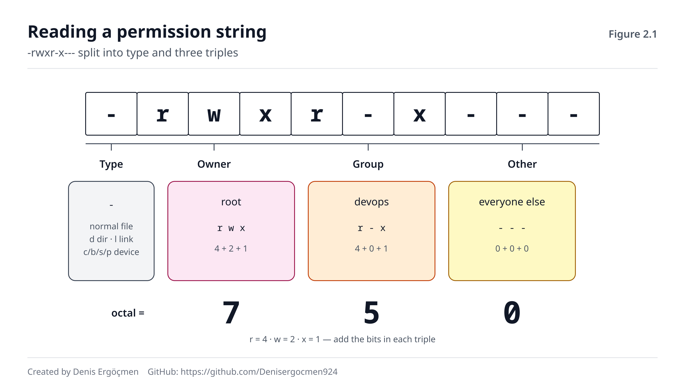
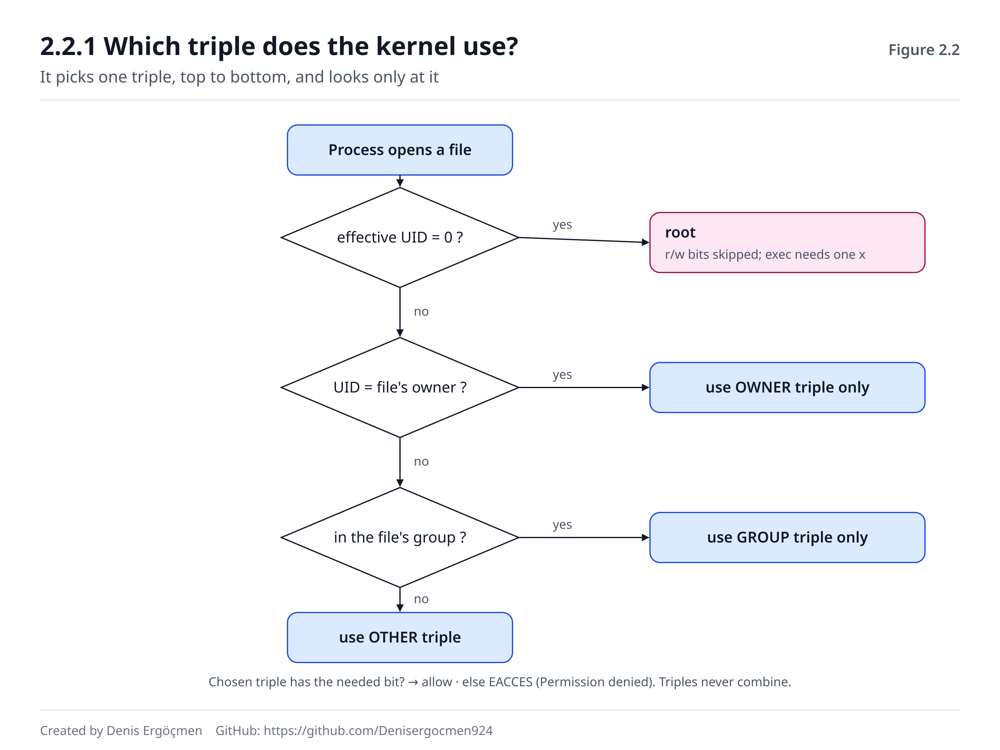
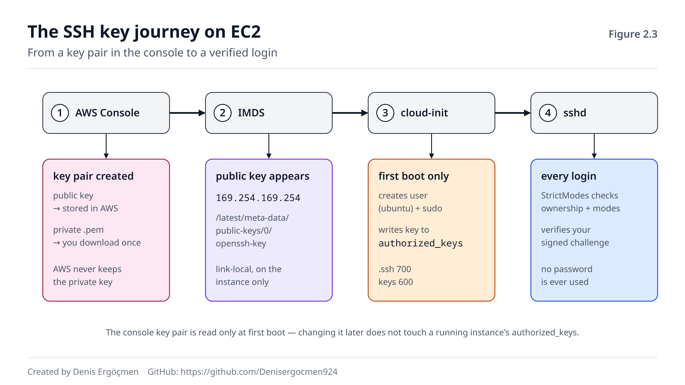

# Phase 2 — Users, Permissions and Identity: The Access Model

> **Navigation:** [◀ Phase 1 — Shell and File System](Phase_1_Shell_and_File_System.md) · **Phase 2** · [Checkpoint Quiz 1 ▶](Checkpoint_Quiz_1.md)

---

## Where we are coming from

In Phase 0 we built the kernel's **single door** (the syscall). In Phase 1 we learned how we
reach that door through the shell, which directory files live in, and how to pull an answer out
of a log.

But in that phase we hit a wall several times and stepped over it:

- `cat /proc/1/environ` → **Permission denied**
- `grep` exit code 2 → "the file exists but I can't read it"
- `sudo echo "x" > /etc/file` → **Permission denied** even though I used sudo
- strings like `drwx------` and `drwxrwxrwt` in `ls -l /` whose meaning we didn't know

In this phase we examine that wall itself. We add one piece to the model from Phase 0: before the
kernel carries out a syscall, it asks **"who is asking for this?"** This whole phase is the answer
to that question.

Three things from Phase 0 and Phase 1 will be directly useful here:

- **"Every request is a syscall."** The permission check happens the moment the kernel handles an
  `open` or `execve` request.
- **"Every process has an identity."** The `Uid` line you saw in `/proc/<PID>/status` is at the
  center of this phase.
- **"A directory = name → inode table."** The idea that explained why `mv` finishes instantly in
  Phase 1 also explains why directory permissions behave the way they do.

## The question of this phase

The two words you will hear most often in the cloud are these:

> *"Permission denied."*

Nginx returns 403. The deploy script says `Permission denied`. SSH shuts the door with `Permission
denied (publickey)`. `docker ps` doesn't work. You can't read a file on the server even though you
are an administrator in IAM.

By the end of this phase, when you see this message you will no longer reach for "let me try
`chmod 777`" but instead **find, in order, which check refused you**: who am I running as → the
directories along the path → the file's bits → my group membership → the mount options → the
security modules.

---

## By the end of this phase

- You will be able to explain that the kernel recognizes users **by number, not by name** (UID/GID),
  and why this causes trouble when you attach a disk to a different server
- You will be able to read the `/etc/passwd`, `/etc/shadow` and `/etc/group` files field by field
- You will be able to convert instantly between a permission string like `-rwxr-x---` and an octal
  number like `750`
- You will know **in what order** the kernel performs the permission check, and how "the owner is
  less privileged than the group" is even possible
- You will be able to explain what the `r`, `w` and `x` bits mean on a **directory** — different
  from what they mean on a file
- You will know what problem setuid, setgid and the sticky bit solve, and why a misplaced setuid is
  a privilege-escalation hole
- You will know what `sudo` actually does, how to read a sudoers rule, and why "granting sudo for
  just one command" can be dangerous
- You will be able to explain how your SSH key lands on the server on EC2, and why OS permissions
  are a **separate layer** from IAM
- You will know which checks to run, in order, when you see "Permission denied"

---

## Phase map

| Section | Topic | Depth | Why it is here |
|---|---|---|---|
| 2.1 | User and group: UID, GID, root, identity files | `[concept]` + `[mechanism]` | The kernel's answer to "who?" |
| 2.2 | Permission bits: rwx, octal, directory permissions | `[mechanism]` + `[application]` | **The heart of the phase** — every permission decision passes through here |
| 2.3 | Special bits: setuid, setgid, sticky | `[concept]` + `[application]` | How a normal user can change their password; and the anatomy of a hole |
| 2.4 | `sudo` and sudoers; not running your app as root | `[mechanism]` + `[application]` | Raising privilege under control |
| 2.5 | OS identity and cloud identity; the "Permission denied" decision tree | `[application]` + `[concept]` | Real life on EC2 |
| 2.6 | When this phase breaks | — | Signatures of permission failures |

> **How to work through this phase:** Most of the commands in this phase are 🟢 (read-only) or 🟡
> (create a temporary file in your own home directory). A few boxes are marked 🔴: they create a
> user or add a rule to sudoers. Run those boxes **only on a test machine of your own** (a VM, WSL,
> or an EC2 t3.micro) and do not skip the undo step at the end of each. In particular, a single
> typo in the sudoers file can leave you **permanently locked out** on an EC2 server that has no
> password (2.4.1).

---
---

# 2.1 User and Group

## 2.1.1 An identity is a number: UID, GID and root `[concept]`

When you type `ls -l` you see the file owner's name:

```
$ ls -l /etc/hostname
-rw-r--r-- 1 root root 16 Sep 15 08:02 /etc/hostname
```

But the kernel **does not know** the word `root`. In the on-disk inode, the owner is written as a
**number**. The identity the kernel keeps for every running process is made of numbers too:

| Part | Full name | What it holds |
|---|---|---|
| **UID** | User ID | The user's number |
| **GID** | Group ID | The number of their primary group |
| **Supplementary groups** | Supplementary groups | The numbers of the other groups they belong to |

Names like `root`, `ubuntu` and `www-data` exist **for humans**. `ls` takes each file's UID, looks
up the matching name for that number in `/etc/passwd`, and prints the name to the screen. This
translation happens entirely in user space, inside the `ls` program.

**Number ranges (Ubuntu and Amazon Linux):**

| UID | Who | Example |
|---|---|---|
| **0** | root — the superuser | `root` |
| **1–999** | System accounts: for services, not for people | `daemon` (1), `www-data` (33), `syslog`, `sshd` |
| **1000+** | Human users | On EC2, `ubuntu` or `ec2-user` = 1000 |
| **65534** | `nobody` — "no one" | An unrecognized user under NFS, restricted services |

**Why is root special?** Not because of its name, but because **its number is 0.** When the kernel
runs a permission check and the process's UID is 0, it skips most file permissions. If a line like
`backup:x:0:0:...` is added to `/etc/passwd`, the system has **two roots**; the fact that its name
is not `root` changes nothing. (Technical detail: in the modern kernel, root's power is split into
pieces called "capabilities." We will see this in Phase 9; for this phase the model "UID 0 = most
checks are skipped" is enough.)

> **🔧 See it on your machine** 🟢 — Your identity
>
> ```
> $ id
> uid=1000(ubuntu) gid=1000(ubuntu) groups=1000(ubuntu),4(adm),24(cdrom),27(sudo),30(dip),110(lxd)
> $ grep -E '^(Uid|Gid|Groups)' /proc/self/status
> Uid:	1000	1000	1000	1000
> Gid:	1000	1000	1000	1000
> Groups:	4 24 27 30 110 1000
> ```
>
> - `id` shows the numbers **and** the names; it translates the names via `/etc/passwd` and
>   `/etc/group`.
> - `/proc/self/status` shows what the kernel actually keeps: **only numbers.** (`self` is the
>   process reading the file itself, here `grep`.)
> - The `Uid` line has four numbers: **real, effective, saved, filesystem.** For now they are all
>   the same. The one used in permission checks is the **effective** UID (the second column). We
>   will see why these four are separated with setuid in 2.3.1.
> - `27(sudo)`: this user is in the `sudo` group. That is why they can use `sudo` on Ubuntu (2.4.1).

**Where does a process's identity come from?** Identity is passed on by inheritance. The `fork`
from Phase 1 makes a copy of the process, and the copy takes the UID, GID and supplementary groups
**exactly as they were.** When you log in over SSH, `sshd` runs as root. After it verifies your
password or key, it changes the identity of the process it opens for the session to yours **once**,
then starts your shell. From that moment on, every command you start is a child of that shell and
carries the same identity.

This small detail has an important consequence: **adding a user to a group does not change the
identity of processes that are already running.** You will see this in Think 2.1.

> **⚠️ Common misconception: "root is a username; if it is renamed or you log in under another
> name, there is no root privilege."**
>
> The kernel looks only at the number. Every account with UID 0 is root. That is why one of the
> first things checked in a server's security audit is this:
>
> ```
> $ awk -F: '$3 == 0' /etc/passwd
> root:x:0:0:root:/root:/bin/bash
> ```
>
> This command should return **a single line.** A second line is either a very old configuration
> or a backdoor left by an attacker.

**❓ A question that comes to mind: Why are there separate users like `www-data`, `mysql`, `syslog`?
Wouldn't it be simpler if they all ran as root?**

It would be simpler, but every service could then reach the files of every other service and of
the whole system. Separate users build a **bulkhead.** If a hole is found in Nginx, the attacker
becomes `www-data` and sees only the files `www-data` can read. They cannot reach the database's
files or `/etc/shadow`. The name of this idea is the **principle of least privilege.** We will
return to it in 2.4.2 and in Phase 9. Most system accounts have `/usr/sbin/nologin` as their
shell, meaning you cannot log in with these accounts. They are just the "ID cards" of services.

---

## 2.1.2 Where identity is stored: `/etc/passwd`, `/etc/shadow`, `/etc/group` `[mechanism]`

When we learned the FHS in Phase 1 we said "config lives in `/etc`." Identity is a config too, and
it lives in three plain-text files.

### `/etc/passwd` — the list of users

Each line is a user; the fields are separated by `:`

```
ubuntu:x:1000:1000:Ubuntu:/home/ubuntu:/bin/bash
│      │ │    │    │      │            └─ 7. login shell
│      │ │    │    │      └────────────── 6. home directory
│      │ │    │    └───────────────────── 5. GECOS (description, full name)
│      │ │    └────────────────────────── 4. primary GID
│      │ └─────────────────────────────── 3. UID
│      └───────────────────────────────── 2. password field: "x" = look in shadow
└──────────────────────────────────────── 1. username
```

Despite its name, this file has **no password.** The `x` in field 2 means "the password is in
`/etc/shadow`." The hash of the password really used to live here. The problem was: `/etc/passwd`
**must be readable by everyone**, because every program from `ls -l` to `ps` reads this file to
translate a UID to a name. Hashes sitting in a world-readable file could be cracked offline. The
solution was to move the hashes to a separate, protected file.

### `/etc/shadow` — the password hashes

```
ubuntu:!:19980:0:99999:7:::
│      │ │     │ │     └─ 6. how many days' warning before expiry
│      │ │     │ └─────── 5. maximum days between changes
│      │ │     └───────── 4. minimum days before it may be changed
│      │ └─────────────── 3. last change (days since 1 Jan 1970)
│      └───────────────── 2. password hash
└──────────────────────── 1. username
```

The values of field 2:

| Value | Meaning |
|---|---|
| `$y$j9T$...` | yescrypt hash (Ubuntu 22.04 and later) |
| `$6$...` | SHA-512 hash (Amazon Linux 2023, the RHEL family, older Ubuntu) |
| `!` or `!$y$...` | Account is **locked for password login.** No password login, but SSH key login can work |
| `*` | No password ever set (system accounts) |

The `ubuntu` user on EC2 has `!` in the password field: **it has no password.** The only way in is
the SSH key (2.5.1). This is also why `sudo` doesn't ask it for a password (2.4.1).

### `/etc/group` — groups and their members

```
sudo:x:27:ubuntu
docker:x:988:ubuntu,deploy
│      │ │   └─ 4. supplementary members (comma-separated)
│      │ └───── 3. GID
│      └─────── 2. group password (unused)
└────────────── 1. group name
```

A user's **primary group** is in field 4 of `/etc/passwd` and usually is **not listed** as a member
in `/etc/group`. Ubuntu creates a group of the same name for each user (`ubuntu` user → `ubuntu`
group, GID 1000). Their **supplementary groups** are in the member list in `/etc/group`.

> **🔧 See it on your machine** 🟢 — Why can't `/etc/shadow` be read?
>
> ```
> $ ls -l /etc/passwd /etc/shadow /etc/group
> -rw-r--r-- 1 root root   1322 Aug 30 21:59 /etc/group
> -rw-r--r-- 1 root root   3097 Aug 30 21:59 /etc/passwd
> -rw-r----- 1 root shadow 1386 Aug 30 21:59 /etc/shadow
> $ cat /etc/shadow
> cat: /etc/shadow: Permission denied
> $ stat /etc/shadow
>   File: /etc/shadow
>   Size: 1386      	Blocks: 8          IO Block: 4096   regular file
> Device: 259,2	Inode: 1575655     Links: 1
> Access: (0640/-rw-r-----)  Uid: (    0/    root)   Gid: (   42/  shadow)
> ...
> ```
>
> - `passwd` and `group`: `-rw-r--r--` → everyone reads, only root writes.
> - `shadow`: `-rw-r-----` → root reads and writes, the `shadow` group reads, **others can do
>   nothing.** You are not in the `shadow` group; that is why `cat` was refused.
> - `stat` shows the same information both as a number (`0640`, `Uid: 0`, `Gid: 42`) and as names.
>   We will read the permission string step by step in 2.2.1.

> **🔧 See it on your machine** 🟢 — Listing users and groups
>
> ```
> $ getent passwd ubuntu
> ubuntu:x:1000:1000:Ubuntu:/home/ubuntu:/bin/bash
> $ awk -F: '$3 >= 1000 && $3 < 65534 {print $1, $3, $7}' /etc/passwd
> ubuntu 1000 /bin/bash
> $ getent group sudo
> sudo:x:27:ubuntu
> $ groups ubuntu
> ubuntu : ubuntu adm cdrom sudo dip lxd
> ```
>
> - The `awk -F:` from Phase 1 works here: we selected human users whose field 3 (UID) is between
>   1000 and 65534.
> - **Use `getent passwd` instead of `cat /etc/passwd`.** In enterprise environments users may come
>   from LDAP or Active Directory (via SSSD) and not be written in `/etc/passwd` at all. `getent`
>   asks all the sources the system really uses (`/etc/nsswitch.conf`). `cat` only reads the file.

**User and group management commands:**

| Command | What it does |
|---|---|
| `useradd -m -s /bin/bash ali` | Creates a user (`-m` = home directory, `-s` = shell) |
| `adduser ali` | On Debian/Ubuntu, an interactive, friendlier wrapper |
| `passwd ali` | Sets or changes a password |
| `usermod -aG docker ali` | **Adds** to a supplementary group (`-a` = append) |
| `userdel -r ali` | Deletes the user and their home directory |
| `groupadd devops` | Creates a group |
| `gpasswd -d ali docker` | Removes a user from a group |

Do not edit these files by hand; use the commands above. The commands lock the file, keep the four
files (`passwd`, `shadow`, `group`, `gshadow`) consistent, and don't allow typos. If you must edit
by hand, use `vipw` and `vigr`.

> **⚠️ Common misconception: "`usermod -G docker ali` adds the user to the docker group."**
>
> Without `-a`, `-G` **replaces** the user's supplementary groups with the list you give. `ali`'s
> membership in the `sudo` group is silently deleted. If you make this mistake on your own user and
> there is no other administrator on the machine, you have thrown away your own sudo access. The
> correct form: **`usermod -aG`**.

> **🔧 See it on your machine** 🔴 — Create, inspect, delete a user
>
> *On a test machine only.*
>
> ```
> $ sudo useradd -m -s /bin/bash test
> $ getent passwd test
> test:x:1001:1001::/home/test:/bin/bash
> $ sudo grep test /etc/shadow
> test:!:20711:0:99999:7:::
> $ ls -ld /home/test
> drwxr-x--- 2 test test 4096 Sep 15 09:10 /home/test
> $ sudo -u test id
> uid=1001(test) gid=1001(test) groups=1001(test)
> ```
>
> - The new user got the next free UID (1001) and a group of the same name.
> - The password field is `!`: the account is locked because we set no password.
> - The home directory is `drwxr-x---`: since Ubuntu 21.04, home directories are closed to other
>   users (`/etc/login.defs` → `HOME_MODE 0750`). This detail will matter in Think 2.3.
> - `sudo -u test id`: we ran a command as another user (2.4.1).
>
> **Undo:**
>
> ```
> $ sudo userdel -r test
> $ getent passwd test || echo "deleted"
> deleted
> ```

> **🤔 Think 2.1**
> You are working on an EC2 server as the `ubuntu` user. You installed Docker and added yourself to
> the group:
>
> ```
> $ sudo usermod -aG docker ubuntu
> $ getent group docker
> docker:x:988:ubuntu
> $ docker ps
> permission denied while trying to connect to the Docker daemon socket at unix:///var/run/docker.sock
> ```
>
> `/etc/group` shows you as a member, but `docker ps` is still refused.
>
> 1. Why? What do you expect to see in the output of `id`?
> 2. Give at least two ways to fix it.
> 3. You closed and reopened your SSH connection but reattached to a `tmux` session, and the problem
>    persists. Why?
>
> *(Answer: at the end of the phase)*

> **🤔 Think 2.2**
> You detached an EBS disk from an old server (Amazon Linux) and attached it to a new Ubuntu server.
> On the old server the application ran as the `appuser` user (UID 1001). On the new server you
> first created a user named `deploy`, then created `appuser`. You mounted the disk at `/data`:
>
> ```
> $ ls -l /data/app
> -rw-r----- 1 deploy deploy 5120 Sep 10 14:22 settings.yml
> drwx------ 2 deploy deploy 4096 Sep 10 14:22 uploads
> ```
>
> The `deploy` user never created these files. When the application is started as `appuser`, it
> gets `Permission denied`.
>
> 1. Why do the files appear to belong to `deploy`?
> 2. Propose two different solutions and say when you would choose each.
>
> *(Answer: at the end of the phase)*

---
---

# 2.2 Permission Bits

## 2.2.1 rwx × owner, group, other `[mechanism]`

Each line of `ls -l` output carries all of the permission information the kernel knows about that
file:

```
-rwxr-x--- 1 root devops 1832 Sep 15 09:12 deploy.sh
│└┬┘└┬┘└┬┘ │ │    │      │    │            └─ name
│ │  │  │  │ │    │      │    └────────────── last modification time
│ │  │  │  │ │    │      └─────────────────── size (bytes)
│ │  │  │  │ │    └────────────────────────── group
│ │  │  │  │ └─────────────────────────────── owner
│ │  │  │  └───────────────────────────────── hard link count
│ │  │  └──────────────────────────────────── other
│ │  └─────────────────────────────────────── group
│ └────────────────────────────────────────── owner (user)
└──────────────────────────────────────────── file type
```

**The first character: file type.** The "everything is a file" idea from Phase 0 shows up here:

| Character | Type | Example |
|---|---|---|
| `-` | Regular file | `/etc/hostname` |
| `d` | Directory | `/etc` |
| `l` | Symbolic link | `/bin -> usr/bin` |
| `c` | Character device | `/dev/null` |
| `b` | Block device | `/dev/nvme0n1` |
| `s` | Socket | `/run/systemd/journal/stdout` |
| `p` | Named pipe (FIFO) | created with `mkfifo` |

**The next nine characters: three classes × three permissions.** Each triple is, in order, `r`,
`w`, `x`. If there is a `-` instead of a letter, that permission is **absent.**

| Letter | Meaning on a file |
|---|---|
| `r` (read) | Can read the contents (can `open` in read mode) |
| `w` (write) | Can change the contents |
| `x` (execute) | Can run it as a program (`execve`) |

In our example `rwx` is for the owner (`root`), `r-x` for the group (`devops`) and `---` for
others.


*Figure 2.1 — the string `-rwxr-x---` splits into a type character and three triples. In each
triple r = 4, w = 2, x = 1; the sum of the triple is one digit of the octal representation: 7, 5,
0 → `750`.*

### Octal representation

Each triple is made of three bits, so it can be written as a single number between 0 and 7. The
bit values are: **r = 4, w = 2, x = 1.** You add up the bits that are on:

```
rwx = 4+2+1 = 7        r-x = 4+0+1 = 5        --- = 0
-rwxr-x---  →  750
```

The values you will see most often:

| Octal | String | Typical use |
|---|---|---|
| `755` | `rwxr-xr-x` | Programs, scripts, world-accessible directories |
| `644` | `rw-r--r--` | Normal config and content files |
| `750` | `rwxr-x---` | A directory or script only one group should reach |
| `640` | `rw-r-----` | A sensitive file a group may read (`/etc/shadow`, `auth.log`) |
| `700` | `rwx------` | A personal directory (`~/.ssh`) |
| `600` | `rw-------` | A private key, a config with a password (`~/.ssh/id_ed25519`) |
| `400` | `r--------` | A file only the owner should read and that should not change (what AWS recommends for the `.pem` you download) |
| `777` | `rwxrwxrwx` | **Almost never the right answer** (2.2.2) |

> **🔧 See it on your machine** 🟢 — Reading permissions as a number and as a string
>
> ```
> $ stat -c '%a %A %U:%G %n' /etc/passwd /etc/shadow /usr/bin/ls ~/.ssh ~
> 644 -rw-r--r-- root:root /etc/passwd
> 640 -rw-r----- root:shadow /etc/shadow
> 755 -rwxr-xr-x root:root /usr/bin/ls
> 700 drwx------ ubuntu:ubuntu /home/ubuntu/.ssh
> 750 drwxr-x--- ubuntu:ubuntu /home/ubuntu
> ```
>
> - `stat -c` with a format string selects the fields you want: `%a` octal, `%A` string, `%U:%G`
>   owner and group.
> - On each line, convert the string to a number in your head, then compare with the first column.
>   Repeat this until you can do it without thinking; the rest of this phase is built on top of it.

### Which triple does the kernel look at?

This is the most important and most-often-misunderstood rule of the phase. When a process wants to
open a file, the kernel **picks a single triple** and looks only at it:

1. Is the process's effective UID **0**? → root. Read and write are granted regardless of the
   permission bits. (For execution the file must have **at least one** `x` bit.)
2. Is the process's UID the file's **owner**? → **only the owner triple** is used.
3. Is the process's GID or one of its supplementary groups the file's **group**? → **only the group
   triple** is used.
4. None of these? → **the other triple** is used.

If the requested permission is in the chosen triple, the operation proceeds; if not, the syscall
returns with the `EACCES` error and the shell prints it as `Permission denied`. **Permissions are
not added up and there is no falling through from one class to another.** If the owner triple
refuses, the result is refusal even if the group triple is `rwx`.


*Figure 2.2 — the check proceeds top to bottom and stops at the first "yes." The bits outside the
chosen triple are never looked at; this is why the owner can be less privileged than the group or
others.*

(Technical note: in the kernel code the root check is actually done near the end, as a "capability"
check. The result is the same as this four-step model; the detail is in Phase 9.)

> **🔧 See it on your machine** 🟡 — The owner being less privileged than the group
>
> ```
> $ echo secret > owner-test
> $ chmod 070 owner-test
> $ ls -l owner-test
> ----rwx--- 1 ubuntu ubuntu 6 Sep 15 09:20 owner-test
> $ id -gn
> ubuntu
> $ cat owner-test
> cat: owner-test: Permission denied
> ```
>
> - The group is `ubuntu`, you are in the `ubuntu` group, and the group triple is `rwx`. But the
>   kernel first asked "is this the owner?", the answer was **yes**, the owner triple is `---` →
>   **refused.** It never looked at the group triple.
> - In real life this situation is rarely intentional. But it explains why a `chmod` mistake can
>   look "weird."
>
> **Undo:** `rm owner-test` (to delete a file you need write permission on the **directory**, not
> on the file; we'll see this in 2.2.3).

> **⚠️ Common misconception: "Root can do anything; it will run a script even without an `x` bit."**
>
> Root skips read and write permissions, but there is one exception for execution: the file must
> have an `x` bit in **at least one of its three triples.** Root cannot run a `-rw-r--r--` script
> with `./script.sh` either and gets `Permission denied`. The purpose of this rule is to prevent a
> file marked "not executable" from being run as a program by accident. Typing `bash script.sh`,
> on the other hand, works for every user, because the program being run in that case is `bash`;
> the script is just a **read** file.

**❓ A question that comes to mind: Is `x` enough for a script, or is `r` also needed?**

For a compiled program (like `/usr/bin/ls`), `x` is enough; the kernel loads the file into memory
itself. For a script you **also need `r`.** When you type `./script.sh` the kernel sees the
`#!/bin/bash` on the file's first line and runs `bash`, passing the file path as an argument. Then
`bash` has to **read** the file like an ordinary process. On a script with `--x` permission the
error message is `/bin/bash: ./script.sh: Permission denied`; the `/bin/bash` at the start of the
message shows that what was refused is not the shell's, but the read attempt of the new `bash`
process the kernel started. In short: `x` for a program, `r` + `x` for a script.

---

## 2.2.2 `chmod`, `chown`, `chgrp` and umask `[application]`

### `chmod` — changing the permission bits

There are two forms:

| Form | Example | When |
|---|---|---|
| **Octal** | `chmod 640 file` | When defining the whole permission from scratch |
| **Symbolic** | `chmod g+w file` | When changing a single thing in the existing permission |

The parts of the symbolic form: **who** (`u` owner, `g` group, `o` others, `a` all), **operation**
(`+` add, `-` remove, `=` make exactly this), and **permission** (`r`, `w`, `x`). They can be
combined with commas:

```
$ chmod 640 s
$ chmod u+x,g-r,o=r s
$ stat -c '%a %A' s
704 -rwx---r--
```

`640` (`rw-r-----`) → `x` added to the owner → `r` removed from the group → others set to exactly
`r` → `704`.

**`chmod -R` and capital `X`.** `chmod -R 755 dir` makes all files executable, including `.txt` and
`.yml` files. Capital `X` exists for this: it adds `x` **to directories and to files that already
have at least one `x` bit**, and leaves other files alone:

```
$ chmod -R u=rwX,go=rX /srv/site
```

Careful: `X` does **not fix** files that were mistakenly made executable, it just doesn't add new
ones. The cleanest way to rebuild a directory's permissions from scratch is to separate files and
directories:

```
$ find /srv/site -type d -exec chmod 755 {} +
$ find /srv/site -type f -exec chmod 644 {} +
```

### `chown` and `chgrp` — changing ownership

```
$ sudo chown www-data:www-data /srv/site/index.html    # owner and group
$ sudo chown -R appuser: /srv/app                      # owner = appuser, group = appuser's primary group
$ chgrp devops report.txt                               # group only
```

**The rule:** Only **root** can change a file's owner. A normal user can change the group of their
own file only to a group they are **a member of**:

```
$ chgrp root g
chgrp: changing group of 'g': Operation not permitted
$ chown root g
chown: changing ownership of 'g': Operation not permitted
```

Why can't a normal user "gift" their file to someone else? Because then they could fill someone
else's disk quota, or try — with the setuid bit you'll see in 2.3 — to make a file run on someone
else's behalf. Notice the message is not `Permission denied` but **`Operation not permitted`.** This
difference will matter in 2.5.3.

### umask — with what permission are new files born?

When a program creates a file it usually asks for `666` (`rw-rw-rw-`), and for a directory `777`.
The kernel masks this request with the process's **umask**: **the bits that are on in the umask are
turned off in the new file.**

| umask | New file | New directory | Where seen |
|---|---|---|---|
| `022` | `644` `rw-r--r--` | `755` `rwxr-xr-x` | Root, systemd services, the default in most distributions |
| `002` | `664` `rw-rw-r--` | `775` `rwxrwxr-x` | Normal users on Ubuntu (because each user has their own group) |
| `077` | `600` `rw-------` | `700` `rwx------` | Scripts that produce sensitive data |

> **🔧 See it on your machine** 🟡 — Changing umask and seeing the result
>
> ```
> $ umask
> 0002
> $ (umask 022; touch f1; mkdir d1; ls -ld f1 d1)
> drwxr-xr-x 2 ubuntu ubuntu 4096 Sep 15 09:25 d1
> -rw-r--r-- 1 ubuntu ubuntu    0 Sep 15 09:25 f1
> $ (umask 077; touch f2; mkdir d2; ls -ld f2 d2)
> drwx------ 2 ubuntu ubuntu 4096 Sep 15 09:25 d2
> -rw------- 1 ubuntu ubuntu    0 Sep 15 09:25 f2
> ```
>
> - The parentheses run the commands in a **subshell** (Phase 1, fork). umask, like identity,
>   belongs to the process and is passed on by inheritance; the change in the subshell does not
>   affect your main shell.
> - Since `touch` does not ask for `x` on a file, it is impossible to "gain" `x` through umask.
>   umask only **turns off.**
>
> **Undo:** `rm -r f1 d1 f2 d2`

umask is set permanently through `/etc/login.defs`, `~/.bashrc` (per user), or the `UMask=` in a
service definition (systemd, Phase 5). If a service is creating files and their permissions aren't
what you expect, the first place to look is the service's umask.

**❓ A question that comes to mind: I did `chmod -R 777` and the problem was solved. Why does
everyone say this is bad?**

Because you didn't solve the problem, you **hid** it, and you created three new ones:

1. **You never learned the cause.** You don't know which user was refused at which check; the same
   error will come back on another file.
2. **Every process on the machine can now change those files.** An attacker who finds a hole in
   Nginx (`www-data`) can now write to the application's code. If a script root runs via cron is
   `777`, **any user** can add a line to that script and run a command as root. This is a
   privilege-escalation hole.
3. **Some programs reject a loosely-permissioned file.** SSH will not accept your key if `~/.ssh`
   or your home directory is world-writable (2.5.1). So `chmod -R 777 ~` can lock you out of the
   server.

The right way is always the same: **who** (which user and group) should reach **what** (which file,
which directory) **with what permission**? Grant only that.

---

## 2.2.3 `r`, `w`, `x` on a directory `[mechanism]`

In Phase 1 we saw why `mv` finishes instantly within the same disk: **a directory is a table that
binds names to inode numbers.** The file's contents are not in that table, but in the blocks the
inode points to. Once you keep this model in mind, directory permissions make sense on their own.
A directory's bits control the operations on the **table**, not the contents of the files:

| Bit | Meaning on a directory | Which operation |
|---|---|---|
| `r` | Can **list the names** in the table | `ls dir` |
| `w` | Can **add, delete, rename names** in the table (together with `x`) | creating a file, `rm`, `mv` |
| `x` | Can **move from a name to its inode** (search/traverse) | `cd dir`, `cat dir/file`, passing through the path |

The name of the `x` bit on a directory is "search," but "permission to pass through" is a clearer
way to put it. `x` without `r` = "you can enter if you know the name but you can't list." `r`
without `x` = "you can see the names but you can't touch any of them."

> **🔧 See it on your machine** 🟡 — Trying the directory bits one by one
>
> ```
> $ mkdir d && echo hello > d/f
>
> $ chmod 600 d          # rw- : no x
> $ ls d
> f
> $ ls -l d
> ls: cannot access 'd/f': Permission denied
> total 0
> -????????? ? ? ? ?            ? f
> $ cat d/f
> cat: d/f: Permission denied
>
> $ chmod 100 d          # --x : traverse only
> $ ls d
> ls: cannot open directory 'd': Permission denied
> $ cat d/f
> hello
>
> $ chmod 500 d          # r-x : no w
> $ touch d/new
> touch: cannot touch 'd/new': Permission denied
> ```
>
> - **`rw-`:** You could read the names (`f`). But `ls -l` wants to go to each file's inode and
>   read its size and owner; without `x` it couldn't, and printed `?` for every field. `cat` also
>   couldn't reach the file.
> - **`--x`:** Listing was refused, but you read the file whose name you **knew**.
> - **`r-x`:** No new name could be added to the table.
>
> **Undo:** `chmod 700 d && rm -r d`

### Deleting is a directory operation

`rm file` does not touch the file's contents; it removes a **row** from the directory table. That
is why the permission to delete depends not on the file's bits but on the **directory's** `w` and
`x` bits:

```
$ ls -l read-only.txt
-r--r--r-- 1 ubuntu ubuntu 12 Sep 15 09:30 read-only.txt
$ rm read-only.txt
rm: remove write-protected regular file 'read-only.txt'? y
$ ls read-only.txt
ls: cannot access 'read-only.txt': No such file or directory
```

`rm` only asked as a **courtesy**; because you have write permission on the directory, the kernel
allowed the deletion. By the same logic, you can delete a file root left in your own home
directory.

> **⚠️ Common misconception: "To protect a file, making it read-only (`chmod 444`) is enough."**
>
> `444` prevents the file's **contents** from being changed. Anyone with write permission on the
> directory can still **delete** the file, **rename** it, or put a new file with the same name. If
> you want to protect a file's existence, you have to look at the directory's permissions. For
> shared directories that everyone can write to (like `/tmp`), the solution is the sticky bit in
> 2.3.1.

### Every directory along the path counts

To open the file `/var/log/auth.log`, the kernel walks the path piece by piece: `/` → `var` →
`log` → `auth.log`. **You must have `x` permission in every directory along the path.** Even if
the file is `644`, if a directory in the middle of the path won't let you through, you can't reach
the file. To see the whole path in one command:

> **🔧 See it on your machine** 🟢 — The permission of each step in the path
>
> ```
> $ namei -l /var/log/auth.log
> f: /var/log/auth.log
> drwxr-xr-x root   root   /
> drwxr-xr-x root   root   var
> drwxrwxr-x root   syslog log
> -rw-r----- syslog adm    auth.log
> ```
>
> - The `/`, `var` and `log` directories all have `x` for others; the path is open.
> - The last step: `auth.log` is owned by `syslog`, group `adm`, `640`. Others get nothing.
> - If your `id` output has `4(adm)`, you can read this file without `sudo`. The `ubuntu` user on
>   EC2 is in the `adm` group, which is why it can read the logs. This is the **purpose** of that
>   group: reading logs without being an administrator.
> - `namei -l` is the fastest tool in a "Permission denied" hunt; it shows at a glance which step
>   stopped you.

> **🤔 Think 2.3**
> A teammate, to publish a static site quickly, put the files in their home directory and pointed
> Nginx's `root` setting there. The browser shows **403 Forbidden**. In Nginx's error log:
>
> ```
> open() "/home/ubuntu/site/index.html" failed (13: Permission denied)
> ```
>
> The permissions:
>
> ```
> $ ls -ld /home/ubuntu /home/ubuntu/site /home/ubuntu/site/index.html
> drwxr-x--- 6 ubuntu ubuntu 4096 Sep 15 09:40 /home/ubuntu
> drwxrwxr-x 2 ubuntu ubuntu 4096 Sep 15 09:41 /home/ubuntu/site
> -rw-rw-r-- 1 ubuntu ubuntu  512 Sep 15 09:41 /home/ubuntu/site/index.html
> ```
>
> Nginx's worker processes run as the `www-data` user. Your teammate says "let's just do `sudo
> chmod -R 777 /home/ubuntu` and move on."
>
> 1. `index.html` is world-readable (`r--` for others). At which step and looking at which triple
>    did the kernel refuse?
> 2. `chmod -R 777 /home/ubuntu` opens the site. But what happens on the next SSH login, and why?
> 3. Propose two correct solutions.
>
> *(Answer: at the end of the phase)*

---
---

# 2.3 Special Bits

## 2.3.1 setuid, setgid and sticky `[concept]`

### A puzzle: how does `passwd` work?

We saw in 2.1.2: the `/etc/shadow` file is `640 root:shadow`. A normal user cannot even **read**
this file. Yet the same user can type `passwd` and change their own password — that is, they
**write** to `/etc/shadow`. By the rules in 2.2.1 this should be impossible.

The solution is in the `passwd` program itself:

```
$ ls -l /usr/bin/passwd
-rwsr-xr-x 1 root root 93640 Feb  2 10:14 /usr/bin/passwd
```

There is an **`s`** instead of an `x` in the owner triple. This is the **setuid** bit and it means:
**whoever runs this program, the process runs with the identity of the file's owner (root).**

### Real UID and effective UID

In 2.1.1 we saw four `Uid` values in `/proc/self/status`. Now the first two take on meaning:

| Field | Meaning | While `passwd` runs |
|---|---|---|
| **Real UID** | **Who started** the process | `1000` (ubuntu) |
| **Effective UID** | **Who counts** in permission checks | `0` (root) |

The kernel does the checks in 2.2.1 with the **effective UID**. Because `passwd` is checked as
root, it can write to `/etc/shadow`. The real UID lets the program answer "who called me?": `passwd`
lets you change only the **real UID's** password; to change someone else's password the real UID
must also be 0.

You can see the difference by holding a `passwd` at the password prompt in a second terminal and
running:

```
$ ps -o pid,ruser,euser,cmd -C passwd
    PID RUSER    EUSER    CMD
   2841 ubuntu   root     passwd
```

This also shows why setuid programs are **dangerous**: the program **lends** root's power to the
user running it. A single bug in the program (a flaw that lets it write to another file or open a
shell) means that user becomes root. That is why setuid programs are kept small, carefully written
and few in number.

> **🔧 See it on your machine** 🟢 — The setuid programs on the machine
>
> ```
> $ find / -xdev -perm -4000 -type f 2>/dev/null
> /usr/bin/chfn
> /usr/bin/su
> /usr/bin/gpasswd
> /usr/bin/umount
> /usr/bin/newgrp
> /usr/bin/chsh
> /usr/bin/mount
> /usr/bin/pkexec
> /usr/bin/passwd
> /usr/bin/sudo
> /usr/lib/openssh/ssh-keysign
> ...
> ```
>
> - `-perm -4000`: "those with at least the setuid bit on." `-xdev` prevents descending into other
>   file systems (like `/proc`); `2>/dev/null` drops the error messages of directories you can't
>   reach.
> - Every program in the list has a reason: `su` and `sudo` change identity, `mount` mounts disks,
>   `passwd`/`chsh`/`chfn` write to the user database.
> - Save the list to a file. In 2.3.2 we'll see why this list is a **security reference.**

### setgid: the same idea, for the group

If you see an `s` in the group triple, this is the **setgid** bit. It does different things on a
file and on a directory.

**On a file:** the process runs with the identity of the file's **group.** Example `crontab`:

```
$ ls -l /usr/bin/crontab
-rwxr-sr-x 1 root crontab 39744 Nov  5 11:02 /usr/bin/crontab
$ sudo ls -ld /var/spool/cron/crontabs
drwx-wx--T 2 root crontab 4096 May 30 03:20 /var/spool/cron/crontabs
```

Only the `crontab` group can write to the directory where users' cron tables live (`-wx`, no
listing). When you run `crontab -e`, the process counts as being in the `crontab` group and writes
your file there. Instead of all of root's authority, the authority of **a single group** is lent;
this is a much narrower privilege than setuid root.

**On a directory:** every file created in a setgid directory takes not the creating user's group but
the **directory's group.** This is the basis of shared project directories:

> **🔧 See it on your machine** 🟡 — Group inheritance in a setgid directory
>
> ```
> $ mkdir shared && chmod 2775 shared
> $ ls -ld shared
> drwxrwsr-x 2 ubuntu ubuntu 4096 Sep 15 10:05 shared
> ```
>
> - `2775`: the leading `2` is setgid, `775` the normal permissions. The group triple shows `rws`
>   instead of `rwx`.
> - In a real scenario the directory's group is set to `devops` with `sudo chgrp devops shared`.
>   Then files created by everyone in `devops` are born in the `devops` group, and if the umask is
>   `002` the group members can edit each other's files.
> - Without setgid, each file would be born in the creator's personal group (`alice:alice`) and the
>   group triple would be useless to the other members.
>
> **Undo:** `rm -r shared`

### The sticky bit: "delete only your own file" in a shared directory

In 2.2.3 we learned: anyone with write permission on a directory can delete **any** file in it.
`/tmp` **must** be world-writable, because every user and service puts temporary files there. So
can everyone delete everyone else's files?

```
$ ls -ld /tmp
drwxrwxrwt 18 root root 4096 Sep 15 10:07 /tmp
```

The **`t`** in the other triple is the **sticky bit.** In a directory with the sticky bit, having
write permission on the directory is **not enough** to delete or rename a file: you must be the
file's owner, the directory's owner, or root.

### Summary: the four-digit octal and capital letters

Special bits are written as the **fourth digit** at the very front in octal notation:

| Value | Bit | Where it appears | Example |
|---|---|---|---|
| `4000` | setuid | `s` in the owner's `x` position | `4755` → `-rwsr-xr-x` |
| `2000` | setgid | `s` in the group's `x` position | `2775` → `drwxrwsr-x` |
| `1000` | sticky | `t` in the other's `x` position | `1777` → `drwxrwxrwt` |

**Lowercase / uppercase:** because the special bit shares the same position as `x`, it shows two
pieces of information with one letter. `s`/`t` = the special bit **and** `x` on. `S`/`T` = the
special bit on **but** `x` off.

```
$ chmod 4644 file          → -rwSr--r--
$ chmod 1776 dir           → drwxrwxrwT
```

A capital letter is almost always the sign of a mistake: the setuid bit on a file with no `x` does
nothing. There are deliberate exceptions like the `/var/spool/cron/crontabs` above, but when you
see an `S`, first ask "is this intentional?"

> **⚠️ Common misconception: "If I give a script setuid, it runs as root."**
>
> Linux **ignores** the setuid and setgid bits on scripts that start with `#!`. The reason is a
> race condition: between the kernel opening the script and starting the interpreter, and the
> interpreter opening the file again, an attacker could swap the file (or the link to it) for
> another script. If a script needs to run as root, the right tool is a `sudo` rule (2.4.1) or
> putting the script in a systemd service that runs as root (Phase 5).
>
> An extra layer of protection: on file systems mounted with the `nosuid` option (`/tmp`,
> `/dev/shm`, removable disks are often like this) the setuid bits are also ignored. You'll see
> `nosuid` in the output of `findmnt -no OPTIONS -T /dev/shm`.

**❓ A question that comes to mind: Is `sudo` setuid too? Then what's the difference between `sudo`
and `passwd`?**

Yes, `sudo` is a setuid root program too; there is no other way for it to start as root. The
difference is **what** the program uses root's power for. `passwd` uses this power for a single
fixed job: changing your password. `sudo`, on the other hand, uses the power to run **other
programs** as root by consulting a **rule file** (sudoers). So `sudo` is not a "program given root
power" but a "program that distributes root power according to rules." We'll see how it decides in
2.4.1.

---

## 2.3.2 When it breaks: a setuid bit in the wrong place `[application]`

The power of the setuid bit turns into a disaster on the wrong program. Imagine an administrator
did this so that "users can use `find` to search logs without sudo":

```
$ sudo chmod u+s /usr/bin/find        # DON'T
$ ls -l /usr/bin/find
-rwsr-xr-x 1 root root 204264 Mar 31 12:10 /usr/bin/find
```

The intent: `find` should be able to search every directory with root privilege. The result:
`find`'s `-exec` option can run **any program.** Every user on the machine can now type:

```
$ find . -maxdepth 0 -exec /bin/sh -p \;
# id
uid=1000(ubuntu) euid=0(root) gid=1000(ubuntu) egid=0(root) ...
# whoami
root
```

`find`'s `-exec` feature runs any command; because `find` runs with root's effective UID, the
`/bin/sh` it starts is also root. The `-p` flag prevents the shell from dropping the effective UID
to the real UID at startup. The same trap exists in `vim` (`:!sh`), `less` (`!sh`), `awk`
(`BEGIN{system("sh")}`), `tar --to-command` and dozens of other tools. The catalog of ways to
escape from a program to a shell is known as **GTFOBins** and is one of the first places an
attacker looks when they land on a machine.

> **⚠️ Common misconception: "A setuid binary is safe because only root can set setuid."**
>
> What matters is not who set the setuid bit but **which program** it was set on. A setuid that
> root set in good faith on `vim` or `find` gives root to every user on that server. The rule:
> setuid should only be on programs that do a **single, narrow job** and from which you cannot run
> a shell or an arbitrary command. No general-purpose tool (editor, archiver, interpreter, search
> tool) gets setuid.

### Detection: a diff against a known-good list

The way to find unexpected setuid binaries on a server is to compare against a known-good inventory
taken at first install:

> **🔧 See it on your machine** 🟢 — Keeping the setuid inventory against a baseline
>
> ```
> $ find / -xdev \( -perm -4000 -o -perm -2000 \) -type f 2>/dev/null | sort > suid.now
> $ diff suid.baseline suid.now
> > /usr/bin/vim.basic          # ← not in the baseline: investigate
> ```
>
> - `-xdev` limits the search to a single file system (does not dive into network mounts or
>   `/proc`).
> - At first install you save `suid.now` as `suid.baseline`; then you compare regularly. A new line
>   is either a legitimate package install or a trail of privilege escalation. This is a small
>   herald of the hardening ideas in Phase 9 and the observability ideas in Phase 11.
> - The most robust defense is at mount time first: mounting the file systems a user can write to
>   (`/tmp`, `/home`, separate data disks) with `nosuid` guarantees that no setuid binary dropped
>   there works.

> **🤔 Think 2.4**
> A team will collaborate in the `/srv/reports` directory: the users `ayse`, `mehmet` and `deploy`
> will write report files here; they should be able to read and update **each other's** files, but
> should **not** accidentally delete each other's files. To fix the problem an administrator did
> `chmod -R 777 /srv/reports`.
>
> 1. What did `777` solve, and which requirement did it break? (Think especially about the "should
>    not delete" requirement.)
> 2. Assume the three users are put in the same `reporter` group. With which permissions and which
>    special bit(s) would you set up the directory so that: (a) group members can create new files,
>    (b) new files automatically belong to the `reporter` group, (c) everyone can read and write
>    each other's files but only the owner can delete?
> 3. Write the octal mode and predict what the output of `ls -ld /srv/reports` would look like.
>
> *(Answer: at the end of the phase)*

---
---

# 2.4 Elevated Privilege: su and sudo

## 2.4.1 sudo and sudoers `[mechanism]`

When an operation genuinely requires root there are two ways. The old one is `su` (**s**witch
**u**ser): you enter root's password and open a full root shell. The one preferred on modern
servers is **sudo**, and the difference is important:

| | `su -` | `sudo <command>` |
|---|---|---|
| Which password? | The **target** user's (root's) password | **Your own** password |
| What do you get? | A full root shell, indefinitely | A single command, as root |
| Who is authorized? | Anyone who knows root's password | Users named in `sudoers` |
| Is there a trail? | Only "an su session was opened" | **Every command** is logged |

On cloud servers root's password mostly **does not exist at all** (on Ubuntu `disable_root: true`
and the root line is locked with `!`), so `su -` doesn't work anyway. Access is granted entirely
through `sudo`.

### A `sudo` command step by step

What happens when you type `sudo systemctl restart nginx`:

1. **`sudo` is a setuid binary** (`-rwsr-xr-x root root`). You run it, and the process starts
   immediately with root's effective UID. (The setuid model from 2.3 is useful here.)
2. It reads the rule file: `/etc/sudoers` and `/etc/sudoers.d/*`. These files are `440 root:root` —
   a normal user can't even read them.
3. It authenticates you via **PAM** (asks for your password, caches the result for a while).
4. It cleans the environment: `env_reset` drops most variables, `secure_path` sets `PATH` to a safe
   fixed value. This is why `PATH` is different under `sudo`.
5. If permitted, it `exec`s the command as root.
6. It logs the operation: `journalctl -t sudo` or `/var/log/auth.log`:
>
> ```
> sudo: ubuntu : TTY=pts/0 ; PWD=/home/ubuntu ; USER=root ; COMMAND=/usr/bin/systemctl restart nginx
> ```

### sudoers rule syntax

The anatomy of a sudoers line:

```
ubuntu   ALL = (ALL:ALL)   ALL
  │       │      │     │     └─ which commands (ALL = every command)
  │       │      │     └─────── as which target group
  │       │      └───────────── as which target user
  │       └──────────────────── on which host (ALL = everywhere)
  └──────────────────────────── who
```

If `%group` is written instead of a user, the rule applies to all members of that group. The
default rules of distributions:

| Distribution | Rule | Meaning |
|---|---|---|
| Ubuntu / Debian | `%sudo ALL=(ALL:ALL) ALL` | Everyone in the `sudo` group can do everything (with a password) |
| RHEL / Amazon Linux | `%wheel ALL=(ALL) ALL` | Everyone in the `wheel` group (with a password) |
| EC2 (cloud-init) | `ubuntu ALL=(ALL) NOPASSWD:ALL` | In `/etc/sudoers.d/90-cloud-init-users`; **passwordless** |

The last line explains why the `ubuntu` user can `sudo` on EC2 without ever being asked for a
password: cloud-init writes this file on first boot. `NOPASSWD` is convenient but means that
whoever captures the SSH key becomes root instantly — which is why the key file's permissions
(2.5.1) are so critical.

> **🔧 See it on your machine** 🟢 — Listing your own sudo privileges
>
> ```
> $ sudo -l
> Matching Defaults entries for ubuntu on ip-10-0-1-5:
>     env_reset, mail_badpass, secure_path=/usr/local/sbin\:...
>
> User ubuntu may run the following commands on ip-10-0-1-5:
>     (ALL) NOPASSWD: ALL
> ```
>
> - `sudo -l` tells you **which commands you can run as which user.** On a restricted user you'll
>   see the individually permitted commands listed here.
> - The `Defaults` line shows `secure_path` and `env_reset` — evidence of the environment cleaning
>   in step 4.

### Editing `sudoers` safely

**Never** open `/etc/sudoers` directly in an editor. If a single syntax error corrupts the file,
`sudo` refuses to work and you may have **no way to root** left on the machine. Instead:

- `sudo visudo` — edits the file, **validates** the syntax when saving, and won't save if it's
  wrong.
- Put your own rules not in the main file but in a separate file under `/etc/sudoers.d/`:
  `sudo visudo -f /etc/sudoers.d/90-deploy`. The `@includedir /etc/sudoers.d` in the main file
  includes them automatically.

> **🔧 See it on your machine** 🔴 — Adding a restricted sudo rule
>
> ```
> $ sudo visudo -f /etc/sudoers.d/91-test
> # write this in the editor and save:
> ubuntu ALL=(root) NOPASSWD: /usr/bin/systemctl restart nginx
>
> $ sudo -l | grep systemctl
>     (root) NOPASSWD: /usr/bin/systemctl restart nginx
> ```
>
> - `visudo -f` validates the syntax on save; if there's an error it asks "What now?", and you fix
>   it with `e` or cancel with `x`. Directly with an editor, the broken file would have been saved.
> - This rule gives `ubuntu` only **that one command**; nothing else can be run as root.
>
> **Undo:** `sudo rm /etc/sudoers.d/91-test`

> **⚠️ Common misconception: "Granting sudo for a single command is safe."**
>
> If the command you grant **can run another command from within itself**, it is not safe. `sudo
> vim`, `sudo less`, `sudo find`, `sudo awk`, `sudo tar`, `sudo systemctl` (via the pager) — from
> all of them you can escape to a shell, and that shell becomes root. If you gave a user `sudo vim
> /etc/app.conf`, that user types `:!sh` and gets a full root shell. This is exactly the subject of
> Think 2.5. The right tool for letting someone edit a file safely is `sudoedit` (Answer 2.5).

---

## 2.4.2 Why you should not run your application as root `[application]`

The most common mistake beginners make is running the application as root "so there are no
permission problems." The cost of this is the **blast radius**: if a security hole is found in the
application, the attacker can do whatever the application's privilege allows. If the application is
root, the attacker becomes root too — the whole machine is gone. If the application is an
unprivileged user like `www-data`, the attacker is limited to the files that user can reach.

That is why well-designed services **minimize** privilege. Nginx's classic pattern:

```
$ ps -eo user,comm | grep nginx
root     nginx        ← master: opens port 80/443, then waits
www-data nginx        ← worker: handles real requests, unprivileged
www-data nginx
```

The master process is root because **only root can open ports below 1024** (80, 443). But after
opening the port, the workers that do the real work drop to the unprivileged `www-data` user. Even
if an attacker captures a worker, they can't become root.

### Solutions to the sub-1024 port problem

Ways to listen on a low port without making your application root:

1. **Reverse proxy:** Nginx/ALB listens on 80/443, proxies to your application on 8080. The most
   common cloud pattern; your application is never root.
2. **Capability:** `setcap CAP_NET_BIND_SERVICE=+ep /path/to/app` — grants only the "open a low
   port" ability without root (Phase 9).
3. **systemd socket activation:** systemd opens the port as root and hands the socket to the
   unprivileged service.

### A dedicated user for the service

The standard way to create a service's own unprivileged user:

```
$ sudo useradd --system --shell /usr/sbin/nologin --no-create-home appuser
```

- `--system` gives a UID from the system range (below 1000); this user is not a human.
- `--shell /usr/sbin/nologin` cannot log in interactively — it exists only to run the service.
- By writing `User=appuser` in the systemd service file you start the service under this identity
  (Phase 8).

> **🔧 See it on your machine** 🟢 — Which process runs as which user
>
> ```
> $ ps -eo user= | sort | uniq -c | sort -rn
>     142 root
>      38 ubuntu
>      12 www-data
>       9 systemd+
>       4 messagebus
> ```
>
> - On a healthy server the root processes are kernel work and service managers; **application**
>   processes should appear under their own unprivileged users.
> - If you see your application on the `root` line, that is a finding you need to fix.

> **🤔 Think 2.5**
> For a deploy automation the `deploy` user was given this sudoers rule:
>
> ```
> deploy ALL=(root) NOPASSWD: /usr/bin/systemctl restart app, /usr/bin/vim /etc/app/config.yml
> ```
>
> The intent: `deploy` should only be able to restart the application and edit a single config file
> — not become full root.
>
> 1. How does the `deploy` user become **full root** with these two commands? Write the exact steps.
> 2. Which misconception from 2.4.1 is this the concrete form of?
> 3. How would you change the rule to let the config file be edited safely? (Hint: `sudoedit`.)
>
> *(Answer: at the end of the phase)*

---
---

# 2.5 OS Identity and Cloud Identity

## 2.5.1 EC2 default users and the SSH key journey `[application]`

When you launch a new EC2 instance you pick a key pair and then connect with `ssh -i key.pem
ubuntu@<ip>`. Where did this "ubuntu" user come from, and how did the key get there? This chain
shows how cloud identity turns into OS identity.

The **default user differs by distribution** (root login is always disabled):

| AMI | Default user |
|---|---|
| Ubuntu | `ubuntu` |
| Amazon Linux | `ec2-user` |
| Debian | `admin` |
| RHEL / CentOS | `ec2-user` / `centos` |
| Fedora | `fedora` |

If you try to connect as root you get a clear message:

```
Please login as the user "ubuntu" rather than the user "root".
```

This message is not an OS feature: cloud-init puts a command in root's `authorized_keys` file that
prints this warning and closes the connection.

### The key's journey


*Figure 2.3 — the public key is selected in the console, reaches the instance through IMDS,
cloud-init creates the user and `authorized_keys` on first boot, and on every later login sshd
verifies the signature.*

1. **Console:** You create a key pair. AWS keeps the **public** key and lets you download the
   **private** key (`.pem`) once. The private key is never at AWS again.
2. **IMDS:** As the instance starts, the public key appears in the instance metadata service:
   `http://169.254.169.254/latest/meta-data/public-keys/0/openssh-key`.
3. **cloud-init:** On first boot (per-instance, only once) cloud-init creates the default user,
   grants `sudo` privilege, and writes the public key to the `~/.ssh/authorized_keys` file.
4. **sshd:** When you connect, sshd **verifies** the data you signed with your private key against
   the public key in `authorized_keys`. No password is ever used.

### StrictModes: why 600 and 700 are required

sshd **checks** the permissions of the key files (`StrictModes yes`, the default). If you leave your
key file or `.ssh` directory loose enough for others to read, sshd **rejects** the key — because a
loosely-permissioned private key is already not secure:

| Path | Required permission |
|---|---|
| `~` (home directory) | others must not be able to write (which is why EC2 uses `750`) |
| `~/.ssh` | `700` (`drwx------`) |
| `~/.ssh/authorized_keys` | `600` (`-rw-------`) |
| The `.pem` you downloaded (client side) | `400` or `600` |

Typical error messages on wrong permissions:

```
# On the server, /var/log/auth.log:
Authentication refused: bad ownership or modes for directory /home/ubuntu/.ssh
# On the client:
Permissions 0644 for 'key.pem' are too open.
```

> **⚠️ Common misconception: "Changing the instance's key pair from the console invalidates the old
> key."**
>
> The key pair in the console is read only on **first boot**, by cloud-init. A running instance's
> `authorized_keys` file is already written on disk; "changing" the key from the console does not
> touch that file. To really change access you have to edit `authorized_keys` by hand (or get in
> with one of the recovery paths below).

### When you're locked out: recovery paths

If you lost your SSH key or broke the permissions and locked yourself out, AWS offers recovery paths
independent of the OS:

- **EC2 Instance Connect:** injects a temporary key from the console (on Amazon Linux, and on Ubuntu
  if the agent is installed).
- **SSM Session Manager:** if the SSM agent and the right IAM role are present, opens a shell
  without ever using SSH — even if port 22 is closed.
- **Volume detach:** detach the root disk, attach it to another instance, fix `authorized_keys` or a
  broken `sudoers` by hand, and reattach. The last resort but it always works.

**❓ A question that comes to mind: If `authorized_keys` is on disk, why not go to IMDS to change the
SSH key?**

Because the public key in IMDS is only cloud-init's first-boot reference; what determines live
access is the `authorized_keys` file **on disk.** To introduce a new key it's enough to add a line
to that file (`ssh-copy-id` or by hand). Updating IMDS does not affect a running instance.

---

## 2.5.2 OS permissions are not IAM `[concept]`

In the cloud there are two separate **authorization worlds**, and mixing them up is the most common
source of confusion:

| | OS permissions (this phase) | IAM (AWS) |
|---|---|---|
| What does it protect? | The files, processes, ports **inside** the instance | The AWS **APIs**: S3, EC2, RDS... |
| Who enforces it? | The Linux kernel | The AWS control plane |
| What is the identity? | UID/GID, groups | An IAM user/role, a policy |
| Where is it checked? | The `open()`, `execve()` syscalls | Every AWS API call |

These two **do not know each other.** The IAM role attached to the instance may give full access to
S3, but that doesn't mean you can read `/etc/shadow` inside the OS. The reverse is also true: being
root in the OS doesn't mean the `aws s3 ls` command will work — that command depends on the
instance's IAM role.

### The critical bridge: role credentials in IMDS

The two worlds meet dangerously at one point. If an IAM role is attached to the instance, that
role's temporary credentials can be read from IMDS:

```
$ curl http://169.254.169.254/latest/meta-data/iam/security-credentials/<role-name>
```

This endpoint can be read by **any local user on the instance** — you don't have to be root. So an
attacker who finds an SSRF or command-injection hole in your application (even the unprivileged
`www-data`) captures all the AWS privileges of the instance's IAM role. That is why:

- Give the instance role the **narrowest** possible IAM policy (least privilege — Phase 12).
- Enforce **IMDSv2** (it requires a token, largely blocking SSRF).

### SSM and Instance Connect: the bridges between two worlds

- **SSM Session Manager**, when you connect, drops you into a shell as `ssm-user`; this user has
  sudoers privilege. The IAM permission ("can you connect to this instance with SSM?") is translated
  to an OS identity (`ssm-user`).
- **EC2 Instance Connect** checks the IAM permission, then injects the temporary SSH key into the
  OS's `authorized_keys`. Again an IAM → OS bridge.

**❓ A question that comes to mind: I'm an admin in IAM but I get `Permission denied` on the server.
How can that be?**

Because your IAM administratorship is valid on the AWS **APIs**; **inside** the instance you are an
ordinary Linux user. To edit `/etc/nginx/nginx.conf` you need `sudo` privilege in the OS, not an
IAM policy. The two worlds are separate; a privilege in one does not carry into the other. (The one
exception: getting **into** the machine via IAM through SSM/Instance Connect, and then using the OS
privileges there.)

---

## 2.5.3 The "Permission denied" decision tree `[application]`

Throughout this phase we've seen dozens of different reasons for refusal. When you see `Permission
denied` on a server, instead of panicking, here is a decision tree you eliminate in order. Each step
connects to a section of Phase 2:

1. **Who am I running as?** `id`, or for a process `ps -o pid,user,cmd -p <pid>`. Is it the user you
   expect? (2.1)
2. **Can I reach the path?** `namei -l /full/path` — is there an `x` in every directory of the path?
   The first `?` or refused directory is the culprit. (2.2.3)
3. **The right permission class?** `stat -c '%a %A %U:%G' file` — am I the owner, a group member, or
   "other"? Which triple does the kernel look at? (2.2.1)
4. **Is the group really active?** I see the group in `id` output but can't reach it → was I added
   to the group **after** logging in? A new session or `newgrp` is needed. (2.1.1, Answer 2.1)
5. **Does the file system allow it?** `findmnt -T /full/path` — is it `ro` (read-only), `noexec` (no
   execution) or `nosuid`? The bits may be right but the mount can refuse. (2.3.1)
6. **Is the file locked?** `lsattr file` — if the `i` (immutable) flag is set, even root can't write;
   it's removed with `chattr -i`. (Phase 6)
7. **Is there an ACL?** If there's a `+` at the end of the permission in `ls -l`, there's an ACL
   beyond the standard bits; look with `getfacl file`. (Phase 9)
8. **Is MAC in play?** AppArmor/SELinux can refuse even when the bits are right; look for `apparmor`
   or `avc: denied` in the log. (Phase 9)
9. **A special case?** SSH publickey refusal (StrictModes), access to the docker socket (the docker
   group), binding a port below 1024 — each has its own rule. (2.4.2, 2.5.1)

### Read errno: EACCES ≠ EPERM ≠ EROFS

The **exact text** of the error message tells you which world you're in:

| errno | Message | Meaning | Look first at |
|---|---|---|---|
| `EACCES` | `Permission denied` | The permission bits are insufficient | `stat`, `namei -l` (2.2) |
| `EPERM` | `Operation not permitted` | The operation requires a privilege (capability) | root/capability needed (2.2.2, `chown`) |
| `EROFS` | `Read-only file system` | The mount is read-only | `findmnt -T` (2.3.1) |

Recall from 2.2.2 that the `chgrp root` attempt gave `Operation not permitted` (EPERM), while not
being able to read a file gives `Permission denied` (EACCES). This difference tells you which branch
of the decision tree to take.

> **🤔 Think 2.6**
> A deploy script is at `/data/scripts/backup.sh`, with permissions `-rwxr-xr-x` (i.e. `755`). You
> want to run it directly:
>
> ```
> $ ./backup.sh
> bash: ./backup.sh: Permission denied
> $ bash backup.sh
> [the script runs normally]
> ```
>
> The file has `x`, you are the owner, the path is open. Yet `./backup.sh` is refused while `bash
> backup.sh` works.
>
> 1. Why does `bash backup.sh` work while `./backup.sh` is refused? What exactly is the difference
>    between the two?
> 2. Which step in the decision tree catches this? Which command would you run?
> 3. Once you find the real cause, what is the permanent fix to run the script directly?
>
> *(Answer: at the end of the phase)*

---
---

# 2.6 When This Phase Breaks — Failure Signatures

Once you grasp the access model, a lot of "mysterious" errors turn out to be symptoms of the same
few mechanisms. The table below connects the symptoms you'll see in the field to this phase's
mechanisms:

| Symptom | Likely mechanism | Where explained | Look first at |
|---|---|---|---|
| `sudo: unable to resolve host` / `sudo` doesn't work at all | Broken `/etc/sudoers`, or the user isn't in the `sudo` group | 2.4.1 | `sudo -l`; get in with Instance Connect/SSM/volume detach, `visudo -c` |
| I did `usermod -aG` but `docker ps` is still denied | Identity is fixed at login; the group isn't active yet | 2.1.1 | `id`; log in again or `newgrp docker` |
| File permissions are right but `cat` still says `Permission denied` | A directory along the path has no `x` | 2.2.3 | `namei -l /full/path` |
| I did `chmod` but access didn't change | The kernel looks at the owner triple, you thought it was the group | 2.2.1 | `stat -c '%A %U:%G'`; which class am I? |
| `./script.sh: Permission denied`, `bash script.sh` works | The file has no `x` **or** the mount is `noexec` | 2.2.1 / 2.3.1 | `ls -l`; `findmnt -T` |
| Nginx `13: Permission denied`, the file is world-readable | Home directory `750`, the path gives no `x` | 2.2.3 | `namei -l`; move the site to `/var/www` |
| SSH `Authentication refused: bad ownership or modes` | `.ssh` isn't 700 / `authorized_keys` isn't 600 | 2.5.1 | `ls -ld ~/.ssh`; StrictModes |
| `chown: Operation not permitted` (EPERM, not EACCES) | Changing ownership requires root/capability | 2.2.2, 2.5.3 | `id`; is `sudo` needed? |
| `Read-only file system` (EROFS) | The mount is `ro`; nothing to do with the permission bits | 2.5.3 | `findmnt -T`; why `ro`? |
| An unexpected setuid binary; users are becoming root | A setuid placed in the wrong spot | 2.3.2 | `find / -perm -4000`; diff against the baseline |
| I'm an admin in IAM but denied on the server | OS permissions ≠ IAM; different enforcers | 2.5.2 | `id`; do I have `sudo` privilege in the OS? |
| In a shared directory everyone deletes each other's files | No sticky bit | 2.3.1 | `ls -ld`; `chmod +t` |

> **The lesson from this table:** "Permission denied" is not a single error but the shared face of
> at least five different mechanisms — a missing `x` along the path, the wrong permission class, a
> group not yet active, a mount restriction, and a non-OS enforcer (IAM, StrictModes). The right
> reflex is not to loosen permissions at random (`chmod 777`) but to walk the decision tree in 2.5.3
> in order and find **which** mechanism refused. Once you find the cause, the fix is almost always a
> single, narrow correction.

---
---

# Phase 2 — Answers to the think questions

## Answer 2.1 — Added to the group but still can't reach it

**Question:** You ran `sudo usermod -aG docker ubuntu`, but in the same terminal `docker ps` still
gives `permission denied`. Why? What does `id` show? What are two different solutions? Why doesn't
reattaching the `tmux` session work either?

**Identity is fixed at login.** A process's UID and group list are determined when the process is
started (during login, by sshd) and are **inherited** by its children through `fork`. `usermod`
**cannot retroactively change** the group list of a shell that is already running — the new `docker`
group is written in `/etc/group` but your running shell never read it.

**`id` can show two different things:**

```
$ id                    # the running shell: old group list, NO docker
uid=1000(ubuntu) gid=1000(ubuntu) groups=1000(ubuntu),4(adm),27(sudo)
$ id ubuntu             # reads fresh from /etc/group: docker IS there
uid=1000(ubuntu) ... groups=...,27(sudo),988(docker)
```

The difference between the two is exactly the source of the problem: it's in the file, not in the
running process.

**Two solutions:**
1. **Log in again** (close and reopen the SSH session). sshd starts a new shell with the current
   group list. The cleanest solution.
2. **`newgrp docker`** — opens a new group context in the current shell; takes effect immediately.
   (Or `su - ubuntu` for a fresh login shell.)

**Why doesn't a tmux reattach work?** Because `tmux attach` doesn't create a new identity; it just
connects to the already-running **tmux server.** That server started when you first typed `tmux` and
carries the (old) group list from that moment. The old identity lives until you kill the server
(`tmux kill-server`) and restart it.

**A warning:** the `docker` group is in practice **equivalent to root** — anyone who can reach the
docker socket can mount the host's root into a container and become root. Adding someone to the
group "just so they can run docker" silently grants full privilege.

**Related section:** 2.1.1 · **Continues in:** 2.4.2 (least privilege), Phase 8 (docker)

---

## Answer 2.2 — Files on the disk show the wrong user

**Question:** You detached an EBS disk from Amazon Linux (where `appuser` was UID 1001) and attached
it to Ubuntu. On Ubuntu the `deploy` user was created first (it became 1001), `appuser` came later
(1002). Now `ls -l` shows the files on the disk as belonging to `deploy`. Why? How do you fix it?

**The inode stores the number, not the username.** In the file system, each file's owner is written
as a **UID number**, not as the text "appuser". The files on the disk carry the UID `1001`. On
Amazon Linux `1001 = appuser`; on Ubuntu `1001 = deploy`. `ls -l` asks Ubuntu's `/etc/passwd` about
`1001` and prints "deploy". The files did not change — this is simply **the same number resolving to
a different name on different machines.**

```
$ ls -ln /mnt/data     # -n: show the number instead of the name
-rw-r--r-- 1 1001 1001 ... report.csv     ← the number is always 1001
$ ls -l /mnt/data
-rw-r--r-- 1 deploy deploy ... report.csv ← Ubuntu resolves 1001 to "deploy"
```

**Two solutions:**
1. **Fix the files' ownership:** `sudo chown -R appuser:appuser /mnt/data`. Rewrites the files to
   the correct UID (1002) on the new machine. If the disk is meant to belong to this machine, this
   is the right path.
2. **Match the UIDs:** Create the user with the right number from the start — `useradd -u 1001
   appuser`. If the disk is moved between multiple machines or shared over NFS, keeping the UIDs
   consistent everywhere is the real solution.

**Related section:** 2.1.1, 2.1.2 · **Continues in:** Phase 6 (file systems, mount)

---

## Answer 2.3 — Nginx 403: a site in the home directory

**Question:** The static site is under `/home/ubuntu/site`, the file is `644`, the directory `775`,
but the home directory is `750`. Nginx (`www-data`) gives `13: Permission denied`. Your teammate
suggests `chmod -R 777 /home/ubuntu`. Where did the kernel refuse? What does `777` break on the next
SSH login? Two correct solutions?

**Where the refusal is: the `x` along the path.** `index.html` is world-readable (`r--` for others),
but for Nginx to reach it, it must first walk the path: `/` → `home` → `ubuntu` → `site` →
`index.html`. The `/home/ubuntu` directory is `750` (`drwxr-x---`): owner `ubuntu`, group `ubuntu`,
**nothing for others.** `www-data` is neither the owner nor in the `ubuntu` group, so it falls into
the "other" class and finds no `x`. The kernel refuses the **traverse** permission at the
`/home/ubuntu` step, before it can even reach the `site` directory (2.2.3). No matter how open the
file's own permission is, the path is closed.

**What `chmod -R 777 /home/ubuntu` breaks:** It makes the home directory and the `~/.ssh` beneath it
world-writable. On the next SSH login sshd runs its `StrictModes` check, sees the loose permission
of `.ssh` (or of the home directory), and **rejects** the key — `Authentication refused: bad
ownership or modes` (2.5.1). So while trying to open the site you **lock yourself out** of the
server. And `-R` has made all the private keys in the home directory, `.aws/credentials`, and
everything else readable by all users.

**Two correct solutions:**
1. **Move the site to the right place:** `/var/www/site`. This directory is already designed for web
   content; the `x` is open along the path and you give its content to `www-data` (or a suitable
   group). The standard, clean solution.
2. **Grant traverse permission on the path:** If you must keep the site in the home directory, just
   `chmod o+x /home/ubuntu` for **traverse** only (or better, put Nginx in the `ubuntu` group and
   `chmod g+x`). This does not make the home directory listable (it doesn't grant `r`), it only
   allows passing through. No `-R`, no `777`.

**Related section:** 2.2.3 · **Continues in:** 2.2.2 (why 777 is bad), 2.5.1 (StrictModes)

---

## Answer 2.4 — Designing a shared work directory

**Question:** In `/srv/reports`, `ayse`, `mehmet`, `deploy` will write together, be able to read and
update each other's files but **not delete** them. What did `chmod -R 777` break? What is the right
octal and special bit(s)?

**What `777` broke:** It solved writing and reading but **couldn't restrict deletion.** We saw in
2.2.3: deleting a file depends not on the file's write permission but on the **directory's.** Because
`777` gives everyone `w` on the directory, everyone can delete everyone's files — exactly the
unwanted thing. Also `777` gives every process on the machine (including a compromised service) write
access to this directory.

**The right design — three parts:**
1. **Group ownership:** Give the directory to the `reporter` group: `sudo chgrp reporter
   /srv/reports`. All three users are in this group.
2. **setgid (2000):** So that new files inherit not the creator's primary group but the directory's
   group (`reporter`). This way a file `ayse` creates automatically belongs to the `reporter` group
   and `mehmet` can read and write it through the group.
3. **sticky (1000):** So that everyone can create new files but only the **owner** can delete their
   own file.

**Octal:** `chmod 3770 /srv/reports` — that is `2000 + 1000 + 770`:
- `770`: full privilege (`rwx`) for owner and group, nothing for others.
- `2000`: setgid → group inheritance.
- `1000`: sticky → delete protection.

```
$ sudo chgrp reporter /srv/reports
$ sudo chmod 3770 /srv/reports
$ ls -ld /srv/reports
drwxrws--T 2 root reporter 4096 Sep 15 10:00 /srv/reports
```

An `s` (setgid) in the group triple, a `T` (sticky, without `x` because others have no access) in
the other triple. Now group members work freely, no one can delete another's report, and no one
outside the group can touch the directory.

**Related section:** 2.3.1 · **Continues in:** 2.2.3 (deletion = a directory operation)

---

## Answer 2.5 — Escaping from restricted sudo to full root

**Question:** `deploy ALL=(root) NOPASSWD: /usr/bin/systemctl restart app, /usr/bin/vim
/etc/app/config.yml`. How does `deploy` become full root with these two commands? Which misconception
is this the concrete form of? How do you fix it?

**The escape: a shell from within `vim`.** When `sudo vim /etc/app/config.yml` runs, `vim` opens with
root's effective UID. And inside `vim` there is a command to run a shell:

```
$ sudo vim /etc/app/config.yml
:!sh
# id
uid=0(root) gid=0(root) groups=0(root)
```

`:!sh` (or `:!bash`) starts a shell from within `vim`'s root process; that shell becomes root.
`deploy` is no longer limited to editing the config — it is **full root.** The same escape is
possible for `systemctl`: if long output opens in a pager (`less`), you can type `!sh` from within
`less` (which is why `SYSTEMD_PAGER` is also a consideration for `sudo systemctl`).

**Which misconception:** the exact counterpart of the *"granting sudo for a single command is safe"*
misconception in 2.4.1. Security depends on **whether another command can be run from within** the
granted command. `vim`, `less`, `find`, `awk`, `tar` — all offer a shell escape; a narrow-looking
sudo permission given to them is actually unlimited.

**The right fix — `sudoedit`:**

```
deploy ALL=(root) NOPASSWD: /usr/bin/systemctl restart app, sudoedit /etc/app/config.yml
```

`sudoedit` (or `sudo -e`) opens a **copy** of the file with `deploy`'s **own** privilege, in
`deploy`'s own editor; when `deploy` saves, `sudoedit` writes the copy back into place as root. The
editor never runs as root, so even if it types `:!sh` the shell that opens stays `deploy`. The user
chooses their editor with `EDITOR` and runs no code inside the root process.

**Related section:** 2.4.1, 2.4.2 · **Continues in:** Phase 9 (hardening)

---

## Answer 2.6 — `./backup.sh` denied but `bash backup.sh` works

**Question:** `/data/scripts/backup.sh` is `755`, you are the owner, the path is open. `./backup.sh`
→ `Permission denied`, but `bash backup.sh` works. Why? Which step in the decision tree catches it?
The permanent fix?

**The difference: execution (`execve`) vs. reading.** When you type `./backup.sh` the kernel wants to
**execute** the file — the `execve` syscall is called. When you type `bash backup.sh` the program
executed is `bash`; `backup.sh` is just a data file that `bash` **reads.** So the first path requires
the file to be "executable," the second only requires it to be "readable."

The file has `x` (`755`), you are the owner — so why was `execve` refused? Because the permission
bits are not the only check: **if the mount the file is on was mounted with `noexec`**, no file on
that file system can be executed, whatever the bits are. `bash backup.sh` works because the thing
being executed there is `bash` (which is in `/usr/bin`, on a mount that allows exec); the file on the
`noexec` mount is only read — which is allowed.

**The step in the decision tree: 5 — does the file system allow it?** The command:

```
$ findmnt -T /data/scripts/backup.sh
TARGET SOURCE      FSTYPE OPTIONS
/data  /dev/nvme1n1 ext4  rw,nosuid,nodev,noexec,relatime
                                        ^^^^^^ the culprit
```

The `noexec` flag appears directly. (This gives `EACCES` but has nothing to do with the permission
bits — the errno-reading habit from 2.5.3 points you to the mount instead of the path here.)

**Permanent fixes:**
1. **Move the script to a place that allows exec:** `/usr/local/bin` or `/opt`. Separate data disks
   are often deliberately `noexec` (security hardening); scripts go not there but in code
   directories. The preferred solution.
2. **Call it with `bash backup.sh`:** By giving the interpreter explicitly you bypass `noexec`. Fast
   but weakens the reason `noexec` exists (to prevent something dropped on that disk from being run).
3. **Make the mount `exec`:** remove `noexec` in `/etc/fstab` and remount — but first question why
   that disk was set up `noexec`; it's usually deliberate and best left alone.

**Related section:** 2.5.3, 2.3.1 · **Continues in:** Phase 6 (fstab, mount options), Phase 9
(noexec hardening)

---
---

# Phase 2 — Frequently asked questions

### Q1. What is the difference between `sudo`, `sudo -i`, `sudo -s`, and `su -`?

- `sudo <command>`: runs a single command as root; you stay in your own environment.
- `sudo -s`: opens a shell as root but keeps **your** environment variables and `$HOME`.
- `sudo -i`: opens root's full **login** shell — root's `~/.bashrc` is read, `$HOME` becomes
  `/root`, and it behaves like a clean root environment. This is the cleanest for day-to-day
  administration.
- `su -`: asks for root's **password** (usually fails on Ubuntu/EC2 because that password is locked)
  and opens root's login shell. `sudo -i` is the modern equivalent that works through sudoers
  instead of a password.

### Q2. `sudo` behaves a little differently on this machine — what is `sudo-rs`?

On some modern distributions (including the machine we prepared this document on) `/usr/bin/sudo`
may be **`sudo-rs`** (sudo rewritten in Rust) rather than the classic `sudo.ws`. The behavior and
`sudoers` syntax are largely identical; the difference is mostly in the formatting of error messages
(for example some errors get `(os error 1)` appended). Our reference distributions (Ubuntu 24.04,
Amazon Linux 2023) still ship the classic `sudo`; everything in this phase holds for both
implementations.

### Q3. The standard permissions aren't enough; I need to open a file to just **one** user. How?

That is what **ACLs** (Access Control Lists) are for. The classic "owner/group/other" model is
limited to three classes; ACLs let you add individual per-user/per-group rules on a file:

```
$ setfacl -m u:ayse:rw report.txt      # read+write for ayse only
$ getfacl report.txt                    # list the rules
$ ls -l report.txt                      # a '+' at the end of the mode → an ACL exists
-rw-rw-r--+ 1 ubuntu ubuntu ...
```

The `+` at the end of the mode in `ls -l` is the sign that an ACL exists. Details are in Phase 9;
but in the decision tree (2.5.3), whenever you see `+`, don't forget to check `getfacl`.

### Q4. What is root's password on Ubuntu? Why doesn't `su` work?

Ubuntu (and EC2 images) set up the root account **locked**: in `/etc/shadow` the password field of
root's line is `!`, meaning no password ever matches. This is deliberate — instead of logging in
directly as root, everything goes through `sudo`, leaving a trail. That's why `su -` gives
"Authentication failure". If you genuinely want to set a root password, `sudo passwd root` (not
recommended on most cloud setups).

### Q5. Why isn't `ping` setuid, yet it still works? Don't low-level operations need root?

`ping` used to be setuid because it needed to open a raw socket for ICMP, and that was root's job.
On modern Linux there is a kernel setting instead:

```
$ ls -l /usr/bin/ping           # NO setuid
-rwxr-xr-x 1 root root ... /usr/bin/ping
$ sysctl net.ipv4.ping_group_range
net.ipv4.ping_group_range = 0 2147483647
```

`ping_group_range` grants the GIDs in this range permission to open an ICMP socket; because the
range covers all groups, everyone can `ping` and no setuid is needed. This is a nice example of the
pattern "bind a job that needs root to a narrow kernel capability instead of setuid" (the
setcap/capability idea, Phase 9).

### Q6. I'm an admin in IAM but `sudo` doesn't work on the server. How is that possible?

Because IAM and OS permissions are **separate worlds** (2.5.2). Your IAM admin rights hold over the
AWS APIs — you can launch instances, write to S3. But **inside** the instance you are an ordinary
Linux user; `sudo` privilege depends on `/etc/sudoers`, not on IAM. The way to turn IAM admin into
OS privilege is to enter the machine via SSM Session Manager or Instance Connect and add yourself to
the `sudo` group there — otherwise your IAM power does not leak into the OS.

### Q7. For a new user, `adduser` or `useradd`? And why isn't `777` the solution?

- `useradd` is the low-level, minimal command — it doesn't even create a home directory (`-m` is
  needed), doesn't set a password. Ideal for scripts and service users (`--system`).
- `adduser` (Debian/Ubuntu) is an interactive, friendly wrapper built on top of `useradd`: it
  creates the home directory, asks for a password, sets default groups. Recommended for human users.
- **Why `777` isn't the solution:** "Solving" an access problem with `chmod 777` means granting full
  privilege to **every process** on the machine, without ever learning which user was refused in
  which check (2.2.2). The right question is always the same: *who, to what, with which permission*
  should have access? All the tools of this phase (groups, setgid, ACLs, sudoers) exist to answer
  that question **narrowly**; `777` ignores the question instead of answering it.

---
---

# Phase 2 — Test yourself

Answer the 18 questions below. The answer key and scoring are right underneath. The goal is not
memorization but being able to reason about the mechanism.

## Section A — Basics (1–6)

**1.** What is the octal equivalent of the permission string `-rwxr-x---`?

**2.** In `ls -l` output, if a line starts with `l`, what is the file type?

**3.** Which user does UID 0 belong to, and what is that user's special property in permission
checks?

**4.** In which file are user accounts' password hashes kept, and what is that file's permission
typically?

**5.** After `chmod 640 file`, what are the group's rights on this file?

**6.** With `umask 022`, what is the permission of a newly created **file**?

## Section B — Mechanism (7–12)

**7.** A process is the owner of a file, but the owner triple is `---` and the group triple is `rwx`,
and the process is a member of that group — can it read the file? Why?

**8.** A user who has only `x` permission (`--x`) on a directory — can they read a file whose name
they know? Can they list the same directory with `ls`?

**9.** A `444` (read-only) file sits in a directory that is writable. Can another user delete this
file? Why?

**10.** How can `passwd` write to `/etc/shadow` when a normal user can't even read it? Which bit and
which UID concept are at play?

**11.** What effect does the setgid bit have when placed on a **directory**?

**12.** What are the two most fundamental differences between `sudo` and `su -` (in terms of password
and scope)?

## Section C — Application and reasoning (13–18)

**13.** You ran `sudo usermod -aG docker user` for a user, but `docker ps` is still refused. How can
the user fix this without logging out and back in, and why is it needed?

**14.** A file is `644` and readable by everyone, but `cat /a/b/c/file` still gives `Permission
denied`. Which single command do you run to find the cause?

**15.** How does a user with `sudo vim /etc/app.conf` permission become full root? What is the right
fix?

**16.** You're setting up a shared directory for a team of three: everyone writes, reads/updates each
other's files, but only the owner deletes. Which octal mode do you use?

**17.** Someone who is an IAM admin gets `Permission denied` trying to edit `/etc/nginx/nginx.conf`
on an EC2 instance. Why doesn't this contradict IAM?

**18.** `./deploy.sh` (mode `755`, you're the owner) gives `Permission denied`, but `bash deploy.sh`
works. What is the likely cause, and with which command do you confirm it?

---

## Answer key

**1.** `750` — rwx=7, r-x=5, ---=0. · *2.2.1*

**2.** A symbolic link (symlink). · *2.2.1*

**3.** root. In permission checks it skips the read and write bits (execution still needs at least
one `x` bit on the file). · *2.1.1, 2.2.1*

**4.** `/etc/shadow`; permission `640` (`rw-r-----`), owner `root`, group `shadow`. · *2.1.2*

**5.** The group can only read (`r--`); it can't write or execute. · *2.2.1, 2.2.2*

**6.** `644` (`rw-r--r--`). The program asks for `666`, and umask `022` drops the `w` bits from group
and other. · *2.2.2*

**7.** It can't read. As soon as the kernel gets a **yes** to "is it the owner?" it looks only at the
**owner triple**; because that is `---` it refuses. It never looks at the group triple — permissions
are not combined. · *2.2.1*

**8.** It **can read** a file whose name it knows (`x` = traverse). But it **can't list** the
directory with `ls` — listing needs `r`. · *2.2.3*

**9.** Yes, it can delete it. Deletion depends not on the file's `w` but on the **directory's** `w`
(+`x`); the file's `444` protects its content, not its existence. (Unless there's a sticky bit.) ·
*2.2.3, 2.3.1*

**10.** `passwd` is a **setuid** binary (`-rwsr-xr-x root root`). When run, its **effective UID**
rises to the file's owner, root; because checks look at the effective UID, it can write to
`/etc/shadow`. · *2.3.1*

**11.** New files and directories created in that directory inherit not the creator's primary group
but the **directory's group** (and subdirectories inherit the setgid bit too). Used for shared work
directories. · *2.3.1*

**12.** (a) Password: `sudo` asks for **your own** password, `su -` for **root's**. (b) Scope: `sudo`
grants a single command (or session) and logs it; `su -` opens a full, open-ended root shell. ·
*2.4.1*

**13.** With `newgrp docker` (or `su - user`) they open a new group context in the current shell.
Needed because the group list is fixed at login; the running shell doesn't see the new group. ·
*2.1.1, Answer 2.1*

**14.** `namei -l /a/b/c/file` — shows the permission at each directory along the path; the directory
missing `x` is the culprit. · *2.2.3, 2.5.3*

**15.** Because `vim` opens as root, they type `:!sh` and get a root shell. The fix: use `sudoedit`
(`sudo -e`) — the editor runs with the user's own privilege, no code runs in the root process. ·
*2.4.1, Answer 2.5*

**16.** `3770` (setgid 2000 + sticky 1000 + rwx for the group, nothing for others), with the
directory belonging to the `reporter` group. · *2.3.1, Answer 2.4*

**17.** IAM governs the AWS **APIs**; **inside** the instance the user is an ordinary Linux identity.
Editing the file needs OS `sudo` privilege, not an IAM policy — two separate enforcers. · *2.5.2*

**18.** The mount the file is on is probably `noexec`; `execve` is refused but `bash` is free to
**read** the file. You confirm it with `findmnt -T deploy.sh`. · *2.5.3, Answer 2.6*

---

## Scoring

| Number correct | Assessment |
|---|---|
| 16–18 | You've internalized the access model. You can move on to Phase 3. |
| 12–15 | Solid. Take a pass through the sections of the questions you missed. |
| 8–11 | The basics are in place but there are mechanism gaps. Use the table below. |
| 0–7 | Repeat the phase from the start, running the 🔧 boxes on your own machine. |

**Which question you missed → which section to return to:**

| Question you missed | Return to |
|---|---|
| 1, 5, 6 | 2.2.1–2.2.2 (permission bits, chmod, umask) |
| 2, 4 | 2.1.2, 2.2.1 (identity files, file types) |
| 3, 10 | 2.1.1, 2.3.1 (root, setuid, effective UID) |
| 7, 8, 9 | 2.2.1, 2.2.3 (triple selection, directory bits) |
| 11, 16 | 2.3.1 (setgid, sticky) |
| 12, 15 | 2.4.1 (sudo, sudoers, shell escape) |
| 13 | 2.1.1 (identity fixed at login) |
| 14, 18 | 2.2.3, 2.5.3 (path traverse, noexec, decision tree) |
| 17 | 2.5.2 (OS permissions ≠ IAM) |

---
---

# Phase 2 — Closing and Bridge to Phase 3

## What you carry from this phase

In Phase 1 you saw "everything is a file" and how processes are born. Phase 2 added the **who**
question to that: every file and every process has an identity, and the kernel approves every access
one at a time by looking at that identity. You carry four tools with you:

1. **Identity = a number.** UID/GID, root being `0`, identity being fixed at login and inherited
   through `fork`. "I added them to the group but it doesn't work" is no longer a mystery.
2. **Triple selection.** The kernel picks **one** triple in the order owner → group → other and looks
   only at it; permissions are not combined. `chmod`, octal, umask, and the directory bits (traverse,
   deletion) all sit on top of this model.
3. **Privilege elevation.** setuid/setgid/sticky and `sudo`/`sudoers` — granting privilege
   **narrowly** and **auditably**; avoiding the `chmod 777` and "run the app as root" traps.
4. **The "Permission denied" decision tree.** Who → path traverse → permission class → is the group
   active → mount → ACL/MAC → special case. Plus reading errno: EACCES ≠ EPERM ≠ EROFS. And in the
   cloud, OS ≠ IAM.

## Where Phase 3 connects to this

Phase 3 deepens processes and resource control. Phase 2's identity and privilege model connects
directly to it:

| What you learned in Phase 2 | What Phase 3 builds on top |
|---|---|
| Every process has a UID/GID (identity) | Every process has a PID, a parent, and a state; `ps`, `/proc` |
| setuid changes the effective UID | Process credentials, `nice`/priority, resource limits (`ulimit`) |
| Running the app as an unprivileged user (least privilege) | Isolating services with cgroups, limiting resources |
| `sudo` starts a process with a different identity | Signals, `kill`, the process tree, and orphan/zombie processes |

> **Phase 2 output — before you continue, ask yourself:**
> On a server you see this file:
>
> ```
> -rwxr-x--- 1 root devops 1832 Sep 15 09:12 deploy.sh
> ```
>
> 1. Who can **run** this script? Who can **read** it? Who can **modify** it?
> 2. What can user `alice`, who is not in the `devops` group, do with this file? What if she has write
>    permission on the directory it's in?
> 3. You want `alice` to be able to run this script but not touch the code. What is the narrowest
>    solution — a group, an ACL, or sudoers? Which one in which situation?
>
> If you can answer these three questions without hesitation, the access model has settled in.
>
> **Lab 2 idea:** On your own machine (or a test instance) create a `reporter` group and `ayse`/`test`
> test users; set up `/srv/reports` with the `3770` + setgid + sticky from Answer 2.4; try creating
> and deleting files with `sudo -u ayse` and `sudo -u test` and **see** that your design really
> behaves as you expect. When done, clean up with `userdel -r` and `groupdel`.

---

> **Navigation:** [◀ Phase 1 — Shell and File System](Phase_1_Shell_and_File_System.md) · **Phase 2** · [Checkpoint Quiz 1 ▶](Checkpoint_Quiz_1.md)
