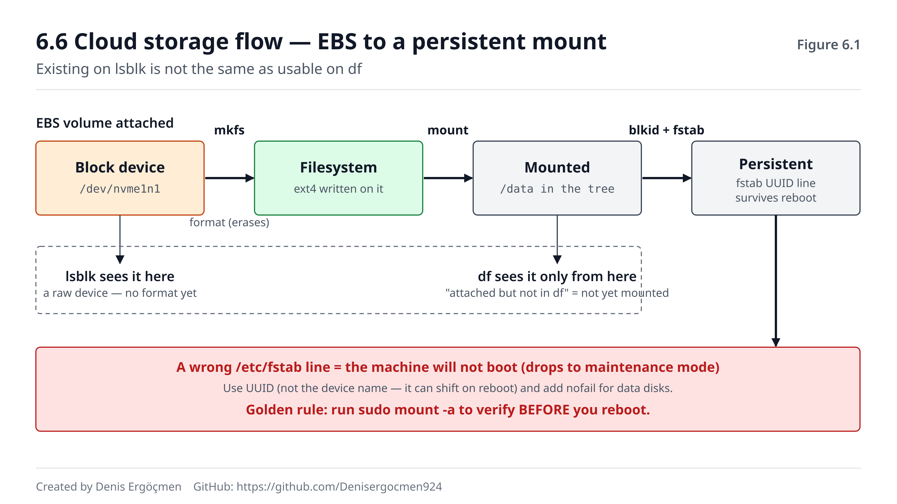

# Phase 6 — Storage and Filesystems: The Persistent Layer

> **Navigation:** [◀ Phase 5 — Boot, Init and systemd](Phase_5_Boot_Init_systemd.md) · **Phase 6** · [Checkpoint Quiz 3 ▶](Checkpoint_Quiz_3.md)

---

## Where we are coming from

Phase 5 gave you how a machine **comes to exist**: the boot chain, systemd, services coming up.
At the end of that phase we mentioned one failure class in passing: **a wrong line in `/etc/fstab`
drops the machine into emergency mode at boot.** Some of the "instance won't boot" rows in the 5.7 table
were really a **disk/mount** problem. This phase opens exactly that box: what a mount is, why `fstab`
can lock up boot, and how a disk goes from raw to a usable filesystem.

Two things from Phase 5 pay off directly here:

- **`.mount` units and systemd's dependency model** (5.3.1, 5.3.4). A mount is a unit to systemd; you'll
  see the disk side of the `Requires`/`After` race (Answer 5.3) here.
- **Where the boot chain breaks** (5.1, 5.7). An `fstab` error locks boot at the init stage — the OS
  hangs before it fully comes up, close to the "link before the OS" boundary we drew in 5.1.1.

Phase 4's disk-I/O intuition (`iostat`, `%util`, `await`) also gets a physical floor here: the thing
producing those metrics is the block device and filesystem you'll meet in this phase.

## The question of this phase

Phase 5 asked "how does a machine become runnable." This phase looks at the data:

> *"How does data sit on a disk and become reachable — and where, when this layer breaks, does the
> machine fail to boot or claim 'disk full'?"*

One of the most common operations in the cloud is attaching a new disk (EBS volume) to an instance:
attach → see → format → mount → make permanent. Every step of this five-step flow has a trap, and the
most dangerous is the last: if you write it wrong in `fstab`, the machine **won't boot again**. So this
phase teaches "how to do it" and "how it breaks" together.

By the end of this phase you'll be able to state, in order, the steps to permanently mount a new EBS
volume in a way that **won't lock up boot** (by UUID, not device name — knowing why). You'll also be able
to diagnose a failure that looks impossible at first glance ("disk isn't full but says 'no space left'" —
inode exhaustion).

---

## By the end of this phase

- You'll be able to explain the difference between a raw block device and the filesystem "formatted" onto
  it; device names like `/dev/sda` and `/dev/nvme0n1`; and how to read the device tree with `lsblk`
- You'll be able to describe partitions, `mkfs` (formatting), `mount`/`umount`, mount points, and the flow
  of a disk from raw to usable
- You'll be able to explain what `/etc/fstab` is, how it's read at boot, and **why a wrong line drops the
  machine into emergency mode**
- You'll be able to tell apart ext4 and xfs (the two common cloud filesystems) in broad strokes; and know
  what journaling is for (recovering from a half-finished write)
- You'll be able to explain what an inode is; how **inodes** can run out while disk space remains; and the
  difference between `df -h` and `df -i`
- You'll know, at the concept level, what LVM exists for (making disk growth flexible)
- **Cloud:** you'll be able to permanently mount an EBS volume via attach → `lsblk` → `mkfs` → `mount` →
  `fstab` (by UUID); grow a root volume with `growpart`+`resize2fs`; and explain why instance store is
  ephemeral (lost on stop)

---

## The phase map

| Section | Topic | Depth | Why it is here |
|---|---|---|---|
| 6.1 | Block device vs filesystem | `[mechanism]` | A disk's two layers: raw device and the format on it |
| 6.2 | Partition, format, mount and fstab | `[mechanism]` | **The heart of the phase** — and fstab's boot-locking trap |
| 6.3 | Filesystems: ext4, xfs, journaling | `[concept]` | Which format in the cloud, and why |
| 6.4 | Inode — the hidden trap | `[mechanism]` | The "space is free but disk is full" failure |
| 6.5 | LVM and growing | `[concept]` | The flexible way to grow a disk |
| 6.6 | Cloud storage flow | `[application]` | **The phase's output** — mount EBS permanently and safely |
| 6.7 | When this phase breaks | — | The signatures of storage failures |

> **How to study this phase:** This phase is a step more "dangerous" than Phase 5 because it plays with
> persistent data and boot. The observation commands are 🟢 (`lsblk`, `df -h`, `df -i`, `blkid`,
> `cat /etc/fstab` — read-only). But `mkfs` (format) **irreversibly wipes** a disk 🔴 — never run it on the
> wrong device. `mount` is temporary 🟡 (gone on reboot). Editing `/etc/fstab` is 🔴 because a wrong line
> **locks up boot** — every `fstab` edit must end with a verification (`mount -a` or `findmnt --verify`).
> **Do the `fstab`/`mkfs` experiments of this phase only on a throwaway test instance.** The most
> illuminating moment: attach an empty EBS volume, watch it appear in `lsblk`, then format and mount it and
> watch it appear in the tree with its mount point.

---
---

# 6.1 Block Device vs Filesystem

## 6.1.1 Two separate layers: the raw device and the format on it `[mechanism]`

In Phase 0 we said "everything is a file"; disks fall under that rule too, but as a special subtype: a
**block device**. The model we need to build now separates two layers most people never distinguish:

1. **Block device (the raw disk).** The disk itself, to the kernel, is just a long array of
   **numbered blocks** (fixed-size chunks, e.g. 512 bytes or 4 KB). There is no structure, no file, no
   directory on it yet — just raw storage going "block 0, block 1, block 2...". Linux represents it as a
   file under `/dev/`: `/dev/sda` (classic SATA/SCSI disk), `/dev/nvme0n1` (NVMe SSD — common in the
   cloud), `/dev/xvda` (Xen virtual disk).
2. **Filesystem (the format).** An organization scheme "formatted" (written) on top of those raw blocks:
   files, directories, permissions (Phase 2!), timestamps, and the ledgers that track which data lives in
   which block. The `mkfs` command builds exactly this scheme on top of the raw device. Without a
   filesystem you can't write files to a block device — you can only reach raw blocks.

Analogy: a block device is a **blank, unlined notebook** (just pages). The filesystem is the **lines,
table of contents, and page numbers** drawn into it — the order that lets you find where each piece of
information lives. The same blank notebook (block device) can be formatted with different schemes (ext4,
xfs); but each time it overwrites the last.

> **⚠️ Common misconception: "Disk = filesystem, they're the same thing."**
>
> They're not. A disk (block device) **existing** doesn't mean there's a filesystem on it. A newly
> attached EBS volume shows in `lsblk` (block device exists) but can't be mounted until `mkfs` is run
> (no filesystem). This is a very common cause of the "I attached the disk but can't mount it" failure:
> device present, format absent. Separating the two layers solves that failure at a glance.

## 6.1.2 Reading the device tree with `lsblk` `[application]`

The standard tool to see block devices and the structure on them is `lsblk` (*list block devices*). It
draws a tree: disks, the partitions under them, and where each partition is mounted.

> **🔧 See it on your machine** 🟢 — read the block device tree
>
> ```
> $ lsblk
> NAME        MAJ:MIN RM  SIZE RO TYPE MOUNTPOINTS
> nvme0n1     259:0    0   20G  0 disk
> ├─nvme0n1p1 259:1    0 19.9G  0 part /
> └─nvme0n1p15 259:2   0  99M  0 part /boot/efi
> nvme1n1     259:3    0   50G  0 disk
> ```
>
> `nvme0n1` = root disk (20G); the `nvme0n1p1` under it is a partition mounted at the `/` root.
> `nvme1n1` = a newly attached 50G EBS volume — note: `TYPE disk` but `MOUNTPOINTS` is **empty** and there's
> no partition under it. So the device exists, but it's neither formatted nor mounted yet. In 6.6 we'll
> make exactly this one usable.

Column meanings: `NAME` device/partition name; `SIZE` size; `TYPE` (disk = whole device, part =
partition, lvm = LVM volume); `MOUNTPOINTS` where it's attached (empty = not mounted). This one command
answers all of "which disks exist, which are in use, did a new one appear."

> **💡 Cloud connection — why an attached volume shows up immediately:** When you attach an EBS volume to
> an instance from the console, the kernel instantly sees it as a new block device (`/dev/nvme1n1`) and it
> appears in `lsblk` — because attach is the same as plugging in a physical disk (presented as NVMe on
> Nitro). But appearing doesn't mean usable: the next steps (format, mount) are your job. This is the
> answer to the "I attached the volume but it's not in `df`" surprise: `df` shows mounted filesystems;
> `lsblk` shows raw devices. A new volume appears in `lsblk` first, and enters `df` only after mount.

> **🤔 Think 6.1** — In `lsblk` output you see the `nvme1n1` device as `TYPE disk`, `SIZE 50G`,
> `MOUNTPOINTS` empty. A colleague says "the disk is broken, it doesn't show up in `df -h` at all." Using
> the two-layer model of 6.1.1 and the cloud box above, explain why the disk is **not** broken and why its
> absence from `df` is expected. Which two steps put it into `df`?
>
> *(Answer: at the end of the phase)*

---
---

# 6.2 Partition, Format, Mount and fstab

## 6.2.1 From raw disk to usable filesystem: four steps `[mechanism]`

Making a block device usable is a sequence. Each step adds a layer on top of the previous one:

1. **(Optional) Partition.** Splitting a disk into logical pieces. In the cloud you usually **don't**
   partition a single-purpose data disk — you make the whole device one filesystem — but the root disk is
   usually partitioned (`nvme0n1p1` = root, `p15` = EFI). Partition tools: `parted`, `fdisk`.
2. **Format (`mkfs`).** Writing a filesystem onto the raw device (or partition): `mkfs.ext4
   /dev/nvme1n1`. This step builds the file/directory ledger on the device — and **wipes everything**
   already there.
3. **Mount (`mount`).** Attaching the filesystem to a point in the directory tree (a **mount point**):
   `mount /dev/nvme1n1 /data`. From then on everything you write under `/data` goes to that disk. The
   mount point is an existing empty directory; mount makes that directory the disk's "door."
4. **Make permanent (`/etc/fstab`).** The `mount` command is temporary — gone on reboot. To make it
   permanent you write the mount as a line in `/etc/fstab`; then systemd auto-mounts it on every boot
   (6.2.3).

> **🔧 See it on your machine** 🟡🔴 — the four steps in order (on a test instance)
>
> ```
> $ sudo mkfs.ext4 /dev/nvme1n1          # 🔴 IRREVERSIBLE — formats the device
> $ sudo mkdir -p /data                  # 🟢 mount point (empty directory)
> $ sudo mount /dev/nvme1n1 /data        # 🟡 now attach it (gone on reboot)
> $ df -h /data
> Filesystem      Size  Used Avail Use% Mounted on
> /dev/nvme1n1     49G   24K   47G   1% /data
> ```
>
> **Undo:** `mkfs` cannot be undone (data on the disk is gone) — so **check the device name three times**
> (with `lsblk`). To undo the mount: `sudo umount /data`. Since we haven't written anything to `fstab`
> yet, a reboot already removes the mount; we make it permanent in 6.2.3.

## 6.2.2 The mount point concept: attaching to the directory tree `[concept]`

This is where people from Windows get stuck most: in Linux disks **don't get letters** (no C:, D:).
Instead each filesystem is attached to a **point** in a single unified directory tree (starting from
`/`). If `/data` is a mount point, the files under `/data` actually live on the `nvme1n1` disk; if
`/home` is mounted on another disk, files there live on that disk. To the user it all looks like one
seamless tree — they don't need to know which file is on which physical disk.

This has two important consequences:

- **A mount hides the directory beneath it.** If `/data` already had files and you mount a disk there,
  those old files don't "vanish" but become **invisible** (they return when the mount is removed). This
  is why an empty directory is chosen as a mount point.
- **The same disk can appear in different places**, and the mount hierarchy can nest (`/data` one disk,
  `/data/logs` another disk).

> **❓ Question that comes to mind: "I attached it with `mount` and it works. Why do I need to write it in
> `fstab` too — isn't that extra work?"**
>
> Because `mount`'s effect lives in **the kernel's current state** and is reset on reboot — just like
> Phase 5's `systemctl start` being lost on reboot (5.3.3). `fstab` is the "enable" of the mount: a record
> saying "auto-attach this on every boot." If you don't write it in `fstab`, after one reboot `/data`
> reverts to an empty directory and your app writing there suddenly starts writing to the root disk (or
> erroring). The "the disk was mounted, then gone after reboot" failure is exactly a mount without
> `fstab`.

## 6.2.3 `/etc/fstab`: permanent mounts and the boot-locking trap `[mechanism]`

`/etc/fstab` (*filesystem table*) is the table defining which filesystems mount where, and how, at boot.
Each line describes one mount and has six fields:

```
# <device/UUID>                             <mount point> <type>  <options>       <dump> <pass>
UUID=8f3b...c2                              /data         ext4    defaults          0      2
```

- **device/UUID:** which disk. **A UUID is used instead of the device name (`/dev/nvme1n1`)** — reason
  in a moment.
- **mount point:** where it attaches (`/data`).
- **type:** filesystem type (`ext4`, `xfs`).
- **options:** `defaults`, `noatime`, `nofail`... they tune mount behavior.
- **dump/pass:** backup and boot-time `fsck` (filesystem check) order; usually `0 2` (`0 1` for root).

**Why UUID, not the device name?** Because device names (`/dev/nvme1n1`, `/dev/nvme0n1`) are **not
stable**: if you attach a second disk to an instance, or attach disks in a different order, the names the
kernel assigns can shift — yesterday's `nvme1n1` can be today's `nvme2n1`. If you wrote a device name in
`fstab` and the name shifted, systemd can't find that name at boot, the mount fails, and (depending on
options) the machine drops into **emergency mode**. A UUID (*Universally Unique Identifier*) is an identity
written into the filesystem itself, unique to that disk and **unchanging** — whatever device name the disk
gets, the UUID stays the same. You learn it with `blkid`.

> **🔧 See it on your machine** 🔴 — set up the permanent mount safely
>
> ```
> $ sudo blkid /dev/nvme1n1
> /dev/nvme1n1: UUID="8f3b-...-c2" TYPE="ext4"
> # add to /etc/fstab:
> UUID=8f3b-...-c2  /data  ext4  defaults,nofail  0  2
> $ sudo mount -a          # try ALL fstab lines — the ERROR-FREE boot verification
> $ findmnt --verify       # check fstab for syntax/consistency
> ```
>
> **Undo:** after adding a line to `fstab`, **never reboot without verifying.** `sudo mount -a` tries all
> fstab lines; if it errors, the line is wrong and **if you reboot without fixing it the machine won't
> boot.** To undo the line: delete the line you added from `fstab` and `sudo umount /data`. Tip: the
> `nofail` option lets boot continue instead of stopping if that disk isn't found — a lifesaver for data
> disks in the cloud.

> **🤔 Think 6.2** — An engineer added a new data disk to `fstab` as `/dev/nvme1n1  /data  ext4  defaults
> 0 2` and rebooted without trying `mount -a`. The machine no longer accepts SSH, and the console says
> "Cannot open access to console, the root account is locked... Give root password for maintenance."
> Combining 6.2.3 (UUID vs device name, `nofail`) and 5.1 (the boot chain): (a) what most likely
> happened, (b) which two separate choices on that line would have prevented this disaster?
>
> *(Answer: at the end of the phase)*

---
---

# 6.3 Filesystems: ext4, xfs and Journaling

## 6.3.1 Two common cloud formats: ext4 and xfs `[concept]`

When you run `mkfs` you pick a filesystem **type**. There are dozens in the Linux world, but in the cloud
you practically meet two:

- **ext4** — Linux's long-standing standard, the "safe default" filesystem. Mature, very well tested, runs
  everywhere. Ubuntu's root disk is usually ext4. It has broad tooling support, including shrinking.
- **xfs** — a high-performance filesystem designed for large files and high parallel I/O. It's the default
  on Amazon Linux and RHEL/CentOS root disks. Often chosen for large data disks, databases, and
  many-core write loads. One important constraint: xfs **can be grown but not shrunk** (no shrink).

The practical rule for this phase: unless you have a specific reason to override a distro's default
(Ubuntu→ext4, Amazon Linux→xfs), use it. Both feel like "a filesystem" in daily use; the difference shows
at the edges of load and in management tooling. The goal here isn't to compare them deeply, but to know
whether to write `ext4` or `xfs` in `fstab` and to recognize the `mkfs.xfs`/`mkfs.ext4` distinction.

> **⚠️ Common misconception: "The filesystem type is just a preference; I pick what I want when mounting."**
>
> No — the type is **written to the disk during `mkfs`** and is a permanent property of that disk. If you
> try to mount a disk formatted with `mkfs.xfs` as `ext4` in `fstab`, the mount fails. The type field in
> `fstab` must match the real format on the disk; `blkid` tells you a disk's real `TYPE`. The only way to
> change the type is to reformat (which wipes everything).

## 6.3.2 Journaling: recovering from a half-finished write `[concept]`

Both ext4 and xfs are **journaling** filesystems. The problem: writing a file is actually several separate
disk operations (write the data, update the ledger, update the free-block list...). If the power goes out
or the instance crashes right in the middle of these, the filesystem is left **inconsistent**: the ledger
says one thing, the actual blocks another. On old non-journaling filesystems this meant a full `fsck` scan
lasting hours at boot, and sometimes data loss.

Journaling solves this like so: before making the actual change, the filesystem writes what it's about to
do into a small "journal" **first**. If a write is interrupted midway, at boot the filesystem looks at the
journal and either completes or rolls back the operation — quickly returning to a **consistent** state.
This is the mechanism behind the experience of "the instance rebooted unexpectedly but the filesystem came
up intact."

> **💡 Cloud connection — why journaling matters even more in the cloud:** Cloud instances can stop/restart
> outside your control: a spot instance is reclaimed, an underlying hardware failure triggers a
> "stop/start," or you force-reboot by mistake. These sudden interruptions are exactly the scenario
> journaling protects. That's why nearly all modern filesystems in the cloud are journaling — and why an
> instance usually comes back without data loss after an unexpected interruption. Still, journaling does
> **not** guarantee **application-level** consistency (a half-written app file can still be corrupt); it
> only protects the filesystem's own structure.

> **🤔 Think 6.3** — A teammate formatted a new data disk with `mkfs.xfs`, but wrote the type in `fstab` as
> `ext4` "because our Ubuntu root disk is ext4." (a) What happens when you run `sudo mount -a`, and why
> (6.3.1)? (b) Which command shows the disk's real type, and is the fix to reformat or to edit `fstab`?
> (c) Months later the team wants to shrink this volume to save cost. What does 6.3.1 say about xfs, and
> what is the practical alternative?
>
> *(Answer: at the end of the phase)*

---
---

# 6.4 Inode — The Hidden Trap

## 6.4.1 What an inode is: a file's identity card `[mechanism]`

In Phase 2 you learned permissions, ownership, timestamps. Now the question: **where** does the filesystem
keep all this information? Answer: in the **inode**. For every file (and every directory) the filesystem
keeps an inode — that file's **metadata identity card**:

- the file's size, owner (UID), group (GID), permission bits (Phase 2!)
- timestamps (creation, modification, access)
- and most importantly: the list of **which disk blocks** the file's **data** lives in

Note: the inode does **not** hold the file's **name**. The name lives in the directory (which is also a
file) as a "name → inode number" mapping. This is why a file can have multiple names (hard links):
different names pointing to the same inode. `ls -i` shows each file's inode number.

The critical point: when a filesystem is formatted (`mkfs`), a **fixed number of inodes** is allocated. So
a disk has two separate "budgets":

1. **Data blocks** (space for actual file content) — what `df -h` shows.
2. **Inodes** (space for one identity card per file) — what `df -i` shows.

These two budgets are **independent** and can run out separately.

## 6.4.2 "Space is free but disk is full": inode exhaustion `[mechanism]`

From here comes a very confusing failure. Say a directory fills with millions of **very small** files
(typical culprits: a cache directory, a mail queue, or a badly configured app that writes each request as
a separate file). Each file spends one inode but almost no data block. Result: the **inode budget runs out
while the data budget is still half empty.** The system can no longer create new files and returns "No
space left on device" — but `df -h` shows the disk is 50% free. This is that impossible-looking failure.

> **🔧 See it on your machine** 🟢 — read the two budgets separately
>
> ```
> $ df -h /data                     # DATA-block budget
> Filesystem      Size  Used Avail Use% Mounted on
> /dev/nvme1n1     49G   22G   25G  48% /data
> $ df -i /data                     # INODE budget
> Filesystem      Inodes   IUsed  IFree IUse% Mounted on
> /dev/nvme1n1  3276800  3276800      0  100% /data
> ```
>
> `df -h` says 48% used (plenty of space). But `df -i` shows inodes are **100%** used — no new file can be
> created. The diagnosis is here: if you get a "No space" error while `df -h` looks free, **always check
> `df -i`.** The fix: delete unnecessary small files (frees inodes); the durable fix is usually to correct
> why the app produces millions of files.

> **❓ Question that comes to mind: "Then if I allocate lots of inodes during `mkfs`, does this problem
> never happen?"**
>
> It's tunable (`mkfs.ext4 -N <count>` or `-i <bytes/inode>`), but not free: every inode takes disk space,
> so raising the inode count a lot reduces the space usable for data. The defaults (usually one inode per
> ~16 KB of data) are balanced for typical workloads. The "millions of small files" scenario is the
> exception — and even there the real fix is usually to fix the design (consolidate files, use a database
> or object store), not to inflate the inode count. xfs is more flexible here because it allocates inodes
> dynamically, but it isn't infinite either.

> **🤔 Think 6.4** — An application server is rejecting requests with "cannot write file: No space left on
> device." The panicking team is getting ready to grow the disk (6.5/6.6). `df -h /var` says `Use% 61%`.
> Using 6.4.2: (a) why can you say growing the disk most likely **won't** fix this, (b) which single
> command would you run to confirm the diagnosis, (c) if the output is what you expect, what is the real
> root-cause class?
>
> *(Answer: at the end of the phase)*

---
---

# 6.5 LVM and Growing

## 6.5.1 Why LVM exists: separating the disk from the filesystem `[concept]`

In the model so far a filesystem lived directly on top of one block device (or partition). That has a
drawback: the filesystem is trapped at that single device's size. To grow the disk you'd either grow the
volume and extend the partition (possible but not flexible) or attach a second disk on a completely
separate mount point — you couldn't present the two as a single `/data`.

**LVM (Logical Volume Manager)** inserts a flexibility layer between the block device and the filesystem.
It works with three concepts:

1. **PV (Physical Volume):** the raw block devices you hand to LVM (`/dev/nvme1n1`, `/dev/nvme2n1`...).
2. **VG (Volume Group):** a single "pool" where one or more PVs merge. The pool's total size is the sum of
   the PVs.
3. **LV (Logical Volume):** the virtual disk you carve from the pool, put a filesystem on, and mount.

The key benefit: you can **grow an LV online** as long as there's room in the pool (or by adding a new disk
to the pool) — without unmounting, often without interruption. If `/data` fills up, you attach a new EBS
volume, make it a PV, add it to the VG, grow the LV, and expand the filesystem — all while it's running.
That wasn't this flexible in the direct-device model.

> **⚠️ Common misconception: "LVM grows the disk / adds performance."**
>
> LVM doesn't magically add space and generally isn't about performance. It's just a layer that lets you
> flexibly **combine and split** existing block devices. If there's no free room in the pool (VG), to grow
> an LV you first have to add a real disk (PV) to the pool — LVM doesn't supply that disk, you (or, in the
> cloud, EBS) do. Its benefit isn't **increasing** capacity but making capacity **flexible to manage.**

For this phase, knowing LVM at the concept level is enough: "a layer that separates the disk from the
filesystem and makes online growth easy." In the cloud many distros put the root disk on LVM (especially
the RHEL family), so don't be surprised to see `lvm`-type rows in `lsblk` output.

> **🤔 Think 6.5** — A `/data` filesystem sits on an LV in a VG built from a single 100 GB disk (PV), and
> it is 95% full. A colleague says: "LVM makes growing easy — just grow the LV." (a) Why might that fail
> right now (6.5.1)? (b) What must you do first in the cloud, and in what order do the LVM concepts come?
> (c) After the LV grows, `df -h /data` still shows the old size. Which layer is left, and which rule from
> 6.6.2 does this repeat?
>
> *(Answer: at the end of the phase)*

---
---

# 6.6 Cloud Storage Flow — The Phase's Output

## 6.6.1 Mounting EBS permanently and safely: end to end `[application]`

Now we combine all the pieces of this phase in the most common storage operation in the cloud: attaching a
new persistent disk (EBS volume) to an instance and permanently mounting it without locking up boot. The
sequence is exactly the cloud version of the four steps in 6.2.1:

> **🔧 See it on your machine** 🟢🔴 — EBS attach → permanent mount (on a test instance)
>
> ```
> # 0) Create + attach the EBS volume to the instance from the console (AWS side)
> $ lsblk                                # 🟢 1) did the new device appear?
> nvme1n1  259:3  0  50G  0 disk         #    → present, mount point empty, no format
> $ sudo mkfs.ext4 /dev/nvme1n1          # 🔴 2) format (IRREVERSIBLE)
> $ sudo mkdir -p /data                  # 🟢 3) mount point
> $ sudo mount /dev/nvme1n1 /data        # 🟡    now temporary mount, test it
> $ sudo blkid /dev/nvme1n1              # 🟢 4) learn the UUID
> /dev/nvme1n1: UUID="8f3b-...-c2" TYPE="ext4"
> #    add to /etc/fstab:  UUID=8f3b-...-c2  /data  ext4  defaults,nofail  0  2
> $ sudo mount -a                        # 🟢    VERIFY fstab (must not error)
> $ findmnt --verify                     # 🟢    extra consistency check
> ```
>
> **Undo:** the only irreversible step in this flow is `mkfs` — check the device name three times with
> `lsblk`. **Never reboot** without verifying the `fstab` line with `mount -a` (the 6.2.3 disaster). The
> `nofail` option here is deliberate: if the disk is ever missing, boot won't stop, only that mount is
> skipped. To undo the whole mount: delete the `fstab` line, `sudo umount /data`.



This short flow is the entirety of the "add a disk to the instance" task and is this phase's output.
Don't memorize it — know **why** each step is there: `lsblk` (is the block device present, 6.1), `mkfs`
(build the filesystem, 6.2/6.3), `mount` (attach to the tree, 6.2), `blkid`+UUID+`nofail` (don't lock up
boot, 6.2.3), `mount -a` (verify).

## 6.6.2 Growing the root disk: growpart + resize2fs `[application]`

The second very common operation: your existing root disk is filling and you want to grow it. In the cloud
this is a two-layer job, and the order matters:

1. **Cloud side:** you increase the EBS volume's size from the console (e.g. 20G → 40G). But this alone
   doesn't grow the filesystem — inside, the instance still sees the old size. The block device grew, the
   layers on top didn't.
2. **OS side, two steps:**
   - `growpart` — extends the partition to the disk's new boundary (`sudo growpart /dev/nvme0n1 1`).
   - `resize2fs` (ext4) or `xfs_growfs` (xfs) — expands the filesystem to the partition's new boundary
     (`sudo resize2fs /dev/nvme0n1p1`).

The order is the same as the layer model in 6.1: first the block device (EBS) grows, then the partition
(`growpart`), then the filesystem (`resize2fs`). You can't grow an upper layer without growing the one
below it.

> **💡 Cloud connection — why instance store is not persistent (ephemeral):** EBS is persistent: even if you
> stop/start the instance, the data stays on the disk as long as you don't terminate it. But some instance
> types also offer **instance store** (local NVMe) — these disks are physically attached to the host
> machine and are **very fast**, but when the instance stops/terminates (or the host changes) **everything
> on them is wiped.** They look the same as EBS in `lsblk`; knowing the difference is vital. Rule:
> persistent data (database, user files) → EBS; only temporary/reproducible data (cache, scratch, temp
> builds) → instance store. This is the answer to the "I stop/started the instance and everything in `/mnt`
> is gone" failure: that was most likely ephemeral instance store.

> **🤔 Think 6.6** — You increased the EBS root volume from 20G to 60G in the console. You waited a few
> minutes but `df -h /` still shows `20G`, while `lsblk` shows the `nvme0n1` disk as `60G` and its
> `nvme0n1p1` partition still as `19.9G`. Using the layer model of 6.6.2: (a) which layer(s) grew and which
> didn't, (b) which two commands would you run and in which order, (c) when does `df -h` show `60G`?
>
> *(Answer: at the end of the phase)*

---
---

# 6.7 When This Phase Breaks — Storage Failure Signatures

Because this phase's commands play with persistent data and boot, its failures are among the most
expensive. The table below takes a storage problem from its **symptom** to the section it belongs to:

| Symptom | Likely cause | Where to look | Related section |
|---|---|---|---|
| Instance won't boot, console asks "maintenance / root password" | Bad line in `fstab` (wrong UUID/device, no `nofail`) | Console output; `fstab` in rescue mode | 6.2.3 |
| "No space left on device" but `df -h` shows free | Inode exhaustion (many small files) | `df -i` | 6.4.2 |
| The disk I attached isn't in `df` | Device exists but not formatted/mounted | `lsblk` (device present, mount empty) | 6.1.2, 6.2.1 |
| I mount it but get "unknown filesystem type" | The type in `fstab` doesn't match the real format | `blkid` (real TYPE) | 6.3.1 |
| Mount disappeared after reboot | `mount` done but not written to `fstab` | `cat /etc/fstab` | 6.2.2 |
| I grew the EBS, `df` still shows the old size | Partition/filesystem not grown | `lsblk` (layer sizes) | 6.6.2 |
| Data in a directory gone after stop/start | That disk was ephemeral instance store | Instance type; EBS or instance store | 6.6.2 |

> **The lesson from this table:** Almost all storage failures come from **layer confusion**: is the block
> device missing, the filesystem missing, the mount missing, or the persistence (`fstab`) missing? When you
> meet a symptom, before panicking and saying "the disk is broken," walk the layer model of 6.1 top to
> bottom: `lsblk` (device present?) → `blkid` (format present?) → `df`/`mount` (attached?) → `cat
> /etc/fstab` (persistent?). Six of seven failures are diagnosed with these four commands. And the most
> expensive one — the `fstab`-boot lock — never happens if you have one habit: **after every `fstab` edit,
> before rebooting, run `sudo mount -a`.**

---
---

# Phase 6 — Answers to the think questions

## Answer 6.1 — The disk is "not broken," just raw

`df` not showing the disk is entirely expected, because `df` lists **mounted filesystems**, not raw block
devices. The `lsblk` output already proves the disk is healthy: the device shows (`TYPE disk`, `SIZE 50G`),
so the kernel recognizes it and the attach succeeded. The reason it's absent is the two-layer model of
6.1.1: the device (block layer) exists, but there's no **filesystem** on it yet and it's **mounted**
nowhere. `df` only knows the second layer. Two steps put it into `df`: (1) format
(`mkfs.ext4 /dev/nvme1n1`) — build a filesystem on it; (2) mount (`mount /dev/nvme1n1 /data`) — attach it
to the directory tree. After that `df` shows it.
**Related section:** 6.1.1-6.1.2 · **Continues in:** 6.6.1 the full flow.

## Answer 6.2 — `fstab` was written by device name and the name shifted; no `nofail` either

(a) Almost certainly this happened: `fstab` was written by **device name** (`/dev/nvme1n1`). On reboot the
names the kernel gives disks shifted (perhaps another volume was also attached), so at boot `/dev/nvme1n1`
either didn't exist or pointed to a different disk. Since there was no `nofail` option, when the mount
failed systemd halted boot and dropped into emergency mode — SSH never started because the system
never reached the multi-user target (5.3.4). (b) Two separate choices would have prevented this disaster:
**(1) use a UUID instead of the device name** — the UUID is unique to the disk and unchanging, so name
shifts don't affect it (6.2.3); **(2) add the `nofail` option** — so even if the disk isn't found for some
reason, boot doesn't stop, only that mount is skipped and the machine stays reachable. Together they're the
standard cloud practice.
**Related section:** 6.2.3 · **Continues in:** the `mount -a` verify habit in 6.6.1.

## Answer 6.3 — The type is written at `mkfs`; a wrong `fstab` type fails the mount; xfs cannot shrink

(a) The mount **fails** with a wrong-filesystem-type error: the type is **written to the disk at
`mkfs`** and is a permanent property of it (6.3.1), and the type field in `fstab` must match. Left as
is, the same line would fail at boot too — and without `nofail` that can lock boot (6.2.3). (b) `blkid`
shows the disk's real `TYPE` — here `xfs`. The fix is to **edit the `fstab` line to `xfs`**; nothing is
wrong with the disk, and reformatting would wipe its data. Then verify with `sudo mount -a` (6.6.1). (c)
xfs **can be grown but not shrunk** (6.3.1). The practical route: create a new, smaller volume, copy the
data over, switch the mount, and retire the old one — or, if shrinking will be a recurring need, choose
ext4 at `mkfs` time.
**Related section:** 6.3.1 · **Continues in:** 6.2.3 (the `fstab` boot trap).

## Answer 6.4 — Growing the disk targets the wrong layer; the culprit is inodes

(a) Growing the disk most likely won't fix this because `df -h /var` says **61%** — so the **data-block**
budget isn't full, there's plenty of space. The only thing that squares with a "No space" error is the
second, hidden budget: inodes (6.4.1). Growing the disk increases the data-block budget but doesn't fix
inode exhaustion (in classic ext4 the inode count is fixed at `mkfs`). (b) The single command that confirms
it: `df -i /var` — it shows inode usage. (c) Expectation: `IUse%` comes out **100%**. Then the real
root-cause class is **inode exhaustion**: a large number of very small files have piled up somewhere
(cache, queue, log fragments). The fix isn't to grow the disk but to clean up those small files and fix the
behavior producing them.
**Related section:** 6.4.2 · **Continues in:** 6.7 failure table (row 2).

## Answer 6.5 — LVM does not supply space; add a PV first, then grow the LV and the filesystem

(a) LVM doesn't create space, it only manages what the pool already has: if the VG has no free room,
there is nothing to carve the extra LV size from (6.5.1, the misconception box). (b) First **attach a
new EBS volume** — the real disk that LVM cannot supply — then make it a **PV**, **add it to the VG**,
and only then **grow the LV**: bottom-up, PV → VG → LV. (c) The filesystem on top of the LV is a
separate layer and does not grow by itself, so `df -h /data` is unchanged until you expand it
(`resize2fs` for ext4, `xfs_growfs` for xfs). It is the same rule as 6.6.2: the lower layer grows, the
upper ones don't follow automatically.
**Related section:** 6.5.1 · **Continues in:** 6.6.2 (growing the root disk).

## Answer 6.6 — Only the bottom layer (EBS) grew; partition and filesystem lagged

(a) `lsblk` gives the answer: `nvme0n1` (block device) is `60G` — so the **EBS layer grew**. But
`nvme0n1p1` (partition) is still `19.9G` and the filesystem is squeezed inside it — so the **partition and
filesystem layers didn't grow**. The rule of 6.6.2: the lower layer grows, the upper ones don't grow
automatically. (b) Two commands, in this order: first `sudo growpart /dev/nvme0n1 1` (extend the partition
to the disk's new boundary), then `sudo resize2fs /dev/nvme0n1p1` (expand the ext4 filesystem to the
partition's new boundary; if it were xfs, `xfs_growfs`). (c) `df -h /` shows `60G` only after `resize2fs`
finishes — because `df` reads the topmost layer (the filesystem), and that layer is the last to grow.
**Related section:** 6.6.2 · **Continues in:** 6.7 failure table (row 6).

---
---

# Phase 6 — Frequently asked questions

**Q1 — Should I partition a data disk, or can I format the whole device directly?** In the cloud, for a
single-purpose data disk it's common and perfectly valid to format the whole device directly with no
partition (`mkfs.ext4 /dev/nvme1n1`) — one fewer layer, one fewer trap. A partition is needed when you must
split one disk into multiple parts or for a boot/EFI layout. The root disk is almost always partitioned
because EFI and boot want separate partitions.

**Q2 — What exactly is the difference between `mount` and `fstab`?** `mount` attaches **now, once** and is
lost on reboot (temporary, like Phase 5's `systemctl start`). `fstab` attaches **automatically on every
boot** (permanent, like `systemctl enable`). The two are independent: writing to `fstab` doesn't mount the
disk immediately (`mount -a` is needed); doing a `mount` doesn't make it permanent. A correct permanent
setup includes both.

**Q3 — Should I always add the `nofail` option?** For data disks, yes, a strong practice: if the disk is
ever missing (wrong attach, deleted volume) you want boot to skip that mount, not to halt. For the root disk
`nofail` is **not** added — without root there's no system to run anyway, and there failure should be
visible.

**Q4 — Should I choose ext4 or xfs?** Unless you have a specific reason, use the distro default
(Ubuntu→ext4, Amazon Linux→xfs). Very large files / high parallel writes → xfs has a slight edge. If you
might **shrink** the disk later → ext4 (xfs can't shrink). In daily work the difference is often
unnoticeable.

**Q5 — `df -h` says the disk is full but I can't find a big file, what should I do?** Two classic causes:
(1) a **deleted but still-open file** — a process keeps holding a large log while the file was deleted; the
space doesn't return until the process dies (`lsof | grep deleted`). (2) files **hidden under a mount
point** — data written to a directory before something was mounted over it. Also rule out inodes with
`df -i`; that's the scenario of Phase 6.4.

**Q6 — How do I safely remove a disk (detach)?** The order reverses: first `sudo umount /data` (detach the
filesystem from the tree), **then** detach from the console. Detaching while mounted risks data loss and
hung I/O. If `umount` says "target is busy," a process is still using that directory (find it with
`lsof /data`). If it was a permanent mount, also delete the `fstab` line, or the next boot will look for it.

**Q7 — Should I use LVM in the cloud?** Not required. In the simple "one instance, one or two data disks"
scenario the direct-device model is less complex. LVM pays off in more advanced cases where you make
multiple disks one logical unit or want the flexibility of uninterrupted online growth. Many distros still
put the root disk on LVM; that's why you'll see `lvm` rows in `lsblk`.

---
---

# Phase 6 — Test yourself

Write your answers on paper, then compare with the answer key. Target: 14+ out of 18.

## Section A — Definition and mechanism (do you know the concept)

1. Distinguish a block device from a filesystem in one sentence. Which one does `mkfs` create?
2. `lsblk` and `df -h` both seem to show "disks." What's the fundamental difference — which one lists the
   raw device, which the mounted filesystem?
3. Name, in order, the four steps to make a disk usable.
4. What is a mount point? What does "a mount hides the directory beneath it" mean?
5. Why is a UUID used in `/etc/fstab` instead of the device name? Where do you learn the UUID?
6. What problem does journaling solve? Why is it especially important in the cloud?
7. What is an inode, and what does it **not** hold? (Hint: where does the file's name live?)
8. What do `df -h` and `df -i` each measure separately?

## Section B — Apply and diagnose (can you use it in a scenario)

9. Write the commands, in the correct order, to permanently mount a newly attached EBS volume (from `lsblk`
   to `mount -a`). Put a 🟢/🟡/🔴 risk next to each step.
10. An instance won't boot after a reboot; the console asks "maintenance mode / root password." Which file
    should you suspect first and why?
11. You get "No space left on device" but `df -h` shows the disk is 55% free. Which single command do you
    run and what do you expect to see?
12. You grew the EBS volume from 30G to 80G but `df -h /` still shows 30G. Which two commands do you run and
    in which order?
13. You added a new line to `fstab`. Before rebooting, with which single command do you verify it, and why
    is this step non-negotiable?
14. Data in a directory disappeared after you stop/started the instance. What's the likely cause and what
    kind of storage was that disk?

## Section C — Reasoning and connection (can you explain the why)

15. Why is `nofail` a good idea on a data disk but a **bad** idea on the root disk?
16. How are Phase 5's `.mount` units and the `systemctl enable`≠`start` distinction two faces of the same
    concept as this phase's `fstab`≠`mount` distinction?
17. A colleague says "let's grow the disk to solve the inode problem." Explain in one sentence why that
    targets the wrong layer.
18. Why do we call `mkfs` the most dangerous command of this phase? What's the one golden rule for using it
    safely?

---

## Answer key

1. Block device = an array of numbered raw blocks (no structure); filesystem = the file/directory
   organization written on top. `mkfs` creates the **filesystem** (6.1.1). — 2. `lsblk` lists the **raw
   block devices** and the tree (even without a mount); `df -h` lists only **mounted filesystems** and their
   usage (6.1.2). — 3. Partition (optional) → format (`mkfs`) → mount → make permanent (`fstab`) (6.2.1). —
   4. A mount point is the directory where a filesystem attaches to the tree; when a disk is mounted there,
   files that already existed under it become invisible (returning when unmounted) (6.2.2). — 5. Device
   names can change during reboot/attach; a UUID is unique to the disk and stable, preventing mounting the
   wrong disk / boot lockups. Learned with `blkid` (6.2.3). — 6. It quickly returns the filesystem to a
   **consistent** state after a half-finished write; critical in the cloud because sudden stop/spot
   reclaim/host failure is common (6.3.2). — 7. An inode is a file's metadata identity card (size, owner,
   permissions, times, list of data blocks); it does **not** hold the file's **name** — the name lives in
   the directory as a "name→inode" mapping (6.4.1). — 8. `df -h` measures the **data-block** budget; `df -i`
   the **inode** budget, separately; the two are independent (6.4.1-6.4.2).

9. `lsblk` 🟢 → `mkfs.ext4 /dev/nvme1n1` 🔴 → `mkdir /data` 🟢 → `mount /dev/nvme1n1 /data` 🟡 → `blkid` 🟢 →
   add UUID line to `fstab` 🔴 → `mount -a` 🟢 (6.6.1). — 10. `/etc/fstab` — a bad line (wrong device/UUID,
   no `nofail`) makes the mount fail at boot and drops into maintenance mode (6.2.3). — 11. `df -i` — you
   expect inode usage to be **100%** (inode exhaustion) (6.4.2). — 12. `sudo growpart /dev/nvme0n1 1` then
   `sudo resize2fs /dev/nvme0n1p1` (6.6.2). — 13. `sudo mount -a` (or `findmnt --verify`); because an
   unverified bad `fstab` line locks up the next boot and makes the machine unreachable (6.2.3, 6.6.1). —
   14. That disk was most likely **ephemeral instance store**; its contents are wiped on stop/start —
   persistent data needs EBS (6.6.2).

15. `nofail` on a data disk: if the disk isn't found, don't halt boot, just skip that mount (the machine
    stays reachable). On the root disk `nofail` is bad because without root there's no running system;
    failure should be visible, not hidden (6.2.3, Q3). — 16. Both are the distinction between "temporary
    running state" and "permanent config re-established at boot": `start`/`mount` act now and are lost on
    reboot; `enable`/`fstab` re-establish automatically on every boot (5.3.3, 6.2.2). — 17. Growing the disk
    increases the **data-block** budget; inode exhaustion is a separate budget (`df -i`), so growing won't
    fix it — the fix is to clean up the small files (6.4.2). — 18. `mkfs` **irreversibly** formats a disk
    (wipes everything present); the golden rule: before running it, verify the device name three times with
    `lsblk`, never write it by guessing (6.2.1, 6.6.1).

## Scoring

| Correct | What it means |
|---|---|
| 16-18 | You've solidly grasped storage layers and the `fstab` trap. Ready for Checkpoint Quiz 3. |
| 13-15 | Good. Reread the sections of the questions you missed (especially 6.2.3 and 6.4). |
| 9-12 | Foundation present but fragile. Rework 6.2 (mount/fstab) and 6.6 (cloud flow). |
| 0-8 | Walk the phase again; run `lsblk`/`df -h`/`df -i`/`blkid` yourself on a test disk. |

Missed question → section to return to:

| Question | Section |
|---|---|
| 1, 2 | 6.1 Block device vs filesystem |
| 3, 4, 9 | 6.2.1-6.2.2 Steps and mount point |
| 5, 10, 13 | 6.2.3 fstab and UUID |
| 6 | 6.3.2 Journaling |
| 7, 8, 11, 17 | 6.4 Inode |
| 12, 14, 18 | 6.6 Cloud flow and growing |
| 15, 16 | 6.2.3 + the Phase 5 connection |

---
---

# Phase 6 — Closing and Bridge to Phase 7

## What you carry from this phase

Phase 6 gave you the **persistent layer**. You now see a disk layer by layer: raw block device (`lsblk`) →
filesystem (`mkfs`, `blkid`) → mount (`mount`, mount point) → persistence (`/etc/fstab`, UUID). This model
lets you separate three failures at a glance: is the device missing, the format missing, the mount missing,
or the persistence missing. You also learned the habit that prevents the most expensive failure — `fstab`
locking up boot: **after every `fstab` edit, `mount -a`.** And you can diagnose the impossible-looking inode
failure ("space is free but disk is full") with `df -i`.

## Where Phase 7 connects

So far we've been inside a single machine: processes (Phase 3), memory (Phase 4), boot (Phase 5), disk
(Phase 6). Phase 7 moves to the machine **talking to the outside world**: the network. And storage and
network are two faces of the same "add something to an instance" story in the cloud — in Phase 6 you
attached and mounted a disk; in Phase 7 you'll meet a network interface, an IP, a port, and security rules.
The shared lesson of the two phases will be this: in the cloud a resource **existing** (disk attached /
interface up) and being **usable** (mounted / port listening and the security group allowing it) are
separate things — and most failures live in exactly that gap.

> **🤔 Phase output — ask yourself:** You've both attached a new EBS volume to an instance (Phase 6) and want
> to run a web service on it (Phase 7). In Phase 6 you saw the "disk exists but no mount → not in `df`"
> failure. Before moving to Phase 7, predict: if a service "is listening on a port" but can't be reached
> from outside, which **gap** from the disk example does it resemble — which layer between "existing" and
> "reachable" might be missing?
>
> **🧪 Lab 6 idea (on your own test instance):** (1) Create an EBS volume, attach it, watch it appear in
> `lsblk`. (2) Format it with `mkfs.ext4`, mount it to `/data`, see it in `df -h`. (3) Get the UUID with
> `blkid`, add it to `fstab` with `nofail`, and **verify** with `sudo mount -a`. (4) Deliberately write a
> **wrong** UUID to `fstab` without `nofail`, see how `mount -a` errors (but do NOT reboot) — then fix it.
> (5) Grow the volume from the console, watch `df -h` show the new size after `growpart`+`resize2fs`. These
> five steps gather the whole mechanism of this phase in your hands.

---

> **Navigation:** [◀ Phase 5 — Boot, Init and systemd](Phase_5_Boot_Init_systemd.md) · **Phase 6** · [Checkpoint Quiz 3 ▶](Checkpoint_Quiz_3.md)


