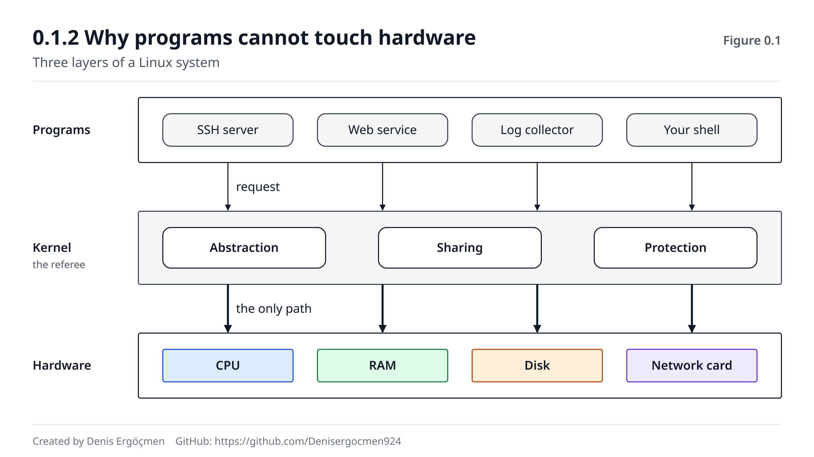
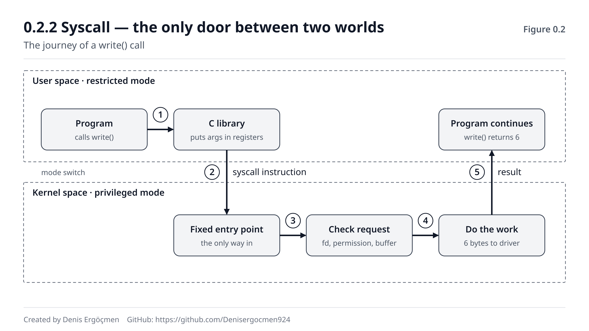
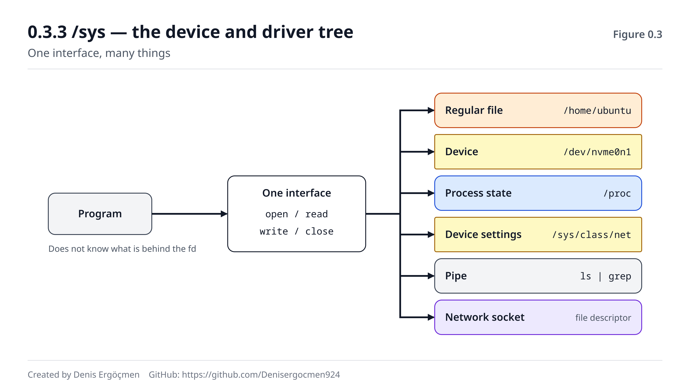

# Faz 0 — Zihinsel Model: Linux Neden ve Nasıl?

> **Navigasyon:** [◀ İçindekiler](README.md) · **Faz 0** · [Faz 1 — Shell ve Dosya Sistemi ▶](Faz_1_Shell_ve_Dosya_Sistemi.md)

---

## Bu faz neden var?

Bir cloud engineer'in günü şu tür cümlelerle doludur:

- "`kill -9` gönderdim, process hâlâ orada. Nasıl olur?"
- "Load average 38, ama CPU yüzde 3. Makine ne yapıyor?"
- "`free` komutu bu sayıları nereden buluyor?"
- "User-data script'im Amazon Linux'ta patladı, Ubuntu'da çalışıyordu."
- "SSH `Permission denied (publickey)` diyor ama key doğru."

Bunlar beş ayrı sorun gibi görünür. Ama beşinin de cevabı aynı üç fikre dayanır:

1. Makinede **iki ayrı dünya** vardır: çekirdek (kernel) ve kullanıcı alanı (user space).
2. Bu iki dünya arasında **tek bir kapı** vardır: syscall.
3. Linux çekirdeği dünyayı sana **dosya arayüzüyle** gösterir.

Bu faz bu üç fikri kurar. Komut öğretmez, **model** öğretir. Sonraki on iki fazın tamamı bu
modelin üstünde durur. Faz 3'te bir process'in neden "D" durumunda takıldığını, Faz 4'te
`free`'nin neden yanıltıcı göründüğünü, Faz 9'da root'un neden her şeyi yapamadığını
anlarken hep buraya döneceksin.

> **Dürüst uyarı:** Bu fazda az komut çalıştıracaksın ve "ben Linux kullanmayı öğrenmek
> istiyordum, neden çekirdek anlatılıyor?" hissi normaldir. Şöyle düşün: komut ezberleyen
> biri yeni bir hatayla karşılaşınca Google'a döner. Modeli kuran biri **hatanın nerede
> olabileceğini tahmin eder.** Cloud'da ikinci kişiye ihtiyaç var.

---

## Bu fazın sonunda

- Çekirdeğin üç temel işini (soyutlama, paylaştırma, koruma) sayabileceksin
- Bir uygulamanın diske neden **doğrudan** yazamadığını açıklayabileceksin
- "Bir uygulama diske yazmak istediğinde ne oluyor?" sorusunu syscall adımlarıyla
  anlatabileceksin
- `kill -9`'un neden bazen **işe yaramadığını** mekanizmasıyla söyleyebileceksin
- `/proc` ve `/sys`'in ne olduğunu ve `top`, `free` gibi araçların veriyi nereden
  aldığını bileceksin
- Ubuntu ile Amazon Linux arasındaki farkın **nerede** olduğunu (ve nerede olmadığını)
  bileceksin

---

## Faz haritası

| Bölüm | Konu | Derinlik | Neden burada |
|---|---|---|---|
| 0.1 | Bir işletim sisteminin işi | `[kavram]` | Çekirdeğin neden var olduğu |
| 0.2 | Kernel space vs user space, syscall | `[mekanizma]` | **Fazın kalbi** — tüm haritanın temeli |
| 0.3 | "Her şey dosyadır", `/proc`, `/sys` | `[kavram]` | Linux'u okumanın evrensel arayüzü |
| 0.4 | Distro manzarası ve AMI | `[kavram]` | Cloud'da her gün verilen ilk karar |
| 0.5 | Bu faz bozulunca | — | Arıza içgüdüsünün ilk tohumları |

---
---

# 0.1 Bir İşletim Sisteminin İşi

## 0.1.1 Kernel — donanımı yöneten ve paylaştıran katman `[kavram]`

Bir bilgisayarda aynı anda yüzlerce program çalışır: SSH sunucusu, bir web servisi, log
toplayıcı, monitoring agent'ı, senin shell'in. Ama makinede genellikle birkaç CPU çekirdeği,
tek bir RAM havuzu, bir veya iki disk ve bir ağ kartı vardır.

Birinin şu soruları cevaplaması gerekir:

- Şu an hangi program CPU'yu kullanacak? Ne kadar süre?
- RAM'in hangi parçası kime ait?
- İki program aynı anda aynı dosyaya yazarsa ne olacak?
- Ağ kartına bir paket geldi. Hangi programa gidecek?

Bu soruları cevaplayan programın adı **kernel**'dir (körnıl = çekirdek). Kernel, makine
açılınca ilk yüklenen ve makine kapanana kadar çalışan programdır. Diğer tüm programlar onun
izniyle ve onun aracılığıyla çalışır.

Çekirdeğin işi üç kelimeyle özetlenir:

| İş | Ne demek | Örnek |
|---|---|---|
| **Soyutlama** | Donanımın karmaşıklığını basit bir arayüzün arkasına saklamak | Program "dosyaya yaz" der; NVMe mi, SATA mı, EBS mi bilmez |
| **Paylaştırma** | Sınırlı kaynağı birçok programa bölmek | 4 CPU çekirdeği, 300 process arasında saniyede binlerce kez paylaştırılır |
| **Koruma** | Programları birbirinden ve donanımdan korumak | Bir programın hatası diğerinin belleğini bozamaz |

> **Özet:** Kernel bir **hakem**dir. Kaynakların sahibi odur; programlar sadece kullanım
> talep eder. Bu fazın geri kalanı bu hakemliğin **nasıl** yapıldığıdır.

**❓ Akla gelen soru: "Linux" bir işletim sistemi mi, yoksa sadece çekirdek mi?**

Teknik olarak **Linux sadece çekirdektir.** 1991'de Linus Torvalds'ın yazdığı şey bir
kernel'di. Senin "Linux" dediğin şeyin geri kalanı — `bash`, `ls`, `cp`, `grep`, C
kütüphanesi (glibc), paket yöneticisi, systemd — başka projelerden gelir. Bunların hepsini
bir araya getirip test eden, paketleyen ve yayınlayan kuruluşa **dağıtım (distro)** denir:
Ubuntu, Debian, Amazon Linux, RHEL. 0.4'te bu ayrıma döneceğiz.

Günlük dilde "Linux sunucusu" demek tamamen doğrudur. Ama bir hata ararken "bu çekirdeğin
mi, yoksa distro'nun bir parçasının mı sorunu?" diye sorabilmek işe yarar.

> **🔧 Makinende gör** 🟢 — Hangi çekirdeği çalıştırıyorsun?
>
> ```
> $ uname -r
> 6.8.0-1015-aws
> ```
>
> - `6.8.0` → çekirdeğin ana sürümü (Linux 6.8)
> - `1015` → Ubuntu'nun bu çekirdek için yaptığı paket revizyonu
> - `aws` → **AWS için ayarlanmış** çekirdek çeşidi. Masaüstü Ubuntu'da burada `generic`
>   görürsün.
>
> ```
> $ uname -a
> Linux ip-172-31-20-14 6.8.0-1015-aws #16-Ubuntu SMP Mon Aug 19 19:38:17 UTC 2024 x86_64 x86_64 x86_64 GNU/Linux
> ```
>
> Satırın sonundaki `x86_64` mimariyi söyler. Graviton (ARM) bir instance'ta `aarch64`
> görürsün. Senin çıktındaki sürüm ve tarih farklı olacaktır; önemli olan alanları
> okuyabilmek.

---

## 0.1.2 Programlar donanıma neden doğrudan erişemez? `[kavram]`

Bir düşünce deneyi yapalım. Çekirdek olmasaydı ve her program donanıma doğrudan
erişebilseydi ne olurdu?

**Senaryo 1 — İki program, bir disk.** Veritabanı diskin 5.000.000. sektörüne veri yazıyor.
Aynı anda log toplayıcı da "boş" sandığı aynı sektöre yazıyor. İkisinin de haberi yok.
Sonuç: bozuk veritabanı. Hata mesajı yok.

**Senaryo 2 — Meraklı program.** Bir web uygulamasında açık var. Saldırgan kod çalıştırıyor
ve RAM'i baştan sona okuyor. SSH sunucusunun bellekteki private key'ini buluyor.

**Senaryo 3 — Sonsuz döngü.** Bir programda hata var ve `while(true)` döngüsüne giriyor.
CPU'yu hiç bırakmıyor. Makinedeki diğer her şey — SSH dahil — donuyor. Sunucuya
bağlanıp programı öldüremiyorsun bile.

Üç senaryonun ortak çözümü: **programlar donanıma dokunamaz; sadece çekirdekten isteyebilir.**

- Disk sektörlerini çekirdek yönetir. Programlar sektör görmez, **dosya** görür.
- RAM'i çekirdek dağıtır. Her program sadece kendisine verilen belleği görür.
- CPU'yu çekirdek paylaştırır. Bir program ne kadar inatçı olursa olsun, çekirdek belirli
  aralıklarla CPU'yu ondan **zorla geri alır** (preemption — pri-emp-şın = zorla kesme).

> **⚠️ Yaygın yanılgı: "Çekirdek bir programdır, uygulamalar da program. O zaman çekirdek
> sadece daha önce başlayan bir program."**
>
> Hayır. Çekirdeği özel yapan başlama sırası değil, **CPU'nun ona verdiği yetkidir.**
> Çekirdek, işlemcinin ayrıcalıklı modunda çalışır; uygulamalar ise kısıtlı modda. Bu
> ayrım yazılımla değil **donanımla** zorlanır. 0.2'nin konusu tam olarak bu.


*Şekil 0.1 — Üç katman: en altta donanım, ortada tek başına donanıma dokunabilen kernel,
en üstte kernel'den iş isteyen programlar. Programlar arasındaki tek yol kernel'dir.*

> **🤔 Düşün 0.1**
> Bir EC2 instance'ı aslında fiziksel bir sunucunun üstünde çalışan sanal bir makinedir.
> Aynı fiziksel sunucuda başka müşterilerin instance'ları da var. Senin instance'ında
> `uname -r` bir çekirdek sürümü gösteriyor.
>
> Bu çekirdek **kimin** çekirdeği? Senin mi, fiziksel sunucunun mu? Ve bir Docker
> container'ının içinde `uname -r` çalıştırsaydın ne görürdün?
> *(Cevap: fazın sonunda)*

---
---

# 0.2 Kernel Space vs User Space

## 0.2.1 İki ayrıcalık dünyası `[mekanizma]`

Modern bir işlemci en az iki modda çalışabilir:

| Mod | Diğer adları | Kim çalışır | Ne yapabilir |
|---|---|---|---|
| **Ayrıcalıklı mod** | kernel mode, ring 0, supervisor mode | Sadece çekirdek | Her şey: donanıma komut gönderme, bellek haritasını değiştirme, kesmeleri açıp kapama |
| **Kısıtlı mod** | user mode, ring 3 | Tüm uygulamalar (root'unkiler dahil) | Sadece hesaplama ve kendi belleğine erişim |

Bu iki moda karşılık gelen iki bellek bölgesine **kernel space** (körnıl speys = çekirdek
alanı) ve **user space** (yuzır speys = kullanıcı alanı) denir.

Ayrımı zorlayan şey işlemcinin kendisidir. Kısıtlı moddaki bir program şunlardan birini
yapmaya çalışırsa işlemci komutu **çalıştırmaz** ve kontrolü hemen çekirdeğe verir:

1. **Ayrıcalıklı bir talimat çalıştırmak** — örneğin disk denetleyicisine doğrudan komut
   göndermek veya kesmeleri kapatmak.
2. **Kendisine ait olmayan bir bellek adresine dokunmak** — başka bir programın belleğine
   veya çekirdeğin belleğine.

Çekirdek bu durumda genellikle programı öldürür. Bunu hepimiz görmüşüzdür:

> **🔧 Makinende gör** 🟢 — Yasak bir adrese dokunmak
>
> Aşağıdaki komut, Python'a bellekteki **0 numaralı adresi** okumasını söyler. Bu adres
> hiçbir programa verilmez.
>
> ```
> $ python3 -c "import ctypes; ctypes.string_at(0)"
> Segmentation fault (core dumped)
> ```
>
> - Python yorumlayıcısı kısıtlı modda çalışıyordu.
> - 0 adresine erişmeye çalıştı. İşlemci bu erişimi durdurdu ve çekirdeğe haber verdi.
> - Çekirdek, process'e **SIGSEGV** (segmentasyon ihlali) sinyali gönderdi ve process
>   öldü.
> - Sistemin geri kalanı hiçbir şey hissetmedi. **Koruma tam olarak böyle görünür.**
>
> Bu komut sadece kendi başlattığı Python process'ini çökertir, sistemine zarar vermez.

Her process kendi **sanal adres uzayını** görür. Process A'nın `0x7ffd1000` adresi ile
process B'nin aynı adresi **farklı fiziksel RAM** parçalarıdır. Çekirdek bu eşlemeyi (sayfa
tablolarını) her process için ayrı tutar ve process'ler bu tabloyu değiştiremez. Bu yüzden
bir process başka birinin belleğini okuyamaz — adresini bilse bile. (Faz 4.1'de bu sanal
bellek modeline geri döneceğiz.)

> **⚠️ Yaygın yanılgı: "root kullanıcısı kernel mode'da çalışır."**
>
> **Yanlış — ve bu haritanın en önemli düzeltmelerinden biri.** Root olarak çalıştırdığın
> her program da **user space**'te, kısıtlı modda çalışır. Root'un farkı işlemci
> seviyesinde değil, **çekirdeğin izin kontrolleri** seviyesindedir: çekirdek bir istek
> aldığında "bu isteği yapan UID 0 mı?" diye bakar ve root'a daha çok "evet" der.
>
> Yani root bile donanıma doğrudan dokunmaz; sadece çekirdekten daha fazla şey isteyebilir.
> Yukarıdaki Python komutunu `sudo` ile çalıştırsan da **aynı segmentation fault**'u alırsın.
>
> Bu ayrım Faz 2 (izinler) ve Faz 9'da (capabilities, AppArmor) çok önemli olacak: root'un
> bile engellenebildiği durumlar tam olarak bu yüzden mümkündür.

---

## 0.2.2 Syscall — iki dünya arasındaki tek kapı `[mekanizma]`

Programlar donanıma dokunamıyorsa, bir dosyaya nasıl yazıyorlar? Ağdan nasıl paket
gönderiyorlar? Ekrana nasıl yazı basıyorlar?

Çekirdekten **isteyerek**. Bu isteğin adı **syscall**'dır (sis-kol = system call = kullanıcı
programının çekirdekten iş istemesi).

Linux'ta birkaç yüz syscall vardır ve her birinin bir numarası ve adı vardır. En sık
göreceklerin:

| Syscall | Ne ister |
|---|---|
| `openat` | Bir dosyayı aç, bana bir numara (file descriptor) ver |
| `read` / `write` | Bu numaralı dosyadan oku / bu numaralı dosyaya yaz |
| `close` | Bu dosyayla işim bitti |
| `mmap` | Bana bellek ver (veya bir dosyayı belleğe eşle) |
| `clone` / `execve` | Yeni bir process oluştur / bu process'e başka bir program yükle |
| `socket` / `connect` | Ağ bağlantısı aç |
| `exit_group` | Process bitti |

Bir `write` çağrısının yolculuğunu adım adım izleyelim. Bir program `merhaba` yazısını ekrana
basmak istiyor:

```
USER SPACE (kısıtlı mod)
  1. Program, C kütüphanesindeki write() fonksiyonunu çağırır:
     write(1, "merhaba\n", 8)
  2. Kütüphane, syscall numarasını (x86-64'te write = 1) ve üç argümanı
     CPU register'larına yerleştirir.
  3. Kütüphane "syscall" makine talimatını çalıştırır.
─────────────────────── mod geçişi ───────────────────────
KERNEL SPACE (ayrıcalıklı mod)
  4. CPU ayrıcalıklı moda geçer ve çekirdeğin sabit giriş noktasına atlar.
     (Program nereye atlanacağını seçemez — kapı tek ve sabittir.)
  5. Çekirdek kontrol eder: 1 numaralı file descriptor bu process'te açık mı?
     Yazma izni var mı? Tampon adresi gerçekten bu process'e mi ait?
  6. Çekirdek işi yapar: 8 byte'ı terminal sürücüsüne verir.
  7. Sonucu (yazılan byte sayısı: 8) bir register'a koyar.
─────────────────────── mod geçişi ───────────────────────
USER SPACE
  8. CPU kısıtlı moda döner, program kaldığı yerden devam eder.
     write() fonksiyonu 8 değerini döndürür.
```


*Şekil 0.2 — Bir write() çağrısı: program kütüphaneyi çağırır, syscall talimatı CPU'yu
kernel moduna geçirir, kernel isteği kontrol edip işi yapar, sonuç user space'e döner.*

Bu akışın iki kritik özelliği var:

**1. Kapı tektir ve sabittir.** Program "çekirdeğin şu fonksiyonuna atla" diyemez. Sadece
"şu numaralı hizmeti istiyorum" der. Çekirdeğe girişin başka yolu yoktur. Güvenliğin
temeli budur.

**2. Çekirdek her isteği kontrol eder.** Adım 5'teki kontroller Faz 2'deki izin modelinin
**uygulandığı yerdir.** "Permission denied" hatası bir syscall'ın çekirdek tarafından
reddedilmesidir — hata kodu `EACCES` veya `EPERM` olarak döner, program bunu mesaja çevirir.

> **🔧 Makinende gör** 🟢 — Bir programın syscall'larını izlemek
>
> `strace` (es-treys) aracı, bir programın yaptığı her syscall'ı ekrana yazar. Ubuntu
> sunucularda genelde kuruludur. Değilse: `sudo apt install strace` (🔴 kalıcı: bir paket
> kurar; geri almak için `sudo apt remove strace`).
>
> ```
> $ strace -e trace=write echo merhaba
> write(1, "merhaba\n", 8merhaba
> )                = 8
> +++ exited with 0 +++
> ```
>
> Çıktı biraz karışık görünür, çünkü iki şey aynı ekrana yazıyor:
> - `strace` kendi satırını yazmaya başlıyor: `write(1, "merhaba\n", 8`
> - Tam o sırada `echo`'nun çıktısı olan `merhaba` ve satır sonu ekrana düşüyor
> - `strace` satırı tamamlıyor: `) = 8` → çekirdek 8 byte yazdığını söyledi
> - `+++ exited with 0 +++` → process 0 çıkış koduyla (başarıyla) bitti
>
> `-e trace=write` sadece `write` çağrılarını gösterir. Bu filtreyi kaldırırsan, bu tek
> kelimelik `echo` için bile **onlarca** syscall görürsün: programın yüklenmesi, kütüphanelerin
> açılması, bellek ayrılması...

> **🔧 Makinende gör** 🟢 — Syscall istatistiği
>
> ```
> $ strace -c ls / > /dev/null
> % time     seconds  usecs/call     calls    errors syscall
> ------ ----------- ----------- --------- --------- ----------------
>  28,57    0,000086           8        10           mmap
>  15,95    0,000048           6         8           openat
>  11,63    0,000035           3        10           close
>  ...
>   5,32    0,000016           8         2         2 statfs
> ------ ----------- ----------- --------- --------- ----------------
> 100,00    0,000301           4        68         4 total
> ```
>
> - `-c` her syscall'dan kaç kez çağrıldığını sayar.
> - Basit bir `ls /` bile ~70 syscall yapar.
> - `errors` sütunu **başarısız** syscall'ları sayar. Bunlar her zaman sorun değildir:
>   programlar sık sık "şu dosya var mı?" diye dener ve "yok" cevabını normal kabul eder.
> - Senin sayıların farklı olacak. Önemli olan tabloyu okuyabilmek.
>
> Faz 11'de `strace`'e **"nihai hakem"** diyeceğiz: bir programın ne yaptığı konusunda log
> yalan söyleyebilir, dokümantasyon eskimiş olabilir — ama syscall listesi yalan söylemez.

**❓ Akla gelen soru: Her `print()` veya `printf()` bir syscall mı?**

Hayır, ve bu fark önemli. Bir mod geçişinin maliyeti vardır. Tek bir basit syscall modern bir
işlemcide kabaca **yüzlerce nanosaniye** mertebesinde sürer; güvenlik yamaları (Spectre/Meltdown
önlemleri) bu süreyi artırabilir. Normal bir fonksiyon çağrısı ise birkaç nanosaniyedir.

Bu yüzden C kütüphanesi ve Python gibi diller yazdığın metni önce **kendi tamponlarında**
biriktirir ve tampon dolunca (veya satır bitince, veya program bitince) **tek bir** `write`
syscall'ı yapar. Bin satırlık çıktı bin syscall değil, belki birkaç syscall olur.

Bu yüzden bazen bir programın çıktısını hemen göremezsin: çıktı henüz tamponda bekliyordur.
Python'da `print(..., flush=True)` veya `python3 -u` bu tamponlamayı kapatır. (Faz 8'de bir
servisin loglarının `journalctl`'de gecikmeli görünmesinin sebebi tam olarak budur.)

> **🤔 Düşün 0.2**
> Bir ekip kendi log kütüphanesini yazmış. Kütüphane, log satırının **her karakterini** ayrı
> bir `write()` çağrısıyla dosyaya yazıyor. Ortalama log satırı 200 karakter ve uygulama
> saniyede 5.000 satır log üretiyor.
>
> Bu tasarımın maliyeti nedir? Bir syscall ~0,5 mikrosaniye (500 ns) sürüyorsa, uygulama
> sadece log yazmak için saniyede ne kadar CPU zamanı harcar? Ve bunu `top`'ta hangi
> sütunda görürsün?
> *(Cevap: fazın sonunda)*

---

## 0.2.3 Bir uygulama diske yazmak istediğinde ne oluyor? `[mekanizma]`

Bu, fazın çıktı sorusu. Şimdiye kadar öğrendiklerimizle baştan sona kuralım. Bir web
uygulaması `siparis.log` dosyasına bir satır ekliyor:

**Adım 1 — Dosyayı aç (`openat`).**
Uygulama "`/var/log/app/siparis.log` dosyasını yazmak için aç" der. Çekirdek:
- Yolu parça parça çözer: `/` → `var` → `log` → `app` → `siparis.log`
- Her dizinde bu process'in içinden geçme izni var mı, kontrol eder
- Dosyada yazma izni var mı, kontrol eder
- Her şey uygunsa process'e küçük bir tam sayı verir: **file descriptor** (fayl
  diskriptır = açık dosya numarası), örneğin `3`

**Adım 2 — Yaz (`write`).**
Uygulama "3 numaralı dosyaya şu 120 byte'ı yaz" der. Çekirdek:
- Veriyi user space'teki tampondan kernel space'e **kopyalar**
- Veriyi RAM'deki **page cache**'e (peyc keş = disk verisinin RAM'deki kopyası) koyar ve
  bu sayfayı "kirli" (dirty = diske henüz yazılmamış) olarak işaretler
- **Hemen geri döner:** "120 byte yazıldı"

**Dikkat: bu noktada veri henüz diskte değil.** RAM'de. Uygulama "yazıldı" cevabını aldı ama
elektrik şimdi kesilse bu satır kaybolur.

**Adım 3 — Çekirdek arka planda diske yazar (writeback).**
Çekirdeğin kendi iş parçacıkları kirli sayfaları belirli aralıklarla (Linux'ta varsayılan
olarak kirli bir sayfa en fazla ~30 saniye bekler) veya kirli sayfa miktarı bir eşiği
geçince diske yazar. Bunun için dosya sistemi (ext4, xfs) verinin diskte hangi bloğa
gideceğine karar verir, blok katmanı isteği sürücüye iletir, sürücü donanıma konuşur.

**Adım 4 (isteğe bağlı) — "Şimdi diske yaz" (`fsync`).**
Veritabanları gibi veri kaybını kabul edemeyen programlar `fsync` syscall'ı yapar. Bu çağrı
**veri gerçekten diske yazılana kadar geri dönmez.** Güvenlidir ama yavaştır.

**Adım 5 — Kapat (`close`).**
File descriptor serbest kalır.

```
Uygulama         Çekirdek                          Disk
   │  openat ───▶ yol çöz, izin kontrol et
   │  ◀─── fd=3
   │  write ────▶ user tampon → page cache (dirty)
   │  ◀─── 120    (geri döndü — veri RAM'de)
   │                   ...  ~30 sn içinde  ...
   │              writeback: dosya sistemi → blok ───▶ yazıldı
   │  close ────▶ fd serbest
```

> **Neden böyle tasarlanmış?** Çünkü RAM, diskten binlerce kat hızlıdır. Her `write`
> gerçekten diske gitseydi, her log satırı milisaniyeler sürerdi. Page cache sayesinde
> uygulamalar RAM hızında "yazar", çekirdek de yazıları toplu hâlde diske götürür. Bedeli:
> çökme anında son birkaç saniyenin verisi kaybolabilir. Faz 4.2'de page cache'in "RAM'i
> dolu gösteren" yüzüyle tekrar karşılaşacağız.

**❓ Akla gelen soru: Cloud'da bu neden önemli?**

İki somut sebep:

1. **Instance aniden durursa** (donanım arızası, spot instance'ın geri alınması), page
   cache'teki yazılmamış veri kaybolur. Bu yüzden veritabanları `fsync` kullanır ve bu
   yüzden "disk yazma hızı" veritabanı performansının kalbidir.
2. **Bir EBS volume'ünün snapshot'ını alırken**, page cache'te bekleyen veri snapshot'a
   girmez. Tutarlı bir snapshot için önce uygulamayı durdurmak veya dosya sistemini
   dondurmak (`fsfreeze`) gerekir. Faz 6'da buna döneceğiz.

---

## 0.2.4 Bozulunca: D state — `kill -9`'un bile öldüremediği process `[mekanizma]`

Şimdi haritanın ilk "Bozulunca" noktasına geldik. Gerçek bir senaryo:

> Bir EC2 instance'ında uygulama, bir NFS (ağ üzerinden paylaşılan disk) dizinine yazıyor.
> NFS sunucusu cevap vermeyi kesiyor. Uygulama donuyor. `kill -9 <pid>` yazıyorsun.
> Hiçbir şey olmuyor. Process hâlâ orada.

Nasıl olabilir? `kill -9` "koşulsuz öldür" demek değil miydi?

**Mekanizma:** Sinyaller (Faz 3.4'te detaylı göreceğiz) bir process'e anında "enjekte"
edilmez. Çekirdek process'in üstüne "sana SIGKILL geldi" diye bir **işaret** koyar. Process
bu işareti, çekirdek içindeki belirli güvenli noktalarda — tipik olarak bir syscall'dan
user space'e dönerken veya **kesilebilir** bir beklemedeyken — fark eder ve ölür.

Ama process bir syscall'ın **ortasında**, çekirdeğin içinde bir I/O işleminin bitmesini
bekliyorsa ve bu bekleme **kesilemez** (uninterruptible) olarak işaretlenmişse, çekirdek
onu uyandırmaz. Neden? Çünkü bu beklemeyi yarıda kesmek, çekirdeğin kendi veri
yapılarını (örneğin yarıda kalmış bir disk işlemini) tutarsız bırakabilir.

Bu durumdaki process'in durum harfi **`D`**'dir (uninterruptible sleep — an-intır-apt-ıbıl
sliip = kesilemez uyku).

```
Normal durum:              D state:
  kill -9 ──▶ işaret       kill -9 ──▶ işaret
  process uyanır           process çekirdekte I/O bekliyor
  işareti görür            (kesilemez) — işareti GÖREMEZ
  ölür ✓                   I/O bitene kadar orada kalır ✗
```

**Sonuç:** D state'teki process, beklediği I/O **tamamlanana** veya **zaman aşımına
uğrayana** kadar ölmez. NFS sunucusu geri gelirse işlem biter, process sinyali görür ve
ölür. Gelmezse process orada kalabilir — bazen makine yeniden başlatılana kadar.

> **🔧 Makinende gör** 🟢 — D state'teki process'leri bulmak
>
> ```
> $ ps -eo pid,stat,wchan:32,comm | awk 'NR==1 || $2 ~ /^D/'
>     PID STAT WCHAN                            COMMAND
> ```
>
> - `stat` → process durumu. İlk harf `D` ise kesilemez uykudadır.
> - `wchan` → process'in çekirdekte **hangi fonksiyonda** beklediği (wait channel)
> - `awk` başlık satırını ve durumu D ile başlayan satırları gösterir
>
> **Sağlıklı bir makinede başlık dışında hiçbir satır görmemelisin** — veya anlık olarak
> diske yazan birkaç process'in kısa süreliğine belirip kaybolduğunu görürsün.
>
> Sorunlu bir makinede ise şuna benzer bir şey görürsün:
>
> ```
>     PID STAT WCHAN                            COMMAND
>    4312 D    rpc_wait_bit_killable            python3
>    4318 D    rpc_wait_bit_killable            python3
>    4401 D    nfs_wait_on_request              rsync
> ```
>
> `rpc_*` ve `nfs_*` ile başlayan wchan değerleri sorunun NFS'te olduğunu **doğrudan
> söyler.** Yerel bir disk sorununda ise `io_schedule` veya `blk_*`, `ext4_*`, `xfs_*` gibi
> isimler görürsün.

Çekirdek uzun süren D state'leri loglar. Sorunlu bir makinede `dmesg`'de şu satırı görürsün:

```
INFO: task python3:4312 blocked for more than 120 seconds.
```

Bu satırı gördüğünde aklına gelmesi gereken: **"Sorun process'te değil, altındaki
depolamada."** Process'i öldürmeye çalışmak boşa efordur; beklediği şeyi (NFS sunucusu, EBS
volume, arızalı disk) düzeltmek gerekir.

> **⚠️ Yaygın yanılgı: "D state = process çok CPU harcıyor."**
>
> Tam tersi. D state'teki process **hiç CPU harcamaz**, sadece bekler. Ama Linux'ta load
> average bu process'leri de sayar (Faz 4.4). Bu yüzden şu tuhaf tabloyu görürsün: **load
> average 40, CPU %98 boşta.** Bu kombinasyon neredeyse her zaman "bir şey I/O'da takıldı"
> demektir.

> **🤔 Düşün 0.3**
> 4 vCPU'lu bir instance'ta NFS sunucusu çöktü. NFS dizinine erişmeye çalışan 40 process D
> state'te. `uptime` load average'ı 40 gösteriyor, `top` CPU'yu %97 boşta gösteriyor.
>
> (a) Load neden 40, CPU neden boşta?
> (b) Makineyi `sudo reboot` ile yeniden başlatmaya çalışıyorsun ve reboot **dakikalarca
> takılıyor.** Neden olabilir?
> *(Cevap: fazın sonunda)*

---
---

# 0.3 "Her Şey Dosyadır" Felsefesi

## 0.3.1 Tek arayüz, birçok şey `[kavram]`

0.2.2'deki syscall tablosuna tekrar bak: `openat`, `read`, `write`, `close`. Unix'in (ve
Linux'un) en güçlü tasarım fikri şudur: **bu dört syscall neredeyse her şey için çalışır.**

| Ne | "Dosya" olarak nasıl görünür | Okumak ne demek |
|---|---|---|
| Normal dosya | `/home/ubuntu/notlar.txt` | Diskteki veriyi okumak |
| Disk | `/dev/nvme0n1` | Diskin ham byte'larını okumak |
| Terminal | `/dev/pts/0` | Klavyeden gelen tuşları okumak |
| Rastgele sayı üreteci | `/dev/urandom` | Rastgele byte'lar okumak |
| Çöp kutusu | `/dev/null` | Her yazılanı yutar, okununca boş döner |
| Process bilgisi | `/proc/1234/status` | Process'in durumunu okumak |
| Pipe (boru) | `ls \| grep` arasındaki kanal | Diğer programın çıktısını okumak |
| Ağ soketi | bir file descriptor | Ağdan gelen veriyi okumak |

Bir program `read(fd, tampon, 100)` dediğinde, o `fd`'nin arkasında bir dosya mı, bir terminal
mi, bir ağ bağlantısı mı olduğunu **bilmek zorunda değildir.** Bu yüzden `grep` hem bir dosyada
hem bir pipe'ta hem de bir ağ bağlantısından gelen veride aynı şekilde çalışır. Faz 1'deki
"küçük araçları birbirine bağlama" felsefesinin temeli budur.

> **🔧 Makinende gör** 🟢 — Dosya türleri
>
> ```
> $ ls -l /etc/hostname /dev/nvme0n1 /dev/null /bin
> lrwxrwxrwx 1 root root         7 Apr 22  2024 /bin -> usr/bin
> crw-rw-rw- 1 root root      1, 3 Sep 15 08:12 /dev/null
> brw-rw---- 1 root disk    259, 0 Sep 15 08:12 /dev/nvme0n1
> -rw-r--r-- 1 root root        16 Sep 15 08:12 /etc/hostname
> ```
>
> Her satırın **ilk karakteri** dosyanın türüdür:
>
> | Karakter | Tür | Örnek |
> |---|---|---|
> | `-` | Normal dosya | `/etc/hostname` |
> | `d` | Dizin | `/etc` |
> | `l` | Sembolik link (kısayol) | `/bin → usr/bin` |
> | `c` | Karakter cihazı (byte byte akar) | `/dev/null`, terminaller |
> | `b` | Blok cihazı (bloklar hâlinde, rastgele erişimli) | `/dev/nvme0n1`, `/dev/sda` |
> | `s` | Soket | `/run/systemd/journal/socket` |
> | `p` | İsimli pipe (FIFO) | nadiren |
>
> Cihaz dosyalarında boyut yerine iki sayı görürsün (`1, 3` ve `259, 0`). Bunlar çekirdeğin
> bu cihazı hangi sürücüye bağladığını söyleyen **major, minor** numaralarıdır.
>
> Makinende disk `/dev/nvme0n1` değil de `/dev/sda` veya `/dev/xvda` olabilir; komutu
> kendi diskinin adıyla çalıştır (`lsblk` diskin adını gösterir — Faz 6.1).

**File descriptor'ları görmek.** Her process açtığı her şey için bir numara tutar. İlk üç
numara her zaman aynıdır: `0` = standart girdi, `1` = standart çıktı, `2` = standart hata.
(Faz 1.4'te bu üçünü detaylı işleyeceğiz.)

> **🔧 Makinende gör** 🟢 — Kendi shell'inin açık dosyaları
>
> ```
> $ ls -l /proc/$$/fd
> total 0
> lrwx------ 1 ubuntu ubuntu 64 Sep 15 09:40 0 -> /dev/pts/0
> lrwx------ 1 ubuntu ubuntu 64 Sep 15 09:40 1 -> /dev/pts/0
> lrwx------ 1 ubuntu ubuntu 64 Sep 15 09:40 2 -> /dev/pts/0
> lrwx------ 1 ubuntu ubuntu 64 Sep 15 09:40 255 -> /dev/pts/0
> ```
>
> - `$$` → shell'in kendi PID'i
> - `0`, `1`, `2` → üçü de terminaline (`/dev/pts/0`) bağlı: klavyeden okur, ekrana yazar
> - `255` → bash'in kendi iç kullanımı için tuttuğu bir kopya
>
> Bir web sunucusunda aynı komutu çalıştırsaydın yüzlerce satır görürdün: log dosyaları,
> dinleme soketleri, her istemci için bir bağlantı. Faz 11'deki `lsof` aracı tam olarak bu
> listeyi okunaklı gösterir.

> **⚠️ Yaygın yanılgı: "Her şey dosyadır = her şey diskte durur."**
>
> Hayır. "Dosya" burada bir **arayüz**dür, bir saklama yeri değil. `/dev/null`, `/proc`
> veya bir soket diskte hiçbir yer kaplamaz. "Her şey dosyadır" cümlesini "her şeyle aynı
> dört syscall ile konuşulur" diye oku.
>
> Ve dürüst olmak gerekirse bu bir **felsefedir, mutlak kural değil.** Örneğin ağ
> arayüzlerinin (`eth0`) `/dev` altında bir dosyası yoktur; ağ bağlantısı kurmak için
> `socket` ve `connect` gibi özel syscall'lar gerekir. Ama bağlantı bir kez kurulunca yine
> `read`/`write` ile konuşulur.

---

## 0.3.2 `/proc` — çekirdeğin canlı durumunu dosya gibi okumak `[kavram]`

`/proc` diskte olmayan, **sanal** bir dosya sistemidir. İçindeki "dosyalar" sen onları
okuduğun anda çekirdek tarafından **üretilir.** Okuduğun şey bir kayıt değil, çekirdeğin o
anki durumunun canlı fotoğrafıdır.

> **🔧 Makinende gör** 🟢 — `/proc`'taki dosyaların tuhaf boyutu
>
> ```
> $ ls -l /proc/meminfo /proc/uptime
> -r--r--r-- 1 root root 0 Sep 15 09:41 /proc/meminfo
> -r--r--r-- 1 root root 0 Sep 15 09:41 /proc/uptime
> ```
>
> Boyut **0**. Çünkü dosyanın içeriği henüz yok — okununca oluşacak.
>
> ```
> $ cat /proc/uptime
> 4211.73 16538.20
> ```
>
> - İlk sayı: makine **4.211 saniyedir** (~70 dakika) açık
> - İkinci sayı: tüm CPU çekirdeklerinin toplam boşta geçirdiği süre
>
> Komutu iki saniye sonra tekrar çalıştır; sayılar değişmiş olacak. Dosya "canlı".

En çok kullanacağın `/proc` dosyaları:

| Dosya | Ne anlatır | Hangi araç okur |
|---|---|---|
| `/proc/cpuinfo` | CPU modeli, çekirdek sayısı, özellikler | `lscpu`, `nproc` |
| `/proc/meminfo` | Bellek durumu, detaylı | `free`, `top` |
| `/proc/loadavg` | Load average ve process sayıları | `uptime`, `top` |
| `/proc/uptime` | Açık kalma süresi | `uptime` |
| `/proc/mounts` | Bağlı dosya sistemleri | `mount`, `df` |
| `/proc/<PID>/` | Tek bir process'in her şeyi | `ps`, `top`, `lsof` |
| `/proc/sys/` | Değiştirilebilir çekirdek ayarları | `sysctl` |

Tablonun son sütununa dikkat et: **`free`, `top`, `ps`, `uptime` kendi başlarına bir şey
bilmez.** Hepsi `/proc`'u okuyup güzel biçimde gösteren programlardır. Bunu kanıtlayalım:

> **🔧 Makinende gör** 🟢 — `free` veriyi nereden alıyor?
>
> ```
> $ strace -e trace=openat free 2>&1 | grep proc
> openat(AT_FDCWD, "/proc/meminfo", O_RDONLY) = 3
> ```
>
> - `strace` `free`'nin açtığı dosyaları listeledi (`2>&1` strace çıktısını pipe'a
>   yönlendirir — Faz 1.4)
> - `free` tek bir dosya açtı: `/proc/meminfo`. **Tüm bilgisi bu.**
>
> ```
> $ head -4 /proc/meminfo
> MemTotal:        3964584 kB
> MemFree:          283440 kB
> MemAvailable:    2987112 kB
> Buffers:           52876 kB
> ```
>
> `MemFree` ile `MemAvailable` arasındaki büyük farkı gördün mü? 280 MB "boş", ama 2,9 GB
> "kullanılabilir". Bu fark Faz 4.2'nin tamamıdır — şimdilik sadece fark et.

Bu bilginin pratik değeri büyüktür: **hiçbir araç kurulu değilse bile** (minimal bir
container imajı, kurtarma modu, bozuk bir sistem) `cat /proc/...` her zaman çalışır.

> **🤔 Düşün 0.4**
> Bir monitoring agent'ı her saniye `/proc/meminfo`, `/proc/loadavg` ve `/proc/stat`
> dosyalarını okuyor. Bir ekip arkadaşın "bu agent diske sürekli okuma yapıyor, EBS IOPS
> kotamızı yiyor" diyor.
>
> Haklı mı? Neden?
> *(Cevap: fazın sonunda)*

---

## 0.3.3 `/sys` — cihaz ve sürücü ağacı `[kavram]`

`/sys` da sanal bir dosya sistemidir, ama farklı bir soruyu cevaplar. `/proc` ağırlıklı
olarak **process'leri** ve genel çekirdek durumunu gösterir; `/sys` ise **cihazları,
sürücüleri ve bunların ayarlarını** düzenli bir ağaç olarak gösterir.

> **🔧 Makinende gör** 🟢 — Ağ kartları ve diskler
>
> ```
> $ ls /sys/class/net
> ens5  lo
>
> $ cat /sys/class/net/ens5/address
> 0a:1b:2c:3d:4e:5f
>
> $ cat /sys/class/net/ens5/mtu
> 9001
> ```
>
> - `ens5` → EC2'deki ağ arayüzünün adı (senin makinende `eth0`, `enp0s3` gibi farklı bir
>   isim olabilir). `lo` → loopback, makinenin kendisiyle konuşma arayüzü.
> - `address` → arayüzün MAC adresi
> - `mtu` → 9001: AWS'in VPC içinde desteklediği "jumbo frame" boyutu. Ev ağında genelde
>   1500 görürsün.
>
> ```
> $ ls /sys/block
> loop0  loop1  nvme0n1
> ```
>
> Sistemdeki blok cihazlar. (`loop` cihazları Ubuntu'da snap paketlerinin kullandığı sanal
> disklerdir; görmen normal.)

`/sys` ve `/proc/sys` altındaki bazı dosyalar **yazılabilir**dir ve bir dosyaya yazmak
çekirdeğin davranışını **o anda** değiştirir. Örneğin:

```
/proc/sys/vm/swappiness                      → çekirdek swap'e ne kadar istekli (Faz 4.3)
/proc/sys/net/ipv4/ip_forward                → makine paket yönlendirsin mi
/sys/kernel/mm/transparent_hugepage/enabled  → huge page davranışı
```

Bu ayarları okumanın ve değiştirmenin standart aracı `sysctl`'dır:

> **🔧 Makinende gör** 🟢 — Bir çekirdek ayarını okumak
>
> ```
> $ sysctl vm.swappiness
> vm.swappiness = 60
>
> $ cat /proc/sys/vm/swappiness
> 60
> ```
>
> İki komut aynı şeyi okuyor: `sysctl` adındaki noktaları (`vm.swappiness`) yol
> ayracına (`vm/swappiness`) çevirip `/proc/sys` altında arar.
>
> Değiştirmek istersen: `sudo sysctl vm.swappiness=10` 🟡 — **geçici**, yeniden başlatınca
> eski değere döner. Kalıcı yapmak için ayar `/etc/sysctl.d/` altındaki bir dosyaya yazılır
> (🔴). Bunu Faz 4'te gerekçesiyle yapacağız; şimdilik sadece oku.


*Şekil 0.3 — Aynı open/read/write/close arayüzü farklı şeylere açılır: /home'daki normal
dosyalar, /dev'deki cihazlar, /proc'taki process ve kernel durumu, /sys'teki cihaz ayarları,
pipe'lar ve soketler.*

---
---

# 0.4 Distro Manzarası

## 0.4.1 Kernel + araçlar + kararlar = distro `[kavram]`

0.1.1'de "Linux sadece çekirdektir" dedik. Çalışan bir sunucu için çekirdeğin yanına şunlar
gerekir:

- **Temel araçlar:** shell (`bash`), `ls`, `cp`, `grep` — çoğu GNU projesinden
- **C kütüphanesi:** programların syscall yapmasını kolaylaştıran katman (glibc)
- **init sistemi:** makine açılınca servisleri başlatan ilk process (bugün neredeyse her
  yerde systemd — Faz 5)
- **Paket yöneticisi:** yazılım kurma, güncelleme, kaldırma (Faz 8)
- **Varsayılanlar:** hangi firewall, hangi güvenlik modülü, hangi log düzeni, hangi ağ
  yapılandırma aracı
- **Yaşam döngüsü:** bir sürüm kaç yıl güvenlik yaması alır

Bu parçaları seçen, birbirine uyduran, test eden ve yayınlayan kuruluşun ürününe
**distribution** (distribüşın = dağıtım, kısaca distro) denir.

> **Özet:** İki distro arasındaki fark **çekirdekte değil, üstündeki kararlardadır.**
> Process, izin, syscall, `/proc`, systemd — bu kitabın %90'ı her distroda aynıdır.

---

## 0.4.2 İki büyük aile `[kavram]`

Cloud'da karşılaşacağın distrolar pratikte iki aileye ayrılır:

| Özellik | Debian ailesi | Red Hat ailesi |
|---|---|---|
| Örnekler | Debian, **Ubuntu** | RHEL, Fedora, Rocky, **Amazon Linux** |
| Paket formatı | `.deb` | `.rpm` |
| Paket yöneticisi | `apt` (alt katman `dpkg`) | `dnf` / eski `yum` (alt katman `rpm`) |
| EC2 varsayılan kullanıcısı | `ubuntu` (Ubuntu), `admin` (Debian) | `ec2-user` |
| Varsayılan MAC güvenlik modülü | AppArmor | SELinux |
| Varsayılan firewall aracı | `ufw` | `firewalld` |
| Genel sistem logu | `/var/log/syslog` | `/var/log/messages` (Amazon Linux 2023'te varsayılan olarak yok; sadece `journalctl`) |
| Giriş/yetki logu | `/var/log/auth.log` | `/var/log/secure` (Amazon Linux 2023'te yine varsayılan olarak yok) |

Tablonun son iki satırı küçük görünür ama gerçek hayatta çok vakit kaybettirir: Ubuntu
alışkanlığıyla Amazon Linux'ta `/var/log/syslog` arayan biri boş bir yere bakar.

> **🔧 Makinende gör** 🟢 — Hangi distrodasın?
>
> ```
> $ cat /etc/os-release
> PRETTY_NAME="Ubuntu 24.04.1 LTS"
> NAME="Ubuntu"
> VERSION_ID="24.04"
> VERSION="24.04.1 LTS (Noble Numbat)"
> VERSION_CODENAME=noble
> ID=ubuntu
> ID_LIKE=debian
> HOME_URL="https://www.ubuntu.com/"
> ...
> ```
>
> - `ID=ubuntu` → distronun kendisi
> - `ID_LIKE=debian` → **hangi aileden** geldiği. Script'ler "hangi paket yöneticisini
>   kullanayım?" kararını genelde bu satıra bakarak verir.
> - `VERSION_ID` → sürüm. `LTS` = Long Term Support: uzun süre güvenlik yaması alan sürüm.
>
> Amazon Linux 2023'te aynı dosya `ID="amzn"`, `ID_LIKE="fedora"` gösterir.

> **⚠️ Yaygın yanılgı: "Ubuntu ile Amazon Linux tamamen farklı sistemler, birini bilen
> diğerinde zorlanır."**
>
> Hayır. Aynı çekirdek, aynı systemd, aynı `/proc`, aynı izin modeli, aynı `ps`, `top`,
> `ss`, `journalctl`. Farklar **bir tabloya sığar** (yukarıdaki). Bir aileyi derinden bilen
> biri diğerine birkaç saatte uyum sağlar. Bu kitap Ubuntu üzerinden anlatır; Amazon Linux
> farkı olan yerde not düşer.

---

## 0.4.3 Cloud bağlantısı: AMI ve distro seçimi `[kavram]`

EC2'de bir instance başlatırken ilk seçtiğin şey bir **AMI**'dir (ey-em-ay = Amazon Machine
Image = donmuş bir Linux imajı).

Bir AMI kabaca şudur:

- Kurulmuş ve yapılandırılmış bir işletim sisteminin **kök disk kopyası** (snapshot)
- Artı meta veri: mimari (x86_64 / arm64), boot modu, hangi disk aygıtı olarak bağlanacağı

Instance başlatınca AWS bu kopyadan yeni bir EBS volume oluşturur, instance'a bağlar ve
makineyi o diskten boot eder. Yani **AMI = Faz 0'daki tüm katmanlar donmuş hâlde**: çekirdek,
araçlar, paketler, varsayılan ayarlar.

**Amazon Linux 2023 mü, Ubuntu mu?** Bu seçim neyi değiştirir?

| Konu | Ne değişir |
|---|---|
| **SSH kullanıcı adı** | `ec2-user` vs `ubuntu`. Yanlış kullanıcı adıyla bağlanmak **en sık** `Permission denied (publickey)` sebebidir. |
| **Paket yöneticisi** | `dnf` vs `apt` — user-data script'lerin ve dokümantasyonun buna göre yazılır |
| **Güvenlik varsayılanları** | SELinux vs AppArmor (Faz 9) |
| **Loglar** | `journalctl` her ikisinde; dosya tabanlı loglar farklı (0.4.2) |
| **AWS entegrasyonu** | Amazon Linux AWS'in kendi ürünü; AWS araçları ve AWS'e göre ayarlanmış çekirdekle gelir. Ubuntu'nun AWS imajları da AWS için ayarlanmış (`-aws`) çekirdek kullanır. |
| **Topluluk ve üçüncü parti yazılım** | Birçok yazılımın kurulum talimatı önce Ubuntu için yazılır |
| **Yaşam döngüsü** | Her ikisinin de uzun destekli sürümleri var; ekip bir sürüm seçip yükseltme takvimini planlamalı |

**Pratik karar kuralı:** Teknik olarak ikisi de iyi seçimdir. Karar genellikle **ekibin
alışkanlığına**, kullanılacak yazılımın **resmî olarak desteklediği** distroya ve şirketin
**standart imajına** göre verilir. Önemli olan tek bir standart seçip her yerde onu
kullanmaktır — farklı ekiplerin farklı distrolar kullandığı bir ortamda her arıza teşhisi
iki kat uzar.

> **🤔 Düşün 0.5**
> Bir ekip, Ubuntu'da sorunsuz çalışan bir user-data script'ini (instance ilk açılışta
> çalışan kurulum script'i) Amazon Linux 2023 AMI'si ile başlatılan bir instance'a verdi.
> Script'in ilk satırları şöyle:
>
> ```bash
> #!/bin/bash
> apt-get update
> apt-get install -y nginx
> systemctl enable --now nginx
> echo "kurulum bitti" > /home/ubuntu/durum.txt
> ```
>
> Instance "running" durumuna geçti, ama web sitesi açılmıyor. (a) Hangi satırlar, hangi
> sebeple başarısız olur? (b) Script neden hata verip durmak yerine sonuna kadar çalışmış
> olabilir? (c) Bu hataları instance'ın içinde nerede görürsün?
> *(Cevap: fazın sonunda)*

---
---

# 0.5 Bu faz bozulunca — arıza imzaları

Haritanın "Bozulunca" ekseni. Her satır, üretimde göreceğin bir belirti ve arkasındaki
mekanizma. Bu fazda henüz bunları **düzeltmeyi** öğrenmedin; amaç belirtiyi gördüğünde
doğru katmanı düşünebilmek.

| Belirti | Olası mekanizma | Nerede anlatıldı | İlk bakılacak |
|---|---|---|---|
| `kill -9` process'i öldürmüyor | Process çekirdekte kesilemez I/O beklemesinde (D state) | 0.2.4 | `ps -eo pid,stat,wchan:32,comm`, `dmesg` |
| Load average çok yüksek, CPU boşta | D state'te birikmiş process'ler (I/O takılması) | 0.2.4 | D state'teki process'ler ve wchan değerleri |
| `dmesg`'de "blocked for more than 120 seconds" | Depolama (NFS, EBS, disk) cevap vermiyor | 0.2.4 | Process değil, altındaki depolama |
| Program "Segmentation fault" ile çöktü | Program kendisine ait olmayan bir adrese dokundu; çekirdek SIGSEGV gönderdi | 0.2.1 | Programın kendi hatası; sistem sağlıklıdır |
| `sudo` ile çalıştırdım, yine "Permission denied" / "Operation not permitted" | Root user space'tedir; çekirdek veya bir güvenlik katmanı isteği yine reddetti | 0.2.1 | Faz 2 ve Faz 9'un karar ağacı |
| Uygulama "yazdım" dedi, instance çöktü, veri yok | Veri page cache'teydi, diske yazılmamıştı | 0.2.3 | Uygulama `fsync` kullanıyor mu? |
| Programın çıktısı loglara geç veya toplu düşüyor | User space tamponlaması | 0.2.2 | `python3 -u`, `flush=True`, satır tamponlaması |
| `/var/log/syslog` yok | Distro farkı (Amazon Linux 2023) | 0.4.2 | `journalctl` |
| `apt: command not found` / `dnf: command not found` | Yanlış distro ailesi için yazılmış komut | 0.4.2 | `cat /etc/os-release` |
| SSH `Permission denied (publickey)`, key doğru | Yanlış varsayılan kullanıcı adı (`ubuntu` vs `ec2-user`) | 0.4.3 | AMI'nin distrosu ve kullanıcı adı |
| `top` / `free` / `ps` yok (minimal imaj) | Araçlar user space programıdır, kurulmamış olabilir | 0.3.2 | Doğrudan `cat /proc/...` |

> **Bu tablodan çıkarılacak ders:** Her belirtiyi **katmanıyla** düşün. "Process mi bozuk,
> çekirdek mi bir şey bekliyor, yoksa üstteki bir karar (distro, kullanıcı adı) mı yanlış?"
> Bu soru Faz 11'deki katman katman teşhis yönteminin ilk hâlidir.

---

# Faz 0 — Düşün sorularının cevapları

## Cevap 0.1 — EC2'de ve container'da `uname -r` kimin çekirdeğini gösterir?

**Soru:** EC2 instance'ında `uname -r` hangi çekirdeği gösterir? Docker container'ında ne
görürsün?

**EC2 instance'ında: senin kendi çekirdeğini.** Sanal makine (VM), kendi işletim sistemini
**kendi çekirdeğiyle birlikte** çalıştırır. Fiziksel sunucunun altında bir hypervisor
(sanallaştırma katmanı) vardır ve bu katman her VM'e sanal donanım verir. Senin çekirdeğin
bu sanal donanımın üstünde boot eder. Aynı fiziksel makinedeki başka bir müşteri tamamen
farklı bir çekirdek (hatta farklı bir distro) çalıştırabilir.

```
Fiziksel sunucu
└── Hypervisor (AWS Nitro)
    ├── VM A: senin çekirdeğin (6.8.0-aws) + senin programların
    └── VM B: başka müşterinin çekirdeği (örn. 6.1 amzn) + onun programları
```

**Container'da: host'un (container'ı çalıştıran makinenin) çekirdeğini.** Container kendi
çekirdeğine sahip değildir. Container içindeki process'ler, host makinedeki diğer process'ler
gibi **aynı çekirdeğe** syscall yapar. Çekirdek sadece onlara izole bir görünüm (farklı dosya
sistemi, farklı process listesi) sunar.

```
EC2 instance (çekirdek: 6.8.0-aws)
├── normal process'ler           ──┐
├── container 1 (Alpine imajı)   ──┼── hepsi AYNI çekirdeğe syscall yapar
└── container 2 (Debian imajı)   ──┘
```

Yani Alpine tabanlı bir container'ın içinde `cat /etc/os-release` "Alpine" der, ama `uname -r`
host'un Ubuntu çekirdeğini gösterir. Bu çelişki değil: `/etc/os-release` container
imajındaki bir **dosyadır** (user space), `uname -r` ise **çekirdeğe** sorulan bir syscall'dır.

**Neden önemli:** "Container hafif bir VM'dir" yanılgısı tam burada çöker. Container'lar
çekirdeği paylaşır; bu yüzden hızlı başlarlar, ama bir çekirdek açığı tüm container'ları
etkiler. Faz 3.6'da bu paylaşımı sağlayan mekanizmayı (cgroup + namespace) kuracağız.

**İlgili bölüm:** 0.1.1, 0.1.2 · **Devamı:** Faz 3.6

---

## Cevap 0.2 — Karakter başına `write()` yapan log kütüphanesi

**Soru:** 200 karakterlik satır, saniyede 5.000 satır, her karakter ayrı syscall, syscall
başına 500 ns. Maliyet?

**Hesap:**

```
Saniyedeki syscall sayısı = 5.000 satır × 200 karakter = 1.000.000 syscall/sn
Syscall başına süre       = 500 ns = 0,0000005 sn
Toplam süre               = 1.000.000 × 0,0000005 = 0,5 sn / sn
```

**Uygulama her saniyenin yarısını sadece log yazmak için çekirdekte geçiriyor.** Bu, bir CPU
çekirdeğinin %50'si demektir — hiçbir iş yapmadan.

**Doğru tasarım:** Satırı user space'te bir tamponda oluşturup **satır başına bir** `write`
yapmak:

```
5.000 syscall/sn × 500 ns = 0,0025 sn/sn → CPU'nun %0,25'i
```

**200 kat** daha az. Daha da iyisi, satırları biriktirip belirli aralıklarla tek `write`
yapmaktır (ama o zaman çökme anında son satırlar kaybolabilir — hep aynı takas).

**`top`'ta nerede görürsün:** `top` başlığındaki CPU satırında iki değer vardır:
- `us` (user) → user space'te harcanan CPU zamanı
- `sy` (system) → çekirdekte, yani syscall'ları işlerken harcanan CPU zamanı

Bu senaryoda **`sy` değeri anormal yüksek** olur. Sağlıklı bir uygulama sunucusunda `sy`
genellikle `us`'ün küçük bir kısmıdır. `sy` yüksekse aklına gelmesi gereken soru: "bu
program çekirdekten **çok sık** bir şey mi istiyor?" Cevabı `strace -c -p <PID>` verir
(Faz 11).

**İlgili bölüm:** 0.2.2 · **Devamı:** Faz 4.6, Faz 11.3

---

## Cevap 0.3 — NFS çöktü: load 40, CPU boşta, reboot takılıyor

**(a) Load neden 40, CPU neden boşta?**

Linux'ta load average şunları sayar: **çalışan veya çalışmayı bekleyen** process'ler **artı
D state'teki** process'ler. 40 process D state'te olduğu için load ~40'tır.

Ama D state'teki bir process **uyumaktadır** — CPU kullanmaz. Bu yüzden CPU %97 boştadır.

Bu kombinasyon (yüksek load + boş CPU) Linux'ta neredeyse her zaman "**bir şey I/O'da
takıldı**" demektir. Load'u "CPU yükü" diye okuyan biri bu tabloyu anlamlandıramaz. Faz 4.4'te
load average'ın tam tanımını kuracağız.

**(b) Reboot neden takılıyor?**

Yeniden başlatma sırasında sistem servisleri durdurur ve dosya sistemlerini **ayırmaya**
(unmount) çalışır. İki şey takılır:

1. Servisleri durdurmak için process'lere sinyal gönderilir. D state'teki process'ler bu
   sinyalleri **göremez** (0.2.4). Sistem, belirli bir süre bekleyip (systemd'de tipik olarak
   servis başına 90 saniye) sonra devam eder.
2. NFS dizinini unmount etmek için, önce o dizini kullanan process'lerin bitmesi ve bekleyen
   yazmaların NFS sunucusuna gönderilmesi gerekir. Sunucu yoksa bu da bekler.

Sonuç: reboot dakikalarca sürer. Cloud'da bu durumda instance'ı konsoldan **zorla durdurmak**
(force stop) gerekebilir — bu, fişi çekmekle eşdeğerdir ve page cache'teki yazılmamış verinin
kaybolmasını kabul etmek demektir (0.2.3).

**Çıkarılacak ders:** NFS ve ağ diskleri gibi "uzakta" duran depolama, yerel diskin
**başarısızlık modlarını** değiştirir. Yerel disk ya çalışır ya da hata verir; ağ diski ise
**cevap vermeden bekletebilir.** Bu yüzden NFS mount seçenekleri (zaman aşımları, `soft` vs
`hard`) üretimde kritik karardır.

**İlgili bölüm:** 0.2.4 · **Devamı:** Faz 3.2, Faz 4.4, Faz 6.2

---

## Cevap 0.4 — `/proc` okumak disk IOPS'u yer mi?

**Hayır, arkadaşın yanılıyor.**

`/proc` bir **sanal dosya sistemidir.** İçindeki dosyalar diskte değildir. Agent
`/proc/meminfo`'yu okuduğunda:

1. Agent `openat` ve `read` syscall'ları yapar
2. Çekirdek, bu dosya için kayıtlı fonksiyonu çalıştırır
3. Fonksiyon, çekirdeğin **RAM'deki** sayaçlarını okuyup metne çevirir
4. Metin agent'ın tamponuna kopyalanır

Hiçbir aşamada blok cihaza (EBS) istek gitmez. Bu yüzden EBS IOPS metriklerinde görünmez.

**Ama bir maliyeti var:** her okuma birkaç syscall ve biraz çekirdek CPU zamanıdır. Saniyede bir
okuma önemsizdir. Ama `/proc/<pid>/` altındaki dosyaları binlerce process için saniyede
defalarca okuyan kötü yazılmış bir agent, **CPU'da** (`sy` sütununda) fark edilir bir yük
yaratabilir — diskte değil.

**Doğru teşhis yolu:** Şüpheni ölçerek doğrula. `iostat` (Faz 4) veya CloudWatch'taki EBS
metrikleri agent başlamadan önce ve sonra değişiyor mu? `strace -e trace=openat -p <agent_pid>`
agent'ın gerçekten hangi dosyaları açtığını gösterir.

**İlgili bölüm:** 0.3.2 · **Devamı:** Faz 4.5, Faz 11.3

---

## Cevap 0.5 — Ubuntu user-data script'i Amazon Linux'ta

**(a) Hangi satırlar neden başarısız olur?**

| Satır | Sonuç | Sebep |
|---|---|---|
| `apt-get update` | ❌ `command not found` | Amazon Linux Red Hat ailesindendir; paket yöneticisi `dnf` |
| `apt-get install -y nginx` | ❌ `command not found` | Aynı sebep — nginx **kurulmaz** |
| `systemctl enable --now nginx` | ❌ `Unit nginx.service not found` | systemd var, ama nginx kurulmadığı için servis dosyası yok |
| `echo ... > /home/ubuntu/durum.txt` | ❌ `No such file or directory` | Amazon Linux'ta `ubuntu` kullanıcısı ve `/home/ubuntu` dizini yok; varsayılan kullanıcı `ec2-user` |

**(b) Script neden sonuna kadar çalıştı?**

Bash, varsayılan olarak **bir komut başarısız olunca durmaz**; bir sonraki satıra geçer. Her
satır kendi hatasını verir ve script "bitti" olarak sonlanır. Bu, Faz 10'un en önemli
dersidir: script'in başına `set -euo pipefail` yazılsaydı, ilk başarısız komutta durur ve
**açıkça** başarısız olurdu. Sessizce yarım kalan bir kurulum, açıkça başarısız olan bir
kurulumdan çok daha tehlikelidir.

**(c) Hataları nerede görürsün?**

User-data script'leri cloud-init tarafından çalıştırılır ve çıktıları şu dosyaya yazılır:

```
/var/log/cloud-init-output.log
```

Bu dosyada dört `command not found` / `not found` / `No such file` satırını görürsün. Faz 5.6
bu dosyayı ve cloud-init'in tüm akışını detaylı işler.

**Çıkarılacak ders:** Bir script'in veya dokümantasyonun **hangi distro ailesi için**
yazıldığı, ilk kontrol edilecek şeydir. Taşınabilir bir script ya `/etc/os-release`'teki
`ID_LIKE` değerine bakıp ona göre davranır ya da en başta desteklenmeyen distroda açıkça
hata verip durur.

**İlgili bölüm:** 0.4.2, 0.4.3 · **Devamı:** Faz 5.6, Faz 8.1, Faz 10.2

---

# Faz 0 — Sık sorulan sorular

Bu bölüm, fazı işlerken doğal olarak akla gelen ama anlatının akışını bozacağı için oraya
sığmayan soruları toplar.

### S1. Kernel/user space ayrımını gerçekten bilmem gerekiyor mu? Ben sadece sunucu yönetmek istiyorum.

Evet, çünkü bu ayrım olmadan şu üç sık durumu **açıklayamazsın**, sadece ezberlersin:

1. `kill -9`'un bazen çalışmaması (0.2.4)
2. `sudo` ile bile "Operation not permitted" alman (0.2.1 → Faz 9)
3. `top`'ta `sy` değerinin yüksek olmasının ne anlama geldiği (Cevap 0.2)

Üçü de cloud'da gerçekten karşılaşacağın durumlar. Model bunları tek bir fikre bağlar:
**"programlar isteyebilir, çekirdek karar verir."**

### S2. Mikro çekirdek, monolitik çekirdek — bunlar ne ve Linux hangisi?

Linux **monolitik** bir çekirdektir: dosya sistemleri, ağ yığını, sürücüler — hepsi aynı
ayrıcalıklı alanda çalışır. Mikro çekirdek tasarımında ise bunların çoğu user space'te ayrı
programlar olarak çalışır.

Linux bunu **modüllerle** esnetir: sürücüler çalışma sırasında çekirdeğe yüklenip çıkarılabilir
(`lsmod` ile yüklü modülleri görürsün). Ama yüklenen modül yine çekirdek alanında çalışır.

Bu tartışma cloud engineer seviyesinde `[atla]` düzeyindedir. Bilmen gereken tek pratik sonuç:
**bir çekirdek modülündeki hata tüm makineyi çökertebilir** (kernel panic), bir uygulamadaki
hata ise sadece o uygulamayı.

### S3. Kernel panic nedir? Bir uygulamanın çökmesinden farkı ne?

Uygulama çöktüğünde (segmentation fault gibi), çekirdek o process'i temizler ve **sistem
çalışmaya devam eder.** Çekirdeğin kendisi kurtarılamaz bir hatayla karşılaşırsa (bozuk bellek,
bir sürücünün hatası) güvenli devam edemez ve **durur.** Buna kernel panic denir.

Cloud'da kernel panic yaşayan bir instance genelde **status check** hatası verir ve SSH ile
ulaşılamaz. Kanıtı görmek için EC2 konsolundaki "Get system log" (seri konsol çıktısı)
kullanılır — çünkü makinenin kendisi log yazabilecek durumda değildir.

### S4. `/proc` ve `/sys` sanal ise, bir dosyaya yazınca neden kalıcı olmuyor?

Çünkü yazdığın şey diske gitmez; çekirdeğin **RAM'deki** bir değişkenini değiştirir.
Makine yeniden başlayınca çekirdek sıfırdan başlar ve varsayılan değerleri kullanır.

Kalıcılık için ayarı **boot sırasında tekrar uygulayan** bir mekanizma gerekir:
`/etc/sysctl.d/*.conf` dosyaları (sysctl ayarları için), systemd servisleri veya udev
kuralları. Bu, Linux'taki genel bir desenin ilk örneği: **"çalışma zamanı durumu" ile
"kalıcı yapılandırma" ayrı yerlerdedir.** Aynı ayrımı Faz 5'te `systemctl start` (şimdi)
ile `systemctl enable` (boot'ta) arasında göreceksin.

### S5. Windows Server da cloud'da var. Bu modeller orada da geçerli mi?

Kavramsal olarak büyük ölçüde evet: Windows'ta da kernel mode / user mode ayrımı, syscall
benzeri bir mekanizma ve sanal bellek vardır. Ama arayüzler, araçlar ve dosya düzeni tamamen
farklıdır; "her şey dosyadır" felsefesi Windows'ta aynı biçimde yoktur.

Bu kitap sadece Linux'u kapsar. Cloud'daki sunucuların büyük çoğunluğu, container'ların ve
Lambda gibi serverless servislerin **tamamına yakını** Linux üzerinde çalışır.

### S6. Syscall'ları ezberlemem gerekiyor mu?

Hayır. 0.2.2'deki tablodaki 10 civarı syscall'ın **ne istediğini** bilmen yeterli: `openat`,
`read`, `write`, `close`, `mmap`, `clone`, `execve`, `socket`, `connect`, `exit_group`.
`strace` çıktısında gördüğün diğerlerini `man 2 <syscall_adı>` ile öğrenebilirsin (2 numaralı
manual bölümü syscall'lara ayrılmıştır).

### S7. Bu fazda çok az şey çalıştırdım. Faz 1'e geçmeye hazır mıyım?

Şu üç cümleyi kendi kelimelerinle söyleyebiliyorsan hazırsın:

1. "Programlar donanıma dokunamaz; çekirdekten syscall ile isterler ve çekirdek her isteği
   kontrol eder."
2. "Root da user space'tedir; sadece çekirdeğin kontrollerinden daha kolay geçer."
3. "`free`, `top`, `ps` gibi araçlar bilgiyi `/proc`'tan okur; `/proc` çekirdeğin canlı
   durumudur, diskte değildir."

---

# Faz 0 — Kendini sına

Cevaplarını yazmadan önce bölümlere dönme. Zorlandığın soruların numarası, tekrar etmen
gereken bölümü gösterir.

**Bölüm A — Temel (1–6)**

1. Çekirdeğin üç temel işini say ve her birine bir örnek ver.
2. "Linux" kelimesi teknik olarak neyi ifade eder? Ubuntu ile Linux arasındaki ilişki nedir?
3. Kernel space ile user space arasındaki farkı iki cümleyle açıkla.
4. Syscall nedir? Neden programlar çekirdeğin fonksiyonlarını doğrudan çağıramaz?
5. `ls -l` çıktısında satırın ilk karakteri `b`, `c`, `l`, `d` ve `-` olduğunda her biri ne
   anlama gelir?
6. `/proc` altındaki dosyaların boyutu neden 0 görünür?

**Bölüm B — Mekanizma (7–11)**

7. Bir `write()` çağrısının user space'ten çekirdeğe ve geri dönüşünü adım adım anlat.
8. Bir uygulama `write()` çağrısından "başarılı" cevabını aldı. Veri şu an nerede? Elektrik
   kesilirse ne olur? Uygulama bunu nasıl önleyebilir?
9. `kill -9` gönderilen bir process neden ölmeyebilir? Hangi durum harfiyle görünür?
10. Root olarak çalışan bir programın bile başka bir process'in belleğini doğrudan
    okuyamamasının sebebi nedir?
11. `free` komutu bellek bilgisini nereden alır? Bunu nasıl kanıtlarsın?

**Bölüm C — Uygulama ve muhakeme (12–16)**

12. Bir sunucuda load average 25, CPU kullanımı %4. İlk hipotezin ne olur ve hangi komutla
    doğrularsın?
13. `top`'ta `sy` değeri %45, `us` değeri %10. Bu ne anlatır? Bir sonraki adımın ne olur?
14. Amazon Linux 2023 instance'ına `ssh -i key.pem ubuntu@<ip>` ile bağlanmaya çalışıyorsun ve
    `Permission denied (publickey)` alıyorsun. Key doğru. En olası sebep ne?
15. Bir Alpine container'ının içinde `cat /etc/os-release` "Alpine" diyor, `uname -r` ise
    `6.8.0-1015-aws` diyor. Bu nasıl mümkün?
16. Minimal bir container imajında `free` ve `top` kurulu değil. Bellek durumunu ve load
    average'ı nasıl öğrenirsin?

---

## Cevap anahtarı

**1.** **Soyutlama** (program "dosyaya yaz" der, diskin türünü bilmez), **paylaştırma** (birkaç
CPU çekirdeği yüzlerce process arasında bölünür), **koruma** (bir programın hatası diğerinin
belleğini bozamaz). · *0.1.1*

**2.** Teknik olarak **sadece çekirdek.** Ubuntu bir **distro**dur: Linux çekirdeği + GNU
araçları + C kütüphanesi + systemd + paket yöneticisi + varsayılan ayarlar + destek takvimi.
· *0.1.1, 0.4.1*

**3.** Kernel space, işlemcinin ayrıcalıklı modunda çalışan ve donanıma erişebilen çekirdeğin
alanıdır. User space, tüm uygulamaların (root'unkiler dahil) kısıtlı modda çalıştığı ve donanıma
ancak çekirdek aracılığıyla ulaşabildiği alandır. · *0.2.1*

**4.** Syscall, kullanıcı programının çekirdekten bir iş istemesidir. Programlar çekirdeğin
fonksiyonlarına doğrudan atlayamaz, çünkü işlemci kısıtlı moddan ayrıcalıklı moda geçişe sadece
**sabit bir giriş noktası** üzerinden izin verir. Bu, çekirdeğin her isteği kontrol etmesini
garanti eder. · *0.2.2*

**5.** `b` = blok cihazı (disk), `c` = karakter cihazı (terminal, `/dev/null`), `l` = sembolik link,
`d` = dizin, `-` = normal dosya. · *0.3.1*

**6.** Çünkü içerikleri diskte saklanmaz; dosya **okunduğu anda** çekirdek tarafından üretilir.
Çekirdek okumadan önce içeriğin ne kadar uzun olacağını bilmez. · *0.3.2*

**7.** (1) Program kütüphanedeki `write()` fonksiyonunu çağırır, (2) kütüphane syscall numarasını ve
argümanları register'lara koyar, (3) `syscall` talimatını çalıştırır, (4) CPU ayrıcalıklı moda geçip
çekirdeğin sabit giriş noktasına atlar, (5) çekirdek fd'yi, izni ve tampon adresini kontrol eder,
(6) işi yapar, (7) sonucu register'a koyar, (8) CPU kısıtlı moda döner ve program devam eder.
· *0.2.2*

**8.** Veri RAM'deki **page cache**'tedir ve "kirli" olarak işaretlenmiştir; henüz diske
yazılmamıştır. Elektrik kesilirse **kaybolur.** Uygulama `fsync()` çağırarak verinin gerçekten diske
yazılmasını bekleyebilir (yavaş ama güvenli). · *0.2.3*

**9.** Process çekirdeğin içinde **kesilemez** bir I/O beklemesindeyse, çekirdek onu uyandırmaz ve
process SIGKILL işaretini göremez. I/O bitene veya zaman aşımına uğrayana kadar ölmez. Durum harfi
**`D`**. · *0.2.4*

**10.** Çünkü her process kendi **sanal adres uzayını** görür ve bu adreslerin fiziksel RAM'e
eşlemesini çekirdek yönetir. Process'ler başka bir process'in eşlemesini göremez veya değiştiremez;
bu koruma işlemci seviyesinde zorlanır. Root'un farkı çekirdeğin izin kontrollerindedir, işlemci
modunda değil. · *0.2.1*

**11.** `/proc/meminfo` dosyasından. Kanıt: `strace -e trace=openat free 2>&1 | grep proc` çıktısında
`openat(..., "/proc/meminfo", ...)` satırı görünür. · *0.3.2*

**12.** Hipotez: **process'ler D state'te bir I/O beklemesinde takılmış** (disk, NFS, EBS). Doğrulama:
`ps -eo pid,stat,wchan:32,comm | awk '$2 ~ /^D/'` ile D state'teki process'leri ve wchan'larını bul;
`dmesg`'de "blocked for more than 120 seconds" satırlarına bak. · *0.2.4, Cevap 0.3*

**13.** CPU zamanının büyük kısmı **çekirdekte** geçiyor — bir veya birkaç program çekirdekten çok sık
bir şey istiyor (aşırı sayıda syscall). Sonraki adım: `top`'ta en çok CPU yiyen process'i bul,
`strace -c -p <PID>` ile hangi syscall'ı ne sıklıkta yaptığını ölç. · *0.2.2, Cevap 0.2*

**14.** **Yanlış kullanıcı adı.** Amazon Linux'un varsayılan kullanıcısı `ec2-user`'dır; `ubuntu`
kullanıcısı yoktur. Doğru komut: `ssh -i key.pem ec2-user@<ip>`. · *0.4.3*

**15.** Container kendi çekirdeğine sahip değildir; host'un çekirdeğini paylaşır. `/etc/os-release`
container imajındaki bir dosyadır (Alpine), `uname -r` ise çekirdeğe sorulan bir syscall'dır (host'un
Ubuntu AWS çekirdeği). · *Cevap 0.1*

**16.** Araçlar sadece `/proc`'u okuyan programlardır. Doğrudan oku: `cat /proc/meminfo` (bellek),
`cat /proc/loadavg` (load average). · *0.3.2*

---

## Puanlama

| Doğru sayısı | Ne yapmalı |
|---|---|
| 14–16 | Faz 1'e geç. Model yerine oturmuş. |
| 11–13 | Faz 1'e geç, ama yanlışların işaret ettiği bölümleri tekrar oku. |
| 7–10 | 0.2'nin tamamını tekrar et — bu bölüm haritanın geri kalanının temelidir. |
| 0–6 | Fazı baştan işle. Acele etme; burada eksik kalan her şey Faz 3, 4 ve 9'da katlanarak geri gelir. |

**Hangi soruyu kaçırırsan hangi bölüme dön:**

| Soru | Bölüm |
|---|---|
| 1, 2 | 0.1 — Çekirdeğin işi |
| 3, 4, 7, 10 | 0.2.1, 0.2.2 — İki dünya ve syscall |
| 8 | 0.2.3 — Diske yazma yolculuğu |
| 9, 12 | 0.2.4 — D state |
| 13 | 0.2.2 + Cevap 0.2 — Syscall maliyeti |
| 5, 6, 11, 16 | 0.3 — Her şey dosyadır, `/proc` |
| 14 | 0.4 — Distro ve AMI |
| 15 | 0.1.2 + Cevap 0.1 — VM ve container |

---

# Faz 0 — Kapanış ve Faz 1'e Köprü

## Bu fazdan ne taşıyorsun

Bu fazı bitirdiğinde elinde **dört alet** var. Bundan sonraki her faz bunları kullanacak:

**1. "Programlar ister, çekirdek karar verir" modeli.**
Bir şey reddedildiğinde ("permission denied"), yavaş kaldığında (yüksek `sy`) veya takıldığında
(D state), artık ilk sorun şu olacak: "bu isteği çekirdek **neden** böyle cevapladı?"

**2. "Root user space'tedir" düzeltmesi.**
Faz 2'de root'u, Faz 9'da root'un bile engellenebildiği katmanları (capabilities, AppArmor)
göreceksin. Hepsi bu tek düzeltmenin üstüne kurulu.

**3. "`/proc` her şeyin kaynağıdır" refleksi.**
Faz 3'te process'leri, Faz 4'te belleği, Faz 11'de her şeyi `/proc` üzerinden okuyacaksın. Bir araç
yoksa veya yalan söylüyor gibiyse, doğrudan kaynağa gidebilirsin.

**4. "Katmanı bul" düşüncesi.**
Arıza tablosundaki her satır bir katmana işaret ediyordu: uygulama, çekirdek, depolama, distro
kararı. Faz 11'deki katman katman teşhis yöntemi bu düşüncenin sistematik hâlidir.

## Faz 1 bunun neresine bağlanıyor

Faz 1'de shell'e ve dosya sistemine giriyoruz. Şu bağlantıları göreceksin:

| Faz 0'da öğrendiğin | Faz 1'de ne oluyor |
|---|---|
| Programlar user space'te çalışır (0.2.1) | Shell de sadece bir programdır; yazdığın her komut yeni bir process başlatır (1.1) |
| `execve` syscall'ı (0.2.2) | Shell bir komutu PATH'te arayıp **çalıştırır** (1.1) |
| File descriptor 0, 1, 2 (0.3.1) | stdin, stdout, stderr ve yönlendirme (1.4) |
| "Her şey dosyadır" (0.3.1) | Pipe ile programları birbirine bağlamak — Unix felsefesi (1.4) |
| `/proc`, `/sys`, `/dev` (0.3) | Dosya sistemi hiyerarşisinin (FHS) içinde yerlerini bulmak (1.2) |
| Distro farkındalığı (0.4) | Log dosyalarının ve config'lerin nerede olduğu (1.2) |

> **Faz 0 çıktısı — devam etmeden önce kendine sor:**
> "Bir uygulama diske yazmak istediğinde ne oluyor?" sorusunu, arada hiçbir halka atlamadan
> anlatabiliyor muyum?
>
> Zincir: **uygulama `write()` çağırır → kütüphane syscall talimatını çalıştırır → CPU
> ayrıcalıklı moda geçer → çekirdek izni ve fd'yi kontrol eder → veriyi page cache'e kopyalar →
> "yazıldı" diye döner → çekirdek arka planda dosya sistemi ve sürücü üzerinden diske yazar
> (veya uygulama `fsync` ile bunu bekler).**
>
> Bu zinciri kurabiliyorsan Faz 1'e hazırsın.

---

> **Navigasyon:** [◀ İçindekiler](README.md) · **Faz 0** · [Faz 1 — Shell ve Dosya Sistemi ▶](Faz_1_Shell_ve_Dosya_Sistemi.md)
