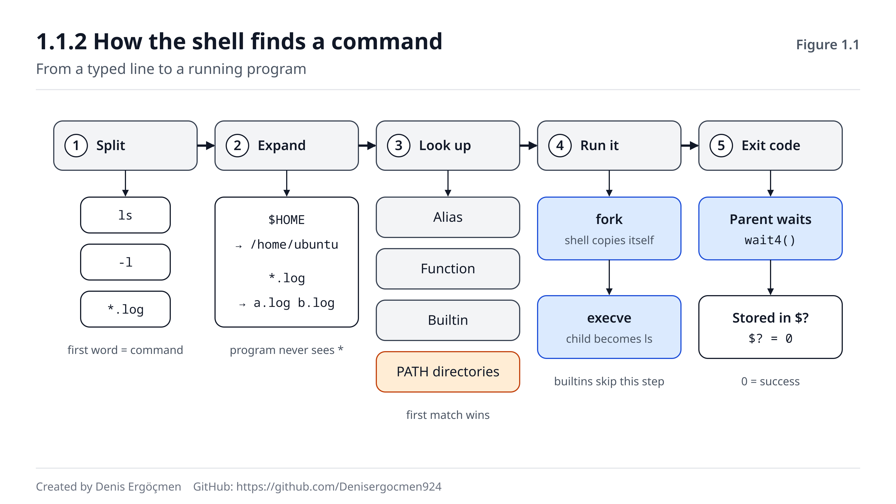
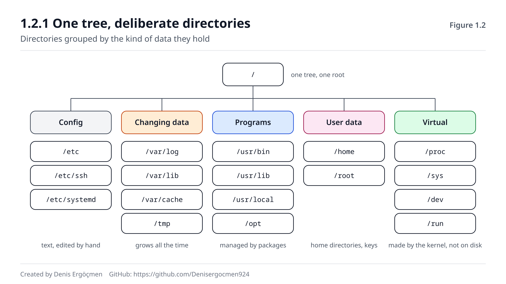
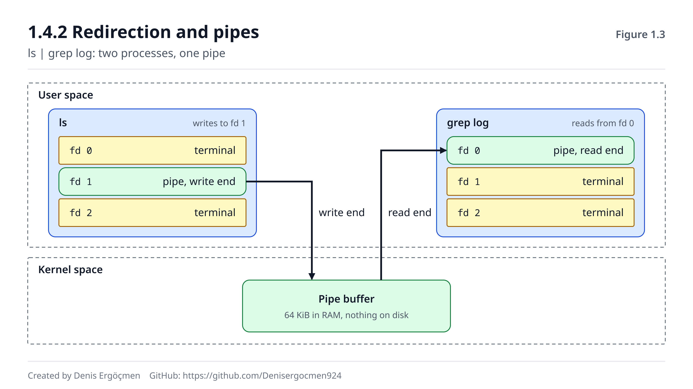

# Faz 1 — Shell ve Dosya Sistemi: Linux'ta Yol Bulmak

> **Navigasyon:** [◀ Faz 0 — Zihinsel Model](Faz_0_Zihinsel_Model.md) · **Faz 1** · [Faz 2 — Kullanıcılar, İzinler ve Kimlik ▶](Faz_2_Kullanicilar_ve_Izinler.md)

---

## Nereden geliyoruz

Faz 0'da üç fikir kurduk: **iki dünya** (kernel space ve user space), aralarındaki **tek kapı**
(syscall) ve çekirdeğin dünyayı sana gösterdiği **dosya arayüzü**. O fazda az komut
çalıştırdık; amaç modeli kurmaktı.

Bu fazda o modelin üstünde **yürümeye** başlıyoruz. Her gün SSH ile bağlandığın o siyah
ekranın ne olduğunu, yazdığın bir kelimenin nasıl bir programa dönüştüğünü, dosyaların neden
tam o dizinlerde durduğunu ve binlerce satırlık bir logdan tek bir hatayı nasıl
çekip çıkaracağını öğreneceksin.

Faz 0'dan üç şey burada doğrudan işe yarayacak:

- **"Her komut bir programdır"** — çünkü programlar user space'te çalışır ve çekirdekten
  `execve` ile başlatılmayı ister.
- **"File descriptor 0, 1, 2"** — çünkü yönlendirme ve pipe bu üç numaranın oyunudur.
- **"`/proc` bir dosya gibi okunur"** — çünkü bu fazda onu dizin ağacındaki yerine koyacağız.

## Bu fazın sorusu

Cloud'da bir sunucuya bağlandığında en sık yaşadığın an şudur:

> *"Uygulama 502 döndürüyor. Makineye SSH ile girdim. Şimdi nereye bakacağım ve o yüz bin
> satırlık logun içinde neyi nasıl arayacağım?"*

Bu fazın sonunda bu soruya "bir yerlere bakarım" diye değil, **sırasıyla hangi dizine
gideceğini ve hangi pipeline'ı yazacağını** söyleyerek cevap verebileceksin.

---

## Bu fazın sonunda

- Terminal, shell ve komut arasındaki farkı açıklayabileceksin
- Bir komut yazdığında shell'in onu **nasıl bulduğunu** (alias → builtin → PATH) ve nasıl
  çalıştırdığını (fork + exec) adım adım anlatabileceksin
- "Script terminalde çalışıyor, cron'da `command not found`" hatasının sebebini bileceksin
- FHS'deki ana dizinlerin **ne için** var olduğunu ve bir arızada hangisine bakacağını
  bileceksin
- `find` ile disk dolduran dosyayı, son değişen config'i veya büyüyen logu bulabileceksin
- stdout ile stderr'in neden ayrı olduğunu, `2>&1`'in **sırasının** neden önemli olduğunu
  açıklayabileceksin
- Pipe'ın çekirdekte ne olduğunu ve iki programı nasıl bağladığını bileceksin
- `grep`, `cut`, `sort`, `uniq`, `wc`, `head`, `tail`, `sed` ve `awk` ile bir logdan anlamlı
  bir özet çıkarabileceksin

---

## Faz haritası

| Bölüm | Konu | Derinlik | Neden burada |
|---|---|---|---|
| 1.1 | Shell nedir, komut nasıl bulunur ve çalışır | `[kavram]` + `[mekanizma]` | Yazdığın her şeyin arkasındaki model |
| 1.2 | Dosya sistemi hiyerarşisi (FHS) | `[mekanizma]` + `[uygulama]` | Arızada "nereye bakacağım" sorusunun cevabı |
| 1.3 | Gezinme ve `find` | `[uygulama]` | Günlük el becerisi ve arıza avı |
| 1.4 | stdin/stdout/stderr, yönlendirme, pipe | `[mekanizma]` | **Fazın kalbi** — Unix'in birleştirme gücü |
| 1.5 | Metin işleme araçları | `[uygulama]` + `[kavram]` | Logdan cevap çıkarmak |
| 1.6 | Bu faz bozulunca | — | Shell ve log arızalarının imzaları |

> **Bu fazda nasıl çalışmalı:** `[uygulama]` etiketli her bölümde komutları **kendi
> makinende** çalıştır. Elinde bir Ubuntu yoksa ücretsiz katmandaki bir EC2 instance'ı,
> bir sanal makine veya WSL yeterli. Bu fazdaki bütün komutlar 🟢 (sadece okur) veya
> 🟡 (geçici dosya oluşturur) işaretlidir; hiçbiri sistemi kalıcı olarak değiştirmez.

---
---

# 1.1 Shell Nedir?

## 1.1.1 Terminal, shell ve REPL `[kavram]`

SSH ile bir sunucuya bağlandığında karşına şu çıkar:

```
ubuntu@ip-172-31-20-14:~$
```

Bu ekranın arkasında üç ayrı şey vardır ve günlük dilde üçü de "terminal" diye anılır:

| Parça | Ne yapar | Örnek |
|---|---|---|
| **Terminal (emülatör)** | Klavyeni alır, gelen karakterleri ekrana çizer. Komut **anlamaz.** | GNOME Terminal, Windows Terminal, iTerm2, VS Code terminali |
| **Bağlantı** | Terminal ile uzak makine arasında karakter taşır | SSH |
| **Shell** | Yazdığın satırı **yorumlar** ve programları çalıştırır | `bash`, `zsh`, `sh` (`dash`) |

Yani `ls` yazdığında terminal bu harfleri anlamaz; sadece SSH üzerinden karşıya gönderir.
Karşıdaki makinede çalışan **bash** adlı program o satırı okur ve ne yapacağına karar verir.

Shell'in yaptığı iş bir döngüdür. Buna **REPL** denir (Read–Eval–Print Loop — oku,
değerlendir, yazdır, tekrarla):

1. **Read** — Prompt'u göster, bir satır oku.
2. **Eval** — Satırı parçalara ayır, genişlet, komutu bul, çalıştır.
3. **Print** — Çalışan programın çıktısı ekrana gelir.
4. **Loop** — Program bitince yeni prompt'u göster.

Faz 0'daki modelle söylersek: **shell de sadece bir user space programıdır.** Özel bir yetkisi
yoktur. Diske yazmak, başka bir program başlatmak veya ağa bağlanmak için o da her programın
yaptığını yapar — çekirdekten syscall ile ister.

**Prompt'u okumak:**

```
ubuntu@ip-172-31-20-14:~$
└─┬──┘ └──────┬──────┘ │ │
  │           │        │ └─ $ = normal kullanıcı  (# = root)
  │           │        └─── ~ = bulunduğun dizin (home dizinin)
  │           └──────────── makinenin hostname'i (EC2'de özel IP'den türetilir)
  └──────────────────────── oturum açan kullanıcı
```

Prompt'un sonundaki karakter küçük ama önemlidir: **`#` görüyorsan root'sun** ve yazacağın
her komut sistemi değiştirebilir. Faz 2'de root'u ayrıntılı göreceğiz.

> **🔧 Makinende gör** 🟢 — Hangi shell'desin?
>
> ```
> $ echo $SHELL
> /bin/bash
> $ ps -p $$
>     PID TTY          TIME CMD
>    1432 pts/0    00:00:00 bash
> ```
>
> - `$SHELL` → **giriş shell'in** (`/etc/passwd`'de kullanıcına yazılı olan). Şu an içinde
>   bulunduğun shell'i her zaman göstermez; `bash` içinden `zsh` başlatsan bile `$SHELL`
>   değişmez.
> - `$$` → **şu an çalışan shell'in PID'si.** `ps -p $$` bu yüzden gerçekten içinde
>   olduğun shell'i gösterir.
> - `pts/0` → sanal terminal (pseudo-terminal). SSH ile bağlandığında çekirdek senin için
>   bir tane açar. Faz 0'daki "her şey dosyadır" fikriyle: `/dev/pts/0` diye bir dosyadır.

**❓ Akla gelen soru: bash, sh, zsh — hangisini öğrenmeliyim?**

Sunucularda **bash** öğren. Ubuntu, Debian, Amazon Linux ve RHEL'de kullanıcıların varsayılan
etkileşimli shell'i bash'tir. Bir tuzak var: Ubuntu'da `/bin/sh` **bash değil**, `dash` adlı
daha küçük ve hızlı bir shell'dir. `#!/bin/sh` ile başlayan bir script'te bash'e özgü bir
özellik (örneğin `[[ ]]` veya diziler) kullanırsan Ubuntu'da hata alırsın. Faz 10'da script
yazarken buna döneceğiz. macOS'taki varsayılan `zsh`, kişisel makinende rahat ama sunucuda
onu bulamayacağını varsay.

---

## 1.1.2 Komut = program çağrısı: shell bir komutu nasıl bulur? `[mekanizma]`

`ls -l /var/log` yazıp Enter'a bastın. Ekrana liste gelene kadar shell'in içinde şunlar
olur:

**Adım 1 — Parçalara ayır (tokenize).** Satır boşluklardan bölünür: `ls`, `-l`, `/var/log`.
İlk parça **komut adı**, geri kalanlar **argümanlar**dır. Tırnaklar bu bölmeyi değiştirir:
`echo "a  b"` tek argümandır, `echo a  b` iki.

**Adım 2 — Genişlet (expand).** Shell, programı çalıştırmadan **önce** özel karakterleri
kendisi çözer:

- `$HOME` → `/home/ubuntu` (değişken genişletme)
- `~` → `/home/ubuntu`
- `*.log` → `auth.log syslog.log ...` (glob — dosya adı genişletme)
- `$(date +%F)` → `2026-09-15` (komut yerine koyma)

Bu kritik bir noktadır: **`ls *.log` yazdığında `ls` programı hiçbir zaman `*` karakterini
görmez.** Shell yıldızı dosya adlarına çevirir ve `ls`'e dosya listesini verir.

**Adım 3 — Komutu bul.** Shell komut adını şu sırayla arar ve **ilk bulduğunda durur:**

1. **Alias** — kısaltma (`ll` → `ls -alF`)
2. **Fonksiyon** — shell içinde tanımlanmış fonksiyon
3. **Builtin** — shell'in kendi içindeki komut (`cd`, `echo`, `export`, `exit`)
4. **PATH araması** — `$PATH`'teki dizinlerde, **soldan sağa**, bu isimde çalıştırılabilir
   bir dosya

**Adım 4 — Çalıştır.** Komut bir builtin ise shell işi kendisi yapar; yeni process yoktur.
Değilse:

1. Shell kendini **kopyalar** (`fork`; Linux'ta `clone` syscall'ı). Artık iki shell var:
   ebeveyn (parent) ve çocuk (child).
2. Çocuk `execve("/usr/bin/ls", ["ls", "-l", "/var/log"], ...)` çağırır. Çekirdek çocuğun
   belleğini boşaltır ve içine `ls` programını yükler. Çocuk artık bash değil, `ls`'tir.
3. Ebeveyn `wait` ile çocuğun bitmesini bekler.

**Adım 5 — Çıkış kodu.** `ls` bitince çekirdeğe bir sayı bırakır. Shell bunu `$?` değişkenine
koyar ve yeni prompt'u gösterir. **`0` = başarılı, `0` dışındaki her şey = bir tür hata.**


*Şekil 1.1 — Soldan sağa: satır parçalanır ve genişletilir; komut alias, fonksiyon, builtin
ve PATH sırasıyla aranır; builtin değilse shell fork ile kendini kopyalar, çocuk execve ile programa
dönüşür, ebeveyn çıkış kodunu bekler.*

> **🔧 Makinende gör** 🟢 — Bir komut nereden geliyor?
>
> ```
> $ type cd
> cd is a shell builtin
> $ type -a echo
> echo is a shell builtin
> echo is /usr/bin/echo
> echo is /bin/echo
> $ type -a ls
> ls is aliased to `ls --color=auto'
> ls is /usr/bin/ls
> ls is /bin/ls
> $ command -v ls
> alias ls='ls --color=auto'
> ```
>
> - `type` bir builtin'dir ve shell'in **arama sırasını** sana gösterir. `-a` bütün
>   eşleşmeleri listeler; en üstteki kazanır.
> - `echo` hem builtin hem program olarak var. Shell builtin'i kullanır; `/usr/bin/echo`
>   hiç çalışmaz.
> - `ls` önce bir alias'tır. Ubuntu'nun `~/.bashrc` dosyası renkli çıktı için bunu tanımlar.
> - `/usr/bin/ls` ile `/bin/ls` aynı dosyadır: modern Ubuntu'da `/bin` sadece `/usr/bin`'e
>   giden bir linktir (1.2.1'de göreceğiz).

> **🔧 Makinende gör** 🟢 — PATH'in kendisi
>
> ```
> $ echo $PATH
> /usr/local/sbin:/usr/local/bin:/usr/sbin:/usr/bin:/sbin:/bin:/usr/games:/usr/local/games:/snap/bin
> ```
>
> İki nokta üst üste (`:`) ile ayrılmış dizinler, soldan sağa aranır. `/usr/local/bin`,
> `/usr/bin`'den **önce** gelir. Bu bilinçli bir karardır: kendi derlediğin veya elle
> kurduğun bir `python3`'ü `/usr/local/bin`'e koyarsan, sistemin `python3`'ünü **gölgeler.**
> Bu hem bir özellik hem de "sunucuda yanlış sürüm çalışıyor" arızalarının sık sebebidir.

> **🔧 Makinende gör** 🟢 — fork ve exec'i canlı izlemek
>
> ```
> $ strace -f -e trace=execve,clone,wait4 bash -c 'ls /tmp > /dev/null; echo bitti'
> execve("/usr/bin/bash", ["bash", "-c", "ls /tmp > /dev/null; echo bitti"], 0x7fff... /* 25 vars */) = 0
> clone(child_stack=NULL, flags=CLONE_CHILD_CLEARTID|CLONE_CHILD_SETTID|SIGCHLD, child_tidptr=0x7fc9...) = 14950
> strace: Process 14950 attached
> [pid 14949] wait4(-1 <unfinished ...>
> [pid 14950] execve("/usr/bin/ls", ["ls", "/tmp"], 0x5aea... /* 25 vars */) = 0
> [pid 14950] +++ exited with 0 +++
> <... wait4 resumed>, [{WIFEXITED(s) && WEXITSTATUS(s) == 0}], 0, NULL) = 14950
> --- SIGCHLD {si_signo=SIGCHLD, si_code=CLD_EXITED, si_pid=14950, ...} ---
> bitti
> +++ exited with 0 +++
> ```
>
> Satır satır:
>
> - `execve(".../bash"...)` → strace, bash'i başlatıyor.
> - `clone(...) = 14950` → bash (PID 14949) kendini kopyaladı; çocuğun PID'si 14950.
> - `[pid 14949] wait4(-1 ...` → ebeveyn bekliyor.
> - `[pid 14950] execve("/usr/bin/ls", ["ls", "/tmp"], ...)` → çocuk `ls`'e dönüştü.
>   Argüman listesinde `>` ve `/dev/null` **yok**: yönlendirmeyi shell `ls` başlamadan önce
>   yaptı (1.4.2).
> - `WEXITSTATUS(s) == 0` → `ls` 0 ile çıktı; bu sayı `$?` olur.
> - `bitti` yazıldı ama öncesinde **ne `clone` ne `execve` var.** Çünkü `echo` builtin'dir;
>   bash işi kendi içinde yaptı.
>
> `strace` kurulu değilse: `sudo apt install strace` (Ubuntu) veya `sudo dnf install strace`
> (Amazon Linux).

> **⚠️ Yaygın yanılgı: "`cd` de `/usr/bin/cd` gibi bir programdır."**
>
> Olamaz — ve nedeni Faz 0'daki process modelinden gelir. Her process'in kendi **çalışma
> dizini** (current working directory) vardır. Eğer `cd` ayrı bir program olsaydı, shell onu
> fork + exec ile bir **çocuk** process olarak çalıştırırdı. Çocuk kendi dizinini değiştirir,
> sonra ölürdü. Ebeveyn shell'in dizini hiç değişmezdi.
>
> Bir process başka bir process'in çalışma dizinini değiştiremez. Bu yüzden `cd`, `export`,
> `source` ve `exit` gibi **shell'in kendi durumunu** değiştiren her komut builtin olmak
> zorundadır.

**❓ Akla gelen soru: Neden `./script.sh` yazmam gerekiyor, `script.sh` yetmiyor mu?**

Çünkü bulunduğun dizin (`.`) PATH'te **yoktur** ve bu bilinçli bir güvenlik kararıdır. `.`
PATH'te olsaydı, birisi `/tmp` dizinine `ls` adında zararlı bir script bıraksa ve sen
`cd /tmp && ls` yazsan, sistemin `ls`'i yerine onun script'i çalışırdı. `./script.sh` "PATH'e
bakma, **tam bu dizindeki** dosyayı çalıştır" demektir. İçinde `/` olan her komut adı PATH
aramasını atlar.

**❓ Akla gelen soru: Glob hiçbir dosyayla eşleşmezse ne olur?**

Bash'in varsayılan davranışı şaşırtıcıdır: **yıldızı olduğu gibi bırakır.**

```
$ echo *.txt
*.txt
$ ls *.txt
ls: cannot access '*.txt': No such file or directory
```

`ls` burada `*.txt` adında **gerçek bir dosya** arıyor, çünkü shell ona yıldızı genişletmeden
verdi. Hata mesajındaki tırnaklı `'*.txt'` bunun işaretidir. Bu davranış bir sonraki Düşün
sorusunun anahtarıdır.

> **🤔 Düşün 1.1**
> Bir script yazdın. Terminalde `./yedekle.sh` ile sorunsuz çalışıyor. İçinde `aws s3 cp`
> komutu var ve `aws` CLI'ını `/usr/local/bin` altına kurmuşsun. Aynı script'i her gece
> 03:00'te çalışsın diye cron'a ekledin. Sabah log dosyasında şunu görüyorsun:
>
> ```
> yedekle.sh: line 4: aws: command not found
> ```
>
> Komut aynı, script aynı, kullanıcı aynı. Neden cron'da bulunamıyor? En az iki çözüm öner.
> *(Cevap: fazın sonunda)*

> **🤔 Düşün 1.2**
> `/home/ubuntu` dizinindesin ve burada `notlar.log` adında bir dosya var. Şu komutu
> yazıyorsun:
>
> ```
> $ find /var/log -name *.log
> ```
>
> Beklediğin: `/var/log` altındaki bütün `.log` dosyaları. Gördüğün: sadece `notlar.log`
> adında bir dosya aranıyor ve hiçbir şey bulunmuyor. Başka bir dizinde **iki** `.log`
> dosyası varken aynı komut `find: paths must precede expression` hatası veriyor. Ve `.log`
> dosyası olmayan bir dizinde **düzgün çalışıyor.** Üç farklı davranışın tek sebebi ne?
> *(Cevap: fazın sonunda)*

---
---

# 1.2 Dosya Sistemi Hiyerarşisi (FHS)

## 1.2.1 Tek ağaç, bilinçli dizinler `[mekanizma]`

Windows'ta her disk ayrı bir harftir: `C:\`, `D:\`. Linux'ta böyle bir şey yoktur.
**Her şey tek bir ağacın içindedir** ve ağacın kökü `/` (root dizini) olarak yazılır. İkinci
bir disk takıldığında o disk ağacın bir **dalına bağlanır** (mount edilir), örneğin
`/data`'ya. Kullanıcı için `/data/rapor.csv` ile `/home/ubuntu/rapor.csv` arasında yol
dışında bir fark yoktur; biri başka bir diskte olsa bile. Faz 6'da mount'u ayrıntılı
göreceğiz.

Bu ağacın dizinleri rastgele değildir. **FHS** (Filesystem Hierarchy Standard — dosya sistemi
hiyerarşisi standardı) her dizinin ne için olduğunu tanımlar. Ubuntu, Debian, Amazon Linux ve
RHEL bu standarda büyük ölçüde uyar. Bu yüzden bir distroda öğrendiğin "config `/etc`'te, log
`/var/log`'ta" bilgisi ötekinde de işe yarar.

FHS'nin arkasındaki mantık şu iki soruya dayanır:

1. **Bu veri değişiyor mu?** Programlar (`/usr`) sabittir; loglar ve veritabanları (`/var`)
   sürekli büyür.
2. **Bu veri kalıcı mı?** `/run` ve `/tmp` boot'ta sıfırlanabilir; `/etc` ve `/var/lib`
   yaşamaya devam etmelidir.

Bu iki soru pratikte büyük önem taşır. `/var`'ı ayrı bir diske koyarsan, çılgınca büyüyen bir
log dosyası **sistemin geri kalanını** doldurmaz. `/usr`'ı salt okunur bağlarsan kimse
programları değiştiremez.

| Dizin | Ne tutar | Değişir mi? | Cloud'da neden önemli |
|---|---|---|---|
| `/etc` | Sistem geneli **config** dosyaları (metin) | Nadiren, elle | Bir servisin davranışını değiştirdiğin yer |
| `/var/log` | Log dosyaları | Sürekli büyür | Arızada ilk bakılacak yer; diski dolduran bir numaralı şüpheli |
| `/var/lib` | Programların **kalıcı durum verisi** | Sürekli | Docker imajları, veritabanı dosyaları, paket veritabanı |
| `/var/cache` | Silinebilir önbellek | Evet | `apt` indirmeleri; yer açmak için güvenle temizlenebilir |
| `/tmp` | Geçici dosyalar, herkes yazabilir | Evet | Boot'ta temizlenir; önemli bir şey koyma |
| `/var/tmp` | Geçici ama **reboot'tan sağ çıkan** dosyalar | Evet | `/tmp`'den farkı kalıcılık |
| `/home` | Normal kullanıcıların ev dizinleri | Evet | `/home/ubuntu/.ssh/authorized_keys` |
| `/root` | root kullanıcısının ev dizini | Evet | `/home/root` **değil** |
| `/usr/bin` | Kullanıcı programları | Paket kurulunca | `ls`, `grep`, `python3` burada |
| `/usr/sbin` | Sistem yönetim programları | Paket kurulunca | `sshd`, `useradd` |
| `/usr/lib` | Kütüphaneler ve paket dosyaları | Paket kurulunca | systemd birim dosyalarının varsayılanları da burada |
| `/usr/local` | **Paket yöneticisi dışında** elle kurulanlar | Elle | Kendi derlediğin veya script ile kurduğun araçlar |
| `/opt` | Kendi dizin yapısını getiren üçüncü parti yazılım | Elle | `/opt/aws/...`, satıcı ajanları |
| `/boot` | Çekirdek ve boot dosyaları | Çekirdek güncellemesinde | Dolarsa çekirdek güncellemesi başarısız olur (Faz 5) |
| `/dev` | Cihaz dosyaları | Çekirdek yönetir | `/dev/nvme1n1` — takılan EBS diski |
| `/proc` | Process'lerin ve çekirdeğin canlı durumu | Diskte **değil** | Faz 0.3.2 |
| `/sys` | Cihaz ve sürücü ağacı | Diskte **değil** | Faz 0.3.3 |
| `/run` | Çalışma zamanı verisi (PID dosyaları, soketler) | Boot'ta sıfırlanır | RAM'dedir |
| `/mnt`, `/media` | Geçici veya çıkarılabilir mount noktaları | — | Elle bağlanan diskler |
| `/srv` | Sunulan veri (web kökleri vs.) | — | Az kullanılır; çoğu kurulum `/var/www` kullanır |


*Şekil 1.2 — Tek kök altında dizinler, tuttukları verinin türüne göre gruplanır: config
(`/etc`), değişen veri (`/var`), programlar (`/usr`), kullanıcı verisi (`/home`) ve diskte
olmayan, çekirdeğin ürettiği sanal dizinler (`/proc`, `/sys`, `/dev`, `/run`).*

> **🔧 Makinende gör** 🟢 — Kök dizinin içi
>
> ```
> $ ls -l /
> lrwxrwxrwx   1 root root    7 Apr 20 11:46 bin -> usr/bin
> drwxr-xr-x   4 root root 4096 Sep 15 13:12 boot
> drwxr-xr-x  17 root root 3300 Sep 15 17:02 dev
> drwxr-xr-x 104 root root 4096 Sep 15 13:12 etc
> drwxr-xr-x   3 root root 4096 Aug 30 21:59 home
> lrwxrwxrwx   1 root root    7 Apr 20 11:46 lib -> usr/lib
> lrwxrwxrwx   1 root root    9 Apr 20 11:46 lib64 -> usr/lib64
> drwx------   2 root root 16384 May 20 21:13 lost+found
> dr-xr-xr-x 181 root root    0 Sep 15 17:02 proc
> drwx------   5 root root 4096 Sep 15 13:11 root
> drwxr-xr-x  29 root root  900 Sep 15 17:05 run
> lrwxrwxrwx   1 root root    8 Apr 20 11:46 sbin -> usr/sbin
> drwxrwxrwt  12 root root 4096 Sep 15 17:37 tmp
> drwxr-xr-x  12 root root 4096 May 26 00:34 usr
> drwxr-xr-x  13 root root 4096 May 26 11:18 var
> ```
>
> - `bin -> usr/bin` → `l` ile başlayan satırlar **sembolik link**tir. Eskiden `/bin` ve
>   `/usr/bin` ayrı dizinlerdi; modern distrolar bunları birleştirdi (usrmerge). `/bin/ls`
>   ile `/usr/bin/ls` bu yüzden aynı dosyadır.
> - `proc` satırında boyut `0` ve izinler `dr-xr-xr-x` → diskte olmayan, çekirdeğin ürettiği
>   bir dizin.
> - `tmp` satırının izinlerinin sonundaki `t` → **sticky bit.** Herkes yazabilir, ama
>   herkes sadece kendi dosyasını silebilir. Faz 2.3'te göreceğiz.
> - `root` satırı `drwx------` → root'un ev dizinine başkası giremez.
> - `lost+found` → ext4 dosya sisteminin kurtarma dizini; bozulma onarımında kurtarılan
>   parçalar buraya düşer.

> **🔧 Makinende gör** 🟢 — Hangi dizin gerçekten diskte?
>
> ```
> $ df -hT
> Filesystem     Type   Size  Used Avail Use% Mounted on
> /dev/root      ext4    29G  4.1G   25G  15% /
> tmpfs          tmpfs  1.9G     0  1.9G   0% /dev/shm
> tmpfs          tmpfs  766M  1.0M  765M   1% /run
> tmpfs          tmpfs  5.0M     0  5.0M   0% /run/lock
> /dev/nvme0n1p15 vfat  105M  6.1M   99M   6% /boot/efi
> tmpfs          tmpfs  383M  4.0K  383M   1% /run/user/1000
> ```
>
> - `/dev/root ext4 ... /` → EC2'deki kök EBS diski; ağacın geri kalanı burada.
> - `tmpfs` → **RAM'de** yaşayan dosya sistemi. `/run` burada; bu yüzden reboot'ta sıfırlanır.
> - `/boot/efi` → ayrı, küçük bir bölüm (partition). Firmware'in okuduğu boot dosyaları.
> - `/proc` ve `/sys` bu listede görünmez çünkü `df` onları varsayılan olarak gizler;
>   `df -a` ile görebilirsin.

> **⚠️ Yaygın yanılgı: "`/tmp` her zaman RAM'dedir" ya da "`/tmp` her zaman diskte durur."**
>
> **Distroya bağlıdır.** Ubuntu 22.04 ve 24.04'te `/tmp` kök diskin bir dizinidir ve boot'ta
> temizlenir. Amazon Linux 2023'te (ve bazı yeni Ubuntu sürümlerinde) `/tmp` bir **tmpfs**'tir:
> RAM'de yaşar ve boyutu RAM ile sınırlıdır. Buna iki pratik sonuç bağlanır:
>
> - Amazon Linux'ta `/tmp`'ye 3 GB'lık bir arşiv açmaya çalışan bir script, 2 GB RAM'li
>   küçük bir instance'ta "No space left on device" ile çöker — kök disk boş olsa bile.
> - Hangi distroda olursan ol, `/tmp`'deki dosyanın **reboot'tan sağ çıkacağına güvenme.**
>   Kalıcı geçici dosya için `/var/tmp`'yi kullan.
>
> Kendi makinende `df -hT /tmp` hangisi olduğunu hemen söyler.

**❓ Akla gelen soru: `/usr/local/bin`, `/opt` ve `/usr/bin` — bir aracı nereye kurmalıyım?**

Kural basittir: **`/usr/bin` paket yöneticisinindir.** Oraya elle dosya koyarsan bir sonraki
`apt upgrade` onu ezebilir ya da paket yöneticisi o dosyanın neden orada olduğunu bilmez.
Elle kurduğun tek dosyalık araçlar (`aws` CLI, `kubectl`, kendi script'lerin) `/usr/local/bin`'e;
kendi dizin yapısını getiren büyük yazılımlar `/opt/<ad>`'a gider. PATH sırası
(`/usr/local/bin` önce) sayesinde elle kurduğun sürüm sistemdekini gölgeler.

---

## 1.2.2 En sık ziyaret edilen üç yer: `/etc`, `/var/log`, `/proc` `[uygulama]`

Bir sunucuda arıza ararken zamanının büyük kısmı bu üç dizinde geçer. Her birinin "okuma
alışkanlığı" farklıdır.

### `/etc` — sistemin nasıl davranması gerektiği

`/etc`'teki neredeyse her şey **düz metin**dir. Bu Unix'in bilinçli bir tercihidir: config'i
okumak ve değiştirmek için özel bir araca değil, bir metin editörüne ve `grep`'e ihtiyacın
vardır.

İki desen öğren:

**1. `.d` dizinleri (drop-in).** `/etc/ssh/sshd_config` ana dosyadır; ama
`/etc/ssh/sshd_config.d/` altındaki `*.conf` dosyaları da **okunur** ve üstüne yazılır. Neden?
Çünkü paket güncellemesi ana dosyayı değiştirmek isteyebilir. Sen kendi ayarını ayrı bir
dosyaya koyarsan, güncelleme ile çakışma olmaz. cloud-init da kendi ayarlarını bu yolla
ekler.

> **🔧 Makinende gör** 🟢 — Drop-in dizinleri
>
> ```
> $ ls -d /etc/*.d | head -8
> /etc/apparmor.d
> /etc/apt/apt.conf.d
> /etc/cron.d
> /etc/init.d
> /etc/ld.so.conf.d
> /etc/logrotate.d
> /etc/profile.d
> /etc/rsyslog.d
> $ ls /etc/ssh/sshd_config.d/
> 50-cloud-init.conf  60-cloudimg-settings.conf
> ```
>
> `sshd_config`'te `PasswordAuthentication yes` yazsa bile, `50-cloud-init.conf`'ta
> `PasswordAuthentication no` varsa **hangisinin kazandığını** bilmen gerekir. Bu yüzden bir
> config'i değiştirmeden önce hep hem ana dosyaya hem `.d` dizinine bak. (sshd için ilk
> okunan değer kazanır; Faz 9'da ayrıntısı var.)

**2. Link ile yönetilen dosyalar.** Bazı dosyalar gerçekte başka bir yerde üretilir:

```
$ ls -l /etc/resolv.conf
lrwxrwxrwx 1 root root 39 Aug 21 10:02 /etc/resolv.conf -> ../run/systemd/resolve/stub-resolv.conf
```

`/etc/resolv.conf`'u elle düzenlersen değişikliğin **kaybolur**, çünkü gerçek dosya `/run`
altında ve systemd-resolved tarafından yeniden yazılıyor. Faz 7'de DNS'e gelince bu linke
döneceğiz. Şimdilik ders: **`/etc`'te bir dosyayı düzenlemeden önce `ls -l` ile link olup
olmadığına bak.**

### `/var/log` — sistemde ne olduğu

> **🔧 Makinende gör** 🟢 — Ubuntu'da log dizini
>
> ```
> $ ls /var/log
> README               auth.log.2.gz          dmesg                 kern.log.1
> alternatives.log     cloud-init-output.log  dpkg.log              landscape
> amazon               cloud-init.log         journal               lastlog
> apt                  dist-upgrade           kern.log              syslog
> auth.log             dmesg.0                syslog.1              unattended-upgrades
> auth.log.1           ...
> ```
>
> | Dosya | İçinde ne var | Ne zaman bakarsın |
> |---|---|---|
> | `syslog` | Genel sistem mesajları | "Bir şey oldu ama ne olduğunu bilmiyorum" |
> | `auth.log` | Giriş denemeleri, `sudo`, SSH | "Kim girdi?", "SSH neden reddetti?" |
> | `kern.log` | Çekirdek mesajları | Disk hataları, OOM killer (Faz 4) |
> | `cloud-init.log` | cloud-init'in ne yaptığı | "User-data çalıştı mı?" |
> | `cloud-init-output.log` | **User-data script'inin çıktısı** | "User-data neden patladı?" |
> | `journal/` | systemd journal'ın ikili dosyaları | `journalctl` ile okunur (1.5.3) |
> | `apt/`, `dpkg.log` | Paket kurulumları | "Dün gece ne güncellendi?" |
>
> - `auth.log.1`, `auth.log.2.gz` → **logrotate**'in döndürdüğü eski loglar. `.1` dünkü,
>   `.2.gz` önceki günün sıkıştırılmışı. 1.5.4'te bu dosyaların neden önemli olduğunu
>   göreceksin.
>
> **Amazon Linux 2023'te** bu listenin çoğu yoktur: `syslog`, `auth.log`, `kern.log`
> dosyaları bulunmaz, çünkü rsyslog varsayılan olarak kurulu değildir. Her şey
> **journal**'dadır ve `journalctl` ile okunur. cloud-init logları ise ikisinde de vardır.

### `/proc` — şu an ne olduğu

Faz 0'da `/proc/meminfo` ve `/proc/loadavg`'ı gördük. Burada her process için açılan dizine
bakalım. Her çalışan process `/proc/<PID>/` altında bir dizindir:

> **🔧 Makinende gör** 🟢 — Bir process'in kimliği
>
> ```
> $ sleep 300 &
> [1] 2214
> $ ls /proc/2214
> attr  cgroup  cmdline  comm  cwd  environ  exe  fd  io  limits  maps  mem  mounts
> net  ns  oom_score  root  sched  smaps  stack  stat  statm  status  task  wchan ...
> $ tr '\0' ' ' < /proc/2214/cmdline; echo
> sleep 300
> $ readlink /proc/2214/exe /proc/2214/cwd
> /usr/bin/sleep
> /home/ubuntu
> $ kill %1
> ```
>
> | Dosya | Ne söyler |
> |---|---|
> | `cmdline` | Process'in **tam komut satırı** (argümanlar `\0` ile ayrılmış; `tr` bu yüzden) |
> | `exe` | Gerçekte çalışan program dosyasına link |
> | `cwd` | Process'in çalışma dizinine link |
> | `environ` | Başlatıldığı andaki ortam değişkenleri (sadece sahibi ve root okuyabilir) |
> | `fd/` | Açık dosyaları (1.4.1'de ayrıntılı) |
> | `status` | Durum, bellek, UID'ler — insan okunur özet |
>
> Pratik kullanım: bir process garip davranıyorsa `cat /proc/<PID>/cmdline` hangi
> argümanlarla başladığını, `/proc/<PID>/environ` hangi ortam değişkenleriyle başladığını
> **tahmin etmeden** gösterir. "Bu servis hangi config dosyasını okuyor?" sorusunun yarısı
> buradan cevaplanır.

> **🤔 Düşün 1.3**
> Gece 02:00'de alarm geliyor: bir EC2 instance'ında kök dosya sistemi `%100` dolu.
> Uygulama yeni dosya yazamıyor, SSH ile girebiliyorsun ama `sudo apt install` bile çalışmıyor.
>
> 1. FHS'ye göre **ilk hangi iki dizine** bakarsın ve neden?
> 2. Ekip arkadaşın "`du -sh /*` çalıştıralım" diyor. Bu komut `/proc` altında da gezinir
>    mi? Bu bir sorun mu? Ve instance'a ayrıca takılı 500 GB'lık bir `/data` diski varsa ne
>    olur?
> *(Cevap: fazın sonunda)*

---
---

# 1.3 Gezinme ve Dosya İşlemleri

## 1.3.1 `cd`, `ls`, `cp`, `mv`, `rm` — hızlı kontrol `[uygulama]`

Bu komutları muhtemelen biliyorsun. Bu bölüm onları öğretmek yerine **sunucuda sık yapılan
hataları** ve arkalarındaki mekanizmayı gösterir.

| Komut | Bilmen gereken | Neden |
|---|---|---|
| `cd -` | Bir önceki dizine döner | İki uzak dizin arasında gidip gelirken |
| `ls -la` | Gizli dosyaları (`.` ile başlayan) da gösterir | `.ssh`, `.bashrc`, `.env` gizlidir |
| `ls -lh` | Boyutları `K`, `M`, `G` ile yazar | Büyük dosyayı bir bakışta görmek |
| `ls -ltr` | Değiştirilme zamanına göre sıralar, **en yeni en altta** | "Son değişen log hangisi?" — en alttaki |
| `cp -a` | İzinleri, sahibi, zamanları ve linkleri **korur** | Config yedeği alırken `cp -r` yerine |
| `cp file{,.bak}` | `cp file file.bak` ile aynı | Shell'in parantez genişletmesi; yazmayı azaltır |
| `mv` | Aynı dosya sisteminde sadece **isim** değiştirir | 50 GB'lık dosyayı bile anında taşır |
| `rm -r` | Dizini içeriğiyle siler | **Çöp kutusu yoktur** |
| `rm -i` | Her dosya için onay ister | Emin olmadığında |

**`mv` neden bu kadar hızlı?** Faz 6'da ayrıntısını göreceğiz, ama kısaca: bir dosyanın
verisi diskte bir yerde durur, **adı** ise dizinin içinde bir kayıttır. Aynı dosya sistemi
içinde `mv`, veriye hiç dokunmadan sadece bu kaydı bir dizinden alıp diğerine koyar. Farklı
bir dosya sistemine (örneğin `/` diskinden `/data` diskine) taşırken ise veriyi baştan sona
**kopyalayıp** eskisini siler; bu yüzden yavaştır.

> **🔧 Makinende gör** 🟡 — `mv` veriyi taşımaz
>
> ```
> $ touch deneme.txt
> $ stat -c '%i %n' deneme.txt
> 655 deneme.txt
> $ mv deneme.txt yeni-ad.txt
> $ stat -c '%i %n' yeni-ad.txt
> 655 yeni-ad.txt
> $ rm yeni-ad.txt
> ```
>
> `%i` dosyanın **inode numarası**dır — dosyanın diskteki kimliği. İsim değişti, kimlik aynı
> kaldı. Senin numaran farklı olacaktır; önemli olan iki satırda aynı olması.

> **⚠️ Yaygın yanılgı: "Büyük log dosyasını `rm` ile sildim, disk yer açılmış olmalı."**
>
> Eğer o dosyayı hâlâ **açık tutan** bir process varsa (log yazan uygulama gibi), yer açılmaz.
> `rm` sadece dizindeki **ismi** siler. Faz 0'daki modelle: çekirdek, açık bir file
> descriptor'ı olan dosyanın verisini o fd kapanana kadar serbest bırakmaz. Dosya isimsiz ama
> canlıdır.
>
> Belirti: `df -h` diski %100 gösterir, `du` ise dosyaların toplamını çok daha az bulur.

> **🔧 Makinende gör** 🟡 — Silinmiş ama açık dosya
>
> ```
> $ dd if=/dev/zero of=buyuk.dat bs=1M count=50 status=none
> $ tail -f buyuk.dat > /dev/null &
> [1] 3071
> $ rm buyuk.dat
> $ ls -l /proc/3071/fd | grep deleted
> lr-x------ 1 ubuntu ubuntu 64 Sep 15 17:40 3 -> /home/ubuntu/buyuk.dat (deleted)
> $ sudo lsof +L1
> COMMAND  PID   USER   FD   TYPE DEVICE SIZE/OFF NLINK   NODE NAME
> tail    3071 ubuntu    3r   REG  259,1 52428800     0 262311 /home/ubuntu/buyuk.dat (deleted)
> $ kill %1
> ```
>
> - `(deleted)` → isim yok, ama `tail` process'i fd 3 üzerinden dosyayı hâlâ tutuyor.
> - `lsof +L1` → link sayısı 1'den az (yani **0**, ismi silinmiş) olan açık dosyaları listeler.
>   `SIZE/OFF` sütunu 52428800 byte = 50 MB'ın hâlâ diskte olduğunu gösterir.
> - `kill %1` ile `tail` kapanınca çekirdek 50 MB'ı serbest bırakır.
>
> **Geri alma:** `kill %1` çalıştırmayı unutursan `tail` arka planda kalır; `jobs` ile görüp
> `kill %1` ile kapat. Üretimde çözüm genellikle servisi yeniden başlatmak veya logrotate'in
> servise "dosyayı yeniden aç" sinyali göndermesidir (1.5.4).

---

## 1.3.2 `find` — arıza avı için `[uygulama]`

`ls` bir dizine bakar. `find` bir **ağacı** gezer ve her dosyayı verdiğin şartlara göre
test eder. Sunucuda sorduğun soruların çoğu aslında birer `find` sorgusudur:

| Soru | Komut |
|---|---|
| "Diski dolduran 100 MB'tan büyük dosyalar nerede?" | `sudo find / -xdev -type f -size +100M` |
| "Son 30 dakikada hangi config değişti?" | `sudo find /etc -type f -mmin -30` |
| "7 günden eski loglar hangileri?" | `find /var/log -name '*.gz' -mtime +7` |
| "Bu dizinde `.env` dosyası var mı?" | `find /srv -name '.env'` |
| "Sahibi olmayan dosyalar?" | `sudo find / -xdev -nouser` |

**Yapı:** `find <nereden> <testler> <eylem>`

| Parça | Anlamı |
|---|---|
| `-name '*.log'` | İsim eşleşmesi (büyük/küçük harf duyarlı; `-iname` duyarsız). **Deseni tırnakla.** |
| `-type f` / `-type d` | Sadece dosya / sadece dizin |
| `-size +100M` | 100 MB'tan büyük (`-` küçük, `k`/`M`/`G` birim) |
| `-mtime +7` | İçeriği 7 günden **önce** değişmiş (`-7` = son 7 gün içinde) |
| `-mmin -30` | Son 30 dakika içinde değişmiş |
| `-xdev` | **Başka dosya sistemine geçme** (`/proc`, `/sys`, ayrı diskler) |
| `-maxdepth 2` | En fazla 2 seviye in |
| `-exec cmd {} +` | Bulunan dosyaları toplu hâlde bir komuta ver |
| `-delete` | Bulunanları sil — **önce `-delete` olmadan çalıştır** |

> **🔧 Makinende gör** 🟢 — Büyük dosyaları bulmak
>
> ```
> $ sudo find / -xdev -type f -size +100M -exec ls -lh {} + 2>/dev/null
> -rw-r----- 1 syslog adm  1.3G Sep 15 17:41 /var/log/syslog
> -rw-r--r-- 1 root   root 180M Sep  3 10:12 /var/lib/snapd/snaps/core22_1586.snap
> ```
>
> - `-xdev` → kök diskte kal. `/proc` gibi sanal dosya sistemlerine ve takılı diğer disklere
>   inme. Hem hızlı hem doğru: "**bu** disk neden dolu?" sorusunu cevaplar.
> - `-exec ls -lh {} +` → bulunan dosyaları `ls -lh`'e **tek seferde** verir. `{}` dosya
>   adlarının yerini tutar; `+` "hepsini bir kerede" demektir. (`\;` ile bitirirsen her dosya
>   için ayrı bir `ls` process'i başlar.)
> - `2>/dev/null` → izin hatalarını gizler (1.4.2'de ayrıntılı).
>
> Burada 1.3 GB'lık bir `syslog` şüphelidir: bir şey sisteme hızla log basıyor. Sonraki
> soru "ne basıyor?" olur ve cevabı 1.5'teki araçlardadır.

**Dizin bazında bakmak: `du`.** `find` tek tek dosyaları bulur; ama sorun binlerce küçük
dosyadan oluşuyorsa (örneğin bir önbellek dizini), **dizin toplamlarına** bakmak gerekir:

> **🔧 Makinende gör** 🟢 — Hangi dizin büyük?
>
> ```
> $ sudo du -xh --max-depth=1 /var | sort -h | tail -5
> 39M     /var/snap
> 174M    /var/cache
> 1.6G    /var/log
> 2.3G    /var/lib
> 4.1G    /var
> ```
>
> - `-x` → `find`'deki `-xdev` ile aynı: başka dosya sistemine geçme.
> - `--max-depth=1` → sadece bir alt seviyenin toplamları.
> - `sort -h` → "human" sıralama: `174M`'ın `1.6G`'den küçük olduğunu bilir. Düz `sort` bunu
>   bilmez (1.5.1).
> - En büyük en altta. Bir sonraki adım en büyük dizine inip aynı komutu tekrarlamaktır:
>   `sudo du -xh --max-depth=1 /var/log | sort -h | tail -5`.

> **🤔 Düşün 1.4**
> Bir ekip arkadaşın disk temizliği için şu komutu cron'a eklemeyi öneriyor:
>
> ```
> find / -name *.log -mtime +7 -delete
> ```
>
> Bu komutta **en az dört** ayrı sorun bul. Her biri için neyin yanlış gidebileceğini ve
> nasıl düzelteceğini yaz.
> *(Cevap: fazın sonunda)*

---
---

# 1.4 stdin, stdout, stderr ve Pipe

## 1.4.1 Üç standart akış: 0, 1, 2 `[mekanizma]`

Faz 0.3.1'de her process'in bir **file descriptor (fd) tablosu** olduğunu gördük: açık her
dosyanın process içindeki numarası. Unix bu tablonun ilk üç numarasına bir **anlaşma** ile
özel anlam yükler:

| fd | Adı | Varsayılan olarak nereye bağlı | Ne için |
|---|---|---|---|
| **0** | stdin (standart girdi) | Terminal (klavye) | Programın **okuduğu** veri |
| **1** | stdout (standart çıktı) | Terminal (ekran) | Programın **ürettiği sonuç** |
| **2** | stderr (standart hata) | Terminal (ekran) | **Hata ve teşhis mesajları** |

Burada ince ama çok önemli bir nokta var: **program terminali bilmez.** `ls` sadece "fd 1'e
yaz" der. fd 1'in arkasında terminal mi, dosya mı, başka bir program mı olduğunu çekirdek
bilir, `ls` bilmez. Faz 0'daki "tek arayüz" fikrinin pratik karşılığı budur ve bu fazın geri
kalanı tamamen bu gerçeğin üstüne kuruludur.

**stderr neden ayrı?** Şu komuta bak:

```
$ ls /etc/hostname /yok
ls: cannot access '/yok': No such file or directory
/etc/hostname
```

İki satır da ekranda, ama **farklı kanallardan** geldiler: birincisi fd 2'den (hata),
ikincisi fd 1'den (sonuç). Ekranda aynı görünürler çünkü ikisi de aynı terminale bağlı.
Şimdi sonucu bir dosyaya gönderelim:

```
$ ls /etc/hostname /yok > sonuc.txt
ls: cannot access '/yok': No such file or directory
$ cat sonuc.txt
/etc/hostname
```

Hata **hâlâ ekranda**, sonuç dosyada. Ayrı kanalların amacı tam olarak budur: bir programın
çıktısını bir dosyaya veya başka bir programa verdiğinde, **hata mesajları o verinin içine
karışmaz** ve sen onları görmeye devam edersin. Eğer hatalar da stdout'a gitseydi, bir sonraki
program `ls: cannot access` satırını bir dosya adı sanıp işlemeye çalışırdı.

> **🔧 Makinende gör** 🟢 — Shell'inin üç akışı
>
> ```
> $ ls -l /proc/$$/fd
> lrwx------ 1 ubuntu ubuntu 64 Sep 15 17:45 0 -> /dev/pts/0
> lrwx------ 1 ubuntu ubuntu 64 Sep 15 17:45 1 -> /dev/pts/0
> lrwx------ 1 ubuntu ubuntu 64 Sep 15 17:45 2 -> /dev/pts/0
> lrwx------ 1 ubuntu ubuntu 64 Sep 15 17:45 255 -> /dev/pts/0
> ```
>
> - 0, 1 ve 2'nin **üçü de aynı yere** gidiyor: senin SSH oturumunun sanal terminali.
> - `255` → bash'in terminali kendi iç işi için tuttuğu yedek fd; görmezden geçebilirsin.
> - Shell bir komut başlattığında (fork), çocuk bu tabloyu **miras alır.** `ls`'in fd 1'i bu
>   yüzden otomatik olarak senin terminalindir.

---

## 1.4.2 Yönlendirme ve pipe `[mekanizma]`

Yönlendirme, shell'in **çocuğu başlatmadan hemen önce** onun fd tablosunu değiştirmesidir.
1.1.2'deki strace çıktısını hatırla: `ls /tmp > /dev/null` için `execve`'e giden argümanlarda
`>` yoktu. Çünkü sıra şudur:

```
shell fork eder
  └── çocuk (henüz bash):
        1. /dev/null'u açar → fd 3 olur
        2. dup2(3, 1)  → fd 1 artık /dev/null'u gösterir
        3. close(3)
        4. execve("/usr/bin/ls", ["ls", "/tmp"])   ← ls, fd 1'i hazır bulur
```

`ls` hiçbir şeyden haberdar değildir. Her zamanki gibi fd 1'e yazar.

| Yazım | Anlamı | Mekanizma |
|---|---|---|
| `cmd > dosya` | stdout'u dosyaya yaz, **önce dosyayı sıfırla** | `open(O_TRUNC)` + `dup2(fd, 1)` |
| `cmd >> dosya` | stdout'u dosyanın **sonuna ekle** | `open(O_APPEND)` + `dup2(fd, 1)` |
| `cmd 2> dosya` | stderr'i dosyaya yaz | `dup2(fd, 2)` |
| `cmd 2>&1` | fd 2'yi, fd 1'in **şu an** gösterdiği yere bağla | `dup2(1, 2)` |
| `cmd &> dosya` | stdout ve stderr'i birlikte dosyaya (bash) | `> dosya 2>&1` kısaltması |
| `cmd < dosya` | stdin'i dosyadan oku | `dup2(fd, 0)` |
| `cmd > /dev/null` | stdout'u çöpe at | `/dev/null`: yazılanı yutan karakter cihazı |

**Kural 1 — `>` dosyayı komut çalışmadan ÖNCE sıfırlar.** Shell dosyayı açarken boşaltır; komut
daha başlamamıştır bile.

```
$ sort kayit.log > kayit.log
$ ls -l kayit.log
-rw-rw-r-- 1 ubuntu ubuntu 0 Sep 15 17:46 kayit.log
```

Dosya **boş.** `sort` başladığında okuyacağı dosya çoktan sıfırlanmıştı. Sonuç: veri kaybı,
hata mesajı yok.

**Kural 2 — yönlendirmeler soldan sağa, sırayla uygulanır.** `2>&1` "fd 2'yi fd 1'e bağla"
değil, "**fd 2'yi fd 1'in şu an gösterdiği yere** bağla" demektir:

```
$ ls /yok . > o1.txt 2>&1      # 1) fd1 → o1.txt   2) fd2 → (fd1'in yeri) o1.txt
$ cat o1.txt
ls: cannot access '/yok': No such file or directory
.:
access.log
...

$ ls /yok . 2>&1 > o2.txt      # 1) fd2 → (fd1'in yeri) terminal   2) fd1 → o2.txt
ls: cannot access '/yok': No such file or directory
$ cat o2.txt
.:
access.log
...
```

İkinci komutta hata **terminale** düştü. Çünkü `2>&1` işlendiği anda fd 1 hâlâ terminaldi.
Cron ve systemd çıktılarını loglarken bu sıra hatası "hata logları neden boş?" sorusunun klasik
sebebidir.

> **⚠️ Yaygın yanılgı: "`sudo echo 'x' > /etc/dosya` root olarak yazar."**
>
> Yazmaz ve `Permission denied` alırsın. Nedeni yukarıdaki mekanizma: **yönlendirmeyi shell
> yapar**, ve shell senin normal kullanıcınla çalışıyor. `sudo` sadece `echo` programını root
> yapar; ama `/etc/dosya`'yı açma denemesi `sudo` başlamadan önce, senin yetkinle olur.
>
> Doğrusu, dosyayı açma işini **root olarak çalışan bir programa** vermektir:
>
> ```
> $ echo 'x' | sudo tee /etc/dosya > /dev/null      # üzerine yaz
> $ echo 'x' | sudo tee -a /etc/dosya > /dev/null   # sonuna ekle
> ```
>
> `tee` stdin'den okuduğunu hem dosyaya hem stdout'a yazar; `> /dev/null` ekrana tekrar
> basmasını engeller.

### Pipe: bir programın çıktısı, diğerinin girdisi

`cmd1 | cmd2` yazdığında shell şunu yapar:

1. Çekirdekten bir **pipe** ister (`pipe()` syscall'ı). Çekirdek RAM'de küçük bir tampon
   oluşturur ve iki fd verir: biri **yazma ucu**, biri **okuma ucu.**
2. İki kez fork eder.
3. Birinci çocukta fd 1'i pipe'ın yazma ucuna bağlar, `cmd1`'i exec eder.
4. İkinci çocukta fd 0'ı pipe'ın okuma ucuna bağlar, `cmd2`'yi exec eder.


*Şekil 1.3 — `ls | grep log`: ls'in fd 1'i çekirdekteki pipe tamponunun yazma ucuna, grep'in
fd 0'ı okuma ucuna bağlıdır. İki process'in stderr'i (fd 2) pipe'a girmez, terminale gider.*

Bu modelden dört önemli sonuç çıkar:

**1. Pipe bir dosya değildir, diske hiçbir şey yazılmaz.** Çekirdekteki bir tampondur; Linux'ta
varsayılan kapasitesi 64 KiB'tır.

**2. İki program aynı anda çalışır.** `cmd1` bitmeden `cmd2` başlamış olur. Tampon dolarsa
yazan taraf (`cmd1`) okuyan taraf yer açana kadar **bekletilir**; tampon boşsa okuyan taraf
bekletilir. Bu yüzden `tail -f log | grep ERROR` sonsuza kadar akabilir: veri hiçbir yerde
birikmez.

**3. Okuyan taraf erken çıkarsa yazan taraf SIGPIPE ile ölür.** `yes | head -2` yazdığında
`yes` sonsuza kadar `y` basar. `head` iki satır alıp çıkar. Pipe'ın okuma ucu kapanır. `yes` bir
sonraki yazma denemesinde çekirdekten **SIGPIPE** sinyali alır ve sessizce ölür. Bu bir hata
değil, tasarımdır: kimse okumuyorsa üretmenin anlamı yoktur.

**4. Sadece stdout pipe'a girer.** stderr, `2>&1` demedikçe terminale gider. `cmd 2>&1 | grep x`
hata mesajlarını da grep'e verir.

> **🔧 Makinende gör** 🟢 — Pipe'ı fd tablosunda görmek
>
> ```
> $ ls -l /proc/self/fd | cat
> total 0
> lrwx------ 1 ubuntu ubuntu 64 Sep 15 17:48 0 -> /dev/pts/0
> l-wx------ 1 ubuntu ubuntu 64 Sep 15 17:48 1 -> pipe:[65627]
> lrwx------ 1 ubuntu ubuntu 64 Sep 15 17:48 2 -> /dev/pts/0
> lr-x------ 1 ubuntu ubuntu 64 Sep 15 17:48 3 -> /proc/3140/fd
> ```
>
> - `/proc/self` → "şu an bu dosyayı okuyan process". Burada o process `ls`'tir.
> - `1 -> pipe:[65627]` → `ls`'in stdout'u terminal değil, **65627 numaralı pipe.** Diğer
>   ucunda `cat` okuyor.
> - `0` ve `2` hâlâ terminal: pipe sadece stdout'u değiştirdi.
> - `3 -> /proc/3140/fd` → `ls`'in listelemek için açtığı dizinin kendisi.

> **🔧 Makinende gör** 🟢 — SIGPIPE ve pipeline'ın çıkış kodları
>
> ```
> $ yes | head -2; echo "${PIPESTATUS[@]}"
> y
> y
> 141 0
> ```
>
> - `PIPESTATUS` → bash'te pipeline'daki **her** komutun çıkış kodu, sırayla.
> - `141` = 128 + 13. Bir process sinyalle öldüğünde shell çıkış kodunu 128 + sinyal numarası
>   olarak raporlar; 13 SIGPIPE'tır.
> - `0` → `head` başarıyla bitti.
> - Normal `$?` sadece **son** komutun kodunu verir. `yanlis_komut | sort` pipeline'ında
>   `$?` 0 döner, çünkü `sort` başarılıydı. Script'lerde bunun çözümü `set -o pipefail`'dir;
>   Faz 10'da kullanacağız.

**❓ Akla gelen soru: `ls` terminalde renkli, `ls | cat`'te neden renksiz?**

Çünkü program fd 1'in terminal olup olmadığını **sorabilir** (`isatty()`). `ls --color=auto`
şöyle çalışır: "fd 1 terminalse renk kodu bas, değilse basma." Pipe'a veya dosyaya renk
kodu basılsaydı, bir sonraki programın okuduğu veride `\033[01;34m` gibi çöp karakterler
olurdu. Aynı kontrolü shell'de de yapabilirsin:

```
$ [ -t 1 ] && echo tty || echo notty
tty
$ ( [ -t 1 ] && echo tty || echo notty ) | cat
notty
```

> **🤔 Düşün 1.5**
> Bir cron işi şu satırı çalıştırıyor:
>
> ```
> /opt/app/rapor.sh 2>&1 > /var/log/rapor.log
> ```
>
> Script bazen patlıyor, ama `/var/log/rapor.log`'da hiçbir hata mesajı yok; sadece normal
> çıktı var.
>
> 1. Hata mesajları nereye gitti?
> 2. Doğru satırı yaz.
> 3. Bir ekip arkadaşın logu sıralı görmek için `sort /var/log/rapor.log > /var/log/rapor.log`
>    çalıştırdı ve dosya boşaldı. Neden? Güvenli yolu nedir?
> *(Cevap: fazın sonunda)*

---

## 1.4.3 Unix felsefesi: küçük araçlar, birleştirme gücü `[kavram]`

1970'lerde Unix'i tasarlayanlar şu fikri benimsedi:

1. **Her program bir işi iyi yapsın.**
2. **Programlar birlikte çalışsın** — birinin çıktısı diğerinin girdisi olabilsin.
3. **Evrensel arayüz metin akışı olsun.**

Bu yüzden `sort` sadece sıralar, `uniq` sadece tekrarları sayar, `head` sadece ilk satırları
alır. Hiçbiri "en çok istek yapan IP'yi bul" diye bir özelliğe sahip değildir. Ama birleşince
bu soruyu cevaplarlar ve **hiç kimsenin önceden düşünmediği** soruları da cevaplarlar.

Bunu gerçek bir örnekle kuralım. Bir web sunucusunun `access.log` dosyası (nginx formatı):

```
203.0.113.7 - - [14/Sep/2026:10:15:01 +0000] "GET / HTTP/1.1" 200 612 "-" "curl/8.5.0"
198.51.100.23 - - [14/Sep/2026:10:15:02 +0000] "GET /api/orders HTTP/1.1" 200 1534 "-" "Mozilla/5.0"
203.0.113.7 - - [14/Sep/2026:10:15:04 +0000] "POST /api/orders HTTP/1.1" 502 157 "-" "curl/8.5.0"
192.0.2.44 - - [14/Sep/2026:10:15:05 +0000] "GET /health HTTP/1.1" 200 2 "-" "ELB-HealthChecker/2.0"
203.0.113.7 - - [14/Sep/2026:10:15:07 +0000] "GET /api/orders HTTP/1.1" 200 1534 "-" "curl/8.5.0"
198.51.100.23 - - [14/Sep/2026:10:15:09 +0000] "GET /login HTTP/1.1" 404 153 "-" "Mozilla/5.0"
192.0.2.44 - - [14/Sep/2026:10:15:10 +0000] "GET /health HTTP/1.1" 200 2 "-" "ELB-HealthChecker/2.0"
203.0.113.7 - - [14/Sep/2026:10:15:12 +0000] "POST /api/orders HTTP/1.1" 502 157 "-" "curl/8.5.0"
198.51.100.61 - - [14/Sep/2026:10:15:15 +0000] "GET /api/orders HTTP/1.1" 500 89 "-" "Mozilla/5.0"
192.0.2.44 - - [14/Sep/2026:10:15:15 +0000] "GET /health HTTP/1.1" 200 2 "-" "ELB-HealthChecker/2.0"
```

Bu 10 satırı kendi makinende `access.log` adıyla kaydet; 1.5'teki bütün örnekler bu dosyayı
kullanır. Alanlar boşlukla ayrılmıştır: 1. alan IP, 7. alan yol, 9. alan durum kodu, 10. alan
yanıt boyutu (byte).

**Soru: En çok istek yapan IP hangisi?** Pipeline'ı adım adım kuralım. Her adımda bir
önceki komutun çıktısını gözünle kontrol etmek, pipeline yazmanın en güvenli yoludur.

> **🔧 Makinende gör** 🟢 — Pipeline'ı adım adım kurmak
>
> ```
> $ awk '{print $1}' access.log | head -3          # 1. adım: sadece IP'ler
> 203.0.113.7
> 198.51.100.23
> 203.0.113.7
>
> $ awk '{print $1}' access.log | sort | uniq -c   # 2. adım: sırala, say
>       3 192.0.2.44
>       2 198.51.100.23
>       1 198.51.100.61
>       4 203.0.113.7
>
> $ awk '{print $1}' access.log | sort | uniq -c | sort -rn | head -3   # 3. adım: çoktan aza
>       4 203.0.113.7
>       3 192.0.2.44
>       2 198.51.100.23
> ```
>
> - `awk '{print $1}'` → her satırın 1. alanını basar (1.5.2).
> - `sort` → aynı IP'leri **yan yana** getirir.
> - `uniq -c` → yan yana gelen aynı satırları tek satıra indirir ve kaç tane olduğunu yazar.
> - `sort -rn` → sayıya göre (`-n`), tersten (`-r`) sıralar.
> - `head -3` → ilk üçü.
>
> Cevap: `203.0.113.7`, 4 istek. Beş küçük araç, hiçbiri bu soruyu bilmiyor.

Şimdi 1.5'teki araçları tek tek tanıyabiliriz. Ama önce felsefenin bir sınırını dürüstçe
söyleyelim.

**❓ Akla gelen soru: Metni kesip biçmek kırılgan değil mi?**

Evet, kırılgandır. Yukarıdaki pipeline "IP 1. alandadır" varsayımına dayanır. Birisi nginx log
formatının başına bir alan eklerse pipeline **hata vermeden yanlış cevap** üretir. Bu yüzden
modern araçlar yapılandırılmış çıktı da sunar:

- `journalctl -o json` → her log kaydı alan adlarıyla bir JSON nesnesi
- `ip -j addr` → ağ bilgisi JSON olarak (Faz 7)
- `aws ... --output json` + `jq` → AWS CLI çıktısı

Kural: **etkileşimli teşhiste metin araçları hızlı ve yeterlidir. Yıllarca çalışacak bir
script'te mümkünse yapılandırılmış çıktı kullan.**

---
---

# 1.5 Metin İşleme Araçları

## 1.5.1 `grep`, `cut`, `sort`, `uniq`, `wc`, `head`, `tail` `[uygulama]`

Bu yedi araç bir sunucudaki log analizinin %90'ını karşılar. Hepsi aynı sözleşmeye uyar:
**dosya adı verirsen dosyadan, vermezsen stdin'den okur; sonucu stdout'a yazar.** Bu yüzden
pipeline'ın herhangi bir yerine takılabilirler.

### `grep` — satır filtrele

`grep DESEN dosya` → deseni içeren satırları basar.

| Seçenek | Anlamı | Ne zaman |
|---|---|---|
| `-i` | Büyük/küçük harf duyarsız | `ERROR`, `Error`, `error` hepsini yakalamak |
| `-v` | **Eşleşmeyenleri** bas | Gürültüyü atmak: `grep -v health` |
| `-n` | Satır numarasını göster | Dosyada tam yerini bulmak |
| `-c` | Sadece eşleşen satır **sayısı** | "Kaç tane 502 var?" |
| `-w` | Tam kelime eşleşmesi | `error` ararken `errors` ve `no_error`'u almamak |
| `-E` | Genişletilmiş regex (`+`, `?`, `\|`, `{n}`) | `' 5[0-9]{2} '` gibi desenler |
| `-r` | Dizinde özyinelemeli ara | `grep -r 'listen' /etc/nginx/` |
| `-l` | Sadece eşleşen **dosya adlarını** bas | "Bu ayar hangi config dosyasında?" |
| `-A n` / `-B n` / `-C n` | Eşleşmeden sonra / önce / etrafında n satır | Hatanın bağlamını görmek |

> **🔧 Makinende gör** 🟢 — Logda 5xx aramak
>
> ```
> $ grep -c ' 502 ' access.log
> 2
> $ grep -n -E '" 5[0-9]{2} ' access.log
> 3:203.0.113.7 - - [14/Sep/2026:10:15:04 +0000] "POST /api/orders HTTP/1.1" 502 157 "-" "curl/8.5.0"
> 8:203.0.113.7 - - [14/Sep/2026:10:15:12 +0000] "POST /api/orders HTTP/1.1" 502 157 "-" "curl/8.5.0"
> 9:198.51.100.61 - - [14/Sep/2026:10:15:15 +0000] "GET /api/orders HTTP/1.1" 500 89 "-" "Mozilla/5.0"
> $ grep -n -A1 ' 404 ' access.log
> 6:198.51.100.23 - - [14/Sep/2026:10:15:09 +0000] "GET /login HTTP/1.1" 404 153 "-" "Mozilla/5.0"
> 7-192.0.2.44 - - [14/Sep/2026:10:15:10 +0000] "GET /health HTTP/1.1" 200 2 "-" "ELB-HealthChecker/2.0"
> $ grep -v health access.log | wc -l
> 7
> ```
>
> - `' 502 '` → boşluklar bilinçli. Sadece `502` yazsaydın, yanıt boyutu `1502` olan veya
>   yolunda `502` geçen satırlar da eşleşirdi.
> - `'" 5[0-9]{2} '` → tırnaktan sonra boşluk, `5` ve iki rakam: durum kodu alanı. `-E`
>   olmadan `{2}` çalışmaz.
> - `-A1` çıktısında `6:` eşleşen satır, `7-` bağlam satırıdır. İki nokta = eşleşme, tire =
>   bağlam.
> - `grep -v health | wc -l` → load balancer health check'lerini atınca 7 gerçek istek kaldı.

**`grep`'in çıkış kodu da bir cevaptır:**

| `$?` | Anlamı |
|---|---|
| `0` | En az bir eşleşme bulundu |
| `1` | Eşleşme **yok** (hata değil) |
| `2` | Gerçek hata (dosya yok, izin yok, bozuk regex) |

```
$ grep -q 999 access.log; echo $?
1
$ grep -q 999 yok.log; echo $?
grep: yok.log: No such file or directory
2
```

`-q` hiçbir şey basmaz, sadece çıkış koduyla cevap verir. Script'lerde "log dosyasında
`FATAL` var mı?" sorusu `if grep -q FATAL app.log; then ...` ile sorulur (Faz 10).

### `cut` — sütun kes

`cut -d AYIRAÇ -f ALANLAR` → her satırdan belirli alanları alır.

```
$ cut -d' ' -f1,9 access.log | head -3
203.0.113.7 200
198.51.100.23 200
203.0.113.7 502
$ cut -d: -f1,7 /etc/passwd | head -3
root:/bin/bash
daemon:/usr/sbin/nologin
bin:/usr/sbin/nologin
```

`cut`'ın zayıf noktası: ayıracı **tam olarak tek karakter** kabul eder. İki alan arasında
bazen bir, bazen üç boşluk varsa (`ps` veya `df` çıktısı gibi) `cut` alanları şaşırır. O
durumda `awk` kullan; o ardışık boşlukları tek ayıraç sayar (1.5.2).

### `sort` ve `uniq` — sırala, say

| Seçenek | Anlamı |
|---|---|
| `sort` | Alfabetik (sözlük) sıralama |
| `sort -n` | **Sayısal** sıralama (`9 < 10`; alfabetikte `10 < 9`) |
| `sort -h` | İnsan okunur boyut sıralaması (`900K < 1.2M < 2G`) |
| `sort -r` | Ters sıra |
| `sort -t' ' -k10,10 -n` | Ayıraç boşluk; **10. alana göre** sayısal sırala |
| `sort -u` | Sırala ve tekrarları at |
| `uniq` | **Yan yana** gelen aynı satırları teke indir |
| `uniq -c` | ... ve kaç tane olduğunu yaz |

> **⚠️ Yaygın yanılgı: "`uniq` bir dosyadaki tekrarlanan satırları bulur."**
>
> Sadece **ardışık** tekrarları bulur. `uniq` bellekte hiçbir şey tutmaz; her satırı bir önceki
> satırla karşılaştırır. Sıralanmamış veride sonuç yanlıştır — ve hata vermez:
>
> ```
> $ awk '{print $1}' access.log | uniq -c
>       1 203.0.113.7
>       1 198.51.100.23
>       1 203.0.113.7
>       1 192.0.2.44
>       1 203.0.113.7
>       ...
> ```
>
> Her IP 1 kez görünüyor, çünkü aynı IP hiçbir zaman art arda gelmedi. Kural: **`uniq`'ten önce
> her zaman `sort`.**

> **🔧 Makinende gör** 🟢 — Durum kodu dağılımı
>
> ```
> $ awk '{print $9}' access.log | sort | uniq -c | sort -rn
>       6 200
>       2 502
>       1 500
>       1 404
> ```
>
> Bir arızanın ilk dakikasında sorulacak soru: "hatalar ne kadar yaygın?" 10 istekten 3'ü 5xx.
> Bu **tek bir bozuk istemci değil**, üç farklı istek; ikisi aynı IP'den ama biri başka bir
> IP'den. Hepsi `/api/orders` yolunda — sorun arka uçta olabilir.

### `wc`, `head`, `tail` — say, baştan al, sondan al

| Komut | Anlamı |
|---|---|
| `wc -l` | Satır say |
| `head -n 20` | İlk 20 satır (varsayılan 10) |
| `tail -n 50` | Son 50 satır |
| `tail -f dosya` | Dosyanın sonunu **izle**; yeni satır geldikçe bas |
| `tail -F dosya` | `-f` + dosya silinip yeniden oluşturulursa **yenisini aç** |

```
$ wc -l access.log
10 access.log
$ grep -c POST access.log
2
```

`grep PATTERN | wc -l` ile `grep -c PATTERN` aynı sonucu verir; ikincisi bir process eksiktir.

**`tail -f` ile `tail -F` arasındaki fark** ilk bakışta önemsiz görünür ama gerçek bir arızanın
sebebidir. `tail -f`, açtığı dosyanın **fd'sini** izler. Gece logrotate `app.log`'u `app.log.1`
olarak yeniden adlandırıp yeni, boş bir `app.log` oluşturursa, `tail -f` hâlâ eski dosyaya
(artık `app.log.1`) bakar ve yeni satırları **hiç göstermez.** `tail -F` ise **dosya adını**
izler; ad yeni bir dosyaya işaret ettiğinde onu açar. 1.3.1'deki "isim ile veri ayrıdır"
fikrinin başka bir yüzü.

---

## 1.5.2 `sed` ve `awk` — ne olduklarını bil `[kavram]`

İkisi de başlı başına birer programlama dilidir. Bu fazda amaç onları öğrenmek değil, **en sık
görülen tek satırlık kullanımlarını okuyup yazabilmek.**

### `sed` — akış editörü

`sed` her satırı okur, bir işlem uygular ve basar. En yaygın işlem **bul-değiştir**dir:

| Kullanım | Anlamı |
|---|---|
| `sed 's/eski/yeni/'` | Her satırda **ilk** `eski`'yi `yeni` yap |
| `sed 's/eski/yeni/g'` | Her satırda **hepsini** değiştir |
| `sed -n '3,4p'` | Sadece 3. ve 4. satırları bas |
| `sed -n '/ 502 /p'` | Sadece deseni içeren satırları bas (`grep` gibi) |
| `sed '/^#/d'` | `#` ile başlayan satırları sil (config'teki yorumları atmak) |
| `sed -i.bak 's/a/b/' dosya` | **Dosyanın kendisini** değiştir, önce `dosya.bak` yedeği al |

> **🔧 Makinende gör** 🟢 — Logdaki IP'yi maskelemek
>
> ```
> $ sed 's/203\.0\.113\.7/[GIZLI]/' access.log | head -2
> [GIZLI] - - [14/Sep/2026:10:15:01 +0000] "GET / HTTP/1.1" 200 612 "-" "curl/8.5.0"
> 198.51.100.23 - - [14/Sep/2026:10:15:02 +0000] "GET /api/orders HTTP/1.1" 200 1534 "-" "Mozilla/5.0"
> ```
>
> - `\.` → regex'te `.` "herhangi bir karakter" demektir; gerçek nokta için kaçış gerekir.
> - Orijinal dosya **değişmedi.** `sed` sonucu stdout'a yazdı. Bir logu destek ekibiyle
>   paylaşmadan önce bu şekilde maskeleyebilirsin.

> **🔧 Makinende gör** 🔴 — Dosyayı yerinde değiştirmek (`-i`)
>
> ```
> $ cp access.log kopya.log
> $ sed -i.bak 's/HTTP\/1.1/HTTP\/2/g' kopya.log
> $ ls kopya.log*
> kopya.log  kopya.log.bak
> $ head -1 kopya.log
> 203.0.113.7 - - [14/Sep/2026:10:15:01 +0000] "GET / HTTP/2" 200 612 "-" "curl/8.5.0"
> ```
>
> - `-i` dosyayı **kalıcı olarak** değiştirir; `.bak` eki verirsen önce yedek alır. Gerçek bir
>   config'te `-i`'yi **eksiz asla kullanma.**
> - Bu örnek kopya üzerinde çalıştığı için güvenli; ama `-i` gerçek bir dosyada 🔴'dır.
> - **Geri alma:** `mv kopya.log.bak kopya.log`. Bitince temizlik: `rm kopya.log kopya.log.bak`.
> - Önce `-i` olmadan çalıştırıp çıktıyı gözle kontrol et, **sonra** `-i` ekle.

### `awk` — alanlarla düşünen dil

`awk` her satırı otomatik olarak alanlara böler: `$1`, `$2`, ... `$NF` (son alan), `$0` (tüm
satır). Varsayılan ayıracı **bir veya daha fazla boşluktur** — `cut`'ın yapamadığı şey.

Yapısı: `awk 'ŞART { EYLEM }'`. Şart doğruysa eylem çalışır; şart yoksa her satırda çalışır.
`END { ... }` bloğu bütün satırlar bittikten sonra bir kez çalışır.

| Kullanım | Anlamı |
|---|---|
| `awk '{print $1}'` | 1. alanı bas |
| `awk '$9 >= 500 {print $9, $7}'` | 9. alan 500 veya üstüyse, kod ve yolu bas |
| `awk '{s += $10} END {print s}'` | 10. alanı topla, sonda bas |
| `awk -F: '$3 >= 1000 {print $1}'` | Ayıraç `:`; 3. alan 1000+ ise 1. alanı bas |
| `awk '{print $NF}'` | Son alanı bas |

> **🔧 Makinende gör** 🟢 — Logdan sayılar çıkarmak
>
> ```
> $ awk '$9 >= 500 {print $9, $7}' access.log
> 502 /api/orders
> 502 /api/orders
> 500 /api/orders
> $ awk '$9 >= 500 {n++} END {print n}' access.log
> 3
> $ awk '{s+=$10; n++} END {printf "%d istek, ortalama %.1f byte\n", n, s/n}' access.log
> 10 istek, ortalama 424.2 byte
> $ awk -F: '$3 >= 1000 {print $1, $3, $7}' /etc/passwd
> ubuntu 1000 /bin/bash
> nobody 65534 /usr/sbin/nologin
> ```
>
> - `$9 >= 500` → awk alanı sayı olarak karşılaştırır. `grep`'le yapılamayan "büyüktür"
>   sorusu.
> - `n++` → şart doğru olan her satırda sayacı artır; `END`'de bas.
> - `/etc/passwd` → UID'si 1000 ve üstü olanlar gerçek (insan) kullanıcılardır. `nobody` özel
>   bir istisnadır. Faz 2.1'de bu dosyayı alan alan okuyacağız.

**❓ Akla gelen soru: `grep | awk | sed` mi, yoksa her şeyi `awk` ile mi yapmalıyım?**

Okunabilir olanı seç. `grep ERROR app.log | awk '{print $1}'` herkesin anlayacağı bir
pipeline'dır. `awk '/ERROR/ {print $1}' app.log` bir process daha az başlatır ama bir sonraki
kişinin awk bilmesini gerektirir. Terminalde fark etmez; paylaşılan bir script'te okuyanı
düşün.

---

## 1.5.3 Cloud bağlantısı: uzaktan log okumak ve journal `[uygulama]`

### SSH ile tek komut

Bir sunucuya girmeden, komutu uzaktan çalıştırıp çıktıyı kendi makinene alabilirsin:

```
$ ssh ubuntu@10.0.1.25 'sudo tail -n 200 /var/log/nginx/error.log' | grep -i upstream
```

Burada **pipe'ın hangi tarafta çalıştığı** önemlidir:

- Tırnak **içindeki** her şey uzak sunucuda çalışır: `sudo tail`.
- Tırnak **dışındaki** `| grep` senin makinende çalışır.

200 satır ağ üzerinden sana gelir, sonra filtrelenir. Log 5 GB olsaydı ve `tail` yerine `cat`
yazsaydın, 5 GB'ı ağ üzerinden çekip kendi makinende filtrelerdin. Kural: **filtrelemeyi
verinin olduğu yerde yap:**

```
$ ssh ubuntu@10.0.1.25 'sudo grep -i upstream /var/log/nginx/error.log | tail -n 20'
```

### `journalctl` — systemd'nin logu

Modern distrolarda servislerin çoğu logunu dosyaya değil **journal**'a yazar. Amazon Linux
2023'te neredeyse her şey sadece buradadır. Faz 5'te journal'ın nasıl çalıştığını göreceğiz;
şimdilik okumayı öğren:

| Komut | Anlamı |
|---|---|
| `journalctl -u nginx` | Sadece `nginx` servisinin logu |
| `journalctl -p err` | Sadece öncelik `err` ve daha ciddi olanlar |
| `journalctl -n 50` | Son 50 kayıt |
| `journalctl -f` | Canlı izle (`tail -f` gibi) |
| `journalctl --since "10 min ago"` | Son 10 dakika |
| `journalctl -b` | Sadece bu boot'tan beri |
| `journalctl --no-pager` | Sayfalamadan düz bas (pipe'larda kendiliğinden) |

> **🔧 Makinende gör** 🟢 — Son hatalar
>
> ```
> $ journalctl -p err -n 3 --no-pager
> Sep 15 09:12:40 ip-172-31-20-14 nginx[1210]: nginx: [emerg] bind() to 0.0.0.0:80 failed (98: Address already in use)
> Sep 15 09:12:40 ip-172-31-20-14 systemd[1]: Failed to start nginx.service - A high performance web server.
> Sep 15 09:14:02 ip-172-31-20-14 sshd[1502]: error: kex_exchange_identification: Connection closed by remote host
> ```
>
> Her satırın yapısı: **zaman · hostname · program[PID] · mesaj.** Senin makinendeki satırlar
> farklı olacaktır; önemli olan alanları okuyabilmek. Bu yapı sayesinde metin araçları
> journal'da da çalışır:
>
> ```
> $ journalctl -p err --since today --no-pager | awk '{print $5}' | sort | uniq -c | sort -rn
>       4 nginx[1210]:
>       2 systemd[1]:
>       1 sshd[1502]:
> ```
>
> "Bugün en çok hangi program hata bastı?" — 5. alan program adı.
>
> `journalctl` normal kullanıcıyla sadece kendi kayıtlarını gösterebilir; sistem loglarının
> tamamı için `sudo` veya `adm` / `systemd-journal` grubunda olmak gerekir (Faz 2).

**Roadmap'teki Lab 1'in üç komutu** artık tanıdık:

```
$ journalctl -p err -n 50 --no-pager | grep -v sshd | awk '{print $5}' | sort | uniq -c
$ sudo find /var/log -type f -size +50M -exec ls -lh {} +
$ df -h /var
```

Birincisi "son 50 hatada SSH gürültüsü dışında kim var?", ikincisi "hangi log dosyası
şişmiş?", üçüncüsü "`/var`'ın bulunduğu disk ne kadar dolu?" sorusunu cevaplar.

---

## 1.5.4 Bozulunca: "Logda hatayı bulamıyorum" `[uygulama]`

Uygulama hata veriyor, sen `grep -i error /var/log/app.log | tail` yazıyorsun ve **hiçbir şey
çıkmıyor.** Hata gerçekten yok mu, yoksa yanlış yere mi bakıyorsun? Deneyimli bir mühendisin
zihninden geçen kontrol listesi:

| # | Olası sebep | Nasıl anlarsın | Çözüm |
|---|---|---|---|
| 1 | **Log döndürüldü (rotation)** — aradığın satır dünkü dosyada | `ls -ltr /var/log/app.log*` | `grep` → `.1` dosyası; `.gz` için `zgrep` |
| 2 | **Yanlış dosya** — uygulama başka yere veya journal'a yazıyor | `ls -l /proc/<PID>/fd \| grep log` | Doğru dosyayı veya `journalctl -u app` |
| 3 | **stderr yakalanmıyor** — hata stdout'a yönlendirilmiş dosyada değil | Servis tanımında `2>&1` var mı? | 1.4.2'deki sıra kuralı |
| 4 | **Kelime farklı** — `error` değil `ERR`, `FATAL`, `Traceback`, `panic`, `exception` | `grep -iE 'err\|fatal\|traceback\|panic\|exception'` | Uygulamanın log formatına bak |
| 5 | **Zaman aralığı yanlış** — hata 3 saat önceydi, sen son 10 satıra bakıyorsun | `tail` yerine zaman desenli `grep` | `journalctl --since` |
| 6 | **Tamponlama** — uygulama logu yazdı ama henüz diske düşmedi | Satırlar toplu geliyor | Faz 0.2.2: user space tamponu |
| 7 | **Çok satırlı hata** — `error` satırı var ama asıl bilgi alttaki satırlarda | Stack trace | `grep -A 20` |
| 8 | **İzin** — dosyayı okuyamıyorsun, `grep` sessizce `2>/dev/null`'a gitti | `$?` = 2 | `sudo` (Faz 2) |

> **🔧 Makinende gör** 🟢 — Döndürülmüş loglarda aramak
>
> ```
> $ ls -ltr /var/log/syslog*
> -rw-r----- 1 syslog adm  301512 Sep 12 00:00 /var/log/syslog.4.gz
> -rw-r----- 1 syslog adm  288104 Sep 13 00:00 /var/log/syslog.3.gz
> -rw-r----- 1 syslog adm  312990 Sep 14 00:00 /var/log/syslog.2.gz
> -rw-r----- 1 syslog adm 2841203 Sep 15 00:00 /var/log/syslog.1
> -rw-r----- 1 syslog adm  912044 Sep 15 17:50 /var/log/syslog
> $ sudo zgrep -c 'Out of memory' /var/log/syslog*
> /var/log/syslog:0
> /var/log/syslog.1:0
> /var/log/syslog.2.gz:3
> /var/log/syslog.3.gz:0
> /var/log/syslog.4.gz:0
> ```
>
> - Dosyalar gece yarısı döndürülmüş; en eski en üstte (`-ltr`).
> - `zgrep` sıkıştırılmış ve düz dosyaları birlikte arar. Düz `grep` `.gz` dosyasının içini
>   okuyamaz — ve **hata vermeden** eşleşme bulamaz.
> - 3 OOM olayı 2 gün önceki dosyada. Sadece `syslog`'a baksaydın "OOM hiç olmamış" derdin.

> **🤔 Düşün 1.6**
> Akşam 23:30'da bir ekip arkadaşın canlı bir sorunu izlemek için şu komutu bir `tmux`
> oturumunda bırakıp gidiyor:
>
> ```
> tail -f /var/log/app/app.log | grep --line-buffered ERROR >> /home/ubuntu/hatalar.txt
> ```
>
> Sabah `hatalar.txt`'de sadece 23:30 ile 00:00 arasındaki hatalar var. Oysa uygulama logunda
> gece 03:00'te bir sürü `ERROR` olduğu kesin. `tail` process'i hâlâ çalışıyor ve hata vermemiş.
>
> 1. Gece yarısı ne oldu?
> 2. `tail` hangi dosyayı izliyor olmalı ve bunu nasıl kanıtlarsın?
> 3. Komutu nasıl düzeltirsin?
> *(Cevap: fazın sonunda)*

---
---

# 1.6 Bu faz bozulunca — arıza imzaları

Bu fazdaki arızaların çoğu "sistem bozuk" değil, **shell'in veya aracın tam olarak söylediğini
yapması** ile senin beklentin arasındaki farktır. Tablodaki her satırın arkasında bu fazda
kurduğun bir mekanizma var.

| Belirti | Olası mekanizma | Nerede anlatıldı | İlk bakılacak |
|---|---|---|---|
| Script terminalde çalışıyor, cron/systemd'de `command not found` | Farklı PATH; cron `/usr/bin:/bin` kullanır | 1.1.2, Cevap 1.1 | `type -a <komut>`, script'te tam yol veya PATH tanımı |
| Sunucuda "yanlış sürüm" çalışıyor | PATH sırasında önce gelen bir dizindeki başka kopya | 1.1.2 | `type -a <komut>`, `hash -r` |
| `find ... -name *.log` bazen hiçbir şey bulmuyor, bazen `paths must precede expression` | Deseni shell genişletti | 1.1.2, Cevap 1.2 | Deseni tırnakla: `'*.log'` |
| `cd` script içinde çalışıyor ama script bitince dizin değişmemiş | Script bir çocuk process'te çalıştı | 1.1.2 | `source script.sh` veya beklentiyi değiştir |
| `/etc/resolv.conf` veya bir config'e yaptığın değişiklik kayboluyor | Dosya bir link, başka bir servis yeniden üretiyor; ya da `.d` dizini üstüne yazıyor | 1.2.2 | `ls -l`, `.d` dizini |
| Disk `%100`, `du` toplamı çok daha az | Silinmiş ama açık tutulan dosya | 1.3.1 | `sudo lsof +L1` |
| `/tmp`'ye büyük dosya yazarken "No space left", kök disk boş | `/tmp` tmpfs (RAM) | 1.2.1 | `df -hT /tmp` |
| `mv` bir dizini taşırken dakikalarca sürüyor | Farklı dosya sistemine taşıma = kopyala + sil | 1.3.1 | `df <kaynak> <hedef>` |
| `sort f > f` (veya `sed ... f > f`) sonrası dosya boş | `>` komut başlamadan dosyayı sıfırladı | 1.4.2 | Geçici dosyaya yaz, sonra `mv` |
| Cron log dosyasında hata mesajları yok | `2>&1 > log` sırası; stderr yakalanmadı | 1.4.2, Cevap 1.5 | `> log 2>&1` |
| `sudo echo ... > /etc/x` → `Permission denied` | Yönlendirmeyi normal kullanıcıdaki shell yapıyor | 1.4.2 | `sudo tee` |
| Pipeline başarısız ama `$?` = 0 | `$?` sadece son komutun kodu | 1.4.2 | `PIPESTATUS`, `set -o pipefail` |
| `uniq -c` her satırı 1 sayıyor | Girdi sıralı değil | 1.5.1 | Önce `sort` |
| `sort` sonucu `10`'u `9`'dan önce koyuyor, `2G`'yi `900M`'den önce | Alfabetik sıralama | 1.5.1 | `sort -n` / `sort -h` |
| `grep` hatayı bulamıyor | Rotation, yanlış dosya, farklı kelime, `.gz` | 1.5.4 | `ls -ltr log*`, `zgrep`, `journalctl` |
| `tail -f` gece yarısından sonra yeni satır göstermiyor | Logrotate dosyayı değiştirdi, `tail -f` eski fd'yi izliyor | 1.5.1, Cevap 1.6 | `tail -F` |
| Amazon Linux'ta `/var/log/syslog` yok | rsyslog kurulu değil, her şey journal'da | 1.2.2 | `journalctl` |

> **Bu tablodan çıkarılacak ders:** Bu fazın arızalarının neredeyse hiçbiri hata mesajı
> vermez. `uniq` yanlış sayar, `>` dosyayı sessizce boşaltır, `grep` "bulamadım" der ve susar.
> Bu yüzden iki alışkanlık edin: **(1) pipeline'ı adım adım kur ve her adımın çıktısını gözünle
> kontrol et; (2) "hiçbir şey çıkmadı" sonucunu da bir cevap olarak değil, bir soru olarak ele
> al** — "gerçekten yok mu, yoksa yanlış yere mi bakıyorum?"

---

# Faz 1 — Düşün sorularının cevapları

## Cevap 1.1 — Terminalde çalışan script cron'da `command not found`

**Soru:** `aws` CLI `/usr/local/bin`'de. Script terminalde çalışıyor, cron'da `aws: command
not found` diyor. Neden, ve çözüm?

**Sebep: cron'un PATH'i senin PATH'in değildir.**

Terminalde oturum açtığında bash bir dizi başlangıç dosyası okur (`/etc/profile`,
`~/.profile`, `~/.bashrc`) ve PATH'i bunlar kurar. Senin PATH'in şuna benzer:

```
/usr/local/sbin:/usr/local/bin:/usr/sbin:/usr/bin:/sbin:/bin:/usr/games:/usr/local/games:/snap/bin
```

cron ise oturum açmaz, bu dosyaları **okumaz** ve kullanıcı crontab'ları için çok kısa bir
varsayılan PATH ile başlar:

```
/usr/bin:/bin
```

`/usr/local/bin` bu listede yok. Shell 1.1.2'deki arama sırasını uygular: alias yok, builtin
değil, PATH'teki iki dizinde `aws` yok → `command not found`. Aynı sebep systemd servisleri için
de geçerlidir: systemd de kendi, sınırlı ortamıyla başlatır.

Kanıtlamak için, cron'a geçici bir satır ekle ve ortamı bir dosyaya dök:

```
* * * * * env > /tmp/cron-env.txt
```

Bir dakika sonra `grep PATH /tmp/cron-env.txt` cron'un gerçekte gördüğü PATH'i gösterir. (Satırı
sonra sil.)

**Çözümler (en sağlamdan en az sağlama):**

1. **Script içinde tam yol kullan:** `/usr/local/bin/aws s3 cp ...`. Ortama hiç bağımlı değil.
2. **Script'in başında PATH'i kendin tanımla:**
   ```
   #!/bin/bash
   PATH=/usr/local/bin:/usr/bin:/bin
   ```
   Script artık kim çalıştırırsa çalıştırsın aynı davranır.
3. **Crontab'ın başına PATH satırı ekle:** `PATH=/usr/local/bin:/usr/bin:/bin`. Çalışır ama
   script'i başka bir yerde (systemd timer gibi) çalıştırınca sorun geri gelir.

**Kaçınılacak "çözüm":** crontab satırına `source ~/.bashrc` eklemek. Ubuntu'nun `.bashrc`'si
etkileşimli olmayan shell'de hemen çıkar; ayrıca script'i kişisel ayarlarına bağımlı yapar.

**Genel ders:** "Bende çalışıyor" cümlesi genellikle "benim **ortamımda** çalışıyor" demektir.
Cron, systemd, CI pipeline'ı, container ve SSH ile uzaktan komut çalıştırmanın **hepsi** farklı
bir ortamla başlar.

**İlgili bölüm:** 1.1.2 · **Devamı:** Faz 5 (systemd ortamı), Faz 10 (script'lerde sağlam ortam)

---

## Cevap 1.2 — `find /var/log -name *.log` üç farklı davranış

**Soru:** Aynı komut; dizinde bir `.log` varken hiçbir şey bulmuyor, iki `.log` varken hata
veriyor, hiç `.log` yokken düzgün çalışıyor. Neden?

**Sebep: `*.log`'u `find` değil, shell genişletiyor — ve bunu bulunduğun dizine göre yapıyor.**

1.1.2'deki Adım 2'yi hatırla: glob, program çalışmadan **önce**, **o anki dizinde** çözülür.
`find` yıldızı hiç görmez; shell'in ona verdiğini görür.

**Durum 1 — dizinde tek `.log` var (`notlar.log`):**

```
Yazdığın:        find /var/log -name *.log
find'in aldığı:  find /var/log -name notlar.log
```

`find` `/var/log` altında `notlar.log` adında bir dosya arar. Yok. Sessizce hiçbir şey basmaz.

**Durum 2 — dizinde iki `.log` var (`a.log`, `b.log`):**

```
find'in aldığı:  find /var/log -name a.log b.log
find: paths must precede expression: `b.log'
find: possible unquoted pattern after predicate `-name'?
```

`-name` tek argüman alır. `b.log` artık fazladan bir argümandır ve `find` onu anlamlandıramaz.
`find`'in kendisi bile ipucu veriyor: "**tırnaksız desen**?"

**Durum 3 — dizinde hiç `.log` yok:**

Bash eşleşme bulamayınca yıldızı **olduğu gibi** bırakır (1.1.2, "Glob hiçbir dosyayla
eşleşmezse"). `find` gerçekten `*.log` desenini alır ve beklediğin gibi çalışır.

Üçüncü durum en tehlikelisidir: komut **yanlış ama çalışıyor** görünür. Aynı satırı bir script'e
koyarsın; script bir gün `.log` dosyası olan bir dizinden çalıştırılır ve sessizce yanlış sonuç
verir.

**Çözüm:** Programa giden deseni **her zaman tırnakla:**

```
$ find /var/log -name '*.log'
```

Tek tırnak shell'e "bu karakterlere dokunma, olduğu gibi ver" der. Aynı kural `grep -E 'a|b'`,
`awk '{print $1}'` ve `sed 's/a/b/'` için de geçerlidir: özel karakter içeren her argümanı
tırnakla.

**İlgili bölüm:** 1.1.2, 1.3.2 · **Devamı:** Faz 10 (script'lerde tırnaklama)

---

## Cevap 1.3 — Kök disk %100: nereden başlamalı?

**Soru:** İlk hangi iki dizine bakarsın? `du -sh /*` `/proc`'ta gezinir mi, sorun mu? Ayrı takılı
bir `/data` diski varsa ne olur?

**1. İlk iki dizin: `/var/log` ve `/var/lib`.**

FHS'nin mantığı cevabı verir: sabit veriler (`/usr`, `/etc`) kendiliğinden büyümez; paket
kurmadıkça boyutları sabittir. **Değişen veri `/var`'dadır.**

- `/var/log` → kontrolden çıkan bir uygulama saniyede binlerce satır basabilir ve bir gecede
  disk dolar. En sık sebep.
- `/var/lib` → Docker imajları ve container katmanları (`/var/lib/docker`), veritabanı
  dosyaları, eski snap sürümleri.

Sonra `/tmp` ve `/home` (birinin bıraktığı büyük bir dump veya arşiv) gelir.

```
$ sudo du -xh --max-depth=1 / | sort -h | tail -5
$ sudo du -xh --max-depth=1 /var | sort -h | tail -5
$ sudo find / -xdev -type f -size +500M -exec ls -lh {} +
```

**2. `du -sh /*` iki sorun taşır.**

- **`/proc`, `/sys` ve `/run`'a da girer.** `/proc`'taki dosyalar diskte yer kaplamaz, ama
  `du` onları gezmek için binlerce dosyayı açmaya çalışır. Yavaşlar, ekranı izin hatalarıyla
  doldurur ve bazı sanal dosyalarda anlamsız sayılar üretebilir.
- **`/data` diskini de sayar.** 500 GB'lık `/data` diskinin 400 GB'ı doluysa, `du` `/data`'yı
  en büyük dizin olarak gösterir. Oysa sen **kök diskin** neden dolduğunu arıyorsun; `/data`
  ayrı bir disk ve onun dolu olması kök diski etkilemez. Yanlış iz sürersin.

İkisinin de çözümü **`-x`** (`du`) / **`-xdev`** (`find`): "başladığın dosya sisteminde kal."
`/` kök diskindeyse `/proc`, `/sys`, `/run`, `/data` ayrı dosya sistemleri olduğu için
atlanır.

**3. Bir adım daha: `du` az, `df` çok gösteriyorsa** — örneğin `df` 29 GB dolu, `du -x /` 12 GB
buluyor — kayıp 17 GB büyük ihtimalle **silinmiş ama açık** dosyalardadır (1.3.1). `sudo lsof +L1`.

**Neden önemli:** Disk dolduğunda panik içinde `rm -rf` ile rastgele silmek hem veri kaybettirir
hem de (dosya açıksa) yer açmaz. Doğru sıra: `df` ile hangi disk → `du -x` ile hangi dizin →
`find -xdev` ile hangi dosya → `lsof +L1` ile gizli yer.

**İlgili bölüm:** 1.2.1, 1.3.1, 1.3.2 · **Devamı:** Faz 6 (dosya sistemleri, inode dolması), Faz 11

---

## Cevap 1.4 — `find / -name *.log -mtime +7 -delete` komutundaki sorunlar

**Soru:** Bu temizlik komutunda en az dört sorun bul.

**Sorun 1 — Desen tırnaksız.** Cevap 1.2'nin aynısı. Cron'un çalıştığı dizinde (genellikle
kullanıcının ev dizini) bir `.log` dosyası varsa desen o dosyanın adına dönüşür. En iyi ihtimalle
hiçbir şey silinmez; iki `.log` varsa komut hata verir. **Düzeltme:** `-name '*.log'`.

**Sorun 2 — Kök dizinden (`/`) ve dosya sistemi sınırı olmadan başlıyor.** Bütün diskleri, takılı
ağ dosya sistemlerini (NFS, EFS) ve `/proc`'u gezer. Yavaştır; bir EFS diski takılıysa **başka
sunucuların** loglarını silebilir. **Düzeltme:** Hedef dizini daralt (`/var/log/app`) ve `-xdev`
ekle.

**Sorun 3 — `-type f` yok.** Adı `.log` ile biten bir **dizin** varsa (`/var/log/nginx.log/` gibi
kötü adlandırılmış bir dizin) `find` onu da eşleştirir. Boş değilse `-delete` başarısız olur,
boşsa siler. **Düzeltme:** `-type f`.

**Sorun 4 — Hangi dosyaların silineceğini hiç görmedin.** `-delete` geri alınamaz; çöp kutusu yok.
Şu an **aktif olarak yazılan** bir log dosyası da `-mtime +7` olabilir (7 gündür değişmemiş ama
bir process tarafından açık). Silersen yer açılmaz (1.3.1) ve uygulama logunu kaybedersin.
**Düzeltme:** Önce `-delete` olmadan çalıştır, listeyi oku, sonra ekle.

**Sorun 5 — Logrotate'in işini elle yapıyor.** `/var/log` altındaki dosyaların çoğu **logrotate**
tarafından zaten döndürülüp siliniyor. Elle silmek logrotate'in durum dosyasıyla çelişebilir.
Doğru çözüm genellikle logrotate kuralını düzeltmektir (Faz 8).

**Sorun 6 — Hatalar ve kayıt yok.** Cron'da çalışınca izin hataları ve ne silindiği hiçbir yere
yazılmaz. **Düzeltme:** `-print` ekleyip çıktıyı bir log dosyasına yönlendir.

**Daha güvenli hâli:**

```
find /var/log/app -xdev -type f -name '*.log.*' -mtime +7 -print -delete >> /var/log/temizlik.log 2>&1
```

Sadece uygulamanın kendi dizininde, sadece dosyaları, sadece döndürülmüş eski kopyaları
(`app.log.3` gibi; aktif `app.log`'u değil) siler; neyi sildiğini ve hataları kaydeder.

**İlgili bölüm:** 1.1.2, 1.3.1, 1.3.2, 1.4.2 · **Devamı:** Faz 8 (logrotate), Faz 10 (güvenli script)

---

## Cevap 1.5 — Cron logunda hata yok; `sort f > f` dosyayı boşalttı

**Soru:** `rapor.sh 2>&1 > /var/log/rapor.log` hataları nereye gönderdi? Doğru satır? `sort` ile
dosyanın boşalması?

**1. Hatalar cron'un kendi stderr'ine gitti.**

Yönlendirmeler soldan sağa uygulanır (1.4.2):

```
başlangıç:     fd1 → (cron'un çıktısı)   fd2 → (cron'un çıktısı)
2>&1:          fd2 → fd1'in ŞU ANKİ yeri = (cron'un çıktısı)
> rapor.log:   fd1 → /var/log/rapor.log
sonuç:         fd1 → rapor.log           fd2 → (cron'un çıktısı)
```

cron, bir işin yakalanmamış çıktısını ya kullanıcıya **e-posta** ile göndermeye çalışır (sunucuda
mail kurulu değilse kaybolur) ya da journal'a yazar. Yani hata mesajları büyük ihtimalle hiçbir
yerde değil.

**2. Doğru satır:**

```
/opt/app/rapor.sh > /var/log/rapor.log 2>&1
```

Önce fd 1 dosyaya, **sonra** fd 2 "fd 1'in yeri"ne — yani aynı dosyaya. Her çalışmada eski logu
silmek istemiyorsan `>>` kullan.

**3. `sort f > f` dosyayı boşalttı, çünkü `>` komut başlamadan dosyayı sıfırlar.**

Sıra: shell `rapor.log`'u `O_TRUNC` ile açar (dosya 0 byte olur) → fork + exec → `sort` boş
dosyayı okur → boş çıktı yazar. Veri, `sort` başlamadan önce gitmişti.

**Güvenli yollar:**

```
$ sort rapor.log > rapor.log.tmp && mv rapor.log.tmp rapor.log
$ sort -o rapor.log rapor.log        # sort'un kendi özelliği: önce okur, sonra yazar
```

Birincisi her araçla çalışan genel desendir: **geçici dosyaya yaz, başarılıysa (`&&`) yerine
koy.** `mv` aynı dosya sisteminde atomiktir (1.3.1): dosya ya eski ya yeni hâlindedir, yarım
hâlde asla. (Not: çalışan bir servis bu log dosyasına hâlâ yazıyorsa, `mv` sonrası servis eski
inode'a yazmaya devam eder — Cevap 1.6 ile aynı mekanizma.)

**İlgili bölüm:** 1.4.2 · **Devamı:** Faz 5 (systemd servis logları), Faz 10

---

## Cevap 1.6 — `tail -f` gece yarısından sonra sustu

**Soru:** `tail -f app.log | grep ERROR >> hatalar.txt` gece yarısından sonra hiçbir şey
yakalamadı, ama process çalışıyor. Ne oldu, nasıl kanıtlarsın, nasıl düzeltirsin?

**1. Gece yarısı logrotate çalıştı.**

Varsayılan logrotate davranışı (`create` modu):

```
00:00  mv app.log app.log.1        ← aynı dosya, yeni isim (inode aynı)
00:00  yeni, boş bir app.log oluştur  ← yeni dosya, yeni inode
00:00  uygulamaya "logunu yeniden aç" sinyali gönder
```

Uygulama sinyali alır ve **yeni** `app.log`'a yazmaya başlar. Ama `tail -f` başladığında dosyayı
açıp bir **fd** almıştı. fd bir isme değil, **dosyanın kendisine** (inode'a) bağlıdır. `mv` sadece
ismi değiştirdiği için `tail`'in fd'si hâlâ eski dosyayı — artık `app.log.1` adını taşıyan ve
kimsenin yazmadığı dosyayı — gösteriyor. `tail` hata vermez; dosyası sadece artık büyümüyor.

**2. Kanıt: `tail`'in fd tablosuna bak.**

```
$ pgrep -a tail
4120 tail -f /var/log/app/app.log
$ ls -l /proc/4120/fd | grep app
lr-x------ 1 ubuntu ubuntu 64 Sep 15 08:05 3 -> /var/log/app/app.log.1
```

Komut satırında `app.log` yazıyor, ama fd 3 `app.log.1`'i gösteriyor. Faz 0'daki "fd kimliğe
bağlıdır" fikrinin canlı kanıtı. (Logrotate `.1`'i sıkıştırıp silmişse bu satırda
`(deleted)` görürsün.)

**3. Düzeltme: `tail -F`.**

```
tail -F /var/log/app/app.log | grep --line-buffered ERROR >> /home/ubuntu/hatalar.txt
```

`-F` = `--follow=name --retry`: `tail` periyodik olarak **ismi** kontrol eder; isim yeni bir
dosyayı gösterdiğinde onu açar ve ekrana `tail: '/var/log/app/app.log' has been replaced;
following new file` yazar.

Soruda zaten doğru olan bir detay: `grep --line-buffered`. `grep`'in çıktısı bir dosyaya gidince
satırları toplu yazar (tamponlama, Faz 0.2.2); `--line-buffered` her satırı hemen yazmasını
sağlar. Bu olmasaydı gece boyunca hatalar yakalansa bile `hatalar.txt`'ye geç düşerdi.

**Uzun vadeli çözüm:** Kalıcı izleme için `tmux`'ta unutulan bir pipeline değil, bir log toplama
ajanı (CloudWatch Agent, Fluent Bit) kullanılır. Bu ajanlar rotation'ı zaten doğru takip eder
(Faz 11).

**İlgili bölüm:** 1.3.1, 1.5.1 · **Devamı:** Faz 8 (logrotate), Faz 11 (log toplama)

---

# Faz 1 — Sık sorulan sorular

### S1. Terminal, konsol, shell, TTY — hepsi aynı şey değil mi?

Günlük dilde evet, teknik olarak hayır. **Terminal** ekranı çizen program (veya eskiden fiziksel
cihaz), **shell** komutları yorumlayan program, **konsol** makineye doğrudan bağlı ana terminal
(EC2'de "EC2 Serial Console"), **TTY** ise çekirdeğin terminal cihazları için kullandığı ad
(`/dev/tty1`, `/dev/pts/0`). Arıza ararken ayrım işe yarar: "SSH ile giremiyorum ama serial
console'dan girebiliyorum" demek, sorunun shell'de değil ağda veya SSH'ta olduğunu gösterir.

### S2. Ubuntu'da `#!/bin/sh` ile başlayan script'im neden `[[: not found` diyor?

Çünkü Ubuntu'da `/bin/sh` bash değil, **dash**'tir (`ls -l /bin/sh` → `sh -> dash`). `[[ ]]`,
diziler, `{1..10}` ve `function` anahtar kelimesi bash'e özgüdür ("bashism"). Script'in bash
özelliği kullanıyorsa ilk satırı `#!/bin/bash` yap. `sh script.sh` ile çalıştırmak da ilk satırı
yok sayıp dash kullanır; `bash script.sh` veya `./script.sh` kullan. Amazon Linux'ta `/bin/sh`
bash'e bağlı olduğu için aynı script orada çalışır — "Ubuntu'da bozuk, Amazon Linux'ta çalışıyor"
arızasının klasik sebebi.

### S3. `man` ve `--help` arasındaki fark ne? Hangisine bakmalıyım?

`komut --help` programın kendisinin bastığı kısa özettir; hızlıdır, "hangi seçenekti?" sorusuna
yeter. `man komut` tam kılavuzdur; `/` ile içinde arama yapar, `n` ile sonrakine gider, `q` ile
çıkarsın. Builtin'lerin man sayfası yoktur: `help cd`. Minimal cloud imajlarında man sayfaları
kurulu olmayabilir (`unminimize` komutu Ubuntu'da geri getirir). Hızlı örnekler için `tldr` aracı
da kullanışlıdır.

### S4. Ctrl+C, Ctrl+Z, Ctrl+D — farkları ne?

| Tuş | Ne yapar | Mekanizma |
|---|---|---|
| **Ctrl+C** | Çalışan komutu durdurur | Terminal, ön plandaki process'e **SIGINT** sinyali gönderir |
| **Ctrl+Z** | Komutu **askıya alır** (öldürmez) | **SIGTSTP**; `fg` ile devam, `bg` ile arka planda devam |
| **Ctrl+D** | "Girdi bitti" | Sinyal değil; stdin'de dosya sonu (EOF). Boş prompt'ta shell'den çıkar |
| **Ctrl+R** | Geçmişte geriye doğru ara | Bash özelliği; tekrar Ctrl+R ile önceki eşleşme |
| **Ctrl+L** | Ekranı temizle | `clear` ile aynı |

Ctrl+Z tuzağı: `vim`'den çıkmak için Ctrl+Z'ye basıp SSH'tan çıkarsan, vim arka planda askıda
kalır ve dosyada kilit (`.swp`) bırakır. `jobs` askıdaki işleri gösterir. Sinyalleri Faz 3'te
ayrıntılı göreceğiz.

### S5. Yanlışlıkla bir dosyayı `rm` ile sildim. Geri getirebilir miyim?

Genel cevap: **hayır**, çöp kutusu yoktur. Tek istisna 1.3.1'deki mekanizmadır: dosyayı hâlâ açık
tutan bir process varsa veri diskte duruyordur ve `/proc` üzerinden kopyalanabilir:

```
$ sudo lsof +L1 | grep dosyam
app     2210 ubuntu  4w  REG  259,1  81234  0  262400 /srv/app/dosyam.db (deleted)
$ sudo cp /proc/2210/fd/4 /srv/app/dosyam.db.kurtarilan
```

Process kapanırsa bu şans da gider. Cloud'daki gerçek çözüm önceden alınmış **EBS snapshot'ı**
veya S3 versiyonlamadır. `rm` öncesi `ls` ile hedefi kontrol etmek ve kritik dizinlerde `rm -i`
kullanmak en ucuz sigortadır.

### S6. `vim` açıldı ve çıkamıyorum.

`Esc` tuşuna bas (komut moduna dön), sonra:

- `:q` + Enter → çık (değişiklik yoksa)
- `:q!` + Enter → **kaydetmeden** çık
- `:wq` + Enter → kaydet ve çık

`git commit` veya `crontab -e` seni beklemediğin anda vim'e sokabilir. Varsayılan editörü
değiştirmek için: `export EDITOR=nano` (kalıcı olması için `~/.bashrc`'ye ekle) veya Ubuntu'da
`sudo update-alternatives --config editor`.

### S7. `history` komutum neden bazı komutları göstermiyor? Parolayı komut satırına yazdım, ne olacak?

Bash geçmişi **oturum kapanırken** `~/.bash_history`'ye yazar; aynı anda açık iki oturum birbirinin
geçmişini hemen görmez. Ubuntu'da boşlukla başlayan komutlar geçmişe yazılmaz (`HISTCONTROL=ignoreboth`).

Komut satırına parola veya token yazdıysan üç yere düşmüş olabilir: `~/.bash_history`, çalıştığı
süre boyunca `/proc/<PID>/cmdline` (**makinedeki herkes** `ps aux` ile görebilir) ve `sudo`
kullandıysan `auth.log`. Geçmişten silmek için `history -d <numara>`; ama asıl önlem sırrı komut
satırında değil, ortam değişkeninde veya dosyada tutmaktır (Faz 9, Faz 12'de AWS Secrets Manager).

---

# Faz 1 — Kendini sına

Cevaplarını yazmadan önce bölümlere dönme. Bölüm C'deki soruları mümkünse makinende deneyerek
cevapla. Zorlandığın soruların numarası, tekrar etmen gereken bölümü gösterir.

**Bölüm A — Temel (1–6)**

1. Terminal ile shell arasındaki fark nedir? `ubuntu@ip-172-31-20-14:~$` prompt'undaki dört
   parçayı açıkla.
2. Shell bir komut adını hangi sırayla arar? Bir komutun hangi kaynaktan geldiğini hangi komutla
   öğrenirsin?
3. `/etc`, `/var/log`, `/var/lib` ve `/usr/local/bin` dizinleri ne tutar? Her biri için bir örnek
   dosya ver.
4. `/proc` ve `/run` dizinlerinin ortak özelliği nedir? Bu özellik bir reboot'ta ne anlama gelir?
5. fd 0, 1 ve 2 neyi temsil eder? stderr neden stdout'tan ayrı bir kanaldır?
6. `grep` komutunun çıkış kodları 0, 1 ve 2 ne anlama gelir?

**Bölüm B — Mekanizma (7–12)**

7. `cd` neden ayrı bir program (`/usr/bin/cd`) olamaz? Process modeliyle açıkla.
8. `ls -l /var/log` yazıp Enter'a bastığında shell'in yaptığı adımları sırayla anlat. Hangi
   syscall'lar kullanılır?
9. `cmd > out 2>&1` ile `cmd 2>&1 > out` arasındaki farkı fd tablosu üzerinden açıkla.
10. `cmd1 | cmd2` yazdığında çekirdek ne oluşturur? İki komut sırayla mı, aynı anda mı çalışır?
    `cmd2` erken çıkarsa `cmd1`'e ne olur?
11. 50 GB'lık bir dosyayı `mv` ile aynı disk içinde taşımak neden anında biter, başka bir diske
    taşımak neden dakikalar sürer?
12. `sudo echo "x" > /etc/dosya` neden `Permission denied` verir? Doğru yöntem nedir ve neden
    çalışır?

**Bölüm C — Uygulama ve muhakeme (13–18)**

13. `access.log` dosyasında (1.4.3) `/api/orders` yoluna gelen isteklerden kaçının 5xx döndüğünü
    tek bir pipeline ile bul. Beklenen sonuç nedir?
14. Bir sunucuda `df -h /` %97 dolu gösteriyor, ama `sudo du -xsh /` sadece 11 GB (diskin
    yarısından az) buluyor. En olası sebep ne ve hangi komutla doğrularsın?
15. Son 1 saat içinde `/etc` altında değişen dosyaları listeleyen komutu yaz.
16. Bir ekip arkadaşın `awk '{print $1}' access.log | uniq -c | sort -rn` çalıştırıp "her IP
    sadece bir kez gelmiş, saldırı yok" diyor. Neyi yanlış yaptı?
17. Amazon Linux 2023 instance'ında `sudo grep -i 'failed password' /var/log/auth.log` yazıyorsun
    ve `No such file or directory` alıyorsun. SSH başarısız giriş denemelerini nasıl bulursun?
18. Bir servis loglarını `/var/log/app/app.log`'a yazıyor. Bir hatayı canlı izlerken sadece
    `ERROR` veya `FATAL` içeren satırları görmek ve bu izlemenin gece yarısı logrotate'inden
    etkilenmemesini istiyorsun. Komutu yaz ve iki kritik seçeneği açıkla.

---

## Cevap anahtarı

**1.** Terminal, klavyeyi alıp karakterleri ekrana çizen programdır; komut anlamaz. Shell,
yazılan satırı yorumlayıp programları çalıştıran programdır (bash). Prompt: `ubuntu` = kullanıcı,
`ip-172-31-20-14` = hostname, `~` = bulunulan dizin (ev dizini), `$` = normal kullanıcı (`#` =
root). · *1.1.1*

**2.** Alias → fonksiyon → builtin → PATH (soldan sağa). `type -a <komut>` (veya `command -v`).
· *1.1.2*

**3.** `/etc` = config (`/etc/ssh/sshd_config`); `/var/log` = loglar (`/var/log/auth.log`);
`/var/lib` = programların kalıcı durum verisi (`/var/lib/docker`, `/var/lib/mysql`);
`/usr/local/bin` = paket yöneticisi dışında elle kurulan programlar (`aws` CLI). · *1.2.1*

**4.** İkisi de diskte değildir: `/proc` çekirdeğin ürettiği sanal bir dosya sistemidir, `/run`
RAM'deki bir tmpfs'tir. Reboot'ta ikisinin içeriği de sıfırdan oluşur; `/run`'a konan bir dosya
reboot'tan sağ çıkmaz. · *1.2.1*

**5.** 0 = stdin (girdi), 1 = stdout (sonuç), 2 = stderr (hata ve teşhis mesajları). stderr ayrıdır,
çünkü çıktı bir dosyaya veya başka programa yönlendirildiğinde hata mesajlarının veriye
karışmaması ve kullanıcının onları görmeye devam etmesi gerekir. · *1.4.1*

**6.** 0 = en az bir eşleşme var, 1 = eşleşme yok (hata değil), 2 = gerçek hata (dosya yok, izin
yok, bozuk desen). · *1.5.1*

**7.** Her process'in kendi çalışma dizini vardır ve bir process başka birininkini değiştiremez.
`cd` ayrı bir program olsaydı shell onu çocuk process olarak çalıştırırdı; çocuk kendi dizinini
değiştirip ölürdü, ebeveyn shell'in dizini aynı kalırdı. Bu yüzden `cd` builtin olmak zorundadır.
· *1.1.2*

**8.** (1) Satırı parçalara ayır (`ls`, `-l`, `/var/log`); (2) değişken ve glob genişletme (burada
yok); (3) `ls`'i ara: alias (`ls --color=auto`) bulunur, açılır, sonra PATH'te `/usr/bin/ls`;
(4) `fork` (Linux'ta `clone`) ile kendini kopyala; (5) çocuk `execve("/usr/bin/ls", ...)` ile
`ls`'e dönüşür; (6) ebeveyn `wait4` ile bekler; (7) çıkış kodu `$?`'e yazılır, yeni prompt.
· *1.1.2*

**9.** `> out 2>&1`: önce fd 1 → `out`, sonra fd 2 → fd 1'in yeri = `out`; ikisi de dosyada.
`2>&1 > out`: önce fd 2 → fd 1'in o anki yeri = terminal, sonra fd 1 → `out`; hatalar terminalde
kalır. Yönlendirmeler soldan sağa uygulanır ve `2>&1` bir kopyadır, kalıcı bir bağ değildir.
· *1.4.2*

**10.** Çekirdek RAM'de bir **pipe tamponu** (varsayılan 64 KiB) ve iki fd (yazma ve okuma ucu)
oluşturur. İki komut **aynı anda** çalışır; tampon doluysa yazan, boşsa okuyan bekler. `cmd2` erken
çıkarsa `cmd1` bir sonraki yazma denemesinde **SIGPIPE** alır ve ölür (çıkış kodu 141).
· *1.4.2*

**11.** Aynı dosya sisteminde `mv` sadece dizindeki isim kaydını değiştirir; veri bloklarına
dokunmaz (inode aynı kalır). Farklı dosya sistemine taşımada veri byte byte kopyalanır ve kaynak
silinir. · *1.3.1*

**12.** `>` yönlendirmesini `sudo` değil, normal kullanıcıyla çalışan **shell** yapar; dosya `sudo`
başlamadan senin yetkinle açılmaya çalışılır. Doğrusu: `echo "x" | sudo tee /etc/dosya > /dev/null`.
Burada dosyayı açan program `tee`'dir ve root olarak çalışır. · *1.4.2*

**13.**

```
$ awk '$7 == "/api/orders" && $9 >= 500' access.log | wc -l
3
```

(veya `grep '/api/orders' access.log | awk '$9 >= 500' | wc -l`). İki 502, bir 500. · *1.5.1, 1.5.2*

**14.** **Silinmiş ama hâlâ açık tutulan dosyalar** — genellikle bir servisin yazdığı ve birinin
`rm` ile sildiği büyük bir log. `du` isimleri gezer, bulamaz; `df` ise çekirdeğin gerçek blok
kullanımını gösterir. Doğrulama: `sudo lsof +L1`. Çözüm: ilgili servisi yeniden başlatmak (veya
logrotate'in yeniden açma sinyali). · *1.3.1, Cevap 1.3*

**15.** `sudo find /etc -type f -mmin -60` · *1.3.2*

**16.** `uniq` sadece **ardışık** tekrarları sayar; girdi sıralanmadığı için her IP 1 görünür.
Doğrusu: `awk '{print $1}' access.log | sort | uniq -c | sort -rn`. · *1.5.1*

**17.** Amazon Linux 2023'te rsyslog varsayılan olarak kurulu değildir; `auth.log` yoktur, loglar
**journal**'dadır: `sudo journalctl -u sshd --since today | grep -i 'failed'` (veya
`journalctl _COMM=sshd`). · *1.2.2, 1.5.3*

**18.**

```
tail -F /var/log/app/app.log | grep --line-buffered -E 'ERROR|FATAL'
```

`tail -F`: dosyayı fd ile değil **isimle** izler; logrotate yeni dosya oluşturunca onu açar
(`-f` eski dosyada kalırdı). `grep -E 'ERROR|FATAL'`: iki kelimeden birini arar; tırnak, `|`'nin
shell tarafından pipe sanılmasını engeller. (`--line-buffered` çıktı başka bir pipe'a veya dosyaya
gidecekse satırların gecikmeden akmasını sağlar.) · *1.5.1, Cevap 1.6*

---

## Puanlama

| Doğru sayısı | Ne yapmalı |
|---|---|
| 16–18 | Faz 2'ye geç. Shell ve dosya sistemi modelin sağlam. |
| 12–15 | Faz 2'ye geç, ama yanlışların işaret ettiği bölümleri tekrar oku ve o bölümlerdeki komutları makinende yeniden çalıştır. |
| 8–11 | 1.1.2 ve 1.4.2'yi tekrar et — bu iki bölüm geri kalan her fazda (özellikle Faz 5 ve Faz 10) kullanılacak. |
| 0–7 | Fazı baştan, bu kez **her** 🔧 kutusunu makinende çalıştırarak işle. Bu fazdaki beceriler okuyarak değil, yazarak oturur. |

**Hangi soruyu kaçırırsan hangi bölüme dön:**

| Soru | Bölüm |
|---|---|
| 1 | 1.1.1 — Terminal, shell, REPL |
| 2, 7, 8 | 1.1.2 — Komut arama, fork + exec |
| 3, 4 | 1.2.1 — FHS |
| 17 | 1.2.2 + 1.5.3 — `/var/log` ve journal |
| 11, 14 | 1.3.1 — `mv`, silinmiş ama açık dosya |
| 15 | 1.3.2 — `find` |
| 5 | 1.4.1 — Üç standart akış |
| 9, 10, 12 | 1.4.2 — Yönlendirme ve pipe |
| 6, 16, 18 | 1.5.1 — Metin araçları |
| 13 | 1.4.3 + 1.5.2 — Pipeline ve `awk` |

---

# Faz 1 — Kapanış ve Faz 2'ye Köprü

## Bu fazdan ne taşıyorsun

Bu fazı bitirdiğinde elinde **dört alet** var:

**1. "Önce shell yorumlar, sonra program çalışır" modeli.**
Genişletme, yönlendirme ve komut arama **programdan önce** olur. Bir komut beklenmedik
davrandığında ilk sorun "program ne yaptı?" değil, "shell programa **ne verdi**?" olacak. Tırnaksız
glob, `2>&1` sırası ve `sudo` ile yönlendirme tuzaklarının hepsi bu tek fikirden çıkıyor.

**2. "Ortam taşınmaz" refleksi.**
Senin terminalindeki PATH, değişkenler ve alias'lar cron'da, systemd'de, container'da ve CI'da
yoktur. Faz 5'te servis tanımı yazarken ve Faz 10'da script yazarken bu refleksi kullanacaksın.

**3. FHS haritası.**
"Config nerede, log nerede, durum verisi nerede, disk neden dolu" sorularına dizin adıyla cevap
verebiliyorsun. Faz 6'da bu ağacın altındaki diskleri ve mount'ları, Faz 8'de paketlerin dosyaları
bu ağaca nasıl dağıttığını göreceksin.

**4. Adım adım pipeline kurma alışkanlığı.**
Bir soruyu küçük araçlara bölmek ve her adımın çıktısını gözle kontrol etmek. Faz 11'deki bütün
teşhis akışları bu becerinin üstünde koşar.

## Faz 2 bunun neresine bağlanıyor

Faz 2'de kullanıcılara, gruplara ve izinlere giriyoruz. Şu bağlantıları göreceksin:

| Faz 1'de öğrendiğin | Faz 2'de ne oluyor |
|---|---|
| Prompt'taki `$` ve `#` (1.1.1) | Root nedir, UID 0 neden özeldir (2.1) |
| `ls -l /` çıktısındaki `drwx------`, `drwxrwxrwt` (1.2.1) | İzin bitlerini okumak; sticky bit (2.2, 2.3) |
| `cut -d: -f1,7 /etc/passwd`, `awk -F: '$3 >= 1000'` (1.5) | `/etc/passwd` ve `/etc/shadow` alan alan (2.1) |
| `sudo echo > dosya` tuzağı (1.4.2) | `sudo` gerçekte ne yapar, sudoers (2.4) |
| `/proc/<PID>/environ` sadece sahibine açık (1.2.2) | Process'ler hangi kullanıcıyla çalışır, izin kontrolü nasıl yapılır (2.2) |
| `grep` çıkış kodu 2 = izin hatası (1.5.1, 1.5.4) | "Permission denied" karar ağacı (2.5) |
| `auth.log` ve `journalctl -u sshd` (1.2.2, 1.5.3) | SSH key'in EC2'ye nasıl yerleştiği, varsayılan kullanıcılar (2.5) |

> **Faz 1 çıktısı — devam etmeden önce kendine sor:**
> "Bir sunucuya SSH ile girdim ve uygulama 502 döndürüyor. Hangi dizinlere bakarım ve hangi
> pipeline'ı yazarım?" sorusunu, komutlarıyla birlikte anlatabiliyor muyum?
>
> Örnek bir cevap zinciri: **`df -h /var` ile diskin dolu olmadığını gör → `ls -ltr /var/log/nginx/`
> ile en son yazılan logu bul → `grep -c '" 502 ' access.log` ile ne kadar yaygın olduğunu say →
> `awk '$9 == 502 {print $7}' access.log | sort | uniq -c | sort -rn` ile hangi yollarda olduğunu
> bul → `grep -i upstream error.log | tail` ile arka uç hatasını oku → `journalctl -u <uygulama>
> --since "30 min ago"` ile arka uç servisinin kendi loguna geç.**
>
> Bu zinciri kurabiliyorsan Faz 2'ye hazırsın.

---

> **Navigasyon:** [◀ Faz 0 — Zihinsel Model](Faz_0_Zihinsel_Model.md) · **Faz 1** · [Faz 2 — Kullanıcılar, İzinler ve Kimlik ▶](Faz_2_Kullanicilar_ve_Izinler.md)
