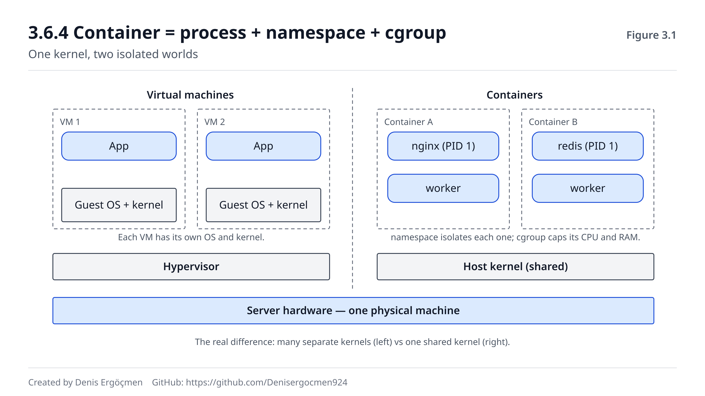

# Faz 3 — Process ve Kaynak Yönetimi: Çalışan Sistem

> **Navigasyon:** [◀ Ara Sınav 1](Ara_Sinav_1.md) · **Faz 3** · [Faz 4 — Bellek, I/O ve Performans ▶](Faz_4_Bellek_IO_Performans.md)

---

## Nereden geliyoruz

Faz 0'da çekirdeğin tek kapısını (syscall) kurduk. Faz 1'de o kapıya shell üzerinden gitmeyi,
Faz 2'de ise her isteğin arkasında **bir kimlik** olduğunu öğrendik: çekirdek bir syscall'ı yerine
getirmeden önce "bunu isteyen kim?" diye sorar.

Ama şimdiye kadar hep **durağan** bir resme baktık: dosya kimin, izni ne, hangi kullanıcı hangi
komutu çalıştırabilir. Bir şeyi hiç soramadık: **"bu makine şu an ne yapıyor?"**

Faz 2'nin son sorusunu hatırla — neden nginx aynı anda `root` ve `www-data` kimlikleriyle process
çalıştırır? O soruyu cevaplarken bir kelimeyi kullandık ama üstüne hiç gitmedik: **process.** Bir
process'in kimliği olduğunu biliyoruz (Faz 2), ama kendisini — nasıl doğduğunu, kim tarafından
başlatıldığını, hangi durumda olduğunu, ne kadar kaynak yediğini — henüz görmedik.

Faz 0, 1 ve 2'den üç şey burada doğrudan işe yarayacak:

- **"Her process'in bir kimliği vardır"** (Faz 2). Şimdi o kimliğin taşındığı kabın kendisine —
  process'e — bakıyoruz. `/proc/<PID>/status`'ta gördüğün `Uid` satırının yanında artık `State`,
  `PPid`, `Threads` satırlarını da okuyacağız.
- **"Her şey dosyadır"** (Faz 0). Bu fazın en güçlü aracı olan `/proc`, çalışan process'leri
  **dosya gibi** sunan sanal bir dosya sistemidir. `cat /proc/<PID>/status` bir process'i okumaktır.
- **`sudo` bir process'i farklı kimlikle başlatır** (Faz 2). Şimdi o "başlatma"nın altındaki
  mekanizmayı (`fork` + `exec`) açacağız.

## Bu fazın sorusu

Bir cloud engineer'in gününün büyük kısmı tek bir soruyla geçer:

> *"Sistem şu an ne yapıyor, ve kaynağı ne yiyor?"*

CPU %100'de takılı — hangi process? Bellek dolmuş, bir şey OOM ile öldürülmüş — kim yedi? Bir
servise `systemctl stop` dedin ama durmuyor. Bir container beklenenden çok CPU kullanıyor.
`kill` işe yaramıyor, process bir türlü ölmüyor.

Bu fazın sonunda bir sunucuya girip `top` açtığında, gördüğün tabloyu ezberden değil **modelden**
okuyabileceksin: bu process neden D durumunda, bu neden zombie, bu neden ebeveyni PID 1 olmuş. Ve
en önemlisi: **container'ların hafif bir sihir değil, sadece cgroup + namespace ile sınırlandırılmış
sıradan process'ler** olduğunu göreceksin — bu, ileride EC2/EKS kararlarının temeli.

---

## Bu fazın sonunda

- Bir process'in PID, PPID ve durumunu okuyabilecek; PID 1'in (init/systemd) neden özel olduğunu
  açıklayabileceksin
- Bir process'in başka bir process'i nasıl doğurduğunu (`fork` + `exec`) adım adım anlatabileceksin
- `ps` çıktısındaki process durumlarını (R, S, D, T, Z) tanıyacak; **zombie** ve **D-state**'in
  neden farklı sorunlar olduğunu ve neden `kill -9`'un D-state'i öldüremediğini bileceksin
- Thread ile process arasındaki farkı ve bunun vCPU sayısıyla ilişkisini açıklayabileceksin
- SIGTERM, SIGKILL ve SIGHUP arasındaki farkı bilecek; bir container/instance kapanırken neden önce
  SIGTERM geldiğini ve "graceful shutdown"ın neden önemli olduğunu açıklayabileceksin
- Job control'ü (`&`, `nohup`, `jobs`, `fg`/`bg`) ve `nice`/`renice` ile CPU önceliğini
  kullanabileceksin
- `ulimit`, cgroup ve namespace'in ne işe yaradığını; **cgroup + namespace = container** denklemini
  açıklayabileceksin
- `ps aux`, `top`/`htop`, `pgrep`/`pkill` ve `/proc/<PID>/` ile "CPU'yu kim yiyor" sorusunu
  metodolojiyle daraltabileceksin

---

## Faz haritası

| Bölüm | Konu | Derinlik | Neden burada |
|---|---|---|---|
| 3.1 | Process anatomisi: PID, PPID, init; `fork` + `exec` | `[mekanizma]` | Çalışan sistemin atomu; "process nereden gelir" |
| 3.2 | Process durumları: R, S, D, T, Z | `[mekanizma]` | **Fazın teşhis kalbi** — `top`/`ps` okumanın anahtarı |
| 3.3 | Thread vs process | `[kavram]` | vCPU kararlarının ve "çok çekirdek neden hızlandırmadı"nın altı |
| 3.4 | Sinyaller: SIGTERM, SIGKILL, SIGHUP | `[mekanizma]` + `[uygulama]` | Bir process'i **doğru** durdurmak; graceful shutdown |
| 3.5 | Job control ve öncelik: `&`, `nohup`, `nice` | `[kavram]` | Uzun işleri yönetmek; CPU önceliği |
| 3.6 | Kaynak sınırları: `ulimit`, cgroup, namespace | `[mekanizma]` + `[uygulama]` | **Container'ın gerçeği burada** — EC2/EKS'in temeli |
| 3.7 | Gözlem araçları: `ps`, `top`, `pgrep`, `/proc` | `[uygulama]` | "CPU'yu kim yiyor" refleksi |
| 3.8 | Bu faz bozulunca | — | Process ve kaynak arızalarının imzaları |

> **Bu fazda nasıl çalışmalı:** Bu fazdaki komutların çoğu 🟢 (sadece okur — `ps`, `top`, `/proc`
> okuma) veya 🟡 (geçici: `sleep &` ile arka plana iş atmak, `nice` ile bir işi başlatmak). Birkaç
> kutu 🔴 işaretli: `kill -9` ile bir process öldürmek veya `renice` ile önceliğini değiştirmek —
> **yanlış PID'yi öldürürsen** çalışan bir servisi düşürebilirsin. Bu kutuları önce kendi
> başlattığın zararsız bir `sleep` process'i üzerinde dene. cgroup/namespace kutularının çoğu
> makinesiz de okunabilir; ama bir Ubuntu makinen varsa `systemd-run` ile bir cgroup limitini
> **canlı görmek** bu fazın en aydınlatıcı anıdır.

---
---

# 3.1 Process Anatomisi

## 3.1.1 PID, PPID ve init: her process'in bir kimliği ve bir ebeveyni var `[mekanizma]`

Faz 2'de "her process'in bir UID/GID'si var" dedik — bu process'in **kim adına** çalıştığıydı.
Şimdi process'in **kendi** kimliğine bakıyoruz: her çalışan process'in bir **PID**'si (Process ID —
pi-ay-di) vardır. PID, çekirdeğin o process'e verdiği benzersiz sayıdır; makinedeki her process'i
tek bir sayı tanımlar.

Ama process'ler havadan doğmaz. Her process'i **başka bir process başlatır** — ve başlatan
process'in PID'si, doğan process'in **PPID**'sidir (Parent PID — ebeveyn PID'si). Bu, sistemi bir
**ağaç** yapar: her process'in bir ebeveyni vardır, ve ağacın kökünde tek bir process durur.

> **🔧 Makinende gör** 🟢 — bir process'in kimlik satırları
>
> ```
> $ echo $$              # mevcut shell'in kendi PID'si
> 4123
> $ ps -o pid,ppid,user,comm -p $$
>     PID    PPID USER     COMMAND
>    4123    4118 ubuntu   bash
> ```
>
> Shell'inin PID'si 4123, ebeveyni (PPID) 4118. Peki 4118 kim? Muhtemelen seni içeri alan `sshd`
> process'i. Onun ebeveyni de bir üst `sshd`, onunki de... yukarı doğru gidersen hep **PID 1'e**
> çıkarsın.

**Ağacın kökü: PID 1.** Çekirdek boot'un sonunda **tek bir** kullanıcı-uzayı process'i başlatır ve
ona PID 1 verir. Modern sistemlerde bu process **systemd**'dir (eski sistemlerde `init`). Diğer her
process, doğrudan veya dolaylı olarak, PID 1'in bir torunudur.

> **🔧 Makinende gör** 🟢 — PID 1 kim?
>
> ```
> $ ps -p 1 -o pid,comm
>     PID COMMAND
>       1 systemd
> $ pstree -p | head -5      # ağacı görsel olarak
> systemd(1)─┬─systemd-journal(412)
>            ├─sshd(890)───sshd(4118)───bash(4123)───pstree(4200)
>            └─...
> ```
>
> `pstree` çıktısında kendi `bash`'inden yukarı `sshd → sshd → systemd(1)` zincirini gör. Bu tam da
> `echo $$`'tan başlayıp PPID'leri takip ettiğinde yürüyeceğin yol.

PID 1'in iki özel görevi vardır ve ikisi de bu fazın ilerisinde karşımıza çıkacak:

1. **Öksüz process'leri evlat edinmek.** Bir process'in ebeveyni, o daha bitmeden ölürse, çocuk
   **öksüz** kalır. Çekirdek öksüzü hemen PID 1'e bağlar — yani PPID'si 1 olur. Bu yüzden bir
   process'in PPID'sini 1 görürsen, "ebeveyni ölmüş, systemd evlat edinmiş" diye okursun (3.1.2'de
   `nohup` ve 3.2'de zombie ile bağlanacak).
2. **Ölen çocukların "cesedini kaldırmak"** (reaping). Bir process öldüğünde çekirdek onun çıkış
   kodunu ebeveyni okuyana kadar saklar; ebeveyn okumazsa **zombie** oluşur. PID 1 evlat edindiği
   process'leri düzenli olarak `wait` eder — bu yüzden gerçek bir init process'i olmadan (örneğin
   yanlış kurulmuş bir container'da) zombie'ler birikebilir.

> **⚠️ Yaygın yanılgı: "PID sabit bir şeydir, bir programın hep aynı PID'si olur."**
> Hayır. PID her **çalıştırmaya** özeldir; aynı programı iki kez çalıştırırsan iki farklı PID alır.
> PID'ler process bitince geri dönüşüme girer (çekirdek bir süre sonra aynı sayıyı başka bir
> process'e verebilir). Bu yüzden bir PID'yi "kalıcı kimlik" gibi saklamak (örneğin bir script'te)
> tehlikelidir — o PID öldükten sonra aynı numara bambaşka bir process'e ait olabilir ve yanlış
> process'i `kill` edebilirsin (3.4 ve 3.7'de bu tuzağa döneceğiz).

**PID 1'in özel bir dokunulmazlığı da var:** çekirdek PID 1'e gönderilen ve varsayılan davranışı
"öldür" olan sinyalleri (SIGTERM, SIGKILL dahil) **yok sayar**, ta ki PID 1 o sinyal için bir
işleyici (handler) kurmuş olsun. Sebep basit: PID 1 ölürse sistem çöker (kernel panic). Bu yüzden
`kill -9 1` bir işe yaramaz — systemd yalnızca kendi tanımladığı sinyallere (örneğin yeniden
yükleme) yanıt verir.

> **🤔 Düşün 3.1**
> Bir terminalde `sleep 1000 &` yazıp arka plana attın, sonra o terminali (shell'i) kapattın. Ama
> `ps aux | grep sleep` hâlâ process'i gösteriyor ve PPID'si artık 1. Ne oldu — process neden
> ölmedi, ve PPID neden 1'e döndü?
> *(Cevap: fazın sonunda)*

---
---

# 3.2 Process Durumları

## 3.2.1 R, S, D, T, Z: bir process'in yaşam durumları `[mekanizma]`

Bir process her an "çalışıyor" değildir. Çoğu process ömrünün büyük kısmını **bekleyerek** geçirir:
diskten veri gelsin, bir tuşa basılsın, ağdan paket gelsin diye. Çekirdek her process için bir
**durum** (state) tutar, ve bu tek harf, `top`/`ps` çıktısını okumanın anahtarıdır.

`ps` çıktısındaki `STAT` sütununda gördüğün beş temel durum:

| Kod | Durum | Ne demek |
|---|---|---|
| **R** | Running / Runnable | CPU'da çalışıyor **ya da** çalışmaya hazır, sırada bekliyor |
| **S** | Sleeping (interruptible) | Bir olay bekliyor (I/O, timer, tuş); sinyalle uyandırılabilir |
| **D** | Uninterruptible sleep | Genellikle **disk/NFS** I/O'sunda kilitli; sinyalle uyandırılamaz |
| **T** | Stopped | Durdurulmuş (Ctrl+Z veya SIGSTOP); `fg`/`bg` ile devam eder |
| **Z** | Zombie | Ölmüş ama ebeveyni çıkış kodunu henüz okumamış |

> **🔧 Makinende gör** 🟢 — durumları canlı say
>
> ```
> $ ps -eo stat,comm | sort | uniq -c | sort -rn | head
>     180 S    ...        # ezici çoğunluk uyuyor — bu NORMALDİR
>      12 Ss   ...
>       3 R    ...        # şu an gerçekten çalışan birkaç process
>       2 Ssl  ...
>       1 R+   ...        # bu senin ps komutun
> ```
>
> **En önemli gözlem:** Sağlıklı bir sistemde process'lerin ezici çoğunluğu `S` (uyuyor)
> durumundadır. "100 process var ama CPU %5" çelişki değildir — o 100 process'in 97'si bir olay
> bekliyor, CPU'yu tüketmiyor. Bu, `top`'u ilk açtığında paniklememenin anahtarıdır.

`STAT` sütununda tek harfin yanına eklenen işaretler de bilgi taşır: `s` (session leader — oturum
lideri), `l` (çok-thread'li), `+` (foreground process grubunda), `<` (yüksek öncelik, negatif nice),
`N` (düşük öncelik). Örneğin `Ssl` = uyuyan, oturum lideri, çok-thread'li bir servis; `R+` =
çalışan, foreground'daki komutun (çoğu zaman senin `ps`'in).

> **❓ Akla gelen soru: "R hem 'çalışıyor' hem 'çalışmaya hazır' demekse, gerçekten CPU'da olan
> hangisi?"** Çekirdek açısından ikisi aynı kuyruktadır (runqueue). Fiziksel çekirdek sayısı kadar
> process aynı anda **gerçekten** çalışır; gerisi "runnable" — hazır ama sıra bekliyor. `top`'ta
> "load average" dediğimiz sayı bu R durumundaki (çalışan + bekleyen) process'lerin **artı** `D`
> durumundakilerin (kesintisiz uyku, genelde disk I/O'sunu bekleyen — bkz. 3.2.3) sayısının bir
> ortalamasıdır (Faz 4'te açacağız). Yani yüksek load = "çok process CPU'yu (R) ya da diski (D)
> istiyor"; tek başına "CPU meşgul" demek değildir.

## 3.2.2 Zombie: ölmüş ama gömülmemiş `[mekanizma]`

Zombie ismi kulağa tehlikeli gelir ama aslında bir zombie **hiçbir kaynak tüketmez** — ne CPU, ne
bellek. Zombie, çekirdeğin process tablosunda tutulan küçük bir **kayıttan** ibarettir: sadece PID
ve çıkış kodu.

Neden var? Faz 3.1'de gördük: bir process öldüğünde çekirdek onun çıkış kodunu **ebeveyni okuyana
kadar** saklar. Ebeveyn `wait()` (veya `waitpid`) syscall'ı ile bu kodu okur — buna "reaping"
(hasat) denir. Ebeveyn bunu yaparsa zombie kaydı hemen silinir. Ebeveyn **yapmazsa** (buggy kod,
`wait` çağırmayı unutan bir program) çocuk zombie olarak asılı kalır.

> **🔧 Makinende gör** 🟡 — bir zombie yarat ve gör
>
> ```
> $ ( sleep 0.1 & exec sleep 5 ) &     # bir alt kabuk: çocuk hızlı ölür, ebeveyn wait etmez
> [1] 5230
> $ sleep 1; ps -o pid,ppid,stat,comm --ppid 5230
>     PID    PPID STAT COMMAND
>    5231    5230 Z    sleep <defunct>       # <defunct> = zombie
> ```
>
> `<defunct>` ve `Z` — bu bir zombie. Ebeveyn (5230, `sleep 5`) beş saniye boyunca `wait` etmediği
> için çocuğun cesedi asılı. Ebeveyn ölünce (5 sn sonra) zombie PID 1'e devredilir ve systemd onu
> hemen `wait` edip temizler. Bu yüzden zombie'ler genelde **kendiliğinden** kaybolur.

**Zombie ne zaman sorun olur?** Tek bir zombie zararsızdır. Ama bir ebeveyn process sürekli çocuk
doğurup hiç `wait` etmiyorsa, zombie'ler **birikir** ve sonunda process tablosu (PID uzayı) dolar —
o noktada sistem yeni process başlatamaz (`fork: Cannot allocate memory` gibi hatalar, oysa bellek
boştur). Suçlu zombie'ler değil, **`wait` etmeyen ebeveyndir.**

> **⚠️ Yaygın yanılgı: "Zombie'leri `kill -9` ile öldürürüm."**
> Bir zombie'yi öldüremezsin — o **zaten ölü.** `kill` bir sinyal gönderir, ama sinyali alacak bir
> çalışan process yok; geriye sadece bir kayıt kalmış. Zombie'yi temizlemenin tek yolu **ebeveyninin
> onu `wait` etmesidir.** Çözüm: ebeveyni düzelt (kod), ya da ebeveyni öldür/yeniden başlat — o
> zaman zombie PID 1'e devredilir ve systemd temizler. Yani zombie'lerle savaşırken hedef **çocuk
> değil, ebeveyndir** (`ps -o ppid= -p <zombie_pid>` ile ebeveyni bul).

## 3.2.3 D-state: sinyalle bile uyandırılamayan process `[mekanizma]`

`D` durumu (uninterruptible sleep) bu fazın en çok yanlış anlaşılan durumudur — ve production'da en
sinir bozucu olanıdır. Bir process `D` durumundaysa, çekirdeğin içinde bir işlemin (genellikle disk
veya ağ I/O'su) **tamamlanmasını** bekliyordur, ve bu bekleme sırasında **hiçbir sinyal** onu
uyandıramaz — `SIGKILL` (`kill -9`) bile.

Neden? Çünkü process, çekirdeğin ortasında, bir donanım işleminin sonucunu bekliyor. Eğer çekirdek
onu yarıda kesip öldürseydi, o anda yapılmakta olan I/O (örneğin bir disk yazması) **tutarsız** bir
durumda kalabilirdi. Bu yüzden çekirdek "bu işlem bitene kadar bu process'e kimse dokunamaz" der.

> **🔧 Makinende gör** 🟢 — D-state'i ara (genelde bulamazsın, bu iyi)
>
> ```
> $ ps -eo stat,pid,comm | awk '$1 ~ /D/'
> (çıktı yok — sağlıklı bir sistemde anlık D nadirdir)
> ```
>
> Sağlıklı bir sistemde `D` durumunu yakalaman zordur çünkü modern diskler I/O'yu milisaniyelerde
> bitirir. **Uzun süreli** `D` görüyorsan (özellikle NFS mount'larında veya arızalı bir diskte) bu
> bir alarmdır: alttaki depolama takılmış demektir.

**Neden `kill -9` bir D-state process'i öldüremez?** Çünkü `kill -9` bir sinyaldir, ve sinyaller
process'e ancak o **çekirdekten kullanıcı-uzayına döndüğünde** teslim edilir. D durumundaki process
çekirdeğin içinde kilitli; kullanıcı-uzayına dönmüyor, dolayısıyla sinyal kuyruğa girer ama asla
teslim edilmez. Process ancak beklediği I/O **tamamlanınca** (veya zaman aşımına uğrayınca) uyanır,
ve o an biriken sinyali alır.

Bunun pratik sonucu cloud'da nettir: bir EBS volume'u veya NFS mount'u yanıt vermeyi kestiyse, ona
erişen process'ler `D` durumuna düşer ve **hiçbir şekilde** öldürülemez — ne `kill -9`, ne
`systemctl stop`. Tek çözüm ya depolamayı geri getirmek ya da (son çare) makineyi yeniden
başlatmaktır. "Process bir türlü ölmüyor, `kill -9` bile işe yaramıyor" cümlesini duyduğunda ilk
bakacağın yer `ps` çıktısındaki `D` harfi ve altındaki disk/NFS'tir.

> **🤔 Düşün 3.2**
> `top` açtın; bir process `D` durumunda ve makinenin **load average**'ı 8.0'a fırlamış, ama CPU
> kullanımı sadece %3. Nasıl olur da neredeyse hiç CPU kullanılmıyorken load bu kadar yüksek? (İpucu:
> load average hangi process durumlarını sayar?)
> *(Cevap: fazın sonunda)*

---
---

# 3.3 Thread ve Process

## 3.3.1 Aynı adres uzayını paylaşmak: thread nedir `[kavram]`

Şimdiye kadar "process" dedik ve her process'i izole bir birim gibi düşündük: kendi belleği, kendi
kimliği, kendi dosya tanıtıcıları. Bu doğru. Ama bir process'in **içinde** birden fazla **iş
parçacığı** (thread) olabilir ve bunlar aynı belleği paylaşır.

Farkı tek cümlede kur:

- **Process** = kendi **adres uzayına** (belleğine) sahip bir çalışma birimi. İki process
  birbirinin belleğini doğrudan göremez — Faz 0'daki izolasyon.
- **Thread** = aynı process'in içinde, **aynı belleği paylaşan** bir çalışma akışı. Bir process'in
  10 thread'i varsa, bu 10 akış aynı değişkenlere, aynı açık dosyalara erişir.

Bir benzetme: process bir **ev**dir (kendi duvarları, kendi mutfağı). Thread'ler o evde yaşayan
**kişiler**dir — aynı mutfağı, aynı buzdolabını paylaşırlar. Farklı evler (process'ler)
birbirlerinin buzdolabına giremez; ama aynı evdeki kişiler (thread'ler) aynı buzdolabını kullanır —
bu hızlıdır ama biri diğerinin sütünü içerse (aynı belleği aynı anda bozarsa) sorun çıkar (race
condition).

> **🔧 Makinende gör** 🟢 — bir process'in thread'lerini say
>
> ```
> $ ps -o pid,nlwp,comm -p 1          # nlwp = number of light-weight processes = thread sayısı
>     PID NLWP COMMAND
>       1    1 systemd
> $ ps -eo pid,nlwp,comm --sort=-nlwp | head -5   # en çok thread'li process'ler
>     PID NLWP COMMAND
>    1450   48 mysqld               # veritabanı: onlarca thread
>    1120   16 containerd
>     980    9 systemd-journald
> ```
>
> `NLWP` sütunu bir process'in kaç thread'i olduğunu söyler. Linux'ta thread'ler aslında "hafif
> process"lerdir (LWP); her thread'in kendi **TID**'si (thread ID) vardır ama hepsi aynı PID
> altında toplanır. `ps -eLf` ile thread'leri tek tek görebilirsin (`LWP` sütunu = TID).

> **⚠️ Yaygın yanılgı: "Linux'ta thread ve process tamamen farklı şeylerdir."**
> Linux çekirdeği açısından şaşırtıcı gerçek: **thread de process de aynı yapıyla** (task_struct)
> temsil edilir. İkisi de `clone()` syscall'ı ile yaratılır; fark, `clone`'a hangi şeylerin
> **paylaşılacağını** söylediğindir. "Belleği paylaş, dosyaları paylaş" dersen thread olur; "hiçbir
> şeyi paylaşma, kopyala" dersen process olur (`fork` aslında `clone`'un bu haline verilen isimdir).
> Yani thread ile process arasındaki sınır katı değil, **neyin paylaşıldığının** bir ayarıdır.

## 3.3.2 Cloud bağlantısı: thread'ler ve vCPU sayısı `[kavram]`

Thread kavramı cloud'da doğrudan bir karara bağlanır: **kaç vCPU'lu bir instance seçmeliyim?**

Bir uygulama tek-thread'liyse, aynı anda sadece **bir** CPU çekirdeğini kullanabilir. Ona 16 vCPU'lu
bir instance versen bile, o uygulamanın hesaplama kısmı tek çekirdekte döner — diğer 15 çekirdek
boş durur. "Sunucuyu büyüttüm ama uygulama hızlanmadı" şikâyetinin en yaygın sebeplerinden biri
budur.

Buna karşılık çok-thread'li bir uygulama (örneğin çoğu veritabanı, web sunucusu, veya paralel
hesaplama yapan bir servis) iş yükünü birden çok thread'e böler ve bunlar farklı çekirdeklerde
**aynı anda** çalışabilir. Böyle bir uygulamada vCPU sayısını artırmak gerçekten hızlandırır — bir
noktaya kadar (thread'ler arası koordinasyon maliyeti sonunda kazancı yer; Amdahl yasası).

Pratik çıkarım: bir instance boyutu seçerken "uygulamam işi kaç thread'e bölebiliyor?" sorusunu
sor. `nproc` ile makinenin gördüğü çekirdek sayısını, `ps -o nlwp` ile uygulamanın thread sayısını
karşılaştır. Uygulama 4 thread kullanıyorsa 16 vCPU almak parayı boşa harcamaktır.

> **❓ Akla gelen soru: "vCPU gerçek bir çekirdek mi?"** Genellikle hayır — bir vCPU çoğu bulut
> sağlayıcısında fiziksel bir çekirdeğin bir **hyperthread**'idir (bir fiziksel çekirdek iki vCPU
> gibi görünür). İki hyperthread aynı fiziksel çekirdeğin bazı birimlerini paylaştığı için, 8 vCPU
> her zaman "8 kat hız" demek değildir. Bu, donanım kitabındaki CPU mimarisi konusunun altıdır;
> burada bilmen gereken: vCPU sayısı üst sınırdır, gerçek kazanç uygulamanın paralelliğine bağlıdır.

---
---

# 3.4 Sinyaller

## 3.4.1 SIGTERM, SIGKILL, SIGHUP: bir process'e nasıl "konuşulur" `[mekanizma]`

Bir process'le iletişim kurmanın en temel yolu **sinyaldir**: çekirdeğin bir process'e gönderdiği,
tek sayıdan ibaret kısa bir mesaj. `kill` komutu — isminin aksine — aslında "sinyal gönder"
komutudur; öldürmek bu sinyallerden sadece birinin **varsayılan** etkisidir.

Bir process bir sinyal aldığında üç şey olabilir: (1) sinyalin **varsayılan** davranışını uygular
(çoğu için "sonlan"), (2) sinyal için kendi **işleyicisini** (handler) kurmuşsa onu çalıştırır, ya
da (3) sinyali **yok sayar** (bloklar). Kritik nokta şudur: bazı sinyaller yakalanabilir ve
yönetilebilir, bazıları **kesinlikle** yakalanamaz.

Günlük hayatta karşına çıkacak üç sinyal:

| Sinyal | No | Varsayılan | Yakalanabilir mi | Ne için |
|---|---|---|---|---|
| **SIGTERM** | 15 | Sonlan | ✅ Evet | "Nazikçe kapan" — temizlik yapıp çık. `kill`'in varsayılanı. |
| **SIGKILL** | 9 | Sonlan | ❌ **Hayır** | "Zorla öldür" — process söz hakkı olmadan anında ölür. |
| **SIGHUP** | 1 | Sonlan | ✅ Evet | Tarihsel: "terminal kapandı". Modern: çoğu servis için "config'i yeniden yükle". |

`kill <PID>` → varsayılan olarak **SIGTERM** (15) gönderir. `kill -9 <PID>` → **SIGKILL**. `kill -1`
veya `kill -HUP` → **SIGHUP**. `kill -l` ile tüm sinyalleri listeleyebilirsin.

> **🔧 Makinende gör** 🟡 — nazik dur vs zorla öldür
>
> ```
> $ sleep 300 &
> [1] 6010
> $ kill 6010            # SIGTERM — sleep bunu yakalamıyor, nazikçe biter
> [1]+  Terminated              sleep 300
>
> $ sleep 300 &
> [1] 6042
> $ kill -9 6042         # SIGKILL — anında, söz hakkı yok
> [1]+  Killed                  sleep 300
> ```
>
> `sleep` basit bir programdır; SIGTERM'i de yakalamadığı için ikisi de onu bitirir. Fark, **karmaşık
> bir uygulamada** ortaya çıkar: SIGTERM'i yakalayan bir veritabanı, ölmeden önce açık işlemleri
> diske yazar; SIGKILL'de bu şansı olmaz.

**Neden SIGKILL yakalanamaz?** Tasarım gereği. Eğer her sinyal yakalanabilseydi, kötü yazılmış (veya
kötü niyetli) bir program tüm sinyalleri yok sayıp **öldürülemez** hale gelebilirdi. SIGKILL (ve
onun durdurma karşılığı SIGSTOP) çekirdeğin elinde tuttuğu "son söz"dür: process'e hiç haber
vermeden, doğrudan çekirdek tarafından sonlandırılır. Bu yüzden `kill -9` "işe yaramaz"sa (3.2.3),
suçlu process'in sinyali yakalaması **değildir** — process ya zombie'dir (zaten ölü) ya da D
durumundadır (çekirdekte kilitli, sinyal teslim edilemiyor).

> **⚠️ Yaygın yanılgı: "Bir şeyi durdurmak için hep `kill -9` kullanırım, en garantisi o."**
> `kill -9` en son çaredir, ilk hamle değil. Çünkü SIGKILL process'e **temizlik yapma şansı
> vermez**: yarım kalan dosya yazmaları bozulabilir, açık veritabanı işlemleri geri alınmadan
> kalabilir, geçici dosyalar silinmez, kilitler serbest bırakılmaz. Doğru refleks önce `kill`
> (SIGTERM) denemek, process'e kapanma şansı vermek; **ancak** birkaç saniye içinde ölmezse
> `kill -9`'a geçmektir. `systemctl stop` tam da bunu yapar: önce SIGTERM, bir süre bekler
> (`TimeoutStopSec`), sonra SIGKILL.

## 3.4.2 Cloud bağlantısı: graceful shutdown ve SIGTERM `[uygulama]`

Sinyaller cloud'da soyut bir konu değil — bir container veya instance her kapandığında bu mekanizma
çalışır, ve uygulamanı doğru yazıp yazmadığın burada belli olur.

**Kapanış her zaman SIGTERM ile başlar.** Şu üç senaryonun üçünde de aynı şey olur:

- `docker stop <container>` → container'ın 1 numaralı process'ine **SIGTERM** gönderir, varsayılan
  10 saniye bekler, sonra **SIGKILL**.
- Kubernetes bir pod'u sonlandırırken → **SIGTERM**, `terminationGracePeriodSeconds` (varsayılan 30
  sn) bekler, sonra **SIGKILL**.
- `systemctl stop myapp` → servise **SIGTERM**, `TimeoutStopSec` bekler, sonra **SIGKILL**.
- EC2 instance kapanırken (`shutdown`) → systemd tüm servislere **SIGTERM** yollar.

Yani senin uygulamana, kapanmadan önce her zaman "toparlanmak için birkaç saniyen var" mesajı
(SIGTERM) gelir. **Graceful shutdown**, uygulamanın bu mesajı yakalayıp şunları yapmasıdır: yeni
istek almayı durdur, işlemekte olan istekleri bitir, veritabanı bağlantısını düzgün kapat,
load balancer'a "beni listeden çıkar" de, sonra çık.

Uygulaman SIGTERM'i **yakalamıyorsa** ne olur? SIGTERM'in varsayılanı "anında sonlan"dır — yani
uygulaman işlemekte olan istekleri yarıda keser, kullanıcılar hata alır, veriler yarım kalır. Bu
yüzden production'a çıkacak her uygulamanın SIGTERM işleyicisi olmalıdır.

> **🔧 Makinende gör** 🟡 — SIGTERM'i yakalayan bir process yaz
>
> ```
> $ cat > /tmp/graceful.sh <<'EOF'
> #!/bin/bash
> trap 'echo "SIGTERM aldım, temizlik yapıyorum..."; sleep 2; echo "temiz çıkış"; exit 0' TERM
> echo "çalışıyorum (PID $$)"
> while true; do sleep 1; done
> EOF
> $ chmod +x /tmp/graceful.sh
> $ /tmp/graceful.sh &
> [1] 6210
> çalışıyorum (PID 6210)
> $ kill 6210            # SIGTERM
> SIGTERM aldım, temizlik yapıyorum...
> temiz çıkış
> [1]+  Done                    /tmp/graceful.sh
> ```
>
> `trap '...' TERM` satırı, "SIGTERM gelince şu komutu çalıştır" der. Process anında ölmek yerine
> temizlik yapıp çıkıyor. Gerçek bir uygulamada bu `trap` bloğu açık bağlantıları kapatır, load
> balancer'dan kaydını siler. **Geri alma:** process kendiliğinden çıktı; kalmadıysa `kill -9 6210`.

> **❓ Akla gelen soru: "SIGTERM'i yakalayıp hiç çıkmayan bir uygulama, `docker stop`'u sonsuza
> kadar bekletebilir mi?"** Hayır — çünkü bekleme süresi sınırlıdır. `docker stop` 10 saniye
> (Kubernetes 30 sn, systemd `TimeoutStopSec`) bekler; bu süre dolunca **SIGKILL** gönderir ve
> SIGKILL yakalanamaz. Yani en kötü ihtimalle uygulama zorla öldürülür — ama bu "kirli" bir
> kapanıştır. Amaç, uygulamanın bu süre **dolmadan** kendi kendine düzgün çıkmasıdır.

> **🤔 Düşün 3.3**
> Bir web uygulaması `docker stop` ile durdurulduğunda kullanıcıların bir kısmı "502 Bad Gateway"
> hatası alıyor. Uygulama SIGTERM'i yakalamıyor. Sinyal zinciriyle (SIGTERM → 10 sn → SIGKILL)
> düşününce, bu 502'ler tam olarak **hangi anda** ve **neden** oluşuyor? Graceful shutdown bunu nasıl
> engellerdi?
> *(Cevap: fazın sonunda)*

---
---

# 3.5 Job Control ve Öncelik

## 3.5.1 Foreground, background, `&`, `nohup`, `jobs` `[kavram]`

Bir terminalde bir komut çalıştırdığında, o komut **foreground** (ön plan) çalışır: terminalini
işgal eder, o bitene kadar başka komut yazamazsın. Çoğu komut için bu iyidir (`ls` anında biter).
Ama uzun süren bir iş için (bir yedekleme, bir derleme) terminalini bloke etmesini istemezsin.

Bu noktada **job control** devreye girer — shell'in aynı terminalden birden çok işi yönetmesi:

- **`komut &`** → komutu **arka planda** başlat, terminali hemen geri al.
- **`Ctrl+Z`** → foreground'daki komutu **durdur** (SIGSTOP, durum `T`) ve arka plana at.
- **`jobs`** → bu shell'in yönettiği işleri listele.
- **`fg %1`** → 1 numaralı işi foreground'a getir. **`bg %1`** → durdurulmuş işi arka planda
  çalıştırmaya devam ettir.

> **🔧 Makinende gör** 🟡 — bir işi arka plana at, geri çağır
>
> ```
> $ sleep 300              # foreground — terminal kilitli
> ^Z                       # Ctrl+Z: durdur
> [1]+  Stopped                 sleep 300
> $ jobs
> [1]+  Stopped                 sleep 300
> $ bg %1                  # arka planda devam ettir
> [1]+ sleep 300 &
> $ jobs
> [1]+  Running                 sleep 300 &
> $ fg %1                  # geri foreground'a al
> sleep 300
> ^C                       # Ctrl+C ile bitir
> ```

**Önemli tuzak: `&` yeterli değil.** Bir komutu `&` ile arka plana atsan bile, o komut hâlâ **bu
shell'in çocuğudur** ve senin oturumuna (terminale) bağlıdır. SSH oturumun kapandığında (veya
terminali kapattığında) çekirdek o oturumdaki process'lere **SIGHUP** gönderir — ve SIGHUP'ın
varsayılanı "sonlan"dır. Yani `komut &` ile başlattığın iş, SSH kopunca **ölebilir.**

İşte `nohup` (no hangup) tam bunu çözer: komutu SIGHUP'ı **yok sayacak** şekilde başlatır, çıktısını
`nohup.out` dosyasına yönlendirir. Böylece oturum kapansa da iş devam eder.

> **🔧 Makinende gör** 🟡 — oturumdan bağımsız iş
>
> ```
> $ nohup ./uzun_is.sh &
> nohup: ignoring input and appending output to 'nohup.out'
> [1] 6350
> $ exit                   # SSH oturumunu kapatsan bile 6350 yaşar
> ```
>
> Tekrar SSH ile girip `ps aux | grep uzun_is` dersen process'in hâlâ orada olduğunu ve PPID'sinin
> **1** olduğunu görürsün — oturum ölünce systemd onu evlat edindi (3.1.1'i hatırla). **Geri alma:**
> `kill <PID>`.

> **⚠️ Yaygın yanılgı: "Kalıcı bir servisi `nohup ... &` ile çalıştırırım, tamamdır."**
> `nohup &` tek seferlik uzun işler için iyidir (bir migration, bir toplu indirme). Ama **kalıcı bir
> servis** için yanlış araçtır: makine yeniden başlarsa iş geri gelmez, çökerse yeniden başlamaz, log
> yönetimi yoktur, başka biri nasıl durduracağını bilemez. Kalıcı servislerin doğru yeri
> **systemd**'dir (Faz 5 ve Faz 8): `systemctl` ile başlar/durur, boot'ta otomatik gelir, çökünce
> `Restart=on-failure` ile kalkar, logları `journalctl`'de toplanır. `nohup`, "şimdilik çalışsın"
> için; systemd, "hep çalışsın" için.

## 3.5.2 `nice` ve `renice`: CPU önceliği `[kavram]`

CPU sınırlı bir kaynaktır; birden çok process aynı anda CPU isterse, çekirdeğin **scheduler**'ı
kime ne kadar sıra vereceğine karar verir. Bu kararı etkileyen ayar **nice** değeridir.

nice değeri **-20** ile **+19** arasındadır ve sezgiye ters çalışır: **yüksek nice = düşük
öncelik** ("başkalarına karşı daha nazik, sıramı onlara veririm"). Varsayılan 0'dır.

- **nice +10, +19** → "acelem yok, önce başkaları çalışsın". Arka plan toplu işleri için ideal.
- **nice -10, -20** → "beni öne al". Sadece root verebilir (sıradan kullanıcı önceliğini
  **düşürebilir** ama yükseltemez).

> **🔧 Makinende gör** 🟡 — düşük öncelikli bir iş başlat
>
> ```
> $ nice -n 15 ./buyuk_hesaplama.sh &      # düşük öncelikle başlat
> $ ps -o pid,ni,comm -p $!                 # $! = son arka plan işinin PID'si
>     PID  NI COMMAND
>    6410  15 buyuk_hesaplama.sh
> $ sudo renice -n 5 -p 6410                # çalışan bir process'in önceliğini değiştir
> 6410 (process ID) old priority 15, new priority 5
> ```
>
> `NI` sütunu nice değeridir. `nice` ile **başlatırken**, `renice` ile **çalışırken** ayarlarsın.
> **Geri alma:** process bitince kaybolur; `kill 6410`.

**nice ne zaman işe yarar, ne zaman yaramaz?** nice yalnızca **CPU** için sıra ayarlar, ve yalnızca
CPU **kıtlığı** varken etkilidir. Makine boştaysa, nice +19 bir iş de tüm CPU'yu kullanır (kimse
sırayı istemiyor). Ama iki iş CPU için yarışıyorsa, düşük nice'lı olan aslan payını alır. Buna
karşılık nice **disk I/O'sunu** veya **belleği** yönetmez — bir işi disk I/O'suna göre önceliklemek
için `ionice`, gerçek kaynak **kotası** için ise cgroup gerekir (3.6). Yani nice "kibar bir rica"dır;
cgroup "katı bir kota"dır.

> **❓ Akla gelen soru: "Bir process CPU'yu %100 yiyorsa, `renice` ile düşürsem sorun çözülür mü?"**
> Genelde hayır, sadece **erteler.** Eğer o process gerçekten o işi yapmak zorundaysa, önceliğini
> düşürmek onu yavaşlatır ama iş yine yapılmalı. `renice`, *başka* önemli bir şey CPU beklerken bir
> arka plan canavarını geçici olarak geri plana itmek için iyidir. Ama "CPU neden %100" sorusunun
> **cevabı** değildir — o cevabı 3.7'deki gözlem araçlarıyla (hangi process, ne yapıyor) bulursun.

---
---

# 3.6 Kaynak Sınırları: ulimit, cgroup ve namespace

## 3.6.1 `ulimit`: process başına sınırlar `[kavram]`

Şimdiye kadar process'lerin nasıl doğduğunu, öldüğünü ve öncelendiğini gördük. Ama tek bir process
sistemi ne kadar zorlayabilir? Sınırsız mı? Hayır — çekirdek her process için bir dizi **üst sınır**
(resource limit) tutar, ve bunları `ulimit` ile görüp ayarlarsın.

En çok karşına çıkacak iki limit:

- **Açık dosya sayısı** (`ulimit -n`): bir process aynı anda kaç dosya/soket açabilir. Faz 0'dan
  hatırla — her ağ bağlantısı da bir dosya tanıtıcısıdır (file descriptor). Yüksek trafikli bir
  sunucuda bu limit dolunca `Too many open files` hatası gelir; cloud'da en sık görülen üretim
  hatalarından biri.
- **Process/thread sayısı** (`ulimit -u`): bir kullanıcı kaç process başlatabilir. Bu limit, bir
  "fork bombası"nın (kendini sonsuz kopyalayan process) tüm sistemi kilitlemesini engeller.

> **🔧 Makinende gör** 🟢 — kendi limitlerini oku
>
> ```
> $ ulimit -n              # açık dosya limiti (soft)
> 1024
> $ ulimit -Hn             # aynısının hard limiti
> 1048576
> $ ulimit -a | head       # tüm limitler
> ```
>
> **soft limit** anlık geçerli sınırdır; **hard limit** soft'un yükseltilebileceği tavandır. Sıradan
> kullanıcı soft'u hard'a kadar yükseltebilir ama hard'ı aşamaz (onu root veya
> `/etc/security/limits.conf` belirler). `Too many open files` görürsen ilk bakılacak yer `ulimit -n`
> ve servisin systemd unit'indeki `LimitNOFILE` ayarıdır (Faz 5/8).

`ulimit` **tek bir process** (ve çocukları) için sınır koyar. Ama ya "şu process **grubunun**
toplamda 512MB'tan fazla RAM kullanmasını istemiyorum" demek istersen? İşte burada `ulimit`
yetersiz kalır ve **cgroup** devreye girer.

## 3.6.2 cgroup: bir process grubunun kaynak kotası `[mekanizma]`

**cgroup** (control group — kontrol grubu) çekirdeğin bir özelliğidir: bir veya daha çok process'i
bir grup olarak toplar ve o gruba **toplu bir kaynak kotası** koyar — "bu grup en fazla %50 CPU ve
512MB RAM kullanabilir" gibi. `ulimit` process-başına bir sınırken, cgroup **grup-başına** bir
kotadır ve çok daha güçlüdür.

cgroup üç şeyi yapar:
1. **Sınırlama (limit):** gruba CPU, bellek, disk I/O, ağ için üst sınır koyar.
2. **Muhasebe (accounting):** grubun ne kadar kaynak kullandığını ölçer.
3. **İzolasyon:** bir grubun aşırı tüketiminin diğerlerini etkilemesini engeller.

cgroup'lar da "her şey dosyadır" ilkesiyle yönetilir: `/sys/fs/cgroup/` altında bir sanal dosya
sistemi olarak dururlar. Bir cgroup oluşturmak bir dizin yaratmak, limit koymak bir dosyaya sayı
yazmaktır.

> **🔧 Makinende gör** 🟡 — bir belleğe sınırlı process çalıştır (systemd ile)
>
> ```
> $ systemd-run --user --scope -p MemoryMax=100M stress --vm 1 --vm-bytes 200M
> # (stress kurulu değilse: sudo apt install stress)
> # Process 100MB'a sığmaya çalışır, 200MB isteyince cgroup onu OOM ile öldürür:
> $ journalctl --user -n 5 | grep -i memory
> ... Memory cgroup out of memory: Killed process ... (stress)
> ```
>
> `MemoryMax=100M` bu geçici cgroup'a 100MB'lık bir tavan koyar; `stress` 200MB istediğinde çekirdek
> **grubun içinde** bir OOM tetikler ve process'i öldürür — makinenin geri kalanına dokunmadan. Bu,
> "bir container bellek limitini aşınca neden öldürülür" sorusunun **tam** cevabıdır. **Geri alma:**
> `--scope` process bitince cgroup kendiliğinden silinir.

Bu deney cloud için kritik bir gerçeği gösterir: bir container `OOMKilled` olduğunda, makinenin
belleği dolmuş **olmayabilir** — sadece o container'ın **cgroup limiti** dolmuştur. "Instance'ta 8GB
RAM var, neden container öldü?" sorusunun cevabı çoğu zaman "container'a 512MB cgroup limiti
konmuştu"dur.

## 3.6.3 namespace: process'in gördüğü dünyayı izole etmek `[kavram]`

cgroup bir grubun **ne kadar** kaynak kullanacağını sınırlar. **namespace** ise bir process'in
**neyi görebileceğini** sınırlar — ona sistemin sadece bir dilimini gösterir, gerisini gizler.

Farklı namespace türleri farklı şeyleri izole eder:

- **PID namespace:** process kendi izole PID uzayını görür. İçeride kendi process'i PID 1'dir;
  dışarıdaki (host'taki) process'leri hiç göremez.
- **Mount namespace:** kendi dosya sistemi görünümü — kendi `/`, kendi mount'ları.
- **Network namespace:** kendi ağ arayüzleri, kendi IP'si, kendi routing tablosu.
- **UTS namespace:** kendi hostname'i. **User namespace:** kendi UID eşlemesi (içeride root,
  dışarıda yetkisiz olabilir).

> **🔧 Makinende gör** 🟢 — bir process'in namespace'lerini gör
>
> ```
> $ ls -l /proc/self/ns/
> lrwxrwxrwx ... pid -> 'pid:[4026531836]'
> lrwxrwxrwx ... mnt -> 'mnt:[4026531840]'
> lrwxrwxrwx ... net -> 'net:[4026531992]'
> ...
> ```
>
> Her process'in `/proc/<PID>/ns/` altında hangi namespace'lere ait olduğu yazar. İki process aynı
> köşeli-parantez-numarasını paylaşıyorsa **aynı** namespace'tedir. Bir container'ın içindeki bir
> process'e bakarsan, `net` ve `pid` numaralarının host'unkinden **farklı** olduğunu görürsün — işte
> izolasyon budur.

## 3.6.4 Denklem: container = process + cgroup + namespace `[uygulama]`

Şimdi bu fazın en önemli cümlesini kurabiliriz. Bir **container**, sihirli hafif bir sanal makine
**değildir.** Bir container, host çekirdeği üzerinde çalışan **sıradan bir process'tir** (veya
process grubudur) — sadece iki şeyle sarılmıştır:

- **namespace** ile **izole edilmiş** ("sadece kendi dünyasını görür": kendi PID 1'i, kendi ağı,
  kendi dosya sistemi),
- **cgroup** ile **sınırlandırılmış** ("şu kadar CPU/RAM kullanabilir").

Hepsi bu. Container'ın içindeki `nginx` process'i, host'ta `ps aux` yaptığında **görünür** —
sıradan bir process olarak, host'un PID uzayında kendi PID'siyle. Container onu sadece bir
namespace balonunun içine koymuş ve bir cgroup kotasıyla çevrelemiştir.



*Şekil 3.1 — Aynı host çekirdeği üzerinde iki container. Her biri sıradan process'lerden oluşur;
namespace onlara ayrı bir "dünya" (kendi PID 1'i, kendi ağı) gösterir, cgroup ise her birinin
kaynağını kotalar. VM'den farkı: ortada tek bir çekirdek vardır, ayrı işletim sistemleri yoktur.*

Bu neden "container hafif VM değildir"i açıklar? Çünkü bir **VM**'de ayrı bir işletim sistemi
çekirdeği çalışır (hypervisor üstünde tam bir kernel + userland). Bir **container**'da ise ayrı
çekirdek yoktur — tüm container'lar **host'un tek çekirdeğini** paylaşır. Bu yüzden container'lar
saniyeler değil **milisaniyeler** içinde başlar (yeni bir çekirdek boot etmek yok), çok daha az bellek
yer, ama izolasyonları VM kadar **güçlü değildir** (aynı çekirdeği paylaştıkları için bir çekirdek
açığı tüm container'ları etkileyebilir).

> **⚠️ Yaygın yanılgı: "Container'ın içi ayrı bir makine, host'tan tamamen kopuk."**
> Değil. Container'ın içindeki process host'ta **görünür ve öldürülebilir.** `docker stop` aslında o
> process'e SIGTERM göndermektir (3.4.2 — artık neden SIGTERM olduğu açık). Container "kendi PID 1'i"
> derken bu bir namespace yanılsamasıdır; host bu process'i kendi PID uzayında bambaşka bir
> numarayla görür ve yönetir. Bu içgörü ileride EKS/ECS'te "container neden öldü, host'ta ne
> görünüyor" derken hayat kurtarır.

> **🤔 Düşün 3.4**
> Bir container'a `--memory=256m` verdin. İçindeki uygulama `free -m` çalıştırınca **8GB** (host'un
> tümü) görünüyor, ama 300MB kullanmaya çalışınca OOM ile ölüyor. Neden `free` yanlış (host'un
> belleğini) gösteriyor, ama limit yine de 256MB'ta uygulanıyor? (İpucu: hangi mekanizma *görünürü*,
> hangisi *kotayı* yönetiyor?)
> *(Cevap: fazın sonunda)*

---
---

# 3.7 Gözlem Araçları

## 3.7.1 `ps`, `top`/`htop`, `pgrep`/`pkill` `[uygulama]`

Bu fazın tüm kavramları (PID, durum, thread, öncelik, kaynak) tek bir pratik soruda buluşur: **"bu
makine şu an ne yapıyor, ve kaynağı ne yiyor?"** Cevabı üç araçla bulursun.

**`ps` — anlık, tek kare fotoğraf.** Sistemin o andaki process'lerinin bir görüntüsünü verir. En çok
kullanılan iki biçim:

```
$ ps aux                 # tüm process'ler, kullanıcı-odaklı sütunlarla
USER  PID %CPU %MEM   VSZ   RSS STAT START   TIME COMMAND
root    1  0.0  0.1 16788  9012 Ss   09:00   0:02 /sbin/init
www-d 890  2.3  1.2 72340 51200 S    09:05   0:31 nginx: worker
$ ps -ef                 # aynı bilgi, ebeveyn (PPID) sütunlu, hiyerarşi-odaklı
```

`ps aux` sütunlarını okumak bu fazın özetidir: `PID` (3.1), `STAT` (3.2), `%CPU`/`%MEM` (kaynak),
`VSZ`/`RSS` (bellek — Faz 4'te açılacak), `COMMAND` (ne çalışıyor). "En çok CPU yiyen kim?" için:
`ps aux --sort=-%cpu | head`.

**`top`/`htop` — canlı, akan film.** `ps`'in aksine `top` saniyede bir yenilenir; hangi process'in
**şu an** CPU/bellek yediğini canlı izlersin. `htop` (ayrı kurulur) aynı şeyin renkli, ok tuşlarıyla
gezilebilen, `F9` ile sinyal gönderilebilen dostane hâlidir.

> **🔧 Makinende gör** 🟢 — `top`'u anla
>
> ```
> $ top
> top - 14:22:01 up 5 days,  load average: 0.15, 0.20, 0.18
> Tasks: 142 total,   1 running, 141 sleeping,   0 stopped,   0 zombie
> %Cpu(s):  3.0 us,  1.0 sy, 0.0 ni, 95.5 id,  0.5 wa, ...
> MiB Mem : 7940.0 total, 4200.0 free, 1800.0 used, 1940.0 buff/cache
>   PID USER   PR  NI  %CPU  %MEM   TIME+ COMMAND
>   890 www-d  20   0   2.3   1.2  0:31.2 nginx
> ```
>
> Okuma sırası (yukarıdan aşağı): **load average** (3.2.1 — R+D durumundaki iş yükü), **Tasks**
> satırı (kaç running/sleeping/**zombie** — 3.2), **%Cpu** satırında `id`=boşta, `wa`=I/O beklemesi
> (yüksek `wa` = disk darboğazı, Faz 4), **Mem** satırı (Faz 4), sonra process listesi. `P` ile
> CPU'ya, `M` ile belleğe göre sırala; `k` ile bir PID'ye sinyal gönder; `1` ile çekirdekleri tek tek
> gör; `q` ile çık.

**`pgrep`/`pkill` — isimle bul, isimle sinyal gönder.** PID ezberlemek yerine isimle çalışırsın:

```
$ pgrep -a nginx         # nginx içeren process'leri PID'leriyle listele
890 nginx: worker process
891 nginx: worker process
$ pkill -TERM nginx      # hepsine SIGTERM gönder (dikkatli!)
```

> **⚠️ Yaygın yanılgı: "`pkill java` ile sadece istediğim uygulamayı öldürürüm."**
> `pkill` ismi eşleşen **tüm** process'leri vurur. Makinede üç farklı Java servisi varsa, `pkill
> java` üçünü de öldürür. Aynı şekilde `pkill -f app` komut satırında "app" geçen her şeyi (belki
> `myapp`, belki `apparmor` ile ilgili bir şeyi) hedefleyebilir. Bir `pkill` çalıştırmadan önce
> **her zaman** aynı desenle `pgrep -a` çalıştırıp **kimi vuracağını gör.** Production'da bu
> alışkanlık, yanlışlıkla başka bir servisi düşürmenin önündeki tek settir.

## 3.7.2 `/proc/<PID>/`: bir process'in içine bakmak `[uygulama]`

`ps` ve `top` özet verir; ama bir process hakkında **her şeyi** öğrenmek istersen kaynağa gidersin:
`/proc/<PID>/`. Faz 0'daki "her şey dosyadır" ilkesinin en güçlü örneği — çalışan bir process'in tüm
iç durumu burada dosya olarak durur.

| Yol | Ne söyler |
|---|---|
| `/proc/<PID>/status` | Durum, PPID, UID/GID, thread sayısı, bellek özeti — insan-okur |
| `/proc/<PID>/cmdline` | Process'i başlatan tam komut satırı (argümanlarıyla) |
| `/proc/<PID>/cwd` | Process'in çalışma dizini (sembolik link) |
| `/proc/<PID>/exe` | Çalışan ikili dosyanın kendisi (sembolik link) |
| `/proc/<PID>/fd/` | Process'in **açık dosya tanıtıcıları** — hangi dosya/soketleri açık |
| `/proc/<PID>/limits` | Bu process'e uygulanan ulimit değerleri |
| `/proc/<PID>/environ` | Ortam değişkenleri (3.1'den hatırla: sadece sahibi okur) |

> **🔧 Makinende gör** 🟢 — "bu process ne yapıyor?" derinlemesine
>
> ```
> $ pgrep -a nginx | head -1
> 890 nginx: worker process
> $ cat /proc/890/cmdline | tr '\0' ' '; echo    # başlatıldığı tam komut
> nginx: worker process
> $ sudo ls -l /proc/890/fd | head               # açık dosya ve soketleri
> lrwx------ ... 3 -> 'socket:[28451]'            # bir ağ bağlantısı
> l-wx------ ... 5 -> /var/log/nginx/access.log   # yazdığı log dosyası
> $ sudo cat /proc/890/limits | grep 'open files' # bu process'in dosya limiti
> Max open files  1024  524288  files
> ```
>
> Bu, "bir process CPU'yu/diski yiyor ama **ne yapıyor** bilmiyorum" durumunun çözümüdür:
> `/proc/<PID>/fd` ile hangi dosyaları/soketleri açtığını, `cmdline` ile tam olarak nasıl
> başlatıldığını görürsün. "Too many open files" hatası alan bir servis için `ls /proc/<PID>/fd |
> wc -l` ile kaç dosya açtığını sayıp `limits` ile karşılaştırırsın.

## 3.7.3 Bir araya getir: "CPU'yu kim yiyor" refleksi `[uygulama]`

Bu fazın araçları tek bir metodolojide birleşir. Bir sunucu yavaşladığında sırayla:

1. **`top`** (veya `uptime`) → load average yüksek mi? `%Cpu` satırında zaman nerede geçiyor —
   `us` (kullanıcı kodu), `sy` (çekirdek), `wa` (I/O beklemesi)?
2. **`top` içinde `P`** → CPU'ya göre sırala, en üstteki PID'yi al.
3. **`ps -p <PID> -o pid,ppid,user,stat,cmd`** → o process kim, kimin çocuğu, hangi durumda?
4. **`/proc/<PID>/`** → tam olarak ne yapıyor: `cmdline`, `fd/` (hangi dosya/soket), gerekiyorsa
   `sudo cat /proc/<PID>/status`.
5. Karar: gerçekten gerekli bir iş mi (o zaman `renice` veya kaynak ekle), yoksa kaçak/hatalı bir
   process mi (o zaman önce `kill` SIGTERM, sonra gerekirse `kill -9`)?

Bu beş adım, "bir şeyi tahmin etmeden, veriyle daraltarak bulmak"tır — Faz 11'de tüm sistemler için
genelleyeceğimiz **adli refleksin** process ayağı.

---
---

# 3.8 Bu Faz Bozulunca — Arıza İmzaları

Process ve kaynak dünyasında "gizemli" görünen çoğu arıza, aslında bu fazın birkaç mekanizmasının
belirtisidir. Aşağıdaki tablo, sahada göreceğin belirtileri bu fazın mekanizmalarına bağlar:

| Belirti | Muhtemel mekanizma | Nerede anlatıldı | İlk bakılacak yer |
|---|---|---|---|
| Process bir türlü ölmüyor, `kill -9` bile işe yaramıyor | `D` durumu — çekirdekte I/O'da kilitli | 3.2.3 | `ps -o stat`; disk/NFS sağlığı, `dmesg` |
| Bellek boş ama `fork: Cannot allocate memory` | Zombie birikimi veya `ulimit -u` doldu | 3.2.2, 3.6.1 | `ps aux | grep defunct`; `ulimit -u` |
| Bir servisi durdurdum ama process hâlâ var, PPID=1 | Ebeveyn öldü, systemd evlat edindi; asıl process ayrı | 3.1.1 | `pstree -p`; doğru PID'yi bul |
| `docker stop` 10 sn sürüyor sonra container ölüyor | Uygulama SIGTERM'i yakalamıyor, SIGKILL bekleniyor | 3.4.2 | Uygulamaya SIGTERM handler ekle |
| Kapanışta kullanıcılar 502/hata alıyor | Graceful shutdown yok; istekler yarıda kesiliyor | 3.4.2 | SIGTERM'de "yeni istek alma + bekle" |
| Sunucuyu büyüttüm ama uygulama hızlanmadı | Tek-thread'li uygulama, ekstra vCPU boşta | 3.3.2 | `ps -o nlwp`; `nproc` ile karşılaştır |
| load average 8 ama CPU %3 | Load, `D` durumundaki I/O-bekleyen process'leri de sayar | 3.2.1, 3.2.3 | `top` `wa`; hangi process `D`'de |
| `Too many open files` | `ulimit -n` (fd limiti) doldu | 3.6.1 | `ls /proc/<PID>/fd | wc -l`; `LimitNOFILE` |
| Container `OOMKilled` ama host'ta bol RAM var | cgroup **bellek limiti** doldu, host değil | 3.6.2 | Container memory limiti; `MemoryMax` |
| `nohup ... &` ile başlattığım iş SSH kopunca öldü | SIGHUP; ya `nohup` yok ya oturuma bağlı | 3.5.1 | `nohup`/systemd; PPID kontrolü |
| `pkill` yanlış servisi de öldürdü | Desen fazla geniş eşleşti | 3.7.1 | Önce `pgrep -a <desen>` ile gör |
| Bir process CPU %100, sistem yavaş | Kaçak/hatalı process ya da gerçek yük | 3.7.3 | `top`→PID→`/proc/<PID>/`→karar |

> **Bu tablonun dersi:** Process arızalarının çoğu iki soruya indirgenir — *"process hangi
> durumda?"* (`ps`'teki `STAT`: `Z` zombie'yse ebeveyni ara, `D`'yse depolamayı ara) ve *"sınırı kim
> koydu?"* (`ulimit` process başına, cgroup grup başına). "Öldüremiyorum" bir çekirdek durumudur,
> "başlatamıyorum" bir limittir, "hızlanmadı" bir paralellik sorunudur. Doğru refleks, önce durumu
> okumak (3.7'deki beş adım), sonra doğru mekanizmaya inmektir — rastgele `kill -9` yağdırmak değil.

---
---

# Faz 3 — Düşün sorularının cevapları

## Cevap 3.1 — Arka plandaki `sleep` neden ölmedi, PPID neden 1'e döndü

**Soru:** `sleep 1000 &` yazıp arka plana attın, terminali kapattın. `ps` hâlâ process'i gösteriyor
ve PPID'si 1. Ne oldu?

Aslında burada iki ayrı şey birleşiyor. **Birincisi, process neden ölmedi:** terminal
kapandığında çekirdek kabuğa (oturum lideri) **SIGHUP** gönderir, Bash da bunu işlerine iletir. SIGHUP'ın
varsayılanı "sonlan"dır — yani çoğu durumda `sleep` de **ölmeliydi.** Ölmediyse, muhtemelen terminali
kapatmak yerine kabuktan `exit` / Ctrl-D ile çıktın: Bash'in `huponexit` seçeneği varsayılan olarak
kapalıdır, bu yüzden normal çıkış arka plan işlerine HUP göndermez. (Ya da işi `disown` veya `nohup` ile
oturumdan kopardın.) Yani "ölmedi" senaryosu, SIGHUP'ın o işe **ulaşmadığı** durumdur.

**İkincisi, PPID neden 1 oldu:** `sleep`'in ebeveyni senin kabuğundu. Kabuk kapandığında `sleep`
öksüz kaldı. Faz 3.1.1'den hatırla: çekirdek öksüz bir process'i hemen **PID 1'e (systemd)**
bağlar. Bu yüzden `ps` çıktısında PPID artık orijinal kabuğun PID'si değil, `1`'dir. Yani "PPID=1"
gördüğünde okuman gereken şudur: *bu process'in orijinal ebeveyni ölmüş, systemd onu evlat
edinmiş.* Bu, uzun süren arka plan işlerinin ve daemon'ların tipik imzasıdır.

**İlgili bölüm:** 3.1.1, 3.5.1 · **Devamı:** 3.4 (SIGHUP), Faz 5 (systemd, daemon'lar)

---

## Cevap 3.2 — CPU %3 ama load average 8: nasıl?

**Soru:** Bir process `D` durumunda, load average 8.0, ama CPU kullanımı %3. Neredeyse hiç CPU
kullanılmıyorken load neden bu kadar yüksek?

**Çünkü Linux'ta load average sadece CPU'yu bekleyen process'leri saymaz — `D` durumundaki
(uninterruptible sleep, genellikle disk/NFS I/O'sunda kilitli) process'leri de sayar.** Bu, Linux'a
özgü ve çok yanlış anlaşılan bir tanımdır: load average = "çalışan (R) + çalışmaya hazır bekleyen
(R) + kesintisiz uyuyan (D)" process'lerin bir zaman ortalamasıdır.

Senaryodaki tablo tam olarak şudur: CPU boşta (%3) çünkü process'ler CPU **istemiyor** — onlar
**diski** bekliyor. Ama `D` durumundaki her process load'a "1" ekler. Eğer 8 process yavaş/arızalı
bir diske (veya yanıt vermeyen bir NFS mount'una) erişmeye çalışıp `D`'ye düştüyse, load 8'e fırlar
oysa CPU neredeyse boştur.

Bunun teşhis değeri büyüktür: **"load yüksek ama CPU boş" gördüğünde suçlu CPU değil, I/O'dur.**
`top`'ta `%Cpu` satırındaki `wa` (I/O wait) yüksektir; `ps -eo stat,comm | grep '^D'` ile `D`'deki
process'leri bulur, altındaki depolamayı (disk sağlığı, NFS bağlantısı, EBS durumu) kontrol
edersin. Yani load average'ı "CPU meşgul" diye okumak klasik bir hatadır; o aslında "CPU + disk için
kuyrukta bekleyen iş" ölçüsüdür.

**İlgili bölüm:** 3.2.1, 3.2.3 · **Devamı:** Faz 4 (load average derinlemesine, I/O darboğazı)

---

## Cevap 3.3 — `docker stop`'ta 502'ler: hangi anda, neden

**Soru:** Uygulama SIGTERM'i yakalamıyor; `docker stop` ile durdurulunca kullanıcıların bir kısmı
502 alıyor. Bu 502'ler tam olarak hangi anda ve neden oluşuyor?

Sinyal zincirini adım adım kur: `docker stop` önce container'ın 1 numaralı process'ine **SIGTERM**
gönderir. Uygulama bunu yakalamadığı için SIGTERM'in **varsayılanı** çalışır: process **anında
sonlanır.** İşte 502'ler tam bu anda oluşur — SIGTERM'in geldiği ve uygulamanın hemen öldüğü an.

Neden 502? Çünkü uygulama öldüğünde **o sırada işlenmekte olan istekler** yarıda kesilir, ve önündeki
load balancer / reverse proxy (nginx, ALB) hâlâ bu container'a istek göndermeye devam ediyordur —
container "listeden çıktım" diyemeden öldüğü için. Backend aniden bağlantıyı kapatınca proxy
"upstream'e ulaşamadım / geçersiz yanıt" der ve istemciye **502 Bad Gateway** döner. Yani 502'ler,
"proxy hâlâ ölmüş bir backend'e istek yolluyor" penceresinde oluşur.

**Graceful shutdown bunu nasıl engellerdi:** Uygulama SIGTERM'i yakalasaydı, o 10 saniyelik pencere
(SIGKILL gelmeden önce) tam da bunun için kullanılırdı: (1) sağlık kontrolünü "unhealthy" yap ki
load balancer yeni istek göndermeyi kessin, (2) hâlâ işlenmekte olan istekleri **bitir**, (3)
bağlantıları düzgün kapat, (4) sonra çık. Böylece hiçbir istek yarıda kesilmez, hiç 502 oluşmaz.
SIGTERM'i yakalamak, "birazdan öleceğim, önce elimdeki işi düzgün bitireyim" demektir — ve 10
saniye bunun için fazlasıyla yeterlidir.

**İlgili bölüm:** 3.4.1, 3.4.2 · **Devamı:** Faz 7 (load balancer, health check), Faz 8 (systemd servis)

---

## Cevap 3.4 — Container'da `free` 8GB gösteriyor ama limit 256MB'ta uygulanıyor

**Soru:** Container'a `--memory=256m` verdin. İçeride `free -m` **8GB** (host'un tümü) gösteriyor,
ama 300MB kullanınca OOM ile ölüyor. Neden `free` yanlış gösteriyor ama limit yine de uygulanıyor?

Cevap, bu fazın iki ayrı mekanizmasının **farklı işler** yapmasıdır: **namespace görünürü yönetir,
cgroup kotayı.**

`free -m` bilgiyi nereden okur? `/proc/meminfo` dosyasından. Ve klasik `/proc/meminfo`, container'ın
**mount namespace'i** içinde bile **host'un** bellek bilgisini gösterir — çünkü `/proc` bu konuda
container'a özel bir görünüm sunmaz (bu, container'ların bilinen bir "leak"idir; `free`, `top`,
`nproc` gibi araçlar sıkça host değerlerini gösterir). Yani namespace, process'e izole bir dünya
göstermeye çalışır ama bellek **raporlaması** konusunda tam izole değildir: `free` host'un 8GB'ını
görür.

Ama **limit** başka bir mekanizmayla, **cgroup** ile uygulanır. `--memory=256m`, container'ın
process'lerini 256MB'lık bir bellek cgroup'una koyar. Uygulama 300MB istediğinde, çekirdek bunu
`free`'nin ne gösterdiğine bakarak değil, **cgroup'un muhasebesine** bakarak değerlendirir: grup
kendi 256MB limitini aştı → çekirdek **grup içinde** bir OOM tetikler ve process'i öldürür. `free`'nin
8GB göstermesi bu kararı hiç etkilemez; çünkü kotayı tutan `free` değil, cgroup'tur.

Pratik ders: bir container içinde `free`/`top`/`nproc` çıktısına **güvenme** — onlar sıkça host'u
gösterir. Gerçek limitleri cgroup'tan oku: cgroup v2'de `/sys/fs/cgroup/memory.max` (limit) ve
`memory.current` (anlık kullanım). "Uygulamam neden OOM oldu, bak sistemde bol RAM var" sorusunun
cevabı hep buradadır — sistemin RAM'ine değil, **cgroup limitine** bak.

**İlgili bölüm:** 3.6.2, 3.6.3, 3.6.4 · **Devamı:** Faz 4 (bellek metrikleri, OOM), Faz 6 (/proc, /sys)

---
---

# Faz 3 — Sık sorulan sorular

### S1. `ps`, `top` ve `htop` arasında ne zaman hangisini kullanmalıyım?

- **`ps`**: tek bir **anlık kare** istediğinde — bir script'te, bir log'a kaydetmek için, ya da
  "şu an tam olarak hangi process'ler var" diye süzmek için (`ps aux --sort=-%cpu | head`). Akmaz,
  bir kez çalışır ve biter.
- **`top`**: sistemi **canlı izlemek** için — CPU/bellek zamanla nasıl değişiyor, hangi process
  öne çıkıyor. Her yerde kuruludur, sunucuya girer girmez çalıştırabilirsin.
- **`htop`**: `top`'un dostane hâli — renkli, ok tuşlarıyla gezilir, `F9` ile sinyal gönderilir,
  ağaç görünümü (`F5`) vardır. Ayrı kurmak gerekir (`apt install htop`), o yüzden production
  sunucusunda hep bulunmayabilir; bu yüzden `top`'u da bilmek şarttır.

### S2. init nedir, systemd neden PID 1, "init sistemi" ne demek?

**init sistemi**, çekirdek boot'u bitirdikten sonra başlattığı **ilk** kullanıcı-uzayı process'idir
(PID 1) ve iki iş yapar: (1) diğer tüm servisleri doğru sırayla başlatmak, (2) öksüz process'leri
evlat edinip zombie'leri temizlemek (3.1.1). Eskiden bu iş `SysV init` (script'lerle) tarafından
yapılırdı; modern dağıtımların çoğunda yerini **systemd** aldı. systemd sadece "başlatıcı" değil,
servisleri (unit'ler), logları (journald), zamanlanmış işleri (timer) ve daha fazlasını yöneten bir
bütündür — Faz 5 tamamen buna ayrılmıştır. Burada bilmen gereken: PID 1 = init = systemd, ve ağacın
kökü budur.

### S3. `kill -9` bazen neden çalışmıyor? `kill -0` ne işe yarar?

`kill -9` (SIGKILL) yakalanamaz, ama iki durumda "işe yaramaz" görünür (3.2.3): (1) process **zombie**
ise — zaten ölü, öldürülecek bir şey yok, ebeveynini bul; (2) process **`D` durumunda** ise —
çekirdekte I/O'da kilitli, sinyal teslim edilemiyor, altındaki depolamayı düzelt. Yani `kill -9`
çalışmıyorsa sorun sinyalde değil, process'in durumundadır. **`kill -0`** ise hiç sinyal göndermez;
sadece "bu PID'ye sinyal gönderebilir miyim (process var mı ve iznim var mı)?" diye kontrol eder —
script'lerde bir process'in hâlâ yaşayıp yaşamadığını test etmek için kullanılır.

### S4. Container'da PID 1 tuzağı nedir, neden `--init` gerekir?

Bir container'da senin uygulaman genelde **PID 1** olarak çalışır. Ama sıradan uygulamalar PID 1
olmak için tasarlanmamıştır: (1) zombie'leri toplamazlar (3.2.2) — çocuk process'ler doğurup ölürse
zombie birikir; (2) SIGTERM için varsayılan davranışları PID 1'de farklı çalışır — çekirdek PID 1'e
gönderilen ve handler'ı olmayan sinyalleri yok sayar (3.1.1), yani uygulaman SIGTERM'e handler
kurmadıysa `docker stop` onu **nazikçe durduramaz**, SIGKILL'i bekler. Çözüm: hafif bir init
process'i (örneğin `tini`) PID 1 olsun, uygulamanı çocuk olarak çalıştırsın ve zombie'leri
toplasın — `docker run --init` tam bunu yapar. "Container düzgün kapanmıyor / zombie birikiyor"
sorununun klasik cevabıdır.

### S5. `nice` ile cgroup CPU limiti arasındaki fark ne?

**`nice`** görecelidir ve sadece **kıtlık** anında çalışır (3.5.2): CPU için yarışan process'ler
arasında kimin öne geçeceğini belirler, ama makine boştaysa düşük öncelikli iş de tüm CPU'yu
kullanır. **cgroup CPU limiti** ise **mutlak bir kotadır**: "bu gruba en fazla 0.5 çekirdek" dersen,
makine tamamen boş olsa bile o grup yarım çekirdekten fazlasını **alamaz**. Yani `nice` "sıra
kavgasında kibar ol" der; cgroup "tavanın bu, boşta bile aşamazsın" der. Container CPU limitleri
(`--cpus=0.5`) cgroup ile uygulanır, `nice` ile değil.

### S6. "daemon" ne demek, bir process nasıl arka plan servisine dönüşür?

**daemon** (di-mın), arka planda sürekli çalışan, bir terminale bağlı olmayan servis process'idir
(isimleri genelde `d` ile biter: `sshd`, `systemd`, `dockerd`). Klasik olarak bir process, kendini
oturumundan koparıp daemon'a dönüşmek için "double fork" denen bir dans yapardı: `fork` et, ebeveyn
çıksın (çocuk öksüz kalıp PID 1'e bağlansın), yeni bir oturum aç (`setsid`), terminali bırak. Modern
dünyada bu el işçiliğine gerek yok — **systemd** servisi doğrudan doğru ortamda başlatır (Faz 5/8).
Yani "daemon yapmak" artık çoğunlukla "bir systemd unit dosyası yazmak"tır.

### S7. load average 1.0 iyi mi kötü mü?

**Çekirdek sayısına bağlı.** load average, çalışmak isteyen (R + D) process sayısının ortalamasıdır
(3.2.1); onu **çekirdek sayısına** göre okursun. Tek çekirdekli bir makinede load 1.0 = "tam dolu,
tam kapasitede" (iyi); load 4.0 = "4 kat fazla iş kuyrukta, sistem boğuluyor" (kötü). 4 çekirdekli
bir makinede ise load 4.0 = "tam dolu" demektir, 1.0 = "%25 kullanımda" (rahat). Pratik kural: load'u
`nproc` ile böl — sonuç 1'in altındaysa rahat, 1 civarıysa tam dolu, 1'in belirgin üstündeyse
kuyruk birikiyor demektir. Ve unutma: yüksek load her zaman CPU değil, `D` durumundaki I/O beklemesi
de olabilir (Cevap 3.2).

---
---

# Faz 3 — Kendini sına

Aşağıdaki 18 soruyu cevapla. Cevap anahtarı ve puanlama hemen altındadır. Amaç ezber değil,
"sistem şu an ne yapıyor" sorusunu modelle cevaplayabilmek.

## Bölüm A — Temel (1–6)

**1.** Bir process'in PPID'si nedir, ve PPID'yi `1` görmek ne anlatır?

**2.** `ps` çıktısındaki `STAT` sütununda `Z` ne demektir, ve bu process ne kadar CPU/bellek tüketir?

**3.** `kill <PID>` (bayraksız) hangi sinyali gönderir, ve bu sinyalin SIGKILL'den temel farkı nedir?

**4.** nice değeri `+15` olan bir process, nice `0` olana göre CPU önceliği açısından nerede durur?

**5.** `ulimit -n` neyi sınırlar, ve dolduğunda hangi hata mesajı görülür?

**6.** cgroup ile `ulimit` arasındaki temel kapsam farkı nedir (neyi sınırlarlar)?

## Bölüm B — Mekanizma (7–12)

**7.** Bir process `D` (uninterruptible sleep) durumundayken `kill -9` neden onu öldüremez?

**8.** Zombie bir process'i `kill -9` ile temizleyemezsin. Onu ortadan kaldırmanın **tek** yolu
nedir, ve neden?

**9.** Linux çekirdeği açısından thread ile process arasındaki fark nedir — ikisi de hangi syscall
ile yaratılır?

**10.** Load average yüksek ama CPU kullanımı düşükse, load'a katkıda bulunan process'ler büyük
olasılıkla hangi durumdadır ve neyi bekliyorlardır?

**11.** namespace ve cgroup bir container'da farklı iki işi yapar. Hangisi "ne görebilir"i, hangisi
"ne kadar kullanabilir"i yönetir?

**12.** SIGKILL ve SIGSTOP neden yakalanamayan (handler kurulamayan) sinyallerdir? Tasarım gerekçesi
nedir?

## Bölüm C — Uygulama ve muhakeme (13–18)

**13.** Bir uygulama `docker stop` ile durdurulunca kullanıcılar 502 alıyor. Uygulama SIGTERM'i
yakalamıyor. Sorun nerede, ve doğru çözüm nedir?

**14.** Bir servise `systemctl stop` dedin ama `ps` hâlâ ilgili bir process gösteriyor, PPID'si 1.
İki farklı olası açıklama yaz.

**15.** Bir container `OOMKilled` oldu ama `top` host'ta 6GB boş RAM gösteriyor. Neden öldü, ve
gerçek limiti nereden okursun?

**16.** Bir process CPU'yu %100 yiyor. Onu tahminle öldürmek yerine "ne yaptığını" anlamak için
hangi adımları, hangi sırayla izlersin?

**17.** `pkill -f worker` çalıştırmadan önce hangi tek komutu çalıştırmalısın ve neden?

**18.** 8 vCPU'lu bir instance aldın ama tek-thread'li uygulaman hızlanmadı. Bunu hangi komutla
doğrular, hangi kavramla açıklarsın?

---

## Cevap anahtarı

**1.** PPID = ebeveyn process'in PID'si; her process'i başlatan başka bir process vardır. PPID `1`
ise process'in orijinal ebeveyni ölmüş ve process systemd (PID 1) tarafından evlat edinilmiştir. ·
*3.1.1*

**2.** `Z` = zombie: ölmüş ama ebeveyni çıkış kodunu henüz `wait` etmemiş. **Hiç** CPU/bellek
tüketmez; sadece process tablosunda küçük bir kayıttır. · *3.2.2*

**3.** `kill <PID>` **SIGTERM** (15) gönderir — yakalanabilir, "nazikçe kapan". SIGKILL (9)
yakalanamaz ve process'e temizlik şansı vermeden anında öldürür. · *3.4.1*

**4.** Daha **düşük** öncelikte; yüksek nice = düşük öncelik. CPU için yarış olduğunda nice 0'lı
process önce çalışır, +15'li "sıramı sana veririm" der. · *3.5.2*

**5.** Bir process'in aynı anda açabileceği **dosya tanıtıcısı** (dosya + soket) sayısını sınırlar.
Dolunca `Too many open files` hatası gelir. · *3.6.1*

**6.** `ulimit` **tek bir process** (ve çocukları) başına sınır koyar; cgroup **bir process grubuna**
toplu kota koyar (grup toplamda şu kadar CPU/RAM). cgroup ayrıca CPU/IO gibi kaynakları da yönetir. ·
*3.6.1, 3.6.2*

**7.** Çünkü `D` durumundaki process çekirdeğin içinde bir I/O'nun tamamlanmasını bekliyordur ve
kullanıcı-uzayına dönmüyordur; sinyaller ancak process çekirdekten kullanıcı-uzayına döndüğünde
teslim edilir. Sinyal kuyruğa girer ama I/O bitene kadar teslim edilemez. · *3.2.3*

**8.** Ebeveyninin onu `wait` etmesi (reaping). Zombie zaten ölü olduğu için sinyal işe yaramaz; tek
çözüm ebeveynin çıkış kodunu okumasıdır — ya ebeveyni düzeltirsin ya öldürürsün (o zaman zombie PID
1'e devredilir ve systemd temizler). · *3.2.2*

**9.** Çekirdek açısından ikisi de **task** (task_struct) ile temsil edilir ve ikisi de `clone()`
syscall'ı ile yaratılır; fark, `clone`'a neyin paylaşılacağının (bellek, dosyalar) söylenmesidir.
Thread paylaşır, process kopyalar. · *3.3.1*

**10.** Büyük olasılıkla **`D` (uninterruptible sleep)** durumundadırlar ve **disk/NFS I/O'sunu**
bekliyorlardır. Linux'ta load, R + D durumundaki process'leri sayar; yüksek load + düşük CPU = I/O
darboğazı. · *3.2.1, 3.2.3*

**11.** **namespace** "ne görebilir"i yönetir (izole PID/ağ/dosya sistemi görünümü); **cgroup** "ne
kadar kullanabilir"i yönetir (CPU/RAM/IO kotası). Container = ikisinin birleşimi. · *3.6.3, 3.6.4*

**12.** Çünkü her sinyal yakalanabilseydi, bir program tüm sinyalleri yok sayıp **öldürülemez** hale
gelebilirdi. SIGKILL (öldür) ve SIGSTOP (durdur), çekirdeğin process'e söz hakkı vermeden
uygulayabildiği "son söz"dür. · *3.4.1*

**13.** Uygulama SIGTERM'i yakalamadığı için `docker stop`'un gönderdiği SIGTERM'de **anında ölüyor**;
işlenmekte olan istekler yarıda kesiliyor ve önündeki proxy 502 döndürüyor. Çözüm: uygulamaya SIGTERM
handler ekleyip graceful shutdown yapmak (yeni istek alma, mevcutları bitir, sonra çık). · *3.4.2,
Cevap 3.3*

**14.** (a) Asıl process bir çocuk process doğurmuştu; ebeveyn öldü ama çocuk yaşıyor ve PID 1
tarafından evlat edinildi (PPID=1). (b) `systemctl stop` yanlış process'i hedefliyor ya da servisin
gerçek ana process'i (MainPID) başka; gördüğün process ilgili ama servise bağlı değil. Her ikisinde
de `pstree -p` ve doğru PID'yi bulmak gerekir. · *3.1.1, 3.8*

**15.** Container'ın **cgroup bellek limiti** doldu (host'un RAM'i değil). Çekirdek grup içinde OOM
tetikleyip process'i öldürdü. Gerçek limiti host'un `free`'sinden değil, cgroup'tan okursun: cgroup
v2'de `/sys/fs/cgroup/.../memory.max` ve `memory.current`. · *3.6.2, 3.6.4, Cevap 3.4*

**16.** (1) `top`, `P` ile CPU'ya göre sırala, en üstteki PID'yi al; (2) `ps -p <PID> -o
pid,ppid,user,stat,cmd` ile kim/kimin çocuğu/hangi durumda; (3) `/proc/<PID>/cmdline` ve
`/proc/<PID>/fd/` ile tam ne yaptığı (hangi dosya/soket); (4) karar: gerekli iş mi (renice/kaynak
ekle) yoksa kaçak mı (SIGTERM, sonra gerekirse SIGKILL). · *3.7.3*

**17.** `pgrep -a worker` — `pkill`'in tam olarak **kimi** vuracağını önceden görmek için. Desen
beklenenden geniş eşleşirse (`worker` başka servislerde de geçiyorsa) yanlış process'leri
öldürürsün; `pgrep` bunu önce gösterir. · *3.7.1*

**18.** `ps -o nlwp -p <PID>` (veya `ps -eLf`) ile uygulamanın thread sayısına, `nproc` ile
çekirdek sayısına bakarsın. Uygulama tek-thread'liyse aynı anda tek çekirdek kullanır; ekstra vCPU'lar
boşta kalır. Kavram: paralellik uygulamaya bağlıdır, vCPU sayısı sadece üst sınırdır. · *3.3.2*

---

## Puanlama

| Doğru sayısı | Değerlendirme |
|---|---|
| 16–18 | "Sistem ne yapıyor" sorusunu modelle cevaplıyorsun. Faz 4'e geç. |
| 12–15 | Sağlam. Kaçırdığın soruların bölümlerine bir tur dön. |
| 8–11 | Temel oturmuş ama mekanizma boşlukları var. Aşağıdaki tabloyu kullan. |
| 0–7 | Fazı baştan, 🔧 kutularını (özellikle 3.2, 3.4, 3.6) makinende çalıştırarak tekrar et. |

**Hangi soruyu kaçırırsan hangi bölüme dön:**

| Kaçırdığın soru | Dön |
|---|---|
| 1, 14 | 3.1.1 (PID, PPID, init, öksüz/evlat edinme) |
| 2, 8 | 3.2.2 (zombie ve reaping) |
| 7, 10 | 3.2.1, 3.2.3 (durumlar, D-state, load average) |
| 9, 18 | 3.3 (thread vs process, vCPU) |
| 3, 12, 13 | 3.4 (sinyaller, SIGTERM/SIGKILL, graceful shutdown) |
| 4 | 3.5.2 (nice ve öncelik) |
| 5, 6, 15 | 3.6 (ulimit, cgroup, container limitleri) |
| 11 | 3.6.3–3.6.4 (namespace, container denklemi) |
| 16, 17 | 3.7 (gözlem araçları, "CPU'yu kim yiyor" refleksi) |

---
---

# Faz 3 — Kapanış ve Faz 4'e Köprü

## Bu fazdan ne taşıyorsun

Faz 2'de her process'in bir **kimliği** olduğunu gördün. Faz 3 o process'in **kendisini** açtı:
nasıl doğduğunu, hangi durumda olduğunu, nasıl öldüğünü ve kaynağının nasıl sınırlandığını. Artık
bir sunucuya girip `top` açtığında gördüğün tabloyu ezberden değil modelden okuyorsun. Yanında dört
araç götürüyorsun:

1. **Process ağacı.** Her process'in bir PID'si, bir PPID'si ve bir ebeveyni var; kök PID 1
   (systemd). `fork`/`exec` ile doğar, öksüz kalınca PID 1 evlat edinir. "PPID=1" artık bir imza.
2. **Durum makinesi.** R/S/D/T/Z — sağlıklı sistem çoğunlukla `S`; `Z` (zombie) ebeveyni ara, `D`
   (kilitli) depolamayı ara. Load average = R + D iş yükü, "CPU meşgul" değil.
3. **Sinyaller ve doğru durdurma.** SIGTERM (nazik) → bekle → SIGKILL (zorla). Graceful shutdown ve
   "container kapanınca önce SIGTERM gelir" bir daha unutulmaz.
4. **Kaynak sınırları.** `ulimit` process başına, cgroup grup başına kota; namespace izolasyon.
   **Container = process + cgroup + namespace** — sihir değil.

## Faz 4 bunun neresine bağlanıyor

Faz 4 aynı "sistem ne yapıyor" sorusunu **kaynak** eksenine taşır: bellek, I/O ve performans
sezgisi. Faz 3'ün process modeli oraya doğrudan bağlanır:

| Faz 3'te öğrendiğin | Faz 4'te üstüne konacak |
|---|---|
| `ps`'te `%MEM`, `VSZ`, `RSS` sütunları var | RSS vs VSZ farkı, page cache, "kullanılan bellek" yanılgısı |
| cgroup bellek limiti aşılınca OOM olur | OOM Killer nasıl seçim yapar, swap, `dmesg`'te OOM okuma |
| load average R + D process sayısıdır | Load'u derinlemesine okumak, `%wa` (I/O wait), darboğaz triyajı |
| `D` durumu disk I/O beklemesidir | `iostat`, IOPS, disk darboğazını process'e bağlamak |
| `top`'ta `%Cpu` satırı us/sy/id/wa | Bu metrikleri "hangi kaynak darboğaz" kararına çevirmek |

> **Faz 3 çıktısı — devam etmeden önce kendine sor:**
> Bir sunucuda `top` açtın ve şunu gördün:
>
> ```
> top - up 3 days,  load average: 6.20, 5.90, 4.10
> Tasks: 210 total,   1 running, 206 sleeping,   0 stopped,   3 zombie
> %Cpu(s):  4.0 us,  2.0 sy,  0.0 ni, 30.0 id, 63.5 wa, ...
> ```
>
> 1. Load 6.2 ama CPU'nun büyük kısmı `wa` (I/O wait) ve `id` (boşta). Darboğaz CPU mu, disk mi?
>    Nereden anladın?
> 2. `3 zombie` bir sorun mu? Ne zaman sorun olur, ilk neye bakarsın?
> 3. Bu makinede "hangi process diski bekletiyor" sorusunu hangi iki komutla daraltırsın?
>
> Bu üç soruyu tereddütsüz yanıtlayabiliyorsan, process ve kaynak modeli oturmuş demektir — Faz 4
> bu `wa` satırının altını açacak.
>
> **Lab 3 fikri:** Kendi makinende `sleep 300 &` ile birkaç arka plan işi başlat, `jobs`/`fg`/`bg`
> ile yönet. `ps -eLf` ile bir servisin thread'lerini gör. `cat /proc/<PID>/status` ile bir
> process'in durumunu ve belleğini oku. Sonra `systemd-run --user --scope -p MemoryMax=100M stress
> --vm 1 --vm-bytes 200M` ile bir cgroup limitinin OOM'u **canlı** tetiklemesini izle — bu fazın en
> aydınlatıcı beş dakikası. Bitince arka plan işlerini `kill` ile temizle.

---

> **Navigasyon:** [◀ Ara Sınav 1](Ara_Sinav_1.md) · **Faz 3** · [Faz 4 — Bellek, I/O ve Performans ▶](Faz_4_Bellek_IO_Performans.md)
