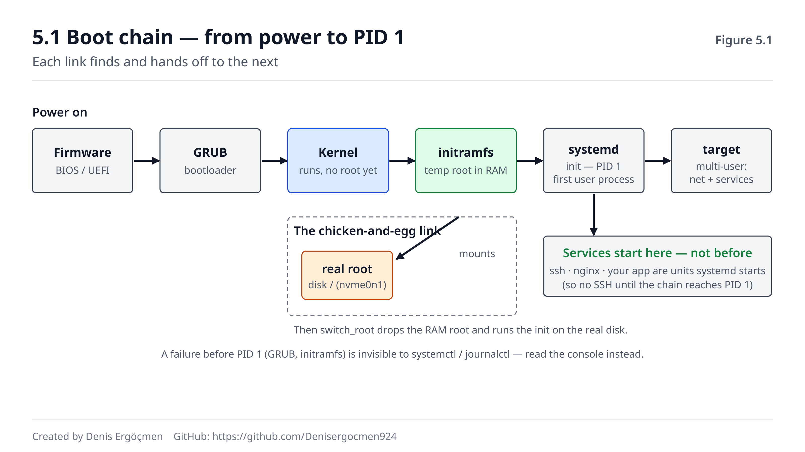

# Faz 5 — Boot, Init ve systemd: Makinenin Yaşam Döngüsü

> **Navigasyon:** [◀ Ara Sınav 2](Ara_Sinav_2.md) · **Faz 5** · [Faz 6 — Depolama ve Dosya Sistemleri ▶](Faz_6_Depolama_ve_Dosya_Sistemleri.md)

---

## Nereden geliyoruz

Faz 3 ve 4 sana **çalışan** bir sistemi okumayı öğretti: process'ler hangi durumda, kaynağı ne yiyor,
darboğaz nerede. `top` açtığında gördüğün her satırı artık modelden okuyorsun. Ama bu iki faz boyunca
bir şeyi hep hazır kabul ettik: **makine zaten çalışıyordu.** Process ağacının kökünde PID 1 = systemd
duruyordu (Faz 3.1) ve biz onu "her şeyin atası" diye bir kutu gibi kabul ettik.

Bu faz o kutuyu açıyor. Çünkü process ağacının kökündeki systemd bir kaza değil: makineyi **boot'tan**
o çalışan duruma **getiren** şey odur. Faz 4'te bir process'i OOM'dan `OOMScoreAdjust` ile koruduk —
ama o ayarın **nereye** yazıldığını (bir systemd unit dosyası) hiç görmedin. `dmesg` çekirdek
olaylarını gösteriyordu; şimdi `journalctl` ile systemd'nin merkezî log defterini okuyacaksın.

Faz 3 ve 4'ten üç şey burada doğrudan işe yarayacak:

- **PID 1 = init = ağacın kökü** (Faz 3.1). Şimdi bu PID 1'in *ne olduğunu* (systemd), makineyi
  ayakta tutmak için ne yaptığını açacağız.
- **cgroup ile kaynak sınırlama** (Faz 3.6). O cgroup limitlerinin production'da elle değil, systemd
  unit dosyalarındaki `MemoryMax=`/`CPUQuota=` satırlarıyla verildiğini göreceksin.
- **`OOMScoreAdjust` ve process korumak** (Faz 4.3). O ayarın kalıcı hâli bir `.service` dosyasında
  bir satırdır — bu fazda o satırı tanıyacaksın.

## Bu fazın sorusu

Faz 3-4 "sistem şu an ne yapıyor" sorusuna cevap verdi. Bu faz bir adım geriye gidip **başlangıcı**
soruyor:

> *"Boot'tan servise makine nasıl geliyor — ve bu zincir nerede kırılırsa instance açılmaz?"*

Cloud'da bir instance'ın bir AMI (disk imajı) görüntüsünden çalışan bir sunucuya dönüşmesinin tamamı
bu zincire dayanır. "Instance başladı ama SSH kabul etmiyor", "servis enabled ama boot'ta ayağa
kalkmadı", "user-data script'i sessizce patladı" — cloud'un en can sıkıcı arızalarının hepsi bu fazın
konusudur. Bu zinciri bilmeyen mühendis, açılmayan bir instance karşısında ne yapacağını bilemez;
bilen mühendis üç komutla nerede takıldığını bulur.

Bu fazın sonunda bir servisi `enable` etmekle `start` etmenin **neden farklı** olduğunu bileceksin
(reboot sonrası fark burada ortaya çıkar), `systemctl status` ve `journalctl` çıktısını okuyup bir
servisin neden ayağa kalkmadığını teşhis edebileceksin, ve bir EC2 instance'ının boot anında kendini
nasıl yapılandırdığını (cloud-init + user-data) anlayabileceksin.

---

## Bu fazın sonunda

- Boot zincirini sırayla açıklayabileceksin: firmware → bootloader (GRUB) → kernel → initramfs → init;
  ve initramfs'in **neden** var olduğunu (kök disk mount edilmeden önceki geçici kök) bileceksin
- init'in ne olduğunu — ilk process, PID 1, tüm process'lerin atası — ve systemd'nin neden modern
  standart init + servis yöneticisi hâline geldiğini açıklayabileceksin
- systemd unit tiplerini (service, socket, timer, target, mount) ayırt edebilecek; `systemctl
  start/stop/enable/status/restart` komutlarını ve özellikle **`enable` ≠ `start`** farkını doğru
  kullanabileceksin
- Unit'ler arası bağımlılık ve sıralamayı (`After=`, `Requires=`, `Wants=`) okuyabilecek; "servis
  enabled ama başlamadı" arızasının neden çoğunlukla bir bağımlılık sorunu olduğunu bileceksin
- `journalctl` ile systemd'nin merkezî loguna bakıp `-u servis`, `-p err`, `-b` filtreleriyle bir
  servisin bu boot'taki loglarını okuyabileceksin
- cron ile systemd timer arasındaki farkı açıklayabileceksin
- **Cloud:** cloud-init + user-data'nın bir instance'ı AMI'den çıkıp boot anında nasıl yapılandırdığını
  (paket kurma, kullanıcı ekleme, servis başlatma) ve bu zincir bozulunca nereye (`cloud-init-output.log`)
  bakılacağını anlatabileceksin

---

## Faz haritası

| Bölüm | Konu | Derinlik | Neden burada |
|---|---|---|---|
| 5.1 | Boot zinciri: firmware'den init'e | `[mekanizma]` | "Instance açılmıyor" arızasının haritası |
| 5.2 | init ve systemd: PID 1'in kimliği | `[kavram]` | Faz 3'ün PID 1 kutusunu açmak |
| 5.3 | systemd unit'leri ve `systemctl` | `[mekanizma]` + `[uygulama]` | **Fazın kalbi** — servis yönetiminin dili |
| 5.4 | journald ve `journalctl` | `[uygulama]` | "Servis neden kalkmadı" sorusunun cevabı nerede |
| 5.5 | Zamanlanmış işler: cron vs timer | `[kavram]` | Tekrarlayan işleri kim çalıştırır |
| 5.6 | Cloud-init: bulutun boot-time sihri | `[uygulama]` | **Cloud çıktısı** — AMI'den çalışan sunucuya |
| 5.7 | Bu faz bozulunca | — | Boot ve servis arızalarının imzaları |

> **Bu fazda nasıl çalışmalı:** Bu fazın gözlem komutları 🟢'dır (`systemctl status`, `systemctl
> list-units`, `journalctl`, `systemd-analyze` — sadece okur). Ama bu faz Faz 4'ten farklı: burada
> gerçekten **durum değiştiren** komutlar var. `systemctl restart/start/stop` bir servisi durdurup
> başlatır — 🟡 (geçici; ama üretim servisini durdurursan kullanıcı etkilenir). `systemctl
> enable/disable` boot davranışını **kalıcı** değiştirir — 🔴 (reboot sonrası fark eder; her 🔴 kutu
> **Geri alma** adımıyla biter). Bu yüzden bu fazın komutlarını **kendi test makinende** dene, canlı
> production'da değil. En aydınlatıcı an: bir servisi `enable` edip **başlatmadan** reboot etmek ve
> reboot sonrası onu çalışır bulmak — `enable`'ın ne demek olduğunu tek seferde oturtan deney budur.

---
---

# 5.1 Boot Zinciri: Firmware'den init'e

## 5.1.1 Zincirin tamamı: güç düğmesinden PID 1'e `[mekanizma]`

Faz 3'te process ağacının kökünde PID 1'i gördük ve "her şeyin atası" dedik. Ama PID 1'in kendisi
gökten inmez — onu oraya **bir zincir** koyar. Güç düğmesine bastığın andan `login:` istemine kadar
geçen süre aslında birbirine teslim bayrağı veren bir sıra devir-teslimdir. Her halka, bir sonrakini
bulup başlatır ve kontrolü ona **devreder**:

```
Güç → Firmware (BIOS/UEFI) → Bootloader (GRUB) → Kernel → initramfs → init (PID 1) → hedef (target)
```



Halka halka ne olur:

1. **Firmware (BIOS/UEFI).** Anakarta gömülü ilk kod. Donanımı bir tur kontrol eder (POST), sonra
   "önyüklenebilir" bir disk arar ve o diskteki **bootloader**'ı belleğe okuyup ona atlar. Firmware
   işletim sistemini bilmez; sadece "diskin başındaki kodu çalıştır" der.
2. **Bootloader (GRUB).** GRUB (adı *GRand Unified Bootloader*'dan gelir — "grab", yani kernel'i
   "kapıp" yükleyen). Görevi: hangi kernel'in, hangi parametrelerle yükleneceğine karar vermek ve o
   kernel'i (ve initramfs'i) diskten belleğe yükleyip çalıştırmak. Birden fazla kernel sürümü
   arasından seçim yapan o boot menüsü GRUB'dur.
3. **Kernel.** Belleğe yüklenen çekirdek çalışmaya başlar: donanımı (CPU, bellek, sürücüler) düzgün
   biçimde ele alır, ama henüz gerçek kök diski (root filesystem) mount edememiştir — çünkü o diski
   okumak için gereken sürücüler diskin **kendisinde** olabilir. İşte tavuk-yumurta sorunu.
4. **initramfs.** Bu tavuk-yumurta sorununu çözen **geçici, minik bir kök dosya sistemi** (bir sonraki
   alt bölümün konusu). Bellekte yaşar, gerçek kök diski mount etmek için gereken sürücüleri içerir.
   Gerçek kök diski mount ettikten sonra kontrolü ona devreder.
5. **init (PID 1).** Gerçek kök disk mount edilince kernel oradaki **ilk kullanıcı-uzayı process'ini**
   — `/sbin/init`'i (modern sistemlerde systemd) — PID 1 olarak başlatır. Faz 3'te gördüğün ağacın
   kökü tam olarak buradan doğar.
6. **Hedef (target).** systemd, "makine tam olarak nereye kadar açılsın" hedefine (örneğin
   `multi-user.target` = ağ + servisler ama grafik arayüz yok) göre servisleri sırayla ayağa kaldırır.

> **🔧 Makinende gör** 🟢 — bu boot'un kernel ve init teslim anını oku
>
> ```
> $ journalctl -b -o short-monotonic | head -20
> [    0.000000] kernel: Linux version 6.8.0-45-generic ...
> [    1.842301] kernel: Freeing initrd memory: 62800K
> [    2.104882] systemd[1]: systemd 255 running in system mode.
> [    2.110044] systemd[1]: Detected virtualization amazon.
> ```
>
> `-b` = bu boot. Soldaki saniye damgaları sıfırdan başlar: 0.0 kernel'in ilk anı, ~2.1'de
> `systemd[1]` (PID 1) devralıyor. `Detected virtualization amazon` satırı bu makinenin bir EC2
> instance'ı olduğunu bile söylüyor — cloud-init'in (5.6) devreye gireceği yer burası.

Bu zinciri bir "harita" olarak tutmanın pratik değeri şudur: **instance açılmıyor** dendiğinde arıza
bu zincirin bir halkasındadır, ve her halkanın arızası farklı bir belirti verir. GRUB bozuksa hiç
boot menüsü gelmez; initramfs kök diski bulamazsa "kurtarma kabuğuna" düşer; init aşamasında bir unit
asılırsa boot orada donar. Zinciri bilmek, belirtiyi doğru halkaya bağlamaktır.

> **⚠️ Yaygın yanılgı: "Bilgisayar açılınca doğrudan işletim sistemi başlar."**
>
> Arada en az üç bağımsız yazılım katmanı var (firmware → GRUB → kernel), ve her biri bir öncekinden
> tamamen ayrı bir programdır. "İşletim sistemi" (kernel + init) zincirin ortasında devreye girer.
> Bu yüzden "işletim sistemi açılmıyor" belirtisi çoğu zaman işletim sisteminden **önceki** bir
> halkadan (GRUB, initramfs) gelir — ve oralara işletim sisteminin araçlarıyla (systemctl, journalctl)
> ulaşamazsın; onlar henüz yüklenmemiştir.

---

## 5.1.2 initramfs: mount edilmeden önceki geçici kök `[kavram]`

Yukarıdaki zincirdeki en kafa karıştırıcı halka initramfs'tir, ve tam da tavuk-yumurta sorununu
çözdüğü için vardır. Sorunu net koyalım:

- Kernel, gerçek kök diski (`/`) mount etmek ister.
- Ama o diski okumak için bir **sürücü** gerekir (diskin türüne göre: NVMe sürücüsü, LVM, şifreli
  disk çözücü, ağ diski istemcisi...).
- O sürücü nerede duruyor? Çoğu zaman **kök diskin kendisinde**, bir dosya olarak.
- Yani: diski mount etmek için sürücü lazım, sürücüyü okumak için diski mount etmek lazım. Kilit.

initramfs (*initial RAM filesystem* — "başlangıç RAM dosya sistemi") bu kilidi kırar. GRUB, kernel
ile **birlikte** belleğe küçük bir sıkıştırılmış arşiv yükler: içinde gerçek kök diski mount etmek
için gereken minimum sürücü ve script'ler bulunan, tamamen **RAM'de** yaşayan geçici bir kök dosya
sistemi. Akış şöyle:

1. Kernel initramfs'i geçici kök (`/`) olarak kullanır — hiçbir gerçek diske dokunmadan, tamamen
   bellekte.
2. initramfs içindeki script'ler, gereken sürücüleri yükler (örneğin NVMe modülü), gerçek kök diski
   bulur ve onu mount eder.
3. Sonra bir "kök değiştirme" (`switch_root`/`pivot_root`) yapar: geçici RAM kökünü bırakıp gerçek
   diski `/` yapar ve oradaki gerçek `init`'i çalıştırır.
4. initramfs'in belleği serbest bırakılır (yukarıdaki `Freeing initrd memory` satırı tam olarak bu).

> **❓ Akla gelen soru: "Kök disk hep aynıysa initramfs neden sabit değil de her makinede farklı?"**
>
> Çünkü her makinenin kök diskine ulaşmak için gereken sürücü kümesi farklıdır: biri sade bir SATA
> diskten, biri şifreli LVM'den, biri ağ üstünden (iSCSI) boot eder. initramfs, o makinenin özel
> "diske ulaşma reçetesi"dir ve kernel güncellendiğinde (`update-initramfs`) yeniden üretilir.
> Cloud'da AMI'ler bu yüzden hedef donanıma (Nitro/NVMe) uygun initramfs ile paketlenir — yanlış
> initramfs'li bir imaj, kök diski bulamadığı için boot'ta kurtarma kabuğuna düşer.

> **🤔 Düşün 5.1** — Bir instance'ı reboot ettin ve konsol çıktısında şunu gördün:
> `Gave up waiting for root file system device. ... ALERT! UUID=abc-123 does not exist.
> Dropping to a shell!` Sonra bir `(initramfs)` istemi geldi. Bu tek ekran sana boot zincirinin
> **hangi halkasına** kadar gelindiğini ve nerede takıldığını söylüyor? SSH ile bu makineye
> girebilir misin, neden?
>
> *(Cevap: fazın sonunda)*

---
---

# 5.2 init ve systemd: PID 1'in Kimliği

## 5.2.1 init = ilk process, PID 1, her şeyin atası `[kavram]`

Faz 3'te process ağacının kökünde PID 1'i gördük. Şimdi onu tam olarak tanımlayalım: **init, kernel'in
kullanıcı uzayında başlattığı ilk process'tir**, ve PID'i her zaman 1'dir. Kernel boot'un sonunda tek
bir process başlatır — init — ve diğer **her** process bu process'in soyundan gelir (`fork` ile). Faz
3.1'de "PID 1 ağacın köküdür" derken kastettiğimiz şey buydu.

init'in iki temel görevi vardır ve bu iki görev onu sistemin bel kemiği yapar:

1. **Her şeyi başlatmak.** Boot'un son aşamasında hangi servislerin, hangi sırayla ayağa kalkacağını
   init yönetir. "Makineyi çalışır duruma getir" komutunun somut karşılığı init'in yaptığı iştir.
2. **Öksüz process'leri sahiplenmek.** Faz 3.2.2'de zombie ve öksüz (orphan) process'leri gördük.
   Bir ebeveyn, çocuğundan önce ölürse çocuk öksüz kalır — ve onu **PID 1 sahiplenir** (`reparenting`).
   PID 1, sahiplendiği bu çocuklar öldüğünde onları `wait` ile toplayıp zombie kalmalarını engeller.
   Bu yüzden PID 1'in sağlıklı çalışması sistemin tümü için kritiktir: PID 1 ölürse **kernel panik**
   eder, çünkü ağacın kökü kaybolmuştur.

> **⚠️ Yaygın yanılgı: "PID 1 de diğer process'ler gibi öldürülebilir/yeniden başlatılabilir."**
>
> PID 1 özeldir. Kernel ona gönderilen sinyalleri farklı ele alır: PID 1, açıkça bir işleyici (handler)
> tanımlamadığı sinyalleri **yok sayar** — normal bir process'i öldüren `SIGTERM` bile PID 1'e varsayılan
> olarak işlemez. Ve PID 1 herhangi bir sebeple gerçekten ölürse kernel "kernel panic — not syncing:
> Attempted to kill init!" der ve makine durur. Bu yüzden systemd, PID 1 olarak son derece sağlam ve
> minimal tutulmaya çalışılır.

## 5.2.2 systemd: neden modern standart oldu `[kavram]`

Uzun yıllar init denince akla klasik "SysV init" (script'lerle servis başlatan, sıralı ve yavaş bir
sistem) gelirdi. Bugün neredeyse tüm büyük dağıtımlar (Ubuntu, Debian, RHEL, Amazon Linux) **systemd**
kullanır. Adı "system daemon"dan gelir ("sistem-di" diye okunur — sondaki `d`, Unix'te arka plan
servislerine verilen *daemon* adının kısaltmasıdır). systemd sadece bir init değildir; iki işi
birleştirir:

- **init:** PID 1 olarak makineyi boot'tan çalışır duruma getiren ve yaşam döngüsünü yöneten şey.
- **servis yöneticisi:** Servisleri başlatan, durduran, izleyen, çökerse yeniden başlatan, kaynağını
  (cgroup ile!) sınırlayan, loglarını (journald ile) toplayan merkezî yönetici.

systemd'nin klasik init'e karşı standart olmasının üç pratik sebebi:

1. **Paralel başlatma.** Klasik init servisleri tek tek, sırayla başlatırdı — biri bitmeden diğeri
   başlamazdı, boot yavaştı. systemd bağımlılıkları bir graf olarak modeller ve birbirine bağlı
   olmayan servisleri **aynı anda** başlatır. Boot süresi ciddi düşer.
2. **Bağımlılık modeli.** "Şu servis ancak ağ ayağa kalktıktan sonra başlasın" gibi kuralları
   (`After=`, `Requires=`) açıkça tanımlarsın; systemd doğru sırayı kendisi çözer.
3. **Bütünleşik yönetim.** Servisin cgroup'u (Faz 3.6 — kaynak sınırı), logu (journald), çökünce
   yeniden başlaması (`Restart=`), boot'ta otomatik açılması (`enable`) — hepsi tek bir tutarlı
   arayüzden (`systemctl`) yönetilir. Faz 3-4'te elle gördüğün cgroup ve OOM ayarlarının **kalıcı
   evi** systemd unit dosyalarıdır.

> **💡 Cloud bağlantısı — neden her cloud mühendisi systemd bilir:** Bir EC2 instance'ında bir uygulama
> çalıştırdığında, onu "elle başlatıp SSH'ı kapatınca ölen" bir process olarak değil, bir **systemd
> servisi** olarak paketlersin (`.service` dosyası). Böylece: reboot sonrası otomatik kalkar (`enable`),
> çökerse systemd yeniden başlatır (`Restart=always`), kaynağı sınırlanır (`MemoryMax=` — Faz 4'ün OOM
> koruması), logu tek yerde toplanır (`journalctl -u uygulaman`). "Uygulamamı production'da nasıl
> çalıştırırım" sorusunun OS tarafındaki cevabı budur.

> **🤔 Düşün 5.2** — Bir meslektaşın "systemd sadece bir init, yani makineyi açan şey; uygulama
> çalışırken systemd'nin bir işi kalmıyor" diyor. Faz 3 (cgroup), Faz 4 (OOM/Restart) ve yukarıdaki
> cloud kutusundan yola çıkarak bu cümlenin **neden** eksik olduğunu bir örnekle açıkla: makine
> saatlerce ayakta çalışırken systemd hangi işi hâlâ yapıyor?
>
> *(Cevap: fazın sonunda)*

---
---

# 5.3 systemd Unit'leri ve `systemctl`

## 5.3.1 Unit nedir; beş temel tip `[mekanizma]`

systemd her şeyi **unit** denen bir soyutlamayla yönetir. Unit, "systemd'nin başlatıp yönetebileceği
bir şey"in genel adıdır — bir servis, bir zamanlayıcı, bir mount noktası hepsi birer unit'tir. Her
unit bir metin dosyasıyla (`.service`, `.timer`, `.mount`...) tanımlanır ve `systemctl` ile yönetilir.
Bilmen gereken beş tip:

| Unit tipi | Uzantı | Ne yönetir | Örnek |
|---|---|---|---|
| **service** | `.service` | Bir arka plan process'i (daemon) | `ssh.service`, `nginx.service` |
| **socket** | `.socket` | Bir servisi tetikleyen bir soket/port | `ssh.socket` — ilk bağlantıda servisi kaldırır |
| **timer** | `.timer` | Zamanlanmış tetikleme (cron benzeri) | `logrotate.timer` |
| **target** | `.target` | Bir unit grubu / boot aşaması | `multi-user.target`, `graphical.target` |
| **mount** | `.mount` | Bir dosya sistemi mount noktası | `-` (Faz 6'da fstab ile bağlanır) |

En çok `.service` ile çalışırsın. `.target` ise klasik "runlevel" fikrinin systemd karşılığıdır: bir
hedef, "makine bu noktaya kadar açılsın" demek için bir dizi unit'i gruplar. `multi-user.target` = ağ
+ tüm servisler ama grafik masaüstü yok (sunucuların normal hedefi); `graphical.target` bunun üstüne
masaüstünü ekler.

> **🔧 Makinende gör** 🟢 — makinede çalışan servisleri ve boot hedefini gör
>
> ```
> $ systemctl list-units --type=service --state=running | head -6
>   ssh.service          loaded active running OpenBSD Secure Shell server
>   cron.service         loaded active running Regular background program processing daemon
>   systemd-journald.service loaded active running Journal Service
>
> $ systemctl get-default
> multi-user.target
> ```
>
> `list-units` o an **çalışan** unit'leri; `get-default` makinenin boot'ta ulaşmaya çalıştığı hedefi
> verir. Bir sunucuda bunun `multi-user.target` olması normaldir — grafik arayüz boot'ta hiç
> başlatılmaz, boşuna kaynak yemez.

## 5.3.2 `systemctl`: bir servisin yaşam döngüsü `[uygulama]`

`systemctl` systemd'nin komut satırı arayüzüdür. Bir servisle ilgili yapacağın hemen her şey bir
`systemctl <fiil> <unit>` kalıbıdır:

| Komut | Ne yapar | Risk |
|---|---|---|
| `systemctl status ssh` | Servisin durumunu + son log satırlarını gösterir | 🟢 sadece okur |
| `systemctl start ssh` | Servisi **şimdi** başlatır | 🟡 |
| `systemctl stop ssh` | Servisi **şimdi** durdurur | 🟡 (canlıda kullanıcı etkilenir) |
| `systemctl restart ssh` | Durdurup yeniden başlatır | 🟡 |
| `systemctl reload ssh` | Process'i öldürmeden config'i yeniden okutur | 🟡 |
| `systemctl enable ssh` | Boot'ta otomatik başlamasını **kalıcı** açar | 🔴 |
| `systemctl disable ssh` | Boot'ta otomatik başlamayı kapatır | 🔴 |

> **🔧 Makinende gör** 🟢 — `systemctl status` çıktısını satır satır oku
>
> ```
> $ systemctl status ssh
> ● ssh.service - OpenBSD Secure Shell server
>      Loaded: loaded (/lib/systemd/system/ssh.service; enabled; preset: enabled)
>      Active: active (running) since Wed 2025-09-17 08:12:03 UTC; 2h 5min ago
>    Main PID: 812 (sshd)
>      Memory: 6.1M
>         CPU: 240ms
>      CGroup: /system.slice/ssh.service
>              └─812 sshd: /usr/sbin/sshd -D [listener] 0 of 10-100 startups
> ```
>
> Her satır bir faz bağlantısı: `Loaded: ... enabled` → boot'ta açılır mı (5.3.3); `Active: active
> (running)` → şu anki durumu; `Main PID: 812` → Faz 3'ün PID'i, ağaçta buradan bakabilirsin;
> `Memory / CPU` → Faz 4'ün kaynak muhasebesi; **`CGroup: /system.slice/ssh.service`** → Faz 3.6'nın
> cgroup'u! Her servis kendi cgroup'unda yaşıyor; systemd kaynağı buradan ölçüp sınırlıyor.

## 5.3.3 `enable` ≠ `start`: fazın en kritik ayrımı `[uygulama]`

Bu tek ayrım, "servis çalışıyordu ama reboot'tan sonra gitti" arızasının kökünde yatar. İki komut
**farklı zamanları** yönetir:

- **`start`** = "servisi **şimdi** başlat." Etkisi anlıktır ve **reboot'ta kaybolur**. Makineyi
  yeniden başlatırsan servis geri gelmez.
- **`enable`** = "servisi bundan sonra **her boot'ta** otomatik başlat." Bu bir kalıcı ayardır (boot
  hedefine bir sembolik link ekler). Ama **şu an başlatmaz** — sadece gelecekteki boot'lar için işaret
  koyar.

Yani dört durum mümkün:

| | `start` edildi | `start` edilmedi |
|---|---|---|
| **`enable`** edildi | Şimdi çalışıyor **ve** reboot'ta gelir ✅ | Şimdi kapalı, ama reboot'ta gelir |
| **`enable`** edilmedi | Şimdi çalışıyor, ama reboot'ta **gider** ⚠️ | Tamamen kapalı |

Sağ üst ve sol alt hücreler tüm kafa karışıklığının kaynağıdır. "Test ettim, servis çalışıyordu"
(`start` edilmiş) ama "reboot sonrası gitti" (`enable` edilmemiş) — production'da en sık yapılan
hatalardan biri. Doğru kalıp genellikle ikisini birden yapmaktır: `systemctl enable --now nginx`
(`--now` = hem enable hem start).

> **🔧 Makinende gör** 🟢 — enable/start farkını gör (sadece sorgu)
>
> ```
> $ systemctl is-enabled cron        # boot'ta açılır mı?
> enabled
> $ systemctl is-active cron         # şu an çalışıyor mu?
> active
> ```
>
> Bu iki komut sadece sorar. **Gerçek deney** — bir servisi `enable` edip **başlatmadan** reboot etmek —
> 🔴'dir (boot durumunu değiştirir). **Geri alma:** deneyden sonra ilk durumu geri koy: eğer servis başta
> `disabled` idiyse `sudo systemctl disable <servis>` ile eski hâline döndür. Enable ettiğin bir
> servisi geri almak: `sudo systemctl disable --now <servis>` (hem boot işaretini kaldırır hem şimdi
> durdurur).

## 5.3.4 Bağımlılık ve sıralama: `After`, `Requires`, `Wants` `[kavram]`

systemd'nin gücü, "önce şu, sonra bu" kurallarını açıkça modellemesidir. Bir `.service` dosyasının
`[Unit]` bölümünde üç anahtar bu ilişkiyi kurar — ve ikisini karıştırmak "servis enabled ama başlamadı"
arızasının klasik sebebidir:

- **`After=network.target`** — **sıralama.** "Bu servis, `network.target`'tan *sonra* başlasın."
  Sadece sırayı belirler; o hedefin başarılı olup olmadığını umursamaz. Bir servis ağ olmadan
  başlarsa çökebilir; `After` bunu önlemek için sırayı düzeltir.
- **`Requires=postgresql.service`** — **zorunlu bağımlılık.** "Bu servis çalışacaksa PostgreSQL de
  çalışmalı; PostgreSQL başlatılamazsa bu servis de **başlatılmaz/durdurulur**." Sert bir bağdır.
- **`Wants=redis.service`** — **isteğe bağlı bağımlılık.** "Redis de başlasın istiyorum, ama başlamazsa
  yine de ben başlarım." Yumuşak bir bağdır; `Requires`'ın esnek kardeşi ve pratikte en çok önerilen.

Kritik incelik: **`Requires` sıralama vermez.** `Requires=postgresql.service` yazıp `After=` yazmazsan,
systemd ikisini de başlatır ama **aynı anda** — senin servisin PostgreSQL hazır olmadan başlayıp
çökebilir. Doğru kalıp ikisini birlikte yazmaktır: `Requires=postgresql.service` **ve**
`After=postgresql.service`.

> **❓ Akla gelen soru: "`systemctl enable` yaptım, `status` 'enabled' diyor, ama reboot sonrası servis
> 'inactive (dead)' — neden başlamadı?"**
>
> En sık iki sebep: (1) Servisin bir `Requires=` bağımlılığı boot'ta başlatılamadı (örneğin bağlı
> olduğu bir mount veya veritabanı gelmedi), bu yüzden systemd senin servisini de başlatmadı — `systemctl
> status seninservis` ve `journalctl -u seninservis -b` bunu söyler. (2) `After=` eksik olduğu için
> servis ihtiyaç duyduğu şeyden (ağ, disk) önce başladı, çöktü. Teşhis her zaman aynı iki komuttan
> geçer (5.4). "Enabled ama çalışmıyor" neredeyse hiçbir zaman enable'ın kendisiyle ilgili değildir;
> bir bağımlılık hikâyesidir.

> **🤔 Düşün 5.3** — Bir `.service` dosyasında sadece `Requires=mnt-data.mount` yazıyor, `After=` satırı
> yok. Servis `enable` edilmiş. Bazı reboot'larda düzgün başlıyor, bazılarında "çalışamadı" hatası
> veriyor — aynı makine, aynı dosya. Faz 5.3.4'teki `Requires` vs `After` ayrımını kullanarak bu
> **kararsızlığın** (bazen çalışıp bazen çalışmama) neden ortaya çıktığını açıkla.
>
> *(Cevap: fazın sonunda)*

---
---

# 5.4 journald ve `journalctl`: Sistemin Merkezî Log Defteri

## 5.4.1 journald neden var; `journalctl` nasıl okunur `[uygulama]`

Faz 4'te `dmesg` ile çekirdek mesajlarını okuduk. Ama bir servisin (nginx, ssh, senin uygulaman)
neden çöktüğü `dmesg`'te değildir — o servisin kendi logudur. Klasik dünyada her servis kendi
dosyasına (`/var/log/nginx/...`, `/var/log/auth.log`...) yazardı ve bir olayı incelemek için hangi
dosyaya bakacağını bilmen gerekirdi. systemd bunu **merkezileştirir**: `journald` (systemd'nin log
servisi) tüm servislerin çıktısını tek bir yapılandırılmış deftere toplar, ve `journalctl` ile o
deftere tek arayüzden bakarsın.

Bilmen gereken üç filtre, bir arıza incelemesinin %90'ını kapsar:

- **`journalctl -u ssh`** — sadece **belirli bir servisin** (`-u` = unit) loglarını göster. "Bu servis
  ne diyor" sorusunun cevabı.
- **`journalctl -b`** — sadece **bu boot'un** loglarını göster. `-b -1` bir önceki boot. "Reboot'tan
  beri ne oldu" veya "en son boot'ta neden takıldı" sorusu.
- **`journalctl -p err`** — sadece **belirli önem seviyesindeki** (priority) ve üstündeki mesajları
  göster. `err`, `warning`, `crit`... Gürültüyü eleyip ciddi olanı görmek için.

Bunlar birleşir: `journalctl -u nginx -b -p err` = "nginx'in, bu boot'taki, hata seviyesindeki
logları." Bir cloud arızasında ilk refleks budur.

> **🔧 Makinende gör** 🟢 — bir servisin bu boot'taki loglarını oku
>
> ```
> $ journalctl -u ssh -b --no-pager | tail -4
> Sep 17 08:12:03 web-01 sshd[812]: Server listening on 0.0.0.0 port 22.
> Sep 17 09:44:10 web-01 sshd[3120]: Accepted publickey for deploy from 10.0.1.5
> Sep 17 10:01:55 web-01 sshd[3450]: Failed password for invalid user admin from 203.0.113.9
> ```
>
> Tek komutta SSH servisinin bu boot boyunca ne yaptığını görüyorsun: ne zaman dinlemeye başladı, kim
> başarıyla girdi (`deploy`), kim başarısız denedi (`admin` — büyük olasılıkla bir bot). Faz 2'nin
> kimlik/yetki dünyası ile Faz 5'in log dünyası burada birleşiyor.

> **💡 Cloud bağlantısı — "servis kalkmadı" teşhisinin tam refleksi:** Bir EC2'de deploy ettiğin servis
> ayağa kalkmadıysa sıra her zaman aynı: (1) `systemctl status seninservis` → durum + son birkaç satır;
> (2) `journalctl -u seninservis -b --no-pager` → o servisin bu boot'taki tam logu, çökme sebebi
> genelde burada bir satırdır (port dolu, config hatası, bağımlılık gelmedi, izin reddedildi — Faz 2);
> (3) gerekirse `systemctl cat seninservis` ile unit dosyasını okuyup `After=`/`Requires=`'ı kontrol
> et. Bu üç komut, cloud'daki servis arızalarının çoğunu birkaç dakikada teşhis eder.

> **🤔 Düşün 5.4** — Bir instance yavaş boot ediyor: `systemd-analyze` toplam boot süresini 95 saniye
> gösteriyor. `systemd-analyze blame` çıktısının başında `88.0s cloud-final.service` var. Sende iki
> hipotez oluşuyor: (a) makine donanımı yavaş, (b) bir servis boot'ta bir şeyi bekleyip asılıyor.
> Faz 5.4'teki hangi tek komut, bu iki hipotezden hangisinin doğru olduğunu ve **neyin** beklendiğini
> söyler? (İpucu: `cloud-final` cloud-init'in son adımıdır — 5.6.)
>
> *(Cevap: fazın sonunda)*

---
---

# 5.5 Zamanlanmış İşler: cron vs systemd timer

## 5.5.1 Tekrarlayan işleri kim çalıştırır `[kavram]`

"Her gece 03:00'te yedek al", "her 5 dakikada bir metrik gönder", "her Pazar log döndür" — bu
tekrarlayan işleri bir şeyin **zamanında** çalıştırması gerekir. İki yol var:

- **cron** — klasik, onlarca yıllık zamanlayıcı ("kron" — Yunanca *chronos*, zaman). Her kullanıcının
  bir `crontab`'ı (cron tablosu) vardır; her satır "şu zamanda şu komutu çalıştır" der. Basit,
  her yerde var, öğrenmesi kolay:
  ```
  # dk saat gün ay haftağünü   komut
  0   3   *   *   *            /usr/local/bin/backup.sh    # her gün 03:00
  */5 *   *   *   *            /usr/local/bin/metrics.sh   # her 5 dakikada
  ```
- **systemd timer** — systemd'nin zamanlayıcısı. Bir `.timer` unit'i "ne zaman", eşlik eden bir
  `.service` unit'i "ne çalışacak" der. Daha ayrıntılı, ama systemd dünyasına entegre.

## 5.5.2 Fark neden önemli `[kavram]`

İkisi de aynı işi yapar; ama systemd timer'ın cron'a göre pratik üstünlükleri, onu modern sistemlerde
tercih ettirir:

| Özellik | cron | systemd timer |
|---|---|---|
| Log | Kendi başına toplamaz; çıktıyı sen yönlendirirsin | Otomatik `journalctl -u ...`'da |
| Kaynak sınırı | Yok | Servis olduğu için cgroup (Faz 3.6) uygulanabilir |
| Bağımlılık | Yok | `After=`/`Requires=` (ağ hazır olunca çalış) |
| Kaçan çalıştırma | Makine kapalıysa o çalıştırma kaybolur | `Persistent=true` ile açılınca telafi edebilir |
| Durum takibi | Zor | `systemctl status`, `list-timers` ile net |

En pratik fark **log ve teşhis**tir: bir cron işi sessizce çökerse, çıktısını bir yere yönlendirmediysen
hiçbir iz kalmaz — "gece yedek çalışmamış ama neden belli değil". Aynı iş bir systemd timer + service
olsaydı, `journalctl -u backup.service` sana çökme satırını verirdi. Bu, 5.4'te kurduğumuz merkezî log
avantajının doğrudan sonucudur.

> **🔧 Makinende gör** 🟢 — makinedeki aktif timer'ları ve sıradaki çalıştırmaları gör
>
> ```
> $ systemctl list-timers --all --no-pager | head -4
> NEXT                        LEFT       LAST                        UNIT
> Wed 2025-09-17 00:00:00 UTC 13h left   Tue 2025-09-16 00:00:00 UTC logrotate.timer
> Wed 2025-09-17 06:00:00 UTC 19h left   Tue 2025-09-16 06:00:00 UTC apt-daily.timer
> ```
>
> Her satır: bir sonraki çalıştırma ne zaman (`NEXT`), ne kadar kaldı (`LEFT`), en son ne zaman
> çalıştı (`LAST`). "Yedek gerçekten çalışıyor mu" sorusunu bir bakışta yanıtlar — cron'da bu netlik
> yoktur.

> **⚠️ Yaygın yanılgı: "cron sistemin saatini kullanır, yani UTC/yerel saat karışıklığı olmaz."**
>
> Tam tersi: cron ve timer, makinenin **saat dilimine** göre çalışır ve cloud sunucuları neredeyse her
> zaman UTC'dedir. "Her gün 03:00'te yedek" dediğinde bu **UTC 03:00**'tür — senin yerel saatinle
> saatlerce kayabilir. Zamanlanmış işlerde saat dilimini her zaman açıkça düşün; "gece çalışacak" iş
> gündüzün ortasında çalışıp trafiği etkileyebilir.

---
---

# 5.6 Cloud-init: Bulutun Boot-Time Sihri

## 5.6.1 AMI'den çalışan sunucuya: user-data `[uygulama]`

Şimdi bu fazın tüm parçaları cloud'da tek bir olayda birleşiyor. Bir EC2 instance'ı başlattığında,
altında bir **AMI** (Amazon Machine Image — dondurulmuş bir disk imajı) vardır. Ama aynı AMI'den bin
tane instance açılır ve her biri farklı yapılandırılır: biri web sunucusu, biri veritabanı, biri farklı
kullanıcılarla. Aynı dondurulmuş imaj, boot anında kendini nasıl **farklı** yapılandırır? Cevap:
**cloud-init**.

cloud-init, cloud imajlarına gömülü bir systemd servis kümesidir (5.1'deki `Detected virtualization
amazon` satırını hatırla). Boot sırasında şunu yapar:

1. Instance başlarken buluttan bir **metadata** ve **user-data** okur (EC2'de
   `http://169.254.169.254/...` metadata servisinden).
2. **user-data**, instance'ı başlatırken verdiğin bir script veya yapılandırmadır (bir shell script'i
   veya `#cloud-config` YAML'i). "Bu instance boot'ta şunları yapsın" dersin: paket kur, kullanıcı
   ekle, dosya yaz, servis başlat.
3. cloud-init bu talimatları boot anında **bir kez** uygular — böylece aynı AMI'den çıkan instance,
   kendini istediğin role dönüştürerek ayağa kalkar.

```
#cloud-config
packages:
  - nginx
users:
  - name: deploy
    ssh_authorized_keys:
      - ssh-ed25519 AAAA... deploy@laptop
runcmd:
  - systemctl enable --now nginx
```

Bu küçük user-data, bu fazın her parçasını kullanıyor: paket kurar (Faz 1'in paket yöneticisi),
kullanıcı + SSH anahtarı ekler (Faz 2 — kimlik/yetki), ve nginx'i **hem enable hem start** eder
(`--now` — 5.3.3). Yani "AMI'den çalışan web sunucusuna" dönüşüm, senin bu fazda öğrendiğin komutların
boot anında otomatik çalıştırılmasıdır.

## 5.6.2 Bozulunca: sessiz patlayan user-data `[uygulama]`

cloud-init'in en sinsi tarafı **sessiz** başarısızlığıdır. user-data script'in bir satırında hata
olursa (yanlış paket adı, izin sorunu, ağ henüz yok), instance yine de "başlamış" görünür — SSH
açıktır, makine ayaktadır — ama senin beklediğin yapılandırma **yapılmamıştır**. nginx kurulmamıştır,
kullanıcı eklenmemiştir. "Instance açıldı ama uygulama yok" arızası budur ve iz tek bir yerdedir:

- **`/var/log/cloud-init-output.log`** — user-data script'inin **tüm çıktısı ve hataları** burada.
  "Neden nginx kurulmadı" sorusunun cevabı bu dosyadaki bir satırdır (örneğin `E: Unable to locate
  package nginx` — yazım hatası).
- **`journalctl -u cloud-init`** — cloud-init servisinin systemd tarafındaki logu (5.4 ile aynı
  refleks).

> **🔧 Makinende gör** 🟢 — bir EC2'de cloud-init'in ne yaptığını oku
>
> ```
> $ cloud-init status
> status: done
> $ sudo tail -5 /var/log/cloud-init-output.log
> Get:3 http://.../nginx ...
> Setting up nginx (1.24.0) ...
> Created symlink /etc/systemd/system/.../nginx.service → /lib/systemd/system/nginx.service.
> Cloud-init v. 24.1 finished at Wed, 17 Sep 2025 08:12:40 +0000. Datasource DataSourceEc2.
> ```
>
> `status: done` cloud-init'in bittiğini; log'un son satırları user-data'nın tam olarak ne yaptığını
> gösterir. `Created symlink ... nginx.service` satırı, `systemctl enable`'ın boot'ta yaptığı işin ta
> kendisi (5.3.3) — enable'ın "boot hedefine sembolik link ekler" tanımını burada canlı görüyorsun.

> **💡 Cloud bağlantısı — "instance açıldı ama uygulama yok" teşhisi:** Bir instance başlattın, SSH
> giriyorsun ama beklediğin servis yok. Sıra: (1) `cloud-init status` → cloud-init bitti mi, hata mı
> verdi; (2) `sudo cat /var/log/cloud-init-output.log` → user-data script'in hangi satırda patladı;
> (3) çoğu zaman bir yazım hatası, bir izin sorunu veya "ağ henüz hazır değilken paket indirmeye çalışma"
> hatası görürsün. Bu, Faz 5'in tüm zincirini (boot → systemd → servis → log) tek bir cloud olayında
> kullandığın andır.

> **🤔 Düşün 5.5** — Bir ekip arkadaşın user-data'sına `runcmd: - systemctl start myapp` yazmış (dikkat:
> `start`, `enable` değil). Instance ilk boot'ta myapp çalışıyor, herkes mutlu. İki hafta sonra instance
> rutin bir bakım için reboot ediliyor ve myapp bir daha gelmiyor — kimse user-data'yı değiştirmedi.
> 5.3.3'teki `enable` ≠ `start` ayrımını kullanarak bunun **neden** olduğunu ve tek kelimelik düzeltmenin
> ne olduğunu açıkla.
>
> *(Cevap: fazın sonunda)*

---
---

# 5.7 Bu Faz Bozulunca — Arıza İmzaları

Faz 3-4'te olduğu gibi, boot ve servis dünyasının da tanınabilir arıza imzaları vardır. Bu tablo,
gördüğün belirtiyi zincirin doğru halkasına bağlar:

| Belirti | Muhtemel neden | İlk bakılacak yer | Hangi bölüm |
|---|---|---|---|
| Boot menüsü hiç gelmiyor, siyah ekran | GRUB / bootloader bozuk | Konsol (SSH yok, henüz OS yok) | 5.1.1 |
| `Dropping to a shell! (initramfs)` | Kök disk bulunamadı (yanlış UUID/sürücü) | Konsol; `blkid`, kernel parametreleri | 5.1.2 |
| Boot bir yerde donuyor, tamamlanmıyor | Bir unit bir şeyi beklerken asılı | Konsol; `systemd-analyze`, `journalctl -b` | 5.4, 5.6 |
| Servis `enable` ama reboot'ta `inactive` | `Requires=` bağımlılığı gelmedi / `After=` eksik | `systemctl status`, `journalctl -u X -b` | 5.3.4 |
| "Test'te çalıştı, reboot'ta gitti" | `start` yapıldı ama `enable` yapılmadı | `systemctl is-enabled X` | 5.3.3 |
| Instance açık, SSH var, uygulama yok | user-data script'i sessizce patladı | `/var/log/cloud-init-output.log` | 5.6.2 |
| Gece işi çalışmamış, iz yok | cron çıktısı yönlendirilmemiş / saat dilimi (UTC) | timer'a geç; `journalctl -u X`, `list-timers` | 5.5.2 |
| Servis sürekli restart döngüsünde | `Restart=always` + her başlangıçta çöküyor | `journalctl -u X -b`, çökme satırı | 5.3.2 |

> **Bu tablodan çıkan ders:** Boot ve servis arızalarında ilk soru her zaman "**zincirin hangi
> halkasındayım?**" olur. OS'tan **önceki** arızalarda (GRUB, initramfs) systemctl/journalctl işe
> yaramaz — çünkü henüz yüklenmemişlerdir; konsola bakarsın. OS **ayağa kalktıktan sonraki** arızalarda
> (servis, cloud-init) ise refleks hep aynı iki komuttur: `systemctl status X` ve `journalctl -u X -b`.
> Belirtiyi doğru halkaya bağlamak, doğru araca gitmektir.

---
---

# Faz 5 — Düşün sorularının cevapları

## Cevap 5.1 — initramfs kurtarma kabuğu

O ekran, boot zincirinin **initramfs** halkasına kadar geldiğini ama orada takıldığını söylüyor.
Firmware çalıştı, GRUB kernel'i ve initramfs'i yükledi, kernel çalıştı — buraya kadar zincir sağlam.
Ama initramfs'in görevi gerçek kök diski bulup mount etmekti (5.1.2) ve `UUID=abc-123 does not exist`
diyor: aradığı kök diski **bulamadı**. Sebep genelde yanlış/değişmiş bir UUID veya eksik bir disk
sürücüsüdür. `(initramfs)` istemi, hâlâ RAM'deki geçici kökte olduğunu, gerçek diske hiç geçemediğini
gösterir.

SSH ile giremezsin — çünkü SSH bir **servistir** ve servisler init (systemd) tarafından, gerçek kök
disk mount edildikten **sonra** başlatılır (5.2, 5.3). Sen henüz init'e bile ulaşmadın; ağ yığını ve
sshd yüklenmedi. Bu tür arızaya yalnızca **konsoldan** (cloud'da EC2 Serial Console / kurtarma
instance'ına disk bağlama) müdahale edilir. Bu tam olarak 5.1.1'deki dersin canlı hâli: OS'tan önceki
bir halkanın arızasına OS'un araçlarıyla ulaşılamaz.

**İlgili bölüm:** 5.1.2 (initramfs) · **Devamı:** 5.7 arıza tablosu (initramfs satırı)

## Cevap 5.2 — systemd sadece "açan şey" değil

Cümle eksik, çünkü systemd bir init olduğu kadar bir **servis yöneticisidir** ve bu ikinci rol makine
saatlerce ayaktayken de sürer (5.2.2). Somut örnek: bir web servisin çalışırken (a) systemd o servisi
kendi **cgroup'unda** (Faz 3.6) tutar ve `MemoryMax=` limitini uygular — yani Faz 4'ün OOM koruması
systemd tarafından **sürekli** işletilir; (b) servis çökerse `Restart=always` sayesinde systemd onu
**yeniden başlatır** — bu boot değil, çalışma zamanı davranışıdır; (c) servisin tüm logu journald
üstünden akmaya devam eder (5.4). Yani systemd "açtı ve çekildi" değil; her çalışan servisin arkasında
onu izleyen, sınırlayan, gerekince dirilten canlı bir yöneticidir. "Sadece init" görüşü, systemd'nin
neden klasik init'in yerini aldığını (5.2.2) ıskalar.

**İlgili bölüm:** 5.2.2 (servis yöneticisi rolü) · **Devamı:** 5.3.2 (cgroup satırı), Faz 4.3 (OOM)

## Cevap 5.3 — `Requires` var, `After` yok: kararsızlık

Kararsızlığın sebebi, `Requires`'ın bir **bağımlılık** kurması ama bir **sıra** kurmamasıdır (5.3.4).
`Requires=mnt-data.mount` sadece "bu ikisi birlikte çalışsın" der; ama `After=mnt-data.mount` olmadığı
için systemd ikisini de **aynı anda** başlatmaya çalışır. Bu bir yarış (race) yaratır: bazı boot'larda
mount, servisten birkaç milisaniye önce hazır olur → servis çalışır; bazı boot'larda servis, mount
henüz bağlanmadan başlar → aradığı `/mnt/data` yolunu bulamaz → çöker. Aynı dosya, aynı makine, farklı
zamanlama = kararsız sonuç. Düzeltme: unit'e `After=mnt-data.mount` satırını da eklemek — böylece
systemd mount tamamlanmadan servisi başlatmaz ve yarış ortadan kalkar. Bu, "servis enabled ama bazen
başlamıyor" arızasının klasik kök nedenidir.

**İlgili bölüm:** 5.3.4 (`Requires` vs `After`) · **Devamı:** 5.4.1 (`journalctl -u X -b` ile teşhis)

## Cevap 5.4 — yavaş boot'u teşhis eden komut

Doğru komut **`journalctl -b -u cloud-final.service`** (veya genel olarak `journalctl -b` içinde o
servisin satırları). `systemd-analyze blame` sana sadece "kim yavaştı"yı (cloud-final, 88s) söyler ama
**neden**ini söylemez — donanım mı yavaş, yoksa servis bir şeyi mi bekliyor, ayırt edemezsin. O servisin
bu boot'taki logu ise ne beklediğini açıkça yazar: tipik olarak cloud-final, user-data script'inde bir
komutun (örneğin erişilemeyen bir sunucudan paket indirme) zaman aşımına uğramasını bekliyordur. Log,
"donanım yavaş" hipotezini eler ve "bir servis, ulaşamadığı bir şeyi 88 saniye bekleyip pes etti"
gerçeğini gösterir. Ders 5.4'ün özüdür: `blame` *kim*'i, `journalctl -u X -b` *neden*'i verir; teşhis
ikisinin birleşiminden çıkar.

**İlgili bölüm:** 5.4.1 (`-b`, `-u`) · **Devamı:** 5.6.2 (cloud-init/user-data arızası)

## Cevap 5.5 — `start` yazılmış user-data, reboot'ta kayıp

Çünkü `systemctl start myapp` servisi yalnızca **o an** başlatır; boot davranışına dair kalıcı bir iz
bırakmaz (5.3.3). İlk boot'ta cloud-init user-data'yı çalıştırdığı için `start` işler ve myapp kalkar.
Ama cloud-init user-data'yı **yalnızca ilk boot'ta** uygular — sonraki reboot'larda user-data yeniden
çalışmaz. Ve `enable` hiç yapılmadığı için systemd'de "bu servisi her boot'ta başlat" işareti yoktur.
Sonuç: reboot → user-data çalışmaz (start'ı tetikleyecek kimse yok) + enable işareti yok → myapp gelmez.
Tek kelimelik düzeltme: `start` yerine **`enable`** (idealde `enable --now`, hem şimdi başlatır hem
kalıcı işaret koyar). Bu, 5.3.3'teki tablonun "start edildi / enable edilmedi" hücresinin (reboot'ta
gider ⚠️) cloud'daki tam karşılığıdır.

**İlgili bölüm:** 5.3.3 (`enable` ≠ `start`) · **Devamı:** 5.6.1 (user-data yalnız ilk boot)

---
---

# Faz 5 — Sık sorulan sorular

### S1. GRUB'a nasıl müdahale ederim, tehlikeli mi?
Boot menüsü gelirken bir tuşla (genelde `Shift`/`Esc`) GRUB menüsünü durdurabilir, bir kernel satırını
`e` ile geçici düzenleyebilirsin (örneğin kurtarma için `single` eklemek). Bu **geçici**dir — reboot'ta
kaybolur, 🟡. Kalıcı değişiklik `/etc/default/grub` + `update-grub` iledir ve 🔴'dır: yanlış yaparsan
makine boot etmez. Cloud'da GRUB'a genelde hiç dokunmazsın; AMI hazır gelir.

### S2. `systemctl daemon-reload` ne zaman gerekir?
Bir unit **dosyasını** (`.service` içeriğini) elle değiştirdiğinde. systemd unit tanımlarını bellekte
tutar; dosyayı değiştirip `daemon-reload` demezsen systemd hâlâ eski tanımı kullanır. Kural: unit
dosyasını düzenledin → `systemctl daemon-reload` → sonra `restart`. `reload` (servisin config'ini
yeniden okutmak) ile karıştırma; `daemon-reload` systemd'nin **kendi** unit tanımlarını tazeler.

### S3. `enable` bir servisi başlatır mı, `start` boot'ta açar mı — sürekli karıştırıyorum.
Ezber cümlesi: **`start` = şimdi, `enable` = her boot.** `start` anlıktır ve reboot'ta kaybolur;
`enable` gelecekteki boot'lar için işaret koyar ama şu an başlatmaz. İkisini birden istiyorsan
`enable --now`. "Test'te çalıştı, reboot'ta gitti" hep `start` var, `enable` yok demektir (5.3.3).

### S4. journald logları reboot'tan sonra kayboluyor mu?
Varsayılan olarak journald logları RAM'de veya küçük bir alanda tutabilir ve reboot'ta önceki boot
kaybolabilir. Kalıcı log için `/var/log/journal/` dizini var olmalı (`sudo mkdir -p /var/log/journal`
+ `systemctl restart systemd-journald`). Kalıcıysa `journalctl -b -1` ile önceki boot'a
bakabilirsin — bir çökme sonrası "en son boot'ta ne oldu" demek için şart.

### S5. cron mu systemd timer mı kullanmalıyım?
Basit, tek satırlık, log gerektirmeyen kişisel işler için cron gayet iyi. Ama production'da,
loglanması/izlenmesi/kaynağının sınırlanması gereken işler için systemd timer daha üstündür (5.5.2) —
çünkü iş bir servis olur ve journald + cgroup + bağımlılık dünyasına girer. "Yedek gece çalıştı mı"yı
`systemctl list-timers` ve `journalctl -u backup` ile görebilmek büyük fark yaratır.

### S6. `systemctl status` "active (exited)" diyor — bu hata mı?
Hayır. `active (exited)` genelde bir **oneshot** servis içindir: bir kez çalışıp işini bitiren, sürekli
ayakta durmayan servisler (örneğin bir mount hazırlama veya bir kurulum adımı). "exited" = "çalıştı,
başarıyla bitti, artık ayakta bir process yok." Bunu `failed` ile karıştırma; `failed` gerçek hatadır.

### S7. Bir instance açılmıyor; SSH de yok. Nereden başlarım?
Zincirin hangi halkasında olduğunu düşün (5.7). SSH yoksa OS büyük olasılıkla tam ayağa kalkmadı —
yani arıza GRUB/initramfs/erken boot'ta olabilir ve OS araçlarına (systemctl) ulaşamazsın. Cloud'da
yol: **konsol çıktısına** bak (EC2 System Log / Serial Console). Orada `initramfs` istemi mi, bir unit
beklemesi mi, yoksa `fstab` kaynaklı emergency mode mu (Faz 6) görürsün. Belirti, halkayı; halka, aracı
belirler.

---
---

# Faz 5 — Kendini sına

Aşağıda 18 soru var. A Bölümü temel kavramları, B mekanizmayı, C uygulamayı yoklar. Cevapları
yazmadan anahtara bakma.

## A Bölümü — Temel

**1.** Boot zincirinin beş ana halkasını sırayla yaz: güç düğmesinden PID 1'e.

**2.** PID 1 nedir, PID'i neden hep 1'dir, ve öldüğünde ne olur?

**3.** initramfs neden vardır — hangi "tavuk-yumurta" sorununu çözer?

**4.** `enable` ile `start` arasındaki fark nedir? Hangisi reboot'ta kaybolur?

**5.** Beş systemd unit tipini say ve her birinin ne yönettiğini bir kelimeyle yaz.

**6.** `journalctl` komutundaki `-u`, `-b`, `-p` bayrakları ne işe yarar?

## B Bölümü — Mekanizma

**7.** systemd'nin klasik SysV init'e göre standart olmasının üç sebebini açıkla.

**8.** `Requires=` ile `After=` arasındaki fark nedir? Neden çoğu zaman ikisi birlikte yazılır?

**9.** `systemctl status ssh` çıktısındaki `CGroup: /system.slice/ssh.service` satırı hangi önceki fazın
kavramına bağlanır ve ne anlama gelir?

**10.** cloud-init user-data'yı ne zaman uygular — her boot'ta mı, yalnızca ilk boot'ta mı? Bu, "reboot
sonrası servisim gitti" arızasıyla nasıl ilişkili?

**11.** systemd timer'ın cron'a göre iki pratik üstünlüğünü açıkla (log ve kaynak açısından).

**12.** Bir servis `Restart=always` ile tanımlı ve sürekli restart döngüsünde. Bu neyin belirtisi ve
nereye bakarsın?

## C Bölümü — Uygulama

**13.** Bir servisi `enable` edip **başlatmadan** reboot ediyorsun. Reboot sonrası servis çalışır mı?
Neden?

**14.** Bir EC2 instance'ı açıldı, SSH giriyorsun, ama beklediğin nginx yok. Teşhis için sırayla hangi
komutları çalıştırırsın?

**15.** Boot 95 saniye sürüyor. Kimin yavaşlattığını ve **neden** yavaşladığını bulmak için hangi iki
komutu bu sırayla kullanırsın?

**16.** Bir `.service` dosyasını elle düzenledin ama `systemctl restart` değişikliği görmüyor gibi.
Hangi komutu atladın?

**17.** Konsolda `Dropping to a shell! (initramfs)` görüyorsun. Boot zincirinin hangi halkasındasın,
ve neden bu makineye SSH ile giremezsin?

**18.** Bir cron işi ("her gün 03:00 yedek") çalışmamış ve hiç iz yok. İki olası sebep yaz ve bu işi
daha izlenebilir yapmak için ne önerirsin?

---

## Cevap anahtarı

**1.** Firmware (BIOS/UEFI) → Bootloader (GRUB) → Kernel → initramfs → init (PID 1) [→ target]. (5.1.1)

**2.** PID 1, kernel'in kullanıcı uzayında başlattığı **ilk** process'tir; diğer her process onun
soyundan gelir, bu yüzden ağacın kökü ve atasıdır. PID'i tanımı gereği 1'dir. Ölürse kernel panik eder
("Attempted to kill init!") çünkü ağacın kökü kaybolur. (5.2.1)

**3.** Tavuk-yumurta: kök diski mount etmek için sürücü lazım, ama sürücü çoğu zaman kök diskin
kendisinde. initramfs, RAM'de yaşayan geçici bir kök dosya sistemidir; gerekli sürücüleri içerir,
gerçek kök diski mount eder, sonra kontrolü ona devreder. (5.1.2)

**4.** `start` = servisi **şimdi** başlat (reboot'ta kaybolur). `enable` = her boot'ta otomatik başlat
(kalıcı işaret, ama şimdi başlatmaz). Reboot'ta kaybolan: `start`. (5.3.3)

**5.** service (bir daemon), socket (bir servisi tetikleyen soket/port), timer (zamanlanmış tetikleme),
target (unit grubu / boot aşaması), mount (bir dosya sistemi mount noktası). (5.3.1)

**6.** `-u X` = yalnızca X unit'inin logları; `-b` = yalnızca bu boot (`-b -1` önceki boot); `-p X` =
yalnızca X önem seviyesi ve üstü (err, warning...). (5.4.1)

**7.** (a) Paralel başlatma — bağımsız servisleri aynı anda başlatır, boot hızlanır; (b) bağımlılık
modeli — `After`/`Requires` ile sırayı açıkça çözer; (c) bütünleşik yönetim — cgroup, log, restart,
enable hepsi tek arayüzden (`systemctl`). (5.2.2)

**8.** `Requires=` bir **bağımlılık** kurar ("X çalışmazsa ben de çalışmam") ama **sıra** kurmaz.
`After=` yalnızca **sırayı** belirler ("X'ten sonra başla"). İkisi birlikte yazılır çünkü tek başına
`Requires`, servisi bağımlısıyla aynı anda başlatıp yarış/çökme yaratır; `After` sırayı garanti eder.
(5.3.4)

**9.** Faz 3.6'nın **cgroup**'una bağlanır. Her systemd servisi kendi cgroup'unda (`system.slice/...`)
yaşar; systemd kaynağı (bellek, CPU) buradan ölçer ve `MemoryMax`/`CPUQuota` ile sınırlar. Faz 4'ün
OOM koruması bu cgroup üstünden işler. (5.3.2)

**10.** cloud-init user-data'yı **yalnızca ilk boot'ta** uygular. Sonraki reboot'larda çalışmaz. Bu
yüzden user-data'da `start` (enable değil) kullanılmışsa, servis ilk boot'ta kalkar ama reboot sonrası
gitmez — çünkü ne user-data yeniden çalışır ne de enable işareti vardır. (5.6.1, 5.6.2)

**11.** (a) Log: timer bir servis olduğu için çıktısı otomatik `journalctl -u X`'te toplanır; cron'da
çıktıyı sen yönlendirmezsen iz kalmaz. (b) Kaynak: timer'ın tetiklediği servise cgroup (Faz 3.6)
uygulanabilir; cron işinin kaynağı sınırlanamaz. Ayrıca `Persistent=`, `list-timers` gibi avantajlar.
(5.5.2)

**12.** Servis her başladığında çöküyor demektir (`Restart=always` onu tekrar tekrar ayağa kaldırıyor,
o da tekrar düşüyor). `journalctl -u X -b` ile her denemedeki çökme satırına bakarsın — genelde config
hatası, dolu port, eksik bağımlılık veya izin sorunu (Faz 2). (5.3.2, 5.7)

**13.** Evet, çalışır. `enable`, "her boot'ta başlat" işareti koyar; sen başlatmasan bile bir sonraki
boot systemd o işareti görüp servisi başlatır. `start` ile "şimdi başlat" ayrı bir şeydir. (5.3.3)

**14.** (1) `cloud-init status` (cloud-init bitti mi / hata mı); (2) `sudo cat
/var/log/cloud-init-output.log` (user-data hangi satırda patladı — örn. yanlış paket adı); (3)
gerekirse `systemctl status nginx` / `journalctl -u nginx -b`. (5.6.2)

**15.** (1) `systemd-analyze blame` → kim yavaş (hangi servis kaç saniye); (2) `journalctl -b -u <o
servis>` → neden yavaş (neyi bekliyordu). `blame` *kim*'i, `journalctl` *neden*'i verir. (5.4.1)

**16.** `systemctl daemon-reload`. Unit dosyasını değiştirdikten sonra bunu demezsen systemd hâlâ eski
tanımı kullanır; sonra `restart` etmelisin. (SSS S2)

**17.** **initramfs** halkasındasın: kernel yüklendi, initramfs çalıştı ama gerçek kök diski bulup
mount edemedi. SSH ile giremezsin çünkü SSH bir servistir ve servisler ancak init (systemd) gerçek kök
disk mount edildikten sonra başlar — sen henüz init'e ulaşmadın. Konsoldan müdahale edilir. (5.1.2,
Cevap 5.1)

**18.** Olası sebepler: (a) script çıktısı bir yere yönlendirilmediği için hata sessizce kayboldu; (b)
saat dilimi — "03:00" makinenin UTC saatidir, beklediğin yerel saatle kaymış olabilir. Öneri: işi bir
systemd timer + service'e taşı; böylece `journalctl -u backup` ile çökme görülür, `list-timers` ile
son/sonraki çalıştırma izlenir. (5.5.2)

## Puanlama

| Doğru | Değerlendirme |
|---|---|
| 16–18 | Makinenin yaşam döngüsünü baştan sona okuyorsun. Faz 6'ya geç. |
| 12–15 | Sağlam. Kaçırdıklarını aşağıdaki tabloyla kapat. |
| 8–11 | Temel oturmuş ama bağımlılık/cloud-init tarafı zayıf; ilgili bölümlere dön. |
| 0–7 | Fazı, özellikle 5.3 (systemctl) ve 5.6 (cloud-init) bölümlerini tekrar et. |

**Hangi soruyu kaçırdıysan nereye dön:**

| Soru | Dön |
|---|---|
| 1, 3, 17 | 5.1 — boot zinciri, initramfs |
| 2, 7 | 5.2 — PID 1, systemd |
| 4, 5, 13 | 5.3.1–5.3.3 — unit tipleri, enable/start |
| 8, 9 | 5.3.4, 5.3.2 — bağımlılık, cgroup |
| 6, 12, 15, 16 | 5.4 — journalctl, teşhis refleksi |
| 11, 18 | 5.5 — cron vs timer |
| 10, 14 | 5.6 — cloud-init, user-data |

---
---

# Faz 5 — Kapanış ve Faz 6'ya Köprü

## Bu fazdan ne taşıyorsun

Faz 3-4 sana çalışan bir sistemi okumayı öğretmişti; Faz 5 o sistemin **nasıl var olduğunu** verdi.
Artık process ağacının kökündeki systemd bir kutu değil: makineyi boot'tan çalışır duruma getiren,
servisleri sırayla ayağa kaldıran, kaynağını (Faz 3-4'ün cgroup/OOM'u) sınırlayan, logunu toplayan
canlı bir yönetici. "Instance açılmıyor" tek cümlesini artık zincirin halkalarına ayırabiliyor,
"enabled ama başlamadı" ile "start edildi ama enable edilmedi"yi ayırt edebiliyor, ve bir EC2'nin
AMI'den çalışan bir sunucuya nasıl dönüştüğünü (cloud-init + user-data) anlatabiliyorsun.

## Faz 6 bunun neresine bağlanıyor

Bu fazda bir arıza türünden kaçındık ama tam açmadık: **`fstab`'daki yanlış bir satır makineyi boot'ta
emergency moduna düşürür.** 5.7 tablosunda "instance açılmıyor" satırlarının bir kısmı aslında bir
**disk/mount** sorunudur — ve mount, systemd'nin `.mount` unit'lerinin dünyasıdır. Faz 6 tam buraya
girer: bir diskin ham blok cihazdan (`/dev/nvme0n1`) mount edilmiş, kalıcı bir dosya sistemine nasıl
geldiğini, `/etc/fstab`'ın boot'u nasıl kilitleyebildiğini, ve bir EBS volume'ünü **boot'u
bozmayacak** şekilde (UUID ile, cihaz adıyla değil) nasıl kalıcı mount edeceğini göreceksin. Faz 5'in
"boot zinciri nerede kırılır" sorusunun disk tarafı Faz 6'dır.

> **🤔 Faz çıktısı — kendini yokla:** Aşağıdaki iki `systemctl status` çıktısından **hangisi** reboot
> sonrası sorun çıkarır, neden?
>
> ```
> (üst)   Loaded: loaded (...; enabled;  ...)   Active: active (running)
> (alt)   Loaded: loaded (...; disabled; ...)   Active: active (running)
> ```
>
> İkisi de **şu an** çalışıyor (`active (running)`). Ama `Loaded:` satırındaki fark kritik: **üst**
> servis `enabled` — reboot'ta geri gelir, sorunsuz. **Alt** servis `disabled` — şu an elle
> başlatılmış (`start`) ama boot işareti yok; makine reboot edilirse bu servis **gelmez** (5.3.3). "Şu
> an çalışıyor" ile "reboot'ta gelir" farklı şeylerdir; `Active` birincisini, `Loaded: enabled/disabled`
> ikincisini söyler. Bunu tereddütsüz okuyabiliyorsan Faz 6'ya hazırsın.
>
> **Lab 5 (mentordan):** `systemctl list-units --type=service --state=running` ile çalışan servisleri
> gör. `systemd-analyze blame` ile boot'u kimin yavaşlattığını bul. `journalctl -u ssh -b` ile SSH
> servisinin bu boot'taki loglarını oku. (Hepsi 🟢 — sadece okur.)

---

> **Navigasyon:** [◀ Ara Sınav 2](Ara_Sinav_2.md) · **Faz 5** · [Faz 6 — Depolama ve Dosya Sistemleri ▶](Faz_6_Depolama_ve_Dosya_Sistemleri.md)


