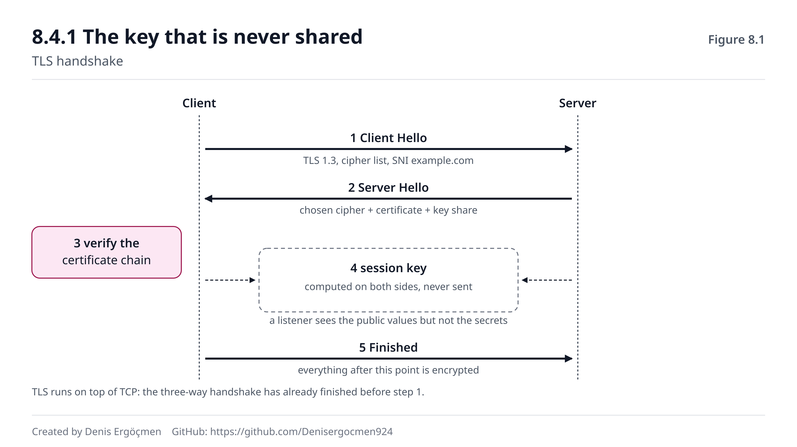

# Phase 8 — The Application Layer: HTTP + TLS

> **Navigation:** [◀ Phase 7 — NAT and the Real World](Phase_7_NAT.md) · **Phase 8** · [Phase 9 — Firewalls and Filtering ▶](Phase_9_Firewalls.md)

---

## Where we come from

At the end of Phase 7 we asked: TLS encrypts the traffic, but for encryption both sides need a **shared
key**. How do they share that key over an unencrypted channel where everyone along the way can listen?

We gave the hint too: **they do not share it.** Both sides **compute the key separately** — and the listener
on the path, despite seeing everything, cannot arrive at the same result. In 8.4 you will see how that is
possible.

What you brought with you:

- **Ports 80 and 443** (1.4.1) — the two main doors of this phase.
- **The TCP handshake** (5.2.1) — TLS is built **on top of** it; first TCP, then TLS.
- **Head-of-line blocking** (5.1.2) — the answer to why HTTP/3 moved to UDP.
- **DNS and TTL** (6.4) — the working logic of a CDN and the "stale content in one region" problem connect
  back there.
- **The reverse proxy idea** (7.2.3) — similar to NAT's port forwarding but far smarter.

## The question of this phase

> *"The packet reached its destination. So how does the server know **what you wanted** — and how does that
> answer come back without anyone on the way being able to read it?"*

This phase is the top of the stack. Everything you learned up to here was about **carrying**; this phase is
about **content**. And interestingly, the error messages you will meet most often in your daily work come
from here: 404, 502, 504, "certificate has expired", "SSL handshake failed".

The practical value of this phase is here: **status codes tell you almost on their own which layer the
problem is in.** An engineer who knows the difference between a 502 and a 504 calls the right team on the
first try. That is what you will learn.

---

## By the end of this phase

- You will be able to read the structure of an HTTP request and response (method, path, headers, body) line
  by line
- You will be able to explain the GET/POST/PUT/DELETE/PATCH distinction and the idea of idempotency
- You will know the status code groups (2xx/3xx/4xx/5xx) and **who** each one points at
- You will be able to use **the difference between 502 and 504** in diagnosis — did the backend crash or is
  it slow
- You will be able to explain the difference between HTTP/1.1, HTTP/2 and HTTP/3 and why HTTP/3 uses UDP
- You will be able to explain the steps of the TLS handshake, what certificate validation proves, and how
  the key is obtained **without being shared**
- You will know what a reverse proxy, a CDN and anycast do and how they differ from each other
- **Cloud:** You will be able to explain where TLS termination happens on an ALB, what CloudFront does, and
  the cause of the "stale content in one region" problem

---

## Phase map

| Section | Topic | Depth | Why it is here |
|---|---|---|---|
| 8.1 | HTTP request/response | `[mechanism]` | The anatomy of a request |
| 8.2 | Status codes | `[concept]` | **The heart of the phase** — the fastest diagnostic tool |
| 8.3 | HTTP/1.1 vs 2 vs 3 | `[skip]` | Awareness level |
| 8.4 | The TLS handshake | `[concept]` | The `s` in `https` |
| 8.5 | Reverse proxy, CDN, anycast | `[concept]` | Modern web architecture |
| 8.6 | When this phase breaks | — | HTTP/TLS failure signatures |

> **How to work through this phase:** Every command in this phase is 🟢 and they revolve around a single
> tool: **`curl -v`**. That `-v` (verbose) flag shows **all the layers** in one output — from DNS resolution
> to the TCP connection, from the TLS handshake to the HTTP headers — so you see the whole of Phases 0–8 on
> one screen. As you read this phase keep the output of `curl -v https://example.com` open and mark the
> relevant lines in each section. Do not try to memorise 8.2 (the status codes); understand the **group
> logic** and the rest follows by itself. Pass over 8.3 at `[skip]` level — the names and a one-sentence
> difference are enough.

---
---

# 8.1 HTTP Request/Response

## 8.1.1 The anatomy of a request `[mechanism]`

HTTP is surprisingly simple: it is a **plain text** contract. Your browser sends the server something like
this:

```
GET /index.html HTTP/1.1          ← request line: method, path, version
Host: example.com                 ← which site (one IP can host many)
User-Agent: curl/8.5.0            ← who the client is
Accept: text/html                 ← what kind of answer I accept
Connection: keep-alive            ← keep the connection open
                                  ← blank line: the headers are over
(body — usually absent in a GET)
```

There are three parts: the **request line**, the **headers**, and an optional **body**. What separates the
headers from the body is **a blank line**.

The `Host` header matters especially: one server can host hundreds of sites on a single IP; this header says
which one you want (this is called virtual hosting). Its equivalent in TLS is **SNI** (8.4.2).

The response has the same structure:

```
HTTP/1.1 200 OK                   ← status line: version, code, description
Content-Type: text/html           ← what is in the body
Content-Length: 1256              ← how many bytes
Cache-Control: max-age=3600       ← how long it can be cached
                                  ← blank line
<!DOCTYPE html>...                ← the body
```

## 8.1.2 Methods and intent `[concept]`

The method announces your **intent**:

| Method | Intent | Idempotent |
|---|---|---|
| **GET** | Fetch — change nothing | ✅ |
| **POST** | Create something new / run an operation | ❌ |
| **PUT** | Replace the whole thing (create if absent) | ✅ |
| **PATCH** | Change it partially | ❌ (usually) |
| **DELETE** | Delete | ✅ |
| **HEAD** | Like GET but return only the headers | ✅ |

**Idempotent** means "sending the same request twice gives the same result as sending it once". This is a
very practical property in the networking world: when no answer comes back you can **safely resend** the
request. In Phase 5 you learned that TCP retransmits a lost packet (5.3.2); at the HTTP level the same logic
works at the application layer too, thanks to idempotent methods.

POST is **not** idempotent — which is why you cannot blindly resend a payment request that timed out (the
risk of charging twice). The solution to this problem is usually an **idempotency key** header.

> **🔧 See it on your machine** 🟢 — read all the layers in one output
>
> ```
> $ curl -v https://example.com 2>&1 | head -25
> * Host example.com:443 was resolved.
> * IPv4: 93.184.216.34                          ← Phase 6: DNS resolved
> *   Trying 93.184.216.34:443...
> * Connected to example.com (93.184.216.34) port 443   ← Phase 5: the TCP handshake finished
> * ALPN: curl offers h2,http/1.1                 ← 8.3: which HTTP version
> * TLSv1.3 (OUT), TLS handshake, Client hello:   ← 8.4: TLS begins
> * TLSv1.3 (IN), TLS handshake, Server hello:
> * SSL connection using TLSv1.3 / AEAD-AES256-GCM-SHA384
> * Server certificate:
> *  subject: CN=example.com                      ← who the certificate belongs to
> *  expire date: Mar  1 23:59:59 2026 GMT        ← when it expires
> *  issuer: C=US; O=DigiCert Inc; CN=...         ← who signed it
> > GET / HTTP/2                                  ← 8.1: the request goes out
> > Host: example.com
> < HTTP/2 200                                    ← 8.2: the answer came back
> < content-type: text/html
> ```
>
> This one command fits the whole of this book onto one screen: **DNS** (Phase 6) → **TCP** (Phase 5) →
> **TLS** (8.4) → **HTTP** (8.1–8.2). Watch the symbols as you read: `*` is curl's own note, `>` is the
> outgoing request, `<` is the incoming response. When diagnosing a problem, **where this output stops**
> tells you directly which layer the problem is in — if it stops at the DNS line, Phase 6; at "Trying...",
> Phase 4/5/9; at the TLS lines, 8.4.

> **🤔 Think 8.1** — You sent a POST request to a payment API and got a timeout after 30 seconds. You do not
> know whether the payment went through. (a) Why is blindly resending the request risky? (b) How can the API
> designer solve this problem? (c) If the same thing had happened on a GET request, would you be worried?
>
> *(Answer: at the end of the phase)*

---
---

# 8.2 Status Codes

## 8.2.1 The group logic `[concept]`

Do not memorise status codes; read the **first digit**. Each group says **whose** the problem is:

| Group | Meaning | Who is responsible |
|---|---|---|
| **1xx** | Informational — the operation continues | — (you rarely see it) |
| **2xx** | Successful | — |
| **3xx** | Redirection — look elsewhere | — |
| **4xx** | **Client** error — there is a problem with your request | **You** |
| **5xx** | **Server** error — the request was right, the server could not handle it | **The server side** |

That one distinction — 4xx or 5xx — is the first step of diagnosis: it says **who will fix the error**.

The ones you will meet often:

| Code | What it means | Typical cause |
|---|---|---|
| 200 | OK | — |
| 301 / 302 | Permanent / temporary redirect | HTTP→HTTPS, an old URL |
| 304 | Not modified | The cache is valid, no body was sent |
| 400 | Bad request | Broken JSON, a missing parameter |
| 401 | Not authenticated | No token / an invalid one |
| 403 | Not authorised | The identity is fine but there is no permission |
| 404 | Not found | The wrong path |
| 429 | Too many requests | A rate limit |
| 500 | Internal server error | An exception in the application |
| **502** | **Bad Gateway** | **The proxy could not reach the backend / got a broken answer** |
| 503 | Service unavailable | Overload, maintenance, no healthy backend |
| **504** | **Gateway Timeout** | **The backend responded too slowly / not at all** |

## 8.2.2 502 and 504: the most valuable distinction `[application]`

These two codes are errors given by the reverse proxy (8.5.1) and **their difference is worth gold in
diagnosis.**

**502 Bad Gateway** — *"I could not reach the backend."*
The proxy tried to connect to the server behind it and **could not** (connection refused — 5.2.2), or it
connected but got a **meaningless answer**. The meaning: **the backend has crashed, is restarting, is
listening on the wrong port, or a security group is blocking it.**

**504 Gateway Timeout** — *"I reached the backend but ran out of time waiting for its answer."*
The connection was established, the request was forwarded, but the answer did not arrive in time. The
meaning: **the backend is up but slow** — a long-running query, a locked database, an exhausted thread pool.

The difference in one sentence:

> **502 = the backend could not answer. 504 = the backend answered slowly (or not at all).**

The two require you to look in completely different places. On a 502 you look at **whether the service is
up** and at network access; on a 504 you look at the application's **performance** and at timeout settings.

One more distinction: **503** is usually a "I cannot serve right now" message from **the application
itself** rather than the proxy (maintenance mode, overload) — or the load balancer saying "no healthy
backend is left".

> **⚠️ Common misconception: "I saw a 5xx, there is a network problem."**
>
> No — quite the opposite. **If you got a 5xx, the network is working.** Think about it: having received a
> status code proves that DNS resolved (Phase 6), that the TCP connection was established (Phase 5), that
> TLS completed (8.4), that your request **reached** the server and that the server's answer **came back**
> to you. So the whole of Phases 1–7 is healthy; the problem is at the application layer. The signature of a
> network problem is **not** a status code but the absence of one: a timeout, connection refused, "could not
> resolve host". This distinction stops you calling the wrong team.

> **🤔 Think 8.2** — A service starts erroring when the load builds at 09:00. In the logs there are first a
> few **504**s, then a growing number of **502**s. (a) What do the first 504s tell you? (b) What are the
> later 502s a sign of? (c) How does this ordering tell you the story of the incident?
>
> *(Answer: at the end of the phase)*

---
---

# 8.3 HTTP/1.1 vs HTTP/2 vs HTTP/3 `[skip]`

This section is at awareness level — knowing the names and a one-sentence difference is enough.

| Version | Transport | The main innovation | The remaining problem |
|---|---|---|---|
| **HTTP/1.1** | TCP | Connection reuse (keep-alive) | One request queue per connection — the browser opens 6 connections |
| **HTTP/2** | TCP | **Multiplexing** — parallel requests on one connection | Head-of-line blocking at the TCP level |
| **HTTP/3** | **UDP (QUIC)** | Independent streams — one loss does not stop the others | Still spreading |

The chain you need to understand is this: HTTP/2 solved the queueing problem at the application level but
could not solve **TCP's own** problem — a single lost packet in TCP holds up the delivery of **all** the data
behind it (5.1.2, head-of-line blocking). Solving it required leaving TCP itself. HTTP/3 did that: it uses
the **QUIC** protocol built on UDP and manages reliability itself (the box in 5.1.2). So a loss in one
stream does not stop the other streams.

A bonus: QUIC embeds TLS into the protocol — establishing a connection takes fewer round trips than TCP+TLS
(8.4.1).

---
---

# 8.4 The TLS Handshake

## 8.4.1 The key that is never shared `[concept]`

This was Phase 7's closing question: how do two sides arrive at a shared secret key over an open channel?

The answer: **they do not send the key.** Both sides generate a secret value, send each other **public**
values, and combine those public values with their own secret value to compute **the same result**. The
listener on the path sees both public values but, not seeing the secret values, cannot arrive at the same
result. This idea is called **key exchange** (the Diffie-Hellman family).

An analogy: you both mix your own secret colour into the same base paint and send each other the mixture.
You each add your own secret colour again to the mixture you received — and the same final colour appears on
both sides. The listener saw both mixtures, but cannot produce the final colour from them.

The flow of the handshake (at concept level):

```
1. Client Hello   → "I speak TLS 1.3, I support these cipher suites,
                     the site I want to connect to: example.com (SNI)"
2. Server Hello   → "I chose this cipher suite" + CERTIFICATE + its key exchange share
3. (The client VALIDATES the certificate — 8.4.2)
4. The key exchange completes → both sides COMPUTE the same session key
5. Finished       → "Everything from here is encrypted"
```

The critical point: **TLS is built on top of TCP.** First the TCP handshake completes (5.2.1), then TLS
starts. So an HTTPS connection contains at least two handshakes — and in `curl -v` output you see both of
them separately (the box in 8.1.2).



In the figure the arrows between the client on the left and the server on the right are the handshake
messages; the dashed box in the middle represents the session key that is **never carried on the wire** — it
is computed separately on both sides. The chain box at the bottom shows certificate validation (8.4.2).

## 8.4.2 The certificate: proof of identity `[concept]`

Encryption alone is not enough. You need to know that the person you are talking to encrypted **really is**
who they say — otherwise you could be having a perfectly encrypted conversation with someone in the middle.

The certificate solves this. Inside it are: **who** it was issued for (the domain name), the **public key**,
the **validity dates** and **who signed it**.

The client checks three things:

1. **Does the name match?** Does the domain name in the certificate match the address you connected to?
2. **Is it still valid?** (The most frequent cause of failure — an expired certificate.)
3. **Does the chain lead to a trusted root?** The certificate was signed by an intermediate CA, and that one
   by a root CA — and that root must be in the operating system's **trust store**.

The third item is where the "missing intermediate certificate" error comes from: the server sends its own
certificate but forgets to send the intermediate; some clients find it another way (and it works), some
cannot (and give an error). The signature is typical: **"it works in the browser but not in `curl`/the
application."**

**SNI** (Server Name Indication) solves this problem: if there are many HTTPS sites on one IP, the server
has to know which certificate to send — but the `Host` header is still inside the encrypted channel and has
not been sent yet (8.1.1). SNI carries the requested domain name **in the clear in the Client Hello**. The
side effect: which site you are connecting to is visible on the path (not the content, only the name).

> **💡 Cloud connection — where TLS terminates:** If you are running behind an ALB, the TLS connection
> **terminates at the ALB** (TLS termination). The ALB presents the certificate, does the handshake,
> decrypts, and forwards to the backend over a **separate connection** (the same two-connection model as in
> the box in 5.5.1). This has three consequences: (1) You manage the certificate **on the ALB** — AWS
> Certificate Manager issues it for free and **renews it automatically**, which largely eliminates the
> "expired certificate" failure (8.6). (2) Traffic to the backend is **unencrypted** by default — it stays
> inside the VPC, but if end-to-end encryption is wanted you have to set up TLS on the backend too and
> configure the ALB to speak HTTPS to it. (3) The backend **cannot see** the client's real IP — it sees the
> ALB's; the real IP arrives in the **`X-Forwarded-For`** header, and if you want the right IP in your logs
> the application has to read that header. That third item is one of the most commonly missed details in the
> cloud.

> **🤔 Think 8.3** — A site opens fine in the browser, but running `curl https://site.example.com` from a
> server gives "unable to get local issuer certificate". (a) What is the likely cause? (b) Why does the
> browser work when curl does not? (c) What is the right solution — and which solution should you **not**
> apply?
>
> *(Answer: at the end of the phase)*

---
---

# 8.5 Reverse Proxy, CDN and Anycast

## 8.5.1 A reverse proxy: the intermediary out front `[concept]`

A **reverse proxy** is an intermediary standing between the client and the real server. The client connects
to the proxy; the proxy forwards the request to the **backend** behind it and carries the answer back.

A normal (forward) proxy stands in front of the client and hides the client; a reverse proxy stands in front
of the **server** and hides the server. That is the difference.

What it gives you:

- **The backend is hidden** — the outside world does not know the real servers' addresses (the deliberate
  version of the protection idea in 7.2.2)
- **Load distribution** — it shares requests across several backends
- **TLS termination** — it does the decryption work in one place (the box in 8.4.2)
- **Health checking** — it does not send requests to a dead backend (what DNS round-robin cannot do, Phase 6
  Q5)
- **Caching, compression, rate limiting** — it gathers common work at a single point

This is exactly what gives the 502 and 504 errors (8.2.2): the proxy reports to you the problem between
itself and the backend.

## 8.5.2 CDN: bringing the content closer to the user `[concept]`

Remember the fact you learned in Phase 5: **throughput ≈ window / RTT** (5.5.2). As distance grows
performance drops, and the speed of light is an upper bound — a round trip from Istanbul to Virginia is
physically ~120 ms.

A **CDN** (Content Delivery Network) solves this problem like this: it keeps copies of the content on
**edge** servers spread around the world. The user gets the content from the copy nearest to them. RTT
drops, the experience improves, and the load on the real server (the origin) falls.

A CDN has its own cache logic and it carries a **sibling problem** to the TTL from Phase 6: when you update
the content, the old copies on the edges keep being served until their TTLs expire. The symptom:

> **"Stale content is showing in one region and the new content in another."**

The solution goes two ways: **invalidation** (telling the edges to "forget this path" — immediate but costly
and taking time to propagate) and **versioned file names** (like `app.a3f91c.js` — when the content changes
the name changes too, so the old copy is never asked for; this is the preferred method).

## 8.5.3 Anycast: the same IP, many places `[concept]`

One answer to the question of how a CDN routes you to the "nearest edge" is **anycast**.

Anycast is **announcing the same IP address from many points in the world**. BGP, which you learned in Phase
4.6, comes into play here: the router in each region picks the copy **closest to itself** for that IP (4.3 —
best path selection). The user does nothing; routing takes them to the nearest copy.

In Phase 6 we said "the 13 root servers are really hundreds of machines" (the box in 6.1.2) — this is the
mechanism. CloudFlare's `1.1.1.1` and Google's `8.8.8.8` work with anycast too.

An alternative method is **DNS-based routing**: returning different IPs for the same name according to the
user's location (Route 53's latency-based or geolocation routing). Anycast works at the routing layer, DNS
routing at the name layer; the two can also be used together.

> **💡 Cloud connection — three components, three jobs:** In AWS the equivalents of these three concepts are
> clear and should not be confused. **ALB** = a reverse proxy (L7): it routes by looking at HTTP headers, you
> can write path/host-based rules, it terminates TLS and does health checking. **NLB** = an L4 load balancer:
> it works at the TCP level, does not understand HTTP, but is very high performance and can have a static
> IP. **CloudFront** = a CDN: it caches content at edge locations, terminates TLS at the edge and goes to the
> origin (an ALB or S3) over a single connection — so even the TCP handshake finishes nearby for a distant
> user (5.5.2). **Route 53** = DNS-based routing: it sends the user to the right region with latency,
> geolocation or failover rules, but it is subject to TTL (6.4.3). In a typical architecture all three are
> present together: Route 53 → CloudFront → ALB → the backend. When diagnosing you have to work out **which
> layer** is erroring: a 502 from CloudFront and a 502 from the ALB require you to look in different places.

> **🤔 Think 8.4** — A team updated a CSS file and deployed it. Some people at the office see the new design,
> some the old. The file on the server is definitely the new one. (a) What could the cause be — name two
> layers. (b) Explain which problem from Phase 6 this is a sibling of. (c) What is the permanent solution?
>
> *(Answer: at the end of the phase)*

---
---

# 8.6 When This Phase Breaks — HTTP and TLS Failure Signatures

The greatest advantage of this phase's failures is this: **if you are getting an error message, all the
layers below are working.** Having seen a status code or a TLS error proves that DNS resolved, that the
packet went and came back and that the connection was established. So diagnosis in this phase is far faster
than in the lower phases — as long as you read the message correctly.

| Symptom | Likely cause | Verify | Related section |
|---|---|---|---|
| **502** Bad Gateway | The backend crashed / wrong port / the SG is blocking | Is the backend up, `ss -tulpn` | 8.2.2 |
| **504** Gateway Timeout | The backend is up but **slow** | The application log, query durations | 8.2.2 |
| **503** Service Unavailable | No healthy backend / maintenance / overload | The target group's health status | 8.2.1 |
| **404** but the file exists | The wrong path, the wrong virtual host | The `Host` header, the proxy rules | 8.1.1 |
| **403** but you are logged in | Missing authorisation (not identity) | The application's permissions | 8.2.1 |
| **429** | A rate limit | The request rate, the `Retry-After` header | 8.2.1 |
| "certificate has expired" | The certificate expired | The `expire date` in `curl -v` | 8.4.2 |
| Works in the browser ✓, certificate error in curl | **A missing intermediate certificate** | `openssl s_client -showcerts` | 8.4.2 |
| "hostname mismatch" | The name in the certificate ≠ the name you connected to | The `subject` in `curl -v` | 8.4.2 |
| The TLS handshake starts but never finishes | A version/cipher-suite mismatch, or **MTU** | The line where `curl -v` stops | 8.4.1, 5.7.3 |
| Stale content in one region, new in another | The CDN edge cache + TTL | The `Age` and `Cache-Control` headers from the edge | 8.5.2 |
| The same IP appears in every log line | TLS/proxy termination — the real IP is in `X-Forwarded-For` | Read the header | the box in 8.4.2 |
| The page opens, the API calls fail | A different path/port hits a different rule | Test the API separately with `curl -v` | 8.1.2 |

> **The lesson from this table:** Diagnosis in this phase reduces to two questions. First: **did you get a
> status code?** If you did, all the network layers are healthy (the box in 8.2.2) and the problem is in the
> application — look at the first digit, fix your request if it is 4xx and the server if it is 5xx. If you
> did not, the problem is further down and you should go back to Phases 5–7. Second: **if you got a 5xx, is
> it a 502 or a 504?** A 502 says "I **could not reach** the backend" — you check whether the service is up,
> whether it is listening on the right port, whether the security group allows it. A 504 says "I reached it
> but **I waited**" — you look at the application's performance, the database queries and the timeout
> settings. Confusing these two codes means hours of looking in the wrong place. On the TLS side a single
> tool solves almost everything: **where `curl -v`'s output stops** tells you directly which layer is broken
> — and for certificate errors the first two things you look at are always the **validity date** and the
> **completeness of the chain**.

---
---

# Answers to the Think questions

## Answer 8.1 — Idempotency and resending

**(a)** Because **POST is not idempotent** (8.1.2). A timeout does **not prove** that the request failed to
reach the server — it may have arrived, been processed, and only its answer been lost (Phase 5.3: the ACK
can be lost). If you blindly resend, there is a risk of **charging twice**.

**(b)** With an **idempotency key**: the client generates a unique key for each logical operation and sends
it in an `Idempotency-Key: <uuid>` header. The server stores that key; if a second request arrives with the
same key it **does not run the operation again** but returns the first answer. This makes POST idempotent in
practice. It is the standard approach of payment APIs.

**(c)** **No.** GET is idempotent (8.1.2) — it changes nothing, and the result is the same if you send it a
hundred times. If no answer comes back you resend it safely. In fact HTTP clients and proxies automatically
retry idempotent methods; they do not retry POST.

**Related section:** 8.1.2 · **Next:** 8.2.2 (504 and timeouts), Phase 5.3 (the lost ACK)

## Answer 8.2 — The order of the codes is the story of the incident

**(a)** The first **504s** say the backend is **up but has slowed down** (8.2.2): the proxy can connect, the
request is forwarded, but the answer does not arrive in time. So the load has grown, queries have piled up,
and response times have started to exceed the timeout threshold.

**(b)** The later **502s** say the backend can **no longer be reached** (8.2.2). This is one step beyond the
slowdown: the backend has either crashed (memory exhaustion, OOM), or is restarting, or is too full to
accept connections (the accept queue is full and new connections are refused — the RST in 5.2.2).

**(c)** The story is: **the load grew → the backend slowed down (504) → requests piled up → resources ran
out → the backend crashed or became unable to accept connections (502).** So the 502 is not the cause but
the **consequence**; the root cause is at the moment the first 504s began. That is why "when did the first
error start and of what type" is a more valuable question in diagnosis than "which error am I getting right
now". The intervention follows from this too: restarting the backend cures the 502 temporarily but the cycle
repeats because the load continues; the real fix is in the cause of the slowdown (the query, the lock,
scaling).

**Related section:** 8.2.2 · **Next:** Phase 10.4 (performance diagnosis), Phase 10.5 (incident management)

## Answer 8.3 — A missing intermediate certificate

**(a)** **A missing intermediate certificate** (8.4.2). The server is sending its own certificate but not
the intermediate that links the chain to the root. Because `curl` cannot lead the chain to a trusted root it
says "unable to get local issuer certificate".

**(b)** Because browsers can **complete** a missing intermediate themselves: they keep intermediates they
have seen before in their caches and can download the missing piece from the address in the certificate's
*AIA* field. `curl` and most application libraries do not do this — they make do with the chain the server
sent. That is why "it works in the browser, not in the application" is a classic signature, and it even
shows that the certificate **itself** is valid; what is missing is the chain.

**(c)** **The right solution:** serve the **full chain** (fullchain) in the server configuration — the
certificate plus the intermediate(s) together. If you use Let's Encrypt you should point at `fullchain.pem`,
not `cert.pem`; if you use an ALB you should include the intermediates when uploading the certificate chain.
**What you should not do:** turn validation **off** with `curl -k` / `verify=False`. That hides the error
and leaves the connection open to man-in-the-middle attacks — it removes the very reason TLS exists. You can
use `-k` once as a temporary diagnostic step to confirm the problem is in the certificate, but it must never
enter permanent configuration.

**Related section:** 8.4.2 · **Next:** Phase 9.5 (security reflexes), Phase 10.2 (choosing a tool)

## Answer 8.4 — The sibling cache problem

**(a)** Two layers: (i) **The CDN edge cache** — some users land on an edge holding the old copy, others on
an updated edge (8.5.2). (ii) **The browser cache** — the browser does not ask the server at all because the
`Cache-Control: max-age` period has not expired. (A third possibility: a corporate proxy cache.)

**(b)** It is a sibling of the **DNS TTL problem** in Phase 6 (6.4.2): in both cases **the right answer is
ready at the source**, but the layers in between keep serving the old copy they hold until it expires. The
shared lesson: **in a cached system "the change is published" and "everybody sees it" are not the same
moment**, and the gap between them is determined by the TTL.

**(c)** **Versioned file names** (8.5.2): `app.a3f91c.css` instead of `app.css`. When the content changes the
file **name** changes too; the new HTML asks for the new name, the old copy is never requested and the cache
problem disappears **structurally**. That is why static assets can be given very long TTLs (a year) — it is
safe because the name changes. The HTML file itself gets a short TTL, because it is what announces the new
names. (Invalidation is an option too, but it is not instant, it costs money and it has to be repeated on
every deploy — it is not a structural solution.)

**Related section:** 8.5.2 · **Next:** Phase 6.4 (TTL), Phase 11.9 (the CloudFront mapping)

---
---

# Frequently asked questions

**Q1 — If HTTP is plain text, what changes in HTTPS?** The structure stays **the same** — the same methods,
the same headers, the same status codes. The only thing that changes is that all of that text passes
**through a TLS channel** (8.4.1). Someone on the path sees only which IP you connected to and (thanks to
SNI) which domain name you asked for; they cannot see the path, the headers or the body.

**Q2 — What is the difference between 401 and 403?** **401 Unauthorized** = "I do not know who you are" —
there are no credentials or they are invalid (a missing/expired token). **403 Forbidden** = "I know who you
are but you cannot do this" — the identity is fine, the **authorisation** is not. The naming is a historical
misfortune; 401 really means "unauthenticated".

**Q3 — Are TLS and SSL the same thing?** SSL is the old name for TLS, and all SSL versions are now
considered insecure and have been retired. What is used today is TLS 1.2 and TLS 1.3. In everyday speech
people still say "SSL certificate", but what is meant is TLS.

**Q4 — What does a certificate prove and what does it not?** **It proves:** that the server you connected to
controls that domain name and that the traffic is encrypted. **It does not prove:** that the site is honest,
safe or well intentioned. A phishing site can obtain a valid certificate too — the inference "there is a
padlock icon, so it is safe" is wrong.

**Q5 — Why should I not use `curl -k`?** Because it turns certificate validation off (Answer 8.3) — you
would accept a man-in-the-middle's forged certificate too, and TLS's authentication function disappears
entirely. Encryption continues but you cannot know **who** you are encrypted with. It can be used once
during diagnosis to narrow the problem down; never in permanent configuration.

**Q6 — Are a reverse proxy and a load balancer the same thing?** Conceptually they overlap. A load
balancer's main job is **distribution**; a reverse proxy's job is **intermediation** (hiding, TLS
termination, caching, applying rules). In practice most modern products (nginx, ALB) do both (8.5.1).

**Q7 — Does a CDN speed everything up?** No. A CDN is very effective on **cacheable** content (images, CSS,
JS, video). For dynamic answers that are specific to each user (a personal dashboard, API results) caching
does not help — but a CDN can still be useful: if the TLS handshake finishes **near** the user, the
connection setup latency drops, and optimised, long-lived connections are used between the edge and the
origin (5.5.2).

---
---

# Test yourself

Write your answers on paper, then compare them with the key. Target: 14+ out of 18.

## Part A — Definitions and mechanisms

1. Write the three parts of an HTTP request. What separates the headers from the body?
2. What is the `Host` header for? What is its equivalent in TLS?
3. What does idempotent mean? Which methods are idempotent?
4. The difference between 4xx and 5xx points at **whom**?
5. Write the difference between 502 and 504 in one sentence.
6. Why does HTTP/3 use UDP? Which problem does it solve?
7. How is the shared key obtained in TLS — is it sent?
8. Which three things does the client check in certificate validation?

## Part B — Apply and diagnose

9. With which single command do you see the DNS, TCP, TLS and HTTP layers together?
10. You got a 502. What are the first three things you look at?
11. You got a 504. What are the first three things you look at?
12. "It works in the browser, a certificate error in curl." Diagnosis and solution?
13. Stale content is showing in one region. Two possible layers and the permanent solution?
14. In the logs every request appears to come from the same IP. Why, and where is the real IP?

## Part C — Reasoning and connections

15. Why is the sentence "I got a 5xx, there is a network problem" wrong? What has been **proved**?
16. A payment request timed out. Should you resend it? What is the right solution from a design point of
    view?
17. Tell the story of an incident in a system that saw 504s first and then 502s.
18. Why are the CDN's cache problem and DNS's TTL problem siblings? What is the shared lesson?

---

## Answer key

1. The **request line** (method, path, version), the **headers**, the **body**. A **blank line** separates
   the headers from the body (8.1.1). — 2. It says which site is wanted when many sites are hosted on one IP
   (virtual hosting). Its TLS equivalent is **SNI**, carried in the clear in the Client Hello (8.1.1,
   8.4.2). — 3. Sending the same request twice gives **the same result** as sending it once. GET, PUT,
   DELETE and HEAD are idempotent; POST is not (8.1.2). — 4. **4xx = a client** error (you will fix the
   request); **5xx = a server** error (the server side will fix it). So it says **who will fix the error**
   (8.2.1). — 5. **502 = I could not reach the backend; 504 = I reached it but ran out of time waiting for
   the answer** (8.2.2). — 6. Because a single lost packet in TCP holds up the delivery of all the data
   behind it (head-of-line blocking, 5.1.2). HTTP/3 makes the streams **independent** with QUIC on top of
   UDP; a loss in one stream does not stop the others (8.3). — 7. **It is not sent.** Both sides generate a
   secret value, send each other **public** values and **compute the same result separately**; even seeing
   the public values, the listener cannot reach the same result without the secret values (8.4.1). — 8. (i)
   Does the **name** in the certificate match the address you connected to; (ii) has the **validity period**
   expired; (iii) does the **chain** lead to a trusted root (8.4.2).

9. **`curl -v https://<address>`** (the box in 8.1.2). — 10. (i) Is the backend **up** (`ss -tulpn`, the
   service status); (ii) is it listening on the **right port** and is the proxy going to the right target;
   (iii) do the **security group/NACL** allow proxy→backend traffic (8.2.2). — 11. (i) The application's
   **response times** and slow queries; (ii) database locks / connection pool exhaustion; (iii) the proxy's
   **timeout setting** and the backend's real response time (8.2.2). — 12. **A missing intermediate
   certificate**; the browser works because it can complete the chain itself, curl does not make do. The
   fix: serve the **fullchain** on the server. Turning validation off with `-k` is not a fix (8.4.2, Answer
   8.3). — 13. (i) The **CDN edge cache**, (ii) the **browser cache**. The permanent fix: **versioned file
   names** (`app.a3f91c.css`) (8.5.2). — 14. Because TLS/the proxy **terminates at the ALB** and the backend
   sees the ALB's IP. The real client IP is in the **`X-Forwarded-For`** header (the box in 8.4.2).

15. Because **having received** a status code **proves** that DNS resolved, that TCP was established, that
    TLS completed, that the request reached the server and that the answer came back — that is, Phases 1–7
    are healthy. The problem is at the application layer. The signature of a network problem is not getting a
    code but **getting no code at all** (a timeout, refused, an unresolvable name) (the box in 8.2.2). — 16.
    **Not blindly** — POST is not idempotent and the operation may have gone through with only the answer
    lost (Phase 5.3). The right design: an **idempotency key** — the client sends a unique key, the server
    does not re-run a second request with the same key and returns the first answer (Answer 8.1). — 17. The
    load grew → the backend **slowed down** (504) → requests piled up → resources ran out → the backend
    crashed or became unable to accept connections (**502**). The 502 is the consequence; the root cause is
    at the moment the first 504s began; restarting the backend cures the symptom temporarily but does not
    stop the cycle (Answer 8.2). — 18. Because in both cases **the right answer is ready at the source** but
    the layers in between serve the **old copy** they hold until the TTL expires (6.4.2, 8.5.2). The shared
    lesson: in a cached system *"published"* and *"everybody sees it"* are not the same moment, and the gap
    is set by the TTL; the structural solution is giving changed content **a changed name**.

## Scoring

| Correct answers | What it means |
|---|---|
| 16–18 | The application layer has settled — especially the 502/504 reflex. You are ready for Phase 9. |
| 13–15 | Good. Read 8.2.2 once more; that distinction will serve you most in the field. |
| 9–12 | TLS and the status codes may be getting mixed up. Walk through `curl -v` output line by line. |
| 0–8 | Walk the phase again. The goal: knowing which team to call the moment you see a status code. |

**Which section to go back to for a question you missed:**

| Question | Section |
|---|---|
| 1, 2, 3, 9, 16 | 8.1 Request/response |
| 4, 5, 10, 11, 15, 17 | 8.2 Status codes |
| 6 | 8.3 HTTP versions |
| 7, 8, 12, 14 | 8.4 TLS |
| 13, 18 | 8.5 Reverse proxy, CDN, anycast |

---
---

# Closing and the Bridge to Phase 9

## What you carry from this phase

Phase 8 gave you **the top of the stack**. You learned the plain-text structure of an HTTP request, that
methods announce intent and why idempotency is a practical property. You saw that the first digit of a
status code says **who will fix the error**, and how valuable the difference between 502 and 504 is in
diagnosis. You picked up that in TLS the key is **not sent but computed**, and what a certificate does and
does not prove. You separated the three different jobs done by a reverse proxy, a CDN and anycast.

The two most durable sentences: **"if you got a status code, the network is working"** and **"502 could not
reach it, 504 waited for it."**

## Where Phase 9 connects

From Phase 0 to Phase 8 you have always learned **how the packet travels**. And when we looked at failures
the cause was always something missing: a wrong address, a missing route, a broken name, a full table, a
packet too big.

But now you will meet a different cause: **the packet was dropped deliberately although nothing was broken.**

Somebody wrote a rule and that rule did not want your packet. What is more, it did this **without telling
you** — silently. Behind the "the SYN goes out, no answer" signature you saw in Phase 5.2.2 there is most
often exactly this.

Phase 9 is the answer: firewalls. You will see the difference between stateful and stateless filtering,
deciding with the 5-tuple, and the critical distinction in the cloud between a **Security Group and a
NACL** — why you do not need a rule for return traffic in an SG but do in a NACL, which you will understand
on the basis of the TCP state information you learned in Phase 5.

> **🤔 Phase output — ask yourself:** You ran `curl` against a server and got a timeout after waiting 30
> seconds. No error message, no RST, no ICMP — only silence (5.2.2). If a firewall dropped your packet,
> **why did it not tell you "I refused it"?** What advantage does staying silent have over answering?
>
> **🧪 Lab 8 idea (all 🟢):** (1) Run `curl -v https://example.com` and split the output into four sections:
> DNS, TCP, TLS, HTTP — mark the line where each one begins. (2) Get only the headers with `curl -I
> https://example.com` (the HEAD method) and read the `Content-Type`, `Cache-Control` and `Server` headers.
> (3) Ask for a path that does not exist (`curl -i https://example.com/nope`) and see the **404**. (4)
> Connect to the same site with `curl -v --http1.1` and `curl -v --http2` and see the difference in the
> `ALPN` line. (5) See the certificate **chain** in full with `openssl s_client -connect example.com:443
> -showcerts </dev/null` — how many certificates are there? (6) Run `curl -w '%{time_namelookup}
> %{time_connect} %{time_appconnect} %{time_total}\n' -o /dev/null -s https://example.com`: measure the DNS,
> TCP, TLS and total times separately — which step takes longest?

---

> **Navigation:** [◀ Phase 7 — NAT and the Real World](Phase_7_NAT.md) · **Phase 8** · [Phase 9 — Firewalls and Filtering ▶](Phase_9_Firewalls.md)
