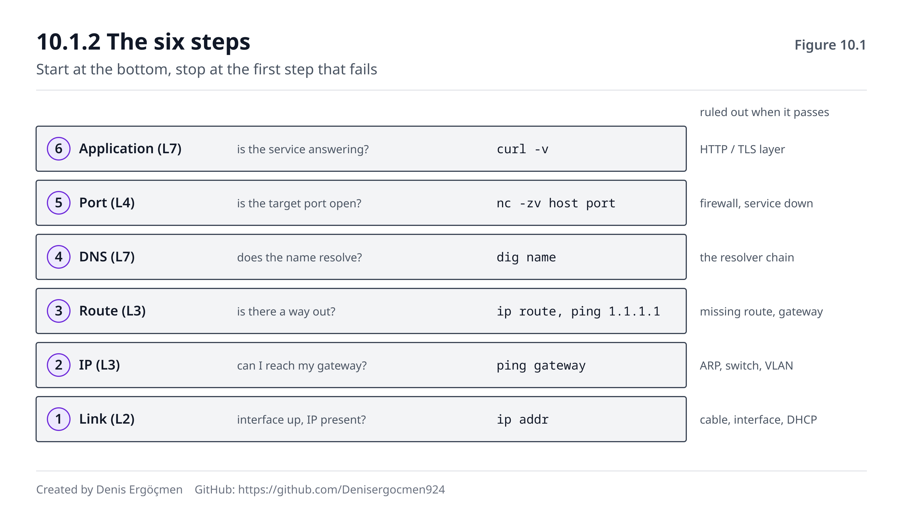

# Faz 10 — Troubleshooting: Katman Katman Teşhis

> **Navigasyon:** [◀ Ara Sınav 3](Ara_Sinav_3.md) · **Faz 10** · [Faz 11 — Cloud'a Köprü ▶](Faz_11_Clouda_Kopru.md)

---

## Nereden geliyoruz

Faz 9'un sonunda sordum: bir kullanıcı "site açılmıyor" diyor, elinde yedi araç var, hepsini çalıştırmak
10 dakika sürüyor — **hangisiyle başlamalısın?**

İpucu şuydu: doğru araç, **en çok bilgi veren** değil, **en çok ihtimali eleyen** araçtır. Bu fazın
tamamı o cümlenin açılımıdır.

Şimdiye kadar on faz boyunca, her bölümün sonunda bir **"Bu faz bozulunca"** tablosu gördün. Onlarca
belirti, onlarca sebep. Bu faz onları ezberletmeyecek — **sıraya koyacak.**

Yanında getirdiklerin: aslında her şey. Bu fazın yeni bilgisi neredeyse yok; yeni olan tek şey
**disiplin**.

## Bu fazın sorusu

> *"Bir şey çalışmıyor. Elimde otuz ihtimal var. Hangi sırayla bakarım ki en az adımda doğru yere
> varayım?"*

Deneyimsiz mühendisin yaptığı şey, **tahmin etmektir**: "DNS olabilir" der, `dig` çalıştırır; "belki
firewall'dır" der, kurallara bakar; "belki uygulamadır" der, log'lara dalar. Rastgele sıçrar, bazen
şanslıdır, çoğu zaman saatler kaybeder.

Deneyimli mühendisin yaptığı şey, **elemektir**: alttan başlar, her adımda ihtimallerin yarısını
kesin olarak siler, ve birkaç adımda arızanın hangi katmanda olduğunu **kanıtlamış** olur.

Fark zekâ değil, **sıradır.** Bu faz o sırayı verir.

---

## Bu fazın sonunda

- Aşağıdan yukarı katman katman teşhis metodolojisini sırasıyla uygulayabileceksin
- Her adımın hangi ihtimalleri elediğini ve **neden o sırada** olduğunu açıklayabileceksin
- Her aracın hangi katmana baktığını bilecek, doğru soruya doğru aracı seçebileceksin
- `tcpdump`'ın neden "nihai hakem" olduğunu ve ne zaman ona başvurman gerektiğini bileceksin
- Üç içgüdüsel sorunun ("Veri nasıl ilerliyor?", "Packet neden düştü?", "Router neden saçmalıyor?")
  karar ağaçlarını takip edebileceksin
- **Cloud:** VPC Flow Logs satırlarını okuyup bir paketin nerede ve neden düştüğünü **tahmin etmek
  yerine kanıtlayabileceksin**
- Kasıtlı olarak bozulmuş bir sistemi, metodolojiyi izleyerek dakikalar içinde teşhis edebileceksin

---

## Faz haritası

| Bölüm | Konu | Derinlik | Neden burada |
|---|---|---|---|
| 10.1 | Katman katman metodoloji | `[uygulama]` | **Fazın kalbi** — sıranın kendisi |
| 10.2 | Araç ustalığı | `[uygulama]` | Hangi araç hangi katmana bakar |
| 10.3 | Üç içgüdü sorusu | `[uygulama]` | Karar ağaçları |
| 10.4 | Cloud: VPC Flow Logs | `[uygulama]` | Tahmin etmek yerine okumak |
| 10.5 | Bu faz bozulunca | — | Teşhisin kendisi bozulunca |

> **Bu fazda nasıl çalışmalı:** Bu faz okuyarak öğrenilmez — **yaparak** öğrenilir. Komutların hepsi
> 🟢'dir (hiçbir şeyi değiştirmezler, sadece okurlar), bu yüzden korkmadan çalıştır. Ama asıl
> kazanç, bölüm sonlarındaki akışları **kendi makinende** izlemekten gelir. Bir önerim var: bu fazı
> okurken bir terminal açık tut ve her komutu geçerken çalıştır — bozuk bir şey olmasa bile. Çünkü
> **sağlıklı çıktının nasıl göründüğünü bilmiyorsan, bozuk çıktıyı tanıyamazsın.** Fazın sonundaki
> bitirme lab'ı ise bu kitabın en değerli 30 dakikası olabilir: kendi makinende kasıtlı bir arıza
> kurup metodolojiyle bulacaksın.

---
---

# 10.1 Katman Katman Metodoloji

## 10.1.1 Neden aşağıdan yukarı `[kavram]`

Faz 0'da OSI'yi öğrendiğinde şunu söylemiştim: katmanlar bir **teşhis sırası**dır. Şimdi o sözün
karşılığını alıyoruz.

Kural şudur:

> **Aşağıdan yukarı çık. Alt katman bozuksa, üst katmandaki her test yalan söyler.**

Neden? Çünkü bağımlılık tek yönlüdür. DNS çalışmak için IP'ye muhtaçtır; IP çalışmak için link'e
muhtaçtır. Ama link, DNS'e hiç muhtaç değildir.

Bunun pratik sonucu şu: **alt katmandan gelen bir arıza, üst katmanda tamamen farklı bir kılıkta
görünür.** Kablo takılı değilse `dig` "DNS sunucusuna ulaşılamıyor" der — ve sen bir saat DNS
yapılandırmasıyla uğraşırsın. Oysa sorun DNS değildi; DNS sadece **alt katmanın arızasını
raporlayan** taraftı.

Yukarıdan aşağı gitmek, bu yüzden en yaygın zaman kaybı sebebidir: en üstteki belirti, en alttaki
sebebi gizler.

## 10.1.2 Altı adım `[uygulama]`

Metodoloji şudur. Her adım bir soru sorar, bir komutla cevaplanır, ve geçtiğinde **bir grup ihtimali
kesin olarak eler.**

| # | Katman | Soru | Komut | Geçerse elenen |
|---|---|---|---|---|
| 1 | **Link** (L2) | Arayüz ayakta mı, IP var mı? | `ip addr` | Kablo, arayüz, DHCP (Faz 1.6) |
| 2 | **IP** (L3) | Kendi ağıma ulaşıyor muyum? | `ping <gateway>` | ARP, switch, VLAN (Faz 3) |
| 3 | **Route** (L3) | Dışarı çıkan yolum var mı? | `ip route` + `ping 1.1.1.1` | Route eksikliği, gateway (Faz 4) |
| 4 | **DNS** (L7) | İsim çözülüyor mu? | `dig <isim>` | Çözümleme zinciri (Faz 6) |
| 5 | **Port** (L4) | Hedef port açık mı? | `nc -zv <host> <port>` | Firewall, servis (Faz 5, 9) |
| 6 | **Uygulama** (L7) | Servis doğru cevap veriyor mu? | `curl -v` | HTTP/TLS katmanı (Faz 8) |

Ve en kritik nokta, adımların **sırasıdır**:

- **3. adımda `ping 1.1.1.1` neden isim değil, IP?** Çünkü isim kullanırsan DNS'i de teste karıştırmış
  olursun ve hangisinin bozuk olduğunu ayırt edemezsin. IP ile ping atmak, L3'ü **DNS'ten yalıtarak**
  test eder. Bu, metodolojinin en zarif hamlesidir.
- **4. adımdan önce 3'ün geçmesi şart.** DNS bir ağ servisidir; L3 çalışmıyorsa DNS testi anlamsızdır.
- **5. adım geçip 6 kalıyorsa**, sorun kesinlikle uygulamadadır — ağ tarafı kanıtlanmıştır.

İki adımlık bir kısa yol da vardır ve pratikte en çok kullanılan budur:

```
ping 1.1.1.1      →  çalışıyor mu?   (L3 sağlam mı)
ping google.com   →  çalışıyor mu?   (DNS sağlam mı)
```

İlki çalışıp ikincisi çalışmıyorsa, **kesin olarak DNS**. İkisi de çalışmıyorsa, DNS'e hiç bakma —
sorun daha aşağıda. Bu iki komut, otuz ihtimali üç saniyede ikiye böler.



Şekildeki merdivenin sağ tarafında, her basamağın geçilmesiyle elenen ihtimal grupları yazılıdır.
Bir basamakta takıldığında yapman gereken tek şey: **yukarı bakmayı bırakmak.**

> **🔧 Makinende gör** 🟢 — altı adımı sırayla çalıştır
>
> ```
> $ ip addr show | grep -E "^[0-9]|inet "
> 2: enp3s0: <BROADCAST,MULTICAST,UP,LOWER_UP> mtu 1500
>     inet 192.168.1.42/24 brd 192.168.1.255 scope global enp3s0
>         └── UP + IP var → adım 1 ✓
>
> $ ip route | head -2
> default via 192.168.1.1 dev enp3s0 proto dhcp metric 100
> 192.168.1.0/24 dev enp3s0 proto kernel scope link src 192.168.1.42
>         └── default route var → adım 3'ün yarısı ✓
>
> $ ping -c1 192.168.1.1 >/dev/null && echo "L2/gateway OK"
> L2/gateway OK
>
> $ ping -c1 1.1.1.1 >/dev/null && echo "L3 OK (DNS'siz)"
> L3 OK (DNS'siz)
>
> $ dig +short google.com | head -1
> 142.250.185.78
>         └── DNS ✓
>
> $ nc -zv google.com 443
> Connection to google.com 443 port [tcp/https] succeeded!
> ```
>
> Bu altı komut, bir "çalışmıyor" şikâyetinin hangi katmanda olduğunu **30 saniyede** söyler. Hepsi
> 🟢'dir — hiçbir şeyi değiştirmezler. Sağlıklı çıktıyı şimdi gör ki bozuk olanı tanıyabilesin.

> **⚠️ Yaygın yanılgı: "Önce en muhtemel sebebe bakayım, zaman kazanırım."**
>
> Tam tersi olur. "En muhtemel sebep" bir **tahmindir** ve yanlış çıktığında hiçbir şey öğrenmiş
> olmazsın — ne elediğini bilemezsin, aynı ihtimali ikinci kez kontrol edersin. Metodoloji ise her
> adımda **kanıt** üretir: adım 3 geçtiyse, L1–L3'ün tamamını bir daha düşünmezsin. Üç adımlık
> disiplinli bir sıra, on adımlık şanslı bir tahminden neredeyse her zaman hızlıdır. Kısayol
> kullanmanın tek meşru hâli, elinde **belirtiden gelen kesin bir kanıt** olmasıdır (örneğin
> "connection refused" aldın — bu zaten L1–L4'ü geçtiğini kanıtlar, 9.2.3).

> **🤔 Düşün 10.1** — Bir sunucuda `ping 1.1.1.1` çalışıyor ama `ping google.com` "Temporary failure
> in name resolution" veriyor. (a) Hangi katmanlar kesin olarak sağlam? (b) Kaç ihtimali eledin?
> (c) Sıradaki komutun ne olur?
>
> *(Cevap: fazın sonunda)*

---
---

# 10.2 Araç Ustalığı

Her araç **bir katmana** bakar. Ustalık, aracı bilmekte değil, **hangi soruya hangi aracın cevap
verdiğini** bilmektedir.

## 10.2.1 Araç–katman haritası `[uygulama]`

| Araç | Katman | Cevapladığı soru | İlgili faz |
|---|---|---|---|
| `ip addr` | L2/L3 | Arayüzüm ayakta mı, adresim var mı? | 1.2, 1.6 |
| `ip route` | L3 | Bu hedefe hangi yoldan giderim? | 4.2, 4.3 |
| `ip neigh` | L2 | Komşumun MAC'ini biliyor muyum? | 3.1 |
| `ping` | L3 | Bu adrese paket gidip dönüyor mu? | 4.4 |
| `mtr` / `traceroute` | L3 | Yolun **neresinde** kayboluyor? | 4.5 |
| `dig` | L7 (DNS) | Bu isim hangi IP'ye çözülüyor, kim söylüyor? | 6.2 |
| `ss` | L4 | Kim dinliyor, hangi bağlantılar açık? | 1.4, 5.3 |
| `nc -zv` | L4 | Bu port erişilebilir mi? | 9.2.3 |
| `curl -v` | L7 | İstek/cevap zinciri nerede kırılıyor? | 8.1 |
| `tcpdump` | **hepsi** | **Gerçekte ne oldu?** | — |

Son satır özeldir ve sonraki bölümün konusu.

## 10.2.2 `tcpdump`: nihai hakem `[uygulama]`

Diğer bütün araçlar sana bir **yorum** verir: `ping` "unreachable" der, `curl` "timeout" der, `dig`
"SERVFAIL" der. Bunlar işletim sisteminin veya aracın **kendi kararıdır**.

`tcpdump` yorum yapmaz. **Telin üstünden gerçekte ne geçtiğini** gösterir.

Bu yüzden şu kuralı benimse:

> **İki taraf birbirini suçluyorsa, hakem `tcpdump`'tır.**

En klasik kullanım: "istek bize hiç gelmedi" diyen bir ekip ile "biz gönderdik" diyen bir ekip. Alıcı
tarafta `tcpdump` çalıştırırsın ve tartışma biter.

Üç sorunun cevabını verir:

1. **Paket geldi mi?** Hiç satır yoksa paket ulaşmamıştır — sorun yolda (route, firewall, NAT).
2. **Cevap gitti mi?** Gelen var ama giden yoksa, sorun bu makinededir (servis veya yerel firewall).
3. **Ne tür bir cevap gitti?** SYN'e karşı RST mi, hiç mi? Bu, 9.2.3'teki ayrımı **kanıtlar**.

> **🔧 Makinende gör** 🟢 — `tcpdump` ile handshake izle
>
> ```
> $ sudo tcpdump -ni any 'tcp port 443 and host example.com' -c 6
> 10:14:22.104 IP 192.168.1.42.51234 > 93.184.216.34.443: Flags [S], seq 1829...
> 10:14:22.141 IP 93.184.216.34.443 > 192.168.1.42.51234: Flags [S.], seq 4471..., ack 1830
> 10:14:22.141 IP 192.168.1.42.51234 > 93.184.216.34.443: Flags [.], ack 4472
>                                                          └── S, S., . = SYN, SYN-ACK, ACK (5.2.1)
> ```
>
> Bayrak okuması: `[S]` = SYN, `[S.]` = SYN-ACK, `[.]` = ACK, `[P.]` = veri (PSH+ACK),
> `[F.]` = FIN, **`[R]` = RST**. Faz 5.2.1'de çizdiğin üç aşamalı el sıkışmayı burada canlı görürsün.
>
> Teşhis okuması çok basittir: **sadece `[S]` satırları** tekrar tekrar görünüyor ve `[S.]` hiç
> gelmiyorsa → paket gidiyor, cevap dönmüyor → **firewall DROP** veya route sorunu (9.2.3). `[S]`'e
> karşılık **`[R]`** geliyorsa → makine ulaşılabilir ama **servis dinlemiyor** (5.2.2). Hiçbir satır
> yoksa → paket bu arayüzden hiç çıkmıyor (yanlış arayüz, yerel route, ya da filtren yanlış).
>
> Faydalı bayraklar: `-n` (isim çözme, yavaşlatmaz), `-i any` (tüm arayüzler), `-c N` (N paket sonra
> dur), `-w dosya.pcap` (kaydet, sonra Wireshark'la aç).

## 10.2.3 `mtr`: yolun neresi `[uygulama]`

`ping` "gidip dönmüyor" der ama **nerede** kaybolduğunu söylemez. `mtr`, `traceroute`'un (4.5.1)
sürekli çalışan hâlidir ve her hop için **kayıp yüzdesi** verir.

```
$ mtr -rwc 20 example.com
HOST                        Loss%  Snt   Avg  Best  Wrst
 1. 192.168.1.1              0.0%   20   1.2   0.9   2.1
 2. 10.20.0.1                0.0%   20  12.4  11.8  18.2
 3. isp-core.example.net     0.0%   20  14.1  13.2  22.0
 4. peer-x.example.net      35.0%   20  88.3  14.9 340.1   ← burada
 5. 93.184.216.34            0.0%   20  15.2  14.7  19.8
```

Okuma kuralı — ve bu çok sık yanlış anlaşılır:

> **Ortadaki bir hop'ta kayıp görünüp son hop temizse, kayıp gerçek değildir.**

Sebep: ara router'lar ICMP cevabı üretmeyi **düşük öncelikli** bir iş sayar ve meşgulken atlar
(4.5.2). Ama trafiği sorunsuz **iletmeye** devam ederler. Bu yüzden tek anlamlı satır **son
satırdır**: orada kayıp varsa gerçek bir sorun vardır. Ortadaki kayıp, ondan sonraki hop'larda da
devam ediyorsa anlamlıdır.

> **🤔 Düşün 10.2** — Bir istemci "sunucuya istek atıyorum, cevap gelmiyor" diyor. Sunucu ekibi
> "bize hiçbir şey gelmiyor" diyor. (a) Hakemi nereye kurarsın ve neden? (b) Sunucuda sadece `[S]`
> satırları görüyorsan teşhis ne? (c) Hiç satır görmüyorsan teşhis ne?
>
> *(Cevap: fazın sonunda)*

---
---

# 10.3 Üç İçgüdü Sorusunun Cevap Haritası

Bu kitabın başından beri üç soru taşıyoruz. Şimdi her birinin karar ağacını çıkarıyoruz.

## 10.3.1 "Veri nasıl ilerliyor?" `[uygulama]`

Bu soru bir arıza sorusu değil — bir **model doğrulama** sorusudur. Cevabı, paketin izlediği zincirdir:

```
İsim (Faz 6: DNS)  →  IP adresi (Faz 1)
   ↓
Hedef benim ağımda mı? (Faz 2: maske ile karşılaştır)
   ├── Evet → ARP ile MAC bul (Faz 3.1) → switch → hedef
   └── Hayır → gateway'in MAC'ini bul (Faz 4.1) → router
          ↓
       Her router: LPM ile bir sonraki hop (Faz 4.3), TTL−1 (Faz 4.4)
          ↓
Hedef makine → port ile uygulamaya (Faz 1.4) → TCP handshake (Faz 5.2)
          ↓
TLS (Faz 8.4) → HTTP isteği (Faz 8.1) → cevap
```

Bir arızayla karşılaştığında bu zinciri zihninden geçirirsin ve **hangi halkanın test edilmediğini**
görürsün. Metodolojinin (10.1.2) aslında yaptığı şey budur: zinciri baştan sona, halka halka
doğrulamak.

## 10.3.2 "Packet neden düştü?" `[uygulama]`

Bu, bulutta en sık soracağın sorudur. Karar ağacı:

```
Belirti nedir?
├── "Connection refused" (RST)
│      → Paket hedefe ULAŞTI. Ağ sağlam. Servis dinlemiyor. (9.2.3)
│        Kontrol: ss -tulpn (hedefte), dinleme adresi 127.0.0.1 mi? (1.4.2)
│
├── "No route to host" / "Network unreachable"
│      → Yerel route tablosunda yol yok. (4.2)
│        Kontrol: ip route get <hedef>
│
├── "Name or service not known"
│      → DNS. L3'e hiç gelmedin. (6.2)
│        Kontrol: dig <isim>, resolv.conf
│
├── TIMEOUT (hiçbir cevap yok)
│      → Paket sessizce düştü. Üç ihtimal:
│        ├── Firewall DROP (SG / NACL / OS)    → 9.2.3, 9.4.2 listesi
│        ├── Route eksik (gidiş VEYA DÖNÜŞ)    → 4.2 — dönüş yolunu unutma
│        └── Host ayakta değil                 → 4.4
│        Hakem: tcpdump (hedefte) → paket geliyor mu? (10.2.2)
│
└── Bağlantı kuruluyor ama TAKILIYOR / yarım veri
       → MTU black hole. (5.7.3, 9.3.1)
         Kontrol: ping -M do -s 1472 <hedef>
```

En sağlam refleks, en üstteki ayrımdır: **refused mu, timeout mu?** (9.2.3). Refused, ağın çalıştığını
**kanıtlar**; timeout, hiçbir şeyi kanıtlamaz ve seni listeye götürür.

## 10.3.3 "Router neden saçmalıyor?" `[uygulama]`

Yönlendirme arızaları en kafa karıştırıcı olanlardır, çünkü genellikle **asimetriktir**: gidiş çalışır,
dönüş çalışmaz — ve belirti "hiç çalışmıyor" gibi görünür.

```
Tek yön mü çalışıyor?
├── Evet → DÖNÜŞ ROTASI eksik. (4.2)
│          Hedef makinede: "bana nasıl geri gelecek?" — ip route
│          Bulutta: karşı VPC/subnet'in route table'ı ve NACL çıkışı (9.4.1)
│
├── Yanlış yere gidiyor → LPM. (4.3)
│          Birden fazla eşleşen route var; en SPESİFİK olan kazanır.
│          Kontrol: ip route get <hedef>  — hangi satırın seçildiğini söyler
│
├── Döngüye giriyor (TTL exceeded) → Route döngüsü. (4.4)
│          İki router birbirini gösteriyor. traceroute'ta tekrar eden hop'lar.
│
└── Bazı hedefler çalışıyor, bazıları değil
           → CIDR çakışması veya eksik spesifik route. (2.5, 4.3)
             Bulutta klasik: VPC peering'de örtüşen CIDR blokları (11.7)
```

Tek cümlelik özet: **gidişi test etmek yarım testtir; asıl unutulan dönüş yoludur.**

> **💡 Cloud bağlantısı — asimetrik yönlendirme:** Bulutta "gidiş var, dönüş yok" durumu çok yaygındır
> ve iki tipik sebebi vardır. Birincisi: **private subnet'in route table'ında `0.0.0.0/0 → NAT GW`
> satırı yoktur** (7.3.1) — istek çıkar gibi görünür ama aslında hiç çıkmamıştır. İkincisi: **NACL'in
> giden kuralı eksiktir** (9.4.1) — istek girer, cevap çıkamaz, ve belirti "bağlantı kuruluyor ama
> cevap gelmiyor" olur. Her ikisinde de istemci tarafında görünen tek şey **timeout**'tur, yani hangi
> yönün bozuk olduğunu belirtiden anlayamazsın. Bunu çözen tek şey, bir sonraki bölümdeki **Flow
> Logs**'tur: orada trafiği **her iki yönde ayrı satırlar** hâlinde görür ve hangi yönün REJECT
> aldığını doğrudan okursun.

> **🤔 Düşün 10.3** — İki VPC peering ile bağlı. A'daki bir makineden B'deki bir makineye `ping`
> atıyorsun, timeout. B'den A'ya ping atıyorsun, **çalışıyor**. (a) Bu asimetri sana ne söylüyor?
> (b) Nereye bakarsın? (c) Neden "ping A'dan çalışmıyor" belirtisi sadece A'nın sorunu olduğu anlamına
> gelmez?
>
> *(Cevap: fazın sonunda)*

---
---

# 10.4 Cloud: VPC Flow Logs ile Paket Avı

## 10.4.1 Neden gerekli `[kavram]`

Bulutta bir sorun var: **`tcpdump` çalıştıracağın bir yer yok.**

Router'a giremezsin, NAT Gateway'e giremezsin, subnet sınırındaki NACL'e giremezsin. Sadece kendi
instance'ında paket yakalayabilirsin — ama arıza iki instance'ın **arasındaysa**, orada gözün yoktur.

**VPC Flow Logs** bu boşluğu doldurur: VPC'deki ağ arayüzlerinden geçen trafiği kaydeder ve her akış
için **kabul mü edildi, reddedildi mi** bilgisini yazar.

Yani Faz 9'daki "sessiz DROP" sorununu (9.2.3) çözer. Firewall sana söylemez, ama **log söyler.**

## 10.4.2 Bir satırı okumak `[uygulama]`

Varsayılan biçimde bir satır şöyledir:

```
2 111122223333 eni-0abc123 10.0.1.50 10.0.2.20 51234 5432 6 12 2048 1699... 1699... ACCEPT OK
│ │            │           │         │         │     │    │ │  │    │       │      │
│ │            │           kaynak IP hedef IP  src   dst  │ pkt byte start   end    └── ACCEPT/REJECT
│ │            └── arayüz                      port  port └── protokol (6=TCP, 17=UDP, 1=ICMP)
│ └── hesap
└── versiyon
```

Tanıdık geldi mi? Ortadaki beş alan, tam olarak **5-tuple**'dır (9.2.1). Faz 9'da kuralların hangi
alanlara baktığını öğrenmiştin; Flow Logs aynı alanları **olan biteni anlatmak için** kullanır.

Okurken üç şeye bakarsın:

1. **REJECT satırı var mı?** Varsa paket bir kurala takılmıştır — 5-tuple sana hangi kuralın eksik
   olduğunu söyler.
2. **Hiç satır yok mu?** Paket o arayüze **hiç ulaşmamıştır** — sorun daha önce: route table, yanlış
   hedef, veya kaynak tarafında bir engel.
3. **Tek yönde mi satır var?** Klasik asimetri (10.3.3): gidiş ACCEPT, dönüş yok veya REJECT.

Ve kritik bir incelik: **Security Group stateful olduğu için (9.4.1), SG'nin izin verdiği bir
bağlantının dönüş trafiği Flow Logs'ta ayrı bir ACCEPT satırı olarak görünür** — çünkü Flow Logs
akışları kaydeder, kuralları değil. Ama NACL bir paketi reddettiğinde **REJECT** satırı görürsün.
Yani pratikte: *REJECT gördüysen büyük ihtimalle NACL veya SG'nin izin vermediği bir gelen bağlantı
vardır.*

## 10.4.3 Teşhis akışı `[uygulama]`

Bulutta "bağlanamıyorum" için tam akış — Faz 9.4.2'deki listeyi Flow Logs ile birleştirir:

| Flow Logs'ta gördüğün | Anlamı | Nereye bak |
|---|---|---|
| Kaynakta ACCEPT, hedefte **satır yok** | Paket yolda kayboldu | **Route table** (4.2, 7.3.1), peering |
| Hedefte **REJECT** (gelen) | Hedefin SG/NACL'i engelledi | SG gelen kuralı, NACL gelen (9.4.1) |
| Hedefte ACCEPT, dönüşte **REJECT** | Dönüş engellendi | **NACL giden ephemeral** (9.4.1) |
| Her iki yönde ACCEPT ama uygulama ✗ | Ağ sağlam | **OS firewall**, servis dinliyor mu (9.4.2) |
| Hiçbir yerde satır yok | Trafik hiç üretilmedi | DNS yanlış IP döndürmüş olabilir (6.2) |

Son satır özellikle sinsidir: uygulama hiç doğru adrese gitmiyorsa, ağ katmanında görecek bir şey
yoktur. Bu yüzden Flow Logs'a bakmadan önce **hangi IP'ye gittiğini** doğrula (`dig`, `curl -v`).

> **💡 Cloud bağlantısı — Flow Logs'un sınırı:** Flow Logs **başlıkları** kaydeder, **içeriği** değil.
> Yani "paket geçti mi" sorusunu cevaplar, "içinde ne vardı" sorusunu cevaplamaz — TLS el sıkışması
> başarısız oldu mu, HTTP 502 mi döndü, bunları göremezsin. Ayrıca gerçek zamanlı değildir:
> toplama aralığı tipik olarak **1 veya 10 dakikadır**, yani az önceki paketi hemen göremeyebilirsin.
> İçerik gerektiğinde ve gerçekten paket seviyesinde bakman gerektiğinde araç **VPC Traffic
> Mirroring**'dir (trafiğin kopyasını bir analiz instance'ına yollar) — ama pahalı ve ağırdır, günlük
> teşhis aracı değildir. Pratikte sıralama şudur: önce Flow Logs (paket geçti mi), sonra instance
> içinde `tcpdump` (ne konuşuldu), en son mirroring (başka hiçbir şey işe yaramadıysa).

---
---

# 10.5 Bu Faz Bozulunca — Teşhisin Kendisi Bozulunca

Bu faz bir mekanizma değil, bir **alışkanlık** öğretir. Bu yüzden "bozulması" da farklıdır: arıza
sistemde değil, **senin yaklaşımındadır.** Aşağıdaki tablo, teşhis sırasında yapılan klasik hataları
ve her birinin nasıl yakalanacağını listeler.

| Belirti | Muhtemel sebep | Doğrula | İlgili bölüm |
|---|---|---|---|
| Saatlerdir DNS'le uğraşıyorsun, sorun geçmiyor | **Yukarıdan başladın** — alt katman bozuk | `ping 1.1.1.1` | 10.1.1 |
| Aynı şeyi ikinci kez kontrol ediyorsun | Metodoloji yok, tahmin var | Adımları yaz, işaretle | 10.1.2 |
| İki ekip birbirini suçluyor | Kanıt yok, sadece yorum var | **`tcpdump`** (alıcı tarafta) | 10.2.2 |
| `mtr`'de ortada %30 kayıp, panik | ICMP rate-limit — **kayıp sahte** | Son hop'a bak | 10.2.3 |
| "Ping çalışıyor, ağ sağlam" dedin, değildi | Ping bir izin testi değil | `nc -zv host port` | 9.2.3 |
| Gidişi test ettin, sorun bulamadın | **Dönüş yolunu** unuttun | Hedefte `ip route` / Flow Logs | 10.3.3 |
| Flow Logs'ta hiç satır yok | Paket o arayüze hiç gelmedi | Route table, `dig` ile hedef IP | 10.4.3 |
| Flow Logs temiz ama uygulama çalışmıyor | Ağ sağlam — sorun üstte | OS firewall, `ss -tulpn` | 10.4.3 |
| Az önceki isteği Flow Logs'ta göremiyorsun | Toplama aralığı (1-10 dk) | Birkaç dakika bekle | 10.4.3 kutusu |
| `curl` çalışıyor, tarayıcı çalışmıyor | Farklı çözümleyici / proxy / cache | `dig` + tarayıcı ağ sekmesi | 6.4.2 |
| Bir makinede çalışıyor, diğerinde değil | Farkı bul: SG, route, OS firewall | İkisinde aynı 6 adımı koştur | 10.1.2 |
| Teşhis ederken sistemi bozdun | Değişiklikleri aynı anda yaptın | Tek seferde **tek** değişiklik | 10.5 |

> **Bu tablodan çıkan ders:** Teşhisin üç altın kuralı var. Birincisi: **aşağıdan yukarı** — alt
> katman kanıtlanmadan üst katmandaki hiçbir test güvenilir değildir (10.1.1), ve yukarıdan başlamak
> en yaygın zaman kaybı sebebidir. İkincisi: **tek seferde tek değişiklik.** Aynı anda üç şeyi
> değiştirip sorun düzelirse, hangisinin düzelttiğini bilemezsin — ve daha kötüsü, yeni bir arıza
> yaratmış olabilirsin; her değişikliğin ne yaptığını bilmiyorsan, düzeltme değil rastgele deneme
> yapıyorsun demektir. Üçüncüsü: **yorumla yetinme, kanıt ara.** `ping` "unreachable" der ama
> **neden** olduğunu söylemez; `tcpdump` ve Flow Logs ise gerçekte ne olduğunu gösterir (10.2.2,
> 10.4.2). Ve son bir refleks: teşhis yaparken **ne elediğini yaz.** "L1–L3 ✓, DNS ✓, port ✗" diye
> not almak, hem aynı adımı tekrar etmeni önler hem de sorunu devrettiğin kişiye yarım saat kazandırır.

---
---

# Faz 10 — Düşün sorularının cevapları

## Cevap 10.1 — İki komutun eleme gücü

(a) **L1'den L3'e kadar her şey sağlam:** arayüz ayakta, IP adresi var, ARP çalışıyor, gateway
erişilebilir, default route var, ve internete çıkış çalışıyor. Çünkü `ping 1.1.1.1` çalışabilmesi için
bunların **hepsinin** doğru olması gerekir — tek bir komut, bütün bir yığını doğrular (10.1.2).

(b) Bu kitaptaki "bozulunca" tablolarının **Faz 1, 2, 3 ve 4'e ait olan hemen tümünü** eledin: kablo,
arayüz, DHCP, yanlış maske, ARP, switch, VLAN, gateway, route eksikliği. Geriye tek bir katman kalıyor:
**DNS** (Faz 6) ve ondan sonrası.

(c) Sıradaki komut **`dig google.com`** — ve çıktısında iki şeye bakarsın: **`SERVER:`** satırı (hangi
çözümleyiciye sorduğun) ve **status** (`NOERROR` / `SERVFAIL` / `NXDOMAIN`). Eğer `dig @1.1.1.1
google.com` çalışıp `dig google.com` çalışmıyorsa, teşhis tamamdır: **yapılandırılmış çözümleyicin
bozuk veya erişilemez** — DNS'in kendisi değil, senin hangi sunucuya sorduğun (6.2.3).
**İlgili bölüm:** 10.1.2 · **Devamı:** Faz 6.2.3 (çözümleme sırası), 10.3.2 (karar ağacı).

## Cevap 10.2 — Hakemi doğru yere kurmak

(a) Hakemi **alıcı tarafa** (sunucuya) kurarsın: `sudo tcpdump -ni any 'tcp port 443 and host
<istemci-ip>'`. Sebep şu: tartışmanın konusu "paket geldi mi" sorusudur ve bunu **sadece alıcı**
kanıtlayabilir. Göndericide paket yakalamak yalnızca "ben gönderdim" iddiasını doğrular — ki bu zaten
tartışmanın çözülmeyen yarısıdır (10.2.2).

(b) Sadece `[S]` satırları görüyorsan: **paket sunucuya ULAŞIYOR** ama sunucu cevap vermiyor. Yani
"bize hiçbir şey gelmiyor" iddiası yanlıştır, sorun bu makinededir. İki ihtimal: **yerel firewall
DROP ediyor** (9.2.3) veya **servis o portu dinlemiyor** — ikincisini `ss -tulpn` ile anında ayırt
edersin. (Servis dinlemeseydi çekirdek genelde RST döndürürdü, yani `[R]` görürdün; hiç cevap
olmaması firewall'ı işaret eder.)

(c) Hiç satır görmüyorsan: paket sunucuya **hiç ulaşmıyor.** Sorun aradadır — route eksikliği (4.2),
bulut tarafında SG/NACL (9.4.1), yanlış hedef IP (DNS, 6.2), veya istemci hiç göndermiyordur. Bir
sonraki adım: istemci tarafında da `tcpdump` çalıştır — paket gerçekten çıkıyor mu? Bulutta ise
**Flow Logs**'a bak (10.4.3): satır varsa REJECT'i, satır yoksa route'u kontrol edersin.
**İlgili bölüm:** 10.2.2 · **Devamı:** 10.4.3 (bulut karşılığı), 9.2.3 (DROP vs REJECT).

## Cevap 10.3 — Asimetri bir ipucudur

(a) Asimetri sana **çok değerli bir şey** söyler: **L1–L3'ün temeli sağlamdır.** B'den A'ya ping
çalışıyorsa, iki VPC arasında fiziksel/mantıksal bir yol vardır, peering ayaktadır ve her iki tarafın
da adresleri doğrudur. Sorun **yönle ilgilidir** — bir yönde eksik olan bir kural veya route vardır
(10.3.3).

(b) Üç yere, bu sırayla: (i) **A'nın route table'ı** — B'nin CIDR bloğuna giden bir satır var mı,
hedef peering bağlantısı mı (4.2)? (ii) **B'nin NACL'i ve SG'si** — A'dan gelen ICMP'ye izin veriyor
mu; unutma, ICMP ayrı bir kural gerektirir (9.3.1 kutusu). (iii) **A'nın NACL giden kuralı** (9.4.1).
Ayrıca: ping'in bir izin testi olmadığını hatırla — asıl uygulama portunu da test et (9.2.3 kutusu).

(c) Çünkü bir ping'in başarılı olması için paketin **hem gitmesi hem dönmesi** gerekir. "A'dan
çalışmıyor" belirtisi, A'nın giden paketinin B'ye ulaşmamasından da, B'nin cevabının A'ya
dönememesinden de kaynaklanabilir — belirti ikisini **ayırt etmez**. B'den ping'in çalışması,
B→A yönünü kanıtlar ama A→B yönü hakkında hiçbir şey söylemez (ICMP echo ve reply farklı yönlerde
farklı kurallara takılabilir). Ayrımı yapan araç Flow Logs'tur: her iki yönü **ayrı satırlar** hâlinde
görür ve hangisinin REJECT aldığını okursun (10.4.3).
**İlgili bölüm:** 10.3.3 · **Devamı:** 10.4.3 (Flow Logs), Faz 11.7 (peering).

---
---

# Faz 10 — Sık sorulan sorular

**S1 — Metodolojiyi her seferinde baştan uygulamak zorunda mıyım?** Hayır — belirti sana bir kanıt
veriyorsa oradan başlayabilirsin. "Connection refused" aldıysan L1–L4 zaten kanıtlanmıştır (9.2.3),
doğrudan servise bakarsın. Ama **hiçbir kanıtın yoksa** ("çalışmıyor" gibi) baştan başla; kısayol
denemek, tahmine dönmenin başka adıdır (10.1.2 kutusu).

**S2 — `traceroute` mu `mtr` mi?** `traceroute` tek seferlik bir fotoğraftır; `mtr` sürekli çalışır ve
**kayıp yüzdesi** verir. Aralıklı sorunları yakalamak için `mtr` çok daha iyidir (`mtr -rwc 50`).
Ama ikisinde de aynı tuzak var: ortadaki kayıp genelde sahtedir (10.2.3).

**S3 — `tcpdump` üretim sunucusunda güvenli mi?** Okuma işlemidir, trafiği değiştirmez — ama yoğun bir
sunucuda CPU yükü yaratabilir. Daima **dar bir filtre** ve `-c N` kullan: `tcpdump -ni eth0 'host X and
port Y' -c 100`. Filtresiz `tcpdump` yoğun bir makinede ciddi yük demektir.

**S4 — Sorun aralıklı, yakalayamıyorum. Ne yaparım?** Üç yol: (i) `mtr`'yi uzun süre çalıştır (`-c 500`),
(ii) `tcpdump -w dosya.pcap` ile kaydet ve sorun olduğunda zaman damgasına bak, (iii) bulutta Flow
Logs'u sorgula — geçmişe dönük tek kaynak odur (10.4.2). Aralıklı sorunlarda **kanıt biriktirmek**,
anlık bakmaktan daha etkilidir.

**S5 — "Bir makinede çalışıyor, diğerinde çalışmıyor" durumunda ne yaparım?** En hızlı yol **farkı
bulmaktır**: aynı altı adımı (10.1.2) iki makinede de koştur ve ilk ayrışan adımı yakala. Çoğu zaman
fark SG, route table veya OS firewall'undadır — ya da servisin dinleme adresidir (1.4.2).

**S6 — Flow Logs'ta REJECT görüyorum ama hangi kuralın engellediğini bilmiyorum.** Flow Logs kuralı
söylemez, sadece 5-tuple'ı ve sonucu verir. Kuralı sen eşlersin: gelen bağlantı REJECT ise hedefin SG
gelen kuralına ve NACL gelen kuralına; dönüş REJECT ise **NACL giden ephemeral** kuralına bak (9.4.1).
Pratik ipucu: REJECT satırındaki **hedef port** hangi kuralı araman gerektiğini doğrudan söyler.

**S7 — Ne zaman "bu ağ sorunu değil" diyebilirim?** Şu üçü sağlandığında: (i) `nc -zv host port`
başarılı (L4'e kadar her şey çalışıyor), (ii) `curl -v` istekte bulunup bir cevap alıyor (L7 zinciri
kuruluyor), (iii) Flow Logs'ta her iki yönde ACCEPT var. Bu noktadan sonra sorun uygulamadadır ve
doğru yer uygulama log'larıdır (10.4.3).

---
---

# Faz 10 — Kendini sına

Cevaplarını bir kâğıda yaz, sonra cevap anahtarıyla karşılaştır. Hedef: 18 sorudan 14+.

## Bölüm A — Metodoloji

1. Teşhiste neden aşağıdan yukarı çıkılır? Tek cümleyle gerekçelendir.
2. Altı adımı sırayla yaz ve her birinin komutunu ekle.
3. 3. adımda neden isim değil IP ile ping atılır?
4. `ping 1.1.1.1` ✓ ve `ping google.com` ✗ ne anlama gelir?
5. İkisi de ✗ ise sıradaki adımın ne olur?
6. "En muhtemel sebebe bak" yaklaşımı neden yavaştır?

## Bölüm B — Araçlar ve teşhis

7. Şu araçların baktığı katmanı yaz: `ip neigh`, `ss`, `dig`, `mtr`, `curl -v`.
8. `tcpdump` neden "nihai hakem"? Hangi üç soruyu cevaplar?
9. `tcpdump` çıktısında `[S]` var, `[S.]` yok. Teşhis?
10. `tcpdump` çıktısında `[S]`'e karşılık `[R]` geliyor. Teşhis?
11. `mtr`'de 4. hop'ta %35 kayıp, son hop %0. Sorun var mı — neden?
12. İki ekip birbirini suçluyor. İlk hamlen ne, nerede?

## Bölüm C — Cloud ve muhakeme

13. Flow Logs bir satırında hangi beş alan 5-tuple'ı oluşturur?
14. Flow Logs'ta hedef arayüzde **hiç satır yok**. Ne anlama gelir?
15. Gidiş ACCEPT, dönüş REJECT. Hangi kural eksik?
16. Flow Logs'un iki sınırını yaz.
17. A→B ping çalışmıyor, B→A çalışıyor. Bu asimetri hangi ihtimalleri eler?
18. "Tek seferde tek değişiklik" kuralının gerekçesi ne?

---

## Cevap anahtarı

1. Çünkü bağımlılık tek yönlüdür: üst katman alta muhtaçtır, alt üste değil — alt katman bozuksa üst
   katmandaki her test **yanıltıcı** sonuç verir (10.1.1). — 2. (1) Link `ip addr`, (2) IP/gateway
   `ping <gateway>`, (3) Route `ip route` + `ping 1.1.1.1`, (4) DNS `dig <isim>`, (5) Port
   `nc -zv host port`, (6) Uygulama `curl -v` (10.1.2). — 3. Çünkü isim kullanmak **DNS'i de teste
   karıştırır** ve hangisinin bozuk olduğunu ayırt edemezsin; IP ile ping, L3'ü DNS'ten **yalıtarak**
   test eder (10.1.2). — 4. L1–L3'ün tamamı sağlam, sorun **kesin olarak DNS** (veya üstü) (10.1.2).
   — 5. DNS'e hiç bakma; **daha aşağı in**: `ip addr` → `ip route` → `ping <gateway>` sırasını koştur
   (10.1.2). — 6. Çünkü "en muhtemel sebep" bir **tahmindir**; yanlış çıktığında ne elediğini
   bilemezsin ve aynı ihtimalleri tekrar kontrol edersin. Metodoloji ise her adımda **kanıt** üretir
   (10.1.2 kutusu).

7. `ip neigh` → **L2** (ARP tablosu, 3.1); `ss` → **L4** (dinleyenler ve bağlantılar, 1.4); `dig` →
   **L7/DNS** (6.2); `mtr` → **L3** (yol ve kayıp, 4.5); `curl -v` → **L7** (HTTP/TLS zinciri, 8.1)
   (10.2.1). — 8. Çünkü diğer araçlar **yorum** verir (işletim sisteminin kararı), `tcpdump` ise telden
   geçen **gerçeği** gösterir. Cevapladığı üç soru: paket geldi mi, cevap gitti mi, **ne tür** bir cevap
   gitti (10.2.2). — 9. Paket hedefe **ulaşıyor** ama cevap yok → **firewall DROP** ediyor veya servis
   dinlemiyor; hiç cevap olmaması firewall'ı işaret eder (9.2.3, 10.2.2). — 10. Makine **ulaşılabilir**
   ve çekirdek cevap veriyor, ama o portta **dinleyen yok** → "connection refused" karşılığı; ağ
   sağlam, sorun serviste (5.2.2, 9.2.3). — 11. **Hayır.** Ara router'lar ICMP cevabı üretmeyi düşük
   öncelikli sayar ve atlar, ama trafiği iletmeye devam eder. Anlamlı olan **son hop**'tur, o temizse
   kayıp sahtedir (10.2.3, 4.5.2). — 12. **`tcpdump`'ı alıcı tarafa kur.** "Paket geldi mi" sorusunu
   yalnızca alıcı kanıtlayabilir; göndericide yakalamak tartışmanın çözülmeyen yarısını doğrular
   (10.2.2).

13. Kaynak IP, hedef IP, kaynak port, hedef port, protokol (6=TCP, 17=UDP, 1=ICMP) — Faz 9.2.1'deki
    5-tuple'ın aynısı (10.4.2). — 14. Paket o arayüze **hiç ulaşmamıştır** → sorun daha önce: route
    table, peering, yanlış hedef IP (DNS), veya kaynak hiç göndermiyor (10.4.3). — 15. **NACL'in giden
    ephemeral port kuralı** (`ALLOW TCP 1024-65535`) — NACL stateless olduğu için dönüş trafiğine ayrı
    kural gerekir (9.4.1, 10.4.3). — 16. (i) Sadece **başlıkları** kaydeder, içeriği değil — TLS/HTTP
    hatalarını göremezsin; (ii) **gerçek zamanlı değildir**, toplama aralığı 1–10 dakikadır (10.4.2
    kutusu). — 17. İki VPC arasında **yolun var olduğunu** ve peering'in ayakta olduğunu eler (temel
    bağlantı sağlam). Geriye **yöne özel** sebepler kalır: A'nın route table'ı, B'nin gelen kuralları,
    A'nın NACL giden kuralı (10.3.3). — 18. Çünkü aynı anda birkaç şey değiştirip sorun düzelirse
    **hangisinin düzelttiğini bilemezsin** — ve yeni bir arıza yaratmış olabilirsin. Öğrenmeden düzelen
    bir sorun, tekrar ettiğinde yine saatler yer (10.5).

## Puanlama

| Doğru sayısı | Ne anlama geliyor |
|---|---|
| 16-18 | Metodoloji sende. Artık listeye değil, refleksine güveniyorsun. Faz 11'e geç. |
| 13-15 | İyi. 10.3'ü bir kez daha oku; karar ağaçları pratikte en çok kullanacağın kısım. |
| 9-12 | 10.1.2'deki altı adımı ezberleyecek kadar değil, **uygulayacak** kadar çalış. |
| 0-8 | Bitirme lab'ını mutlaka yap. Bu faz okuyarak değil, bozup düzelterek öğrenilir. |

Kaçırdığın soru → dönmen gereken bölüm:

| Soru | Bölüm |
|---|---|
| 1, 2, 3, 4, 5, 6 | 10.1 Katman katman metodoloji |
| 7, 8, 9, 10, 11, 12 | 10.2 Araç ustalığı |
| 17 | 10.3 Üç içgüdü sorusu |
| 13, 14, 15, 16 | 10.4 VPC Flow Logs |
| 18 | 10.5 Bu faz bozulunca |

---
---

# Faz 10 — Kapanış ve Faz 11'e Köprü

## Bu fazdan ne taşıyorsun

Faz 10 sana yeni bir mekanizma öğretmedi — **sıra** öğretti. Aşağıdan yukarı altı adımı, her adımın
neyi elediğini, ve iki komutun ("`ping 1.1.1.1`", "`ping google.com`") otuz ihtimali nasıl ikiye
böldüğünü. Her aracın hangi katmana baktığını ve `tcpdump`'ın neden tartışmaları bitirdiğini gördün.
Üç içgüdüsel sorunun karar ağaçlarını çıkardın. Ve bulutta, paketin neden düştüğünü tahmin etmek
yerine **Flow Logs'tan okumayı** öğrendin.

En kalıcı üç cümle: **"aşağıdan yukarı"**, **"yorumla yetinme, kanıt ara"** ve **"tek seferde tek
değişiklik."**

## Faz 11 bunun neresine bağlanıyor

On bir faz boyunca ağın **fundamental**'lerini kurduk: adres, subnet, ARP, route, TCP, DNS, NAT, HTTP,
firewall, teşhis. Her fazda bir "Cloud bağlantısı" kutusu gördün ve parçaları tek tek AWS'e bağladım.

Faz 11 o parçaları **bir araya getirir.**

Bulut ağı yeni bir şey değildir — öğrendiğin her kavramın bir bulut adı vardır. VPC bir adres
bloğudur (Faz 2). Route table bir yönlendirme tablosudur (Faz 4). Security Group stateful bir
firewall'dır (Faz 9). Route 53 bir DNS'tir (Faz 6). NAT Gateway bir PAT'tir (Faz 7). ALB ile NLB'nin
farkı, L7 ile L4'ün farkıdır (Faz 5, 8).

Faz 11'de bu eşlemenin tamamını çıkaracağız — ve sonunda, **boş bir VPC'yi sıfırdan çizip her parçasını
fundamental'lere dayanarak açıklayabileceksin.** Bu kitabın asıl hedefi buydu.

> **🤔 Faz çıktısı — kendine sor:** Bir bulut konsolunda yeni bir VPC oluşturuyorsun. Karşına ilk
> olarak **"IPv4 CIDR block"** kutusu çıkıyor. **Neden ilk soru bu?** Ve buraya yazacağın değer,
> ileride hangi üç kararı geri dönülmez biçimde etkiler? (İpucu: Faz 2.4 ve 2.5'i hatırla — biri
> bölünebilirlikle, biri komşularla ilgili.)
>
> **🧪 Bitirme Lab'ı — kasıtlı arıza (1 🟢, 2–4 🟡):** Bu, kitabın en değerli egzersizi. (1) 🟢 Önce
> **sağlıklı** durumu kaydet: altı adımı (10.1.2) koştur ve çıktıları bir dosyaya yaz. (2) 🟡 Bir
> arkadaşından (ya da kendinden, bir hafta sonra) şu üç arızadan **birini** kurmasını iste: (a)
> `/etc/resolv.conf`'a çalışmayan bir nameserver yaz, (b) `sudo ip route del default` ile varsayılan
> rotayı sil, (c) `sudo ufw deny 443/tcp` ile bir portu kapat. (3) Metodolojiyi uygulayarak arızayı
> **5 dakikada** bul — ve önemlisi, her adımda **ne elediğini yaz.** (4) Düzelt ve sağlıklı çıktıyla
> karşılaştır. *(Geri alma: (a) için dosyanın yedeğini önce al: `sudo cp /etc/resolv.conf
> /etc/resolv.conf.bak`, sonra geri koy. (b) için `sudo ip route add default via <gateway-ip> dev
> <arayüz>` — gateway IP'sini silmeden ÖNCE `ip route` ile not et. (c) için `sudo ufw delete deny
> 443/tcp`.)* Uzak bir makinede değil, **kendi yerel makinende** yap — (b) ve (c) uzak bir sunucuda
> bağlantını koparır (9.5.3).

---

> **Navigasyon:** [◀ Ara Sınav 3](Ara_Sinav_3.md) · **Faz 10** · [Faz 11 — Cloud'a Köprü ▶](Faz_11_Clouda_Kopru.md)
