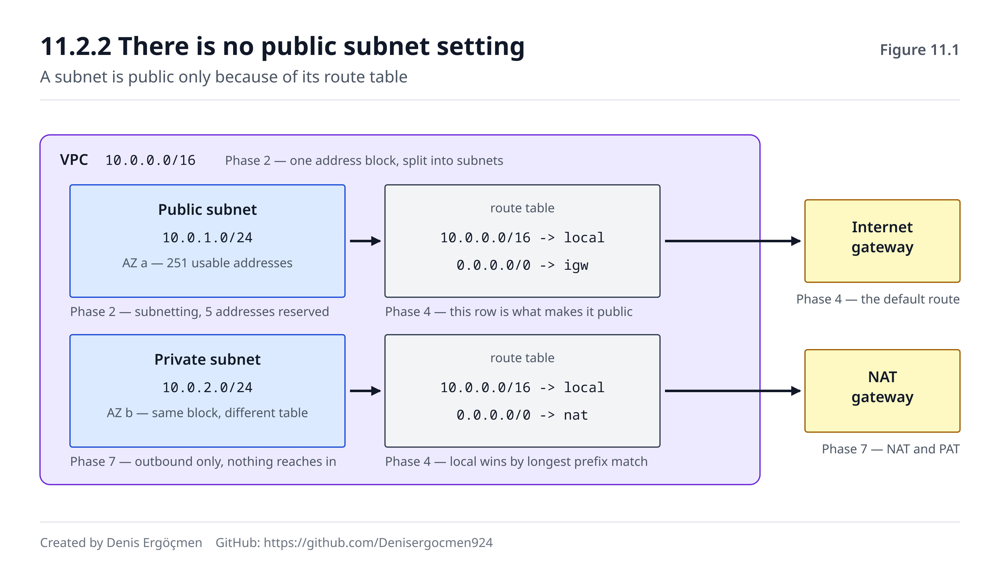

# Faz 11 — Cloud'a Köprü: Boş Bir VPC'den Production'a

> **Navigasyon:** [◀ Faz 10 — Troubleshooting](Faz_10_Troubleshooting.md) · **Faz 11** · [Ek A — Komut Sözlüğü ▶](EK_A_Komut_Sozlugu.md)

---

## Nereden geliyoruz

Faz 10'un sonunda sordum: bir VPC oluştururken **karşına ilk çıkan soru neden "IPv4 CIDR block"?**

Cevabı bu fazın ilk bölümüdür, ama özü şu: çünkü bir ağ, her şeyden önce bir **adres alanıdır.**
Subnet'ler ondan bölünür, route'lar ona göre yazılır, ve komşularla çakışıp çakışmayacağın orada
belirlenir. VPC'nin CIDR bloğu **sonradan kolayca değişmez** — bu yüzden ilk sorudur.

Yanında getirdiklerin: **her şey.** Bu fazın tek bir yeni ağ kavramı yok. Sadece, on bir fazdır
öğrendiğin şeylerin AWS'teki **adlarını** öğreneceksin.

## Bu fazın sorusu

> *"Bulut ağı gerçekten yeni bir şey mi, yoksa bildiğim şeylerin başka isimlerle sunulmuş hâli mi?"*

Cevap ikincisidir — ve bu kitabın en önemli iddiası budur.

Bulut sağlayıcıları sana bir ağ **kurdurmaz**, bir ağ **tarif ettirir.** Kablo çekmezsin, switch
yapılandırmazsın, router'a komut yazmazsın. Bunun yerine bir konsolda kutular doldurursun ve arka
tarafta yazılım o ağı senin adına kurar.

Ama kurduğu şey **aynı ağdır.** Aynı adresler, aynı subnet mantığı, aynı yönlendirme tabloları, aynı
TCP, aynı DNS. Değişen tek şey, onları nasıl **ifade ettiğindir.**

Bu yüzden bulut ağını "öğrenmek" diye bir şey yoktur; **eşleştirmek** vardır. Ve eşlemeyi kurduğunda,
hiç görmediğin bir bulut servisine baktığında bile *"bu aslında şu"* diyebilirsin. Bu fazın hedefi o
refleksi vermektir.

---

## Bu fazın sonunda

- VPC'nin neden bir adres alanı olduğunu ve CIDR seçiminin hangi üç kararı kalıcı biçimde etkilediğini
  anlatabileceksin
- "Public subnet" ile "private subnet" farkının **route table'dan** geldiğini net biçimde açıklayabileceksin
- IGW, NAT Gateway, Egress-only IGW ve VPC Endpoint'i doğru senaryoya eşleyebileceksin
- Security Group ile NACL farkını Faz 5'teki TCP durum bilgisine **dayandırarak** anlatabileceksin
- ALB ile NLB arasındaki seçimi L7/L4 ayrımıyla gerekçelendirebileceksin
- VPC'leri bağlama seçeneklerini (peering, Transit Gateway, VPN, PrivateLink) ve her birinin CIDR
  kısıtını bileceksin
- **Boş bir VPC'yi sıfırdan tarif edip her parçasının hangi fundamental'e karşılık geldiğini
  açıklayabileceksin** — bu kitabın asıl hedefi

---

## Faz haritası

| Bölüm | Konu | Derinlik | Karşılığı |
|---|---|---|---|
| 11.1 | VPC = adres alanı | `[kavram]` | Faz 2 (CIDR) |
| 11.2 | Subnet ve route table | `[uygulama]` | Faz 2 + 4 |
| 11.3 | İnternet kapıları | `[uygulama]` | Faz 7 (NAT) |
| 11.4 | Route 53 | `[kavram]` | Faz 6 (DNS) |
| 11.5 | SG vs NACL | `[uygulama]` | Faz 9 + 5 |
| 11.6 | ALB, NLB, CloudFront | `[kavram]` | Faz 5 + 8 |
| 11.7 | VPC'leri bağlamak | `[kavram]` | Faz 2 + 4 + 7 |
| 11.8 | Bu köprü bozulunca | — | **Tam eşleme tablosu** |

> **Bu fazda nasıl çalışmalı:** Bu fazda `[atla]` etiketli hiçbir bölüm yok, ama bir uyarı var: bu
> faz **komut fazı değildir.** Burada öğreneceğin şey bir araç değil, bir **eşleme**dir. Her bölümü
> okurken kendine tek bir soru sor: *"Bu, hangi fazda öğrendiğim şeyin başka adı?"* Eğer cevabı hemen
> veremiyorsan, ilgili faza dön — çünkü bulut adını ezberlemek, altındaki mekanizmayı bilmeden hiçbir
> işe yaramaz. Konsol ekranları her yıl değişir; **fundamental'ler değişmez.** Ve fazın sonundaki
> bitirme egzersizini mutlaka yap: boş bir kâğıda VPC çizmek, bu kitabın sana kazandırdığı her şeyin
> tek sayfalık sınavıdır.

---
---

# 11.1 VPC = Senin Adres Alanın

## 11.1.1 İlk soru neden CIDR `[kavram]`

Bir VPC oluştururken istenen ilk şey bir **IPv4 CIDR bloğudur** — örneğin `10.0.0.0/16`.

Bu, Faz 2'de öğrendiğin şeyin ta kendisidir (2.2): bir ağ tanımı. `10.0.0.0/16`, senin ağının
`10.0.0.0` ile `10.0.255.255` arasındaki 65.536 adresi kapsadığını söyler.

Neden **ilk** soru? Çünkü bu blok, ileride vereceğin üç kararın **sınırını** çizer:

1. **Kaç subnet'e bölebilirsin** (2.4) — `/16` seni rahat ettirir; `/24` ile başlarsan birkaç subnet
   sonra yer kalmaz.
2. **Kaç makine sığar** — her subnet'te AWS **5 adres rezerve eder** (2.3.2), bu yüzden `/28`'den
   küçük subnet oluşturulamaz.
3. **Komşularınla çakışır mısın** — ve bu en kritiği. İki VPC'yi peering ile bağlamak istediğinde,
   CIDR blokları **örtüşüyorsa bağlayamazsın** (11.7.1). Aynısı şirket içi ağınla VPN kurarken de
   geçerlidir.

Üçüncü madde, sahada en pahalıya patlayan hatadır. Herkes `10.0.0.0/16` seçer; iki şirket birleşince
veya iki ekip ağlarını bağlamak isteyince çakışma çıkar ve çözümü **VPC'yi yeniden kurmaktır**. Bu
yüzden ciddi kurumlarda CIDR blokları merkezi olarak dağıtılır.

Pratik tavsiye: RFC 1918 aralığından (1.3.1) **bol ve kimsenin kullanmadığı** bir blok seç. `10.x`
alanı geniştir; `172.16–31` daha az kullanılır ve çakışma riski düşüktür.

> **⚠️ Yaygın yanılgı: "VPC bir veri merkezidir."**
>
> Hayır — VPC bir **adres alanı ve yönlendirme alanıdır.** Fiziksel bir yeri yoktur; altında, paylaşılan
> fiziksel donanım üzerinde çalışan bir yazılım katmanı vardır. Bir VPC bir **region**'a aittir ve
> birden fazla **availability zone**'a yayılabilir — ama subnet'ler yayılamaz: **her subnet tam olarak
> bir AZ'dedir** (11.2.1). VPC'yi "kiraladığın bir bina" değil, "sana ayrılmış bir adres bloğu ve o
> blok için yazılan yönlendirme kuralları" olarak düşün. Bu ayrım önemlidir, çünkü VPC'nin sana verdiği
> şey izolasyon değil **adresleme ve yönlendirme kontrolüdür**; izolasyonu sağlayan asıl şey route
> table'lar ve güvenlik kurallarıdır (11.5).

---
---

# 11.2 Subnet ve Route Table

## 11.2.1 Subnet: bloğu bölmek `[uygulama]`

VPC'nin `10.0.0.0/16` bloğunu subnet'lere bölersin — Faz 2.4'te elle yaptığın işin aynısı:

```
VPC:            10.0.0.0/16          (65.536 adres)
├── subnet-a:   10.0.1.0/24          (256 adres, 251 kullanılabilir — 5'i rezerve, 2.3.2)
├── subnet-b:   10.0.2.0/24
└── subnet-c:   10.0.3.0/24
```

İki kural:

- **Her subnet bir AZ'dedir.** Yüksek erişilebilirlik istiyorsan aynı işi yapan en az iki subnet'i
  **farklı AZ'lerde** kurarsın.
- **Subnet'ler çakışamaz.** Faz 2'deki mantık aynen geçerlidir.

## 11.2.2 "Public subnet" diye bir ayar yoktur `[uygulama]`

Bu, bulut ağının en çok yanlış anlaşılan noktasıdır ve Faz 7.3.1'de bir kez söylemiştim — burada
tekrar ediyorum çünkü her şey buna bağlı:

> **Public subnet, "public" kutusu işaretlenmiş subnet değildir. Route table'ında `0.0.0.0/0 → IGW`
> satırı olan subnet'tir.**

Yani fark, subnet'in kendisinde değil, ona **bağlı route table'dadır** (Faz 4.2'deki yönlendirme
tablosunun ta kendisi):

| Subnet tipi | Route table'ında | Anlamı |
|---|---|---|
| **Public** | `0.0.0.0/0 → igw-xxx` | İnternete doğrudan çıkar, public IP ile içeriden erişilebilir |
| **Private** | `0.0.0.0/0 → nat-xxx` | İnternete NAT üzerinden çıkar, içeri **giremezsin** (7.2.3) |
| **İzole** | `0.0.0.0/0` satırı **yok** | İnternete hiç çıkamaz (sadece VPC içi) |

Her route table'da ayrıca otomatik bir **local** satırı vardır: `10.0.0.0/16 → local`. Bu, VPC içi
trafiğin nasıl yönlendirildiğidir ve **silinemez** — yani aynı VPC'deki tüm subnet'ler, sen bir şey
yapmasan da birbirine erişebilir. Faz 9.5.2'de "private subnet seni korumaz" derken kastettiğim şey
tam olarak bu satırdır.

Ve yönlendirme kararı, Faz 4.3'te öğrendiğin **en uzun ön ek eşleşmesiyle** verilir: `10.0.5.20`
hedefli bir paket hem `10.0.0.0/16 → local` hem `0.0.0.0/0 → igw` satırlarıyla eşleşir, ama `/16`
daha spesifik olduğu için **local** kazanır. Bulutta çalışan yönlendirme motoru, Faz 4'te elle
yaptığın işin aynısını yapar.



Şekilde her bulut bileşeninin altındaki küçük etiket, o parçanın **hangi fazda** öğrendiğin kavrama
karşılık geldiğini söyler. Bu fazı bitirdiğinde o etiketleri kendin yazabiliyor olmalısın.

> **🤔 Düşün 11.1** — Bir subnet oluşturdun, içine bir instance koydun, ona public IP verdin. Ama
> instance internete çıkamıyor. Route table'da sadece `10.0.0.0/16 → local` satırı var. (a) Sorun ne?
> (b) Public IP'si olması neden yetmedi? (c) Bu subnet hangi tipte sayılır?
>
> *(Cevap: fazın sonunda)*

---
---

# 11.3 İnternet Kapıları: IGW, NAT GW, Endpoint

Faz 7'nin tamamı buraya bağlanır. Dört kapı vardır ve her biri farklı bir soruya cevap verir.

## 11.3.1 Dördünün karşılaştırması `[uygulama]`

| Kapı | Ne yapar | Yön | Karşılığı |
|---|---|---|---|
| **Internet Gateway (IGW)** | VPC'yi internete bağlar; public IP'li trafiği çift yönlü taşır | **Çift yönlü** | Faz 7.3.2 |
| **NAT Gateway** | Private subnet'in **çıkmasını** sağlar, girişe izin vermez | **Sadece giden** | Faz 7.2 (PAT) |
| **Egress-only IGW** | IPv6 için NAT GW'nin karşılığı — sadece giden | **Sadece giden** | Faz 7.5.2 |
| **VPC Endpoint** | AWS servislerine **internete çıkmadan** erişim | VPC içi | Faz 7.3.3 |

Üç noktayı aklında tut:

1. **NAT Gateway bir public subnet'te durur** ve kendisi IGW üzerinden çıkar. Private subnet'in route
   table'ı NAT GW'yi gösterir; NAT GW'nin bulunduğu public subnet'in route table'ı IGW'yi gösterir.
   İki basamaklı bir zincirdir ve ikisinden biri eksikse çalışmaz.
2. **IPv6'da NAT yoktur** (7.5.1) — çünkü adres kıtlığı yoktur. "Dışarı çıksın ama içeri girilmesin"
   istiyorsan **egress-only IGW** kullanırsın; NAT değildir, sadece bir yön filtresidir.
3. **VPC Endpoint hem para hem güvenlik kazandırır**: S3'e giden trafik NAT Gateway üzerinden geçerse
   veri işleme ücreti ödersin; endpoint ile trafik VPC'den hiç çıkmaz.

## 11.3.2 İnternete çıkmanın üç şartı `[uygulama]`

Faz 7.3.3'te yazdığım liste, bulutta "çıkamıyorum" sorununun tam kontrol listesidir. Bir instance'ın
internete çıkabilmesi için **üçü birden** gerekir:

1. **Bir kapı var mı** — VPC'ye IGW bağlı mı (ya da NAT GW kurulmuş mu)?
2. **Yol var mı** — subnet'in route table'ında `0.0.0.0/0` satırı o kapıyı gösteriyor mu (11.2.2)?
3. **Adres var mı** — public subnet'teyse instance'ın **public IP'si** var mı? (Private subnet'te
   gerekmez; NAT GW'nin adresi kullanılır.)

Bunlara güvenlik katmanı da eklenir (SG giden kuralı, NACL **iki yön**, 11.5). Beş maddelik tam liste
Faz 9.4.2'dedir ve bulutta bir "bağlanamıyorum" biletini açmadan önce bu listeyi geçmek, sana da
karşındakine de zaman kazandırır.

---
---

# 11.4 Route 53 = DNS

Faz 6'nın bulut karşılığı basittir: **Route 53 bir DNS'tir.** Hiyerarşi aynı, kayıt tipleri aynı,
TTL aynı (6.4.1).

İki AWS'e özgü şey vardır:

**1. Alias kayıtları.** Faz 6.3.3'te CNAME'in apex'te (`example.com`) kullanılamayacağını görmüştün.
Route 53'ün **alias** kaydı bu kısıtı aşar: apex'te bile bir ALB veya CloudFront dağıtımına işaret
edebilir. Teknik olarak bir A kaydı gibi cevaplanır, ama hedefin IP'si değiştiğinde otomatik güncellenir.
Ve sorgu ücreti alınmaz.

**2. Yönlendirme politikaları.** Aynı isme birden fazla cevap tanımlayıp hangisinin döneceğini
belirlersin:

| Politika | Ne yapar | Karşılığı |
|---|---|---|
| Simple | Tek cevap | Klasik A kaydı (6.3.1) |
| Weighted | Yüzdeye göre böler | Kademeli dağıtım (canary) |
| Latency | En hızlı region'ı döner | Anycast'e benzer etki (8.5.3) |
| Failover | Sağlık kontrolüne göre yedeğe geçer | Yüksek erişilebilirlik |
| Geolocation | Kullanıcının konumuna göre | Bölgesel içerik |

Dikkat: bunların hepsi **DNS seviyesinde** çalışır, yani **TTL'e tabidir** (6.4.1). Failover
politikası bile, istemcilerin cache'i dolayısıyla anında etki etmez. Faz 6.4.3'teki kuralı hatırla:
**değişiklikten önce TTL'i düşür.** Bu, bulutta "failover'ı açtık ama kullanıcılar hâlâ eski sunucuya
gidiyor" şikâyetinin tek sebebidir.

Ayrıca VPC'nin kendi iç DNS'i vardır: `10.0.0.2` adresi (2.3.2'de rezerve edilen adreslerden biri)
VPC'nin çözümleyicisidir ve private hosted zone'ları o çözer.

---
---

# 11.5 Security Group vs NACL

Bu bölüm Faz 9.4'ün özetidir — ama burada bir kez daha, **neden**iyle birlikte.

## 11.5.1 Tek cümlelik fark `[uygulama]`

> **Security Group stateful'dur: dönen trafiğe kural yazmazsın. NACL stateless'tır: yazarsın.**

Ve bu farkın kaynağı **Faz 5'tir**: SG, TCP bağlantısının durumunu takip eder (SYN → SYN-ACK → ACK,
5.2.1) ve bir paketin "zaten izin verdiğim bağlantının parçası" olduğunu bilir (9.1.3). NACL ise her
paketi hafızasız değerlendirir, bu yüzden dönüş paketinin **kendi başına** bir kurala uyması gerekir —
ve o paketin hedef portu **ephemeral aralıktadır** (1.4.1):

```
NACL Inbound  100: ALLOW TCP 443        from 0.0.0.0/0
NACL Outbound 100: ALLOW TCP 1024-65535 to   0.0.0.0/0    ← en çok unutulan satır
```

## 11.5.2 Pratik tasarım `[uygulama]`

Saha pratiği nettir: **asıl erişim kontrolünü SG'de yap**, NACL'i kaba bir ek katman olarak bırak
(9.4.2). Sebebi: SG stateful olduğu için hata yapma riski düşüktür, ve **kaynak olarak başka bir SG
yazabilirsin** (9.4.1) — IP'ler değiştiğinde kural bozulmaz.

Katmanlı bir uygulamanın doğru SG zinciri şöyledir:

```
İnternet ──► alb-sg      ALLOW 443 from 0.0.0.0/0
              │
              ▼
            app-sg      ALLOW 8080 from alb-sg      ← IP değil, SG referansı
              │
              ▼
            db-sg       ALLOW 5432 from app-sg
```

Her katman yalnızca bir üstündekini tanır. Bu, en az yetki ilkesinin (9.5.1) bulut karşılığıdır ve
bir katman ele geçirilse bile yanal hareketi durdurur.

Son hatırlatma: bu kurallar doğru olsa bile instance'ın **kendi işletim sistemi firewall'u** ve
servisin **dinleme adresi** hâlâ engelleyebilir (1.4.2, 9.4.2). Bulut kuralları ağ katmanının sonu
değil, sadece bir katmanıdır.

> **🤔 Düşün 11.2** — Bir ekip, veritabanı SG'sine `ALLOW 5432 from 10.0.0.0/16` yazmış (tüm VPC).
> Sen `ALLOW 5432 from app-sg` öneriyorsun. (a) İkisi de çalışır — farkı nedir? (b) Instance'lar
> auto-scaling ile ölüp doğduğunda hangisi bozulur? (c) Güvenlik açısından fark ne?
>
> *(Cevap: fazın sonunda)*

---
---

# 11.6 ALB, NLB ve CloudFront

## 11.6.1 ALB vs NLB: L7 mi L4 mü `[kavram]`

Faz 8.5.1'de gördüğün ayrım burada bir ürün seçimine dönüşür:

| | **ALB** (Application LB) | **NLB** (Network LB) |
|---|---|---|
| Katman | **L7** — HTTP'yi anlar | **L4** — sadece TCP/UDP |
| Karar verirken bakar | Path, host header, cookie | IP ve port |
| TLS | Sonlandırır (8.4.2) | Geçirebilir veya sonlandırır |
| İstemci IP'si | `X-Forwarded-For` başlığında | **Korunur** (paket seviyesinde) |
| Sabit IP | Yok (DNS adı) | **Var** (her AZ için) |
| Hız | Biraz daha yavaş (içerik okur) | Çok hızlı |
| İlgili faz | Faz 8 | Faz 5 |

Seçim kuralı basittir: **HTTP'ye göre karar vermek istiyorsan ALB, istemiyorsan NLB.** `/api/*`
isteklerini bir hedefe, `/static/*` isteklerini başka bir hedefe göndermek istiyorsan L7 gerekir — ve
bunu ancak içeriği okuyabilen bir cihaz yapabilir. Ama HTTP dışı bir protokol taşıyorsan (veritabanı,
oyun sunucusu, kendi protokolün) veya sabit IP gerekiyorsa NLB'dir.

Ve Faz 8.4.2'teki uyarıyı hatırla: ALB TLS'i sonlandırdığı için **arkadaki sunucu istemcinin IP'sini
göremez**, `X-Forwarded-For` başlığından okur. Oturum ve log analizi bu başlığa bağlıdır. NLB'de böyle
bir sorun yoktur çünkü paketleri açmaz.

## 11.6.2 CloudFront = CDN `[kavram]`

CloudFront, Faz 8.5.2'de öğrendiğin CDN'dir: içeriği kullanıcıya coğrafi olarak yakın noktalarda
(edge location) tutar ve gecikmeyi düşürür. Yönlendirme **anycast** ile yapılır (8.5.3) — aynı IP
adresi dünyanın birçok noktasından duyurulur, kullanıcı en yakınına gider.

İki pratik not:

- **Cache invalidation pahalıdır ve yavaştır.** Faz 8.5.2'teki çözüm burada da geçerlidir: dosya
  adına sürüm koy (`app.a3f9c2.js`), invalidation'a hiç ihtiyaç duyma.
- **Origin'i koru.** CloudFront'un arkasındaki sunucu doğrudan erişilebilir kalırsa, CDN atlanabilir.
  Origin'in SG'sini yalnızca CloudFront'tan gelen trafiğe açmak standart uygulamadır (11.5.2 mantığı).

---
---

# 11.7 VPC'leri Birbirine Bağlamak

## 11.7.1 Dört seçenek `[kavram]`

| Yöntem | Ne bağlar | CIDR kısıtı | Karşılığı |
|---|---|---|---|
| **VPC Peering** | İki VPC | **Örtüşemez** | Faz 2 + 4 (route) |
| **Transit Gateway** | Çok sayıda VPC + on-prem | **Örtüşemez** | Merkezi router (Faz 4) |
| **Site-to-Site VPN** | VPC ↔ şirket ağı | Örtüşemez | Faz 7.4 (IPsec) + 4.6 (BGP) |
| **PrivateLink** | Tek bir **servise** erişim | **Kısıt yok** | Faz 7.3.3 (endpoint) |

Üçünde ortak olan kısıt, Faz 2'nin doğrudan sonucudur: **CIDR blokları örtüşemez.** Sebebi
yönlendirmedir (4.3) — iki farklı ağ aynı adres aralığını kullanıyorsa, router `10.0.1.5` hedefli bir
paketi hangisine göndereceğini bilemez. Bu yüzden 11.1.1'deki tavsiye kritiktir: CIDR'ı **ileride
kiminle konuşacağını düşünerek** seç.

PrivateLink'in kısıt tanımamasının sebebi de aynı mantıktır: iki ağı birleştirmez, sadece **tek bir
servisi** senin VPC'nde bir arayüz olarak gösterir. Adres alanları hiç karşılaşmadığı için çakışma
da olmaz — CIDR çakışması olan iki tarafın haberleşmesinin tek pratik yolu genelde budur.

İki ek incelik:

- **Peering geçişli değildir.** A↔B ve B↔C peering'i varsa, A ile C **konuşamaz**. Her çift için ayrı
  bağlantı ve her iki tarafta ayrı route satırı gerekir. VPC sayısı arttığında bu kombinatorik olarak
  patlar — Transit Gateway'in varlık sebebi budur: yıldız topolojili merkezi bir router.
- **Peering kurmak yetmez, route yazmak gerekir.** İki tarafın da route table'ına karşı VPC'nin CIDR
  bloğu eklenmelidir. Tek taraflı yazılırsa klasik asimetri çıkar (10.3.3): bir yön çalışır, diğeri
  timeout verir.

> **💡 Cloud bağlantısı — Site-to-Site VPN'in iki fazı:** Şirket ağını VPC'ye bağlayan Site-to-Site
> VPN, bu kitabın iki ayrı fazını aynı anda kullanır. Tünelin kendisi **IPsec**'tir (7.4.1): trafik
> şifrelenir ve internet üzerinden taşınır. Rotaların öğrenilmesi ise genelde **BGP** ile olur (4.6.1):
> iki taraf birbirine hangi CIDR bloklarına sahip olduğunu duyurur ve route table'lar otomatik dolar.
> Ve Faz 7.4.2'deki tuzak burada tam olarak devrededir: tünel başlıkları paket boyutunu büyüttüğü için
> efektif MTU düşer, ICMP Fragmentation Needed engelliyse **MTU black hole** oluşur (9.3.1) ve belirti
> "SSH bağlanıyor ama donuyor" olur. VPN kurulumlarında **MSS clamping** (5.7.3) neredeyse her zaman
> gerekir. Bu üç fazın kesişimi, sahada en çok zaman kaybettiren arıza sınıfıdır.

> **🤔 Düşün 11.3** — İki şirket birleşiyor. Her ikisinin de VPC'si `10.0.0.0/16` kullanıyor ve
> ağların konuşması gerekiyor. (a) Peering neden çalışmaz? (b) Hangi seçenekler kalıyor? (c) Bu
> durumu baştan önlemek için ne yapılmalıydı?
>
> *(Cevap: fazın sonunda)*

---
---

# 11.8 Bu Köprü Bozulunca — Tam Eşleme ve Arıza Haritası

## 11.8.1 Fundamental → Cloud eşlemesi

Bu tablo, bu kitabın özetidir. Sol sütunu biliyorsan, sağ sütun sadece bir isimdir.

| Fundamental | Faz | AWS karşılığı |
|---|---|---|
| Özel adres bloğu (RFC 1918) | 1.3 | **VPC CIDR** |
| Subnet'leme, maske | 2.2-2.4 | **Subnet** |
| Rezerve adresler | 2.3.2 | VPC'nin 5 rezerve adresi (`.0 .1 .2 .3 .255`) |
| DHCP | 1.6 | Otomatik özel IP ataması |
| ARP, broadcast domain | 3.1-3.3 | VPC'nin yazılımsal L2 katmanı |
| Yönlendirme tablosu, LPM | 4.2-4.3 | **Route Table** |
| Varsayılan geçit | 4.1 | `0.0.0.0/0` satırı |
| BGP | 4.6 | Direct Connect / VPN rota duyurusu |
| TCP durum bilgisi | 5.2 | SG'nin stateful davranışı |
| MTU / MSS | 5.7 | Jumbo frame, VPN'de MSS clamping |
| DNS hiyerarşisi, TTL | 6.1-6.4 | **Route 53**, VPC resolver (`.2`) |
| NAT / PAT | 7.1-7.2 | **NAT Gateway** |
| Public/private ayrımı | 7.3 | Route table'ın hedefi (IGW vs NAT GW) |
| IPsec tüneli | 7.4 | **Site-to-Site VPN** |
| IPv6, egress filtreleme | 7.5 | Dual-stack VPC, **Egress-only IGW** |
| L7 yönlendirme | 8.1-8.2 | **ALB** |
| TLS sonlandırma | 8.4.2 | ALB/CloudFront + `X-Forwarded-For` |
| Reverse proxy, CDN, anycast | 8.5 | **CloudFront**, Route 53 latency |
| Stateful firewall | 9.1.3 | **Security Group** |
| Stateless filtre | 9.1.2 | **Network ACL** |
| Paket yakalama | 10.2.2 | **VPC Flow Logs** (+ Traffic Mirroring) |

## 11.8.2 Köprü bozulunca

| Belirti | Muhtemel sebep | Doğrula | İlgili bölüm |
|---|---|---|---|
| Instance internete çıkamıyor | Route table'da `0.0.0.0/0` yok | Route table + IGW/NAT GW | 11.2.2, 11.3.2 |
| Public IP var ama erişilemiyor | Subnet'in IGW rotası yok | Route table | 11.2.2 |
| Private subnet çıkamıyor | NAT GW yok veya **public subnet'te değil** | NAT GW konumu + iki route table | 11.3.1 |
| Peering kurdum, çalışmıyor | **Route satırı yazılmadı** (iki tarafta da) | Her iki route table | 11.7.1 |
| Peering kurulamıyor | **CIDR örtüşüyor** | VPC CIDR blokları | 11.1.1, 11.7.1 |
| A→B ✓, B→A ✗ | Tek taraflı route veya NACL | Flow Logs, iki yön | 10.3.3, 11.7.1 |
| Bağlantı kuruluyor, cevap yok | NACL giden **ephemeral** eksik | NACL outbound | 11.5.1 |
| Yeni instance'lar DB'ye bağlanamıyor | SG'de **IP tabanlı** kural var | SG kaynağını SG referansına çevir | 11.5.2 |
| Failover açtım, trafik eski yere gidiyor | **DNS TTL** | `dig` ile TTL, önce düşür | 11.4, 6.4.3 |
| Apex'e CNAME yazamıyorum | CNAME apex kısıtı | **Alias** kaydı kullan | 11.4, 6.3.3 |
| Uygulama tüm istemcileri aynı IP görüyor | ALB TLS sonlandırıyor | `X-Forwarded-For` | 11.6.1, 8.4.2 |
| VPN üzerinden büyük transferler donuyor | Tünel MTU / **MSS clamping** | `ping -M do -s ...` | 11.7.1 kutusu, 5.7.3 |
| S3 trafiği pahalıya geliyor | NAT GW üzerinden geçiyor | **VPC Endpoint** ekle | 11.3.1, 7.3.3 |
| IPv4 ✓ IPv6 ✗ | `::/0` rotası veya kuralı eksik | Route table + SG/NACL | 11.3.1, 7.5.2 |

> **Bu tablodan çıkan ders:** Dikkat et — bu tablodaki arızaların **hiçbiri bulut arızası değildir.**
> Hepsi, on bir fazdır öğrendiğin ağ kavramlarının bulutta yanlış ifade edilmiş hâlidir: eksik bir
> route satırı (Faz 4), çakışan bir CIDR (Faz 2), unutulmuş bir dönüş kuralı (Faz 9), düşürülmemiş bir
> TTL (Faz 6), tünel MTU'su (Faz 5+7). Bulut sana yeni arızalar getirmez; **eski arızaları yeni
> isimlerle** getirir. Bu yüzden bulut ağı teşhisinde işe yarayan tek yöntem, Faz 10'un metodolojisidir:
> aşağıdan yukarı, her adımda bir grup ihtimali eleyerek. Değişen tek şey araçlardır — `tcpdump` yerine
> **Flow Logs**, `ip route` yerine **route table ekranı**. Soru aynı: *paket nereye kadar gitti ve
> orada ne oldu?*

---
---

# Faz 11 — Düşün sorularının cevapları

## Cevap 11.1 — Public IP bir yol değildir

(a) **Subnet'in route table'ında `0.0.0.0/0` satırı yok.** Sadece `10.0.0.0/16 → local` var, yani
instance yalnızca kendi VPC'si içinde konuşabilir. VPC dışına giden hiçbir paketin gidecek yeri
yoktur — Faz 4.1'deki "varsayılan geçidi olmayan makine" durumunun aynısı.

(b) Çünkü **public IP bir adrestir, bir yol değildir** (7.3.1). Adres, paketin nereden geldiğini ve
cevabın nereye döneceğini söyler; ama paketin VPC'den **çıkabilmesi** için bir rota ve bir kapı
gerekir. Kapı yoksa adres işe yaramaz. Faz 11.3.2'deki üç şartı hatırla: kapı, yol, adres — üçü
birden.

(c) Bu subnet **izoledir** — ne public ne private. Public olsaydı `0.0.0.0/0 → IGW`, private olsaydı
`0.0.0.0/0 → NAT GW` satırı olurdu (11.2.2). Düzeltme: VPC'ye bir IGW bağla ve route table'a
`0.0.0.0/0 → igw-xxx` ekle; bu tek satır subnet'i public yapar.
**İlgili bölüm:** 11.2.2, 11.3.2 · **Devamı:** Faz 7.3.1, Faz 4.1.

## Cevap 11.2 — SG referansı vs IP bloğu

(a) İkisi de bağlantıya izin verir, ama **kapsamları** farklıdır. `10.0.0.0/16`, **VPC'deki her şeye**
izin verir — uygulama sunucularına, bastion'a, test makinelerine, yanlışlıkla açılmış herhangi bir
instance'a. `app-sg` ise yalnızca o security group'a sahip instance'lara izin verir; erişim yetkisi
adrese değil **role** bağlanmıştır.

(b) **Hiçbiri bozulmaz** — ama sebepleri farklıdır ve asıl fark daha dar kurallarda ortaya çıkar. CIDR
kuralı, yeni instance'lar o blok içinde doğduğu için çalışmaya devam eder; SG referansı ise IP'den
bağımsız olduğu için zaten etkilenmez. Bozulan şey, birinin *"sadece şu üç IP'ye izin vereyim"* deyip
IP listesi yazmasıdır — auto-scaling ile IP'ler değiştiğinde o kural **sessizce** bozulur ve yeni
instance'lar bağlanamaz. SG referansı bu sınıf hatayı tamamen ortadan kaldırır (9.4.1).

(c) **Patlama yarıçapı.** VPC içindeki herhangi bir makine ele geçirilirse — bir test sunucusu, bir
CI runner, unutulmuş bir instance — CIDR kuralıyla veritabanına **doğrudan** bağlanabilir. SG
referansıyla ise yalnızca uygulama katmanı erişebilir; saldırganın önce uygulama sunucusunu ele
geçirmesi gerekir. En az yetki ilkesinin (9.5.1) somut karşılığı budur.
**İlgili bölüm:** 11.5.2 · **Devamı:** Faz 9.5.1-9.5.2, Faz 9.4.1.

## Cevap 11.3 — Çakışan CIDR

(a) Çünkü peering, iki VPC'nin route table'larına karşı tarafın **CIDR bloğunu** ekleyerek çalışır
(11.7.1). Her iki taraf da `10.0.0.0/16` ise, bir router'a *"`10.0.1.5`'e giden paketi nereye
gönder?"* diye sorduğunda cevap belirsizdir: hem kendi yerel ağı hem karşı taraf eşleşir. Üstelik
**local rotası her zaman kazanır** (11.2.2), yani paket hiçbir zaman karşıya geçmez. Faz 4.3'teki
yönlendirme mantığı bunu imkânsız kılar — AWS zaten örtüşen CIDR'lı peering kurulmasına izin vermez.

(b) Üç seçenek: (i) **PrivateLink** — ağları birleştirmez, sadece belirli servisleri karşı tarafa
arayüz olarak sunar; CIDR kısıtı yoktur (11.7.1) ve bu durumun standart çözümüdür. (ii) Taraflardan
birinin **VPC'sini yeniden kurup** farklı bir CIDR'a taşınması — en temiz ama en pahalı yol
(instance'lar yeniden yaratılır). (iii) Araya **NAT** koyarak adresleri çevirmek (7.1.1) — çalışır
ama karmaşıktır, teşhisi zorlaştırır ve genelde son çare sayılır.

(c) **CIDR bloklarını merkezi olarak planlamak** (11.1.1). Herkesin varsayılan `10.0.0.0/16`'yı
seçmesi bu sorunun tek sebebidir. Ciddi kurumlarda her hesap/ekip/bölge için CIDR blokları önceden
dağıtılır ve kayıt altında tutulur. RFC 1918 alanı (1.3.1) buna fazlasıyla yeter — yeter ki ilk gün
birkaç dakika düşünülsün. Bu, ağ tasarımında **geri dönüşü en pahalı** karardır.
**İlgili bölüm:** 11.1.1, 11.7.1 · **Devamı:** Faz 2.5 (supernetting), Faz 4.3 (LPM).

---
---

# Faz 11 — Sık sorulan sorular

**S1 — VPC ile subnet arasındaki fark tam olarak ne?** VPC bir **adres alanıdır** (bir CIDR bloğu) ve
bir region'a aittir. Subnet, o bloğun bir parçasıdır ve **tam olarak bir AZ'dedir** (11.2.1). Public
mi private mi olduğunu subnet'in kendisi değil, **bağlı olduğu route table** belirler (11.2.2).

**S2 — NAT Gateway pahalı, yerine ne kullanabilirim?** Üç yol: (i) Yalnızca AWS servislerine
erişiyorsan **VPC Endpoint** (11.3.1) — hem ucuz hem güvenli. (ii) Az trafikli ortamlarda bir EC2
üzerinde NAT instance (yönetimi sana ait). (iii) Gerçekten internete çıkması gerekmiyorsa, subnet'i
izole bırak. Çoğu maliyet sürprizi, S3/ECR trafiğinin NAT üzerinden geçmesinden çıkar.

**S3 — ALB mı NLB mi?** HTTP'ye göre karar vermen gerekiyorsa (path/host yönlendirme, cookie) **ALB**;
HTTP dışı protokol, sabit IP veya çok yüksek performans gerekiyorsa **NLB** (11.6.1). İstemci IP'si
kritikse: NLB korur, ALB `X-Forwarded-For` başlığına koyar.

**S4 — Security Group'ta neden DENY yok?** Çünkü **default deny** ile çalışır (9.2.2): yazmadığın her
şey zaten yasaktır. Belirli bir kaynağı açıkça engellemen gerekiyorsa **NACL** kullanırsın — DENY
yazabilen tek katman odur (11.5.1).

**S5 — VPC Flow Logs'u ne zaman açmalıyım?** Sorun çıkmadan önce. Geçmişe dönük tek kanıt kaynağıdır
(10.4.2) ve arıza anında açmak, o ana kadarki trafiği geri getirmez. Maliyeti düşürmek için yalnızca
REJECT kayıtlarını toplamak yaygın bir tercihtir.

**S6 — Private subnet'teki bir makineye nasıl bağlanırım?** Üç yol: bastion host (public subnet'te,
SSH sıçrama noktası), **SSM Session Manager** (SSH portu hiç açmadan — tercih edilen), veya VPN/Direct
Connect üzerinden şirket ağından. 22 numaralı portu `0.0.0.0/0`'a açmak hiçbirinin yerine geçmez
(9.5.1).

**S7 — Bulut ağını öğrenmek için hangi fundamental en kritik?** **Faz 2 (CIDR) ve Faz 4 (route
table).** Bulut ağının neredeyse tamamı "hangi adres bloğu, hangi tabloda, nereyi gösteriyor"
sorusudur. Faz 9 (SG/NACL) hemen ardından gelir. Bu üçünü bilen biri, hiç görmediği bir bulut ağ
servisini de okuyabilir.

---
---

# Faz 11 — Kendini sına

Cevaplarını bir kâğıda yaz, sonra cevap anahtarıyla karşılaştır. Hedef: 18 sorudan 14+.

## Bölüm A — Karşılıklar

1. VPC hangi fundamental kavramın karşılığıdır?
2. Route table, Faz 4'teki hangi yapının aynısıdır? Karar hangi kuralla verilir?
3. NAT Gateway hangi mekanizmayı uygular?
4. Security Group'un stateful olması hangi fazın bilgisine dayanır?
5. Route 53 alias kaydı hangi kısıtı çözer?
6. VPC Flow Logs, hangi yerel aracın bulut karşılığıdır — ve hangi açıdan ondan zayıftır?

## Bölüm B — Uygulama

7. "Public subnet" nasıl tanımlanır? Tek cümleyle.
8. Bir instance'ın internete çıkması için gereken üç şartı yaz.
9. NAT Gateway hangi subnet'te durmalı ve neden?
10. NACL'de dönen trafik için hangi port aralığını açarsın?
11. Katmanlı bir uygulamada üç SG'nin kural zincirini yaz.
12. Peering kurdun ama trafik akmıyor. İlk bakacağın şey ne?

## Bölüm C — Muhakeme

13. Neden VPC oluştururken ilk soru CIDR bloğu?
14. İki VPC'nin CIDR'ı örtüşüyorsa peering neden imkânsız?
15. SG referansı ile CIDR kuralı arasındaki güvenlik farkını açıkla.
16. Failover politikası açtın ama trafik eski sunucuya gidiyor. Sebep ve çözüm?
17. ALB arkasındaki sunucu tüm istekleri aynı IP'den görüyor. Neden ve çözüm?
18. "Bulut ağı yeni bir şey değildir" iddiasını üç örnekle savun.

---

## Cevap anahtarı

1. Bir **adres alanının** — RFC 1918 özel blokla tanımlanmış bir ağ (1.3, 2.2, 11.1.1). — 2.
   **Yönlendirme tablosunun** (4.2); karar **en uzun ön ek eşleşmesiyle** (LPM) verilir ve `local`
   satırı daha spesifik olduğu için VPC içi trafikte daima kazanır (4.3, 11.2.2). — 3. **PAT'i** —
   çok sayıda özel adresi tek public adres arkasından, port numaralarıyla ayırt ederek çıkarır
   (7.2.1, 11.3.1). — 4. **Faz 5'e** — TCP bağlantı durumuna (SYN/SYN-ACK/ACK, 5.2.1). SG bir paketin
   "zaten izin verdiğim bağlantının parçası" olduğunu bu sayede bilir (9.1.3). — 5. **CNAME'in
   apex'te kullanılamaması** kısıtını (6.3.3); alias, apex'te bile ALB/CloudFront'a işaret edebilir
   (11.4). — 6. **`tcpdump`'ın** (10.2.2). Zayıf yönü: yalnızca **başlıkları** kaydeder, içeriği değil
   — ve gerçek zamanlı değildir, toplama aralığı 1–10 dakikadır (10.4.2).

7. Route table'ında **`0.0.0.0/0 → Internet Gateway`** satırı olan subnet (11.2.2). — 8. (1) Bir kapı
   (IGW veya NAT GW), (2) route table'da o kapıyı gösteren `0.0.0.0/0` satırı, (3) bir adres (public
   subnet'te public IP; private'ta NAT GW'ninki) — artı SG/NACL izinleri (11.3.2). — 9. **Public
   subnet'te** — çünkü NAT GW'nin kendisinin internete çıkması gerekir ve bunu ancak IGW rotası olan
   bir subnet'te yapabilir. Private subnet'in route table'ı NAT GW'yi, NAT GW'nin subnet'i IGW'yi
   gösterir (11.3.1). — 10. **Ephemeral aralığı** — AWS önerisi `1024-65535` (1.4.1, 11.5.1). — 11.
   `alb-sg: ALLOW 443 from 0.0.0.0/0` → `app-sg: ALLOW 8080 from alb-sg` → `db-sg: ALLOW 5432 from
   app-sg` (11.5.2). — 12. **Route satırları** — her iki VPC'nin route table'ına karşı tarafın CIDR
   bloğu eklenmiş mi? Peering kurmak tek başına trafik akıtmaz; tek taraflı yazılırsa asimetri çıkar
   (11.7.1, 10.3.3).

13. Çünkü bir ağ her şeyden önce bir **adres alanıdır** ve bu blok üç şeyi kalıcı olarak belirler: kaç
    subnet'e bölünebileceğini (2.4), kaç makine sığacağını, ve ileride kimlerle bağlanabileceğini
    (örtüşme kısıtı). Sonradan değiştirmek pratikte VPC'yi yeniden kurmak demektir (11.1.1). — 14.
    Çünkü yönlendirme belirsizleşir: `10.0.1.5` hedefli paket hem yerel ağla hem karşı VPC'yle
    eşleşir ve **local rotası daima kazanır** (11.2.2), yani paket asla karşıya geçmez. LPM tek bir
    kesin cevap gerektirir (4.3, 11.7.1). — 15. CIDR kuralı **VPC'deki her şeye** izin verir; ele
    geçirilmiş herhangi bir makine veritabanına doğrudan bağlanabilir. SG referansı erişimi **role**
    bağlar: yalnızca uygulama katmanı geçer, patlama yarıçapı küçülür (11.5.2, 9.5.1). — 16. Sebep:
    **DNS TTL** — istemciler ve ara çözümleyiciler eski cevabı cache'liyor (6.4.1). Çözüm: değişiklikten
    **önce** TTL'i düşür, eski TTL süresi kadar bekle, sonra değiştir (6.4.3, 11.4). — 17. Çünkü ALB
    TLS'i **sonlandırır** ve arkaya kendi bağlantısını açar (8.4.2); sunucunun gördüğü kaynak IP
    ALB'nindir. Çözüm: **`X-Forwarded-For`** başlığını oku (veya istemci IP'si kritikse NLB kullan)
    (11.6.1). — 18. Üç örnek yeterli: (i) **VPC = CIDR bloğu** (Faz 2), (ii) **Route table = yönlendirme
    tablosu + LPM** (Faz 4), (iii) **Security Group = stateful firewall** (Faz 9) — SG'nin dönen
    trafiğe kural istememesi doğrudan TCP durum bilgisinden gelir (Faz 5). Ek olarak: NAT GW = PAT
    (Faz 7), Route 53 = DNS (Faz 6), CloudFront = CDN + anycast (Faz 8) (11.8.1).

## Puanlama

| Doğru sayısı | Ne anlama geliyor |
|---|---|
| 16-18 | Eşlemeyi kurdun. Artık bulut ağını "öğrenmiyorsun", tanıyorsun. Kitap tamam. |
| 13-15 | İyi. 11.8.1 tablosunu bir kez daha, sağdan sola okuyarak geç. |
| 9-12 | 11.2 ve 11.5'e dön; bulutun tamamı o iki bölümün üstünde duruyor. |
| 0-8 | İlgili fundamental fazlara dön (2, 4, 9). Bulut adı, mekanizma olmadan işe yaramaz. |

Kaçırdığın soru → dönmen gereken bölüm:

| Soru | Bölüm |
|---|---|
| 1, 13 | 11.1 VPC = adres alanı |
| 2, 7, 12 | 11.2 Subnet ve route table |
| 3, 8, 9 | 11.3 İnternet kapıları |
| 5, 16 | 11.4 Route 53 |
| 4, 10, 11, 15 | 11.5 SG vs NACL |
| 17 | 11.6 ALB, NLB, CloudFront |
| 14 | 11.7 VPC'leri bağlamak |
| 6, 18 | 11.8 Tam eşleme tablosu |

---
---

# Faz 11 — Kapanış: Workbook'un Sonu, Ağ Yolculuğunun Başı

## Bu fazdan — ve tüm workbook'tan — ne taşıyorsun

Bu fazda tek bir yeni ağ kavramı öğrenmedin. Öğrendiğin şey **eşleme**ydi: VPC bir adres alanı, route
table bir yönlendirme tablosu, NAT Gateway bir PAT, Security Group stateful bir firewall, Route 53 bir
DNS, ALB bir L7 proxy, Flow Logs bir paket kaydı.

Ve bu, bu kitabın asıl iddiasının kanıtıdır: **bulut ağı yeni bir şey değildir.** Bildiğin şeylerin
tarif edilme biçimidir.

Geriye dönüp bak. On iki fazda şunları kurdun: katmanların bir teşhis sırası olduğunu (Faz 0), bir
makinenin adresini nasıl aldığını (Faz 1), bir ağın nasıl bölündüğünü (Faz 2), yerel ağda MAC'in nasıl
bulunduğunu (Faz 3), paketin ağlar arasında nasıl yol aldığını (Faz 4), güvenilir iletimin nasıl inşa
edildiğini (Faz 5), ismin IP'ye nasıl çevrildiğini (Faz 6), tek adresin nasıl paylaşıldığını (Faz 7),
web'in bunların üstüne nasıl kurulduğunu (Faz 8), paketin neden bilinçli olarak düşürüldüğünü (Faz 9),
ve arızanın hangi sırayla aranacağını (Faz 10).

En kalıcı üç cümle, bu kitabın tamamından geriye kalanlardır:

- **"Aşağıdan yukarı."** Alt katman kanıtlanmadan üstteki hiçbir test güvenilir değildir.
- **"Timeout firewall, refused servis."** İki kelime, iki farklı ekip.
- **"Yorumla yetinme, kanıt ara."** `tcpdump` ve Flow Logs tartışmaları bitirir.

## Bundan sonra nereye

Bu workbook'un sonu, gerçek bulut yolculuğunun başıdır. Bundan sonra göreceğin her servis — ECS, EKS,
RDS, Lambda, API Gateway, App Mesh — kendi ağ modeliyle gelecek. Ve her birine aynı iki soruyla
yaklaşacaksın: *"Bunun altında hangi ağ mekanizması var?"* ve *"Bir şey bozulunca hangi katmana
inerim?"*

Bu iki soru, bu kitabın sana kazandırdığı en kalıcı alışkanlıktır.

> **🤔 Son çıktı — kendine sor:** Hiç görmediğin bir bulut servisine baktığında (diyelim ki bir
> "service mesh" veya "API Gateway"), ilk sorularının ne olması gerekir? İpucu: *hangi katmanda
> çalışıyor, adresi nereden alıyor, ismi nasıl çözüyor, trafiği kim filtreliyor, ve bozulunca nereye
> bakarım?* Bu beş soruyu sorabiliyorsan, dokümantasyonu okumadan önce zaten yarısını biliyorsun
> demektir.
>
> **🧪 Bitirme Egzersizi — boş bir VPC çiz (kâğıt 🟢, konsol 🟡):** Bu kitabın tek sayfalık sınavı.
> (1) 🟢 Boş bir kâğıda bir VPC çiz: CIDR bloğunu seç ve **neden o bloğu seçtiğini** yaz (11.1.1).
> (2) İki AZ'ye yayılmış dört subnet böl — iki public, iki private — ve her birinin CIDR'ını **elle
> hesapla** (2.4). (3) Her subnet için route table'ı yaz: hangi satırlar var, hedefleri ne (11.2.2).
> (4) IGW, NAT GW ve gerekiyorsa VPC Endpoint'i yerleştir; NAT GW'yi **neden** public subnet'e
> koyduğunu açıkla (11.3.1). (5) Üç katmanlı bir uygulama için SG zincirini yaz (11.5.2). (6) Route
> 53 kaydını ve ALB'yi ekle; apex için **neden alias** gerektiğini yaz (11.4). (7) Şimdi en önemli
> adım: **her kutunun altına hangi fazda öğrendiğin kavramın karşılığı olduğunu yaz.** Hepsini
> yazabiliyorsan bu kitabı bitirmişsin demektir. (8) 🟡 İstersen aynı tasarımı kendi test hesabında
> gerçekten kur ve bir instance'tan `curl ifconfig.me` çalıştır *(Geri alma: bitince NAT Gateway'i ve
> instance'ları **sil** — NAT GW saatlik ücretlidir ve unutulduğunda en sık maliyet sürprizi
> yaratan kaynaktır.)*

Bu workbook'u bitirdin. Artık bir paketin nereye gittiğini, neden düştüğünü ve bir arızanın hangi
katmanda aranacağını biliyorsun. Bulut yolculuğun burada başlıyor.

---

> **Ekler:** [Ek A — Komut Sözlüğü](EK_A_Komut_Sozlugu.md) · [Ek B — Kavram ve Dosya Haritası](EK_B_Kavram_Dosya_Haritasi.md) · [Ek C — "Bozulunca" Hızlı Başvuru](EK_C_Bozulunca_Hizli_Basvuru.md)

> **Navigasyon:** [◀ Faz 10 — Troubleshooting](Faz_10_Troubleshooting.md) · **Faz 11** · [Ek A — Komut Sözlüğü ▶](EK_A_Komut_Sozlugu.md)
