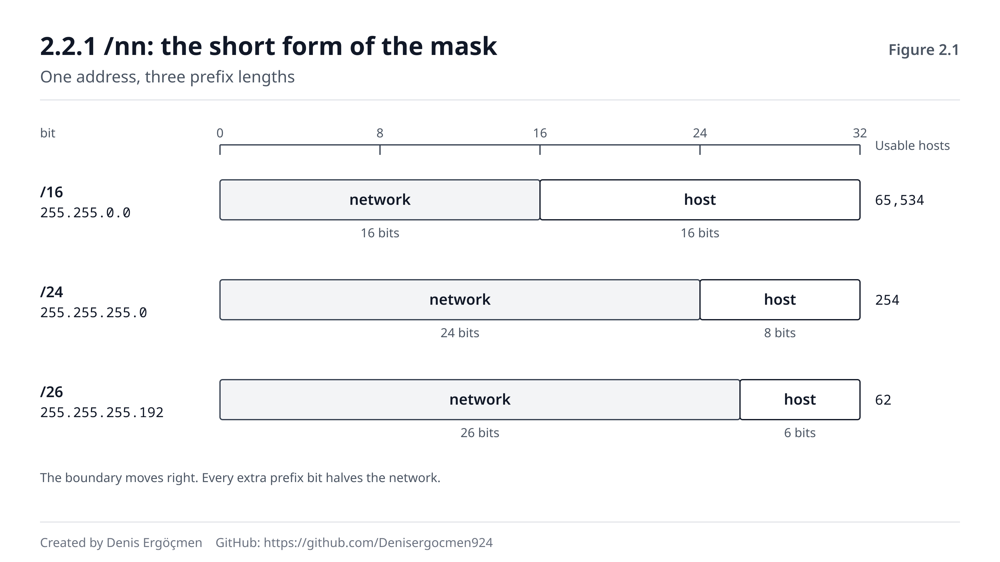

# Faz 2 — Subnet ve CIDR: Ağı Bölmek

> **Navigasyon:** [◀ Faz 1 — Adresleme](Faz_1_Adresleme.md) · **Faz 2** · [Ara Sınav 1 ▶](Ara_Sinav_1.md)

---

## Nereden geliyoruz

Faz 1'in sonunda sana şu soruyu bıraktık: iki makineye aynı adres aralığı ama **farklı prefix** verilirse ne
olur? Bu fazda o sorunun hem cevabını hem de arkasındaki tüm matematiği alacaksın.

Faz 1'den taşıdığın üç şey, bu fazın üç ayağıdır:

- **Bir IP adresi 32 bittir** ve noktalar sadece okumak içindir (1.2.1). Bu faz tamamen o 32 bit üzerinde
  çalışıyor — ve noktaların anlamsız olması, subnet sınırlarının **oktet sınırlarına uymak zorunda
  olmadığı** anlamına geliyor.
- **Binary ↔ decimal dönüşümü** (1.2.2). Faz 1'de "elle yap, Faz 2'de gerekecek" demiştik. Gereken faz
  burası.
- **Network kısmı / host kısmı ayrımı** (1.2.3). Faz 1 bu ayrımın *var olduğunu* söyledi; Faz 2 o sınırın
  **nerede** olduğunu ve nasıl kaydırılacağını öğretiyor.

## Bu fazın sorusu

> *"`/24` yazdığımda tam olarak neyi söylemiş oluyorum — ve o sayıyı bir değiştirdiğimde kaç makine 'aynı
> ağda' olmaktan çıkıyor?"*

Bu, kitabın en çok pratik gerektiren sorusudur. Çünkü cevabı bir tanım değil, bir **beceri**: bir prefix'e
bakıp ağın sınırlarını, kullanılabilir adres sayısını ve komşuluk ilişkilerini **kâğıtta çıkarabilmek**.

Ve bu beceri, bulut ağ tasarımının tamamını taşır. Bir VPC oluştururken `10.0.0.0/16` yazarsın; onu
subnet'lere bölerken `10.0.1.0/24` ve `10.0.2.0/24` dersin; bir security group kuralında
`10.0.0.0/16` kaynağına izin verirsin; iki VPC'yi peer ederken CIDR'ları **çakışıyorsa** işlem reddedilir.
Bunların hepsi tek bir soruya indirgenir: **bu prefix hangi adresleri kapsıyor?**

## Bu fazı nasıl okumalısın — özel uyarı

Bu, kitabın **en yavaş ilerlemen gereken** fazıdır. Diğer fazlarda bir bölümü okuyup anladığını hissetmek
yeterlidir; burada değil. Burada her bölümün sonunda **kâğıt kalem alıp hesap yapmadan** ilerlersen, Faz 4
(routing) ve Faz 11 (AWS VPC) sende ezber olarak kalır, anlayış olarak değil.

Somut hedef: bu fazı bitirdiğinde, sana rastgele verilen bir `a.b.c.d/nn` için **10 saniyede** network
adresini, broadcast adresini, kullanılabilir aralığı ve host sayısını söyleyebilmelisin. Bu faz o hedef
içindir.

---

## Bu fazın sonunda

- Subnet mask'in ne olduğunu, neden "1'ler solda, 0'lar sağda" olduğunu ve `255.255.255.0` ile `/24`'ün
  aynı şey olduğunu açıklayabileceksin
- CIDR gösterimini okuyabilecek; `/8`'den `/32`'ye kadar prefix'in ne anlama geldiğini bileceksin
- Bir adres + prefix çiftinden **network adresini**, **broadcast adresini** ve **kullanılabilir host
  aralığını** elle hesaplayabileceksin
- `2^host_bit - 2` formülünü ve neden **-2** olduğunu (network + broadcast) açıklayabileceksin
- Bir ağı daha küçük subnet'lere **bölebilecek** (subnetting) ve neden bölündüğünü (yayın alanı, güvenlik,
  yönetim) anlatabileceksin
- Supernetting/route aggregation fikrini ve neden router tablolarını küçülttüğünü anlatabileceksin
- Bir prefix'in bir adresi **kapsayıp kapsamadığını** hızlıca söyleyebilecek — firewall kuralları ve routing
  bunun üstünde durur
- **Cloud:** VPC CIDR seçimini, subnet bölmeyi, AWS'in her subnet'ten **5 adresi neden rezerve ettiğini**
  ve CIDR çakışmasının peering'i neden imkânsız kıldığını açıklayabileceksin

---

## Faz haritası

| Bölüm | Konu | Derinlik | Neden burada |
|---|---|---|---|
| 2.1 | Subnet mask fikri | `[mekanizma]` | Sınırın nerede çizildiği |
| 2.2 | CIDR gösterimi | `[kavram]` | Aynı şeyin kısa yazımı — sahada bu kullanılır |
| 2.3 | Network, broadcast, kullanılabilir aralık | `[uygulama]` | **Fazın kalbi** — elle hesap |
| 2.4 | Subnetting: ağı bölmek | `[uygulama]` | Bulut subnet tasarımının aynısı |
| 2.5 | Supernetting ve route aggregation | `[kavram]` | Faz 4'teki tablo küçültmenin temeli |
| 2.6 | Bu faz bozulunca | — | Mask arızalarının imzaları |

> **Bu fazda nasıl çalışmalı:** Komutlar yine 🟢 (`ip addr`, `ipcalc`, `ip route`) — hiçbiri bir şey
> değiştirmiyor. Ama bu fazın asıl aracı **kâğıt**. Her bölüm sonunda kendine bir adres/prefix uydur ve
> hesapla; sonra `ipcalc 10.0.4.130/26` ile (kuruluysa) kontrol et. Kontrol aracı olarak kullan,
> **hesaplayıcı olarak değil** — elle yapamadığın bir şeyi araç yapıyorsa o beceri sende yok demektir.
> 2.3'teki dört adımlı yöntemi ezberle: *mask'i binary yaz → AND al → network bul → host bitlerini
> doldur.* Bu dört adım, bu fazın tamamıdır.

---
---

# 2.1 Subnet Mask — Sınırı Çizen Şey

## 2.1.1 Maskenin fikri: 1'ler network, 0'lar host `[mekanizma]`

Faz 1.2.3'te bir IP adresinin network ve host kısımlarına bölündüğünü söyledik. Ama adresin kendisine bakarak
o sınırın nerede olduğunu **anlayamazsın** — `10.0.4.130` tek başına hiçbir şey söylemez.

Sınırı söyleyen ikinci bir değer vardır: **subnet mask**. Mask de tıpkı IP gibi 32 bittir ve kuralı basit:

- **1 olan bitler** → o pozisyon **network** kısmına ait
- **0 olan bitler** → o pozisyon **host** kısmına ait

Ve kritik kısıt: **1'ler daima solda, kesintisiz bloklar hâlindedir.** `11111111.11111111.11111111.00000000`
geçerlidir; `11111111.00000000.11111111.00000000` **geçersizdir**. Sınır tektir, delikli olamaz.

En yaygın üç mask:

| Mask (decimal) | Mask (binary) | Kaç bit network |
|---|---|---|
| `255.0.0.0` | `11111111.00000000.00000000.00000000` | 8 |
| `255.255.0.0` | `11111111.11111111.00000000.00000000` | 16 |
| `255.255.255.0` | `11111111.11111111.11111111.00000000` | 24 |

`255 = 11111111` (hepsi 1) ve `0 = 00000000` (hepsi 0) olduğu için (1.2.2) bu tablo doğrudan okunur.

## 2.1.2 AND işlemi: network adresini bulmak `[mekanizma]`

Makine "hedef benim ağımda mı?" sorusunu (1.2.3) tam olarak şöyle cevaplar: IP ile mask'i bit bit **AND**'ler.

AND işlemi tek kuralla çalışır: **iki bit de 1 ise sonuç 1, aksi hâlde 0.**

```
IP:       00001010 . 00000000 . 00000100 . 10000010    (10.0.4.130)
Mask:     11111111 . 11111111 . 11111111 . 00000000    (255.255.255.0)
          ────────────────────────────────────────  AND
Network:  00001010 . 00000000 . 00000100 . 00000000    (10.0.4.0)
```

Sonuç: `10.0.4.0`. Buna **network adresi** denir — bu ağın kimliğidir.

Dikkat et: mask'in 1 olduğu yerlerde IP'nin biti **aynen geçti**; 0 olduğu yerlerde **sıfırlandı**. Maskenin
yaptığı iş tam olarak budur: host kısmını silip geriye ağın kimliğini bırakmak.

Ve makinenin kararı şudur: **kendi network adresi ile hedefin network adresi aynıysa → aynı ağ.** Aynı
mask'le hedefi de AND'ler, ikisini karşılaştırır. Eşitse doğrudan teslim (Faz 3), değilse gateway'e (Faz 4).

> **🔧 Makinende gör** 🟢 — kendi mask'ini ve network adresini gör
>
> ```
> $ ip -4 addr show ens5 | grep inet
>     inet 172.31.20.15/20 brd 172.31.31.255 scope global dynamic ens5
>
> $ ip route | head -2
> default via 172.31.16.1 dev ens5 proto dhcp src 172.31.20.15
> 172.31.16.0/20 dev ens5 proto kernel scope link src 172.31.20.15
> ```
>
> İkinci `ip route` satırı, makinenin **kendi ağının network adresini** gösteriyor: `172.31.16.0/20`.
> Makine bunu kendisi hesapladı — `172.31.20.15` adresini `/20` mask'iyle AND'leyerek. `scope link` ifadesi
> "bu ağa gateway olmadan, doğrudan ulaşırım" demek. İlk satırdaki `default via` ise "geri kalan her şey
> şu adrese" demek (Faz 4.1). Bu iki satır, 1.2.3'teki kararın makinede somut hâlidir.

> **⚠️ Yaygın yanılgı: "Subnet mask, adresin bir parçasıdır."**
>
> Hayır — mask **ayrı bir 32 bitlik değerdir** ve pakette taşınmaz. Bir IP paketinin header'ında kaynak IP
> ve hedef IP vardır, **mask yoktur**. Mask yalnızca makinenin kendi yerel kararı içindir: "bu hedef benim
> ağımda mı?" Router'lar da kendi tablolarındaki prefix'leri kullanır, paketten okumaz. Pratik sonucu şudur:
> bir makineye yanlış mask verirsen, **paket yine de gider** ama makine onu **yanlış yere** yollar —
> gateway'e gitmesi gerekeni komşusuna, komşusuna gitmesi gerekeni gateway'e. Mask bir adres değil, bir
> **karar kuralıdır**.

> **🤔 Düşün 2.1** — `192.168.5.77` adresi ve `255.255.255.0` mask'i var. (a) AND işlemini binary'de yaparak
> network adresini bul. (b) Aynı adres `255.255.0.0` mask'iyle verilseydi network adresi ne olurdu?
> (c) İki durumda `192.168.9.4` adresi "aynı ağda" sayılır mıydı — her biri için ayrı cevapla.
>
> *(Cevap: fazın sonunda)*

---
---

# 2.2 CIDR Gösterimi

## 2.2.1 /nn: maskenin kısa yazımı `[kavram]`

`255.255.255.0` yazmak uzundur ve okuması yorucudur. Mask'teki 1'ler zaten hep solda ve kesintisiz olduğuna
göre (2.1.1), söylenmesi gereken tek şey **kaç tane 1 olduğudur**.

İşte **CIDR** gösterimi budur (Classless Inter-Domain Routing — *sayder*): adresin sonuna bir eğik çizgi ve
network bitlerinin sayısı.

```
192.168.1.10 / 255.255.255.0     ≡     192.168.1.10/24
```

İkisi **tamamen aynı** şeyi söyler. Sahada, belgelerde ve bulut konsollarında neredeyse her zaman CIDR
gösterimi kullanılır.

Dönüşüm tablosu — bunu bir kez anla, ezberlemen gerekmez:

| CIDR | Mask (decimal) | Host bitleri | Kullanılabilir host |
|---|---|---|---|
| `/8` | `255.0.0.0` | 24 | 16.777.214 |
| `/16` | `255.255.0.0` | 16 | 65.534 |
| `/24` | `255.255.255.0` | 8 | 254 |
| `/25` | `255.255.255.128` | 7 | 126 |
| `/26` | `255.255.255.192` | 6 | 62 |
| `/27` | `255.255.255.224` | 5 | 30 |
| `/28` | `255.255.255.240` | 4 | 14 |
| `/29` | `255.255.255.248` | 3 | 6 |
| `/30` | `255.255.255.252` | 2 | 2 |
| `/32` | `255.255.255.255` | 0 | 1 (tek adres) |

İki uç değeri tanı: **`/32`** tek bir adresi ifade eder (firewall kurallarında "sadece bu makine" demek
için kullanılır), **`/0`** ise **her adresi** kapsar (Faz 4'te `0.0.0.0/0` = "varsayılan yol" olarak
karşına çıkacak).

Ve bu tablodan çıkan altın kural: **prefix büyüdükçe ağ küçülür.** `/24`, `/16`'dan daha küçük bir ağdır.
Sezgiye ters gelir ama mantıklı: prefix, network bitlerinin sayısıdır — ne kadar çok bit network'e ayrılırsa,
host'a o kadar az bit kalır.



Şekilde üç satır aynı adresi gösteriyor; değişen tek şey prefix çizgisinin **nerede** durduğu. Çizginin
solundaki mavi alan network, sağındaki gri alan host kısmıdır. Her satırın sağındaki sayı, o prefix'le kaç
makinenin "aynı ağda" sayıldığını gösteriyor — çizgi bir bit sağa kaydığında bu sayının yarıya indiğine
dikkat et.

> **💡 Cloud bağlantısı — VPC CIDR seçimi geri alınamaz bir karardır:** AWS'te bir VPC oluştururken ona bir
> CIDR bloğu verirsin — örneğin `10.0.0.0/16` (65.536 adres). Bu blok, VPC'nin ömrü boyunca **daraltılamaz**
> (genişletmek için ek blok eklenebilir, ama asıl blok değişmez). Pratikte iki hata pahalıya patlar: (1) **çok
> dar seçmek** — `/24` bir VPC, 254 adresle birkaç ay sonra dolar ve subnet ekleyecek yerin kalmaz; (2)
> **başka ağlarla çakışan blok seçmek** — ofis ağın `192.168.1.0/24` ise ve VPC'ne de aynı bloğu verirsen,
> VPN kurduğunda iki taraf da "bu adres benim ağımda" der (2.1.2) ve trafik hiç geçmez. Aynı sebeple çakışan
> CIDR'lı iki VPC **peer edilemez** — AWS isteği baştan reddeder. Bu yüzden kurumlar VPC'lere baştan ayrık
> bloklar tahsis eder: `10.0.0.0/16` prod, `10.1.0.0/16` staging, `10.2.0.0/16` dev.

> **🤔 Düşün 2.2** — Bir firewall kuralında kaynak olarak `10.0.0.0/8` yazılmış. (a) Bu kural
> `10.5.200.13` adresini kapsıyor mu? (b) `172.16.0.5` adresini kapsıyor mu? (c) Aynı kuralı `10.0.0.0/16`
> yapsan (a)'daki cevap değişir mi — neden?
>
> *(Cevap: fazın sonunda)*

---
---

# 2.3 Network Adresi, Broadcast ve Kullanılabilir Aralık

Bu fazın kalbi burası. Dört adımlık bir yöntem öğreneceksin ve bu yöntem, sana verilen **her** `a.b.c.d/nn`
için çalışacak.

## 2.3.1 Bir ağın üç sınır değeri `[kavram]`

Her ağda, host'lara **verilemeyen** iki özel adres vardır:

- **Network adresi** — host bitlerinin **hepsi 0**. Ağın kimliğidir, bir cihaza atanamaz. (`10.0.4.0/24`
  örneğinde: `10.0.4.0`)
- **Broadcast adresi** — host bitlerinin **hepsi 1**. Bu adrese gönderilen paket, o ağdaki **herkese**
  gider. (`10.0.4.255`)

Aradaki her adres **kullanılabilir host adresidir**. (`10.0.4.1` – `10.0.4.254`)

İşte ünlü **-2** buradan gelir:

```
kullanılabilir host sayısı = 2^(host bit sayısı) − 2
```

`/24` için: host bitleri 32−24 = 8 → 2⁸ = 256 → 256−2 = **254**.

## 2.3.2 Dört adımda hesap `[uygulama]`

Örnek üzerinden gidelim: **`10.0.4.130/26`**

**Adım 1 — Mask'i binary yaz.** `/26` → 26 tane 1, sonra 6 tane 0:

```
11111111 . 11111111 . 11111111 . 11000000     →  255.255.255.192
```

Sadece son oktet ilginç: `11000000` = 128+64 = **192**.

**Adım 2 — Adresi binary yaz ve AND al.**

```
IP:       00001010 . 00000000 . 00000100 . 10000010    (10.0.4.130)
Mask:     11111111 . 11111111 . 11111111 . 11000000
          ────────────────────────────────────────  AND
Network:  00001010 . 00000000 . 00000100 . 10000000    (10.0.4.128)
```

**Network adresi: `10.0.4.128`**

**Adım 3 — Host bitlerini 1 yaparak broadcast'i bul.**

```
Network:    ... . 10000000    (10.0.4.128)
Broadcast:  ... . 10111111    (10.0.4.191)   ← son 6 bit hep 1
```

`10111111` = 128 + 32+16+8+4+2+1 = **191**. **Broadcast: `10.0.4.191`**

**Adım 4 — Aralığı ve sayıyı yaz.**

- Kullanılabilir aralık: **`10.0.4.129` – `10.0.4.190`**
- Host sayısı: 2⁶ − 2 = 64 − 2 = **62**

Özet tablo:

| Değer | Sonuç |
|---|---|
| Verilen | `10.0.4.130/26` |
| Mask | `255.255.255.192` |
| Network | `10.0.4.128` |
| İlk host | `10.0.4.129` |
| Son host | `10.0.4.190` |
| Broadcast | `10.0.4.191` |
| Host sayısı | 62 |

## 2.3.3 Hızlı yöntem: blok büyüklüğü `[uygulama]`

Binary yazmak güvenlidir ama yavaştır. Deneyimli mühendisler **blok büyüklüğü** (block size) yöntemini
kullanır:

```
blok büyüklüğü = 256 − (ilgili oktetteki mask değeri)
```

`/26` için mask son okteti 192 → blok = 256 − 192 = **64**.

Demek ki bu prefix, son oktette 64'lük bloklar oluşturur: **0, 64, 128, 192**. Adresin son okteti 130 ise,
130'u içeren blok **128**'dir (çünkü 128 ≤ 130 < 192). Network = `10.0.4.128`, broadcast = bir sonraki
bloğun bir eksiği = `10.0.4.191`. Aynı sonuç, üç saniyede.

Sık kullanılan blok büyüklükleri:

| Prefix | Mask son okteti | Blok büyüklüğü | Bloklar (son oktet) |
|---|---|---|---|
| `/24` | 0 | 256 | 0 |
| `/25` | 128 | 128 | 0, 128 |
| `/26` | 192 | 64 | 0, 64, 128, 192 |
| `/27` | 224 | 32 | 0, 32, 64, 96, ... |
| `/28` | 240 | 16 | 0, 16, 32, 48, ... |
| `/30` | 252 | 4 | 0, 4, 8, 12, ... |

**Tavsiye:** önce binary yöntemini (2.3.2) güvenle yapabil, sonra blok yöntemine geç. Blok yöntemi bir
kısayoldur; altında ne olduğunu bilmiyorsan, alışılmadık bir prefix'te (örn. `/19`) yanılırsın.

> **🔧 Makinende gör** 🟢 — hesabını doğrula
>
> ```
> $ ipcalc 10.0.4.130/26
> Address:   10.0.4.130           00001010.00000000.00000100.10 000010
> Netmask:   255.255.255.192 = 26 11111111.11111111.11111111.11 000000
> =>
> Network:   10.0.4.128/26        00001010.00000000.00000100.10 000000
> HostMin:   10.0.4.129           00001010.00000000.00000100.10 000001
> HostMax:   10.0.4.190           00001010.00000000.00000100.10 111110
> Broadcast: 10.0.4.191           00001010.00000000.00000100.10 111111
> Hosts/Net: 62
> ```
>
> `ipcalc` kurulu değilse: `sudo apt install ipcalc`. Çıktıdaki boşluk, tam olarak **prefix sınırını**
> gösteriyor — solu network, sağı host. Bu aracı **kontrol** için kullan, hesaplamak için değil. Önce
> kâğıtta yap, sonra buradan doğrula. Üç dört örnekte aynı sonucu bulduğunda yöntem sende oturmuş demektir.

> **❓ Akla gelen soru: "`/31` ve `/32` neden '-2' kuralını bozuyor gibi görünüyor?"**
>
> Çünkü ikisi de özel durumdur. **`/32`**: host biti yoktur, tek bir adresi ifade eder — bir ağ değil, bir
> **işaretçidir**. Firewall kurallarında ("sadece `203.0.113.7/32`'ye izin ver") ve routing tablolarında
> ("bu tek adres şu yöne") kullanılır; -2 kuralı burada anlamsızdır. **`/31`**: 2 adres verir, kural gereği
> 0 host kalırdı — ama RFC 3021 bunu özel olarak istisna tutar: iki router arasındaki **point-to-point**
> bağlantılarda broadcast'e gerek olmadığı için her iki adres de kullanılabilir. Eskiden bu iş için `/30`
> kullanılırdı (4 adres, 2 kullanılabilir, 2'si boşa gider); `/31` o israfı ortadan kaldırır. Bulutta
> `/32`'yi her gün göreceksin, `/31`'i nadiren.

> **🤔 Düşün 2.3** — `192.168.10.200/27` için dört adımı uygula: (a) mask decimal, (b) network adresi,
> (c) broadcast adresi, (d) kullanılabilir aralık ve host sayısı. Önce binary yöntemiyle, sonra blok
> büyüklüğü yöntemiyle yap ve iki sonucun aynı olduğunu doğrula.
>
> *(Cevap: fazın sonunda)*

---
---

# 2.4 Subnetting — Bir Ağı Bölmek

## 2.4.1 Neden bölüyoruz `[kavram]`

Elinde `10.0.0.0/16` var — 65.534 kullanılabilir adres. Neden hepsini tek bir ağ olarak bırakmıyorsun da
küçük parçalara bölüyorsun?

Dört sebep, hepsi pratik:

**1. Yayın alanını küçültmek.** Bir ağdaki broadcast (2.3.1) o ağdaki **herkese** gider. 65.000 cihazlı tek
bir ağda her ARP isteği (Faz 3.1) 65.000 cihazı rahatsız eder. Bu, ağı boğar. Bölmek, gürültüyü sınırlar.

**2. Güvenlik sınırı çizmek.** Farklı subnet'ler arasındaki trafik bir router'dan (veya bulutta bir route
table + security group'tan) geçmek zorundadır — yani **denetlenebilir**. Aynı subnet içindeki trafik ise
doğrudan akar, arada kontrol noktası yoktur. Veritabanını ayrı bir subnet'e koymanın sebebi budur.

**3. Yönetim ve okunabilirlik.** `10.0.1.x = web`, `10.0.2.x = app`, `10.0.3.x = db` şeklinde bir düzen,
adrese bakınca makinenin rolünü söyler. Bu, hem insan hem otomasyon için değerlidir.

**4. Coğrafi/fiziksel ayrım.** Bulutta her subnet **tek bir availability zone'a** aittir. Yüksek erişilebilirlik
istiyorsan en az iki AZ'de subnet'in olmalı — yani bölmek zorundasın.

## 2.4.2 Nasıl bölünür: host bitlerini ödünç almak `[uygulama]`

Subnetting'in tek hamlesi şudur: **host kısmından bit ödünç alıp network kısmına eklemek.**

Örnek: `10.0.1.0/24`'ü dört eşit parçaya bölelim.

Dört parça için 2 bit gerekir (2² = 4). Prefix'i 2 artırıyoruz: `/24` → **`/26`**.

Blok büyüklüğü (2.3.3): 256 − 192 = 64. Yani bloklar 64'er 64'er ilerler:

| # | Subnet | Network | Kullanılabilir aralık | Broadcast | Host |
|---|---|---|---|---|---|
| 1 | `10.0.1.0/26` | `10.0.1.0` | `.1` – `.62` | `10.0.1.63` | 62 |
| 2 | `10.0.1.64/26` | `10.0.1.64` | `.65` – `.126` | `10.0.1.127` | 62 |
| 3 | `10.0.1.128/26` | `10.0.1.128` | `.129` – `.190` | `10.0.1.191` | 62 |
| 4 | `10.0.1.192/26` | `10.0.1.192` | `.193` – `.254` | `10.0.1.255` | 62 |

Dikkat çeken iki şey var. **Toplam host sayısı azaldı:** tek `/24` 254 host verirken, dört `/26` toplam
248 host veriyor. Kayıp, her subnet'in kendi network + broadcast adresini "yemesinden" geliyor — 4 subnet ×
2 adres = 8, ama orijinalde 2 kayıp vardı, net kayıp 6. **Bölmenin bir bedeli vardır.**

İkincisi: **bölme her zaman eşit olmak zorunda değil.** Gerçek tasarımlarda farklı boyutta subnet'ler
kullanılır (buna VLSM — Variable Length Subnet Masking denir). Web katmanına `/24`, veritabanına `/28`
verebilirsin. Tek kural: **subnet'ler birbiriyle çakışmamalı.**

Formüller — ikisi de gereklidir ve karıştırılmamalıdır:

```
subnet sayısı       = 2^(ödünç alınan bit)
subnet başına host  = 2^(kalan host biti) − 2
```

> **💡 Cloud bağlantısı — AWS her subnet'ten 5 adres alır:** Kendi VPC'nde bir subnet oluşturduğunda,
> beklediğin host sayısını **bulamazsın**. Bir `/24` subnet 254 değil, **251** kullanılabilir adres verir.
> Sebebi: AWS her subnet'te 5 adresi rezerve eder — `.0` network adresi (standart), `.1` VPC router'ı
> (yani senin default gateway'in, Faz 4.1), `.2` DNS sunucusu (Faz 6), `.3` gelecekteki kullanım için
> rezerve, `.255` broadcast (standart). Pratik sonucu: küçük subnet'lerde bu kayıp orantısız büyür —
> bir `/28` subnet 16 adresten sadece **11**'ini verir. Bu yüzden bulutta `/28`'den küçük subnet
> oluşturamazsın (AWS izin vermez) ve pratikte `/24` altına inmek nadiren mantıklıdır.

> **🤔 Düşün 2.4** — `172.16.0.0/16` bloğunu, her biri en az 500 host alacak şekilde subnet'lere bölmen
> gerekiyor. (a) Her subnet için minimum kaç host biti gerekir? (b) Prefix ne olur? (c) Kaç subnet elde
> edersin? (d) Her subnet'te kaç kullanılabilir adres olur — ve bu neden 500'den fazla?
>
> *(Cevap: fazın sonunda)*

---
---

# 2.5 Supernetting ve Route Aggregation

## 2.5.1 Ters yön: birleştirmek `[kavram]`

Subnetting bir ağı böler. **Supernetting** (veya route aggregation / route summarization) tam tersini yapar:
bitişik birkaç ağı **tek bir prefix'le** ifade eder.

Örnek: elinde dört ağ var —

```
10.0.0.0/24
10.0.1.0/24
10.0.2.0/24
10.0.3.0/24
```

Bunların hepsi `10.0.0.0/22` ile ifade edilebilir. Neden? Üçüncü oktete bak: 0, 1, 2, 3 →
`00000000`, `00000001`, `00000010`, `00000011`. İlk **6 bit** dördünde de aynı. 8+8+6 = 22 → `/22`.

Kural: **prefix'i küçülttükçe daha fazla adresi kapsarsın.**

## 2.5.2 Neden önemli: router tablolarını küçültmek `[kavram]`

Bunun pratik değeri Faz 4'te tam oturacak ama şimdi tohumunu atalım.

Bir router, bildiği her ağ için tablosunda bir satır tutar. İnternet omurgasındaki router'ların tablolarında
yüz binlerce satır vardır ve her paket için bu tabloya bakılır. Tablo ne kadar büyükse, bellek ve arama
maliyeti o kadar yüksektir.

Aggregation bunu çözer: yukarıdaki dört satır yerine **tek satır** (`10.0.0.0/22`) tutulur. İnternet
ölçeğinde bu, milyonlarca satırın on binlere inmesi demektir. CIDR'ın 1990'larda icat edilmesinin asıl
sebebi de buydu — eski "sınıf" (class A/B/C) sistemi aggregation'a izin vermiyordu ve router tabloları
patlama noktasına gelmişti.

Faz 4'te göreceğin **longest prefix match** kuralı da buradan doğar: tabloda hem `10.0.0.0/22` hem
`10.0.2.0/24` varsa, `10.0.2.5` hedefli bir paket **daha uzun** olan (`/24`) satırı kullanır — çünkü daha
spesifiktir.

> **🤔 Düşün 2.5** — Elinde `192.168.8.0/24`, `192.168.9.0/24`, `192.168.10.0/24`, `192.168.11.0/24` var.
> (a) Bunları tek bir prefix'le ifade et. (b) O prefix, `192.168.12.0/24`'ü de kapsar mı? (c) Eğer
> `192.168.8.0/21` yazsaydın hangi ekstra ağları kapsamış olurdun, ve bu neden bir risk olabilir?
>
> *(Cevap: fazın sonunda)*

---
---

# 2.6 Bu Faz Bozulunca — Mask Arızalarının İmzaları

Mask arızalarının en sinsi yanı şudur: **ağ tamamen ölmez.** Bazı hedefler çalışır, bazıları çalışmaz. Bu
kısmilik, teşhisi zorlaştırır — ama aynı zamanda imzadır: "bazı yerlere erişiyorum, bazılarına
erişemiyorum" cümlesi duyduğunda ilk aklına gelmesi gereken şey **prefix**tir.

| Belirti | Muhtemel sebep | Doğrula | İlgili bölüm |
|---|---|---|---|
| Aynı ağdaki bazı makinelere erişilmiyor | Mask çok dar (`/24` olması gereken yerde `/26`) | `ip addr` prefix'i, hedefi AND'le | 2.1.2 |
| Gateway'e erişilemiyor, "network unreachable" | Gateway, mask'e göre ağın dışında kalmış | `ip route`, gateway aynı subnet'te mi | 2.1.2 |
| Tek yönlü trafik: gidiyor, dönmüyor | İki uçta **farklı** mask (asimetrik komşuluk) | Her iki makinede `ip addr` | 2.1.2 |
| Yeni subnet oluşturulamıyor | Üst blok tükenmiş / çakışan CIDR | Mevcut subnet CIDR'larını listele | 2.4.2 |
| VPC peering reddediliyor | İki VPC'nin CIDR'ları çakışıyor | VPC CIDR bloklarını karşılaştır | 2.2.1 |
| Beklenenden az IP kullanılabiliyor | Bulutta 5 rezerve adres + network/broadcast | Subnet'in CIDR'ı ve rezerve kuralı | 2.4.2 |
| Firewall kuralı beklenmedik trafiğe izin veriyor | Prefix çok geniş (`/16` yerine `/24` olmalıydı) | Kuraldaki CIDR'ın kapsamını hesapla | 2.2.1 |
| DHCP'den gelen adres yanlış ağda | DHCP scope'unun mask'i yanlış | DHCP sunucusu yapılandırması | Faz 1.6 |
| Route tablosunda hedef eşleşmiyor | Prefix'ler örtüşüyor, yanlış satır seçiliyor | `ip route get <hedef>` | 2.5.2 (Faz 4) |
| İki ortamda aynı IP'ler çakışıyor | VPN/peering öncesi CIDR planlaması yapılmamış | Tüm ortamların CIDR envanteri | 2.2.1 |

> **Bu tablodan çıkan ders:** Mask, **paket üretmez — karar üretir.** Yanlış mask, makineyi "yalancı bir
> komşuluk haritası" ile çalıştırır: uzaktakini komşu sanar (paketi ARP ile arar, kimse cevap vermez,
> timeout), komşusunu uzak sanar (paketi gateway'e yollar, gateway bazen geri yönlendirir, bazen düşürür).
> Bu yüzden mask arızasının klasik imzası **kısmî erişimdir**, tam kopukluk değil. Ve en sinsi hâli
> **asimetriktir**: iki makinenin mask'leri farklıysa, A "B komşum" derken B "A uzakta" der; gidiş paketi
> ulaşır, dönüş paketi başka yoldan gider veya hiç dönmez. Bu yüzden bir ağ arızasında mask'i **iki uçta
> birden** kontrol et — tek tarafa bakmak yanıltır. Pratik refleks: "bazıları çalışıyor, bazıları
> çalışmıyor" duyduğunda ilk hesabın `ip addr`'daki prefix'le bir AND işlemi olsun.

---
---

# Faz 2 — Düşün sorularının cevapları

## Cevap 2.1 — Aynı adres, farklı mask, farklı komşuluk

(a) `255.255.255.0` = `/24` ile AND:

```
IP:      11000000.10101000.00000101.01001101   (192.168.5.77)
Mask:    11111111.11111111.11111111.00000000
Network: 11000000.10101000.00000101.00000000   (192.168.5.0)
```
**Network adresi: `192.168.5.0`**

(b) `255.255.0.0` = `/16` ile AND: ilk iki oktet aynen geçer, son iki oktet sıfırlanır →
**Network adresi: `192.168.0.0`**

(c) `192.168.9.4` için:
- **`/24` durumunda:** hedefin network adresi `192.168.9.0`, bizimki `192.168.5.0` → **farklı ağ**. Makine
  paketi gateway'e yollar.
- **`/16` durumunda:** hedefin network adresi `192.168.0.0`, bizimki de `192.168.0.0` → **aynı ağ**. Makine
  paketi doğrudan teslim etmeye çalışır (ARP ile MAC arar, Faz 3.1).

İşte Faz 1'in son sorusunun cevabı burada: **aynı adres, farklı prefix, tamamen farklı bir karar.** Ve eğer
iki makineye farklı prefix verilmişse, biri "komşuyuz" derken diğeri "uzaktayız" diyebilir — 2.6'daki
asimetrik arıza tam olarak budur.
**İlgili bölüm:** 2.1.1-2.1.2 · **Devamı:** 2.6, Faz 3.1 (ARP), Faz 4.1 (gateway kararı).

## Cevap 2.2 — Prefix, kapsamı belirler

(a) **Evet.** `10.0.0.0/8` → sadece ilk oktet (10) sabittir, kalan 24 bit serbesttir. `10.5.200.13`'ün ilk
okteti 10 olduğuna göre kapsam içindedir. `/8`, `10.0.0.0` – `10.255.255.255` arasındaki ~16.7 milyon
adresin tamamını kapsar.

(b) **Hayır.** `172.16.0.5`'in ilk okteti 172'dir, 10 değil. Kapsam dışında. (İkisi de RFC 1918 private
adresidir ama farklı bloklardandır — 1.3.1.)

(c) **Evet, değişir.** `10.0.0.0/16` → ilk **iki** oktet sabittir: `10.0.x.x`. `10.5.200.13`'ün ikinci
okteti 5'tir, 0 değil → **kapsam dışında kalır**. Sebep: prefix büyüdükçe ağ küçülür (2.2.1), yani kural
daha dar, daha spesifik hâle gelir. Bu, firewall kuralı yazarken en sık yapılan hatanın kaynağıdır: fazla
geniş bir prefix, istemediğin kaynaklara da izin verir (2.6 tablosu).
**İlgili bölüm:** 2.2.1 · **Devamı:** Faz 9.2 (güvenlik kuralları), Faz 11.5 (SG/NACL).

## Cevap 2.3 — `192.168.10.200/27`

(a) **Mask:** `/27` → 27 bit 1, 5 bit 0. Son oktet `11100000` = 128+64+32 = **224**. Mask =
**`255.255.255.224`**

(b) **Network:** Binary yöntemi — 200 = `11001000`. Son okteti mask'in son oktetiyle AND'le:
`11001000 AND 11100000 = 11000000` = 192. **Network = `192.168.10.192`**

(c) **Broadcast:** host bitlerini (son 5 bit) 1 yap: `11011111` = 128+64+16+8+4+2+1 = 223.
**Broadcast = `192.168.10.223`**

(d) **Aralık:** `192.168.10.193` – `192.168.10.222`. **Host sayısı:** 2⁵ − 2 = 32 − 2 = **30**

**Blok yöntemiyle kontrol:** blok = 256 − 224 = 32. Bloklar: 0, 32, 64, 96, 128, 160, **192**, 224.
200 hangi bloğa düşer? 192 ≤ 200 < 224 → blok **192**. Network `.192`, broadcast bir sonraki bloğun bir
eksiği `.223`. **İki yöntem aynı sonucu verdi** — doğrulama tamam.
**İlgili bölüm:** 2.3.2-2.3.3 · **Devamı:** 2.4.2 (subnetting), Faz 11.2 (VPC subnet tasarımı).

## Cevap 2.4 — 500 host için `/23`

(a) 500 host için: 2⁸ − 2 = 254 → **yetmez**. 2⁹ − 2 = 510 → **yeter**. Yani minimum **9 host biti**
gerekir. (Formülde -2'yi unutma — 2⁹ = 512 değil, kullanılabilir olan 510'dur.)

(b) 32 − 9 = **`/23`**

(c) `/16`'dan `/23`'e geçtik → 23 − 16 = **7 bit ödünç aldık**. Subnet sayısı = 2⁷ = **128 subnet**.

(d) Her subnet'te 2⁹ − 2 = **510 kullanılabilir adres**. 500'den fazla, çünkü prefix'ler **ikinin kuvveti**
adımlarla ilerler — tam 500'lük bir subnet oluşturamazsın. `/24` (254) yetmediği için bir üst basamağa
(`/23`, 510) çıkmak zorundasın ve 10 adres "israf" olur. Bu, subnet tasarımının kaçınılmaz bir özelliğidir:
**her zaman ihtiyacın olan bir sonraki ikinin kuvvetine yuvarlanırsın.**

Not: bulutta bu hesaba 5 rezerve adres de eklenir (2.4.2 cloud kutusu) → `/23` bir AWS subnet'inde 507
kullanılabilir adres verir; yine de 500'ü karşılar.
**İlgili bölüm:** 2.4.2 · **Devamı:** Faz 11.2 (VPC subnet planlama).

## Cevap 2.5 — `/22` ile toplama, `/21` ile fazla kapsama

(a) Üçüncü oktetler: 8, 9, 10, 11 → `00001000`, `00001001`, `00001010`, `00001011`. İlk **6 bit** dördünde
de aynı (`000010`). Toplam: 8 + 8 + 6 = **22**. Cevap: **`192.168.8.0/22`**

(b) **Hayır.** `/22` kapsamı `192.168.8.0` – `192.168.11.255`'tir. `192.168.12.0` bu aralığın dışındadır
(üçüncü oktet 12 = `00001100`, ilk 6 biti `000011` — farklı).

(c) `/21` kapsamı `192.168.8.0` – `192.168.15.255` olurdu; yani **`192.168.12.0/24` – `192.168.15.0/24`**
ağlarını da kapsardı. Risk iki yönlüdür: (1) o ağlar **başka birine** aitse, onlara yönelik trafiği
kendine çekmiş olursun (routing'de "kara delik" — Faz 4.6); (2) bir **firewall kuralında** bu prefix'i
kullandıysan, izin vermek istemediğin dört ağa da izin vermiş olursun. Aggregation faydalıdır ama **fazla
toplamak tehlikelidir** — kapsadığın aralığı daima hesapla.
**İlgili bölüm:** 2.5.1-2.5.2 · **Devamı:** Faz 4.3 (longest prefix match), Faz 9.2 (kural kapsamı).

---
---

# Faz 2 — Sık sorulan sorular

**S1 — Mask neden pakette taşınmıyor?** Çünkü mask, **gönderenin yerel kararı** içindir, alıcının bilmesi
gereken bir şey değildir. Gönderen "bu hedef benim ağımda mı" sorusuna mask'iyle cevap verir ve paketi ya
doğrudan ya gateway'e yollar. Router'lar da kendi tablolarındaki prefix'leri kullanır. Paketin içinde mask
taşımak gereksiz yer kaplardı ve hiçbir alıcının işine yaramazdı (2.1.2).

**S2 — "Sınıf" (class A/B/C) sistemi hâlâ geçerli mi?** Hayır. Eskiden ilk oktete bakılarak mask **otomatik**
belirlenirdi (A: `/8`, B: `/16`, C: `/24`). Bu sistem 1993'te CIDR ile terk edildi çünkü esnek değildi ve
korkunç israfa yol açıyordu (bir kuruma 16 milyon adres veriliyordu). Bugün her şey **classless**'tır:
prefix açıkça belirtilir. Sınıf terimlerini eski belgelerde görebilirsin ama planlamada kullanma (2.2.1).

**S3 — Neden her zaman `-2` yapıyoruz?** Çünkü her ağda iki adres host'a verilemez: host bitlerinin hepsi 0
olan **network adresi** (ağın kimliği) ve hepsi 1 olan **broadcast adresi** (herkese yayın). İstisnalar:
`/31` (RFC 3021, point-to-point bağlantılar) ve `/32` (tek adres işaretçisi) (2.3.1, 2.3.3 kutusu).

**S4 — Bulutta neden `/28`'den küçük subnet yapamıyorum?** Çünkü AWS her subnet'ten 5 adres rezerve eder
(network, VPC router, DNS, gelecek kullanım, broadcast). Bir `/28`'de 16 adres vardır; 5'i gidince 11
kalır. Daha küçük bir subnet'te (örn. `/29`, 8 adres) kullanılabilir adres 3'e düşerdi — pratik değil.
Bu yüzden `/28` alt sınırdır (2.4.2).

**S5 — VLSM nedir, ne zaman kullanılır?** Variable Length Subnet Masking: bir bloğu **eşit olmayan**
parçalara bölmek. Örneğin `10.0.0.0/16`'yı web için `/22`, app için `/24`, db için `/26` olarak
bölebilirsin. Gerçek tasarımlar neredeyse her zaman VLSM'dir çünkü katmanların ihtiyaçları farklıdır. Tek
kural: parçalar **çakışmamalı** (2.4.2).

**S6 — İki VPC'nin CIDR'ı çakışırsa gerçekten hiçbir şey yapılamaz mı?** Peering ve doğrudan VPN mümkün
olmaz — çünkü her iki taraf da o adresleri "kendi ağı" sayar (2.1.2) ve trafik hiç dışarı çıkmaz. Kısmi
çözümler vardır (NAT ile adres çevirme, PrivateLink ile tek servis yayınlama — Faz 11.7.1) ama hepsi ek
karmaşıklıktır. **Doğru çözüm baştan planlamaktır**: ortamlara ayrık CIDR blokları tahsis et (2.2.1).

**S7 — Prefix'i sonradan değiştirebilir miyim?** Bir makinenin prefix'ini değiştirmek kolaydır (tek satır
yapılandırma). Ama bir **ağın** prefix'ini değiştirmek zordur: o ağdaki tüm makinelerin yapılandırması,
route table'lar, firewall kuralları ve DNS kayıtları etkilenir. Bulutta VPC CIDR'ı **daraltılamaz**;
genişletmek için ek blok eklenebilir ama bu da subnet planını karmaşıklaştırır. Bu yüzden CIDR seçimi
**başta doğru yapılması gereken** kararlardandır (2.2.1).

---
---

# Faz 2 — Kendini sına

Cevaplarını bir kâğıda yaz, sonra cevap anahtarıyla karşılaştır. Hedef: 18 sorudan 14+.
**Bu fazda hesap soruları var — ara adımları da yaz, sadece sonucu değil.**

## Bölüm A — Tanım ve mekanizma

1. Subnet mask kaç bittir, ve 1/0 bitleri neyi ifade eder?
2. Mask'te 1'lerin neden kesintisiz ve solda olması gerekir?
3. AND işleminin kuralı nedir, ve network adresini bulmak için neye uygulanır?
4. `/26` prefix'inin decimal mask karşılığı nedir? Nasıl buldun?
5. "Prefix büyüdükçe ağ küçülür" cümlesini bir cümleyle gerekçelendir.
6. Her ağda host'a verilemeyen iki adres hangileridir ve neden verilemezler?
7. `2^host_bit − 2` formülünde `-2` nereden geliyor? İki istisnayı da yaz.
8. Supernetting nedir ve router'lar için neden değerlidir?

## Bölüm B — Hesapla

9. `10.20.30.40/24` için: network, broadcast, kullanılabilir aralık, host sayısı.
10. `192.168.1.100/26` için: mask (decimal), network, broadcast, host sayısı.
11. `172.16.5.200/28` için: network adresi ve broadcast adresi. Blok büyüklüğü yöntemini kullan.
12. `10.0.1.0/24` bloğunu **8 eşit** subnet'e böl. Yeni prefix nedir, her subnet kaç host alır, ilk üç
    subnet'in network adresleri nelerdir?
13. Bir uygulamaya 100 host gerekiyor. En az israfla hangi prefix'i seçersin ve kaç adres boşa gider?
14. `10.0.16.0/24`, `10.0.17.0/24`, `10.0.18.0/24`, `10.0.19.0/24` ağlarını tek prefix'le ifade et.

## Bölüm C — Muhakeme ve teşhis

15. Bir makinede `10.0.1.50/24`, diğerinde `10.0.1.80/26` yapılandırılmış. Hangi makine diğerini "komşu"
    sayar, hangisi saymaz? Sonuç ne olur?
16. Bir firewall kuralı `10.0.0.0/16` kaynağına izin veriyor. Güvenlik ekibi "sadece `10.0.5.x` erişsin"
    diyor. Yeni prefix ne olmalı?
17. Bir AWS `/24` subnet'inde neden 254 değil 251 kullanılabilir adres var? Beş rezerve adresi say.
18. "Bazı makinelere erişiyorum, bazılarına erişemiyorum" diyen bir kullanıcı için ilk hangi değeri kontrol
    edersin ve neden?

---

## Cevap anahtarı

1. **32 bit.** 1 bitleri network kısmını, 0 bitleri host kısmını işaretler (2.1.1). — 2. Çünkü network/host
   sınırı **tek** bir noktadır; delikli bir sınır anlamsızdır ve AND işlemi tutarlı bir network adresi
   üretmez (2.1.1). — 3. **İki bit de 1 ise 1, aksi hâlde 0.** IP adresi ile subnet mask'e bit bit
   uygulanır; sonuç network adresidir (2.1.2). — 4. `/26` → 26 bit 1: ilk üç oktet 255, son oktet
   `11000000` = 128+64 = 192 → **`255.255.255.192`** (2.3.2). — 5. Çünkü prefix network bitlerinin
   sayısıdır; network'e ne kadar çok bit ayrılırsa host'a o kadar az bit kalır, yani ağ daha az adres
   kapsar (2.2.1). — 6. **Network adresi** (host bitleri hep 0, ağın kimliği) ve **broadcast adresi**
   (host bitleri hep 1, herkese yayın). İkisi de özel anlamlıdır, bir cihaza atanamaz (2.3.1). —
   7. Bu iki adresten (network + broadcast). İstisnalar: **`/31`** (RFC 3021, point-to-point'te 2 adres de
   kullanılır) ve **`/32`** (tek adres işaretçisi, ağ değil) (2.3.1, 2.3.3). — 8. Bitişik birkaç ağı tek
   ve daha kısa bir prefix'le ifade etmek. Değeri: router tablolarındaki satır sayısını düşürür — bellek ve
   arama maliyetini azaltır (2.5.1-2.5.2).

9. Network **`10.20.30.0`**, broadcast **`10.20.30.255`**, aralık **`.1` – `.254`**, host **254**
   (2.3.1-2.3.2). — 10. Mask **`255.255.255.192`**; blok = 64, 100 → blok 64; network **`192.168.1.64`**,
   broadcast **`192.168.1.127`**, host **62** (2.3.2-2.3.3). — 11. `/28` → mask son oktet 240, blok =
   256−240 = **16**. Bloklar: 0,16,...,192, **208**, 224... 200 → 192 ≤ 200 < 208, blok **192**. Network
   **`172.16.5.192`**, broadcast **`172.16.5.207`** (2.3.3). — 12. 8 subnet için 3 bit ödünç: `/24` + 3 =
   **`/27`**. Host = 2⁵ − 2 = **30**. Blok = 32. İlk üç network: **`10.0.1.0`, `10.0.1.32`, `10.0.1.64`**
   (2.4.2). — 13. 100 host için 2⁶−2 = 62 yetmez, 2⁷−2 = 126 yeter → 7 host biti → **`/25`**. Boşa giden:
   126 − 100 = **26 adres** (2.4.2). — 14. Üçüncü oktetler 16,17,18,19 → `00010000`...`00010011`, ilk 6 bit
   ortak → 8+8+6 = **`10.0.16.0/22`** (2.5.1).

15. **`/24`'lü makine** (`10.0.1.50`) diğerini komşu sayar: network'ü `10.0.1.0`, hedef `10.0.1.80` bu
    aralıkta. **`/26`'lı makine** (`10.0.1.80`) ise saymaz: kendi network'ü `10.0.1.64` (blok 64, aralık
    64–127), `10.0.1.50` bu aralığın dışında → uzak sayar ve paketi gateway'e yollar. Sonuç: **asimetrik
    trafik** — biri doğrudan ARP ile ulaşmaya çalışır, diğeri gateway'e gönderir; bağlantı ya hiç kurulmaz
    ya tek yönlü çalışır (2.1.2, 2.6). — 16. **`10.0.5.0/24`** — sadece `10.0.5.0` – `10.0.5.255`
    aralığını kapsar (2.2.1). — 17. AWS her subnet'te 5 adres rezerve eder: **`.0`** network adresi,
    **`.1`** VPC router (default gateway), **`.2`** DNS sunucusu, **`.3`** gelecek kullanım için rezerve,
    **`.255`** broadcast. 256 − 5 = **251** (2.4.2). — 18. **Prefix'i (subnet mask'i)** — `ip addr`
    çıktısındaki `/nn` değerini, hem de **iki uçta birden**. Sebep: kısmî erişim, mask arızasının klasik
    imzasıdır; yanlış mask makineyi bazı hedefleri komşu, bazılarını uzak saymaya iter ve karar yanlış
    verilir (2.6).

## Puanlama

| Doğru sayısı | Ne anlama geliyor |
|---|---|
| 16-18 | Prefix hesabı sende oturmuş. Faz 3'e ve ileride Faz 11'e (VPC) hazırsın. |
| 13-15 | İyi. Bölüm B'de kaçırdıklarını **yeniden hesapla**, sadece okuma. |
| 9-12 | Kavram var, beceri eksik. 2.3.2'deki dört adımı 5 farklı adresle tekrar uygula. |
| 0-8 | **Durma noktası.** Faz 3'e geçme; 2.1–2.3'ü baştan çalış ve 10 örnek hesapla. |

Kaçırdığın soru → dönmen gereken bölüm:

| Soru | Bölüm |
|---|---|
| 1, 2, 3, 15 | 2.1 Subnet mask ve AND |
| 4, 5, 16 | 2.2 CIDR gösterimi |
| 6, 7, 9, 10, 11 | 2.3 Network/broadcast/aralık |
| 12, 13, 17 | 2.4 Subnetting |
| 8, 14 | 2.5 Supernetting |
| 18 | 2.6 Arıza tablosu |

---
---

# Faz 2 — Kapanış ve Faz 3'e Köprü

## Bu fazdan ne taşıyorsun

Faz 2 sana bir **beceri** verdi, bir bilgi değil: bir `a.b.c.d/nn` gördüğünde ağın sınırlarını kâğıtta
çıkarabilmek. Subnet mask'in 1'lerle network, 0'larla host kısmını işaretlediğini; AND işleminin network
adresini ürettiğini; network ve broadcast adreslerinin neden host'a verilemediğini; prefix büyüdükçe ağın
küçüldüğünü öğrendin. Dört adımlı yöntemi ve blok büyüklüğü kısayolunu edindin. Bir ağı bölmeyi
(subnetting) ve birleştirmeyi (aggregation) gördün.

En kalıcı cümle şu: **mask paket üretmez, karar üretir** — ve o karar tek bir sorunun cevabıdır: *"hedef
benim ağımda mı?"*

## Faz 3 bunun neresine bağlanıyor

Şimdiye kadar hep aynı yere geldik ve hep aynı yerde durduk. Makine "hedef benim ağımda" kararını verdi
(Faz 2). Peki **sonra ne oluyor?**

Cevap şu: makine hedefin IP'sini biliyor ama **MAC'ini bilmiyor** (Faz 1.1). Ve L2 teslimatı için MAC şart.
Bu boşluğu dolduran mekanizmanın adı **ARP**'dır ve Faz 3'ün ilk konusudur.

Faz 3'te ayrıca switch'lerin MAC tablosunu nasıl öğrendiğini, broadcast alanı ile collision alanı arasındaki
farkı, ve VLAN'ın tek bir fiziksel switch'i nasıl mantıksal ağlara böldüğünü göreceksin — yani Faz 2'de
matematiksel olarak çizdiğin sınırların, **fiziksel dünyadaki karşılığını**.

Faz 2 sınırı çizdi; Faz 3 o sınırın içinde ne olduğunu gösteriyor.

> **🤔 Faz çıktısı — kendine sor:** Makine "hedef benim ağımda" dedi ve doğrudan teslim etmeye karar verdi.
> Ama elinde sadece hedefin **IP'si** var, MAC'i yok. Frame'i oluşturmak için hedef MAC alanını doldurması
> gerekiyor. Bilmediği bir MAC'i nasıl öğrenebilir — ve kime sorabilir, sorulacak adresi de bilmiyorken?
> (İpucu: Faz 1.1.1'de `ff:ff:ff:ff:ff:ff` adresinden bahsetmiştik.)
>
> **🧪 Lab 2 fikri (hepsi 🟢, kâğıt + terminal):** (1) Kendi IP'ni ve prefix'ini `ip -4 addr` ile al; dört
> adımı uygulayıp network, broadcast ve aralığı **kâğıtta** hesapla. (2) `ip route` çıktısındaki `scope
> link` satırıyla karşılaştır — kernel'in hesabı seninkiyle aynı mı? (3) `ipcalc <kendi IP>/<prefix>` ile
> doğrula. (4) Kendine 5 rastgele adres/prefix çifti uydur (`/22`, `/26`, `/28`, `/30`, `/19` gibi
> farklı boyutlarda) ve hepsini önce binary, sonra blok yöntemiyle hesapla; süre tut — hedef adres başına
> 10 saniye. (5) `ip route get 8.8.8.8` ve `ip route get <kendi ağındaki bir IP>` çalıştır; çıktıların
> neden farklı olduğunu (biri `via` içeriyor, diğeri içermiyor) 2.1.2'ye dayanarak açıkla. Bu beşinci adım,
> Faz 4'ün tohumudur.

---

> **Navigasyon:** [◀ Faz 1 — Adresleme](Faz_1_Adresleme.md) · **Faz 2** · [Ara Sınav 1 ▶](Ara_Sinav_1.md)
