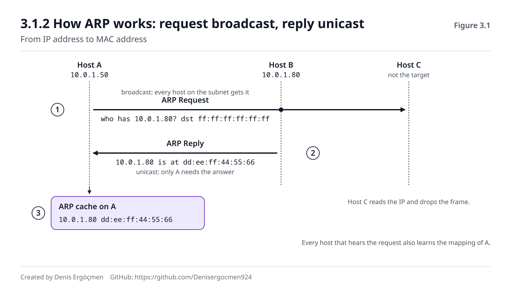

# Faz 3 — Yerel Ağ (L2): Komşuya Teslimat

> **Navigasyon:** [◀ Ara Sınav 1](Ara_Sinav_1.md) · **Faz 3** · [Faz 4 — Yönlendirme (L3) ▶](Faz_4_Yonlendirme_L3.md)

---

## Nereden geliyoruz

Faz 2'nin sonunda makineyi tam bir karar anında bıraktık: hedefin **kendi ağında** olduğuna karar verdi,
doğrudan teslim edecek. Ama elinde sadece hedefin **IP'si** var — L2 frame'ini oluşturmak için gereken
**MAC** yok (Faz 1.1).

Bu faz o boşluğu doldurmakla başlıyor. Üç şeyi yanında getirdin:

- **MAC, L2'nin adresidir ve sadece yerel ağda anlamlıdır** (1.1.2). Bu fazda "yerel ağ"ın fiziksel olarak
  ne demek olduğunu göreceksin.
- **`ff:ff:ff:ff:ff:ff` = broadcast** (1.1.1). Faz 3'ün ilk mekanizması tam olarak bunu kullanıyor.
- **Prefix, "aynı ağ" sınırını çizer** (2.1.2). Faz 3, o mantıksal sınırın donanımdaki karşılığını —
  **yayın alanını** — tanıtıyor.

## Bu fazın sorusu

> *"Makinem hedefin IP'sini biliyor ama MAC'ini bilmiyor. Bilmediği bir adresi, kime soracağını da
> bilmiyorken nasıl öğrenir? Ve o frame kabloya çıktığında, switch onu doğru porta nasıl gönderir?"*

Bu fazda ağın **fiziksel gerçekliğine** iniyorsun. Faz 1 ve 2 adreslerle ve matematikle ilgiliydi; burada
kablolar, switch'ler ve yayın alanları var.

Ve öğreneceğin şeyler doğrudan sahada işe yarar: bir ARP tablosunun neden "kirlendiğini", bir switch'in
neden bazen tüm portlara yayın yaptığını, VLAN'ın neden tek bir kabloyu birden fazla ağa bölebildiğini.
Bulutta bu katman büyük ölçüde senden **gizlenir** — ama gizlenmiş olması yok olduğu anlamına gelmez, ve
gizlenmiş bir katmanın arızasını ancak nasıl çalıştığını bilirsen teşhis edebilirsin.

---

## Bu fazın sonunda

- ARP'ın ne yaptığını, isteğin neden **broadcast**, cevabın neden **unicast** olduğunu adım adım
  anlatabileceksin
- ARP önbelleğini (`ip neigh`) okuyabilecek; `REACHABLE`/`STALE`/`FAILED` durumlarının ne anlama geldiğini
  bileceksin
- Bir switch'in MAC adres tablosunu **nasıl öğrendiğini** (source learning) ve bilmediği bir hedefte ne
  yaptığını (flooding) açıklayabileceksin
- **Broadcast alanı** ile **collision alanı** arasındaki farkı anlatabilecek; hub ile switch'in farkını
  bu iki kavramla açıklayabileceksin
- Router'ın broadcast'i neden geçirmediğini ve bunun subnet tasarımıyla ilişkisini kurabileceksin
- VLAN'ın ne olduğunu, tek bir fiziksel switch'i neden mantıksal ağlara böldüğünü ve trunk port kavramını
  anlatabileceksin
- ARP arızalarının (IP çakışması, eski/yanlış ARP kaydı, ARP spoofing) imzalarını tanıyabileceksin
- **Cloud:** Bulutta L2'nin neden görünmediğini, VPC'de broadcast'in neden desteklenmediğini ve "VLAN yerine
  subnet + security group" modelinin ne anlama geldiğini açıklayabileceksin

---

## Faz haritası

| Bölüm | Konu | Derinlik | Neden burada |
|---|---|---|---|
| 3.1 | ARP — IP'den MAC'e | `[mekanizma]` | **Fazın kalbi** — Faz 2'nin bıraktığı boşluk |
| 3.2 | Switch ve MAC adres tablosu | `[mekanizma]` | Frame'in doğru porta gitmesi |
| 3.3 | Broadcast alanı vs collision alanı | `[kavram]` | Subnet bölmenin fiziksel gerekçesi |
| 3.4 | VLAN | `[kavram]` | Tek donanım, birden çok mantıksal ağ |
| 3.5 | Bu faz bozulunca | — | L2 arızalarının imzaları |

> **Bu fazda nasıl çalışmalı:** Komutların çoğu 🟢 (`ip neigh`, `ip link`, `bridge fdb`) ama bir tanesi
> 🟡: ARP önbelleğini temizlemek (`ip neigh flush`). Bu geçicidir — tablo kendiliğinden yeniden dolar —
> ama yine de bunu üretim makinesinde değil, kendi test makinende yap. En öğretici deney: `ip neigh` ile
> tabloyu gör, bir komşuya ping at, tabloya tekrar bak — yeni satırın belirdiğini **kendi gözünle** gör.
> Bu faz, teoriyi terminalde en kolay doğrulayabileceğin fazdır; okumakla yetinme.

---
---

# 3.1 ARP — IP'den MAC'e Köprü

## 3.1.1 Problem: elimde IP var, MAC lazım `[kavram]`

Durumu net koyalım. Makinen `10.0.1.50`, hedef `10.0.1.80`. Faz 2'nin hesabıyla ikisi aynı ağda (`/24`),
yani doğrudan teslimat yapılacak.

Frame'i oluşturmak için şunlar gerekiyor:

```
[ Hedef MAC: ??? | Kaynak MAC: benimki | Hedef IP: 10.0.1.80 | Kaynak IP: 10.0.1.50 | veri ]
   └─ L2 header ─────────────────────┘ └─ L3 header ──────────────────────────────┘
```

L3 header'ı doldurabiliyorsun. L2 header'ındaki **hedef MAC** ise boş — ve o alan boş kalırsa frame
gönderilemez.

Bu boşluğu dolduran protokolün adı **ARP**'dır: Address Resolution Protocol (*arp* diye okunur). Tek bir iş
yapar: **"Şu IP kimde? MAC'ini söyle."**

## 3.1.2 ARP nasıl çalışır: istek broadcast, cevap unicast `[mekanizma]`

Dört adım:

**1. ARP Request (broadcast).** Makinen bir frame oluşturur ve hedef MAC alanına
**`ff:ff:ff:ff:ff:ff`** yazar — yani "bu ağdaki herkese". İçeriği şudur:

> *"10.0.1.80 kimde? Bende 10.0.1.50 var, MAC'im `aa:bb:cc:11:22:33`. Cevabı bana yolla."*

Broadcast olması **zorunludur**: makinen hedefin MAC'ini bilmiyor, dolayısıyla soruyu kime yollayacağını da
bilmiyor. Tek çaresi herkese sormaktır.

**2. Herkes duyar, biri cevaplar.** Ağdaki tüm cihazlar bu frame'i alır ve içindeki IP'ye bakar.
"Bu ben değilim" diyenler paketi **atar**. `10.0.1.80` adresine sahip olan cihaz ise cevap hazırlar.

**3. ARP Reply (unicast).** Hedef cihaz, cevabı **doğrudan** soru sorana yollar — broadcast'e gerek yok,
çünkü sorunun içinde sorucunun hem IP'si hem MAC'i vardı:

> *"10.0.1.80 bende. MAC'im `dd:ee:ff:44:55:66`."*

**4. Önbelleğe alınır.** Makinen bu eşleşmeyi **ARP tablosuna** (ARP cache) yazar ve bir süre saklar. Bir
sonraki pakette tekrar sormaz — doğrudan tablodan okur. Süre dolunca kayıt eskir ve tazelenir.

Ve kritik bir yan etki: **ARP Request'i duyan herkes, sorucunun IP↔MAC eşleşmesini öğrenmiş olur.** Çünkü
istek, sorucunun kendi bilgilerini de içerir. Bu yüzden ağda ARP trafiği, tabloların kendiliğinden
dolmasını sağlar.



Şekilde soldaki A makinesi sorucu, sağdaki B hedeftir; ortadaki switch ve diğer iki cihaz ağın geri
kalanını temsil eder. Kesikli oklar broadcast'in **herkese** ulaştığını, düz ok ise cevabın **tek** hedefe
gittiğini gösterir. Cevap almayan cihazların paketi sessizce attığına dikkat et — bu, broadcast'in maliyetini
anlatır: ağdaki herkes her ARP isteğini işlemek zorundadır.

> **🔧 Makinende gör** 🟢 — ARP tablosunu oku ve dolduğunu izle
>
> ```
> $ ip neigh
> 172.31.16.1 dev ens5 lladdr 06:8f:3c:2a:11:04 REACHABLE
> 172.31.20.9 dev ens5 lladdr 06:12:ab:55:9e:7d STALE
>
> $ ping -c1 172.31.20.30 > /dev/null; ip neigh | grep 172.31.20.30
> 172.31.20.30 dev ens5 lladdr 06:aa:7e:31:c0:15 REACHABLE
> ```
>
> Her satır bir **IP ↔ MAC** eşleşmesidir. Durumları tanı: **REACHABLE** = yakın zamanda doğrulandı, güvenli;
> **STALE** = kayıt var ama eskidi, bir sonraki kullanımda doğrulanacak; **DELAY/PROBE** = doğrulama
> sürüyor; **FAILED** = ARP isteğine cevap gelmedi (hedef yok, kapalı, veya farklı bir ağda — 3.5).
> İkinci komut deneyin kendisidir: ping'den **önce** o satır yoktu, sonra belirdi. İşte ARP'ı çalışırken
> gördün.

> **⚠️ Yaygın yanılgı: "ARP, uzaktaki sunucunun MAC'ini bulmak için kullanılır."**
>
> Hayır — ARP **sadece yerel ağda** çalışır. Broadcast, router'ı geçmez (3.3.2), dolayısıyla uzaktaki bir
> cihaza ARP isteği **hiç ulaşmaz**. Uzak bir hedef için makinen ARP'ı hedefin IP'si için değil,
> **varsayılan geçidin** IP'si için yapar (Faz 1'in Düşün 1.1 cevabı). Yani `93.184.216.34`'e paket
> yollarken ARP tablonda o adres **yoktur**; orada olan `172.31.16.1` (gateway) vardır. Bu, `ip neigh`
> çıktısını okurken hemen fark edeceğin bir şeydir: tablo, sadece **komşularını** içerir.

> **❓ Akla gelen soru: "Herkes broadcast'e cevap verse ne olurdu?"**
>
> Kaos olurdu — ve aslında bu, **ARP spoofing** saldırısının tam olarak yaptığı şeydir. ARP'ın hiçbir
> doğrulama mekanizması **yoktur**: bir cihaz "10.0.1.1 bende" dediğinde, kimse bunu doğrulamaz. Kötü
> niyetli bir cihaz, gateway'in IP'si için sahte ARP cevapları yayarak tüm ağın trafiğini kendi üzerine
> çekebilir (man-in-the-middle). Savunmalar switch seviyesindedir (dynamic ARP inspection, port security)
> ve bu kitabın kapsamı dışındadır. Ama neden bulutta L2'nin tamamen soyutlandığını anlamak için önemli:
> AWS'te bir instance başka bir instance'ın IP'si adına ARP cevabı **veremez** — hypervisor buna izin
> vermez. Bulutun L2'yi gizlemesi bir kolaylık değil, bir **güvenlik kararıdır**.

> **🤔 Düşün 3.1** — Makinen `10.0.1.50/24`. Sırasıyla iki komut çalıştırıyorsun: `ping 10.0.1.80` ve
> `ping 8.8.8.8`. (a) Her iki durumda da ARP yapılır mı? (b) Yapılıyorsa **hangi IP için**? (c) Sonrasında
> `ip neigh` çıktısında hangi yeni satırları görmeyi beklersin?
>
> *(Cevap: fazın sonunda)*

---
---

# 3.2 Switch ve MAC Adres Tablosu

## 3.2.1 Switch ne yapar `[kavram]`

Frame hazır: hedef MAC dolduruldu, kablodan çıktı. Şimdi bir **switch**'e geldi. Switch'in tek işi var:
bu frame'i **doğru porta** göndermek.

Switch bunu bir tablo tutarak yapar: **MAC adres tablosu** (veya CAM tablosu / forwarding table). Tablo
basittir:

| MAC adresi | Port |
|---|---|
| `aa:bb:cc:11:22:33` | 1 |
| `dd:ee:ff:44:55:66` | 3 |
| `11:22:33:aa:bb:cc` | 7 |

Frame geldiğinde switch hedef MAC'e bakar, tabloda arar, ve bulduğu porta yollar. **Diğer portlara
göndermez** — bu, switch'i hub'dan ayıran temel şeydir (3.3.1).

## 3.2.2 Tabloyu nasıl öğrenir: source learning `[mekanizma]`

Switch bu tabloyu kimseden almaz, **kendi öğrenir**. Mekanizma zarif:

**Her gelen frame'in KAYNAK MAC'ine bakar ve "bu MAC, bu porttan geldi" diye not eder.**

Yani switch, hedefleri değil **kaynakları** öğrenir. 1 numaralı porttan kaynak MAC'i `aa:bb:...` olan bir
frame geldiyse, switch artık `aa:bb:...` adresine gitmesi gereken frame'leri 1 numaralı porta yollayacağını
bilir.

Peki hedef MAC tabloda **yoksa** ne olur? Switch tahmin etmez — **tüm portlara gönderir** (geldiği port
hariç). Buna **flooding** (taşırma) denir. Hedef cihaz cevap verdiğinde, switch onun kaynak MAC'ini de
öğrenir ve bir daha flood etmez.

Bu yüzden bir ağın ilk anları "gürültülüdür": tablolar boştur, her şey flood edilir. Birkaç saniye içinde
tablolar dolar ve trafik hedefli hâle gelir.

Kayıtlar **kalıcı değildir**: her kaydın bir yaşlanma süresi (aging time, tipik olarak 5 dakika) vardır.
Bir cihaz uzun süre konuşmazsa kaydı silinir. Bu, cihaz taşındığında tablonun kendini düzeltmesini sağlar.

> **🔧 Makinende gör** 🟢 — Linux köprüsünde MAC tablosu
>
> ```
> $ bridge fdb show
> 33:33:00:00:00:01 dev ens5 self permanent
> 06:8f:3c:2a:11:04 dev br0 master br0
> 06:12:ab:55:9e:7d dev veth2 master br0
> ```
>
> Linux'ta bir köprü (bridge) oluşturursan, çekirdek tam bir switch gibi davranır ve **aynı** MAC tablosunu
> tutar — `bridge fdb show` (forwarding database) onu gösterir. `dev` sütunu, o MAC'in hangi arayüzden
> öğrenildiğidir; fiziksel bir switch'teki "port" sütununun karşılığı. `permanent` işaretli kayıtlar elle
> eklenmiş, kalanlar **öğrenilmiştir**. Docker veya bir sanal makine kullanıyorsan bu tabloda birden fazla
> kayıt göreceksin — konteynerlerin sanal arayüzleri bir köprüye bağlıdır.

> **🤔 Düşün 3.2** — Bir switch'e A (port 1) ve B (port 3) bağlı, tablosu tamamen boş. A, B'ye bir frame
> yolluyor. (a) Switch bu frame'le ne öğrenir? (b) Frame'i hangi porta/portlara gönderir? (c) B cevap
> verdiğinde tablo nasıl değişir, ve bundan sonraki frame'ler flood edilir mi?
>
> *(Cevap: fazın sonunda)*

---
---

# 3.3 Broadcast Alanı ve Collision Alanı

## 3.3.1 İki farklı "alan" `[kavram]`

Bu iki terim sık karıştırılır ama **tamamen farklı** şeyleri ifade ederler.

**Collision alanı (çarpışma alanı):** Aynı anda iki cihazın veri göndermesi hâlinde **sinyallerin
çarpışacağı** fiziksel bölge. Eski **hub**'larda tüm portlar tek bir collision alanındaydı — bir cihaz
konuşurken diğerleri beklemek zorundaydı. **Switch** bunu çözdü: her port **ayrı bir collision alanıdır**.
Modern anahtarlamalı ağlarda çarpışma pratikte yoktur.

**Broadcast alanı (yayın alanı):** Bir broadcast frame'inin (`ff:ff:ff:ff:ff:ff`) ulaşabildiği tüm cihazların
kümesi. **Switch broadcast'i durdurmaz** — tüm portlarına yayar. Yani bir switch'e bağlı her şey **tek bir
broadcast alanındadır**.

Özet, ezberlemeye değer:

| Cihaz | Collision alanı | Broadcast alanı |
|---|---|---|
| **Hub** | Hepsi tek (kötü) | Hepsi tek |
| **Switch** | Her port ayrı (iyi) | Hepsi tek |
| **Router** | Her port ayrı | **Her port ayrı** |

Son satır bu fazın en önemli cümlesini içeriyor: **broadcast alanını bölen tek cihaz router'dır.**

## 3.3.2 Router broadcast'i neden geçirmez `[mekanizma]`

Router, L3 cihazıdır: paketi açar, **IP header'ına** bakar ve yönlendirir. Bir broadcast frame'inin L2 hedef
adresi `ff:ff:ff:ff:ff:ff`'tir ve bu adres "bu segmentte herkese" anlamına gelir — başka bir segmente
iletilmesi **anlamsızdır**.

Router bu yüzden broadcast'i **kasten** durdurur. Ve bunun iki büyük sonucu var:

**1. ARP, router'ı geçemez.** Bu yüzden uzak bir hedefin MAC'ini asla öğrenemezsin (3.1.2 yanılgı kutusu) —
ve bu yüzden gateway kavramı vardır (Faz 4.1).

**2. Broadcast gürültüsü sınırlanır.** Bir ağda ne kadar çok cihaz varsa o kadar çok ARP, DHCP ve diğer
broadcast trafiği olur. Ve her broadcast, ağdaki **her** cihazın CPU'sunu meşgul eder — çünkü her cihaz
frame'i alıp "bu ben miyim?" diye bakmak zorundadır. Binlerce cihazlı tek bir broadcast alanı, "broadcast
fırtınası" ile ağı kullanılamaz hâle getirebilir.

İşte Faz 2.4.1'de söylediğimiz "yayın alanını küçültmek" gerekçesinin fiziksel karşılığı budur: **her subnet
ayrı bir broadcast alanıdır.** Ağı bölmek, gürültüyü bölmektir.

> **💡 Cloud bağlantısı — bulutta L2 yoktur (sana göre):** AWS VPC'de broadcast ve multicast **desteklenmez**.
> Bir instance'tan broadcast yollayamazsın; ARP tablonda gördüğün gateway MAC'i bile hypervisor tarafından
> sentetik olarak üretilir. Bunun sebebi ölçektir: on binlerce müşterinin instance'ları aynı fiziksel
> donanımı paylaşırken gerçek bir broadcast alanı hem güvenlik hem performans felaketi olurdu. AWS bunun
> yerine **her şeyi L3'te çözer**: instance'lar arası trafik, arada fiziksel bir switch varmış gibi değil,
> yazılım tanımlı bir yönlendirme katmanı üzerinden akar. Pratik sonuçları: (1) L2'ye dayanan eski protokoller
> (bazı cluster heartbeat'leri, L2 keşif protokolleri) bulutta **çalışmaz**; (2) `tcpdump` ile başka bir
> instance'ın trafiğini göremezsin — promiscuous mode anlamsızdır; (3) ARP spoofing mümkün değildir. L2
> kaybolmadı, **senden gizlendi** — ve onun yerini subnet + route table + security group üçlüsü aldı.

> **🤔 Düşün 3.3** — Bir ofiste 500 cihaz tek bir `/23` ağda (510 adres) ve tek bir switch yığınına bağlı.
> (a) Kaç broadcast alanı var? (b) Bir cihaz ARP isteği yaptığında kaç cihaz bu frame'i işlemek zorunda
> kalır? (c) Ağı `/25`'lik dört parçaya bölersen ne değişir — ve bunun için hangi cihaza ihtiyacın olur?
>
> *(Cevap: fazın sonunda)*

---
---

# 3.4 VLAN — Tek Donanım, Birden Çok Ağ

## 3.4.1 Fikir: mantıksal bölme `[kavram]`

3.3'te "broadcast alanını bölen tek cihaz router'dır" dedik. Bu, fiziksel olarak şu anlama gelirdi: her ağ
için **ayrı bir switch** almak ve aralarına router koymak. Pahalı ve esnek değil.

**VLAN** (Virtual LAN) bu sorunu çözer: tek bir fiziksel switch'i, **birden fazla mantıksal switch** gibi
davranmaya zorlar.

Nasıl? Switch'in her portuna bir **VLAN numarası** atanır:

| Port | VLAN | Kullanım |
|---|---|---|
| 1–8 | 10 | Muhasebe |
| 9–16 | 20 | Mühendislik |
| 17–24 | 30 | Misafir Wi-Fi |

Kural katıdır: **farklı VLAN'lardaki portlar birbirini hiç görmez.** VLAN 10'daki bir cihazın broadcast'i,
VLAN 20'deki portlara **gitmez**. Switch, sanki üç ayrı switch'miş gibi davranır.

Ve sonuç: **her VLAN ayrı bir broadcast alanıdır**, yani ayrı bir subnet'e karşılık gelir. VLAN 10 =
`10.0.10.0/24`, VLAN 20 = `10.0.20.0/24` gibi. VLAN'lar arası trafik yine bir **router**'dan (veya L3
switch'ten) geçmek zorundadır — tam da 3.3.2'deki kuralla.

## 3.4.2 Trunk port ve 802.1Q etiketi `[kavram]`

Bir sorun var: iki switch'i birbirine bağlarken, her VLAN için ayrı kablo mu çekeceğiz?

Hayır. **Trunk port** kullanılır: tek bir kablo üzerinden **birden fazla VLAN'ın** trafiği taşınır. Bunu
mümkün kılan şey, frame'lere eklenen küçük bir **etikettir** (802.1Q tag, 4 bayt): frame'in hangi VLAN'a ait
olduğunu söyler.

- **Access port:** tek bir VLAN'a aittir, etiket **yoktur** (cihazlar VLAN'dan habersizdir).
- **Trunk port:** birden çok VLAN taşır, frame'ler **etiketlidir**.

Bu detay `[atla]` düzeyindedir — kurumsal ağ yönetmiyorsan derine inmene gerek yok. Ama kavramı bilmek,
bulutta karşılığını görmek için gerekli: bulut sağlayıcıları aynı fikrin çok daha büyük ölçekli bir
versiyonunu (VXLAN) kullanır — fiziksel bir ağın üstünde binlerce izole sanal ağ çalıştırmak için (Faz 7.4).

> **💡 Cloud bağlantısı — VLAN'ın bulut karşılığı: subnet + security group:** Bulutta VLAN yapılandırmazsın —
> çünkü L2 sana ait değil (3.3.2). Ama VLAN'ın çözdüğü problem hâlâ var: **farklı iş yüklerini birbirinden
> izole etmek.** Bulut bunu iki araçla çözer: (1) **Subnet** — ağı adres düzeyinde böler ve route table ile
> hangi subnet'in nereye çıkabileceğini belirler (public subnet internete çıkar, private subnet çıkamaz);
> (2) **Security group** — instance düzeyinde, hangi kaynaktan hangi porta trafik gelebileceğini belirler
> (Faz 9.4). VLAN'da izolasyon **porta** bağlıydı; bulutta **kimliğe** bağlıdır — bir security group'u
> başka bir security group'a kaynak olarak gösterebilirsin ("web SG'sinden gelen trafiğe 5432'yi aç"), ki
> bu VLAN'la yapılamayacak kadar esnektir. Zihinsel eşleme: *VLAN ≈ subnet + SG*, ama bulut modeli daha
> ince taneli.

> **🤔 Düşün 3.4** — Bir switch'te VLAN 10 (`10.0.10.0/24`) ve VLAN 20 (`10.0.20.0/24`) var. VLAN 10'daki
> bir makine, VLAN 20'deki bir makineye ping atıyor. (a) ARP isteği hedefe ulaşır mı? (b) Ping çalışır mı,
> ve çalışması için ne gerekir? (c) Bu durumu, aynı fiziksel switch'e bağlı olmalarına rağmen neden
> "farklı ağdalar" saydığımızla açıkla.
>
> *(Cevap: fazın sonunda)*

---
---

# 3.5 Bu Faz Bozulunca — L2 Arızalarının İmzaları

L2 arızaları genelde **yerel ve keskin** olur: ya komşuna ulaşırsın ya ulaşamazsın, arası yoktur. Ve
teşhisin en hızlı aracı `ip neigh`'dir — ARP tablosu, L2'nin sağlık raporudur.

| Belirti | Muhtemel sebep | Doğrula | İlgili bölüm |
|---|---|---|---|
| `ip neigh`'de hedef `FAILED` | Hedef kapalı, yok, veya farklı ağda | `ip neigh`, hedefin prefix'i | 3.1.2 |
| Aynı ağdaki komşuya hiç ulaşılmıyor | ARP cevabı gelmiyor / L2 bağlantı yok | `ip link` (LOWER_UP), `ip neigh` | 3.1.2 |
| Bağlantı kesik kesik, iki cihaz kopuyor | **IP çakışması** — iki cihazda aynı IP | `ip neigh` (MAC değişiyor mu), arp-scan | 3.1.2 |
| Doğru IP, yanlış makineye gidiyor | Eski/bayat ARP kaydı | `ip neigh` → `ip neigh flush` 🟡 | 3.1.2 |
| Tüm trafik yavaş, switch ışıkları sürekli yanıyor | Broadcast fırtınası / döngü | Broadcast alanı büyüklüğü, STP | 3.3.2 |
| Bir cihaz ağı görüyor, diğeri görmüyor | Portlar farklı VLAN'da | Switch port VLAN atamaları | 3.4.1 |
| Aynı switch'te ama ping çalışmıyor | Farklı VLAN veya farklı subnet | VLAN + `ip addr` prefix'leri | 3.4.1 (2.1.2) |
| Trafik başka bir cihaza yönleniyor | ARP spoofing (gateway taklidi) | Gateway MAC'i beklenen mi | 3.1.2 |
| Bulutta broadcast tabanlı uygulama çalışmıyor | VPC broadcast/multicast desteklemez | Uygulamanın L2 gereksinimi | 3.3.2 |
| MAC tablosu dolmuş, her şey flood ediliyor | MAC flooding saldırısı / çok fazla cihaz | Switch MAC tablosu doluluk | 3.2.2 |

> **Bu tablodan çıkan ders:** L2 arızalarında ilk bakacağın yer **`ip neigh`**'dir ve baktığında iki soru
> sor: *kayıt var mı* ve *kayıt doğru mu*. **Kayıt yoksa veya `FAILED` ise** hedef ya kapalıdır ya da
> aslında senin ağında değildir — ikinci ihtimali hemen prefix'le kontrol et (Faz 2), çünkü yanlış mask'in
> en sık belirtisi budur: makine uzaktakini komşu sanıp ARP yapar, kimse cevap vermez, `FAILED`. **Kayıt
> varsa ama MAC sürekli değişiyorsa**, şüphen iki şeye yönelmeli: IP çakışması (iki cihaz aynı adresi
> savunuyor) veya ARP spoofing (biri başkasının adresini taklit ediyor). Son bir refleks: L2'yi kontrol
> etmeden önce **linkin var olduğundan** emin ol — `ip link`'te `LOWER_UP` yoksa kablo/port seviyesinde bir
> sorun vardır ve ARP'ı tartışmanın anlamı yoktur. Daima aşağıdan yukarı: **link → ARP → IP → routing.**

---
---

# Faz 3 — Düşün sorularının cevapları

## Cevap 3.1 — ARP daima bir sonraki hop için yapılır

(a) **Evet, her iki durumda da ARP yapılır** — çünkü her iki durumda da bir frame oluşturulacak ve o
frame'in hedef MAC alanı doldurulmalı.

(b) Ama **farklı IP'ler için**:
- `ping 10.0.1.80`: hedef aynı ağda (`/24` ile network `10.0.1.0`, her ikisi de içinde). ARP **`10.0.1.80`**
  için yapılır — yani hedefin kendisi için.
- `ping 8.8.8.8`: hedef farklı ağda. Makinen paketi **varsayılan geçide** yollayacak (Faz 4.1), dolayısıyla
  ARP **gateway'in IP'si** için yapılır (örneğin `10.0.1.1`). `8.8.8.8` için **hiç ARP yapılmaz** —
  broadcast router'ı geçemez (3.3.2).

(c) `ip neigh` çıktısında:
- İlk ping'den sonra: `10.0.1.80 dev ... lladdr <B'nin MAC'i> REACHABLE`
- İkinci ping'den sonra: `10.0.1.1 dev ... lladdr <gateway MAC'i> REACHABLE`
- **`8.8.8.8` için hiçbir satır yok** — ve olmaması doğru davranıştır.

Bu, ARP tablonun neden sadece komşularını içerdiğinin açıklamasıdır: **ARP daima bir sonraki hop için
yapılır, nihai hedef için değil.**
**İlgili bölüm:** 3.1.2 · **Devamı:** Faz 4.1 (default gateway), Faz 4.2 (routing tablosu).

## Cevap 3.2 — Switch kaynakları öğrenir, hedefleri flood eder

(a) Switch, frame'in **kaynak MAC**'ine bakar ve "A'nın MAC'i port 1'de" diye tabloya yazar (3.2.2). Hedef
MAC hakkında hiçbir şey öğrenmez — öğrenme daima **kaynaktan** olur.

(b) Hedef MAC (B'nin MAC'i) tabloda **yok**. Switch tahmin etmez: frame'i **geldiği port hariç tüm portlara**
gönderir — **flooding** (3.2.2). Yani port 3'e de gider (ve varsa diğer tüm portlara).

(c) B cevap verdiğinde, cevap frame'inin kaynak MAC'i B'nin MAC'idir ve port 3'ten gelir. Switch bunu
öğrenir: "B'nin MAC'i port 3'te". Artık tabloda **iki kayıt** vardır. Bundan sonraki A→B frame'leri
**flood edilmez**, doğrudan port 3'e gönderilir.

Buradaki güzellik şu: switch'i kimse yapılandırmadı, hiçbir protokol çalışmadı — sadece geçen trafiği
izleyerek topolojiyi öğrendi. Ve aging time dolduğunda kayıtlar silinip yeniden öğrenilir, böylece cihaz
taşındığında tablo kendini düzeltir.
**İlgili bölüm:** 3.2.1-3.2.2 · **Devamı:** 3.3.1 (collision alanı), Faz 10.2 (L2 teşhisi).

## Cevap 3.3 — Tek switch = tek broadcast alanı

(a) **Bir tane.** Switch broadcast'i durdurmaz (3.3.1); kaç switch birbirine bağlı olursa olsun, arada
router (veya VLAN) yoksa hepsi **tek bir broadcast alanıdır**.

(b) **500 cihazın hepsi.** Her cihaz frame'i alır, içindeki IP'ye bakar, "bu ben değilim" deyip atar. Yani
tek bir ARP isteği, 499 cihazın CPU'sunda gereksiz iş yaratır. 500 cihazlı bir ağda saniyede onlarca ARP
isteği olabileceğini düşünürsen, bu ciddi bir yüktür — ve ağ büyüdükçe **kareli** olarak kötüleşir.

(c) `/25`'lik dört parça = **dört ayrı broadcast alanı**, her birinde ~126 cihaz. Bir ARP isteği artık 500
değil ~126 cihazı meşgul eder — gürültü dörtte bire düşer. Ama bunun için bir **router** (veya L3 switch)
gerekir, çünkü broadcast alanını bölen tek cihaz odur (3.3.1). Ayrıca dört subnet arasındaki trafik artık
router'dan geçeceği için **denetlenebilir** hâle gelir — Faz 2.4.1'deki "güvenlik sınırı" gerekçesi de
böylece kazanılır.
**İlgili bölüm:** 3.3.1-3.3.2 · **Devamı:** Faz 2.4.1 (neden bölüyoruz), 3.4.1 (VLAN ile bölme).

## Cevap 3.4 — Aynı switch, farklı VLAN = farklı ağ

(a) **Hayır.** ARP isteği bir broadcast'tir ve VLAN 10'un broadcast'i VLAN 20'deki portlara **gitmez**
(3.4.1). Switch, iki VLAN'ı sanki iki ayrı switch'miş gibi tutar.

(b) Ping **çalışabilir** — ama sadece VLAN'lar arasında yönlendirme yapan bir **router** (veya L3 switch)
varsa. O durumda: makine hedefi farklı ağda görür (farklı subnet), paketi kendi gateway'ine yollar, router
paketi VLAN 20'ye yönlendirir, orada yeni bir ARP ile hedefin MAC'i bulunur ve teslim edilir. Router yoksa
ping **başarısız** olur ve `ip neigh`'de gateway `FAILED` görünür veya hiç kayıt oluşmaz.

(c) Çünkü "aynı ağ" **fiziksel bir yakınlık değil, mantıksal bir tanımdır** — ve iki ayrı mekanizma bunu
birlikte belirler: (i) L3'te prefix (Faz 2.1.2) ikisini farklı subnet'lere koyar, (ii) L2'de VLAN ikisini
farklı broadcast alanlarına koyar. İkisi de "farklı ağ" diyor. Aynı kabloda, aynı kutuda olmaları hiçbir
şey değiştirmez: ağ, **kablonun değil yapılandırmanın** belirlediği bir şeydir. Bulutta bu fikir en uç
hâline ulaşır — fiziksel yakınlık tamamen anlamsızdır (3.3.2 cloud kutusu).
**İlgili bölüm:** 3.4.1 · **Devamı:** Faz 4.1 (VLAN'lar arası routing), Faz 11.2 (subnet izolasyonu).

---
---

# Faz 3 — Sık sorulan sorular

**S1 — ARP tablosu ne kadar süre saklanır?** Linux'ta tipik olarak birkaç dakika, ama sabit değildir: kayıt
kullanıldıkça `REACHABLE` kalır, kullanılmazsa `STALE`'e düşer ve bir sonraki kullanımda doğrulanır. Süreler
`/proc/sys/net/ipv4/neigh/default/` altındaki parametrelerle ayarlanır. Pratikte bu süreyle uğraşman
gerekmez; bir kayıt yanlışsa `ip neigh flush` 🟡 ile temizlersin (geri alma gerekmez — tablo kendiliğinden
yeniden dolar).

**S2 — ARP ile ICMP (ping) arasındaki fark nedir?** Farklı katmanlarda, farklı işler. **ARP** L2'dedir ve
IP↔MAC eşleşmesini bulur — bir IP paketi bile taşımaz. **ICMP** L3'tedir ve IP paketleri içinde taşınır;
ulaşılabilirlik ve hata bildirimi için kullanılır (Faz 4.5). Sıralama önemli: bir ping atarken **önce ARP**
olur (MAC bulunur), **sonra ICMP** paketi gönderilir. ARP başarısızsa ping hiç gönderilemez.

**S3 — Switch ile router arasındaki temel fark nedir?** Switch **L2** cihazıdır: MAC adreslerine bakar,
broadcast'i geçirir, aynı ağ içinde çalışır. Router **L3** cihazıdır: IP adreslerine bakar, broadcast'i
durdurur, **farklı ağları** birbirine bağlar. Tek cümleyle: switch bir ağın içini, router ağlar arasını
yönetir (3.3.1).

**S4 — "L3 switch" nedir?** Hem switch hem router gibi davranabilen bir cihaz: portları switch gibi çalışır
ama VLAN'lar arasında donanım hızında yönlendirme de yapabilir. Kurumsal ağlarda yaygındır çünkü ayrı bir
router'dan hem hızlı hem ucuzdur. Kavramsal olarak yeni bir şey değildir — iki işlevin tek kutuda
birleşmesidir.

**S5 — Bulutta ARP tablosunda neden hep aynı MAC'i görüyorum?** Çünkü gördüğün MAC'lerin çoğu **gerçek
değildir**: hypervisor, VPC router'ı için sentetik bir MAC üretir ve instance'ın ARP isteklerine kendisi
cevap verir. Gerçek bir L2 segmenti yoktur (3.3.2). Bu yüzden bulutta `ip neigh` çıktısı genelde çok kısadır
— tipik olarak sadece gateway (`.1`) ve belki birkaç komşu instance.

**S6 — IP çakışmasını nasıl kesin olarak anlarım?** İmza: `ip neigh` çıktısında aynı IP için **MAC'in
değişip durması**, ve bağlantının kesik kesik çalışması. Sebebi şu: iki cihaz da o IP için ARP cevabı verir,
hangi cevap son gelirse tablo ona göre güncellenir, trafik iki cihaz arasında gidip gelir. Doğrulama için
`arp-scan -l` veya `arping <ip>` kullanılabilir (aynı IP'den iki farklı MAC cevap verirse çakışma kesindir).

**S7 — Bu fazı bulutta çalışıyorsam öğrenmem gerekir mi?** Evet — iki sebeple. (1) **Teşhis için:**
`ip neigh`'de `FAILED` görmek, sorunun L2/adresleme seviyesinde olduğunu anında söyler ve aramayı daraltır.
(2) **Model için:** bulutun subnet, route table ve security group modeli, tam olarak bu fazın kavramlarının
(broadcast alanı, izolasyon, komşuluk) yeniden paketlenmiş hâlidir. Neyin yerine ne geldiğini bilmezsen,
bulut soyutlamaları "sihir" gibi görünür — ve sihir teşhis edilemez.

---
---

# Faz 3 — Kendini sına

Cevaplarını bir kâğıda yaz, sonra cevap anahtarıyla karşılaştır. Hedef: 18 sorudan 14+.

## Bölüm A — Tanım ve mekanizma

1. ARP ne işe yarar? Girdisi ve çıktısı nedir?
2. ARP Request neden broadcast, ARP Reply neden unicast'tir?
3. `ip neigh` çıktısındaki `REACHABLE`, `STALE` ve `FAILED` durumları ne anlama gelir?
4. Bir switch MAC adres tablosunu nasıl öğrenir? Hangi alana bakar?
5. Hedef MAC tabloda yoksa switch ne yapar? Bu davranışın adı nedir?
6. Collision alanı ile broadcast alanı arasındaki fark nedir?
7. Hangi cihaz broadcast alanını böler, ve neden?
8. VLAN nedir? Access port ile trunk port farkı nedir?

## Bölüm B — Uygula ve teşhis et

9. `10.0.1.50/24` makinesinden `10.0.1.99`'a ping atıyorsun. ARP hangi IP için yapılır?
10. Aynı makineden `1.1.1.1`'e ping atıyorsun. ARP hangi IP için yapılır, ve `1.1.1.1` ARP tablosunda
    görünür mü?
11. `ip neigh` çıktısında hedefin durumu `FAILED`. İki muhtemel sebep yaz.
12. Bir kullanıcının bağlantısı kesik kesik ve `ip neigh`'de o IP'nin MAC'i sürekli değişiyor. Teşhisin ne?
13. Boş tablolu bir switch'e A (port 1) ve B (port 2) bağlı. A→B frame'i geldiğinde switch ne öğrenir ve
    frame nereye gider?
14. Bir VPC içinde çalışan uygulaman broadcast tabanlı keşif yapıyor ve hiçbir peer bulamıyor. Neden?

## Bölüm C — Muhakeme ve bağlantı

15. ARP'ın router'ı geçememesi, hangi kavramın (Faz 4'te göreceğin) var olma sebebidir? Açıkla.
16. Bir ağda 1000 cihaz tek broadcast alanında. İki somut sorun yaz ve çözümü bir cümleyle söyle.
17. İki makine aynı fiziksel switch'e bağlı ama birbirlerine ping atamıyorlar. Üç farklı sebep yaz (biri
    L2, biri L3, biri VLAN kaynaklı).
18. Bulutta L2'nin gizlenmiş olması hangi üç şeyi imkânsız kılar? Her biri için bir cümle.

---

## Cevap anahtarı

1. Bir **IP adresinden MAC adresini** bulmak. Girdi: hedefin IP'si. Çıktı: o IP'ye sahip cihazın MAC'i
   (3.1.1). — 2. **Request broadcast**, çünkü sorucu hedefin MAC'ini bilmiyor — kime soracağını bilmediği
   için herkese sorar. **Reply unicast**, çünkü isteğin içinde sorucunun hem IP'si hem MAC'i vardır; cevap
   doğrudan ona yollanabilir (3.1.2). — 3. **REACHABLE** = yakın zamanda doğrulanmış, güvenilir; **STALE** =
   kayıt var ama eskimiş, bir sonraki kullanımda doğrulanacak; **FAILED** = ARP isteğine cevap gelmedi
   (3.1.2). — 4. Gelen her frame'in **kaynak MAC** alanına bakar ve "bu MAC bu portta" diye not eder —
   **source learning** (3.2.2). — 5. Frame'i **geldiği port hariç tüm portlara** gönderir; adı **flooding**
   (3.2.2). — 6. **Collision alanı**: sinyallerin fiziksel olarak çarpışabileceği bölge; switch'te her port
   ayrıdır. **Broadcast alanı**: bir broadcast frame'inin ulaştığı tüm cihazlar; switch'te hepsi tektir
   (3.3.1). — 7. **Router** (veya L3 switch / VLAN ayrımı). Çünkü router L3 cihazıdır, L2 broadcast adresi
   (`ff:ff:...`) başka bir segmente iletilmez — ve bu kasten yapılır, gürültüyü sınırlamak için (3.3.2). —
   8. Tek bir fiziksel switch'i birden çok mantıksal switch gibi bölen yapılandırma; her VLAN ayrı bir
   broadcast alanıdır. **Access port** tek VLAN'a aittir, frame'ler etiketsizdir; **trunk port** birden çok
   VLAN taşır, frame'ler 802.1Q ile etiketlidir (3.4.1-3.4.2).

9. **`10.0.1.99`** için — hedef aynı ağda olduğu için ARP doğrudan hedefin kendisi için yapılır (3.1.2). —
   10. **Varsayılan geçidin IP'si** için (örn. `10.0.1.1`). `1.1.1.1` ARP tablosunda **görünmez**, çünkü
   ARP router'ı geçemez ve uzak hedefler için hiç yapılmaz (3.1.2). — 11. (i) Hedef cihaz kapalı/yok/ağa
   bağlı değil; (ii) hedef aslında **farklı bir ağda** ama yanlış mask yüzünden makine onu komşu sanıyor
   (3.5, Faz 2.6). — 12. **IP çakışması** — iki cihaz aynı IP'yi kullanıyor ve ikisi de ARP cevabı veriyor;
   tablo hangi cevap son geldiyse ona göre güncelleniyor (3.5, S6). — 13. Switch, A'nın MAC'inin port 1'de
   olduğunu öğrenir (kaynak MAC'ten). Hedef MAC tabloda olmadığı için frame **flood edilir** — port 1 hariç
   tüm portlara (3.2.2). — 14. Çünkü **VPC broadcast ve multicast desteklemez**; bulutta gerçek bir L2
   segmenti yoktur, her şey L3'te çözülür (3.3.2).

15. **Varsayılan geçit (default gateway)** kavramının. ARP router'ı geçemediği için uzak bir hedefin MAC'i
    asla öğrenilemez; dolayısıyla makinenin "uzak her şeyi buraya yolla" diyebileceği, **kendi ağındaki**
    bir adrese ihtiyacı vardır. O adres gateway'dir ve makinenin ARP yaptığı şey odur (3.1.2, 3.3.2). —
    16. (i) Her ARP/DHCP broadcast'i 1000 cihazın CPU'sunu meşgul eder — gereksiz yük; (ii) izolasyon
    yoktur, her cihaz her cihaza doğrudan ulaşabilir — güvenlik sınırı çizilemez. Çözüm: ağı **subnet'lere
    (veya VLAN'lara) böl**, aralarına router/L3 kontrolü koy (3.3.2, Faz 2.4.1). — 17. (i) **L2:** kablo/port
    arızası veya arayüz down (`ip link`'te `LOWER_UP` yok); (ii) **L3:** farklı subnet'tesiler veya
    mask'leri yanlış — makine karşıyı uzak sanıp gateway'e yolluyor (Faz 2.6); (iii) **VLAN:** portlar
    farklı VLAN'lara atanmış, switch onları iki ayrı switch gibi ayırıyor (3.4.1). — 18. (i) **Broadcast/
    multicast tabanlı protokoller çalışmaz** — VPC bunları taşımaz; (ii) **promiscuous mode ile komşu
    trafiği dinlenemez** — `tcpdump` sadece kendi instance'ının trafiğini görür; (iii) **ARP spoofing
    yapılamaz** — hypervisor bir instance'ın başkasının IP'si adına cevap vermesine izin vermez (3.3.2).

## Puanlama

| Doğru sayısı | Ne anlama geliyor |
|---|---|
| 16-18 | L2 sende oturdu. Faz 4'e (routing) geçebilirsin. |
| 13-15 | İyi. 3.1.2 ve 3.3.1'i bir kez daha oku; `ip neigh` deneyini tekrar yap. |
| 9-12 | ARP ile switch öğrenmesi karışmış olabilir. 3.1–3.2'yi terminalde doğrulayarak çalış. |
| 0-8 | Fazı yeniden gez. Hedef: "ARP hangi IP için yapılır" sorusuna her senaryoda cevap verebilmek. |

Kaçırdığın soru → dönmen gereken bölüm:

| Soru | Bölüm |
|---|---|
| 1, 2, 3, 9, 10, 11 | 3.1 ARP |
| 4, 5, 13 | 3.2 Switch ve MAC tablosu |
| 6, 7, 16 | 3.3 Broadcast/collision alanı |
| 8, 17 | 3.4 VLAN |
| 12 | 3.5 Arıza tablosu |
| 14, 15, 18 | 3.3.2 + cloud kutusu |

---
---

# Faz 3 — Kapanış ve Faz 4'e Köprü

## Bu fazdan ne taşıyorsun

Faz 3 sana ağın **yerel gerçekliğini** verdi. ARP'ın IP ile MAC arasındaki köprüyü nasıl kurduğunu — isteğin
neden broadcast, cevabın neden unicast olduğunu — öğrendin. Bir switch'in tablosunu kimseden almadan, sadece
geçen trafiğin **kaynak** adreslerine bakarak öğrendiğini ve bilmediğinde flood ettiğini gördün. Broadcast
alanı ile collision alanını ayırdın ve **broadcast alanını bölen tek cihazın router olduğunu** öğrendin —
Faz 2'de matematiksel olarak çizdiğin sınırın fiziksel karşılığı bu. VLAN'la aynı işin tek bir kutuda
mantıksal olarak nasıl yapıldığını gördün.

En kalıcı cümle şu: **ARP daima bir sonraki hop için yapılır, nihai hedef için değil.** Bu tek cümle, hem
`ip neigh` çıktısını okumanı sağlar hem de Faz 4'ün kapısını açar.

## Faz 4 bunun neresine bağlanıyor

Faz 3 boyunca hep aynı sınıra dayandık: **broadcast router'ı geçemez, ARP yerel kalır, uzak hedeflerin
MAC'i öğrenilemez.**

Peki o zaman uzak hedeflere paket nasıl gidiyor?

Cevap: makine, uzak her şeyi kendi ağındaki tek bir adrese — **varsayılan geçide** — yollar. Ve o geçit,
bir sonrakine, o da bir sonrakine... Her adımda yeni bir L2 teslimatı, ama hep aynı L3 hedefi.

Faz 4 bu zincirin tamamıdır: routing tablosunun nasıl okunduğu, **longest prefix match** kuralının hangi
satırı seçtiği, TTL'in sonsuz döngüleri nasıl kestiği, ICMP'nin hataları nasıl bildirdiği ve `traceroute`'un
yolu nasıl haritaladığı.

Faz 3 komşuya teslimatı öğretti; Faz 4 **dünyanın öbür ucuna** teslimatı öğretiyor.

> **🤔 Faz çıktısı — kendine sor:** Makinen uzak bir hedefe paket yolluyor ve bunu gateway'e veriyor.
> Gateway paketi alıyor — ama gateway de aynı sorunla karşı karşıya: hedef onun da yerel ağında değil.
> O ne yapıyor? Ve daha önemlisi: bir router, "bu paketi hangi yöne yollayacağımı" **nereden** biliyor —
> internetteki her ağı ezbere mi biliyor, yoksa başka bir mekanizma mı var? (İpucu: Faz 2.5'te
> aggregation'dan bahsetmiştik.)
>
> **🧪 Lab 3 fikri (çoğu 🟢, biri 🟡):** (1) `ip neigh` ile mevcut ARP tablonu kaydet — kaç satır var,
> hangi IP'ler? (2) Gateway'ine ping at ve tabloya tekrar bak; gateway'in satırının `REACHABLE` olduğunu
> gör. (3) Uzak bir adrese (`ping -c1 8.8.8.8`) ping at, sonra `ip neigh | grep 8.8.8.8` çalıştır —
> **hiçbir şey çıkmadığını** kendi gözünle doğrula. Bu, 3.1.2'nin en net kanıtıdır. (4) 🟡 `sudo ip neigh
> flush all` ile tabloyu temizle, `ip neigh` ile boşaldığını gör, sonra bir ping atıp yeniden dolduğunu
> izle. *(Geri alma gerekmez — tablo öğrenilmiş veridir, kendiliğinden yeniden dolar.)* (5) `ip link`
> çıktısında `LOWER_UP` bayrağını bul — bu, fiziksel linkin gerçekten var olduğunu söyler; L2 teşhisinde
> ilk bakılacak yer burasıdır. Bu beş adım, ARP'ı teoriden çıkarıp eline verir.

---

> **Navigasyon:** [◀ Ara Sınav 1](Ara_Sinav_1.md) · **Faz 3** · [Faz 4 — Yönlendirme (L3) ▶](Faz_4_Yonlendirme_L3.md)
