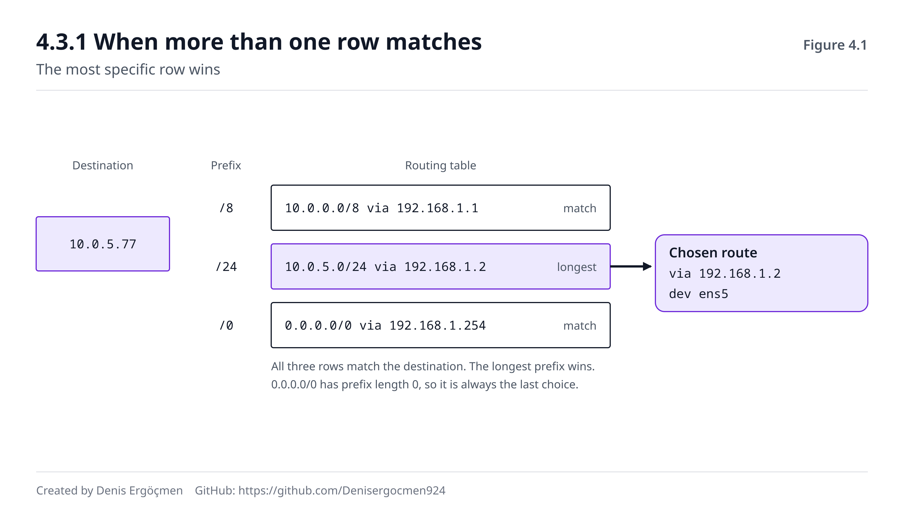

# Faz 4 — Ağlar Arası: Yönlendirme (L3)

> **Navigasyon:** [◀ Faz 3 — Yerel Ağ (L2)](Faz_3_Yerel_Ag_L2.md) · **Faz 4** · [Ara Sınav 2 ▶](Ara_Sinav_2.md)

---

## Nereden geliyoruz

Faz 3 boyunca aynı duvara çarptık: **broadcast router'ı geçemez, ARP yereldir, uzak hedefin MAC'i
öğrenilemez.** Ve fazın sonunda sana sorduk: gateway paketi aldığında ne yapıyor, ve bir router yolu
**nereden** biliyor?

Bu faz, o iki sorunun tamamıdır. Yanında getirdiklerin:

- **"Hedef benim ağımda mı?"** kararı (2.1.2). Faz 4, bu sorunun "hayır" cevabının ardından ne olduğunu
  anlatıyor.
- **ARP daima bir sonraki hop için yapılır** (3.1.2). Bu fazda o "bir sonraki hop"un nasıl seçildiğini
  göreceksin.
- **Prefix ne kadar uzunsa ağ o kadar spesifiktir** (2.5.2). Bu faz, o spesifikliği bir **karar kuralına**
  dönüştürüyor: longest prefix match.

## Bu fazın sorusu

> *"Paketim, aralarında hiçbir doğrudan bağlantı olmayan onlarca ağdan geçerek hedefe nasıl ulaşıyor — ve
> yol boyunca hiçbir cihaz tüm yolu bilmiyorken bu nasıl mümkün oluyor?"*

Cevabın özü şudur ve şimdiden söylüyoruz: **hiçbir router yolun tamamını bilmez.** Her router sadece
"bir sonraki adım nereye" sorusuna cevap verir. Yol, o kararların **zinciridir** — kimsenin tamamını
görmediği, ama her adımın doğru olduğu bir zincir.

Bu, mentör haritasının "cloud engineer'in en çok debug ettiği katman" dediği yerdir. Bulutta bir şey
çalışmadığında, vakaların büyük çoğunluğunda cevap üç şeyden biridir: **route table'da eksik satır**,
**yanlış next hop**, veya **asimetrik dönüş yolu**. Bu fazı bitirdiğinde üçünü de tanıyacaksın.

---

## Bu fazın sonunda

- Varsayılan geçidin ne olduğunu ve "yerel ağda olmayan her şey buraya" kuralının nasıl işlediğini
  anlatabileceksin
- **Her cihazın** bir routing tablosu olduğunu bilecek, `ip route` çıktısının her sütununu okuyabileceksin
- Longest prefix match kuralını uygulayabilecek; birden fazla satır eşleştiğinde hangisinin kazandığını
  söyleyebileceksin
- TTL'in ne işe yaradığını, neden var olduğunu ve 0'a ulaşınca ne olduğunu açıklayabileceksin
- ICMP'nin rolünü (hata bildirimi + teşhis) anlatabilecek; `ping` ve `traceroute`'un bunu nasıl kullandığını
  bileceksin
- `traceroute`/`mtr` çıktısını okuyabilecek; `* * *` satırlarının neden göründüğünü ve **arıza anlamına
  gelmediğini** açıklayabileceksin
- Statik ve dinamik routing farkını, BGP'nin internetteki rolünü farkındalık düzeyinde anlatabileceksin
- **Cloud:** AWS route table'ın bu tablonun bulut karşılığı olduğunu, `0.0.0.0/0 → igw-...` satırının ne
  anlama geldiğini ve Direct Connect/VPN'in neden BGP kullandığını açıklayabileceksin

---

## Faz haritası

| Bölüm | Konu | Derinlik | Neden burada |
|---|---|---|---|
| 4.1 | Varsayılan geçit | `[mekanizma]` | Faz 3'ün bıraktığı duvarın kapısı |
| 4.2 | Routing tablosu | `[mekanizma]` | Kararın nerede saklandığı |
| 4.3 | Longest prefix match | `[mekanizma]` | **Fazın kalbi** — kararın kuralı |
| 4.4 | TTL ve ICMP | `[mekanizma]` | Döngü koruması + hata bildirimi |
| 4.5 | Traceroute mekaniği | `[mekanizma]` | Yolu görünür kılmak |
| 4.6 | Dinamik routing ve BGP | `[kavram]` | Tablolar nereden doluyor |
| 4.7 | Bu faz bozulunca | — | Routing arızalarının imzaları |

> **Bu fazda nasıl çalışmalı:** Gözlem komutları 🟢 (`ip route`, `ip route get`, `traceroute`, `mtr`,
> `ping`). Route **eklemek/silmek** 🟡'dir (`ip route add/del` — reboot'a kadar kalıcıdır, kalıcı hâle
> getirmek 🔴 olurdu); bunları sadece kendi test makinende dene. Bu fazın en değerli tek komutu
> **`ip route get <hedef>`**'tir: makineye "bu hedefe nasıl giderdin" diye sorar ve tam olarak hangi satırı
> seçtiğini söyler. 4.3'ü okuduktan sonra bu komutu beş farklı hedefle çalıştır — longest prefix match'i
> teoriden çıkarıp gözünle görmenin en hızlı yolu budur.

---
---

# 4.1 Varsayılan Geçit — Bilinmeyene Açılan Kapı

## 4.1.1 Kural: yerel değilse gateway'e `[mekanizma]`

Faz 2'de öğrendiğimiz kararı hatırla: makine, hedefin network adresiyle kendi network adresini karşılaştırır
(2.1.2).

- **Aynıysa** → doğrudan teslim: ARP ile hedefin MAC'ini bul, frame'i yolla (Faz 3).
- **Farklıysa** → **varsayılan geçide** yolla.

**Varsayılan geçit** (default gateway), makinenin kendi ağındaki bir router'ın IP adresidir. Kural tek
cümledir: **"Yerel ağımda olmayan her şeyi buraya gönderirim."**

Buradaki en önemli detay, çoğu kişinin gözünden kaçar: makine paketi gateway'e yollarken **IP hedefini
değiştirmez**. Paketin hedef IP'si hâlâ uzak sunucudur. Değişen sadece **L2 zarfıdır**: hedef MAC alanına
gateway'in MAC'i yazılır (Faz 0.2.2, Düşün 1.1). Yani:

```
Hedef IP:  93.184.216.34      ← değişmez (nihai hedef)
Hedef MAC: <gateway'in MAC'i>  ← her hop'ta değişir (bir sonraki adım)
```

Ve bu yüzden makine, gateway için **ARP yapar** (3.1.2) — gateway kendi ağındadır, MAC'i öğrenilebilir.

Kritik kısıt: **gateway, makinenin kendi subnet'inde olmak zorundadır.** Değilse makine ona da ulaşamaz —
çünkü ona ulaşmak için de bir gateway gerekirdi ve bu sonsuz döngü olurdu. Yanlış yapılandırılmış bir
gateway'in klasik hatası budur: `ip route add default via 10.0.2.1` yazarsın ama makinen `10.0.1.50/24`'tedir
→ "Error: Nexthop has invalid gateway."

> **🔧 Makinende gör** 🟢 — varsayılan geçidini bul
>
> ```
> $ ip route | grep default
> default via 172.31.16.1 dev ens5 proto dhcp src 172.31.20.15 metric 100
>
> $ ip neigh | grep 172.31.16.1
> 172.31.16.1 dev ens5 lladdr 06:8f:3c:2a:11:04 REACHABLE
> ```
>
> İlk satır: uzak her şey `172.31.16.1`'e gidiyor, `ens5` arayüzünden. `proto dhcp` bu bilginin **DHCP ile**
> geldiğini söyler (Faz 1.6.1 — DHCP'nin dağıttığı dört şeyden biri). İkinci komut, Faz 3'ün kanıtıdır:
> gateway ARP tablonda var, çünkü o **senin komşun**. Uzak hedefler orada yok. İki çıktıyı yan yana koy —
> Faz 3 ve Faz 4 tam burada birleşiyor.

> **⚠️ Yaygın yanılgı: "Gateway, paketimi hedefe kadar götürür."**
>
> Hayır — gateway paketi **bir adım** ilerletir, o kadar. Gateway paketi alır, kendi routing tablosuna bakar,
> **kendi** bir sonraki hop'unu bulur ve paketi yeni bir L2 zarfıyla oraya yollar. O da aynısını yapar. Yani
> yol, **bağımsız kararların zinciridir**; hiçbir cihaz yolun tamamını bilmez ve hiçbir cihaz "bu paketi
> hedefe ulaştırma sorumluluğunu" üstlenmez. Bunun iki pratik sonucu var: (1) gidiş yolu ile dönüş yolu
> **farklı olabilir** (asimetrik routing — 4.7'de göreceksin, bulutta çok yaygın bir arıza kaynağı);
> (2) yol ortasındaki bir router bozulursa, senin makinen bunu ancak **paket dönmeyince** anlar.

> **🤔 Düşün 4.1** — Makinen `10.0.1.50/24`, gateway'i `10.0.1.1`. Birisi gateway'i yanlışlıkla
> `10.0.9.1` olarak değiştiriyor. (a) Makine bu gateway'e ulaşabilir mi — neden? (b) `ping 10.0.1.80`
> (aynı ağdaki komşu) çalışır mı? (c) `ping 8.8.8.8` ne hata verir ve `ip neigh`'de ne görürsün?
>
> *(Cevap: fazın sonunda)*

---
---

# 4.2 Routing Tablosu

## 4.2.1 Her cihazda bir tablo var `[mekanizma]`

Yaygın bir yanlış algı: "routing tablosu router'larda olur." Hayır — **her IP konuşan cihazda** bir routing
tablosu vardır. Telefonunda da var, laptop'unda da, her EC2 instance'ında da.

Tablo, makinenin "hangi hedef için nereye göndereyim" sorusuna cevaplarını tutar. Her paket gönderilmeden
önce bu tabloya bakılır.

Linux'ta `ip route` ile görürsün:

```
$ ip route
default via 172.31.16.1 dev ens5 proto dhcp src 172.31.20.15 metric 100
172.31.16.0/20 dev ens5 proto kernel scope link src 172.31.20.15
172.17.0.0/16 dev docker0 proto kernel scope link src 172.17.0.1 linkdown
```

Satır satır çözelim — bu üç satır, tipik bir makinenin ağ dünyasının tamamıdır:

**Satır 1 — `default via 172.31.16.1 dev ens5`**
`default` = `0.0.0.0/0`, yani **her hedef** (Faz 2.2.1'deki `/0`). "Başka hiçbir satır eşleşmezse, paketi
`172.31.16.1`'e `ens5` arayüzünden yolla." Bu, varsayılan geçit satırıdır.

**Satır 2 — `172.31.16.0/20 dev ens5 scope link`**
Bu, makinenin **kendi ağıdır** (2.1.2'de AND işlemiyle hesaplanmıştı). `via` yok — çünkü gateway gerekmez.
`scope link` tam olarak bunu söyler: **"bu ağa doğrudan, ARP ile ulaşırım."**

**Satır 3 — `172.17.0.0/16 dev docker0`**
Docker'ın sanal köprüsü. Docker kuruluysa bu satır otomatik eklenir. `linkdown` = şu an aktif konteyner yok.

Sütunların anlamı:

| Sütun | Anlamı |
|---|---|
| **Hedef** (`default`, `172.31.16.0/20`) | Hangi hedefler için geçerli — bir prefix |
| **`via <IP>`** | Bir sonraki hop (gateway). Yoksa hedef doğrudan erişilebilir |
| **`dev <arayüz>`** | Paketin çıkacağı arayüz |
| **`src <IP>`** | Paketin kaynak IP alanına yazılacak adres |
| **`metric <n>`** | Maliyet — aynı hedefe birden çok yol varsa **küçük olan** tercih edilir |
| **`scope link`** | Bu ağa gateway'siz, doğrudan ulaşılır |

> **💡 Cloud bağlantısı — AWS route table tam olarak budur:** Bir VPC'de her subnet bir **route table**'a
> bağlıdır ve o tablo, bu `ip route` çıktısının bulut karşılığıdır. Tipik bir public subnet tablosu:
>
> | Destination | Target |
> |---|---|
> | `10.0.0.0/16` | `local` |
> | `0.0.0.0/0` | `igw-0a1b2c3d` |
>
> İlk satır `scope link`'in karşılığıdır: VPC içi trafik doğrudan akar, kimse yönlendirmez. İkinci satır
> `default via`'nın karşılığıdır: uzak her şey Internet Gateway'e gider. Bir **private** subnet'te ikinci
> satırın hedefi `nat-...` olur (Faz 7.3) veya hiç bulunmaz — o zaman subnet internete çıkamaz. Bulutta
> "instance internete çıkamıyor" arızasının en sık sebebi tam olarak budur: **route table'da `0.0.0.0/0`
> satırı yok.** Bu tek satır, bir subnet'i "public" veya "private" yapan şeydir — isim değil, **route**.

> **🤔 Düşün 4.2** — Yukarıdaki üç satırlık tabloya sahip bir makine üç paket yolluyor: `172.31.20.9`,
> `172.17.0.5`, `8.8.8.8`. (a) Her biri için hangi satır seçilir? (b) Hangilerinde ARP yapılır ve **hangi
> IP için**? (c) Hangisinde paket makineden hiç çıkmaz — ve neden?
>
> *(Cevap: fazın sonunda)*

---
---

# 4.3 Longest Prefix Match — Kararın Kuralı

## 4.3.1 Birden fazla satır eşleşirse ne olur `[mekanizma]`

Bir tabloda birden fazla satır aynı hedefe uyabilir. Örnek:

```
10.0.0.0/8      via 192.168.1.1
10.0.5.0/24     via 192.168.1.2
0.0.0.0/0       via 192.168.1.254
```

Hedef `10.0.5.77` olsun. **Üç satır da eşleşiyor**:
- `10.0.0.0/8` kapsar (ilk oktet 10 ✓)
- `10.0.5.0/24` kapsar (ilk üç oktet 10.0.5 ✓)
- `0.0.0.0/0` her şeyi kapsar ✓

Hangisi seçilir? Kural tek cümledir ve istisnası yoktur:

> **En uzun prefix kazanır.** (Longest Prefix Match — LPM)

`/24` > `/8` > `/0` olduğuna göre kazanan **`10.0.5.0/24`**'tür. Paket `192.168.1.2`'ye gider.

Mantığı şu: **uzun prefix = daha spesifik bilgi.** "10 ile başlayan her şey şu yöne" genel bir kuraldır;
"10.0.5 ile başlayanlar şu yöne" daha kesin bir bilgidir. Ağ, daima **daha kesin olanı** tercih eder.

Bu, Faz 2.5.2'de bıraktığımız tohumun çiçek açmasıdır: aggregation ile geniş bir prefix ilan edebilirsin
(`10.0.0.0/8`), sonra bir istisna için daha spesifik bir satır eklersin (`10.0.5.0/24`) — ve istisna
otomatik olarak kazanır. Genel kuralı bozmadan istisna tanımlayabilmek, routing'in en güçlü özelliğidir.

Ve `0.0.0.0/0` neden "varsayılan"dır artık açık: prefix uzunluğu **0**'dır, yani mümkün olan **en kısa**
eşleşme. Hep en son tercih edilir — "başka hiçbir şey uymazsa" anlamı buradan gelir.



Şekilde solda hedef adres, ortada tablo satırları, sağda her satırın prefix uzunluğu var. Eşleşen satırlar
işaretli; kazanan satır vurgulanmış. Alt kısım, seçilen satırın next hop'unu ve paketin çıkacağı arayüzü
gösteriyor — kararın somut sonucu bu ikisidir.

> **🔧 Makinende gör** 🟢 — kararı makineye sordur
>
> ```
> $ ip route get 8.8.8.8
> 8.8.8.8 via 172.31.16.1 dev ens5 src 172.31.20.15 uid 1000
>
> $ ip route get 172.31.20.9
> 172.31.20.9 dev ens5 src 172.31.20.15 uid 1000
> ```
>
> Bu komut, bu fazın en değerli aracıdır: tabloyu senin yerine okur ve **hangi kararı vereceğini** söyler.
> İlk çıktıda `via 172.31.16.1` var → gateway üzerinden (uzak hedef). İkincisinde `via` **yok** → doğrudan,
> ARP ile (komşu). Bu tek fark, Faz 2'den beri peşinde olduğumuz kararın çıktısıdır. Bir routing şüphen
> olduğunda tabloyu gözle taramak yerine bu komutu kullan — LPM'i senin yerine uygular ve tartışmayı bitirir.

> **❓ Akla gelen soru: "Aynı prefix uzunluğunda iki satır varsa ne olur?"**
>
> O zaman **metric** devreye girer: küçük metric kazanır (4.2.1). İkisi de aynı metric'teyse, sistem
> genellikle **ECMP** (Equal-Cost Multi-Path) uygular — trafiği iki yola dağıtır. Dağıtım tipik olarak
> bağlantı bazındadır (aynı 4-tuple aynı yolu kullanır, Faz 1.4.2), böylece bir TCP bağlantısının paketleri
> karışmaz. Bulutta bunu doğrudan yapılandırmazsın ama etkisini görürsün: NAT Gateway'ler, load balancer'lar
> ve Transit Gateway bağlantıları perde arkasında ECMP ile ölçeklenir. Teşhis açısından bilinmesi gereken:
> ECMP varken `traceroute` çıktısı **çalıştırmalar arasında değişebilir** — çünkü farklı paketler farklı
> yollardan gitmiş olabilir (4.5.2).

> **🤔 Düşün 4.3** — Bir tabloda şu satırlar var: `0.0.0.0/0 via 10.0.0.1`, `192.168.0.0/16 via 10.0.0.2`,
> `192.168.5.0/24 via 10.0.0.3`, `192.168.5.10/32 via 10.0.0.4`. (a) `192.168.5.10` hedefi hangi satırı
> kullanır? (b) `192.168.5.99`? (c) `192.168.9.1`? (d) `8.8.8.8`? Her biri için gerekçeni yaz.
>
> *(Cevap: fazın sonunda)*

---
---

# 4.4 TTL ve ICMP

## 4.4.1 TTL: paketin ömrü `[mekanizma]`

Routing'in bir tehlikesi var. Her router bağımsız karar verdiğine göre (4.1.1), yanlış yapılandırma iki
router'ı birbirine paket atmaya itebilir: A, "bu hedef B'ye" der; B, "bu hedef A'ya" der. Paket sonsuza
kadar gidip gelir ve ağı boğar. Buna **routing loop** denir.

Çözüm, her IP paketinin header'ındaki küçük bir sayaçtır: **TTL** (Time To Live).

Mekanizma üç kuraldan ibarettir:

1. Gönderen makine TTL'e bir başlangıç değeri yazar (Linux'ta genellikle **64**, Windows'ta 128).
2. **Her router**, paketi ilettiğinde TTL'i **1 azaltır**.
3. TTL **0'a ulaşırsa** router paketi **düşürür** ve göndericiye bir hata mesajı yollar:
   **ICMP Time Exceeded**.

Yani TTL, "kaç saniye" değil **"kaç hop"** demektir (ismi tarihsel bir kalıntıdır). 64 başlangıç değeri
bolca yeterlidir — internette tipik bir yol 10–20 hop'tur.

Ve yan fayda: TTL, yolun ne kadar uzun olduğunu **gösterir**. Bir ping cevabında `ttl=52` görüyorsan ve
karşı taraf 64'ten başlamışsa, paket 12 hop geçmiş demektir.

## 4.4.2 ICMP: ağın hata ve teşhis dili `[kavram]`

**ICMP** (Internet Control Message Protocol) bir veri taşıma protokolü **değildir** — ağın kendi kendine
durum bildirmek için kullandığı dildir. TCP veya UDP gibi bir "taşıyıcı" değil, L3'ün yanında duran bir
yardımcıdır.

Tanıman gereken mesaj tipleri:

| Mesaj | Ne zaman gönderilir | Sen ne anlarsın |
|---|---|---|
| **Echo Request / Reply** | `ping` bunları kullanır | Hedef ulaşılabilir ve cevap veriyor |
| **Time Exceeded** | TTL 0'a ulaştı | Yol çok uzun veya routing loop var |
| **Destination Unreachable** | Hedefe yol yok / port kapalı | Routing eksik veya servis yok |
| **Fragmentation Needed** | Paket büyük ama DF set | MTU sorunu (Faz 5.7) — **çok önemli** |

Son satırı şimdiden not et: ICMP **engellenirse** MTU keşfi çalışmaz ve "MTU black hole" oluşur — bağlantı
kurulur ama veri akmaz (Faz 5.7). Bu, "ICMP'yi tamamen kapatalım, güvenli olur" diyen güvenlik
yapılandırmalarının en pahalı yan etkisidir.

> **⚠️ Yaygın yanılgı: "Ping çalışmıyorsa sunucu kapalıdır."**
>
> Hayır. Ping **ICMP** kullanır; birçok sunucu ve firewall ICMP'yi **kasten** engeller (tarama yapmayı
> zorlaştırmak için). Yani ping'e cevap vermeyen bir sunucu, 443 portundan gayet güzel hizmet veriyor
> olabilir. Tersi de doğrudur: ping çalışıyor ama uygulama çalışmıyor olabilir (L3 sağlam, L4 sorunlu —
> Faz 1.4.1). Doğru refleks: ping'i bir **ulaşılabilirlik ipucu** olarak kullan, bir **kanıt** olarak değil.
> Servisin ayakta olup olmadığını öğrenmenin doğru yolu o servisin **kendi portuna** bağlanmayı denemektir:
> `curl -v https://host` veya `nc -zv host 443`.

> **🤔 Düşün 4.4** — `ping google.com` çıktısında `ttl=115` görüyorsun. (a) Karşı taraf muhtemelen hangi
> işletim sistemi ailesinden ve başlangıç TTL'i kaçtı? (b) Paket kaç hop geçti? (c) Aynı hedefe farklı
> zamanlarda farklı TTL değerleri görürsen bu ne anlama gelir?
>
> *(Cevap: fazın sonunda)*

---
---

# 4.5 Traceroute Mekaniği

## 4.5.1 TTL'i silah olarak kullanmak `[mekanizma]`

`traceroute`, yol boyunca her hop'u ortaya çıkarır. Ama nasıl? Hiçbir router "ben buradayım" diye kendini
tanıtmaz.

Hile, TTL'in kural 3'ünü (4.4.1) kullanmaktır: **TTL 0'a ulaşınca router bir ICMP Time Exceeded yollar —
ve o mesaj, router'ın kendi IP adresini içerir.**

Yani traceroute şunu yapar:

1. Hedefe **TTL=1** ile bir paket yollar. İlk router TTL'i 0'a düşürür, paketi atar, **Time Exceeded**
   yollar. → **1. hop'un IP'si öğrenildi.**
2. **TTL=2** ile yollar. İlk router 1'e düşürür ve iletir; ikinci router 0'a düşürür ve hata yollar. →
   **2. hop öğrenildi.**
3. **TTL=3, 4, 5...** diye devam eder. Her seferinde bir hop daha ifşa olur.
4. Paket hedefe ulaştığında hedef **Time Exceeded değil**, farklı bir cevap verir (Echo Reply veya Port
   Unreachable). Traceroute bunu görür ve durur.

Zarif bir hiledir: bir hata mekanizması, bir **keşif aracına** dönüştürülmüştür.

## 4.5.2 `* * *` satırları neden görünür `[kavram]`

Bir traceroute çıktısında yıldızlı satırlar görmek çok yaygındır:

```
$ traceroute 8.8.8.8
 1  172.31.16.1   0.512 ms  0.489 ms  0.501 ms
 2  * * *
 3  100.66.12.33  1.221 ms  1.180 ms  1.203 ms
 4  * * *
 5  142.251.49.1  2.881 ms  2.902 ms  2.870 ms
```

`* * *` = "bu hop'tan cevap gelmedi". Sebepleri — ve önem sırası:

- **Router ICMP üretmiyor veya hız sınırı uyguluyor.** En yaygın sebep. Birçok omurga router'ı, CPU
  yükünü azaltmak için ICMP hata üretimini kısıtlar. Tamamen normaldir.
- **Firewall ICMP'yi engelliyor.** Yine normal, bir güvenlik tercihidir.
- **Bulut sağlayıcıları iç hop'ları gizliyor.** AWS/Azure/GCP omurgaları genellikle görünmez.

Ve en önemli kural:

> **Ortadaki `* * *` satırları arıza değildir.** Trafik o hop'tan geçmiştir — sadece o router kendini
> tanıtmamıştır. Yolculuk devam ettiği sürece (sonraki hop'lar cevap veriyorsa) sorun yoktur.

Gerçek sorun işareti şudur: **son hop'tan itibaren her şey `*`** — yani belirli bir noktadan sonra hiçbir
cevap gelmiyor ve hedefe de ulaşılamıyor. O zaman kopma o hop'un civarındadır.

`mtr` (my traceroute), traceroute'u **sürekli** çalıştıran bir araçtır ve her hop için paket kaybı
yüzdesini gösterir. Aralıklı sorunları bulmak için traceroute'tan çok daha iyidir — tek atışlık bir
traceroute, aralıklı bir kaybı kaçırır.

> **🔧 Makinende gör** 🟢 — yolu canlı izle
>
> ```
> $ mtr -rwc 20 8.8.8.8
> HOST: myhost               Loss%   Snt   Last   Avg  Best  Wrst StDev
>   1. 172.31.16.1            0.0%    20    0.5   0.5   0.4   0.7   0.1
>   2. ???                   100.0%    20    0.0   0.0   0.0   0.0   0.0
>   3. 100.66.12.33           0.0%    20    1.2   1.3   1.1   2.4   0.3
>   4. 142.251.49.1           0.0%    20    2.9   3.1   2.8   4.2   0.4
> ```
>
> `-rwc 20` = rapor modu, geniş çıktı, 20 paket. Okuma kuralı: **ortadaki %100 kaybı (hop 2) yok say** —
> o router ICMP üretmiyor, ama trafik geçiyor (kanıt: hop 3 ve 4 cevap veriyor). **Anlamlı olan tek şey,
> kaybın son hop'a kadar devam etmesidir.** İkinci bakılacak şey **Avg** sütunundaki sıçramadır: bir hop'ta
> latency aniden zıplıyor ve sonrasında yüksek kalıyorsa, tıkanıklık orada başlıyordur. Tek bir hop'ta
> zıplayıp sonra normale dönen değerler ise sadece o router'ın kendi CPU gecikmesidir — yanıltıcıdır.

> **🤔 Düşün 4.5** — Bir traceroute çıktısında hop 1–4 normal, hop 5'ten itibaren hepsi `* * *` ve hedefe
> hiç ulaşılamıyor. (a) Kopma noktası nerededir? (b) Aynı hedefe `curl` ile bağlanabiliyorsan bu çıkarımın
> nasıl değişir? (c) Bu iki durumun farkını hangi kavramla açıklarsın?
>
> *(Cevap: fazın sonunda)*

---
---

# 4.6 Dinamik Routing ve BGP — Farkındalık

## 4.6.1 Statik vs dinamik `[kavram]`

Routing tablolarındaki satırlar iki yoldan gelir:

**Statik route** — elle yazılır. `ip route add 10.0.5.0/24 via 192.168.1.2` gibi. Avantajı: öngörülebilir,
basit. Dezavantajı: yol koparsa tablo **kendini düzeltmez**; birisi gidip elle değiştirmelidir.

**Dinamik route** — bir protokol tarafından **öğrenilir**. Router'lar birbirleriyle konuşur, "ben şu ağlara
ulaşabiliyorum" diye duyurur, ve topoloji değiştiğinde tablolar **otomatik** güncellenir.

Küçük ağlarda statik yeterlidir. Ama binlerce ağın olduğu ve yolların sürekli değiştiği internette statik
imkânsızdır — dinamik protokoller şarttır.

## 4.6.2 BGP: internetin yol duyuru protokolü `[kavram]`

İnternet, birbirine bağlı binlerce bağımsız ağdan oluşur. Her birine **AS** denir (Autonomous System —
otonom sistem): bir ISP'nin, bir üniversitenin, bir bulut sağlayıcısının kontrol ettiği ağ bloğu. Her AS'in
bir numarası vardır (örn. AWS'in AS16509).

**BGP** (Border Gateway Protocol — *bi-ci-pi*), AS'ler arasında **"hangi adres bloklarına ulaşabiliyorum"**
bilgisini duyuran protokoldür. İnternetin omurga yönlendirmesi tamamen BGP ile çalışır.

Farkındalık düzeyinde bilmen gereken üç şey:

1. **BGP, güvene dayanır.** Bir AS "şu blok bende" diye duyurduğunda, bunu doğrulayan merkezî bir otorite
   yoktur. Yanlış veya kötü niyetli bir duyuru (**route leak** veya **BGP hijack**), dünyanın trafiğini
   yanlış yere çekebilir — ve bu gerçekten olmuştur, büyük internet kesintilerinin bir kısmının sebebi budur.
2. **Yakınsama zaman alır.** Bir yol koptuğunda değişikliğin tüm internete yayılması dakikalar sürebilir.
   Bu yüzden büyük kesintiler "anlık" değil, **kademeli** düzelir.
3. **İç protokoller ayrıdır.** OSPF ve RIP, bir AS'in **içinde** kullanılan protokollerdir. Bu kitapta
   sadece isim farkındalığı yeterli — `[atla]`.

> **💡 Cloud bağlantısı — Direct Connect ve VPN BGP konuşur:** Kendi veri merkezini AWS'e bağladığında
> (Direct Connect veya Site-to-Site VPN), iki taraf arasında bir **BGP oturumu** kurulur. Senin router'ın
> "şu on-prem CIDR'ları bende" diye duyurur; AWS tarafı "şu VPC CIDR'ları bende" diye duyurur. **Route
> propagation** açıksa, bu duyurular VPC route table'larına otomatik satır olarak düşer — yani Faz 4.2'deki
> tabloyu elle doldurmazsın, BGP doldurur. Pratik teşhis: VPN tüneli "UP" görünüyor ama trafik geçmiyorsa,
> vakaların çoğunda sebep **BGP oturumunun kurulamamış olması** veya **route propagation'ın kapalı
> olmasıdır** — tünel ayakta ama kimse kimseye yol duyurmamıştır. Ve Faz 2'nin uyarısı burada geri gelir:
> iki tarafın CIDR'ları çakışıyorsa BGP duyurusu anlamsızdır, trafik hiç çıkmaz.

---
---

# 4.7 Bu Faz Bozulunca — Routing Arıza İmzaları

Routing arızalarının imzası genelde şudur: **yerel her şey çalışır, uzak hiçbir şey çalışmaz** — veya daha
sinsisi, **bazı uzak hedefler çalışır, bazıları çalışmaz**. İkincisi neredeyse her zaman eksik veya yanlış
bir tablo satırına işaret eder.

| Belirti | Muhtemel sebep | Doğrula | İlgili bölüm |
|---|---|---|---|
| Aynı ağ çalışıyor, internet çalışmıyor | Varsayılan geçit eksik veya yanlış | `ip route \| grep default` | 4.1.1 |
| "Network is unreachable" | Hedef için hiçbir satır yok, default da yok | `ip route get <hedef>` | 4.2.1 |
| Gateway'e ulaşılamıyor | Gateway makinenin subnet'i dışında | `ip route`, `ip addr` prefix | 4.1.1 |
| Bazı hedefler çalışıyor, bazıları çalışmıyor | Eksik/yanlış spesifik route satırı | `ip route get` ile her hedef | 4.3.1 |
| Paket yanlış yöne gidiyor | Çok spesifik bir satır LPM ile kazanıyor | `ip route get <hedef>` | 4.3.1 |
| "TTL exceeded" seli | Routing loop — iki router birbirine atıyor | `traceroute` (tekrar eden hop'lar) | 4.4.1 |
| İstek gidiyor, cevap dönmüyor | **Asimetrik routing** — dönüş yolu farklı/eksik | Her iki uçta `ip route` | 4.1.1 |
| Traceroute ortada `* * *` | ICMP kısıtı — **normal**, arıza değil | Sonraki hop'lar cevap veriyor mu | 4.5.2 |
| Belirli hop'tan sonra hepsi `*` + hedefe ulaşılmıyor | Gerçek kopma o civarda | `mtr` ile tekrarlı ölçüm | 4.5.2 |
| Bulutta instance internete çıkamıyor | Route table'da `0.0.0.0/0` satırı yok | VPC route table | 4.2.1 |
| VPN "UP" ama trafik yok | BGP oturumu yok / route propagation kapalı | VPN BGP durumu, route table | 4.6.2 |
| Bulutta peer VPC'ye erişilemiyor | Peering var ama route table satırı eklenmemiş | Her iki VPC'nin route table'ı | 4.2.1 |

> **Bu tablodan çıkan ders:** Routing teşhisinde tek bir komut diğer hepsinden değerlidir:
> **`ip route get <hedef>`**. Tabloyu gözle taramak yerine makineye kendi kararını sordurur ve longest
> prefix match'i senin yerine uygular — tartışmayı bitirir. İkinci refleks: routing **çift yönlüdür**.
> Senin tablon doğru olabilir ama dönüş yolu eksikse bağlantı yine kurulmaz, ve belirti "istek gidiyor,
> cevap dönmüyor" olur — bulutta en çok zaman kaybettiren arıza sınıfı budur (peering ve VPN kurulumlarında
> tek tarafa route eklemek klasik hatadır). Bu yüzden bir routing sorununda **iki uçta birden** tabloya bak.
> Üçüncüsü: `traceroute`'taki `* * *` satırlarını arıza sanma (4.5.2) — bu, en sık yapılan yanlış
> okumadır; sadece **son hop'a kadar süren** kayıp anlamlıdır. Ve daima hatırla: hiçbir router yolun
> tamamını bilmez, sadece bir sonraki adımı bilir — bu yüzden arıza "yolda bir yerde" değil, **belirli bir
> router'ın tablosunda** aranır.

---
---

# Faz 4 — Düşün sorularının cevapları

## Cevap 4.1 — Gateway kendi subnet'inde olmalı

(a) **Hayır, ulaşamaz.** `10.0.9.1` adresi, makinenin ağının (`10.0.1.0/24`) **dışındadır** (2.1.2 ile AND
hesabı: `10.0.9.1`'in network'ü `10.0.9.0`, makineninki `10.0.1.0` — farklı). Makine bu adrese ulaşmak için
bir gateway'e ihtiyaç duyardı, ama gateway zaten o adres — sonsuz döngü. Linux genellikle bu route'u
eklemeyi baştan reddeder ("Nexthop has invalid gateway"); zorla eklenmişse de ARP başarısız olur.

(b) **Evet, sorunsuz çalışır.** `10.0.1.80` aynı ağdadır, dolayısıyla gateway hiç devreye girmez: ARP ile
MAC bulunur, doğrudan teslim edilir (Faz 3.1). Gateway arızası yerel trafiği **etkilemez** — ve bu, "aynı
ağ çalışıyor, internet çalışmıyor" imzasının tam kaynağıdır (4.7).

(c) `ping 8.8.8.8` "Destination Host Unreachable" veya "Network is unreachable" verir. `ip neigh`'de
`10.0.9.1` için ya hiç kayıt olmaz ya da **`FAILED`** görünür — çünkü makine o IP için ARP yapmaya çalışır
(kendi ağında sanıyor olabilir) ve kimse cevap vermez (Faz 3.5).
**İlgili bölüm:** 4.1.1 · **Devamı:** 4.7, Faz 10.3 (katman-katman teşhis).

## Cevap 4.2 — Üç hedef, üç farklı satır

(a) Satır seçimleri (longest prefix match ile):
- `172.31.20.9` → **`172.31.16.0/20`** satırı. (`/20` ile network `172.31.16.0`; `.20.9` bu aralıkta.)
- `172.17.0.5` → **`172.17.0.0/16`** satırı (docker0).
- `8.8.8.8` → hiçbir spesifik satır eşleşmiyor → **`default`** satırı.

(b) ARP durumu:
- `172.31.20.9`: satırda `via` **yok**, `scope link` → doğrudan teslim → ARP **`172.31.20.9`** için yapılır
  (hedefin kendisi).
- `172.17.0.5`: yine `scope link` → ARP hedefin kendisi için yapılır (docker0 köprüsü üzerinden).
- `8.8.8.8`: `via 172.31.16.1` → ARP **gateway'in IP'si** (`172.31.16.1`) için yapılır. `8.8.8.8` için
  **asla** ARP yapılmaz (Faz 3.1.2).

(c) **`172.17.0.5`** — çünkü o satırda `linkdown` var: docker0 köprüsüne bağlı aktif bir konteyner yok.
Paket arayüze verilir ama fiziksel/mantıksal bir link olmadığı için dışarı çıkmaz; ARP cevapsız kalır ve
bağlantı başarısız olur. (Daha genel ders: bir route satırının **var olması**, o yolun **çalıştığı**
anlamına gelmez.)
**İlgili bölüm:** 4.2.1, 4.3.1 · **Devamı:** Faz 3.1.2 (ARP), 4.7.

## Cevap 4.3 — En uzun prefix daima kazanır

(a) **`192.168.5.10`** → dört satır da eşleşiyor (`/0`, `/16`, `/24`, `/32`). En uzun: **`/32`** →
**`via 10.0.0.4`**. `/32` tek bir adresi ifade eder (2.2.1) ve mümkün olan en spesifik satırdır.

(b) **`192.168.5.99`** → `/32` satırı eşleşmiyor (o satır sadece `.10` içindir). Kalan üçten en uzunu
**`/24`** → **`via 10.0.0.3`**.

(c) **`192.168.9.1`** → `/24` eşleşmiyor (üçüncü oktet 9, 5 değil). `/16` eşleşiyor (`192.168.x.x`) →
**`via 10.0.0.2`**.

(d) **`8.8.8.8`** → hiçbir spesifik satır eşleşmiyor. Geriye **`0.0.0.0/0`** kalır → **`via 10.0.0.1`**.

Dört cevabın kalıbı şu: satırlar **eleme sırasıyla** değil, **spesifiklik sırasıyla** değerlendirilir.
Tablodaki satır sırası hiçbir şey ifade etmez — kural tektir ve her zaman aynıdır (4.3.1).
**İlgili bölüm:** 4.3.1 · **Devamı:** Faz 2.5.2 (aggregation), 4.7.

## Cevap 4.4 — TTL, yolun uzunluğunu ifşa eder

(a) Yaygın başlangıç değerleri 64 (Linux/Unix/macOS), 128 (Windows), 255 (bazı ağ cihazları). `ttl=115`
değeri 128'e en yakın olandır ve altındadır → karşı taraf muhtemelen **128'den başlamıştır** (Windows
ailesi veya 128 kullanan bir yük dengeleyici/ağ cihazı).

(b) 128 − 115 = **13 hop**. Paket 13 router'dan geçmiş.

(c) Yolun **değiştiği** anlamına gelir. Sebepler: (i) ECMP — trafik eşit maliyetli birden çok yola
dağıtılıyor (4.3.1 kutusu); (ii) bir yol koptu ve BGP yeni bir yol duyurdu (4.6.2); (iii) hedef bir
anycast adresi ve farklı zamanlarda farklı sunuculara düşüyorsun (Faz 8.6 — `8.8.8.8` tam olarak böyle
çalışır). Bu, internetin yollarının **sabit olmadığının** doğrudan kanıtıdır.
**İlgili bölüm:** 4.4.1 · **Devamı:** 4.5.1 (traceroute), Faz 8.6 (anycast).

## Cevap 4.5 — `*` satırı arıza değil, cevapsızlıktır

(a) İlk bakışta kopma **hop 5 civarındadır**: 4'e kadar cevap var, sonrası sessiz ve hedefe de
ulaşılamıyor. "Son hop'a kadar süren kayıp" kuralı (4.5.2) bu çıkarımı destekler.

(b) **Tamamen değişir.** `curl` çalışıyorsa trafik hedefe **ulaşıyor** demektir — yani yol sağlamdır.
O hâlde `* * *` satırlarının sebebi kopma değil, hop 5'ten itibaren **ICMP'nin engellenmesi veya hız
sınırına takılmasıdır**. Traceroute ICMP'ye bağımlıdır (4.5.1); ICMP yoksa yol görünmez ama **veri akar**.

(c) Fark, **ICMP ile veri trafiğinin bağımsızlığıdır.** Traceroute, ICMP hata mesajlarını ölçer; uygulaman
TCP/UDP taşır. Bir yol ICMP'yi engelleyip TCP'yi geçirebilir — ve bu son derece yaygındır. Pratik ders:
traceroute'u bir **yol haritası** olarak kullan, bir **sağlık testi** olarak değil. Gerçek testi daima
uygulamanın kendi protokolüyle yap (`curl -v`, `nc -zv`) — 4.4.2'deki ping yanılgısının aynısı.
**İlgili bölüm:** 4.5.2 · **Devamı:** 4.4.2, Faz 10.2 (araç seçimi).

---
---

# Faz 4 — Sık sorulan sorular

**S1 — Laptop'umda neden routing tablosu var, ben router değilim ki?** Çünkü routing tablosu "yönlendirme
yapmak" için değil, **"paketi nereye göndereyim"** kararı için gereklidir — ve bu kararı IP konuşan her cihaz
vermek zorundadır. Router olmanın farkı, **başkasının** paketlerini de iletmektir (IP forwarding açık olur).
Senin makinen sadece kendi paketlerini yönlendirir, ama bunun için yine bir tabloya ihtiyacı vardır (4.2.1).

**S2 — `default` ile `0.0.0.0/0` aynı şey mi?** Evet, tamamen. `default` sadece okunabilir bir takma addır.
Prefix uzunluğu 0 olduğu için LPM'de **en son** tercih edilir — "başka hiçbir şey uymazsa" anlamı buradan
gelir (4.3.1).

**S3 — Birden fazla varsayılan geçit olabilir mi?** Evet, ama ikisi de `metric` değeriyle sıralanır ve
küçük metric kazanır (4.2.1). Bu, yedeklilik için kullanılır: birincil bağlantı koparsa ikinci satır devreye
girer. Aynı metric'te iki default varsa ECMP uygulanır ve trafik dağıtılır — ki bu istenmeyen sonuçlar
doğurabilir (bağlantılar farklı çıkış IP'leri kullanır).

**S4 — TTL'i artırmak faydalı olur mu?** Hayır, ve gerek de yok. 64 değeri internetteki her yol için fazlasıyla
yeterlidir (tipik yol 10–20 hop). TTL'in bittiği bir durumda sorun mesafe değil, neredeyse her zaman bir
**routing loop**'tur (4.4.1) — ve TTL'i artırmak loop'u çözmez, sadece daha uzun süre paket döndürür.

**S5 — ICMP'yi tamamen kapatmak güvenli mi?** Hayır, **tehlikelidir**. ICMP sadece ping değildir: **Fragmentation
Needed** mesajı MTU keşfi için hayatidir (4.4.2). Onu engellersen "MTU black hole" oluşur — TCP bağlantısı
kurulur, küçük paketler geçer, büyük paketler sessizce kaybolur, ve teşhisi çok zordur (Faz 5.7). Doğru
yaklaşım: ICMP'yi tamamen kapatmak yerine **tip bazında** filtrelemek — Echo Request'i kısıtlayabilirsin ama
Time Exceeded ve Fragmentation Needed geçmelidir.

**S6 — Asimetrik routing gerçekten sorun mu?** Kendi başına değil — internette son derece yaygındır ve genelde
sorunsuz çalışır. Sorun, yolda **durum tutan** bir cihaz varsa başlar: stateful firewall veya NAT (Faz 7, Faz 9).
O cihaz gidiş paketini görüp bağlantıyı kaydeder; dönüş paketi başka yoldan gelirse, onu **bilinmeyen bir
bağlantı** sanıp düşürür. Bulutta bu, "istek gidiyor cevap dönmüyor" arızasının en sık sebebidir (4.7).

**S7 — Bulutta route table'ı elle mi yazacağım?** Çoğunlukla evet — ve bu iyi bir şey, çünkü açıkça
görünür. VPC oluşturulduğunda `local` satırı otomatik gelir; internet erişimi için `0.0.0.0/0 → igw-...`
satırını **sen** eklersin. Peering, Transit Gateway ve VPC Endpoint için de satır eklemek gerekir. Tek
istisna: BGP ile kurulan bağlantılarda (Direct Connect, S2S VPN) **route propagation** açıksa satırlar
otomatik düşer (4.6.2).

---
---

# Faz 4 — Kendini sına

Cevaplarını bir kâğıda yaz, sonra cevap anahtarıyla karşılaştır. Hedef: 18 sorudan 14+.

## Bölüm A — Tanım ve mekanizma

1. Varsayılan geçit nedir ve hangi kuralla kullanılır?
2. Makine paketi gateway'e yollarken hedef IP ve hedef MAC alanlarına ne yazar?
3. Gateway neden makinenin kendi subnet'inde olmak zorundadır?
4. `ip route` çıktısındaki `via`, `dev`, `scope link` ve `metric` ne anlama gelir?
5. Longest prefix match kuralını bir cümleyle yaz.
6. `0.0.0.0/0` neden daima en son tercih edilir?
7. TTL ne işe yarar, her hop'ta ne olur, 0'a ulaşınca ne gönderilir?
8. ICMP'nin dört mesaj tipini ve ne zaman gönderildiklerini yaz.

## Bölüm B — Uygula ve teşhis et

9. Tabloda `0.0.0.0/0 via 10.0.0.1`, `172.16.0.0/12 via 10.0.0.2`, `172.16.5.0/24 via 10.0.0.3` var.
   `172.16.5.88` hangi satırı kullanır?
10. Aynı tabloda `172.20.1.1` hangi satırı kullanır?
11. Bir makinede `ip route` çıktısında `default` satırı hiç yok. Hangi belirtiyi beklersin?
12. Hangi komutla "bu hedefe nasıl giderdin" sorusunu makineye sorarsın? Çıktısında neye bakarsın?
13. Traceroute çıktısında hop 3 `* * *` ama hop 4, 5 ve hedef cevap veriyor. Sorun var mı?
14. Bulutta bir instance internete çıkamıyor, IP'si ve gateway'i doğru. Nereye bakarsın?

## Bölüm C — Muhakeme ve bağlantı

15. "Hiçbir router yolun tamamını bilmez" cümlesini açıkla ve bir pratik sonucunu yaz.
16. Traceroute, hiçbir router kendini tanıtmazken hop'ları nasıl öğreniyor?
17. ICMP'yi tamamen engellemenin hangi sinsi yan etkisi vardır ve neden?
18. Asimetrik routing hangi durumda gerçek bir soruna dönüşür? Neden?

---

## Cevap anahtarı

1. Makinenin kendi ağındaki bir router'ın IP'si; kural: **yerel ağda olmayan her hedef buraya gönderilir**
   (4.1.1). — 2. Hedef IP alanına **nihai hedefin IP'si** (değişmez), hedef MAC alanına **gateway'in MAC'i**
   (her hop'ta değişir) (4.1.1). — 3. Çünkü ona ulaşmak için de bir gateway gerekirdi — sonsuz döngü olurdu.
   Gateway, ARP ile doğrudan ulaşılabilir olmak zorundadır (4.1.1). — 4. **`via`** = bir sonraki hop;
   **`dev`** = paketin çıkacağı arayüz; **`scope link`** = bu ağa gateway'siz, doğrudan ulaşılır;
   **`metric`** = maliyet, aynı hedefe birden çok yol varsa küçük olan kazanır (4.2.1). — 5. Birden fazla
   satır eşleşirse **en uzun prefix'e sahip (en spesifik) olan** kazanır (4.3.1). — 6. Prefix uzunluğu
   **0**'dır — mümkün olan en kısa eşleşme, dolayısıyla LPM'de daima sonuncu (4.3.1). — 7. Sonsuz döngüleri
   (routing loop) keser. Her router TTL'i **1 azaltır**; 0'a ulaşınca paket düşürülür ve göndericiye
   **ICMP Time Exceeded** yollanır (4.4.1). — 8. **Echo Request/Reply** (ping), **Time Exceeded** (TTL 0),
   **Destination Unreachable** (yol/port yok), **Fragmentation Needed** (paket büyük + DF set, MTU keşfi)
   (4.4.2).

9. **`172.16.5.0/24 via 10.0.0.3`** — üç satır da eşleşir ama `/24` en uzun prefix (4.3.1). —
   10. **`172.16.0.0/12 via 10.0.0.2`** — `/12` aralığı `172.16.0.0`–`172.31.255.255`'tir, `172.20.1.1` bu
   aralıkta; `/24` satırı eşleşmez (4.3.1). — 11. Yerel ağ çalışır, **uzak hiçbir hedefe erişilemez**;
   hata tipik olarak "Network is unreachable" (4.1.1, 4.7). — 12. **`ip route get <hedef>`**. Çıktıda
   **`via` olup olmadığına** bakarsın: varsa gateway üzerinden (uzak), yoksa doğrudan/ARP ile (komşu)
   (4.3.1). — 13. **Hayır, sorun yok.** Ortadaki `* * *` sadece o router'ın ICMP üretmediğini gösterir;
   sonraki hop'lar cevap verdiğine göre trafik geçiyor (4.5.2). — 14. **VPC route table**'a — `0.0.0.0/0`
   satırı var mı, hedefi `igw-...` mi (public subnet) yoksa eksik mi (4.2.1, 4.7).

15. Her router sadece **"bir sonraki adım nereye"** sorusuna cevap verir; yol, bağımsız kararların
    zinciridir. Pratik sonuçlar: (i) gidiş ve dönüş yolları **farklı olabilir** (asimetrik routing);
    (ii) yol ortasındaki bir arızayı kaynak makine ancak cevap dönmeyince fark eder; (iii) teşhis
    "yolda bir yerde" değil, **belirli bir router'ın tablosunda** yapılır (4.1.1, 4.7). — 16. TTL'i
    kademeli artırarak: TTL=1 ile ilk router paketi düşürüp **ICMP Time Exceeded** yollar ve bu mesaj
    router'ın **kendi IP'sini içerir**; TTL=2, 3... ile her hop sırayla ifşa olur (4.5.1). — 17. **MTU
    black hole**: "Fragmentation Needed" mesajı engellenirse gönderici paketinin çok büyük olduğunu
    öğrenemez. Bağlantı kurulur, küçük paketler geçer, büyük paketler **sessizce** düşer — teşhisi çok zor
    bir arıza (4.4.2, Faz 5.7). — 18. Yolda **durum tutan** bir cihaz (stateful firewall veya NAT) varsa.
    O cihaz gidiş paketini görüp bağlantıyı kaydeder; dönüş paketi başka yoldan gelirse bilinmeyen bağlantı
    sayılıp düşürülür (S6, Faz 7 ve Faz 9).

## Puanlama

| Doğru sayısı | Ne anlama geliyor |
|---|---|
| 16-18 | Routing sende oturdu. "Router neden saçmalıyor" sorusunu artık cevaplayabilirsin. |
| 13-15 | İyi. 4.3'ü (LPM) tekrar oku ve `ip route get` ile beş hedef dene. |
| 9-12 | Tablo okuma eksik. 4.2.1'deki üç satırı kendi makinende bulup tek tek açıkla. |
| 0-8 | Fazı yeniden gez. Hedef: bir `ip route` çıktısını ezbersiz, satır satır çevirebilmek. |

Kaçırdığın soru → dönmen gereken bölüm:

| Soru | Bölüm |
|---|---|
| 1, 2, 3, 11 | 4.1 Varsayılan geçit |
| 4, 12, 14 | 4.2 Routing tablosu |
| 5, 6, 9, 10 | 4.3 Longest prefix match |
| 7, 8, 17 | 4.4 TTL ve ICMP |
| 13, 16 | 4.5 Traceroute |
| 15, 18 | 4.1.1 + 4.7 arıza tablosu |

---
---

# Faz 4 — Kapanış ve Faz 5'e Köprü

## Bu fazdan ne taşıyorsun

Faz 4 sana **uzak teslimatın** tamamını verdi. Varsayılan geçidin "yerel olmayan her şey buraya" kuralını,
her cihazda bir routing tablosu olduğunu ve o tablonun her sütununun ne söylediğini öğrendin. Longest
prefix match'i — kararın tek ve istisnasız kuralını — uygulayabiliyorsun. TTL'in sonsuz döngüleri nasıl
kestiğini, ICMP'nin ağın hata dili olduğunu, ve traceroute'un bir hata mekanizmasını nasıl keşif aracına
çevirdiğini gördün. BGP'nin internetin yollarını nasıl duyurduğunu farkındalık düzeyinde biliyorsun.

En kalıcı cümle şu: **hiçbir router yolun tamamını bilmez.** Her biri sadece bir sonraki adımı bilir — ve
bu yüzden arıza "yolda bir yerde" değil, **belirli bir tablonun belirli bir satırında** aranır.

## Faz 5 bunun neresine bağlanıyor

Faz 0'dan buraya kadar bir şeyi öğrendin: **paket hedefe ulaşabilir.** Ama bir şeyi hiç konuşmadık —
**ulaşacağının garantisi yok.**

IP, "best effort" (elinden geleni yapar) bir protokoldür: paketi yollar, ama teslim edileceğine söz vermez.
Paket yolda düşebilir, sıra değiştirebilir, çoğalabilir. Bir router'ın buffer'ı dolabilir, bir kablo
gürültülü olabilir, bir hop tıkanabilir.

O zaman dosya indirmek nasıl çalışıyor? Bir web sayfası neden bozuk gelmiyor?

Cevap **transport katmanıdır** — Faz 5'in konusu. TCP'nin kayıpları nasıl fark edip yeniden gönderdiğini,
üç aşamalı el sıkışmanın neden gerektiğini, akış ve tıkanıklık kontrolünün hızı nasıl ayarladığını, ve
paket kaybının en sinsi sebebi olan **MTU** sorununu göreceksin.

Faz 4 paketi hedefe **ulaştırdı**; Faz 5 onun **güvenilir** olmasını sağlıyor.

> **🤔 Faz çıktısı — kendine sor:** Yolda bir router'ın buffer'ı doldu ve senin paketini düşürdü. Bu
> router, kaynak makineye **hiçbir şey söylemiyor** (ICMP zorunlu değil ve çoğu zaman gönderilmez). Peki
> gönderen taraf, paketinin kaybolduğunu **nasıl** anlayacak? Ve anladıktan sonra hangi paketi yeniden
> göndereceğini nereden bilecek? (İpucu: cevap bir **numaralandırma** ve bir **teyit** sisteminde.)
>
> **🧪 Lab 4 fikri (çoğu 🟢, biri 🟡):** (1) `ip route` çıktını satır satır çevir — her satır için hedef,
> next hop, arayüz ve scope'u yaz. (2) `ip route get` ile beş farklı hedef dene: kendi ağından bir IP,
> gateway'inin kendisi, `8.8.8.8`, `127.0.0.1` ve Docker kuruluysa `172.17.0.2`. Her çıktıda `via` olup
> olmadığına bak ve nedenini açıkla. (3) `ping -c1 8.8.8.8` çıktısındaki `ttl=` değerinden kaç hop
> geçtiğini hesapla. (4) `mtr -rwc 20 8.8.8.8` çalıştır; `* * *` satırlarını ve Avg sütunundaki
> sıçramaları 4.5.2'ye göre yorumla — hangileri anlamlı, hangileri gürültü? (5) 🟡 Test makinende sahte
> bir route ekle: `sudo ip route add 192.0.2.0/24 via <gateway'in>`, sonra `ip route get 192.0.2.5` ile
> yeni satırın seçildiğini gör. *(Geri alma: `sudo ip route del 192.0.2.0/24` — ayrıca reboot'ta
> kendiliğinden kaybolur.)* Beşinci adım, LPM'i kendi elinle değiştirmeni sağlar.

---

> **Navigasyon:** [◀ Faz 3 — Yerel Ağ (L2)](Faz_3_Yerel_Ag_L2.md) · **Faz 4** · [Ara Sınav 2 ▶](Ara_Sinav_2.md)
