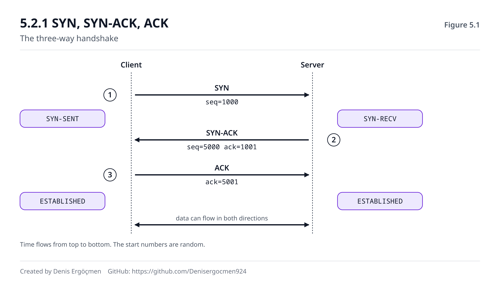

# Faz 5 — Transport Katmanı: Güvenilirlik ve Akış

> **Navigasyon:** [◀ Ara Sınav 2](Ara_Sinav_2.md) · **Faz 5** · [Faz 6 — İsimden Adrese: DNS ▶](Faz_6_DNS.md)

---

## Nereden geliyoruz

Faz 4'ün sonunda sana en rahatsız edici soruyu sorduk: yolda bir router paketini düşürdü ve **kimseye
haber vermedi**. Gönderen bunu nasıl anlayacak?

Faz 0–4 arasında paketi hedefe **ulaştırmayı** öğrendin. Bu faz, ulaşmayanlarla ne yapıldığını öğretiyor.
Yanında getirdiklerin:

- **Port, "hangi uygulama" sorusunun cevabıdır** (1.4.1) ve L4 header'ında taşınır. Bu faz o header'ın
  içindeki diğer alanları açıyor.
- **4-tuple bir bağlantıyı benzersiz kılar** (1.4.2). "Bağlantı" kelimesinin tam olarak ne demek olduğunu
  burada öğreneceksin.
- **IP best-effort'tur** — paket düşebilir, sıra değişebilir (Faz 4 kapanışı). Güvenilirlik IP'nin işi
  değil; **bu katmanın** işi.

## Bu fazın sorusu

> *"Alt katmanlar hiçbir garanti vermiyorken — paket düşebiliyor, sıra değişebiliyor, kopyalanabiliyorken —
> bir dosya nasıl **bozulmadan** indiriliyor?"*

Cevap tek bir fikirde toplanır: **numaralandır ve teyit al.** Gönderilen her bayt numaralanır; alıcı
aldıklarını teyit eder; teyit gelmezse gönderici yeniden yollar. Bu kadar basit bir fikirden, internetin
güvenilirlik katmanının tamamı doğar.

Ama bu fazın asıl değeri başka yerde: **gerçek dünyadaki packet loss sorunlarının çoğunun kaynağı burasıdır.**
"SSH bağlanıyor ama donuyor", "küçük istekler çalışıyor büyük dosyalar takılıyor", "VPN üstünden site
açılmıyor" — bunların hepsi bu fazın son bölümünde (**MTU**) açıklanır. Mentör haritasının "packet loss'un
kalbi" dediği yer orasıdır ve bu fazı okurken oraya doğru ilerlediğini bil.

---

## Bu fazın sonunda

- TCP ve UDP'nin farkını, hangisinin nerede kullanıldığını ve **neden** öyle olduğunu anlatabileceksin
- Üç aşamalı el sıkışmayı (SYN → SYN-ACK → ACK) adım adım anlatabilecek; her adımda takılmanın ne anlama
  geldiğini teşhis edebileceksin
- Sequence number ve ACK mekanizmasını, kayıp paketin nasıl tespit edilip yeniden gönderildiğini
  açıklayabileceksin
- Flow control (pencere) ile congestion control arasındaki farkı — **kimi koruduklarını** — ayırt
  edebileceksin
- Yüksek latency + paket kaybının throughput'u neden **çökerttiğini** anlatabileceksin
- FIN/ACK ile düzgün kapanış ile RST ile ani kesmenin farkını bileceksin
- **MTU, MSS ve fragmentation**'ı açıklayabilecek; **MTU black hole**'un neden en sinsi arıza olduğunu ve
  nasıl teşhis edildiğini bileceksin
- **Cloud:** Load balancer'ların TCP'yi nasıl sonlandırdığını, VPN/tünel arkasındaki MTU sorununu ve
  jumbo frame'in ne zaman işe yaradığını anlatabileceksin

---

## Faz haritası

| Bölüm | Konu | Derinlik | Neden burada |
|---|---|---|---|
| 5.1 | TCP vs UDP | `[kavram]` | İki farklı sözleşme |
| 5.2 | Üç aşamalı el sıkışma | `[mekanizma]` | Bağlantı nasıl kurulur — teşhisin temeli |
| 5.3 | Sequence, ACK, retransmission | `[mekanizma]` | **Güvenilirliğin kalbi** |
| 5.4 | Flow control (pencere) | `[mekanizma]` | Alıcıyı korumak |
| 5.5 | Congestion control | `[mekanizma]` | Ağı korumak |
| 5.6 | Bağlantı kapanışı | `[kavram]` | FIN vs RST |
| 5.7 | MTU, MSS, fragmentation | `[mekanizma]` | **Fazın kalbi** — packet loss'un kaynağı |
| 5.8 | Bu faz bozulunca | — | Transport arızalarının imzaları |

> **Bu fazda nasıl çalışmalı:** Bu fazın komutları çoğunlukla 🟢 ama biri özel dikkat ister: `tcpdump`
> 🟢'dir (sadece okur) ama **root** gerektirir ve üretim makinesinde çalıştırdığında CPU yükü yaratabilir —
> filtre kullan (`port 443` gibi), çıplak `tcpdump` çalıştırma. En öğretici deney 5.2'deki handshake
> yakalamasıdır: `tcpdump`'ı başlat, başka bir terminalde `curl` çalıştır, ve SYN/SYN-ACK/ACK üçlüsünü
> **kendi gözünle** gör. Bu faz teoriyi terminalde doğrulamaya en uygun fazdır. 5.7'yi acele etme — orası
> sahada en çok işine yarayacak bölüm.

---
---

# 5.1 TCP vs UDP — İki Farklı Sözleşme

## 5.1.1 İki yaklaşım `[kavram]`

Transport katmanında iki ana protokol vardır ve farkları felsefidir.

**TCP** (Transmission Control Protocol): *"Verinin eksiksiz ve sırayla ulaşacağına söz veriyorum — gerekirse
yavaşlarım."*

**UDP** (User Datagram Protocol): *"Paketi yollarım. Ulaşır mı bilmem, sırası bozulur mu bilmem. Ama hızlıyım."*

| Özellik | TCP | UDP |
|---|---|---|
| Bağlantı | Var (handshake gerekir) | Yok (doğrudan gönderilir) |
| Güvenilirlik | Var (kayıplar yeniden gönderilir) | Yok |
| Sıra garantisi | Var | Yok |
| Akış/tıkanıklık kontrolü | Var | Yok |
| Header boyutu | 20+ bayt | 8 bayt |
| Gecikme | Daha yüksek | Daha düşük |

## 5.1.2 Hangisi nerede — ve neden `[kavram]`

Seçim, uygulamanın neye önem verdiğine bağlıdır: **doğruluk mu, zamanlılık mı?**

**TCP kullananlar** — verinin eksiksiz olması şart:
- **HTTP/HTTPS** (web) — sayfanın yarısı gelemez
- **SSH** — bir karakterin kaybolması komutu bozar
- **Dosya transferi, veritabanı bağlantıları, e-posta**

**UDP kullananlar** — gecikme, kayıptan daha kötü:
- **DNS** (Faz 6) — tek paketlik soru-cevap; kaybolursa yeniden sormak, bağlantı kurmaktan ucuz
- **Canlı video/ses** — kaybolan bir kareyi yeniden istemenin anlamı yok, o an geçti
- **Oyunlar** — 200 ms geç gelen bir konum verisi zaten işe yaramaz
- **VPN tünelleri** (Faz 7.4) — içeride zaten TCP var, dışta tekrar güvenilirlik gereksiz

Kritik sezgi: **UDP "kötü TCP" değildir.** Farklı bir ödünleşmedir. Canlı bir video görüşmesinde TCP
kullansaydın, kaybolan bir paket için tüm akış duraklardı — ve izleyici donmuş bir görüntü görürdü. UDP'de
o kare atlanır, görüntü bir an bozulur, ve akış devam eder. İkincisi **daha iyidir**.

> **❓ Akla gelen soru: "UDP güvenilir değilse, üstüne güvenilirlik eklenemez mi?"**
>
> Eklenebilir — ve tam olarak bu yapılıyor. **QUIC** protokolü (HTTP/3'ün altında çalışır, Faz 8.3) UDP
> üzerine kendi güvenilirlik, sıralama ve tıkanıklık kontrolü katmanını kurar. Neden TCP'yi kullanmıyor?
> Çünkü TCP işletim sistemi çekirdeğinde gömülüdür ve geliştirmesi yıllar alır; UDP üzerine yazılan bir
> protokol **uygulama alanında** çalışır ve hızla güncellenebilir. Ayrıca QUIC, TCP'nin bir zayıflığını
> çözer: **head-of-line blocking** — TCP'de kaybolan tek bir paket, arkasındaki **tüm** verinin teslimini
> bekletir; QUIC'te akışlar bağımsızdır, bir akıştaki kayıp diğerlerini durdurmaz. Yani "UDP üzerine
> güvenilirlik" bir tuhaflık değil, modern internetin gittiği yön.

> **🤔 Düşün 5.1** — Bir dosya paylaşım uygulaması yazıyorsun ve bir de canlı ekran paylaşımı özelliği
> ekleyeceksin. (a) Her biri için hangi protokolü seçersin? (b) Ekran paylaşımında TCP kullansaydın
> kullanıcı **ne hissederdi** — somut olarak tarif et. (c) Dosya transferinde UDP kullansaydın ne yapmak
> zorunda kalırdın?
>
> *(Cevap: fazın sonunda)*

---
---

# 5.2 Üç Aşamalı El Sıkışma

## 5.2.1 SYN → SYN-ACK → ACK `[mekanizma]`

TCP "bağlantı kurar" dedik. Peki fiziksel bir kablo çekilmediğine göre, "bağlantı" ne demek?

**Bağlantı, iki tarafın da birbirini duyduğunu ve başlangıç numaralarını anlaştığını doğrulamış olmasıdır.**
Bunu kuran üçlüye **three-way handshake** denir:

**1. SYN** (istemci → sunucu)
İstemci: *"Bağlanmak istiyorum. Benim başlangıç sequence numaram 1000."*
(SYN = synchronize. Bu paket veri taşımaz.)

**2. SYN-ACK** (sunucu → istemci)
Sunucu: *"Duydum, 1000'i aldım (ACK=1001). Ben de bağlanmak istiyorum, benim başlangıç numaram 5000."*
(Tek pakette hem teyit hem kendi isteği var — bu yüzden üç adım, dört değil.)

**3. ACK** (istemci → sunucu)
İstemci: *"Senin 5000'ini aldım (ACK=5001). Bağlantı kuruldu."*

Bundan sonra veri akabilir.

Her adımdan sonra bağlantının bir **durumu** vardır: istemci SYN'i yollayınca `SYN-SENT`, sunucu SYN-ACK'i
yollayınca `SYN-RECV`, ACK geldikten sonra iki tarafta da `ESTABLISHED`.

**Neden üç adım?** Çünkü her iki tarafın da **hem gönderme hem alma** yeteneğinin doğrulanması gerekir.
İki adım olsaydı, sunucu istemcinin kendi cevabını aldığını bilemezdi. Üç adımdan sonra her iki taraf da
şunu bilir: *"Ben onu duyuyorum, o da beni duyuyor."*

Ve başlangıç numaraları **rastgeledir** (0'dan başlamaz). Sebep güvenliktir: tahmin edilebilir sequence
numaraları, bir saldırganın araya sahte paket sokmasını kolaylaştırırdı.



Şekilde soldaki dikey çizgi istemci, sağdaki sunucudur; zaman yukarıdan aşağı akar. Her okun üzerinde
bayraklar (SYN, ACK) ve numaralar var. Sağ tarafta her adımdan sonraki bağlantı **durumu** işaretli —
`ss` çıktısında göreceğin durumlar tam olarak bunlardır.

## 5.2.2 Handshake takılırsa ne anlarsın `[uygulama]`

Bu, bu fazın en pratik teşhis aracıdır. `tcpdump` ile handshake'i izlediğinde **nerede takıldığı**, sorunun
ne olduğunu neredeyse kesin söyler:

| Gözlem | Anlamı |
|---|---|
| SYN gidiyor, **hiçbir şey dönmüyor** (timeout) | Firewall paketi **sessizce düşürüyor**, veya routing yok, veya host yok |
| SYN gidiyor, **RST dönüyor** | Host var ve ulaşılabilir, ama o portu **dinleyen yok** (connection refused) |
| SYN gidiyor, **ICMP unreachable** dönüyor | Routing sorunu veya firewall açıkça reddediyor |
| SYN-ACK dönüyor, **ACK sonrası veri akmıyor** | Bağlantı kuruldu ama veri geçmiyor → **MTU şüphesi** (5.7) |
| Handshake tamam, **hemen RST** | Uygulama bağlantıyı reddetti (auth, limit, yanlış protokol) |

Dördüncü satırı özellikle aklında tut. "Bağlanıyor ama takılıyor" cümlesinin arkasında neredeyse her zaman
MTU vardır ve 5.7'de tam olarak onu göreceksin.

> **🔧 Makinende gör** 🟢 — gerçek bir handshake yakala
>
> ```
> # Terminal 1:
> $ sudo tcpdump -n -i any 'tcp port 443 and host example.com'
>
> # Terminal 2:
> $ curl -s https://example.com > /dev/null
>
> # Terminal 1 çıktısı:
> 10.0.1.50.51234 > 93.184.216.34.443: Flags [S],  seq 2847361029, win 64240
> 93.184.216.34.443 > 10.0.1.50.51234: Flags [S.], seq 1093847261, ack 2847361030
> 10.0.1.50.51234 > 93.184.216.34.443: Flags [.],  ack 1093847262, win 502
> ```
>
> Üç satır, üç adım. Bayrakları oku: **`[S]`** = SYN, **`[S.]`** = SYN-ACK (nokta ACK demektir),
> **`[.]`** = sadece ACK. `seq` ve `ack` değerlerine dikkat et: sunucunun `ack`'i, istemcinin `seq`'inin
> **bir fazlası** (2847361029 → 2847361030). Bu "senin numaranı aldım, sıradaki baytı bekliyorum"
> demektir (5.3.1). `51234` istemcinin **ephemeral kaynak portudur** (1.4.1). Bu üç satırı bir kez kendi
> gözünle görmek, handshake'i kalıcı olarak yerleştirir.

> **⚠️ Yaygın yanılgı: "Bağlantı kurulduysa her şey yolundadır."**
>
> Hayır — handshake sadece **küçük paketlerin** geçtiğini kanıtlar. SYN, SYN-ACK ve ACK paketleri veri
> taşımaz; birkaç on bayttır. Yolda 1500 baytlık paketleri düşüren bir MTU sorunu varsa, handshake **sorunsuz
> tamamlanır** ve ardından veri akmaya başladığı anda bağlantı donar (5.7.3). "SSH bağlanıyor, banner
> geliyor, sonra donuyor" ve "site açılıyor ama resimler yüklenmiyor" şikâyetlerinin klasik sebebi budur.
> Doğru refleks: bağlantının **kurulması** ile **veri akması** iki ayrı testtir.

> **🤔 Düşün 5.2** — `curl https://api.example.com` komutun 30 saniye bekleyip timeout veriyor. `tcpdump`
> ile bakıyorsun: SYN paketleri gidiyor, hiçbir cevap yok. (a) Üç muhtemel sebep yaz. (b) Eğer cevap olarak
> **RST** gelseydi teşhisin nasıl değişirdi? (c) İki durumu ayırt etmek neden bu kadar değerli?
>
> *(Cevap: fazın sonunda)*

---
---

# 5.3 Sequence, ACK ve Retransmission

## 5.3.1 Her bayt numaralı `[mekanizma]`

Faz 4'ün son sorusunun cevabı burada: gönderen, paketinin kaybolduğunu **teyit gelmediği için** anlar.

TCP'nin mekanizması şudur: **gönderilen her bayt numaralanır.**

- **Sequence number (seq):** "Bu paketteki ilk baytın numarası şu."
- **Acknowledgment number (ack):** "Şu numaraya kadar her şeyi aldım, **sıradaki** baytı bekliyorum."

Örnek akış:

```
Gönderen → seq=1000, 500 bayt veri        (1000–1499 arası baytlar)
Alıcı    → ack=1500                        ("1499'a kadar aldım, sıradaki 1500")
Gönderen → seq=1500, 500 bayt veri        (1500–1999)
Alıcı    → ack=2000                        ("1999'a kadar aldım")
```

ACK **kümülatiftir**: `ack=2000` demek, "2000'den öncesinin **tamamını** aldım" demektir. Bu, kayıp ACK'lerin
kendiliğinden tolere edilmesini sağlar — bir ACK kaybolsa bile, sonraki ACK aynı bilgiyi daha ilerisiyle
taşır.

## 5.3.2 Kayıp nasıl anlaşılır ve düzeltilir `[mekanizma]`

Bir paket kaybolduğunda iki farklı mekanizma devreye girer:

**Yol 1 — Timeout (RTO).** Gönderen her paket için bir zamanlayıcı başlatır. ACK belirli süre içinde
gelmezse paketi **yeniden gönderir**. Süre, ölçülen gidiş-dönüş zamanına (RTT) göre dinamik hesaplanır.
Bu yavaş bir mekanizmadır — bekleme gerekir.

**Yol 2 — Duplicate ACK (hızlı).** Daha zarif. Alıcı, sırası bozuk veri alırsa **aynı ACK'i tekrar tekrar**
gönderir:

```
Gönderen: seq=1000 ✓, seq=1500 ✗ (kayboldu), seq=2000 ✓, seq=2500 ✓
Alıcı:    ack=1500,   —,            ack=1500,    ack=1500
                                     └── "hâlâ 1500'ü bekliyorum!" ──┘
```

Gönderen **üç tane duplicate ACK** gördüğünde beklemez: "1500 kayboldu" diye anlar ve hemen yeniden
gönderir. Buna **fast retransmit** denir ve timeout beklemekten çok daha hızlıdır.

Buradaki güzellik şu: alıcı "kayıp var" demiyor. Sadece **ne beklediğini** tekrarlıyor. Gönderen bundan
kaybı **çıkarıyor**. Hiçbir ek mesaj tipi gerekmiyor.

> **🔧 Makinende gör** 🟢 — açık bir bağlantının iç durumunu oku
>
> ```
> $ ss -ti
> ESTAB 0  0  10.0.1.50:51234  93.184.216.34:443
>     cubic wscale:8,7 rto:204 rtt:2.157/0.184 mss:1448 cwnd:10
>     bytes_sent:1842 bytes_acked:1842 segs_out:12 retrans:0/0
> ```
>
> `-t` TCP, `-i` iç detaylar. Okuması: **`rtt:2.157`** = gidiş-dönüş süresi ms cinsinden (ağ mesafen);
> **`rto:204`** = retransmission timeout, ACK bu kadar ms beklenir; **`mss:1448`** = tek segmentte
> taşınabilecek max veri (5.7.2 — bu sayıya dikkat et); **`cwnd:10`** = tıkanıklık penceresi (5.5.1);
> **`retrans:0/0`** = yeniden gönderim sayısı. Son değer teşhiste altın değerindedir: **`retrans`
> sıfırdan büyükse ve artıyorsa, yolda gerçek paket kaybı var demektir.** `cubic` ise kullanılan
> tıkanıklık kontrol algoritmasının adı.

> **🤔 Düşün 5.3** — Gönderen sırayla seq=1000, 2000, 3000, 4000 yolluyor (her biri 1000 bayt). 2000
> numaralı paket kayboluyor. (a) Alıcı hangi ACK'leri gönderir? (b) Gönderen kaybı nasıl ve ne zaman
> anlar? (c) Alıcı 3000 ve 4000'i almış olmasına rağmen neden `ack=5000` diyemez?
>
> *(Cevap: fazın sonunda)*

---
---

# 5.4 Flow Control — Alıcıyı Korumak

## 5.4.1 Pencere: "bu kadar yollayabilirsin" `[mekanizma]`

Bir sorun daha var: gönderen çok hızlı, alıcı yavaş olabilir. Alıcının buffer'ı dolarsa gelen veri
**atılır** — ve yeniden gönderilir, ki bu tam bir israftır.

Çözüm: alıcı, her ACK'te **ne kadar yer kaldığını** söyler. Bu değere **receive window** (alma penceresi)
denir ve TCP header'ında taşınır.

```
Alıcı → ack=2000, win=64240     "2000'i bekliyorum, 64 KB yerim var"
Alıcı → ack=5000, win=8192      "buffer doluyor, 8 KB kaldı — yavaşla"
Alıcı → ack=7000, win=0         "DUR. Hiç yerim yok."
```

Gönderen, teyit almadan en fazla **pencere kadar** veri yollayabilir. `win=0` görürse tamamen durur ve
alıcı yer açıp pencereyi güncelleyene kadar bekler.

Buna **sliding window** (kayan pencere) denir: pencere, ACK'ler geldikçe ileri doğru kayar. Her ACK, hem
"şunu aldım" hem "şu kadar daha yollayabilirsin" bilgisini taşır.

Kritik ayrım — bu fazın en çok karıştırılan iki kavramı:

> **Flow control ALICIYI korur. Congestion control AĞI korur.**

Flow control, alıcının açıkça söylediği bir limittir. Congestion control (5.5) ise kimsenin söylemediği,
göndericinin **tahmin ettiği** bir limittir.

---
---

# 5.5 Congestion Control — Ağı Korumak

## 5.5.1 Kimse söylemiyor, gönderen tahmin ediyor `[mekanizma]`

Alıcı hızlı olabilir ama **yol** tıkalı olabilir. Ve yoldaki router'lar sana "yavaşla" demez — sadece
paketlerini **düşürürler** (Faz 4 kapanışı).

TCP bunu şöyle yorumlar: **paket kaybı = tıkanıklık sinyali.**

Gönderen, alıcının penceresine ek olarak kendi iç limitini tutar: **congestion window (cwnd)**. Gerçek
gönderim hızı, ikisinin **küçüğüdür**:

```
gönderilebilecek veri = min(receive window, congestion window)
```

Ve cwnd şöyle yönetilir:

**Slow start:** Bağlantı başında cwnd küçüktür (birkaç segment). Her başarılı ACK'te **katlanarak** büyür:
1 → 2 → 4 → 8 → 16... Ağı yoklamaktır bu: "ne kadar dayanıyorsun?"

**Congestion avoidance:** Belli bir eşikten sonra büyüme **doğrusal** olur (her RTT'de +1). Artık dikkatli
ilerlenir.

**Kayıp anında:** cwnd sert biçimde düşürülür (tipik olarak yarıya) ve doğrusal büyüme yeniden başlar.
Bu testere dişi desenine **AIMD** denir (Additive Increase, Multiplicative Decrease): yavaş büyü, hızlı
küçül. Adaletli ve kararlıdır — tüm bağlantılar aynı kuralı uyguladığı için ağ kapasitesi kendiliğinden
paylaşılır.

## 5.5.2 Neden yüksek latency + kayıp throughput'u çökertir `[mekanizma]`

Bu, sahada en çok karşına çıkacak performans gerçeğidir ve sezgiye ters gelir.

Şu formülü hisset:

```
maksimum throughput ≈ pencere boyutu / RTT
```

Yani **aynı pencere ile, RTT iki katına çıkarsa throughput yarıya iner.** Bağlantının bant genişliği
değişmese bile.

Şimdi kaybı ekle: her kayıpta cwnd yarıya düşer ve **RTT hızında** yavaş yavaş toparlanır. RTT büyükse
toparlanma da yavaştır. Yüksek RTT + düzenli kayıp = cwnd hiçbir zaman büyüyemez = throughput dipte kalır.

Somut örnek: kıtalar arası bir bağlantıda (RTT 150 ms) **%1 paket kaybı**, 1 Gbps'lik bir hattı pratikte
birkaç Mbps'ye düşürebilir. Hat boştur, bant genişliği vardır — ama TCP güvenemediği için kullanamaz.

Buradan çıkan iki pratik ders:
1. **"Bant genişliğim var ama yavaş" şikâyetinde önce paket kaybına bak** (`mtr`, `ss -ti` → `retrans`).
   Kayıp, bant genişliğinden daha belirleyicidir.
2. **Uzak mesafe bağlantılarda küçük kayıplar büyük etki yapar.** Aynı %1 kayıp, yerel ağda fark
   ettirmezken kıtalar arasında felakettir.

> **💡 Cloud bağlantısı — load balancer TCP'yi böler:** Bir ALB (Application Load Balancer) arkasında
> uygulama çalıştırdığında, istemciden gelen TCP bağlantısı ALB'de **sonlanır** ve ALB, backend'ine
> **ayrı bir** TCP bağlantısı açar. İki bağlantı, iki ayrı handshake, iki ayrı congestion window. Bunun
> faydası büyüktür: istemci kıtanın öbür ucundaysa (RTT 150 ms) yüksek gecikmeli bağlantı ALB'de biter;
> ALB ile backend arasındaki RTT ise 1 ms'dir, dolayısıyla o taraf tam hızda çalışır (5.5.2). Ayrıca ALB,
> backend'e açtığı bağlantıları **yeniden kullanır** — her istek için yeni handshake maliyeti ödenmez.
> Teşhis açısından bilinmesi gereken: bir performans sorununda **hangi bağlantıya** baktığını bil.
> Backend'de `ss -ti` ile gördüğün RTT, istemcinin yaşadığı RTT **değildir** — ALB'ninkidir.

> **🤔 Düşün 5.4** — Bir ekip, Frankfurt'taki sunucudan Singapur'daki istemciye dosya transferinin çok
> yavaş olduğunu söylüyor (RTT ~160 ms). Hat 1 Gbps ve boş. `mtr` %0.8 kayıp gösteriyor. (a) Bant genişliği
> yetersiz mi? (b) Yavaşlığın mekanizmasını iki adımda açıkla. (c) Aynı %0.8 kayıp aynı veri merkezi
> içinde (RTT 0.5 ms) olsaydı fark eder miydi?
>
> *(Cevap: fazın sonunda)*

---
---

# 5.6 Bağlantı Kapanışı

## 5.6.1 FIN ile düzgün, RST ile ani `[kavram]`

Bağlantı iki şekilde biter ve farkları teşhiste önemlidir.

**Düzgün kapanış — FIN.** Dört adımlı, karşılıklı bir vedalaşma:

```
A → FIN      "işim bitti, artık veri göndermeyeceğim"
B → ACK      "anladım"
B → FIN      "benim de işim bitti"
A → ACK      "anladım — kapandı"
```

Dört adım olmasının sebebi, TCP'nin **çift yönlü** olmasıdır: her yön ayrı ayrı kapanır. A göndermeyi
bitirmiş olabilir ama B'nin hâlâ gönderecek verisi olabilir (buna "half-close" denir).

**Ani kesme — RST.** Tek paket, tartışma yok: *"Bu bağlantı geçersiz, kes."*

RST'nin geldiği durumlar:
- Kapalı bir porta bağlanma girişimi → **connection refused** (1.4.1, 5.2.2)
- Uygulama aniden çöktü veya bağlantıyı zorla kapattı
- Bir güvenlik duvarı bağlantıyı **aktif olarak** reddediyor
- NAT/firewall'da bağlantı kaydı zaman aşımına uğradı (Faz 7.2) — "uzun süre boşta kalan SSH oturumunun
  ölmesi" klasiği

**TIME_WAIT** durumu `[atla]` düzeyindedir ama adını bil: kapanan bir bağlantı, geç gelen paketlerin yeni
bir bağlantıya karışmaması için bir süre (tipik 60 sn) bu durumda bekler. Yoğun sunucularda binlerce
`TIME_WAIT` görmek **normaldir**, arıza değil.

> **🤔 Düşün 5.5** — Bir kullanıcı "uzun süre bir şey yazmazsam SSH oturumum kopuyor" diyor. `tcpdump`
> ile bakıldığında kopma anında bir **RST** görülüyor. (a) İki muhtemel sebep yaz. (b) Sebep NAT/firewall
> zaman aşımıysa, bunu ağ yapılandırmasına dokunmadan nasıl çözersin? (c) Bu çözüm neden işe yarar?
>
> *(Cevap: fazın sonunda)*

---
---

# 5.7 MTU, MSS ve Fragmentation — Packet Loss'un Kalbi

Bu bölüm, bu fazın en değerli kısmıdır. Sahada karşılaşacağın en sinsi ağ arızası buradan çıkar ve
teşhisini bilmeyen mühendisler günlerce yanlış yerde arar.

## 5.7.1 MTU: bir frame'in taşıyabileceği en büyük yük `[mekanizma]`

**MTU** (Maximum Transmission Unit — *em-ti-yu*), bir ağ arayüzünün tek bir frame'de taşıyabileceği en
büyük IP paketi boyutudur. Standart Ethernet'te **1500 bayt**tır.

Bu bir protokol tercihi değil, bir **donanım/yol sınırıdır**: yol üzerindeki her arayüzün kendi MTU'su
vardır ve paket, **yolun en küçük MTU'suna** uymak zorundadır. Buna **path MTU** denir.

MTU'yu düşüren tipik şeyler — hepsi bir "zarf" ekler (Faz 0.2.1):
- **VPN/IPsec tünelleri** (~1400 veya daha az)
- **PPPoE** bağlantıları (1492)
- **Bulut tünelleri** (VXLAN, GRE — Faz 7.4)

Ters yönde: veri merkezlerinde **jumbo frame** (9000 bayt) kullanılabilir. AWS'te VPC içi trafik 9001 MTU
destekler — bu yüzden `ip link` çıktında `mtu 9001` görürsün (Faz 1.1.1). Ama **internete çıkan** trafik
yine 1500'e iner.

## 5.7.2 MSS: TCP'nin kendi payı `[kavram]`

MTU, IP paketinin tamamının boyutudur — header'lar dahil. TCP'nin gerçekte taşıyabileceği **veri** miktarı
daha azdır:

```
MSS = MTU − IP header (20) − TCP header (20)
1460 = 1500 − 20 − 20
```

**MSS** (Maximum Segment Size), TCP'nin tek segmentte taşıyabileceği veri miktarıdır. İki taraf bunu
**handshake sırasında** birbirine bildirir (SYN paketinde bir seçenek olarak) ve küçük olan kullanılır.

`ss -ti` çıktısında gördüğün `mss:1448` değeri budur (5.3.2). 1460 değil 1448 ise, yolda ek başlıklar
(timestamp gibi) var demektir.

## 5.7.3 MTU black hole — en sinsi arıza `[mekanizma]`

Şimdi arıza senaryosuna gelelim. Adım adım:

1. Makinen, yolun MTU'sunun 1500 olduğunu **varsayar** ve 1500 baytlık paketler yollar.
2. Yolda bir VPN tüneli var; onun MTU'su **1400**.
3. Paket o noktaya gelir. Router'ın iki seçeneği vardır:
   - Paketi **parçalamak** (fragmentation) — ama IP header'ında **DF (Don't Fragment)** biti set ise bu
     yasaktır. Ve modern TCP, path MTU keşfi için DF'yi **daima set eder**.
   - Paketi **düşürmek** ve göndericiye **ICMP Fragmentation Needed** yollamak (Faz 4.4.2).
4. Router doğru davranır: paketi düşürür ve ICMP yollar.
5. **Ama yolda bir firewall ICMP'yi engelliyor.** Mesaj göndericiye **hiç ulaşmaz**.
6. Gönderici hiçbir şey öğrenemez. Paketini yeniden yollar. Aynı boyutta. Yine düşer. Yine yeniden yollar.

Sonuç: **kara delik.** Paketler kaybolur ama kimse sebebini söylemez.

Ve imza kesindir, bir kez öğrenince asla unutmazsın:

> **Küçük paketler geçer, büyük paketler geçmez.**

Somut belirtiler:
- **SSH bağlanır, banner gelir, ilk büyük çıktıda donar** (`ls -la` gibi)
- **Web sayfası açılır (HTML küçük), resimler yüklenmez** (büyük)
- **`ping` çalışır** (56 bayt), **`ping -s 1472` çalışmaz**
- **TCP handshake tamam, veri akmıyor** (5.2.2, satır 4)

> **🔧 Makinende gör** 🟢 — path MTU'yu elle bul
>
> ```
> $ ping -M do -s 1472 -c2 8.8.8.8
> PING 8.8.8.8 (8.8.8.8) 1472(1500) bytes of data.
> 1480 bytes from 8.8.8.8: icmp_seq=1 ttl=115 time=12.1 ms       ← geçti
>
> $ ping -M do -s 1473 -c2 8.8.8.8
> ping: local error: message too long, mtu=1500                  ← sınır burada
> ```
>
> `-M do` = DF bitini set et (parçalama yok), `-s 1472` = 1472 bayt veri. Neden 1472? Çünkü **1472 + 8
> (ICMP header) + 20 (IP header) = 1500**. Yani bu, MTU'yu tam dolduran en büyük ping'dir. Yöntem: boyutu
> artırıp azaltarak **geçen en büyük değeri** bul, 28 ekle — path MTU budur. Bir VPN veya tünel arkasında
> bu testi yaparsan 1500'den küçük bir değer bulursun, ve o fark tam olarak tünelin eklediği zarf
> boyutudur (Faz 0.2.1).

> **💡 Cloud bağlantısı — "VPN üstünden çalışmıyor" klasiği:** Bu arızayı bulutta en çok Site-to-Site VPN
> arkasında göreceksin ve senaryo hep aynıdır: instance'lar birbirini ping'liyor, SSH bağlanıyor, ama
> büyük veri transferi veya bir API çağrısı donuyor. Sebep, IPsec'in eklediği başlıkların MTU'yu 1500'ün
> altına indirmesi, ve ICMP'nin güvenlik grubu ya da NACL tarafından engellenmesidir. Üç çözüm vardır:
> (1) **ICMP tip 3 kod 4'e (Fragmentation Needed) izin ver** — en doğru çözüm, path MTU keşfini çalıştırır;
> (2) **MSS clamping** — ağ cihazı SYN paketlerindeki MSS değerini düşürür, böylece taraflar baştan küçük
> segment kullanır (VPN cihazlarında standart bir ayardır); (3) **instance MTU'sunu elle düşür**
> (`ip link set dev eth0 mtu 1400` 🟡 — geçicidir, kalıcı yapmak yapılandırma dosyası gerektirir). Not:
> AWS'te VPC içi trafik 9001 MTU kullanır ama VPN/IGW üzerinden çıkan trafik 1500'e iner — bu geçiş
> noktası, sorunun doğduğu yerdir.

> **🤔 Düşün 5.6** — Bir ekip, yeni kurdukları VPN üzerinden veritabanına bağlanamıyor. Test sonuçları:
> `ping` başarılı, `telnet db 5432` bağlanıyor, ama sorgu çalıştırınca istemci donuyor. (a) Teşhisin ne?
> (b) Hangi tek komutla doğrularsın? (c) İki farklı çözüm öner ve hangisinin daha doğru olduğunu söyle.
>
> *(Cevap: fazın sonunda)*

---
---

# 5.8 Bu Faz Bozulunca — Transport Arıza İmzaları

Transport arızalarının teşhisinde altın kural şudur: **bağlantının kurulması ile verinin akması iki ayrı
olaydır** ve hangisinin başarısız olduğu, sebebi neredeyse tek başına belirler.

| Belirti | Muhtemel sebep | Doğrula | İlgili bölüm |
|---|---|---|---|
| SYN gidiyor, cevap yok (timeout) | Firewall sessizce düşürüyor / routing yok | `tcpdump` ile SYN'i izle | 5.2.2 |
| SYN'e RST dönüyor (refused) | Port dinlenmiyor — servis kapalı | `ss -tulpn` (hedefte) | 5.2.2 |
| Handshake tamam, veri akmıyor | **MTU black hole** | `ping -M do -s 1472` | 5.7.3 |
| SSH bağlanıyor, ilk büyük çıktıda donuyor | MTU black hole (klasik imza) | Aynı test | 5.7.3 |
| Sayfa açılıyor, resimler gelmiyor | MTU black hole | Aynı test | 5.7.3 |
| Bant genişliği var ama transfer yavaş | Paket kaybı + yüksek RTT | `mtr`, `ss -ti` → `retrans` | 5.5.2 |
| `ss -ti`'de `retrans` sürekli artıyor | Yolda gerçek paket kaybı | `mtr -rwc 50 <hedef>` | 5.3.2 |
| Boştaki bağlantılar bir süre sonra kopuyor | NAT/firewall oturum zaman aşımı | RST'nin kaynağı, keepalive | 5.6.1 |
| Bağlantı kuruluyor, hemen RST geliyor | Uygulama reddetti (auth, limit, protokol) | Uygulama logları | 5.2.2 |
| Sunucuda binlerce `TIME_WAIT` | **Normal** — kapanmış bağlantıların bekleme süresi | `ss -tan \| grep TIME` | 5.6.1 |
| UDP servisi "çalışıyor gibi" ama veri gelmiyor | UDP'de handshake yok — sessiz kayıp | `tcpdump` ile iki yönü izle | 5.1.1 |
| Bulutta VPN arkasında büyük istekler ölüyor | IPsec MTU + ICMP engeli | `ping -M do`, MSS clamping | 5.7.3 |

> **Bu tablodan çıkan ders:** Transport teşhisinde önce **tek bir soruyu** cevapla: *bağlantı kuruluyor
> mu?* Kurulmuyorsa cevap üç seçenekten biridir ve `tcpdump` bunu saniyeler içinde söyler — **timeout**
> (sessiz düşürme, firewall), **RST** (port dinlenmiyor), **ICMP unreachable** (routing). Kuruluyor ama
> veri akmıyorsa, şüphenin **ilk sırasında MTU olmalı** (5.7.3): handshake paketleri küçüktür, geçerler;
> veri paketleri büyüktür, düşerler. Bu tek ayrım, sahada en çok zaman kazandıran refleksidir. Ve
> performans şikâyetlerinde bant genişliğine değil **kayba** bak: `ss -ti` çıktısındaki `retrans` değeri,
> hattın "dolu" olup olmadığından çok daha fazlasını söyler — çünkü TCP, güvenemediği bir hattı zaten tam
> kullanmaz (5.5.2). Son bir uyarı: UDP'de bu belirtilerin **hiçbiri** yoktur. Handshake yok, RST yok,
> retransmission yok — sadece sessizlik. UDP teşhisi daima **iki uçta birden** `tcpdump` gerektirir.

---
---

# Faz 5 — Düşün sorularının cevapları

## Cevap 5.1 — Doğruluk mu, zamanlılık mı

(a) **Dosya transferi → TCP** (tek bir bayt eksik olursa dosya bozulur). **Canlı ekran paylaşımı → UDP**
(gecikme, kalitenin önünde).

(b) TCP'de kaybolan bir paket, arkasındaki **tüm** verinin teslimini bekletir (head-of-line blocking, 5.1.2
kutusu). Kullanıcı şunu hisseder: görüntü **donar**, sonra aniden birikmiş kareler hızla akar, sonra yine
donar. Yani gecikme birikir ve "canlı" olma özelliği kaybolur. UDP'de o kare **atlanır**: görüntü bir an
bozulur ama akış gerçek zamanlı kalır — izleyici için ikincisi çok daha iyidir.

(c) Güvenilirliği **kendin yazmak** zorunda kalırdın: paketleri numaralandırmak, eksikleri tespit etmek,
yeniden istemek, sırayı düzeltmek, ve tıkanıklık kontrolü eklemek. Yani TCP'yi yeniden icat etmek. Bu
bazen gerçekten yapılır (QUIC tam olarak budur, 5.1.2 kutusu) ama gerekçesi olmalıdır — sıradan bir dosya
transferi için TCP zaten doğru araçtır.
**İlgili bölüm:** 5.1.1-5.1.2 · **Devamı:** Faz 8.3 (HTTP/3 ve QUIC).

## Cevap 5.2 — Sessizlik ile RST farklı şeyler söyler

(a) SYN gidiyor, hiç cevap yok → üç ihtimal: (i) **firewall paketi sessizce düşürüyor** (DROP politikası —
en yaygın sebep, bulutta security group veya NACL); (ii) **routing sorunu** — paket hedefe ulaşmıyor veya
dönüş yolu yok (asimetrik routing, Faz 4.7); (iii) **host yok veya kapalı** — o IP'de çalışan bir makine
yok.

(b) **RST gelseydi** teşhis çok daralırdı: RST, **hedef makinenin var olduğunu, ulaşılabilir olduğunu ve
paketi aldığını** kanıtlar (5.2.2). Sorun ağda değil, hedefte: o portu dinleyen bir process yok (Faz 1.4.1
— "connection refused"). Yani şüphe **ağdan uygulamaya** kayar — bambaşka bir ekiple konuşursun.

(c) Çünkü ikisi **tamamen farklı ekiplere** yönlendirir. *Sessizlik* = ağ/güvenlik sorunu → firewall
kurallarına, route table'a, security group'a bak. *RST* = uygulama sorunu → servis ayakta mı, doğru portu
mu dinliyor, doğru arayüze mi bağlanmış (`0.0.0.0` vs `127.0.0.1`, Faz 1.4.2). Bu tek ayrım, saatlerce
yanlış yerde aramayı önler.
**İlgili bölüm:** 5.2.2 · **Devamı:** Faz 9.2.3 (DROP ve REJECT), Faz 10.1 (katman katman teşhis).

## Cevap 5.3 — Kümülatif ACK, boşluğu geçemez

(a) Alıcının gönderdiği ACK'ler:
- 1000'i aldı → `ack=2000` ("2000'i bekliyorum")
- 2000 **kayboldu** → hiçbir şey
- 3000 geldi (sırasız) → **`ack=2000`** (hâlâ aynı!)
- 4000 geldi (sırasız) → **`ack=2000`** (yine aynı)

(b) Gönderen, **duplicate ACK**'leri sayar. Üç tane aynı ACK gördüğünde (`ack=2000`, `ack=2000`,
`ack=2000`) timeout beklemez: 2000'in kaybolduğunu anlar ve hemen yeniden gönderir — **fast retransmit**
(5.3.2). Eğer duplicate ACK'ler de gelmezse (örneğin sonraki paketler de kaybolduysa), o zaman
**RTO timeout** devreye girer, ama bu daha yavaştır.

(c) Çünkü ACK **kümülatiftir**: `ack=5000` demek "5000'den öncesinin **tamamını** aldım" demektir (5.3.1).
Ama alıcı 2000–2999 arasını almamıştır — bu bir yalan olurdu ve gönderen kayıp paketi asla yeniden
göndermezdi. Alıcı, boşluğun ötesini almış olsa bile **boşluğun başlangıcını** işaret etmek zorundadır.
(Not: TCP'nin **SACK** — Selective ACK — uzantısı, "2000 eksik ama 3000–4999 elimde" demeyi mümkün kılar
ve yeniden gönderimi çok daha verimli hâle getirir. Modern sistemlerde varsayılan olarak açıktır.)
**İlgili bölüm:** 5.3.1-5.3.2 · **Devamı:** 5.5.1 (kayıp = tıkanıklık sinyali).

## Cevap 5.4 — Kayıp, mesafeyle birlikte öldürücü olur

(a) **Hayır.** Hat 1 Gbps ve boş — bant genişliği sorun değil. Sorun, TCP'nin o bant genişliğini
**kullanamamasıdır**.

(b) İki adım:
1. **Throughput ≈ pencere / RTT** (5.5.2). RTT 160 ms olduğu için, aynı pencereyle elde edilebilecek
   hız zaten düşüktür — pencerenin çok büyümesi gerekir.
2. **Her kayıpta cwnd yarıya düşer** ve yeniden büyümesi **RTT hızında** olur (AIMD, 5.5.1). RTT 160 ms
   iken toparlanma çok yavaştır; %0.8 kayıpla yeni bir kayıp gelmeden pencere asla büyüyemez. Sonuç:
   cwnd sürekli düşük kalır, throughput dipte takılır. Hat boş ama TCP güvenemediği için kullanamaz.

(c) **Neredeyse hiç fark etmezdi.** RTT 0.5 ms iken cwnd, kayıptan sonra milisaniyeler içinde toparlanır —
%0.8 kayıp fark edilmez bile. Aynı kayıp oranı, mesafeyle birlikte felakete dönüşür. Bu yüzden "kayıp
yüzdesi" tek başına anlamsızdır; **RTT ile birlikte** değerlendirilmelidir.
**İlgili bölüm:** 5.5.1-5.5.2 · **Devamı:** Faz 8.5 (CDN — mesafeyi kısaltmak), Faz 10.2.3 (`mtr` ile yolda kaybı bulmak).

## Cevap 5.5 — Boştaki bağlantıyı bir şey unutuyor

(a) İki sebep: (i) **NAT veya stateful firewall oturum zaman aşımı** (5.6.1) — aradaki cihaz, uzun süre
paket görmediği bağlantının kaydını siler; sonraki paket "bilinmeyen bağlantı" sayılıp RST ile reddedilir
(Faz 7.2, Faz 9.1). (ii) **Sunucu tarafı idle timeout** — sshd'nin veya bir load balancer'ın boşta kalan
oturumu kapatması.

(b) **Keepalive** ile: bağlantı üzerinden düzenli aralıklarla küçük paketler göndertirsin, böylece aradaki
cihaz bağlantıyı "canlı" görür ve kaydını silmez. SSH'ta istemci tarafında `ServerAliveInterval 60`,
sunucu tarafında `ClientAliveInterval 60`. TCP seviyesinde `SO_KEEPALIVE` de vardır ama varsayılan
aralığı çok uzundur (2 saat) — uygulama seviyesindeki keepalive daha güvenilirdir.

(c) Çünkü sorun bağlantının **kendisinde** değil, aradaki cihazın **hafızasındadır**. O cihaz bağlantıyı
sadece trafik gördüğü sürece hatırlar (Faz 9.1 — stateful takip). Düzenli küçük paketler, o hafızayı
tazeler. Ağ yapılandırmasına dokunmadan, sadece uçlardaki davranışı değiştirerek sorunu çözersin — ki bu
genelde tek elindeki seçenektir, çünkü aradaki NAT/firewall başkasının kontrolündedir.
**İlgili bölüm:** 5.6.1 · **Devamı:** Faz 7.2 (NAT oturum tablosu), Faz 9.1 (stateful firewall).

## Cevap 5.6 — Klasik MTU black hole

(a) **MTU black hole** (5.7.3). İmza tam: küçük paketler geçiyor (ping ✓, handshake ✓ — `telnet`
bağlanıyor), büyük paketler geçmiyor (sorgu sonucu = büyük veri → donuyor). VPN'in yeni kurulmuş olması
şüpheyi kesinleştirir: IPsec başlıkları MTU'yu 1500'ün altına indirmiştir.

(b) **`ping -M do -s 1472 <hedef>`** (5.7.3 kutusu). Bu geçmezse path MTU 1500'ün altındadır. Boyutu
azaltarak (1400, 1372, 1300...) geçen en büyük değeri bul; +28 ekleyerek gerçek path MTU'yu öğren.

(c) İki çözüm:
- **MSS clamping** (VPN cihazında/gateway'de SYN paketlerinin MSS değerini düşürmek) — taraflar baştan
  küçük segment kullanır.
- **ICMP tip 3 kod 4'e (Fragmentation Needed) izin vermek** — path MTU keşfinin kendiliğinden çalışmasını
  sağlar.

**Daha doğru olan ikincisidir**, çünkü kök sebebi düzeltir: mekanizma zaten var, sadece engellenmiş. ICMP
açıldığında sistem **her yol için** doğru MTU'yu kendisi bulur — sadece bu VPN için değil, gelecekteki tüm
yollar için. MSS clamping ise işe yarar ama bir yamadır: her yeni tünel için ayrıca yapılandırılması gerekir
ve sadece TCP'yi korur (UDP tünellerinde işe yaramaz). Pratikte çoğu kurum **ikisini birden** uygular.
**İlgili bölüm:** 5.7.3 · **Devamı:** Faz 7.4 (tünelleme), Faz 9.3 (ICMP politikası), Faz 10.1 (teşhis metodolojisi).

---
---

# Faz 5 — Sık sorulan sorular

**S1 — UDP neden hâlâ kullanılıyor, TCP her şeyi daha iyi yapmıyor mu?** Çünkü TCP'nin garantilerinin bir
**bedeli** vardır: handshake gecikmesi, kayıp paketi beklerken duraklama (head-of-line blocking), ve
tıkanıklık kontrolünün hızı kısması. Gerçek zamanlı uygulamalarda bu bedel, kayıptan daha zararlıdır
(5.1.2). Ayrıca DNS gibi tek paketlik soru-cevaplarda handshake kurmak saf israftır.

**S2 — Handshake neden üç adım, iki yetmez mi?** Yetmez. İki adımda (SYN, SYN-ACK) sunucu, istemcinin kendi
cevabını **aldığını** bilemez. Üçüncü ACK'ten sonra her iki taraf da "ben onu duyuyorum, o da beni duyuyor"
konumundadır — iki yönlü iletişim kanıtlanmış olur (5.2.1).

**S3 — Flow control ile congestion control arasındaki fark tam olarak nedir?** **Flow control alıcıyı
korur** ve alıcının **açıkça bildirdiği** bir limittir (receive window, her ACK'te taşınır).
**Congestion control ağı korur** ve kimsenin bildirmediği, göndericinin **paket kaybından tahmin ettiği**
bir limittir (cwnd). Gönderen ikisinin **küçüğünü** kullanır (5.4.1, 5.5.1).

**S4 — `ss` çıktısında binlerce `TIME_WAIT` görüyorum, sorun mu?** Genellikle **hayır** — normal davranıştır
(5.6.1). Yoğun bir sunucuda binlerce TIME_WAIT beklenir. Sorun olduğu tek durum, ephemeral port tükenmesine
yol açmasıdır (Faz 1.4.2, Düşün 1.4) — o zaman "cannot assign requested address" hataları görürsün. Çözüm
genelde bağlantı **yeniden kullanımıdır** (keep-alive, connection pooling), TIME_WAIT süresini kurcalamak
değil.

**S5 — MTU'yu düşürmek performansı bozar mı?** Bir miktar, evet: her pakette header oranı artar, aynı veri
için daha fazla paket gerekir. Ama **çalışmayan bir bağlantıdan çok daha iyidir**. Doğru yaklaşım, MTU'yu
elle düşürmek yerine path MTU keşfinin çalışmasını sağlamaktır (ICMP'ye izin vermek) — o zaman her yol
kendi doğru değerini kullanır (5.7.3).

**S6 — Jumbo frame (9000 MTU) ne zaman mantıklı?** Sadece **uçtan uca kontrol ettiğin** bir ağda: veri
merkezi içi, depolama ağları, VPC içi trafik. Yolda 1500'lük tek bir arayüz varsa, jumbo frame'ler ya
parçalanır ya düşer. AWS'te VPC içi 9001 MTU destekler ama IGW/VPN üzerinden çıkan trafik 1500'e iner
(5.7.1) — bu geçiş noktası sorunların doğduğu yerdir.

**S7 — `retrans` değeri kaç olursa endişelenmeliyim?** Mutlak sayı değil, **oran ve eğilim** önemlidir.
Toplam segment sayısına göre %0.1'in altı genelde gürültüdür. %1'in üstü, özellikle yüksek RTT'li bir
bağlantıda, ciddi bir performans sorunudur (5.5.2). Asıl bakılacak şey **artıyor mu**: `ss -ti`'yi birkaç
saniye arayla çalıştır; `retrans` sürekli tırmanıyorsa yolda aktif bir kayıp var demektir ve sıradaki araç
`mtr`'dir.

---
---

# Faz 5 — Kendini sına

Cevaplarını bir kâğıda yaz, sonra cevap anahtarıyla karşılaştır. Hedef: 18 sorudan 14+.

## Bölüm A — Tanım ve mekanizma

1. TCP ve UDP'nin dört farkını yaz.
2. DNS neden UDP kullanır? Video akışı neden UDP kullanır? İki gerekçe farklı mı?
3. Üç aşamalı el sıkışmanın üç adımını ve her adımda ne söylendiğini yaz.
4. Handshake neden üç adım — iki neden yetmez?
5. Sequence number ve ACK number ne ifade eder? ACK'in "kümülatif" olması ne demek?
6. Fast retransmit nedir, hangi sinyalle tetiklenir?
7. Flow control ile congestion control arasındaki fark nedir? Her biri kimi korur?
8. MTU ile MSS arasındaki ilişkiyi formülle yaz.

## Bölüm B — Uygula ve teşhis et

9. `tcpdump`'ta SYN gidiyor ama hiç cevap yok. İki muhtemel sebep yaz.
10. SYN'e RST dönüyor. Teşhisin ne, ve şüphe hangi ekibe kayar?
11. `ss -ti` çıktısında `retrans:47/1200` görüyorsun. Ne anlama gelir, sıradaki adımın ne?
12. SSH bağlanıyor, banner geliyor, `ls -la` yazınca donuyor. Teşhisin ne?
13. Hangi komutla path MTU'yu elle test edersin? `-s 1472` değeri nereden geliyor?
14. RTT 200 ms, kayıp %1, hat 10 Gbps. Transfer neden yavaş?

## Bölüm C — Muhakeme ve bağlantı

15. "Handshake tamam ama veri akmıyor" belirtisini gördüğünde ilk şüphen ne olmalı ve **neden**?
16. Bir router paketi düşürdüğünde göndericiye haber vermiyor. TCP kaybı nasıl fark ediyor? İki yol yaz.
17. MTU black hole'da ICMP'nin rolü nedir? ICMP engellenmeseydi ne olurdu?
18. Bir ALB arkasındaki backend'de `ss -ti` ile RTT 1 ms görüyorsun ama kullanıcılar yavaşlıktan şikâyetçi.
    Çelişki değil — açıkla.

---

## Cevap anahtarı

1. **TCP:** bağlantılı (handshake), güvenilir (yeniden gönderim), sıralı, akış/tıkanıklık kontrollü.
   **UDP:** bağlantısız, güvencesiz, sırasız, kontrolsüz — ve daha küçük header, daha düşük gecikme
   (5.1.1). — 2. **DNS:** tek paketlik soru-cevap; handshake kurmak israf olurdu, kaybolursa yeniden
   sormak daha ucuz. **Video:** gecikme, kayıptan daha zararlı; geç gelen kare zaten işe yaramaz.
   Gerekçeler **farklı**: biri verimlilik, diğeri zamanlılık (5.1.2). — 3. **SYN** ("bağlanmak istiyorum,
   seq numaram X"), **SYN-ACK** ("X'i aldım, benim numaram Y"), **ACK** ("Y'yi aldım — kuruldu") (5.2.1).
   — 4. Çünkü iki adımda sunucu, istemcinin **kendi cevabını aldığını** bilemez; üçüncü adım iki yönlü
   iletişimi kanıtlar (5.2.1). — 5. **Seq:** bu paketteki ilk baytın numarası. **ACK:** "şu numaraya kadar
   her şeyi aldım, sıradakini bekliyorum". **Kümülatif** = ack değerinden öncesinin **tamamı** alınmıştır
   (5.3.1). — 6. Kayıp paketi timeout beklemeden yeniden göndermek; **üç duplicate ACK** ile tetiklenir
   (5.3.2). — 7. **Flow control alıcıyı korur** (alıcının bildirdiği receive window); **congestion control
   ağı korur** (göndericinin kayıptan tahmin ettiği cwnd). Gönderim = min(ikisi) (5.4.1, 5.5.1). —
   8. **MSS = MTU − IP header (20) − TCP header (20)**; standart Ethernet'te 1460 = 1500 − 40 (5.7.2).

9. (i) Firewall paketi **sessizce düşürüyor** (DROP); (ii) routing sorunu veya dönüş yolu yok; (iii) host
   yok/kapalı (5.2.2). — 10. Hedef makine **var, ulaşılabilir ve paketi aldı** — ama o portu **dinleyen
   process yok**. Şüphe ağdan **uygulamaya** kayar (5.2.2). — 11. 1200 segmentten 47'si yeniden
   gönderilmiş (~%4) — **yüksek**, yolda gerçek paket kaybı var. Sıradaki adım: **`mtr`** ile hangi hop'ta
   kayıp olduğunu bulmak (5.3.2, 5.5.2). — 12. **MTU black hole** — küçük paketler (handshake, banner)
   geçiyor, büyük paketler (`ls -la` çıktısı) düşüyor (5.7.3). — 13. **`ping -M do -s 1472 <hedef>`**.
   1472 + 8 (ICMP header) + 20 (IP header) = **1500**, yani MTU'yu tam dolduran en büyük ping (5.7.3). —
   14. Throughput ≈ pencere/RTT; RTT büyük olduğu için pencere çok büyümeli, ama %1 kayıp her seferinde
   cwnd'yi yarıya düşürüyor ve toparlanma RTT hızında olduğu için pencere hiç büyüyemiyor. Bant genişliği
   kullanılamıyor (5.5.2).

15. **MTU.** Çünkü handshake paketleri **küçüktür** (birkaç on bayt) ve her zaman geçerler; veri
    paketleri **büyüktür** (MSS kadar) ve yolda MTU'su düşük bir nokta varsa düşerler. "Bağlanıyor ama
    akmıyor" bu ayrımın doğrudan imzasıdır (5.2.2, 5.7.3). — 16. (i) **Timeout (RTO):** ACK belirli süre
    içinde gelmezse paket yeniden gönderilir. (ii) **Üç duplicate ACK:** alıcı sırası bozuk veri alınca
    aynı ACK'i tekrarlar; gönderen bunu kayıp sinyali sayar ve **fast retransmit** yapar (5.3.2). —
    17. ICMP **Fragmentation Needed** mesajı, göndericiye "paketin çok büyük, MTU şu" bilgisini taşır —
    path MTU keşfinin tek bilgi kanalıdır. Engellenirse gönderici öğrenemez, aynı boyutta yeniden yollar,
    paket yine düşer: **kara delik** (5.7.3, Faz 4.4.2). ICMP açık olsaydı gönderici MTU'yu öğrenir ve
    segment boyutunu düşürürdü — sorun kendiliğinden çözülürdü. — 18. Çünkü ALB, TCP bağlantısını
    **sonlandırır**: istemci↔ALB ve ALB↔backend **iki ayrı** bağlantıdır. Backend'de gördüğün 1 ms, ALB
    ile backend arasındaki RTT'dir; istemcinin yaşadığı gecikme (belki 150 ms + kayıp) istemci↔ALB
    tarafındadır ve backend'den **görünmez**. Performans teşhisinde hangi bağlantıya baktığını bilmek
    şarttır (5.5.2 cloud kutusu).

## Puanlama

| Doğru sayısı | Ne anlama geliyor |
|---|---|
| 16-18 | Transport sende oturdu — özellikle MTU refleksi. Faz 6'ya hazırsın. |
| 13-15 | İyi. 5.7'yi (MTU) bir kez daha oku; sahada en çok o işine yarayacak. |
| 9-12 | Handshake ve kayıp mekanizması karışmış olabilir. 5.2 ve 5.3'ü tcpdump ile doğrula. |
| 0-8 | Fazı yeniden gez. Hedef: "bağlanıyor ama akmıyor" cümlesini duyunca MTU demek. |

Kaçırdığın soru → dönmen gereken bölüm:

| Soru | Bölüm |
|---|---|
| 1, 2 | 5.1 TCP vs UDP |
| 3, 4, 9, 10 | 5.2 Handshake |
| 5, 6, 11, 16 | 5.3 Seq/ACK/retransmission |
| 7 | 5.4 + 5.5 Flow vs congestion |
| 14, 18 | 5.5.2 Throughput ve RTT |
| 8, 12, 13, 15, 17 | 5.7 MTU ve black hole |

---
---

# Faz 5 — Kapanış ve Faz 6'ya Köprü

## Bu fazdan ne taşıyorsun

Faz 5 sana **güvenilirliğin nasıl inşa edildiğini** verdi. TCP ile UDP'nin farklı sözleşmeler olduğunu —
biri doğruluğu, diğeri zamanlılığı seçtiğini — öğrendin. Üç aşamalı el sıkışmayı ve onun teşhis değerini
(timeout / RST / ICMP üçlüsü) edindin. Numaralandırma ve teyit mekanizmasının, kaybı hiçbir ek mesaj
olmadan nasıl tespit ettiğini gördün. Flow control'ün **alıcıyı**, congestion control'ün **ağı** koruduğunu
ayırdın ve yüksek RTT + kaybın throughput'u neden çökerttiğini anladın. Ve en değerlisi: **MTU black
hole**'un imzasını öğrendin — *küçük paketler geçer, büyük paketler geçmez.*

En kalıcı iki cümle: **"bağlantının kurulması ile verinin akması iki ayrı olaydır"** ve **"bağlanıyor ama
akmıyorsa, ilk şüphen MTU olsun."**

## Faz 6 bunun neresine bağlanıyor

Faz 0'dan buraya kadar her şeyi **IP adresleriyle** yaptık. `ping 8.8.8.8`, `curl https://93.184.216.34`,
route tabloları, prefix'ler — hepsi sayılarla.

Ama sen gerçek hayatta `93.184.216.34` yazmıyorsun. `example.com` yazıyorsun.

Peki o isim, makinenin ihtiyaç duyduğu 32 bitlik sayıya **nasıl** dönüşüyor? Ve o dönüşüm bozulduğunda
neden her şey "internet yok" gibi görünüyor — oysa IP, routing ve TCP gayet sağlamken?

Faz 6 bunun cevabıdır: DNS. İsim hiyerarşisini, çözümleme zincirini (resolver → root → TLD → authoritative),
kayıt tiplerini, ve önbelleğin/TTL'in neden hem en büyük hızlandırıcı hem en sinsi arıza kaynağı olduğunu
göreceksin.

Faz 5 verinin **güvenilir** akmasını sağladı; Faz 6 **nereye** akacağını bulmayı öğretiyor.

> **🤔 Faz çıktısı — kendine sor:** `curl https://example.com` yazdığında, makinenin TCP handshake'i
> başlatabilmesi için önce hedef **IP'yi** bilmesi gerekiyor (5.2.1 — SYN paketinin hedef IP alanı
> doldurulmalı). Ama elinde sadece bir **isim** var. Bu ismi kime soracak — ve o "kim"in adresini nereden
> bilecek? (İpucu: Faz 1.6.1'de DHCP'nin dağıttığı dört şeyden biri buydu.)
>
> **🧪 Lab 5 fikri (hepsi 🟢, tcpdump root ister):** (1) `sudo tcpdump -n 'tcp port 443 and host
> example.com'` başlat, başka terminalde `curl -s https://example.com > /dev/null` çalıştır; SYN / SYN-ACK
> / ACK üçlüsünü bayraklarıyla birlikte bul. (2) Aynı anda `ss -ti` çalıştırıp `rtt`, `mss`, `cwnd` ve
> `retrans` değerlerini oku. (3) `ping -M do -s 1472 8.8.8.8` ile path MTU'nu test et; geçerse 1500'sün,
> geçmezse boyutu azaltıp sınırı bul. (4) `mtr -rwc 30 <uzak bir hedef>` çalıştır ve `retrans` ile hop
> kayıplarını karşılaştır — ikisi uyuşuyor mu? (5) Kapalı bir porta bağlan (`curl -v http://localhost:9999`)
> ve **connection refused**'ı gör; sonra filtrelenen bir adrese bağlanıp **timeout**'u gör. İki belirtiyi
> yan yana yaşamak, 5.2.2'yi kalıcı hâle getirir.

---

> **Navigasyon:** [◀ Ara Sınav 2](Ara_Sinav_2.md) · **Faz 5** · [Faz 6 — İsimden Adrese: DNS ▶](Faz_6_DNS.md)
