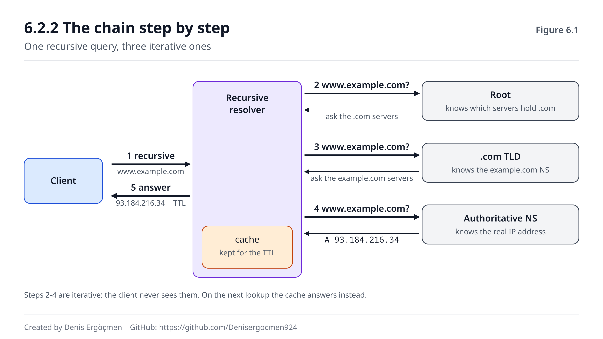

# Faz 6 — İsimden Adrese: DNS

> **Navigasyon:** [◀ Faz 5 — Transport Katmanı](Faz_5_Transport_Katmani.md) · **Faz 6** · [Faz 7 — NAT ve Gerçek Dünya ▶](Faz_7_NAT.md)

---

## Nereden geliyoruz

Faz 5'in sonunda şunu sorduk: `curl https://example.com` yazdığında makinen SYN paketini kurmak için
**hedef IP'yi** bilmek zorunda (5.2.1) — ama elinde sadece bir **isim** var. Bu ismi kime soracak, ve o
"kim"in adresini nereden bilecek?

İpucunu da vermiştik: **DHCP'nin dağıttığı dört şeyden biri** (1.6.1). DHCP sana IP, maske, gateway ve
**DNS sunucusu** verir. İşte o dördüncüsünün ne işe yaradığı bu fazın konusu.

Yanında getirdiklerin:

- **UDP'nin tek paketlik soru-cevap için neden doğru seçim olduğu** (5.1.2) — DNS bunun en saf örneğidir.
- **Bağlantının kurulmasından önce bir adım daha olduğu** — bu faz o adımı dolduruyor.
- **Önbellek fikri** — Faz 3'te switch MAC tablosu, Faz 4'te ARP cache gördün. DNS aynı fikrin en büyük
  ölçekli uygulamasıdır, ve aynı tuzağı taşır: **eski bilgi.**

## Bu fazın sorusu

> *"Dünyada milyarlarca isim var ve hiçbir makine hepsini bilmiyor. Bir isim, sahibinin belirlediği
> adrese nasıl — ve bu kadar hızlı — dönüşüyor?"*

Cevap iki fikirde: **hiyerarşi** (kimse her şeyi bilmez, ama herkes bir sonrakini bilir) ve **önbellek**
(aynı soru iki kez sorulmaz).

Sektörde bir şaka vardır ve boşuna değildir:

> **"It's always DNS."** *(Her zaman DNS'tir.)*

Şakanın arkasındaki gerçek şu: DNS bozulduğunda belirti **"internet yok"** gibi görünür — oysa IP, routing
ve TCP gayet sağlamdır. Bu yanıltıcı imza, DNS'i teşhiste en çok zaman kaybettiren katman yapar. Bu fazın
sonunda o imzayı tanıyacaksın.

---

## Bu fazın sonunda

- Root → TLD → authoritative zincirini ve neden dağıtık bir sistem kurulduğunu anlatabileceksin
- Recursive resolver ile iterative sorgu arasındaki farkı — kimin kimin adına çalıştığını — ayırt edeceksin
- `dig +trace` çıktısını satır satır okuyabileceksin
- A, AAAA, CNAME, MX, TXT, NS kayıtlarını ve CNAME zincirinin tuzaklarını bileceksin
- TTL'in ne olduğunu, cache'in hangi seviyelerde tutulduğunu ve **deployment'ı nasıl etkilediğini**
  açıklayabileceksin
- "Ping IP çalışıyor ama isim çözülmüyor" belirtisini saniyeler içinde teşhis edebileceksin
- **Cloud:** Route 53'ün rolünü, alias kayıtlarını ve TTL ayarının kesinti süresine etkisini anlatabileceksin

---

## Faz haritası

| Bölüm | Konu | Derinlik | Neden burada |
|---|---|---|---|
| 6.1 | DNS hiyerarşisi | `[mekanizma]` | Kimse her şeyi bilmez |
| 6.2 | Çözümleme zinciri | `[mekanizma]` | **Fazın kalbi** — sorunun yolculuğu |
| 6.3 | Kayıt tipleri | `[kavram]` | İsmin arkasında ne var |
| 6.4 | Caching ve TTL | `[mekanizma]` | Hem hız kaynağı hem arıza kaynağı |
| 6.5 | Bu faz bozulunca | — | "It's always DNS" imzaları |

> **Bu fazda nasıl çalışmalı:** Bu fazın tüm komutları 🟢'dir — `dig`, `nslookup`, `host`, `resolvectl`
> sadece sorar, hiçbir şeyi değiştirmez. Yani burada korkmadan deney yapabilirsin. Tek istisna
> `/etc/hosts` dosyasına satır eklemektir (6.2.3'te göreceksin) — o 🟡'dir ve geri alması bir satır silmektir.
> En öğretici tek komut **`dig example.com +trace`**: zincirin tamamını, root'tan başlayarak gözünle
> görürsün. O çıktıyı bir kez dikkatle okumak, bu fazın yarısını halleder. `dig` kurulu değilse:
> `sudo apt install dnsutils` (Debian/Ubuntu) veya `sudo dnf install bind-utils` (RHEL/Fedora).

---
---

# 6.1 DNS Hiyerarşisi

## 6.1.1 Neden tek bir merkez yok `[kavram]`

İlk akla gelen tasarım şu olurdu: dev bir tablo, içinde tüm isimler ve IP'leri, herkes oraya sorar.

Bu tasarım üç sebepten çöker:

1. **Ölçek.** Yüz milyonlarca alan adı ve saniyede milyonlarca sorgu — tek bir sistem bunu kaldıramaz.
2. **Yönetim.** `example.com`'un IP'sini kim değiştirecek? Merkezi bir kurumdan izin almak gerekseydi,
   internet çalışmazdı. İsmin sahibi, kendi kaydını **kendisi** yönetebilmeli.
3. **Dayanıklılık.** Tek merkez düşerse internet biter.

Çözüm: **sorumluluğu böl.** Kimse her şeyi bilmez; herkes sadece **bir sonraki adımı** bilir.

## 6.1.2 Zincirin halkaları `[mekanizma]`

DNS, sağdan sola okunan bir ağaçtır. `www.example.com.` isminin yapısı:

```
www   .   example   .   com   .
 │          │           │     └── root (görünmez nokta)
 │          │           └──────── TLD (Top-Level Domain)
 │          └──────────────────── ikinci seviye alan (domain sahibi burası)
 └─────────────────────────────── alt alan (subdomain) / host
```

Sondaki noktayı normalde yazmazsın ama **vardır** — o, kökün (root) kendisidir.

Zincirdeki roller:

| Seviye | Kim | Ne bilir |
|---|---|---|
| **Root** | 13 mantıksal root sunucu kümesi (anycast ile yüzlerce fiziksel kopya) | `.com`, `.org`, `.tr` gibi TLD'lerin sunucularını |
| **TLD** | `.com`'u yöneten kurum | `example.com`'un **authoritative** sunucularını |
| **Authoritative** | Alan adı sahibinin DNS sunucusu (veya Route 53 gibi bir servis) | `www.example.com`'un **gerçek IP'sini** |
| **Recursive resolver** | ISP'nin, şirketin veya 8.8.8.8 gibi bir servisin sunucusu | Hiçbirini — ama **sormayı** bilir |

Kritik nokta: **root sunucu `example.com`'un IP'sini bilmez ve bilmesine gerek yoktur.** Sadece "`.com`'u
şu sunuculara sor" der. Her seviye bir sonrakine işaret eder. Sorumluluk dağıtılmıştır — ve tam olarak
bu yüzden ölçeklenir.

> **⚠️ Yaygın yanılgı: "13 root sunucu var, yani dünyada 13 makine."**
>
> Hayır. **13 adres** vardır (A'dan M'ye), ama her adresin arkasında **anycast** ile dağıtılmış yüzlerce
> fiziksel sunucu bulunur. Anycast (Faz 8.5'te göreceksin), aynı IP adresinin dünyanın birçok noktasından
> duyurulması ve routing'in her kullanıcıyı **en yakın kopyaya** götürmesidir (Faz 4.3 — longest prefix
> match ve BGP burada devreye girer). Yani İstanbul'dan root'a sorduğunda cevap muhtemelen İstanbul'daki
> bir kopyadan gelir. 13 sayısı bir kapasite sınırı değil, eski bir paket boyutu kısıtından kalmadır.

---
---

# 6.2 Çözümleme Zinciri

## 6.2.1 Recursive resolver: senin adına koşan `[mekanizma]`

Makinen `www.example.com`'u çözmek istediğinde **zinciri kendisi gezmez**. Tek bir yere sorar: DHCP'nin
verdiği (veya elle ayarladığın) **recursive resolver**'a (1.6.1).

İkisi arasındaki fark, bu bölümün en önemli ayrımıdır:

- **Senin sorgun: recursive** (özyinelemeli) — *"Bana cevabı bul. Nasıl bulduğun beni ilgilendirmiyor."*
- **Resolver'ın sorguları: iterative** (yinelemeli) — her adımda bir sunucuya sorar, "bir sonrakine sor"
  cevabını alır ve zinciri kendisi yürür.

Yani **tüm işi resolver yapar**, sen sadece bir soru sorup bir cevap alırsın.

## 6.2.2 Zincir adım adım `[mekanizma]`

Makinen `www.example.com` istedi ve resolver'ın cache'i boş. Olanlar:

```
1. Makine   → Resolver   : "www.example.com nedir?"            (recursive)
2. Resolver → Root       : "www.example.com?"
   Root     → Resolver   : "Bilmiyorum. .com'u şu NS'lere sor."
3. Resolver → .com TLD   : "www.example.com?"
   TLD      → Resolver   : "Bilmiyorum. example.com'u şu NS'lere sor."
4. Resolver → Auth. NS   : "www.example.com?"
   Auth.NS  → Resolver   : "A kaydı: 93.184.216.34"            (authoritative cevap)
5. Resolver → Makine     : "93.184.216.34"  (+ TTL)
```

Beş adım — ve tümü tipik olarak **onlarca milisaniyede** biter. Ama asıl hız buradan gelmez: resolver bu
cevabı **cache'ler** (6.4), ve aynı isim ikinci kez sorulduğunda zincir hiç yürünmez.



Şekilde soldaki istemciden çıkan tek ok recursive sorguyu, resolver'dan çıkan üç ok iterative zinciri
gösterir. Sağdaki üç kutu hiyerarşinin üç seviyesidir (6.1.2). Resolver'ın altındaki kesikli kutu
cache'tir — ikinci sorguda sadece o kutuya gidilir ve üç ok hiç çizilmez.

> **🔧 Makinende gör** 🟢 — zinciri kendi gözünle gez
>
> ```
> $ dig example.com +trace
>
> .                   518400  IN  NS  a.root-servers.net.      ← root NS listesi
> ...
> com.                172800  IN  NS  a.gtld-servers.net.      ← TLD'ye yönlendirme
> ...
> example.com.        172800  IN  NS  a.iana-servers.net.      ← authoritative'e yönlendirme
> ...
> example.com.        86400   IN  A   93.184.216.34            ← nihai cevap
> ;; Received 56 bytes from 199.43.135.53#53(a.iana-servers.net)
> ```
>
> `+trace`, resolver'ın yaptığı işi **senin makinende** tekrarlar: root'tan başlar, her adımda bir sonraki
> NS kümesine sorar. Çıktıyı okurken üç şeye bak: (1) **hangi seviyeden hangi seviyeye** geçildiği, (2)
> her satırdaki **TTL** değeri (518400 = 6 gün, 86400 = 1 gün — 6.4.1), (3) en alttaki **"Received ...
> from"** satırı, cevabın hangi sunucudan geldiğini söyler. Bu tek komut, 6.1 ve 6.2'nin tamamını gözle
> görülür hâle getirir.

## 6.2.3 Sorgudan önceki adımlar `[kavram]`

Aslında resolver'a gitmeden önce makinen birkaç yere daha bakar. Sıra genellikle şudur:

1. **Uygulamanın kendi cache'i** (tarayıcılar kendi DNS cache'ini tutar)
2. **İşletim sisteminin cache'i** (`systemd-resolved`, Windows'ta DNS Client servisi)
3. **`/etc/hosts` dosyası** — elle yazılmış eşleştirmeler. Burada bir kayıt varsa DNS'e **hiç gidilmez**.
4. **Recursive resolver** (`/etc/resolv.conf`'ta yazan adres)

Üçüncü madde teşhiste kritiktir: `/etc/hosts`'a unutulmuş tek bir satır, "DNS doğru cevap veriyor ama
makine yanlış yere gidiyor" gibi bir arıza yaratır ve `dig` bunu **göstermez** — çünkü `dig` doğrudan
resolver'a sorar, `/etc/hosts`'a bakmaz.

> **🔧 Makinende gör** 🟢 — resolver'ın kim olduğunu öğren
>
> ```
> $ cat /etc/resolv.conf
> nameserver 127.0.0.53          ← yerel stub resolver (systemd-resolved)
> search lan
>
> $ resolvectl status | grep -A2 'Link 2'
> Current DNS Server: 192.168.1.1
> DNS Servers: 192.168.1.1
> ```
>
> Modern Linux'ta `/etc/resolv.conf` genelde `127.0.0.53` gösterir — bu **yerel bir aracıdır**
> (systemd-resolved), gerçek resolver değil. Gerçek adresi görmek için `resolvectl status` kullan. Orada
> göreceğin IP, büyük ihtimalle DHCP'nin verdiği ev router'ındır (1.6.1) ve o da ISP'nin resolver'ına
> yönlendirir. Zincirdeki bu katmanlar, "DNS çalışmıyor" teşhisinde **hangi katmanın** bozuk olduğunu
> sormayı gerektirir.

> **🤔 Düşün 6.1** — `dig example.com` doğru IP'yi döndürüyor, ama tarayıcın hâlâ eski sunucuya gidiyor.
> (a) İki muhtemel sebep yaz. (b) `dig`'in bu sebeplerden birini neden göremediğini açıkla. (c) Hangi
> komutla veya dosyayla doğrularsın?
>
> *(Cevap: fazın sonunda)*

> **🤔 Düşün 6.2** — Bir kullanıcı "internet gitti" diyor. Test ediyorsun: `ping 8.8.8.8` **çalışıyor**,
> `ping google.com` **çalışmıyor**. (a) Sorun hangi katmanda? (b) Bu belirtiyi gördüğünde IP, routing ve
> TCP hakkında ne **kesin olarak** biliyorsun? (c) Sıradaki iki komutun ne olur?
>
> *(Cevap: fazın sonunda)*

---
---

# 6.3 Kayıt Tipleri

## 6.3.1 Temel kayıtlar `[kavram]`

DNS sadece isim→IP değildir. Bir isim altında farklı **tipte** kayıtlar bulunur; sorgu daima bir tip ile
yapılır.

| Tip | Ne döndürür | Örnek kullanım |
|---|---|---|
| **A** | IPv4 adresi | `example.com → 93.184.216.34` |
| **AAAA** | IPv6 adresi | `example.com → 2606:2800:220:1:...` (1.5) |
| **CNAME** | Başka bir **isim** (takma ad) | `www.example.com → example.com` |
| **MX** | E-posta sunucusu (+ öncelik) | E-postanın nereye teslim edileceği |
| **NS** | Bu alanın authoritative sunucuları | Zincirdeki yönlendirme (6.1.2) |
| **TXT** | Serbest metin | Alan sahipliği doğrulama, SPF/DKIM |
| **PTR** | IP → isim (ters çözümleme) | Log'larda IP'nin kime ait olduğu |
| **SRV** | Servis + port + host | Service discovery |

Pratikte en çok **A**, **CNAME** ve **NS** ile uğraşırsın.

## 6.3.2 CNAME ve tuzakları `[kavram]`

CNAME, "bu isim aslında şu ismin takma adıdır" der. Faydalıdır: `www.example.com`'u bir CDN'in ismine
CNAME'lersen, CDN IP'sini değiştirdiğinde sen hiçbir şey yapmazsın.

Ama üç tuzağı vardır:

**1. CNAME, kökte (apex) kullanılamaz.** `example.com` için CNAME tanımlayamazsın — çünkü kökte
**zorunlu olarak** NS ve SOA kayıtları bulunur, ve standart bir ismin CNAME'i varsa **başka hiçbir kaydı
olamayacağını** söyler. Bu, bulut servislerinde çok sık karşına çıkar (çözümü 6.3.3'teki alias kayıtları).

**2. Zincir maliyeti.** CNAME → CNAME → A şeklinde zincir kurulabilir, ama her halka ek bir çözümleme
turu demektir. Uzun zincirler gecikme ekler.

**3. Kırık zincir tehlikesi.** CNAME'lediğin isim bir gün silinirse, senin isminin de çözümlemesi çöker —
ve sebebi kendi DNS'inde **görünmez**. Daha kötüsü: silinen hedef bir bulut sağlayıcısında başkası
tarafından alınabilir ve trafiğin ona gider (buna **dangling CNAME / subdomain takeover** denir, gerçek
bir güvenlik açığıdır).

## 6.3.3 Cloud'da isim yönetimi `[kavram]`

> **💡 Cloud bağlantısı — Route 53 ve alias kayıtları:** AWS'in DNS servisi **Route 53**'tür ve iki rolü
> birden oynar: hem **authoritative sunucu** (senin alanının kayıtlarını tutar, 6.1.2) hem **recursive
> resolver** (VPC içindeki `.2` adresi — 2.3'te gördüğün ayrılmış adreslerden biri). Route 53'ün en
> önemli eklentisi **alias kaydıdır**: CNAME'in kökte kullanılamama sorununu (6.3.2) çözer. `example.com`'u
> doğrudan bir ALB'ye, CloudFront dağıtımına veya S3 web sitesine alias'layabilirsin — DNS standardı
> açısından bu bir A kaydı gibi cevaplanır, ama arkada hedefin güncel IP'sine bakılır. İkinci farkı:
> alias sorguları ücretsizdir ve TTL'i AWS yönetir. VPC içinde ayrıca **private hosted zone** vardır —
> sadece o VPC'den çözülebilen iç isimler (service discovery'nin temeli). Teşhiste bilinmesi gereken:
> bir isim dışarıdan çözülmüyor ama instance'tan çözülüyorsa, muhtemelen private hosted zone'dasın.

> **🤔 Düşün 6.3** — Bir ekip `example.com`'u (kök alan) load balancer'a yönlendirmek istiyor ve
> "CNAME kabul edilmiyor" hatası alıyor. (a) Neden kabul edilmiyor? (b) AWS'te çözüm ne? (c) AWS dışında
> bir sağlayıcıda olsalardı hangi seçenekleri olurdu?
>
> *(Cevap: fazın sonunda)*

---
---

# 6.4 Caching ve TTL

## 6.4.1 TTL: "bu cevap şu kadar süre taze" `[mekanizma]`

Her DNS kaydının bir **TTL** (Time To Live) değeri vardır — saniye cinsinden. Anlamı: *"Bu cevabı bu
kadar süre saklayabilirsin, tekrar sormana gerek yok."*

```
example.com.   300   IN  A   93.184.216.34
               └── TTL: 300 saniye = 5 dakika
```

Bu değeri **kaydın sahibi** belirler (authoritative sunucuda ayarlanır) ve zincirdeki herkes ona uyar.

Tipik değerler ve anlamları:

| TTL | Süre | Ne zaman kullanılır |
|---|---|---|
| 60 | 1 dk | Sık değişen kayıtlar, failover öncesi |
| 300 | 5 dk | Aktif yönetilen servisler |
| 3600 | 1 saat | Normal web siteleri |
| 86400 | 1 gün | Nadiren değişen kayıtlar (NS, MX) |

Ödünleşme nettir: **düşük TTL = hızlı değişiklik ama daha çok sorgu; yüksek TTL = az sorgu ama yavaş
değişiklik.**

## 6.4.2 Cache her seviyede var `[mekanizma]`

Bu, DNS arızalarının neden bu kadar kafa karıştırıcı olduğunun sebebidir. Bir cevap **aynı anda birçok
yerde** saklanır:

```
Tarayıcı cache'i
   └── İşletim sistemi cache'i (systemd-resolved)
          └── Yerel/kurumsal resolver cache'i
                 └── ISP resolver cache'i
                        └── (authoritative sunucu — tek gerçek kaynak)
```

Bir kaydı değiştirdiğinde, authoritative sunucu **anında** yeni cevabı verir. Ama yukarıdaki her katman,
elindeki eski cevabı **TTL dolana kadar** kullanmaya devam eder. Yani:

> Değişikliğin herkese ulaşması, **eski TTL kadar** sürer.

Ve burada en çok yapılan hata şudur: **TTL'i değişiklik anında düşürmek işe yaramaz.** Çünkü cache'te
duran eski kayıt, **eski TTL** ile saklanmıştır. TTL'i düşürmen gereken zaman, değişiklikten **önceki**
TTL süresidir.

## 6.4.3 Doğru deployment sırası `[uygulama]`

Bir sunucu taşıması (IP değişikliği) planlıyorsan doğru sıra şudur:

1. **Değişiklikten en az bir TTL önce** TTL'i düşür (örn. 3600 → 60). Eski kayıtlar bir saat içinde
   süresi dolup yeni, kısa TTL'li hâliyle yenilenir.
2. Herkesin kısa TTL'e geçmesini **bekle** (eski TTL kadar).
3. **Kaydı değiştir.** Artık dünya en fazla 60 saniyede yeni adresi görür.
4. Geçiş oturduktan sonra TTL'i normale çıkar.
5. **Eski sunucuyu hemen kapatma** — en az birkaç TTL boyunca ayakta tut; geç kalan istemciler olacaktır.

Beşinci madde özellikle önemlidir: DNS'te "herkes geçti" anı **yoktur**, sadece "artık çok azı kaldı"
vardır. Bazı istemciler TTL'e uymaz (bazı uygulamalar kaydı süresiz cache'ler).

> **🔧 Makinende gör** 🟢 — TTL'in azaldığını izle
>
> ```
> $ dig example.com | grep -A1 'ANSWER SECTION'
> ;; ANSWER SECTION:
> example.com.    3542    IN  A   93.184.216.34
>
> # 10 saniye sonra aynı komut:
> example.com.    3532    IN  A   93.184.216.34
>                 └── azaldı: resolver'ın cache'inden geliyor
> ```
>
> TTL değeri **her sorguda azalıyorsa**, cevap cache'ten geliyor demektir — sayı, o kaydın ne kadar daha
> taze sayılacağını gösterir. Sıfıra indiğinde resolver zinciri yeniden yürür ve TTL tam değerine döner.
> Bu küçük deney, 6.4.1 ve 6.4.2'yi tek seferde somutlaştırır. `dig @8.8.8.8 example.com` ile farklı bir
> resolver'a sorarsan **farklı bir TTL** görürsün — çünkü onun cache'i ayrı bir zamanda dolmuştur.

> **⚠️ Yaygın yanılgı: "DNS kaydını değiştirdim, hâlâ eski yere gidiyor — değişiklik uygulanmamış."**
>
> Uygulanmıştır. Authoritative sunucuya `dig @<authoritative-ns> example.com` ile doğrudan sorarsan yeni
> cevabı görürsün. Gördüğün eski cevap, aradaki **cache katmanlarından birinden** geliyor (6.4.2). Doğru
> refleks: önce authoritative'e doğrudan sor — değişikliğin gerçekten yayınlanıp yayınlanmadığını bu ayırır.
> Sonra kendi tarafındaki cache'i temizle (`sudo resolvectl flush-caches` 🟡, geri alma gerekmez — cache
> kendiliğinden yeniden dolar). ISP'nin veya kullanıcıların cache'ini temizleyemezsin; orada tek çözüm
> **beklemektir**, ve ne kadar bekleneceğini eski TTL belirler.

> **💡 Cloud bağlantısı — TTL ve kesintisiz geçiş:** Route 53'te bir kaydın TTL'i, deployment stratejinin
> doğrudan parçasıdır. Blue/green geçişte trafiği yeni ortama DNS ile çeviriyorsan, geçiş hızın **TTL
> kadardır** — 3600 TTL ile bir rollback bir saat sürer, ki bu bir olay anında kabul edilemez. Bu yüzden
> aktif yönetilen kayıtlarda 60 saniye tipiktir. Ama daha iyi bir yaklaşım şudur: **DNS'i trafik anahtarı
> olarak kullanma.** Bunun yerine sabit bir isim (ALB'nin alias'ı) tut ve trafiği load balancer'ın
> **target group**'ları arasında çevir — orada geçiş saniyeler içinde ve cache'ten bağımsız olur (Faz 8.5).
> DNS seviyesindeki yönlendirmeyi bölgesel failover gibi daha kaba kararlar için sakla. Route 53 health
> check + failover routing tam olarak bunun içindir, ve o da TTL'e tabidir.

> **🤔 Düşün 6.4** — Yarın sabah bir web sunucusunu yeni IP'ye taşıyacaksın. Kaydın TTL'i şu an 86400
> (1 gün). (a) Bugün ne yapmalısın ve neden? (b) Taşıma günü sırayı yaz. (c) Eski sunucuyu ne zaman
> kapatabilirsin?
>
> *(Cevap: fazın sonunda)*

---
---

# 6.5 Bu Faz Bozulunca — "It's Always DNS" İmzaları

DNS arızalarının ortak özelliği şudur: **belirti, sebebe hiç benzemez.** Kullanıcı "internet yok" der,
uygulama "connection timeout" der, geliştirici ağ ekibini arar — oysa IP, routing ve TCP kusursuz
çalışmaktadır. Bu fazın en değerli refleksi, bu maskeyi hızlıca kaldırmaktır.

| Belirti | Muhtemel sebep | Doğrula | İlgili bölüm |
|---|---|---|---|
| `ping 8.8.8.8` ✓ ama `ping google.com` ✗ | Resolver ulaşılamıyor veya yanlış | `cat /etc/resolv.conf`, `dig @8.8.8.8 google.com` | 6.2.1 |
| Her şey yavaş açılıyor, sonra normal | Resolver yavaş/timeout, ikinciye düşüyor | `dig` çıktısındaki `Query time` | 6.2.2 |
| Kayıt değişti ama eski IP'ye gidiliyor | Cache + TTL | `dig @<auth-ns>` ile doğrudan sor | 6.4.2 |
| `dig` doğru, tarayıcı yanlış yere gidiyor | `/etc/hosts` veya uygulama cache'i | `cat /etc/hosts` | 6.2.3 |
| Kök alan CNAME'i reddediliyor | Standart kısıtı (apex) | Sağlayıcının alias kaydı | 6.3.2 |
| Alt alan birden başkasına gidiyor | Dangling CNAME / subdomain takeover | `dig CNAME <isim>`, hedefi kontrol et | 6.3.2 |
| İç isimler çözülüyor, dış isimler çözülmüyor | İç resolver dışarı çıkamıyor (firewall/UDP 53) | `dig @8.8.8.8` ile karşılaştır | 6.2.1 |
| Dış isimler çözülüyor, iç isimler çözülmüyor | Yanlış resolver veya private zone erişimi yok | `resolvectl status` | 6.3.3 |
| Bazı kullanıcılarda yeni IP, bazılarında eski | Farklı resolver'ların cache'leri farklı zamanda doldu | Farklı resolver'lardan `dig` | 6.4.2 |
| `NXDOMAIN` dönüyor | İsim gerçekten yok — yazım hatası veya kayıt silinmiş | `dig +trace` ile zinciri gez | 6.2.2 |
| `SERVFAIL` dönüyor | Authoritative sunucu cevap vermiyor veya DNSSEC hatası | `dig +trace`, son adıma bak | 6.2.2 |
| E-posta gitmiyor ama site çalışıyor | MX kaydı eksik/yanlış (A kaydı ayrı) | `dig MX <alan>` | 6.3.1 |

> **Bu tablodan çıkan ders:** DNS teşhisinde **tek bir test** vakaların çoğunu ikiye böler:
> **`ping 8.8.8.8` çalışıyor ama `ping google.com` çalışmıyorsa, sorun DNS'tir — ve bu, alt katmanların
> tamamının sağlam olduğunun kanıtıdır** (IP var, routing var, paket çıkıp dönüyor). Bu tek gözlem, ağ
> ekibini aramanı gereksiz kılar. İkinci refleks: **cevap nereden geliyor?** `dig` ile resolver'a sor,
> `dig @<authoritative>` ile kaynağa sor — ikisi farklıysa sorun **cache**'tir ve çözümü beklemek veya
> temizlemektir; ikisi aynıysa sorun **kaydın kendisindedir** ve çözümü authoritative'de düzeltmektir.
> Üçüncüsü: `dig` doğru cevap verip uygulama yanlış davranıyorsa, şüphen `/etc/hosts` ve uygulama
> cache'i olmalı (6.2.3) — çünkü `dig` o katmanları **atlar**. Son olarak, "It's always DNS" şakasının
> asıl dersi DNS'in kırılgan olması değildir: DNS **her şeyin ilk adımı** olduğu için, bozulduğunda
> sonraki tüm katmanlar da başarısız görünür. Sen artık ilk adımı ayrı test edebiliyorsun.

---
---

# Faz 6 — Düşün sorularının cevapları

## Cevap 6.1 — `dig`'in görmediği katmanlar

(a) İki sebep: (i) **`/etc/hosts`** dosyasında o isim için elle yazılmış eski bir satır var — sistem DNS'e
hiç gitmiyor (6.2.3, sıra 3). (ii) **Tarayıcının kendi DNS cache'i** hâlâ eski cevabı tutuyor (6.2.3,
sıra 1; 6.4.2).

(b) Çünkü **`dig` çözümleme sırasını izlemez** — doğrudan resolver'a (veya `@` ile belirttiğin sunucuya)
UDP 53 sorgusu gönderir. `/etc/hosts`'u, işletim sistemi cache'ini ve uygulama cache'ini tamamen **atlar**.
Bu yüzden "dig doğru ama uygulama yanlış" tam olarak bu katmanların birinde sorun olduğunun işaretidir.
(İstersen `getent hosts example.com` kullan — o, sistemin gerçek çözümleme sırasını izler ve `/etc/hosts`'u
da hesaba katar.)

(c) `cat /etc/hosts` ile elle kayıt var mı bak; `getent hosts <isim>` ile sistemin gerçekte ne bulduğunu
gör; tarayıcı cache'i için tarayıcıyı kapatıp aç veya özel pencere dene; sistem cache'i için
`sudo resolvectl flush-caches` 🟡 *(Geri alma gerekmez — cache kendiliğinden yeniden dolar.)*
**İlgili bölüm:** 6.2.3 · **Devamı:** 6.4.2 (cache katmanları), Faz 10.2 (araç seçimi).

## Cevap 6.2 — En değerli tek test

(a) **DNS** (6.5). İsim çözümlemesi çalışmıyor.

(b) Çok şey biliyorsun ve hepsi **kesin**: makinenin IP'si var ve doğru yapılandırılmış (Faz 1);
subnet/maske doğru, yoksa yerel ağ bile çalışmazdı (Faz 2); ARP ve L2 çalışıyor, gateway'in MAC'i
bulunmuş (Faz 3); **routing çalışıyor** — paket varsayılan geçitten çıkıp internete gidiyor ve **dönüyor**
(Faz 4); yolda paketleri engelleyen bir firewall yok, en azından ICMP için. Yani Faz 1–4'ün tamamı
sağlamdır. Geriye tek şey kalır: isim→IP dönüşümü.

(c) (i) **`cat /etc/resolv.conf`** veya `resolvectl status` — resolver kim, adresi makul mü? (ii)
**`dig @8.8.8.8 google.com`** — bilinen çalışan bir resolver'a sor. Cevap gelirse sorun **senin
resolver'ındadır** (ulaşılamıyor, çökmüş, veya yanlış adres verilmiş — DHCP'den gelen değer bozuk olabilir,
1.6.1). Cevap gelmezse UDP 53 trafiği engellenmiş olabilir (Faz 9).
**İlgili bölüm:** 6.2.1, 6.5 · **Devamı:** Faz 10.3 (katman katman teşhis).

## Cevap 6.3 — Apex'te CNAME olmaz

(a) Çünkü standart, **bir ismin CNAME'i varsa başka hiçbir kaydı olamayacağını** söyler. Kök alanda
(`example.com`) ise **zorunlu olarak** NS ve SOA kayıtları bulunur — alanın kendi authoritative
sunucularını gösteren kayıtlar (6.1.2). İkisi bir arada olamaz, bu yüzden apex'te CNAME yasaktır (6.3.2).

(b) AWS'te **alias kaydı** (6.3.3). Route 53'ün DNS standardı dışındaki eklentisidir: dışarıya A kaydı
gibi cevap verir ama arkada ALB/CloudFront/S3 hedefinin güncel IP'sine bakar. Apex'te sorunsuz kullanılır,
üstelik sorgu ücreti de yoktur.

(c) Üç seçenek: (i) Sağlayıcının kendi eşdeğeri — çoğu modern DNS sağlayıcısında **ALIAS** veya
**ANAME** adıyla aynı özellik vardır. (ii) Apex'e doğrudan **A kaydı** yaz — ama o zaman load balancer'ın
IP'si değiştiğinde elle güncellemen gerekir, ki bulut LB'lerinde IP'ler değişkendir, bu kırılgan bir
çözümdür. (iii) Apex'i **HTTP yönlendirmesiyle** `www`'ya at (`example.com` → 301 → `www.example.com`) ve
asıl kaydı `www`'da CNAME olarak tut — yaygın ve çalışan bir kalıptır, ama bir ek istek turu ekler.
**İlgili bölüm:** 6.3.2-6.3.3 · **Devamı:** Faz 8.5 (load balancer), Faz 11.6 (Route 53 eşlemesi).

## Cevap 6.4 — TTL'i önceden düşürmek

(a) **Bugün TTL'i düşür** (86400 → 60). Sebep: cache'te duran kayıtlar **eski TTL ile** saklanmıştır
(6.4.2). Bugün düşürürsen, önümüzdeki 24 saat içinde tüm cache'lerdeki eski kayıtların süresi dolar ve
yerlerine **60 saniyelik** yeni hâlleri gelir. Yarın değişikliği yaptığında dünya seni 60 saniyede görür.
Eğer TTL'i taşıma anında düşürseydin, hiçbir işe yaramazdı — cache'tekiler yine bir gün boyunca eski IP'yi
kullanırdı.

(b) Taşıma günü sırası (6.4.3): (1) yeni sunucunun hazır ve test edilmiş olduğunu doğrula; (2) A kaydını
yeni IP'ye çevir; (3) `dig @<authoritative-ns>` ile değişikliğin yayınlandığını **kaynakta** doğrula;
(4) birkaç farklı resolver'dan (`dig @8.8.8.8`, `dig @1.1.1.1`) kontrol et; (5) trafiğin yeni sunucuya
aktığını log'larda izle; (6) geçiş oturunca TTL'i normale (3600 veya 86400) çıkar.

(c) **Hemen değil.** En az birkaç TTL boyunca — pratikte birkaç saat, mümkünse bir gün — ayakta tut.
Sebep: DNS'te "herkes geçti" anı yoktur (6.4.3, madde 5); TTL'e uymayan uygulamalar ve uzun ömürlü
bağlantılar olacaktır. Eski sunucunun log'larında trafik **sıfırlandıktan sonra** kapat — en güvenilir
ölçüt budur.
**İlgili bölüm:** 6.4.1-6.4.3 · **Devamı:** Faz 8.5 (LB ile geçiş), Faz 11.6 (Route 53).

---
---

# Faz 6 — Sık sorulan sorular

**S1 — DNS neden UDP kullanıyor, cevap kaybolursa ne olur?** Çünkü DNS tipik olarak **tek paketlik
soru-cevaptır** ve handshake kurmanın maliyeti, nadiren kaybolan bir sorguyu yeniden sormaktan çok daha
yüksektir (5.1.2). Cevap gelmezse istemci **yeniden sorar** veya ikinci resolver'a geçer. Cevap 512 bayta
sığmazsa (büyük kayıt kümeleri, DNSSEC) DNS **TCP 53**'e düşer — bu yüzden firewall kurallarında hem UDP
hem TCP 53 açık olmalıdır, yoksa "bazı isimler çözülüyor, bazıları çözülmüyor" gibi tuhaf bir arıza görürsün.

**S2 — `dig` ile `nslookup` arasındaki fark ne?** `dig` daha ayrıntılı ve makine tarafından okunabilir
çıktı verir (TTL, hangi sunucudan geldiği, süre); `nslookup` daha eski ve bazı durumlarda yanıltıcıdır.
Ayrıca ikisi de `/etc/hosts`'u atlar (Cevap 6.1). Sistemin gerçek davranışını görmek istersen
`getent hosts <isim>` kullan.

**S3 — `NXDOMAIN` ile `SERVFAIL` farkı nedir?** **NXDOMAIN** = "bu isim **yok**" — authoritative sunucu
bunu kesin olarak söylüyor. Genelde yazım hatası veya silinmiş kayıt. **SERVFAIL** = "cevap
**alamadım**" — authoritative sunucu ulaşılamıyor, zincirde bir kopukluk var veya DNSSEC doğrulaması
başarısız. İlki bir cevaptır, ikincisi bir arızadır (6.5).

**S4 — Cache'i temizlemek DNS sorunlarını çözer mi?** **Kendi** makinendeki sorunu çözebilir
(`sudo resolvectl flush-caches` 🟡). Ama başkalarının cache'ini temizleyemezsin — ISP'nin, kullanıcıların,
ara resolver'ların. Orada tek yol **beklemektir** ve ne kadar bekleneceğini **eski TTL** belirler (6.4.2).
Bu yüzden cache temizliği bir çözüm değil, bir doğrulama aracıdır: temizledikten sonra doğru cevabı
alıyorsan, sorunun cache olduğunu kanıtlamış olursun.

**S5 — Aynı isim için birden fazla A kaydı olabilir mi?** Evet, ve yaygındır. Resolver hepsini döndürür,
istemci genelde ilkini dener; sunucular sırayı döndürerek (round-robin) kaba bir yük dağıtımı yapar. Ama
bu **gerçek bir load balancing değildir**: sağlık kontrolü yoktur, ölü bir IP de listede kalır ve istemci
ona bağlanmaya çalışır (bazı istemciler diğerini dener, bazıları denemez). Gerçek dağıtım için load
balancer kullanılır (Faz 8.5).

**S6 — DNS'i kim güvenceye alıyor, cevap değiştirilebilir mi?** Klasik DNS şifresizdir ve sahtelenebilir
(DNS spoofing/cache poisoning). İki savunma katmanı vardır: **DNSSEC** cevapları imzalar — cevabın
değiştirilmediğini kanıtlar ama içeriği gizlemez; **DoH/DoT** (DNS over HTTPS/TLS) sorguyu şifreler —
içeriği gizler ama kaynağı kanıtlamaz. İkisi farklı sorunları çözer ve birlikte kullanılabilir.

**S7 — Bulutta neden `.2` adresi DNS oluyor?** Çünkü AWS her subnet'te ilk dört ve son bir adresi
ayırır (2.3) ve ikincisini (`10.0.0.2` gibi) VPC'nin kendi resolver'ına verir. Instance'ların
`/etc/resolv.conf`'unda gördüğün adres budur ve DHCP ile dağıtılır (1.6.1). Bu resolver hem internet
isimlerini çözer hem **private hosted zone** kayıtlarına erişir (6.3.3) — bu yüzden iç isimler sadece
VPC içinden çözülür.

---
---

# Faz 6 — Kendini sına

Cevaplarını bir kâğıda yaz, sonra cevap anahtarıyla karşılaştır. Hedef: 18 sorudan 14+.

## Bölüm A — Tanım ve mekanizma

1. DNS hiyerarşisinin dört rolünü (root, TLD, authoritative, resolver) ve her birinin **ne bildiğini** yaz.
2. Recursive sorgu ile iterative sorgu arasındaki fark nedir? Hangisini sen, hangisini resolver yapar?
3. `www.example.com.` isminin sonundaki nokta neyi temsil eder?
4. A, CNAME, NS, MX kayıtlarının her birinin ne döndürdüğünü yaz.
5. TTL ne demektir ve kim belirler?
6. Bir DNS cevabı kaç farklı yerde cache'lenebilir? En az dördünü say.
7. `NXDOMAIN` ile `SERVFAIL` arasındaki fark nedir?
8. DNS neden UDP kullanır, ne zaman TCP'ye düşer?

## Bölüm B — Uygula ve teşhis et

9. `ping 8.8.8.8` çalışıyor, `ping google.com` çalışmıyor. Teşhisin ve ilk iki komutun ne?
10. Hangi komutla çözümleme zincirinin tamamını root'tan başlayarak görürsün?
11. `dig` doğru IP veriyor ama tarayıcı eski sunucuya gidiyor. İki sebep ve doğrulama yöntemi yaz.
12. Bir kaydı değiştirdin, bazı kullanıcılar yeni IP'yi görüyor bazıları görmüyor. Neden?
13. Değişikliğin gerçekten yayınlandığını **kaynakta** nasıl doğrularsın?
14. Yarın IP değiştireceksin, TTL 86400. Bugün ne yapmalısın?

## Bölüm C — Muhakeme ve bağlantı

15. "Ping IP çalışıyor, isim çözülmüyor" belirtisi, Faz 1–5 hakkında sana ne **kanıtlıyor**?
16. Kök alanda (apex) neden CNAME kullanılamaz? Bulut sağlayıcıları bunu nasıl çözüyor?
17. Bir alt alanın CNAME'lediği hedef silinirse ne olur — ve bu neden bir **güvenlik** sorunu?
18. Blue/green deployment'ta trafiği DNS ile çevirmek neden riskli? Daha iyi alternatif ne?

---

## Cevap anahtarı

1. **Root:** TLD'lerin sunucularını bilir. **TLD (.com):** o alanın authoritative sunucularını bilir.
   **Authoritative:** gerçek kayıtları (IP'yi) bilir — tek gerçek kaynak. **Resolver:** hiçbirini bilmez
   ama **sormayı** bilir ve cevabı cache'ler (6.1.2). — 2. **Recursive** = "bana cevabı bul" (sen
   resolver'a bunu sorarsın). **Iterative** = "bir sonrakine sor" cevabı alarak zinciri adım adım yürümek
   (resolver bunu yapar) (6.2.1). — 3. **Root'u** — hiyerarşinin kökünü. Normalde yazılmaz ama vardır
   (6.1.2). — 4. **A** → IPv4 adresi; **CNAME** → başka bir **isim** (takma ad); **NS** → o alanın
   authoritative sunucuları; **MX** → e-posta sunucusu ve önceliği (6.3.1). — 5. Cevabın **kaç saniye
   taze sayılacağı**; **kaydın sahibi** authoritative sunucuda belirler, zincirdeki herkes uyar (6.4.1). —
   6. Tarayıcı cache'i, işletim sistemi cache'i (systemd-resolved), yerel/kurumsal resolver, ISP
   resolver'ı — ve ayrıca `/etc/hosts` bir tür kalıcı elle kayıttır (6.2.3, 6.4.2). — 7. **NXDOMAIN** =
   isim **yok** (kesin cevap, genelde yazım hatası/silinmiş kayıt). **SERVFAIL** = cevap **alınamadı**
   (sunucu ulaşılamıyor, zincir kopuk veya DNSSEC hatası) (6.5). — 8. Tek paketlik soru-cevap olduğu ve
   handshake maliyeti gereksiz olduğu için UDP (5.1.2). Cevap **512 bayta sığmazsa** (büyük kayıt
   kümeleri, DNSSEC) **TCP 53**'e düşer (S1).

9. Teşhis: **DNS**. Komutlar: `cat /etc/resolv.conf` (veya `resolvectl status`) ile resolver kim bak;
   `dig @8.8.8.8 google.com` ile bilinen çalışan bir resolver'a sor (6.2.1, 6.5). — 10. **`dig
   example.com +trace`** (6.2.2). — 11. (i) `/etc/hosts`'ta elle kayıt → `cat /etc/hosts` veya
   `getent hosts <isim>`; (ii) tarayıcı/OS cache'i → tarayıcıyı yenile, `sudo resolvectl flush-caches`.
   `dig` bu katmanları **atladığı** için göremez (6.2.3). — 12. Çünkü her resolver'ın cache'i **farklı
   zamanda** dolmuştur; herkes kendi TTL'inin dolmasını bekler. "Herkes geçti" anı yoktur (6.4.2). —
   13. **`dig @<authoritative-ns> <isim>`** — cache katmanlarını atlayıp doğrudan kaynağa sorarak
   (6.4.2 kutusu). — 14. **TTL'i bugün düşür** (86400 → 60). Cache'tekiler eski TTL ile saklandığı için,
   düşürmenin etkili olması bir **eski TTL süresi** alır (6.4.3).

15. Çok şeyi kanıtlıyor: IP yapılandırması doğru (Faz 1), maske/subnet doğru (Faz 2), ARP ve L2 çalışıyor
    (Faz 3), **routing çalışıyor ve paket dönüyor** (Faz 4), yolda temel bir engelleme yok. Yani Faz 1–4
    sağlamdır; sorun sadece **isim→IP** adımındadır (6.5). — 16. Çünkü standart, CNAME'i olan bir ismin
    **başka kaydı olamayacağını** söyler; apex'te ise **zorunlu olarak** NS ve SOA vardır (6.3.2). Bulut
    sağlayıcıları **alias/ALIAS/ANAME** kayıtlarıyla çözer: dışarıya A gibi cevap verilir, arkada hedefin
    güncel IP'sine bakılır (6.3.3). — 17. Senin ismin de çözülemez hâle gelir ve sebebi **kendi DNS'inde
    görünmez**. Güvenlik sorunu olmasının sebebi: silinen hedef bir bulut sağlayıcısında **başkası
    tarafından alınabilir** — o zaman senin alt alanına gelen trafik saldırgana gider (dangling CNAME /
    subdomain takeover) (6.3.2). — 18. Çünkü geçiş hızın **TTL kadardır**: 3600 TTL ile rollback bir saat
    sürer, ve TTL'e uymayan istemciler daha da uzun takılır. Daha iyisi: sabit bir isim (LB alias'ı) tutup
    trafiği **load balancer'ın target group'ları** arasında çevirmek — saniyeler içinde ve cache'ten
    bağımsız (6.4.3 cloud kutusu, Faz 8.5).

## Puanlama

| Doğru sayısı | Ne anlama geliyor |
|---|---|
| 16-18 | DNS sende oturdu. "It's always DNS" refleksin var. Faz 7'ye hazırsın. |
| 13-15 | İyi. 6.4'ü (cache ve TTL) bir kez daha oku — sahada en çok orası yanıltır. |
| 9-12 | Zincir ile cache karışmış olabilir. `dig +trace` ve TTL deneyini bizzat yap. |
| 0-8 | Fazı yeniden gez. Hedef: "ping IP çalışıyor, isim çözülmüyor" deyince DNS demek. |

Kaçırdığın soru → dönmen gereken bölüm:

| Soru | Bölüm |
|---|---|
| 1, 3 | 6.1 Hiyerarşi |
| 2, 8, 10 | 6.2 Çözümleme zinciri |
| 9, 15 | 6.2.1 + 6.5 Teşhis |
| 11 | 6.2.3 Sorgudan önceki adımlar |
| 4, 16, 17 | 6.3 Kayıt tipleri |
| 5, 6, 12, 13, 14, 18 | 6.4 Caching ve TTL |
| 7 | 6.5 Arıza imzaları |

---
---

# Faz 6 — Kapanış ve Faz 7'ye Köprü

## Bu fazdan ne taşıyorsun

Faz 6 sana **ismin adrese nasıl döndüğünü** verdi. Hiyerarşinin neden dağıtık kurulduğunu — kimsenin her
şeyi bilmediğini ama herkesin bir sonrakini bildiğini — öğrendin. Recursive ile iterative ayrımını,
yani tüm işi resolver'ın yaptığını gördün. Kayıt tiplerini ve CNAME'in apex kısıtını, dangling CNAME'in
neden bir güvenlik açığı olduğunu edindin. Ve en pratik olanı: **TTL'in bir deployment parametresi
olduğunu**, değişikliğin dünyaya yayılma hızını onun belirlediğini anladın.

En kalıcı iki cümle: **"`ping 8.8.8.8` çalışıp `ping google.com` çalışmıyorsa, sorun DNS'tir ve alt
katmanların hepsi sağlamdır"** ve **"TTL'i değişiklikten önce düşür, sonra değil."**

## Faz 7 bunun neresine bağlanıyor

Faz 1'de bir şeyi söyleyip geçmiştik: `10.0.1.50` gibi **private** adresler internette yönlendirilemez
(1.3.2). Router'lar bu adresleri taşıyan paketleri düşürür.

Ama evindeki bilgisayarın adresi büyük ihtimalle `192.168.1.x`. Ve sen internete çıkabiliyorsun.

Nasıl? Üstelik aynı ağda on cihaz var ve hepsi aynı anda çıkabiliyor — hepsi tek bir public IP'nin
arkasından. Dönen cevaplar hangi cihaza ait olduğunu nereden biliyor?

Faz 7 bunun cevabıdır: NAT. Private→public çevirisini, port bazlı çoklamayı (PAT), port forwarding'i,
bulutta NAT Gateway ile Internet Gateway farkını, ve tünellemeyi göreceksin. Bir de eski bir dostunla
yeniden karşılaşacaksın: **tünel header'ı paketi büyütür ve Faz 5.7'deki MTU black hole tam orada patlar.**

> **🤔 Faz çıktısı — kendine sor:** Evindeki üç cihaz aynı anda `https://example.com` açtı. Üçünün de
> kaynak IP'si router tarafından **aynı public IP** ile değiştirildi. Sunucudan üç cevap dönüyor ve
> hepsinin hedef IP'si aynı. Router bu üç cevabı **doğru cihazlara** nasıl dağıtacak? (İpucu: Faz 1.4.2'de
> bir bağlantıyı benzersiz kılan **dört şeyden** bahsetmiştik — router'ın elinde hâlâ değiştirebileceği
> bir alan var.)
>
> **🧪 Lab 6 fikri (hepsi 🟢):** (1) `dig example.com +trace` çalıştır ve çıktıda root → TLD →
> authoritative geçişlerini işaretle. (2) `dig example.com` ile aynı sorguyu iki kez, 10 saniye arayla
> yap; TTL'in **azaldığını** gör. (3) `dig @8.8.8.8 example.com` ile karşılaştır — TTL neden farklı?
> (4) `dig MX gmail.com`, `dig NS example.com`, `dig TXT example.com` çalıştırıp farklı kayıt tiplerini
> gör. (5) `resolvectl status` ile gerçek resolver'ını bul, sonra `dig @<o adres> example.com` ile ona
> doğrudan sor. (6) Olmayan bir isim sor (`dig bu-isim-yok-12345.com`) ve **NXDOMAIN**'i gör.

---

> **Navigasyon:** [◀ Faz 5 — Transport Katmanı](Faz_5_Transport_Katmani.md) · **Faz 6** · [Faz 7 — NAT ve Gerçek Dünya ▶](Faz_7_NAT.md)
