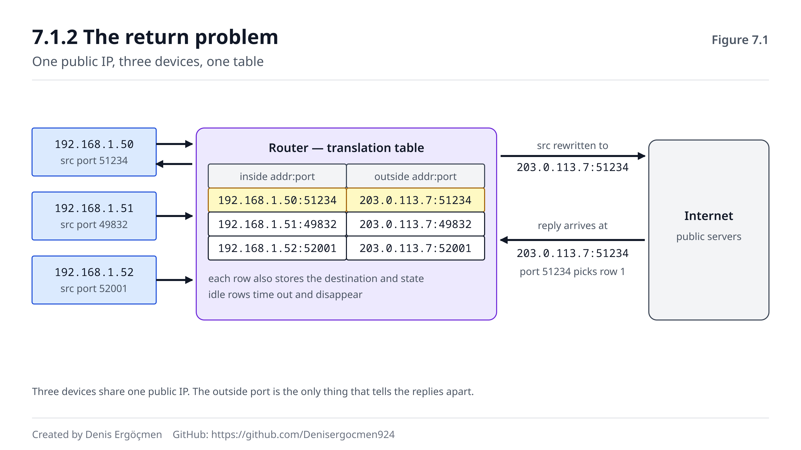

# Faz 7 — NAT ve Gerçek Dünya

> **Navigasyon:** [◀ Faz 6 — İsimden Adrese: DNS](Faz_6_DNS.md) · **Faz 7** · [Faz 8 — Uygulama Katmanı: HTTP + TLS ▶](Faz_8_HTTP_ve_TLS.md)

---

## Nereden geliyoruz

Faz 6'nın sonunda şunu sorduk: evindeki üç cihaz aynı anda aynı siteye bağlandı, üçünün de kaynak IP'si
**aynı public IP** ile değiştirildi, ve dönen üç cevabın hedef IP'si aynı. Router bu cevapları doğru
cihazlara **nasıl** dağıtıyor?

İpucunu da vermiştik: Faz 1.4.2'de bir bağlantıyı benzersiz kılan **dört şeyden** bahsetmiştik —
kaynak IP, kaynak port, hedef IP, hedef port. Router'ın elinde hâlâ değiştirebileceği bir alan var:
**kaynak port.** Bu fazın tamamı o fikrin üzerine kurulu.

Yanında getirdiklerin:

- **Private adresler internette yönlendirilemez** (1.3.2) — bu fazın var olma sebebi.
- **4-tuple bir bağlantıyı benzersiz kılar** (1.4.2) — NAT'ın çalışma prensibi.
- **Ephemeral portlar 32768–60999 arasıdır** (1.4.1) — router'ın kullandığı havuz.
- **MTU black hole** (5.7.3) — tünelleme bölümünde (7.4) eski dostunla yeniden karşılaşacaksın.

## Bu fazın sorusu

> *"Milyarlarca cihaz var ama IPv4'te sadece ~4 milyar adres var — ve çoğu zaten dağıtılmış. Bu kadar
> cihaz, bu kadar az adresle internete nasıl çıkıyor?"*

Cevap: **çıkmıyorlar.** En azından kendi adresleriyle çıkmıyorlar. Çıkışta adresleri **değiştiriliyor** ve
dönüşte geri çevriliyor. Bu çeviriye **NAT** denir (Network Address Translation) ve bugün gördüğün her
ev ağının, her ofis ağının ve her bulut VPC'sinin altında çalışır.

Bu faz aynı zamanda bir **kavram temizliği** fazıdır: "public IP", "private subnet", "internete
açık/kapalı" gibi bulutta her gün kullanacağın ifadelerin tam olarak ne anlama geldiğini burada
öğreneceksin. Bulutta yapılan mimari hataların büyük kısmı bu kavramların karıştırılmasından doğar.

---

## Bu fazın sonunda

- NAT'ın neden var olduğunu ve private→public çevirisinin nasıl çalıştığını anlatabileceksin
- Dönen trafiğin doğru cihaza nasıl eşlendiğini — çeviri tablosunun mantığını — açıklayabileceksin
- PAT (port bazlı çoklama) ile temel NAT arasındaki farkı bileceksin
- Port forwarding'in ne olduğunu ve NAT arkasındaki servise dışarıdan **neden** erişilemediğini anlatabileceksin
- **Cloud:** Internet Gateway ile NAT Gateway farkını — "public çıkış" ile "sadece giden trafik"
  ayrımını — net biçimde açıklayabileceksin
- Tünellemenin ne olduğunu, IPsec'in ne işe yaradığını ve tünelde MTU sorununun neden kaçınılmaz olduğunu
  bileceksin
- IPv6'da NAT'a neden çoğunlukla gerek olmadığını ve dual-stack'in ne getirdiğini anlatabileceksin

---

## Faz haritası

| Bölüm | Konu | Derinlik | Neden burada |
|---|---|---|---|
| 7.1 | NAT mantığı | `[mekanizma]` | Çeviri fikri ve dönüş problemi |
| 7.2 | PAT ve port forwarding | `[mekanizma]` | **Fazın kalbi** — port bazlı çoklama |
| 7.3 | Cloud NAT | `[kavram]` | IGW vs NAT GW — bulut mimarisinin temeli |
| 7.4 | VPN ve tünelleme | `[kavram]` | Paketi paketin içine koymak |
| 7.5 | IPv6 ve NAT'sız dünya | `[kavram]` | Gelecek ve dual-stack tuzakları |
| 7.6 | Bu faz bozulunca | — | NAT arıza imzaları |

> **Bu fazda nasıl çalışmalı:** Bu fazın deneyleri 🟢'dir ve en çarpıcısı tek satırdır:
> `curl ifconfig.me` — makinenin dışarıya **nasıl göründüğünü** söyler. Onu `ip addr` çıktısındaki kendi
> adresinle karşılaştırdığında NAT'ı gözünle görmüş olursun. Bu fazda kavramsal netlik, komut
> ezberinden daha önemlidir: özellikle 7.3'teki IGW/NAT GW ayrımını yüzeysel geçme — bulutta en sık
> yapılan mimari hata oradan çıkar. 7.4'te ise Faz 5.7'yi (MTU) yanında tut; ikisi birbirinin devamıdır.

---
---

# 7.1 NAT Mantığı

## 7.1.1 Çeviri fikri `[mekanizma]`

Evindeki bilgisayarın adresi `192.168.1.50`. Bu bir **private** adrestir (1.3.1) ve internette
yönlendirilemez — yoldaki ilk router onu düşürür.

Router şunu yapar: paketi dışarı çıkarmadan önce **kaynak IP alanını kendi public adresiyle değiştirir.**

```
Çıkarken:
  192.168.1.50:51234  →  93.184.216.34:443      (cihazın gördüğü)
  203.0.113.7:51234   →  93.184.216.34:443      (internetin gördüğü)
  └── router kaynak IP'yi kendi public adresiyle değiştirdi
```

Sunucu, cevabı `203.0.113.7`'ye gönderir — çünkü bildiği kaynak adres budur. Cevap router'a gelir.

Ve işte asıl problem burada başlar.

## 7.1.2 Dönüş problemi `[mekanizma]`

Router'ın elinde `203.0.113.7:51234` hedefli bir paket var. Bunu **hangi cihaza** verecek?

Cevap: router, çeviriyi yaparken bir **kayıt tutar.** Buna NAT tablosu (veya çeviri tablosu / bağlantı
takip tablosu) denir:

| İç adres:port | Dış adres:port | Hedef | Durum |
|---|---|---|---|
| 192.168.1.50:51234 | 203.0.113.7:51234 | 93.184.216.34:443 | ESTABLISHED |
| 192.168.1.51:49832 | 203.0.113.7:49832 | 93.184.216.34:443 | ESTABLISHED |
| 192.168.1.52:52001 | 203.0.113.7:52001 | 142.250.185.78:443 | ESTABLISHED |

Cevap geldiğinde router tabloya bakar, eşleşen satırı bulur, hedef IP'yi iç adresle **geri çevirir** ve
paketi doğru cihaza teslim eder.

Buradan üç önemli sonuç çıkar — ve üçü de sahada karşına çıkacak:

1. **NAT durumlu (stateful) bir mekanizmadır.** Router, açık bağlantıları hatırlamak zorundadır. Bu, Faz
   9'daki stateful firewall ile aynı fikirdir.
2. **Tablonun bir kapasitesi vardır.** Çok sayıda eşzamanlı bağlantı, tabloyu doldurabilir ve yeni
   bağlantılar kurulamaz.
3. **Kayıtların bir zaman aşımı vardır.** Uzun süre trafik görmeyen bir satır **silinir** — ve sonraki
   paket "bilinmeyen bağlantı" olarak reddedilir. Faz 5.6.1'de gördüğün "boştaki SSH oturumunun ölmesi"
   sorununun sebebi tam olarak budur.



Şekilde solda üç iç cihaz, ortada router ve çeviri tablosu, sağda internet var. Çıkış oklarında kaynak
adresin nasıl değiştiği, dönüş oklarında hangi alana bakılarak geri çevrildiği işaretli. Tablonun
kendisi şeklin merkezindedir — çünkü NAT'ın tamamı o tablodur.

> **🔧 Makinende gör** 🟢 — dışarıya nasıl göründüğünü öğren
>
> ```
> $ ip addr show | grep 'inet '
>     inet 127.0.0.1/8 scope host lo
>     inet 192.168.1.50/24 brd 192.168.1.255 scope global eth0   ← senin adresin
>
> $ curl -s ifconfig.me
> 203.0.113.7                                                     ← internetin gördüğü
> ```
>
> İki adres **farklıysa** NAT arkasındasın demektir — ki neredeyse kesinlikle öylesin. `curl ifconfig.me`
> aslında çok basit bir servistir: karşı taraf, gelen paketin **kaynak IP alanına** bakıp onu sana geri
> yazar. Yani sana "seni nasıl görüyorum" der. İki adres **aynıysa** makinenin doğrudan public IP'si var
> demektir (bulutta public subnet'teki bir instance veya bir sunucu). Bu tek karşılaştırma, NAT kavramını
> soyut olmaktan çıkarır.

> **⚠️ Yaygın yanılgı: "NAT bir güvenlik özelliğidir."**
>
> Kısmen doğru ama tehlikeli bir yarı-doğru. NAT'ın yan etkisi olarak dışarıdan içeriye **kendiliğinden**
> bağlantı kurulamaz (7.2.2) — çünkü çeviri tablosunda karşılığı yoktur. Bu bir koruma sağlar, ama
> **kasıtlı bir güvenlik mekanizması değildir**: NAT'ın amacı adres tasarrufudur. İçeriden dışarı kurulan
> her bağlantı tabloda bir delik açar ve o delik üzerinden gelen trafik içeri girer. Kötü amaçlı bir
> yazılım içeriden dışarı bağlantı kurarsa NAT onu hiç engellemez. Gerçek koruma **firewall
> kurallarıyla** sağlanır (Faz 9) — ve bulutta NAT Gateway'in security group'u bile yoktur (7.3.2).
> Doğru cümle şudur: *NAT dışarıdan içeriye istenmeyen bağlantıları zorlaştırır, ama bir güvenlik duvarı
> değildir.*

> **🤔 Düşün 7.1** — Ofiste yüzlerce kullanıcı tek bir public IP arkasından çıkıyor ve bir gün
> "bazı siteler açılmıyor, bazıları açılıyor, sürekli değişiyor" şikâyeti geliyor. Router'ın CPU'su
> normal, hat boş. (a) Muhtemel sebep ne? (b) Bu sebebin teknik sınırı nereden geliyor? (c) İki çözüm öner.
>
> *(Cevap: fazın sonunda)*

---
---

# 7.2 PAT ve Port Forwarding

## 7.2.1 Port bazlı çoklama `[mekanizma]`

7.1'de anlattığımız aslında **PAT**'tır (Port Address Translation) — evde ve ofiste kullanılan biçim.
Türkçe kaynaklarda buna genelde "NAT overload" veya sadece "NAT" denir; teknik olarak doğru adı PAT'tır.

Fark şudur:

- **Temel NAT (1:1):** Her iç adrese bir dış adres. Adres tasarrufu yok — sadece çeviri var. Bulutta
  Elastic IP ataması böyledir.
- **PAT (N:1):** Birçok iç adres, tek dış adres. Ayrım **port** ile yapılır.

PAT'ın kritik ayrıntısı şudur: iki cihaz **aynı kaynak portu** kullanırsa (ki olabilir — ephemeral port
seçimi rastgeledir, 1.4.1), router bunlardan birine **yeni bir dış port** atar:

```
192.168.1.50:51234  →  203.0.113.7:51234     (port aynı kaldı)
192.168.1.51:51234  →  203.0.113.7:62001     (çakışma! router yeni port atadı)
                                    └── artık ikisi ayırt edilebilir
```

Bu yüzden çeviri tablosunda hem iç hem dış port saklanır (7.1.2). Ve buradan doğal bir sınır çıkar:
**tek bir public IP arkasında en fazla ~64.000 eşzamanlı bağlantı** kurulabilir — çünkü port alanı
16 bittir (1.4.1). Pratikte bu sınır daha düşüktür.

## 7.2.2 Dışarıdan içeriye neden erişilemez `[kavram]`

Şimdi ters yönü düşün. İnternetteki biri, evindeki bilgisayara bağlanmak istiyor.

Elindeki tek adres `203.0.113.7` — router'ın adresi. Paket router'a gelir. Router tabloya bakar:
**bu bağlantı için bir kayıt yok.** Çünkü kayıtlar, **içeriden dışarı** çıkan bağlantılarla oluşur.

Router'ın yapabileceği tek şey paketi **düşürmektir.** Hangi cihaza vereceğini bilmiyor.

Bu, NAT'ın en önemli davranışsal sonucudur:

> **NAT arkasındaki bir servise dışarıdan kendiliğinden erişilemez — çünkü çeviri tablosunda karşılığı yoktur.**

Ve bu, "evimdeki sunucuya dışarıdan bağlanamıyorum" sorununun tek cümlelik cevabıdır.

## 7.2.3 Port forwarding: elle delik açmak `[kavram]`

Çözüm, tabloya **kalıcı bir satır** yazmaktır. Buna **port forwarding** (port yönlendirme) denir:

```
Kural: 203.0.113.7:8080  →  192.168.1.50:80
```

Router'a dersin ki: *"8080 portuna gelen her şeyi, hiçbir kayıt aramadan, şu iç adrese 80 portuna ilet."*
Artık dışarıdan `http://203.0.113.7:8080` çalışır.

Bilinmesi gerekenler:

- Kural **statiktir** — bağlantı olmasa da durur.
- Bir dış port, **tek bir** iç hedefe yönlendirilebilir. İki sunucun varsa iki farklı dış port gerekir.
- Bu, NAT'ın sağladığı örtülü korumayı o port için **kaldırır** — artık o servis internete açıktır ve
  güvenliği tamamen servisin kendisine ve firewall kurallarına kalmıştır (Faz 9).

Bulutta bu fikrin karşılığı doğrudan port forwarding değildir; **load balancer** (Faz 8.5) veya
**Elastic IP + security group** kullanılır. Ama mantık aynıdır: dışarıdan içeriye erişim, **açıkça
tanımlanmış** olmak zorundadır.

> **🤔 Düşün 7.2** — Evinde bir web sunucusu çalıştırıyorsun (`192.168.1.50:80`). Yerel ağdan
> `http://192.168.1.50` çalışıyor, ama arkadaşın dışarıdan `http://203.0.113.7` yazınca hiçbir şey
> olmuyor. (a) Neden? (b) Çözüm ne? (c) Çözümü uyguladıktan sonra hangi yeni sorumluluğu üstlenmiş
> olursun?
>
> *(Cevap: fazın sonunda)*

---
---

# 7.3 Cloud NAT

Bu bölüm, bulut ağ mimarisinin en çok karıştırılan ayrımını içerir. Dikkatle oku — bulutta yapılan
güvenlik hatalarının büyük kısmı buradan doğar.

## 7.3.1 Public subnet, private subnet `[kavram]`

Önce bir kavram temizliği. Bulutta "public subnet" ve "private subnet" diye iki terim duyarsın. Bunlar
**subnet'in bir özelliği değildir** — ikisi de sıradan subnet'tir (Faz 2). Fark tek bir şeydedir:

> **Route table'ında `0.0.0.0/0 → Internet Gateway` satırı varsa o subnet "public"tir. Yoksa "private"dır.**

Yani ayrım, Faz 4.2'de öğrendiğin **routing tablosundadır**. Başka hiçbir yerde değil. Bu tek cümle,
bulut ağında çok şeyi yerine oturtur.

## 7.3.2 IGW vs NAT Gateway `[kavram]`

İki farklı bileşen, iki farklı iş:

| | **Internet Gateway (IGW)** | **NAT Gateway** |
|---|---|---|
| Nerede durur | VPC'ye bağlanır | Bir **public** subnet'te durur |
| Ne yapar | Public IP'si olan kaynaklarla internet arasında yol açar | Private IP'leri kendi public IP'siyle çevirir |
| Giden trafik | ✅ | ✅ |
| **Gelen (başlatılan) trafik** | ✅ (public IP varsa) | ❌ **asla** |
| Kimin için | Public subnet'teki, **public IP'si olan** kaynaklar | Private subnet'teki kaynaklar |

En kritik satır kalın olan: **NAT Gateway üzerinden dışarıdan içeriye bağlantı kurulamaz.** Sadece
içeriden başlatılan bağlantıların cevapları döner (7.2.2 — aynı mekanizma). Bu bir eksiklik değil,
**tasarımın amacıdır**: private subnet'teki bir veritabanı güncelleme indirebilmeli ama internetten
erişilememelidir.

Ve sık yapılan bir hatayı burada engelle: **IGW tek başına yeterli değildir.** Bir instance'ın internete
çıkabilmesi için üç şey birden gerekir:

1. Subnet'in route table'ında `0.0.0.0/0 → igw-...` satırı (7.3.1)
2. Instance'ın bir **public IP** veya Elastic IP'si (public IP yoksa IGW onu dışarı çıkaramaz — çevirecek
   bir adres yoktur)
3. Security group ve NACL'in izin vermesi (Faz 9)

Üçünden biri eksikse "internete çıkamıyorum" sorunu yaşarsın — ve bu, bulutta en çok teşhis edilen
sorunlardan biridir.

## 7.3.3 Tipik mimari `[kavram]`

Standart bir VPC şöyle kurulur:

```
VPC 10.0.0.0/16
│
├── Public subnet  10.0.1.0/24
│     route: 0.0.0.0/0 → IGW
│     içinde: ALB, bastion host, ve NAT Gateway (Elastic IP ile)
│
└── Private subnet 10.0.2.0/24
      route: 0.0.0.0/0 → NAT Gateway
      içinde: uygulama sunucuları, veritabanı
```

Private subnet'teki bir sunucu `apt update` çalıştırdığında: paket NAT Gateway'e gider (route table),
NAT GW kaynak IP'yi kendi Elastic IP'siyle değiştirir (7.1.1), IGW üzerinden çıkar, cevap aynı yoldan
döner. Dışarıdan o sunucuya **hiç kimse** bağlanamaz.

> **💡 Cloud bağlantısı — NAT Gateway'in maliyeti ve VPC Endpoint:** NAT Gateway saatlik ücret **ve**
> üzerinden geçen her GB için veri işleme ücreti alır. Private subnet'teki yüzlerce instance S3'e büyük
> veri yazıyorsa, bu trafiğin tamamı NAT Gateway'den geçer ve fatura hızla büyür — üstelik trafik AWS'in
> kendi içinde kalmasına rağmen. Çözüm **VPC Endpoint**'tir: S3, DynamoDB gibi servislere VPC içinden,
> internete hiç çıkmadan erişim sağlar. Gateway tipi endpoint (S3, DynamoDB) **route table'a bir satır
> ekler** — yani Faz 4.2'deki mekanizmanın ta kendisi; Interface tipi endpoint (PrivateLink) ise
> subnet'e bir ENI koyar ve servise **private bir IP** verir. İkisi de NAT Gateway'i devre dışı bırakır,
> maliyeti düşürür ve trafiği internetten uzak tutar. Teşhiste bilinmesi gereken: bir endpoint
> tanımlandıktan sonra o servise giden trafik **artık NAT GW'den geçmez** — route table değişmiştir
> (Faz 11.8).

> **🤔 Düşün 7.3** — Private subnet'teki bir EC2 instance'ından `apt update` çalışmıyor. Route
> table'da `0.0.0.0/0 → nat-...` satırı var, NAT Gateway ayakta ve public subnet'te. (a) Üç muhtemel
> sebep yaz. (b) NAT Gateway'in bulunduğu subnet'in route table'ında ne olmalı? (c) Bu instance'a
> dışarıdan SSH ile bağlanabilir misin — neden?
>
> *(Cevap: fazın sonunda)*

---
---

# 7.4 VPN ve Tünelleme

## 7.4.1 Tünelleme: paketi paketin içine koymak `[kavram]`

İki private ağı (örneğin ofisin ve VPC'n) birbirine bağlamak istiyorsun. Ama aralarında **internet** var
ve private adresler internette yönlendirilemez (1.3.2).

Çözüm şaşırtıcı derecede basittir: **private paketi, public bir paketin içine koy.**

```
[ Public IP header ] [ Şifreleme ] [ Private IP header ] [ TCP ] [ veri ]
 └── internet bunu görür ──┘        └── sadece uçlar bunu görür ──┘
```

Buna **tünelleme** (tunneling) denir. Dıştaki paket iki public adres arasında normal biçimde
yönlendirilir; yoldaki router'lar içeride ne olduğunu bilmez ve umursamaz. Hedefe varınca dış zarf
soyulur ve içteki private paket, sanki hiç internetten geçmemiş gibi yoluna devam eder.

Bunu Faz 0.2'de öğrendiğin **kapsülleme** fikrinin bir katman daha uygulanmışı olarak düşün: her katman
kendi zarfını ekler; tünelleme, **tüm bir paketi** yeni bir zarfın içine koyar.

Tünel çeşitleri:

| Ad | Ne yapar | Derinlik |
|---|---|---|
| **IPsec** (*ay-pi-sek*) | Şifreli tünel — iki private ağı güvenle bağlar | `[kavram]` |
| **GRE** (*ci-ar-i*) | Genel amaçlı, **şifresiz** tünel | `[atla]` — adını bil |
| **VXLAN** (*vi-eks-lan*) | L2'yi L3 üstünde taşıyan overlay | `[atla]` — adını bil |
| **WireGuard / OpenVPN** | Modern uzaktan erişim VPN'leri | `[kavram]` |

IPsec'in iki işi vardır ve karıştırma: **şifreleme** (içeriği gizler) ve **kimlik doğrulama** (karşı
tarafın gerçekten o olduğunu kanıtlar). GRE'de ikisi de yoktur — GRE sadece taşır; güvenlik isteniyorsa
genellikle IPsec ile birlikte kullanılır.

## 7.4.2 Tünelin bedeli: MTU `[mekanizma]`

Ve işte Faz 5.7'de tanıştığın sorun, tam burada patlar.

Dış zarf **yer kaplar.** IPsec'in eklediği başlıklar ve şifreleme payı tipik olarak 50–100 bayt arasıdır.
Yani:

```
Normal:  1500 bayt MTU  →  1460 bayt veri (MSS)
Tünelde: 1500 bayt MTU  →  ~1400 veya daha az veri
         └── dış header + şifreleme payı burayı yedi
```

Eğer uçlardaki makineler bunu bilmiyorsa — ki varsayılan olarak bilmezler — 1500 baytlık paketler
göndermeye devam ederler. Tünel girişinde bu paketler **sığmaz**, düşürülür, ve göndericiye
**ICMP Fragmentation Needed** yollanması gerekir (4.4.2). O ICMP engelliyse: **MTU black hole** (5.7.3).

Belirtisi yine aynıdır ve artık tanıyorsun:

> **Ping çalışır, SSH bağlanır, ama büyük veri transferi donar.**

İki çözüm (5.7.3'te gördüklerinin aynısı): **MSS clamping** (tünel cihazı SYN paketlerindeki MSS'i düşürür
— VPN cihazlarında standart bir ayardır ve genelde varsayılan olarak açık olmalıdır) veya **ICMP tip 3
kod 4'e izin vermek** (path MTU keşfi kendiliğinden çalışır).

Bu yüzden bu iki faz birbirinin devamıdır: **tünel kurdun mu, MTU'yu düşün.**

> **💡 Cloud bağlantısı — Site-to-Site VPN ve route öğrenme:** AWS'te ofis ağını VPC'ye bağlamanın
> standart yolu **Site-to-Site VPN**'dir ve altında IPsec çalışır. Kurulumda üç parça vardır: VPC
> tarafında **Virtual Private Gateway** (veya Transit Gateway), ofis tarafında **Customer Gateway**, ve
> ikisi arasında iki **tünel** (yedeklilik için daima iki tane kurulur). Route'ların nasıl öğrenileceği
> iki seçenektir: **statik** (elle yazarsın) veya **BGP** ile dinamik (Faz 4.6) — ikincisi tercih edilir,
> çünkü bir tünel düştüğünde trafik diğerine kendiliğinden kayar. Ve kurulumdan sonra ilk karşılaşacağın
> sorun büyük ihtimalle MTU olacaktır (7.4.2): tünel ayakta, ping çalışıyor, ama veritabanı sorguları
> donuyor. Daha yüksek bant genişliği ve kararlı gecikme gerekiyorsa **Direct Connect** (özel fiziksel
> hat) kullanılır; o da BGP ile route öğrenir. Birden fazla VPC ve ofisi bağlamak gerekiyorsa her çifti
> tek tek eşlemek yerine **Transit Gateway** kullanılır — yıldız topolojide merkezî bir yönlendirici
> gibi çalışır (Faz 11.7).

> **🤔 Düşün 7.4** — Yeni kurulan bir Site-to-Site VPN üzerinden ofisten VPC'deki bir dosya sunucusuna
> bağlanılıyor. `ping` çalışıyor, dizin listesi geliyor, ama 10 MB'lık bir dosya indirilmeye başlayınca
> transfer %2'de donuyor. (a) Teşhisin ne ve neden bu kadar eminsin? (b) Hangi komutla doğrularsın?
> (c) VPN cihazında hangi ayar bunu kalıcı çözer?
>
> *(Cevap: fazın sonunda)*

---
---

# 7.5 IPv6 ve NAT'sız Dünya

## 7.5.1 Bolluk, kıtlığın çözümü `[kavram]`

NAT'ın var olma sebebi **adres kıtlığıydı** (7.1). IPv6'da bu sorun yoktur.

IPv4: 32 bit → ~4.3 milyar adres.
IPv6: 128 bit → pratikte tükenmesi imkânsız bir sayı (1.5).

Sonuç: IPv6'da **her cihaz kendi public adresini alabilir.** Çeviriye gerek yoktur. Bu üç şeyi getirir:

1. **Uçtan uca bağlantı geri gelir.** Cihazlar birbirine doğrudan ulaşabilir; NAT'ın bozduğu protokoller
   (peer-to-peer uygulamalar, bazı VoIP protokolleri) düzgün çalışır.
2. **Çeviri tablosu yoktur** — dolma, zaman aşımı, port tükenmesi sorunları ortadan kalkar (7.1.2).
3. **Güvenlik tamamen firewall'ın işi olur.** NAT'ın örtülü koruması yoktur (7.1.2 kutusu) — her cihaz
   teorik olarak ulaşılabilirdir, bu yüzden **firewall kuralları zorunludur** (Faz 9). Bu bir zayıflık
   değil, sorumluluğun doğru yere taşınmasıdır.

## 7.5.2 Dual-stack ve tuzağı `[kavram]`

Geçiş bir günde olmadı ve olmayacak. Bu yüzden çoğu sistem **dual-stack** çalışır: IPv4 ve IPv6'yı
**aynı anda** konuşur. Bir isim sorgulandığında hem A hem AAAA kaydı dönebilir (6.3.1) ve istemci
birini seçer.

Ve tuzak tam burada: **uygulama yanlış aileyi seçerse**, belirti şudur:

> **"Bir protokolde çalışıyor, diğerinde takılıyor."**

Tipik senaryo: sunucu AAAA kaydı yayınlıyor, istemci IPv6'yı tercih ediyor (modern sistemlerin
varsayılanı budur), ama yoldaki IPv6 bağlantısı bozuk veya firewall IPv6'yı hiç düşünmemiş. İstemci
IPv6'yı dener, timeout bekler, sonra IPv4'e düşer — kullanıcı bunu **"site çok yavaş açılıyor"** diye
yaşar. (Modern istemciler bunu **Happy Eyeballs** adlı bir yöntemle hafifletir: iki aileyi neredeyse
aynı anda dener ve ilk cevap vereni kullanır.)

Teşhiste refleks basittir: `curl -4` ve `curl -6` ile **iki aileyi ayrı ayrı test et.** Biri çalışıp
diğeri çalışmıyorsa sorunu bulmuşsun demektir.

> **💡 Cloud bağlantısı — dual-stack VPC ve egress-only IGW:** AWS'te bir VPC'ye IPv6 bloğu
> ekleyebilirsin ve subnet'ler dual-stack çalışır. Ama burada bir kavram farkı vardır: IPv6'da NAT
> olmadığı için "private subnet" fikri de farklı çalışır — her instance'ın public IPv6 adresi olabilir.
> Yine de "sadece giden trafik" istiyorsan (private subnet'in IPv6 karşılığı) **egress-only Internet
> Gateway** kullanılır: NAT Gateway'in IPv6 eşdeğeridir, adres çevirmez ama **dışarıdan başlatılan
> bağlantıları engeller** (7.3.2'deki aynı mantık, çevirisiz hâli). Ayrıca security group ve NACL
> kurallarını **iki aile için ayrı ayrı** yazman gerekir — `0.0.0.0/0` IPv6'yı kapsamaz, `::/0` ayrı
> yazılmalıdır. Bulutta "IPv4'te çalışıyor IPv6'da çalışmıyor" sorunlarının en yaygın sebebi tam olarak
> budur: unutulmuş bir `::/0` kuralı (Faz 9.4).

---
---

# 7.6 Bu Faz Bozulunca — NAT Arıza İmzaları

NAT arızalarının ortak teması şudur: **çeviri tablosu.** Tablo dolar, tablo unutur, veya tabloda hiç
kayıt yoktur. Üç durumun da farklı bir imzası vardır ve hepsi bu tabloya çıkar.

| Belirti | Muhtemel sebep | Doğrula | İlgili bölüm |
|---|---|---|---|
| Dışarıdan iç servise erişilemiyor | NAT tablosunda kayıt yok — normal davranış | Port forwarding/LB tanımlı mı | 7.2.2 |
| Boştaki bağlantılar bir süre sonra kopuyor | NAT oturum zaman aşımı | Keepalive ekle, RST kaynağını bul | 7.1.2, 5.6.1 |
| Yoğun saatlerde rastgele bağlantı hataları | NAT tablosu/port havuzu dolmuş | Eşzamanlı bağlantı sayısı, ek public IP | 7.2.1 |
| `curl ifconfig.me` ≠ `ip addr` | **Normal** — NAT arkasındasın | — | 7.1.1 |
| Public IP'li instance internete çıkamıyor | Route table'da IGW yok, veya public IP yok, veya SG | Üç şartı tek tek kontrol et | 7.3.2 |
| Private instance internete çıkamıyor | Route `0.0.0.0/0 → nat-...` yok, veya NAT GW private subnet'te | NAT GW'nin subnet route table'ı | 7.3.3 |
| NAT Gateway ayakta ama trafik geçmiyor | NAT GW'nin subnet'inde IGW route'u yok | O subnet public olmalı | 7.3.2 |
| VPN tüneli ayakta, ping ✓, transfer donuyor | **Tünel MTU'su** — MTU black hole | `ping -M do -s 1472` | 7.4.2, 5.7.3 |
| VPN kurulu ama bazı subnet'lere ulaşılmıyor | Route öğrenilmemiş (statik eksik / BGP yok) | Route table, BGP komşuluğu | 7.4.2, 4.6 |
| IPv4'te çalışıyor, IPv6'da çalışmıyor | Dual-stack — eksik `::/0` kuralı veya bozuk IPv6 yolu | `curl -4` vs `curl -6` | 7.5.2 |
| Site yavaş açılıyor, sonra normal | IPv6 deneniyor, timeout, IPv4'e düşüyor | `curl -6` ile doğrudan test | 7.5.2 |
| S3'e yazınca fatura patlıyor | Trafik NAT Gateway üzerinden gidiyor | VPC Endpoint tanımla | 7.3.3 |

> **Bu tablodan çıkan ders:** NAT teşhisinde önce şunu sor: **bağlantıyı kim başlattı?** İçeriden
> başlatıldıysa çeviri tablosunda bir satır **vardır** ve dönüş çalışmalıdır — çalışmıyorsa ya satır
> zaman aşımına uğramıştır (7.1.2) ya tablo dolmuştur (7.2.1). Dışarıdan başlatıldıysa satır **yoktur**
> ve paket düşer; bu bir arıza değil, **tasarımdır** (7.2.2) — çözümü açıkça tanımlanmış bir giriş
> noktasıdır (port forwarding, load balancer, Elastic IP). Bulutta ise ikinci soru şudur: **route
> table'da ne yazıyor?** "Public subnet" ve "private subnet" subnet'in kendi özelliği değil, route
> table'ının içeriğidir (7.3.1) — ve "internete çıkamıyorum" sorunlarının çoğu orada, tek bir eksik
> satırda çözülür. Son olarak: **tünel kurduysan MTU'yu düşün** (7.4.2). "Ping çalışıyor ama transfer
> donuyor" cümlesini duyduğun anda, VPN'in yeni kurulmuş olması teşhisi neredeyse kesinleştirir.

---
---

# Faz 7 — Düşün sorularının cevapları

## Cevap 7.1 — Port havuzu tükeniyor

(a) **NAT/PAT port havuzunun tükenmesi** (7.2.1). Yüzlerce kullanıcı tek public IP arkasındaysa ve her
kullanıcı onlarca eşzamanlı bağlantı açıyorsa (modern bir web sayfası tek başına 20–50 bağlantı açabilir),
toplam eşzamanlı bağlantı sayısı port havuzunu doldurur. Router yeni bir çeviri satırı oluşturamaz ve
bağlantı **sessizce** başarısız olur. "Rastgele ve değişken" olması tipik imzadır: hangi bağlantının
başarısız olacağı o anda havuzda yer olup olmamasına bağlıdır.

(b) **Port alanı 16 bittir** (1.4.1) — tek bir public IP arkasında teorik olarak ~65.000 eşzamanlı
çeviri yapılabilir. Pratikte daha azdır: bir kısmı rezervedir, ve kapanan bağlantıların satırları bir
süre tabloda bekler (TIME_WAIT benzeri bir gecikme, 5.6.1). Ayrıca router'ın tablo kapasitesi de ayrı
bir sınırdır.

(c) İki çözüm: (i) **Public IP havuzunu genişlet** — birden fazla public IP tanımla, router bunları
sırayla kullansın; her ek adres ~65.000 çeviri daha demektir. (ii) **Bağlantı sayısını azalt** —
uygulama seviyesinde connection pooling / keep-alive kullanımını yaygınlaştır, ve NAT zaman aşımı
sürelerini kısalt ki kullanılmayan satırlar daha hızlı serbest kalsın. (Bulutta aynı sorunun karşılığı:
tek NAT Gateway'in port sınırına dayanmak — çözümü birden fazla NAT Gateway veya ek Elastic IP.)
**İlgili bölüm:** 7.1.2, 7.2.1 · **Devamı:** Faz 9.1 (stateful tablo), Faz 10.4 (kapasite teşhisi).

## Cevap 7.2 — Tabloda kayıt yok

(a) Çünkü arkadaşının paketi **dışarıdan içeriye** geliyor ve router'ın çeviri tablosunda bu bağlantı
için bir kayıt **yok** (7.2.2). Kayıtlar yalnızca **içeriden dışarı** çıkan bağlantılarla oluşur. Router
paketi hangi iç cihaza vereceğini bilemez ve **düşürür**.

(b) **Port forwarding** (7.2.3): router'a kalıcı bir kural yaz — `203.0.113.7:80 → 192.168.1.50:80`.
Artık o porta gelen her paket, kayıt aranmadan doğrudan o iç adrese iletilir. (Alternatifler: bir reverse
proxy/tünel servisi kullanmak, veya sunucuyu buluta taşıyıp public IP vermek.)

(c) **Güvenlik sorumluluğunu.** Port forwarding, NAT'ın sağladığı örtülü korumayı o port için **kaldırır**
(7.1.2 kutusu). Artık o servis tüm internete açıktır: otomatik tarayıcılar dakikalar içinde onu bulur.
Sorumluluğun: servisi güncel tutmak, kimlik doğrulama koymak, gereksiz özellikleri kapatmak ve mümkünse
bir firewall kuralı ile kaynak adresleri kısıtlamak (Faz 9). NAT seni koruyordu; artık korumuyor.
**İlgili bölüm:** 7.2.2-7.2.3 · **Devamı:** Faz 9.2 (kural yazımı), Faz 8.5 (reverse proxy).

## Cevap 7.3 — NAT Gateway'in kendi yolu

(a) Üç sebep: (i) **NAT Gateway'in bulunduğu subnet'in route table'ında `0.0.0.0/0 → IGW` yok** — NAT GW
public bir subnet'te olmak zorundadır, yoksa kendisi internete çıkamaz ve hiçbir şey geçmez (7.3.2).
(ii) **Security group veya NACL** giden trafiği (veya dönen trafiği — NACL stateless'tır) engelliyor
(Faz 9). (iii) **DNS çözülmüyor** — `apt update` isim çözümlemesi gerektirir; VPC resolver'a
erişilemiyorsa NAT sağlam olsa da komut başarısız olur (6.5, 6.3.3). Dördüncü bir ihtimal: NAT
Gateway'in **Elastic IP'si yok** veya farklı bir AZ'de ve çapraz-AZ yolu düşmüş.

(b) NAT Gateway'in subnet'i **public** olmalıdır: route table'ında **`0.0.0.0/0 → igw-...`** satırı
bulunmalıdır (7.3.1, 7.3.3). Bu, en sık yapılan kurulum hatasıdır — NAT Gateway private subnet'e
konulursa hiçbir şey çalışmaz.

(c) **Hayır.** NAT Gateway **asla** dışarıdan başlatılan bağlantıyı içeri geçirmez (7.3.2) — çeviri
tablosunda karşılığı yoktur (7.2.2, aynı mekanizma). Bu bir arıza değil, tasarımın amacıdır. Bağlanmak
için ya public subnet'teki bir **bastion host** üzerinden atlarsın, ya da **SSM Session Manager** gibi
ters bağlantı kuran bir servis kullanırsın (instance kendisi dışarı bağlanır, sen o oturuma katılırsın —
hiçbir giriş portu açılmaz).
**İlgili bölüm:** 7.3.1-7.3.3 · **Devamı:** Faz 9.4 (SG vs NACL), Faz 11.4 (IGW/NAT GW eşlemesi).

## Cevap 7.4 — Tünel + MTU = klasik

(a) **MTU black hole** (7.4.2, 5.7.3). Bu kadar emin olmanın sebebi **imzanın tam oturmasıdır**: küçük
paketler geçiyor (ping ✓, dizin listesi = küçük veri ✓), büyük paketler geçmiyor (dosya transferi ✗).
Üstelik VPN **yeni kurulmuş** — IPsec'in eklediği 50–100 baytlık başlık, path MTU'yu 1500'ün altına
indirmiştir ve uçlar bunu bilmiyor. Transferin "%2'de donması" da tipiktir: ilk küçük paketler geçer,
pencere büyüyüp tam boyutlu segmentler gönderilmeye başlayınca akış durur (5.5.1).

(b) **`ping -M do -s 1472 <hedef>`** (5.7.3). Tünel üzerinden bu geçmiyorsa path MTU 1500'ün altındadır.
Boyutu azaltarak geçen en büyük değeri bul, +28 ekle — tünelin gerçek MTU'sunu bulmuş olursun (tipik
olarak 1400 civarı çıkar). Ek doğrulama: `ss -ti` çıktısında `retrans` değerinin transfer sırasında
hızla artması (5.3.2).

(c) **MSS clamping** (*TCP MSS adjust* veya *clamp MSS to PMTU* adlarıyla geçer). VPN cihazı, tünelden
geçen SYN paketlerindeki MSS değerini tünel MTU'suna göre düşürür (5.7.2); böylece iki uç **baştan**
küçük segment kullanmayı kabul eder ve büyük paket hiç oluşmaz. Bu ayar çoğu VPN cihazında bulunur ve
tünel kurulumunun **standart parçası** sayılmalıdır. Tamamlayıcı önlem: **ICMP tip 3 kod 4'e izin
vermek** (4.4.2), böylece path MTU keşfi de çalışır. İkisi birlikte uygulanır.
**İlgili bölüm:** 7.4.2 · **Devamı:** Faz 9.3 (ICMP politikası), Faz 10.3 (katman katman teşhis).

---
---

# Faz 7 — Sık sorulan sorular

**S1 — NAT ile PAT arasındaki fark tam olarak nedir?** **NAT (1:1)** her iç adrese bir dış adres eşler —
adres tasarrufu yoktur, sadece çeviri vardır (bulutta Elastic IP ataması böyledir). **PAT (N:1)** birçok
iç adresi tek dış adrese sıkıştırır ve ayrımı **port** ile yapar (7.2.1). Günlük dilde "NAT" denince
neredeyse her zaman PAT kastedilir.

**S2 — NAT güvenlik sağlar mı?** Yan etki olarak dışarıdan içeriye kendiliğinden bağlantı kurulamaz
(7.2.2), ama bu **kasıtlı bir güvenlik mekanizması değildir**. İçeriden dışarı kurulan her bağlantı bir
delik açar ve kötü amaçlı yazılım bunu serbestçe kullanır. Gerçek koruma firewall kurallarıyla sağlanır
(Faz 9). Doğru cümle: *NAT zorlaştırır, korumaz.*

**S3 — Neden bazı uygulamalar NAT arkasında çalışmıyor?** Çünkü bazı protokoller, paketin **içinde** IP
adresi taşır (eski FTP, bazı VoIP/SIP protokolleri) veya karşı tarafın kendilerine **bağlantı
başlatmasını** bekler. NAT dıştaki adresi değiştirir ama içteki bilgiyi bilmez, ve dışarıdan gelen
bağlantıyı da kabul etmez. Bu yüzden özel "NAT traversal" yöntemleri (STUN/TURN, UPnP, hole punching)
geliştirilmiştir. IPv6'da bu sorun büyük ölçüde ortadan kalkar (7.5.1).

**S4 — NAT Gateway ile NAT instance arasındaki fark ne?** NAT Gateway AWS'in yönettiği, ölçeklenen ve
yüksek erişilebilir bir servistir. NAT instance ise NAT yapacak şekilde yapılandırılmış sıradan bir
EC2'dir — ucuzdur ama tek başınadır (kendisi arızalanırsa çıkış durur), ölçeklenmesi senin işindir ve
"source/destination check" ayarını kapatmayı unutursan hiç çalışmaz. Üretimde NAT Gateway tercih edilir.

**S5 — Private subnet'teki bir instance'a nasıl bağlanırım?** Üç yol: (i) public subnet'teki bir
**bastion host** üzerinden SSH atlaması; (ii) **SSM Session Manager** — instance kendisi dışarı bağlanır,
hiçbir giriş portu açılmaz (en güvenli ve bugün tercih edilen yol); (iii) VPN veya Direct Connect ile
ofis ağını VPC'ye bağlayıp private IP üzerinden doğrudan erişmek (7.4.2 kutusu).

**S6 — Tünelde neden hep MTU sorunu çıkıyor?** Çünkü tünel, **tüm bir paketi** yeni bir zarfın içine
koyar (7.4.1) ve o zarf yer kaplar. Uçlardaki makineler tünelin varlığından habersizdir; hâlâ 1500 bayt
gönderirler. Bilgilendirme kanalı ICMP'dir ve ICMP sık sık engellenir (5.7.3). Bu yüzden MSS clamping,
tünel kurulumunun standart parçası sayılmalıdır (7.4.2).

**S7 — IPv6'ya geçince NAT tamamen ortadan kalkacak mı?** Büyük ölçüde evet — adres kıtlığı olmadığı
için çeviriye gerek yoktur (7.5.1). Ama "sadece giden trafik" ihtiyacı devam eder, ve bunun karşılığı
çeviri değil **filtrelemedir** (AWS'te egress-only Internet Gateway, 7.5.2 kutusu). Yani NAT gider,
firewall kalır — ve sorumluluk doğru yere, açık kurallara taşınmış olur.

---
---

# Faz 7 — Kendini sına

Cevaplarını bir kâğıda yaz, sonra cevap anahtarıyla karşılaştır. Hedef: 18 sorudan 14+.

## Bölüm A — Tanım ve mekanizma

1. NAT neden icat edildi? Hangi somut kısıt bunu gerektirdi?
2. Router, dönen bir cevabı doğru iç cihaza nasıl eşler? Hangi yapıyı kullanır?
3. NAT (1:1) ile PAT (N:1) arasındaki fark nedir?
4. Tek bir public IP arkasında kaç eşzamanlı bağlantı kurulabilir ve bu sınır nereden geliyor?
5. Port forwarding nedir ve normal NAT kaydından farkı ne?
6. Tünelleme nedir? Bir cümleyle tarif et.
7. IPsec'in iki işi nedir? GRE'den farkı ne?
8. Dual-stack ne demektir?

## Bölüm B — Uygula ve teşhis et

9. Hangi tek komutla makinenin dışarıya nasıl göründüğünü öğrenirsin?
10. Bulutta bir subnet'in "public" olduğunu nereden anlarsın?
11. Public IP'li bir instance internete çıkamıyor. Kontrol etmen gereken üç şey ne?
12. Private subnet'teki instance internete çıkamıyor, route'ta `0.0.0.0/0 → nat-...` var. Sırada ne bakarsın?
13. Yeni VPN kuruldu, ping ✓, dosya transferi ✗. Teşhis ve doğrulama komutu?
14. "IPv4'te çalışıyor IPv6'da çalışmıyor" — ilk iki komutun ne?

## Bölüm C — Muhakeme ve bağlantı

15. "NAT bir güvenlik duvarıdır" cümlesi neden yanlış? Doğrusu nasıl kurulur?
16. NAT Gateway üzerinden dışarıdan içeriye bağlantı kurulamamasının sebebi bir eksiklik mi, tasarım mı?
    Mekanizmayla açıkla.
17. Tünelde MTU sorununun **kaçınılmaz** olmasının sebebi nedir? Hangi iki önlem alınır?
18. IPv6'ya geçildiğinde NAT'ın hangi işlevi ortadan kalkar, hangi ihtiyaç devam eder?

---

## Cevap anahtarı

1. **IPv4 adres kıtlığı** — 32 bit, ~4.3 milyar adres, milyarlarca cihaz. Private adresler internette
   yönlendirilemediği için (1.3.2) çıkışta çeviri gerekti (7.1.1). — 2. **Çeviri tablosuna** (NAT/bağlantı
   takip tablosu) bakarak: iç adres:port ↔ dış adres:port ↔ hedef eşleşmesini saklar, dönen pakette
   hedef alanına bakıp satırı bulur ve geri çevirir (7.1.2). — 3. **NAT (1:1):** her iç adrese bir dış
   adres, tasarruf yok. **PAT (N:1):** birçok iç adres tek dış adres, ayrım **port** ile (7.2.1). —
   4. Teorik ~65.000 (pratikte daha az); sınır **port alanının 16 bit** olmasından gelir (1.4.1, 7.2.1).
   — 5. Çeviri tablosuna elle yazılmış **kalıcı ve statik** bir satır: belirli bir dış porta gelen her
   paketi, kayıt aramadan belirli bir iç hedefe iletir. Normal kayıtlar içeriden dışarı çıkışla **geçici**
   olarak oluşur (7.2.3). — 6. Bir paketi (başlıklarıyla birlikte) **başka bir paketin içine koyup**
   public internetten geçirmek; hedefte dış zarf soyulur (7.4.1). — 7. IPsec: **şifreleme** (içeriği
   gizler) + **kimlik doğrulama** (karşı tarafı kanıtlar). GRE'de ikisi de yoktur, sadece taşır (7.4.1).
   — 8. IPv4 ve IPv6'yı **aynı anda** konuşmak; bir isim için hem A hem AAAA dönebilir (7.5.2).

9. **`curl ifconfig.me`** — çıkan adresi `ip addr` ile karşılaştır (7.1.1). — 10. **Route table'ında
   `0.0.0.0/0 → Internet Gateway` satırı varsa** public'tir. Subnet'in kendi özelliği değildir (7.3.1).
   — 11. (i) Route table'da `0.0.0.0/0 → igw-...`; (ii) instance'ın **public/Elastic IP'si** var mı;
   (iii) security group ve NACL izin veriyor mu (7.3.2). — 12. **NAT Gateway'in bulunduğu subnet'in route
   table'ına** — orada `0.0.0.0/0 → igw-...` olmalı, yani NAT GW public subnet'te durmalı (7.3.2, 7.3.3).
   Sonra SG/NACL ve DNS. — 13. **MTU black hole**; doğrulama: **`ping -M do -s 1472 <hedef>`** (7.4.2,
   5.7.3). — 14. **`curl -4 <hedef>`** ve **`curl -6 <hedef>`** — iki aileyi ayrı ayrı test et (7.5.2).

15. Çünkü NAT'ın amacı **adres tasarrufudur**; dışarıdan bağlantı kurulamaması bir **yan etkidir**
    (7.1.2 kutusu). İçeriden dışarı kurulan her bağlantı tabloda bir delik açar ve o delikten gelen
    trafik içeri girer; kötü amaçlı yazılım bunu serbestçe kullanır. Doğru kurulum: erişim kararları
    **açık firewall kurallarıyla** verilir (Faz 9), NAT sadece çeviri yapar. — 16. **Tasarım.** NAT
    Gateway'in çeviri tablosunda yalnızca **içeriden başlatılan** bağlantıların kaydı vardır; dışarıdan
    gelen bir pakete karşılık gelen satır olmadığı için hangi iç adrese verileceği bilinemez ve paket
    düşer (7.2.2, 7.3.2). Amaç zaten budur: private kaynaklar güncelleme indirebilsin ama internetten
    erişilemesin. — 17. Çünkü tünel, tüm paketi yeni bir zarfa koyar ve zarf **yer kaplar** (50–100 bayt);
    uçlar tünelden habersizdir ve hâlâ 1500 bayt gönderir. Bilgilendirme kanalı ICMP'dir ve sık sık
    engellenir (5.7.3). İki önlem: **MSS clamping** ve **ICMP tip 3 kod 4'e izin** (7.4.2). — 18.
    Ortadan kalkan: **adres çevirisi** — adres bolluğu sayesinde her cihaz public adres alabilir (7.5.1).
    Devam eden ihtiyaç: **"sadece giden trafik"** kısıtı — ama bu artık çeviriyle değil **filtrelemeyle**
    sağlanır (egress-only IGW, firewall kuralları) (7.5.2).

## Puanlama

| Doğru sayısı | Ne anlama geliyor |
|---|---|
| 16-18 | NAT ve bulut ağ mimarisi sende oturdu. Faz 8'e hazırsın. |
| 13-15 | İyi. 7.3'ü (IGW vs NAT GW) bir kez daha oku — bulutta en kritik ayrım orası. |
| 9-12 | Çeviri tablosu fikri tam oturmamış olabilir. 7.1.2 ve 7.2.2'yi birlikte tekrar et. |
| 0-8 | Fazı yeniden gez. Hedef: "dışarıdan erişilemiyor" deyince tabloyu düşünmek. |

Kaçırdığın soru → dönmen gereken bölüm:

| Soru | Bölüm |
|---|---|
| 1, 2, 9 | 7.1 NAT mantığı |
| 3, 4, 5, 15, 16 | 7.2 PAT ve port forwarding |
| 10, 11, 12 | 7.3 Cloud NAT |
| 6, 7, 13, 17 | 7.4 Tünelleme ve MTU |
| 8, 14, 18 | 7.5 IPv6 ve dual-stack |

---
---

# Faz 7 — Kapanış ve Faz 8'e Köprü

## Bu fazdan ne taşıyorsun

Faz 7 sana **gerçek dünyanın adres düzenini** verdi. NAT'ın neden var olduğunu, çeviri tablosunun nasıl
çalıştığını ve dönen trafiğin neden port sayesinde doğru cihaza ulaştığını öğrendin. Dışarıdan içeriye
erişilememesinin bir arıza değil **tasarım** olduğunu gördün. Bulutta "public subnet" ile "private
subnet" ayrımının aslında **route table'da tek bir satır** olduğunu — ve IGW ile NAT Gateway'in farklı
işler yaptığını — netleştirdin. Tünellemeyi ve onun kaçınılmaz MTU bedelini öğrendin. Son olarak IPv6'nın
NAT'ı neden gereksizleştirdiğini ve dual-stack'in hangi tuzağı getirdiğini gördün.

En kalıcı üç cümle: **"NAT zorlaştırır, korumaz"**, **"public subnet demek, route table'ında IGW satırı
olan subnet demektir"** ve **"tünel kurdun mu, MTU'yu düşün."**

## Faz 8 bunun neresine bağlanıyor

Buraya kadar paketi hedefe **ulaştırmayı** öğrendin: adres (Faz 1), aralık (Faz 2), yerel teslimat
(Faz 3), yönlendirme (Faz 4), güvenilirlik (Faz 5), isim (Faz 6), çeviri (Faz 7).

Yani `curl https://example.com` yazdığında paketin nasıl gittiğini artık **baştan sona** anlatabilirsin.

Ama bir şeyi hiç konuşmadık: **paketin içinde ne var?**

Sunucu senin ne istediğini nereden biliyor? "Bu sayfayı ver" nasıl ifade ediliyor? 404 ile 502 arasındaki
fark neden teşhiste bu kadar değerli? Ve `https`'teki o `s` — trafiğin yoldaki hiç kimse tarafından
okunamaması — tam olarak **ne zaman ve nasıl** kuruluyor?

Faz 8 bunun cevabıdır: HTTP ve TLS. İstek/cevap yapısını, durum kodlarının teşhis değerini, TLS el
sıkışmasının adımlarını, sertifika doğrulamasını, ve reverse proxy / CDN / anycast mimarisini göreceksin.

> **🤔 Faz çıktısı — kendine sor:** TLS, trafiği şifreliyor. Ama şifreleme için iki tarafın **ortak bir
> anahtarı** olması gerekir. Bu anahtarı nasıl paylaşacaklar — yolda herkesin dinleyebildiği, henüz
> şifreli olmayan bir kanal üzerinden? (İpucu: anahtarı göndermiyorlar. Her iki taraf da onu
> **ayrı ayrı hesaplıyor**.)
>
> **🧪 Lab 7 fikri (hepsi 🟢):** (1) `ip addr show` ile private adresini not et, `curl -s ifconfig.me` ile
> public görünüşünü al, ikisini karşılaştır. (2) `ip route get 8.8.8.8` ile hangi arayüz ve gateway
> üzerinden çıktığını gör (4.3.1) — NAT'ı yapan cihaz odur. (3) `curl -s ifconfig.me` komutunu telefonun
> hotspot'una bağlanarak tekrarla; public IP değişti mi? (4) Ev router'ının arayüzüne gir ve NAT/bağlantı
> tablosunu bul (genelde "NAT table", "Active connections" veya "Session list" adıyla) — 7.1.2'deki
> tabloyu **gerçek hâliyle** gör. (5) `curl -4 example.com` ve `curl -6 example.com` çalıştır; ikisi de
> çalışıyor mu, biri hata veriyor mu? (6) `ping -M do -s 1472 8.8.8.8` ile path MTU'nu tekrar ölç — VPN
> açıkken ve kapalıyken sonuç değişiyor mu?

---

> **Navigasyon:** [◀ Faz 6 — İsimden Adrese: DNS](Faz_6_DNS.md) · **Faz 7** · [Faz 8 — Uygulama Katmanı: HTTP + TLS ▶](Faz_8_HTTP_ve_TLS.md)
