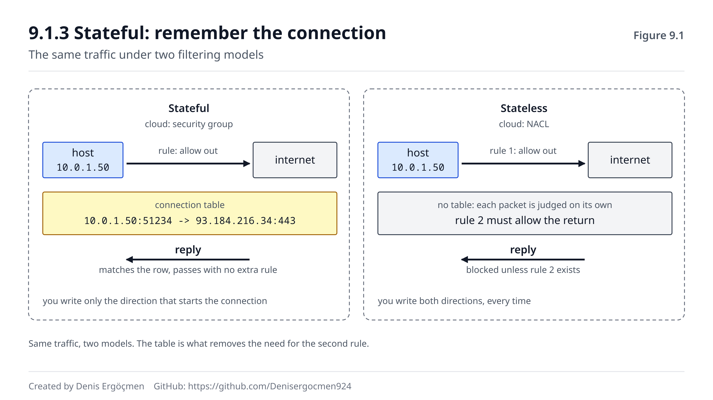

# Faz 9 — Firewall, Filtreleme ve Güvenlik

> **Navigasyon:** [◀ Faz 8 — Uygulama Katmanı: HTTP + TLS](Faz_8_HTTP_ve_TLS.md) · **Faz 9** · [Ara Sınav 3 ▶](Ara_Sinav_3.md)

---

## Nereden geliyoruz

Faz 8'in sonunda şunu sorduk: bir firewall paketini düşürdüyse, **neden sana "reddettim" demedi?**
Sessiz kalmanın ne avantajı var?

Cevabı 9.2.3'te tam olarak göreceksin, ama özü şu: **cevap vermek bilgi vermektir.** Sessiz kalan bir
firewall, karşısındakine "burada bir makine var ama bu port kapalı" bile demez — tarayan kişi, o adreste
bir şey olup olmadığını bile anlayamaz. Bu bir kolaylık değil, kasıtlı bir seçimdir. Ve senin teşhis
hayatını zorlaştıran şey tam olarak budur.

Yanında getirdiklerin:

- **4-tuple ve socket** (1.4.2) — buradaki 5-tuple'ın atası.
- **TCP durum bilgisi** (5.2, 5.6) — stateful firewall'ın hatırladığı şey tam olarak budur.
- **"SYN gidiyor, cevap yok" imzası** (5.2.2) — bu fazın en sık sebebi.
- **NAT'ın çeviri tablosu** (7.1.2) — stateful takip fikrinin aynısı, farklı amaçla.
- **ICMP ve Fragmentation Needed** (4.4.2, 5.7.3) — neden ICMP'yi tamamen kapatamayacağının sebebi.

## Bu fazın sorusu

> *"Şimdiye kadar paketler bir şey **bozuk olduğu için** düştü. Peki hiçbir şey bozuk değilken, paket
> neden düşer?"*

Cevap: çünkü biri öyle istedi. Bir kural yazıldı ve o kural senin paketini kabul etmedi.

Bu faz, ağın **bilinçli reddi** üzerinedir. Ve iki yönü vardır: güvenlik tarafında "neyi içeri almam
gerekir" sorusunu, teşhis tarafında ise "paketimi kim, nerede düşürdü" sorusunu cevaplar. İkincisi,
bulut mühendisliğinde en çok karşılaşacağın arıza sınıfıdır — ve neredeyse her zaman **sessizdir**.

Bu fazın bulut kısmı özellikle önemlidir: **Security Group ile NACL arasındaki fark**, Faz 5'te
öğrendiğin TCP durum bilgisine doğrudan dayanır. Bu bağlantıyı kurduğunda, bulutta en çok yapılan
yapılandırma hatasının sebebini de anlamış olacaksın.

---

## Bu fazın sonunda

- Stateful ile stateless filtrelemenin farkını ve **neden** stateful'un dönen trafiğe kural gerektirmediğini
  anlatabileceksin
- 5-tuple'ın ne olduğunu ve bir firewall kararının hangi alanlara baktığını bileceksin
- Allow/deny sırasının ve varsayılan politikanın (default deny) neden kritik olduğunu açıklayabileceksin
- DROP ile REJECT arasındaki farkı ve **teşhiste ne anlama geldiklerini** ayırt edebileceksin
- "Ping çalışıyor ama uygulama bağlanmıyor" belirtisini saniyeler içinde teşhis edebileceksin
- ICMP'yi tamamen kapatmanın neden bir hata olduğunu — MTU black hole bağlantısıyla — anlatabileceksin
- **Cloud:** Security Group (stateful) ile NACL (stateless) farkını, hangisinde dönen trafiğe kural
  yazman gerektiğini ve **neden** gerektiğini net biçimde açıklayabileceksin
- Katmanlı savunma ve en az yetki reflekslerini kendi kurallarına uygulayabileceksin

---

## Faz haritası

| Bölüm | Konu | Derinlik | Neden burada |
|---|---|---|---|
| 9.1 | Stateful vs stateless | `[mekanizma]` | **Fazın kalbi** — hatırlamak ya da hatırlamamak |
| 9.2 | Packet filtering ve 5-tuple | `[kavram]` | Karar nasıl veriliyor |
| 9.3 | ICMP politikası | `[kavram]` | Kapatmanın bedeli |
| 9.4 | Cloud: SG vs NACL | `[kavram]` | Bulutta en çok yapılan hata |
| 9.5 | Güvenlik refleksleri | `[kavram]` | Kural yazarken düşünülecekler |
| 9.6 | Bu faz bozulunca | — | Sessiz düşüşün imzaları |

> **Bu fazda nasıl çalışmalı:** Bu fazın komutları çoğunlukla 🟢'dir (`sudo ufw status`,
> `sudo iptables -L -n` — sadece okur), ama kural **eklemek** 🟡'dir ve dikkatli olmalısın: uzak bir
> makinede yanlış bir kural yazarsan **kendi SSH bağlantını kesebilirsin** ve geri dönemezsin. Altın
> kural: uzak makinede firewall kuralı değiştirmeden önce ikinci bir oturum aç ve onu kapatma — bir şey
> ters giderse o oturumdan düzeltirsin. Bu fazda teori, komut ezberinden daha önemlidir: özellikle
> 9.1'deki stateful/stateless ayrımını tam oturtmadan 9.4'e geçme, çünkü bulut kısmı doğrudan onun
> üstüne kurulu.

---
---

# 9.1 Stateful vs Stateless

## 9.1.1 Sorunun kaynağı: trafik çift yönlüdür `[mekanizma]`

Şunu düşün: sunucun internete `curl https://example.com` yapıyor. Giden paketin izin verilmesi kolay —
"çıkışa izin ver" dersin.

Ama **cevap geri gelecek.** Ve o cevap, senin açından **dışarıdan gelen bir pakettir**. Eğer firewall'un
"dışarıdan gelen her şeyi engelle" diyorsa, kendi isteğinin cevabını da engeller.

İki çözüm vardır ve bu fazın tamamı bu ikisinin farkı üzerine kuruludur.

## 9.1.2 Stateless: her paket yalnız `[mekanizma]`

**Stateless** (durumsuz) firewall, her paketi **tek başına** değerlendirir. Geçmişi hatırlamaz, hangi
bağlantının parçası olduğunu bilmez. Elindeki tek şey, o anki paketin başlıklarıdır.

Sonuç: **dönen trafiğe ayrıca kural yazman gerekir.**

```
Kural 1 (giden):  10.0.1.50 → herhangi:443   ALLOW
Kural 2 (gelen):  herhangi:443 → 10.0.1.50   ALLOW    ← bunu yazmazsan cevap içeri giremez
```

Ve ikinci kuralda bir incelik var: dönen paketin **hedef portu** 443 değil, senin **ephemeral kaynak
portundur** (1.4.1). Yani gerçek kural şöyle olmalıdır:

```
Kural 2 (gelen): herhangi:443 → 10.0.1.50:32768-60999   ALLOW
```

Ephemeral port aralığının tamamını açman gerekir, çünkü hangi portu kullanacağını önceden bilemezsin.
Bu, stateless filtrelemenin doğal zayıflığıdır: **kaçınılmaz olarak gereğinden geniş kurallar yazarsın.**

## 9.1.3 Stateful: bağlantıyı hatırla `[mekanizma]`

**Stateful** (durumlu) firewall bir **bağlantı takip tablosu** tutar — Faz 7'deki NAT tablosuyla
(7.1.2) aynı fikir, farklı amaç. İçeriden bir bağlantı başlatıldığında bir satır oluşturur:

| Kaynak | Hedef | Protokol | Durum |
|---|---|---|---|
| 10.0.1.50:51234 | 93.184.216.34:443 | TCP | ESTABLISHED |

Cevap geldiğinde firewall tabloya bakar: *"Bu paket, benim izin verdiğim bir bağlantının parçası."* Ve
**hiçbir ek kural gerekmeden** geçirir.

Yani:

> **Stateful firewall'da sadece bağlantının başlatıldığı yönü yazarsın. Dönen trafik otomatik geçer.**

Bunu yapabilmesinin sebebi, Faz 5'te öğrendiğin TCP durum bilgisidir: SYN bir bağlantının **başlangıcı**,
SYN-ACK cevabı, ACK ise kuruluşudur (5.2.1). Firewall bu bayrakları okuyup bağlantının hangi aşamada
olduğunu bilir. UDP'de durum bilgisi olmadığı için (5.1.1) firewall'lar yapay bir zaman aşımı tutar:
bir süre trafik görmezse satırı siler.

Ve buradan iki pratik sonuç çıkar:

1. **Tablonun kapasitesi vardır** — çok sayıda eşzamanlı bağlantı onu doldurabilir (7.2.1 ile aynı sınır).
2. **Satırların zaman aşımı vardır** — uzun süre boşta kalan bir bağlantının kaydı silinir ve sonraki
   paket reddedilir. Faz 5.6.1'deki "boştaki SSH oturumunun ölmesi" sorununun ikinci sebebi budur.

| | **Stateless** | **Stateful** |
|---|---|---|
| Hatırlar mı | ❌ | ✅ (bağlantı tablosu) |
| Dönen trafiğe kural | **Gerekir** | Gerekmez |
| Kural sayısı | Daha çok, daha geniş | Daha az, daha dar |
| Kaynak kullanımı | Düşük | Tablo için bellek gerekir |
| Bulut karşılığı | **NACL** | **Security Group** |

Son satırı aklında tut — 9.4'ün tamamı o iki hücrenin farkı üzerine kurulu.



Şekilde üstteki akış stateful, alttaki stateless davranışı gösterir. Stateful tarafında ortadaki tablo
kutusu, dönen paketin **kural kontrolüne hiç girmeden** eşleştiğini; stateless tarafında ise dönen
paketin ikinci bir kural listesinden geçmek zorunda olduğunu izler.

> **🤔 Düşün 9.1** — Bir sunucuda stateless bir firewall var ve kural şu: "giden 443'e izin, gelen her
> şey engelli." Sunucu `curl https://example.com` çalıştırıyor. (a) Ne olur? (b) Çalışması için hangi
> kuralı eklemelisin — port numarasına dikkat et. (c) Aynı senaryo stateful bir firewall'da olsaydı ne
> değişirdi?
>
> *(Cevap: fazın sonunda)*

---
---

# 9.2 Packet Filtering ve 5-Tuple

## 9.2.1 Karar hangi alanlara bakar `[kavram]`

Bir firewall kuralı, paketin başlığındaki beş alana bakarak karar verir. Buna **5-tuple** denir:

| Alan | Hangi katmandan | Örnek |
|---|---|---|
| Kaynak IP | L3 (Faz 1, 4) | 10.0.1.50 |
| Hedef IP | L3 | 10.0.2.20 |
| Kaynak port | L4 (Faz 1.4, 5) | 51234 |
| Hedef port | L4 | 5432 |
| Protokol | L3/L4 | TCP |

Bu, Faz 1.4.2'de öğrendiğin **4-tuple**'ın protokol eklenmiş hâlidir — yani aslında çoktan biliyorsun.

Tipik bir kural şöyle okunur:

```
ALLOW  TCP  kaynak 10.0.1.0/24  →  hedef 10.0.2.20  port 5432
       └── "app subnet'inden veritabanına Postgres bağlantısına izin ver"
```

Kaynak alanına bir **CIDR bloğu** yazılabildiğine dikkat et (Faz 2) — kurallar tek tek adreslerle değil,
aralıklarla yazılır. Bulutta bu daha da ileri gider: kaynak olarak başka bir **security group** yazabilirsin
(9.4.1).

## 9.2.2 Sıra ve varsayılan politika `[kavram]`

İki kural, bir firewall'ın davranışını tamamen belirler:

**1. Kurallar sırayla değerlendirilir ve genellikle ilk eşleşen kazanır.** Bu yüzden geniş bir DENY
kuralını dar bir ALLOW kuralının **üstüne** koyarsan, ALLOW hiç çalışmaz. Kural sırası bir detay değil,
mantığın kendisidir.

**2. Hiçbir kural eşleşmezse, varsayılan politika uygulanır.** Ve doğru varsayılan **daima DENY**'dır:

> **Default deny:** *"Açıkça izin verilmeyen her şey yasaktır."*

Bunun alternatifi (default allow) şu anlama gelir: *"Aklıma gelen her tehlikeyi tek tek engelledim."*
Aklına gelmeyen tek bir şey, tüm politikayı geçersiz kılar. Bu yüzden ciddi hiçbir sistem default allow
ile kurulmaz. AWS'te security group'lar zaten bu modelle gelir: gelen trafik için **hiçbir şeye izin
yoktur**, sen ekleyene kadar.

## 9.2.3 DROP ve REJECT: sessizlik bir seçimdir `[uygulama]`

Firewall bir paketi istemediğinde iki şey yapabilir — ve Faz 8'in kapanış sorusunun cevabı burada:

**DROP** — paketi **sessizce** çöpe atar. Hiçbir cevap yok.
Gönderen tarafta belirti: **timeout.** İstemci cevabı bekler, bekler, ve süre dolar (5.2.2).

**REJECT** — paketi reddeder **ve söyler**: TCP için RST, veya ICMP "port unreachable" gönderir.
Gönderen tarafta belirti: **anında hata** — "connection refused" (5.2.2).

Neden DROP tercih edilir? Çünkü **cevap vermek bilgi vermektir.** Bir saldırgan binlerce adresi
tarıyorsa, REJECT alan her adres ona *"burada bir makine var"* der. DROP alan adresler ise sessizdir —
orada makine mi var, yoksa adres boş mu, ayırt edilemez. Tarama yavaşlar ve belirsizleşir.

Bedeli ise **senin teşhis hayatındır**: dışarıdan bakıldığında "firewall engelledi" ile "makine yok" ile
"route yok" aynı görünür. Hepsi timeout verir.

Ve buradan bu fazın en pratik kuralı çıkar:

> **Timeout = büyük ihtimalle firewall (DROP). Connection refused = firewall değil, servis dinlemiyor.**

Bunu Faz 5.2.2'deki tabloyla birleştir: cevap **hiç gelmiyorsa** ağ/güvenlik tarafına, **RST geliyorsa**
uygulama tarafına bakarsın. Tek bir gözlem, iki farklı ekibi ayırır.

> **🔧 Makinende gör** 🟢 — yerel firewall kurallarını oku
>
> ```
> $ sudo ufw status verbose
> Status: active
> Default: deny (incoming), allow (outgoing), disabled (routed)
>          └── default deny: doğru varsayılan (9.2.2)
> To                         Action      From
> --                         ------      ----
> 22/tcp                     ALLOW IN    Anywhere
> 443/tcp                    ALLOW IN    Anywhere
>
> $ sudo iptables -L -n -v | head -12
> Chain INPUT (policy DROP 0 packets, 0 bytes)
>  pkts bytes target  prot opt source        destination
>  1847  142K ACCEPT  all  --  0.0.0.0/0     0.0.0.0/0    ctstate RELATED,ESTABLISHED
>     4   240 ACCEPT  tcp  --  0.0.0.0/0     0.0.0.0/0    tcp dpt:22
> ```
>
> `ufw` okuması kolay bir ön yüzdür; `iptables -L -n -v` altta ne olduğunu gösterir. İkinci çıktıda iki
> şeye dikkat et: **`policy DROP`** varsayılan politikadır (9.2.2), ve ilk satırdaki
> **`ctstate RELATED,ESTABLISHED`** stateful takibin ta kendisidir (9.1.3) — "zaten kurulu bir
> bağlantının parçası olan paketleri geçir" demektir. Bu tek satır olmasa, dönen hiçbir trafik içeri
> giremezdi. `pkts` sütunu kuralın kaç kez eşleştiğini söyler; bir kuralın çalışıp çalışmadığını
> anlamanın en hızlı yolu budur.

> **⚠️ Yaygın yanılgı: "Ping çalışıyorsa bağlantı sorunu yok."**
>
> Hayır — ve bu, bu fazın en sık karşılaşacağın yanılgısıdır. `ping` **ICMP** kullanır; uygulaman
> **TCP** kullanır ve belirli bir **porta** gider (9.2.1). Firewall kuralları protokol ve port bazlıdır:
> ICMP'ye izin verip TCP 5432'yi engellemek gayet mümkündür ve çok yaygındır. "Ping çalışıyor ama
> uygulama bağlanmıyor" cümlesi, neredeyse her zaman **eksik bir port kuralı** demektir. Doğru test
> ping değil, gerçek protokol ve porttur: `curl -v telnet://host:5432` veya `nc -zv host 5432` ya da
> `ss`/`tcpdump` ile bakmak. Ping bir erişilebilirlik testidir, **izin testi değil** (4.4.2'de de aynı
> uyarıyı görmüştün).

> **🤔 Düşün 9.2** — Uygulama sunucusundan veritabanına bağlanılamıyor. `ping db.internal` çalışıyor,
> `nc -zv db.internal 5432` 30 saniye bekleyip timeout veriyor. (a) Teşhisin ne? (b) Timeout yerine
> "connection refused" alsaydın teşhis nasıl değişirdi? (c) Bu iki durumda hangi ekibi ararsın?
>
> *(Cevap: fazın sonunda)*

---
---

# 9.3 ICMP Politikası

## 9.3.1 "Güvenlik için ICMP'yi kapattık" `[kavram]`

Bu cümleyi sahada çok duyacaksın ve çoğu zaman yanlış uygulanmış olacak.

ICMP'yi tamamen engellemenin gerekçesi şudur: ping'e cevap veren bir makine, tarayanlara varlığını
duyurur (9.2.3 mantığı). Bu gerekçe **makuldür** — ama çözüm "tüm ICMP'yi kapat" değildir.

Çünkü ICMP sadece ping değildir. Faz 4.4.2'de gördüğün mesaj tiplerini hatırla: Destination Unreachable,
Time Exceeded, ve en kritiği **Fragmentation Needed (tip 3, kod 4)**.

O son mesajı engellersen ne olur? Faz 5.7.3'ün tamamı: **MTU black hole.** Path MTU keşfi çalışamaz,
büyük paketler sessizce kaybolur, ve belirti *"küçük paketler geçiyor, büyük paketler geçmiyor"* olur.
VPN kurduğunda (7.4.2) bu sorun neredeyse kaçınılmaz hâle gelir.

Doğru politika şudur:

| ICMP tipi | Ne yapmalı | Neden |
|---|---|---|
| Echo Request (ping, tip 8) | Dışarıdan **engellenebilir**, iç ağda açık tut | Teşhis için değerli, dışarı bilgi verir |
| Echo Reply (tip 0) | Giden ping'lerinin cevabı — açık olmalı | Yoksa kendi ping'in çalışmaz |
| **Fragmentation Needed (3/4)** | **DAİMA AÇIK** | Path MTU keşfi buna bağlı (5.7.3) |
| Time Exceeded (tip 11) | Açık tutmak faydalı | `traceroute`/`mtr` buna dayanır (4.5.1) |
| Destination Unreachable (diğer) | Açık tutmak faydalı | Hızlı hata bildirimi |

Tek cümlelik kural:

> **Ping'i kısıtlayabilirsin, ama Fragmentation Needed'ı asla engelleme.**

> **💡 Cloud bağlantısı — AWS'te ICMP tuzağı:** Security group'larda ICMP'ye izin vermek **ayrı bir
> kural** gerektirir; "tüm trafiğe izin ver" dışında hiçbir TCP/UDP kuralı ICMP'yi kapsamaz. Bu yüzden
> "instance'a ping atamıyorum ama SSH çalışıyor" çok yaygın bir durumdur ve genelde **arıza değildir** —
> sadece ICMP kuralı yoktur. Asıl tehlikeli olan şudur: bir VPN veya Transit Gateway üzerinden geçen
> trafikte ICMP tip 3 kod 4 engellenirse, MTU black hole oluşur (7.4.2) ve belirti tamamen farklı bir
> yere işaret eder ("veritabanı sorguları donuyor"). Bu yüzden VPC'ler arası ve VPN trafiğinde SG/NACL
> kurallarına **ICMP Destination Unreachable**'ı eklemek standart bir uygulamadır. Teşhis tarafında ise
> şunu bil: AWS'te bir paketin neden düştüğünü doğrudan sana söyleyen bir mesaj yoktur — bunu
> **VPC Flow Logs**'tan okursun (Faz 10.4), REJECT satırı olarak.

---
---

# 9.4 Cloud: Security Group vs NACL

Bu bölüm, bulut ağında en çok yapılan yapılandırma hatasının kaynağıdır. 9.1'i anladıysan bu bölüm
kendiliğinden yerine oturacak.

## 9.4.1 İki katman, iki davranış `[kavram]`

AWS'te bir pakete **iki** filtre uygulanır ve ikisi temelden farklı çalışır:

| | **Security Group (SG)** | **Network ACL (NACL)** |
|---|---|---|
| Nerede uygulanır | **ENI** (instance'ın ağ arayüzü) | **Subnet** sınırı |
| Davranış | **Stateful** | **Stateless** |
| Dönen trafiğe kural | **Gerekmez** | **Gerekir** |
| Kural tipleri | Sadece ALLOW | ALLOW **ve** DENY |
| Değerlendirme | Tüm kurallar birlikte (sıra yok) | **Numara sırasına göre**, ilk eşleşen kazanır |
| Varsayılan | Gelen: hiçbir şey; giden: her şey | Varsayılan NACL: her şeye izin |
| Kaynak olarak | CIDR **veya başka bir SG** | Sadece CIDR |

En kritik iki satır kalın olanlardır. Ve sebebi artık biliyorsun:

- **SG stateful'dur** (9.1.3) — bağlantı tablosu tutar. `443`'e gelen isteğe izin verdiysen, cevabın
  ephemeral porttan dönmesi için **ayrıca bir şey yapmana gerek yoktur.**
- **NACL stateless'tır** (9.1.2) — her paketi tek tek değerlendirir. Gelen isteğe izin versen bile,
  **dönen cevap için ayrı bir giden kuralı** yazmalısın.

Ve NACL'de o giden kuralın port aralığı, hizmetin portu değil **ephemeral aralıktır** (1.4.1):

```
NACL Inbound  100: ALLOW TCP 443 from 0.0.0.0/0          ← istek geliyor
NACL Outbound 100: ALLOW TCP 1024-65535 to 0.0.0.0/0     ← cevap dönüyor (ephemeral!)
                                └── bunu unutursan bağlantı kurulur ama cevap çıkamaz
```

Bu, bulutta en sık yapılan NACL hatasıdır: gelen kuralı yazılır, giden ephemeral kuralı unutulur, ve
sonuç *"bağlantı kuruluyor gibi ama hiçbir şey dönmüyor"* olur.

SG'nin ikinci özel yeteneği de şudur: **kaynak olarak başka bir SG yazabilirsin.** Örneğin veritabanı
SG'sine "kaynak = app-sg" dersin; artık hangi IP'den geldiği önemli değildir, o SG'ye sahip her instance
geçer. Instance'lar ölüp yeniden doğduğunda ve IP'leri değiştiğinde kural bozulmaz — bulutta tercih
edilen yaklaşım budur.

## 9.4.2 Hangisi ne zaman `[kavram]`

Pratikte kullanım şöyledir:

- **SG = asıl aracın.** Günlük erişim kontrolünü burada yaparsın: hangi servis kimden bağlantı kabul
  eder. İnce taneli, okunabilir ve stateful olduğu için hata yapma riski düşüktür.
- **NACL = kaba bir ek katman.** Tüm subnet için geniş kurallar: bir IP bloğunu tamamen engellemek gibi.
  DENY yazabilen tek katman odur (SG'de DENY yoktur) — bu yüzden "şu adres aralığını kesinlikle
  istemiyorum" ihtiyacında NACL kullanılır.

Bir paket bir instance'a ulaşmak için **her ikisinden de** geçmek zorundadır. İkisinden biri engellerse
paket düşer — ve ikisi de sessizce düşürür (9.2.3), yani belirti **timeout**'tur.

Ve bu yüzden bulutta bir "bağlanamıyorum" sorununda kontrol listesi şudur:

1. **Route table** — yol var mı (Faz 4.2, 7.3.1)
2. **NACL** — hem gelen hem **giden** kural (stateless!)
3. **SG** — hedef instance'ın SG'si ve gerekiyorsa kaynağınki
4. **İşletim sistemi firewall'u** — instance'ın kendi `ufw`/`iptables`'ı (bulut kuralları geçse bile bu
   engelleyebilir)
5. **Servis dinliyor mu** — `ss -tulpn`, ve `0.0.0.0` mı yoksa sadece `127.0.0.1` mi (1.4.2)

Beşinci maddeyi atlama: bulut kurallarını saatlerce didiklenirken sorunun aslında servisin sadece
localhost'u dinlemesi olduğu, sık yaşanan bir hikâyedir.

> **🤔 Düşün 9.3** — Bir subnet'te NACL kuralları şöyle: Inbound `ALLOW TCP 443 from 0.0.0.0/0`,
> Outbound `ALLOW TCP 443 to 0.0.0.0/0`. SG ise 443'e izin veriyor. Dışarıdan HTTPS istekleri geliyor
> ama hiçbiri cevap alamıyor. (a) Sorun ne? (b) Neden SG'de aynı sorun yok? (c) Doğru NACL outbound
> kuralı ne olmalı?
>
> *(Cevap: fazın sonunda)*

---
---

# 9.5 Güvenlik Refleksleri

Bu bölüm komut değil, **alışkanlık** öğretir. Kural yazarken aklından geçmesi gerekenler.

## 9.5.1 En az yetki `[kavram]`

Her kuralı yazarken sor: **"Bu kadar geniş olmak zorunda mı?"**

```
❌  ALLOW TCP 0-65535 from 0.0.0.0/0      "her şey, herkesten"
🟡  ALLOW TCP 5432    from 0.0.0.0/0      "sadece Postgres, ama herkesten"
✅  ALLOW TCP 5432    from app-sg         "sadece Postgres, sadece uygulama katmanından"
```

Üçü de "çalışır". Ama ilki, tek bir açık kapıyı tüm internete açar; sonuncusu, bir instance ele
geçirilse bile saldırganın yanal hareketini sınırlar.

Özellikle iki kalıptan kaçın: **`0.0.0.0/0` ile SSH (22)** açmak — bunun yerine bir bastion, VPN veya
SSM Session Manager kullan (Faz 7 S5) — ve **veritabanı portlarını internete** açmak.

## 9.5.2 Katmanlı savunma `[kavram]`

Tek bir katmana güvenme. Bulutta bir pakete uygulanan katmanlar: route table → NACL → SG → OS firewall →
uygulamanın kendi yetkilendirmesi. Her biri bağımsızdır.

Bunun pratik anlamı: **NAT'ın arkasında olmak seni korumaz** (7.1.2 kutusu), **private subnet'te olmak
seni korumaz** (aynı VPC'deki başka bir instance hâlâ erişebilir), ve **SG doğru ayarlandı diye uygulama
kimlik doğrulamasını atlayamazsın.** Her katman kendi işini yapar.

## 9.5.3 Değişiklik yaparken kendini kilitleme `[uygulama]`

Çok pratik bir refleks: uzak bir makinede firewall kuralı değiştirirken **kendi erişimini kesebilirsin**.
Ve o makineye başka türlü giremiyorsan, geri dönüşü yoktur.

Üç korunma yöntemi:

1. **İkinci bir oturum açık tut.** Değişikliği bir oturumdan yap, diğerini kapatma. Bağlantın koparsa
   diğerinden düzeltirsin.
2. **Önce SSH kuralını yaz, sonra default deny'ı aç.** Sırayı ters yaparsan kendini dışarıda bırakırsın.
3. **Geri alma planı hazırla.** Bulutta bu kolaydır (konsoldan kuralı geri al); fiziksel bir makinede
   zorlayıcı olabilir.

> **🔧 Makinende gör** 🟡 — güvenli bir kural deneyi
>
> ```
> $ sudo ufw status numbered
> Status: active
>      To          Action      From
>      --          ------      ----
> [ 1] 22/tcp      ALLOW IN    Anywhere
>
> $ sudo ufw allow 8080/tcp          # 🟡 yeni kural ekle
> Rule added
>
> $ sudo ufw status numbered | grep 8080
> [ 2] 8080/tcp    ALLOW IN    Anywhere
>
> $ sudo ufw delete 2                # geri al
> ```
>
> *(Geri alma: `sudo ufw delete <numara>` — numarayı `ufw status numbered` ile öğren. Kuralı silmeden
> önce numaraları tekrar listele, çünkü bir kural silinince sonrakilerin numarası kayar.)*
> Bu deneyi **kendi yerel makinende** yap, uzak sunucuda değil. Ve 22 numaralı kuralı asla silme — o
> senin geri dönüş yolun. Denemeden önce 9.5.3'teki üç korunmayı bir kez daha oku.

> **🤔 Düşün 9.4** — Bir ekip, tüm instance'ların SG'sine `ALLOW TCP 0-65535 from 0.0.0.0/0` yazmış ve
> "nasıl olsa private subnet'teler, internetten erişilemiyor" diyor. (a) Bu mantık nerede hatalı?
> (b) Somut bir saldırı senaryosu tarif et. (c) Doğru yapılandırma nasıl olurdu?
>
> *(Cevap: fazın sonunda)*

---
---

# 9.6 Bu Faz Bozulunca — Sessiz Düşüşün İmzaları

Bu fazın arızalarının hepsi aynı ortak özelliği taşır: **firewall sana hiçbir şey söylemez.** DROP
edilen bir paket iz bırakmaz, mesaj üretmez, log'a (senin görebildiğin bir log'a) yazmaz. Bu yüzden
teşhis, belirtiden geriye çalışmakla yapılır.

| Belirti | Muhtemel sebep | Doğrula | İlgili bölüm |
|---|---|---|---|
| Bağlantı **timeout** veriyor | Firewall **DROP** ediyor (SG/NACL/OS) | `tcpdump` ile SYN'i izle, Flow Logs | 9.2.3 |
| **Connection refused** | Firewall değil — servis dinlemiyor | `ss -tulpn` (hedefte) | 9.2.3 |
| Ping ✓ ama uygulama ✗ | **Port kuralı eksik** (ICMP açık, TCP kapalı) | `nc -zv host <port>` | 9.2.3 kutusu |
| Bağlantı kuruluyor ama cevap gelmiyor | **NACL outbound ephemeral** kuralı eksik | NACL giden kuralları | 9.4.1 |
| Giden trafik çalışmıyor (stateless FW) | Dönüş kuralı yazılmamış | Gelen kural + ephemeral aralık | 9.1.2 |
| Bir süre sonra bağlantı kopuyor | **Bağlantı tablosu zaman aşımı** | Keepalive ekle | 9.1.3, 5.6.1 |
| Yoğunlukta rastgele hatalar | Bağlantı tablosu dolmuş | Eşzamanlı bağlantı sayısı | 9.1.3 |
| Kural yazdım ama çalışmıyor | **Sıra** — üstte geniş bir DENY var | `iptables -L -n -v`, `pkts` sütunu | 9.2.2 |
| Büyük paketler geçmiyor | ICMP 3/4 engelli → **MTU black hole** | `ping -M do -s 1472` | 9.3.1, 5.7.3 |
| Instance'a ping atılamıyor ama SSH ✓ | **Normal** — SG'de ICMP kuralı yok | SG kurallarına bak | 9.3.1 kutusu |
| Bulut kuralları doğru ama yine bağlanılmıyor | **OS firewall'u** veya servis `127.0.0.1` dinliyor | `ufw status`, `ss -tulpn` | 9.4.2 |
| IPv4 ✓ IPv6 ✗ | `::/0` kuralı eksik | SG/NACL IPv6 kuralları | 7.5.2 |

> **Bu tablodan çıkan ders:** Firewall teşhisinin tamamı **tek bir ayrımla** başlar:
> **timeout mu, refused mu?** Timeout, paketin sessizce düşürüldüğünü söyler (9.2.3) — şüphen firewall,
> route veya erişilemeyen bir hosttur. Refused ise paketin hedefe **ulaştığını** ve makinenin cevap
> verdiğini kanıtlar — yani firewall geçilmiştir, sorun servistedir. Bu iki kelime, iki farklı ekibe
> yönlendirir. İkinci refleks: **ping'e güvenme.** ICMP'ye izin verilip TCP portunun kapalı olması son
> derece olağandır; testi daima gerçek protokol ve portla yap (9.2.3 kutusu). Bulutta ise sıralı bir
> liste izle — route table, NACL (**iki yön birden**), SG, OS firewall, servisin dinleme adresi (9.4.2).
> Bu listede en çok atlanan iki madde: NACL'in **giden ephemeral** kuralı ve instance'ın **kendi**
> firewall'u. Ve son olarak, bulutta paketin neden düştüğünü tahmin etmek zorunda değilsin:
> **VPC Flow Logs** ACCEPT/REJECT kaydını tutar ve bir sonraki fazda (10.4) onu okumayı öğreneceksin.

---
---

# Faz 9 — Düşün sorularının cevapları

## Cevap 9.1 — Dönüşü unutmak

(a) **Bağlantı kurulmaz.** Giden SYN paketi çıkar, sunucuya ulaşır, sunucu SYN-ACK gönderir — ama o
cevap **dışarıdan gelen bir paket** olduğu için "gelen her şey engelli" kuralına takılır ve düşürülür.
İstemci cevabı hiç görmez, yeniden dener ve sonunda **timeout** verir (5.2.2, 9.2.3).

(b) Gelen yönde bir kural gerekir, ama dikkat: dönen paketin **hedef portu 443 değildir** — senin
**ephemeral kaynak portundur** (1.4.1). Doğru kural:

```
ALLOW TCP  kaynak <herhangi>:443  →  hedef 10.0.1.50:32768-60999
```

Yani kaynak portu 443, hedef portu ephemeral aralık. Hangi portun kullanılacağını önceden bilemediğin
için **aralığın tamamını** açmak zorundasın — stateless filtrelemenin doğal zayıflığı budur (9.1.2).

(c) Stateful firewall'da **hiçbir şey eklemezdin.** Giden bağlantı kurulduğunda firewall bunu bağlantı
tablosuna yazar; dönen paket geldiğinde tabloda eşleşme bulunur ve paket **kural kontrolüne hiç
girmeden** geçer (9.1.3). Tek satırlık fark: stateful'da yalnızca bağlantının **başlatıldığı yönü**
yazarsın.
**İlgili bölüm:** 9.1.2-9.1.3 · **Devamı:** 9.4.1 (NACL vs SG), Faz 5.2.1 (handshake).

## Cevap 9.2 — Ping izin testi değildir

(a) **Port kuralı eksik** (9.2.3 kutusu). `ping` ICMP kullanır ve ona izin verilmiş; uygulama ise
**TCP 5432**'ye gidiyor ve o engellenmiş. Timeout alman, paketin **sessizce düşürüldüğünü** söyler
(DROP, 9.2.3) — yani araya giren bir firewall var: security group, NACL veya veritabanı makinesinin
kendi `iptables`'ı.

(b) **"Connection refused" alsaydın teşhis tamamen değişirdi.** Refused bir **RST** demektir (5.2.2) ve
RST alabilmen için paketin hedef makineye **ulaşmış** olması gerekir — yani firewall'lar geçilmiştir.
Sorun ağda değil: veritabanı servisi **çalışmıyor**, yanlış portu dinliyor, ya da sadece `127.0.0.1`'e
bağlanmış (1.4.2). Kontrol: hedefte `ss -tulpn | grep 5432`.

(c) **Timeout → ağ/güvenlik ekibi** (veya bulutta SG/NACL sahibi): kural eksik. **Refused → uygulama /
veritabanı ekibi**: servis ayakta değil veya yanlış yapılandırılmış. Bu tek kelimelik fark, doğru ekibi
ilk denemede aramanı sağlar — ve bu fazın en pratik kazanımıdır.
**İlgili bölüm:** 9.2.3 · **Devamı:** Faz 10.3 (teşhis akışı), Faz 10.4 (Flow Logs).

## Cevap 9.3 — Unutulan ephemeral aralık

(a) **NACL'in outbound kuralı yanlış porta yazılmış.** Dışarıdan gelen HTTPS isteğinin **hedef** portu
443'tür — o kısım doğru. Ama sunucunun **cevabı**, kaynak port 443'ten istemcinin **ephemeral portuna**
gider (1.4.1). Outbound kuralı sadece "port 443'e" izin verdiği için, hedef portu 51234 olan cevap
paketleri **eşleşmez ve düşürülür**. Sonuç: bağlantı kurulmaya çalışılır, hiçbir cevap dönmez, istemci
timeout alır.

(b) Çünkü **SG stateful'dur** (9.1.3, 9.4.1). Gelen 443 isteğine izin verdiğinde bağlantıyı tablosuna
yazar; cevap paketi geldiğinde "bu, izin verdiğim bir bağlantının parçası" der ve giden kurallara hiç
bakmadan geçirir. NACL ise **stateless'tır** — her paketi tek tek, hafızasız değerlendirir (9.1.2) ve
cevabın kendi başına kurallara uyması gerekir.

(c) Doğrusu, cevabın gideceği **ephemeral aralığı** açmaktır:

```
NACL Outbound 100: ALLOW TCP 1024-65535 to 0.0.0.0/0
```

(AWS'in önerdiği aralık 1024–65535'tir; Linux'un kendi varsayılanı 32768–60999'dur ama istemciler
farklı sistemlerden geldiği için geniş aralık kullanılır, 1.4.1.) Bu, NACL kullanmanın bedelidir:
stateless olduğu için kaçınılmaz biçimde geniş kurallar yazarsın — ve tam olarak bu yüzden asıl erişim
kontrolü SG'de yapılır, NACL kaba bir ek katman olarak kalır (9.4.2).
**İlgili bölüm:** 9.4.1 · **Devamı:** Faz 10.4 (Flow Logs ile doğrulama), Faz 11.5 (SG/NACL eşlemesi).

## Cevap 9.4 — "Private subnet" bir güvenlik duvarı değildir

(a) Mantık, **tek bir katmana güvenmektir** (9.5.2) ve iki hatası var. Birincisi: private subnet olmak,
**internetten** gelen bağlantıyı engeller (7.3.2) — ama **VPC içinden** gelen bağlantıyı engellemez.
Aynı VPC'deki her instance, bu instance'lara **tüm portlardan** erişebilir. İkincisi: private subnet'teki
makineler **dışarı çıkabilir** (NAT Gateway üzerinden, 7.3.3), yani ele geçirilmiş bir makine komuta
sunucusuna bağlanabilir ve NAT bunu hiç engellemez (7.1.2 kutusu).

(b) Senaryo: public subnet'teki bir web sunucusu (veya bastion) bir uygulama açığıyla ele geçiriliyor.
Saldırgan artık **VPC'nin içindedir**. SG'ler "her şeye izin" olduğu için, oradan tüm private
instance'ların tüm portlarına serbestçe erişebilir: veritabanına doğrudan bağlanır, iç servisleri
tarar, yanal hareket eder. Doğru SG'lerle bu hareket **her adımda** engellenirdi — web sunucusunun SG'si
veritabanına erişemezdi.

(c) **En az yetki** (9.5.1) ile katman katman: veritabanı SG'si yalnızca `ALLOW TCP 5432 from app-sg`;
uygulama SG'si yalnızca `ALLOW TCP 8080 from alb-sg`; ALB SG'si yalnızca `ALLOW TCP 443 from 0.0.0.0/0`.
Kaynak olarak **SG referansı** kullanmak burada iki kat değerlidir (9.4.1): IP'ler değişse de kural
bozulmaz, ve erişim yetkisi makinenin **rolüne** bağlanmış olur. Yönetim erişimi için 22 numaralı portu
internete açmak yerine SSM Session Manager veya bastion kullanılır (9.5.1).
**İlgili bölüm:** 9.5.1-9.5.2 · **Devamı:** Faz 11.5 (SG tasarımı), Faz 7.3 (private subnet).

---
---

# Faz 9 — Sık sorulan sorular

**S1 — DROP mu REJECT mi kullanmalıyım?** Dışa bakan yüzeyde **DROP** (bilgi vermez, taramayı yavaşlatır,
9.2.3). İç ağda ise **REJECT** genelde daha iyidir: uygulamalar 30 saniye timeout beklemek yerine anında
hata alır ve teşhis çok kolaylaşır. Bulut SG ve NACL'leri her zaman DROP gibi davranır — REJECT seçeneği
yoktur.

**S2 — SG'de neden DENY kuralı yok?** Çünkü SG **default deny** ile çalışır (9.2.2): yazmadığın her şey
zaten yasaktır, dolayısıyla DENY'a ihtiyaç kalmaz ve kural mantığı basitleşir (sıra da önemsizleşir —
tüm kurallar birlikte değerlendirilir). Belirli bir kaynağı açıkça engellemek gerekiyorsa **NACL**
kullanılır; DENY yazabilen tek katman odur (9.4.2).

**S3 — SG ve NACL'in ikisi de varsa hangisi kazanır?** İkisi de uygulanır ve **her ikisinden de geçmek**
gerekir. Biri engellerse paket düşer. Sıralama: gelen trafikte önce NACL (subnet sınırı), sonra SG (ENI);
giden trafikte tersi (9.4.1).

**S4 — Bir kural yazdım ama çalışmıyor, nereye bakarım?** Üç şey: (i) **Sıra** — üstte geniş bir DENY
kuralı olabilir (9.2.2); `iptables -L -n -v` çıktısındaki **`pkts`** sütunu kuralın hiç eşleşmediğini
gösterir. (ii) **Yön** — stateless bir katmandaysan dönüş kuralını unutmuş olabilirsin (9.1.2, 9.4.1).
(iii) **Yanlış katman** — bulut kuralları doğru ama instance'ın kendi `ufw`'si engelliyor olabilir
(9.4.2).

**S5 — Neden ping'e izin verip TCP'yi engellemek bu kadar yaygın?** Çünkü ikisi **farklı protokoldür**
(9.2.1) ve kurallar protokol bazlı yazılır. ICMP'ye izin vermek zararsız kabul edilir (iç ağda teşhis
için faydalıdır), ama TCP portları tek tek açılır. Bu yüzden "ping çalışıyor" hiçbir zaman "uygulama
bağlanabilir" anlamına gelmez.

**S6 — Tüm ICMP'yi kapatmak neden tehlikeli?** Çünkü ICMP sadece ping değildir. **Fragmentation Needed
(tip 3 kod 4)** mesajını engellersen path MTU keşfi çalışmaz ve **MTU black hole** oluşur (9.3.1,
5.7.3): küçük paketler geçer, büyük paketler sessizce kaybolur. VPN/tünel arkasında bu neredeyse
kaçınılmazdır (7.4.2).

**S7 — Firewall kuralları bağlantı hızını etkiler mi?** Kural sayısı çok yüksek olmadığı sürece ihmal
edilebilir. Ama stateful bir firewall'da asıl sınır **bağlantı tablosunun kapasitesidir** (9.1.3): tablo
dolduğunda yeni bağlantılar kurulamaz ve belirti "yoğunlukta rastgele hatalar" olur (7.2.1 ile aynı
sınıf sorun). Bu, hız değil **eşzamanlılık** sınırıdır.

---
---

# Faz 9 — Kendini sına

Cevaplarını bir kâğıda yaz, sonra cevap anahtarıyla karşılaştır. Hedef: 18 sorudan 14+.

## Bölüm A — Tanım ve mekanizma

1. Stateful ile stateless firewall arasındaki temel fark nedir?
2. Stateless bir firewall'da giden bir HTTPS bağlantısı için kaç kural gerekir? Portlarını yaz.
3. Stateful firewall neyi hatırlar? Bu bilgiyi hangi fazdan biliyorsun?
4. 5-tuple hangi beş alandan oluşur?
5. "Default deny" ne demek ve neden doğru varsayılan?
6. DROP ile REJECT arasındaki fark nedir? Her birinin istemci tarafındaki belirtisi ne?
7. Hangi ICMP tipi asla engellenmemeli ve neden?
8. SG ile NACL'in üç farkını yaz.

## Bölüm B — Uygula ve teşhis et

9. Bağlantı timeout veriyor. İlk şüphen ne?
10. "Connection refused" alıyorsun. Firewall şüphesi mantıklı mı — neden?
11. Ping çalışıyor ama uygulama bağlanmıyor. Teşhis ve doğrulama komutu?
12. NACL'de gelen 443'e izin verdin, bağlantı kuruluyor ama cevap gelmiyor. Eksik olan ne?
13. Bulutta "bağlanamıyorum" sorununda kontrol edeceğin beş şeyi sırayla yaz.
14. Yazdığın bir `iptables` kuralının hiç çalışmadığını nasıl anlarsın?

## Bölüm C — Muhakeme ve bağlantı

15. Firewall neden REJECT yerine DROP tercih eder? Bunun sana maliyeti ne?
16. NACL'de dönen trafik için neden ephemeral port aralığını açmak zorundasın? SG'de neden değil?
17. "Private subnet'teyiz, SG'yi geniş bıraksak da olur" cümlesindeki iki hatayı açıkla.
18. Tüm ICMP'yi kapatan bir firewall, hangi tamamen alakasız görünen arızaya yol açar? Zinciri anlat.

---

## Cevap anahtarı

1. **Stateful** bağlantı durumunu **hatırlar** (bağlantı tablosu) ve dönen trafiği otomatik geçirir;
   **stateless** her paketi tek başına değerlendirir, hafızası yoktur (9.1.2-9.1.3). — 2. **İki kural:**
   giden `→ hedef:443`, gelen `kaynak:443 → kendi ephemeral portun (32768-60999)`. Dönen paketin hedef
   portu 443 **değildir** (9.1.2). — 3. Açık bağlantıları: kaynak/hedef IP+port, protokol ve **TCP
   durumu**. Bu bilgi Faz 5'ten gelir — SYN/SYN-ACK/ACK bayrakları bağlantının aşamasını söyler (5.2.1,
   9.1.3). — 4. Kaynak IP, hedef IP, kaynak port, hedef port, protokol (9.2.1). — 5. "Açıkça izin
   verilmeyen her şey yasaktır." Doğrudur çünkü alternatifi, **aklına gelen her tehlikeyi** tek tek
   engellemeyi gerektirir ve aklına gelmeyen tek şey politikayı geçersiz kılar (9.2.2). — 6. **DROP**
   sessizce atar → istemcide **timeout**. **REJECT** cevap verir (RST/ICMP) → istemcide **connection
   refused** (9.2.3). — 7. **Fragmentation Needed (tip 3, kod 4)** — path MTU keşfi buna dayanır;
   engellenirse **MTU black hole** oluşur (9.3.1, 5.7.3). — 8. (i) SG **stateful**, NACL **stateless**;
   (ii) SG ENI'ye, NACL **subnet**'e uygulanır; (iii) SG'de sadece ALLOW var, NACL'de ALLOW **ve** DENY;
   (ayrıca SG'de kaynak olarak başka bir SG yazılabilir) (9.4.1).

9. **Firewall'un paketi sessizce düşürmesi (DROP)** — veya route yokluğu/erişilemeyen host. Ortak
   noktaları: hiçbir cevap dönmüyor (9.2.3). — 10. **Hayır, mantıklı değil.** Refused bir **RST**
   demektir; RST alabilmen için paketin hedefe **ulaşmış** olması gerekir — yani firewall geçilmiştir.
   Sorun servistedir: dinlemiyor veya yanlış arayüze bağlanmış (9.2.3, 1.4.2). — 11. **Eksik port
   kuralı**; ping ICMP, uygulama TCP'dir ve kurallar protokol bazlıdır. Doğrulama: **`nc -zv host
   <port>`** (veya `curl -v telnet://host:port`) (9.2.3 kutusu). — 12. **NACL outbound ephemeral kuralı**
   — cevap, kaynak 443'ten istemcinin ephemeral portuna gider; `ALLOW TCP 1024-65535 to 0.0.0.0/0`
   gerekir (9.4.1). — 13. (1) Route table, (2) NACL **iki yön**, (3) SG, (4) OS firewall'u, (5) servis
   dinliyor mu ve hangi adreste (`ss -tulpn`) (9.4.2). — 14. **`iptables -L -n -v`** çıktısındaki
   **`pkts`** sütunu **0** kalıyorsa kural hiç eşleşmiyordur — büyük ihtimalle üstte daha geniş bir kural
   var (9.2.2, 9.2.3 kutusu).

15. Çünkü **cevap vermek bilgi vermektir**: REJECT alan bir tarayıcı "burada bir makine var" bilgisini
    kazanır; DROP alan ise makine mi var, adres boş mu ayırt edemez — tarama yavaşlar ve belirsizleşir
    (9.2.3). **Maliyeti**: teşhis zorlaşır — dışarıdan bakıldığında "firewall engelledi", "host yok" ve
    "route yok" tamamen aynı görünür (hepsi timeout). — 16. Çünkü **NACL stateless'tır** (9.1.2): dönen
    paketi bağımsız olarak değerlendirir ve o paketin **hedef portu** sunucunun portu değil, istemcinin
    **ephemeral portudur** (1.4.1) — hangisi olacağını bilemediğin için aralığın tamamını açarsın. SG
    ise **stateful'dur**: bağlantıyı tablosunda tutar ve dönen paketi kurallara hiç bakmadan geçirir
    (9.1.3, 9.4.1). — 17. (i) Private subnet **internetten** gelen bağlantıyı engeller, **VPC içinden**
    gelen bağlantıyı engellemez — aynı VPC'deki her instance tüm portlara erişebilir (7.3.2). (ii)
    Private subnet'teki makineler NAT üzerinden **dışarı çıkabilir**, yani ele geçirilmiş bir makine
    engellenmez (7.1.2). Tek katmana güvenmek hatadır (9.5.2). — 18. **MTU black hole** (9.3.1): ICMP
    Fragmentation Needed engellenir → yoldaki bir cihaz büyük paketi düşürür ama göndericiye
    söyleyemez → gönderici aynı boyutta yeniden dener → paketler sessizce kaybolur. Belirti hiç firewall
    gibi görünmez: *"SSH bağlanıyor ama donuyor"*, *"veritabanı sorguları takılıyor"*, *"site açılıyor
    ama resimler gelmiyor"* (5.7.3, 7.4.2).

## Puanlama

| Doğru sayısı | Ne anlama geliyor |
|---|---|
| 16-18 | Filtreleme sende oturdu — özellikle stateful/stateless ayrımı. Faz 10'a hazırsın. |
| 13-15 | İyi. 9.4'ü bir kez daha oku; bulutta en çok o ayrım hata yaptırır. |
| 9-12 | Timeout/refused ayrımını ve NACL dönüş kuralını tekrar et. |
| 0-8 | Fazı yeniden gez. Hedef: "timeout" duyunca firewall, "refused" duyunca servis demek. |

Kaçırdığın soru → dönmen gereken bölüm:

| Soru | Bölüm |
|---|---|
| 1, 2, 3, 16 | 9.1 Stateful vs stateless |
| 4, 5, 14 | 9.2.1-9.2.2 Filtreleme ve sıra |
| 6, 9, 10, 11, 15 | 9.2.3 DROP vs REJECT |
| 7, 18 | 9.3 ICMP politikası |
| 8, 12, 13 | 9.4 SG vs NACL |
| 17 | 9.5 Güvenlik refleksleri |

---
---

# Faz 9 — Kapanış ve Faz 10'a Köprü

## Bu fazdan ne taşıyorsun

Faz 9 sana **bilinçli reddi** öğretti. Stateful ile stateless filtrelemenin farkını — birinin
hatırladığını, diğerinin her paketi yalnız değerlendirdiğini — ve bu farkın neden dönüş kuralı
gerektirdiğini anladın. 5-tuple ile karar verildiğini, sıranın ve default deny'ın neden kritik olduğunu
gördün. DROP ile REJECT arasındaki farkın **teşhisin en hızlı ayrımı** olduğunu edindin. ICMP'yi
tamamen kapatmanın MTU black hole'a çıkan zincirini kurdun. Ve bulutta SG ile NACL arasındaki farkın,
Faz 5'teki TCP durum bilgisine dayandığını gördün.

En kalıcı üç cümle: **"timeout firewall, refused servis"**, **"ping bir izin testi değildir"** ve
**"NACL'de dönüş kuralını unutma."**

## Faz 10 bunun neresine bağlanıyor

On faz boyunca her bölümün sonunda bir **"Bu faz bozulunca"** tablosu gördün. Adres arızaları, subnet
hataları, ARP sorunları, route eksikleri, MTU black hole, DNS cache'i, NAT tablosu, 502/504, sessiz
DROP'lar.

Şimdi bunların hepsi **dağınık** duruyor. On ayrı tablo, onlarca belirti.

Gerçek mühendis farkı, bu tabloları ezberlemekte değil — **hangi sırayla bakacağını bilmekte.** Bir
kullanıcı "çalışmıyor" dediğinde, elinde otuz ihtimal var ve hepsini tek tek denemeye zamanın yok.

Faz 10 bunun cevabıdır: katman katman teşhis metodolojisi. Aşağıdan yukarı disiplinli bir sıra (link →
IP → route → DNS → port → uygulama), her aracın hangi katmana baktığı, üç içgüdüsel sorunun karar
ağaçları, ve bulutta **VPC Flow Logs** ile paketin neden düştüğünü **tahmin etmek yerine okumak.**

Bu fazdan sonra elinde bir liste değil, bir **refleks** olacak.

> **🤔 Faz çıktısı — kendine sor:** Bir kullanıcı "site açılmıyor" diyor. Elinde `ping`, `dig`, `ss`,
> `curl`, `tcpdump`, `mtr`, `ip route` var. Hepsini çalıştırmak 10 dakika sürer ve çıktıları
> birbirine karışır. **Hangisiyle başlamalısın — ve neden o?** (İpucu: doğru araç, en çok bilgi veren
> değil; **en çok ihtimali eleyen** araçtır.)
>
> **🧪 Lab 9 fikri (1–3 🟢, 4–5 🟡):** (1) `sudo ufw status verbose` ve `sudo iptables -L -n -v` ile
> kendi makinendeki kuralları oku; `ctstate RELATED,ESTABLISHED` satırını bul (9.2.3 kutusu). (2) Kapalı
> bir porta bağlan (`nc -zv localhost 9999`) ve **refused**'ı gör. (3) Filtrelenen bir adrese bağlan
> ve **timeout**'u gör; iki belirtiyi yan yana yaşa (9.2.3). (4) 🟡 Yerel makinende `sudo ufw allow
> 8080/tcp` ile bir kural ekle, `ufw status numbered` ile gör, sonra `sudo ufw delete <numara>` ile
> geri al *(Geri alma: kural numarasını silmeden önce tekrar listele — numaralar kayar.)* (5) 🟡 Bir
> terminalde `python3 -m http.server 8080` çalıştır, başka bir makineden bağlanmayı dene; kural varken
> ve yokken belirtinin nasıl değiştiğini gör *(Geri alma: sunucuyu Ctrl+C ile durdur, kuralı sil.)*

---

> **Navigasyon:** [◀ Faz 8 — Uygulama Katmanı: HTTP + TLS](Faz_8_HTTP_ve_TLS.md) · **Faz 9** · [Ara Sınav 3 ▶](Ara_Sinav_3.md)
